# Multi-Tenant Architecture Diagrams
---

## Table of Contents
1. [Tenant Isolation Overview](#tenant-isolation-overview)
2. [Schema-Per-Tenant Pattern](#schema-per-tenant-pattern)
3. [Tenant Data Flow](#tenant-data-flow)
4. [Phoenix Project Isolation](#phoenix-project-isolation)
5. [Memory Isolation](#memory-isolation)
6. [Deployment Patterns](#deployment-patterns)

---

## Tenant Isolation Overview

### Multi-Tenant System Architecture

```mermaid
flowchart TB
    subgraph "Tenant A - acme_corp"
        TenantA["<span style='color:#000'>Tenant: acme_corp</span>"]
        ConfigA["<span style='color:#000'>SystemConfig<br/>tenant_id=acme_corp</span>"]
        SchemaA["<span style='color:#000'>Vespa Schemas<br/>video_*_acme_corp</span>"]
        PhoenixA["<span style='color:#000'>Phoenix Project<br/>cogniverse-acme_corp-video-search</span>"]
        MemoryA["<span style='color:#000'>Mem0 Memory<br/>user_id=acme_corp_*</span>"]
    end

    subgraph "Tenant B - globex_inc"
        TenantB["<span style='color:#000'>Tenant: globex_inc</span>"]
        ConfigB["<span style='color:#000'>SystemConfig<br/>tenant_id=globex_inc</span>"]
        SchemaB["<span style='color:#000'>Vespa Schemas<br/>video_*_globex_inc</span>"]
        PhoenixB["<span style='color:#000'>Phoenix Project<br/>cogniverse-globex_inc-video-search</span>"]
        MemoryB["<span style='color:#000'>Mem0 Memory<br/>user_id=globex_inc_*</span>"]
    end

    subgraph "Tenant C - default"
        TenantC["<span style='color:#000'>Tenant: default</span>"]
        ConfigC["<span style='color:#000'>SystemConfig<br/>tenant_id=default</span>"]
        SchemaC["<span style='color:#000'>Vespa Schemas<br/>video_*_default</span>"]
        PhoenixC["<span style='color:#000'>Phoenix Project<br/>cogniverse-default-video-search</span>"]
        MemoryC["<span style='color:#000'>Mem0 Memory<br/>user_id=default_*</span>"]
    end

    subgraph "Shared Infrastructure"
        Vespa["<span style='color:#000'>Vespa Instance<br/>Port 8080, 19071</span>"]
        Phoenix["<span style='color:#000'>Phoenix Instance<br/>Port 6006, 4317</span>"]
        Mem0["<span style='color:#000'>Mem0 Backend<br/>Vespa Schema</span>"]
    end

    TenantA --> ConfigA
    ConfigA --> SchemaA
    ConfigA --> PhoenixA
    ConfigA --> MemoryA

    TenantB --> ConfigB
    ConfigB --> SchemaB
    ConfigB --> PhoenixB
    ConfigB --> MemoryB

    TenantC --> ConfigC
    ConfigC --> SchemaC
    ConfigC --> PhoenixC
    ConfigC --> MemoryC

    SchemaA --> Vespa
    SchemaB --> Vespa
    SchemaC --> Vespa

    PhoenixA --> Phoenix
    PhoenixB --> Phoenix
    PhoenixC --> Phoenix

    MemoryA --> Mem0
    MemoryB --> Mem0
    MemoryC --> Mem0

    style TenantA fill:#90caf9,stroke:#1565c0,color:#000
    style ConfigA fill:#b0bec5,stroke:#546e7a,color:#000
    style SchemaA fill:#90caf9,stroke:#1565c0,color:#000
    style PhoenixA fill:#a5d6a7,stroke:#388e3c,color:#000
    style MemoryA fill:#90caf9,stroke:#1565c0,color:#000
    style TenantB fill:#ffcc80,stroke:#ef6c00,color:#000
    style ConfigB fill:#b0bec5,stroke:#546e7a,color:#000
    style SchemaB fill:#ffcc80,stroke:#ef6c00,color:#000
    style PhoenixB fill:#a5d6a7,stroke:#388e3c,color:#000
    style MemoryB fill:#ffcc80,stroke:#ef6c00,color:#000
    style TenantC fill:#ce93d8,stroke:#7b1fa2,color:#000
    style ConfigC fill:#b0bec5,stroke:#546e7a,color:#000
    style SchemaC fill:#ce93d8,stroke:#7b1fa2,color:#000
    style PhoenixC fill:#a5d6a7,stroke:#388e3c,color:#000
    style MemoryC fill:#ce93d8,stroke:#7b1fa2,color:#000
    style Vespa fill:#a5d6a7,stroke:#388e3c,color:#000
    style Phoenix fill:#a5d6a7,stroke:#388e3c,color:#000
    style Mem0 fill:#90caf9,stroke:#1565c0,color:#000
```

### Tenant Isolation Layers (Layered Architecture)

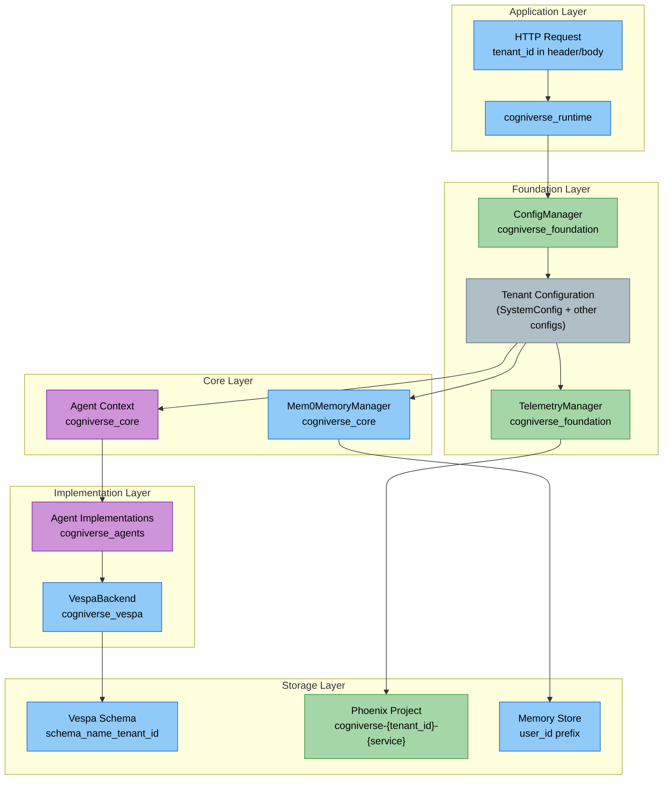

---

## Schema-Per-Tenant Pattern

### Vespa Schema Naming Convention

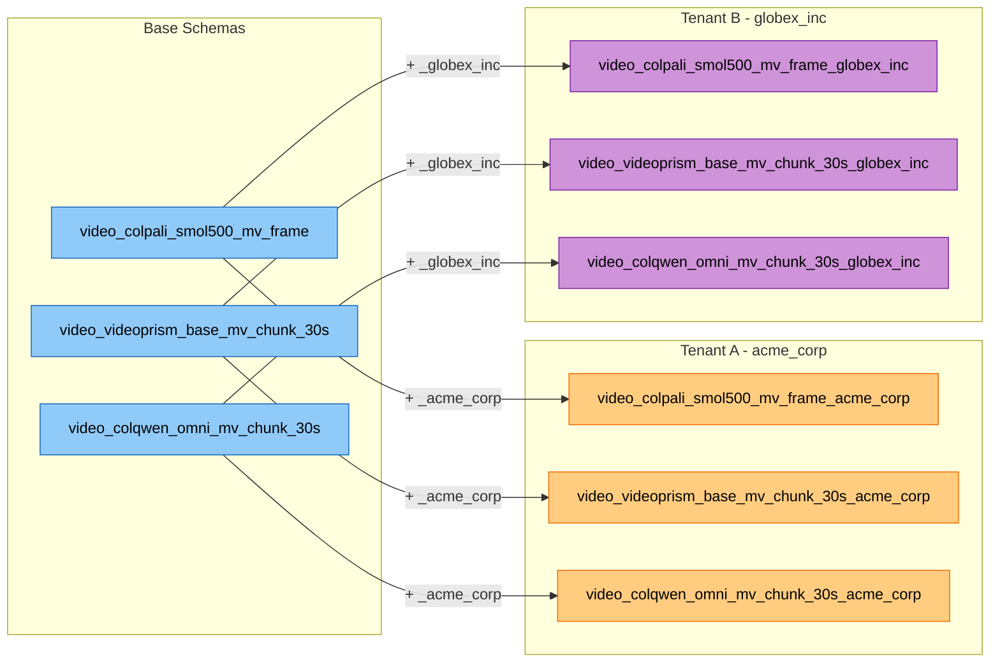

### Schema Deployment Flow (Multi-Tenant)

**Primary Path: Tenant Provisioning**

When an admin creates a tenant via `POST /admin/tenants`, schemas are automatically deployed:

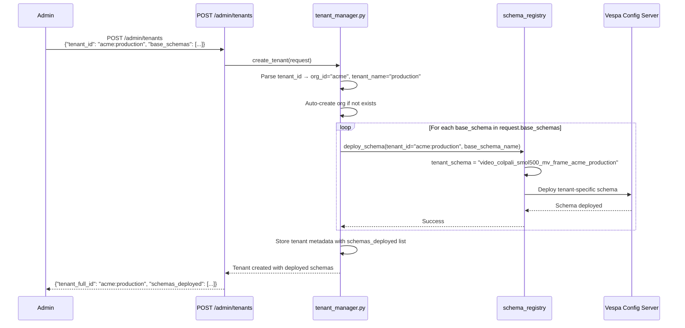

**Helper Script: deploy_all_schemas.py**

The script supports both base schema deployment and tenant-specific deployment:

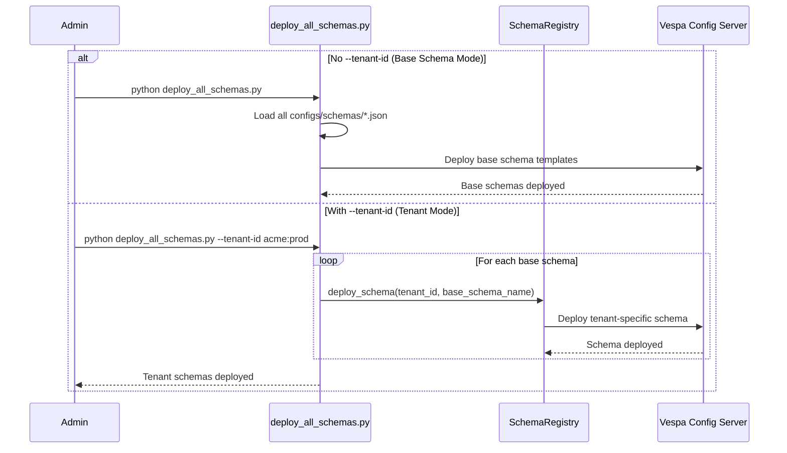

### Schema Isolation in Vespa

```mermaid
flowchart TB
    subgraph "Vespa Instance"
        subgraph "Tenant: acme_corp"
            SchemaA1["<span style='color:#000'>video_colpali_smol500_mv_frame_acme_corp<br/>Documents: 1000</span>"]
            SchemaA2["<span style='color:#000'>video_videoprism_base_mv_chunk_30s_acme_corp<br/>Documents: 500</span>"]
        end

        subgraph "Tenant: globex_inc"
            SchemaB1["<span style='color:#000'>video_colpali_smol500_mv_frame_globex_inc<br/>Documents: 2000</span>"]
            SchemaB2["<span style='color:#000'>video_videoprism_base_mv_chunk_30s_globex_inc<br/>Documents: 800</span>"]
        end

        subgraph "Tenant: default"
            SchemaC1["<span style='color:#000'>video_colpali_smol500_mv_frame_default<br/>Documents: 300</span>"]
            SchemaC2["<span style='color:#000'>video_videoprism_base_mv_chunk_30s_default<br/>Documents: 150</span>"]
        end
    end

    QueryA["<span style='color:#000'>Query from acme_corp</span>"] -->|Targets| SchemaA1
    QueryA -->|Targets| SchemaA2
    QueryA -.->|❌ Cannot access| SchemaB1
    QueryA -.->|❌ Cannot access| SchemaC1

    QueryB["<span style='color:#000'>Query from globex_inc</span>"] -->|Targets| SchemaB1
    QueryB -->|Targets| SchemaB2
    QueryB -.->|❌ Cannot access| SchemaA1
    QueryB -.->|❌ Cannot access| SchemaC1

    style SchemaA1 fill:#90caf9,stroke:#1565c0,color:#000
    style SchemaA2 fill:#90caf9,stroke:#1565c0,color:#000
    style SchemaB1 fill:#ffcc80,stroke:#ef6c00,color:#000
    style SchemaB2 fill:#ffcc80,stroke:#ef6c00,color:#000
    style SchemaC1 fill:#ce93d8,stroke:#7b1fa2,color:#000
    style SchemaC2 fill:#ce93d8,stroke:#7b1fa2,color:#000
    style QueryA fill:#90caf9,stroke:#1565c0,color:#000
    style QueryB fill:#ffcc80,stroke:#ef6c00,color:#000
```

---

## Tenant Data Flow

### Video Ingestion Flow (Tenant-Specific - Layered Architecture)

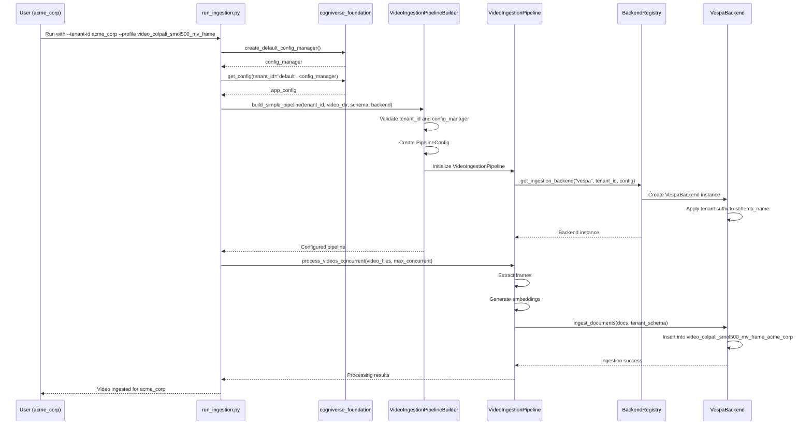

### Search Flow (Tenant-Isolated - Layered Architecture)

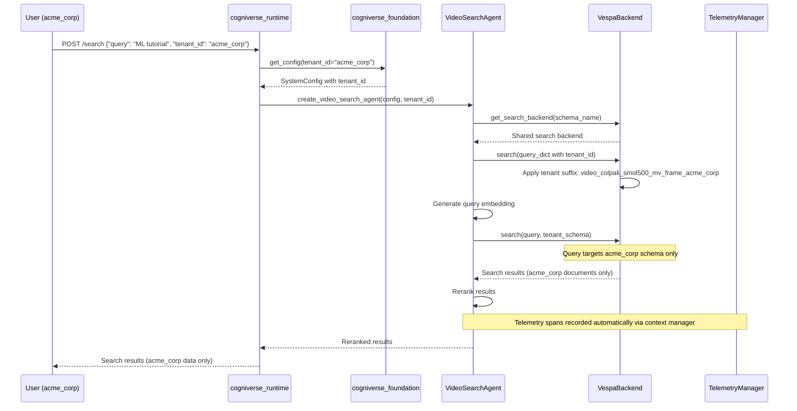

### Cross-Tenant Isolation Verification

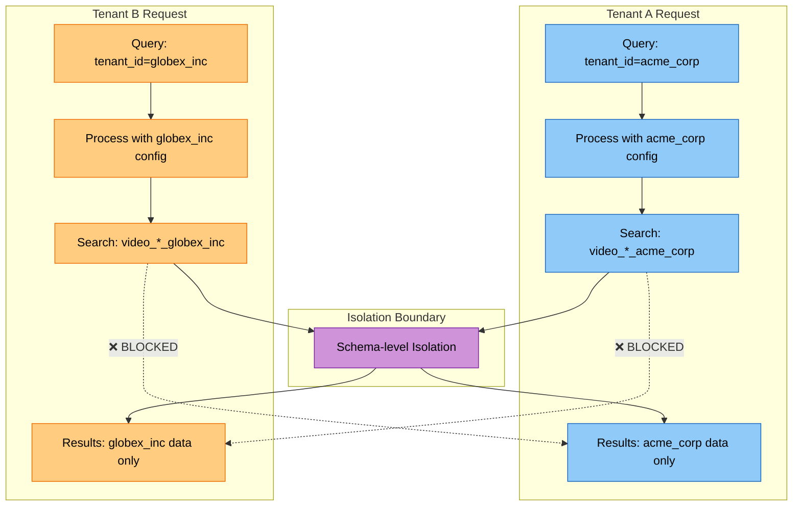

---

## Phoenix Project Isolation

### Per-Tenant Phoenix Projects

```mermaid
flowchart TB
    subgraph "Phoenix Instance (Port 6006)"
        subgraph "Project: cogniverse-acme_corp-video-search"
            SpansA["<span style='color:#000'>Spans<br/>All acme_corp traces</span>"]
            ExperimentsA["<span style='color:#000'>Experiments<br/>acme_corp evaluations</span>"]
            DatasetsA["<span style='color:#000'>Datasets<br/>acme_corp queries</span>"]
        end

        subgraph "Project: cogniverse-globex_inc-video-search"
            SpansB["<span style='color:#000'>Spans<br/>All globex_inc traces</span>"]
            ExperimentsB["<span style='color:#000'>Experiments<br/>globex_inc evaluations</span>"]
            DatasetsB["<span style='color:#000'>Datasets<br/>globex_inc queries</span>"]
        end

        subgraph "Project: cogniverse-default-video-search"
            SpansC["<span style='color:#000'>Spans<br/>All default traces</span>"]
            ExperimentsC["<span style='color:#000'>Experiments<br/>default evaluations</span>"]
            DatasetsC["<span style='color:#000'>Datasets<br/>default queries</span>"]
        end
    end

    TenantA["<span style='color:#000'>Tenant: acme_corp</span>"] --> SpansA
    TenantA --> ExperimentsA
    TenantA --> DatasetsA

    TenantB["<span style='color:#000'>Tenant: globex_inc</span>"] --> SpansB
    TenantB --> ExperimentsB
    TenantB --> DatasetsB

    TenantC["<span style='color:#000'>Tenant: default</span>"] --> SpansC
    TenantC --> ExperimentsC
    TenantC --> DatasetsC

    style TenantA fill:#90caf9,stroke:#1565c0,color:#000
    style TenantB fill:#ffcc80,stroke:#ef6c00,color:#000
    style TenantC fill:#ce93d8,stroke:#7b1fa2,color:#000
    style SpansA fill:#90caf9,stroke:#1565c0,color:#000
    style ExperimentsA fill:#90caf9,stroke:#1565c0,color:#000
    style DatasetsA fill:#90caf9,stroke:#1565c0,color:#000
    style SpansB fill:#ffcc80,stroke:#ef6c00,color:#000
    style ExperimentsB fill:#ffcc80,stroke:#ef6c00,color:#000
    style DatasetsB fill:#ffcc80,stroke:#ef6c00,color:#000
    style SpansC fill:#ce93d8,stroke:#7b1fa2,color:#000
    style ExperimentsC fill:#ce93d8,stroke:#7b1fa2,color:#000
    style DatasetsC fill:#ce93d8,stroke:#7b1fa2,color:#000
```

### Telemetry Flow (Per-Tenant Phoenix Projects)

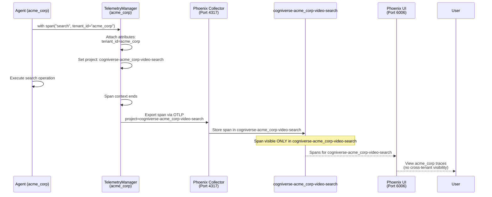

### Phoenix UI Access Pattern

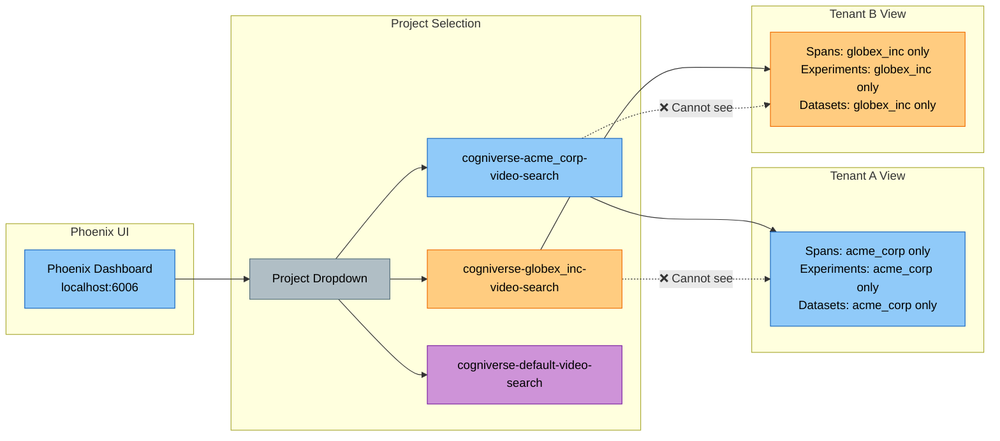

---

## Memory Isolation

### Mem0 Memory Isolation with User ID Prefix

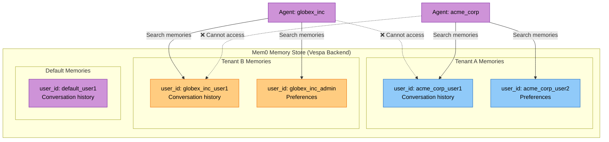

### Memory Manager Flow (Tenant-Aware)

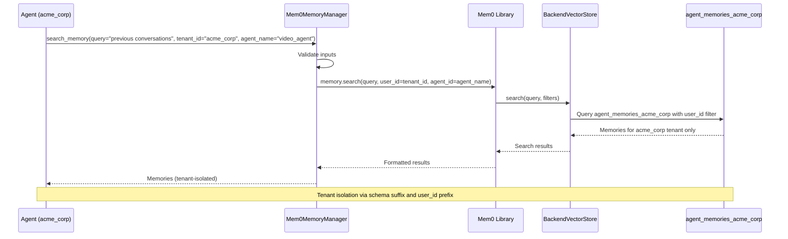

### Memory Schema Naming (Per-Tenant)

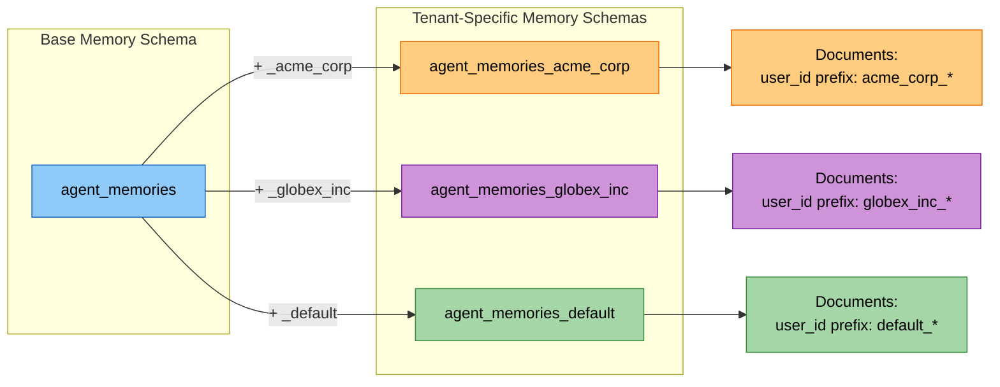

---

## Deployment Patterns

### Single Vespa Instance Multi-Tenant Deployment

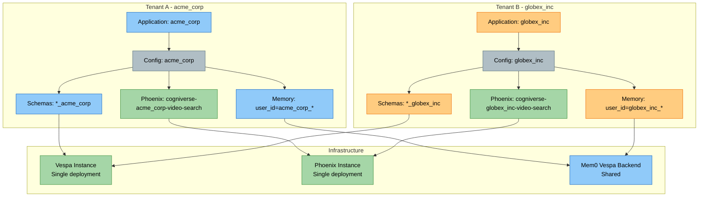

### Tenant Lifecycle Management

### Tenant Deletion/Cleanup Flow

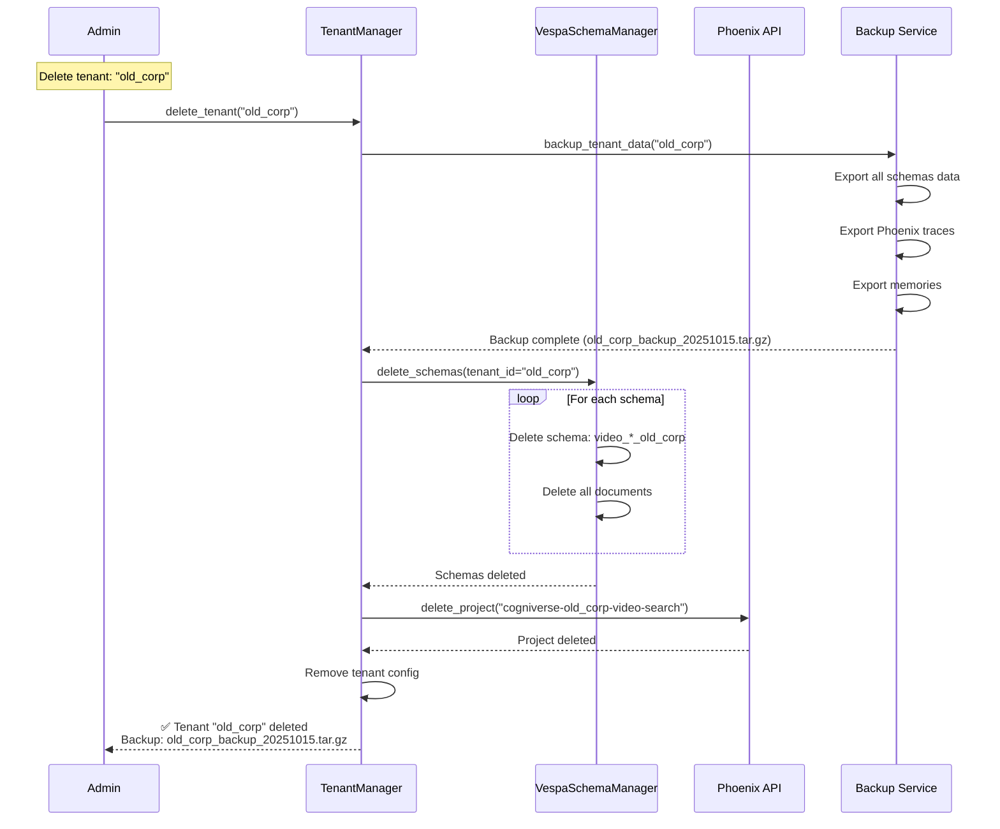

### Multi-Region Deployment (Future)

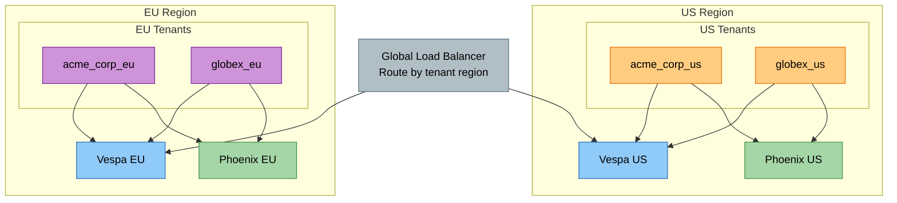

---

## Summary

This diagram collection provides comprehensive visual documentation of multi-tenant architecture across the **layered structure**:

1. **Tenant Isolation**: Complete separation at schema, project, and memory levels across all layers
2. **Schema-Per-Tenant**: Naming convention with `_tenant_id` suffix managed by cogniverse_vespa
3. **Data Flow**: Tenant-specific routing from ingestion to search through layered architecture
4. **Phoenix Projects**: Per-tenant observability via cogniverse_telemetry_phoenix plugin
5. **Memory Isolation**: User ID prefixes and tenant-specific schemas via cogniverse_core
6. **Lifecycle Management**: Tenant creation, deletion, and backup workflows

**Key Principles:**

- **Schema Isolation**: Each tenant has dedicated Vespa schemas (Implementation Layer)

- **Project Isolation**: Each tenant has dedicated Phoenix project (Implementation Layer Plugin)

- **Memory Isolation**: User IDs prefixed with tenant_id (Core Layer)

- **No Cross-Tenant Access**: Firewall at every layer of the layered architecture

- **Shared Infrastructure**: Single Vespa/Phoenix instances serve all tenants

- **Configuration-Driven**: Tenant isolation configured via cogniverse_foundation

**Tenant Naming Conventions:**

- Vespa schemas: `{base_schema}_{tenant_id}` (cogniverse_vespa)

- Phoenix projects: `cogniverse-{tenant_id}-{service}` (cogniverse_telemetry_phoenix)

- Memory user IDs: `{tenant_id}_{user_id}` (cogniverse_core)

**Layered Architecture Integration:**

- **Foundation Layer**: Provides SystemConfig with tenant_id, TelemetryManager base

- **Core Layer**: Manages agent context, memory, and cache with tenant isolation

- **Implementation Layer**: Vespa backend applies tenant suffixes, agents enforce isolation

- **Application Layer**: Runtime and dashboard respect tenant boundaries

**Related Documentation:**

- [Layered Architecture Guide](../architecture/overview.md)

- [Multi-Tenant Architecture](../architecture/multi-tenant.md)

- [Multi-Tenant Operations](../operations/multi-tenant-ops.md)

- [Configuration Guide](../operations/configuration.md)
