# Multi-Tenant Architecture Diagrams
---

## Table of Contents
1. [Tenant Isolation Overview](#tenant-isolation-overview)
2. [Schema-Per-Tenant Pattern](#schema-per-tenant-pattern)
3. [Tenant Data Flow](#tenant-data-flow)
4. [Phoenix Project Isolation](#phoenix-project-isolation)
5. [Memory Isolation](#memory-isolation)
6. [Deployment Patterns](#deployment-patterns)
   - [Federation: Org Trunk + Tenant Overlay](#federation-org-trunk--tenant-overlay)
   - [Cross-Tenant Comparison Flow](#cross-tenant-comparison-flow)

---

## Tenant Isolation Overview

### Multi-Tenant System Architecture

```mermaid
flowchart TB
    subgraph "Tenant A - acme:production"
        TenantA["<span style='color:#000'>Tenant: acme:production</span>"]
        ConfigA["<span style='color:#000'>TenantConfig<br/>tenant_id=acme:production</span>"]
        SchemaA["<span style='color:#000'>Vespa Schemas<br/>video_*_acme_production</span>"]
        PhoenixA["<span style='color:#000'>Phoenix Project<br/>cogniverse-acme:production-video-search</span>"]
        MemoryA["<span style='color:#000'>Mem0 Memory<br/>user_id=acme:production</span>"]
    end

    subgraph "Tenant B - globex:production"
        TenantB["<span style='color:#000'>Tenant: globex:production</span>"]
        ConfigB["<span style='color:#000'>TenantConfig<br/>tenant_id=globex:production</span>"]
        SchemaB["<span style='color:#000'>Vespa Schemas<br/>video_*_globex_production</span>"]
        PhoenixB["<span style='color:#000'>Phoenix Project<br/>cogniverse-globex:production-video-search</span>"]
        MemoryB["<span style='color:#000'>Mem0 Memory<br/>user_id=globex:production</span>"]
    end

    subgraph "Tenant C - acme:staging"
        TenantC["<span style='color:#000'>Tenant: acme:staging</span>"]
        ConfigC["<span style='color:#000'>TenantConfig<br/>tenant_id=acme:staging</span>"]
        SchemaC["<span style='color:#000'>Vespa Schemas<br/>video_*_acme_staging</span>"]
        PhoenixC["<span style='color:#000'>Phoenix Project<br/>cogniverse-acme:staging-video-search</span>"]
        MemoryC["<span style='color:#000'>Mem0 Memory<br/>user_id=acme:staging</span>"]
    end

    subgraph "Shared Infrastructure"
        Vespa["<span style='color:#000'>Vespa Instance<br/>Port 8080, 19071</span>"]
        Phoenix["<span style='color:#000'>Phoenix Instance<br/>Port 6006, 4317</span>"]
        Mem0["<span style='color:#000'>Mem0 Backend<br/>Vespa Schema</span>"]
    end

    TenantA --> ConfigA
    ConfigA --> SchemaA
    ConfigA --> PhoenixA
    ConfigA --> MemoryA

    TenantB --> ConfigB
    ConfigB --> SchemaB
    ConfigB --> PhoenixB
    ConfigB --> MemoryB

    TenantC --> ConfigC
    ConfigC --> SchemaC
    ConfigC --> PhoenixC
    ConfigC --> MemoryC

    SchemaA --> Vespa
    SchemaB --> Vespa
    SchemaC --> Vespa

    PhoenixA --> Phoenix
    PhoenixB --> Phoenix
    PhoenixC --> Phoenix

    MemoryA --> Mem0
    MemoryB --> Mem0
    MemoryC --> Mem0

    style TenantA fill:#90caf9,stroke:#1565c0,color:#000
    style ConfigA fill:#b0bec5,stroke:#546e7a,color:#000
    style SchemaA fill:#90caf9,stroke:#1565c0,color:#000
    style PhoenixA fill:#a5d6a7,stroke:#388e3c,color:#000
    style MemoryA fill:#90caf9,stroke:#1565c0,color:#000
    style TenantB fill:#ffcc80,stroke:#ef6c00,color:#000
    style ConfigB fill:#b0bec5,stroke:#546e7a,color:#000
    style SchemaB fill:#ffcc80,stroke:#ef6c00,color:#000
    style PhoenixB fill:#a5d6a7,stroke:#388e3c,color:#000
    style MemoryB fill:#ffcc80,stroke:#ef6c00,color:#000
    style TenantC fill:#ce93d8,stroke:#7b1fa2,color:#000
    style ConfigC fill:#b0bec5,stroke:#546e7a,color:#000
    style SchemaC fill:#ce93d8,stroke:#7b1fa2,color:#000
    style PhoenixC fill:#a5d6a7,stroke:#388e3c,color:#000
    style MemoryC fill:#ce93d8,stroke:#7b1fa2,color:#000
    style Vespa fill:#a5d6a7,stroke:#388e3c,color:#000
    style Phoenix fill:#a5d6a7,stroke:#388e3c,color:#000
    style Mem0 fill:#90caf9,stroke:#1565c0,color:#000
```

### Tenant Isolation Layers (Layered Architecture)

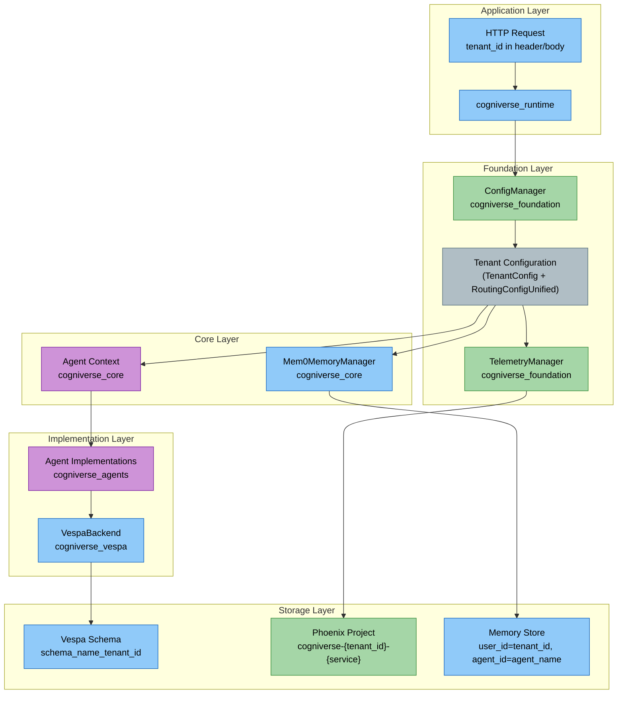
```mermaid
flowchart TB
    subgraph "Application Layer"
        Request["<span style='color:#000'>HTTP Request<br/>tenant_id in header/body</span>"]
        Runtime["<span style='color:#000'>cogniverse_runtime</span>"]
    end

    subgraph "Foundation Layer"
        ConfigMgr["<span style='color:#000'>ConfigManager<br/>cogniverse_foundation</span>"]
        TenantConfig["<span style='color:#000'>Tenant Configuration<br/>(TenantConfig + RoutingConfigUnified)</span>"]
        TelemetryBase["<span style='color:#000'>TelemetryManager<br/>cogniverse_foundation</span>"]
    end

    subgraph "Core Layer"
        Agent["<span style='color:#000'>Agent Context<br/>cogniverse_core</span>"]
        Memory["<span style='color:#000'>Mem0MemoryManager<br/>cogniverse_core</span>"]
    end

    subgraph "Implementation Layer"
        VespaBackend["<span style='color:#000'>VespaBackend<br/>cogniverse_vespa</span>"]
        AgentImpl["<span style='color:#000'>Agent Implementations<br/>cogniverse_agents</span>"]
    end

    subgraph "Storage Layer"
        VespaSchema["<span style='color:#000'>Vespa Schema<br/>schema_name_tenant_id</span>"]
        PhoenixProject["<span style='color:#000'>Phoenix Project<br/>cogniverse-{tenant_id}-{service}</span>"]
        MemoryStore["<span style='color:#000'>Memory Store<br/>user_id=tenant_id, agent_id=agent_name</span>"]
    end

    Request --> Runtime
    Runtime --> ConfigMgr
    ConfigMgr --> TenantConfig
    TenantConfig --> Agent
    TenantConfig --> TelemetryBase
    TenantConfig --> Memory
    Agent --> AgentImpl
    AgentImpl --> VespaBackend
    VespaBackend --> VespaSchema
    TelemetryBase --> PhoenixProject
    Memory --> MemoryStore

    style Request fill:#90caf9,stroke:#1565c0,color:#000
    style Runtime fill:#90caf9,stroke:#1565c0,color:#000
    style ConfigMgr fill:#a5d6a7,stroke:#388e3c,color:#000
    style TenantConfig fill:#b0bec5,stroke:#546e7a,color:#000
    style TelemetryBase fill:#a5d6a7,stroke:#388e3c,color:#000
    style Agent fill:#ce93d8,stroke:#7b1fa2,color:#000
    style Memory fill:#90caf9,stroke:#1565c0,color:#000
    style VespaBackend fill:#90caf9,stroke:#1565c0,color:#000
    style AgentImpl fill:#ce93d8,stroke:#7b1fa2,color:#000
    style VespaSchema fill:#90caf9,stroke:#1565c0,color:#000
    style PhoenixProject fill:#a5d6a7,stroke:#388e3c,color:#000
    style MemoryStore fill:#90caf9,stroke:#1565c0,color:#000
```

---

## Schema-Per-Tenant Pattern

### Vespa Schema Naming Convention

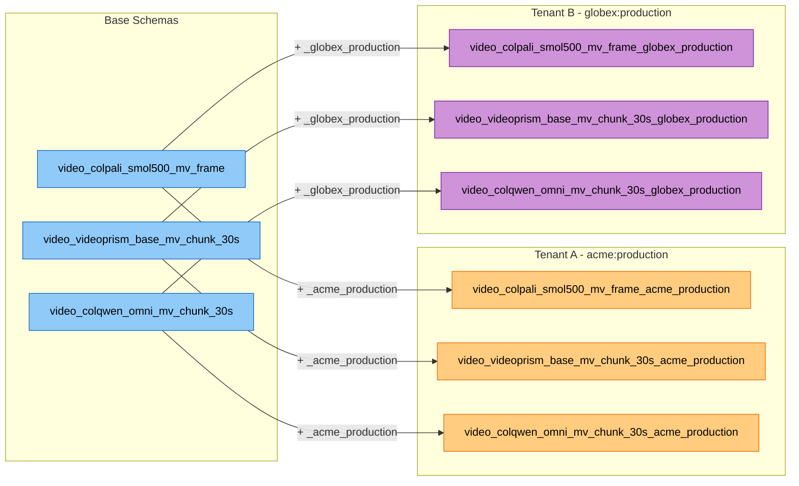
```mermaid
flowchart LR
    subgraph "Base Schemas"
        ColPali["<span style='color:#000'>video_colpali_smol500_mv_frame</span>"]
        VideoPrism["<span style='color:#000'>video_videoprism_base_mv_chunk_30s</span>"]
        ColQwen["<span style='color:#000'>video_colqwen_omni_mv_chunk_30s</span>"]
    end

    subgraph "Tenant A - acme:production"
        ColPaliA["<span style='color:#000'>video_colpali_smol500_mv_frame_acme_production</span>"]
        VideoPrismA["<span style='color:#000'>video_videoprism_base_mv_chunk_30s_acme_production</span>"]
        ColQwenA["<span style='color:#000'>video_colqwen_omni_mv_chunk_30s_acme_production</span>"]
    end

    subgraph "Tenant B - globex:production"
        ColPaliB["<span style='color:#000'>video_colpali_smol500_mv_frame_globex_production</span>"]
        VideoPrismB["<span style='color:#000'>video_videoprism_base_mv_chunk_30s_globex_production</span>"]
        ColQwenB["<span style='color:#000'>video_colqwen_omni_mv_chunk_30s_globex_production</span>"]
    end

    ColPali -->|+ _acme_production| ColPaliA
    VideoPrism -->|+ _acme_production| VideoPrismA
    ColQwen -->|+ _acme_production| ColQwenA

    ColPali -->|+ _globex_production| ColPaliB
    VideoPrism -->|+ _globex_production| VideoPrismB
    ColQwen -->|+ _globex_production| ColQwenB

    style ColPali fill:#90caf9,stroke:#1565c0,color:#000
    style VideoPrism fill:#90caf9,stroke:#1565c0,color:#000
    style ColQwen fill:#90caf9,stroke:#1565c0,color:#000
    style ColPaliA fill:#ffcc80,stroke:#ef6c00,color:#000
    style VideoPrismA fill:#ffcc80,stroke:#ef6c00,color:#000
    style ColQwenA fill:#ffcc80,stroke:#ef6c00,color:#000
    style ColPaliB fill:#ce93d8,stroke:#7b1fa2,color:#000
    style VideoPrismB fill:#ce93d8,stroke:#7b1fa2,color:#000
    style ColQwenB fill:#ce93d8,stroke:#7b1fa2,color:#000
```

`VespaSchemaManager.get_tenant_schema_name(tenant_id, base)` (`libs/vespa/cogniverse_vespa/vespa_schema_manager.py`)
canonicalizes `tenant_id` first (`canonical_tenant_id`) so a bare, single-word tenant_id like `"acme"`
is expanded to `"acme:acme"` before the suffix is derived — its schema suffix is therefore
`_acme_acme`, not `_acme`. Always register tenants in `org:tenant` form (e.g. `acme:production`)
to get single, readable suffixes as shown above.

### Schema Deployment Flow (Multi-Tenant)

**Primary Path: Tenant Provisioning**

When an admin creates a tenant via `POST /admin/tenants`, schemas are automatically deployed:

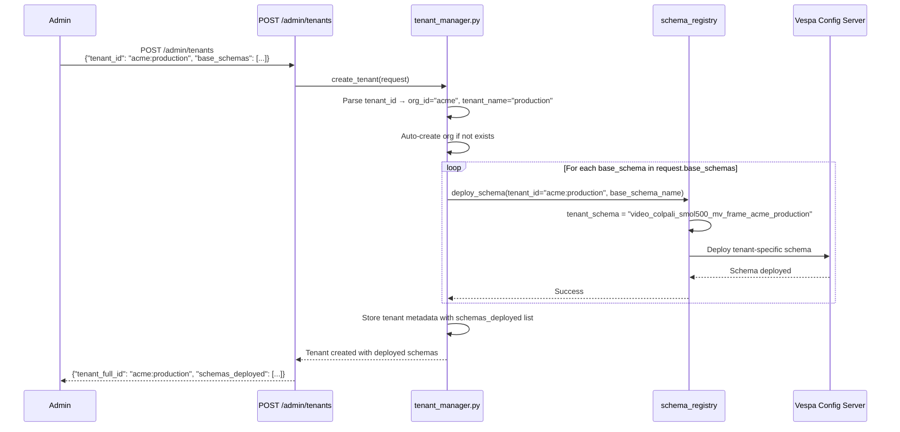
```mermaid
sequenceDiagram
    participant Admin as Admin
    participant API as POST /admin/tenants
    participant TenantMgr as tenant_manager.py
    participant Registry as schema_registry
    participant Vespa as Vespa Config Server

    Admin->>API: POST /admin/tenants<br/>{"tenant_id": "acme:production", "base_schemas": [...]}

    API->>TenantMgr: create_tenant(request)
    TenantMgr->>TenantMgr: Parse tenant_id → org_id="acme", tenant_name="production"
    TenantMgr->>TenantMgr: Auto-create org if not exists

    loop For each base_schema in request.base_schemas
        TenantMgr->>Registry: deploy_schema(tenant_id="acme:production", base_schema_name)
        Registry->>Registry: tenant_schema = "video_colpali_smol500_mv_frame_acme_production"
        Registry->>Vespa: Deploy tenant-specific schema
        Vespa-->>Registry: Schema deployed
        Registry-->>TenantMgr: Success
    end

    TenantMgr->>TenantMgr: Store tenant metadata with schemas_deployed list
    TenantMgr-->>API: Tenant created with deployed schemas
    API-->>Admin: {"tenant_full_id": "acme:production", "schemas_deployed": [...]}
```

**Deployment path: Helm init job (profile schemas only)**

The Helm init job at ``charts/cogniverse/templates/init-jobs.yaml`` (`schema-deployment`
Job) loops `config.tenants` × `initJobs.schemaDeployment.profiles` and calls only
`POST /admin/profiles/{profile}/deploy` — it does **not** call `POST /admin/tenants`,
so it never creates a `tenant_metadata` record; it just ensures each tenant's
data (video/etc.) schema exists. Global metadata schemas (`organization_metadata`,
`tenant_metadata`, `config_metadata`, `adapter_registry`) are deployed by the
runtime itself at startup — unconditionally, on every run, via `main.py` →
`system_backend.schema_manager.upload_metadata_schemas()` — not by this job and
not per-tenant. Before that call, if the initial config-store read fails, an
earlier fresh-install bootstrap deploys the same schemas first through a
registry-less schema manager with schema removal disabled; it proceeds only
when the config server (`_application_exists`) reports NO application package
yet, and raises instead of touching a populated cluster whose read merely
failed. `agent_memories_<tenant>` is **not** deployed by either path —
`Mem0MemoryManager` deploys it lazily on first use for that tenant.

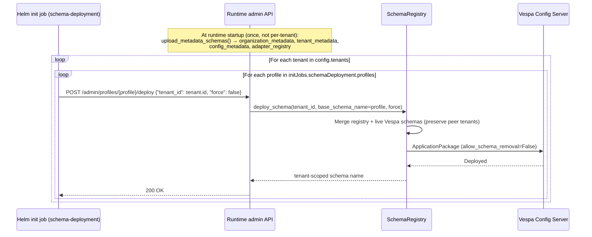
```mermaid
sequenceDiagram
    participant InitJob as Helm init job (schema-deployment)
    participant Runtime as Runtime admin API
    participant Registry as SchemaRegistry
    participant Vespa as Vespa Config Server

    Note over Runtime: At runtime startup (once, not per-tenant):<br/>upload_metadata_schemas() → organization_metadata, tenant_metadata,<br/>config_metadata, adapter_registry

    loop For each tenant in config.tenants
        loop For each profile in initJobs.schemaDeployment.profiles
            InitJob->>Runtime: POST /admin/profiles/{profile}/deploy {"tenant_id": tenant.id, "force": false}
            Runtime->>Registry: deploy_schema(tenant_id, base_schema_name=profile, force)
            Registry->>Registry: Merge registry + live Vespa schemas (preserve peer tenants)
            Registry->>Vespa: ApplicationPackage (allow_schema_removal=False)
            Vespa-->>Registry: Deployed
            Registry-->>Runtime: tenant-scoped schema name
            Runtime-->>InitJob: 200 OK
        end
    end
```

### Schema Isolation in Vespa

```mermaid
flowchart TB
    subgraph "Vespa Instance"
        subgraph "Tenant: acme:production"
            SchemaA1["<span style='color:#000'>video_colpali_smol500_mv_frame_acme_production<br/>Documents: 1000</span>"]
            SchemaA2["<span style='color:#000'>video_videoprism_base_mv_chunk_30s_acme_production<br/>Documents: 500</span>"]
        end

        subgraph "Tenant: globex:production"
            SchemaB1["<span style='color:#000'>video_colpali_smol500_mv_frame_globex_production<br/>Documents: 2000</span>"]
            SchemaB2["<span style='color:#000'>video_videoprism_base_mv_chunk_30s_globex_production<br/>Documents: 800</span>"]
        end

        subgraph "Tenant: acme:staging"
            SchemaC1["<span style='color:#000'>video_colpali_smol500_mv_frame_acme_staging<br/>Documents: 300</span>"]
            SchemaC2["<span style='color:#000'>video_videoprism_base_mv_chunk_30s_acme_staging<br/>Documents: 150</span>"]
        end
    end

    QueryA["<span style='color:#000'>Query from acme:production</span>"] -->|Targets| SchemaA1
    QueryA -->|Targets| SchemaA2
    QueryA -.->|❌ Cannot access| SchemaB1
    QueryA -.->|❌ Cannot access| SchemaC1

    QueryB["<span style='color:#000'>Query from globex:production</span>"] -->|Targets| SchemaB1
    QueryB -->|Targets| SchemaB2
    QueryB -.->|❌ Cannot access| SchemaA1
    QueryB -.->|❌ Cannot access| SchemaC1

    style SchemaA1 fill:#90caf9,stroke:#1565c0,color:#000
    style SchemaA2 fill:#90caf9,stroke:#1565c0,color:#000
    style SchemaB1 fill:#ffcc80,stroke:#ef6c00,color:#000
    style SchemaB2 fill:#ffcc80,stroke:#ef6c00,color:#000
    style SchemaC1 fill:#ce93d8,stroke:#7b1fa2,color:#000
    style SchemaC2 fill:#ce93d8,stroke:#7b1fa2,color:#000
    style QueryA fill:#90caf9,stroke:#1565c0,color:#000
    style QueryB fill:#ffcc80,stroke:#ef6c00,color:#000
```

---

## Tenant Data Flow

### Video Ingestion Flow (Tenant-Specific - Layered Architecture)

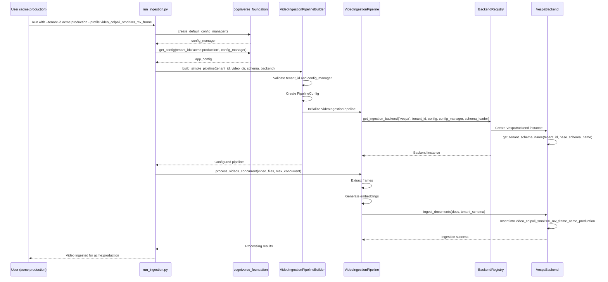
```mermaid
sequenceDiagram
    participant User as User (acme:production)
    participant Script as run_ingestion.py
    participant Foundation as cogniverse_foundation
    participant Builder as VideoIngestionPipelineBuilder
    participant Pipeline as VideoIngestionPipeline
    participant Registry as BackendRegistry
    participant Vespa as VespaBackend

    User->>Script: Run with --tenant-id acme:production --profile video_colpali_smol500_mv_frame

    Script->>Foundation: create_default_config_manager()
    Foundation-->>Script: config_manager

    Script->>Foundation: get_config(tenant_id="acme:production", config_manager)
    Foundation-->>Script: app_config

    Script->>Builder: build_simple_pipeline(tenant_id, video_dir, schema, backend)
    Builder->>Builder: Validate tenant_id and config_manager
    Builder->>Builder: Create PipelineConfig
    Builder->>Pipeline: Initialize VideoIngestionPipeline
    Pipeline->>Registry: get_ingestion_backend("vespa", tenant_id, config, config_manager, schema_loader)
    Registry->>Vespa: Create VespaBackend instance
    Vespa->>Vespa: get_tenant_schema_name(tenant_id, base_schema_name)
    Registry-->>Pipeline: Backend instance
    Builder-->>Script: Configured pipeline

    Script->>Pipeline: process_videos_concurrent(video_files, max_concurrent)
    Pipeline->>Pipeline: Extract frames
    Pipeline->>Pipeline: Generate embeddings
    Pipeline->>Vespa: ingest_documents(docs, tenant_schema)
    Vespa->>Vespa: Insert into video_colpali_smol500_mv_frame_acme_production
    Vespa-->>Pipeline: Ingestion success

    Pipeline-->>Script: Processing results
    Script-->>User: Video ingested for acme:production
```

### Search Flow (Tenant-Isolated - Layered Architecture)

```mermaid
sequenceDiagram
    participant User as User (acme:production)
    participant Runtime as cogniverse_runtime
    participant Foundation as cogniverse_foundation
    participant Agent as VideoSearchAgent
    participant Registry as BackendRegistry
    participant Backend as VespaBackend
    participant Telemetry as TelemetryManager

    User->>Runtime: POST /search {"query": "ML tutorial", "tenant_id": "acme:production"}

    Runtime->>Foundation: get_config(tenant_id="acme:production", config_manager)
    Foundation-->>Runtime: ConfigUtils (tenant-scoped config wrapper)

    Runtime->>Agent: create_video_search_agent(config, tenant_id)
    Agent->>Registry: get_search_backend("vespa", config, config_manager, schema_loader)
    Note over Registry: Search backends are shared across all tenants;<br/>isolation happens via tenant_id in query_dict at search() time
    Registry-->>Agent: Shared VespaBackend instance
    Agent->>Agent: Generate query embedding
    Agent->>Backend: search(query_dict with tenant_id)
    Backend->>Backend: get_tenant_schema_name(tenant_id, base) →<br/>video_colpali_smol500_mv_frame_acme_production
    Note over Backend: Query targets acme:production schema only
    Backend-->>Agent: Search results (acme:production documents only)

    Agent->>Agent: Rerank results

    Note over Agent,Telemetry: Telemetry spans recorded automatically via context manager

    Agent-->>Runtime: Reranked results
    Runtime-->>User: Search results (acme:production data only)
```

### Cross-Tenant Isolation Verification

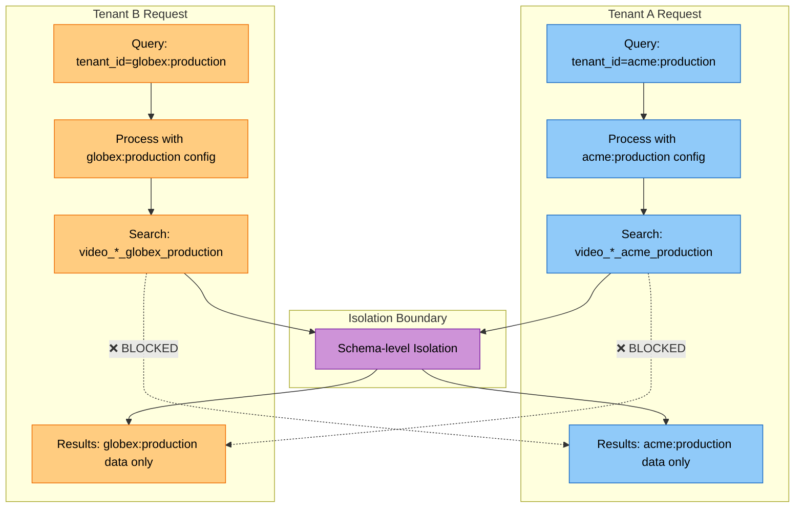
```mermaid
flowchart TB
    subgraph "Tenant A Request"
        RequestA["<span style='color:#000'>Query: tenant_id=acme:production</span>"]
        ProcessA["<span style='color:#000'>Process with acme:production config</span>"]
        SearchA["<span style='color:#000'>Search: video_*_acme_production</span>"]
        ResultsA["<span style='color:#000'>Results: acme:production data only</span>"]
    end

    subgraph "Tenant B Request"
        RequestB["<span style='color:#000'>Query: tenant_id=globex:production</span>"]
        ProcessB["<span style='color:#000'>Process with globex:production config</span>"]
        SearchB["<span style='color:#000'>Search: video_*_globex_production</span>"]
        ResultsB["<span style='color:#000'>Results: globex:production data only</span>"]
    end

    subgraph "Isolation Boundary"
        Firewall["<span style='color:#000'>Schema-level Isolation</span>"]
    end

    RequestA --> ProcessA
    ProcessA --> SearchA
    SearchA --> Firewall
    Firewall --> ResultsA

    RequestB --> ProcessB
    ProcessB --> SearchB
    SearchB --> Firewall
    Firewall --> ResultsB

    SearchA -.->|❌ BLOCKED| ResultsB
    SearchB -.->|❌ BLOCKED| ResultsA

    style RequestA fill:#90caf9,stroke:#1565c0,color:#000
    style ProcessA fill:#90caf9,stroke:#1565c0,color:#000
    style SearchA fill:#90caf9,stroke:#1565c0,color:#000
    style ResultsA fill:#90caf9,stroke:#1565c0,color:#000
    style RequestB fill:#ffcc80,stroke:#ef6c00,color:#000
    style ProcessB fill:#ffcc80,stroke:#ef6c00,color:#000
    style SearchB fill:#ffcc80,stroke:#ef6c00,color:#000
    style ResultsB fill:#ffcc80,stroke:#ef6c00,color:#000
    style Firewall fill:#ce93d8,stroke:#7b1fa2,color:#000
```

---

## Phoenix Project Isolation

### Per-Tenant Phoenix Projects

```mermaid
flowchart TB
    subgraph "Phoenix Instance (Port 6006)"
        subgraph "Project: cogniverse-acme:production-video-search"
            SpansA["<span style='color:#000'>Spans<br/>All acme:production traces</span>"]
            ExperimentsA["<span style='color:#000'>Experiments<br/>acme:production evaluations</span>"]
            DatasetsA["<span style='color:#000'>Datasets<br/>acme:production queries</span>"]
        end

        subgraph "Project: cogniverse-globex:production-video-search"
            SpansB["<span style='color:#000'>Spans<br/>All globex:production traces</span>"]
            ExperimentsB["<span style='color:#000'>Experiments<br/>globex:production evaluations</span>"]
            DatasetsB["<span style='color:#000'>Datasets<br/>globex:production queries</span>"]
        end

        subgraph "Project: cogniverse-acme:staging-video-search"
            SpansC["<span style='color:#000'>Spans<br/>All acme:staging traces</span>"]
            ExperimentsC["<span style='color:#000'>Experiments<br/>acme:staging evaluations</span>"]
            DatasetsC["<span style='color:#000'>Datasets<br/>acme:staging queries</span>"]
        end
    end

    TenantA["<span style='color:#000'>Tenant: acme:production</span>"] --> SpansA
    TenantA --> ExperimentsA
    TenantA --> DatasetsA

    TenantB["<span style='color:#000'>Tenant: globex:production</span>"] --> SpansB
    TenantB --> ExperimentsB
    TenantB --> DatasetsB

    TenantC["<span style='color:#000'>Tenant: acme:staging</span>"] --> SpansC
    TenantC --> ExperimentsC
    TenantC --> DatasetsC

    style TenantA fill:#90caf9,stroke:#1565c0,color:#000
    style TenantB fill:#ffcc80,stroke:#ef6c00,color:#000
    style TenantC fill:#ce93d8,stroke:#7b1fa2,color:#000
    style SpansA fill:#90caf9,stroke:#1565c0,color:#000
    style ExperimentsA fill:#90caf9,stroke:#1565c0,color:#000
    style DatasetsA fill:#90caf9,stroke:#1565c0,color:#000
    style SpansB fill:#ffcc80,stroke:#ef6c00,color:#000
    style ExperimentsB fill:#ffcc80,stroke:#ef6c00,color:#000
    style DatasetsB fill:#ffcc80,stroke:#ef6c00,color:#000
    style SpansC fill:#ce93d8,stroke:#7b1fa2,color:#000
    style ExperimentsC fill:#ce93d8,stroke:#7b1fa2,color:#000
    style DatasetsC fill:#ce93d8,stroke:#7b1fa2,color:#000
```

### Telemetry Flow (Per-Tenant Phoenix Projects)

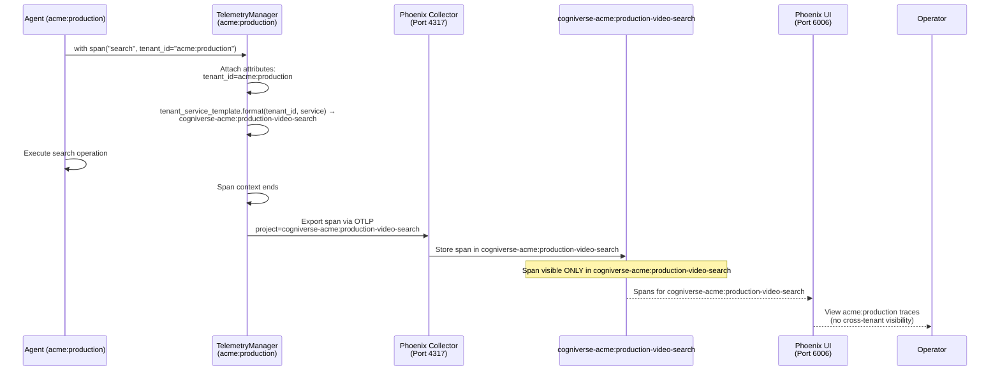
```mermaid
sequenceDiagram
    participant AgentA as Agent (acme:production)
    participant TelemetryA as TelemetryManager<br/>(acme:production)
    participant Phoenix as Phoenix Collector<br/>(Port 4317)
    participant ProjectA as cogniverse-acme:production-video-search
    participant UI as Phoenix UI<br/>(Port 6006)
    participant Operator as Operator

    AgentA->>TelemetryA: with span("search", tenant_id="acme:production")
    TelemetryA->>TelemetryA: Attach attributes:<br/>tenant_id=acme:production
    TelemetryA->>TelemetryA: tenant_service_template.format(tenant_id, service) →<br/>cogniverse-acme:production-video-search

    AgentA->>AgentA: Execute search operation

    TelemetryA->>TelemetryA: Span context ends
    TelemetryA->>Phoenix: Export span via OTLP<br/>project=cogniverse-acme:production-video-search
    Phoenix->>ProjectA: Store span in cogniverse-acme:production-video-search

    Note over ProjectA: Span visible ONLY in cogniverse-acme:production-video-search

    ProjectA-->>UI: Spans for cogniverse-acme:production-video-search
    UI-->>Operator: View acme:production traces<br/>(no cross-tenant visibility)
```

### Phoenix UI Access Pattern

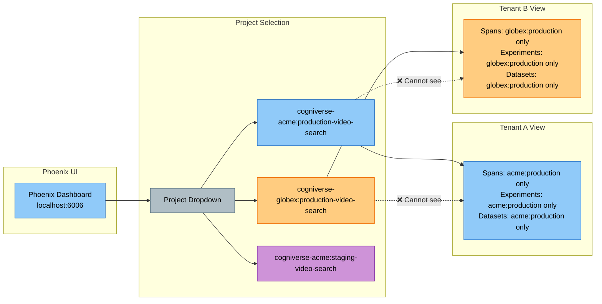
```mermaid
flowchart LR
    subgraph "Phoenix UI"
        Dashboard["<span style='color:#000'>Phoenix Dashboard<br/>localhost:6006</span>"]
    end

    subgraph "Project Selection"
        DropDown["<span style='color:#000'>Project Dropdown</span>"]
        ProjectA["<span style='color:#000'>cogniverse-acme:production-video-search</span>"]
        ProjectB["<span style='color:#000'>cogniverse-globex:production-video-search</span>"]
        ProjectC["<span style='color:#000'>cogniverse-acme:staging-video-search</span>"]
    end

    subgraph "Tenant A View"
        ViewA["<span style='color:#000'>Spans: acme:production only<br/>Experiments: acme:production only<br/>Datasets: acme:production only</span>"]
    end

    subgraph "Tenant B View"
        ViewB["<span style='color:#000'>Spans: globex:production only<br/>Experiments: globex:production only<br/>Datasets: globex:production only</span>"]
    end

    Dashboard --> DropDown
    DropDown --> ProjectA
    DropDown --> ProjectB
    DropDown --> ProjectC

    ProjectA --> ViewA
    ProjectB --> ViewB

    ProjectA -.->|❌ Cannot see| ViewB
    ProjectB -.->|❌ Cannot see| ViewA

    style Dashboard fill:#90caf9,stroke:#1565c0,color:#000
    style DropDown fill:#b0bec5,stroke:#546e7a,color:#000
    style ProjectA fill:#90caf9,stroke:#1565c0,color:#000
    style ProjectB fill:#ffcc80,stroke:#ef6c00,color:#000
    style ProjectC fill:#ce93d8,stroke:#7b1fa2,color:#000
    style ViewA fill:#90caf9,stroke:#1565c0,color:#000
    style ViewB fill:#ffcc80,stroke:#ef6c00,color:#000
```

---

## Memory Isolation

### Mem0 Memory Isolation by Tenant + Agent Partition

`Mem0MemoryManager.add_memory`/`get_all_memories` (`libs/core/cogniverse_core/memory/manager.py`)
call the underlying Mem0 API with `user_id=<tenant_id>` and `agent_id=<agent_name>` — there is no
per-end-user id concept in the current API; the whole tenant is the Mem0 "user" partition, and
`agent_name` further partitions memories per agent within that tenant.

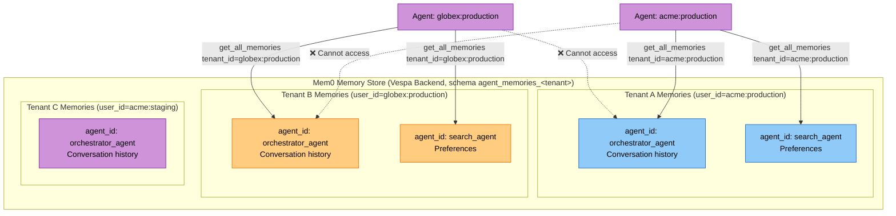
```mermaid
flowchart TB
    subgraph "Mem0 Memory Store (Vespa Backend, schema agent_memories_&lt;tenant&gt;)"
        subgraph "Tenant A Memories (user_id=acme:production)"
            MemA1["<span style='color:#000'>agent_id: orchestrator_agent<br/>Conversation history</span>"]
            MemA2["<span style='color:#000'>agent_id: search_agent<br/>Preferences</span>"]
        end

        subgraph "Tenant B Memories (user_id=globex:production)"
            MemB1["<span style='color:#000'>agent_id: orchestrator_agent<br/>Conversation history</span>"]
            MemB2["<span style='color:#000'>agent_id: search_agent<br/>Preferences</span>"]
        end

        subgraph "Tenant C Memories (user_id=acme:staging)"
            MemC1["<span style='color:#000'>agent_id: orchestrator_agent<br/>Conversation history</span>"]
        end
    end

    AgentA["<span style='color:#000'>Agent: acme:production</span>"] -->|get_all_memories tenant_id=acme:production| MemA1
    AgentA -->|get_all_memories tenant_id=acme:production| MemA2
    AgentA -.->|❌ Cannot access| MemB1

    AgentB["<span style='color:#000'>Agent: globex:production</span>"] -->|get_all_memories tenant_id=globex:production| MemB1
    AgentB -->|get_all_memories tenant_id=globex:production| MemB2
    AgentB -.->|❌ Cannot access| MemA1

    style AgentA fill:#ce93d8,stroke:#7b1fa2,color:#000
    style AgentB fill:#ce93d8,stroke:#7b1fa2,color:#000
    style MemA1 fill:#90caf9,stroke:#1565c0,color:#000
    style MemA2 fill:#90caf9,stroke:#1565c0,color:#000
    style MemB1 fill:#ffcc80,stroke:#ef6c00,color:#000
    style MemB2 fill:#ffcc80,stroke:#ef6c00,color:#000
    style MemC1 fill:#ce93d8,stroke:#7b1fa2,color:#000
```

### Memory Manager Flow (Tenant-Aware, Knowledge Subsystem)

```mermaid
sequenceDiagram
    participant Agent as Agent (acme:production)
    participant Memory as Mem0MemoryManager
    participant Federation as FederationService
    participant KnowledgeReg as KnowledgeRegistry
    participant Contradiction as ContradictionDetector
    participant Trust as rank_with_trust
    participant Backend as BackendVectorStore
    participant ProvenanceStore as ProvenanceStore (Vespa)

    Note over Agent,Memory: Write path — knowledge write with provenance + trust
    Agent->>Memory: add_memory(content, tenant_id, agent_name, metadata={kind, subject_key, provenance})
    Memory->>KnowledgeReg: get(kind) → KnowledgeSchema
    KnowledgeReg-->>Memory: schema (retention, sensitivity, contradiction_policy, default_trust)
    Memory->>Memory: schema.validate_provenance(provenance)
    Memory->>Memory: compute_initial_trust(schema, provenance) → TrustRecord
    Memory->>Memory: attach_trust_to_metadata(metadata, trust)
    Memory->>Backend: memory.add(content, user_id=tenant_id, agent_id=agent_name) → agent_memories_acme_production
    Memory->>ProvenanceStore: index provenance record (memory_id, derived_from_ids)

    Note over Agent,ProvenanceStore: Read path — federated, trust-ranked, contradiction-resolved
    Agent->>Federation: federated_get_all(tenant_id="acme:production", agent_name)
    Federation->>Memory: get_all_memories(tenant_id="acme:production", agent_name)
    Federation->>Memory: get_all_memories(tenant_id="acme:_org_trunk", agent_name)
    Federation->>Federation: Dedup by subject_key — tenant overlay wins
    Federation-->>Agent: Merged candidates

    Agent->>Contradiction: detect(candidates)
    Contradiction-->>Agent: ConflictSets (per subject_key)
    Agent->>Contradiction: reconcile(candidates, schema.contradiction_policy)
    Contradiction-->>Agent: Resolved memories

    Agent->>Trust: rank_with_trust(memories, apply_decay_now=True)
    Trust-->>Agent: Re-ranked by relevance × trust × confidence

    Note over Agent,ProvenanceStore: Tenant isolation via schema suffix (agent_memories_&lt;tenant&gt;)<br/>plus user_id=tenant_id, agent_id=agent_name partitioning within the schema
```

### Memory Schema Naming (Per-Tenant)

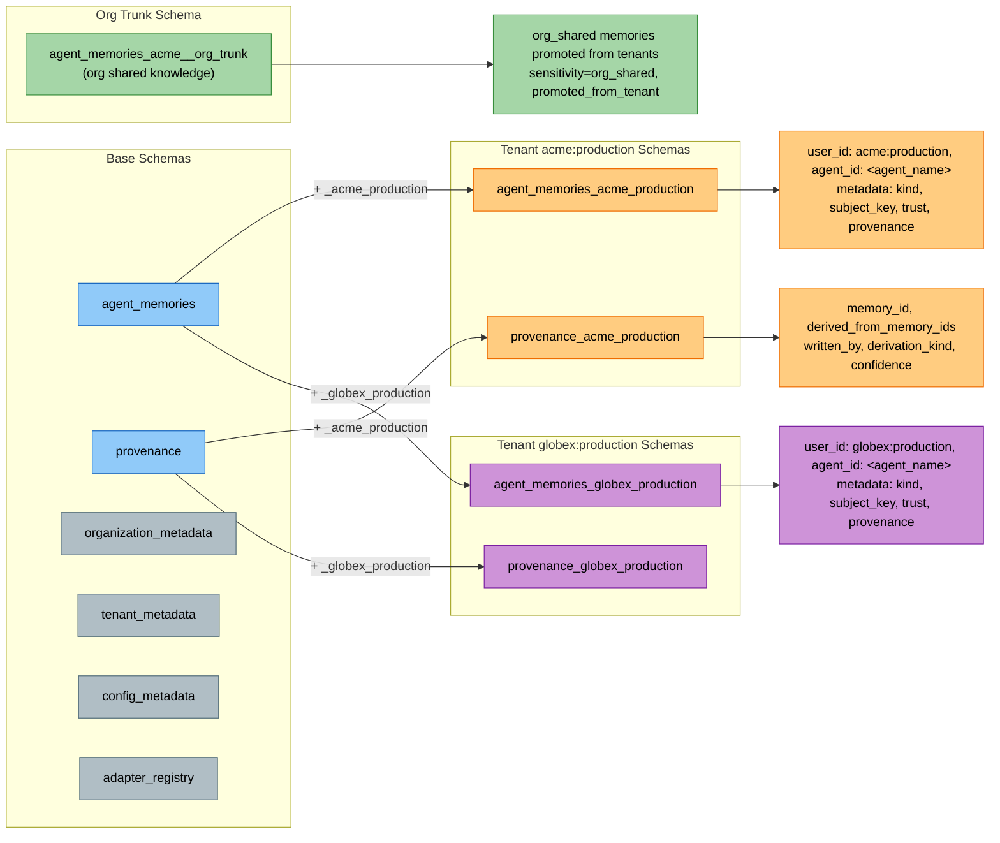
```mermaid
flowchart LR
    subgraph "Base Schemas"
        BaseMemSchema["<span style='color:#000'>agent_memories</span>"]
        BaseProvSchema["<span style='color:#000'>provenance</span>"]
        BaseOrgSchema["<span style='color:#000'>organization_metadata</span>"]
        BaseTenantMetaSchema["<span style='color:#000'>tenant_metadata</span>"]
        BaseConfigSchema["<span style='color:#000'>config_metadata</span>"]
        BaseAdapterSchema["<span style='color:#000'>adapter_registry</span>"]
    end

    subgraph "Tenant acme:production Schemas"
        SchemaA["<span style='color:#000'>agent_memories_acme_production</span>"]
        ProvSchemaA["<span style='color:#000'>provenance_acme_production</span>"]
    end

    subgraph "Tenant globex:production Schemas"
        SchemaB["<span style='color:#000'>agent_memories_globex_production</span>"]
        ProvSchemaB["<span style='color:#000'>provenance_globex_production</span>"]
    end

    subgraph "Org Trunk Schema"
        OrgTrunk["<span style='color:#000'>agent_memories_acme__org_trunk<br/>(org shared knowledge)</span>"]
    end

    BaseMemSchema -->|+ _acme_production| SchemaA
    BaseMemSchema -->|+ _globex_production| SchemaB
    BaseProvSchema -->|+ _acme_production| ProvSchemaA
    BaseProvSchema -->|+ _globex_production| ProvSchemaB

    SchemaA --> DocA["<span style='color:#000'>user_id: acme:production, agent_id: &lt;agent_name&gt;<br/>metadata: kind, subject_key, trust, provenance</span>"]
    SchemaB --> DocB["<span style='color:#000'>user_id: globex:production, agent_id: &lt;agent_name&gt;<br/>metadata: kind, subject_key, trust, provenance</span>"]
    ProvSchemaA --> ProvDocA["<span style='color:#000'>memory_id, derived_from_memory_ids<br/>written_by, derivation_kind, confidence</span>"]
    OrgTrunk --> OrgDoc["<span style='color:#000'>org_shared memories promoted from tenants<br/>sensitivity=org_shared, promoted_from_tenant</span>"]

    style BaseMemSchema fill:#90caf9,stroke:#1565c0,color:#000
    style BaseProvSchema fill:#90caf9,stroke:#1565c0,color:#000
    style BaseOrgSchema fill:#b0bec5,stroke:#546e7a,color:#000
    style BaseTenantMetaSchema fill:#b0bec5,stroke:#546e7a,color:#000
    style BaseConfigSchema fill:#b0bec5,stroke:#546e7a,color:#000
    style BaseAdapterSchema fill:#b0bec5,stroke:#546e7a,color:#000
    style SchemaA fill:#ffcc80,stroke:#ef6c00,color:#000
    style ProvSchemaA fill:#ffcc80,stroke:#ef6c00,color:#000
    style SchemaB fill:#ce93d8,stroke:#7b1fa2,color:#000
    style ProvSchemaB fill:#ce93d8,stroke:#7b1fa2,color:#000
    style OrgTrunk fill:#a5d6a7,stroke:#388e3c,color:#000
    style DocA fill:#ffcc80,stroke:#ef6c00,color:#000
    style DocB fill:#ce93d8,stroke:#7b1fa2,color:#000
    style ProvDocA fill:#ffcc80,stroke:#ef6c00,color:#000
    style OrgDoc fill:#a5d6a7,stroke:#388e3c,color:#000
```

---

## Deployment Patterns

### Single Vespa Instance Multi-Tenant Deployment

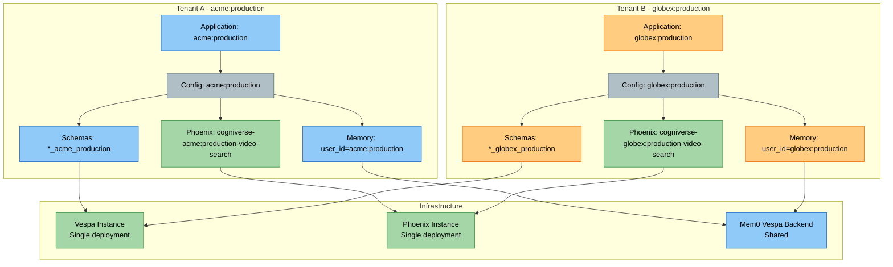
```mermaid
flowchart TB
    subgraph "Infrastructure"
        Vespa["<span style='color:#000'>Vespa Instance<br/>Single deployment</span>"]
        Phoenix["<span style='color:#000'>Phoenix Instance<br/>Single deployment</span>"]
        Mem0Backend["<span style='color:#000'>Mem0 Vespa Backend<br/>Shared</span>"]
    end

    subgraph "Tenant A - acme:production"
        AppA["<span style='color:#000'>Application: acme:production</span>"]
        ConfigA["<span style='color:#000'>Config: acme:production</span>"]
        SchemasA["<span style='color:#000'>Schemas: *_acme_production</span>"]
        ProjectA["<span style='color:#000'>Phoenix: cogniverse-acme:production-video-search</span>"]
        MemoryA["<span style='color:#000'>Memory: user_id=acme:production</span>"]
    end

    subgraph "Tenant B - globex:production"
        AppB["<span style='color:#000'>Application: globex:production</span>"]
        ConfigB["<span style='color:#000'>Config: globex:production</span>"]
        SchemasB["<span style='color:#000'>Schemas: *_globex_production</span>"]
        ProjectB["<span style='color:#000'>Phoenix: cogniverse-globex:production-video-search</span>"]
        MemoryB["<span style='color:#000'>Memory: user_id=globex:production</span>"]
    end

    AppA --> ConfigA
    ConfigA --> SchemasA
    ConfigA --> ProjectA
    ConfigA --> MemoryA

    AppB --> ConfigB
    ConfigB --> SchemasB
    ConfigB --> ProjectB
    ConfigB --> MemoryB

    SchemasA --> Vespa
    SchemasB --> Vespa
    ProjectA --> Phoenix
    ProjectB --> Phoenix
    MemoryA --> Mem0Backend
    MemoryB --> Mem0Backend

    style Vespa fill:#a5d6a7,stroke:#388e3c,color:#000
    style Phoenix fill:#a5d6a7,stroke:#388e3c,color:#000
    style Mem0Backend fill:#90caf9,stroke:#1565c0,color:#000
    style AppA fill:#90caf9,stroke:#1565c0,color:#000
    style ConfigA fill:#b0bec5,stroke:#546e7a,color:#000
    style SchemasA fill:#90caf9,stroke:#1565c0,color:#000
    style ProjectA fill:#a5d6a7,stroke:#388e3c,color:#000
    style MemoryA fill:#90caf9,stroke:#1565c0,color:#000
    style AppB fill:#ffcc80,stroke:#ef6c00,color:#000
    style ConfigB fill:#b0bec5,stroke:#546e7a,color:#000
    style SchemasB fill:#ffcc80,stroke:#ef6c00,color:#000
    style ProjectB fill:#a5d6a7,stroke:#388e3c,color:#000
    style MemoryB fill:#ffcc80,stroke:#ef6c00,color:#000
```

### Tenant Lifecycle Management

```mermaid
sequenceDiagram
    participant Admin as Admin
    participant API as POST /admin/tenants
    participant TenantMgr as tenant_manager.py
    participant Backend as Backend (Vespa)
    participant Registry as SchemaRegistry
    participant LifecycleSched as LifecycleScheduler
    participant PinService as PinService

    Note over Admin: Create new tenant: "acme:trial"

    Admin->>API: POST /admin/tenants {"tenant_id": "acme:trial"}
    API->>TenantMgr: create_tenant(request)
    TenantMgr->>TenantMgr: parse_tenant_id → org_id="acme", tenant_name="trial"
    TenantMgr->>Backend: get_organization_internal("acme")
    alt org does not exist yet
        TenantMgr->>Backend: create_metadata_document(schema="organization_metadata", doc_id="acme")
    end

    loop For each base_schema in request.base_schemas (default: video_colpali_smol500_mv_frame)
        TenantMgr->>Registry: deploy_schema(tenant_id="acme:trial", base_schema_name)
        Registry->>Registry: get_tenant_schema_name → "..._acme_trial"
        Registry-->>TenantMgr: schema deployed
    end

    TenantMgr->>Backend: create_metadata_document(schema="tenant_metadata",<br/>doc_id="acme:trial", fields={schemas_deployed, ...})
    TenantMgr-->>API: Tenant(tenant_full_id="acme:trial", schemas_deployed=[...])
    API-->>Admin: 200 OK

    Note over Admin,PinService: Phoenix project is NOT created here — it is created<br/>lazily on first span export via tenant_service_template

    Note over Admin,PinService: Schema-driven lifecycle cleanup tick (hourly via LifecycleScheduler.tick_once)

    LifecycleSched->>LifecycleSched: get_warm_managers() — active tenant Mem0MemoryManager instances
    loop For each warm tenant manager
        LifecycleSched->>PinService: pin_lookup(manager) → pinned_memory_ids (via list_pins)
        LifecycleSched->>Backend: manager.cleanup_with_schema(registry, pinned_memory_ids)
        loop For each memory
            Backend->>Backend: registry.get(kind) → KnowledgeSchema
            Note over Backend: Retention.PERMANENT → skip (never expire)
            Note over Backend: Retention.EPHEMERAL_DAYS(N) → delete if age > N days
            Note over Backend: Retention.SCHEMA_DRIVEN → delegate to schema.cleanup_hook
            Note over Backend: memory_id in pinned_memory_ids → always skipped
        end
        Backend-->>LifecycleSched: deleted_by_kind
    end

    Note over Admin,PinService: Admin pins a memory (org_admin override)
    Admin->>PinService: pin(target_memory_id, target_kind, pinned_by=ORG_ADMIN, actor_id, tenant_id)
    PinService->>PinService: registry.get(target_kind).validate_pin_authority(ORG_ADMIN)
    PinService->>PinService: Check quota (PinQuotas; org_admin overrides existing lower-role pins)
    PinService->>Backend: memory_manager.add_memory(pin record, agent_name=PIN_AGENT_NAME, infer=False)
    PinService-->>Admin: PinRecord — memory immune to lifecycle cleanup
```

### Tenant Deletion/Cleanup Flow

`delete_tenant_internal` (`libs/runtime/cogniverse_runtime/admin/tenant_manager.py`) does not back
up data and does not delete a Phoenix project (there is no Phoenix API call anywhere in
`tenant_manager.py`) — it only removes the tenant's Vespa schemas and its `tenant_metadata` doc.
Take a backup out-of-band beforehand if the data must be recoverable.

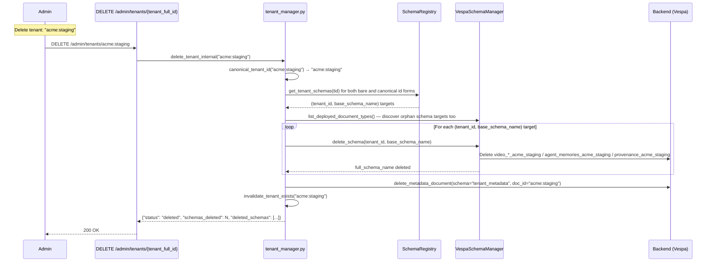
```mermaid
sequenceDiagram
    participant Admin as Admin
    participant API as DELETE /admin/tenants/{tenant_full_id}
    participant TenantMgr as tenant_manager.py
    participant Registry as SchemaRegistry
    participant SchemaManager as VespaSchemaManager
    participant Backend as Backend (Vespa)

    Note over Admin: Delete tenant: "acme:staging"

    Admin->>API: DELETE /admin/tenants/acme:staging
    API->>TenantMgr: delete_tenant_internal("acme:staging")
    TenantMgr->>TenantMgr: canonical_tenant_id("acme:staging") → "acme:staging"
    TenantMgr->>Registry: get_tenant_schemas(tid) for both bare and canonical id forms
    Registry-->>TenantMgr: (tenant_id, base_schema_name) targets
    TenantMgr->>SchemaManager: list_deployed_document_types() — discover orphan schema targets too

    loop For each (tenant_id, base_schema_name) target
        TenantMgr->>SchemaManager: delete_schema(tenant_id, base_schema_name)
        SchemaManager->>Backend: Delete video_*_acme_staging / agent_memories_acme_staging / provenance_acme_staging
        SchemaManager-->>TenantMgr: full_schema_name deleted
    end

    TenantMgr->>Backend: delete_metadata_document(schema="tenant_metadata", doc_id="acme:staging")
    TenantMgr->>TenantMgr: invalidate_tenant_exists("acme:staging")

    TenantMgr-->>API: {"status": "deleted", "schemas_deleted": N, "deleted_schemas": [...]}
    API-->>Admin: 200 OK
```

### Federation: Org Trunk + Tenant Overlay

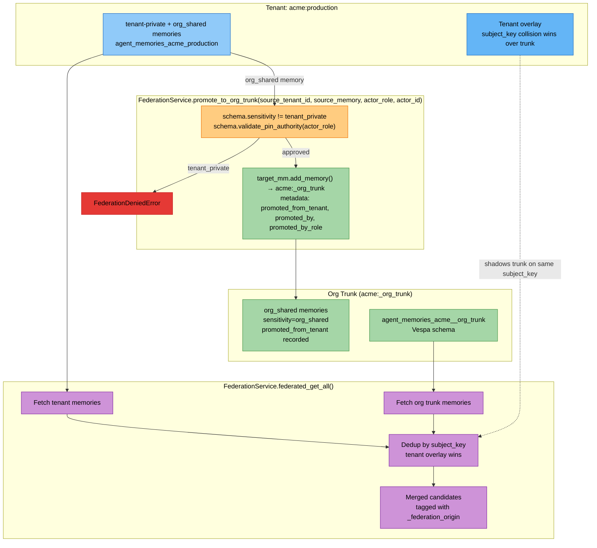
```mermaid
flowchart TB
    subgraph OrgKnowledge["<span style='color:#000'>Org Trunk (acme:_org_trunk)</span>"]
        OrgTrunkMem["<span style='color:#000'>org_shared memories<br/>sensitivity=org_shared<br/>promoted_from_tenant recorded</span>"]
        OrgTrunkVespa["<span style='color:#000'>agent_memories_acme__org_trunk<br/>Vespa schema</span>"]
    end

    subgraph TenantProd["<span style='color:#000'>Tenant: acme:production</span>"]
        TenantMem["<span style='color:#000'>tenant-private + org_shared memories<br/>agent_memories_acme_production</span>"]
        TenantOverlay["<span style='color:#000'>Tenant overlay<br/>subject_key collision wins over trunk</span>"]
    end

    subgraph FedRead["<span style='color:#000'>FederationService.federated_get_all()</span>"]
        FetchTenant["<span style='color:#000'>Fetch tenant memories</span>"]
        FetchTrunk["<span style='color:#000'>Fetch org trunk memories</span>"]
        DedupSubjectKey["<span style='color:#000'>Dedup by subject_key<br/>tenant overlay wins</span>"]
        MergedResult["<span style='color:#000'>Merged candidates<br/>tagged with _federation_origin</span>"]
    end

    subgraph PromotePath["<span style='color:#000'>FederationService.promote_to_org_trunk(source_tenant_id, source_memory, actor_role, actor_id)</span>"]
        PromoteCheck["<span style='color:#000'>schema.sensitivity != tenant_private<br/>schema.validate_pin_authority(actor_role)</span>"]
        PromoteWrite["<span style='color:#000'>target_mm.add_memory() → acme:_org_trunk<br/>metadata: promoted_from_tenant, promoted_by, promoted_by_role</span>"]
    end

    TenantMem --> FetchTenant
    OrgTrunkVespa --> FetchTrunk
    FetchTenant --> DedupSubjectKey
    FetchTrunk --> DedupSubjectKey
    DedupSubjectKey --> MergedResult
    TenantOverlay -.->|shadows trunk on same subject_key| DedupSubjectKey

    TenantMem -->|org_shared memory| PromoteCheck
    PromoteCheck -->|approved| PromoteWrite
    PromoteWrite --> OrgTrunkMem
    PromoteCheck -->|tenant_private| BlockedPromotion["<span style='color:#000'>FederationDeniedError</span>"]

    style OrgTrunkMem fill:#a5d6a7,stroke:#388e3c,color:#000
    style OrgTrunkVespa fill:#a5d6a7,stroke:#388e3c,color:#000
    style TenantMem fill:#90caf9,stroke:#1565c0,color:#000
    style TenantOverlay fill:#64b5f6,stroke:#1565c0,color:#000
    style FetchTenant fill:#ce93d8,stroke:#7b1fa2,color:#000
    style FetchTrunk fill:#ce93d8,stroke:#7b1fa2,color:#000
    style DedupSubjectKey fill:#ce93d8,stroke:#7b1fa2,color:#000
    style MergedResult fill:#ce93d8,stroke:#7b1fa2,color:#000
    style PromoteCheck fill:#ffcc80,stroke:#ef6c00,color:#000
    style PromoteWrite fill:#a5d6a7,stroke:#388e3c,color:#000
    style BlockedPromotion fill:#e53935,stroke:#c62828,color:#fff
```

### Cross-Tenant Comparison Flow

CrossTenantComparisonAgent does not call an LLM in V1 and never writes to the org trunk itself —
`_process_impl` only reads via `FederationService.federated_get_all` and returns a
`CrossTenantComparisonOutput`. Promotion to the org trunk is a separate, explicit admin action
(`FederationService.promote_to_org_trunk`, shown in the diagram above), not something this agent
triggers automatically.

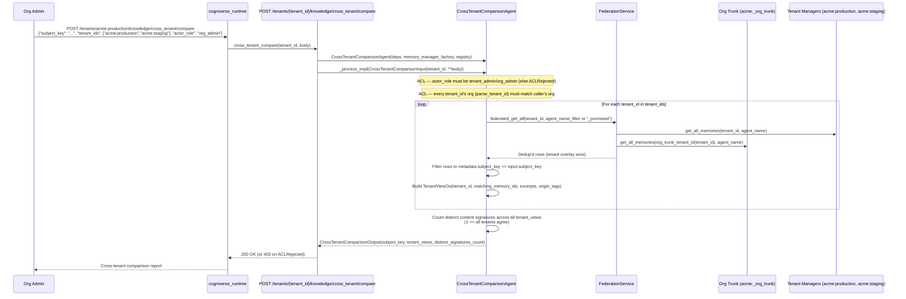
```mermaid
sequenceDiagram
    participant OrgAdmin as Org Admin
    participant Runtime as cogniverse_runtime
    participant Route as POST /tenants/{tenant_id}/knowledge/cross_tenant/compare
    participant CrossTenant as CrossTenantComparisonAgent
    participant Federation as FederationService
    participant OrgTrunk as Org Trunk (acme:_org_trunk)
    participant Tenants as Tenant Managers (acme:production, acme:staging)

    OrgAdmin->>Runtime: POST /tenants/acme:production/knowledge/cross_tenant/compare<br/>{"subject_key": "...", "tenant_ids": ["acme:production","acme:staging"], "actor_role": "org_admin"}

    Runtime->>Route: cross_tenant_compare(tenant_id, body)
    Route->>CrossTenant: CrossTenantComparisonAgent(deps, memory_manager_factory, registry)
    Route->>CrossTenant: _process_impl(CrossTenantComparisonInput(tenant_id, **body))

    Note over CrossTenant: ACL — actor_role must be tenant_admin/org_admin (else ACLRejected)
    Note over CrossTenant: ACL — every tenant_id's org (parse_tenant_id) must match caller's org

    loop For each tenant_id in tenant_ids
        CrossTenant->>Federation: federated_get_all(tenant_id, agent_name_filter or "_promoted")
        Federation->>Tenants: get_all_memories(tenant_id, agent_name)
        Federation->>OrgTrunk: get_all_memories(org_trunk_tenant_id(tenant_id), agent_name)
        Federation-->>CrossTenant: Dedup'd rows (tenant overlay wins)
        CrossTenant->>CrossTenant: Filter rows to metadata.subject_key == input.subject_key
        CrossTenant->>CrossTenant: Build TenantViewOut(tenant_id, matching_memory_ids, excerpts, origin_tags)
    end

    CrossTenant->>CrossTenant: Count distinct content signatures across all tenant_views<br/>(1 == all tenants agree)
    CrossTenant-->>Route: CrossTenantComparisonOutput(subject_key, tenant_views, distinct_signatures_count)
    Route-->>Runtime: 200 OK (or 403 on ACLRejected)
    Runtime-->>OrgAdmin: Cross-tenant comparison report
```

### Multi-Region Deployment (Future)

```mermaid
flowchart TB
    subgraph "US Region"
        VespaUS["<span style='color:#000'>Vespa US</span>"]
        PhoenixUS["<span style='color:#000'>Phoenix US</span>"]

        subgraph "US Tenants"
            TenantUS1["<span style='color:#000'>acme_corp_us</span>"]
            TenantUS2["<span style='color:#000'>globex_us</span>"]
        end

        TenantUS1 --> VespaUS
        TenantUS1 --> PhoenixUS
        TenantUS2 --> VespaUS
        TenantUS2 --> PhoenixUS
    end

    subgraph "EU Region"
        VespaEU["<span style='color:#000'>Vespa EU</span>"]
        PhoenixEU["<span style='color:#000'>Phoenix EU</span>"]

        subgraph "EU Tenants"
            TenantEU1["<span style='color:#000'>acme_corp_eu</span>"]
            TenantEU2["<span style='color:#000'>globex_eu</span>"]
        end

        TenantEU1 --> VespaEU
        TenantEU1 --> PhoenixEU
        TenantEU2 --> VespaEU
        TenantEU2 --> PhoenixEU
    end

    LoadBalancer["<span style='color:#000'>Global Load Balancer<br/>Route by tenant region</span>"]
    LoadBalancer --> VespaUS
    LoadBalancer --> VespaEU

    style VespaUS fill:#90caf9,stroke:#1565c0,color:#000
    style VespaEU fill:#90caf9,stroke:#1565c0,color:#000
    style PhoenixUS fill:#a5d6a7,stroke:#388e3c,color:#000
    style PhoenixEU fill:#a5d6a7,stroke:#388e3c,color:#000
    style TenantUS1 fill:#ffcc80,stroke:#ef6c00,color:#000
    style TenantUS2 fill:#ffcc80,stroke:#ef6c00,color:#000
    style TenantEU1 fill:#ce93d8,stroke:#7b1fa2,color:#000
    style TenantEU2 fill:#ce93d8,stroke:#7b1fa2,color:#000
    style LoadBalancer fill:#b0bec5,stroke:#546e7a,color:#000
```

---

## Summary

This diagram collection provides comprehensive visual documentation of multi-tenant architecture across the **layered structure**:

1. **Tenant Isolation**: Complete separation at schema, project, and memory levels across all layers
2. **Schema-Per-Tenant**: Naming convention with `_tenant_id` suffix managed by cogniverse_vespa; includes per-tenant `provenance_<tenant>` schema for citation graph BFS walks
3. **Data Flow**: Tenant-specific routing from ingestion to search through layered architecture
4. **Phoenix Projects**: Per-tenant observability via cogniverse_telemetry_phoenix plugin
5. **Memory Isolation**: Tenant-specific `agent_memories_<tenant>` schemas plus `user_id=tenant_id`/`agent_id=agent_name` partitioning via cogniverse_core; full Knowledge Subsystem (provenance, contradiction, trust, federation, pinning, lifecycle)
6. **Lifecycle Management**: Schema-driven lifecycle (KnowledgeSchema.retention → cleanup_hook); pinned memories skipped by LifecycleScheduler; org_admin pins survive
7. **Federation**: Org trunk (`<org>:_org_trunk`) + tenant overlays; tenant overlay wins on subject_key collision; admin-gated promotion to trunk
8. **Cross-Tenant Comparison**: CrossTenantComparisonAgent fans out across org tenants with sensitivity=org_shared ACL enforcement; result writes to org trunk admin-gated

**Key Principles:**

- **Schema Isolation**: Each tenant has dedicated Vespa schemas (Implementation Layer)

- **Project Isolation**: Each tenant has dedicated Phoenix project (Implementation Layer Plugin)

- **Memory Isolation**: Mem0 `user_id=tenant_id`, `agent_id=agent_name` (Core Layer) with per-kind KnowledgeSchema policies (retention, sensitivity, pinnable_by, contradiction_policy, default_trust)

- **No Cross-Tenant Access**: Firewall at every layer — FederationService only reads from caller's tenant + that tenant's org trunk; no cross-org leakage

- **Shared Infrastructure**: Single Vespa/Phoenix instances serve all tenants

- **Configuration-Driven**: Tenant isolation configured via cogniverse_foundation

**Tenant Naming Conventions:**

- Vespa video schemas: `{base_schema}_{tenant_id}` (cogniverse_vespa)

- Vespa memory schemas: `agent_memories_{tenant_id}`, `provenance_{tenant_id}` (cogniverse_core)

- Org trunk tenant id: `{org_id}:_org_trunk` (federation.py)

- Phoenix projects: `cogniverse-{tenant_id}-{service}` (cogniverse_telemetry_phoenix)

- Memory partitioning: `user_id={tenant_id}`, `agent_id={agent_name}` (cogniverse_core) — no per-end-user id in `Mem0MemoryManager` today

**Layered Architecture Integration:**

- **Foundation Layer**: Provides TenantConfig (per-tenant) and SystemConfig (global, one per deployment), TelemetryManager base

- **Core Layer**: Full Knowledge Subsystem — KnowledgeRegistry, ProvenanceStore, ContradictionDetector, `trust.py` (compute_initial_trust / rank_with_trust), FederationService, PinService, LifecycleScheduler

- **Implementation Layer**: Vespa backend applies tenant suffixes; 9 knowledge agents (MultiDocumentSynthesis, KGTraversal, CrossTenantComparison, ContradictionReconciliation, CitationTracing, TemporalReasoning, FederatedQuery, KnowledgeSummarization, AuditExplanation)

- **Application Layer**: Runtime and dashboard respect tenant boundaries; SandboxPolicy governs coding agent + orchestrator execution

**Related Documentation:**

- [Layered Architecture Guide](../architecture/overview.md)

- [Multi-Tenant Architecture](../architecture/multi-tenant.md)

- [Multi-Tenant Operations](../operations/multi-tenant-ops.md)

- [Configuration Guide](../operations/configuration.md)
