# SDK Architecture Diagrams
---

## Table of Contents
1. [Package Dependency Graph](#package-dependency-graph)
2. [Package Internal Structure](#package-internal-structure)
3. [Cross-Package Data Flow](#cross-package-data-flow)
4. [Import Patterns](#import-patterns)
5. [Build and Deployment](#build-and-deployment)

---

## Package Dependency Graph

### High-Level Package Dependencies (Layered Structure)

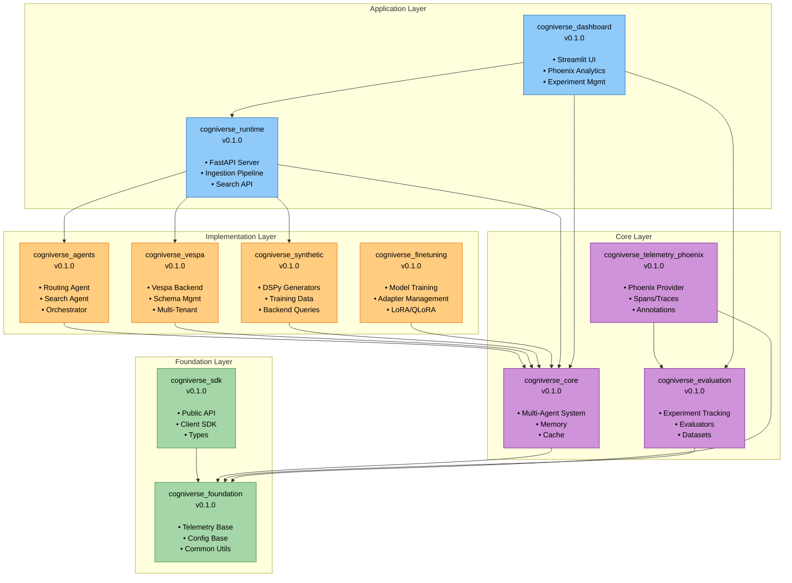

### Detailed Dependency Chain (Layered Architecture)

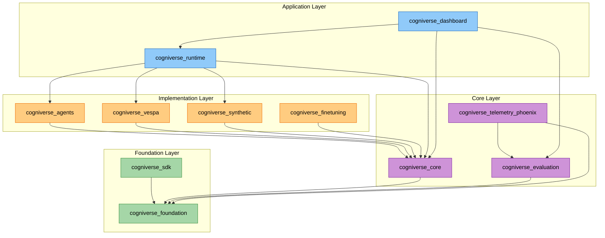

---

## Package Internal Structure

### cogniverse_foundation Package Structure (Foundation Layer)

```mermaid
flowchart TB
    FoundationPkg["<span style='color:#000'>cogniverse_foundation</span>"]

    subgraph TelemetryBase["<span style='color:#000'>Telemetry Base</span>"]
        TelemetryMgr["<span style='color:#000'>TelemetryManager</span>"]
        ProviderRegistry["<span style='color:#000'>Provider Registry</span>"]
        TelemetryInterfaces["<span style='color:#000'>Telemetry Interfaces</span>"]
    end

    subgraph ConfigBase["<span style='color:#000'>Configuration Base</span>"]
        ConfigMgr["<span style='color:#000'>ConfigManager</span>"]
        SystemConfig["<span style='color:#000'>SystemConfig</span>"]
        TenantConfig["<span style='color:#000'>TenantConfig</span>"]
    end

    subgraph CommonUtils["<span style='color:#000'>Common Utilities</span>"]
        LoggingUtils["<span style='color:#000'>Logging</span>"]
        ExceptionHandling["<span style='color:#000'>Exceptions</span>"]
        TypeUtils["<span style='color:#000'>Type Utilities</span>"]
    end

    FoundationPkg --> TelemetryMgr
    FoundationPkg --> ProviderRegistry
    FoundationPkg --> TelemetryInterfaces
    FoundationPkg --> ConfigMgr
    FoundationPkg --> SystemConfig
    FoundationPkg --> TenantConfig
    FoundationPkg --> LoggingUtils
    FoundationPkg --> ExceptionHandling
    FoundationPkg --> TypeUtils

    style FoundationPkg fill:#a5d6a7,stroke:#388e3c,stroke-width:3px,color:#000
    style TelemetryMgr fill:#a5d6a7,stroke:#388e3c,color:#000
    style ProviderRegistry fill:#a5d6a7,stroke:#388e3c,color:#000
    style TelemetryInterfaces fill:#a5d6a7,stroke:#388e3c,color:#000
    style ConfigMgr fill:#a5d6a7,stroke:#388e3c,color:#000
    style SystemConfig fill:#a5d6a7,stroke:#388e3c,color:#000
    style TenantConfig fill:#a5d6a7,stroke:#388e3c,color:#000
    style LoggingUtils fill:#a5d6a7,stroke:#388e3c,color:#000
    style ExceptionHandling fill:#a5d6a7,stroke:#388e3c,color:#000
    style TypeUtils fill:#a5d6a7,stroke:#388e3c,color:#000
```

### cogniverse_core Package Structure (Core Layer)

```mermaid
flowchart TB
    CorePkg["<span style='color:#000'>cogniverse_core</span>"]

    subgraph MultiAgent["<span style='color:#000'>Multi-Agent System</span>"]
        AgentBase["<span style='color:#000'>AgentBase</span>"]
        A2AAgent["<span style='color:#000'>A2AAgent</span>"]
        AgentMixins["<span style='color:#000'>Agent Mixins</span>"]
    end

    subgraph MemoryMgmt["<span style='color:#000'>Memory Management</span>"]
        MemoryBackend["<span style='color:#000'>Backend Vector Store</span>"]
        MemoryConfig["<span style='color:#000'>Memory Config</span>"]
        Mem0MemoryManager["<span style='color:#000'>Mem0MemoryManager</span>"]
    end

    subgraph CacheSys["<span style='color:#000'>Cache System</span>"]
        CacheManager["<span style='color:#000'>Cache Manager</span>"]
        RedisBackend["<span style='color:#000'>Redis Backend</span>"]
        InMemoryCache["<span style='color:#000'>In-Memory Cache</span>"]
    end

    subgraph Common["<span style='color:#000'>Common</span>"]
        Utils["<span style='color:#000'>Utilities</span>"]
        Types["<span style='color:#000'>Type Definitions</span>"]
    end

    CorePkg --> AgentBase
    CorePkg --> A2AAgent
    CorePkg --> AgentMixins
    CorePkg --> MemoryBackend
    CorePkg --> MemoryConfig
    CorePkg --> Mem0MemoryManager
    CorePkg --> CacheManager
    CorePkg --> RedisBackend
    CorePkg --> InMemoryCache
    CorePkg --> Utils
    CorePkg --> Types

    style CorePkg fill:#ce93d8,stroke:#7b1fa2,stroke-width:3px,color:#000
    style AgentBase fill:#ce93d8,stroke:#7b1fa2,color:#000
    style A2AAgent fill:#ce93d8,stroke:#7b1fa2,color:#000
    style AgentMixins fill:#ce93d8,stroke:#7b1fa2,color:#000
    style MemoryBackend fill:#ce93d8,stroke:#7b1fa2,color:#000
    style MemoryConfig fill:#ce93d8,stroke:#7b1fa2,color:#000
    style Mem0MemoryManager fill:#ce93d8,stroke:#7b1fa2,color:#000
    style CacheManager fill:#ce93d8,stroke:#7b1fa2,color:#000
    style RedisBackend fill:#ce93d8,stroke:#7b1fa2,color:#000
    style InMemoryCache fill:#ce93d8,stroke:#7b1fa2,color:#000
    style Utils fill:#ce93d8,stroke:#7b1fa2,color:#000
    style Types fill:#ce93d8,stroke:#7b1fa2,color:#000
```

### cogniverse_evaluation Package Structure (Core Layer)

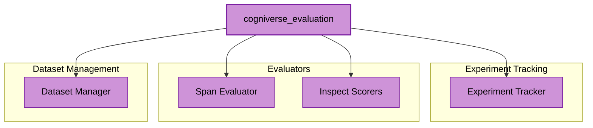

### cogniverse_agents Package Structure (Implementation Layer)

```mermaid
flowchart TB
    AgentsPkg["<span style='color:#000'>cogniverse_agents</span>"]

    subgraph AgentsSubg["<span style='color:#000'>Agents</span>"]
        RoutingAgent["<span style='color:#000'>RoutingAgent</span>"]
        SearchAgent["<span style='color:#000'>SearchAgent</span>"]
        OrchestratorAgent["<span style='color:#000'>OrchestratorAgent</span>"]
    end

    subgraph RoutingSubg["<span style='color:#000'>Routing</span>"]
        RoutingConfig["<span style='color:#000'>RoutingConfig</span>"]
        GLiNERStrategy["<span style='color:#000'>GLiNER Strategy</span>"]
        LLMStrategy["<span style='color:#000'>LLM Strategy</span>"]
        Optimizer["<span style='color:#000'>Optimizer</span>"]
    end

    subgraph ToolsSubg["<span style='color:#000'>Tools</span>"]
        A2ATools["<span style='color:#000'>A2A Tools</span>"]
        VideoPlayer["<span style='color:#000'>Video Player</span>"]
    end

    subgraph SearchSubg["<span style='color:#000'>Search</span>"]
        Reranker["<span style='color:#000'>Multi-Modal Reranker</span>"]
        QueryEncoders["<span style='color:#000'>Query Encoders</span>"]
    end

    AgentsPkg --> RoutingAgent
    AgentsPkg --> SearchAgent
    AgentsPkg --> OrchestratorAgent
    AgentsPkg --> RoutingConfig
    AgentsPkg --> GLiNERStrategy
    AgentsPkg --> LLMStrategy
    AgentsPkg --> Optimizer
    AgentsPkg --> Reranker
    AgentsPkg --> QueryEncoders
    AgentsPkg --> A2ATools
    AgentsPkg --> VideoPlayer

    style AgentsPkg fill:#ffcc80,stroke:#ef6c00,stroke-width:3px,color:#000
    style RoutingAgent fill:#ffcc80,stroke:#ef6c00,color:#000
    style SearchAgent fill:#ffcc80,stroke:#ef6c00,color:#000
    style OrchestratorAgent fill:#ffcc80,stroke:#ef6c00,color:#000
    style RoutingConfig fill:#ffcc80,stroke:#ef6c00,color:#000
    style GLiNERStrategy fill:#ffcc80,stroke:#ef6c00,color:#000
    style LLMStrategy fill:#ffcc80,stroke:#ef6c00,color:#000
    style Optimizer fill:#ffcc80,stroke:#ef6c00,color:#000
    style Reranker fill:#ffcc80,stroke:#ef6c00,color:#000
    style QueryEncoders fill:#ffcc80,stroke:#ef6c00,color:#000
    style A2ATools fill:#ffcc80,stroke:#ef6c00,color:#000
    style VideoPlayer fill:#ffcc80,stroke:#ef6c00,color:#000
```

### cogniverse_vespa Package Structure (Implementation Layer)

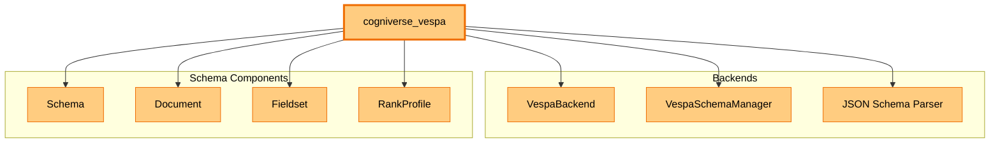

---

## Cross-Package Data Flow

### Video Ingestion Flow Across Packages (Layered Architecture)

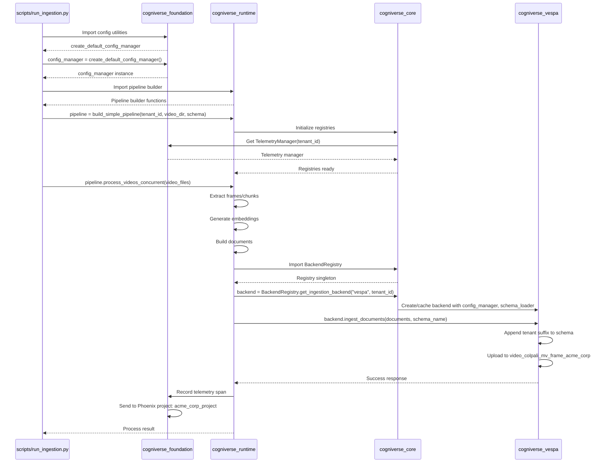

### Query Routing Flow Across Packages (Layered Architecture)

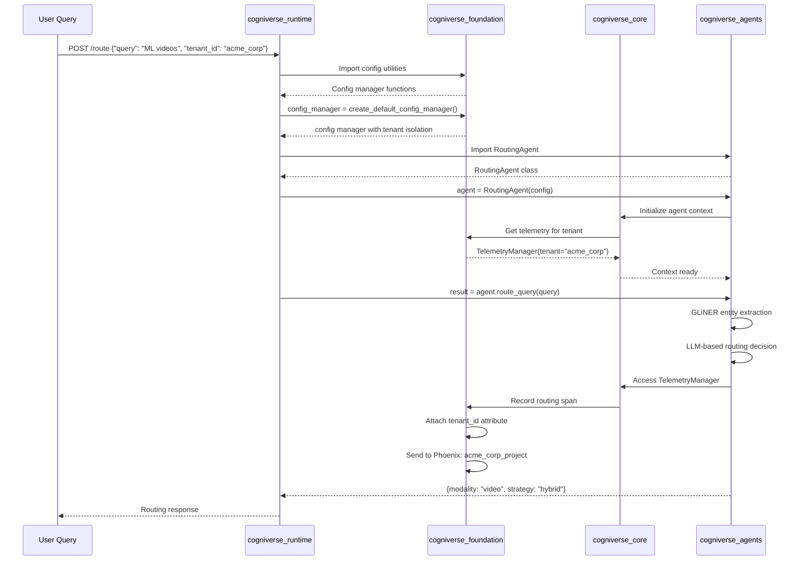

### Search Flow Across Packages (Layered Architecture)

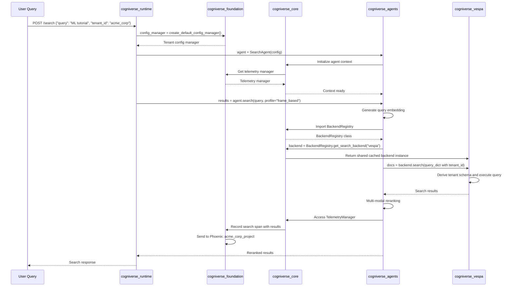

---

## Import Patterns

### Correct Import Patterns by Package (Layered Architecture)

```mermaid
flowchart TB
    subgraph ScriptsLayer["<span style='color:#000'>Scripts Layer</span>"]
        Script["<span style='color:#000'>scripts/run_ingestion.py</span>"]
    end

    subgraph FoundationImports["<span style='color:#000'>cogniverse_foundation Imports</span>"]
        FoundationConfig["<span style='color:#000'>from cogniverse_foundation.config.utils import create_default_config_manager</span>"]
        FoundationTelemetry["<span style='color:#000'>from cogniverse_foundation.telemetry.manager import TelemetryManager</span>"]
    end

    subgraph CoreImports["<span style='color:#000'>cogniverse_core Imports</span>"]
        CoreAgent["<span style='color:#000'>from cogniverse_core.agents.base import AgentBase</span>"]
        CoreMemory["<span style='color:#000'>from cogniverse_core.memory.manager import Mem0MemoryManager</span>"]
        CoreCache["<span style='color:#000'>from cogniverse_core.common.cache import CacheManager</span>"]
    end

    subgraph EvalImports["<span style='color:#000'>cogniverse_evaluation Imports</span>"]
        EvalTracker["<span style='color:#000'>from cogniverse_evaluation.core.experiment_tracker import ExperimentTracker</span>"]
        EvalDataset["<span style='color:#000'>from cogniverse_evaluation.data.datasets import DatasetManager</span>"]
    end

    subgraph AgentsImports["<span style='color:#000'>cogniverse_agents Imports</span>"]
        AgentsRouting["<span style='color:#000'>from cogniverse_agents.routing_agent import RoutingAgent</span>"]
        AgentsSearch["<span style='color:#000'>from cogniverse_agents.search_agent import SearchAgent</span>"]
        AgentsReranker["<span style='color:#000'>from cogniverse_agents.search.multi_modal_reranker import MultiModalReranker</span>"]
    end

    subgraph RuntimeImports["<span style='color:#000'>cogniverse_runtime Imports</span>"]
        RuntimePipeline["<span style='color:#000'>from cogniverse_runtime.ingestion.pipeline_builder import build_simple_pipeline</span>"]
    end

    subgraph VespaImports["<span style='color:#000'>cogniverse_vespa Imports</span>"]
        VespaBackendImport["<span style='color:#000'>from cogniverse_vespa.backend import VespaBackend</span>"]
        VespaSchema["<span style='color:#000'>from cogniverse_vespa.vespa_schema_manager import VespaSchemaManager</span>"]
    end

    Script --> FoundationConfig
    Script --> FoundationTelemetry
    Script --> CoreAgent
    Script --> CoreMemory
    Script --> EvalTracker
    Script --> EvalDataset
    Script --> RuntimePipeline
    Script --> AgentsRouting
    Script --> AgentsSearch
    Script --> AgentsReranker
    Script --> VespaBackendImport
    Script --> VespaSchema

    style Script fill:#b0bec5,stroke:#546e7a,color:#000
    style FoundationConfig fill:#a5d6a7,stroke:#388e3c,color:#000
    style FoundationTelemetry fill:#a5d6a7,stroke:#388e3c,color:#000
    style CoreAgent fill:#ce93d8,stroke:#7b1fa2,color:#000
    style CoreMemory fill:#ce93d8,stroke:#7b1fa2,color:#000
    style CoreCache fill:#ce93d8,stroke:#7b1fa2,color:#000
    style EvalTracker fill:#ce93d8,stroke:#7b1fa2,color:#000
    style EvalDataset fill:#ce93d8,stroke:#7b1fa2,color:#000
    style RuntimePipeline fill:#90caf9,stroke:#1565c0,color:#000
    style AgentsRouting fill:#ffcc80,stroke:#ef6c00,color:#000
    style AgentsSearch fill:#ffcc80,stroke:#ef6c00,color:#000
    style AgentsReranker fill:#ffcc80,stroke:#ef6c00,color:#000
    style VespaBackendImport fill:#ffcc80,stroke:#ef6c00,color:#000
    style VespaSchema fill:#ffcc80,stroke:#ef6c00,color:#000
```

### Package Import Dependencies (Valid Paths)

```mermaid
flowchart TB
    subgraph FoundationCan["<span style='color:#000'>cogniverse_foundation CAN import</span>"]
        FoundationStdLib["<span style='color:#000'>Python stdlib</span>"]
        FoundationThirdParty["<span style='color:#000'>3rd party:<br/>pydantic, httpx,<br/>opentelemetry</span>"]
    end

    subgraph CoreCan["<span style='color:#000'>cogniverse_core CAN import</span>"]
        CoreFoundation["<span style='color:#000'>cogniverse_foundation.*</span>"]
        CoreThirdParty["<span style='color:#000'>3rd party:<br/>mem0ai, redis</span>"]
    end

    subgraph EvalCan["<span style='color:#000'>cogniverse_evaluation CAN import</span>"]
        EvalFoundation["<span style='color:#000'>cogniverse_foundation.*</span>"]
        EvalThirdParty["<span style='color:#000'>3rd party:<br/>pandas, polars</span>"]
    end

    subgraph AgentsCan["<span style='color:#000'>cogniverse_agents CAN import</span>"]
        AgentsCore["<span style='color:#000'>cogniverse_core.*</span>"]
        AgentsThirdParty["<span style='color:#000'>3rd party:<br/>litellm, PIL,<br/>transformers, dspy</span>"]
    end

    subgraph RuntimeCan["<span style='color:#000'>cogniverse_runtime CAN import</span>"]
        RuntimeCore["<span style='color:#000'>cogniverse_core.*</span>"]
        RuntimeAgents["<span style='color:#000'>cogniverse_agents.*</span>"]
        RuntimeVespa["<span style='color:#000'>cogniverse_vespa.*</span>"]
        RuntimeSynthetic["<span style='color:#000'>cogniverse_synthetic.*</span>"]
        RuntimeThirdParty["<span style='color:#000'>3rd party:<br/>fastapi, uvicorn</span>"]
    end

    Foundation["<span style='color:#000'>cogniverse_foundation</span>"] --> FoundationStdLib
    Foundation --> FoundationThirdParty

    Core["<span style='color:#000'>cogniverse_core</span>"] --> CoreFoundation
    Core --> CoreThirdParty

    Evaluation["<span style='color:#000'>cogniverse_evaluation</span>"] --> EvalFoundation
    Evaluation --> EvalThirdParty

    Agents["<span style='color:#000'>cogniverse_agents</span>"] --> AgentsCore
    Agents --> AgentsThirdParty

    Runtime["<span style='color:#000'>cogniverse_runtime</span>"] --> RuntimeCore
    Runtime --> RuntimeAgents
    Runtime --> RuntimeVespa
    Runtime --> RuntimeSynthetic
    Runtime --> RuntimeThirdParty

    style Foundation fill:#a5d6a7,stroke:#388e3c,color:#000
    style Core fill:#ce93d8,stroke:#7b1fa2,color:#000
    style Evaluation fill:#ce93d8,stroke:#7b1fa2,color:#000
    style Agents fill:#ffcc80,stroke:#ef6c00,color:#000
    style Runtime fill:#90caf9,stroke:#1565c0,color:#000
    style FoundationStdLib fill:#a5d6a7,stroke:#388e3c,color:#000
    style FoundationThirdParty fill:#a5d6a7,stroke:#388e3c,color:#000
    style CoreFoundation fill:#ce93d8,stroke:#7b1fa2,color:#000
    style CoreThirdParty fill:#ce93d8,stroke:#7b1fa2,color:#000
    style EvalFoundation fill:#ce93d8,stroke:#7b1fa2,color:#000
    style EvalThirdParty fill:#ce93d8,stroke:#7b1fa2,color:#000
    style AgentsCore fill:#ffcc80,stroke:#ef6c00,color:#000
    style AgentsThirdParty fill:#ffcc80,stroke:#ef6c00,color:#000
    style RuntimeCore fill:#90caf9,stroke:#1565c0,color:#000
    style RuntimeAgents fill:#90caf9,stroke:#1565c0,color:#000
    style RuntimeVespa fill:#90caf9,stroke:#1565c0,color:#000
    style RuntimeSynthetic fill:#90caf9,stroke:#1565c0,color:#000
    style RuntimeThirdParty fill:#90caf9,stroke:#1565c0,color:#000
```

### INVALID Import Patterns (Circular Dependencies)

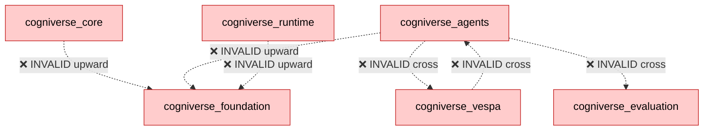

---

## Build and Deployment

### Package Build Pipeline

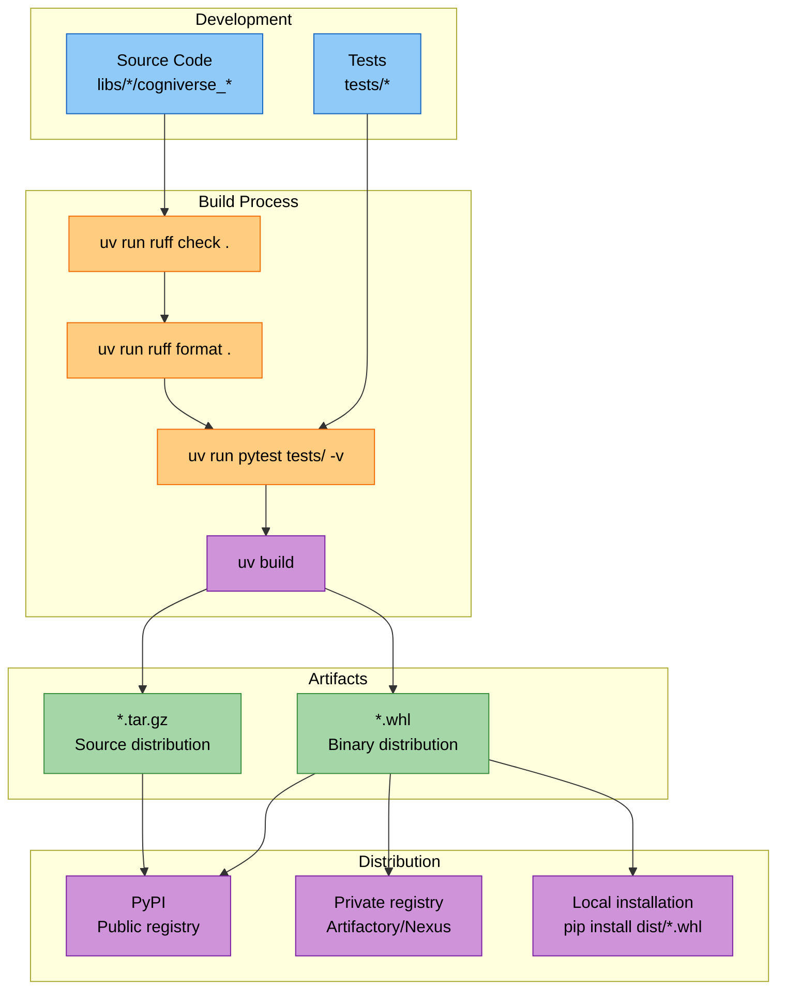

### Workspace Sync Flow (Layered Structure)

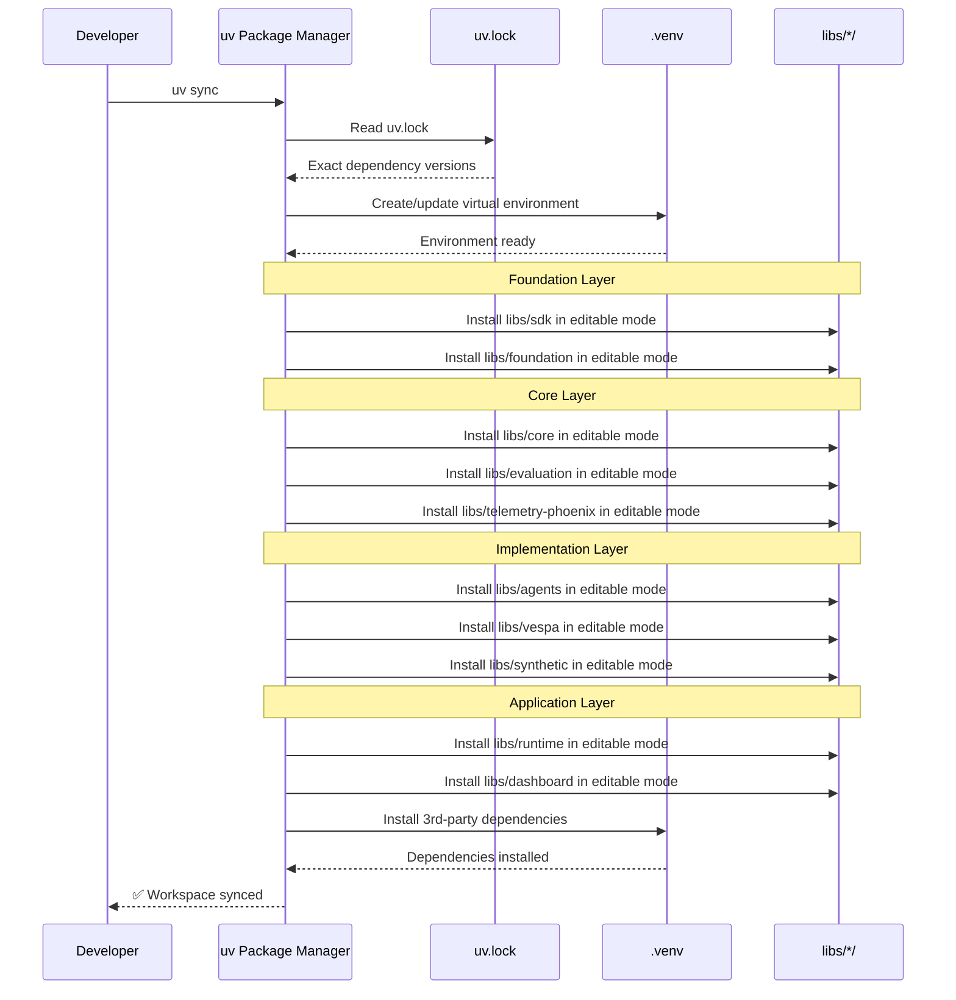

### Package Release Flow (Layered Structure)

```mermaid
flowchart TB
    subgraph VersionUpdate["<span style='color:#000'>Version Update</span>"]
        UpdateVersion["<span style='color:#000'>Update version in<br/>pyproject.toml</span>"]
        UpdateChangelog["<span style='color:#000'>Update CHANGELOG.md</span>"]
        UpdateDeps["<span style='color:#000'>Update inter-package<br/>dependencies</span>"]
    end

    subgraph BuildTest["<span style='color:#000'>Build & Test</span>"]
        BuildPkg["<span style='color:#000'>uv build</span>"]
        TestBuild["<span style='color:#000'>Test built packages<br/>in clean environment</span>"]
    end

    subgraph GitOps["<span style='color:#000'>Git Operations</span>"]
        CommitChanges["<span style='color:#000'>git commit -m<br/>Release v0.2.0</span>"]
        CreateTag["<span style='color:#000'>git tag -a v0.2.0</span>"]
        PushTag["<span style='color:#000'>git push origin v0.2.0</span>"]
    end

    subgraph Publish["<span style='color:#000'>Publish (Layer Order)</span>"]
        PublishFoundation["<span style='color:#000'>1. Foundation Layer<br/>sdk, foundation</span>"]
        PublishCore["<span style='color:#000'>2. Core Layer<br/>core, evaluation, telemetry-phoenix</span>"]
        PublishImpl["<span style='color:#000'>3. Implementation Layer<br/>agents, vespa, synthetic</span>"]
        PublishApp["<span style='color:#000'>4. Application Layer<br/>runtime, dashboard</span>"]
    end

    UpdateVersion --> UpdateChangelog
    UpdateChangelog --> UpdateDeps
    UpdateDeps --> BuildPkg
    BuildPkg --> TestBuild
    TestBuild --> CommitChanges
    CommitChanges --> CreateTag
    CreateTag --> PushTag

    PushTag --> PublishFoundation
    PublishFoundation --> PublishCore
    PublishCore --> PublishImpl
    PublishImpl --> PublishApp

    style UpdateVersion fill:#a5d6a7,stroke:#388e3c,color:#000
    style UpdateChangelog fill:#a5d6a7,stroke:#388e3c,color:#000
    style UpdateDeps fill:#a5d6a7,stroke:#388e3c,color:#000
    style BuildPkg fill:#ce93d8,stroke:#7b1fa2,color:#000
    style TestBuild fill:#ce93d8,stroke:#7b1fa2,color:#000
    style CommitChanges fill:#ffcc80,stroke:#ef6c00,color:#000
    style CreateTag fill:#ffcc80,stroke:#ef6c00,color:#000
    style PushTag fill:#ffcc80,stroke:#ef6c00,color:#000
    style PublishFoundation fill:#a5d6a7,stroke:#388e3c,color:#000
    style PublishCore fill:#ce93d8,stroke:#7b1fa2,color:#000
    style PublishImpl fill:#ffcc80,stroke:#ef6c00,color:#000
    style PublishApp fill:#90caf9,stroke:#1565c0,color:#000
```

### Deployment Architecture (Layered Structure)

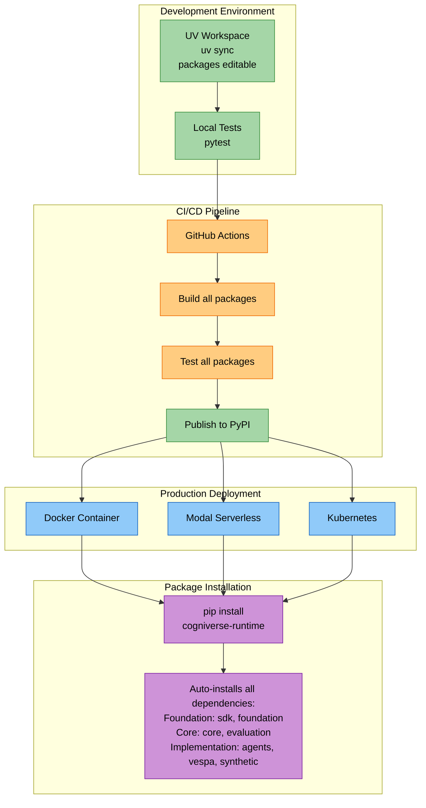

---

## Summary

This diagram collection provides comprehensive visual documentation of the **layered architecture**:

1. **Package Dependencies**: Clear 4-layer hierarchy (Foundation → Core → Implementation → Application)
2. **Internal Structure**: Detailed breakdown of each package's modules by layer
3. **Data Flow**: Cross-package interactions during ingestion, routing, and search
4. **Import Patterns**: Valid and invalid import paths with layer enforcement
5. **Build & Deploy**: Complete pipeline from development to production

**Layered Architecture Layers:**

| Layer | Packages | Purpose | Color |
|-------|----------|---------|-------|
| **Foundation** | sdk, foundation | Base configuration, telemetry interfaces, common utilities | Green (#a5d6a7) |
| **Core** | core, evaluation, telemetry-phoenix | Multi-agent system, experiment tracking, Phoenix provider | Purple (#ce93d8) |
| **Implementation** | agents, vespa, synthetic, finetuning | Concrete agents, backends, data generation, model training | Orange (#ffcc80) |
| **Application** | runtime, dashboard | FastAPI server, Ingestion pipeline, Streamlit UI | Blue (#90caf9) |

**Key Principles:**

- **Layered Dependencies**: Each layer only depends on layers below it

- **No Circular Dependencies**: Strict unidirectional flow prevents coupling

- **Separation of Concerns**: Foundation provides interfaces, Core provides orchestration, Implementation provides specifics

- **UV Workspace**: Enables editable installs for all packages during development

- **Tenant Isolation**: Maintained across all layers via configuration and naming conventions

**Related Documentation:**

- [SDK Architecture](../architecture/sdk-architecture.md)

- [Layered Architecture Guide](../architecture/overview.md)

- [Package Development](../development/package-dev.md)

- [Multi-Tenant Architecture](../architecture/multi-tenant.md)
