# SDK Architecture Diagrams

**Last Updated:** 2026-01-25
**Purpose:** Comprehensive visual documentation of UV workspace SDK architecture with 11-package layered structure

---

## Table of Contents
1. [Package Dependency Graph](#package-dependency-graph)
2. [Package Internal Structure](#package-internal-structure)
3. [Cross-Package Data Flow](#cross-package-data-flow)
4. [Import Patterns](#import-patterns)
5. [Build and Deployment](#build-and-deployment)

---

## Package Dependency Graph

### High-Level Package Dependencies (11-Package Structure)

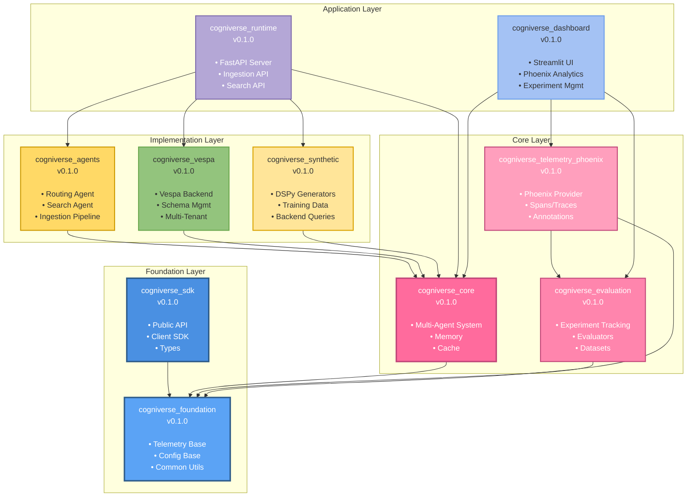

### Detailed Dependency Chain (Layered Architecture)

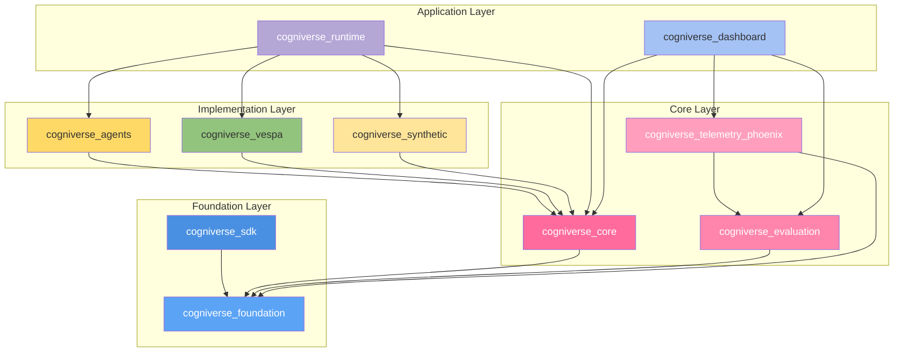

---

## Package Internal Structure

### cogniverse_foundation Package Structure (Foundation Layer)

```mermaid
graph TB
    FoundationPkg[cogniverse_foundation]

    subgraph "Telemetry Base"
        TelemetryMgr[TelemetryManager]
        ProviderRegistry[Provider Registry]
        TelemetryInterfaces[Telemetry Interfaces]
    end

    subgraph "Configuration Base"
        ConfigMgr[ConfigManager]
        UnifiedConfig[UnifiedConfig]
        TenantConfig[TenantConfig]
    end

    subgraph "Common Utilities"
        LoggingUtils[Logging]
        ExceptionHandling[Exceptions]
        TypeUtils[Type Utilities]
    end

    FoundationPkg --> TelemetryMgr
    FoundationPkg --> ProviderRegistry
    FoundationPkg --> TelemetryInterfaces
    FoundationPkg --> ConfigMgr
    FoundationPkg --> UnifiedConfig
    FoundationPkg --> TenantConfig
    FoundationPkg --> LoggingUtils
    FoundationPkg --> ExceptionHandling
    FoundationPkg --> TypeUtils

    style FoundationPkg fill:#5BA3F5,stroke:#2E5C8A,stroke-width:3px,color:#fff
    style TelemetryMgr fill:#7AB8F7,color:#fff
    style ProviderRegistry fill:#7AB8F7,color:#fff
    style TelemetryInterfaces fill:#7AB8F7,color:#fff
    style ConfigMgr fill:#99C9F9,color:#fff
    style UnifiedConfig fill:#99C9F9,color:#fff
    style TenantConfig fill:#99C9F9,color:#fff
    style LoggingUtils fill:#B8DAFB
    style ExceptionHandling fill:#B8DAFB
    style TypeUtils fill:#B8DAFB
```

### cogniverse_core Package Structure (Core Layer)

```mermaid
graph TB
    CorePkg[cogniverse_core]

    subgraph "Multi-Agent System"
        AgentOrchestrator[Agent Orchestrator]
        AgentContext[Agent Context]
        AgentRegistry[Agent Registry]
    end

    subgraph "Memory Management"
        MemoryManager[Memory Manager]
        ConversationMemory[Conversation Memory]
        Mem0Integration[Mem0 Integration]
    end

    subgraph "Cache System"
        CacheManager[Cache Manager]
        RedisBackend[Redis Backend]
        InMemoryCache[In-Memory Cache]
    end

    subgraph "Common"
        Utils[Utilities]
        Types[Type Definitions]
    end

    CorePkg --> AgentOrchestrator
    CorePkg --> AgentContext
    CorePkg --> AgentRegistry
    CorePkg --> MemoryManager
    CorePkg --> ConversationMemory
    CorePkg --> Mem0Integration
    CorePkg --> CacheManager
    CorePkg --> RedisBackend
    CorePkg --> InMemoryCache
    CorePkg --> Utils
    CorePkg --> Types

    style CorePkg fill:#FF6B9D,stroke:#C1487A,stroke-width:3px,color:#fff
    style AgentOrchestrator fill:#FF85AD,color:#fff
    style AgentContext fill:#FF85AD,color:#fff
    style AgentRegistry fill:#FF85AD,color:#fff
    style MemoryManager fill:#FF9FBD,color:#fff
    style ConversationMemory fill:#FF9FBD,color:#fff
    style Mem0Integration fill:#FF9FBD,color:#fff
    style CacheManager fill:#FFB8CD
    style RedisBackend fill:#FFB8CD
    style InMemoryCache fill:#FFB8CD
    style Utils fill:#FFD1DD
    style Types fill:#FFD1DD
```

### cogniverse_evaluation Package Structure (Core Layer)

```mermaid
graph TB
    EvalPkg[cogniverse_evaluation]

    subgraph "Experiment Tracking"
        ExperimentTracker[Experiment Tracker]
        RunManager[Run Manager]
        MetricsCollector[Metrics Collector]
    end

    subgraph "Evaluators"
        BaseEvaluator[Base Evaluator]
        LLMEvaluator[LLM Evaluator]
        MetricEvaluator[Metric Evaluator]
    end

    subgraph "Dataset Management"
        DatasetManager[Dataset Manager]
        DatasetLoader[Dataset Loader]
        DatasetValidator[Dataset Validator]
    end

    EvalPkg --> ExperimentTracker
    EvalPkg --> RunManager
    EvalPkg --> MetricsCollector
    EvalPkg --> BaseEvaluator
    EvalPkg --> LLMEvaluator
    EvalPkg --> MetricEvaluator
    EvalPkg --> DatasetManager
    EvalPkg --> DatasetLoader
    EvalPkg --> DatasetValidator

    style EvalPkg fill:#FF85AD,stroke:#C1487A,stroke-width:2px,color:#fff
    style ExperimentTracker fill:#FF9FBD,color:#fff
    style RunManager fill:#FF9FBD,color:#fff
    style MetricsCollector fill:#FF9FBD,color:#fff
    style BaseEvaluator fill:#FFB8CD
    style LLMEvaluator fill:#FFB8CD
    style MetricEvaluator fill:#FFB8CD
    style DatasetManager fill:#FFD1DD
    style DatasetLoader fill:#FFD1DD
    style DatasetValidator fill:#FFD1DD
```

### cogniverse_agents Package Structure (Implementation Layer)

```mermaid
graph TB
    AgentsPkg[cogniverse_agents]

    subgraph "Agents"
        BaseAgent[BaseAgent]
        RoutingAgent[RoutingAgent]
        VideoSearchAgent[VideoSearchAgent]
        ComposingAgent[ComposingAgent]
    end

    subgraph "Routing"
        RoutingConfig[RoutingConfig]
        GLiNERStrategy[GLiNER Strategy]
        LLMStrategy[LLM Strategy]
        Optimizer[Optimizer]
    end

    subgraph "Ingestion"
        Pipeline[Pipeline]
        Processors[Processors]
        Extractors[Extractors]
    end

    subgraph "Search"
        Reranker[Multi-Modal Reranker]
        SearchEngine[Search Engine]
    end

    subgraph "Tools"
        A2ATools[A2A Tools]
        VideoPlayer[Video Player]
    end

    AgentsPkg --> BaseAgent
    AgentsPkg --> RoutingAgent
    AgentsPkg --> VideoSearchAgent
    AgentsPkg --> ComposingAgent
    AgentsPkg --> RoutingConfig
    AgentsPkg --> GLiNERStrategy
    AgentsPkg --> LLMStrategy
    AgentsPkg --> Optimizer
    AgentsPkg --> Pipeline
    AgentsPkg --> Processors
    AgentsPkg --> Extractors
    AgentsPkg --> Reranker
    AgentsPkg --> SearchEngine
    AgentsPkg --> A2ATools
    AgentsPkg --> VideoPlayer

    style AgentsPkg fill:#FFD966,stroke:#CC9900,stroke-width:3px
    style BaseAgent fill:#FFE082
    style RoutingAgent fill:#FFE082
    style VideoSearchAgent fill:#FFE082
    style ComposingAgent fill:#FFE082
    style RoutingConfig fill:#FFE79E
    style GLiNERStrategy fill:#FFE79E
    style LLMStrategy fill:#FFE79E
    style Optimizer fill:#FFE79E
    style Pipeline fill:#FFEDBA
    style Processors fill:#FFEDBA
    style Extractors fill:#FFEDBA
    style Reranker fill:#FFF3D6
    style SearchEngine fill:#FFF3D6
    style A2ATools fill:#FFFAF2
    style VideoPlayer fill:#FFFAF2
```

### cogniverse_vespa Package Structure (Implementation Layer)

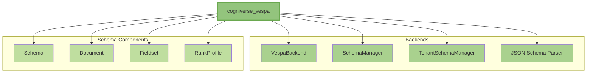

---

## Cross-Package Data Flow

### Video Ingestion Flow Across Packages (11-Package Architecture)

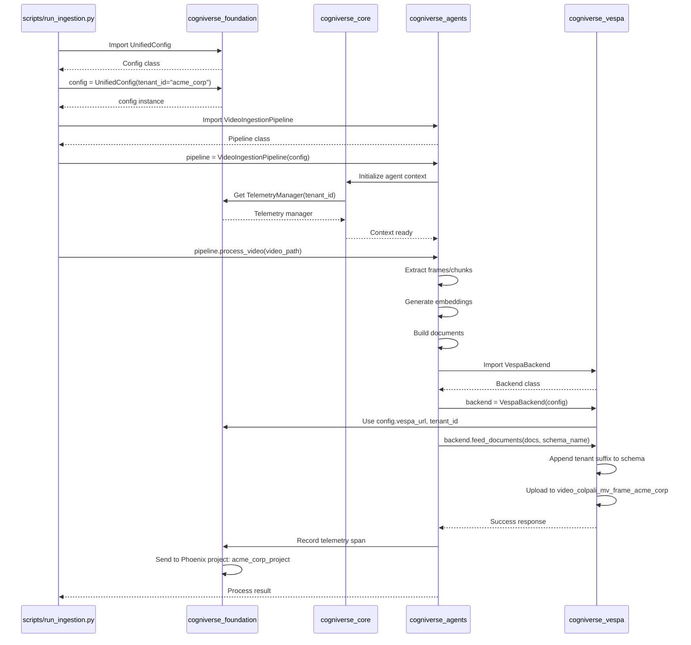

### Query Routing Flow Across Packages (11-Package Architecture)

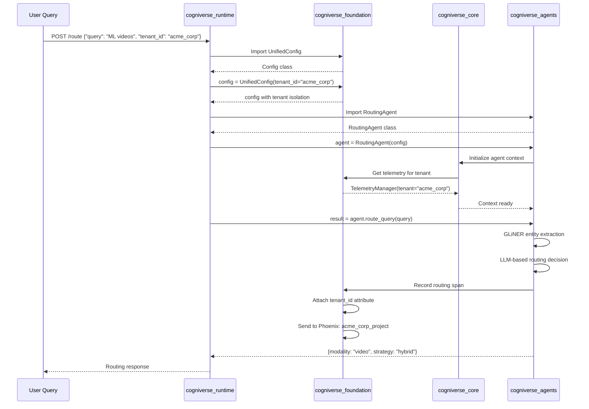

### Search Flow Across Packages (11-Package Architecture)

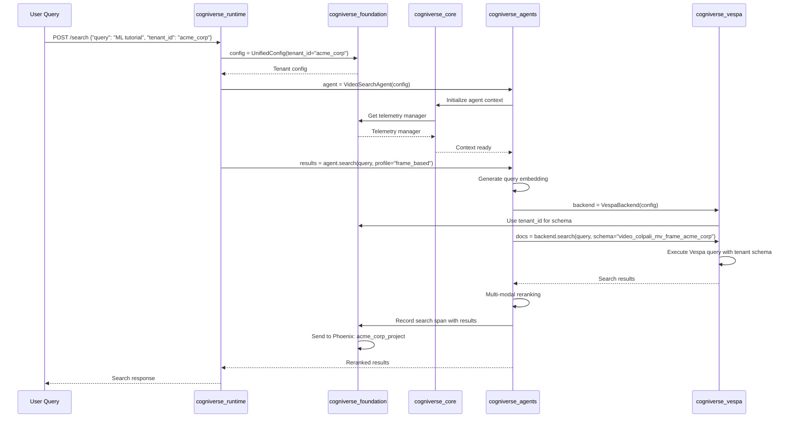

---

## Import Patterns

### Correct Import Patterns by Package (11-Package Architecture)

```mermaid
graph TB
    subgraph "Scripts Layer"
        Script[scripts/run_ingestion.py]
    end

    subgraph "cogniverse_foundation Imports"
        FoundationConfig["from cogniverse_foundation.config import UnifiedConfig"]
        FoundationTelemetry["from cogniverse_foundation.telemetry import TelemetryManager"]
    end

    subgraph "cogniverse_core Imports"
        CoreAgent["from cogniverse_core.agents import AgentContext"]
        CoreMemory["from cogniverse_core.memory import MemoryManager"]
        CoreCache["from cogniverse_core.cache import CacheManager"]
    end

    subgraph "cogniverse_evaluation Imports"
        EvalTracker["from cogniverse_evaluation.tracking import ExperimentTracker"]
        EvalDataset["from cogniverse_evaluation.datasets import DatasetManager"]
    end

    subgraph "cogniverse_agents Imports"
        AgentsPipeline["from cogniverse_agents.ingestion import VideoIngestionPipeline"]
        AgentsRouting["from cogniverse_agents.routing import RoutingAgent"]
        AgentsSearch["from cogniverse_agents.search import MultiModalReranker"]
    end

    subgraph "cogniverse_vespa Imports"
        VespaBackend["from cogniverse_vespa.backends import VespaBackend"]
        VespaSchema["from cogniverse_vespa.backends import VespaSchemaManager"]
    end

    Script --> FoundationConfig
    Script --> FoundationTelemetry
    Script --> CoreAgent
    Script --> CoreMemory
    Script --> EvalTracker
    Script --> EvalDataset
    Script --> AgentsPipeline
    Script --> AgentsRouting
    Script --> AgentsSearch
    Script --> VespaBackend
    Script --> VespaSchema

    style Script fill:#f0f0f0
    style FoundationConfig fill:#5BA3F5,color:#fff
    style FoundationTelemetry fill:#5BA3F5,color:#fff
    style CoreAgent fill:#FF6B9D,color:#fff
    style CoreMemory fill:#FF6B9D,color:#fff
    style CoreCache fill:#FF6B9D,color:#fff
    style EvalTracker fill:#FF85AD,color:#fff
    style EvalDataset fill:#FF85AD,color:#fff
    style AgentsPipeline fill:#FFD966
    style AgentsRouting fill:#FFD966
    style AgentsSearch fill:#FFD966
    style VespaBackend fill:#93C47D
    style VespaSchema fill:#93C47D
```

### Package Import Dependencies (Valid Paths - 11 Packages)

```mermaid
graph TB
    subgraph "cogniverse_foundation CAN import"
        FoundationStdLib[Python stdlib]
        FoundationThirdParty[3rd party:<br/>pydantic, httpx,<br/>opentelemetry]
    end

    subgraph "cogniverse_core CAN import"
        CoreFoundation[cogniverse_foundation.*]
        CoreThirdParty[3rd party:<br/>mem0ai, redis]
    end

    subgraph "cogniverse_evaluation CAN import"
        EvalFoundation[cogniverse_foundation.*]
        EvalThirdParty[3rd party:<br/>pandas, polars]
    end

    subgraph "cogniverse_agents CAN import"
        AgentsCore[cogniverse_core.*]
        AgentsThirdParty[3rd party:<br/>litellm, PIL,<br/>transformers, dspy]
    end

    subgraph "cogniverse_runtime CAN import"
        RuntimeCore[cogniverse_core.*]
        RuntimeAgents[cogniverse_agents.*]
        RuntimeVespa[cogniverse_vespa.*]
        RuntimeSynthetic[cogniverse_synthetic.*]
        RuntimeThirdParty[3rd party:<br/>fastapi, uvicorn]
    end

    Foundation[cogniverse_foundation] --> FoundationStdLib
    Foundation --> FoundationThirdParty

    Core[cogniverse_core] --> CoreFoundation
    Core --> CoreThirdParty

    Evaluation[cogniverse_evaluation] --> EvalFoundation
    Evaluation --> EvalThirdParty

    Agents[cogniverse_agents] --> AgentsCore
    Agents --> AgentsThirdParty

    Runtime[cogniverse_runtime] --> RuntimeCore
    Runtime --> RuntimeAgents
    Runtime --> RuntimeVespa
    Runtime --> RuntimeSynthetic
    Runtime --> RuntimeThirdParty

    style Foundation fill:#5BA3F5,color:#fff
    style Core fill:#FF6B9D,color:#fff
    style Evaluation fill:#FF85AD,color:#fff
    style Agents fill:#FFD966
    style Runtime fill:#B4A7D6,color:#fff
```

### INVALID Import Patterns (Circular Dependencies)

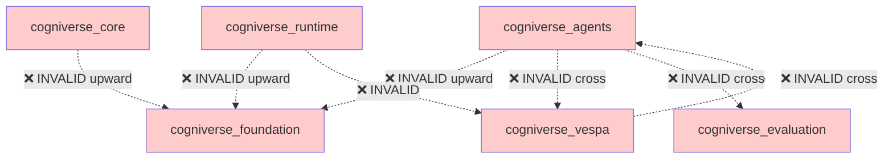

---

## Build and Deployment

### Package Build Pipeline

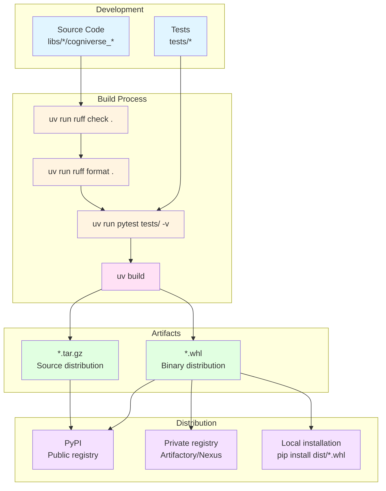

### Workspace Sync Flow (11-Package Structure)

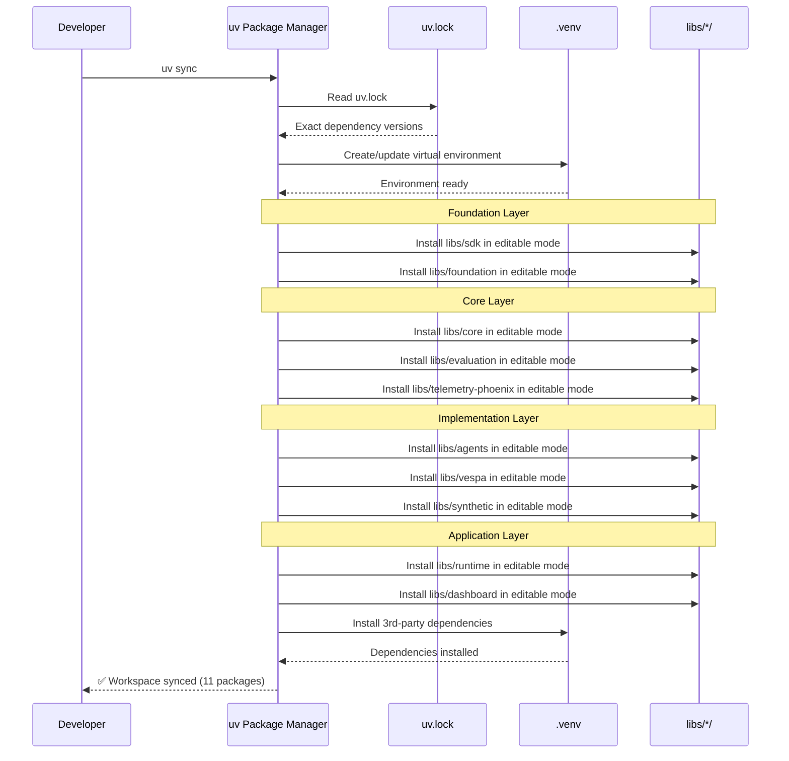

### Package Release Flow (11-Package Structure)

```mermaid
graph TB
    subgraph "Version Update"
        UpdateVersion[Update version in<br/>pyproject.toml]
        UpdateChangelog[Update CHANGELOG.md]
        UpdateDeps[Update inter-package<br/>dependencies]
    end

    subgraph "Build & Test"
        BuildPkg[uv build]
        TestBuild[Test built packages<br/>in clean environment]
    end

    subgraph "Git Operations"
        CommitChanges[git commit -m<br/>"Release v0.2.0"]
        CreateTag[git tag -a v0.2.0]
        PushTag[git push origin v0.2.0]
    end

    subgraph "Publish (Layer Order)"
        PublishFoundation[1. Foundation Layer<br/>sdk, foundation]
        PublishCore[2. Core Layer<br/>core, evaluation, telemetry-phoenix]
        PublishImpl[3. Implementation Layer<br/>agents, vespa, synthetic]
        PublishApp[4. Application Layer<br/>runtime, dashboard]
    end

    UpdateVersion --> UpdateChangelog
    UpdateChangelog --> UpdateDeps
    UpdateDeps --> BuildPkg
    BuildPkg --> TestBuild
    TestBuild --> CommitChanges
    CommitChanges --> CreateTag
    CreateTag --> PushTag

    PushTag --> PublishFoundation
    PublishFoundation --> PublishCore
    PublishCore --> PublishImpl
    PublishImpl --> PublishApp

    style UpdateVersion fill:#5BA3F5,color:#fff
    style UpdateChangelog fill:#5BA3F5,color:#fff
    style UpdateDeps fill:#5BA3F5,color:#fff
    style BuildPkg fill:#FF6B9D,color:#fff
    style TestBuild fill:#FF6B9D,color:#fff
    style CommitChanges fill:#FFD966
    style CreateTag fill:#FFD966
    style PushTag fill:#FFD966
    style PublishFoundation fill:#5BA3F5,color:#fff
    style PublishCore fill:#FF6B9D,color:#fff
    style PublishImpl fill:#FFD966
    style PublishApp fill:#B4A7D6,color:#fff
```

### Deployment Architecture (11-Package Structure)

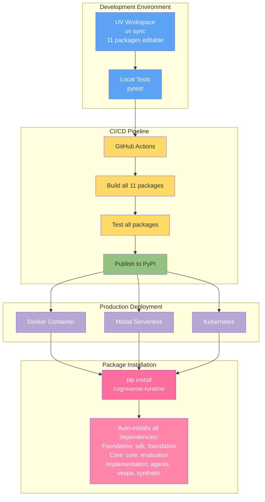

---

## Summary

This diagram collection provides comprehensive visual documentation of the **11-package layered architecture**:

1. **Package Dependencies**: Clear 4-layer hierarchy (Foundation → Core → Implementation → Application)
2. **Internal Structure**: Detailed breakdown of each package's modules by layer
3. **Data Flow**: Cross-package interactions during ingestion, routing, and search
4. **Import Patterns**: Valid and invalid import paths with layer enforcement
5. **Build & Deploy**: Complete pipeline from development to production

**11-Package Architecture Layers:**

| Layer | Packages | Purpose | Color |
|-------|----------|---------|-------|
| **Foundation** | sdk, foundation | Base configuration, telemetry interfaces, common utilities | Blue |
| **Core** | core, evaluation, telemetry-phoenix | Multi-agent system, experiment tracking, Phoenix provider | Pink |
| **Implementation** | agents, vespa, synthetic | Concrete agents, backends, data generation | Yellow/Green |
| **Application** | runtime, dashboard | FastAPI server, Streamlit UI | Light Blue/Purple |

**Key Principles:**
- **Layered Dependencies**: Each layer only depends on layers below it
- **No Circular Dependencies**: Strict unidirectional flow prevents coupling
- **Separation of Concerns**: Foundation provides interfaces, Core provides orchestration, Implementation provides specifics
- **UV Workspace**: Enables editable installs for all 11 packages during development
- **Tenant Isolation**: Maintained across all layers via configuration and naming conventions

**Related Documentation:**
- [SDK Architecture](../architecture/sdk-architecture.md)
- [11-Package Architecture Guide](../architecture/overview.md)
- [Package Development](../development/package-dev.md)
- [Multi-Tenant Architecture](../architecture/multi-tenant.md)
