# SDK Architecture Diagrams

**Last Updated:** 2025-10-15
**Purpose:** Comprehensive visual documentation of UV workspace SDK architecture

---

## Table of Contents
1. [Package Dependency Graph](#package-dependency-graph)
2. [Package Internal Structure](#package-internal-structure)
3. [Cross-Package Data Flow](#cross-package-data-flow)
4. [Import Patterns](#import-patterns)
5. [Build and Deployment](#build-and-deployment)

---

## Package Dependency Graph

### High-Level Package Dependencies

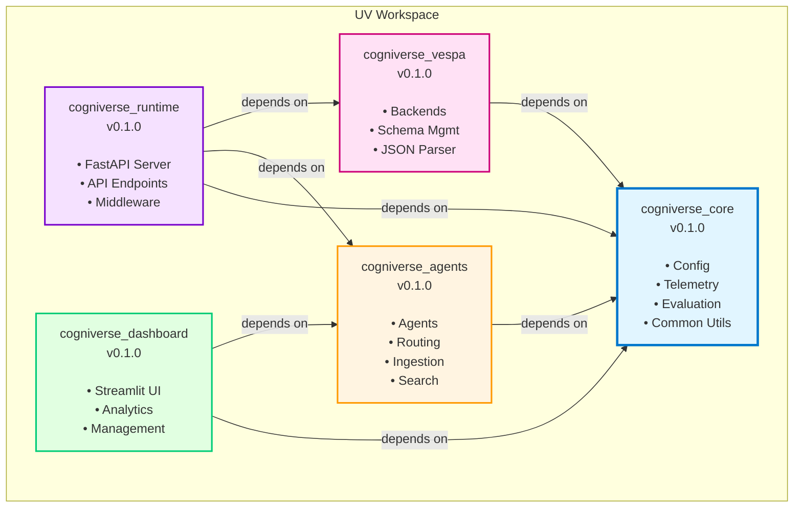

### Detailed Dependency Chain

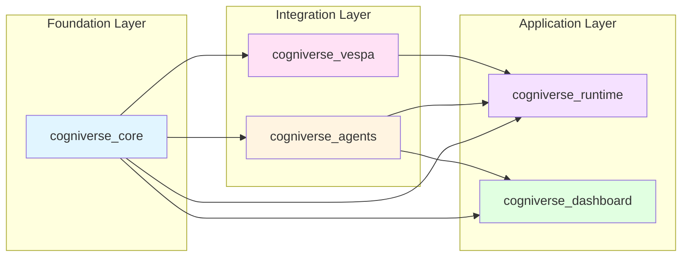

---

## Package Internal Structure

### cogniverse_core Package Structure

```mermaid
graph TB
    CorePkg[cogniverse_core]

    subgraph "Configuration"
        ConfigMgr[config_manager]
        UnifiedConfig[unified_config]
        TenantConfig[tenant_config]
    end

    subgraph "Telemetry"
        TelemetryMgr[TelemetryManager]
        PhoenixIntegration[Phoenix Integration]
        SpanExporter[Span Exporter]
    end

    subgraph "Evaluation"
        ExperimentTracker[ExperimentTracker]
        Evaluators[Evaluators]
        DatasetMgr[DatasetManager]
    end

    subgraph "Common"
        Cache[Cache System]
        Memory[Memory Mgmt]
        Utils[Utilities]
    end

    CorePkg --> ConfigMgr
    CorePkg --> UnifiedConfig
    CorePkg --> TenantConfig
    CorePkg --> TelemetryMgr
    CorePkg --> PhoenixIntegration
    CorePkg --> SpanExporter
    CorePkg --> ExperimentTracker
    CorePkg --> Evaluators
    CorePkg --> DatasetMgr
    CorePkg --> Cache
    CorePkg --> Memory
    CorePkg --> Utils

    style CorePkg fill:#e1f5ff,stroke:#0077cc,stroke-width:3px
    style ConfigMgr fill:#cce5ff
    style UnifiedConfig fill:#cce5ff
    style TenantConfig fill:#cce5ff
    style TelemetryMgr fill:#b3d9ff
    style PhoenixIntegration fill:#b3d9ff
    style SpanExporter fill:#b3d9ff
    style ExperimentTracker fill:#99ccff
    style Evaluators fill:#99ccff
    style DatasetMgr fill:#99ccff
    style Cache fill:#80bfff
    style Memory fill:#80bfff
    style Utils fill:#80bfff
```

### cogniverse_agents Package Structure

```mermaid
graph TB
    AgentsPkg[cogniverse_agents]

    subgraph "Agents"
        BaseAgent[BaseAgent]
        RoutingAgent[RoutingAgent]
        VideoSearchAgent[VideoSearchAgent]
        ComposingAgent[ComposingAgent]
    end

    subgraph "Routing"
        RoutingConfig[RoutingConfig]
        GLiNERStrategy[GLiNER Strategy]
        LLMStrategy[LLM Strategy]
        Optimizer[Optimizer]
    end

    subgraph "Ingestion"
        Pipeline[Pipeline]
        Processors[Processors]
        Extractors[Extractors]
    end

    subgraph "Search"
        Reranker[Multi-Modal Reranker]
        SearchEngine[Search Engine]
    end

    subgraph "Tools"
        A2ATools[A2A Tools]
        VideoPlayer[Video Player]
    end

    AgentsPkg --> BaseAgent
    AgentsPkg --> RoutingAgent
    AgentsPkg --> VideoSearchAgent
    AgentsPkg --> ComposingAgent
    AgentsPkg --> RoutingConfig
    AgentsPkg --> GLiNERStrategy
    AgentsPkg --> LLMStrategy
    AgentsPkg --> Optimizer
    AgentsPkg --> Pipeline
    AgentsPkg --> Processors
    AgentsPkg --> Extractors
    AgentsPkg --> Reranker
    AgentsPkg --> SearchEngine
    AgentsPkg --> A2ATools
    AgentsPkg --> VideoPlayer

    style AgentsPkg fill:#fff4e1,stroke:#ff9900,stroke-width:3px
    style BaseAgent fill:#ffebcc
    style RoutingAgent fill:#ffebcc
    style VideoSearchAgent fill:#ffebcc
    style ComposingAgent fill:#ffebcc
    style RoutingConfig fill:#ffe0b3
    style GLiNERStrategy fill:#ffe0b3
    style LLMStrategy fill:#ffe0b3
    style Optimizer fill:#ffe0b3
    style Pipeline fill:#ffd699
    style Processors fill:#ffd699
    style Extractors fill:#ffd699
    style Reranker fill:#ffcc80
    style SearchEngine fill:#ffcc80
    style A2ATools fill:#ffc266
    style VideoPlayer fill:#ffc266
```

### cogniverse_vespa Package Structure

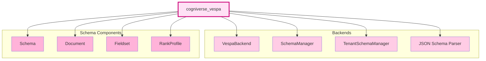

---

## Cross-Package Data Flow

### Video Ingestion Flow Across Packages

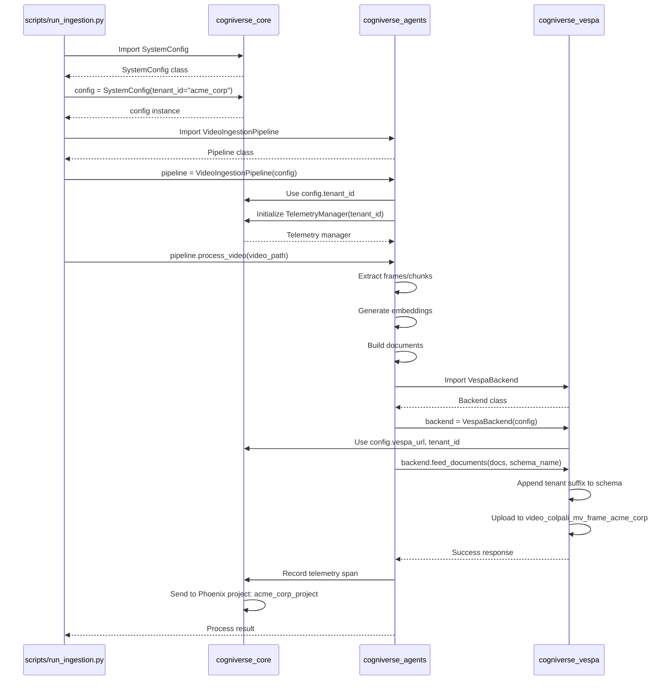

### Query Routing Flow Across Packages

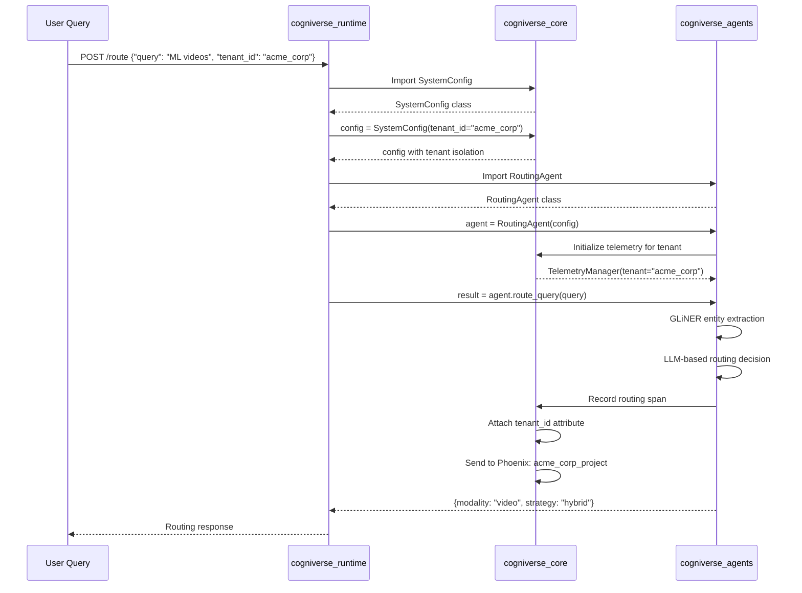

### Search Flow Across Packages

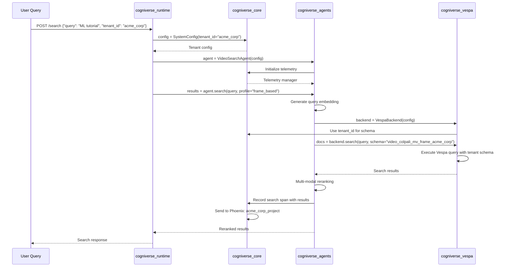

---

## Import Patterns

### Correct Import Patterns by Package

```mermaid
graph TB
    subgraph "Scripts Layer"
        Script[scripts/run_ingestion.py]
    end

    subgraph "cogniverse_core Imports"
        CoreConfig["from cogniverse_core.config import SystemConfig"]
        CoreTelemetry["from cogniverse_core.telemetry import TelemetryManager"]
        CoreEval["from cogniverse_core.evaluation import ExperimentTracker"]
    end

    subgraph "cogniverse_agents Imports"
        AgentsPipeline["from cogniverse_agents.ingestion import VideoIngestionPipeline"]
        AgentsRouting["from cogniverse_agents.routing import RoutingAgent"]
        AgentsSearch["from cogniverse_agents.search import MultiModalReranker"]
    end

    subgraph "cogniverse_vespa Imports"
        VespaBackend["from cogniverse_vespa.backends import VespaBackend"]
        VespaSchema["from cogniverse_vespa.backends import VespaSchemaManager"]
    end

    Script --> CoreConfig
    Script --> CoreTelemetry
    Script --> CoreEval
    Script --> AgentsPipeline
    Script --> AgentsRouting
    Script --> AgentsSearch
    Script --> VespaBackend
    Script --> VespaSchema

    style Script fill:#f0f0f0
    style CoreConfig fill:#e1f5ff
    style CoreTelemetry fill:#e1f5ff
    style CoreEval fill:#e1f5ff
    style AgentsPipeline fill:#fff4e1
    style AgentsRouting fill:#fff4e1
    style AgentsSearch fill:#fff4e1
    style VespaBackend fill:#ffe1f5
    style VespaSchema fill:#ffe1f5
```

### Package Import Dependencies (Valid Paths)

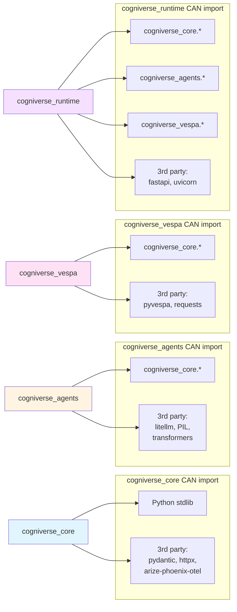

### INVALID Import Patterns (Circular Dependencies)

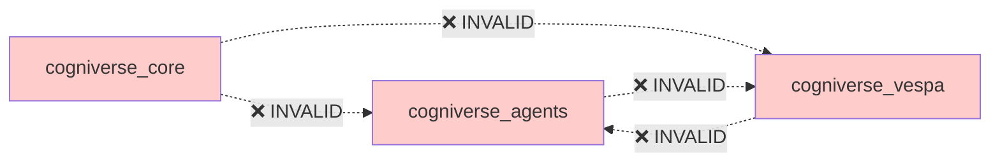

---

## Build and Deployment

### Package Build Pipeline

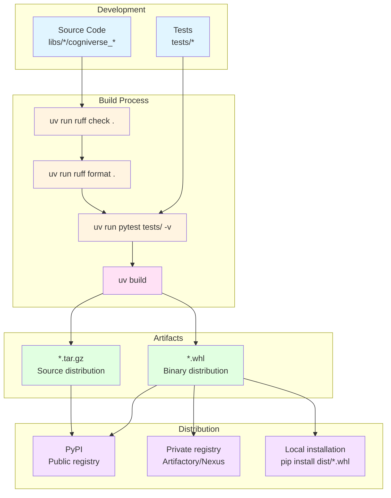

### Workspace Sync Flow

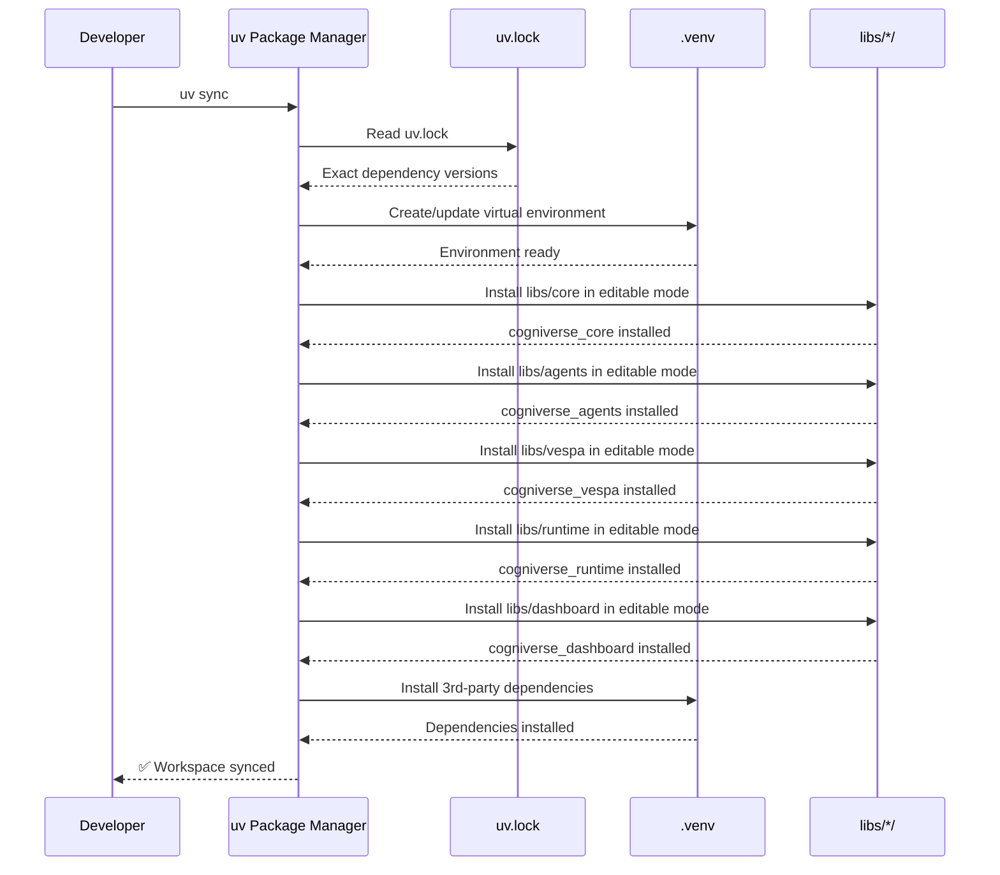

### Package Release Flow

```mermaid
graph TB
    subgraph "Version Update"
        UpdateVersion[Update version in<br/>pyproject.toml]
        UpdateChangelog[Update CHANGELOG.md]
        UpdateDeps[Update inter-package<br/>dependencies]
    end

    subgraph "Build & Test"
        BuildPkg[uv build]
        TestBuild[Test built packages<br/>in clean environment]
    end

    subgraph "Git Operations"
        CommitChanges[git commit -m<br/>"Release v0.2.0"]
        CreateTag[git tag -a v0.2.0]
        PushTag[git push origin v0.2.0]
    end

    subgraph "Publish"
        PublishCore[Publish cogniverse-core]
        PublishVespa[Publish cogniverse-vespa]
        PublishAgents[Publish cogniverse-agents]
        PublishRuntime[Publish cogniverse-runtime]
        PublishDashboard[Publish cogniverse-dashboard]
    end

    UpdateVersion --> UpdateChangelog
    UpdateChangelog --> UpdateDeps
    UpdateDeps --> BuildPkg
    BuildPkg --> TestBuild
    TestBuild --> CommitChanges
    CommitChanges --> CreateTag
    CreateTag --> PushTag

    PushTag --> PublishCore
    PublishCore --> PublishVespa
    PublishVespa --> PublishAgents
    PublishAgents --> PublishRuntime
    PublishRuntime --> PublishDashboard

    style UpdateVersion fill:#e1f5ff
    style UpdateChangelog fill:#e1f5ff
    style UpdateDeps fill:#e1f5ff
    style BuildPkg fill:#fff4e1
    style TestBuild fill:#fff4e1
    style CommitChanges fill:#ffe1f5
    style CreateTag fill:#ffe1f5
    style PushTag fill:#ffe1f5
    style PublishCore fill:#e1ffe1
    style PublishVespa fill:#e1ffe1
    style PublishAgents fill:#e1ffe1
    style PublishRuntime fill:#e1ffe1
    style PublishDashboard fill:#e1ffe1
```

### Deployment Architecture

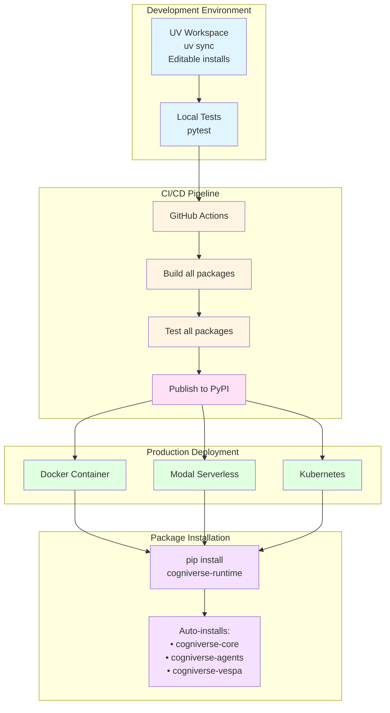

---

## Summary

This diagram collection provides comprehensive visual documentation of:

1. **Package Dependencies**: Clear hierarchy with core as foundation
2. **Internal Structure**: Detailed breakdown of each package's modules
3. **Data Flow**: Cross-package interactions during ingestion, routing, and search
4. **Import Patterns**: Valid and invalid import paths
5. **Build & Deploy**: Complete pipeline from development to production

**Key Principles:**
- Unidirectional dependencies (agents/vespa → core, runtime → all)
- UV workspace enables editable installs for development
- Build artifacts (wheels) for production deployment
- Tenant isolation maintained across all package interactions

**Related Documentation:**
- [SDK Architecture](../architecture/sdk-architecture.md)
- [Package Development](../development/package-dev.md)
- [Multi-Tenant Architecture](../architecture/multi-tenant.md)
