# SDK Architecture Diagrams
---

## Table of Contents
1. [Package Dependency Graph](#package-dependency-graph)
2. [Package Internal Structure](#package-internal-structure) — all 13 workspace packages: sdk, foundation, core, evaluation, telemetry_phoenix, synthetic, agents, vespa, runtime, dashboard, messaging, finetuning, cli
3. [Cross-Package Data Flow](#cross-package-data-flow)
   - [Video Ingestion Flow](#video-ingestion-flow-across-packages-layered-architecture)
   - [Query Routing Flow](#query-routing-flow-across-packages-layered-architecture)
   - [Search Flow (with Knowledge Subsystem)](#search-flow-across-packages-layered-architecture)
   - [Knowledge Synthesis Flow](#knowledge-synthesis-flow-across-packages)
   - [Sandbox Policy Flow](#sandbox-policy-flow)
4. [Import Patterns](#import-patterns)
5. [Build and Deployment](#build-and-deployment)

---

## Package Dependency Graph

### High-Level Package Dependencies (Layered Structure)

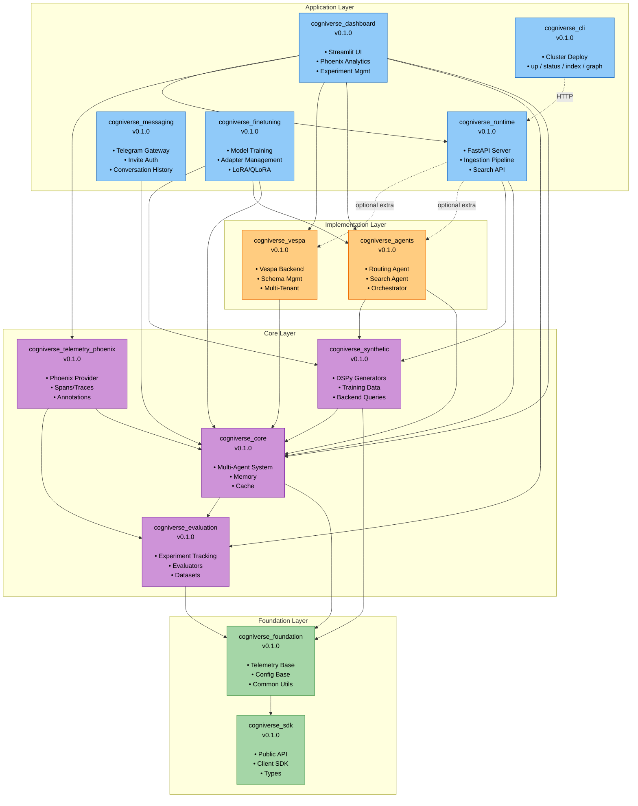
```mermaid
flowchart TB
    subgraph "Foundation Layer"
        SDK["<span style='color:#000'>cogniverse_sdk<br/>v0.1.0<br/><br/>• Public API<br/>• Client SDK<br/>• Types</span>"]
        Foundation["<span style='color:#000'>cogniverse_foundation<br/>v0.1.0<br/><br/>• Telemetry Base<br/>• Config Base<br/>• Common Utils</span>"]
    end

    subgraph "Core Layer"
        Core["<span style='color:#000'>cogniverse_core<br/>v0.1.0<br/><br/>• Multi-Agent System<br/>• Memory<br/>• Cache</span>"]
        Evaluation["<span style='color:#000'>cogniverse_evaluation<br/>v0.1.0<br/><br/>• Experiment Tracking<br/>• Evaluators<br/>• Datasets</span>"]
        Phoenix["<span style='color:#000'>cogniverse_telemetry_phoenix<br/>v0.1.0<br/><br/>• Phoenix Provider<br/>• Spans/Traces<br/>• Annotations</span>"]
        Synthetic["<span style='color:#000'>cogniverse_synthetic<br/>v0.1.0<br/><br/>• DSPy Generators<br/>• Training Data<br/>• Backend Queries</span>"]
    end

    subgraph "Implementation Layer"
        Agents["<span style='color:#000'>cogniverse_agents<br/>v0.1.0<br/><br/>• Routing Agent<br/>• Search Agent<br/>• Orchestrator</span>"]
        Vespa["<span style='color:#000'>cogniverse_vespa<br/>v0.1.0<br/><br/>• Vespa Backend<br/>• Schema Mgmt<br/>• Multi-Tenant</span>"]
    end

    subgraph "Application Layer"
        Runtime["<span style='color:#000'>cogniverse_runtime<br/>v0.1.0<br/><br/>• FastAPI Server<br/>• Ingestion Pipeline<br/>• Search API</span>"]
        Dashboard["<span style='color:#000'>cogniverse_dashboard<br/>v0.1.0<br/><br/>• Streamlit UI<br/>• Phoenix Analytics<br/>• Experiment Mgmt</span>"]
        Messaging["<span style='color:#000'>cogniverse_messaging<br/>v0.1.0<br/><br/>• Telegram Gateway<br/>• Invite Auth<br/>• Conversation History</span>"]
        Finetuning["<span style='color:#000'>cogniverse_finetuning<br/>v0.1.0<br/><br/>• Model Training<br/>• Adapter Management<br/>• LoRA/QLoRA</span>"]
        Cli["<span style='color:#000'>cogniverse_cli<br/>v0.1.0<br/><br/>• Cluster Deploy<br/>• up / status / index / graph</span>"]
    end

    %% Foundation Layer dependencies
    Foundation --> SDK

    %% Core Layer dependencies
    Core --> Foundation
    Core --> Evaluation
    Evaluation --> Foundation
    Phoenix --> Core
    Phoenix --> Evaluation
    Synthetic --> Foundation
    Synthetic --> Core

    %% Implementation Layer dependencies
    Agents --> Core
    Agents --> Synthetic
    Vespa --> Core

    %% Application Layer dependencies
    Runtime --> Core
    Runtime --> Synthetic
    Runtime -.->|optional extra| Agents
    Runtime -.->|optional extra| Vespa
    Dashboard --> Core
    Dashboard --> Evaluation
    Dashboard --> Agents
    Dashboard --> Vespa
    Dashboard --> Phoenix
    Dashboard --> Runtime
    Messaging --> Core
    Finetuning --> Core
    Finetuning --> Agents
    Finetuning --> Synthetic
    Cli -.->|HTTP| Runtime

    %% Styling - Foundation Layer (green)
    style SDK fill:#a5d6a7,stroke:#388e3c,color:#000
    style Foundation fill:#a5d6a7,stroke:#388e3c,color:#000

    %% Styling - Core Layer (purple)
    style Core fill:#ce93d8,stroke:#7b1fa2,color:#000
    style Evaluation fill:#ce93d8,stroke:#7b1fa2,color:#000
    style Phoenix fill:#ce93d8,stroke:#7b1fa2,color:#000
    style Synthetic fill:#ce93d8,stroke:#7b1fa2,color:#000

    %% Styling - Implementation Layer (orange)
    style Agents fill:#ffcc80,stroke:#ef6c00,color:#000
    style Vespa fill:#ffcc80,stroke:#ef6c00,color:#000

    %% Styling - Application Layer (blue)
    style Runtime fill:#90caf9,stroke:#1565c0,color:#000
    style Dashboard fill:#90caf9,stroke:#1565c0,color:#000
    style Messaging fill:#90caf9,stroke:#1565c0,color:#000
    style Finetuning fill:#90caf9,stroke:#1565c0,color:#000
    style Cli fill:#90caf9,stroke:#1565c0,color:#000
```

### Detailed Dependency Chain (Layered Architecture)

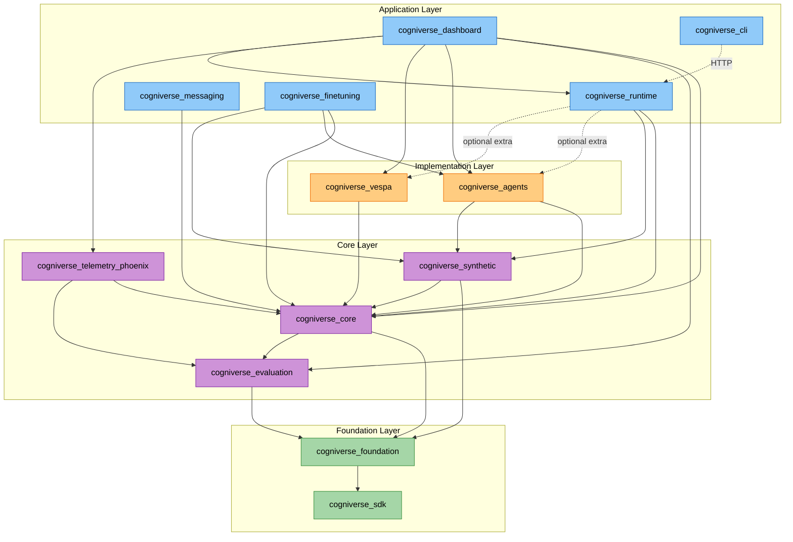
```mermaid
flowchart TB
    subgraph FoundationLayer["<span style='color:#000'>Foundation Layer</span>"]
        SDK["<span style='color:#000'>cogniverse_sdk</span>"]
        FoundationPkg["<span style='color:#000'>cogniverse_foundation</span>"]
    end

    subgraph CoreLayer["<span style='color:#000'>Core Layer</span>"]
        Core["<span style='color:#000'>cogniverse_core</span>"]
        Evaluation["<span style='color:#000'>cogniverse_evaluation</span>"]
        Phoenix["<span style='color:#000'>cogniverse_telemetry_phoenix</span>"]
        Synthetic["<span style='color:#000'>cogniverse_synthetic</span>"]
    end

    subgraph ImplLayer["<span style='color:#000'>Implementation Layer</span>"]
        Agents["<span style='color:#000'>cogniverse_agents</span>"]
        Vespa["<span style='color:#000'>cogniverse_vespa</span>"]
    end

    subgraph AppLayer["<span style='color:#000'>Application Layer</span>"]
        Runtime["<span style='color:#000'>cogniverse_runtime</span>"]
        Dashboard["<span style='color:#000'>cogniverse_dashboard</span>"]
        Messaging["<span style='color:#000'>cogniverse_messaging</span>"]
        Finetuning["<span style='color:#000'>cogniverse_finetuning</span>"]
        Cli["<span style='color:#000'>cogniverse_cli</span>"]
    end

    %% Foundation dependencies
    FoundationPkg --> SDK

    %% Core to Foundation
    Core --> FoundationPkg
    Core --> Evaluation
    Evaluation --> FoundationPkg
    Phoenix --> Core
    Phoenix --> Evaluation
    Synthetic --> FoundationPkg
    Synthetic --> Core

    %% Implementation to Core
    Agents --> Core
    Agents --> Synthetic
    Vespa --> Core

    %% Application to Implementation/Core
    Runtime --> Core
    Runtime --> Synthetic
    Runtime -.->|optional extra| Agents
    Runtime -.->|optional extra| Vespa
    Dashboard --> Core
    Dashboard --> Evaluation
    Dashboard --> Agents
    Dashboard --> Vespa
    Dashboard --> Phoenix
    Dashboard --> Runtime
    Messaging --> Core
    Finetuning --> Core
    Finetuning --> Agents
    Finetuning --> Synthetic
    Cli -.->|HTTP| Runtime

    %% Foundation Layer (green)
    style SDK fill:#a5d6a7,stroke:#388e3c,color:#000
    style FoundationPkg fill:#a5d6a7,stroke:#388e3c,color:#000

    %% Core Layer (purple)
    style Core fill:#ce93d8,stroke:#7b1fa2,color:#000
    style Evaluation fill:#ce93d8,stroke:#7b1fa2,color:#000
    style Phoenix fill:#ce93d8,stroke:#7b1fa2,color:#000
    style Synthetic fill:#ce93d8,stroke:#7b1fa2,color:#000

    %% Implementation Layer (orange)
    style Agents fill:#ffcc80,stroke:#ef6c00,color:#000
    style Vespa fill:#ffcc80,stroke:#ef6c00,color:#000

    %% Application Layer (blue)
    style Runtime fill:#90caf9,stroke:#1565c0,color:#000
    style Dashboard fill:#90caf9,stroke:#1565c0,color:#000
    style Messaging fill:#90caf9,stroke:#1565c0,color:#000
    style Finetuning fill:#90caf9,stroke:#1565c0,color:#000
    style Cli fill:#90caf9,stroke:#1565c0,color:#000
```

---

## Package Internal Structure

### cogniverse_sdk Package Structure (Foundation Layer)

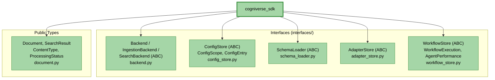
```mermaid
flowchart TB
    SdkPkg["<span style='color:#000'>cogniverse_sdk</span>"]

    subgraph SdkInterfaces["<span style='color:#000'>Interfaces (interfaces/)</span>"]
        Backend["<span style='color:#000'>Backend / IngestionBackend /<br/>SearchBackend (ABC)<br/>backend.py</span>"]
        ConfigStore["<span style='color:#000'>ConfigStore (ABC)<br/>ConfigScope, ConfigEntry<br/>config_store.py</span>"]
        SchemaLoader["<span style='color:#000'>SchemaLoader (ABC)<br/>schema_loader.py</span>"]
        AdapterStore["<span style='color:#000'>AdapterStore (ABC)<br/>adapter_store.py</span>"]
        WorkflowStore["<span style='color:#000'>WorkflowStore (ABC)<br/>WorkflowExecution, AgentPerformance<br/>workflow_store.py</span>"]
    end

    subgraph SdkTypes["<span style='color:#000'>Public Types</span>"]
        SdkDocument["<span style='color:#000'>Document, SearchResult<br/>ContentType, ProcessingStatus<br/>document.py</span>"]
    end

    SdkPkg --> Backend
    SdkPkg --> ConfigStore
    SdkPkg --> SchemaLoader
    SdkPkg --> AdapterStore
    SdkPkg --> WorkflowStore
    SdkPkg --> SdkDocument

    style SdkPkg fill:#a5d6a7,stroke:#388e3c,stroke-width:3px,color:#000
    style Backend fill:#a5d6a7,stroke:#388e3c,color:#000
    style ConfigStore fill:#a5d6a7,stroke:#388e3c,color:#000
    style SchemaLoader fill:#a5d6a7,stroke:#388e3c,color:#000
    style AdapterStore fill:#a5d6a7,stroke:#388e3c,color:#000
    style WorkflowStore fill:#a5d6a7,stroke:#388e3c,color:#000
    style SdkDocument fill:#a5d6a7,stroke:#388e3c,color:#000
```

### cogniverse_foundation Package Structure (Foundation Layer)

```mermaid
flowchart TB
    FoundationPkg["<span style='color:#000'>cogniverse_foundation</span>"]

    subgraph TelemetryBase["<span style='color:#000'>Telemetry Base</span>"]
        TelemetryMgr["<span style='color:#000'>TelemetryManager</span>"]
        ProviderRegistry["<span style='color:#000'>Provider Registry</span>"]
        TelemetryInterfaces["<span style='color:#000'>Telemetry Interfaces</span>"]
    end

    subgraph ConfigBase["<span style='color:#000'>Configuration Base</span>"]
        ConfigMgr["<span style='color:#000'>ConfigManager</span>"]
        SystemConfig["<span style='color:#000'>SystemConfig</span>"]
        TenantConfig["<span style='color:#000'>TenantConfig</span>"]
    end

    subgraph CommonUtils["<span style='color:#000'>Common Utilities</span>"]
        LoggingUtils["<span style='color:#000'>Logging</span>"]
        ExceptionHandling["<span style='color:#000'>Exceptions</span>"]
        TypeUtils["<span style='color:#000'>Type Utilities</span>"]
    end

    FoundationPkg --> TelemetryMgr
    FoundationPkg --> ProviderRegistry
    FoundationPkg --> TelemetryInterfaces
    FoundationPkg --> ConfigMgr
    FoundationPkg --> SystemConfig
    FoundationPkg --> TenantConfig
    FoundationPkg --> LoggingUtils
    FoundationPkg --> ExceptionHandling
    FoundationPkg --> TypeUtils

    style FoundationPkg fill:#a5d6a7,stroke:#388e3c,stroke-width:3px,color:#000
    style TelemetryMgr fill:#a5d6a7,stroke:#388e3c,color:#000
    style ProviderRegistry fill:#a5d6a7,stroke:#388e3c,color:#000
    style TelemetryInterfaces fill:#a5d6a7,stroke:#388e3c,color:#000
    style ConfigMgr fill:#a5d6a7,stroke:#388e3c,color:#000
    style SystemConfig fill:#a5d6a7,stroke:#388e3c,color:#000
    style TenantConfig fill:#a5d6a7,stroke:#388e3c,color:#000
    style LoggingUtils fill:#a5d6a7,stroke:#388e3c,color:#000
    style ExceptionHandling fill:#a5d6a7,stroke:#388e3c,color:#000
    style TypeUtils fill:#a5d6a7,stroke:#388e3c,color:#000
```

### cogniverse_core Package Structure (Core Layer)

```mermaid
flowchart TB
    CorePkg["<span style='color:#000'>cogniverse_core</span>"]

    subgraph MultiAgent["<span style='color:#000'>Multi-Agent System</span>"]
        AgentBase["<span style='color:#000'>AgentBase</span>"]
        A2AAgent["<span style='color:#000'>A2AAgent</span>"]
        AgentMixins["<span style='color:#000'>Agent Mixins</span>"]
    end

    subgraph KnowledgeSys["<span style='color:#000'>Knowledge Subsystem (memory/)</span>"]
        Mem0MemoryManager["<span style='color:#000'>Mem0MemoryManager<br/>manager.py</span>"]
        KnowledgeRegistry["<span style='color:#000'>KnowledgeRegistry<br/>schema.py</span>"]
        ProvenanceStore["<span style='color:#000'>ProvenanceStore<br/>provenance_store.py</span>"]
        ProvenanceWalker["<span style='color:#000'>ProvenanceWalker<br/>provenance.py</span>"]
        ContradictionDetector["<span style='color:#000'>ContradictionDetector<br/>contradiction.py</span>"]
        TrustRanker["<span style='color:#000'>rank_with_trust<br/>trust.py</span>"]
        FederationService["<span style='color:#000'>FederationService<br/>federation.py</span>"]
        PinService["<span style='color:#000'>PinService<br/>pinning.py</span>"]
        LifecycleScheduler["<span style='color:#000'>LifecycleScheduler<br/>lifecycle_scheduler.py</span>"]
        BackendVectorStore["<span style='color:#000'>BackendVectorStore<br/>backend_vector_store.py</span>"]
    end

    subgraph CacheSys["<span style='color:#000'>Cache System</span>"]
        CacheManager["<span style='color:#000'>CacheManager</span>"]
        S3Backend["<span style='color:#000'>S3CacheBackend</span>"]
        FilesystemBackend["<span style='color:#000'>StructuredFilesystemBackend</span>"]
    end

    subgraph Common["<span style='color:#000'>Common</span>"]
        Utils["<span style='color:#000'>Utilities</span>"]
        Types["<span style='color:#000'>Type Definitions</span>"]
    end

    CorePkg --> AgentBase
    CorePkg --> A2AAgent
    CorePkg --> AgentMixins
    CorePkg --> Mem0MemoryManager
    CorePkg --> KnowledgeRegistry
    CorePkg --> ProvenanceStore
    CorePkg --> ProvenanceWalker
    CorePkg --> ContradictionDetector
    CorePkg --> TrustRanker
    CorePkg --> FederationService
    CorePkg --> PinService
    CorePkg --> LifecycleScheduler
    CorePkg --> BackendVectorStore
    CorePkg --> CacheManager
    CorePkg --> S3Backend
    CorePkg --> FilesystemBackend
    CorePkg --> Utils
    CorePkg --> Types

    %% Internal knowledge subsystem wiring
    Mem0MemoryManager --> KnowledgeRegistry
    Mem0MemoryManager --> ProvenanceStore
    Mem0MemoryManager --> BackendVectorStore
    LifecycleScheduler --> KnowledgeRegistry
    LifecycleScheduler --> PinService
    ContradictionDetector --> TrustRanker
    FederationService --> KnowledgeRegistry
    ProvenanceWalker --> ProvenanceStore

    style CorePkg fill:#ce93d8,stroke:#7b1fa2,stroke-width:3px,color:#000
    style AgentBase fill:#ce93d8,stroke:#7b1fa2,color:#000
    style A2AAgent fill:#ce93d8,stroke:#7b1fa2,color:#000
    style AgentMixins fill:#ce93d8,stroke:#7b1fa2,color:#000
    style Mem0MemoryManager fill:#ba68c8,stroke:#7b1fa2,color:#000
    style KnowledgeRegistry fill:#ba68c8,stroke:#7b1fa2,color:#000
    style ProvenanceStore fill:#ba68c8,stroke:#7b1fa2,color:#000
    style ProvenanceWalker fill:#ba68c8,stroke:#7b1fa2,color:#000
    style ContradictionDetector fill:#ba68c8,stroke:#7b1fa2,color:#000
    style TrustRanker fill:#ba68c8,stroke:#7b1fa2,color:#000
    style FederationService fill:#ba68c8,stroke:#7b1fa2,color:#000
    style PinService fill:#ba68c8,stroke:#7b1fa2,color:#000
    style LifecycleScheduler fill:#ba68c8,stroke:#7b1fa2,color:#000
    style BackendVectorStore fill:#ba68c8,stroke:#7b1fa2,color:#000
    style CacheManager fill:#ce93d8,stroke:#7b1fa2,color:#000
    style S3Backend fill:#ce93d8,stroke:#7b1fa2,color:#000
    style FilesystemBackend fill:#ce93d8,stroke:#7b1fa2,color:#000
    style Utils fill:#ce93d8,stroke:#7b1fa2,color:#000
    style Types fill:#ce93d8,stroke:#7b1fa2,color:#000
```

### cogniverse_evaluation Package Structure (Core Layer)

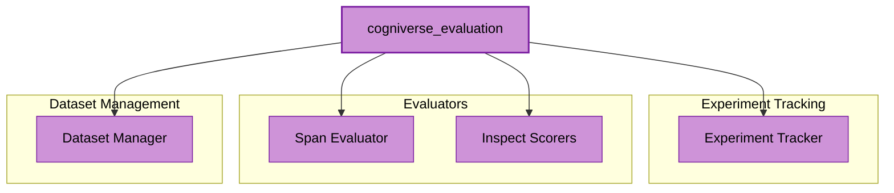
```mermaid
flowchart TB
    EvalPkg["<span style='color:#000'>cogniverse_evaluation</span>"]

    subgraph ExpTracking["<span style='color:#000'>Experiment Tracking</span>"]
        ExperimentTracker["<span style='color:#000'>Experiment Tracker</span>"]
    end

    subgraph Evaluators["<span style='color:#000'>Evaluators</span>"]
        SpanEvaluator["<span style='color:#000'>Span Evaluator</span>"]
        InspectScorers["<span style='color:#000'>Inspect Scorers</span>"]
    end

    subgraph DatasetMgmt["<span style='color:#000'>Dataset Management</span>"]
        DatasetManager["<span style='color:#000'>Dataset Manager</span>"]
    end

    EvalPkg --> ExperimentTracker
    EvalPkg --> SpanEvaluator
    EvalPkg --> InspectScorers
    EvalPkg --> DatasetManager

    style EvalPkg fill:#ce93d8,stroke:#7b1fa2,stroke-width:2px,color:#000
    style ExperimentTracker fill:#ce93d8,stroke:#7b1fa2,color:#000
    style SpanEvaluator fill:#ce93d8,stroke:#7b1fa2,color:#000
    style InspectScorers fill:#ce93d8,stroke:#7b1fa2,color:#000
    style DatasetManager fill:#ce93d8,stroke:#7b1fa2,color:#000
```

### cogniverse_telemetry_phoenix Package Structure (Core Layer)

```mermaid
flowchart TB
    PhoenixPkg["<span style='color:#000'>cogniverse_telemetry_phoenix</span>"]

    subgraph PhoenixProviderSubg["<span style='color:#000'>Telemetry Provider (provider.py)</span>"]
        PhoenixProviderCls["<span style='color:#000'>PhoenixProvider<br/>(TelemetryProvider)</span>"]
        PhoenixTraceStore["<span style='color:#000'>PhoenixTraceStore</span>"]
        PhoenixAnnotationStore["<span style='color:#000'>PhoenixAnnotationStore</span>"]
        PhoenixDatasetStore["<span style='color:#000'>PhoenixDatasetStore</span>"]
        PhoenixExperimentStore["<span style='color:#000'>PhoenixExperimentStore</span>"]
        PhoenixAnalyticsStore["<span style='color:#000'>PhoenixAnalyticsStore</span>"]
    end

    subgraph PhoenixEvalSubg["<span style='color:#000'>Evaluation (evaluation/)</span>"]
        PhoenixEvaluationProvider["<span style='color:#000'>PhoenixEvaluationProvider<br/>evaluation_provider.py</span>"]
        PhoenixEvaluatorFramework["<span style='color:#000'>PhoenixEvaluatorFramework<br/>framework.py</span>"]
        PhoenixAnalytics["<span style='color:#000'>PhoenixAnalytics<br/>analytics.py</span>"]
        RetrievalMonitor["<span style='color:#000'>RetrievalMonitor<br/>monitoring.py</span>"]
    end

    PhoenixPkg --> PhoenixProviderCls
    PhoenixProviderCls --> PhoenixTraceStore
    PhoenixProviderCls --> PhoenixAnnotationStore
    PhoenixProviderCls --> PhoenixDatasetStore
    PhoenixProviderCls --> PhoenixExperimentStore
    PhoenixProviderCls --> PhoenixAnalyticsStore
    PhoenixPkg --> PhoenixEvaluationProvider
    PhoenixPkg --> PhoenixEvaluatorFramework
    PhoenixPkg --> PhoenixAnalytics
    PhoenixPkg --> RetrievalMonitor

    style PhoenixPkg fill:#ce93d8,stroke:#7b1fa2,stroke-width:3px,color:#000
    style PhoenixProviderCls fill:#ce93d8,stroke:#7b1fa2,color:#000
    style PhoenixTraceStore fill:#ba68c8,stroke:#7b1fa2,color:#000
    style PhoenixAnnotationStore fill:#ba68c8,stroke:#7b1fa2,color:#000
    style PhoenixDatasetStore fill:#ba68c8,stroke:#7b1fa2,color:#000
    style PhoenixExperimentStore fill:#ba68c8,stroke:#7b1fa2,color:#000
    style PhoenixAnalyticsStore fill:#ba68c8,stroke:#7b1fa2,color:#000
    style PhoenixEvaluationProvider fill:#ce93d8,stroke:#7b1fa2,color:#000
    style PhoenixEvaluatorFramework fill:#ce93d8,stroke:#7b1fa2,color:#000
    style PhoenixAnalytics fill:#ce93d8,stroke:#7b1fa2,color:#000
    style RetrievalMonitor fill:#ce93d8,stroke:#7b1fa2,color:#000
```

### cogniverse_synthetic Package Structure (Core Layer)

```mermaid
flowchart TB
    SyntheticPkg["<span style='color:#000'>cogniverse_synthetic</span>"]

    subgraph GeneratorsSubg["<span style='color:#000'>Generators (generators/)</span>"]
        BaseGenerator["<span style='color:#000'>BaseGenerator (ABC)</span>"]
        RoutingGenerator["<span style='color:#000'>RoutingGenerator</span>"]
        ProfileGenerator["<span style='color:#000'>ProfileGenerator</span>"]
        WorkflowGenerator["<span style='color:#000'>WorkflowGenerator</span>"]
    end

    subgraph DSPySubg["<span style='color:#000'>DSPy Modules</span>"]
        DSPySignatures["<span style='color:#000'>GenerateModalityQuery<br/>GenerateEntityQuery<br/>InferAgentFromModality<br/>dspy_signatures.py</span>"]
        ValidatedGenerator["<span style='color:#000'>ValidatedEntityQueryGenerator<br/>dspy_modules.py</span>"]
    end

    subgraph SyntheticServiceSubg["<span style='color:#000'>Service & Backend</span>"]
        SyntheticDataService["<span style='color:#000'>SyntheticDataService<br/>service.py</span>"]
        BackendQuerier["<span style='color:#000'>BackendQuerier<br/>backend_querier.py</span>"]
        ProfileSelector["<span style='color:#000'>ProfileSelector<br/>profile_selector.py</span>"]
    end

    subgraph SyntheticApprovalSubg["<span style='color:#000'>Approval (approval/)</span>"]
        FeedbackHandler["<span style='color:#000'>SyntheticDataFeedbackHandler</span>"]
        ConfidenceExtractor["<span style='color:#000'>SyntheticDataConfidenceExtractor</span>"]
    end

    SyntheticPkg --> BaseGenerator
    BaseGenerator --> RoutingGenerator
    BaseGenerator --> ProfileGenerator
    BaseGenerator --> WorkflowGenerator
    SyntheticPkg --> DSPySignatures
    SyntheticPkg --> ValidatedGenerator
    SyntheticPkg --> SyntheticDataService
    SyntheticPkg --> BackendQuerier
    SyntheticPkg --> ProfileSelector
    SyntheticPkg --> FeedbackHandler
    SyntheticPkg --> ConfidenceExtractor

    style SyntheticPkg fill:#ce93d8,stroke:#7b1fa2,stroke-width:3px,color:#000
    style BaseGenerator fill:#ce93d8,stroke:#7b1fa2,color:#000
    style RoutingGenerator fill:#ba68c8,stroke:#7b1fa2,color:#000
    style ProfileGenerator fill:#ba68c8,stroke:#7b1fa2,color:#000
    style WorkflowGenerator fill:#ba68c8,stroke:#7b1fa2,color:#000
    style DSPySignatures fill:#ce93d8,stroke:#7b1fa2,color:#000
    style ValidatedGenerator fill:#ce93d8,stroke:#7b1fa2,color:#000
    style SyntheticDataService fill:#ce93d8,stroke:#7b1fa2,color:#000
    style BackendQuerier fill:#ce93d8,stroke:#7b1fa2,color:#000
    style ProfileSelector fill:#ce93d8,stroke:#7b1fa2,color:#000
    style FeedbackHandler fill:#ce93d8,stroke:#7b1fa2,color:#000
    style ConfidenceExtractor fill:#ce93d8,stroke:#7b1fa2,color:#000
```

### cogniverse_agents Package Structure (Implementation Layer)

```mermaid
flowchart TB
    AgentsPkg["<span style='color:#000'>cogniverse_agents</span>"]

    subgraph GenRoutingSubg["<span style='color:#000'>Generation + Routing Agents</span>"]
        GatewayAgent["<span style='color:#000'>GatewayAgent</span>"]
        OrchestratorAgent["<span style='color:#000'>OrchestratorAgent</span>"]
        SummarizerAgent["<span style='color:#000'>SummarizerAgent</span>"]
        DetailedReportAgent["<span style='color:#000'>DetailedReportAgent</span>"]
        ProfileSelectionAgent["<span style='color:#000'>ProfileSelectionAgent</span>"]
        QueryEnhancementAgent["<span style='color:#000'>QueryEnhancementAgent</span>"]
        EntityExtractionAgent["<span style='color:#000'>EntityExtractionAgent</span>"]
    end

    subgraph ResearchCodingSubg["<span style='color:#000'>Research + Coding Agents</span>"]
        DeepResearchAgent["<span style='color:#000'>DeepResearchAgent</span>"]
        CodingAgent["<span style='color:#000'>CodingAgent</span>"]
        DeepSynthesisWorkflow["<span style='color:#000'>DeepSynthesisWorkflow</span>"]
    end

    subgraph SearchAnalysisSubg["<span style='color:#000'>Search & Analysis Agents</span>"]
        SearchAgent["<span style='color:#000'>SearchAgent</span>"]
        ImageSearchAgent["<span style='color:#000'>ImageSearchAgent</span>"]
        DocumentAgent["<span style='color:#000'>DocumentAgent</span>"]
        TextAnalysisAgent["<span style='color:#000'>TextAnalysisAgent</span>"]
        AudioAnalysisAgent["<span style='color:#000'>AudioAnalysisAgent</span>"]
    end

    subgraph KnowledgeAgentsSubg["<span style='color:#000'>Knowledge Agents (multi-tenant + KG/reasoning)</span>"]
        MultiDocSynthesis["<span style='color:#000'>MultiDocumentSynthesisAgent</span>"]
        KGTraversal["<span style='color:#000'>KnowledgeGraphTraversalAgent</span>"]
        CrossTenantComparison["<span style='color:#000'>CrossTenantComparisonAgent</span>"]
        ContradictionReconciliation["<span style='color:#000'>ContradictionReconciliationAgent</span>"]
        CitationTracing["<span style='color:#000'>CitationTracingAgent</span>"]
        TemporalReasoning["<span style='color:#000'>TemporalReasoningAgent</span>"]
        FederatedQuery["<span style='color:#000'>FederatedQueryAgent</span>"]
        KnowledgeSummarization["<span style='color:#000'>KnowledgeSummarizationAgent</span>"]
        AuditExplanation["<span style='color:#000'>AuditExplanationAgent</span>"]
    end

    subgraph InferenceSubg["<span style='color:#000'>Inference</span>"]
        InstrumentedRLM["<span style='color:#000'>InstrumentedRLM<br/>instrumented_rlm.py</span>"]
        RLMInference["<span style='color:#000'>RLMInference<br/>rlm_inference.py</span>"]
        RLMABRunner["<span style='color:#000'>RLMABRunner<br/>ab_harness.py</span>"]
    end

    subgraph OptimizerSubg["<span style='color:#000'>Optimizer</span>"]
        ArtifactManager["<span style='color:#000'>ArtifactManager<br/>artifact_manager.py</span>"]
        SignatureVariants["<span style='color:#000'>SignatureVariantRegistry<br/>signature_variants.py</span>"]
        StrategyLearner["<span style='color:#000'>StrategyLearner<br/>strategy_learner.py</span>"]
        DSPyAgentOptimizer["<span style='color:#000'>DSPyAgentPromptOptimizer<br/>dspy_agent_optimizer.py</span>"]
    end

    subgraph RoutingSubg["<span style='color:#000'>Routing</span>"]
        RoutingConfigUnified["<span style='color:#000'>RoutingConfigUnified</span>"]
        GLiNERStrategy["<span style='color:#000'>GLiNER Strategy</span>"]
        LLMStrategy["<span style='color:#000'>LLM Strategy</span>"]
    end

    subgraph SearchSubg["<span style='color:#000'>Search</span>"]
        Reranker["<span style='color:#000'>Multi-Modal Reranker</span>"]
        QueryEncoders["<span style='color:#000'>Query Encoders</span>"]
    end

    AgentsPkg --> GatewayAgent
    AgentsPkg --> OrchestratorAgent
    AgentsPkg --> SummarizerAgent
    AgentsPkg --> DetailedReportAgent
    AgentsPkg --> ProfileSelectionAgent
    AgentsPkg --> QueryEnhancementAgent
    AgentsPkg --> EntityExtractionAgent
    AgentsPkg --> DeepResearchAgent
    AgentsPkg --> CodingAgent
    AgentsPkg --> DeepSynthesisWorkflow
    AgentsPkg --> SearchAgent
    AgentsPkg --> ImageSearchAgent
    AgentsPkg --> DocumentAgent
    AgentsPkg --> TextAnalysisAgent
    AgentsPkg --> AudioAnalysisAgent
    AgentsPkg --> MultiDocSynthesis
    AgentsPkg --> KGTraversal
    AgentsPkg --> CrossTenantComparison
    AgentsPkg --> ContradictionReconciliation
    AgentsPkg --> CitationTracing
    AgentsPkg --> TemporalReasoning
    AgentsPkg --> FederatedQuery
    AgentsPkg --> KnowledgeSummarization
    AgentsPkg --> AuditExplanation
    AgentsPkg --> InstrumentedRLM
    AgentsPkg --> RLMInference
    AgentsPkg --> RLMABRunner
    AgentsPkg --> ArtifactManager
    AgentsPkg --> SignatureVariants
    AgentsPkg --> StrategyLearner
    AgentsPkg --> DSPyAgentOptimizer
    AgentsPkg --> RoutingConfigUnified
    AgentsPkg --> GLiNERStrategy
    AgentsPkg --> LLMStrategy
    AgentsPkg --> Reranker
    AgentsPkg --> QueryEncoders

    style AgentsPkg fill:#ffcc80,stroke:#ef6c00,stroke-width:3px,color:#000
    style GatewayAgent fill:#ffcc80,stroke:#ef6c00,color:#000
    style OrchestratorAgent fill:#ffcc80,stroke:#ef6c00,color:#000
    style SummarizerAgent fill:#ffcc80,stroke:#ef6c00,color:#000
    style DetailedReportAgent fill:#ffcc80,stroke:#ef6c00,color:#000
    style ProfileSelectionAgent fill:#ffcc80,stroke:#ef6c00,color:#000
    style QueryEnhancementAgent fill:#ffcc80,stroke:#ef6c00,color:#000
    style EntityExtractionAgent fill:#ffcc80,stroke:#ef6c00,color:#000
    style DeepResearchAgent fill:#ffcc80,stroke:#ef6c00,color:#000
    style CodingAgent fill:#ffcc80,stroke:#ef6c00,color:#000
    style DeepSynthesisWorkflow fill:#ffcc80,stroke:#ef6c00,color:#000
    style SearchAgent fill:#ffcc80,stroke:#ef6c00,color:#000
    style ImageSearchAgent fill:#ffcc80,stroke:#ef6c00,color:#000
    style DocumentAgent fill:#ffcc80,stroke:#ef6c00,color:#000
    style TextAnalysisAgent fill:#ffcc80,stroke:#ef6c00,color:#000
    style AudioAnalysisAgent fill:#ffcc80,stroke:#ef6c00,color:#000
    style MultiDocSynthesis fill:#ffb74d,stroke:#ef6c00,color:#000
    style KGTraversal fill:#ffb74d,stroke:#ef6c00,color:#000
    style CrossTenantComparison fill:#ffb74d,stroke:#ef6c00,color:#000
    style ContradictionReconciliation fill:#ffb74d,stroke:#ef6c00,color:#000
    style CitationTracing fill:#ffb74d,stroke:#ef6c00,color:#000
    style TemporalReasoning fill:#ffb74d,stroke:#ef6c00,color:#000
    style FederatedQuery fill:#ffb74d,stroke:#ef6c00,color:#000
    style KnowledgeSummarization fill:#ffb74d,stroke:#ef6c00,color:#000
    style AuditExplanation fill:#ffb74d,stroke:#ef6c00,color:#000
    style InstrumentedRLM fill:#ffb74d,stroke:#ef6c00,color:#000
    style RLMInference fill:#ffb74d,stroke:#ef6c00,color:#000
    style RLMABRunner fill:#ffb74d,stroke:#ef6c00,color:#000
    style ArtifactManager fill:#ffb74d,stroke:#ef6c00,color:#000
    style SignatureVariants fill:#ffb74d,stroke:#ef6c00,color:#000
    style StrategyLearner fill:#ffb74d,stroke:#ef6c00,color:#000
    style DSPyAgentOptimizer fill:#ffb74d,stroke:#ef6c00,color:#000
    style RoutingConfigUnified fill:#ffcc80,stroke:#ef6c00,color:#000
    style GLiNERStrategy fill:#ffcc80,stroke:#ef6c00,color:#000
    style LLMStrategy fill:#ffcc80,stroke:#ef6c00,color:#000
    style Reranker fill:#ffcc80,stroke:#ef6c00,color:#000
    style QueryEncoders fill:#ffcc80,stroke:#ef6c00,color:#000
```

### cogniverse_vespa Package Structure (Implementation Layer)

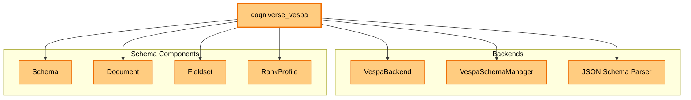
```mermaid
flowchart TB
    VespaPkg["<span style='color:#000'>cogniverse_vespa</span>"]

    subgraph BackendsSubg["<span style='color:#000'>Backends</span>"]
        VespaBackend["<span style='color:#000'>VespaBackend</span>"]
        VespaSchemaManager["<span style='color:#000'>VespaSchemaManager</span>"]
        JSONParser["<span style='color:#000'>JSON Schema Parser</span>"]
    end

    subgraph SchemaComponents["<span style='color:#000'>Schema Components</span>"]
        Schema["<span style='color:#000'>Schema</span>"]
        Document["<span style='color:#000'>Document</span>"]
        Fieldset["<span style='color:#000'>Fieldset</span>"]
        RankProfile["<span style='color:#000'>RankProfile</span>"]
    end

    VespaPkg --> VespaBackend
    VespaPkg --> VespaSchemaManager
    VespaPkg --> JSONParser
    VespaPkg --> Schema
    VespaPkg --> Document
    VespaPkg --> Fieldset
    VespaPkg --> RankProfile

    style VespaPkg fill:#ffcc80,stroke:#ef6c00,stroke-width:3px,color:#000
    style VespaBackend fill:#ffcc80,stroke:#ef6c00,color:#000
    style VespaSchemaManager fill:#ffcc80,stroke:#ef6c00,color:#000
    style JSONParser fill:#ffcc80,stroke:#ef6c00,color:#000
    style Schema fill:#ffcc80,stroke:#ef6c00,color:#000
    style Document fill:#ffcc80,stroke:#ef6c00,color:#000
    style Fieldset fill:#ffcc80,stroke:#ef6c00,color:#000
    style RankProfile fill:#ffcc80,stroke:#ef6c00,color:#000
```

### cogniverse_runtime Package Structure (Application Layer)

```mermaid
flowchart TB
    RuntimePkg["<span style='color:#000'>cogniverse_runtime</span>"]

    subgraph APISubg["<span style='color:#000'>FastAPI Routers (routers/)</span>"]
        AdminRouter["<span style='color:#000'>admin.py<br/>prefix /admin</span>"]
        AgentsRouter["<span style='color:#000'>agents.py<br/>prefix /agents</span>"]
        SearchRouter["<span style='color:#000'>search.py<br/>prefix /search</span>"]
        IngestionRouter["<span style='color:#000'>ingestion.py<br/>prefix /ingestion</span>"]
        KnowledgeRouter["<span style='color:#000'>knowledge.py<br/>prefix /admin</span>"]
        TenantRouter["<span style='color:#000'>tenant.py<br/>prefix /admin/tenant</span>"]
        TenantManagerRouter["<span style='color:#000'>admin/tenant_manager.py<br/>prefix /admin</span>"]
        EventsRouter["<span style='color:#000'>events.py<br/>prefix /events</span>"]
        WikiRouter["<span style='color:#000'>wiki.py<br/>prefix /wiki</span>"]
        GraphRouter["<span style='color:#000'>graph.py<br/>prefix /graph</span>"]
        DebugRouter["<span style='color:#000'>debug.py<br/>prefix /admin/debug</span>"]
        HealthRouter["<span style='color:#000'>health.py<br/>no prefix</span>"]
    end

    subgraph IngestionSubg["<span style='color:#000'>Ingestion Pipeline (ingestion/)</span>"]
        PipelineBuilder["<span style='color:#000'>pipeline_builder.py</span>"]
        Pipeline["<span style='color:#000'>VideoIngestionPipeline<br/>pipeline.py</span>"]
        StrategyFactory["<span style='color:#000'>strategy_factory.py</span>"]
    end

    subgraph IngestionWorkerSubg["<span style='color:#000'>Async Ingestion Worker (ingestion_worker/)</span>"]
        SubmitApi["<span style='color:#000'>submit_api.py</span>"]
        StatusApi["<span style='color:#000'>status_api.py</span>"]
        Worker["<span style='color:#000'>worker.py</span>"]
        Queue["<span style='color:#000'>queue.py</span>"]
        Idempotency["<span style='color:#000'>idempotency.py</span>"]
        Backpressure["<span style='color:#000'>backpressure.py</span>"]
    end

    subgraph SandboxSubg["<span style='color:#000'>Sandbox</span>"]
        SandboxManager["<span style='color:#000'>SandboxManager<br/>sandbox_manager.py<br/>SandboxPolicy enum</span>"]
        GatewayHealthProbe["<span style='color:#000'>GatewayHealthProbe<br/>openshell_health.py</span>"]
        SandboxPool["<span style='color:#000'>SandboxPool<br/>sandbox_pool.py</span>"]
    end

    subgraph SidecarsSubg["<span style='color:#000'>Sidecars (sidecars/)</span>"]
        ClapEmbed["<span style='color:#000'>clap_embed.py</span>"]
        FaceEmbed["<span style='color:#000'>face_embed.py</span>"]
    end

    subgraph OptCLISubg["<span style='color:#000'>Optimizer CLI</span>"]
        OptimizationCLI["<span style='color:#000'>optimization_cli.py<br/>run / promote / rollback</span>"]
        QualityMonitorCLI["<span style='color:#000'>quality_monitor_cli.py</span>"]
    end

    RuntimePkg --> AdminRouter
    RuntimePkg --> AgentsRouter
    RuntimePkg --> SearchRouter
    RuntimePkg --> IngestionRouter
    RuntimePkg --> KnowledgeRouter
    RuntimePkg --> TenantRouter
    RuntimePkg --> TenantManagerRouter
    RuntimePkg --> EventsRouter
    RuntimePkg --> WikiRouter
    RuntimePkg --> GraphRouter
    RuntimePkg --> DebugRouter
    RuntimePkg --> HealthRouter
    RuntimePkg --> PipelineBuilder
    RuntimePkg --> Pipeline
    RuntimePkg --> StrategyFactory
    RuntimePkg --> SubmitApi
    RuntimePkg --> StatusApi
    RuntimePkg --> Worker
    RuntimePkg --> Queue
    RuntimePkg --> Idempotency
    RuntimePkg --> Backpressure
    RuntimePkg --> SandboxManager
    RuntimePkg --> GatewayHealthProbe
    RuntimePkg --> SandboxPool
    RuntimePkg --> ClapEmbed
    RuntimePkg --> FaceEmbed
    RuntimePkg --> OptimizationCLI
    RuntimePkg --> QualityMonitorCLI

    SandboxManager --> GatewayHealthProbe
    SubmitApi --> Queue
    Worker --> Queue
    Worker --> Idempotency
    Worker --> Backpressure

    style RuntimePkg fill:#90caf9,stroke:#1565c0,stroke-width:3px,color:#000
    style AdminRouter fill:#90caf9,stroke:#1565c0,color:#000
    style AgentsRouter fill:#90caf9,stroke:#1565c0,color:#000
    style SearchRouter fill:#90caf9,stroke:#1565c0,color:#000
    style IngestionRouter fill:#90caf9,stroke:#1565c0,color:#000
    style KnowledgeRouter fill:#90caf9,stroke:#1565c0,color:#000
    style TenantRouter fill:#90caf9,stroke:#1565c0,color:#000
    style TenantManagerRouter fill:#90caf9,stroke:#1565c0,color:#000
    style EventsRouter fill:#90caf9,stroke:#1565c0,color:#000
    style WikiRouter fill:#90caf9,stroke:#1565c0,color:#000
    style GraphRouter fill:#90caf9,stroke:#1565c0,color:#000
    style DebugRouter fill:#90caf9,stroke:#1565c0,color:#000
    style HealthRouter fill:#90caf9,stroke:#1565c0,color:#000
    style PipelineBuilder fill:#64b5f6,stroke:#1565c0,color:#000
    style Pipeline fill:#64b5f6,stroke:#1565c0,color:#000
    style StrategyFactory fill:#64b5f6,stroke:#1565c0,color:#000
    style SubmitApi fill:#64b5f6,stroke:#1565c0,color:#000
    style StatusApi fill:#64b5f6,stroke:#1565c0,color:#000
    style Worker fill:#64b5f6,stroke:#1565c0,color:#000
    style Queue fill:#64b5f6,stroke:#1565c0,color:#000
    style Idempotency fill:#64b5f6,stroke:#1565c0,color:#000
    style Backpressure fill:#64b5f6,stroke:#1565c0,color:#000
    style SandboxManager fill:#64b5f6,stroke:#1565c0,color:#000
    style GatewayHealthProbe fill:#64b5f6,stroke:#1565c0,color:#000
    style SandboxPool fill:#64b5f6,stroke:#1565c0,color:#000
    style ClapEmbed fill:#64b5f6,stroke:#1565c0,color:#000
    style FaceEmbed fill:#64b5f6,stroke:#1565c0,color:#000
    style OptimizationCLI fill:#64b5f6,stroke:#1565c0,color:#000
    style QualityMonitorCLI fill:#64b5f6,stroke:#1565c0,color:#000
```

### cogniverse_dashboard Package Structure (Application Layer)

```mermaid
flowchart TB
    DashboardPkg["<span style='color:#000'>cogniverse_dashboard</span>"]

    subgraph DashboardApp["<span style='color:#000'>App Entry</span>"]
        DashboardAppPy["<span style='color:#000'>app.py (Streamlit entry)</span>"]
        SearchSummary["<span style='color:#000'>search_summary.py</span>"]
    end

    subgraph DashboardTabs["<span style='color:#000'>Tabs (tabs/) — 12 render_*_tab entry points</span>"]
        ApprovalQueueTab["<span style='color:#000'>approval_queue.py</span>"]
        BackendProfileTab["<span style='color:#000'>backend_profile.py</span>"]
        ConfigManagementTab["<span style='color:#000'>config_management.py</span>"]
        EmbeddingAtlasTab["<span style='color:#000'>embedding_atlas.py</span>"]
        EvaluationTab["<span style='color:#000'>evaluation.py</span>"]
        MemoryManagementTab["<span style='color:#000'>memory_management.py</span>"]
        OptimizationTab["<span style='color:#000'>optimization.py</span>"]
        OrchestrationAnnotationTab["<span style='color:#000'>orchestration_annotation.py</span>"]
        ProfileMetricsTab["<span style='color:#000'>profile_metrics.py</span>"]
        RlmAbCompareTab["<span style='color:#000'>rlm_ab_compare.py</span>"]
        RoutingEvaluationTab["<span style='color:#000'>routing_evaluation.py</span>"]
        TenantManagementTab["<span style='color:#000'>tenant_management.py</span>"]
    end

    subgraph DashboardUtils["<span style='color:#000'>Utils (utils/)</span>"]
        AsyncUtils["<span style='color:#000'>async_utils.py</span>"]
    end

    DashboardPkg --> DashboardAppPy
    DashboardPkg --> SearchSummary
    DashboardAppPy --> ApprovalQueueTab
    DashboardAppPy --> BackendProfileTab
    DashboardAppPy --> ConfigManagementTab
    DashboardAppPy --> EmbeddingAtlasTab
    DashboardAppPy --> EvaluationTab
    DashboardAppPy --> MemoryManagementTab
    DashboardAppPy --> OptimizationTab
    DashboardAppPy --> OrchestrationAnnotationTab
    DashboardAppPy --> ProfileMetricsTab
    DashboardAppPy --> RlmAbCompareTab
    DashboardAppPy --> RoutingEvaluationTab
    DashboardAppPy --> TenantManagementTab
    DashboardPkg --> AsyncUtils

    style DashboardPkg fill:#90caf9,stroke:#1565c0,stroke-width:3px,color:#000
    style DashboardAppPy fill:#90caf9,stroke:#1565c0,color:#000
    style SearchSummary fill:#90caf9,stroke:#1565c0,color:#000
    style ApprovalQueueTab fill:#64b5f6,stroke:#1565c0,color:#000
    style BackendProfileTab fill:#64b5f6,stroke:#1565c0,color:#000
    style ConfigManagementTab fill:#64b5f6,stroke:#1565c0,color:#000
    style EmbeddingAtlasTab fill:#64b5f6,stroke:#1565c0,color:#000
    style EvaluationTab fill:#64b5f6,stroke:#1565c0,color:#000
    style MemoryManagementTab fill:#64b5f6,stroke:#1565c0,color:#000
    style OptimizationTab fill:#64b5f6,stroke:#1565c0,color:#000
    style OrchestrationAnnotationTab fill:#64b5f6,stroke:#1565c0,color:#000
    style ProfileMetricsTab fill:#64b5f6,stroke:#1565c0,color:#000
    style RlmAbCompareTab fill:#64b5f6,stroke:#1565c0,color:#000
    style RoutingEvaluationTab fill:#64b5f6,stroke:#1565c0,color:#000
    style TenantManagementTab fill:#64b5f6,stroke:#1565c0,color:#000
    style AsyncUtils fill:#64b5f6,stroke:#1565c0,color:#000
```

### cogniverse_messaging Package Structure (Application Layer)

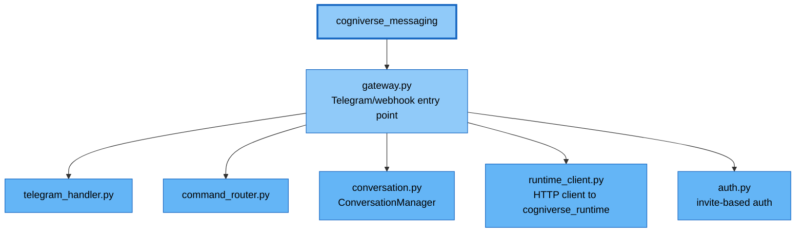
```mermaid
flowchart TB
    MessagingPkg["<span style='color:#000'>cogniverse_messaging</span>"]

    Gateway["<span style='color:#000'>gateway.py<br/>Telegram/webhook entry point</span>"]
    TelegramHandler["<span style='color:#000'>telegram_handler.py</span>"]
    CommandRouter["<span style='color:#000'>command_router.py</span>"]
    Conversation["<span style='color:#000'>conversation.py<br/>ConversationManager</span>"]
    RuntimeClient["<span style='color:#000'>runtime_client.py<br/>HTTP client to cogniverse_runtime</span>"]
    Auth["<span style='color:#000'>auth.py<br/>invite-based auth</span>"]

    MessagingPkg --> Gateway
    Gateway --> TelegramHandler
    Gateway --> CommandRouter
    Gateway --> Conversation
    Gateway --> RuntimeClient
    Gateway --> Auth

    style MessagingPkg fill:#90caf9,stroke:#1565c0,stroke-width:3px,color:#000
    style Gateway fill:#90caf9,stroke:#1565c0,color:#000
    style TelegramHandler fill:#64b5f6,stroke:#1565c0,color:#000
    style CommandRouter fill:#64b5f6,stroke:#1565c0,color:#000
    style Conversation fill:#64b5f6,stroke:#1565c0,color:#000
    style RuntimeClient fill:#64b5f6,stroke:#1565c0,color:#000
    style Auth fill:#64b5f6,stroke:#1565c0,color:#000
```

### cogniverse_finetuning Package Structure (Application Layer)

```mermaid
flowchart TB
    FinetuningPkg["<span style='color:#000'>cogniverse_finetuning</span>"]

    subgraph FinetuningOrchSubg["<span style='color:#000'>Orchestration</span>"]
        FinetuningOrchestrator["<span style='color:#000'>FinetuningOrchestrator<br/>orchestrator.py</span>"]
    end

    subgraph FinetuningDatasetSubg["<span style='color:#000'>Dataset (dataset/)</span>"]
        TraceToInstructionConverter["<span style='color:#000'>TraceToInstructionConverter<br/>trace_converter.py</span>"]
        TripletExtractor["<span style='color:#000'>TripletExtractor<br/>embedding_extractor.py</span>"]
        PreferencePairExtractor["<span style='color:#000'>PreferencePairExtractor<br/>preference_extractor.py</span>"]
        TrainingMethodSelector["<span style='color:#000'>TrainingMethodSelector<br/>method_selector.py</span>"]
    end

    subgraph FinetuningTrainingSubg["<span style='color:#000'>Training (training/)</span>"]
        SFTFinetuner["<span style='color:#000'>SFTFinetuner<br/>sft_trainer.py</span>"]
        DPOFinetuner["<span style='color:#000'>DPOFinetuner<br/>dpo_trainer.py</span>"]
        EmbeddingFinetuner["<span style='color:#000'>EmbeddingFinetuner<br/>embedding_finetuner.py</span>"]
        TrainingBackend["<span style='color:#000'>TrainingBackend (ABC)<br/>Local / Remote<br/>backend.py</span>"]
        ModalTrainingRunner["<span style='color:#000'>ModalTrainingRunner<br/>modal_runner.py</span>"]
    end

    subgraph FinetuningRegistrySubg["<span style='color:#000'>Registry (registry/)</span>"]
        AdapterRegistry["<span style='color:#000'>AdapterRegistry<br/>adapter_registry.py</span>"]
        AdapterStorage["<span style='color:#000'>AdapterStorage (ABC)<br/>HuggingFace / Local<br/>storage.py</span>"]
    end

    subgraph FinetuningEvalSubg["<span style='color:#000'>Evaluation (evaluation/)</span>"]
        AdapterEvaluator["<span style='color:#000'>AdapterEvaluator<br/>adapter_evaluator.py</span>"]
    end

    FinetuningPkg --> FinetuningOrchestrator
    FinetuningOrchestrator --> TraceToInstructionConverter
    FinetuningOrchestrator --> TripletExtractor
    FinetuningOrchestrator --> PreferencePairExtractor
    FinetuningOrchestrator --> TrainingMethodSelector
    FinetuningOrchestrator --> SFTFinetuner
    FinetuningOrchestrator --> DPOFinetuner
    FinetuningOrchestrator --> EmbeddingFinetuner
    SFTFinetuner --> TrainingBackend
    DPOFinetuner --> TrainingBackend
    TrainingBackend --> ModalTrainingRunner
    FinetuningOrchestrator --> AdapterRegistry
    AdapterRegistry --> AdapterStorage
    FinetuningOrchestrator --> AdapterEvaluator

    style FinetuningPkg fill:#90caf9,stroke:#1565c0,stroke-width:3px,color:#000
    style FinetuningOrchestrator fill:#90caf9,stroke:#1565c0,color:#000
    style TraceToInstructionConverter fill:#64b5f6,stroke:#1565c0,color:#000
    style TripletExtractor fill:#64b5f6,stroke:#1565c0,color:#000
    style PreferencePairExtractor fill:#64b5f6,stroke:#1565c0,color:#000
    style TrainingMethodSelector fill:#64b5f6,stroke:#1565c0,color:#000
    style SFTFinetuner fill:#64b5f6,stroke:#1565c0,color:#000
    style DPOFinetuner fill:#64b5f6,stroke:#1565c0,color:#000
    style EmbeddingFinetuner fill:#64b5f6,stroke:#1565c0,color:#000
    style TrainingBackend fill:#64b5f6,stroke:#1565c0,color:#000
    style ModalTrainingRunner fill:#64b5f6,stroke:#1565c0,color:#000
    style AdapterRegistry fill:#64b5f6,stroke:#1565c0,color:#000
    style AdapterStorage fill:#64b5f6,stroke:#1565c0,color:#000
    style AdapterEvaluator fill:#64b5f6,stroke:#1565c0,color:#000
```

### cogniverse_cli Package Structure (Application Layer)

```mermaid
flowchart TB
    CliPkg["<span style='color:#000'>cogniverse_cli</span>"]

    MainCli["<span style='color:#000'>main.py<br/>up / down / status / code / index / logs</span>"]
    GraphGroup["<span style='color:#000'>graph.py<br/>graph stats / search / neighbors / path</span>"]
    SecretsGroup["<span style='color:#000'>secrets.py<br/>secrets sync</span>"]
    AdminGroup["<span style='color:#000'>admin.py<br/>admin reconcile-orphans</span>"]
    SandboxGroup["<span style='color:#000'>sandbox.py<br/>sandbox sync / status</span>"]
    ClusterMod["<span style='color:#000'>cluster.py<br/>k3d cluster lifecycle</span>"]
    DeployMod["<span style='color:#000'>deploy.py<br/>Helm/manifest deploy</span>"]
    ImagesMod["<span style='color:#000'>images.py<br/>image build/load</span>"]
    ArgoMod["<span style='color:#000'>argo.py<br/>Argo workflow submission</span>"]
    ConfigMod["<span style='color:#000'>config.py</span>"]
    HealthMod["<span style='color:#000'>health.py</span>"]
    StreamingMod["<span style='color:#000'>streaming.py</span>"]
    CodeMod["<span style='color:#000'>code.py</span>"]

    CliPkg --> MainCli
    MainCli --> GraphGroup
    MainCli --> SecretsGroup
    MainCli --> AdminGroup
    MainCli --> SandboxGroup
    MainCli --> ClusterMod
    MainCli --> DeployMod
    MainCli --> ImagesMod
    MainCli --> ArgoMod
    MainCli --> ConfigMod
    MainCli --> HealthMod
    MainCli --> CodeMod
    CodeMod --> StreamingMod

    style CliPkg fill:#90caf9,stroke:#1565c0,stroke-width:3px,color:#000
    style MainCli fill:#90caf9,stroke:#1565c0,color:#000
    style GraphGroup fill:#64b5f6,stroke:#1565c0,color:#000
    style SecretsGroup fill:#64b5f6,stroke:#1565c0,color:#000
    style AdminGroup fill:#64b5f6,stroke:#1565c0,color:#000
    style SandboxGroup fill:#64b5f6,stroke:#1565c0,color:#000
    style ClusterMod fill:#64b5f6,stroke:#1565c0,color:#000
    style DeployMod fill:#64b5f6,stroke:#1565c0,color:#000
    style ImagesMod fill:#64b5f6,stroke:#1565c0,color:#000
    style ArgoMod fill:#64b5f6,stroke:#1565c0,color:#000
    style ConfigMod fill:#64b5f6,stroke:#1565c0,color:#000
    style HealthMod fill:#64b5f6,stroke:#1565c0,color:#000
    style StreamingMod fill:#64b5f6,stroke:#1565c0,color:#000
    style CodeMod fill:#64b5f6,stroke:#1565c0,color:#000
```

---

## Cross-Package Data Flow

### Video Ingestion Flow Across Packages (Layered Architecture)

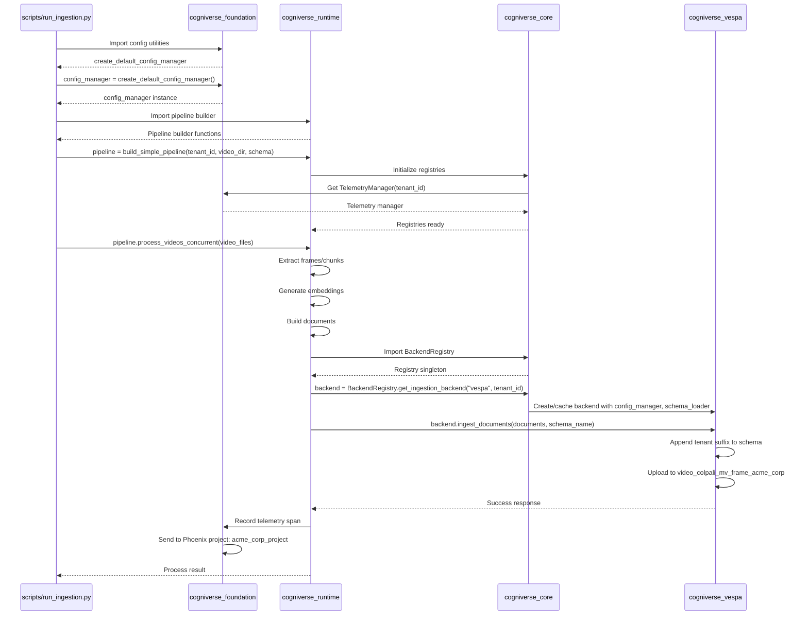
```mermaid
sequenceDiagram
    participant Script as scripts/run_ingestion.py
    participant Foundation as cogniverse_foundation
    participant Runtime as cogniverse_runtime
    participant Core as cogniverse_core
    participant Vespa as cogniverse_vespa

    Script->>Foundation: Import config utilities
    Foundation-->>Script: create_default_config_manager

    Script->>Foundation: config_manager = create_default_config_manager()
    Foundation-->>Script: config_manager instance

    Script->>Runtime: Import pipeline builder
    Runtime-->>Script: Pipeline builder functions

    Script->>Runtime: pipeline = build_simple_pipeline(tenant_id, video_dir, schema)
    Runtime->>Core: Initialize registries
    Core->>Foundation: Get TelemetryManager(tenant_id)
    Foundation-->>Core: Telemetry manager
    Core-->>Runtime: Registries ready

    Script->>Runtime: pipeline.process_videos_concurrent(video_files)
    Runtime->>Runtime: Extract frames/chunks
    Runtime->>Runtime: Generate embeddings
    Runtime->>Runtime: Build documents

    Runtime->>Core: Import BackendRegistry
    Core-->>Runtime: Registry singleton

    Runtime->>Core: backend = BackendRegistry.get_ingestion_backend("vespa", tenant_id)
    Core->>Vespa: Create/cache backend with config_manager, schema_loader

    Runtime->>Vespa: backend.ingest_documents(documents, schema_name)
    Vespa->>Vespa: Append tenant suffix to schema
    Vespa->>Vespa: Upload to video_colpali_mv_frame_acme_corp

    Vespa-->>Runtime: Success response
    Runtime->>Foundation: Record telemetry span
    Foundation->>Foundation: Send to Phoenix project: acme_corp_project

    Runtime-->>Script: Process result
```

### Query Routing Flow Across Packages (Layered Architecture)

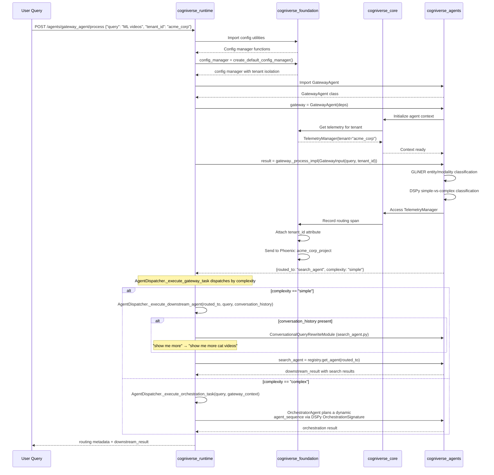
```mermaid
sequenceDiagram
    participant User as User Query
    participant Runtime as cogniverse_runtime
    participant Foundation as cogniverse_foundation
    participant Core as cogniverse_core
    participant Agents as cogniverse_agents

    User->>Runtime: POST /agents/gateway_agent/process {"query": "ML videos", "tenant_id": "acme_corp"}

    Runtime->>Foundation: Import config utilities
    Foundation-->>Runtime: Config manager functions

    Runtime->>Foundation: config_manager = create_default_config_manager()
    Foundation-->>Runtime: config manager with tenant isolation

    Runtime->>Agents: Import GatewayAgent
    Agents-->>Runtime: GatewayAgent class

    Runtime->>Agents: gateway = GatewayAgent(deps)
    Agents->>Core: Initialize agent context
    Core->>Foundation: Get telemetry for tenant
    Foundation-->>Core: TelemetryManager(tenant="acme_corp")
    Core-->>Agents: Context ready

    Runtime->>Agents: result = gateway._process_impl(GatewayInput(query, tenant_id))
    Agents->>Agents: GLiNER entity/modality classification
    Agents->>Agents: DSPy simple-vs-complex classification

    Agents->>Core: Access TelemetryManager
    Core->>Foundation: Record routing span
    Foundation->>Foundation: Attach tenant_id attribute
    Foundation->>Foundation: Send to Phoenix: acme_corp_project

    Agents-->>Runtime: {routed_to: "search_agent", complexity: "simple"}

    Note over Runtime: AgentDispatcher._execute_gateway_task dispatches by complexity

    alt complexity == "simple"
        Runtime->>Runtime: AgentDispatcher._execute_downstream_agent(routed_to, query, conversation_history)

        alt conversation_history present
            Runtime->>Agents: ConversationalQueryRewriteModule (search_agent.py)
            Note over Runtime: "show me more" → "show me more cat videos"
        end

        Runtime->>Agents: search_agent = registry.get_agent(routed_to)
        Agents-->>Runtime: downstream_result with search results
    else complexity == "complex"
        Runtime->>Runtime: AgentDispatcher._execute_orchestration_task(query, gateway_context)
        Runtime->>Agents: OrchestratorAgent plans a dynamic<br/>agent_sequence via DSPy OrchestrationSignature
        Agents-->>Runtime: orchestration result
    end

    Runtime-->>User: routing metadata + downstream_result
```

### Search Flow Across Packages (Layered Architecture)

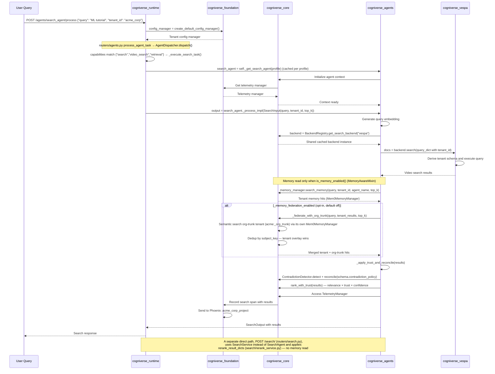
```mermaid
sequenceDiagram
    participant User as User Query
    participant Runtime as cogniverse_runtime
    participant Foundation as cogniverse_foundation
    participant Core as cogniverse_core
    participant Agents as cogniverse_agents
    participant Vespa as cogniverse_vespa

    User->>Runtime: POST /agents/search_agent/process {"query": "ML tutorial", "tenant_id": "acme_corp"}

    Runtime->>Foundation: config_manager = create_default_config_manager()
    Foundation-->>Runtime: Tenant config manager

    Note over Runtime: routers/agents.py process_agent_task → AgentDispatcher.dispatch()
    Runtime->>Runtime: capabilities match {"search","video_search","retrieval"} → _execute_search_task()
    Runtime->>Agents: search_agent = self._get_search_agent(profile) (cached per profile)
    Agents->>Core: Initialize agent context
    Core->>Foundation: Get telemetry manager
    Foundation-->>Core: Telemetry manager
    Core-->>Agents: Context ready

    Runtime->>Agents: output = search_agent._process_impl(SearchInput(query, tenant_id, top_k))

    Agents->>Agents: Generate query embedding

    Agents->>Core: backend = BackendRegistry.get_search_backend("vespa")
    Core-->>Agents: Shared cached backend instance

    Agents->>Vespa: docs = backend.search(query_dict with tenant_id)
    Vespa->>Vespa: Derive tenant schema and execute query
    Vespa-->>Agents: Video search results

    Note over Agents,Core: Memory read only when is_memory_enabled() (MemoryAwareMixin)
    Agents->>Core: memory_manager.search_memory(query, tenant_id, agent_name, top_k)
    Core-->>Agents: Tenant memory hits (Mem0MemoryManager)

    alt _memory_federation_enabled (opt-in, default off)
        Agents->>Core: _federate_with_org_trunk(query, tenant_results, top_k)
        Core->>Core: Semantic search org-trunk tenant (acme:_org_trunk) via its own Mem0MemoryManager
        Core->>Core: Dedup by subject_key — tenant overlay wins
        Core-->>Agents: Merged tenant + org-trunk hits
    end

    Agents->>Agents: _apply_trust_and_reconcile(results)
    Agents->>Core: ContradictionDetector.detect + reconcile(schema.contradiction_policy)
    Agents->>Core: rank_with_trust(results) — relevance × trust × confidence

    Agents->>Core: Access TelemetryManager
    Core->>Foundation: Record search span with results
    Foundation->>Foundation: Send to Phoenix: acme_corp_project

    Agents-->>Runtime: SearchOutput with results
    Runtime-->>User: Search response

    Note over Runtime,Agents: A separate direct path, POST /search/ (routers/search.py),<br/>uses SearchService instead of SearchAgent and applies<br/>rerank_result_dicts (search/rerank_service.py) — no memory read
```

### Knowledge Synthesis Flow Across Packages

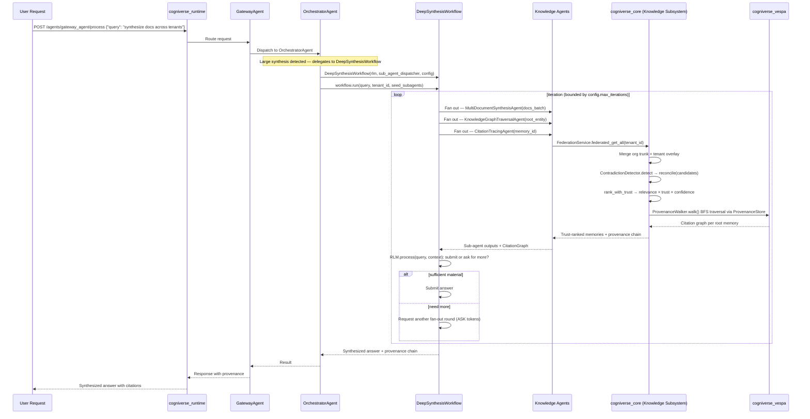
```mermaid
sequenceDiagram
    participant User as User Request
    participant Runtime as cogniverse_runtime
    participant Gateway as GatewayAgent
    participant Orchestrator as OrchestratorAgent
    participant DSW as DeepSynthesisWorkflow
    participant KAgents as Knowledge Agents
    participant Core as cogniverse_core (Knowledge Subsystem)
    participant Vespa as cogniverse_vespa

    User->>Runtime: POST /agents/gateway_agent/process {"query": "synthesize docs across tenants"}

    Runtime->>Gateway: Route request
    Gateway->>Orchestrator: Dispatch to OrchestratorAgent

    Note over Orchestrator: Large synthesis detected — delegates to DeepSynthesisWorkflow
    Orchestrator->>DSW: DeepSynthesisWorkflow(rlm, sub_agent_dispatcher, config)
    Orchestrator->>DSW: workflow.run(query, tenant_id, seed_subagents)

    loop iteration (bounded by config.max_iterations)
        DSW->>KAgents: Fan out — MultiDocumentSynthesisAgent(docs_batch)
        DSW->>KAgents: Fan out — KnowledgeGraphTraversalAgent(root_entity)
        DSW->>KAgents: Fan out — CitationTracingAgent(memory_id)

        KAgents->>Core: FederationService.federated_get_all(tenant_id)
        Core->>Core: Merge org trunk + tenant overlay
        Core->>Core: ContradictionDetector.detect → reconcile(candidates)
        Core->>Core: rank_with_trust → relevance × trust × confidence
        Core->>Vespa: ProvenanceWalker.walk() BFS traversal via ProvenanceStore
        Vespa-->>Core: Citation graph per root memory
        Core-->>KAgents: Trust-ranked memories + provenance chain

        KAgents-->>DSW: Sub-agent outputs + CitationGraph

        DSW->>DSW: RLM.process(query, context): submit or ask for more?
        alt sufficient material
            DSW->>DSW: Submit answer
        else need more
            DSW->>DSW: Request another fan-out round (ASK tokens)
        end
    end

    DSW-->>Orchestrator: Synthesized answer + provenance chain
    Orchestrator-->>Gateway: Result
    Gateway-->>Runtime: Response with provenance
    Runtime-->>User: Synthesized answer with citations
```

### Sandbox Policy Flow

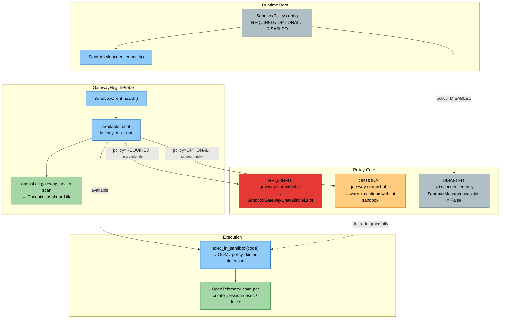
```mermaid
flowchart TB
    subgraph RuntimeBoot["<span style='color:#000'>Runtime Boot</span>"]
        Config["<span style='color:#000'>SandboxPolicy config<br/>REQUIRED / OPTIONAL / DISABLED</span>"]
        SandboxMgr["<span style='color:#000'>SandboxManager._connect()</span>"]
    end

    subgraph HealthProbe["<span style='color:#000'>GatewayHealthProbe<br/>openshell_health.py</span>"]
        Probe["<span style='color:#000'>SandboxClient.health()</span>"]
        ProbeResult["<span style='color:#000'>available: bool<br/>latency_ms: float</span>"]
        PhoenixSpan["<span style='color:#000'>openshell.gateway_health span<br/>→ Phoenix dashboard tile</span>"]
    end

    subgraph PolicyGate["<span style='color:#000'>Policy Gate</span>"]
        RequiredPath["<span style='color:#000'>REQUIRED:<br/>gateway unreachable<br/>→ SandboxGatewayUnavailableError</span>"]
        OptionalPath["<span style='color:#000'>OPTIONAL:<br/>gateway unreachable<br/>→ warn + continue without sandbox</span>"]
        DisabledPath["<span style='color:#000'>DISABLED:<br/>skip connect entirely<br/>SandboxManager.available = False</span>"]
    end

    subgraph ExecPath["<span style='color:#000'>Execution</span>"]
        ExecSandbox["<span style='color:#000'>exec_in_sandbox(code)<br/>→ OOM / policy-denied detection</span>"]
        OTelSpan["<span style='color:#000'>OpenTelemetry span per<br/>create_session / exec / delete</span>"]
    end

    Config --> SandboxMgr
    SandboxMgr --> Probe
    Probe --> ProbeResult
    ProbeResult --> PhoenixSpan
    ProbeResult -->|policy=REQUIRED, unavailable| RequiredPath
    ProbeResult -->|policy=OPTIONAL, unavailable| OptionalPath
    Config -->|policy=DISABLED| DisabledPath
    ProbeResult -->|available| ExecSandbox
    OptionalPath -.->|degrade gracefully| ExecSandbox
    ExecSandbox --> OTelSpan

    style Config fill:#b0bec5,stroke:#546e7a,color:#000
    style SandboxMgr fill:#90caf9,stroke:#1565c0,color:#000
    style Probe fill:#90caf9,stroke:#1565c0,color:#000
    style ProbeResult fill:#90caf9,stroke:#1565c0,color:#000
    style PhoenixSpan fill:#a5d6a7,stroke:#388e3c,color:#000
    style RequiredPath fill:#e53935,stroke:#c62828,color:#fff
    style OptionalPath fill:#ffcc80,stroke:#ef6c00,color:#000
    style DisabledPath fill:#b0bec5,stroke:#546e7a,color:#000
    style ExecSandbox fill:#90caf9,stroke:#1565c0,color:#000
    style OTelSpan fill:#a5d6a7,stroke:#388e3c,color:#000
```

---

## Import Patterns

### Correct Import Patterns by Package (Layered Architecture)

```mermaid
flowchart TB
    subgraph ScriptsLayer["<span style='color:#000'>Scripts Layer</span>"]
        Script["<span style='color:#000'>scripts/run_ingestion.py</span>"]
    end

    subgraph FoundationImports["<span style='color:#000'>cogniverse_foundation Imports</span>"]
        FoundationConfig["<span style='color:#000'>from cogniverse_foundation.config.utils import create_default_config_manager</span>"]
        FoundationTelemetry["<span style='color:#000'>from cogniverse_foundation.telemetry.manager import TelemetryManager</span>"]
    end

    subgraph CoreImports["<span style='color:#000'>cogniverse_core Imports</span>"]
        CoreAgent["<span style='color:#000'>from cogniverse_core.agents.base import AgentBase</span>"]
        CoreMemory["<span style='color:#000'>from cogniverse_core.memory.manager import Mem0MemoryManager</span>"]
        CoreCache["<span style='color:#000'>from cogniverse_core.common.cache import CacheManager</span>"]
    end

    subgraph EvalImports["<span style='color:#000'>cogniverse_evaluation Imports</span>"]
        EvalTracker["<span style='color:#000'>from cogniverse_evaluation.core.experiment_tracker import ExperimentTracker</span>"]
        EvalDataset["<span style='color:#000'>from cogniverse_evaluation.data.datasets import DatasetManager</span>"]
    end

    subgraph AgentsImports["<span style='color:#000'>cogniverse_agents Imports</span>"]
        AgentsRouting["<span style='color:#000'>from cogniverse_agents.orchestrator_agent import OrchestratorAgent</span>"]
        AgentsSearch["<span style='color:#000'>from cogniverse_agents.search_agent import SearchAgent</span>"]
        AgentsReranker["<span style='color:#000'>from cogniverse_agents.search.multi_modal_reranker import MultiModalReranker</span>"]
    end

    subgraph RuntimeImports["<span style='color:#000'>cogniverse_runtime Imports</span>"]
        RuntimePipeline["<span style='color:#000'>from cogniverse_runtime.ingestion.pipeline_builder import build_simple_pipeline</span>"]
    end

    subgraph VespaImports["<span style='color:#000'>cogniverse_vespa Imports</span>"]
        VespaBackendImport["<span style='color:#000'>from cogniverse_vespa.backend import VespaBackend</span>"]
        VespaSchema["<span style='color:#000'>from cogniverse_vespa.vespa_schema_manager import VespaSchemaManager</span>"]
    end

    Script --> FoundationConfig
    Script --> FoundationTelemetry
    Script --> CoreAgent
    Script --> CoreMemory
    Script --> EvalTracker
    Script --> EvalDataset
    Script --> RuntimePipeline
    Script --> AgentsRouting
    Script --> AgentsSearch
    Script --> AgentsReranker
    Script --> VespaBackendImport
    Script --> VespaSchema

    style Script fill:#b0bec5,stroke:#546e7a,color:#000
    style FoundationConfig fill:#a5d6a7,stroke:#388e3c,color:#000
    style FoundationTelemetry fill:#a5d6a7,stroke:#388e3c,color:#000
    style CoreAgent fill:#ce93d8,stroke:#7b1fa2,color:#000
    style CoreMemory fill:#ce93d8,stroke:#7b1fa2,color:#000
    style CoreCache fill:#ce93d8,stroke:#7b1fa2,color:#000
    style EvalTracker fill:#ce93d8,stroke:#7b1fa2,color:#000
    style EvalDataset fill:#ce93d8,stroke:#7b1fa2,color:#000
    style RuntimePipeline fill:#90caf9,stroke:#1565c0,color:#000
    style AgentsRouting fill:#ffcc80,stroke:#ef6c00,color:#000
    style AgentsSearch fill:#ffcc80,stroke:#ef6c00,color:#000
    style AgentsReranker fill:#ffcc80,stroke:#ef6c00,color:#000
    style VespaBackendImport fill:#ffcc80,stroke:#ef6c00,color:#000
    style VespaSchema fill:#ffcc80,stroke:#ef6c00,color:#000
```

### Package Import Dependencies (Valid Paths)

```mermaid
flowchart TB
    subgraph FoundationCan["<span style='color:#000'>cogniverse_foundation CAN import</span>"]
        FoundationStdLib["<span style='color:#000'>Python stdlib</span>"]
        FoundationThirdParty["<span style='color:#000'>3rd party:<br/>pydantic, httpx,<br/>opentelemetry</span>"]
    end

    subgraph CoreCan["<span style='color:#000'>cogniverse_core CAN import</span>"]
        CoreFoundation["<span style='color:#000'>cogniverse_foundation.*</span>"]
        CoreEvaluation["<span style='color:#000'>cogniverse_evaluation.*</span>"]
        CoreThirdParty["<span style='color:#000'>3rd party:<br/>mem0ai, redis</span>"]
    end

    subgraph EvalCan["<span style='color:#000'>cogniverse_evaluation CAN import</span>"]
        EvalFoundation["<span style='color:#000'>cogniverse_foundation.*</span>"]
        EvalThirdParty["<span style='color:#000'>3rd party:<br/>pandas, polars</span>"]
    end

    subgraph AgentsCan["<span style='color:#000'>cogniverse_agents CAN import</span>"]
        AgentsCore["<span style='color:#000'>cogniverse_core.*</span>"]
        AgentsSynthetic["<span style='color:#000'>cogniverse_synthetic.*</span>"]
        AgentsThirdParty["<span style='color:#000'>3rd party:<br/>litellm, PIL,<br/>transformers, dspy</span>"]
    end

    subgraph RuntimeCan["<span style='color:#000'>cogniverse_runtime CAN import</span>"]
        RuntimeCore["<span style='color:#000'>cogniverse_core.*</span>"]
        RuntimeAgents["<span style='color:#000'>cogniverse_agents.*</span>"]
        RuntimeVespa["<span style='color:#000'>cogniverse_vespa.*</span>"]
        RuntimeSynthetic["<span style='color:#000'>cogniverse_synthetic.*</span>"]
        RuntimeThirdParty["<span style='color:#000'>3rd party:<br/>fastapi, uvicorn</span>"]
    end

    Foundation["<span style='color:#000'>cogniverse_foundation</span>"] --> FoundationStdLib
    Foundation --> FoundationThirdParty

    Core["<span style='color:#000'>cogniverse_core</span>"] --> CoreFoundation
    Core --> CoreEvaluation
    Core --> CoreThirdParty

    Evaluation["<span style='color:#000'>cogniverse_evaluation</span>"] --> EvalFoundation
    Evaluation --> EvalThirdParty

    Agents["<span style='color:#000'>cogniverse_agents</span>"] --> AgentsCore
    Agents --> AgentsSynthetic
    Agents --> AgentsThirdParty

    Runtime["<span style='color:#000'>cogniverse_runtime</span>"] --> RuntimeCore
    Runtime --> RuntimeAgents
    Runtime --> RuntimeVespa
    Runtime --> RuntimeSynthetic
    Runtime --> RuntimeThirdParty

    style Foundation fill:#a5d6a7,stroke:#388e3c,color:#000
    style Core fill:#ce93d8,stroke:#7b1fa2,color:#000
    style Evaluation fill:#ce93d8,stroke:#7b1fa2,color:#000
    style Agents fill:#ffcc80,stroke:#ef6c00,color:#000
    style Runtime fill:#90caf9,stroke:#1565c0,color:#000
    style FoundationStdLib fill:#a5d6a7,stroke:#388e3c,color:#000
    style FoundationThirdParty fill:#a5d6a7,stroke:#388e3c,color:#000
    style CoreFoundation fill:#ce93d8,stroke:#7b1fa2,color:#000
    style CoreEvaluation fill:#ce93d8,stroke:#7b1fa2,color:#000
    style CoreThirdParty fill:#ce93d8,stroke:#7b1fa2,color:#000
    style EvalFoundation fill:#ce93d8,stroke:#7b1fa2,color:#000
    style EvalThirdParty fill:#ce93d8,stroke:#7b1fa2,color:#000
    style AgentsCore fill:#ffcc80,stroke:#ef6c00,color:#000
    style AgentsSynthetic fill:#ffcc80,stroke:#ef6c00,color:#000
    style AgentsThirdParty fill:#ffcc80,stroke:#ef6c00,color:#000
    style RuntimeCore fill:#90caf9,stroke:#1565c0,color:#000
    style RuntimeAgents fill:#90caf9,stroke:#1565c0,color:#000
    style RuntimeVespa fill:#90caf9,stroke:#1565c0,color:#000
    style RuntimeSynthetic fill:#90caf9,stroke:#1565c0,color:#000
    style RuntimeThirdParty fill:#90caf9,stroke:#1565c0,color:#000
```

### INVALID Import Patterns (Circular Dependencies)

```mermaid
flowchart TB
    Foundation["<span style='color:#000'>cogniverse_foundation</span>"]
    Core["<span style='color:#000'>cogniverse_core</span>"]
    Evaluation["<span style='color:#000'>cogniverse_evaluation</span>"]
    Agents["<span style='color:#000'>cogniverse_agents</span>"]
    Vespa["<span style='color:#000'>cogniverse_vespa</span>"]
    Runtime["<span style='color:#000'>cogniverse_runtime</span>"]

    %% Invalid upward dependencies
    Core -.->|❌ INVALID upward| Foundation
    Agents -.->|❌ INVALID upward| Foundation
    Runtime -.->|❌ INVALID upward| Foundation

    %% Invalid cross-layer dependencies
    Agents -.->|❌ INVALID cross| Vespa
    Vespa -.->|❌ INVALID cross| Agents
    Agents -.->|❌ INVALID cross| Evaluation

    %% Note: Runtime→Vespa is VALID (application depends on implementation via optional extras)

    style Foundation fill:#ffcccc,stroke:#c62828,color:#000
    style Core fill:#ffcccc,stroke:#c62828,color:#000
    style Evaluation fill:#ffcccc,stroke:#c62828,color:#000
    style Agents fill:#ffcccc,stroke:#c62828,color:#000
    style Vespa fill:#ffcccc,stroke:#c62828,color:#000
    style Runtime fill:#ffcccc,stroke:#c62828,color:#000
```

---

## Build and Deployment

### Package Build Pipeline

```mermaid
flowchart TB
    subgraph Development["<span style='color:#000'>Development</span>"]
        Source["<span style='color:#000'>Source Code<br/>libs/*/cogniverse_*</span>"]
        Tests["<span style='color:#000'>Tests<br/>tests/*</span>"]
    end

    subgraph BuildProcess["<span style='color:#000'>Build Process</span>"]
        Lint["<span style='color:#000'>uv run ruff check .</span>"]
        Format["<span style='color:#000'>uv run ruff format .</span>"]
        Test["<span style='color:#000'>uv run pytest tests/ -v</span>"]
        Build["<span style='color:#000'>uv build</span>"]
    end

    subgraph Artifacts["<span style='color:#000'>Artifacts</span>"]
        Wheel["<span style='color:#000'>*.whl<br/>Binary distribution</span>"]
        Tarball["<span style='color:#000'>*.tar.gz<br/>Source distribution</span>"]
    end

    subgraph Distribution["<span style='color:#000'>Distribution</span>"]
        PyPI["<span style='color:#000'>PyPI<br/>Public registry</span>"]
        Private["<span style='color:#000'>Private registry<br/>Artifactory/Nexus</span>"]
        Local["<span style='color:#000'>Local installation<br/>pip install dist/*.whl</span>"]
    end

    Source --> Lint
    Tests --> Test
    Lint --> Format
    Format --> Test
    Test --> Build

    Build --> Wheel
    Build --> Tarball

    Wheel --> PyPI
    Wheel --> Private
    Wheel --> Local
    Tarball --> PyPI

    style Source fill:#90caf9,stroke:#1565c0,color:#000
    style Tests fill:#90caf9,stroke:#1565c0,color:#000
    style Lint fill:#ffcc80,stroke:#ef6c00,color:#000
    style Format fill:#ffcc80,stroke:#ef6c00,color:#000
    style Test fill:#ffcc80,stroke:#ef6c00,color:#000
    style Build fill:#ce93d8,stroke:#7b1fa2,color:#000
    style Wheel fill:#a5d6a7,stroke:#388e3c,color:#000
    style Tarball fill:#a5d6a7,stroke:#388e3c,color:#000
    style PyPI fill:#ce93d8,stroke:#7b1fa2,color:#000
    style Private fill:#ce93d8,stroke:#7b1fa2,color:#000
    style Local fill:#ce93d8,stroke:#7b1fa2,color:#000
```

### Workspace Sync Flow (Layered Structure)

```mermaid
sequenceDiagram
    participant Dev as Developer
    participant UV as uv Package Manager
    participant Lock as uv.lock
    participant VEnv as .venv
    participant Packages as libs/*/

    Dev->>UV: uv sync
    UV->>Lock: Read uv.lock
    Lock-->>UV: Exact dependency versions

    UV->>VEnv: Create/update virtual environment
    VEnv-->>UV: Environment ready

    Note over UV,Packages: Foundation Layer
    UV->>Packages: Install libs/sdk in editable mode
    UV->>Packages: Install libs/foundation in editable mode

    Note over UV,Packages: Core Layer
    UV->>Packages: Install libs/core in editable mode
    UV->>Packages: Install libs/evaluation in editable mode
    UV->>Packages: Install libs/telemetry-phoenix in editable mode
    UV->>Packages: Install libs/synthetic in editable mode

    Note over UV,Packages: Implementation Layer
    UV->>Packages: Install libs/agents in editable mode
    UV->>Packages: Install libs/vespa in editable mode

    Note over UV,Packages: Application Layer
    UV->>Packages: Install libs/runtime in editable mode
    UV->>Packages: Install libs/dashboard in editable mode
    UV->>Packages: Install libs/messaging in editable mode
    UV->>Packages: Install libs/cli in editable mode
    UV->>Packages: Install libs/finetuning in editable mode

    UV->>VEnv: Install 3rd-party dependencies
    VEnv-->>UV: Dependencies installed

    UV-->>Dev: ✅ Workspace synced
```

### Package Release Flow (Layered Structure)

```mermaid
flowchart TB
    subgraph VersionUpdate["<span style='color:#000'>Version Update</span>"]
        UpdateVersion["<span style='color:#000'>Update version in<br/>pyproject.toml</span>"]
        UpdateChangelog["<span style='color:#000'>Update CHANGELOG.md</span>"]
        UpdateDeps["<span style='color:#000'>Update inter-package<br/>dependencies</span>"]
    end

    subgraph BuildTest["<span style='color:#000'>Build & Test</span>"]
        BuildPkg["<span style='color:#000'>uv build</span>"]
        TestBuild["<span style='color:#000'>Test built packages<br/>in clean environment</span>"]
    end

    subgraph GitOps["<span style='color:#000'>Git Operations</span>"]
        CommitChanges["<span style='color:#000'>git commit -m<br/>Release v0.2.0</span>"]
        CreateTag["<span style='color:#000'>git tag -a v0.2.0</span>"]
        PushTag["<span style='color:#000'>git push origin v0.2.0</span>"]
    end

    subgraph Publish["<span style='color:#000'>Publish (Layer Order)</span>"]
        PublishFoundation["<span style='color:#000'>1. Foundation Layer<br/>sdk, foundation</span>"]
        PublishCore["<span style='color:#000'>2. Core Layer<br/>core, evaluation, telemetry-phoenix, synthetic</span>"]
        PublishImpl["<span style='color:#000'>3. Implementation Layer<br/>agents, vespa</span>"]
        PublishApp["<span style='color:#000'>4. Application Layer<br/>runtime, dashboard</span>"]
    end

    UpdateVersion --> UpdateChangelog
    UpdateChangelog --> UpdateDeps
    UpdateDeps --> BuildPkg
    BuildPkg --> TestBuild
    TestBuild --> CommitChanges
    CommitChanges --> CreateTag
    CreateTag --> PushTag

    PushTag --> PublishFoundation
    PublishFoundation --> PublishCore
    PublishCore --> PublishImpl
    PublishImpl --> PublishApp

    style UpdateVersion fill:#a5d6a7,stroke:#388e3c,color:#000
    style UpdateChangelog fill:#a5d6a7,stroke:#388e3c,color:#000
    style UpdateDeps fill:#a5d6a7,stroke:#388e3c,color:#000
    style BuildPkg fill:#ce93d8,stroke:#7b1fa2,color:#000
    style TestBuild fill:#ce93d8,stroke:#7b1fa2,color:#000
    style CommitChanges fill:#ffcc80,stroke:#ef6c00,color:#000
    style CreateTag fill:#ffcc80,stroke:#ef6c00,color:#000
    style PushTag fill:#ffcc80,stroke:#ef6c00,color:#000
    style PublishFoundation fill:#a5d6a7,stroke:#388e3c,color:#000
    style PublishCore fill:#ce93d8,stroke:#7b1fa2,color:#000
    style PublishImpl fill:#ffcc80,stroke:#ef6c00,color:#000
    style PublishApp fill:#90caf9,stroke:#1565c0,color:#000
```

### Deployment Architecture (Layered Structure)

```mermaid
flowchart TB
    subgraph DevEnv["<span style='color:#000'>Development Environment</span>"]
        DevWorkspace["<span style='color:#000'>UV Workspace<br/>uv sync<br/>packages editable</span>"]
        DevTests["<span style='color:#000'>Local Tests<br/>pytest</span>"]
    end

    subgraph CICD["<span style='color:#000'>CI/CD Pipeline</span>"]
        GitHub["<span style='color:#000'>GitHub Actions</span>"]
        BuildAll["<span style='color:#000'>Build all packages</span>"]
        TestAll["<span style='color:#000'>Test all packages</span>"]
        PublishPyPI["<span style='color:#000'>Publish to PyPI</span>"]
    end

    subgraph ProdDeploy["<span style='color:#000'>Production Deployment</span>"]
        Docker["<span style='color:#000'>Docker Container</span>"]
        Modal["<span style='color:#000'>Modal Serverless</span>"]
        Kubernetes["<span style='color:#000'>Kubernetes</span>"]
    end

    subgraph PkgInstall["<span style='color:#000'>Package Installation</span>"]
        ProdInstall["<span style='color:#000'>pip install<br/>cogniverse-runtime</span>"]
        AllDeps["<span style='color:#000'>Auto-installs all dependencies:<br/>Foundation: sdk, foundation<br/>Core: core, evaluation, synthetic<br/>Implementation: agents, vespa</span>"]
    end

    DevWorkspace --> DevTests
    DevTests --> GitHub
    GitHub --> BuildAll
    BuildAll --> TestAll
    TestAll --> PublishPyPI

    PublishPyPI --> Docker
    PublishPyPI --> Modal
    PublishPyPI --> Kubernetes

    Docker --> ProdInstall
    Modal --> ProdInstall
    Kubernetes --> ProdInstall
    ProdInstall --> AllDeps

    style DevWorkspace fill:#a5d6a7,stroke:#388e3c,color:#000
    style DevTests fill:#a5d6a7,stroke:#388e3c,color:#000
    style GitHub fill:#ffcc80,stroke:#ef6c00,color:#000
    style BuildAll fill:#ffcc80,stroke:#ef6c00,color:#000
    style TestAll fill:#ffcc80,stroke:#ef6c00,color:#000
    style PublishPyPI fill:#a5d6a7,stroke:#388e3c,color:#000
    style Docker fill:#90caf9,stroke:#1565c0,color:#000
    style Modal fill:#90caf9,stroke:#1565c0,color:#000
    style Kubernetes fill:#90caf9,stroke:#1565c0,color:#000
    style ProdInstall fill:#ce93d8,stroke:#7b1fa2,color:#000
    style AllDeps fill:#ce93d8,stroke:#7b1fa2,color:#000
```

---

## Summary

This diagram collection provides comprehensive visual documentation of the **layered architecture**:

1. **Package Dependencies**: Clear 4-layer hierarchy (Foundation → Core → Implementation → Application)
2. **Internal Structure**: Detailed breakdown of all 13 workspace packages' modules by layer
3. **Data Flow**: Cross-package interactions during ingestion, routing, search, and knowledge synthesis
4. **Import Patterns**: Valid and invalid import paths with layer enforcement
5. **Build & Deploy**: Complete pipeline from development to production
6. **Knowledge Subsystem**: Full memory/ subsystem — provenance, contradiction, trust, federation, pinning, lifecycle
7. **All 23 Agents**: Generation + routing (7), search + analysis (5), research + coding (2), and knowledge-graph/multi-tenant agents (9) — see the `cogniverse_agents Package Structure` diagram
8. **Sandbox Policy Flow**: SandboxPolicy REQUIRED/OPTIONAL/DISABLED decision tree with GatewayHealthProbe
9. **cogniverse_runtime Structure**: Runtime package internals including 12 FastAPI routers, the async ingestion worker, sandbox, sidecars, and optimizer CLI

**Layered Architecture Layers:**

| Layer | Packages | Purpose | Color |
|-------|----------|---------|-------|
| **Foundation** | sdk, foundation | Base configuration, telemetry interfaces, common utilities | Green (#a5d6a7) |
| **Core** | core, evaluation, telemetry-phoenix, synthetic | Multi-agent system, experiment tracking, Phoenix provider, synthetic data generation | Purple (#ce93d8) |
| **Implementation** | agents, vespa | Concrete agents, backends | Orange (#ffcc80) |
| **Application** | runtime, dashboard, messaging, finetuning, cli | FastAPI server, ingestion pipeline, Streamlit UI, Telegram gateway, model training, CLI | Blue (#90caf9) |

**Key Principles:**

- **Layered Dependencies**: Each layer only depends on layers below it

- **No Circular Dependencies**: Strict unidirectional flow prevents coupling

- **Separation of Concerns**: Foundation provides interfaces, Core provides orchestration, Implementation provides specifics

- **UV Workspace**: Enables editable installs for all packages during development

- **Tenant Isolation**: Maintained across all layers via configuration and naming conventions

**Related Documentation:**

- [SDK Architecture](../architecture/sdk-architecture.md)

- [Layered Architecture Guide](../architecture/overview.md)

- [Package Development](../development/package-dev.md)

- [Multi-Tenant Architecture](../architecture/multi-tenant.md)
