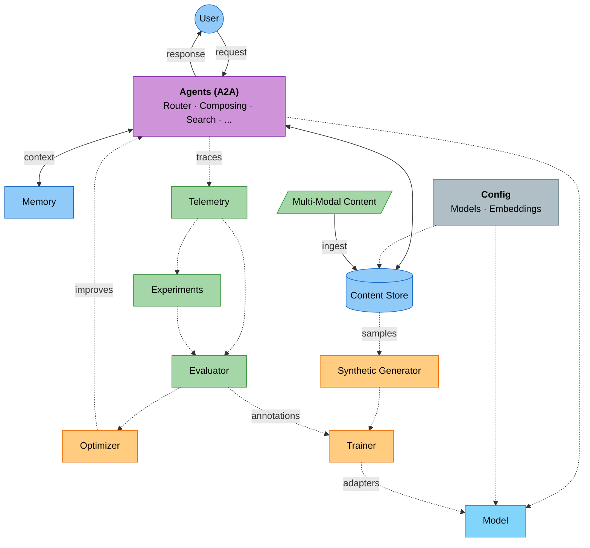

# Welcome to Cogniverse

**v0.1.0** · Multi-Agent AI Platform

Cogniverse is a self-optimizing multi-agent platform for intelligent processing and search across multi-modal content (video, audio, images, documents). It features A2A agent orchestration, continuous learning via DSPy, and complete multi-tenant isolation.

---

## Platform Overview



---

## Key Features

- **Multi-Modal Processing** — Video, audio, images, documents with unified embeddings
- **Agent Orchestration** — A2A protocol with routing, search, and composing agents
- **Self-Optimization** — Continuous learning via GEPA, MIPRO, and synthetic data
- **LLM Fine-Tuning** — End-to-end pipeline from telemetry to LoRA adapters
- **Memory** — Context persistence across conversations
- **Experiments** — Run and track evaluation experiments with datasets
- **Hybrid Search** — BM25 + dense vectors with multiple ranking strategies
- **Configurable** — Pluggable models, embeddings, and backends
- **Multi-Tenant** — Schema-per-tenant isolation with independent telemetry
- **Production Ready** — OpenTelemetry tracing, metrics, and distributed traces

---

## Quick Start

```bash
# Install
git clone <repository-url> && cd cogniverse
uv sync

# Start services (Vespa, Phoenix, Ollama)
docker compose -f deployment/docker-compose.yml up -d

# Launch dashboard
uv run streamlit run scripts/phoenix_dashboard_standalone.py
# Open http://localhost:8501
```

See [Getting Started](operations/setup-installation.md) for ingestion and configuration.

---

## Built With

| Category | Technologies |
|----------|-------------|
| **Embedding Models** | ColPali, VideoPrism, ColQwen, Whisper |
| **Entity Extraction** | GLiNER (zero-shot NER) |
| **LLM Inference** | Ollama (Llama, Qwen, SmolLM, Gemma) |
| **Remote Infra** | Modal (inference, training) |
| **Search Backend** | Vespa (BM25, dense, hybrid ranking) |
| **Memory** | Mem0 (context persistence) |
| **Telemetry** | Phoenix (OpenTelemetry, tracing, experiments) |
| **Optimization** | DSPy 3.1+ (GEPA, MIPRO, SIMBA, Bootstrap) |
| **Fine-Tuning** | TRL (LoRA, SFT, DPO) |

---

## Documentation

| Audience | Resources |
|----------|-----------|
| **Users** | [User Guide](USER_GUIDE.md) · [Setup](operations/setup-installation.md) · [Configuration](operations/configuration.md) |
| **Developers** | [Developer Guide](DEVELOPER_GUIDE.md) · [Architecture](architecture/overview.md) · [Modules](modules/sdk.md) |
| **DevOps** | [Deployment](operations/deployment.md) · [Docker](operations/docker-deployment.md) · [Kubernetes](operations/kubernetes-deployment.md) |
