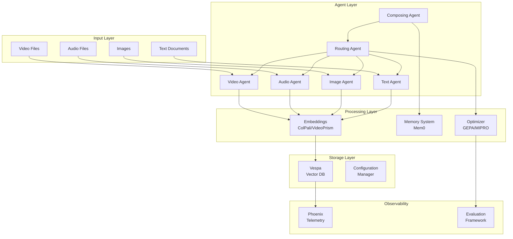

# Welcome to Cogniverse

**Version 2.0.0** | **10-Package UV Workspace Architecture** | **Production Ready**

## Multi-Agent System for Multi-Modal Content with Complete Multi-Tenant Isolation

<div align="center">

  [](https://github.com/cogniverse/cogniverse)
  [](LICENSE)
  [](https://www.python.org/downloads/)
  [](https://cogniverse.github.io/cogniverse/)
</div>

---

## 🚀 What is Cogniverse?

Cogniverse is a production-ready multi-agent system designed for processing and analyzing multi-modal content (video, audio, images, text) with built-in optimization and evaluation frameworks. It orchestrates specialized agents through the A2A (Agent-to-Agent) protocol to deliver intelligent content analysis and search capabilities.

### Key Capabilities

<div class="grid cards" markdown>

- :material-video-box: **Multi-Modal Processing**
  Process video, audio, images, and text with specialized agents

- :material-robot: **Agent Orchestration**
  A2A protocol-based coordination between specialized agents

- :material-chart-line: **Automated Optimization**
  Self-improving system with GEPA, MIPRO, SIMBA, and Bootstrap optimizers

- :material-test-tube: **Evaluation Framework**
  Built-in Phoenix experiments with reference-free quality metrics

- :material-account-multiple: **Multi-Tenant Support**
  Complete isolation with schema-per-tenant architecture

- :material-telescope: **Observability**
  Comprehensive telemetry with Phoenix integration

</div>

## ⚡ Quick Start

Get Cogniverse running in minutes:

```bash
# Clone the repository
git clone https://github.com/cogniverse/cogniverse.git
cd cogniverse

# Install dependencies
uv sync  # or pip install -r requirements.txt

# Start infrastructure
docker compose up -d

# Run your first ingestion
uv run python scripts/run_ingestion.py \
  --video_dir data/videos \
  --profile video_colpali_smol500_mv_frame

# Start the multi-agent system
uv run python scripts/run_orchestrator.py
```

## 🏗️ Architecture Overview



## 🎯 Use Cases

### Video Content Analysis
- Extract and search keyframes
- Generate frame descriptions
- Temporal boundary detection
- Multi-vector embeddings with ColPali

### Document Processing
- Text extraction and analysis
- Semantic search across documents
- Summarization and report generation

### Audio Analysis
- Transcription with timestamps
- Audio segment search
- Speaker identification

### Image Search
- Visual similarity search
- Content-based retrieval
- Multi-modal queries

## 📚 Core Components

### 🤖 Agent System
- **Composing Agent**: Orchestrates other agents
- **Routing Agent**: Intelligent query routing with DSPy optimization
- **Video Search Agent**: Specialized for video content
- **Text Analysis Agent**: Document and text processing
- **Audio Analysis Agent**: Audio content processing
- **Image Search Agent**: Visual content retrieval
- **Summarizer Agent**: Content summarization
- **Report Agent**: Detailed report generation

### 🔧 Processing Pipeline
- **Frame Extraction**: Keyframe detection with scene changes
- **Embedding Generation**: ColPali, VideoPrism, ColQwen models
- **Transcription**: Whisper-based audio transcription
- **Memory System**: Context-aware with Mem0

### 📊 Optimization & Evaluation
- **GEPA Optimizer**: Experience-guided continuous learning
- **MIPRO/SIMBA**: Instruction optimization
- **Bootstrap**: Few-shot learning
- **Phoenix Experiments**: A/B testing and evaluation
- **Quality Metrics**: Reference-free evaluation

## 🛠️ Technology Stack

- **Languages**: Python 3.12+
- **Agent Framework**: Custom A2A protocol with DSPy
- **Vector Database**: Vespa with 9 ranking strategies
- **Embeddings**: ColPali, VideoPrism, ColQwen
- **Memory**: Mem0 with Vespa backend
- **Telemetry**: Phoenix (Arize)
- **Optimization**: DSPy (Bootstrap, SIMBA, MIPRO, GEPA)
- **Deployment**: Docker, Kubernetes, Modal

## 📖 Documentation

<div class="grid cards" markdown>

- :material-rocket-launch: [**Getting Started**](getting-started/index.md)
  Installation, configuration, and quick start guide

- :material-architecture: [**Architecture**](architecture/index.md)
  System design, components, and data flow

- :material-book-open: [**User Guide**](guide/index.md)
  How to use Cogniverse for your use cases

- :material-api: [**API Reference**](api/index.md)
  Complete API documentation

- :material-server: [**Deployment**](deployment/index.md)
  Production deployment guides

- :material-chart-box: [**Observability**](observability/index.md)
  Monitoring, metrics, and evaluation

</div>

## 🤝 Contributing

We welcome contributions! See our [Contributing Guide](development/contributing.md) to get started.

## 📝 License

Cogniverse is released under the [MIT License](https://github.com/cogniverse/cogniverse/blob/main/LICENSE).

## 🌟 Star History

[](https://star-history.com/#cogniverse/cogniverse&Date)

---

<div align="center">
  <strong>Ready to transform your content processing?</strong><br>
  <a href="getting-started/quick-start.md" class="md-button md-button--primary">Get Started</a>
  <a href="https://github.com/cogniverse/cogniverse" class="md-button">View on GitHub</a>
</div>