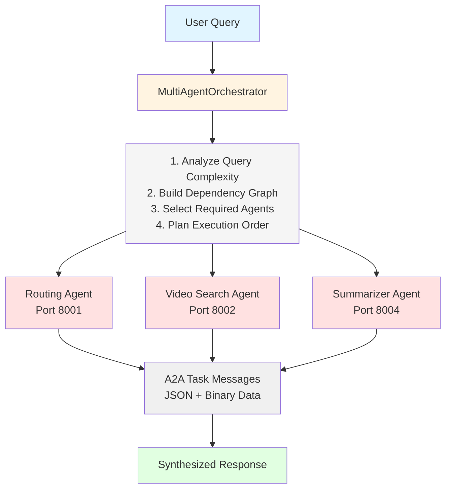
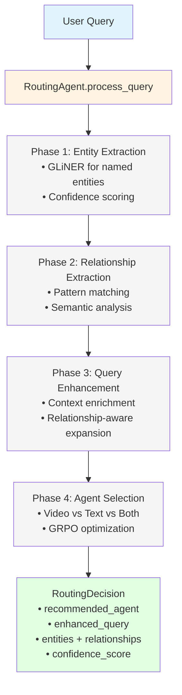
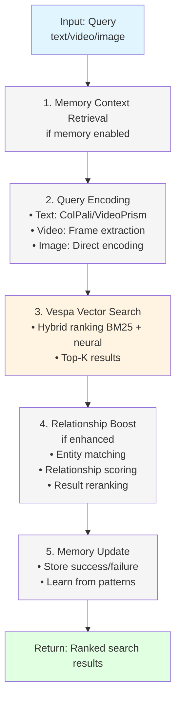

# Agents Module - Deep Dive Study Guide

**Module:** `src/app/agents/`
**Purpose:** Core agent implementations for multi-agent RAG system
**Last Updated:** 2025-10-07

---

## Table of Contents
1. [Module Overview](#module-overview)
2. [Architecture Diagrams](#architecture-diagrams)
3. [Core Classes](#core-classes)
4. [Data Flow](#data-flow)
5. [Usage Examples](#usage-examples)
6. [Production Considerations](#production-considerations)

---

## Module Overview

The Agents Module contains the intelligent components of the system. Each agent is specialized for a specific task and communicates via the A2A (Agent-to-Agent) protocol.

### Key Agents
1. **MultiAgentOrchestrator** - Coordinates multi-agent workflows
2. **RoutingAgent** - Routes queries with DSPy + relationship extraction
3. **VideoSearchAgent** - Multi-modal video search (text/video/image)
4. **SummarizerAgent** - Intelligent content summarization with VLM
5. **DetailedReportAgent** - Comprehensive analysis and reporting
6. **MemoryAwareMixin** - Mem0 conversation memory integration

### Design Principles
- **Separation of Concerns**: Each agent has a single, well-defined responsibility
- **A2A Protocol**: Standard message format for inter-agent communication
- **DSPy Integration**: Declarative LLM programming for optimization
- **Memory-Aware**: All agents can leverage conversation memory
- **Production-Ready**: Health checks, graceful degradation, comprehensive logging

---

## Architecture Diagrams

### Multi-Agent Workflow



### Routing Agent Decision Flow



### Video Search Agent Flow



---

## Core Classes

### 1. RoutingAgent

**File:** `src/app/agents/routing_agent.py`
**Lines:** 50-600
**Purpose:** Intelligent query routing with relationship extraction

#### Class Hierarchy
```python
class RoutingAgent(DSPyRoutingMixin, A2AEndpointsMixin, HealthCheckMixin):
    # Inherits DSPy integration, A2A protocol, and health checking
```

#### Key Methods

**`process_query(query: str, context: dict) -> RoutingDecision`**
- **Purpose:** Main entry point for routing decisions
- **Input:** User query string + optional context
- **Output:** RoutingDecision with agent selection + enhanced query
- **Process:**
  1. Extract entities using GLiNER/LangExtract
  2. Identify relationships between entities
  3. Enhance query with relationship context
  4. Select optimal agent using DSPy module
  5. Apply GRPO optimization (if enabled)

**Example:**
```python
routing_agent = RoutingAgent()
decision = await routing_agent.process_query(
    query="Show me videos where Einstein discusses quantum physics",
    context={"user_id": "user_123"}
)

# RoutingDecision:
# - recommended_agent: "video_search"
# - enhanced_query: "Videos featuring Albert Einstein discussing quantum mechanics and wave-particle duality"
# - entities: [{"text": "Einstein", "type": "PERSON"}, {"text": "quantum physics", "type": "TOPIC"}]
# - relationships: [{"subject": "Einstein", "relation": "discusses", "object": "quantum physics"}]
# - confidence: 0.89
```

**`extract_entities(query: str) -> List[Dict]`**
- **Purpose:** Named entity recognition
- **Strategy:** Tiered approach
  - Tier 1: GLiNER (fast, entity-based)
  - Tier 2: LLM (relationship-aware)
  - Tier 3: LangExtract (structured output)

**`enhance_query(query: str, entities: List, relationships: List) -> str`**
- **Purpose:** Enrich query with relationship context
- **Technique:** Relationship-aware query expansion

#### Configuration
```python
{
    "dspy_enabled": true,
    "grpo_enabled": true,
    "confidence_threshold": 0.7,
    "memory_enabled": true,
    "entity_extraction": "gliner",  # or "llm", "langextract"
    "relationship_extraction": true
}
```

---

### 2. VideoSearchAgent

**File:** `src/app/agents/video_search_agent.py`
**Lines:** 236-1273
**Purpose:** Multi-modal video search with memory integration

#### Key Features
- **Multi-Modal Support**: Text, video files, image files
- **Memory-Aware**: Learns from search patterns
- **Relationship-Enhanced**: Boosts results based on entity/relationship matches
- **Production-Ready**: Health checks, error handling, metrics

#### Key Methods

**`search_by_text(query: str, top_k: int) -> List[Dict]`**
- **Purpose:** Text-to-video search
- **Encoding:** ColPali or VideoPrism text encoder
- **Ranking:** Hybrid (BM25 + neural embeddings)

**Example:**
```python
agent = VideoSearchAgent(
    vespa_url="http://localhost",
    vespa_port=8080,
    profile="video_colpali_smol500_mv_frame"
)

results = agent.search_by_text(
    query="Machine learning tutorial",
    top_k=10,
    ranking="hybrid_binary_bm25_no_description"
)

# Results:
# [
#   {
#     "video_id": "vid_123",
#     "title": "ML Basics Tutorial",
#     "score": 0.87,
#     "keyframes": [...],
#     "metadata": {...}
#   },
#   ...
# ]
```

**`search_by_video(video_data: bytes, filename: str, top_k: int) -> List[Dict]`**
- **Purpose:** Video-to-video similarity search
- **Processing:**
  1. Save video to temp file
  2. Extract frames (1 FPS or every 30 frames)
  3. Encode frames using query encoder
  4. Search Vespa with frame embeddings
  5. Clean up temp files

**`search_with_routing_decision(decision: RoutingDecision) -> Dict`**
- **Purpose:** Enhanced search using routing context
- **Enhancement:**
  - Uses enhanced query from routing
  - Applies entity matching boost
  - Scores relationship relevance
  - Reranks results

#### Memory Integration
```python
# Memory is automatically used if initialized
agent.initialize_memory(
    agent_name="video_agent",
    tenant_id="tenant_123"
)

# Search automatically:
# 1. Retrieves relevant context from past searches
# 2. Stores successful patterns
# 3. Learns from failures
```

---

### 3. SummarizerAgent

**File:** `src/app/agents/summarizer_agent.py`
**Lines:** 107-400
**Purpose:** Intelligent summarization with VLM and thinking phase

#### DSPy Signature
```python
class SummaryGenerationSignature(dspy.Signature):
    """Generate structured summaries with key insights."""

    content = dspy.InputField(desc="Search results content to summarize")
    query = dspy.InputField(desc="Original user query")
    summary_type = dspy.InputField(desc="Type: brief, comprehensive, detailed")

    summary = dspy.OutputField(desc="Generated summary text")
    key_points = dspy.OutputField(desc="List of key points (comma-separated)")
    confidence_score = dspy.OutputField(desc="Confidence in summary (0.0-1.0)")
```

#### Key Methods

**`summarize(request: SummaryRequest) -> SummaryResult`**
- **Purpose:** Multi-phase intelligent summarization
- **Phases:**
  1. **Thinking Phase**: Analyze content, identify themes
  2. **Visual Analysis**: Extract visual insights (if enabled)
  3. **DSPy Generation**: Generate structured summary
  4. **Confidence Assessment**: Evaluate summary quality

**Example:**
```python
summarizer = SummarizerAgent()

request = SummaryRequest(
    query="AI developments",
    search_results=[...],  # Search results from VideoSearchAgent
    summary_type="comprehensive",
    include_visual_analysis=True,
    max_results_to_analyze=10
)

result = await summarizer.summarize(request)

# SummaryResult:
# - summary: "Comprehensive overview..."
# - key_points: ["Point 1", "Point 2", ...]
# - visual_insights: ["Visual element 1", ...]
# - confidence_score: 0.92
# - thinking_phase: ThinkingPhase(...)
```

**`summarize_with_routing_context(enhanced_request) -> SummaryResult`**
- **Purpose:** Relationship-aware summarization
- **Enhancement:** Includes entity/relationship analysis in summary

---

### 4. DetailedReportAgent

**File:** `src/app/agents/detailed_report_agent.py`
**Lines:** 99-450
**Purpose:** Comprehensive analysis and reporting

#### Report Structure
```python
@dataclass
class ReportResult:
    executive_summary: str            # High-level overview
    detailed_findings: List[Dict]     # Granular analysis
    visual_analysis: List[Dict]       # Visual content insights
    technical_details: List[Dict]     # Technical specifications
    recommendations: List[str]        # Actionable recommendations
    confidence_assessment: Dict       # Quality metrics
    thinking_phase: ThinkingPhase     # Agent's reasoning process
```

#### Key Methods

**`generate_report(request: ReportRequest) -> ReportResult`**
- **Purpose:** Generate comprehensive detailed report
- **Phases:**
  1. **Thinking Phase**: Content analysis, pattern identification
  2. **Visual Analysis**: Deep dive into visual elements
  3. **Executive Summary**: High-level synthesis
  4. **Detailed Findings**: Granular analysis
  5. **Technical Details**: Specifications and metadata
  6. **Recommendations**: Actionable next steps

**Example:**
```python
report_agent = DetailedReportAgent()

request = ReportRequest(
    query="AI safety research trends",
    search_results=[...],
    report_type="comprehensive",
    include_visual_analysis=True,
    include_technical_details=True,
    include_recommendations=True
)

report = await report_agent.generate_report(request)

# Uses DSPy for structured report generation
# Includes VLM analysis for visual content
# Provides thinking phase for transparency
```

---

### 5. MemoryAwareMixin

**File:** `src/app/agents/memory_aware_mixin.py`
**Lines:** 16-327
**Purpose:** Standard memory interface for all agents

#### Core Concept
All agents inherit from `MemoryAwareMixin` to access conversation memory powered by Mem0 + Vespa.

#### Key Methods

**`initialize_memory(agent_name, tenant_id, vespa_port) -> bool`**
- **Purpose:** Setup memory for agent
- **Backend:** Mem0 with Vespa vector store

**`get_relevant_context(query: str, top_k: int) -> str`**
- **Purpose:** Retrieve relevant memories for query
- **Process:**
  1. Embed query using Mem0
  2. Search vector store
  3. Return formatted context

**`update_memory(content: str, metadata: dict) -> bool`**
- **Purpose:** Store new memory
- **LLM Processing:** Mem0 uses LLM to condense and structure memories

**`remember_success(query, result, metadata) -> bool`**
- **Purpose:** Store successful interactions for learning

**`remember_failure(query, error, metadata) -> bool`**
- **Purpose:** Store failures to avoid repeating mistakes

#### Usage Pattern
```python
class MyAgent(MemoryAwareMixin, BaseAgent):
    def __init__(self):
        super().__init__()
        # Initialize memory
        self.initialize_memory(
            agent_name="my_agent",
            tenant_id="tenant_123"
        )

    async def process(self, query):
        # Get relevant memories
        context = self.get_relevant_context(query, top_k=5)

        # Use context in processing
        if context:
            enhanced_prompt = f"Context: {context}\n\nQuery: {query}"

        # Process...
        result = await self._process(enhanced_prompt)

        # Store success
        if result:
            self.remember_success(query, result)
        else:
            self.remember_failure(query, "Processing failed")

        return result
```

---

## Data Flow

### End-to-End Query Processing

```
1. USER SUBMITS QUERY
   ↓
2. MultiAgentOrchestrator receives query
   ↓
3. Orchestrator → RoutingAgent.process_query()
   │
   ├─→ Extract entities (GLiNER)
   ├─→ Extract relationships
   ├─→ Enhance query
   └─→ Return RoutingDecision
   ↓
4. Based on decision:
   │
   ├─→ Video Search: Orchestrator → VideoSearchAgent
   │   ├─→ Memory: Get context
   │   ├─→ Encode query (ColPali/VideoPrism)
   │   ├─→ Search Vespa
   │   ├─→ Apply relationship boost
   │   ├─→ Memory: Store pattern
   │   └─→ Return search results
   │
   ├─→ Text Search: Orchestrator → TextAgent
   │   └─→ [Similar flow]
   │
   └─→ Both: Execute parallel search
       └─→ Aggregate results
   ↓
5. If summarization requested:
   Orchestrator → SummarizerAgent.summarize()
   ├─→ Thinking phase (analyze results)
   ├─→ Visual analysis (VLM)
   ├─→ DSPy summary generation
   └─→ Return SummaryResult
   ↓
6. Orchestrator synthesizes final response
   ↓
7. Return to USER
```

---

## Usage Examples

### Example 1: Simple Video Search

```python
from src.app.agents.video_search_agent import VideoSearchAgent

# Initialize agent
agent = VideoSearchAgent(
    vespa_url="http://localhost",
    vespa_port=8080,
    profile="video_colpali_smol500_mv_frame"
)

# Search
results = agent.search_by_text(
    query="Python tutorial for beginners",
    top_k=5
)

# Process results
for result in results:
    print(f"Video: {result['title']}")
    print(f"Score: {result['score']}")
    print(f"ID: {result['video_id']}")
```

### Example 2: Routing with Enhancement

```python
from src.app.agents.routing_agent import RoutingAgent

routing_agent = RoutingAgent()

# Process complex query
decision = await routing_agent.process_query(
    query="Show me videos where Marie Curie discusses radioactivity and its applications",
    context={"user_preference": "educational"}
)

# Access routing details
print(f"Agent: {decision.recommended_agent}")
print(f"Enhanced query: {decision.enhanced_query}")
print(f"Entities: {decision.extracted_entities}")
print(f"Relationships: {decision.extracted_relationships}")
print(f"Confidence: {decision.confidence}")
```

### Example 3: Multi-Agent Workflow

```python
from src.app.agents.multi_agent_orchestrator import MultiAgentOrchestrator
from src.app.agents.routing_agent import RoutingAgent
from src.app.agents.video_search_agent import VideoSearchAgent
from src.app.agents.summarizer_agent import SummarizerAgent

# Initialize orchestrator
orchestrator = MultiAgentOrchestrator(
    routing_agent=RoutingAgent(),
    video_agent=VideoSearchAgent(),
    summarizer=SummarizerAgent()
)

# Process complex query
result = await orchestrator.process_query(
    query="Summarize recent AI research videos",
    options={
        "include_summary": True,
        "max_results": 20
    }
)

# Result includes:
# - Routing decision
# - Search results
# - Summary
# - Confidence scores
```

---

## Production Considerations

### Performance
- **Memory Initialization**: One-time setup per agent, reused across requests
- **Query Encoding**: Cached for repeated queries
- **Parallel Execution**: Use MultiAgentOrchestrator for concurrent agent calls
- **Batch Processing**: VideoSearchAgent supports batch encoding

### Scalability
- **Stateless Agents**: Can be horizontally scaled
- **Shared Memory**: Mem0 backend shared across instances
- **Vector Cache**: Per-tenant caching in Vespa

### Monitoring
- **Health Checks**: All agents expose `/health` endpoint
- **Telemetry**: Integrated with Phoenix (see Telemetry Module)
- **Metrics**: Request count, latency, success rate
- **Logging**: Structured logging with correlation IDs

### Error Handling
- **Graceful Degradation**: Fallback strategies at every level
- **Circuit Breaker**: Prevents cascading failures
- **Retry Logic**: Exponential backoff for transient failures
- **Error Memory**: Stores failures to avoid repetition

### Configuration
```yaml
agents:
  routing_agent:
    port: 8001
    dspy_enabled: true
    grpo_enabled: true
    confidence_threshold: 0.7

  video_agent:
    port: 8002
    profile: "video_colpali_smol500_mv_frame"
    memory_enabled: true
    cache_ttl: 300

  summarizer_agent:
    port: 8004
    max_summary_length: 500
    thinking_enabled: true
    visual_analysis_enabled: true
```

---

## Testing

### Unit Tests
- `tests/agents/unit/test_routing_agent.py`
- `tests/agents/unit/test_video_search_agent.py`
- `tests/agents/unit/test_summarizer_agent.py`
- `tests/agents/unit/test_detailed_report_agent.py`

### Integration Tests
- `tests/agents/integration/test_routing_agent_integration.py`
- `tests/agents/integration/test_video_search_agent_integration.py`

### End-to-End Tests
- `tests/agents/e2e/test_real_multi_agent_integration.py`

---

## Next Steps

For related modules, see:
- **Routing Module** (`02_ROUTING_MODULE.md`) - Routing strategies and optimization
- **Memory Module** (`07_MEMORY_MODULE.md`) - Mem0 integration details
- **Telemetry Module** (`05_TELEMETRY_MODULE.md`) - Observability and metrics

---

**Study Tips:**
1. Start with MemoryAwareMixin to understand the base pattern
2. Explore VideoSearchAgent for the most complex multi-modal example
3. Review RoutingAgent for DSPy integration patterns
4. Check integration tests for real-world usage examples
