# Agents Module

**Package:** `cogniverse_agents` (Implementation Layer)
**Location:** `libs/agents/cogniverse_agents/`

---

## Table of Contents

1. [Module Overview](#module-overview)
2. [Package Structure](#package-structure)
3. [Core Agents](#core-agents)
   - [RoutingAgent](#1-routingagent)
   - [VideoSearchAgent](#2-videosearchagent)
   - [OrchestratorAgent (A2A Entry Point)](#3-orchestratoragent-a2a-entry-point)
   - [ProfileSelectionAgent](#4-profileselectionagent)
   - [EntityExtractionAgent](#5-entityextractionagent)
   - [SearchAgent (Ensemble Mode)](#6-searchagent-ensemble-mode)
   - [DetailedReportAgent](#7-detailedreportagent)
   - [DocumentAgent](#8-documentagent)
   - [ImageSearchAgent](#9-imagesearchagent)
   - [SummarizerAgent](#10-summarizeragent)
   - [AudioAnalysisAgent](#11-audioanalysisagent)
   - [TextAnalysisAgent](#12-textanalysisagent)
   - [A2ARoutingAgent](#13-a2aroutingagent)
   - [VideoSearchAgent (Refactored)](#14-videosearchagent-refactored)
4. [Agent Architecture](#agent-architecture)
5. [Multi-Tenant Integration](#multi-tenant-integration)
6. [Usage Examples](#usage-examples)
7. [Streaming API](#streaming-api)
8. [RLM Inference (Recursive Language Models)](#rlm-inference-recursive-language-models)
9. [Testing](#testing)
10. [Durable Execution (Workflow Checkpointing)](#durable-execution-workflow-checkpointing)
11. [Real-Time Event Notifications](#real-time-event-notifications)
12. [Approval Workflow System](#approval-workflow-system)
13. [Tools Subsystem](#tools-subsystem)
    - [A2A Protocol Utilities](#a2a-protocol-utilities)
    - [VideoFileServer](#videofileserver)
    - [VideoPlayerTool](#videoplayertool)
    - [EnhancedTemporalExtractor](#enhancedtemporalextractor)
14. [Inference System](#inference-system)
    - [RLMInference](#rlminference)
    - [RLMResult](#rlmresult)
    - [InstrumentedRLM](#instrumentedrlm)

---

## Module Overview

The Agents package (`cogniverse-agents`) provides concrete agent implementations for the Cogniverse multi-agent AI platform. The architecture supports **any agent type** - content understanding agents ship by default, but web browsing, code analysis, and domain-specific agents can be integrated via the same AgentBase/A2AAgent base classes. All agents are tenant-aware and integrate with the core SDK packages.

### Key Agents

1. **RoutingAgent** - Query routing with DSPy optimization and relationship extraction
2. **VideoSearchAgent** - Multi-modal video search (ColPali, VideoPrism)
3. **OrchestratorAgent** - Central A2A entry point with DSPy planning, parallel execution, and AgentRegistry discovery
4. **ProfileSelectionAgent** - LLM-based intelligent backend profile selection and ensemble composition
5. **EntityExtractionAgent** - Named entity extraction with DSPy ChainOfThought (PERSON, PLACE, ORG, CONCEPT, DATE)
6. **SearchAgent** - Enhanced with ensemble mode and RRF fusion for multi-profile queries
7. **DetailedReportAgent** - Comprehensive report generation with VLM visual analysis
8. **DocumentAgent** - Dual-strategy document search (visual ColPali + text semantic)
9. **ImageSearchAgent** - Image similarity search using ColPali embeddings
10. **SummarizerAgent** - Intelligent summarization with thinking phase
11. **AudioAnalysisAgent** - Audio search with Whisper transcription
12. **TextAnalysisAgent** - Runtime-configurable text analysis with DSPy
13. **A2ARoutingAgent** - A2A wrapper for standardized agent communication
14. **VideoSearchAgent (Refactored)** - Simplified video search with unified service

### Design Principles

- **Tenant-Agnostic at Startup**: Agents boot without `tenant_id` — it arrives per-request in A2A task payload
- **Memory-Enabled**: Integration with Mem0 via MemoryAwareMixin (from core)
- **Base Class Inheritance**: Extend A2AAgent[InputT, OutputT, DepsT] from cogniverse_core with type-safe generics
- **DSPy 3.0 Integration**: A2A protocol + DSPy modules for optimization
- **Streaming Support**: OpenAI-style `stream=True` parameter for progressive results
- **Production-Ready**: Health checks, graceful degradation, telemetry

### Extensibility

The agent architecture is **not limited to content understanding**. The AgentBase and A2AAgent base classes support any agent type:

- **Web Browsing Agents**: Research, scraping, monitoring
- **Code Agents**: Analysis, generation, refactoring
- **Data Agents**: Database queries, API integrations
- **Communication Agents**: Email, Slack, notifications
- **Domain-Specific Agents**: Legal, medical, financial analysis

To add a custom agent, implement `A2AAgent[InputT, OutputT, DepsT]` and register with the AgentRegistry. All agents automatically gain tenant isolation, memory, telemetry, and DSPy optimization capabilities.

### Package Dependencies

```python
# Agents package depends on:
from cogniverse_core.agents.a2a_agent import A2AAgent, A2AAgentConfig
from cogniverse_core.agents.base import AgentBase, AgentDeps, AgentInput, AgentOutput
from cogniverse_core.agents.tenant_aware_mixin import TenantAwareAgentMixin
from cogniverse_core.agents.memory_aware_mixin import MemoryAwareMixin
from cogniverse_core.agents.health_mixin import HealthCheckMixin
from cogniverse_foundation.telemetry.manager import TelemetryManager
from cogniverse_foundation.config.unified_config import SystemConfig
```

---

## Package Structure


```mermaid
graph TD
    Root["<span style='color:#000'><b>cogniverse_agents/</b></span>"]

    Root --> Init["<span style='color:#000'>__init__.py</span>"]
    Root --> RoutingAgent["<span style='color:#000'><b>routing_agent.py</b><br/>1667 lines - TOP LEVEL</span>"]
    Root --> VideoAgent["<span style='color:#000'><b>video_agent_refactored.py</b><br/>180 lines - TOP LEVEL</span>"]
    Root --> OrchestratorAgent["<span style='color:#000'><b>orchestrator_agent.py</b><br/>A2A Entry Point</span>"]
    Root --> AudioAgent["<span style='color:#000'>audio_analysis_agent.py</span>"]
    Root --> DocAgent["<span style='color:#000'>document_agent.py</span>"]
    Root --> ImageAgent["<span style='color:#000'>image_search_agent.py</span>"]
    Root --> SummarizerAgent["<span style='color:#000'>summarizer_agent.py</span>"]
    Root --> MultiOrch["<span style='color:#000'>multi_agent_orchestrator.py</span>"]
    Root --> DspyOpt["<span style='color:#000'>dspy_agent_optimizer.py</span>"]
    Root --> More32["<span style='color:#000'>... (32 total agent files at top level)</span>"]

    Root --> RoutingDir["<span style='color:#000'><b>routing/</b><br/>39 files</span>"]
    RoutingDir --> RoutingInit["<span style='color:#000'>__init__.py</span>"]
    RoutingDir --> ParallelExec["<span style='color:#000'>parallel_executor.py</span>"]
    RoutingDir --> AdvOpt["<span style='color:#000'>advanced_optimizer.py</span>"]
    RoutingDir --> ModalCache["<span style='color:#000'>modality_cache.py</span>"]
    RoutingDir --> RelExtract["<span style='color:#000'>relationship_extraction_tools.py</span>"]
    RoutingDir --> DspyRouter["<span style='color:#000'>dspy_relationship_router.py</span>"]
    RoutingDir --> QueryEnh["<span style='color:#000'>query_enhancement_engine.py</span>"]
    RoutingDir --> MoreRouting["<span style='color:#000'>... (39 utility files)</span>"]

    Root --> SearchDir["<span style='color:#000'><b>search/</b><br/>7 files</span>"]
    SearchDir --> SearchInit["<span style='color:#000'>__init__.py</span>"]
    SearchDir --> MMRerank["<span style='color:#000'>multi_modal_reranker.py</span>"]
    SearchDir --> HybridRerank["<span style='color:#000'>hybrid_reranker.py</span>"]
    SearchDir --> LearnedRerank["<span style='color:#000'>learned_reranker.py</span>"]
    SearchDir --> RerankersDir["<span style='color:#000'>rerankers/</span>"]

    Root --> OrchDir["<span style='color:#000'><b>orchestrator/</b></span>"]
    OrchDir --> OrchInit["<span style='color:#000'>__init__.py</span>"]
    OrchDir --> MoreOrch["<span style='color:#000'>... (orchestration components)</span>"]

    Root --> OptDir["<span style='color:#000'><b>optimizer/</b></span>"]
    OptDir --> OptInit["<span style='color:#000'>__init__.py</span>"]
    OptDir --> DspyAgentOpt["<span style='color:#000'>dspy_agent_optimizer.py</span>"]
    OptDir --> RouterOpt["<span style='color:#000'>router_optimizer.py</span>"]
    OptDir --> ProvidersDir["<span style='color:#000'>providers/</span>"]

    Root --> QueryDir["<span style='color:#000'><b>query/</b></span>"]
    Root --> ResultsDir["<span style='color:#000'><b>results/</b></span>"]
    Root --> ToolsDir["<span style='color:#000'><b>tools/</b></span>"]
    Root --> WorkflowDir["<span style='color:#000'><b>workflow/</b></span>"]

    style Root fill:#ce93d8,stroke:#7b1fa2,color:#000
    style RoutingAgent fill:#ffcc80,stroke:#ef6c00,color:#000
    style VideoAgent fill:#ffcc80,stroke:#ef6c00,color:#000
    style OrchestratorAgent fill:#ffcc80,stroke:#ef6c00,color:#000
    style RoutingDir fill:#81d4fa,stroke:#0288d1,color:#000
    style SearchDir fill:#81d4fa,stroke:#0288d1,color:#000
    style OrchDir fill:#81d4fa,stroke:#0288d1,color:#000
    style OptDir fill:#81d4fa,stroke:#0288d1,color:#000
    style QueryDir fill:#81d4fa,stroke:#0288d1,color:#000
    style ResultsDir fill:#81d4fa,stroke:#0288d1,color:#000
    style ToolsDir fill:#81d4fa,stroke:#0288d1,color:#000
    style WorkflowDir fill:#81d4fa,stroke:#0288d1,color:#000
```

**Total Files**: 118 Python files (32 at top level + 86 utilities in subdirectories)

**Key Agent Files** (all at top level):

- `routing_agent.py`: 1667 lines

- `video_agent_refactored.py`: 180 lines

- `orchestrator_agent.py`: A2A entry point with DSPy planning


## Core Agents

### 1. RoutingAgent

**Location**: `libs/agents/cogniverse_agents/routing_agent.py` (top level)
**Purpose**: Intelligent query routing with relationship extraction and DSPy 3.0 optimization
**Base Classes**: `A2AAgent[RoutingInput, RoutingOutput, RoutingDeps], MemoryAwareMixin, TenantAwareAgentMixin`

#### Architecture

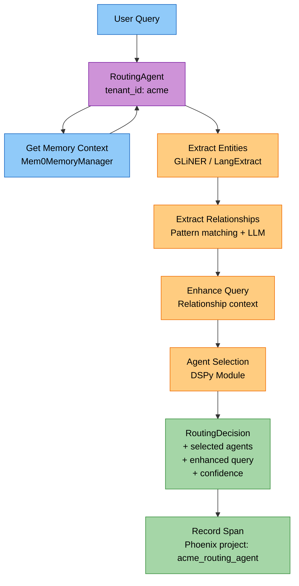
```mermaid
flowchart TB
    Query["<span style='color:#000'>User Query</span>"] --> RoutingAgent["<span style='color:#000'>RoutingAgent<br/>tenant_id: acme</span>"]

    RoutingAgent --> Memory["<span style='color:#000'>Get Memory Context<br/>Mem0MemoryManager</span>"]
    Memory --> RoutingAgent

    RoutingAgent --> EntityExtract["<span style='color:#000'>Extract Entities<br/>GLiNER / LangExtract</span>"]
    EntityExtract --> RelExtract["<span style='color:#000'>Extract Relationships<br/>Pattern matching + LLM</span>"]
    RelExtract --> QueryEnhance["<span style='color:#000'>Enhance Query<br/>Relationship context</span>"]
    QueryEnhance --> DSPyOptimize["<span style='color:#000'>Agent Selection<br/>DSPy Module</span>"]
    DSPyOptimize --> Decision["<span style='color:#000'>RoutingDecision<br/>+ selected agents<br/>+ enhanced query<br/>+ confidence</span>"]

    Decision --> Telemetry["<span style='color:#000'>Record Span<br/>Phoenix project: acme_routing_agent</span>"]

    style Query fill:#90caf9,stroke:#1565c0,color:#000
    style RoutingAgent fill:#ce93d8,stroke:#7b1fa2,color:#000
    style Memory fill:#90caf9,stroke:#1565c0,color:#000
    style EntityExtract fill:#ffcc80,stroke:#ef6c00,color:#000
    style RelExtract fill:#ffcc80,stroke:#ef6c00,color:#000
    style QueryEnhance fill:#ffcc80,stroke:#ef6c00,color:#000
    style DSPyOptimize fill:#ffcc80,stroke:#ef6c00,color:#000
    style Decision fill:#a5d6a7,stroke:#388e3c,color:#000
    style Telemetry fill:#a5d6a7,stroke:#388e3c,color:#000
```

#### Class Definition

```python
# libs/agents/cogniverse_agents/routing_agent.py

from cogniverse_core.agents.a2a_agent import A2AAgent, A2AAgentConfig
from cogniverse_core.agents.base import AgentDeps, AgentInput, AgentOutput
from cogniverse_core.agents.memory_aware_mixin import MemoryAwareMixin
from cogniverse_core.agents.tenant_aware_mixin import TenantAwareAgentMixin
from cogniverse_foundation.telemetry.manager import TelemetryManager
from pydantic import Field
from typing import Any, Dict, List, Optional
import dspy

# Type-safe input/output definitions
class RoutingInput(AgentInput):
    """Input for routing agent."""
    query: str = Field(..., description="User query to route")
    context: Optional[str] = Field(None, description="Optional context information")
    require_orchestration: Optional[bool] = Field(None, description="Force orchestration decision")

class RoutingOutput(AgentOutput):
    """Output from routing agent."""
    query: str = Field(..., description="Original query")
    recommended_agent: str = Field(..., description="Agent to route to")
    confidence: float = Field(..., ge=0.0, le=1.0, description="Routing confidence")
    reasoning: str = Field(..., description="Reasoning for the decision")
    fallback_agents: List[str] = Field(default_factory=list, description="Fallback agents if primary fails")
    enhanced_query: str = Field("", description="Enhanced query with context")
    entities: List[Dict[str, Any]] = Field(default_factory=list, description="Extracted entities")
    relationships: List[Dict[str, Any]] = Field(default_factory=list, description="Extracted relationships")
    metadata: Dict[str, Any] = Field(default_factory=dict, description="Additional metadata")
    query_variants: List[Dict[str, str]] = Field(default_factory=list, description="Query variants for parallel fusion search")
    timestamp: datetime = Field(default_factory=datetime.now, description="Decision timestamp")

    # Convenience properties
    @property
    def extracted_entities(self) -> List[Dict[str, Any]]:
        return self.entities

    @property
    def extracted_relationships(self) -> List[Dict[str, Any]]:
        return self.relationships

    @property
    def routing_metadata(self) -> Dict[str, Any]:
        return self.metadata

class RoutingDeps(AgentDeps):
    """Dependencies for routing agent."""
    tenant_id: str = Field("default", description="Tenant ID for multi-tenancy isolation")
    telemetry_config: Any = Field(..., description="Telemetry configuration")
    model_name: str = Field("smollm3:3b", description="DSPy model name")
    base_url: str = Field("http://localhost:11434/v1", description="Model API base URL")
    confidence_threshold: float = Field(0.7, description="Min confidence threshold")
    enable_relationship_extraction: bool = Field(True, description="Enable relationship extraction")
    enable_query_enhancement: bool = Field(True, description="Enable query enhancement")
    enable_caching: bool = Field(True, description="Enable result caching")
    enable_advanced_optimization: bool = Field(True, description="Enable GRPO optimization")
    enable_memory: bool = Field(False, description="Enable memory (requires Mem0)")

class RoutingAgent(A2AAgent[RoutingInput, RoutingOutput, RoutingDeps], MemoryAwareMixin, TenantAwareAgentMixin):
    """
    Intelligent query routing with relationship extraction.

    Multi-tenant aware - each tenant gets isolated routing context.
    Type-safe with generic input/output/deps types.
    """

    def __init__(self, deps: RoutingDeps, port: int = 8001):
        """
        Initialize routing agent (tenant-agnostic).

        Args:
            deps: RoutingDeps with infrastructure config (no tenant_id)
            port: A2A HTTP server port
        """
        config = A2AAgentConfig(
            agent_name="routing_agent",
            agent_description="Intelligent query routing with DSPy optimization",
            capabilities=["routing", "query_enhancement"],
            port=port,
        )
        super().__init__(deps=deps, config=config, dspy_module=None)

        # Initialize telemetry (singleton, tenant-scoped via span calls)
        self.telemetry = TelemetryManager()
        # tenant_id arrives per-request in A2A task payload, not at construction

        # Memory initialized lazily per-tenant on first request
        # via _ensure_memory_for_tenant(tenant_id) in _process_impl
        self._memory_initialized_tenants: set = set()

        # DSPy modules (shared across all tenants)
        self._init_dspy_modules()

    async def _process_impl(self, input: RoutingInput) -> RoutingOutput:
        """Type-safe processing with IDE autocomplete support."""
        # Implementation handles routing logic
        ...
```

#### Key Methods

**`route_query(query: str, context: Optional[str] = None, tenant_id: Optional[str] = None, require_orchestration: Optional[bool] = None) -> RoutingOutput`**

Main routing entry point. Returns a `RoutingOutput` Pydantic model.

**Note**: `RoutingDecision` is a SEPARATE dataclass in `cogniverse_agents/routing/base.py` used by the lower-level routing strategies. It has different fields (`search_modality`, `generation_type`, `confidence_score`, `primary_agent`). Do not confuse it with `RoutingOutput` which is the typed output of the `RoutingAgent` itself.

```python
async def route_query(
    self,
    query: str,
    context: Optional[str] = None,
    tenant_id: Optional[str] = None,
    require_orchestration: Optional[bool] = None,
) -> RoutingOutput:
    """
    Route query with entity/relationship extraction.

    Args:
        query: User query string
        context: Optional context string for additional query context
        tenant_id: Tenant ID (defaults to self.tenant_id, REQUIRED for telemetry)
        require_orchestration: Force multi-agent orchestration if True

    Returns:
        RoutingOutput with selected agents and enhanced query
    """
    with self.telemetry.trace("route_query") as span:
        span.set_attribute("tenant_id", self.tenant_id)
        span.set_attribute("query", query)

        # 1. Get memory context
        memory_context = self.get_relevant_context(query, top_k=5)

        # 2. Analyze and enhance query (composable module: entity extraction + relationship inference + query reformulation)
        entities, relationships, enhanced_query, enhancement_metadata = await self._analyze_and_enhance_query(query)

        # 3. Select agents (DSPy)
        decision = await self._make_routing_decision(query, enhanced_query, entities, relationships, context)

        # 5. Record decision
        span.set_attribute("recommended_agent", decision.recommended_agent)
        span.set_attribute("confidence", decision.confidence)

        return decision
```

**`_analyze_and_enhance_query(query: str) -> Tuple[List[Dict], List[Dict], str, Dict]`**

Unified analysis and enhancement using `ComposableQueryAnalysisModule`. The module has two paths:
- **Path A (GLiNER fast path):** GLiNER extracts high-confidence entities → heuristic relationship inference → LLM reformulates and generates variants
- **Path B (LLM unified path):** Single LLM call does entity extraction, relationship extraction, query reformulation, and variant generation

Path selection is automatic based on GLiNER entity confidence (threshold: `entity_confidence_threshold`, default 0.6).

```python
async def _analyze_and_enhance_query(
    self,
    query: str,
) -> Tuple[List[Dict[str, Any]], List[Dict[str, Any]], str, Dict[str, Any]]:
    """
    Analyze and enhance query using composable module.

    Returns:
        Tuple of (entities, relationships, enhanced_query, enhancement_metadata):
        - entities: [{"text": "Einstein", "type": "PERSON", "confidence": 0.85}, ...]
        - relationships: [{"subject": "Einstein", "relation": "discusses", "object": "physics"}, ...]
        - enhanced_query: "Einstein's contributions to theoretical physics"
        - enhancement_metadata: {"path_used": "A", "query_variants": [...], "confidence": 0.9}
    """
```

#### Configuration

```python
# Routing agent configuration
routing_agent_config = {
    "dspy_enabled": True,
    "grpo_enabled": True,
    "confidence_threshold": 0.7,
    "memory_enabled": True,
    "entity_extraction_method": "gliner",  # or "langextract", "llm"
    "relationship_extraction_enabled": True,
    "cache_ttl_seconds": 300
}
```

---

### 2. VideoSearchAgent

**Location**: `libs/agents/cogniverse_agents/video_agent_refactored.py` (top level)
**Purpose**: Text-to-video search with ColPali and VideoPrism embeddings
**Constructor**: `VideoSearchAgent(config_manager: ConfigManager = None, schema_loader=None)`

#### Multi-Modal Support

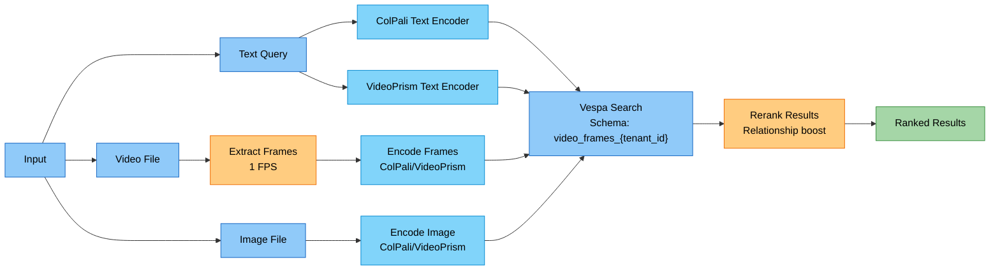
```mermaid
flowchart LR
    Input["<span style='color:#000'>Input</span>"] --> TextQuery["<span style='color:#000'>Text Query</span>"]
    Input --> VideoFile["<span style='color:#000'>Video File</span>"]
    Input --> ImageFile["<span style='color:#000'>Image File</span>"]

    TextQuery --> ColPaliEncode["<span style='color:#000'>ColPali Text Encoder</span>"]
    TextQuery --> VideoPrismEncode["<span style='color:#000'>VideoPrism Text Encoder</span>"]

    VideoFile --> FrameExtract["<span style='color:#000'>Extract Frames<br/>1 FPS</span>"]
    FrameExtract --> VideoEncode["<span style='color:#000'>Encode Frames<br/>ColPali/VideoPrism</span>"]

    ImageFile --> ImageEncode["<span style='color:#000'>Encode Image<br/>ColPali/VideoPrism</span>"]

    ColPaliEncode --> VespaSearch["<span style='color:#000'>Vespa Search<br/>Schema: video_frames_{tenant_id}</span>"]
    VideoPrismEncode --> VespaSearch
    VideoEncode --> VespaSearch
    ImageEncode --> VespaSearch

    VespaSearch --> Rerank["<span style='color:#000'>Rerank Results<br/>Relationship boost</span>"]
    Rerank --> Results["<span style='color:#000'>Ranked Results</span>"]

    style Input fill:#90caf9,stroke:#1565c0,color:#000
    style TextQuery fill:#90caf9,stroke:#1565c0,color:#000
    style VideoFile fill:#90caf9,stroke:#1565c0,color:#000
    style ImageFile fill:#90caf9,stroke:#1565c0,color:#000
    style ColPaliEncode fill:#81d4fa,stroke:#0288d1,color:#000
    style VideoPrismEncode fill:#81d4fa,stroke:#0288d1,color:#000
    style FrameExtract fill:#ffcc80,stroke:#ef6c00,color:#000
    style VideoEncode fill:#81d4fa,stroke:#0288d1,color:#000
    style ImageEncode fill:#81d4fa,stroke:#0288d1,color:#000
    style VespaSearch fill:#90caf9,stroke:#1565c0,color:#000
    style Rerank fill:#ffcc80,stroke:#ef6c00,color:#000
    style Results fill:#a5d6a7,stroke:#388e3c,color:#000
```

#### Class Definition

```python
# libs/agents/cogniverse_agents/video_agent_refactored.py

from typing import Optional, List, Dict, Any
from cogniverse_foundation.config.manager import ConfigManager
from cogniverse_agents.search.service import SearchService

class VideoSearchAgent:
    """
    Profile-agnostic video search agent.

    Single instance serves all profiles and tenants.
    Profile and tenant_id arrive per-request via search() method.
    """

    def __init__(
        self,
        config_manager: "ConfigManager" = None,  # REQUIRED
        schema_loader=None,                       # REQUIRED
    ):
        """
        Initialize video search agent (profile-agnostic, tenant-agnostic).

        Args:
            config_manager: ConfigManager instance (REQUIRED)
            schema_loader: SchemaLoader instance (REQUIRED)

        Raises:
            ValueError: If config_manager or schema_loader is None
        """
        if config_manager is None:
            raise ValueError("config_manager is required")
        if schema_loader is None:
            raise ValueError("schema_loader is required")

        self.config_manager = config_manager
        self.config = get_config(tenant_id="default", config_manager=config_manager)
        self.schema_loader = schema_loader

        # Default profile from config (used when caller doesn't specify)
        self.default_profile = (
            self.config.get("active_video_profile") or "video_colpali_smol500_mv_frame"
        )

        # Single profile-agnostic search service
        self.search_service = SearchService(
            self.config,
            config_manager=config_manager,
            schema_loader=schema_loader,
        )
```

#### Key Methods

**`search(query, profile=None, tenant_id="default", top_k=10, start_date=None, end_date=None) -> List[SearchResult]`**

Text-to-video search. **This method is synchronous** (not async). Profile and tenant_id are per-request.

```python
def search(
    self,
    query: str,
    profile: Optional[str] = None,      # Per-request (defaults to config active_video_profile)
    tenant_id: str = "default",          # Per-request
    top_k: int = 10,
    start_date: Optional[str] = None,
    end_date: Optional[str] = None,
) -> List[SearchResult]:
    """
    Search videos by text query.

    Args:
        query: Text query string
        profile: Profile to use (defaults to config active_video_profile)
        tenant_id: Tenant identifier for schema isolation
        top_k: Number of results to return
        start_date: Optional start date filter (YYYY-MM-DD)
        end_date: Optional end date filter (YYYY-MM-DD)

    Returns:
        List of SearchResult objects with scores
    """
    effective_profile = profile or self.default_profile
    return self.search_service.search(
        query=query,
        profile=effective_profile,
        tenant_id=tenant_id,
        top_k=top_k,
        filters={"start_date": start_date, "end_date": end_date},
    )
```

#### Usage Example

```python
from cogniverse_agents.video_agent_refactored import VideoSearchAgent
from cogniverse_foundation.config.utils import create_default_config_manager
from cogniverse_core.schemas.filesystem_loader import FilesystemSchemaLoader
from pathlib import Path

# Initialize dependencies (required)
config_manager = create_default_config_manager()
schema_loader = FilesystemSchemaLoader(Path("configs/schemas"))

# Create agent — profile-agnostic, tenant-agnostic
agent = VideoSearchAgent(
    config_manager=config_manager,
    schema_loader=schema_loader,
)

# Search (synchronous) — profile and tenant_id are per-request
results = agent.search("cooking tutorial", profile="video_colpali_smol500_mv_frame", tenant_id="acme", top_k=10)

# With date filters (profile defaults to config active_video_profile if omitted)
recent_results = agent.search(
    query="machine learning",
    tenant_id="acme",
    top_k=20,
    start_date="2024-01-01",
    end_date="2024-12-31",
)
```

**Note**: `VideoSearchAgent` provides text-to-video search only. For video-to-video similarity search, use `SearchAgent` which supports this via `_search_by_video()`:

```python
from cogniverse_agents.search_agent import SearchAgent, SearchAgentDeps
from cogniverse_core.schemas.filesystem_loader import FilesystemSchemaLoader
from cogniverse_foundation.config.utils import create_default_config_manager
from pathlib import Path

# SearchAgent supports video-to-video search
# Note: schema_loader is REQUIRED, config_manager is optional (will create default if None)
schema_loader = FilesystemSchemaLoader(Path("schemas"))
config_manager = create_default_config_manager()
deps = SearchAgentDeps()  # No tenant_id at construction
search_agent = SearchAgent(deps=deps, schema_loader=schema_loader, config_manager=config_manager)

# Video-to-video similarity search (internal method)
# Note: video_bytes must be defined (e.g., from reading a file)
with open("query_video.mp4", "rb") as f:
    video_bytes = f.read()

results = search_agent._search_by_video(
    video_data=video_bytes,      # Raw video file bytes
    filename="query_video.mp4",
    modality="video",
    top_k=10
)
# Internally uses content_processor.process_video_file() to extract embeddings
```

#### Multi-Tenant Search Flow

```python
from cogniverse_agents.video_agent_refactored import VideoSearchAgent
from cogniverse_foundation.config.utils import create_default_config_manager

config_manager = create_default_config_manager()

# ONE agent serves ALL tenants — profile and tenant_id are per-request
agent = VideoSearchAgent(config_manager=config_manager, schema_loader=schema_loader)

# Tenant A: acme
results_acme = agent.search("cooking videos", profile="video_colpali_smol500_mv_frame", tenant_id="acme")
# Searches schema: video_colpali_smol500_mv_frame_acme
# Only acme's videos returned

# Tenant B: startup (same agent instance)
results_startup = agent.search("cooking videos", profile="video_colpali_smol500_mv_frame", tenant_id="startup")
# Searches schema: video_colpali_smol500_mv_frame_startup
# Only startup's videos returned

# Physical isolation via Vespa schema naming — no cross-tenant data access possible
```

---

### 3. OrchestratorAgent (A2A Entry Point)

**Location**: `libs/agents/cogniverse_agents/orchestrator_agent.py`
**Purpose**: Central orchestration entry point — plans and executes multi-agent pipelines via A2A
**Base**: `MemoryAwareMixin, A2AAgent[OrchestratorInput, OrchestratorOutput, OrchestratorDeps]`
**Port**: 8013

#### Architecture

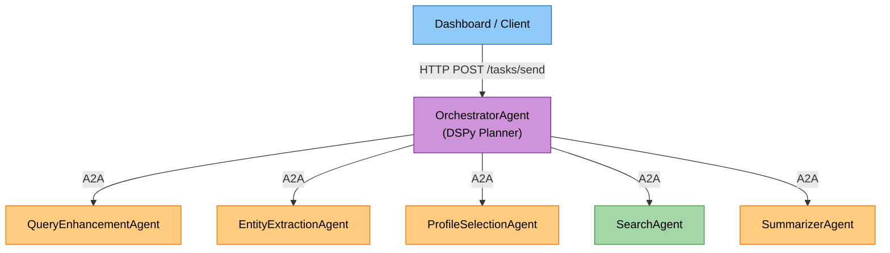
```mermaid
flowchart TB
    Dashboard["<span style='color:#000'>Dashboard / Client</span>"] -->|HTTP POST /tasks/send| Orchestrator["<span style='color:#000'>OrchestratorAgent<br/>(DSPy Planner)</span>"]

    Orchestrator -->|A2A| QE["<span style='color:#000'>QueryEnhancementAgent</span>"]
    Orchestrator -->|A2A| EE["<span style='color:#000'>EntityExtractionAgent</span>"]
    Orchestrator -->|A2A| PS["<span style='color:#000'>ProfileSelectionAgent</span>"]
    Orchestrator -->|A2A| SA["<span style='color:#000'>SearchAgent</span>"]
    Orchestrator -->|A2A| SU["<span style='color:#000'>SummarizerAgent</span>"]

    style Dashboard fill:#90caf9,stroke:#1565c0,color:#000
    style Orchestrator fill:#ce93d8,stroke:#7b1fa2,color:#000
    style QE fill:#ffcc80,stroke:#ef6c00,color:#000
    style EE fill:#ffcc80,stroke:#ef6c00,color:#000
    style PS fill:#ffcc80,stroke:#ef6c00,color:#000
    style SA fill:#a5d6a7,stroke:#388e3c,color:#000
    style SU fill:#ffcc80,stroke:#ef6c00,color:#000
```

#### Implementation

The orchestrator uses DSPy for planning and AgentRegistry for discovery:

```python
from cogniverse_agents.orchestrator_agent import (
    OrchestratorAgent, OrchestratorDeps, OrchestratorInput, OrchestratorOutput,
)
from cogniverse_agents.agent_registry import AgentRegistry

# Construction — tenant-agnostic, no env vars
registry = AgentRegistry(config_manager=config_manager)
deps = OrchestratorDeps()
orchestrator = OrchestratorAgent(deps=deps, registry=registry, port=8013)

# Processing — tenant_id and session_id arrive per-request
result = await orchestrator._process_impl(
    OrchestratorInput(
        query="Show me machine learning videos",
        tenant_id="acme_corp",
        session_id="sess-uuid",
    )
)

# Result contains: plan_steps, parallel_groups, agent_results, final_output, execution_summary
```

#### Key Features

- **DSPy Planning**: `OrchestrationModule` uses `dspy.ChainOfThought` to plan agent sequences
- **Parallel Execution**: Steps can run in parallel groups (e.g., entity extraction + query enhancement)
- **Agent Discovery**: Uses `AgentRegistry.find_agents_by_capability()` for dynamic agent lookup
- **A2A Calls**: Executes agents via `A2AClient.send_task(url, query=..., tenant_id=..., session_id=...)`
- **Graceful Degradation**: Captures agent failures without stopping the pipeline

---

### 4. ProfileSelectionAgent

**Location**: `libs/agents/cogniverse_agents/profile_selection_agent.py`
**Purpose**: LLM-based intelligent backend profile selection and ensemble composition
**Base Classes**: `A2AAgent[ProfileSelectionInput, ProfileSelectionOutput, ProfileSelectionDeps]`
**Port**: 8011

#### Overview

ProfileSelectionAgent uses small language models (SmolLM 3B or Qwen 2.5 3B) via DSPy to intelligently select which backend search profiles to use for a given query. It can recommend single profile searches or ensemble searches with multiple profiles.

**Key Capabilities**:

- Analyze query complexity (entities, relationships, keywords)
- Match query characteristics to profile strengths
- Recommend single profile or ensemble mode
- Provide reasoning and confidence scores

#### Architecture

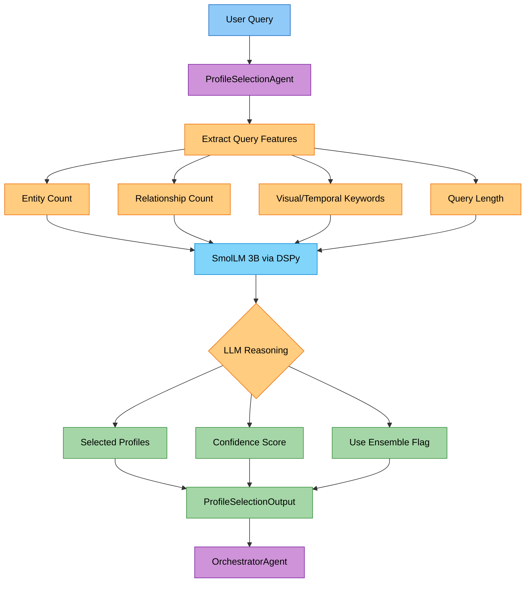
```mermaid
flowchart TB
    Query["<span style='color:#000'>User Query</span>"] --> ProfileAgent["<span style='color:#000'>ProfileSelectionAgent</span>"]

    ProfileAgent --> Features["<span style='color:#000'>Extract Query Features</span>"]
    Features --> Entities["<span style='color:#000'>Entity Count</span>"]
    Features --> Relationships["<span style='color:#000'>Relationship Count</span>"]
    Features --> Keywords["<span style='color:#000'>Visual/Temporal Keywords</span>"]
    Features --> Length["<span style='color:#000'>Query Length</span>"]

    Entities --> LLM["<span style='color:#000'>SmolLM 3B via DSPy</span>"]
    Relationships --> LLM
    Keywords --> LLM
    Length --> LLM

    LLM --> Decision{"<span style='color:#000'>LLM Reasoning</span>"}
    Decision --> Profiles["<span style='color:#000'>Selected Profiles</span>"]
    Decision --> Confidence["<span style='color:#000'>Confidence Score</span>"]
    Decision --> UseEnsemble["<span style='color:#000'>Use Ensemble Flag</span>"]

    Profiles --> Response["<span style='color:#000'>ProfileSelectionOutput</span>"]
    Confidence --> Response
    UseEnsemble --> Response

    Response --> Orchestrator["<span style='color:#000'>OrchestratorAgent</span>"]

    style Query fill:#90caf9,stroke:#1565c0,color:#000
    style ProfileAgent fill:#ce93d8,stroke:#7b1fa2,color:#000
    style Features fill:#ffcc80,stroke:#ef6c00,color:#000
    style Entities fill:#ffcc80,stroke:#ef6c00,color:#000
    style Relationships fill:#ffcc80,stroke:#ef6c00,color:#000
    style Keywords fill:#ffcc80,stroke:#ef6c00,color:#000
    style Length fill:#ffcc80,stroke:#ef6c00,color:#000
    style LLM fill:#81d4fa,stroke:#0288d1,color:#000
    style Decision fill:#ffcc80,stroke:#ef6c00,color:#000
    style Profiles fill:#a5d6a7,stroke:#388e3c,color:#000
    style Confidence fill:#a5d6a7,stroke:#388e3c,color:#000
    style UseEnsemble fill:#a5d6a7,stroke:#388e3c,color:#000
    style Response fill:#a5d6a7,stroke:#388e3c,color:#000
    style Orchestrator fill:#ce93d8,stroke:#7b1fa2,color:#000
```

#### DSPy Signature

```python
# libs/agents/cogniverse_agents/profile_selection_agent.py

import dspy

class ProfileSelectionSignature(dspy.Signature):
    """Select optimal backend profile based on query analysis"""

    # Inputs
    query: str = dspy.InputField(
        desc="User query to analyze"
    )
    available_profiles: str = dspy.InputField(
        desc="Comma-separated list of available profiles"
    )

    # Outputs
    selected_profile: str = dspy.OutputField(
        desc="Best matching profile name"
    )
    confidence: str = dspy.OutputField(
        desc="Confidence score 0.0-1.0"
    )
    reasoning: str = dspy.OutputField(
        desc="Explanation for profile selection"
    )
    query_intent: str = dspy.OutputField(
        desc="Detected intent: text_search, video_search, image_search, etc."
    )
    modality: str = dspy.OutputField(
        desc="Target modality: video, image, text, audio"
    )
    complexity: str = dspy.OutputField(
        desc="Query complexity: simple, medium, complex"
    )
```

#### Class Definition

```python
from cogniverse_core.agents.a2a_agent import A2AAgent, A2AAgentConfig
from cogniverse_core.agents.base import AgentDeps, AgentInput, AgentOutput
from cogniverse_core.agents.memory_aware_mixin import MemoryAwareMixin
from pydantic import BaseModel, Field
from typing import List
import dspy

class ProfileCandidate(BaseModel):
    """Candidate profile with score"""
    profile_name: str
    score: float = Field(ge=0.0, le=1.0, description="Confidence score")
    reasoning: str = Field(description="Why this profile was selected")

class ProfileSelectionInput(AgentInput):
    """Input for profile selection."""
    query: str = Field(..., description="Query to analyze")
    available_profiles: Optional[List[str]] = Field(None, description="Available profiles to choose from")

class ProfileSelectionOutput(AgentOutput):
    """Output from profile selection."""
    query: str = Field(..., description="Original query")
    selected_profile: str = Field(..., description="Selected profile")
    confidence: float = Field(0.0, ge=0.0, le=1.0, description="Confidence score")
    reasoning: str = Field("", description="Selection reasoning")
    query_intent: str = Field("", description="Detected query intent")
    modality: str = Field("video", description="Target modality")
    complexity: str = Field("simple", description="Query complexity")
    alternatives: List[ProfileCandidate] = Field(default_factory=list, description="Alternative profiles")

class ProfileSelectionDeps(AgentDeps):
    """Dependencies for profile selection agent (tenant-agnostic at startup)."""
    available_profiles: List[str] = Field(
        default_factory=lambda: [
            "video_colpali_smol500_mv_frame",
            "video_colqwen_omni_mv_chunk_30s",
            "video_videoprism_base_mv_chunk_30s",
            "video_videoprism_large_mv_chunk_30s",
        ],
        description="Default available profiles (must match config.json backend.profiles)",
    )

class ProfileSelectionAgent(
    MemoryAwareMixin,
    A2AAgent[ProfileSelectionInput, ProfileSelectionOutput, ProfileSelectionDeps],
):
    """
    Intelligent profile selection agent using DSPy and small LLMs.

    Uses SmolLM 3B or Qwen 2.5 3B to analyze queries and recommend
    optimal backend profiles for search.
    """

    def __init__(self, deps: ProfileSelectionDeps, port: int = 8011):
        """
        Initialize profile selection agent (tenant-agnostic).

        Args:
            deps: ProfileSelectionDeps with available_profiles config
            port: A2A HTTP server port
        """
        # Create DSPy module
        selection_module = ProfileSelectionModule()

        config = A2AAgentConfig(
            agent_name="profile_selection_agent",
            agent_description="Type-safe profile selection with LLM-based reasoning",
            capabilities=[
                "profile_selection",
                "query_analysis",
                "modality_detection",
                "intent_classification",
                "profile_ranking",
            ],
            port=port,
            version="1.0.0",
        )
        super().__init__(deps=deps, config=config, dspy_module=selection_module)

    async def _process_impl(self, input: ProfileSelectionInput) -> ProfileSelectionOutput:
        """Type-safe profile selection."""
        query = input.query
        profiles = input.available_profiles or self.deps.available_profiles
        profiles_str = ", ".join(profiles) if isinstance(profiles, list) else profiles

        result = self.dspy_module.forward(query=query, available_profiles=profiles_str)
        try:
            confidence = float(result.confidence)
        except (ValueError, AttributeError):
            confidence = 0.5

        return ProfileSelectionOutput(
            query=query,
            selected_profile=result.selected_profile,
            confidence=confidence,
            reasoning=result.reasoning,
            query_intent=result.query_intent,
            modality=result.modality,
            complexity=result.complexity,
            alternatives=[],
        )
```

#### Key Methods

**`_process_impl(input: ProfileSelectionInput) -> ProfileSelectionOutput`**

Main processing method (required by AgentBase).

```python
async def _process_impl(
    self,
    input: ProfileSelectionInput
) -> ProfileSelectionOutput:
    """
    Process profile selection request with typed input/output.

    Args:
        input: Typed input with query and optional available_profiles

    Returns:
        ProfileSelectionOutput with selected profile and reasoning
    """
    query = input.query
    profiles = input.available_profiles or self.deps.available_profiles

    # Convert profiles list to comma-separated string for DSPy
    profiles_str = ", ".join(profiles) if isinstance(profiles, list) else profiles

    # Select profile using DSPy LLM reasoning
    result = self.dspy_module.forward(query=query, available_profiles=profiles_str)

    # Parse and return typed output
    return ProfileSelectionOutput(
        query=query,
        selected_profile=result.selected_profile,
        confidence=confidence,
        reasoning=result.reasoning,
        query_intent=result.query_intent,
        modality=result.modality,
        complexity=result.complexity,
        alternatives=[],
    )
```

#### Configuration

The `ProfileSelectionDeps.available_profiles` field lists the profiles this agent will consider when none are specified in the request:

```python
# Default available profiles (matched to config.json backend.profiles)
deps = ProfileSelectionDeps(
    available_profiles=[
        "video_colpali_smol500_mv_frame",
        "video_colqwen_omni_mv_chunk_30s",
        "video_videoprism_base_mv_chunk_30s",
        "video_videoprism_large_mv_chunk_30s",
    ]
)
```

#### Decision Criteria

**Profile Output Fields**:

- `selected_profile` — single best-matching profile name
- `query_intent` — intent classification: `text_search`, `video_search`, `image_search`, etc.
- `modality` — target modality: `video`, `image`, `text`, `audio`
- `complexity` — query complexity: `simple`, `medium`, `complex`
- `alternatives` — top 3 alternative profiles with scores and reasoning

#### API Usage

**A2A Task Message**:

```json
{
  "id": "task_001",
  "messages": [
    {
      "role": "user",
      "parts": [
        {
          "type": "text",
          "text": "show me robots playing soccer in tournaments"
        },
        {
          "type": "data",
          "data": {
            "available_profiles": ["colpali", "videoprism", "qwen"]
          }
        }
      ]
    }
  ]
}
```

**Response**:

```json
{
  "id": "task_001",
  "messages": [
    {
      "role": "assistant",
      "parts": [
        {
          "type": "data",
          "data": {
            "status": "success",
            "agent": "profile_selection_agent",
            "query": "show me robots playing soccer in tournaments",
            "selected_profile": "video_colpali_smol500_mv_frame",
            "confidence": 0.85,
            "reasoning": "Query involves visual content (robots, soccer) requiring visual embedding model. ColPali excels at frame-based visual understanding.",
            "query_intent": "video_search",
            "modality": "video",
            "complexity": "medium",
            "alternatives": [
              {"profile_name": "video_colqwen_omni_mv_chunk_30s", "score": 0.7, "reasoning": "Alternative for video modality"}
            ]
          }
        }
      ]
    }
  ]
}
```

---

### 5. EntityExtractionAgent

**Location**: `libs/agents/cogniverse_agents/entity_extraction_agent.py`
**Purpose**: Fast entity and relationship extraction for query enhancement
**Base Classes**: `A2AAgent[EntityExtractionInput, EntityExtractionOutput, EntityExtractionDeps]`
**Port**: 8010

#### Overview

EntityExtractionAgent extracts named entities from user queries using DSPy's `ChainOfThought` for intelligent entity recognition. It classifies entities by type (PERSON, PLACE, ORG, CONCEPT, DATE, etc.) and provides confidence scores for each entity.

**Key Capabilities**:

- Named entity recognition via DSPy ChainOfThought
- Entity type classification (PERSON, PLACE, ORG, CONCEPT, DATE, etc.)
- Confidence scoring per entity
- Dominant entity type detection
- Fallback to heuristic extraction on LLM failure

#### Architecture


```mermaid
flowchart LR
    Query["<span style='color:#000'>User Query</span>"] --> EntityAgent["<span style='color:#000'>EntityExtractionAgent</span>"]

    EntityAgent --> DSPy["<span style='color:#000'>DSPy ChainOfThought</span>"]
    DSPy --> ParseEntities["<span style='color:#000'>_parse_entities()</span>"]
    ParseEntities --> Entities["<span style='color:#000'>List[Entity]</span>"]

    Entities --> Output["<span style='color:#000'>EntityExtractionOutput</span>"]

    Output --> Orchestrator["<span style='color:#000'>OrchestratorAgent</span>"]

    style Query fill:#90caf9,stroke:#1565c0,color:#000
    style EntityAgent fill:#ce93d8,stroke:#7b1fa2,color:#000
    style DSPy fill:#81d4fa,stroke:#0288d1,color:#000
    style ParseEntities fill:#ffcc80,stroke:#ef6c00,color:#000
    style Entities fill:#a5d6a7,stroke:#388e3c,color:#000
    style Output fill:#a5d6a7,stroke:#388e3c,color:#000
    style Orchestrator fill:#ce93d8,stroke:#7b1fa2,color:#000
```

#### Class Definition

```python
import dspy
from pydantic import BaseModel, Field
from typing import Any, Dict, List

from cogniverse_core.agents.a2a_agent import A2AAgent, A2AAgentConfig
from cogniverse_core.agents.base import AgentDeps, AgentInput, AgentOutput
from cogniverse_core.agents.memory_aware_mixin import MemoryAwareMixin

class Entity(BaseModel):
    """Extracted entity with type and metadata."""
    text: str = Field(description="Entity text as it appears in query")
    type: str = Field(description="Entity type: PERSON, PLACE, ORG, CONCEPT, DATE, etc.")
    confidence: float = Field(description="Confidence score 0-1")
    context: str = Field(default="", description="Surrounding context")

class EntityExtractionInput(AgentInput):
    """Type-safe input for entity extraction."""
    query: str = Field(..., description="Query to extract entities from")

class EntityExtractionOutput(AgentOutput):
    """Type-safe output from entity extraction."""
    query: str = Field(..., description="Original query")
    entities: List[Entity] = Field(default_factory=list, description="Extracted entities")
    entity_count: int = Field(0, description="Number of entities found")
    has_entities: bool = Field(False, description="Whether entities were found")
    dominant_types: List[str] = Field(default_factory=list, description="Most common entity types")

class EntityExtractionDeps(AgentDeps):
    """Dependencies for entity extraction agent (tenant-agnostic at startup)."""
    pass

class EntityExtractionAgent(
    MemoryAwareMixin,
    A2AAgent[EntityExtractionInput, EntityExtractionOutput, EntityExtractionDeps],
):
    """
    Type-safe A2A agent for entity extraction.

    Capabilities:
    - Extract named entities from queries
    - Classify entity types (PERSON, PLACE, ORG, CONCEPT, DATE, etc.)
    - Provide confidence scores
    - Support multi-entity queries
    """

    def __init__(self, deps: EntityExtractionDeps, port: int = 8010):
        """
        Initialize EntityExtractionAgent with typed dependencies.

        Args:
            deps: Typed dependencies (tenant-agnostic)
            port: Port for A2A server
        """
        extraction_module = EntityExtractionModule()

        config = A2AAgentConfig(
            agent_name="entity_extraction_agent",
            agent_description="Type-safe entity extraction from user queries",
            capabilities=[
                "entity_extraction",
                "named_entity_recognition",
                "entity_classification",
                "query_understanding",
            ],
            port=port,
            version="1.0.0",
        )
        super().__init__(deps=deps, config=config, dspy_module=extraction_module)
```


#### Key Methods

**`_process_impl(input: EntityExtractionInput) -> EntityExtractionOutput`**

Main processing method (required by AgentBase).

```python
async def _process_impl(
    self,
    input: EntityExtractionInput
) -> EntityExtractionOutput:
    """
    Process entity extraction request with typed input/output.

    Args:
        input: Typed input with query field

    Returns:
        EntityExtractionOutput with extracted entities
    """
    query = input.query

    if not query:
        return EntityExtractionOutput(
            query="",
            entities=[],
            entity_count=0,
            has_entities=False,
            dominant_types=[]
        )

    # Extract entities using DSPy
    result = self.dspy_module.forward(query=query)

    # Parse entities from DSPy output
    entities = self._parse_entities(result.entities, query)

    # Count entity types
    type_counts = {}
    for entity in entities:
        type_counts[entity.type] = type_counts.get(entity.type, 0) + 1

    dominant_types = sorted(
        type_counts.keys(), key=lambda k: type_counts[k], reverse=True
    )

    return EntityExtractionOutput(
        query=query,
        entities=entities,
        entity_count=len(entities),
        has_entities=len(entities) > 0,
        dominant_types=dominant_types[:3]
    )
```

**`_parse_entities(entities_str: str, query: str) -> List[Entity]`**

Helper method to parse entities from DSPy output.

```python
def _parse_entities(self, entities_str: str, query: str) -> List[Entity]:
    """Parse entities from DSPy output format"""
    entities = []

    if not entities_str:
        return entities

    for line in entities_str.strip().split("\n"):
        line = line.strip()
        if not line:
            continue

        parts = line.split("|")
        if len(parts) >= 2:
            text = parts[0].strip()
            entity_type = parts[1].strip()

            # Parse confidence with robust handling
            confidence = 0.7  # Default
            if len(parts) > 2:
                confidence_str = parts[2].strip()
                try:
                    confidence = float(confidence_str)
                    confidence = max(0.0, min(1.0, confidence))
                except (ValueError, IndexError):
                    pass

            entities.append(
                Entity(text=text, type=entity_type, confidence=confidence)
            )

    return entities
```

#### Configuration

EntityExtractionDeps has no configuration fields — the agent is fully tenant-agnostic at startup. The DSPy LLM backend is configured globally via the DSPy settings (e.g., `dspy.settings.configure(lm=...)`).

```python
# EntityExtractionAgent requires no agent-specific config — instantiate with empty deps:
deps = EntityExtractionDeps()
agent = EntityExtractionAgent(deps=deps, port=8010)
```

#### API Usage

**A2A Task Message**:

```json
{
  "id": "task_002",
  "messages": [
    {
      "role": "user",
      "parts": [
        {
          "type": "text",
          "text": "show me robots playing soccer in tournaments"
        }
      ]
    }
  ]
}
```

**Response**:

```json
{
  "id": "task_002",
  "messages": [
    {
      "role": "assistant",
      "parts": [
        {
          "type": "data",
          "data": {
            "status": "success",
            "agent": "entity_extraction_agent",
            "query": "show me robots playing soccer in tournaments",
            "entities": [
              {"text": "robots", "type": "CONCEPT", "confidence": 0.95, "context": "show me robots playing"},
              {"text": "soccer", "type": "CONCEPT", "confidence": 0.89, "context": "robots playing soccer in"},
              {"text": "tournaments", "type": "CONCEPT", "confidence": 0.92, "context": "soccer in tournaments"}
            ],
            "entity_count": 3,
            "has_entities": true,
            "dominant_types": ["CONCEPT"]
          }
        }
      ]
    }
  ]
}
```

---

### 6. OrchestratorAgent

**Location**: `libs/agents/cogniverse_agents/orchestrator_agent.py`
**Purpose**: Multi-agent workflow coordination with planning and action phases
**Base Classes**: `MemoryAwareMixin, A2AAgent[OrchestratorInput, OrchestratorOutput, OrchestratorDeps]`
**Port**: 8013

#### Overview

OrchestratorAgent coordinates complex multi-agent workflows by dividing execution into two phases:
1. **Planning Phase**: Parallel execution of ProfileSelectionAgent and EntityExtractionAgent
2. **Action Phase**: Sequential or parallel execution of SearchAgent based on planning results

**Key Capabilities**:

- Two-phase workflow orchestration (planning → action)
- Parallel agent execution in planning phase
- Agent discovery via AgentRegistry
- Result aggregation and metadata tracking
- Multi-tenant support

#### Architecture

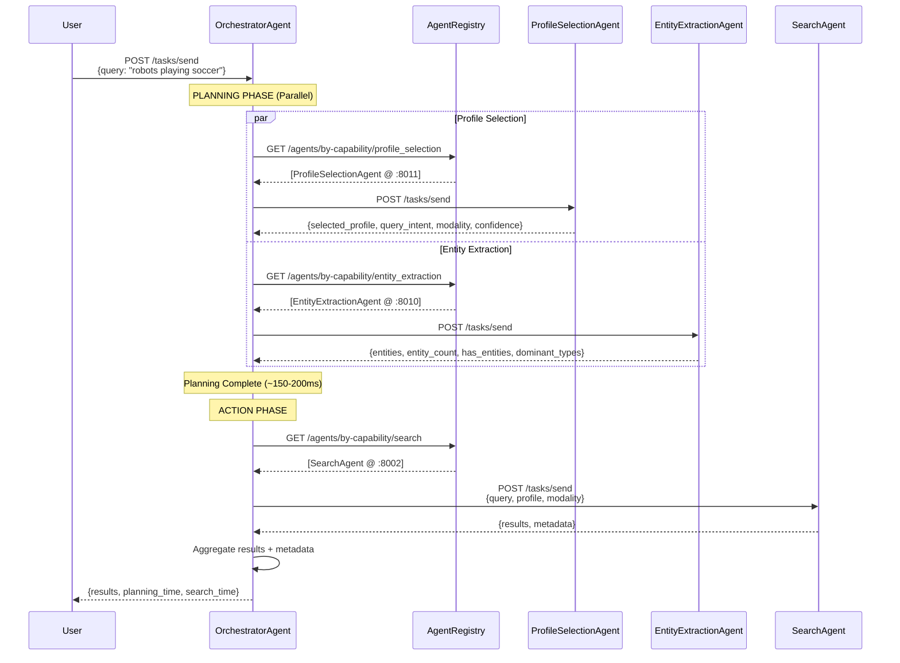
```mermaid
sequenceDiagram
    participant User
    participant Orch as OrchestratorAgent
    participant Registry as AgentRegistry
    participant Prof as ProfileSelectionAgent
    participant Entity as EntityExtractionAgent
    participant Search as SearchAgent

    User->>Orch: POST /tasks/send<br/>{query: "robots playing soccer"}

    Note over Orch: PLANNING PHASE (Parallel)

    par Profile Selection
        Orch->>Registry: GET /agents/by-capability/profile_selection
        Registry-->>Orch: [ProfileSelectionAgent @ :8011]
        Orch->>Prof: POST /tasks/send
        Prof-->>Orch: {selected_profile, query_intent, modality, confidence}
    and Entity Extraction
        Orch->>Registry: GET /agents/by-capability/entity_extraction
        Registry-->>Orch: [EntityExtractionAgent @ :8010]
        Orch->>Entity: POST /tasks/send
        Entity-->>Orch: {entities, entity_count, has_entities, dominant_types}
    end

    Note over Orch: Planning Complete (~150-200ms)
    Note over Orch: ACTION PHASE

    Orch->>Registry: GET /agents/by-capability/search
    Registry-->>Orch: [SearchAgent @ :8002]

    Orch->>Search: POST /tasks/send<br/>{query, profile, modality}
    Search-->>Orch: {results, metadata}

    Orch->>Orch: Aggregate results + metadata
    Orch-->>User: {results, planning_time, search_time}
```

#### Class Definition

```python
from cogniverse_core.agents.a2a_agent import A2AAgent, A2AAgentConfig
from cogniverse_core.agents.base import AgentDeps, AgentInput, AgentOutput
from pydantic import Field
from typing import Any, Dict, Optional
import asyncio

class OrchestratorInput(AgentInput):
    """Type-safe input for orchestration."""
    query: str = Field(..., description="Query to orchestrate")
    tenant_id: str = Field(default="default", description="Tenant identifier (per-request)")
    session_id: Optional[str] = Field(default=None, description="Session identifier (per-request)")

class OrchestratorOutput(AgentOutput):
    """Type-safe output from orchestration."""
    query: str = Field(..., description="Original query")
    plan_steps: List[Dict[str, Any]] = Field(default_factory=list, description="Orchestration plan steps")
    parallel_groups: List[List[int]] = Field(default_factory=list, description="Parallel execution groups")
    plan_reasoning: str = Field("", description="Plan reasoning")
    agent_results: Dict[str, Any] = Field(default_factory=dict, description="Results from each agent")
    final_output: Dict[str, Any] = Field(default_factory=dict, description="Aggregated final output")
    execution_summary: str = Field("", description="Summary of execution")

class OrchestratorDeps(AgentDeps):
    """Dependencies for orchestrator agent (tenant-agnostic at startup)."""
    pass

class OrchestratorAgent(
    MemoryAwareMixin,
    A2AAgent[OrchestratorInput, OrchestratorOutput, OrchestratorDeps],
):
    """
    Multi-agent workflow orchestrator with planning and action phases.

    Coordinates agents via AgentRegistry discovery and A2A protocol.
    tenant_id and session_id arrive per-request in task payload.
    """

    def __init__(self, deps: OrchestratorDeps, registry: "AgentRegistry", port: int = 8013):
        """
        Initialize orchestrator agent.

        Args:
            deps: OrchestratorDeps (infrastructure only, no tenant_id)
            registry: AgentRegistry for dynamic agent discovery (REQUIRED)
            port: A2A HTTP server port
        """
        self.registry = registry

        # Initialize DSPy module
        orchestration_module = OrchestrationModule()

        config = A2AAgentConfig(
            agent_name="orchestrator_agent",
            agent_description="Type-safe orchestration with planning and action phases",
            capabilities=["orchestration", "planning", "multi_agent_coordination",
                          "parallel_execution", "result_aggregation"],
            port=port,
        )
        super().__init__(deps=deps, config=config, dspy_module=orchestration_module)

        # Memory initialized lazily per-tenant on first request
        self._memory_initialized_tenants: set = set()

    async def _process_impl(self, input: OrchestratorInput) -> OrchestratorOutput:
        """Type-safe orchestration — tenant_id/session_id from input."""
        # Lazily initialize memory for this tenant
        if hasattr(input, "tenant_id") and input.tenant_id:
            self._ensure_memory_for_tenant(input.tenant_id)

        result = await self.orchestrate(input.query)
        return OrchestratorOutput(
            query=result.query,
            plan_steps=result.plan_steps,
            parallel_groups=result.parallel_groups,
            plan_reasoning=result.plan_reasoning,
            agent_results=result.agent_results,
            final_output=result.final_output,
            execution_summary=result.execution_summary,
        )
```

#### Key Methods

**`_process_impl(input: Union[OrchestratorInput, Dict]) -> OrchestratorOutput`**

Main processing method (required by AgentBase).

```python
async def _process_impl(
    self,
    input: Union[OrchestratorInput, Dict[str, Any]]
) -> OrchestratorOutput:
    """
    Process orchestration request with typed input/output.

    Args:
        input: Typed input with query field (or dict)

    Returns:
        OrchestratorOutput with plan, agent results, and final output
    """
    # Handle dict input for backward compatibility with tests
    if isinstance(input, dict):
        input = self.validate_input(input)

    query = input.query

    # Phase 1: Planning
    plan = await self._create_plan(query)

    # Phase 2: Action
    agent_results = await self._execute_plan(plan)

    # Aggregate results
    final_output = self._aggregate_results(query, agent_results)

    # Generate summary
    execution_summary = self._generate_summary(plan, agent_results)

    return OrchestratorOutput(
        query=query,
        plan_steps=[...],
        parallel_groups=plan.parallel_groups,
        plan_reasoning=plan.reasoning,
        agent_results=agent_results,
        final_output=final_output,
        execution_summary=execution_summary
    )
```

**`_create_plan(query: str) -> OrchestrationPlan`**

Planning Phase: Create execution plan using LLM reasoning.

```python
async def _create_plan(self, query: str) -> OrchestrationPlan:
    """
    Create execution plan using LLM reasoning.

    Args:
        query: User query to analyze

    Returns:
        OrchestrationPlan with agent sequence and parallelization
    """
    # Get available agents
    available_agents = ", ".join([a.value for a in AgentType])

    # Use DSPy to create plan
    result = self.dspy_module.forward(
        query=query, available_agents=available_agents
    )

    # Parse agent sequence and parallel groups
    agent_sequence = [
        a.strip() for a in result.agent_sequence.split(",") if a.strip()
    ]

    # Create agent steps with dependency tracking
    steps = []
    for i, agent_name in enumerate(agent_sequence):
        try:
            agent_type = AgentType(agent_name)
            step = AgentStep(
                agent_type=agent_type,
                input_data={"query": query},
                depends_on=self._calculate_dependencies(i, parallel_groups),
                reasoning=f"Step {i+1}: {agent_type.value} processing"
            )
            steps.append(step)
        except ValueError:
            logger.warning(f"Unknown agent type: {agent_name}, skipping")

    return OrchestrationPlan(
        query=query,
        steps=steps,
        parallel_groups=parallel_groups,
        reasoning=result.reasoning
    )
```

**`_execute_plan(plan: OrchestrationPlan) -> Dict[str, Any]`**

Action Phase: Execute orchestration plan with parallel execution support.

```python
async def _execute_plan(self, plan: OrchestrationPlan) -> Dict[str, Any]:
    """
    Execute orchestration plan with parallel execution support.

    Args:
        plan: OrchestrationPlan to execute

    Returns:
        Dictionary of agent results
    """
    agent_results = {}
    executed = [False] * len(plan.steps)

    # Execute steps respecting dependencies and parallelism
    while not all(executed):
        # Find steps ready to execute (all dependencies met)
        ready_steps = []
        for i, step in enumerate(plan.steps):
            if executed[i]:
                continue
            deps_met = all(executed[dep_idx] for dep_idx in step.depends_on)
            if deps_met:
                ready_steps.append((i, step))

        # Execute all ready steps in parallel using asyncio.gather
        async def execute_step(step_index: int, step: AgentStep):
            agent = self.registry.find_agents_by_capability(step.agent_type.value)
            if not agent:
                return step.agent_type.value, {
                    "status": "error",
                    "message": f"Agent {step.agent_type.value} not available"
                }

            # Prepare input (merge query with previous results if needed)
            agent_input = step.input_data.copy()
            for dep_idx in step.depends_on:
                if dep_idx < len(plan.steps):
                    dep_agent = plan.steps[dep_idx].agent_type.value
                    if dep_agent in agent_results:
                        agent_input[f"{dep_agent}_result"] = agent_results[dep_agent]

            # Execute agent
            result = await agent.process(agent_input)
            return step.agent_type.value, result

        # Execute all ready steps concurrently
        results = await asyncio.gather(
            *[execute_step(idx, step) for idx, step in ready_steps]
        )

        # Store results and mark as executed
        for (step_idx, _), (agent_name, result) in zip(ready_steps, results):
            agent_results[agent_name] = result
            executed[step_idx] = True

    return agent_results
```

**`_aggregate_results(query: str, agent_results: Dict) -> Dict[str, Any]`**

Aggregate results from all agents into final output.

```python
def _aggregate_results(
    self,
    query: str,
    agent_results: Dict[str, Any]
) -> Dict[str, Any]:
    """Aggregate results from all agents into final output"""
    final_output = {
        "query": query,
        "status": "success",
        "results": {}
    }

    # Collect results from each agent
    for agent_type, result in agent_results.items():
        if isinstance(result, BaseModel):
            final_output["results"][agent_type] = result.model_dump()
        else:
            final_output["results"][agent_type] = result

    return final_output
```

**`_generate_summary(plan: OrchestrationPlan, agent_results: Dict) -> str`**

Generate execution summary.

```python
def _generate_summary(
    self,
    plan: OrchestrationPlan,
    agent_results: Dict[str, Any]
) -> str:
    """Generate execution summary"""
    executed_steps = len(agent_results)
    successful_steps = sum(
        1 for result in agent_results.values()
        if not (isinstance(result, dict) and result.get("status") == "error")
    )
    total_steps = len(plan.steps)

    return (
        f"Executed {executed_steps}/{total_steps} steps "
        f"({successful_steps} successful). "
        f"Plan: {plan.reasoning}"
    )
```

#### Workflow Types

The orchestrator supports different workflow patterns:

**1. Simple Query Flow** (Single profile, no planning):
```text
User Query → EntityExtraction → Search (single profile) → Results
```

**2. Complex Query Flow** (Ensemble with planning):
```text
User Query → [ProfileSelection + EntityExtraction] (parallel) → Search (ensemble) → RRF Fusion → Results
```

**3. Sequential Dependencies**:
```text
User Query → Planning Phase → Action Phase → Post-processing → Results
```

#### Configuration

```python
# Orchestrator agent configuration
{
    "orchestrator_agent": {
        "port": 8013,
        "agent_registry_url": "http://localhost:8000",
        "planning_timeout_seconds": 10.0,
        "action_timeout_seconds": 30.0,
        "enable_parallel_planning": True,
        "enable_result_caching": False
    }
}
```

#### API Usage

**A2A Task Message**:

```json
{
  "id": "task_003",
  "messages": [
    {
      "role": "user",
      "parts": [
        {
          "type": "text",
          "text": "show me robots playing soccer in tournaments"
        },
        {
          "type": "data",
          "data": {
            "modality": "video",
            "top_k": 20
          }
        }
      ]
    }
  ]
}
```

**Response**:

```json
{
  "id": "task_003",
  "messages": [
    {
      "role": "assistant",
      "parts": [
        {
          "type": "data",
          "data": {
            "results": [
              {"document_id": "video_001", "relevance_score": 0.92, ...},
              {"document_id": "video_002", "relevance_score": 0.87, ...}
            ],
            "metadata": {
              "planning_time_ms": 185,
              "action_time_ms": 620,
              "total_time_ms": 805,
              "selected_profile": "video_colpali_smol500_mv_frame",
              "entities": [...],
              "dominant_types": ["CONCEPT"],
              "confidence": 0.85
            }
          }
        }
      ]
    }
  ]
}
```

---

### 7. SearchAgent (Ensemble Mode)

**Location**: `libs/agents/cogniverse_agents/search_agent.py`
**Enhancement**: Added ensemble search with RRF fusion

#### Overview

SearchAgent was enhanced to support ensemble mode, allowing it to query multiple backend profiles in parallel and fuse results using Reciprocal Rank Fusion (RRF).

**New Capabilities**:

- Parallel profile execution (2-3 profiles)
- RRF score calculation and fusion
- Ensemble metadata tracking
- Supports both single-profile and multi-profile (ensemble) mode

#### Ensemble Architecture

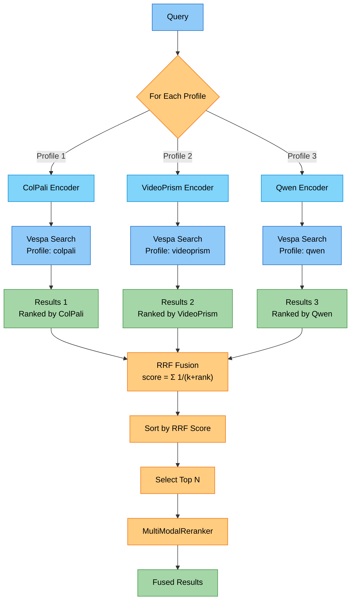
```mermaid
flowchart TB
    Input["<span style='color:#000'>Query</span>"] --> Encode{"<span style='color:#000'>For Each Profile</span>"}

    Encode -->|Profile 1| Enc1["<span style='color:#000'>ColPali Encoder</span>"]
    Encode -->|Profile 2| Enc2["<span style='color:#000'>VideoPrism Encoder</span>"]
    Encode -->|Profile 3| Enc3["<span style='color:#000'>Qwen Encoder</span>"]

    Enc1 --> Search1["<span style='color:#000'>Vespa Search<br/>Profile: colpali</span>"]
    Enc2 --> Search2["<span style='color:#000'>Vespa Search<br/>Profile: videoprism</span>"]
    Enc3 --> Search3["<span style='color:#000'>Vespa Search<br/>Profile: qwen</span>"]

    Search1 --> Results1["<span style='color:#000'>Results 1<br/>Ranked by ColPali</span>"]
    Search2 --> Results2["<span style='color:#000'>Results 2<br/>Ranked by VideoPrism</span>"]
    Search3 --> Results3["<span style='color:#000'>Results 3<br/>Ranked by Qwen</span>"]

    Results1 --> RRF["<span style='color:#000'>RRF Fusion<br/>score = Σ 1/(k+rank)</span>"]
    Results2 --> RRF
    Results3 --> RRF

    RRF --> Sort["<span style='color:#000'>Sort by RRF Score</span>"]
    Sort --> TopN["<span style='color:#000'>Select Top N</span>"]
    TopN --> Rerank["<span style='color:#000'>MultiModalReranker</span>"]
    Rerank --> Final["<span style='color:#000'>Fused Results</span>"]

    style Input fill:#90caf9,stroke:#1565c0,color:#000
    style Encode fill:#ffcc80,stroke:#ef6c00,color:#000
    style Enc1 fill:#81d4fa,stroke:#0288d1,color:#000
    style Enc2 fill:#81d4fa,stroke:#0288d1,color:#000
    style Enc3 fill:#81d4fa,stroke:#0288d1,color:#000
    style Search1 fill:#90caf9,stroke:#1565c0,color:#000
    style Search2 fill:#90caf9,stroke:#1565c0,color:#000
    style Search3 fill:#90caf9,stroke:#1565c0,color:#000
    style Results1 fill:#a5d6a7,stroke:#388e3c,color:#000
    style Results2 fill:#a5d6a7,stroke:#388e3c,color:#000
    style Results3 fill:#a5d6a7,stroke:#388e3c,color:#000
    style RRF fill:#ffcc80,stroke:#ef6c00,color:#000
    style Sort fill:#ffcc80,stroke:#ef6c00,color:#000
    style TopN fill:#ffcc80,stroke:#ef6c00,color:#000
    style Rerank fill:#ffcc80,stroke:#ef6c00,color:#000
    style Final fill:#a5d6a7,stroke:#388e3c,color:#000
```

#### Key Methods (New/Enhanced)

**`_search_ensemble(query, profiles, modality, limit) -> List[SearchResult]`** (Internal)

Execute ensemble search across multiple profiles.

```python
async def _search_ensemble(
    self,
    query: str,
    profiles: List[str],
    modality: str = "video",
    top_k: int = 10,
    rrf_k: int = 60
) -> List[Dict[str, Any]]:
    """
    Execute ensemble search with RRF fusion.

    Args:
        query: Search query
        profiles: List of profile names (2-3 profiles)
        modality: Content modality
        top_k: Number of results to return
        rrf_k: RRF constant (default: 60)

    Returns:
        Fused and reranked search results
    """
    # Execute searches in parallel
    profile_results = await self._execute_parallel_searches(
        query=query,
        profiles=profiles,
        modality=modality,
        top_k=top_k * 2  # Get more results for fusion
    )

    # Fuse results with RRF
    fused_results = self._fuse_results_rrf(
        profile_results=profile_results,
        k=rrf_k,
        top_k=top_k
    )

    # Optional: Rerank with MultiModalReranker
    if self.enable_reranking:
        fused_results = await self._rerank(fused_results, query)

    return fused_results
```

**`_execute_parallel_searches(query, profiles) -> Dict[str, List[SearchResult]]`**

Execute searches across all profiles concurrently.

```python
async def _execute_parallel_searches(
    self,
    query: str,
    profiles: List[str],
    modality: str,
    limit: int
) -> Dict[str, List[SearchResult]]:
    """
    Execute searches in parallel with connection pooling.
    """
    tasks = [
        self._search_single(query, profile, modality, limit)
        for profile in profiles
    ]

    results = await asyncio.gather(*tasks, return_exceptions=True)

    # Build profile -> results mapping
    profile_results = {}
    for profile, result in zip(profiles, results):
        if isinstance(result, Exception):
            logger.warning(f"Profile {profile} failed: {result}")
            profile_results[profile] = []
        else:
            profile_results[profile] = result

    return profile_results
```

**`_fuse_results_rrf(profile_results, k, limit) -> List[SearchResult]`**

Fuse results using Reciprocal Rank Fusion.

```python
def _fuse_results_rrf(
    self,
    profile_results: Dict[str, List[SearchResult]],
    k: int = 60,
    limit: int = 20
) -> List[SearchResult]:
    """
    Fuse results from multiple profiles using RRF.

    Algorithm:
    For each document across all profiles:
        RRF_score = Σ_profiles (1 / (k + rank_in_profile))

    Complexity: O(n_profiles × n_results) ~ 5-10ms typical
    """
    rrf_scores = {}
    doc_objects = {}

    # Calculate RRF scores
    for profile, results in profile_results.items():
        for rank, result in enumerate(results, start=1):
            doc_id = result.document_id

            # Accumulate RRF score
            rrf_scores[doc_id] = rrf_scores.get(doc_id, 0) + 1 / (k + rank)

            # Store document object (first occurrence)
            if doc_id not in doc_objects:
                doc_objects[doc_id] = result

    # Sort by RRF score (descending)
    sorted_docs = sorted(
        rrf_scores.items(),
        key=lambda x: x[1],
        reverse=True
    )

    # Return top results with updated scores
    return [
        doc_objects[doc_id]._replace(
            relevance_score=rrf_score,
            metadata={
                **doc_objects[doc_id].metadata,
                "rrf_score": rrf_score,
                "fusion_method": "rrf",
                "profiles_used": list(profile_results.keys())
            }
        )
        for doc_id, rrf_score in sorted_docs[:limit]
    ]
```

#### Configuration

```python
# Search agent ensemble configuration
{
    "search_agent": {
        "ensemble_config": {
            "rrf_k": 60,
            "max_profiles": 3,
            "parallel_timeout": 5.0,
            "enable_reranking": True,
            "min_overlap": 0.1
        }
    }
}
```

#### Performance Characteristics

| Configuration | Latency | Quality (NDCG@10) | Notes |
|--------------|---------|-------------------|-------|
| Single profile | 400-600ms | 0.72 | Baseline |
| Ensemble (2 profiles) | 500-700ms | 0.78 | +100-150ms overhead |
| Ensemble (3 profiles) | 550-750ms | 0.83 | +150-200ms overhead |
| RRF fusion | 5-10ms | N/A | Negligible overhead |

**Key Insight**: Parallel execution keeps ensemble latency close to single-profile (not 2x or 3x).

#### API Usage

**Single Profile Mode**:

```python
from cogniverse_agents.search_agent import SearchAgent, SearchAgentDeps

# Note: schema_loader is REQUIRED, config_manager is optional
deps = SearchAgentDeps()  # tenant_id is per-request, not in deps
search_agent = SearchAgent(deps=deps, schema_loader=schema_loader, config_manager=config_manager)

# Use search_by_text for text queries (tenant_id passed at search time)
results = search_agent.search_by_text(
    query="robots playing soccer",
    modality="video",
    top_k=20
)
```

**Ensemble Mode** (Internal):

Ensemble search is handled internally via `_search_ensemble()`. The SearchAgent automatically uses ensemble when multiple profiles are configured:

```python
# Ensemble is triggered internally based on configuration
# The _search_ensemble method uses RRF fusion across profiles
# See search_agent.py:691 for implementation details
```

---

### 8. DetailedReportAgent

**Location:** `libs/agents/cogniverse_agents/detailed_report_agent.py`

Generates comprehensive detailed reports with visual and technical analysis. Includes VLM integration and a "thinking phase" for complex queries.

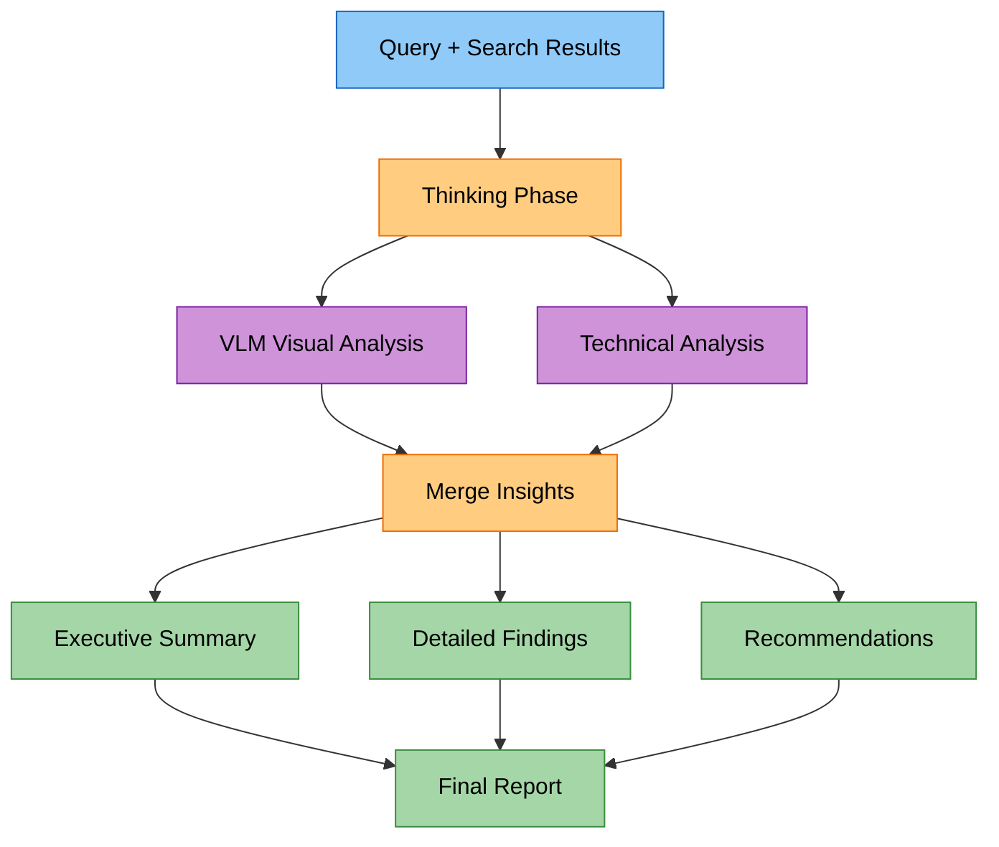
```mermaid
flowchart TD
    Query["<span style='color:#000'>Query + Search Results</span>"] --> Think["<span style='color:#000'>Thinking Phase</span>"]
    Think --> VLM["<span style='color:#000'>VLM Visual Analysis</span>"]
    Think --> Tech["<span style='color:#000'>Technical Analysis</span>"]

    VLM --> Merge["<span style='color:#000'>Merge Insights</span>"]
    Tech --> Merge

    Merge --> Summary["<span style='color:#000'>Executive Summary</span>"]
    Merge --> Findings["<span style='color:#000'>Detailed Findings</span>"]
    Merge --> Recs["<span style='color:#000'>Recommendations</span>"]

    Summary --> Report["<span style='color:#000'>Final Report</span>"]
    Findings --> Report
    Recs --> Report

    style Query fill:#90caf9,stroke:#1565c0,color:#000
    style Think fill:#ffcc80,stroke:#ef6c00,color:#000
    style VLM fill:#ce93d8,stroke:#7b1fa2,color:#000
    style Tech fill:#ce93d8,stroke:#7b1fa2,color:#000
    style Merge fill:#ffcc80,stroke:#ef6c00,color:#000
    style Summary fill:#a5d6a7,stroke:#388e3c,color:#000
    style Findings fill:#a5d6a7,stroke:#388e3c,color:#000
    style Recs fill:#a5d6a7,stroke:#388e3c,color:#000
    style Report fill:#a5d6a7,stroke:#388e3c,color:#000
```

**Type Signature:**
```python
class DetailedReportAgent(
    MemoryAwareMixin,
    A2AAgent[DetailedReportInput, DetailedReportOutput, DetailedReportDeps],
)
```

**Input Fields:**
| Field | Type | Description |
|-------|------|-------------|
| `query` | str | Query for report generation |
| `search_results` | List[Dict] | Results to analyze |
| `report_type` | str | Type: comprehensive, technical, analytical |
| `include_visual_analysis` | bool | Include VLM visual analysis |
| `include_technical_details` | bool | Include technical breakdown |
| `include_recommendations` | bool | Include actionable recommendations |
| `max_results_to_analyze` | int | Maximum results to process (default: 20) |

**Output Fields:**
| Field | Type | Description |
|-------|------|-------------|
| `executive_summary` | str | High-level summary |
| `detailed_findings` | List[Dict] | Detailed analysis results |
| `visual_analysis` | List[Dict] | VLM visual insights |
| `technical_details` | List[Dict] | Technical breakdown |
| `recommendations` | List[str] | Actionable recommendations |
| `confidence_assessment` | Dict[str, float] | Per-dimension confidence scores (keys: overall, data_quality, completeness, visual_analysis, technical_analysis) |
| `thinking_process` | Dict | Thinking phase details |
| `metadata` | Dict | Additional metadata |

**Usage:**
```python
from cogniverse_agents.detailed_report_agent import (
    DetailedReportAgent,
    DetailedReportDeps,
    DetailedReportInput,
)

deps = DetailedReportDeps()
agent = DetailedReportAgent(deps=deps, port=8004)
result = await agent.process(DetailedReportInput(
    query="Analyze video content about machine learning",
    search_results=search_results,
    report_type="comprehensive",
    include_visual_analysis=True,
))
print(result.executive_summary)
# Access overall confidence:
print(result.confidence_assessment.get("overall", 0.0))
```

---

### 9. DocumentAgent

**Location:** `libs/agents/cogniverse_agents/document_agent.py`

Document analysis and search with dual strategy support (visual + text). Uses ColPali for visual document understanding and traditional text extraction for semantic search.

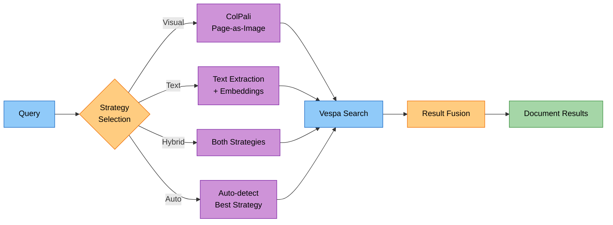
```mermaid
flowchart LR
    Query["<span style='color:#000'>Query</span>"] --> Strategy{"<span style='color:#000'>Strategy<br/>Selection</span>"}

    Strategy -->|Visual| ColPali["<span style='color:#000'>ColPali<br/>Page-as-Image</span>"]
    Strategy -->|Text| TextEmbed["<span style='color:#000'>Text Extraction<br/>+ Embeddings</span>"]
    Strategy -->|Hybrid| Both["<span style='color:#000'>Both Strategies</span>"]
    Strategy -->|Auto| AutoSelect["<span style='color:#000'>Auto-detect<br/>Best Strategy</span>"]

    ColPali --> Vespa["<span style='color:#000'>Vespa Search</span>"]
    TextEmbed --> Vespa
    Both --> Vespa
    AutoSelect --> Vespa

    Vespa --> Fusion["<span style='color:#000'>Result Fusion</span>"]
    Fusion --> Results["<span style='color:#000'>Document Results</span>"]

    style Query fill:#90caf9,stroke:#1565c0,color:#000
    style Strategy fill:#ffcc80,stroke:#ef6c00,color:#000
    style ColPali fill:#ce93d8,stroke:#7b1fa2,color:#000
    style TextEmbed fill:#ce93d8,stroke:#7b1fa2,color:#000
    style Both fill:#ce93d8,stroke:#7b1fa2,color:#000
    style AutoSelect fill:#ce93d8,stroke:#7b1fa2,color:#000
    style Vespa fill:#90caf9,stroke:#1565c0,color:#000
    style Fusion fill:#ffcc80,stroke:#ef6c00,color:#000
    style Results fill:#a5d6a7,stroke:#388e3c,color:#000
```

**Type Signature:**
```python
class DocumentAgent(MemoryAwareMixin, A2AAgent[DocumentSearchInput, DocumentSearchOutput, DocumentAgentDeps])
```

**Strategies:**
- **Visual (ColPali):** Treats document pages as images for visual understanding
- **Text:** Traditional text extraction + semantic embeddings
- **Hybrid:** Combines both strategies with fusion
- **Auto:** Automatically selects best strategy based on query type

**Input Fields:**
| Field | Type | Description |
|-------|------|-------------|
| `query` | str | Search query |
| `strategy` | str | Strategy: visual, text, hybrid, auto |
| `limit` | int | Number of results (default: 20) |

**Output Fields:**
| Field | Type | Description |
|-------|------|-------------|
| `results` | List[DocumentResult] | Search results with page info |
| `count` | int | Total result count |

**Usage:**
```python
from cogniverse_agents.document_agent import DocumentAgent, DocumentSearchInput

agent = DocumentAgent(config)
result = await agent.run(DocumentSearchInput(
    query="quarterly financial report",
    strategy="hybrid",
    limit=10
))
for doc in result.results:
    print(f"{doc.title} - Page {doc.page_number} ({doc.strategy_used})")
```

---

### 10. ImageSearchAgent

**Location:** `libs/agents/cogniverse_agents/image_search_agent.py`

Image similarity search using ColPali multi-vector embeddings. Uses the same approach as video frame search.


```mermaid
flowchart LR
    Query["<span style='color:#000'>Text Query</span>"] --> Encode["<span style='color:#000'>ColPali Encoder</span>"]
    Encode --> Search["<span style='color:#000'>Vespa Image Search</span>"]
    Search --> Objects["<span style='color:#000'>Object Detection</span>"]
    Objects --> Filter["<span style='color:#000'>Visual Filters</span>"]
    Filter --> Results["<span style='color:#000'>Image Results</span>"]

    style Query fill:#90caf9,stroke:#1565c0,color:#000
    style Encode fill:#ce93d8,stroke:#7b1fa2,color:#000
    style Search fill:#90caf9,stroke:#1565c0,color:#000
    style Objects fill:#ffcc80,stroke:#ef6c00,color:#000
    style Filter fill:#ffcc80,stroke:#ef6c00,color:#000
    style Results fill:#a5d6a7,stroke:#388e3c,color:#000
```

**Type Signature:**

```python
class ImageSearchAgent(A2AAgent[ImageSearchInput, ImageSearchOutput, ImageSearchDeps])
```

**Capabilities:**

- Image similarity search using ColPali embeddings
- Hybrid search (BM25 text + ColPali semantic)
- Object and scene detection in results
- Visual filtering support

**Input Fields:**

| Field | Type | Description |
|-------|------|-------------|
| `query` | str | Search query |
| `search_mode` | str | Mode: semantic, hybrid |
| `limit` | int | Number of results (default: 20) |
| `visual_filters` | Dict | Optional visual filters |

**Output Fields:**

| Field | Type | Description |
|-------|------|-------------|
| `results` | List[ImageResult] | Image search results |
| `count` | int | Total result count |

---

### 11. SummarizerAgent

**Location:** `libs/agents/cogniverse_agents/summarizer_agent.py`

Intelligent summarization of search results with VLM visual content analysis and a "think phase" for complex queries.

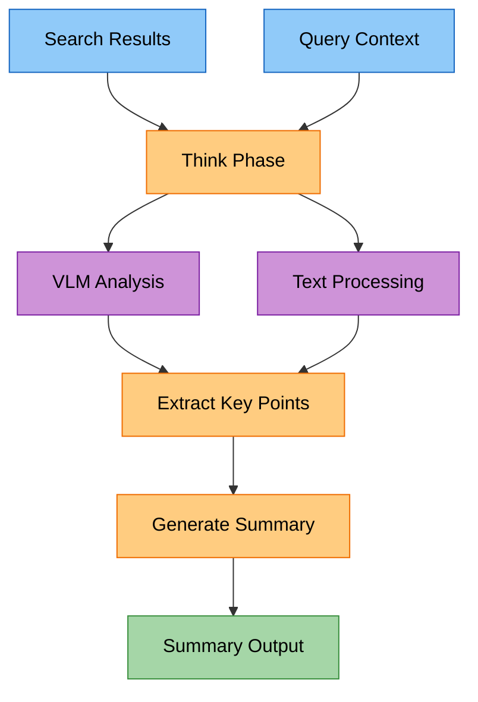
```mermaid
flowchart TD
    Results["<span style='color:#000'>Search Results</span>"] --> Think["<span style='color:#000'>Think Phase</span>"]
    Query["<span style='color:#000'>Query Context</span>"] --> Think

    Think --> VLM["<span style='color:#000'>VLM Analysis</span>"]
    Think --> Text["<span style='color:#000'>Text Processing</span>"]

    VLM --> Extract["<span style='color:#000'>Extract Key Points</span>"]
    Text --> Extract

    Extract --> Gen["<span style='color:#000'>Generate Summary</span>"]
    Gen --> Output["<span style='color:#000'>Summary Output</span>"]

    style Results fill:#90caf9,stroke:#1565c0,color:#000
    style Query fill:#90caf9,stroke:#1565c0,color:#000
    style Think fill:#ffcc80,stroke:#ef6c00,color:#000
    style VLM fill:#ce93d8,stroke:#7b1fa2,color:#000
    style Text fill:#ce93d8,stroke:#7b1fa2,color:#000
    style Extract fill:#ffcc80,stroke:#ef6c00,color:#000
    style Gen fill:#ffcc80,stroke:#ef6c00,color:#000
    style Output fill:#a5d6a7,stroke:#388e3c,color:#000
```

**Type Signature:**

```python
class SummarizerAgent(
    MemoryAwareMixin,
    A2AAgent[SummarizerInput, SummarizerOutput, SummarizerDeps],
)
```

**Summary Types:**

- `brief` - Short, concise summary
- `comprehensive` - Detailed summary with context
- `bullet_points` - Key points as bullet list

**Input Fields:**

| Field | Type | Description |
|-------|------|-------------|
| `query` | str | Query for context |
| `search_results` | List[Dict] | Results to summarize |
| `summary_type` | str | Type: brief, comprehensive, bullet_points |
| `include_visual_analysis` | bool | Include VLM insights |
| `max_results_to_analyze` | int | Max results to process (default: 10) |

**Output Fields:**

| Field | Type | Description |
|-------|------|-------------|
| `summary` | str | Generated summary |
| `key_points` | List[str] | Extracted key points |
| `visual_insights` | List[str] | VLM visual insights |
| `confidence_score` | float | Summary confidence |
| `thinking_process` | Dict | Thinking phase details |
| `metadata` | Dict | Additional metadata |

---

### 12. AudioAnalysisAgent

**Location:** `libs/agents/cogniverse_agents/audio_analysis_agent.py`

Audio search and analysis using Whisper transcription. Supports both transcript-based and acoustic similarity search.

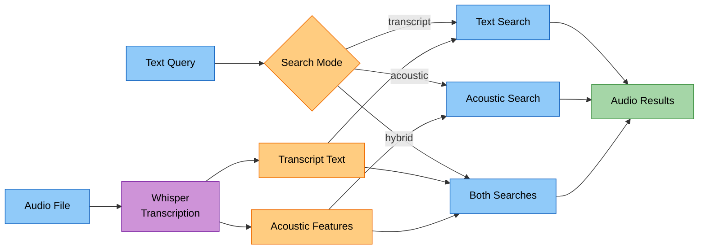
```mermaid
flowchart LR
    Audio["<span style='color:#000'>Audio File</span>"] --> Whisper["<span style='color:#000'>Whisper<br/>Transcription</span>"]
    Whisper --> Transcript["<span style='color:#000'>Transcript Text</span>"]
    Whisper --> Acoustic["<span style='color:#000'>Acoustic Features</span>"]

    Query["<span style='color:#000'>Text Query</span>"] --> Mode{"<span style='color:#000'>Search Mode</span>"}

    Mode -->|transcript| TextSearch["<span style='color:#000'>Text Search</span>"]
    Mode -->|acoustic| AcousticSearch["<span style='color:#000'>Acoustic Search</span>"]
    Mode -->|hybrid| Both["<span style='color:#000'>Both Searches</span>"]

    Transcript --> TextSearch
    Acoustic --> AcousticSearch
    Transcript --> Both
    Acoustic --> Both

    TextSearch --> Results["<span style='color:#000'>Audio Results</span>"]
    AcousticSearch --> Results
    Both --> Results

    style Audio fill:#90caf9,stroke:#1565c0,color:#000
    style Query fill:#90caf9,stroke:#1565c0,color:#000
    style Whisper fill:#ce93d8,stroke:#7b1fa2,color:#000
    style Transcript fill:#ffcc80,stroke:#ef6c00,color:#000
    style Acoustic fill:#ffcc80,stroke:#ef6c00,color:#000
    style Mode fill:#ffcc80,stroke:#ef6c00,color:#000
    style TextSearch fill:#90caf9,stroke:#1565c0,color:#000
    style AcousticSearch fill:#90caf9,stroke:#1565c0,color:#000
    style Both fill:#90caf9,stroke:#1565c0,color:#000
    style Results fill:#a5d6a7,stroke:#388e3c,color:#000
```

**Type Signature:**

```python
class AudioAnalysisAgent(A2AAgent[AudioSearchInput, AudioSearchOutput, AudioAnalysisDeps])
```

**Search Modes:**

- `transcript` - Search through transcribed text
- `acoustic` - Acoustic similarity search
- `hybrid` - Combines both approaches

**Input Fields:**

| Field | Type | Description |
|-------|------|-------------|
| `query` | str | Search query |
| `search_mode` | str | Mode: transcript, acoustic, hybrid |
| `limit` | int | Number of results (default: 20) |

**Output Fields:**

| Field | Type | Description |
|-------|------|-------------|
| `results` | List[AudioResult] | Audio search results |
| `count` | int | Total result count |

**AudioResult Fields:**

- `audio_id`, `audio_url`, `title`
- `transcript` - Full transcript text
- `duration` - Duration in seconds
- `speaker_labels` - Detected speakers
- `detected_events` - Audio events
- `language` - Detected language

---

### 13. TextAnalysisAgent

**Location:** `libs/agents/cogniverse_agents/text_analysis_agent.py`

Text analysis agent with runtime-configurable DSPy modules. Supports dynamic reconfiguration of modules and optimizers via REST API.

**Mixins Used:**
- `DynamicDSPyMixin` - Runtime DSPy module switching
- `ConfigAPIMixin` - REST API for configuration
- `A2AEndpointsMixin` - A2A protocol endpoints
- `HealthCheckMixin` - Health monitoring
- `TenantAwareAgentMixin` - Multi-tenancy

**Analysis Types:**
- `sentiment` - Sentiment analysis
- `summary` - Text summarization
- `entities` - Entity extraction

**Usage:**
```python
from cogniverse_agents.text_analysis_agent import TextAnalysisAgent
from cogniverse_foundation.config.utils import create_default_config_manager

config_manager = create_default_config_manager()
agent = TextAnalysisAgent(tenant_id="acme", config_manager=config_manager)

result = agent.analyze(text="Your text here", analysis_type="sentiment")
print(f"Result: {result.result}, Confidence: {result.confidence}")
```

---

### 14. A2ARoutingAgent

**Location:** `libs/agents/cogniverse_agents/a2a_routing_agent.py`

A2A wrapper for the routing agent that provides standardized A2A communication. Handles message formatting, routing coordination, and response aggregation.

**Constructor:**
```python
A2ARoutingAgent(
    routing_agent: RoutingAgent,  # Required - configured RoutingAgent instance
    tenant_id: str = "default",
    config_manager: ConfigManager = None  # Required
)
```

**Result Type:**
```python
@dataclass
class RoutingResult:
    task_id: str
    routing_decision: Dict[str, Any]
    agent_responses: Dict[str, Any]
    final_result: Any
    execution_time: float
    success: bool
    error: Optional[str] = None
```

**Usage:**
```python
from cogniverse_agents.a2a_routing_agent import A2ARoutingAgent
from cogniverse_agents.routing_agent import RoutingAgent, RoutingDeps
from cogniverse_foundation.config.utils import create_default_config_manager
from cogniverse_foundation.telemetry import TelemetryConfig

config_manager = create_default_config_manager()
deps = RoutingDeps(
    tenant_id="acme",
    telemetry_config=TelemetryConfig(),
    model_name="smollm3:3b",
    base_url="http://localhost:11434/v1"
)
routing_agent = RoutingAgent(deps=deps)
a2a_router = A2ARoutingAgent(
    routing_agent=routing_agent,
    tenant_id="acme",
    config_manager=config_manager
)

result = await a2a_router.route_query("Find videos about cooking")
print(f"Routed to: {result.routing_decision}")
```

---

### 15. VideoSearchAgent (Refactored)

**Location:** `libs/agents/cogniverse_agents/video_agent_refactored.py`

Refactored video search agent using the unified search service architecture. Provides a simpler interface compared to the original VideoSearchAgent.

**Constructor:**
```python
VideoSearchAgent(
    config_manager: ConfigManager = None,  # REQUIRED
    schema_loader=None,                    # REQUIRED
)
```

**Methods:**
```python
def search(
    query: str,
    profile: Optional[str] = None,      # Per-request (defaults to config active_video_profile)
    tenant_id: str = "default",          # Per-request
    top_k: int = 10,
    start_date: Optional[str] = None,
    end_date: Optional[str] = None,
) -> List[SearchResult]
```

**Usage:**
```python
from cogniverse_agents.video_agent_refactored import VideoSearchAgent
from cogniverse_foundation.config.utils import create_default_config_manager
from cogniverse_core.schemas.filesystem_loader import FilesystemSchemaLoader
from pathlib import Path

config_manager = create_default_config_manager()
schema_loader = FilesystemSchemaLoader(Path("configs/schemas"))
agent = VideoSearchAgent(config_manager=config_manager, schema_loader=schema_loader)

results = agent.search("cooking tutorial", profile="video_colpali_smol500_mv_frame", tenant_id="acme", top_k=10)
for result in results:
    print(f"{result.document_id} - Score: {result.score}")
```

---

## Agent Architecture

### Type-Safe A2AAgent Base Class with Generics

All agents extend `A2AAgent[InputT, OutputT, DepsT]` from `cogniverse_core`, providing compile-time type safety:

```python
# libs/core/cogniverse_core/agents/a2a_agent.py

from cogniverse_core.agents.base import AgentBase, AgentDeps, AgentInput, AgentOutput
from typing import Generic, TypeVar
import dspy

InputT = TypeVar("InputT", bound=AgentInput)
OutputT = TypeVar("OutputT", bound=AgentOutput)
DepsT = TypeVar("DepsT", bound=AgentDeps)
class A2AAgentConfig(BaseModel):
    """Configuration for A2A agents."""
    agent_name: str
    agent_description: str
    capabilities: list[str] = []
    port: int = 8000
    version: str = "1.0.0"
class A2AAgent(AgentBase[InputT, OutputT, DepsT]):
    """
    Type-safe base class that bridges DSPy 3.0 modules with A2A protocol.

    Architecture:
    - Generic Types: InputT, OutputT, DepsT for compile-time type checking
    - A2A Protocol Layer: Standard endpoints for agent communication
    - DSPy 3.0 Core: Advanced AI capabilities and optimization
    - Pydantic Validation: Automatic input/output validation

    Features:
    - Type-safe process(input: InputT) -> OutputT method
    - Standard A2A endpoints (/agent.json, /tasks/send, /health)
    - IDE autocomplete and type checking support
    - Multi-tenant support via tenant_id arriving per-request in A2A task payload
    - Multi-modal support (text, images, video, audio)
    """

    def __init__(
        self,
        deps: DepsT,
        config: A2AAgentConfig,
        dspy_module: Optional[dspy.Module] = None,
    ):
        """
        Initialize type-safe A2A agent.

        Args:
            deps: Agent dependencies (tenant-agnostic at startup)
            config: A2AAgentConfig with name, description, etc.
            dspy_module: Optional DSPy 3.0 module
        """
        super().__init__(deps=deps)

        # A2A Protocol Configuration
        self.config = config
        self.dspy_module = dspy_module

        # FastAPI app for A2A endpoints
        self.app = FastAPI(
            title=f"{config.agent_name} A2A Agent",
            description=config.agent_description,
            version=config.version
        )

        # A2A Client for inter-agent communication
        self.a2a_client = A2AClient()

    @abstractmethod
    async def _process_impl(self, input: InputT) -> OutputT:
        """
        Type-safe processing method.

        Must be implemented by subclass. IDE provides autocomplete
        for both input fields and return type.
        """
        pass
```

**Key Benefits of Type-Safe Architecture:**

- **Generic Types**: `A2AAgent[InputT, OutputT, DepsT]` enables IDE autocomplete
- **Pydantic Validation**: Input/output automatically validated at runtime
- **Tenant-Agnostic Startup**: `AgentDeps` has no `tenant_id` — agents start without tenant context; `tenant_id` arrives per-request in the A2A task payload
- **Abstract _process_impl()**: Clear contract with type-safe signature
- **A2A Protocol**: Built-in FastAPI server with standard endpoints

### MemoryAwareMixin

**Location**: `libs/core/cogniverse_core/agents/memory_aware_mixin.py`

Provides memory integration for all agents:

```python
class MemoryAwareMixin:
    """
    Mixin for agent memory integration via Mem0.

    Provides:
    - Memory initialization per tenant
    - Context retrieval
    - Success/failure recording
    """

    def initialize_memory(
        self,
        agent_name: str,
        tenant_id: str,
        backend_host: str,          # Required - e.g. "http://localhost"
        backend_port: int,          # Required - e.g. 8080
        llm_model: str,             # Required - e.g. "ollama/llama3.2"
        embedding_model: str,       # Required - e.g. "nomic-embed-text"
        llm_base_url: str,          # Required - e.g. "http://localhost:11434/v1"
        config_manager,             # Required for schema deployment
        schema_loader,              # Required for schema templates
        backend_config_port: Optional[int] = None,
        auto_create_schema: bool = True,
    ) -> bool:
        """
        Initialize memory for agent.

        Creates tenant-specific Mem0MemoryManager instance.
        All LLM/embedding params are required - no defaults.
        """
        from cogniverse_core.memory.manager import Mem0MemoryManager

        self.memory_manager = Mem0MemoryManager(tenant_id=tenant_id)
        self.memory_manager.initialize(
            backend_host=backend_host,
            backend_port=backend_port,
            llm_model=llm_model,
            embedding_model=embedding_model,
            llm_base_url=llm_base_url,
            config_manager=config_manager,
            schema_loader=schema_loader,
            base_schema_name="agent_memories",  # Creates agent_memories_{tenant_id}
            auto_create_schema=auto_create_schema,
        )

        self.agent_name = agent_name
        self.tenant_id = tenant_id
        return True

    def get_relevant_context(self, query: str, top_k: int = 5) -> str:
        """Retrieve relevant memories for query"""
        if not hasattr(self, "memory_manager"):
            return ""

        memories = self.memory_manager.search_memory(
            query=query,
            tenant_id=self.tenant_id,
            agent_name=self.agent_name,
            top_k=top_k
        )

        return "\n".join(m.get("memory", "") for m in memories)

    def remember_success(self, query: str, result: Any, metadata: Dict) -> bool:
        """Store successful interaction"""
        if not hasattr(self, "memory_manager"):
            return False

        self.memory_manager.add_memory(
            content=f"SUCCESS: {query} -> {result}",
            tenant_id=self.tenant_id,
            agent_name=self.agent_name,
            metadata=metadata
        )
        return True
```

### TenantAwareAgentMixin

**Location**: `libs/core/cogniverse_core/agents/tenant_aware_mixin.py`

Provides standardized multi-tenant support for all agents, eliminating ~10 lines of duplicated validation code per agent:

```python
class TenantAwareAgentMixin:
    """
    Mixin class that adds multi-tenant capabilities to agents.

    Design Philosophy:
    - REQUIRED tenant_id: No defaults, explicit tenant identification
    - Fail-fast validation: Raises ValueError immediately on invalid tenant_id
    - Context helpers: Provides utilities for tenant-scoped operations
    - Config integration: Optionally loads tenant-specific configuration

    Key Benefits:
    - Eliminates ~10 lines of duplicated validation code per agent
    - Consistent error messages across all agents
    - Standardized tenant context API
    - Easy to extend with additional tenant utilities
    """

    def __init__(
        self,
        tenant_id: str,
        config: Optional[SystemConfig] = None,
        **kwargs
    ):
        """
        Initialize tenant-aware agent mixin.

        Args:
            tenant_id: Tenant identifier (REQUIRED - no default)
            config: Optional system configuration
            **kwargs: Passed to other base classes in MRO chain

        Raises:
            ValueError: If tenant_id is empty, None, or invalid format
        """
        # Validate tenant_id (fail fast)
        if not tenant_id:
            raise ValueError(
                "tenant_id is required - no default tenant. "
                "Agents must be explicitly initialized with a valid tenant identifier."
            )

        # Strip whitespace and validate again
        tenant_id = tenant_id.strip()
        if not tenant_id:
            raise ValueError(
                "tenant_id cannot be empty or whitespace only. "
                "Provide a valid tenant identifier (e.g., 'customer_a', 'acme:production')."
            )

        # Store tenant_id
        self.tenant_id = tenant_id

        # Store or load configuration
        self.config = config
        if config is None:
            try:
                self.config = get_config()
            except Exception as e:
                logger.warning(f"Failed to load system config for tenant {tenant_id}: {e}")
                self.config = None

        # Initialize tenant-aware flag
        self._tenant_initialized = True

        logger.debug(f"Tenant context initialized: {tenant_id}")

        # Call super for MRO chain (if needed)
        if hasattr(super(), '__init__'):
            super().__init__(**kwargs)

    def get_tenant_context(self) -> Dict[str, Any]:
        """
        Get tenant context for operations.

        Returns a dictionary with tenant information useful for:
        - Logging and debugging
        - Telemetry span attributes
        - Database query filtering
        - Cache key prefixes

        Returns:
            Dictionary with tenant context information
        """
        context = {"tenant_id": self.tenant_id}

        # Add environment if available from config
        if self.config:
            if hasattr(self.config, 'environment'):
                context["environment"] = self.config.environment
            elif hasattr(self.config, 'get') and callable(self.config.get):
                env = self.config.get('environment')
                if env:
                    context["environment"] = env

        # Add agent type and name if available
        if hasattr(self, '__class__'):
            context["agent_type"] = self.__class__.__name__
        if hasattr(self, 'agent_name'):
            context["agent_name"] = self.agent_name

        return context

    def validate_tenant_access(self, resource_tenant_id: str) -> bool:
        """
        Validate that this agent can access a resource owned by a tenant.

        Used for:
        - Cross-tenant data access checks
        - Security validation
        - Resource authorization

        Returns:
            True if agent's tenant matches resource tenant, False otherwise
        """
        if not resource_tenant_id:
            logger.warning(
                f"Attempted to validate access to resource with no tenant_id "
                f"(agent tenant: {self.tenant_id})"
            )
            return False

        return self.tenant_id == resource_tenant_id

    def get_tenant_scoped_key(self, key: str) -> str:
        """
        Generate a tenant-scoped key for caching, storage, etc.

        Example:
            agent.get_tenant_scoped_key("embeddings/video_123")
            # Returns: "customer_a:embeddings/video_123"
        """
        return f"{self.tenant_id}:{key}"

    def log_tenant_operation(
        self,
        operation: str,
        details: Optional[Dict[str, Any]] = None,
        level: str = "info"
    ):
        """
        Log an operation with tenant context.

        Example:
            agent.log_tenant_operation(
                "search_completed",
                {"query": "machine learning", "results": 10}
            )
            # Logs: [customer_a] [RoutingAgent] search_completed: {'query': 'machine learning', 'results': 10}
        """
        log_func = getattr(logger, level, logger.info)

        agent_info = f"[{self.tenant_id}]"
        if hasattr(self, '__class__'):
            agent_info += f" [{self.__class__.__name__}]"

        message = f"{agent_info} {operation}"
        if details:
            message += f": {details}"

        log_func(message)
```

#### Usage in Agents

**With Type-Safe A2AAgent (Recommended)**:

```python
# libs/agents/cogniverse_agents/routing_agent.py

from cogniverse_core.agents.a2a_agent import A2AAgent, A2AAgentConfig
from cogniverse_core.agents.base import AgentDeps
from cogniverse_core.agents.memory_aware_mixin import MemoryAwareMixin
class RoutingDeps(AgentDeps):
    """Infrastructure dependencies — no tenant_id (it's per-request)"""
    enable_caching: bool = True
class RoutingAgent(A2AAgent[RoutingInput, RoutingOutput, RoutingDeps], MemoryAwareMixin, TenantAwareAgentMixin):
    """Routing agent with type-safe deps and memory support"""

    def __init__(self, deps: RoutingDeps, port: int = 8001):
        # Initialize A2AAgent with deps (infrastructure only)
        config = A2AAgentConfig(agent_name="routing_agent", ...)
        super().__init__(deps=deps, config=config, dspy_module=None)

        # Memory initialized per-request when tenant_id is known
        logger.info("RoutingAgent initialized (tenant-agnostic)")
```

#### Key Methods

**Note**: All examples below assume agent is initialized with deps (tenant-agnostic):
```python
from cogniverse_agents.routing_agent import RoutingAgent, RoutingDeps
from cogniverse_foundation.telemetry import TelemetryConfig

deps = RoutingDeps(
    telemetry_config=TelemetryConfig(),
    model_name="smollm3:3b",
    base_url="http://localhost:11434/v1"
)
agent = RoutingAgent(deps=deps)
# tenant_id arrives per-request in A2A task payload
```

**`get_tenant_context() -> Dict[str, Any]`**

Returns tenant context for logging, telemetry, and debugging:

```python
context = agent.get_tenant_context()
# {
#     "tenant_id": "acme",
#     "agent_type": "RoutingAgent",
#     "agent_name": "routing_agent"
# }
```

**`validate_tenant_access(resource_tenant_id: str) -> bool`**

Validates cross-tenant access attempts:

```python
# Same tenant - allow
assert agent.validate_tenant_access("acme") is True

# Different tenant - deny
assert agent.validate_tenant_access("startup") is False
```

**`get_tenant_scoped_key(key: str) -> str`**

Generates tenant-scoped keys for caching/storage:

```python
cache_key = agent.get_tenant_scoped_key("embeddings/video_123")
# "acme:embeddings/video_123"
```

**`log_tenant_operation(operation: str, details: Dict, level: str)`**

Logs operations with full tenant context:

```python
agent.log_tenant_operation(
    "search_completed",
    {"query": "machine learning", "results": 10},
    level="info"
)
# Logs: [acme] [RoutingAgent] search_completed: {'query': 'machine learning', 'results': 10}
```

---

## Multi-Tenant Integration

### Tenant Context Flow

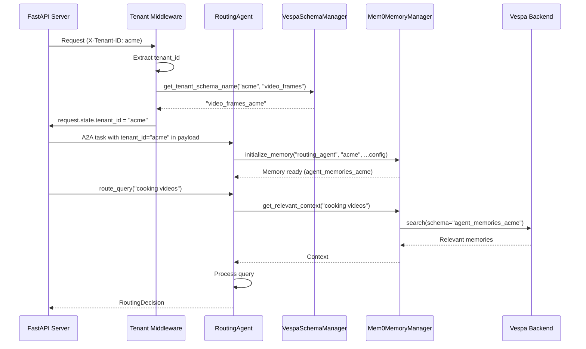
```mermaid
sequenceDiagram
    participant API as FastAPI Server
    participant Middleware as Tenant Middleware
    participant Agent as RoutingAgent
    participant SchemaManager as VespaSchemaManager
    participant Memory as Mem0MemoryManager
    participant Vespa as Vespa Backend

    API->>Middleware: Request (X-Tenant-ID: acme)
    Middleware->>Middleware: Extract tenant_id
    Middleware->>SchemaManager: get_tenant_schema_name("acme", "video_frames")
    SchemaManager-->>Middleware: "video_frames_acme"
    Middleware->>API: request.state.tenant_id = "acme"

    API->>Agent: A2A task with tenant_id="acme" in payload
    Agent->>Memory: initialize_memory("routing_agent", "acme", ...config)
    Memory-->>Agent: Memory ready (agent_memories_acme)

    API->>Agent: route_query("cooking videos")
    Agent->>Memory: get_relevant_context("cooking videos")
    Memory->>Vespa: search(schema="agent_memories_acme")
    Vespa-->>Memory: Relevant memories
    Memory-->>Agent: Context
    Agent->>Agent: Process query
    Agent-->>API: RoutingDecision
```

### Tenant Isolation

**Key Points**:

- Each agent instance is tenant-scoped
- Vespa schemas are tenant-specific (`video_frames_acme`)
- Memory managers are per-tenant singletons
- Telemetry projects are per-tenant (`acme_routing_agent`)

**Example**:

```python
from cogniverse_agents.routing_agent import RoutingAgent, RoutingDeps
from cogniverse_foundation.telemetry import TelemetryConfig

# ONE agent serves ALL tenants — tenant_id arrives per-request

deps = RoutingDeps(
    telemetry_config=TelemetryConfig(),
    model_name="smollm3:3b",
    base_url="http://localhost:11434/v1",
)
agent = RoutingAgent(deps=deps)

# Memory is initialized lazily per-tenant on first request via MemoryAwareMixin:
# - Tenant "acme" → agent_memories_acme schema (first request initializes)
# - Tenant "startup" → agent_memories_startup schema (first request initializes)
# Memory namespaced by (tenant_id, agent_name) — no cross-tenant leakage

# Completely isolated - no shared memory or data
assert agent_a.memory_manager is not agent_b.memory_manager
```

---

## Usage Examples

### Example 1: Basic Routing

```python
from cogniverse_agents.routing_agent import RoutingAgent, RoutingDeps

# Initialize agent for tenant using deps
# telemetry_config is required (can be empty dict for defaults)
deps = RoutingDeps(telemetry_config={}, enable_caching=True)  # No tenant_id
agent = RoutingAgent(deps=deps)

# Route query
decision = await agent.route_query(
    query="Show me videos about machine learning",
    context={"user_preference": "educational"}
)

print(f"Recommended agent: {decision.recommended_agent}")
print(f"Enhanced query: {decision.enhanced_query}")
print(f"Confidence: {decision.confidence}")
```

### Example 2: Video Search

```python
from cogniverse_agents.video_agent_refactored import VideoSearchAgent
from cogniverse_foundation.config.utils import create_default_config_manager

# Initialize agent (profile-agnostic, tenant-agnostic)
config_manager = create_default_config_manager()
agent = VideoSearchAgent(config_manager=config_manager, schema_loader=schema_loader)

# Search (synchronous) — profile and tenant_id per-request
results = agent.search(
    query="Python programming tutorial",
    profile="video_colpali_smol500_mv_frame",
    tenant_id="acme",
    top_k=5
)

for result in results:
    print(f"Video: {result['title']}")
    print(f"Score: {result['score']}")
```

### Example 3: Multi-Agent Orchestration

```python
from cogniverse_agents.orchestrator_agent import (
    OrchestratorAgent, OrchestratorDeps, OrchestratorInput,
)
from cogniverse_agents.agent_registry import AgentRegistry

# Create orchestrator with agent registry (discovers agents from config.json)
registry = AgentRegistry(config_manager=config_manager)
orchestrator = OrchestratorAgent(deps=OrchestratorDeps(), registry=registry)

# Execute orchestration — tenant_id and session_id per-request
result = await orchestrator._process_impl(
    OrchestratorInput(
        query="Find and summarize AI research videos from 2024",
        tenant_id="acme_corp",
        session_id="sess-uuid-123",
    )
)

print(f"Plan steps: {len(result.plan_steps)}")
print(f"Agents executed: {list(result.agent_results.keys())}")
print(f"Summary: {result.execution_summary}")
```

### Example 4: Memory-Aware Search

```python
from cogniverse_agents.video_agent_refactored import VideoSearchAgent
from cogniverse_core.memory.manager import Mem0MemoryManager
from cogniverse_foundation.config.utils import create_default_config_manager

# Initialize agent (profile-agnostic)
config_manager = create_default_config_manager()
agent = VideoSearchAgent(config_manager=config_manager, schema_loader=schema_loader)

# Initialize memory manager separately
memory = Mem0MemoryManager(tenant_id="acme")
# Initialize backend connection
memory.initialize(
    backend_host="localhost",
    backend_port=8080,
    base_schema_name="agent_memories"
)

# First search
results1 = agent.search(query="cooking tutorials", top_k=5)

# Store in memory for future context
# add_memory takes: content (str), tenant_id, agent_name, optional metadata
memory.add_memory(
    content=f"User searched for cooking tutorials, found {len(results1)} results",
    tenant_id="acme",
    agent_name="video_search_agent",
    metadata={"preference": "high_relevance"},
)

# Second search (memory context retrieved separately)
results2 = agent.search(query="advanced cooking techniques", top_k=5)
```

### Example 5: Streaming Results

```python
from cogniverse_agents.search_agent import SearchAgent, SearchAgentDeps
from cogniverse_core.schemas.filesystem_loader import FilesystemSchemaLoader
from pathlib import Path

# Initialize agent (schema_loader is REQUIRED)
deps = SearchAgentDeps(
    backend_url="http://localhost",
    backend_port=8080,
)
schema_loader = FilesystemSchemaLoader(Path("configs/schemas"))
agent = SearchAgent(deps=deps, schema_loader=schema_loader)

# Non-streaming call — tenant_id per-request in task payload
result = await agent.process({"query": "machine learning", "top_k": 10, "tenant_id": "acme"})
print(f"Found {result.total_results} results")

# Streaming call (returns AsyncGenerator)
async for event in agent.process({"query": "machine learning", "top_k": 10}, stream=True):
    if event["type"] == "status":
        print(f"Status: {event['message']}")
    elif event["type"] == "partial":
        print(f"Partial results: {event['data']}")
    elif event["type"] == "final":
        print(f"Final: {event['data']}")
```

**Event Types:**

- `status` - Progress updates (e.g., "Searching...", "Encoding query...")
- `partial` - Intermediate results (e.g., results from first profile in ensemble)
- `token` - DSPy token streaming for reasoning fields
- `task_complete` - Workflow task completion (orchestrator)
- `final` - Complete result
- `error` - Error information

---

## Streaming API

All agents support OpenAI-style streaming via the `stream=True` parameter on the `process()` method.

### Architecture

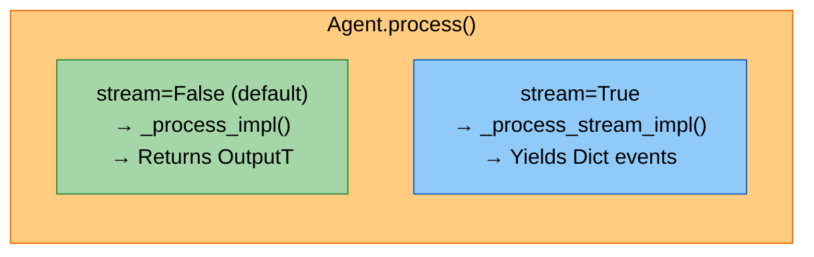
```mermaid
flowchart LR
    subgraph Process["<span style='color:#000'>Agent.process()</span>"]
        NonStream["<span style='color:#000'>stream=False (default)<br/>→ _process_impl()<br/>→ Returns OutputT</span>"]
        Stream["<span style='color:#000'>stream=True<br/>→ _process_stream_impl()<br/>→ Yields Dict events</span>"]
    end

    style Process fill:#ffcc80,stroke:#ef6c00,color:#000
    style NonStream fill:#a5d6a7,stroke:#388e3c,color:#000
    style Stream fill:#90caf9,stroke:#1565c0,color:#000
```

### Method Pattern

When creating agents, override `_process_impl()` for core logic:

```python
class MyAgent(A2AAgent[MyInput, MyOutput, MyDeps]):

    async def _process_impl(self, input: MyInput) -> MyOutput:
        """Core processing logic (required)."""
        # Your implementation
        return MyOutput(...)

    async def _process_stream_impl(
        self, input: MyInput
    ) -> AsyncGenerator[Dict[str, Any], None]:
        """Streaming logic (optional, has default implementation)."""
        yield {"type": "status", "message": "Processing..."}
        result = await self._process_impl(input)
        yield {"type": "final", "data": result.model_dump()}
```

### HTTP SSE Integration

The A2A endpoint `/tasks/send` supports streaming via `stream` field:

```python
# Non-streaming request
POST /tasks/send
{"query": "...", "context": "..."}
→ Returns JSON

# Streaming request
POST /tasks/send
{"query": "...", "context": "...", "stream": true}
→ Returns Server-Sent Events (SSE)
```

### Event Format

All streaming events are plain dicts with a `type` field:

```python
{"type": "status", "phase": "encoding", "message": "Encoding query..."}
{"type": "partial", "data": {"results_so_far": 5}}
{"type": "token", "field": "reasoning", "text": "The query..."}
{"type": "task_complete", "task": "entity_extraction", "success": True}
{"type": "final", "data": {"results": [...], "total": 10}}
{"type": "error", "message": "Search backend unavailable"}
```

---

## RLM Inference (Recursive Language Models)

RLM (Recursive Language Models) enables agents to handle near-infinite context by programmatically examining, decomposing, and recursively calling LLMs. This is useful for processing large result sets, long transcripts, or multi-document analysis.

**Reference**: [RLM Paper (arXiv:2512.24601)](https://arxiv.org/abs/2512.24601)

### Architecture

RLM is implemented using DSPy's built-in `dspy.RLM` module (requires `dspy-ai>=3.1.0`):

```text
libs/agents/cogniverse_agents/
├── inference/
│   ├── __init__.py
│   └── rlm_inference.py          # RLMInference wrapper, RLMResult, RLMTimeoutError
├── mixins/
│   ├── __init__.py
│   └── rlm_aware_mixin.py        # RLMAwareMixin for agents

libs/core/cogniverse_core/agents/
└── rlm_options.py                # RLMOptions schema for query-level config
```

### Key Components

#### RLMOptions (Query-Level Configuration)

```python
from cogniverse_core.agents.rlm_options import RLMOptions

# Configuration for A/B testing
rlm_opts = RLMOptions(
    enabled=True,              # Explicitly enable RLM
    auto_detect=False,         # Or auto-enable based on context size
    context_threshold=50_000,  # Threshold for auto_detect (chars)
    max_iterations=3,          # Maximum REPL iterations (1-10)
    max_llm_calls=30,          # Maximum LLM sub-calls (1-100)
    timeout_seconds=300,       # Timeout for RLM processing (10-1800s)
    backend="openai",          # LLM backend (openai, anthropic, litellm)
    model="gpt-4o",            # Model override
)
```

#### RLMInference (Core Wrapper)

```python
from cogniverse_agents.inference.rlm_inference import RLMInference, RLMResult

rlm = RLMInference(
    backend="openai",
    model="gpt-4o",
    max_iterations=10,      # Maximum REPL iterations
    max_llm_calls=30,
    timeout_seconds=300,
)

result: RLMResult = rlm.process(
    query="Summarize the main findings",
    context=large_context_string,  # Can be 100K+ chars
)

print(f"Answer: {result.answer}")
print(f"Depth: {result.depth_reached}, Calls: {result.total_calls}")
print(f"Latency: {result.latency_ms}ms")
```

#### RLMAwareMixin (Agent Integration)

Agents inherit from `RLMAwareMixin` to gain RLM capabilities:

```python
from cogniverse_agents.mixins.rlm_aware_mixin import RLMAwareMixin

class SearchAgent(RLMAwareMixin, MemoryAwareMixin, A2AAgent[...]):
    async def _process_impl(self, input: SearchInput) -> SearchOutput:
        # ... perform search ...

        # Check if RLM should be used for this query
        if self.should_use_rlm_for_query(input.rlm, results_context):
            rlm_result = self.process_with_rlm(
                query=input.query,
                context=results_context,
                rlm_options=input.rlm,
            )
            return SearchOutput(
                results=results,
                rlm_synthesis=rlm_result.answer,
                rlm_telemetry=self.get_rlm_telemetry(rlm_result, len(results_context)),
            )
```

### A/B Testing with RLM

RLM is **query-level configurable** to enable A/B testing:

```python
from cogniverse_agents.search_agent import SearchInput
from cogniverse_core.agents.rlm_options import RLMOptions

# Group A: Standard search (no RLM)
input_a = SearchInput(query="machine learning tutorials", rlm=None)

# Group B: RLM-enabled search
input_b = SearchInput(
    query="machine learning tutorials",
    rlm=RLMOptions(enabled=True, max_iterations=3),
)

# Auto-detect mode: Enable RLM only for large context
input_c = SearchInput(
    query="machine learning tutorials",
    rlm=RLMOptions(auto_detect=True, context_threshold=50_000),
)
```

### Telemetry Metrics

RLM results include telemetry for comparison in Phoenix dashboard:

| Metric | Description |
|--------|-------------|
| `rlm_enabled` | Boolean flag indicating RLM was used |
| `rlm_depth_reached` | Actual recursion depth achieved |
| `rlm_total_calls` | Number of LLM sub-calls made |
| `rlm_tokens_used` | Total tokens (if available) |
| `rlm_latency_ms` | End-to-end RLM processing time |
| `context_size_chars` | Input context size |

### SearchOutput with RLM

When RLM is enabled, `SearchOutput` includes:

```python
class SearchOutput(AgentOutput):
    # ... standard fields ...
    results: List[Dict[str, Any]]
    total_results: int

    # RLM fields (populated when RLM enabled)
    rlm_synthesis: Optional[str]           # Synthesized answer
    rlm_telemetry: Optional[Dict[str, Any]] # Telemetry metrics
```

### Timeout and Error Handling

```python
from cogniverse_agents.inference.rlm_inference import RLMTimeoutError

try:
    result = rlm.process(query=query, context=large_context)
except RLMTimeoutError as e:
    # Handle timeout (default: 300 seconds)
    logger.error(f"RLM timed out: {e}")
except Exception as e:
    # Handle other errors
    logger.error(f"RLM failed: {e}")
```

### Real-Time Progress with EventQueue

RLM operations can be long-running (up to 5 minutes). Use `InstrumentedRLM` with EventQueue for real-time progress tracking and cancellation support.

#### InstrumentedRLM

`InstrumentedRLM` subclasses `dspy.RLM` to emit events at each iteration:

```python
from cogniverse_agents.inference import InstrumentedRLM, RLMCancelledError
from cogniverse_core.events import EventQueue

# Create event queue for real-time progress
event_queue = EventQueue(tenant_id="tenant_1")

# InstrumentedRLM emits events automatically
rlm = InstrumentedRLM(
    "context, query -> answer",
    max_iterations=10,
    event_queue=event_queue,
    task_id="task_123",
    tenant_id="tenant_1",
)

# Events emitted during processing:
# - StatusEvent(WORKING, phase="rlm_start")
# - ProgressEvent(current=0, total=10, step="iteration_1")
# - ProgressEvent(current=1, total=10, step="iteration_2")
# - ...
# - StatusEvent(COMPLETED, phase="rlm_complete")

result = rlm(context=large_context, query="Summarize this")
```

#### Cancellation Support

Users can cancel RLM operations mid-execution via the CancellationToken:

```python
# Cancel from another coroutine
await event_queue.cancellation_token.cancel(reason="User requested")

# RLM raises RLMCancelledError when cancelled
try:
    result = rlm(context=context, query=query)
except RLMCancelledError as e:
    logger.info(f"RLM cancelled: {e.reason}")
```

#### Integration with RLMInference

`RLMInference` automatically uses `InstrumentedRLM` when `event_queue` is provided:

```python
from cogniverse_agents.inference import RLMInference
from cogniverse_core.events import EventQueue

event_queue = EventQueue(tenant_id="tenant_1")

rlm = RLMInference(
    backend="openai",
    model="gpt-4o",
    max_iterations=10,
    event_queue=event_queue,  # Enables InstrumentedRLM
    task_id="task_123",
    tenant_id="tenant_1",
)

# Progress events are emitted automatically
result = rlm.process(query="Summarize", context=large_context)
```

### High-Value Use Cases

| Use Case | Description |
|----------|-------------|
| **Video Analysis** | Process large frame counts recursively |
| **Multi-Document Search** | Aggregate results from many sources |
| **Transcript Analysis** | Process long video/audio transcripts |
| **Cross-Modal Fusion** | Combine results from multiple modalities |

---

## Testing

### Unit Tests

**Location**: `tests/agents/unit/`

```python
# tests/agents/unit/test_routing_agent.py

import pytest
from cogniverse_agents.routing_agent import RoutingAgent, RoutingDeps

class TestRoutingAgent:
    def test_initialization(self):
        """Test agent initialization with deps (no tenant_id)"""
        deps = RoutingDeps(telemetry_config={})
        agent = RoutingAgent(deps=deps)

        assert agent.telemetry is not None

    async def test_route_query(self):
        """Test query routing — tenant_id in request"""
        deps = RoutingDeps(telemetry_config={})
        agent = RoutingAgent(deps=deps)

        decision = await agent.route_query(
            query="machine learning videos",
            tenant_id="test_tenant",  # Per-request
        )

        assert decision.recommended_agent
        assert decision.enhanced_query
        assert 0.0 <= decision.confidence <= 1.0

    def test_tenant_agnostic_construction(self):
        """Agent serves all tenants — one instance, per-request tenant_id"""
        deps = RoutingDeps(telemetry_config={})
        agent = RoutingAgent(deps=deps)

        # Same agent handles different tenants at search time
        # Memory is namespaced by (tenant_id, agent_name) at request time
```

### Integration Tests

**Location**: `tests/agents/integration/`

```python
# Example integration test (actual tests exist in tests/agents/integration/)

import pytest
from cogniverse_agents.video_agent_refactored import VideoSearchAgent

@pytest.mark.integration
class TestVideoSearchAgentIntegration:
    @pytest.fixture
    def tenant_id(self):
        return "test_tenant_integration"

    @pytest.fixture
    def agent(self, tenant_id):
        """Create agent with real Vespa connection"""
        from cogniverse_foundation.config.utils import create_default_config_manager

        config_manager = create_default_config_manager()

        # Create agent (profile-agnostic, tenant-agnostic)
        agent = VideoSearchAgent(
            config_manager=config_manager,
            schema_loader=schema_loader,
        )
        return agent

    def test_search_end_to_end(self, agent):
        """Test complete search flow — profile and tenant_id per-request"""
        results = agent.search(  # synchronous
            query="test query",
            top_k=5
        )

        assert isinstance(results, list)
        # Results depend on ingested data
```

### Test Utilities

```python
# tests/conftest.py

import pytest
from cogniverse_vespa.vespa_schema_manager import VespaSchemaManager

@pytest.fixture
def test_tenant_id():
    """Unique tenant ID for tests"""
    import uuid
    return f"test_tenant_{uuid.uuid4().hex[:8]}"

@pytest.fixture
def cleanup_tenant_schemas(test_tenant_id):
    """Cleanup tenant schemas after test"""
    yield

    # Cleanup
    schema_manager = VespaSchemaManager(
        backend_endpoint="http://localhost",
        backend_port=8080
    )
    schema_manager.delete_tenant_schemas(test_tenant_id)
```

---

## Best Practices

### 1. Always Use Deps with Tenant ID

```python
from cogniverse_agents.routing_agent import RoutingAgent, RoutingDeps
from cogniverse_foundation.telemetry import TelemetryConfig

# ✅ Good: Explicit deps with tenant_id
deps = RoutingDeps(
    tenant_id="acme",
    telemetry_config=TelemetryConfig(),
    model_name="smollm3:3b",
    base_url="http://localhost:11434/v1"
)
agent = RoutingAgent(deps=deps)

# ❌ Bad: No deps
agent = RoutingAgent()  # TypeError: missing deps
```

### 2. Initialize Config Manager for VideoSearchAgent

```python
from cogniverse_agents.video_agent_refactored import VideoSearchAgent
from cogniverse_foundation.config.utils import create_default_config_manager

# VideoSearchAgent requires config_manager + schema_loader
config_manager = create_default_config_manager()
agent = VideoSearchAgent(config_manager=config_manager, schema_loader=schema_loader)

# Search is synchronous — profile and tenant_id per-request
results = agent.search("query", profile="video_colpali_smol500_mv_frame", tenant_id="acme", top_k=10)
```

### 3. Use Telemetry for Observability

```python
# Telemetry automatically initialized (telemetry_config required)
deps = RoutingDeps(telemetry_config={})  # No tenant_id at construction
agent = RoutingAgent(deps=deps)

# Operations traced per-request with tenant_id from A2A payload
decision = await agent.route_query("query")
```

### 4. Test Tenant Isolation

```python
# Always verify tenants are isolated
def test_tenant_isolation():
    # ONE agent serves all tenants — tenant_id is per-request
    deps = RoutingDeps(telemetry_config={})
    agent = RoutingAgent(deps=deps)

    # Tenant isolation verified at request time, not construction
    # Telemetry projects isolated: cogniverse-{tenant_id}-routing
```

---

## Durable Execution (Workflow Checkpointing)

### Overview

The `MultiAgentOrchestrator` supports durable execution through workflow checkpointing. This enables:

- **Checkpoint**: Save workflow state after each phase
- **Resume**: Restart failed workflows from the last checkpoint
- **Replay**: Skip completed tasks and use cached results
- **Fault Tolerance**: Recover from process restarts or failures

### Checkpoint Types

```python
from cogniverse_agents.orchestrator.checkpoint_types import (
    CheckpointConfig,
    CheckpointLevel,
    CheckpointStatus,
    TaskCheckpoint,
    WorkflowCheckpoint,
)

# Checkpoint granularity
class CheckpointLevel(Enum):
    PHASE = "phase"           # Checkpoint after each phase (default)
    TASK = "task"             # Checkpoint after each task
    PHASE_AND_TASK = "both"   # Checkpoint at both levels

# Checkpoint lifecycle
class CheckpointStatus(Enum):
    ACTIVE = "active"         # Current checkpoint
    SUPERSEDED = "superseded" # Replaced by newer checkpoint
    FAILED = "failed"         # Workflow failed at this checkpoint
    COMPLETED = "completed"   # Workflow completed successfully
```

### Checkpoint State Machine

The following diagram shows the lifecycle of workflow checkpoints:

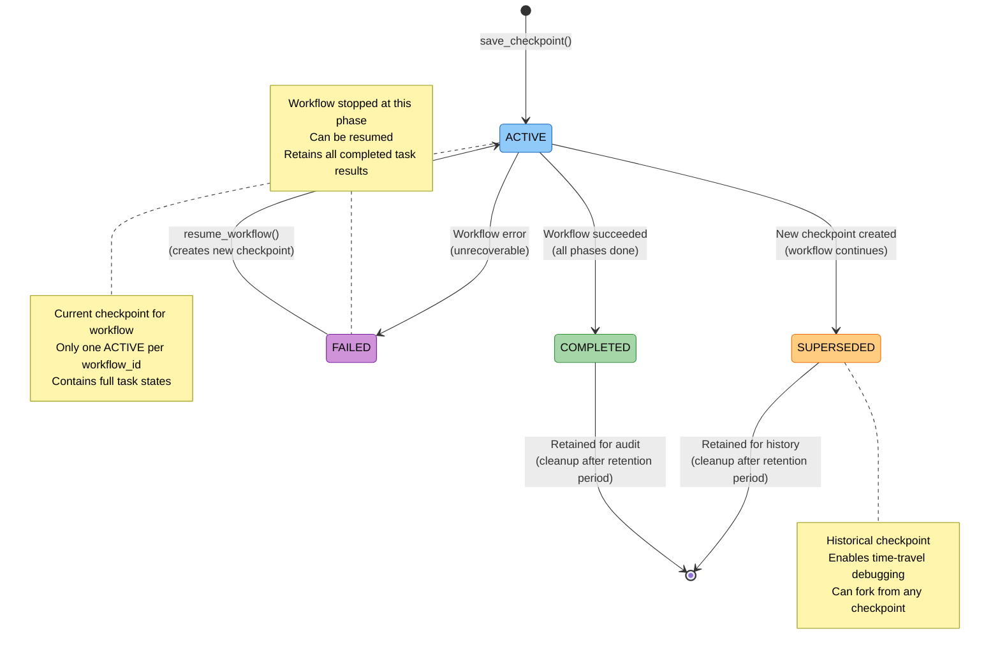
```mermaid
stateDiagram-v2
    [*] --> ACTIVE: save_checkpoint()

    ACTIVE --> SUPERSEDED: New checkpoint created<br/>(workflow continues)
    ACTIVE --> COMPLETED: Workflow succeeded<br/>(all phases done)
    ACTIVE --> FAILED: Workflow error<br/>(unrecoverable)

    SUPERSEDED --> [*]: Retained for history<br/>(cleanup after retention period)

    FAILED --> ACTIVE: resume_workflow()<br/>(creates new checkpoint)

    COMPLETED --> [*]: Retained for audit<br/>(cleanup after retention period)

    note right of ACTIVE
        Current checkpoint for workflow
        Only one ACTIVE per workflow_id
        Contains full task states
    end note

    note right of SUPERSEDED
        Historical checkpoint
        Enables time-travel debugging
        Can fork from any checkpoint
    end note

    note left of FAILED
        Workflow stopped at this phase
        Can be resumed
        Retains all completed task results
    end note

    classDef blue fill:#90caf9,stroke:#1565c0,color:#000
    classDef green fill:#a5d6a7,stroke:#388e3c,color:#000
    classDef orange fill:#ffcc80,stroke:#ef6c00,color:#000
    classDef purple fill:#ce93d8,stroke:#7b1fa2,color:#000

    class ACTIVE blue
    class SUPERSEDED orange
    class COMPLETED green
    class FAILED purple
```

**State Transitions:**
| From | To | Trigger | Action |
|------|-----|---------|--------|
| (none) | ACTIVE | `save_checkpoint()` | Create new checkpoint with workflow state |
| ACTIVE | SUPERSEDED | New phase starts | Previous checkpoint marked superseded |
| ACTIVE | COMPLETED | All phases done | Workflow succeeded, mark complete |
| ACTIVE | FAILED | Unrecoverable error | Workflow stopped, can resume later |
| FAILED | ACTIVE | `resume_workflow()` | New checkpoint created from failed state |

### Enabling Checkpointing

```python
from cogniverse_agents.orchestrator import MultiAgentOrchestrator
from cogniverse_agents.orchestrator.checkpoint_types import CheckpointConfig, CheckpointLevel
from cogniverse_agents.orchestrator.checkpoint_storage import WorkflowCheckpointStorage

# Create checkpoint storage (Phoenix span-based)
storage = WorkflowCheckpointStorage(
    project_name="workflow_checkpoints",
    tenant_id="acme"
)

# Configure checkpointing
config = CheckpointConfig(
    enabled=True,
    level=CheckpointLevel.PHASE,
    project_name="workflow_checkpoints",
    retain_completed_hours=24 * 7,   # Keep completed for 7 days
    retain_failed_hours=24 * 30      # Keep failed for 30 days
)

# Create orchestrator with checkpointing
orchestrator = MultiAgentOrchestrator(
    tenant_id="acme",
    checkpoint_config=config,
    checkpoint_storage=storage
)
```

### Resuming Failed Workflows

```python
# Get list of resumable workflows
resumable = await orchestrator.get_resumable_workflows()
# Returns: [{"workflow_id": "wf_123", "original_query": "...", ...}, ...]

# Resume a specific workflow
result = await orchestrator.process_complex_query(
    query="Original query (ignored when resuming)",
    resume_from_workflow_id="wf_123"
)
```

### Resume Algorithm

```text
1. Load latest ACTIVE checkpoint for workflow_id
2. Reconstruct WorkflowPlan from checkpoint
3. For each phase from checkpoint.current_phase:
   - Skip tasks with status=COMPLETED (use cached result)
   - Execute tasks with status=WAITING/READY/FAILED
   - Save checkpoint after phase completion
4. Mark old checkpoint as SUPERSEDED
5. Return aggregated result
```

### Checkpoint Storage

Checkpoints are stored as Phoenix spans following the same pattern as `ApprovalStorageImpl`:

```python
class WorkflowCheckpointStorage:
    """Phoenix span-based checkpoint storage"""

    async def save_checkpoint(checkpoint: WorkflowCheckpoint) -> str
    async def get_latest_checkpoint(workflow_id: str) -> Optional[WorkflowCheckpoint]
    async def get_checkpoint_by_id(checkpoint_id: str) -> Optional[WorkflowCheckpoint]
    async def mark_checkpoint_status(checkpoint_id: str, status: CheckpointStatus)
    async def list_workflow_checkpoints(workflow_id: str) -> List[WorkflowCheckpoint]
    async def get_resumable_workflows(tenant_id: Optional[str]) -> List[Dict]
```

### Workflow Checkpoint Structure

```python
@dataclass
class WorkflowCheckpoint:
    checkpoint_id: str              # Unique checkpoint ID
    workflow_id: str                # Workflow being checkpointed
    tenant_id: str                  # Tenant identifier
    workflow_status: str            # Current workflow status
    current_phase: int              # Phase index (0-based)
    original_query: str             # Original user query
    execution_order: List[List[str]] # Task execution phases
    metadata: Dict[str, Any]        # Additional metadata
    task_states: Dict[str, TaskCheckpoint]  # Task states
    checkpoint_time: datetime       # When checkpoint was created
    checkpoint_status: CheckpointStatus     # Active/superseded/etc.
    parent_checkpoint_id: Optional[str]     # For forking
    resume_count: int               # Number of resume attempts

@dataclass
class TaskCheckpoint:
    task_id: str                    # Task identifier
    agent_name: str                 # Agent that executed task
    query: str                      # Task query
    dependencies: List[str]         # Task dependencies
    status: str                     # completed/running/failed/waiting
    result: Optional[Dict]          # Task result (if completed)
    error: Optional[str]            # Error message (if failed)
    retry_count: int                # Number of retries
    start_time: Optional[datetime]  # When task started
    end_time: Optional[datetime]    # When task completed
```

### Example: Complete Checkpoint Flow

```python
from cogniverse_agents.orchestrator import MultiAgentOrchestrator
from cogniverse_agents.orchestrator.checkpoint_types import CheckpointConfig
from cogniverse_agents.orchestrator.checkpoint_storage import WorkflowCheckpointStorage

# Setup
storage = WorkflowCheckpointStorage(project_name="checkpoints", tenant_id="acme")
config = CheckpointConfig(enabled=True)
orchestrator = MultiAgentOrchestrator(
    tenant_id="acme",
    checkpoint_config=config,
    checkpoint_storage=storage
)

# Execute workflow (checkpoints saved automatically after each phase)
try:
    result = await orchestrator.process_complex_query(
        "Find videos about machine learning and summarize them"
    )
except Exception as e:
    print(f"Workflow failed: {e}")

    # Get resumable workflows
    resumable = await orchestrator.get_resumable_workflows()
    if resumable:
        # Resume from last checkpoint
        result = await orchestrator.process_complex_query(
            query="",  # Ignored when resuming
            resume_from_workflow_id=resumable[0]["workflow_id"]
        )
```

---

## Real-Time Event Notifications

### Overview

The `MultiAgentOrchestrator` integrates with the A2A EventQueue system for real-time progress notifications. This enables:

- **Multiple Subscribers**: Dashboard + CLI can watch the same workflow simultaneously
- **Automatic Event Emission**: Checkpoint saves automatically emit A2A-compatible events
- **Graceful Cancellation**: Workflows can be cancelled at phase boundaries
- **Reconnection with Replay**: Clients can resume from a specific event offset

### Enabling EventQueue

```python
from cogniverse_agents.orchestrator import MultiAgentOrchestrator
from cogniverse_agents.orchestrator.checkpoint_storage import WorkflowCheckpointStorage
from cogniverse_core.events import get_queue_manager

# Create event queue for the workflow
manager = get_queue_manager()
queue = await manager.create_queue("workflow_123", "tenant1")

# Create checkpoint storage with event queue (automatic event emission)
storage = WorkflowCheckpointStorage(
    grpc_endpoint="localhost:4317",
    http_endpoint="http://localhost:6006",
    tenant_id="tenant1",
    event_queue=queue,  # Events emitted on checkpoint saves
)

# Create orchestrator
orchestrator = MultiAgentOrchestrator(
    tenant_id="tenant1",
    checkpoint_storage=storage,
    event_queue=queue,  # Additional events at non-checkpoint boundaries
)
```

### Event Flow

When a workflow executes with EventQueue configured:

1. **Planning phase** → StatusEvent("planning")
2. **Execution starts** → StatusEvent("executing")
3. **Each phase completes** → Checkpoint saves → StatusEvent + ProgressEvent (automatic)
4. **Task results** → ArtifactEvent (per-task)
5. **Workflow completes** → Checkpoint saves → StatusEvent("completed") + CompleteEvent

### Subscribing to Events

```python
# Subscribe to workflow progress
async for event in queue.subscribe():
    print(f"[{event.event_type}] {event.phase}: {event.message}")
    if event.event_type == "complete":
        break
```

### Cancellation

```python
# Cancel a running workflow
await manager.cancel_task("workflow_123", reason="User requested")

# Orchestrator checks cancellation at phase boundaries and aborts gracefully
```

See [Events Module](./events.md) for complete EventQueue documentation.

---

## Approval Workflow System

The Approval Workflow System provides human-in-the-loop (HITL) approval for AI-generated outputs.

**Location:** `libs/agents/cogniverse_agents/approval/`

**Full Documentation:** [Approval Workflow Module](./approval-workflow.md)

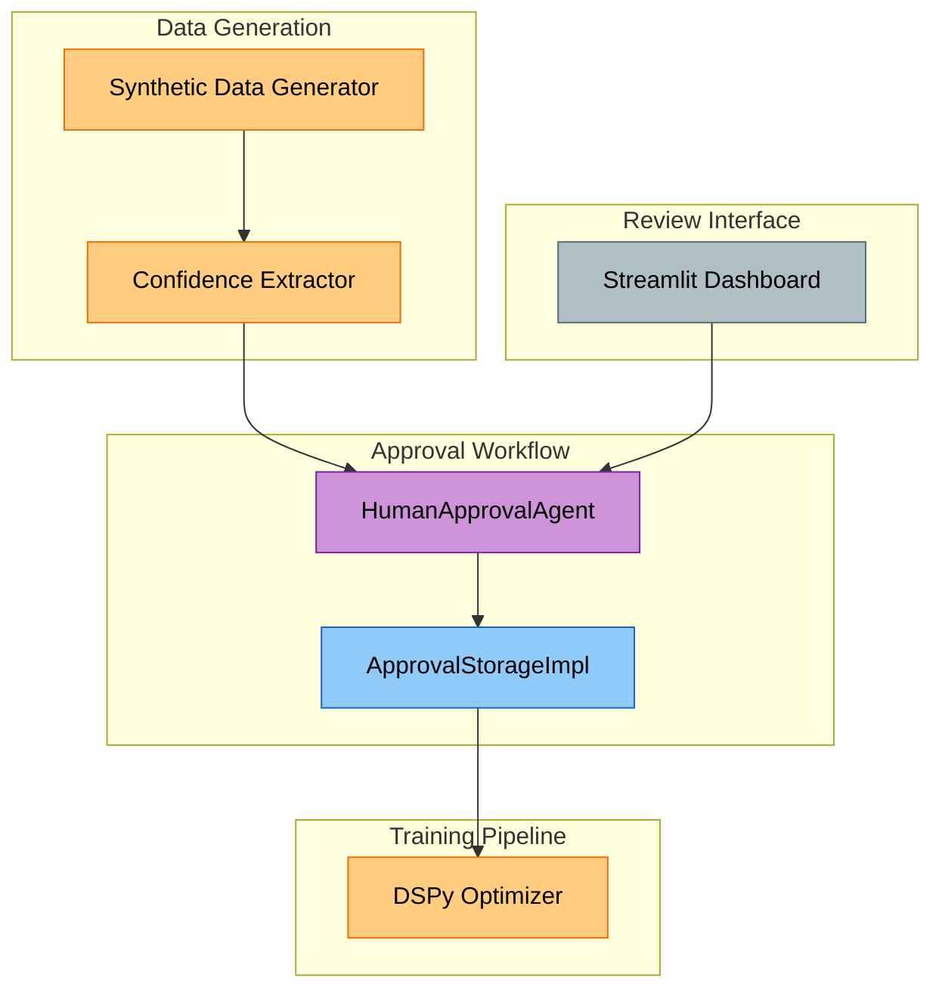
```mermaid
flowchart TB
    subgraph "Data Generation"
        SyntheticGen["<span style='color:#000'>Synthetic Data Generator</span>"]
        Extractor["<span style='color:#000'>Confidence Extractor</span>"]
        SyntheticGen --> Extractor
    end

    subgraph "Approval Workflow"
        ApprovalAgent["<span style='color:#000'>HumanApprovalAgent</span>"]
        Storage["<span style='color:#000'>ApprovalStorageImpl</span>"]

        Extractor --> ApprovalAgent
        ApprovalAgent --> Storage
    end

    subgraph "Review Interface"
        Dashboard["<span style='color:#000'>Streamlit Dashboard</span>"]
        Dashboard --> ApprovalAgent
    end

    subgraph "Training Pipeline"
        Optimizer["<span style='color:#000'>DSPy Optimizer</span>"]
        Storage --> Optimizer
    end

    style SyntheticGen fill:#ffcc80,stroke:#ef6c00,color:#000
    style Extractor fill:#ffcc80,stroke:#ef6c00,color:#000
    style ApprovalAgent fill:#ce93d8,stroke:#7b1fa2,color:#000
    style Storage fill:#90caf9,stroke:#1565c0,color:#000
    style Dashboard fill:#b0bec5,stroke:#546e7a,color:#000
    style Optimizer fill:#ffcc80,stroke:#ef6c00,color:#000
```

### Key Components

| Component | Description |
|-----------|-------------|
| `HumanApprovalAgent` | Orchestrates HITL approval with confidence-based auto-approval |
| `DecisionOrchestrator` | Combines WorkflowStateMachine with approval checkpoints |
| `ApprovalStorageImpl` | Phoenix telemetry-based storage with annotations |
| `ConfidenceExtractor` | Domain-specific confidence scoring (abstract) |
| `FeedbackHandler` | Domain-specific rejection handling (abstract) |

### Quick Example

```python
from cogniverse_agents.approval import HumanApprovalAgent, ApprovalStorageImpl

# Initialize
storage = ApprovalStorageImpl(
    grpc_endpoint="http://localhost:4317",
    http_endpoint="http://localhost:6006",
    tenant_id="acme"
)

agent = HumanApprovalAgent(
    storage=storage,
    confidence_extractor=MyConfidenceExtractor(),
    confidence_threshold=0.8  # Auto-approve >= 0.8
)

# Create batch (auto-approves high-confidence items)
batch_id = await agent.create_batch(items=synthetic_data, context={...})

# Apply human decision
await agent.apply_decision(batch_id, ReviewDecision(item_id="...", approved=True))

# Export approved to training dataset
await agent.export_approved_to_dataset(batch_id, "training_v2")
```

### Workflow States

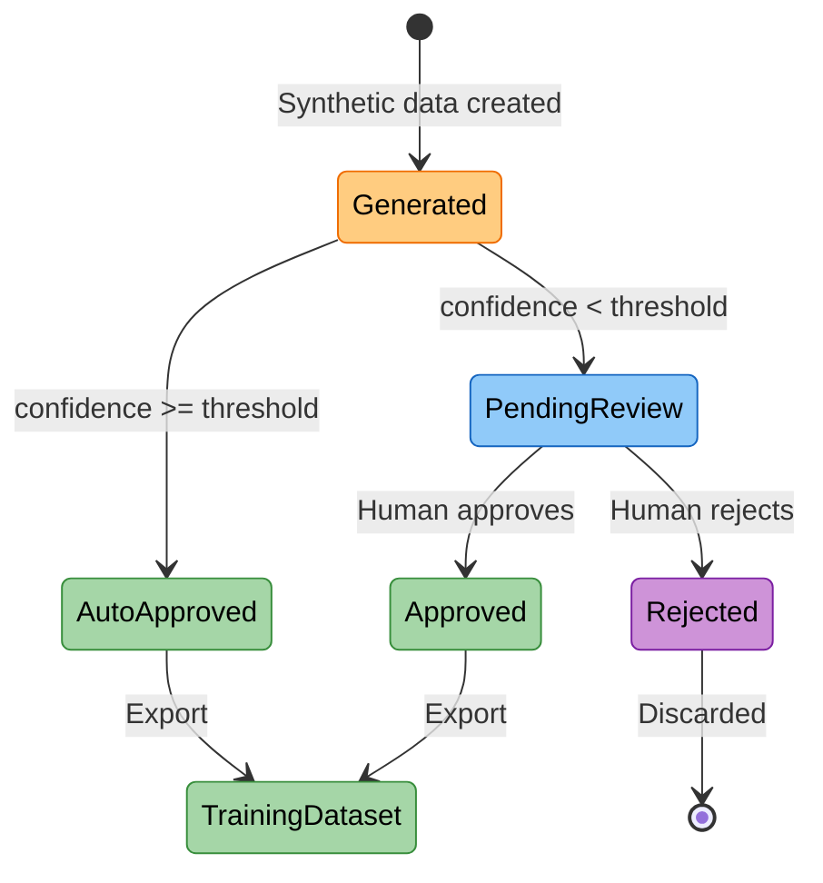
```mermaid
stateDiagram-v2
    [*] --> Generated: Synthetic data created
    Generated --> AutoApproved: confidence >= threshold
    Generated --> PendingReview: confidence < threshold
    PendingReview --> Approved: Human approves
    PendingReview --> Rejected: Human rejects
    AutoApproved --> TrainingDataset: Export
    Approved --> TrainingDataset: Export
    Rejected --> [*]: Discarded

    classDef orange fill:#ffcc80,stroke:#ef6c00,color:#000
    classDef green fill:#a5d6a7,stroke:#388e3c,color:#000
    classDef blue fill:#90caf9,stroke:#1565c0,color:#000
    classDef purple fill:#ce93d8,stroke:#7b1fa2,color:#000

    class Generated orange
    class AutoApproved,Approved green
    class PendingReview blue
    class Rejected purple
    class TrainingDataset green
```

See [Approval Workflow Module](./approval-workflow.md) for complete documentation including:

- ApprovalStorageImpl with Phoenix integration
- ConfidenceExtractor implementations
- Dashboard integration
- Testing patterns

---

## Tools Subsystem

The Tools subsystem provides utilities for agent communication, video playback, and temporal pattern recognition.

**Location:** `libs/agents/cogniverse_agents/tools/`

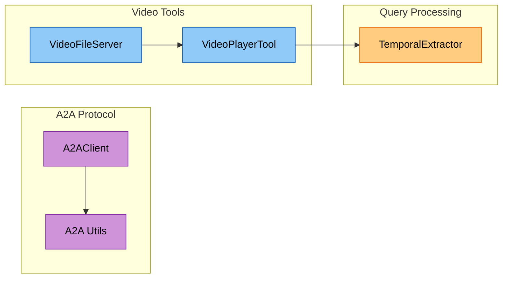
```mermaid
flowchart LR
    subgraph "A2A Protocol"
        Client["<span style='color:#000'>A2AClient</span>"]
        Utils["<span style='color:#000'>A2A Utils</span>"]
    end

    subgraph "Video Tools"
        Server["<span style='color:#000'>VideoFileServer</span>"]
        Player["<span style='color:#000'>VideoPlayerTool</span>"]
    end

    subgraph "Query Processing"
        Temporal["<span style='color:#000'>TemporalExtractor</span>"]
    end

    Client --> Utils
    Server --> Player
    Player --> Temporal

    style Client fill:#ce93d8,stroke:#7b1fa2,color:#000
    style Utils fill:#ce93d8,stroke:#7b1fa2,color:#000
    style Server fill:#90caf9,stroke:#1565c0,color:#000
    style Player fill:#90caf9,stroke:#1565c0,color:#000
    style Temporal fill:#ffcc80,stroke:#ef6c00,color:#000
```

### A2A Protocol Utilities

**Primary Location:** `libs/core/cogniverse_core/common/a2a_utils.py` (canonical)

**Note:** A duplicate copy exists at `libs/agents/cogniverse_agents/tools/a2a_utils.py` with identical API. Always prefer importing from `cogniverse_core.common.a2a_utils` for consistency.

Implements Google's Agent-to-Agent (A2A) protocol for inter-agent communication.

**Data Models:**

| Model | Purpose |
|-------|---------|
| `TextPart` | Text content in A2A messages |
| `DataPart` | Structured data in A2A messages |
| `FilePart` | File references with URI and MIME type |
| `A2AMessage` | Message with role and parts list |
| `Task` | Task with ID and message list |
| `AgentCard` | Agent metadata (name, capabilities, skills) |

**A2AClient:**

```python
from cogniverse_core.common.a2a_utils import A2AClient, format_search_results

client = A2AClient(timeout=60.0)

# Send task to an A2A-compliant agent
response = await client.send_task(
    agent_url="http://localhost:8000",
    query="Search for tutorials",
    top_k=10
)

# Get agent capabilities
card = await client.get_agent_card("http://localhost:8000")
# Returns: AgentCard with name, capabilities, skills, etc.
```

**Utility Functions:**

```python
from cogniverse_core.common.a2a_utils import (
    A2AClient,
    format_search_results,
    create_text_message,
    create_data_message,
    create_task,
    extract_data_from_message,
    extract_text_from_message,
    discover_agents,
)

# Create A2A messages
msg = create_text_message("Hello", role="user")
data_msg = create_data_message({"query": "search term"}, role="user")

# Create task
task = create_task([msg, data_msg])

# Discover agents from URLs
agents = await discover_agents([
    "http://agent1:8000",
    "http://agent2:8000"
])
# Returns: Dict[agent_name, AgentCard]

# Format search results for display
formatted = format_search_results(results, result_type="video")
```

### VideoFileServer

**Location:** `libs/agents/cogniverse_agents/tools/video_file_server.py`

FastAPI-based HTTP server for serving video files to the video player tool.

```python
from cogniverse_agents.tools.video_file_server import VideoFileServer
from cogniverse_foundation.config.utils import get_config

config = get_config(tenant_id="default", config_manager=manager)
server = VideoFileServer(port=8888, config=config)

# Start server (async)
await server.start()
```

**Endpoints:**

| Endpoint | Method | Description |
|----------|--------|-------------|
| `/` | GET | Root endpoint with server info |
| `/health` | GET | Health check |
| `/videos` | GET | List available video files |
| `/player/{video_id}` | GET | Serve video player HTML |
| `/{path}` | GET | Static file serving for videos |

### VideoPlayerTool

**Location:** `libs/agents/cogniverse_agents/tools/video_player_tool.py`

Google ADK tool for generating interactive HTML video players with search result markers.

```python
from cogniverse_agents.tools.video_player_tool import VideoPlayerTool

player = VideoPlayerTool(tenant_id="default", config_manager=manager)

result = await player.execute(
    video_id="tutorial_001",
    search_results='[{"start_time": 30, "score": 0.9, "description": "Key moment"}]',
    start_time=25.0
)

if result["success"]:
    html_artifact = result["video_player"]  # ADK Part with HTML
    print(f"Generated player with {result['frame_count']} markers")
```

**Features:**

- Timeline markers from search results (color-coded by relevance score)
- Keyboard shortcuts (space=play/pause, arrows=seek, up/down=volume)
- Playback speed controls (0.5x, 1x, 1.5x, 2x)
- Auto-start at specified timestamp
- Server-based video references (no embedding large files)

### EnhancedTemporalExtractor

**Location:** `libs/agents/cogniverse_agents/tools/temporal_extractor.py`

Extracts and resolves temporal patterns from natural language queries.

```python
from cogniverse_agents.tools.temporal_extractor import EnhancedTemporalExtractor

extractor = EnhancedTemporalExtractor()

# Extract pattern from query
pattern = extractor.extract_temporal_pattern("videos from last week")
# Returns: "last_week"

# Resolve to actual dates
dates = extractor.resolve_temporal_pattern(pattern)
# Returns: {"start_date": "2025-01-26", "end_date": "2025-02-02", "detected_pattern": "last_week"}
```

**Supported Patterns:**

| Category | Examples |
|----------|----------|
| Relative days | "yesterday", "two days ago", "day before yesterday" |
| Week-based | "last week", "this week", "past 7 days", "two weeks ago" |
| Month-based | "last month", "this month", "beginning of month" |
| Specific dates | "2024-01-15", "January 15, 2024", "01/15/2024" |
| Date ranges | "between 2024-01-10 and 2024-01-20" |
| Quarter/weekday | "first quarter", "last Tuesday", "weekend" |

---

## Inference System

The Inference subsystem provides RLM (Recursive Language Model) inference for handling large contexts that exceed model limits.

**Location:** `libs/agents/cogniverse_agents/inference/`

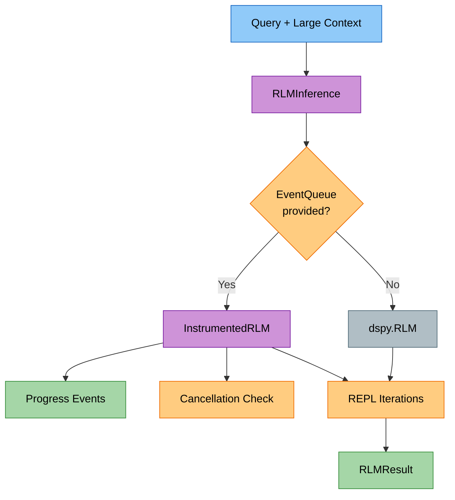
```mermaid
flowchart TD
    Query["<span style='color:#000'>Query + Large Context</span>"] --> RLM["<span style='color:#000'>RLMInference</span>"]

    RLM --> Check{"<span style='color:#000'>EventQueue<br/>provided?</span>"}

    Check -->|Yes| Instrumented["<span style='color:#000'>InstrumentedRLM</span>"]
    Check -->|No| Standard["<span style='color:#000'>dspy.RLM</span>"]

    Instrumented --> Events["<span style='color:#000'>Progress Events</span>"]
    Instrumented --> Cancel["<span style='color:#000'>Cancellation Check</span>"]

    Standard --> Process["<span style='color:#000'>REPL Iterations</span>"]
    Instrumented --> Process

    Process --> Result["<span style='color:#000'>RLMResult</span>"]

    style Query fill:#90caf9,stroke:#1565c0,color:#000
    style RLM fill:#ce93d8,stroke:#7b1fa2,color:#000
    style Check fill:#ffcc80,stroke:#ef6c00,color:#000
    style Instrumented fill:#ce93d8,stroke:#7b1fa2,color:#000
    style Standard fill:#b0bec5,stroke:#546e7a,color:#000
    style Events fill:#a5d6a7,stroke:#388e3c,color:#000
    style Cancel fill:#ffcc80,stroke:#ef6c00,color:#000
    style Process fill:#ffcc80,stroke:#ef6c00,color:#000
    style Result fill:#a5d6a7,stroke:#388e3c,color:#000
```

### RLM Overview

RLM (Recursive Language Model) enables LLMs to handle near-infinite context by:

1. Storing context as Python variables (not in LLM prompt)
2. LLM generates code to inspect, filter, and partition context
3. Spawns sub-LLMs recursively to process partitions
4. Aggregates results via `SUBMIT({fields})`

**Use Cases:**

- Large video frame analysis (100s of frames)
- Multi-document aggregation
- Long transcript processing
- Search result synthesis

### RLMInference

**Location:** `libs/agents/cogniverse_agents/inference/rlm_inference.py`

Wrapper around DSPy's RLM module with timeout handling and optional EventQueue integration.

```python
from cogniverse_agents.inference import RLMInference, RLMResult, RLMTimeoutError

# Basic usage
rlm = RLMInference(
    backend="openai",
    model="gpt-4o",
    max_iterations=10,
    max_llm_calls=30,
    timeout_seconds=300
)

result = rlm.process(
    query="Summarize the main findings",
    context=large_context_string,  # Can be 100K+ chars
    system_prompt="Focus on key insights"
)

print(f"Answer: {result.answer}")
print(f"Depth: {result.depth_reached}, Calls: {result.total_calls}")
print(f"Latency: {result.latency_ms:.0f}ms")
```

**With EventQueue for Progress Tracking:**

```python
from cogniverse_core.events import EventQueue

event_queue = EventQueue(tenant_id="acme")

rlm = RLMInference(
    backend="openai",
    model="gpt-4o",
    event_queue=event_queue,
    task_id="rlm_task_001",
    tenant_id="acme"
)

# Client receives progress events as RLM iterates
result = rlm.process(query="Analyze documents", context=docs)
```

**Convenience Methods:**

```python
# Process multiple documents
result = rlm.process_documents(
    query="Compare findings",
    documents=[{"content": doc1}, {"content": doc2}],
    doc_key="content"
)

# Process search results
result = rlm.process_search_results(
    query="Synthesize answer",
    results=[{"score": 0.9, "content": "..."}, ...]
)
```

### RLMResult

Dataclass with telemetry data for A/B testing and monitoring.

```python
@dataclass
class RLMResult:
    answer: str          # Final answer from RLM
    depth_reached: int   # Actual recursion depth used
    total_calls: int     # Number of LLM sub-calls
    tokens_used: int     # Total tokens (if available)
    latency_ms: float    # End-to-end latency
    metadata: Dict       # Additional metadata

    def to_telemetry_dict(self) -> Dict:
        """Export for telemetry/Phoenix."""
        return {
            "rlm_enabled": True,
            "rlm_depth_reached": self.depth_reached,
            "rlm_total_calls": self.total_calls,
            ...
        }
```

### InstrumentedRLM

**Location:** `libs/agents/cogniverse_agents/inference/instrumented_rlm.py`

Subclass of `dspy.RLM` with real-time progress events and cancellation support.

```python
from cogniverse_agents.inference import InstrumentedRLM, RLMCancelledError

rlm = InstrumentedRLM(
    "context, query -> answer",
    event_queue=queue,
    task_id="task_123",
    tenant_id="acme",
    max_iterations=10,
    emit_artifacts=True  # Emit iteration reasoning
)

try:
    result = rlm(context=large_context, query="Summarize this")
except RLMCancelledError as e:
    print(f"Cancelled: {e.reason}")
```

**Events Emitted:**

| Event Type | Phase | Description |
|------------|-------|-------------|
| StatusEvent | `rlm_start` | RLM processing started |
| ProgressEvent | `iteration_N` | Per-iteration progress (current/total) |
| ArtifactEvent | `rlm_iteration` | Iteration reasoning (if emit_artifacts=True) |
| StatusEvent | `rlm_extracting` | Max iterations, extracting fallback |
| StatusEvent | `rlm_complete` | Processing completed |

**Cancellation Support:**

```python
# Client can cancel via CancellationToken
await event_queue.cancel("User requested cancellation")

# InstrumentedRLM checks token at each iteration
# Raises RLMCancelledError if cancelled
```

### Backend Support

| Backend | Model Format | Example |
|---------|--------------|---------|
| `openai` | `openai/{model}` | `openai/gpt-4o` |
| `anthropic` | `anthropic/{model}` | `anthropic/claude-3-5-sonnet-20241022` |
| `ollama` | `ollama_chat/{model}` | `ollama_chat/llama3:70b` |
| `litellm` | Provider-prefixed | `together/meta-llama/Llama-3-70b` |

---

## Related Documentation

### Architecture Documentation
- [Multi-Agent Interactions](../architecture/multi-agent-interactions.md) - Complete agent communication flows with 8 Mermaid diagrams showing orchestrator coordination, registry discovery, and workflow patterns
- [Ensemble Composition](../architecture/ensemble-composition.md) - Deep dive into RRF fusion algorithm, parallel profile execution, and performance characteristics
- [SDK Architecture](../architecture/sdk-architecture.md) - Package structure and dependencies
- [Multi-Tenant Architecture](../architecture/multi-tenant.md) - Tenant isolation patterns

### Module Documentation

- [Backends Module](./backends.md) - Vespa backend integration and profile management
- [Common Module](./common.md) - Shared utilities and base classes (MemoryAwareMixin, TenantAwareAgentMixin, etc.)
- [Events Module](./events.md) - A2A EventQueue for real-time notifications
- [Approval Workflow Module](./approval-workflow.md) - Human-in-the-loop approval system

### Integration Documentation
- [A2A Protocol Specification](https://github.com/google/a2a) - Google's Agent-to-Agent communication protocol

---

**Summary**: The Agents package provides tenant-aware agent implementations that integrate with the core SDK. All agents require `tenant_id`, use tenant-specific schemas, and support memory, telemetry, and health checks. The package includes intelligent profile selection (ProfileSelectionAgent), entity extraction (EntityExtractionAgent), multi-agent orchestration (OrchestratorAgent), ensemble search with RRF fusion (SearchAgent), **durable execution with workflow checkpointing**, **real-time event notifications**, **human-in-the-loop approval workflows**, **A2A protocol tools**, **video playback tools**, and **RLM inference** for large-context processing in fault-tolerant, observable workflows.
