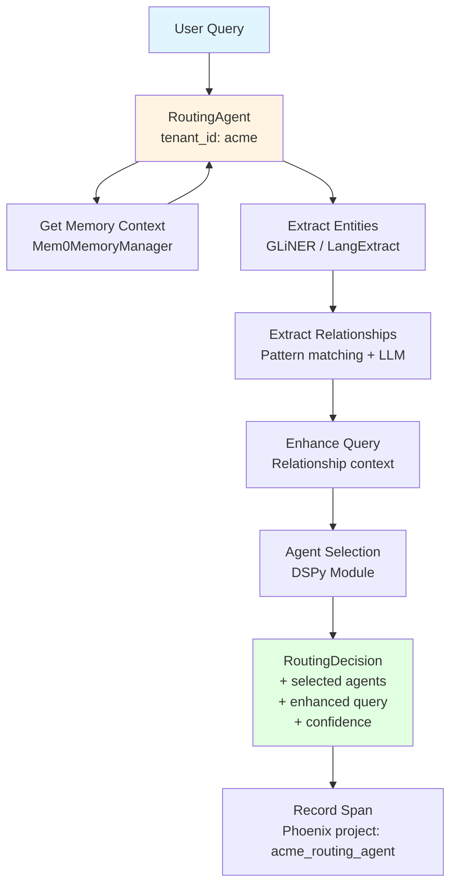
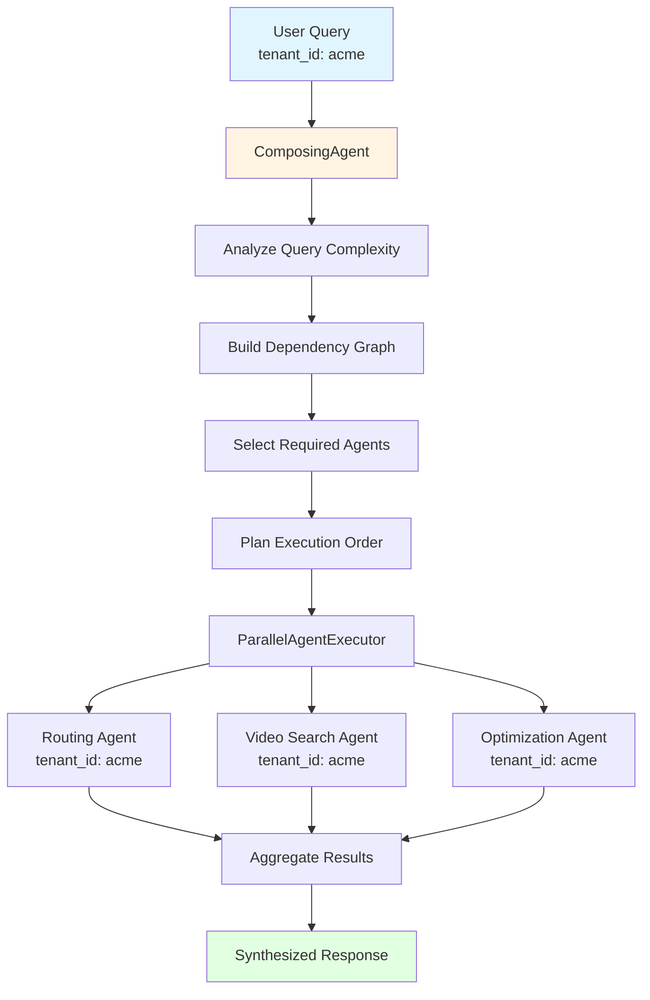
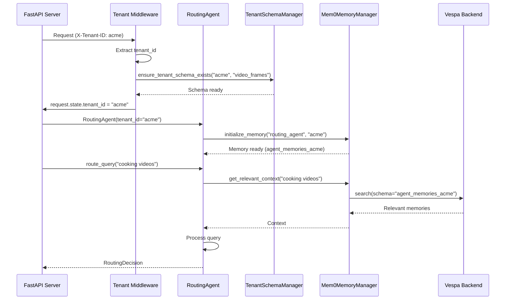

# Agents Module

**Package:** `libs/agents/cogniverse_agents/`
**Purpose:** Agent implementations for multi-agent RAG system with multi-tenant support
**Last Updated:** 2025-10-15

---

## Table of Contents

1. [Module Overview](#module-overview)
2. [Package Structure](#package-structure)
3. [Core Agents](#core-agents)
4. [Agent Architecture](#agent-architecture)
5. [Multi-Tenant Integration](#multi-tenant-integration)
6. [Usage Examples](#usage-examples)
7. [Testing](#testing)

---

## Module Overview

The Agents package (`cogniverse-agents`) provides concrete agent implementations for the Cogniverse multi-agent RAG system. All agents are tenant-aware and integrate with the core SDK packages.

### Key Agents

1. **RoutingAgent** - Query routing with DSPy optimization and relationship extraction
2. **VideoSearchAgent** - Multi-modal video search (ColPali, VideoPrism)
3. **ComposingAgent** - Multi-agent orchestration and workflow coordination
4. **Optimization Agents** - Query optimization and enhancement

### Design Principles

- **Tenant-Aware**: All agents require `tenant_id` parameter
- **Memory-Enabled**: Integration with Mem0 via MemoryAwareMixin (from core)
- **Base Class Inheritance**: Extend BaseAgent from cogniverse_core
- **DSPy Integration**: Declarative LLM programming for optimization
- **Production-Ready**: Health checks, graceful degradation, telemetry

### Package Dependencies

```python
# Agents package depends on:
from cogniverse_core.agents.base_agent import BaseAgent
from cogniverse_core.agents.memory_aware_mixin import MemoryAwareMixin
from cogniverse_core.telemetry.manager import TelemetryManager
from cogniverse_core.config.unified_config import SystemConfig
```

---

## Package Structure

```
libs/agents/cogniverse_agents/
├── __init__.py
├── routing/                          # Routing agents
│   ├── __init__.py
│   ├── routing_agent.py             # Main routing agent
│   ├── modality_cache.py            # Query modality caching
│   ├── parallel_executor.py         # Parallel agent execution
│   └── relationship_extractor.py    # Entity relationship extraction
├── search/                           # Search agents
│   ├── __init__.py
│   ├── video_search_agent.py        # Multi-modal video search
│   ├── multi_modal_reranker.py      # Reranking logic
│   └── query_processor.py           # Query processing
├── orchestration/                    # Composing agents
│   ├── __init__.py
│   └── composing_agent.py           # Multi-agent orchestrator
└── optimization/                     # Optimization agents
    ├── __init__.py
    ├── query_optimizer.py           # Query enhancement
    └── relationship_boost.py        # Relationship-based boosting
```

**Key Files** (82 Python files total):
- `routing/routing_agent.py`: 347 lines
- `search/video_search_agent.py`: 612 lines
- `orchestration/composing_agent.py`: 289 lines

---

## Core Agents

### 1. RoutingAgent

**Location**: `libs/agents/cogniverse_agents/routing/routing_agent.py`
**Purpose**: Intelligent query routing with relationship extraction and DSPy optimization
**Base Classes**: `BaseAgent`, `MemoryAwareMixin`, `HealthCheckMixin`

#### Architecture



#### Class Definition

```python
# libs/agents/cogniverse_agents/routing/routing_agent.py

from cogniverse_core.agents.base_agent import BaseAgent
from cogniverse_core.agents.memory_aware_mixin import MemoryAwareMixin
from cogniverse_core.agents.health_check_mixin import HealthCheckMixin
from cogniverse_core.telemetry.manager import TelemetryManager

class RoutingAgent(BaseAgent, MemoryAwareMixin, HealthCheckMixin):
    """
    Intelligent query routing with relationship extraction.

    Multi-tenant aware - each tenant gets isolated routing context.
    """

    def __init__(
        self,
        tenant_id: str,  # REQUIRED - no default tenant
        config: Optional[SystemConfig] = None
    ):
        """
        Initialize routing agent for specific tenant.

        Args:
            tenant_id: Tenant identifier (e.g., "acme", "acme:production")
            config: Optional system configuration
        """
        super().__init__(tenant_id=tenant_id, config=config)

        # Initialize telemetry (tenant-scoped)
        self.telemetry = TelemetryManager.get_instance(
            tenant_id=tenant_id,
            project_name="routing_agent"
        )  # Creates project: {tenant_id}_routing_agent

        # Initialize memory (tenant-scoped)
        self.initialize_memory(
            agent_name="routing_agent",
            tenant_id=tenant_id
        )

        # DSPy modules (shared, but decisions per-tenant)
        self._init_dspy_modules()
```

#### Key Methods

**`route_query(query: str, context: Optional[Dict] = None) -> RoutingDecision`**

Main routing entry point.

```python
async def route_query(
    self,
    query: str,
    context: Optional[Dict] = None
) -> RoutingDecision:
    """
    Route query with entity/relationship extraction.

    Args:
        query: User query string
        context: Optional context (user prefs, session data)

    Returns:
        RoutingDecision with selected agents and enhanced query
    """
    with self.telemetry.trace("route_query") as span:
        span.set_attribute("tenant_id", self.tenant_id)
        span.set_attribute("query", query)

        # 1. Get memory context
        memory_context = self.get_relevant_context(query, top_k=5)

        # 2. Extract entities
        entities = self._extract_entities(query)

        # 3. Extract relationships
        relationships = self._extract_relationships(query, entities)

        # 4. Enhance query
        enhanced_query = self._enhance_query(query, entities, relationships)

        # 5. Select agents (DSPy)
        decision = self._select_agents(enhanced_query, entities, relationships)

        # 6. Record decision
        span.set_attribute("selected_agents", decision.selected_agents)
        span.set_attribute("confidence", decision.confidence)

        return decision
```

**`_extract_entities(query: str) -> List[Dict]`**

Extract named entities using GLiNER or LangExtract.

```python
def _extract_entities(self, query: str) -> List[Dict]:
    """
    Extract named entities from query.

    Returns:
        List of entities: [{"text": "Einstein", "type": "PERSON"}, ...]
    """
    # Use GLiNER for fast entity extraction
    from gliner import GLiNER

    model = GLiNER.from_pretrained("urchade/gliner_multi-v2.1")
    entities = model.predict_entities(
        query,
        labels=["person", "organization", "location", "topic", "date"]
    )

    return [
        {"text": e["text"], "type": e["label"].upper()}
        for e in entities
    ]
```

**`_extract_relationships(query: str, entities: List[Dict]) -> List[Dict]`**

Extract relationships between entities.

```python
def _extract_relationships(
    self,
    query: str,
    entities: List[Dict]
) -> List[Dict]:
    """
    Extract relationships between entities.

    Returns:
        List: [{"subject": "Einstein", "relation": "discusses", "object": "physics"}, ...]
    """
    # Pattern-based extraction + LLM fallback
    relationships = []

    # Pattern matching for common relationships
    patterns = {
        "discusses": r"(\w+) discusses (\w+)",
        "works_on": r"(\w+) works on (\w+)",
        "related_to": r"(\w+) related to (\w+)"
    }

    for relation_type, pattern in patterns.items():
        matches = re.finditer(pattern, query, re.IGNORECASE)
        for match in matches:
            relationships.append({
                "subject": match.group(1),
                "relation": relation_type,
                "object": match.group(2)
            })

    return relationships
```

#### Configuration

```python
# Routing agent configuration
routing_agent_config = {
    "dspy_enabled": True,
    "grpo_enabled": True,
    "confidence_threshold": 0.7,
    "memory_enabled": True,
    "entity_extraction_method": "gliner",  # or "langextract", "llm"
    "relationship_extraction_enabled": True,
    "cache_ttl_seconds": 300
}
```

---

### 2. VideoSearchAgent

**Location**: `libs/agents/cogniverse_agents/search/video_search_agent.py`
**Purpose**: Multi-modal video search with ColPali and VideoPrism embeddings
**Base Classes**: `BaseAgent`, `MemoryAwareMixin`, `HealthCheckMixin`

#### Multi-Modal Support

```mermaid
graph LR
    Input[Input] --> TextQuery[Text Query]
    Input --> VideoFile[Video File]
    Input --> ImageFile[Image File]

    TextQuery --> ColPaliEncode[ColPali Text Encoder]
    TextQuery --> VideoPrismEncode[VideoPrism Text Encoder]

    VideoFile --> FrameExtract[Extract Frames<br/>1 FPS]
    FrameExtract --> VideoEncode[Encode Frames<br/>ColPali/VideoPrism]

    ImageFile --> ImageEncode[Encode Image<br/>ColPali/VideoPrism]

    ColPaliEncode --> VespaSearch[Vespa Search<br/>Schema: video_frames_{tenant_id}]
    VideoPrismEncode --> VespaSearch
    VideoEncode --> VespaSearch
    ImageEncode --> VespaSearch

    VespaSearch --> Rerank[Rerank Results<br/>Relationship boost]
    Rerank --> Results[Ranked Results]
```

#### Class Definition

```python
# libs/agents/cogniverse_agents/search/video_search_agent.py

from cogniverse_core.agents.base_agent import BaseAgent
from cogniverse_core.agents.memory_aware_mixin import MemoryAwareMixin
from cogniverse_vespa.backends.vespa_search_client import VespaSearchClient
from cogniverse_vespa.tenant.tenant_schema_manager import TenantSchemaManager

class VideoSearchAgent(BaseAgent, MemoryAwareMixin):
    """
    Multi-modal video search agent with tenant isolation.

    Supports:
    - Text-to-video search (ColPali, VideoPrism)
    - Video-to-video search (similarity)
    - Image-to-video search (visual similarity)
    """

    def __init__(
        self,
        tenant_id: str,  # REQUIRED
        vespa_host: str = "localhost",
        vespa_port: int = 8080,
        profile: str = "video_colpali_smol500_mv_frame"
    ):
        """
        Initialize video search agent.

        Args:
            tenant_id: Tenant identifier
            vespa_host: Vespa endpoint
            vespa_port: Vespa port
            profile: Search profile (determines schema)
        """
        super().__init__(tenant_id=tenant_id)

        # Ensure tenant schema exists
        schema_manager = TenantSchemaManager(
            vespa_url=vespa_host,
            vespa_port=vespa_port
        )
        schema_manager.ensure_tenant_schema_exists(tenant_id, profile)

        # Initialize Vespa client with tenant schema
        tenant_schema = schema_manager.get_tenant_schema_name(tenant_id, profile)
        self.vespa_client = VespaSearchClient(
            host=vespa_host,
            port=vespa_port,
            schema=tenant_schema  # e.g., video_colpali_smol500_mv_frame_acme
        )

        # Initialize telemetry
        self.telemetry = TelemetryManager.get_instance(
            tenant_id=tenant_id,
            project_name="video_search"
        )

        # Initialize memory
        self.initialize_memory("video_search", tenant_id)
```

#### Key Methods

**`search_by_text(query: str, top_k: int = 10) -> List[Dict]`**

Text-to-video search.

```python
async def search_by_text(
    self,
    query: str,
    top_k: int = 10,
    ranking: str = "hybrid_binary_bm25_no_description"
) -> List[Dict]:
    """
    Search videos by text query.

    Args:
        query: Text query string
        top_k: Number of results
        ranking: Ranking profile name

    Returns:
        List of video results with scores
    """
    with self.telemetry.trace("search_by_text") as span:
        span.set_attribute("tenant_id", self.tenant_id)
        span.set_attribute("query", query)
        span.set_attribute("top_k", top_k)

        # Get memory context
        memory_context = self.get_relevant_context(query, top_k=3)

        # Enhance query with context
        if memory_context:
            enhanced_query = f"{query} {memory_context}"
        else:
            enhanced_query = query

        # Search Vespa (tenant schema)
        results = self.vespa_client.search(
            query=enhanced_query,
            top_k=top_k,
            ranking=ranking
        )

        # Remember successful search
        if results:
            self.remember_success(
                query=query,
                result={"count": len(results)},
                metadata={"top_k": top_k}
            )

        span.set_attribute("result_count", len(results))
        return results
```

**`search_by_video(video_data: bytes, filename: str, top_k: int = 10) -> List[Dict]`**

Video-to-video similarity search.

```python
async def search_by_video(
    self,
    video_data: bytes,
    filename: str,
    top_k: int = 10
) -> List[Dict]:
    """
    Search videos by video similarity.

    Args:
        video_data: Video file bytes
        filename: Original filename
        top_k: Number of results

    Returns:
        Similar videos
    """
    with self.telemetry.trace("search_by_video") as span:
        span.set_attribute("tenant_id", self.tenant_id)
        span.set_attribute("filename", filename)

        # 1. Save video to temp file
        temp_path = Path(f"/tmp/{self.tenant_id}_{filename}")
        temp_path.write_bytes(video_data)

        # 2. Extract frames
        frames = self._extract_frames(temp_path, fps=1)
        span.set_attribute("frame_count", len(frames))

        # 3. Encode frames
        frame_embeddings = self._encode_frames(frames)

        # 4. Search with embeddings
        results = self.vespa_client.search_by_embedding(
            embeddings=frame_embeddings,
            top_k=top_k
        )

        # 5. Cleanup
        temp_path.unlink()

        return results
```

#### Multi-Tenant Search Flow

```python
# Example: Two tenants searching independently

# Tenant A: acme
agent_acme = VideoSearchAgent(
    tenant_id="acme",
    profile="video_colpali_smol500_mv_frame"
)
results_acme = await agent_acme.search_by_text("cooking videos")
# Searches schema: video_colpali_smol500_mv_frame_acme
# Only acme's videos returned

# Tenant B: startup
agent_startup = VideoSearchAgent(
    tenant_id="startup",
    profile="video_colpali_smol500_mv_frame"
)
results_startup = await agent_startup.search_by_text("cooking videos")
# Searches schema: video_colpali_smol500_mv_frame_startup
# Only startup's videos returned

# Physical isolation - no cross-tenant data access possible
```

---

### 3. ComposingAgent

**Location**: `libs/agents/cogniverse_agents/orchestration/composing_agent.py`
**Purpose**: Multi-agent workflow orchestration and coordination
**Base Classes**: `BaseAgent`

#### Architecture



#### Class Definition

```python
# libs/agents/cogniverse_agents/orchestration/composing_agent.py

from cogniverse_core.agents.base_agent import BaseAgent
from cogniverse_agents.routing.routing_agent import RoutingAgent
from cogniverse_agents.search.video_search_agent import VideoSearchAgent
from cogniverse_agents.routing.parallel_executor import ParallelAgentExecutor

class ComposingAgent(BaseAgent):
    """
    Orchestrates multi-agent workflows with tenant context.

    Coordinates execution of routing, search, and optimization agents.
    """

    def __init__(self, tenant_id: str):
        super().__init__(tenant_id=tenant_id)

        # Initialize sub-agents (all tenant-aware)
        self.routing_agent = RoutingAgent(tenant_id=tenant_id)
        self.video_agent = VideoSearchAgent(tenant_id=tenant_id)

        # Parallel executor
        self.parallel_executor = ParallelAgentExecutor(
            max_concurrent_agents=10
        )

        # Telemetry
        self.telemetry = TelemetryManager.get_instance(
            tenant_id=tenant_id,
            project_name="composing_agent"
        )
```

#### Key Methods

**`process_query(query: str, options: Dict) -> Dict`**

Orchestrate multi-agent query processing.

```python
async def process_query(
    self,
    query: str,
    options: Optional[Dict] = None
) -> Dict:
    """
    Process query through multi-agent workflow.

    Args:
        query: User query
        options: Processing options (e.g., include_summary, max_results)

    Returns:
        Synthesized response with results from all agents
    """
    with self.telemetry.trace("process_query") as span:
        span.set_attribute("tenant_id", self.tenant_id)
        span.set_attribute("query", query)

        # 1. Routing decision
        routing_decision = await self.routing_agent.route_query(query)

        # 2. Prepare agent tasks
        agent_tasks = []

        if "video_search" in routing_decision.selected_agents:
            agent_tasks.append(
                ("video_search", routing_decision.enhanced_query, {
                    "top_k": options.get("max_results", 10)
                })
            )

        # 3. Execute agents in parallel
        results = await self.parallel_executor.execute_agents_parallel(
            agent_tasks,
            timeout_seconds=30.0,
            agent_caller=self._call_agent
        )

        # 4. Synthesize response
        response = {
            "tenant_id": self.tenant_id,
            "query": query,
            "routing_decision": routing_decision,
            "results": results,
            "confidence": routing_decision.confidence
        }

        return response
```

---

## Agent Architecture

### Base Agent Inheritance

All agents extend `BaseAgent` from `cogniverse_core`:

```python
# libs/core/cogniverse_core/agents/base_agent.py

class BaseAgent(ABC):
    """
    Abstract base class for all agents.

    Provides:
    - Tenant context management
    - Configuration access
    - Health check interface
    """

    def __init__(
        self,
        tenant_id: str,  # REQUIRED
        config: Optional[SystemConfig] = None
    ):
        if not tenant_id:
            raise ValueError("tenant_id is required - no default tenant")

        self.tenant_id = tenant_id
        self.config = config or SystemConfig.load()

    @abstractmethod
    async def execute(self, *args, **kwargs):
        """Execute agent-specific logic"""
        pass

    def health_check(self) -> Dict[str, Any]:
        """Check agent health"""
        return {
            "status": "healthy",
            "tenant_id": self.tenant_id,
            "agent": self.__class__.__name__
        }
```

### MemoryAwareMixin

**Location**: `libs/core/cogniverse_core/agents/memory_aware_mixin.py`

Provides memory integration for all agents:

```python
class MemoryAwareMixin:
    """
    Mixin for agent memory integration via Mem0.

    Provides:
    - Memory initialization per tenant
    - Context retrieval
    - Success/failure recording
    """

    def initialize_memory(
        self,
        agent_name: str,
        tenant_id: str,
        vespa_host: str = "localhost",
        vespa_port: int = 8080
    ) -> bool:
        """
        Initialize memory for agent.

        Creates tenant-specific Mem0MemoryManager instance.
        """
        from cogniverse_core.common.mem0_memory_manager import Mem0MemoryManager

        self.memory_manager = Mem0MemoryManager(tenant_id=tenant_id)
        self.memory_manager.initialize(
            vespa_host=vespa_host,
            vespa_port=vespa_port,
            base_schema_name="agent_memories"  # Creates agent_memories_{tenant_id}
        )

        self.agent_name = agent_name
        self.tenant_id = tenant_id
        return True

    def get_relevant_context(self, query: str, top_k: int = 5) -> str:
        """Retrieve relevant memories for query"""
        if not hasattr(self, "memory_manager"):
            return ""

        memories = self.memory_manager.search_memory(
            query=query,
            tenant_id=self.tenant_id,
            agent_name=self.agent_name,
            top_k=top_k
        )

        return "\n".join(m.get("memory", "") for m in memories)

    def remember_success(self, query: str, result: Any, metadata: Dict) -> bool:
        """Store successful interaction"""
        if not hasattr(self, "memory_manager"):
            return False

        self.memory_manager.add_memory(
            content=f"SUCCESS: {query} -> {result}",
            tenant_id=self.tenant_id,
            agent_name=self.agent_name,
            metadata=metadata
        )
        return True
```

---

## Multi-Tenant Integration

### Tenant Context Flow



### Tenant Isolation

**Key Points**:
- Each agent instance is tenant-scoped
- Vespa schemas are tenant-specific (`video_frames_acme`)
- Memory managers are per-tenant singletons
- Telemetry projects are per-tenant (`acme_routing_agent`)

**Example**:

```python
# Two tenants using same agent class

# Tenant A
agent_a = RoutingAgent(tenant_id="acme")
agent_a.initialize_memory("routing_agent", "acme")
# Uses: agent_memories_acme schema

# Tenant B
agent_b = RoutingAgent(tenant_id="startup")
agent_b.initialize_memory("routing_agent", "startup")
# Uses: agent_memories_startup schema

# Completely isolated - no shared memory or data
assert agent_a.memory_manager is not agent_b.memory_manager
```

---

## Usage Examples

### Example 1: Basic Routing

```python
from cogniverse_agents.routing.routing_agent import RoutingAgent

# Initialize agent for tenant
agent = RoutingAgent(tenant_id="acme")

# Route query
decision = await agent.route_query(
    query="Show me videos about machine learning",
    context={"user_preference": "educational"}
)

print(f"Selected agents: {decision.selected_agents}")
print(f"Enhanced query: {decision.enhanced_query}")
print(f"Confidence: {decision.confidence}")
```

### Example 2: Video Search

```python
from cogniverse_agents.search.video_search_agent import VideoSearchAgent

# Initialize agent
agent = VideoSearchAgent(
    tenant_id="acme",
    vespa_host="localhost",
    vespa_port=8080,
    profile="video_colpali_smol500_mv_frame"
)

# Text search
results = await agent.search_by_text(
    query="Python programming tutorial",
    top_k=5
)

for result in results:
    print(f"Video: {result['title']}")
    print(f"Score: {result['score']}")
```

### Example 3: Multi-Agent Orchestration

```python
from cogniverse_agents.orchestration.composing_agent import ComposingAgent

# Initialize composing agent
orchestrator = ComposingAgent(tenant_id="acme")

# Process complex query
response = await orchestrator.process_query(
    query="Find and summarize AI research videos from 2024",
    options={
        "max_results": 20,
        "include_summary": True
    }
)

print(f"Routing: {response['routing_decision']}")
print(f"Results: {len(response['results'])} videos")
print(f"Confidence: {response['confidence']}")
```

### Example 4: Memory-Aware Search

```python
from cogniverse_agents.search.video_search_agent import VideoSearchAgent

# Initialize with memory
agent = VideoSearchAgent(tenant_id="acme")
agent.initialize_memory("video_search", "acme")

# First search
results1 = await agent.search_by_text("cooking tutorials")
agent.remember_success(
    query="cooking tutorials",
    result={"count": len(results1)},
    metadata={"preference": "high_relevance"}
)

# Second search (uses memory context)
results2 = await agent.search_by_text("advanced cooking techniques")
# Memory context: "User previously searched 'cooking tutorials' with high relevance"
# Query enhanced with context
```

---

## Testing

### Unit Tests

**Location**: `tests/agents/unit/`

```python
# tests/agents/unit/test_routing_agent.py

import pytest
from cogniverse_agents.routing.routing_agent import RoutingAgent

class TestRoutingAgent:
    def test_initialization(self):
        """Test agent initialization with tenant_id"""
        agent = RoutingAgent(tenant_id="test_tenant")

        assert agent.tenant_id == "test_tenant"
        assert agent.telemetry is not None

    async def test_route_query(self):
        """Test query routing"""
        agent = RoutingAgent(tenant_id="test_tenant")

        decision = await agent.route_query(
            query="machine learning videos"
        )

        assert decision.selected_agents
        assert decision.enhanced_query
        assert 0.0 <= decision.confidence <= 1.0

    def test_tenant_isolation(self):
        """Verify tenant isolation"""
        agent_a = RoutingAgent(tenant_id="tenant_a")
        agent_b = RoutingAgent(tenant_id="tenant_b")

        assert agent_a.tenant_id != agent_b.tenant_id
        # Memory managers should be different instances
        agent_a.initialize_memory("routing", "tenant_a")
        agent_b.initialize_memory("routing", "tenant_b")
        assert agent_a.memory_manager is not agent_b.memory_manager
```

### Integration Tests

**Location**: `tests/agents/integration/`

```python
# tests/agents/integration/test_video_search_integration.py

import pytest
from cogniverse_agents.search.video_search_agent import VideoSearchAgent
from cogniverse_vespa.tenant.tenant_schema_manager import TenantSchemaManager

@pytest.mark.integration
class TestVideoSearchAgentIntegration:
    @pytest.fixture
    def tenant_id(self):
        return "test_tenant_integration"

    @pytest.fixture
    def agent(self, tenant_id):
        """Create agent with real Vespa connection"""
        # Ensure schema exists
        schema_manager = TenantSchemaManager()
        schema_manager.ensure_tenant_schema_exists(
            tenant_id,
            "video_colpali_smol500_mv_frame"
        )

        # Create agent
        agent = VideoSearchAgent(
            tenant_id=tenant_id,
            vespa_host="localhost",
            vespa_port=8080
        )
        return agent

    async def test_search_end_to_end(self, agent):
        """Test complete search flow"""
        results = await agent.search_by_text(
            query="test query",
            top_k=5
        )

        assert isinstance(results, list)
        # Results depend on ingested data
```

### Test Utilities

```python
# tests/conftest.py

import pytest
from cogniverse_vespa.tenant.tenant_schema_manager import TenantSchemaManager

@pytest.fixture
def test_tenant_id():
    """Unique tenant ID for tests"""
    import uuid
    return f"test_tenant_{uuid.uuid4().hex[:8]}"

@pytest.fixture
def cleanup_tenant_schemas(test_tenant_id):
    """Cleanup tenant schemas after test"""
    yield

    # Cleanup
    schema_manager = TenantSchemaManager()
    schema_manager.delete_tenant_schemas(test_tenant_id)
```

---

## Best Practices

### 1. Always Pass Tenant ID

```python
# ✅ Good: Explicit tenant_id
agent = RoutingAgent(tenant_id="acme")

# ❌ Bad: No tenant context
agent = RoutingAgent()  # Raises ValueError
```

### 2. Initialize Memory When Needed

```python
# If agent needs memory
agent = VideoSearchAgent(tenant_id="acme")
agent.initialize_memory("video_search", "acme")

# Memory automatically used in searches
results = await agent.search_by_text("query")
```

### 3. Use Telemetry for Observability

```python
# Telemetry automatically initialized
agent = RoutingAgent(tenant_id="acme")

# All operations traced to Phoenix project: acme_routing_agent
decision = await agent.route_query("query")
```

### 4. Test Tenant Isolation

```python
# Always verify tenants are isolated
def test_tenant_isolation():
    agent_a = RoutingAgent(tenant_id="tenant_a")
    agent_b = RoutingAgent(tenant_id="tenant_b")

    assert agent_a.tenant_id != agent_b.tenant_id
    assert agent_a.telemetry.project_name != agent_b.telemetry.project_name
```

---

## Related Documentation

- [SDK Architecture](../architecture/sdk-architecture.md) - Package structure and dependencies
- [Multi-Tenant Architecture](../architecture/multi-tenant.md) - Tenant isolation patterns
- [Backends Module](./backends.md) - Vespa backend integration
- [Common Module](./common.md) - Shared utilities and base classes

---

**Summary**: The Agents package provides tenant-aware agent implementations that integrate with the core SDK. All agents require `tenant_id`, use tenant-specific schemas, and support memory, telemetry, and health checks.
