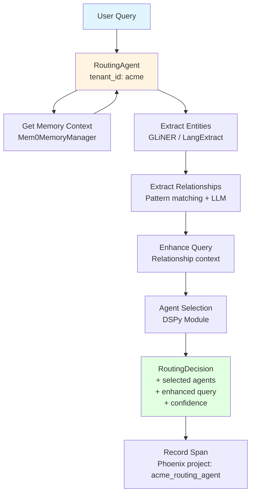
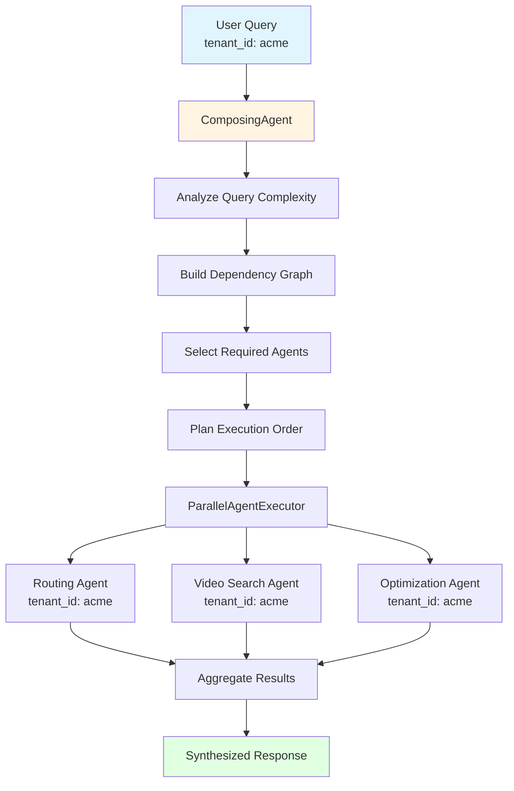
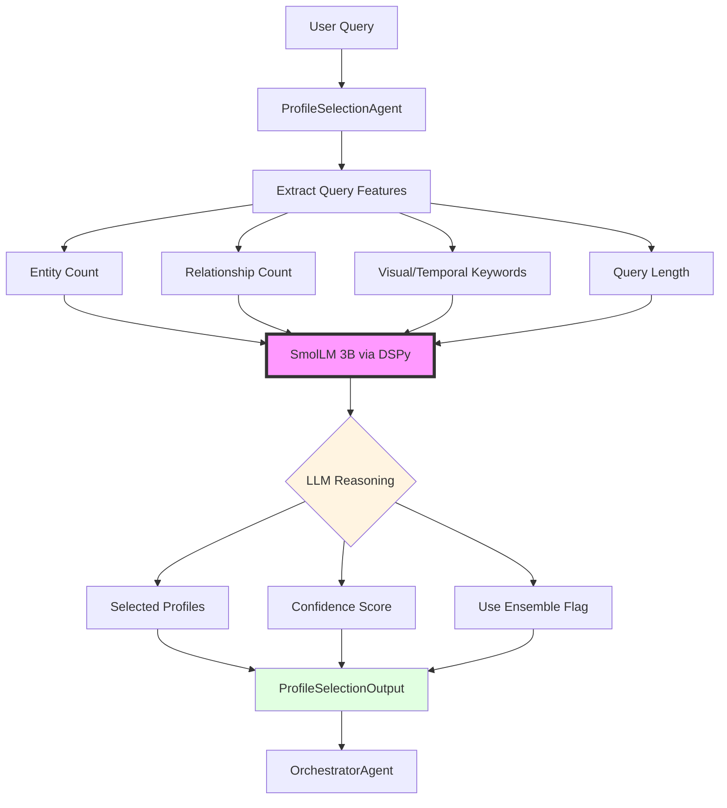
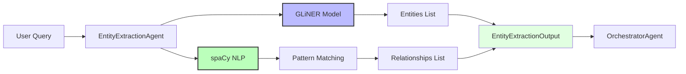
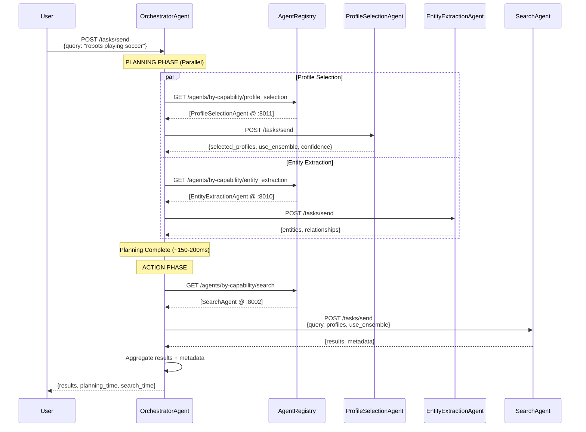
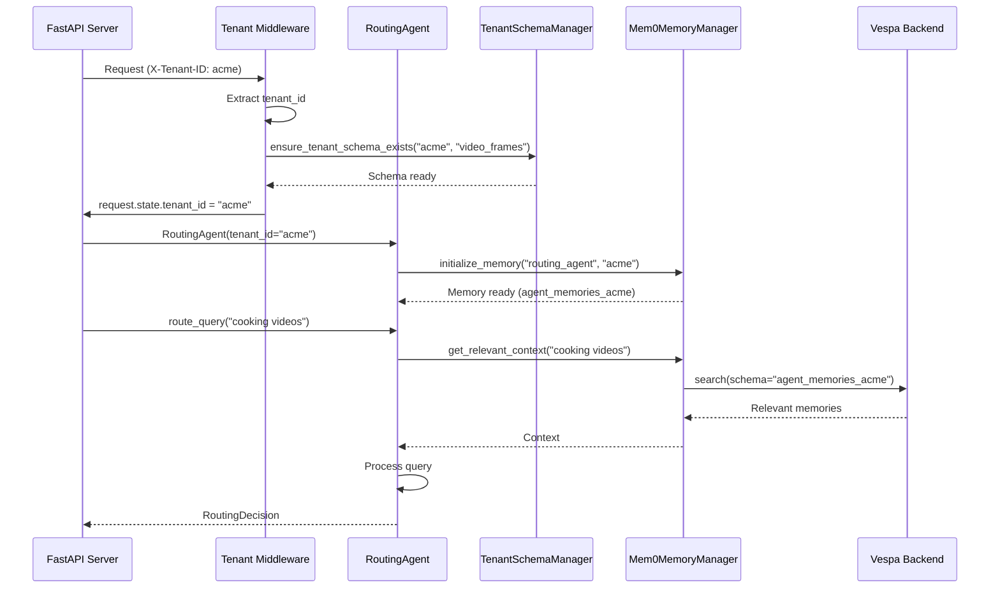
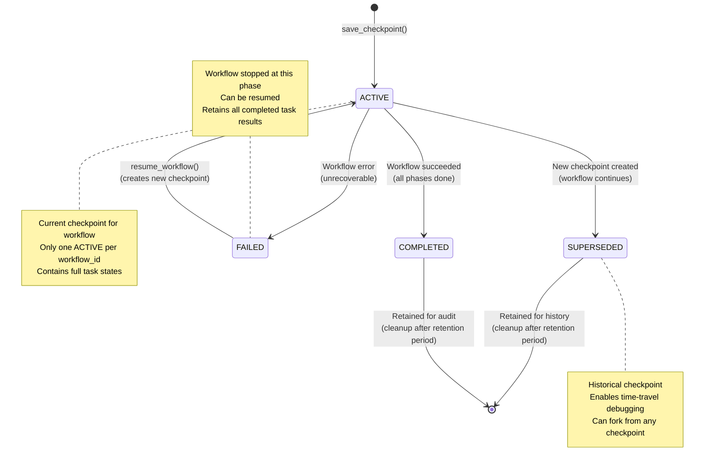

# Agents Module

**Package:** `cogniverse_agents` (Implementation Layer)
**Location:** `libs/agents/cogniverse_agents/`
**Purpose:** Agent implementations for general-purpose multi-agent AI platform with multi-tenant support
**Last Updated:** 2026-01-01

---

## Table of Contents

1. [Module Overview](#module-overview)
2. [Package Structure](#package-structure)
3. [Core Agents](#core-agents)
   - [RoutingAgent](#1-routingagent)
   - [VideoSearchAgent](#2-videosearchagent)
   - [ComposingAgent](#3-composingagent)
   - [ProfileSelectionAgent](#4-profileselectionagent)
   - [EntityExtractionAgent](#5-entityextractionagent)
   - [OrchestratorAgent](#6-orchestratoragent)
   - [SearchAgent (Ensemble Mode)](#7-searchagent-ensemble-mode)
4. [Agent Architecture](#agent-architecture)
5. [Multi-Tenant Integration](#multi-tenant-integration)
6. [Usage Examples](#usage-examples)
7. [Streaming API](#streaming-api)
8. [RLM Inference (Recursive Language Models)](#rlm-inference-recursive-language-models)
9. [Testing](#testing)
10. [Durable Execution (Workflow Checkpointing)](#durable-execution-workflow-checkpointing)

---

## Module Overview

The Agents package (`cogniverse-agents`) provides concrete agent implementations for the Cogniverse multi-agent AI platform. The architecture supports **any agent type** - content understanding agents ship by default, but web browsing, code analysis, and domain-specific agents can be integrated via the same AgentBase/A2AAgent base classes. All agents are tenant-aware and integrate with the core SDK packages.

### Key Agents

1. **RoutingAgent** - Query routing with DSPy optimization and relationship extraction
2. **VideoSearchAgent** - Multi-modal video search (ColPali, VideoPrism)
3. **ComposingAgent** - Multi-agent orchestration and workflow coordination
4. **ProfileSelectionAgent** - LLM-based intelligent backend profile selection and ensemble composition
5. **EntityExtractionAgent** - Fast entity and relationship extraction using GLiNER and spaCy
6. **OrchestratorAgent** - Two-phase workflow orchestration (planning → action) with parallel execution
7. **SearchAgent** - Enhanced with ensemble mode and RRF fusion for multi-profile queries

### Design Principles

- **Tenant-Aware**: All agents require `tenant_id` parameter
- **Memory-Enabled**: Integration with Mem0 via MemoryAwareMixin (from core)
- **Base Class Inheritance**: Extend A2AAgent[InputT, OutputT, DepsT] from cogniverse_core with type-safe generics
- **DSPy 3.0 Integration**: A2A protocol + DSPy modules for optimization
- **Streaming Support**: OpenAI-style `stream=True` parameter for progressive results
- **Production-Ready**: Health checks, graceful degradation, telemetry

### Extensibility

The agent architecture is **not limited to content understanding**. The AgentBase and A2AAgent base classes support any agent type:

- **Web Browsing Agents**: Research, scraping, monitoring
- **Code Agents**: Analysis, generation, refactoring
- **Data Agents**: Database queries, API integrations
- **Communication Agents**: Email, Slack, notifications
- **Domain-Specific Agents**: Legal, medical, financial analysis

To add a custom agent, implement `A2AAgent[InputT, OutputT, DepsT]` and register with the AgentRegistry. All agents automatically gain tenant isolation, memory, telemetry, and DSPy optimization capabilities.

### Package Dependencies

```python
# Agents package depends on:
from cogniverse_core.agents.a2a_agent import A2AAgent, A2AAgentConfig
from cogniverse_core.agents.base import AgentBase, AgentDeps, AgentInput, AgentOutput
from cogniverse_core.agents.tenant_aware_mixin import TenantAwareAgentMixin
from cogniverse_core.agents.memory_aware_mixin import MemoryAwareMixin
from cogniverse_core.agents.health_mixin import HealthMixin
from cogniverse_core.telemetry.manager import TelemetryManager
from cogniverse_foundation.config.unified_config import SystemConfig
```

---

## Package Structure

```
libs/agents/cogniverse_agents/
├── __init__.py
├── routing_agent.py                 # Main routing agent (1570 lines) ⭐ TOP LEVEL
├── video_search_agent.py            # Multi-modal video search (1373 lines) ⭐ TOP LEVEL
├── composing_agent.py               # Multi-agent orchestrator (617 lines) ⭐ TOP LEVEL
├── audio_analysis_agent.py          # Audio analysis agent
├── document_agent.py                # Document processing agent
├── image_search_agent.py            # Image search agent
├── summarizer_agent.py              # Summarization agent
├── multi_agent_orchestrator.py      # Orchestration utilities
├── dspy_agent_optimizer.py          # DSPy optimization utilities
├── ... (28 total agent files at top level)
├── routing/                         # Routing utilities and components
│   ├── __init__.py
│   ├── parallel_executor.py        # Parallel agent execution
│   ├── advanced_optimizer.py       # Advanced routing optimization
│   ├── modality_cache.py           # Query modality caching
│   ├── relationship_extraction_tools.py  # Relationship extraction
│   ├── dspy_relationship_router.py # DSPy routing module
│   ├── query_enhancement_engine.py # Query enhancement
│   └── ... (37+ utility files)
├── search/                          # Search utilities and rerankers
│   ├── __init__.py
│   ├── multi_modal_reranker.py     # Multi-modal reranking
│   ├── hybrid_reranker.py          # Hybrid reranking
│   ├── learned_reranker.py         # Learned reranking
│   └── rerankers/                   # Reranker implementations
├── orchestrator/                    # Orchestration utilities
│   ├── __init__.py
│   └── ... (orchestration components)
├── optimizer/                       # Optimization utilities
│   ├── __init__.py
│   ├── dspy_agent_optimizer.py
│   ├── router_optimizer.py
│   └── providers/                   # Optimizer providers
├── query/                           # Query processing utilities
├── results/                         # Result aggregation utilities
├── tools/                           # Agent tools
└── workflow/                        # Workflow management
```

**Total Files**: 99 Python files (28 main agents at top level + 71 utilities in subdirectories)

**Key Agent Files** (all at top level):
- `routing_agent.py`: 1570 lines
- `video_search_agent.py`: 1373 lines
- `composing_agent.py`: 617 lines

---

## Core Agents

### 1. RoutingAgent

**Location**: `libs/agents/cogniverse_agents/routing_agent.py` (top level)
**Purpose**: Intelligent query routing with relationship extraction and DSPy 3.0 optimization
**Base Classes**: `A2AAgent[RoutingInput, RoutingOutput, RoutingDeps]`, `MemoryAwareMixin`

#### Architecture



#### Class Definition

```python
# libs/agents/cogniverse_agents/routing_agent.py

from cogniverse_core.agents.a2a_agent import A2AAgent, A2AAgentConfig
from cogniverse_core.agents.base import AgentDeps, AgentInput, AgentOutput
from cogniverse_core.agents.memory_aware_mixin import MemoryAwareMixin
from cogniverse_core.telemetry.manager import TelemetryManager
from pydantic import Field
import dspy


# Type-safe input/output definitions
class RoutingInput(AgentInput):
    """Input for routing agent."""
    query: str = Field(..., description="User query to route")
    context: dict = Field(default_factory=dict, description="Optional context")


class RoutingOutput(AgentOutput):
    """Output from routing agent."""
    recommended_agent: str = Field(..., description="Recommended agent name")
    confidence: float = Field(..., description="Routing confidence")
    reasoning: str = Field(..., description="Routing reasoning")
    enhanced_query: str = Field("", description="Enhanced query with context")


class RoutingDeps(AgentDeps):
    """Dependencies for routing agent."""
    enable_relationship_extraction: bool = False
    enable_query_enhancement: bool = False
    enable_caching: bool = True


class RoutingAgent(A2AAgent[RoutingInput, RoutingOutput, RoutingDeps], MemoryAwareMixin):
    """
    Intelligent query routing with relationship extraction.

    Multi-tenant aware - each tenant gets isolated routing context.
    Type-safe with generic input/output/deps types.
    """

    def __init__(self, deps: RoutingDeps, port: int = 8001):
        """
        Initialize routing agent for specific tenant.

        Args:
            deps: RoutingDeps with tenant_id and configuration
            port: A2A HTTP server port
        """
        config = A2AAgentConfig(
            agent_name="routing_agent",
            agent_description="Intelligent query routing with DSPy optimization",
            capabilities=["routing", "query_enhancement"],
            port=port,
        )
        super().__init__(deps=deps, config=config, dspy_module=None)

        # Initialize telemetry (tenant-scoped)
        self.telemetry = TelemetryManager.get_instance(
            tenant_id=deps.tenant_id,
            project_name="routing_agent"
        )  # Creates project: {tenant_id}_routing_agent

        # Initialize memory (tenant-scoped)
        self.initialize_memory(
            agent_name="routing_agent",
            tenant_id=deps.tenant_id
        )

        # DSPy modules (shared, but decisions per-tenant)
        self._init_dspy_modules()

    async def process(self, input: RoutingInput) -> RoutingOutput:
        """Type-safe processing with IDE autocomplete support."""
        # Implementation handles routing logic
        ...
```

#### Key Methods

**`route_query(query: str, context: Optional[Dict] = None) -> RoutingDecision`**

Main routing entry point.

```python
async def route_query(
    self,
    query: str,
    context: Optional[Dict] = None
) -> RoutingDecision:
    """
    Route query with entity/relationship extraction.

    Args:
        query: User query string
        context: Optional context (user prefs, session data)

    Returns:
        RoutingDecision with selected agents and enhanced query
    """
    with self.telemetry.trace("route_query") as span:
        span.set_attribute("tenant_id", self.tenant_id)
        span.set_attribute("query", query)

        # 1. Get memory context
        memory_context = self.get_relevant_context(query, top_k=5)

        # 2. Extract entities
        entities = self._extract_entities(query)

        # 3. Extract relationships
        relationships = self._extract_relationships(query, entities)

        # 4. Enhance query
        enhanced_query = self._enhance_query(query, entities, relationships)

        # 5. Select agents (DSPy)
        decision = self._select_agents(enhanced_query, entities, relationships)

        # 6. Record decision
        span.set_attribute("recommended_agent", decision.recommended_agent)
        span.set_attribute("confidence", decision.confidence)

        return decision
```

**`_extract_entities(query: str) -> List[Dict]`**

Extract named entities using GLiNER or LangExtract.

```python
def _extract_entities(self, query: str) -> List[Dict]:
    """
    Extract named entities from query.

    Returns:
        List of entities: [{"text": "Einstein", "type": "PERSON"}, ...]
    """
    # Use GLiNER for fast entity extraction
    from gliner import GLiNER

    model = GLiNER.from_pretrained("urchade/gliner_multi-v2.1")
    entities = model.predict_entities(
        query,
        labels=["person", "organization", "location", "topic", "date"]
    )

    return [
        {"text": e["text"], "type": e["label"].upper()}
        for e in entities
    ]
```

**`_extract_relationships(query: str, entities: List[Dict]) -> List[Dict]`**

Extract relationships between entities.

```python
def _extract_relationships(
    self,
    query: str,
    entities: List[Dict]
) -> List[Dict]:
    """
    Extract relationships between entities.

    Returns:
        List: [{"subject": "Einstein", "relation": "discusses", "object": "physics"}, ...]
    """
    # Pattern-based extraction + LLM fallback
    relationships = []

    # Pattern matching for common relationships
    patterns = {
        "discusses": r"(\w+) discusses (\w+)",
        "works_on": r"(\w+) works on (\w+)",
        "related_to": r"(\w+) related to (\w+)"
    }

    for relation_type, pattern in patterns.items():
        matches = re.finditer(pattern, query, re.IGNORECASE)
        for match in matches:
            relationships.append({
                "subject": match.group(1),
                "relation": relation_type,
                "object": match.group(2)
            })

    return relationships
```

#### Configuration

```python
# Routing agent configuration
routing_agent_config = {
    "dspy_enabled": True,
    "grpo_enabled": True,
    "confidence_threshold": 0.7,
    "memory_enabled": True,
    "entity_extraction_method": "gliner",  # or "langextract", "llm"
    "relationship_extraction_enabled": True,
    "cache_ttl_seconds": 300
}
```

---

### 2. VideoSearchAgent

**Location**: `libs/agents/cogniverse_agents/video_search_agent.py` (top level)
**Purpose**: Multi-modal video search with ColPali and VideoPrism embeddings
**Base Classes**: `A2AAgent[VideoSearchInput, VideoSearchOutput, VideoSearchDeps]`, `MemoryAwareMixin`

#### Multi-Modal Support

```mermaid
graph LR
    Input[Input] --> TextQuery[Text Query]
    Input --> VideoFile[Video File]
    Input --> ImageFile[Image File]

    TextQuery --> ColPaliEncode[ColPali Text Encoder]
    TextQuery --> VideoPrismEncode[VideoPrism Text Encoder]

    VideoFile --> FrameExtract[Extract Frames<br/>1 FPS]
    FrameExtract --> VideoEncode[Encode Frames<br/>ColPali/VideoPrism]

    ImageFile --> ImageEncode[Encode Image<br/>ColPali/VideoPrism]

    ColPaliEncode --> VespaSearch[Vespa Search<br/>Schema: video_frames_{tenant_id}]
    VideoPrismEncode --> VespaSearch
    VideoEncode --> VespaSearch
    ImageEncode --> VespaSearch

    VespaSearch --> Rerank[Rerank Results<br/>Relationship boost]
    Rerank --> Results[Ranked Results]
```

#### Class Definition

```python
# libs/agents/cogniverse_agents/video_search_agent.py

from cogniverse_core.agents.a2a_agent import A2AAgent, A2AAgentConfig
from cogniverse_core.agents.base import AgentDeps, AgentInput, AgentOutput
from cogniverse_core.agents.memory_aware_mixin import MemoryAwareMixin
from cogniverse_vespa.vespa_search_client import VespaSearchClient
from cogniverse_vespa.tenant_schema_manager import TenantSchemaManager
from pydantic import Field


class VideoSearchInput(AgentInput):
    """Input for video search."""
    query: str = Field(..., description="Search query")
    top_k: int = Field(10, description="Number of results")
    modality: str = Field("text", description="Input modality")


class VideoSearchOutput(AgentOutput):
    """Output from video search."""
    results: list = Field(default_factory=list, description="Search results")
    metadata: dict = Field(default_factory=dict, description="Search metadata")


class VideoSearchDeps(AgentDeps):
    """Dependencies for video search agent."""
    vespa_host: str = "localhost"
    vespa_port: int = 8080
    profile: str = "video_colpali_smol500_mv_frame"


class VideoSearchAgent(A2AAgent[VideoSearchInput, VideoSearchOutput, VideoSearchDeps], MemoryAwareMixin):
    """
    Multi-modal video search agent with tenant isolation.

    Supports:
    - Text-to-video search (ColPali, VideoPrism)
    - Video-to-video search (similarity)
    - Image-to-video search (visual similarity)
    """

    def __init__(self, deps: VideoSearchDeps, port: int = 8002):
        """
        Initialize video search agent.

        Args:
            deps: VideoSearchDeps with tenant_id and configuration
            port: A2A HTTP server port
        """
        config = A2AAgentConfig(
            agent_name="video_search_agent",
            agent_description="Multi-modal video search with ColPali/VideoPrism",
            capabilities=["video_search", "multimodal_search"],
            port=port,
        )
        super().__init__(deps=deps, config=config, dspy_module=None)

        # Ensure tenant schema exists
        schema_manager = TenantSchemaManager(
            vespa_url=deps.vespa_host,
            vespa_port=deps.vespa_port
        )
        schema_manager.ensure_tenant_schema_exists(deps.tenant_id, deps.profile)

        # Initialize Vespa client with tenant schema
        tenant_schema = schema_manager.get_tenant_schema_name(deps.tenant_id, deps.profile)
        self.vespa_client = VespaSearchClient(
            host=deps.vespa_host,
            port=deps.vespa_port,
            schema=tenant_schema  # e.g., video_colpali_smol500_mv_frame_acme
        )

        # Initialize telemetry
        self.telemetry = TelemetryManager.get_instance(
            tenant_id=deps.tenant_id,
            project_name="video_search"
        )

        # Initialize memory
        self.initialize_memory("video_search", deps.tenant_id)

    async def process(self, input: VideoSearchInput) -> VideoSearchOutput:
        """Type-safe search processing."""
        results = await self.search_by_text(input.query, input.top_k)
        return VideoSearchOutput(results=results)
```

#### Key Methods

**`search_by_text(query: str, top_k: int = 10) -> List[Dict]`**

Text-to-video search.

```python
def search_by_text(
    self,
    query: str,
    top_k: int = 10,
    ranking: str = "hybrid_binary_bm25_no_description"
) -> List[Dict]:
    """
    Search videos by text query.

    Args:
        query: Text query string
        top_k: Number of results
        ranking: Ranking profile name

    Returns:
        List of video results with scores
    """
    with self.telemetry.trace("search_by_text") as span:
        span.set_attribute("tenant_id", self.tenant_id)
        span.set_attribute("query", query)
        span.set_attribute("top_k", top_k)

        # Get memory context
        memory_context = self.get_relevant_context(query, top_k=3)

        # Enhance query with context
        if memory_context:
            enhanced_query = f"{query} {memory_context}"
        else:
            enhanced_query = query

        # Search Vespa (tenant schema)
        results = self.vespa_client.search(
            query=enhanced_query,
            top_k=top_k,
            ranking=ranking
        )

        # Remember successful search
        if results:
            self.remember_success(
                query=query,
                result={"count": len(results)},
                metadata={"top_k": top_k}
            )

        span.set_attribute("result_count", len(results))
        return results
```

**`search_by_video(video_data: bytes, filename: str, top_k: int = 10) -> List[Dict]`**

Video-to-video similarity search.

```python
def search_by_video(
    self,
    video_data: bytes,
    filename: str,
    top_k: int = 10
) -> List[Dict]:
    """
    Search videos by video similarity.

    Args:
        video_data: Video file bytes
        filename: Original filename
        top_k: Number of results

    Returns:
        Similar videos
    """
    with self.telemetry.trace("search_by_video") as span:
        span.set_attribute("tenant_id", self.tenant_id)
        span.set_attribute("filename", filename)

        # 1. Save video to temp file
        temp_path = Path(f"/tmp/{self.tenant_id}_{filename}")
        temp_path.write_bytes(video_data)

        # 2. Extract frames
        frames = self._extract_frames(temp_path, fps=1)
        span.set_attribute("frame_count", len(frames))

        # 3. Encode frames
        frame_embeddings = self._encode_frames(frames)

        # 4. Search with embeddings
        results = self.vespa_client.search_by_embedding(
            embeddings=frame_embeddings,
            top_k=top_k
        )

        # 5. Cleanup
        temp_path.unlink()

        return results
```

#### Multi-Tenant Search Flow

```python
# Example: Two tenants searching independently

# Tenant A: acme
agent_acme = VideoSearchAgent(
    tenant_id="acme",
    profile="video_colpali_smol500_mv_frame"
)
results_acme = await agent_acme.search_by_text("cooking videos")
# Searches schema: video_colpali_smol500_mv_frame_acme
# Only acme's videos returned

# Tenant B: startup
agent_startup = VideoSearchAgent(
    tenant_id="startup",
    profile="video_colpali_smol500_mv_frame"
)
results_startup = await agent_startup.search_by_text("cooking videos")
# Searches schema: video_colpali_smol500_mv_frame_startup
# Only startup's videos returned

# Physical isolation - no cross-tenant data access possible
```

---

### 3. ComposingAgent

**Location**: `libs/agents/cogniverse_agents/composing_agent.py` (top level)
**Purpose**: Multi-agent workflow orchestration and coordination
**Base Classes**: `A2AAgent[ComposingInput, ComposingOutput, ComposingDeps]`

#### Architecture



#### Class Definition

```python
# libs/agents/cogniverse_agents/composing_agent.py

from cogniverse_core.agents.a2a_agent import A2AAgent, A2AAgentConfig
from cogniverse_core.agents.base import AgentDeps, AgentInput, AgentOutput
from cogniverse_agents.routing_agent import RoutingAgent, RoutingDeps
from cogniverse_agents.video_search_agent import VideoSearchAgent, VideoSearchDeps
from cogniverse_agents.routing.parallel_executor import ParallelAgentExecutor
from pydantic import Field


class ComposingInput(AgentInput):
    """Input for composing agent."""
    query: str = Field(..., description="User query")
    options: dict = Field(default_factory=dict, description="Processing options")


class ComposingOutput(AgentOutput):
    """Output from composing agent."""
    results: list = Field(default_factory=list, description="Aggregated results")
    routing_decision: dict = Field(default_factory=dict, description="Routing decision")
    confidence: float = Field(0.0, description="Overall confidence")


class ComposingDeps(AgentDeps):
    """Dependencies for composing agent."""
    max_concurrent_agents: int = 10


class ComposingAgent(A2AAgent[ComposingInput, ComposingOutput, ComposingDeps]):
    """
    Orchestrates multi-agent workflows with tenant context.

    Coordinates execution of routing, search, and optimization agents.
    """

    def __init__(self, deps: ComposingDeps, port: int = 8000):
        config = A2AAgentConfig(
            agent_name="composing_agent",
            agent_description="Multi-agent workflow orchestration",
            capabilities=["orchestration", "coordination"],
            port=port,
        )
        super().__init__(deps=deps, config=config, dspy_module=None)

        # Initialize sub-agents (all tenant-aware via deps)
        routing_deps = RoutingDeps(tenant_id=deps.tenant_id)
        self.routing_agent = RoutingAgent(deps=routing_deps)

        video_deps = VideoSearchDeps(tenant_id=deps.tenant_id)
        self.video_agent = VideoSearchAgent(deps=video_deps)

        # Parallel executor
        self.parallel_executor = ParallelAgentExecutor(
            max_concurrent_agents=deps.max_concurrent_agents
        )

        # Telemetry
        self.telemetry = TelemetryManager.get_instance(
            tenant_id=deps.tenant_id,
            project_name="composing_agent"
        )
```

#### Key Methods

**`process_query(query: str, options: Dict) -> Dict`**

Orchestrate multi-agent query processing.

```python
async def process_query(
    self,
    query: str,
    options: Optional[Dict] = None
) -> Dict:
    """
    Process query through multi-agent workflow.

    Args:
        query: User query
        options: Processing options (e.g., include_summary, max_results)

    Returns:
        Synthesized response with results from all agents
    """
    with self.telemetry.trace("process_query") as span:
        span.set_attribute("tenant_id", self.tenant_id)
        span.set_attribute("query", query)

        # 1. Routing decision
        routing_decision = await self.routing_agent.route_query(query)

        # 2. Prepare agent tasks
        agent_tasks = []

        if routing_decision.recommended_agent == "video_search":
            agent_tasks.append(
                ("video_search", routing_decision.enhanced_query, {
                    "top_k": options.get("max_results", 10)
                })
            )

        # 3. Execute agents in parallel
        results = await self.parallel_executor.execute_agents_parallel(
            agent_tasks,
            timeout_seconds=30.0,
            agent_caller=self._call_agent
        )

        # 4. Synthesize response
        response = {
            "tenant_id": self.tenant_id,
            "query": query,
            "routing_decision": routing_decision,
            "results": results,
            "confidence": routing_decision.confidence
        }

        return response
```

---

### 4. ProfileSelectionAgent

**Location**: `libs/agents/cogniverse_agents/profile_selection_agent.py`
**Purpose**: LLM-based intelligent backend profile selection and ensemble composition
**Base Classes**: `A2AAgent[ProfileSelectionInput, ProfileSelectionOutput, ProfileSelectionDeps]`
**Port**: 8011

#### Overview

ProfileSelectionAgent uses small language models (SmolLM 3B or Qwen 2.5 3B) via DSPy to intelligently select which backend search profiles to use for a given query. It can recommend single profile searches or ensemble searches with multiple profiles.

**Key Capabilities**:
- Analyze query complexity (entities, relationships, keywords)
- Match query characteristics to profile strengths
- Recommend single profile or ensemble mode
- Provide reasoning and confidence scores

#### Architecture



#### DSPy Signature

```python
# libs/agents/cogniverse_agents/profile_selection_agent.py

import dspy

class ProfileSelectionSignature(dspy.Signature):
    """
    Analyze query and select optimal backend profile(s) for search.

    Consider query complexity, entities, relationships, and available profiles.
    Recommend single profile for simple queries, ensemble for complex queries.
    """

    # Inputs
    query: str = dspy.InputField(
        desc="User query text to analyze"
    )
    entities: str = dspy.InputField(
        desc="Extracted entities from query (JSON array)"
    )
    relationships: str = dspy.InputField(
        desc="Extracted relationships from query (JSON array)"
    )
    available_profiles: str = dspy.InputField(
        desc="Available backend profiles with capabilities (JSON)"
    )

    # Outputs
    selected_profiles: list[str] = dspy.OutputField(
        desc="List of 1-3 profile names to use (e.g., ['colpali', 'videoprism'])"
    )
    use_ensemble: bool = dspy.OutputField(
        desc="True if multiple profiles should be combined with RRF fusion"
    )
    reasoning: str = dspy.OutputField(
        desc="Explanation of why these profiles were selected"
    )
    confidence: float = dspy.OutputField(
        desc="Confidence score 0.0-1.0 for this selection"
    )
```

#### Class Definition

```python
from cogniverse_core.agents.a2a_agent import A2AAgent, A2AAgentConfig
from cogniverse_core.agents.base import AgentDeps, AgentInput, AgentOutput
from pydantic import Field
import dspy


class ProfileSelectionInput(AgentInput):
    """Input for profile selection."""
    query: str = Field(..., description="Query to analyze")
    entities: list = Field(default_factory=list, description="Extracted entities")
    available_profiles: list = Field(default_factory=list, description="Available profiles")


class ProfileSelectionOutput(AgentOutput):
    """Output from profile selection."""
    selected_profiles: list = Field(default_factory=list, description="Selected profile names")
    use_ensemble: bool = Field(False, description="Whether to use ensemble mode")
    reasoning: str = Field("", description="Selection reasoning")
    confidence: float = Field(0.0, description="Selection confidence")


class ProfileSelectionDeps(AgentDeps):
    """Dependencies for profile selection agent."""
    model: str = "ollama/smollm2:latest"


class ProfileSelectionAgent(A2AAgent[ProfileSelectionInput, ProfileSelectionOutput, ProfileSelectionDeps]):
    """
    Intelligent profile selection agent using DSPy and small LLMs.

    Uses SmolLM 3B or Qwen 2.5 3B to analyze queries and recommend
    optimal backend profiles for search.
    """

    def __init__(self, deps: ProfileSelectionDeps, port: int = 8011):
        """
        Initialize profile selection agent.

        Args:
            deps: ProfileSelectionDeps with tenant_id and model config
            port: A2A HTTP server port
        """
        # Configure DSPy with Ollama
        lm = dspy.LM(
            model=deps.model,
            api_base="http://localhost:11434",
            api_key="ollama"
        )
        dspy.configure(lm=lm)

        # Create DSPy module
        self.profile_selector = dspy.ChainOfThought(ProfileSelectionSignature)

        config = A2AAgentConfig(
            agent_name="profile_selection_agent",
            agent_description="Intelligent backend profile selection for multi-modal search",
            capabilities=["profile_selection", "ensemble_composition"],
            port=port,
        )
        super().__init__(deps=deps, config=config, dspy_module=self.profile_selector)

    async def process(self, input: ProfileSelectionInput) -> ProfileSelectionOutput:
        """Type-safe profile selection."""
        result = self.profile_selector(
            query=input.query,
            entities=input.entities,
            available_profiles=input.available_profiles
        )
        return ProfileSelectionOutput(
            selected_profiles=result.selected_profiles,
            use_ensemble=result.use_ensemble,
            reasoning=result.reasoning,
            confidence=result.confidence
        )
```

#### Key Methods

**`select_profiles(query: str, entities: List, relationships: List) -> ProfileSelectionOutput`**

Main profile selection method.

```python
async def select_profiles(
    self,
    query: str,
    entities: List[Dict],
    relationships: List[Dict],
    available_profiles: List[str]
) -> ProfileSelectionOutput:
    """
    Select optimal profiles for query.

    Args:
        query: User query string
        entities: Extracted entities
        relationships: Extracted relationships
        available_profiles: Available backend profiles

    Returns:
        ProfileSelectionOutput with selected profiles and metadata
    """
    # Prepare inputs for DSPy
    entities_json = json.dumps(entities)
    relationships_json = json.dumps(relationships)
    profiles_json = json.dumps(self._get_profile_capabilities())

    # Call DSPy module
    result = self.profile_selector(
        query=query,
        entities=entities_json,
        relationships=relationships_json,
        available_profiles=profiles_json
    )

    # Parse output
    return ProfileSelectionOutput(
        selected_profiles=result.selected_profiles,
        use_ensemble=result.use_ensemble,
        reasoning=result.reasoning,
        confidence=result.confidence
    )
```

**`_get_profile_capabilities() -> Dict`**

Returns profile strengths for LLM decision making.

```python
def _get_profile_capabilities(self) -> Dict[str, Dict]:
    """
    Get profile capabilities for selection.

    Returns:
        Dictionary mapping profile names to capabilities
    """
    return {
        "colpali": {
            "strengths": ["visual_content", "ocr", "diagrams", "charts"],
            "best_for": "Visual understanding and text in images"
        },
        "videoprism": {
            "strengths": ["temporal_understanding", "action_recognition", "scenes"],
            "best_for": "Video dynamics and temporal reasoning"
        },
        "qwen": {
            "strengths": ["cross_modal", "text_video_alignment", "reasoning"],
            "best_for": "Complex cross-modal queries"
        }
    }
```

#### Configuration

```python
# Profile selection agent configuration
{
    "profile_selection_agent": {
        "model": "ollama/smollm2:latest",  # or "ollama/qwen2.5:3b"
        "port": 8011,
        "confidence_threshold": 0.7,
        "max_profiles_per_ensemble": 3,
        "default_profile": "colpali",
        "agent_registry_url": "http://localhost:8000"
    }
}
```

#### Decision Criteria

**Ensemble Mode Triggers**:
- Query has >3 entities
- Query has >2 relationships
- Query contains both visual AND temporal keywords
- LLM confidence > 0.7 for multiple profiles
- Complex multi-aspect queries

**Single Profile Selection**:
- Simple queries (<2 entities)
- Single dominant modality
- Low query complexity
- High confidence for one specific profile

#### API Usage

**A2A Task Message**:

```json
{
  "id": "task_001",
  "messages": [
    {
      "role": "user",
      "parts": [
        {
          "type": "text",
          "text": "show me robots playing soccer in tournaments"
        },
        {
          "type": "data",
          "data": {
            "entities": [
              {"text": "robots", "type": "CONCEPT"},
              {"text": "soccer", "type": "SPORT"},
              {"text": "tournaments", "type": "EVENT"}
            ],
            "relationships": [
              {"subject": "robots", "relation": "playing", "object": "soccer"}
            ],
            "available_profiles": ["colpali", "videoprism", "qwen"]
          }
        }
      ]
    }
  ]
}
```

**Response**:

```json
{
  "id": "task_001",
  "messages": [
    {
      "role": "assistant",
      "parts": [
        {
          "type": "data",
          "data": {
            "selected_profiles": ["colpali", "videoprism"],
            "use_ensemble": true,
            "reasoning": "Query has multiple entities (robots, soccer, tournaments) and visual+action components. ColPali for visual understanding of robots, VideoPrism for action recognition (playing soccer).",
            "confidence": 0.85
          }
        }
      ]
    }
  ]
}
```

---

### 5. EntityExtractionAgent

**Location**: `libs/agents/cogniverse_agents/entity_extraction_agent.py`
**Purpose**: Fast entity and relationship extraction for query enhancement
**Base Classes**: `A2AAgent[EntityExtractionInput, EntityExtractionOutput, EntityExtractionDeps]`
**Port**: 8010

#### Overview

EntityExtractionAgent provides fast Named Entity Recognition (NER) and relationship extraction using GLiNER and spaCy. Unlike ProfileSelectionAgent which uses LLMs, this agent uses lightweight models optimized for speed.

**Key Capabilities**:
- Named entity recognition (GLiNER)
- Relationship extraction (spaCy + patterns)
- Multi-entity type support (person, organization, location, concept, date)
- Sub-100ms latency for typical queries

#### Architecture



#### Class Definition

```python
from cogniverse_core.agents.a2a_agent import A2AAgent, A2AAgentConfig
from cogniverse_core.agents.base import AgentDeps, AgentInput, AgentOutput
from pydantic import Field
from gliner import GLiNER
import spacy


class EntityExtractionInput(AgentInput):
    """Input for entity extraction."""
    query: str = Field(..., description="Query to extract entities from")


class EntityExtractionOutput(AgentOutput):
    """Output from entity extraction."""
    entities: list = Field(default_factory=list, description="Extracted entities")
    relationships: list = Field(default_factory=list, description="Extracted relationships")
    entity_count: int = Field(0, description="Number of entities found")
    relationship_count: int = Field(0, description="Number of relationships found")


class EntityExtractionDeps(AgentDeps):
    """Dependencies for entity extraction agent."""
    gliner_model: str = "urchade/gliner_multi-v2.1"
    spacy_model: str = "en_core_web_sm"


class EntityExtractionAgent(A2AAgent[EntityExtractionInput, EntityExtractionOutput, EntityExtractionDeps]):
    """
    Fast entity and relationship extraction agent.

    Uses GLiNER for NER and spaCy for relationship extraction.
    Optimized for low latency (<100ms typical).
    """

    def __init__(self, deps: EntityExtractionDeps, port: int = 8010):
        """
        Initialize entity extraction agent.

        Args:
            deps: EntityExtractionDeps with tenant_id and model config
            port: A2A HTTP server port
        """
        # Load GLiNER (lazy loading on first use)
        self._gliner_model = None
        self._gliner_model_name = deps.gliner_model

        # Load spaCy
        self._nlp = spacy.load(deps.spacy_model)

        config = A2AAgentConfig(
            agent_name="entity_extraction_agent",
            agent_description="Fast entity and relationship extraction for query enhancement",
            capabilities=["entity_extraction", "relationship_extraction"],
            port=port,
        )
        super().__init__(deps=deps, config=config, dspy_module=None)

    async def process(self, input: EntityExtractionInput) -> EntityExtractionOutput:
        """Type-safe entity extraction."""
        entities = self._extract_entities(input.query)
        relationships = self._extract_relationships(input.query, entities)
        return EntityExtractionOutput(
            entities=entities,
            relationships=relationships,
            entity_count=len(entities),
            relationship_count=len(relationships)
        )
```

#### Key Methods

**`extract(query: str) -> EntityExtractionOutput`**

Main extraction method.

```python
async def extract(self, query: str) -> EntityExtractionOutput:
    """
    Extract entities and relationships from query.

    Args:
        query: User query string

    Returns:
        EntityExtractionOutput with entities and relationships
    """
    # Extract entities
    entities = self._extract_entities(query)

    # Extract relationships
    relationships = self._extract_relationships(query, entities)

    return EntityExtractionOutput(
        entities=entities,
        relationships=relationships,
        entity_count=len(entities),
        relationship_count=len(relationships)
    )
```

**`_extract_entities(query: str) -> List[Dict]`**

GLiNER-based entity extraction.

```python
def _extract_entities(self, query: str) -> List[Dict]:
    """
    Extract named entities using GLiNER.

    Returns:
        List of entities with text and type
    """
    # Lazy load GLiNER model
    if self._gliner_model is None:
        from gliner import GLiNER
        self._gliner_model = GLiNER.from_pretrained(self._gliner_model_name)

    # Predict entities
    entities = self._gliner_model.predict_entities(
        query,
        labels=["person", "organization", "location", "concept", "date", "event"]
    )

    return [
        {
            "text": e["text"],
            "type": e["label"].upper(),
            "score": e.get("score", 1.0)
        }
        for e in entities
    ]
```

**`_extract_relationships(query: str, entities: List[Dict]) -> List[Dict]`**

Pattern-based relationship extraction.

```python
def _extract_relationships(
    self,
    query: str,
    entities: List[Dict]
) -> List[Dict]:
    """
    Extract relationships between entities.

    Uses spaCy dependency parsing and pattern matching.
    """
    relationships = []

    # spaCy processing
    doc = self._nlp(query)

    # Pattern matching for common relationships
    patterns = {
        "playing": r"(\w+) playing (\w+)",
        "discussing": r"(\w+) discuss(?:ing|es) (\w+)",
        "located_in": r"(\w+) in (\w+)",
        "works_on": r"(\w+) works on (\w+)"
    }

    for relation_type, pattern in patterns.items():
        import re
        matches = re.finditer(pattern, query, re.IGNORECASE)
        for match in matches:
            relationships.append({
                "subject": match.group(1),
                "relation": relation_type,
                "object": match.group(2)
            })

    return relationships
```

#### Configuration

```python
# Entity extraction agent configuration
{
    "entity_extraction_agent": {
        "gliner_model": "urchade/gliner_multi-v2.1",
        "spacy_model": "en_core_web_sm",
        "port": 8010,
        "entity_types": ["person", "organization", "location", "concept", "date", "event"],
        "agent_registry_url": "http://localhost:8000"
    }
}
```

#### API Usage

**A2A Task Message**:

```json
{
  "id": "task_002",
  "messages": [
    {
      "role": "user",
      "parts": [
        {
          "type": "text",
          "text": "show me robots playing soccer in tournaments"
        }
      ]
    }
  ]
}
```

**Response**:

```json
{
  "id": "task_002",
  "messages": [
    {
      "role": "assistant",
      "parts": [
        {
          "type": "data",
          "data": {
            "entities": [
              {"text": "robots", "type": "CONCEPT", "score": 0.95},
              {"text": "soccer", "type": "EVENT", "score": 0.89},
              {"text": "tournaments", "type": "EVENT", "score": 0.92}
            ],
            "relationships": [
              {"subject": "robots", "relation": "playing", "object": "soccer"}
            ],
            "entity_count": 3,
            "relationship_count": 1
          }
        }
      ]
    }
  ]
}
```

---

### 6. OrchestratorAgent

**Location**: `libs/agents/cogniverse_agents/orchestrator_agent.py`
**Purpose**: Multi-agent workflow coordination with planning and action phases
**Base Classes**: `A2AAgent[OrchestrationInput, OrchestrationOutput, OrchestratorDeps]`
**Port**: 8001

#### Overview

OrchestratorAgent coordinates complex multi-agent workflows by dividing execution into two phases:
1. **Planning Phase**: Parallel execution of ProfileSelectionAgent and EntityExtractionAgent
2. **Action Phase**: Sequential or parallel execution of SearchAgent based on planning results

**Key Capabilities**:
- Two-phase workflow orchestration (planning → action)
- Parallel agent execution in planning phase
- Agent discovery via AgentRegistry
- Result aggregation and metadata tracking
- Multi-tenant support

#### Architecture



#### Class Definition

```python
from cogniverse_core.agents.a2a_agent import A2AAgent, A2AAgentConfig
from cogniverse_core.agents.base import AgentDeps, AgentInput, AgentOutput
from cogniverse_agents.agent_registry import AgentRegistry
from pydantic import Field
import asyncio


class OrchestrationInput(AgentInput):
    """Input for orchestration."""
    query: str = Field(..., description="Query to orchestrate")
    options: dict = Field(default_factory=dict, description="Orchestration options")


class OrchestrationOutput(AgentOutput):
    """Output from orchestration."""
    results: list = Field(default_factory=list, description="Search results")
    metadata: dict = Field(default_factory=dict, description="Orchestration metadata")


class OrchestratorDeps(AgentDeps):
    """Dependencies for orchestrator agent."""
    agent_registry_url: str = "http://localhost:8000"


class OrchestratorAgent(A2AAgent[OrchestrationInput, OrchestrationOutput, OrchestratorDeps]):
    """
    Multi-agent workflow orchestrator with planning and action phases.

    Coordinates ProfileSelectionAgent, EntityExtractionAgent, and SearchAgent
    to execute complex multi-modal queries.
    """

    def __init__(self, deps: OrchestratorDeps, port: int = 8001):
        """
        Initialize orchestrator agent.

        Args:
            deps: OrchestratorDeps with tenant_id and registry URL
            port: A2A HTTP server port
        """
        # Agent registry for discovery
        self.registry = AgentRegistry(base_url=deps.agent_registry_url)

        config = A2AAgentConfig(
            agent_name="orchestrator_agent",
            agent_description="Multi-agent workflow orchestration with planning and action phases",
            capabilities=["orchestration", "workflow_management"],
            port=port,
        )
        super().__init__(deps=deps, config=config, dspy_module=None)

    async def process(self, input: OrchestrationInput) -> OrchestrationOutput:
        """Type-safe orchestration processing."""
        result = await self.orchestrate(input.query, input.options)
        return OrchestrationOutput(
            results=result.results,
            metadata=result.metadata
        )
```

#### Key Methods

**`orchestrate(query: str, options: Dict) -> OrchestrationResult`**

Main orchestration method.

```python
async def orchestrate(
    self,
    query: str,
    options: Optional[Dict] = None
) -> OrchestrationResult:
    """
    Orchestrate multi-agent workflow for query.

    Args:
        query: User query string
        options: Optional parameters (top_k, modality, etc.)

    Returns:
        OrchestrationResult with final results and metadata
    """
    start_time = time.time()
    options = options or {}

    # PHASE 1: PLANNING (Parallel)
    planning_start = time.time()
    planning_results = await self._execute_planning_phase(query)
    planning_time = time.time() - planning_start

    # Extract planning outputs
    profile_selection = planning_results["profile_selection"]
    entities = planning_results["entity_extraction"]["entities"]
    relationships = planning_results["entity_extraction"]["relationships"]

    # PHASE 2: ACTION
    action_start = time.time()
    search_results = await self._execute_search_phase(
        query=query,
        profiles=profile_selection["selected_profiles"],
        use_ensemble=profile_selection["use_ensemble"],
        modality=options.get("modality", "video"),
        limit=options.get("top_k", 20)
    )
    action_time = time.time() - action_start

    # Aggregate results
    total_time = time.time() - start_time

    return OrchestrationResult(
        results=search_results["results"],
        metadata={
            "planning_time_ms": planning_time * 1000,
            "action_time_ms": action_time * 1000,
            "total_time_ms": total_time * 1000,
            "profiles_used": profile_selection["selected_profiles"],
            "use_ensemble": profile_selection["use_ensemble"],
            "entities": entities,
            "relationships": relationships,
            "confidence": profile_selection["confidence"]
        }
    )
```

**`_execute_planning_phase(query: str) -> Dict`**

Execute planning agents in parallel.

```python
async def _execute_planning_phase(self, query: str) -> Dict:
    """
    Execute planning phase with parallel agent execution.

    Runs ProfileSelectionAgent and EntityExtractionAgent concurrently.
    """
    # Discover agents
    profile_agent = await self.registry.get_agent_by_capability("profile_selection")
    entity_agent = await self.registry.get_agent_by_capability("entity_extraction")

    # Execute in parallel
    profile_task = self._call_agent(profile_agent["url"], {"query": query})
    entity_task = self._call_agent(entity_agent["url"], {"query": query})

    profile_result, entity_result = await asyncio.gather(
        profile_task,
        entity_task
    )

    return {
        "profile_selection": profile_result,
        "entity_extraction": entity_result
    }
```

**`_execute_search_phase(query, profiles, use_ensemble) -> Dict`**

Execute search agent.

```python
async def _execute_search_phase(
    self,
    query: str,
    profiles: List[str],
    use_ensemble: bool,
    modality: str,
    limit: int
) -> Dict:
    """
    Execute search phase with selected profiles.
    """
    # Discover search agent
    search_agent = await self.registry.get_agent_by_capability("search")

    # Prepare search request
    search_request = {
        "query": query,
        "profiles": profiles,
        "use_ensemble": use_ensemble,
        "modality": modality,
        "limit": limit
    }

    # Call search agent
    results = await self._call_agent(search_agent["url"], search_request)

    return results
```

#### Workflow Types

The orchestrator supports different workflow patterns:

**1. Simple Query Flow** (Single profile, no planning):
```
User Query → EntityExtraction → Search (single profile) → Results
```

**2. Complex Query Flow** (Ensemble with planning):
```
User Query → [ProfileSelection + EntityExtraction] (parallel) → Search (ensemble) → RRF Fusion → Results
```

**3. Sequential Dependencies**:
```
User Query → Planning Phase → Action Phase → Post-processing → Results
```

#### Configuration

```python
# Orchestrator agent configuration
{
    "orchestrator_agent": {
        "port": 8001,
        "agent_registry_url": "http://localhost:8000",
        "planning_timeout_seconds": 10.0,
        "action_timeout_seconds": 30.0,
        "enable_parallel_planning": True,
        "enable_result_caching": False
    }
}
```

#### API Usage

**A2A Task Message**:

```json
{
  "id": "task_003",
  "messages": [
    {
      "role": "user",
      "parts": [
        {
          "type": "text",
          "text": "show me robots playing soccer in tournaments"
        },
        {
          "type": "data",
          "data": {
            "modality": "video",
            "top_k": 20
          }
        }
      ]
    }
  ]
}
```

**Response**:

```json
{
  "id": "task_003",
  "messages": [
    {
      "role": "assistant",
      "parts": [
        {
          "type": "data",
          "data": {
            "results": [
              {"document_id": "video_001", "relevance_score": 0.92, ...},
              {"document_id": "video_002", "relevance_score": 0.87, ...}
            ],
            "metadata": {
              "planning_time_ms": 185,
              "action_time_ms": 620,
              "total_time_ms": 805,
              "profiles_used": ["colpali", "videoprism"],
              "use_ensemble": true,
              "entities": [...],
              "relationships": [...],
              "confidence": 0.85
            }
          }
        }
      ]
    }
  ]
}
```

---

### 7. SearchAgent (Ensemble Mode)

**Location**: `libs/agents/cogniverse_agents/search_agent.py`
**Enhancement**: Added ensemble search with RRF fusion

#### Overview

SearchAgent was enhanced to support ensemble mode, allowing it to query multiple backend profiles in parallel and fuse results using Reciprocal Rank Fusion (RRF).

**New Capabilities**:
- Parallel profile execution (2-3 profiles)
- RRF score calculation and fusion
- Ensemble metadata tracking
- Backward compatible with single-profile mode

#### Ensemble Architecture

```mermaid
flowchart TB
    Input[Query] --> Encode{For Each Profile}

    Encode -->|Profile 1| Enc1[ColPali Encoder]
    Encode -->|Profile 2| Enc2[VideoPrism Encoder]
    Encode -->|Profile 3| Enc3[Qwen Encoder]

    Enc1 --> Search1[Vespa Search<br/>Profile: colpali]
    Enc2 --> Search2[Vespa Search<br/>Profile: videoprism]
    Enc3 --> Search3[Vespa Search<br/>Profile: qwen]

    Search1 --> Results1[Results 1<br/>Ranked by ColPali]
    Search2 --> Results2[Results 2<br/>Ranked by VideoPrism]
    Search3 --> Results3[Results 3<br/>Ranked by Qwen]

    Results1 --> RRF[RRF Fusion<br/>score = Σ 1/(k+rank)]
    Results2 --> RRF
    Results3 --> RRF

    RRF --> Sort[Sort by RRF Score]
    Sort --> TopN[Select Top N]
    TopN --> Rerank[MultiModalReranker]
    Rerank --> Final[Fused Results]

    style RRF fill:#ffb,stroke:#333,stroke-width:3px
    style Encode fill:#bbf,stroke:#333,stroke-width:2px
```

#### Key Methods (New/Enhanced)

**`search_ensemble(query, profiles, modality, limit) -> List[SearchResult]`**

Execute ensemble search across multiple profiles.

```python
async def search_ensemble(
    self,
    query: str,
    profiles: List[str],
    modality: str = "video",
    limit: int = 20,
    rrf_k: int = 60
) -> List[SearchResult]:
    """
    Execute ensemble search with RRF fusion.

    Args:
        query: Search query
        profiles: List of profile names (2-3 profiles)
        modality: Content modality
        limit: Number of results to return
        rrf_k: RRF constant (default: 60)

    Returns:
        Fused and reranked search results
    """
    # Execute searches in parallel
    profile_results = await self._execute_parallel_searches(
        query=query,
        profiles=profiles,
        modality=modality,
        limit=limit * 2  # Get more results for fusion
    )

    # Fuse results with RRF
    fused_results = self._fuse_with_rrf(
        profile_results=profile_results,
        k=rrf_k,
        limit=limit
    )

    # Optional: Rerank with MultiModalReranker
    if self.enable_reranking:
        fused_results = await self._rerank(fused_results, query)

    return fused_results
```

**`_execute_parallel_searches(query, profiles) -> Dict[str, List[SearchResult]]`**

Execute searches across all profiles concurrently.

```python
async def _execute_parallel_searches(
    self,
    query: str,
    profiles: List[str],
    modality: str,
    limit: int
) -> Dict[str, List[SearchResult]]:
    """
    Execute searches in parallel with connection pooling.
    """
    tasks = [
        self._search_single(query, profile, modality, limit)
        for profile in profiles
    ]

    results = await asyncio.gather(*tasks, return_exceptions=True)

    # Build profile -> results mapping
    profile_results = {}
    for profile, result in zip(profiles, results):
        if isinstance(result, Exception):
            logger.warning(f"Profile {profile} failed: {result}")
            profile_results[profile] = []
        else:
            profile_results[profile] = result

    return profile_results
```

**`_fuse_with_rrf(profile_results, k, limit) -> List[SearchResult]`**

Fuse results using Reciprocal Rank Fusion.

```python
def _fuse_with_rrf(
    self,
    profile_results: Dict[str, List[SearchResult]],
    k: int = 60,
    limit: int = 20
) -> List[SearchResult]:
    """
    Fuse results from multiple profiles using RRF.

    Algorithm:
    For each document across all profiles:
        RRF_score = Σ_profiles (1 / (k + rank_in_profile))

    Complexity: O(n_profiles × n_results) ~ 5-10ms typical
    """
    rrf_scores = {}
    doc_objects = {}

    # Calculate RRF scores
    for profile, results in profile_results.items():
        for rank, result in enumerate(results, start=1):
            doc_id = result.document_id

            # Accumulate RRF score
            rrf_scores[doc_id] = rrf_scores.get(doc_id, 0) + 1 / (k + rank)

            # Store document object (first occurrence)
            if doc_id not in doc_objects:
                doc_objects[doc_id] = result

    # Sort by RRF score (descending)
    sorted_docs = sorted(
        rrf_scores.items(),
        key=lambda x: x[1],
        reverse=True
    )

    # Return top results with updated scores
    return [
        doc_objects[doc_id]._replace(
            relevance_score=rrf_score,
            metadata={
                **doc_objects[doc_id].metadata,
                "rrf_score": rrf_score,
                "fusion_method": "rrf",
                "profiles_used": list(profile_results.keys())
            }
        )
        for doc_id, rrf_score in sorted_docs[:limit]
    ]
```

#### Configuration

```python
# Search agent ensemble configuration
{
    "search_agent": {
        "ensemble_config": {
            "rrf_k": 60,
            "max_profiles": 3,
            "parallel_timeout": 5.0,
            "enable_reranking": True,
            "min_overlap": 0.1
        }
    }
}
```

#### Performance Characteristics

| Configuration | Latency | Quality (NDCG@10) | Notes |
|--------------|---------|-------------------|-------|
| Single profile | 400-600ms | 0.72 | Baseline |
| Ensemble (2 profiles) | 500-700ms | 0.78 | +100-150ms overhead |
| Ensemble (3 profiles) | 550-750ms | 0.83 | +150-200ms overhead |
| RRF fusion | 5-10ms | N/A | Negligible overhead |

**Key Insight**: Parallel execution keeps ensemble latency close to single-profile (not 2x or 3x).

#### API Usage

**Single Profile Mode** (Backward Compatible):

```python
results = await search_agent.search(
    query="robots playing soccer",
    profile="colpali",
    modality="video",
    limit=20
)
```

**Ensemble Mode** (New):

```python
results = await search_agent.search_ensemble(
    query="robots playing soccer",
    profiles=["colpali", "videoprism"],
    modality="video",
    limit=20,
    rrf_k=60
)
```

---

## Agent Architecture

### Type-Safe A2AAgent Base Class with Generics

All agents extend `A2AAgent[InputT, OutputT, DepsT]` from `cogniverse_core`, providing compile-time type safety:

```python
# libs/core/cogniverse_core/agents/a2a_agent.py

from cogniverse_core.agents.base import AgentBase, AgentDeps, AgentInput, AgentOutput
from typing import Generic, TypeVar
import dspy

InputT = TypeVar("InputT", bound=AgentInput)
OutputT = TypeVar("OutputT", bound=AgentOutput)
DepsT = TypeVar("DepsT", bound=AgentDeps)


class A2AAgentConfig(BaseModel):
    """Configuration for A2A agents."""
    agent_name: str
    agent_description: str
    capabilities: list[str] = []
    port: int = 8000
    version: str = "1.0.0"


class A2AAgent(AgentBase[InputT, OutputT, DepsT]):
    """
    Type-safe base class that bridges DSPy 3.0 modules with A2A protocol.

    Architecture:
    - Generic Types: InputT, OutputT, DepsT for compile-time type checking
    - A2A Protocol Layer: Standard endpoints for agent communication
    - DSPy 3.0 Core: Advanced AI capabilities and optimization
    - Pydantic Validation: Automatic input/output validation

    Features:
    - Type-safe process(input: InputT) -> OutputT method
    - Standard A2A endpoints (/agent.json, /tasks/send, /health)
    - IDE autocomplete and type checking support
    - Multi-tenant support via DepsT.tenant_id
    - Multi-modal support (text, images, video, audio)
    """

    def __init__(
        self,
        deps: DepsT,
        config: A2AAgentConfig,
        dspy_module: Optional[dspy.Module] = None,
    ):
        """
        Initialize type-safe A2A agent.

        Args:
            deps: Agent dependencies including tenant_id
            config: A2AAgentConfig with name, description, etc.
            dspy_module: Optional DSPy 3.0 module
        """
        super().__init__(deps=deps)

        # A2A Protocol Configuration
        self.config = config
        self.dspy_module = dspy_module

        # FastAPI app for A2A endpoints
        self.app = FastAPI(
            title=f"{config.agent_name} A2A Agent",
            description=config.agent_description,
            version=config.version
        )

        # A2A Client for inter-agent communication
        self.a2a_client = A2AClient()

    @abstractmethod
    async def process(self, input: InputT) -> OutputT:
        """
        Type-safe processing method.

        Must be implemented by subclass. IDE provides autocomplete
        for both input fields and return type.
        """
        pass
```

**Key Benefits of Type-Safe Architecture:**
- **Generic Types**: `A2AAgent[InputT, OutputT, DepsT]` enables IDE autocomplete
- **Pydantic Validation**: Input/output automatically validated at runtime
- **Deps Pattern**: `deps.tenant_id` replaces individual constructor parameters
- **Abstract process()**: Clear contract with type-safe signature
- **A2A Protocol**: Built-in FastAPI server with standard endpoints

### MemoryAwareMixin

**Location**: `libs/core/cogniverse_core/agents/memory_aware_mixin.py`

Provides memory integration for all agents:

```python
class MemoryAwareMixin:
    """
    Mixin for agent memory integration via Mem0.

    Provides:
    - Memory initialization per tenant
    - Context retrieval
    - Success/failure recording
    """

    def initialize_memory(
        self,
        agent_name: str,
        tenant_id: str,
        vespa_host: str = "localhost",
        vespa_port: int = 8080
    ) -> bool:
        """
        Initialize memory for agent.

        Creates tenant-specific Mem0MemoryManager instance.
        """
        from cogniverse_core.common.mem0_memory_manager import Mem0MemoryManager

        self.memory_manager = Mem0MemoryManager(tenant_id=tenant_id)
        self.memory_manager.initialize(
            vespa_host=vespa_host,
            vespa_port=vespa_port,
            base_schema_name="agent_memories"  # Creates agent_memories_{tenant_id}
        )

        self.agent_name = agent_name
        self.tenant_id = tenant_id
        return True

    def get_relevant_context(self, query: str, top_k: int = 5) -> str:
        """Retrieve relevant memories for query"""
        if not hasattr(self, "memory_manager"):
            return ""

        memories = self.memory_manager.search_memory(
            query=query,
            tenant_id=self.tenant_id,
            agent_name=self.agent_name,
            top_k=top_k
        )

        return "\n".join(m.get("memory", "") for m in memories)

    def remember_success(self, query: str, result: Any, metadata: Dict) -> bool:
        """Store successful interaction"""
        if not hasattr(self, "memory_manager"):
            return False

        self.memory_manager.add_memory(
            content=f"SUCCESS: {query} -> {result}",
            tenant_id=self.tenant_id,
            agent_name=self.agent_name,
            metadata=metadata
        )
        return True
```

### TenantAwareAgentMixin

**Location**: `libs/core/cogniverse_core/agents/tenant_aware_mixin.py`

Provides standardized multi-tenant support for all agents, eliminating ~10 lines of duplicated validation code per agent:

```python
class TenantAwareAgentMixin:
    """
    Mixin class that adds multi-tenant capabilities to agents.

    Design Philosophy:
    - REQUIRED tenant_id: No defaults, explicit tenant identification
    - Fail-fast validation: Raises ValueError immediately on invalid tenant_id
    - Context helpers: Provides utilities for tenant-scoped operations
    - Config integration: Optionally loads tenant-specific configuration

    Key Benefits:
    - Eliminates ~10 lines of duplicated validation code per agent
    - Consistent error messages across all agents
    - Standardized tenant context API
    - Easy to extend with additional tenant utilities
    """

    def __init__(
        self,
        tenant_id: str,
        config: Optional[SystemConfig] = None,
        **kwargs
    ):
        """
        Initialize tenant-aware agent mixin.

        Args:
            tenant_id: Tenant identifier (REQUIRED - no default)
            config: Optional system configuration
            **kwargs: Passed to other base classes in MRO chain

        Raises:
            ValueError: If tenant_id is empty, None, or invalid format
        """
        # Validate tenant_id (fail fast)
        if not tenant_id:
            raise ValueError(
                "tenant_id is required - no default tenant. "
                "Agents must be explicitly initialized with a valid tenant identifier."
            )

        # Strip whitespace and validate again
        tenant_id = tenant_id.strip()
        if not tenant_id:
            raise ValueError(
                "tenant_id cannot be empty or whitespace only. "
                "Provide a valid tenant identifier (e.g., 'customer_a', 'acme:production')."
            )

        # Store tenant_id
        self.tenant_id = tenant_id

        # Store or load configuration
        self.config = config
        if config is None:
            try:
                self.config = get_config()
            except Exception as e:
                logger.warning(f"Failed to load system config for tenant {tenant_id}: {e}")
                self.config = None

        # Initialize tenant-aware flag
        self._tenant_initialized = True

        logger.debug(f"Tenant context initialized: {tenant_id}")

        # Call super for MRO chain (if needed)
        if hasattr(super(), '__init__'):
            super().__init__(**kwargs)

    def get_tenant_context(self) -> Dict[str, Any]:
        """
        Get tenant context for operations.

        Returns a dictionary with tenant information useful for:
        - Logging and debugging
        - Telemetry span attributes
        - Database query filtering
        - Cache key prefixes

        Returns:
            Dictionary with tenant context information
        """
        context = {"tenant_id": self.tenant_id}

        # Add environment if available from config
        if self.config:
            if hasattr(self.config, 'environment'):
                context["environment"] = self.config.environment
            elif hasattr(self.config, 'get') and callable(self.config.get):
                env = self.config.get('environment')
                if env:
                    context["environment"] = env

        # Add agent type and name if available
        if hasattr(self, '__class__'):
            context["agent_type"] = self.__class__.__name__
        if hasattr(self, 'agent_name'):
            context["agent_name"] = self.agent_name

        return context

    def validate_tenant_access(self, resource_tenant_id: str) -> bool:
        """
        Validate that this agent can access a resource owned by a tenant.

        Used for:
        - Cross-tenant data access checks
        - Security validation
        - Resource authorization

        Returns:
            True if agent's tenant matches resource tenant, False otherwise
        """
        if not resource_tenant_id:
            logger.warning(
                f"Attempted to validate access to resource with no tenant_id "
                f"(agent tenant: {self.tenant_id})"
            )
            return False

        return self.tenant_id == resource_tenant_id

    def get_tenant_scoped_key(self, key: str) -> str:
        """
        Generate a tenant-scoped key for caching, storage, etc.

        Example:
            agent.get_tenant_scoped_key("embeddings/video_123")
            # Returns: "customer_a:embeddings/video_123"
        """
        return f"{self.tenant_id}:{key}"

    def log_tenant_operation(
        self,
        operation: str,
        details: Optional[Dict[str, Any]] = None,
        level: str = "info"
    ):
        """
        Log an operation with tenant context.

        Example:
            agent.log_tenant_operation(
                "search_completed",
                {"query": "machine learning", "results": 10}
            )
            # Logs: [customer_a] [RoutingAgent] search_completed: {'query': 'machine learning', 'results': 10}
        """
        log_func = getattr(logger, level, logger.info)

        agent_info = f"[{self.tenant_id}]"
        if hasattr(self, '__class__'):
            agent_info += f" [{self.__class__.__name__}]"

        message = f"{agent_info} {operation}"
        if details:
            message += f": {details}"

        log_func(message)
```

#### Usage in Agents

**With Type-Safe A2AAgent (Recommended)**:

```python
# libs/agents/cogniverse_agents/routing_agent.py

from cogniverse_core.agents.a2a_agent import A2AAgent, A2AAgentConfig
from cogniverse_core.agents.base import AgentDeps
from cogniverse_core.agents.memory_aware_mixin import MemoryAwareMixin


class RoutingDeps(AgentDeps):
    """Dependencies include tenant_id from base + custom config"""
    enable_caching: bool = True


class RoutingAgent(A2AAgent[RoutingInput, RoutingOutput, RoutingDeps], MemoryAwareMixin):
    """Routing agent with type-safe deps and memory support"""

    def __init__(self, deps: RoutingDeps, port: int = 8001):
        # Initialize A2AAgent with deps (tenant_id via deps.tenant_id)
        config = A2AAgentConfig(agent_name="routing_agent", ...)
        super().__init__(deps=deps, config=config, dspy_module=None)

        # Initialize memory support
        self.initialize_memory("routing_agent", deps.tenant_id)

        # Now deps.tenant_id is available for agent logic
        logger.info(f"RoutingAgent initialized for tenant: {deps.tenant_id}")
```

**Legacy Mixin Pattern (For Backward Compatibility)**:

```python
from cogniverse_core.agents.tenant_aware_mixin import TenantAwareAgentMixin
from cogniverse_core.agents.memory_aware_mixin import MemoryAwareMixin

class LegacyAgent(TenantAwareAgentMixin, MemoryAwareMixin):
    """Legacy agent using mixin pattern"""

    def __init__(self, tenant_id: str, **kwargs):
        # Using super() with MRO chain
        super().__init__(tenant_id=tenant_id, **kwargs)

        # Tenant validation already complete
        logger.info(f"Agent initialized for tenant: {self.tenant_id}")
```

#### Key Methods

**`get_tenant_context() -> Dict[str, Any]`**

Returns tenant context for logging, telemetry, and debugging:

```python
agent = RoutingAgent(tenant_id="acme")
context = agent.get_tenant_context()
# {
#     "tenant_id": "acme",
#     "agent_type": "RoutingAgent",
#     "agent_name": "routing_agent"
# }
```

**`validate_tenant_access(resource_tenant_id: str) -> bool`**

Validates cross-tenant access attempts:

```python
agent = RoutingAgent(tenant_id="acme")

# Same tenant - allow
assert agent.validate_tenant_access("acme") is True

# Different tenant - deny
assert agent.validate_tenant_access("startup") is False
```

**`get_tenant_scoped_key(key: str) -> str`**

Generates tenant-scoped keys for caching/storage:

```python
agent = RoutingAgent(tenant_id="acme")
cache_key = agent.get_tenant_scoped_key("embeddings/video_123")
# "acme:embeddings/video_123"
```

**`log_tenant_operation(operation: str, details: Dict, level: str)`**

Logs operations with full tenant context:

```python
agent = RoutingAgent(tenant_id="acme")
agent.log_tenant_operation(
    "search_completed",
    {"query": "machine learning", "results": 10},
    level="info"
)
# Logs: [acme] [RoutingAgent] search_completed: {'query': 'machine learning', 'results': 10}
```

---

## Multi-Tenant Integration

### Tenant Context Flow



### Tenant Isolation

**Key Points**:
- Each agent instance is tenant-scoped
- Vespa schemas are tenant-specific (`video_frames_acme`)
- Memory managers are per-tenant singletons
- Telemetry projects are per-tenant (`acme_routing_agent`)

**Example**:

```python
# Two tenants using same agent class

# Tenant A
agent_a = RoutingAgent(tenant_id="acme")
agent_a.initialize_memory("routing_agent", "acme")
# Uses: agent_memories_acme schema

# Tenant B
agent_b = RoutingAgent(tenant_id="startup")
agent_b.initialize_memory("routing_agent", "startup")
# Uses: agent_memories_startup schema

# Completely isolated - no shared memory or data
assert agent_a.memory_manager is not agent_b.memory_manager
```

---

## Usage Examples

### Example 1: Basic Routing

```python
from cogniverse_agents.routing_agent import RoutingAgent, RoutingDeps

# Initialize agent for tenant using deps
deps = RoutingDeps(tenant_id="acme", enable_caching=True)
agent = RoutingAgent(deps=deps)

# Route query
decision = await agent.route_query(
    query="Show me videos about machine learning",
    context={"user_preference": "educational"}
)

print(f"Recommended agent: {decision.recommended_agent}")
print(f"Enhanced query: {decision.enhanced_query}")
print(f"Confidence: {decision.confidence}")
```

### Example 2: Video Search

```python
from cogniverse_agents.video_search_agent import VideoSearchAgent, VideoSearchDeps

# Initialize agent with deps
deps = VideoSearchDeps(
    tenant_id="acme",
    vespa_host="localhost",
    vespa_port=8080,
    profile="video_colpali_smol500_mv_frame"
)
agent = VideoSearchAgent(deps=deps)

# Text search
results = await agent.search_by_text(
    query="Python programming tutorial",
    top_k=5
)

for result in results:
    print(f"Video: {result['title']}")
    print(f"Score: {result['score']}")
```

### Example 3: Multi-Agent Orchestration

```python
from cogniverse_agents.composing_agent import ComposingAgent, ComposingDeps

# Initialize composing agent with deps
deps = ComposingDeps(tenant_id="acme", max_concurrent_agents=10)
orchestrator = ComposingAgent(deps=deps)

# Process complex query
response = await orchestrator.process_query(
    query="Find and summarize AI research videos from 2024",
    options={
        "max_results": 20,
        "include_summary": True
    }
)

print(f"Routing: {response['routing_decision']}")
print(f"Results: {len(response['results'])} videos")
print(f"Confidence: {response['confidence']}")
```

### Example 4: Memory-Aware Search

```python
from cogniverse_agents.video_search_agent import VideoSearchAgent, VideoSearchDeps

# Initialize with memory
deps = VideoSearchDeps(tenant_id="acme")
agent = VideoSearchAgent(deps=deps)
agent.initialize_memory("video_search", deps.tenant_id)

# First search
results1 = await agent.search_by_text("cooking tutorials")
agent.remember_success(
    query="cooking tutorials",
    result={"count": len(results1)},
    metadata={"preference": "high_relevance"}
)

# Second search (uses memory context)
results2 = await agent.search_by_text("advanced cooking techniques")
# Memory context: "User previously searched 'cooking tutorials' with high relevance"
# Query enhanced with context
```

### Example 5: Streaming Results

```python
from cogniverse_agents.search_agent import SearchAgent, SearchAgentDeps

# Initialize agent
deps = SearchAgentDeps(
    tenant_id="acme",
    backend_url="http://localhost",
    backend_port=8080,
    profile="video_colpali_smol500_mv_frame"
)
agent = SearchAgent(deps=deps)

# Non-streaming call (returns SearchOutput)
result = await agent.process({"query": "machine learning", "top_k": 10})
print(f"Found {result.total_results} results")

# Streaming call (returns AsyncGenerator)
async for event in agent.process({"query": "machine learning", "top_k": 10}, stream=True):
    if event["type"] == "status":
        print(f"Status: {event['message']}")
    elif event["type"] == "partial":
        print(f"Partial results: {event['data']}")
    elif event["type"] == "final":
        print(f"Final: {event['data']}")
```

**Event Types:**
- `status` - Progress updates (e.g., "Searching...", "Encoding query...")
- `partial` - Intermediate results (e.g., results from first profile in ensemble)
- `token` - DSPy token streaming for reasoning fields
- `task_complete` - Workflow task completion (orchestrator)
- `final` - Complete result
- `error` - Error information

---

## Streaming API

All agents support OpenAI-style streaming via the `stream=True` parameter on the `process()` method.

### Architecture

```
┌─────────────────────────────────────────────────────────────┐
│                      Agent.process()                         │
│  ┌───────────────────────────────────────────────────────┐  │
│  │  stream=False (default)        stream=True            │  │
│  │  ────────────────────          ─────────────          │  │
│  │  → _process_impl()             → _process_stream_impl()│  │
│  │  → Returns OutputT             → Yields Dict events    │  │
│  └───────────────────────────────────────────────────────┘  │
└─────────────────────────────────────────────────────────────┘
```

### Method Pattern

When creating agents, override `_process_impl()` for core logic:

```python
class MyAgent(A2AAgent[MyInput, MyOutput, MyDeps]):

    async def _process_impl(self, input: MyInput) -> MyOutput:
        """Core processing logic (required)."""
        # Your implementation
        return MyOutput(...)

    async def _process_stream_impl(
        self, input: MyInput
    ) -> AsyncGenerator[Dict[str, Any], None]:
        """Streaming logic (optional, has default implementation)."""
        yield {"type": "status", "message": "Processing..."}
        result = await self._process_impl(input)
        yield {"type": "final", "data": result.model_dump()}
```

### HTTP SSE Integration

The A2A endpoint `/tasks/send` supports streaming via `stream` field:

```python
# Non-streaming request
POST /tasks/send
{"query": "...", "context": "..."}
→ Returns JSON

# Streaming request
POST /tasks/send
{"query": "...", "context": "...", "stream": true}
→ Returns Server-Sent Events (SSE)
```

### Event Format

All streaming events are plain dicts with a `type` field:

```python
{"type": "status", "phase": "encoding", "message": "Encoding query..."}
{"type": "partial", "data": {"results_so_far": 5}}
{"type": "token", "field": "reasoning", "text": "The query..."}
{"type": "task_complete", "task": "entity_extraction", "success": True}
{"type": "final", "data": {"results": [...], "total": 10}}
{"type": "error", "message": "Search backend unavailable"}
```

---

## RLM Inference (Recursive Language Models)

RLM (Recursive Language Models) enables agents to handle near-infinite context by programmatically examining, decomposing, and recursively calling LLMs. This is useful for processing large result sets, long transcripts, or multi-document analysis.

**Reference**: [RLM Paper (arXiv:2512.24601)](https://arxiv.org/abs/2512.24601)

### Architecture

RLM is implemented using DSPy's built-in `dspy.RLM` module (requires `dspy-ai>=3.1.0`):

```
libs/agents/cogniverse_agents/
├── inference/
│   ├── __init__.py
│   └── rlm_inference.py          # RLMInference wrapper, RLMResult, RLMTimeoutError
├── mixins/
│   ├── __init__.py
│   └── rlm_aware_mixin.py        # RLMAwareMixin for agents

libs/core/cogniverse_core/agents/
└── rlm_options.py                # RLMOptions schema for query-level config
```

### Key Components

#### RLMOptions (Query-Level Configuration)

```python
from cogniverse_core.agents.rlm_options import RLMOptions

# Configuration for A/B testing
rlm_opts = RLMOptions(
    enabled=True,              # Explicitly enable RLM
    auto_detect=False,         # Or auto-enable based on context size
    context_threshold=50_000,  # Threshold for auto_detect (chars)
    max_depth=3,               # Maximum recursion depth (1-10)
    max_llm_calls=30,          # Maximum LLM sub-calls (1-100)
    timeout_seconds=300,       # Timeout for RLM processing (10-1800s)
    backend="openai",          # LLM backend (openai, anthropic, litellm)
    model="gpt-4o",            # Model override
)
```

#### RLMInference (Core Wrapper)

```python
from cogniverse_agents.inference.rlm_inference import RLMInference, RLMResult

rlm = RLMInference(
    backend="openai",
    model="gpt-4o",
    max_iterations=10,      # Maps to RLMOptions.max_depth
    max_llm_calls=30,
    timeout_seconds=300,
)

result: RLMResult = rlm.process(
    query="Summarize the main findings",
    context=large_context_string,  # Can be 100K+ chars
)

print(f"Answer: {result.answer}")
print(f"Depth: {result.depth_reached}, Calls: {result.total_calls}")
print(f"Latency: {result.latency_ms}ms")
```

#### RLMAwareMixin (Agent Integration)

Agents inherit from `RLMAwareMixin` to gain RLM capabilities:

```python
from cogniverse_agents.mixins.rlm_aware_mixin import RLMAwareMixin

class SearchAgent(RLMAwareMixin, MemoryAwareMixin, A2AAgent[...]):
    async def _process_impl(self, input: SearchInput) -> SearchOutput:
        # ... perform search ...

        # Check if RLM should be used for this query
        if self.should_use_rlm_for_query(input.rlm, results_context):
            rlm_result = self.process_with_rlm(
                query=input.query,
                context=results_context,
                rlm_options=input.rlm,
            )
            return SearchOutput(
                results=results,
                rlm_synthesis=rlm_result.answer,
                rlm_telemetry=self.get_rlm_telemetry(rlm_result, len(results_context)),
            )
```

### A/B Testing with RLM

RLM is **query-level configurable** to enable A/B testing:

```python
from cogniverse_agents.search_agent import SearchInput
from cogniverse_core.agents.rlm_options import RLMOptions

# Group A: Standard search (no RLM)
input_a = SearchInput(query="machine learning tutorials", rlm=None)

# Group B: RLM-enabled search
input_b = SearchInput(
    query="machine learning tutorials",
    rlm=RLMOptions(enabled=True, max_depth=3),
)

# Auto-detect mode: Enable RLM only for large context
input_c = SearchInput(
    query="machine learning tutorials",
    rlm=RLMOptions(auto_detect=True, context_threshold=50_000),
)
```

### Telemetry Metrics

RLM results include telemetry for comparison in Phoenix dashboard:

| Metric | Description |
|--------|-------------|
| `rlm_enabled` | Boolean flag indicating RLM was used |
| `rlm_depth_reached` | Actual recursion depth achieved |
| `rlm_total_calls` | Number of LLM sub-calls made |
| `rlm_tokens_used` | Total tokens (if available) |
| `rlm_latency_ms` | End-to-end RLM processing time |
| `context_size_chars` | Input context size |

### SearchOutput with RLM

When RLM is enabled, `SearchOutput` includes:

```python
class SearchOutput(AgentOutput):
    # ... standard fields ...
    results: List[Dict[str, Any]]
    total_results: int

    # RLM fields (populated when RLM enabled)
    rlm_synthesis: Optional[str]           # Synthesized answer
    rlm_telemetry: Optional[Dict[str, Any]] # Telemetry metrics
```

### Timeout and Error Handling

```python
from cogniverse_agents.inference.rlm_inference import RLMTimeoutError

try:
    result = rlm.process(query=query, context=large_context)
except RLMTimeoutError as e:
    # Handle timeout (default: 300 seconds)
    logger.error(f"RLM timed out: {e}")
except Exception as e:
    # Handle other errors
    logger.error(f"RLM failed: {e}")
```

### High-Value Use Cases

| Use Case | Description |
|----------|-------------|
| **Video Analysis** | Process large frame counts recursively |
| **Multi-Document Search** | Aggregate results from many sources |
| **Transcript Analysis** | Process long video/audio transcripts |
| **Cross-Modal Fusion** | Combine results from multiple modalities |

---

## Testing

### Unit Tests

**Location**: `tests/agents/unit/`

```python
# tests/agents/unit/test_routing_agent.py

import pytest
from cogniverse_agents.routing_agent import RoutingAgent, RoutingDeps

class TestRoutingAgent:
    def test_initialization(self):
        """Test agent initialization with deps"""
        deps = RoutingDeps(tenant_id="test_tenant")
        agent = RoutingAgent(deps=deps)

        assert agent.deps.tenant_id == "test_tenant"
        assert agent.telemetry is not None

    async def test_route_query(self):
        """Test query routing"""
        deps = RoutingDeps(tenant_id="test_tenant")
        agent = RoutingAgent(deps=deps)

        decision = await agent.route_query(
            query="machine learning videos"
        )

        assert decision.recommended_agent
        assert decision.enhanced_query
        assert 0.0 <= decision.confidence <= 1.0

    def test_tenant_isolation(self):
        """Verify tenant isolation"""
        deps_a = RoutingDeps(tenant_id="tenant_a")
        deps_b = RoutingDeps(tenant_id="tenant_b")
        agent_a = RoutingAgent(deps=deps_a)
        agent_b = RoutingAgent(deps=deps_b)

        assert agent_a.deps.tenant_id != agent_b.deps.tenant_id
        # Memory managers should be different instances
        agent_a.initialize_memory("routing", "tenant_a")
        agent_b.initialize_memory("routing", "tenant_b")
        assert agent_a.memory_manager is not agent_b.memory_manager
```

### Integration Tests

**Location**: `tests/agents/integration/`

```python
# tests/agents/integration/test_video_search_integration.py

import pytest
from cogniverse_agents.video_search_agent import VideoSearchAgent
from cogniverse_vespa.tenant_schema_manager import TenantSchemaManager

@pytest.mark.integration
class TestVideoSearchAgentIntegration:
    @pytest.fixture
    def tenant_id(self):
        return "test_tenant_integration"

    @pytest.fixture
    def agent(self, tenant_id):
        """Create agent with real Vespa connection"""
        # Ensure schema exists
        schema_manager = TenantSchemaManager()
        schema_manager.ensure_tenant_schema_exists(
            tenant_id,
            "video_colpali_smol500_mv_frame"
        )

        # Create agent
        agent = VideoSearchAgent(
            tenant_id=tenant_id,
            vespa_host="localhost",
            vespa_port=8080
        )
        return agent

    async def test_search_end_to_end(self, agent):
        """Test complete search flow"""
        results = await agent.search_by_text(
            query="test query",
            top_k=5
        )

        assert isinstance(results, list)
        # Results depend on ingested data
```

### Test Utilities

```python
# tests/conftest.py

import pytest
from cogniverse_vespa.tenant_schema_manager import TenantSchemaManager

@pytest.fixture
def test_tenant_id():
    """Unique tenant ID for tests"""
    import uuid
    return f"test_tenant_{uuid.uuid4().hex[:8]}"

@pytest.fixture
def cleanup_tenant_schemas(test_tenant_id):
    """Cleanup tenant schemas after test"""
    yield

    # Cleanup
    schema_manager = TenantSchemaManager()
    schema_manager.delete_tenant_schemas(test_tenant_id)
```

---

## Best Practices

### 1. Always Use Deps with Tenant ID

```python
# ✅ Good: Explicit deps with tenant_id
deps = RoutingDeps(tenant_id="acme", enable_caching=True)
agent = RoutingAgent(deps=deps)

# ❌ Bad: No deps
agent = RoutingAgent()  # TypeError: missing deps
```

### 2. Initialize Memory When Needed

```python
# If agent needs memory
deps = VideoSearchDeps(tenant_id="acme")
agent = VideoSearchAgent(deps=deps)
agent.initialize_memory("video_search", deps.tenant_id)

# Memory automatically used in searches
results = await agent.search_by_text("query")
```

### 3. Use Telemetry for Observability

```python
# Telemetry automatically initialized
deps = RoutingDeps(tenant_id="acme")
agent = RoutingAgent(deps=deps)

# All operations traced to Phoenix project: acme_routing_agent
decision = await agent.route_query("query")
```

### 4. Test Tenant Isolation

```python
# Always verify tenants are isolated
def test_tenant_isolation():
    deps_a = RoutingDeps(tenant_id="tenant_a")
    deps_b = RoutingDeps(tenant_id="tenant_b")
    agent_a = RoutingAgent(deps=deps_a)
    agent_b = RoutingAgent(deps=deps_b)

    assert agent_a.deps.tenant_id != agent_b.deps.tenant_id
    assert agent_a.telemetry.project_name != agent_b.telemetry.project_name
```

---

## Durable Execution (Workflow Checkpointing)

### Overview

The `MultiAgentOrchestrator` supports durable execution through workflow checkpointing. This enables:

- **Checkpoint**: Save workflow state after each phase
- **Resume**: Restart failed workflows from the last checkpoint
- **Replay**: Skip completed tasks and use cached results
- **Fault Tolerance**: Recover from process restarts or failures

### Checkpoint Types

```python
from cogniverse_agents.orchestrator.checkpoint_types import (
    CheckpointConfig,
    CheckpointLevel,
    CheckpointStatus,
    TaskCheckpoint,
    WorkflowCheckpoint,
)

# Checkpoint granularity
class CheckpointLevel(Enum):
    PHASE = "phase"           # Checkpoint after each phase (default)
    TASK = "task"             # Checkpoint after each task
    PHASE_AND_TASK = "both"   # Checkpoint at both levels

# Checkpoint lifecycle
class CheckpointStatus(Enum):
    ACTIVE = "active"         # Current checkpoint
    SUPERSEDED = "superseded" # Replaced by newer checkpoint
    FAILED = "failed"         # Workflow failed at this checkpoint
    COMPLETED = "completed"   # Workflow completed successfully
```

### Checkpoint State Machine

The following diagram shows the lifecycle of workflow checkpoints:



**State Transitions:**
| From | To | Trigger | Action |
|------|-----|---------|--------|
| (none) | ACTIVE | `save_checkpoint()` | Create new checkpoint with workflow state |
| ACTIVE | SUPERSEDED | New phase starts | Previous checkpoint marked superseded |
| ACTIVE | COMPLETED | All phases done | Workflow succeeded, mark complete |
| ACTIVE | FAILED | Unrecoverable error | Workflow stopped, can resume later |
| FAILED | ACTIVE | `resume_workflow()` | New checkpoint created from failed state |

### Enabling Checkpointing

```python
from cogniverse_agents.orchestrator import MultiAgentOrchestrator
from cogniverse_agents.orchestrator.checkpoint_types import CheckpointConfig, CheckpointLevel
from cogniverse_agents.orchestrator.checkpoint_storage import WorkflowCheckpointStorage

# Create checkpoint storage (Phoenix span-based)
storage = WorkflowCheckpointStorage(
    project_name="workflow_checkpoints",
    tenant_id="acme"
)

# Configure checkpointing
config = CheckpointConfig(
    enabled=True,
    level=CheckpointLevel.PHASE,
    project_name="workflow_checkpoints",
    retain_completed_hours=24 * 7,   # Keep completed for 7 days
    retain_failed_hours=24 * 30      # Keep failed for 30 days
)

# Create orchestrator with checkpointing
orchestrator = MultiAgentOrchestrator(
    tenant_id="acme",
    checkpoint_config=config,
    checkpoint_storage=storage
)
```

### Resuming Failed Workflows

```python
# Get list of resumable workflows
resumable = await orchestrator.get_resumable_workflows()
# Returns: [{"workflow_id": "wf_123", "original_query": "...", ...}, ...]

# Resume a specific workflow
result = await orchestrator.process_complex_query(
    query="Original query (ignored when resuming)",
    resume_from_workflow_id="wf_123"
)
```

### Resume Algorithm

```
1. Load latest ACTIVE checkpoint for workflow_id
2. Reconstruct WorkflowPlan from checkpoint
3. For each phase from checkpoint.current_phase:
   - Skip tasks with status=COMPLETED (use cached result)
   - Execute tasks with status=WAITING/READY/FAILED
   - Save checkpoint after phase completion
4. Mark old checkpoint as SUPERSEDED
5. Return aggregated result
```

### Checkpoint Storage

Checkpoints are stored as Phoenix spans following the same pattern as `ApprovalStorageImpl`:

```python
class WorkflowCheckpointStorage:
    """Phoenix span-based checkpoint storage"""

    async def save_checkpoint(checkpoint: WorkflowCheckpoint) -> str
    async def get_latest_checkpoint(workflow_id: str) -> Optional[WorkflowCheckpoint]
    async def get_checkpoint_by_id(checkpoint_id: str) -> Optional[WorkflowCheckpoint]
    async def mark_checkpoint_status(checkpoint_id: str, status: CheckpointStatus)
    async def list_workflow_checkpoints(workflow_id: str) -> List[WorkflowCheckpoint]
    async def get_resumable_workflows(tenant_id: Optional[str]) -> List[Dict]
```

### Workflow Checkpoint Structure

```python
@dataclass
class WorkflowCheckpoint:
    checkpoint_id: str              # Unique checkpoint ID
    workflow_id: str                # Workflow being checkpointed
    tenant_id: str                  # Tenant identifier
    workflow_status: str            # Current workflow status
    current_phase: int              # Phase index (0-based)
    original_query: str             # Original user query
    execution_order: List[List[str]] # Task execution phases
    metadata: Dict[str, Any]        # Additional metadata
    task_states: Dict[str, TaskCheckpoint]  # Task states
    checkpoint_time: datetime       # When checkpoint was created
    checkpoint_status: CheckpointStatus     # Active/superseded/etc.
    parent_checkpoint_id: Optional[str]     # For forking
    resume_count: int               # Number of resume attempts

@dataclass
class TaskCheckpoint:
    task_id: str                    # Task identifier
    agent_name: str                 # Agent that executed task
    query: str                      # Task query
    dependencies: List[str]         # Task dependencies
    status: str                     # completed/running/failed/waiting
    result: Optional[Dict]          # Task result (if completed)
    error: Optional[str]            # Error message (if failed)
    retry_count: int                # Number of retries
    start_time: Optional[datetime]  # When task started
    end_time: Optional[datetime]    # When task completed
```

### Example: Complete Checkpoint Flow

```python
from cogniverse_agents.orchestrator import MultiAgentOrchestrator
from cogniverse_agents.orchestrator.checkpoint_types import CheckpointConfig
from cogniverse_agents.orchestrator.checkpoint_storage import WorkflowCheckpointStorage

# Setup
storage = WorkflowCheckpointStorage(project_name="checkpoints", tenant_id="acme")
config = CheckpointConfig(enabled=True)
orchestrator = MultiAgentOrchestrator(
    tenant_id="acme",
    checkpoint_config=config,
    checkpoint_storage=storage
)

# Execute workflow (checkpoints saved automatically after each phase)
try:
    result = await orchestrator.process_complex_query(
        "Find videos about machine learning and summarize them"
    )
except Exception as e:
    print(f"Workflow failed: {e}")

    # Get resumable workflows
    resumable = await orchestrator.get_resumable_workflows()
    if resumable:
        # Resume from last checkpoint
        result = await orchestrator.process_complex_query(
            query="",  # Ignored when resuming
            resume_from_workflow_id=resumable[0]["workflow_id"]
        )
```

---

## Real-Time Event Notifications

### Overview

The `MultiAgentOrchestrator` integrates with the A2A EventQueue system for real-time progress notifications. This enables:

- **Multiple Subscribers**: Dashboard + CLI can watch the same workflow simultaneously
- **Automatic Event Emission**: Checkpoint saves automatically emit A2A-compatible events
- **Graceful Cancellation**: Workflows can be cancelled at phase boundaries
- **Reconnection with Replay**: Clients can resume from a specific event offset

### Enabling EventQueue

```python
from cogniverse_agents.orchestrator import MultiAgentOrchestrator
from cogniverse_agents.orchestrator.checkpoint_storage import WorkflowCheckpointStorage
from cogniverse_core.events import get_queue_manager

# Create event queue for the workflow
manager = get_queue_manager()
queue = await manager.create_queue("workflow_123", "tenant1")

# Create checkpoint storage with event queue (automatic event emission)
storage = WorkflowCheckpointStorage(
    grpc_endpoint="localhost:4317",
    http_endpoint="http://localhost:6006",
    tenant_id="tenant1",
    event_queue=queue,  # Events emitted on checkpoint saves
)

# Create orchestrator
orchestrator = MultiAgentOrchestrator(
    tenant_id="tenant1",
    checkpoint_storage=storage,
    event_queue=queue,  # Additional events at non-checkpoint boundaries
)
```

### Event Flow

When a workflow executes with EventQueue configured:

1. **Planning phase** → StatusEvent("planning")
2. **Execution starts** → StatusEvent("executing")
3. **Each phase completes** → Checkpoint saves → StatusEvent + ProgressEvent (automatic)
4. **Task results** → ArtifactEvent (per-task)
5. **Workflow completes** → Checkpoint saves → StatusEvent("completed") + CompleteEvent

### Subscribing to Events

```python
# Subscribe to workflow progress
async for event in queue.subscribe():
    print(f"[{event.event_type}] {event.phase}: {event.message}")
    if event.event_type == "complete":
        break
```

### Cancellation

```python
# Cancel a running workflow
await manager.cancel_task("workflow_123", reason="User requested")

# Orchestrator checks cancellation at phase boundaries and aborts gracefully
```

See [Events Module](./events.md) for complete EventQueue documentation.

---

## Related Documentation

### Architecture Documentation
- [Multi-Agent Interactions](../architecture/multi-agent-interactions.md) - Complete agent communication flows with 8 Mermaid diagrams showing orchestrator coordination, registry discovery, and workflow patterns
- [Ensemble Composition](../architecture/ensemble-composition.md) - Deep dive into RRF fusion algorithm, parallel profile execution, and performance characteristics
- [SDK Architecture](../architecture/sdk-architecture.md) - Package structure and dependencies
- [Multi-Tenant Architecture](../architecture/multi-tenant.md) - Tenant isolation patterns

### Module Documentation
- [Backends Module](./backends.md) - Vespa backend integration and profile management
- [Common Module](./common.md) - Shared utilities and base classes (MemoryAwareMixin, TenantAwareAgentMixin, etc.)
- [Events Module](./events.md) - A2A EventQueue for real-time notifications

### Integration Documentation
- [A2A Protocol Specification](https://github.com/google/a2a) - Google's Agent-to-Agent communication protocol

---

**Summary**: The Agents package provides tenant-aware agent implementations that integrate with the core SDK. All agents require `tenant_id`, use tenant-specific schemas, and support memory, telemetry, and health checks. The package now includes intelligent profile selection (ProfileSelectionAgent), entity extraction (EntityExtractionAgent), multi-agent orchestration (OrchestratorAgent), ensemble search with RRF fusion (SearchAgent), **durable execution with workflow checkpointing**, and **real-time event notifications** for fault-tolerant, observable long-running workflows.
