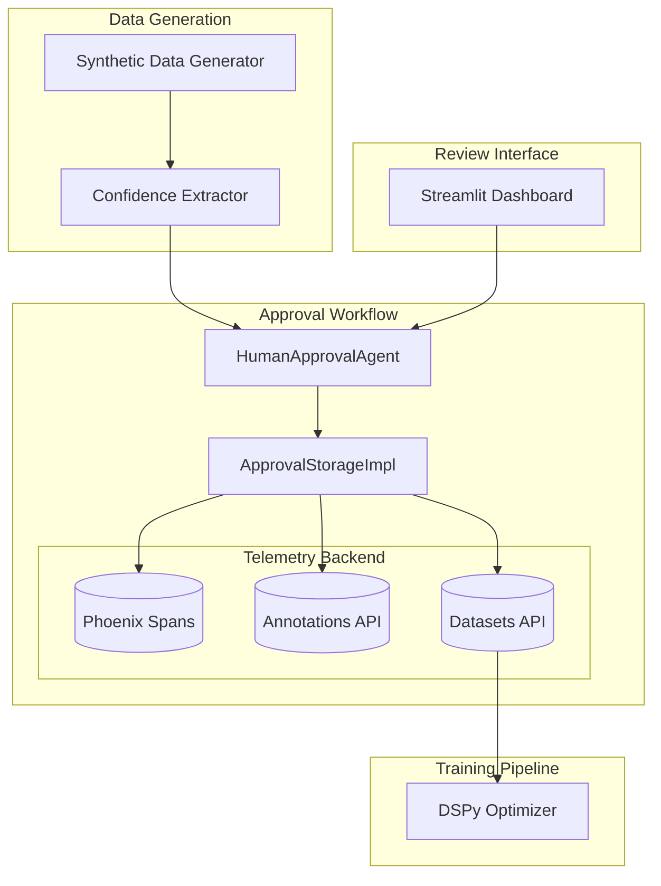
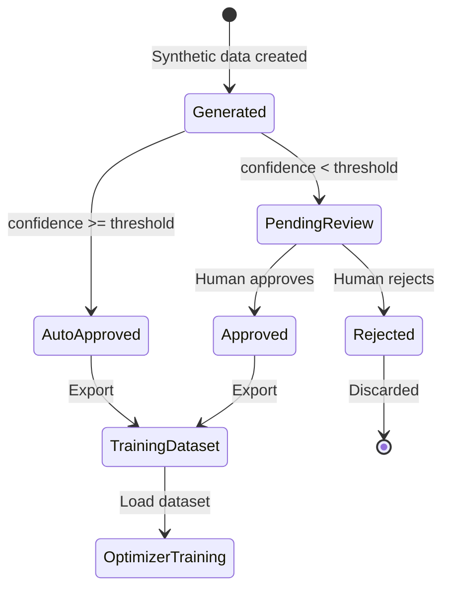

# Human-in-the-Loop Approval Workflow

**Package**: `cogniverse_agents` (Implementation Layer)
**Location**: `libs/agents/cogniverse_agents/approval/`
**Related Package**: `cogniverse_synthetic` (Application Layer)
**Last Updated:** 2026-01-25

The human-in-the-loop approval workflow enables quality control for synthetically generated training data by allowing humans to review and approve/reject examples before they're used for model optimization.

## Overview

The approval system integrates Phoenix telemetry for tracing approval workflows alongside optimization processes, providing:

- **Batch Processing**: Review synthetic data in organized batches
- **Confidence-Based Routing**: Auto-approve high-confidence items, queue low-confidence for review
- **Phoenix Integration**: All approvals traced as Phoenix spans with annotations
- **Dataset Management**: Approved items automatically added to Phoenix datasets for training

## Architecture



## Core Components

### 1. ApprovalStorageImpl

Stores approval data as telemetry spans with annotations for status updates.

**Initialization** (Breaking Change from v1.0):

```python
from cogniverse_agents.approval import ApprovalStorageImpl
from cogniverse_core.telemetry.manager import TelemetryManager

# Initialize storage with telemetry endpoints
storage = ApprovalStorageImpl(
    phoenix_grpc_endpoint="http://localhost:4317",  # gRPC for span export
    phoenix_http_endpoint="http://localhost:6006",  # HTTP for queries
    tenant_id="default",
    telemetry_manager=None  # Optional, creates one if not provided
)
```

**Breaking Changes from v1.0**:
- ❌ Removed: `phoenix_endpoint` parameter (single endpoint)
- ✅ Added: `phoenix_grpc_endpoint` and `phoenix_http_endpoint` (separate endpoints)
- ❌ Removed: `phoenix_container_name` parameter (no longer needed)
- ❌ Removed: SQLite direct access (was a workaround)
- ✅ Changed: All methods are now `async` (use `await`)
- ✅ Changed: Uses Phoenix Annotations API (not SpanEvaluations)

**API Methods** (All async):

```python
# Create approval batch (creates Phoenix spans)
await storage.create_batch(
    batch_id="batch_001",
    items=[ReviewItem(...)],
    context={"source": "synthetic_gen", "optimizer": "routing"}
)

# Retrieve batch with status from annotations
batch = await storage.get_batch("batch_001")

# Update item status (creates Phoenix annotation)
item = batch.items[0]
item.status = ApprovalStatus.APPROVED
item.reviewed_at = datetime.utcnow()
await storage.update_item(item, batch_id="batch_001")

# Log approval decision (creates Phoenix annotation)
await storage.log_approval_decision(
    item_id="item_001",
    batch_id="batch_001",
    approved=True,
    feedback="High quality example",
    reviewer="alice@example.com"
)

# Add approved items to Phoenix dataset
await storage.append_to_training_dataset(
    items=[item1, item2],
    dataset_name="routing_training_v2"
)

# List pending batches
batches = await storage.list_pending_batches(limit=10)
```

**Storage Structure**:

```
Phoenix Project: cogniverse-{tenant_id}-synthetic_data

Span Hierarchy:
├── approval_batch (root span)
│   ├── attributes.batch_id: "batch_001"
│   ├── attributes.context: {...}
│   └── children:
│       ├── approval_item (child span)
│       │   ├── attributes.item_id: "item_001"
│       │   ├── attributes.confidence: 0.85
│       │   ├── attributes.status: "pending_review" (initial)
│       │   ├── attributes.data: {...}
│       │   └── annotations:
│       │       └── item_status_update (annotation)
│       │           ├── label: "approved" (overrides span status)
│       │           ├── score: 1.0
│       │           ├── metadata.reviewed_at: "2025-01-15T10:30:00"
│       │           └── metadata.item_id: "item_001"
│       └── approval_item (child span)
│           └── ...
```

**Key Design Decisions**:
- **Spans are immutable**: Initial status in span attributes never changes
- **Annotations are mutable**: Status updates create new annotations
- **Latest annotation wins**: Query merges span + annotations, annotations take precedence
- **Indexing lag**: Phoenix has 1-2 second indexing delay for annotations (use `wait_for_phoenix_processing()` in tests)

### 2. HumanApprovalAgent

Orchestrates the approval workflow with confidence-based auto-approval.

```python
from cogniverse_agents.approval import HumanApprovalAgent, ApprovalStorageImpl
from cogniverse_synthetic.approval import ConfidenceExtractor, FeedbackHandler

# Initialize components
storage = ApprovalStorageImpl(
    phoenix_grpc_endpoint="http://localhost:4317",
    phoenix_http_endpoint="http://localhost:6006",
)
confidence_extractor = ConfidenceExtractor()
feedback_handler = FeedbackHandler()

# Create agent
agent = HumanApprovalAgent(
    storage=storage,
    confidence_extractor=confidence_extractor,
    feedback_handler=feedback_handler,
    confidence_threshold=0.8  # Auto-approve items >= 0.8
)

# Process generated data
batch_id = await agent.create_batch(
    items=synthetic_data,
    context={"optimizer": "routing", "generation_date": "2025-01-15"}
)

# Get pending items for review
pending = await agent.get_pending_items(batch_id)

# Apply approval decision
decision = ReviewDecision(
    item_id="item_001",
    approved=True,
    feedback="Clear entity annotation",
    reviewer="alice@example.com"
)
await agent.apply_decision(batch_id, decision)

# Get batch statistics
stats = await agent.get_batch_stats(batch_id)
# Returns: {"approved": 45, "rejected": 3, "pending_review": 2, "total": 50}

# Export approved items to training dataset
await agent.export_approved_to_dataset(
    batch_id=batch_id,
    dataset_name="routing_training_v2"
)
```

**Auto-Approval Logic**:
- Items with `confidence >= threshold` → `ApprovalStatus.APPROVED`
- Items with `confidence < threshold` → `ApprovalStatus.PENDING_REVIEW`
- Confidence threshold configurable per agent instance

### 3. ConfidenceExtractor

Extracts confidence scores from synthetic data for auto-approval decisions.

```python
from cogniverse_synthetic.approval import ConfidenceExtractor

extractor = ConfidenceExtractor()

# Extract confidence from routing example
confidence = extractor.extract_confidence(
    data={
        "query": "find TensorFlow tutorials",
        "entities": [{"text": "TensorFlow", "type": "TECHNOLOGY"}],
        "reasoning": "Query explicitly mentions TensorFlow..."
    },
    optimizer_type="routing"
)
# Returns: 0.92 (high confidence due to entity match + reasoning)

# Extract from workflow example
confidence = extractor.extract_confidence(
    data={
        "query": "analyze sentiment in customer feedback videos",
        "workflow": ["video_search_agent", "sentiment_analyzer"],
        "complexity": "complex"
    },
    optimizer_type="workflow"
)
# Returns: 0.75 (medium confidence, multi-step workflow)
```

**Confidence Calculation**:
- **Routing**: Entity presence (0.4) + query clarity (0.3) + reasoning quality (0.3)
- **Modality**: Query-modality match (0.5) + specificity (0.3) + clarity (0.2)
- **Cross-Modal**: Agreement score (0.4) + fusion complexity (0.3) + consistency (0.3)
- **Workflow**: Agent sequence validity (0.5) + complexity match (0.3) + completeness (0.2)

### 4. Review Interfaces

#### Python API

```python
from cogniverse_agents.approval import ReviewDecision, ApprovalStatus

# List batches needing review
batches = await storage.list_pending_batches(limit=10)

for batch_info in batches:
    batch = await storage.get_batch(batch_info["batch_id"])

    # Filter pending items
    pending = [item for item in batch.items
               if item.status == ApprovalStatus.PENDING_REVIEW]

    for item in pending:
        # Present to reviewer
        print(f"Item: {item.item_id}")
        print(f"Data: {item.data}")
        print(f"Confidence: {item.confidence}")

        # Collect decision
        decision = ReviewDecision(
            item_id=item.item_id,
            approved=user_approves,  # True/False from UI
            feedback=user_feedback,
            reviewer="alice@example.com"
        )

        await agent.apply_decision(batch_info["batch_id"], decision)
```

#### Streamlit Dashboard

Located at `scripts/approval_queue_tab.py`:

```python
# Run dashboard
uv run streamlit run scripts/approval_queue_tab.py --server.port 8502
```

**Features**:
- View pending batches with statistics
- Review individual items with confidence scores
- Approve/reject with feedback
- Bulk approval for high-confidence items
- Export approved items to Phoenix datasets
- Real-time updates from Phoenix

## Integration with Synthetic Data Generation

### Generate → Review → Train Pipeline

```python
from cogniverse_synthetic import SyntheticDataService, SyntheticDataRequest
from cogniverse_agents.approval import HumanApprovalAgent
from cogniverse_agents.routing import AdvancedOptimizer

# Step 1: Generate synthetic data
service = SyntheticDataService(backend=backend)
request = SyntheticDataRequest(optimizer="routing", count=100)
response = await service.generate(request)

# Step 2: Create approval batch
approval_agent = HumanApprovalAgent(storage=storage, confidence_threshold=0.8)
batch_id = await approval_agent.create_batch(
    items=response.data,
    context={"optimizer": "routing", "generation_timestamp": datetime.now().isoformat()}
)

# Auto-approved: 73 items (confidence >= 0.8)
# Pending review: 27 items (confidence < 0.8)

# Step 3: Human reviews pending items (via dashboard or API)
# ... reviewer approves/rejects pending items ...

# Step 4: Export approved items to dataset
await approval_agent.export_approved_to_dataset(
    batch_id=batch_id,
    dataset_name="routing_training_v3"
)

# Step 5: Load dataset and train optimizer
from phoenix.client import AsyncClient

phoenix_client = AsyncClient(base_url="http://localhost:6006")
dataset = await phoenix_client.get_dataset(name="routing_training_v3")

# Convert to optimizer format
from cogniverse_agents.routing import RoutingExperience
training_data = [RoutingExperience(**row) for row in dataset.to_dict("records")]

# Train with approved data only
optimizer = AdvancedOptimizer()
optimizer.compile(trainset=training_data)
```

### Approval Workflow States



## Testing

### Integration Tests

Located at `tests/synthetic/integration/test_synthetic_approval_integration.py`:

```bash
# Run approval integration tests
JAX_PLATFORM_NAME=cpu timeout 1800 uv run pytest \
    tests/synthetic/integration/test_synthetic_approval_integration.py -v

# Tests cover:
# - Batch creation and retrieval
# - Auto-approval logic
# - Manual approval/rejection
# - Phoenix span creation
# - Annotation-based status updates
# - Dataset export
# - Phoenix container lifecycle
```

**Important Test Utilities**:

```python
from tests.utils.async_polling import wait_for_phoenix_processing

# Wait for Phoenix to index annotations (1-2 second lag)
wait_for_phoenix_processing(delay=2.0, description="annotation indexing")

# Use this after:
# - Creating annotations
# - Before querying for updated status
```

### Unit Tests

Located at `tests/routing/unit/synthetic/test_approval_system.py`:

```bash
# Run approval unit tests
uv run pytest tests/routing/unit/synthetic/test_approval_system.py -v
```

## Configuration

### Phoenix Endpoints

```yaml
# config.yaml
telemetry:
  phoenix:
    grpc_endpoint: "http://localhost:4317"  # For span export (OTLP)
    http_endpoint: "http://localhost:6006"  # For queries (HTTP API)

approval:
  confidence_threshold: 0.8  # Auto-approve items >= 0.8
  batch_size: 50  # Items per batch
```

### Confidence Thresholds by Optimizer

```python
# Conservative (more human review)
agent = HumanApprovalAgent(confidence_threshold=0.9)

# Balanced
agent = HumanApprovalAgent(confidence_threshold=0.8)

# Aggressive (less human review)
agent = HumanApprovalAgent(confidence_threshold=0.7)

# Manual review only
agent = HumanApprovalAgent(confidence_threshold=1.0)
```

## Migration from v1.0

If you were using the old SQLite-based approval storage:

**Old Code (v1.0)**:
```python
storage = ApprovalStorageImpl(
    phoenix_endpoint="http://localhost:6006",
    phoenix_container_name="phoenix-container",
    project_name="approval_system"
)

# Synchronous methods
batch = storage.get_batch("batch_001")
storage.update_item(item)
```

**New Code (v2.0)**:
```python
storage = ApprovalStorageImpl(
    phoenix_grpc_endpoint="http://localhost:4317",  # Split endpoints
    phoenix_http_endpoint="http://localhost:6006",
    tenant_id="default"  # Multi-tenant support
    # No phoenix_container_name, no project_name
)

# Async methods
batch = await storage.get_batch("batch_001")
await storage.update_item(item, batch_id="batch_001")  # batch_id required
```

**Migration Checklist**:
- [ ] Update initialization to use separate gRPC/HTTP endpoints
- [ ] Remove `phoenix_container_name` parameter
- [ ] Replace `project_name` with `tenant_id`
- [ ] Add `await` to all storage method calls
- [ ] Pass `batch_id` to `update_item()` calls
- [ ] Update to async HumanApprovalAgent methods

## Troubleshooting

**Issue**: Status updates not visible immediately
**Fix**: Phoenix has 1-2 second indexing lag for annotations. Use `wait_for_phoenix_processing()` in tests.

**Issue**: `TypeError: object AsyncClient can't be used in 'await' expression`
**Fix**: Ensure you're using `from phoenix.client import AsyncClient` (not `import phoenix as px`)

**Issue**: Annotations not matched to items
**Fix**: Annotations are matched by `metadata.item_id`. Ensure item_id is set correctly in annotation metadata.

**Issue**: `ValueError: batch_id required for update_item`
**Fix**: Pass `batch_id` parameter: `await storage.update_item(item, batch_id="batch_001")`

**Issue**: Tests leaving Phoenix containers running
**Fix**: Ensure test fixtures have proper cleanup with `docker stop` and `docker rm`

## Related Documentation

- [Synthetic Data Generation](../synthetic-data-generation.md) - Generates data for approval (cogniverse_runtime)
- [Telemetry Module](telemetry.md) - Phoenix integration details (cogniverse_foundation)
- [Optimization Module](optimization.md) - Uses approved data for training (cogniverse_agents)

## API Reference

See source files for detailed docstrings:
- `libs/agents/cogniverse_agents/approval/phoenix_storage.py`
- `libs/agents/cogniverse_agents/approval/human_approval_agent.py`
- `libs/synthetic/cogniverse_synthetic/approval/confidence_extractor.py`
- `libs/synthetic/cogniverse_synthetic/approval/feedback_handler.py`
