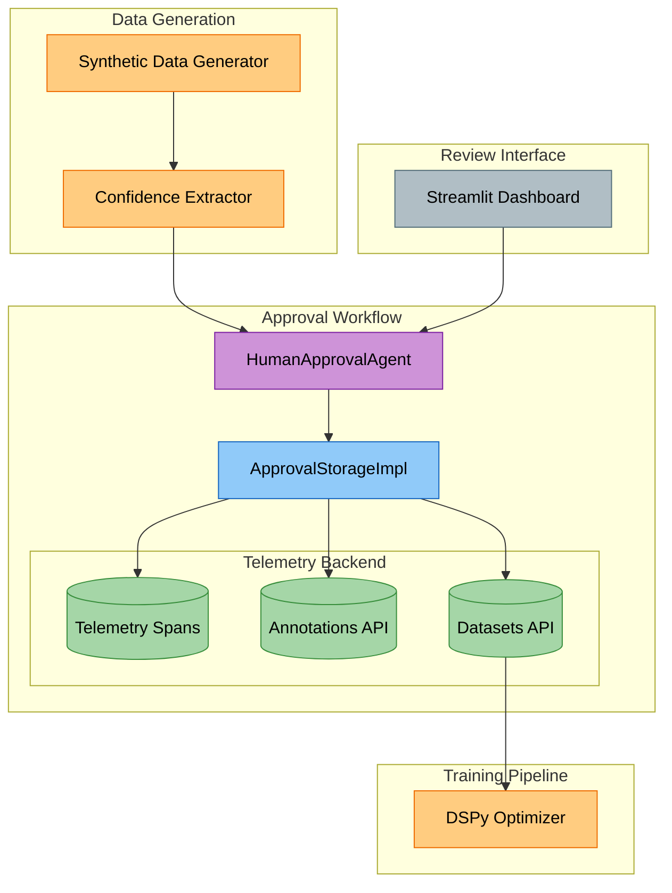
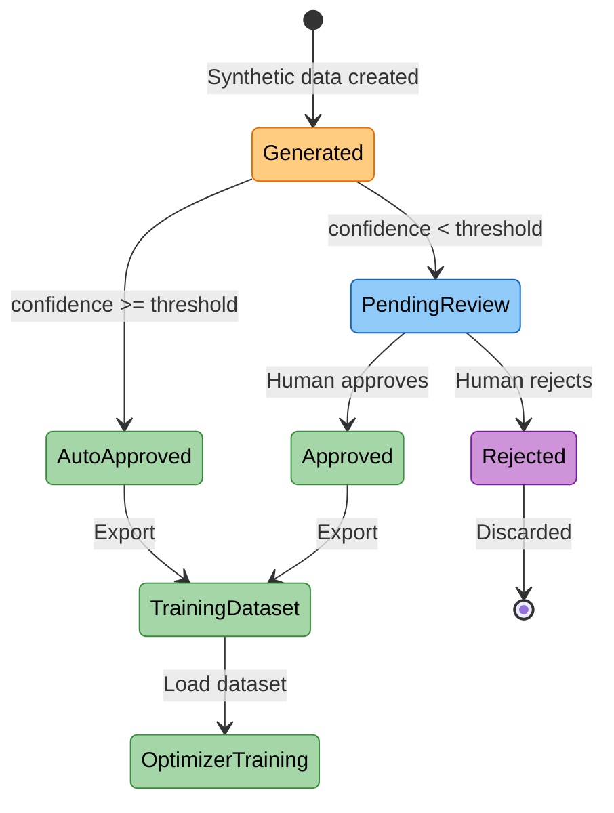

# Human-in-the-Loop Approval Workflow

**Package**: `cogniverse_agents` (Implementation Layer)
**Location**: `libs/agents/cogniverse_agents/approval/`
**Related Package**: `cogniverse_synthetic` (Application Layer)

The human-in-the-loop approval workflow enables quality control for synthetically generated training data by allowing humans to review and approve/reject examples before they're used for model optimization.

## Overview

The approval system integrates telemetry for tracing approval workflows alongside optimization processes, providing:

- **Batch Processing**: Review synthetic data in organized batches
- **Confidence-Based Routing**: Auto-approve high-confidence items, queue low-confidence for review
- **Telemetry Integration**: All approvals traced as spans with annotations using pluggable provider
- **Dataset Management**: Approved items added to telemetry provider datasets for training

## Architecture



## Core Components

### 1. ApprovalStorageImpl

Stores approval data as telemetry spans with annotations for status updates.

**Initialization** (Breaking Change from v1.0):

```python
from cogniverse_agents.approval import ApprovalStorageImpl
from cogniverse_foundation.telemetry.manager import TelemetryManager

# Initialize storage with telemetry endpoints
storage = ApprovalStorageImpl(
    grpc_endpoint="http://localhost:4317",  # gRPC for span export
    http_endpoint="http://localhost:6006",  # HTTP for queries
    tenant_id="default",
    telemetry_manager=None  # Optional, creates one if not provided
)
```

**API Methods** (All async):

```python
# Create approval batch (creates telemetry spans)
batch = ApprovalBatch(
    batch_id="batch_001",
    items=[ReviewItem(...)],
    context={"source": "synthetic_gen", "optimizer": "routing"}
)
batch_id = await storage.save_batch(batch)

# Retrieve batch with status from annotations
batch = await storage.get_batch("batch_001")

# Update item status (creates telemetry annotation)
item = batch.items[0]
item.status = ApprovalStatus.APPROVED
item.reviewed_at = datetime.utcnow()
await storage.update_item(item, batch_id="batch_001")

# Log approval decision (creates telemetry annotation)
# Note: Requires span_id from item
span_id = await storage.get_item_span_id(item_id="item_001", batch_id="batch_001")
await storage.log_approval_decision(
    span_id=span_id,
    item_id="item_001",
    approved=True,
    feedback="High quality example"
)

# Add approved items to telemetry dataset
await storage.append_to_training_dataset(
    dataset_name="routing_training_v2",
    items=[item1, item2]
)

# List pending batches
batches = await storage.get_pending_batches()
```

**Storage Structure**:

```text
Telemetry Project: cogniverse-{tenant_id}-synthetic_data

Span Hierarchy:
  approval_batch (root span)
    - attributes.batch_id: "batch_001"
    - attributes.context: {...}
    - children:
        approval_item (child span)
          - attributes.item_id: "item_001"
          - attributes.confidence: 0.85
          - attributes.status: "pending_review" (initial)
          - attributes.data: {...}
          - annotations:
              item_status_update (annotation)
                - label: "approved" (overrides span status)
                - score: 1.0
                - metadata.reviewed_at: "2025-01-15T10:30:00"
                - metadata.item_id: "item_001"
        approval_item (child span)
          - ...
```

**Key Design Decisions**:

- **Spans are immutable**: Initial status in span attributes never changes
- **Annotations are mutable**: Status updates create new annotations
- **Latest annotation wins**: Query merges span + annotations, annotations take precedence
- **Indexing lag**: Telemetry backend has 1-2 second indexing delay for annotations (use `wait_for_telemetry_processing()` in tests)

### 2. HumanApprovalAgent

Orchestrates the approval workflow with confidence-based auto-approval.

```python
from cogniverse_agents.approval import HumanApprovalAgent, ApprovalStorageImpl
from cogniverse_synthetic.approval import SyntheticDataConfidenceExtractor, SyntheticDataFeedbackHandler

# Initialize components
storage = ApprovalStorageImpl(
    grpc_endpoint="http://localhost:4317",
    http_endpoint="http://localhost:6006",
)
confidence_extractor = SyntheticDataConfidenceExtractor()
feedback_handler = SyntheticDataFeedbackHandler()

# Create agent
agent = HumanApprovalAgent(
    confidence_extractor=confidence_extractor,
    feedback_handler=feedback_handler,
    confidence_threshold=0.8,  # Auto-approve items >= 0.8
    storage=storage
)

# Process generated data
batch_id = "batch_001"
batch = await agent.process_batch(
    items=synthetic_data,
    batch_id=batch_id,
    context={"optimizer": "routing", "generation_date": "2025-01-15"}
)

# Get pending items for review (across all batches)
pending = await agent.get_pending_items()

# Apply approval decision
decision = ReviewDecision(
    item_id="item_001",
    approved=True,
    feedback="Clear entity annotation",
    reviewer="alice@example.com"
)
await agent.apply_decision(batch_id, decision)

# Get batch statistics
batch = await storage.get_batch(batch_id)
stats = agent.get_approval_stats(batch)
# Returns: {
#   "batch_id": "batch_001",
#   "total_items": 50,
#   "auto_approved": 40,
#   "human_approved": 5,
#   "rejected": 3,
#   "pending_review": 2,
#   ...
# }

# Export approved items to training dataset (both auto and human approved)
approved_items = [
    item for item in batch.items
    if item.status in (ApprovalStatus.APPROVED, ApprovalStatus.AUTO_APPROVED)
]
await storage.append_to_training_dataset(
    dataset_name="routing_training_v2",
    items=approved_items
)
```

**Auto-Approval Logic**:

- Items with `confidence >= threshold` → `ApprovalStatus.AUTO_APPROVED`
- Items with `confidence < threshold` → `ApprovalStatus.PENDING_REVIEW`
- Confidence threshold configurable per agent instance

### 3. SyntheticDataConfidenceExtractor

Extracts confidence scores from synthetic data for auto-approval decisions.

```python
from cogniverse_synthetic.approval import SyntheticDataConfidenceExtractor

extractor = SyntheticDataConfidenceExtractor()

# Extract confidence from synthetic data
confidence = extractor.extract(
    data={
        "query": "find TensorFlow tutorials",
        "entities": ["TensorFlow", "Tutorial"],
        "reasoning": "Query explicitly mentions TensorFlow...",
        "_generation_metadata": {
            "retry_count": 0
        }
    }
)
# Returns: 0.92 (high confidence due to first attempt success, entities present)

# Extract from data with retries
confidence = extractor.extract(
    data={
        "query": "analyze sentiment in customer feedback videos",
        "entities": [],
        "_generation_metadata": {
            "retry_count": 2
        }
    }
)
# Returns: 0.75 (medium confidence, multi-step workflow)
```

**Confidence Calculation** (SyntheticDataConfidenceExtractor):

- Base confidence starts at 1.0
- Retry penalty: Subtract `retry_penalty * retry_count` (default 0.15 per retry)
- Entity presence: Multiplicative 5% boost (`confidence * 1.05`) if entity found in query
- Entity missing: 30% penalty (`confidence * 0.7`) if entities provided but not in query
- Query length penalties: Multiplicative 20% penalty (`* 0.8`) if too short, 10% penalty (`* 0.9`) if too long
- Reasoning quality: Multiplicative 2% boost (`confidence * 1.02`) if reasoning text present (>20 chars)
- Returns normalized 0-1 score

### 4. Review Interfaces

#### Python API

```python
from cogniverse_agents.approval import ReviewDecision, ApprovalStatus

# List batches needing review
batches = await storage.get_pending_batches()

for batch in batches:
    # Filter pending items
    pending = [item for item in batch.items
               if item.status == ApprovalStatus.PENDING_REVIEW]

    for item in pending:
        # Present to reviewer
        print(f"Item: {item.item_id}")
        print(f"Data: {item.data}")
        print(f"Confidence: {item.confidence}")

        # Collect decision
        decision = ReviewDecision(
            item_id=item.item_id,
            approved=user_approves,  # True/False from UI
            feedback=user_feedback,
            reviewer="alice@example.com"
        )

        await agent.apply_decision(batch.batch_id, decision)
```

#### Streamlit Dashboard

Located at `scripts/approval_queue_tab.py`:

```python
# Run dashboard
uv run streamlit run scripts/approval_queue_tab.py --server.port 8502
```

**Features**:

- View pending batches with statistics
- Review individual items with confidence scores
- Approve/reject with feedback
- Bulk approval for high-confidence items
- Export approved items to telemetry datasets
- Real-time updates from telemetry backend

## Integration with Synthetic Data Generation

### Generate → Review → Train Pipeline

```python
from datetime import datetime
from cogniverse_synthetic import SyntheticDataService, SyntheticDataRequest
from cogniverse_agents.approval import HumanApprovalAgent, ApprovalStorageImpl, ApprovalStatus
from cogniverse_agents.routing.advanced_optimizer import AdvancedRoutingOptimizer

# Step 1: Generate synthetic data
# Initialize service (backend auto-discovered via registry)
service = SyntheticDataService()
request = SyntheticDataRequest(optimizer="routing", count=100)
response = await service.generate(request)

# Step 2: Create approval batch
from cogniverse_synthetic.approval import SyntheticDataConfidenceExtractor

# Initialize approval storage
storage = ApprovalStorageImpl(
    grpc_endpoint="http://localhost:4317",
    http_endpoint="http://localhost:6006",
    tenant_id="default"
)

approval_agent = HumanApprovalAgent(
    confidence_extractor=SyntheticDataConfidenceExtractor(),
    confidence_threshold=0.8,
    storage=storage
)
batch_id = "batch_routing_001"
batch = await approval_agent.process_batch(
    items=response.data,
    batch_id=batch_id,
    context={"optimizer": "routing", "generation_timestamp": datetime.now().isoformat()}
)

# Auto-approved: 73 items (confidence >= 0.8)
# Pending review: 27 items (confidence < 0.8)

# Step 3: Human reviews pending items (via dashboard or API)
# ... reviewer approves/rejects pending items ...

# Step 4: Export approved items to dataset
batch = await storage.get_batch(batch_id)
approved_items = [
    item for item in batch.items
    if item.status in (ApprovalStatus.APPROVED, ApprovalStatus.AUTO_APPROVED)
]
await storage.append_to_training_dataset(
    dataset_name="routing_training_v3",
    items=approved_items
)

# Step 5: Load dataset and train optimizer
# Dataset is now available in telemetry backend for training
# Optimizer can access it through telemetry provider APIs

# Train optimizer with approved data
optimizer = AdvancedRoutingOptimizer(tenant_id="default")
result = await optimizer.optimize_routing_policy()  # Trains with approved data from telemetry
```

### Approval Workflow States



## Testing

### Integration Tests

Located at `tests/synthetic/integration/test_synthetic_approval_integration.py`:

```bash
# Run approval integration tests
JAX_PLATFORM_NAME=cpu timeout 1800 uv run pytest \
    tests/synthetic/integration/test_synthetic_approval_integration.py -v

# Tests cover:
# - Batch creation and retrieval
# - Auto-approval logic
# - Manual approval/rejection
# - Telemetry span creation
# - Annotation-based status updates
# - Dataset export
# - Telemetry container lifecycle
```

**Important Test Utilities**:

```python
from tests.utils.async_polling import wait_for_telemetry_processing

# Wait for telemetry backend to index annotations (1-2 second lag)
wait_for_telemetry_processing(delay=2.0, description="annotation indexing")

# Use this after:
# - Creating annotations
# - Before querying for updated status
```

### Unit Tests

Located at `tests/routing/unit/synthetic/test_approval_system.py`:

```bash
# Run approval unit tests
uv run pytest tests/routing/unit/synthetic/test_approval_system.py -v
```

## Configuration

### Telemetry Endpoints

```yaml
# config.yaml
telemetry:
  provider_config:
    grpc_endpoint: "http://localhost:4317"  # For span export (OTLP)
    http_endpoint: "http://localhost:6006"  # For queries (HTTP API)

approval:
  confidence_threshold: 0.8  # Auto-approve items >= 0.8
  batch_size: 50  # Items per batch
```

### Confidence Thresholds by Optimizer

```python
# Conservative (more human review)
agent = HumanApprovalAgent(
    confidence_extractor=SyntheticDataConfidenceExtractor(),
    confidence_threshold=0.9
)

# Balanced
agent = HumanApprovalAgent(
    confidence_extractor=SyntheticDataConfidenceExtractor(),
    confidence_threshold=0.8
)

# Aggressive (less human review)
agent = HumanApprovalAgent(
    confidence_extractor=SyntheticDataConfidenceExtractor(),
    confidence_threshold=0.7
)

# Manual review only
agent = HumanApprovalAgent(
    confidence_extractor=SyntheticDataConfidenceExtractor(),
    confidence_threshold=1.0
)
```

## Troubleshooting

**Issue**: Status updates not visible immediately
**Fix**: Telemetry backend has 1-2 second indexing lag for annotations. Use `wait_for_telemetry_processing()` in tests.

**Issue**: Annotations not matched to items
**Fix**: Annotations are matched by `metadata.item_id`. Ensure item_id is set correctly in annotation metadata.

**Issue**: Slow item lookups during status updates
**Fix**: Pass `batch_id` parameter for faster span lookups: `await storage.update_item(item, batch_id="batch_001")`

**Issue**: Tests leaving telemetry containers running
**Fix**: Ensure test fixtures have proper cleanup with `docker stop` and `docker rm`

## Related Documentation

- [Synthetic Data Generation](../synthetic-data-generation.md) - Generates data for approval
- [Telemetry Module](telemetry.md) - Telemetry provider integration details (cogniverse_foundation)
- [Routing Module](routing.md) - Uses approved data for optimization (cogniverse_agents)

## API Reference

See source files for detailed docstrings:

- `libs/agents/cogniverse_agents/approval/approval_storage.py`

- `libs/agents/cogniverse_agents/approval/human_approval_agent.py`

- `libs/synthetic/cogniverse_synthetic/approval/confidence_extractor.py`

- `libs/synthetic/cogniverse_synthetic/approval/feedback_handler.py`
