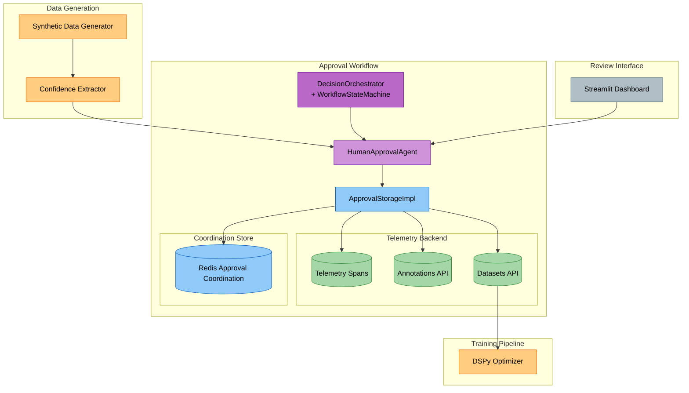
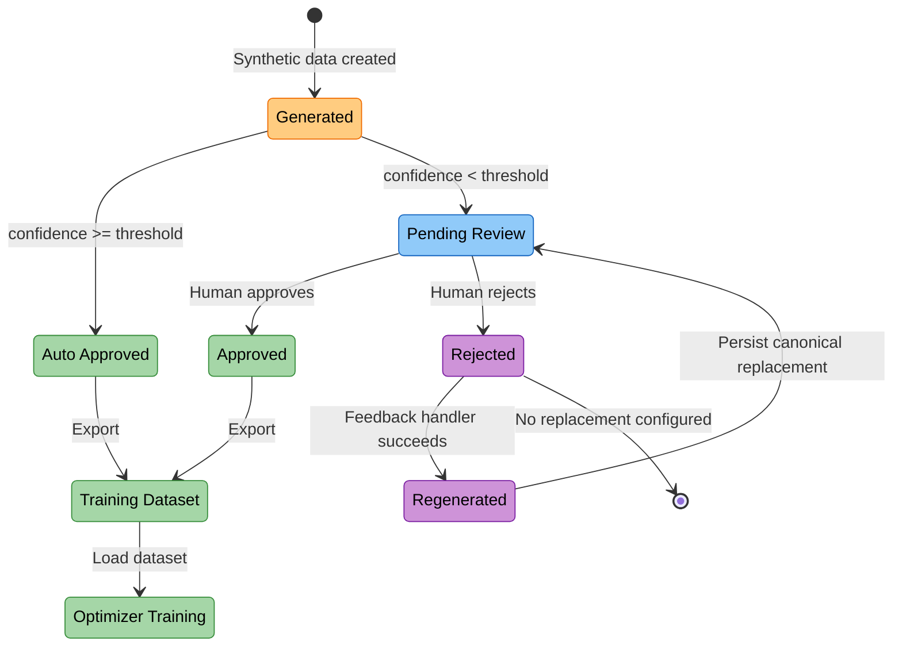

# Human-in-the-Loop Approval Workflow

**Interfaces**: `cogniverse_core.approval` (`libs/core/cogniverse_core/approval/`) — the
abstract interfaces and data models (`ApprovalStatus`, `ReviewItem`, `ReviewDecision`,
`ApprovalBatch`, `ConfidenceExtractor`, `FeedbackHandler`, `ApprovalStorage`) plus
`approved_synthetic_dataset_name()` and `validate_approved_training_values()` live in
the core layer so both `cogniverse_agents` and `cogniverse_synthetic` can implement
them without depending on each other.
**Implementations**: `cogniverse_agents.approval` (`libs/agents/cogniverse_agents/approval/`) —
`HumanApprovalAgent`, `ApprovalStorageImpl`, `DecisionOrchestrator`, and the Redis-backed
`RedisReplacementRecordStore`. This package re-exports the core interfaces, so
`from cogniverse_agents.approval import ApprovalStatus` still resolves.
`DecisionOrchestrator` additionally depends on `cogniverse_agents.workflow.state_machine`
(`WorkflowState`, `WorkflowStateMachine`) for state tracking.
**Related Package**: `cogniverse_synthetic` (Implementation Layer). Also consumed by
`cogniverse_finetuning.dataset.method_selector` (`libs/finetuning/cogniverse_finetuning/dataset/method_selector.py`),
which gates synthetic finetuning data through `HumanApprovalAgent.submit_for_review()`
as a mandatory, non-bypassable approval step.

The human-in-the-loop approval workflow enables quality control for synthetically generated training data by allowing humans to review and approve/reject examples before they're used for model optimization.

## Overview

The approval system integrates telemetry for tracing approval workflows alongside optimization processes, providing:

- **Batch Processing**: Review synthetic data in organized batches
- **Confidence-Based Routing**: Auto-approve high-confidence items, queue low-confidence for review
- **Telemetry Integration**: All approvals traced as spans with annotations using pluggable provider
- **Dataset Management**: Approved items are written once to tenant-qualified telemetry
  datasets under a renewable Redis distributed lock

## Architecture


```mermaid
flowchart TB
    subgraph "Data Generation"
        SyntheticGen["<span style='color:#000'>Synthetic Data Generator</span>"]
        Extractor["<span style='color:#000'>Confidence Extractor</span>"]
        SyntheticGen --> Extractor
    end

    subgraph "Approval Workflow"
        ApprovalAgent["<span style='color:#000'>HumanApprovalAgent</span>"]
        Orchestrator["<span style='color:#000'>DecisionOrchestrator<br/>+ WorkflowStateMachine</span>"]
        Storage["<span style='color:#000'>ApprovalStorageImpl</span>"]

        Extractor --> ApprovalAgent
        Orchestrator --> ApprovalAgent
        ApprovalAgent --> Storage

        subgraph "Telemetry Backend"
            Spans[("<span style='color:#000'>Telemetry Spans</span>")]
            Annotations[("<span style='color:#000'>Annotations API</span>")]
            Datasets[("<span style='color:#000'>Datasets API</span>")]
        end

        subgraph "Coordination Store"
            Redis[("<span style='color:#000'>Redis Approval Coordination</span>")]
        end

        Storage --> Spans
        Storage --> Annotations
        Storage --> Datasets
        Storage --> Redis
    end

    subgraph "Review Interface"
        Dashboard["<span style='color:#000'>Streamlit Dashboard</span>"]
        Dashboard --> ApprovalAgent
    end

    subgraph "Training Pipeline"
        Optimizer["<span style='color:#000'>DSPy Optimizer</span>"]
        Datasets --> Optimizer
    end

    style SyntheticGen fill:#ffcc80,stroke:#ef6c00,color:#000
    style Extractor fill:#ffcc80,stroke:#ef6c00,color:#000
    style ApprovalAgent fill:#ce93d8,stroke:#7b1fa2,color:#000
    style Orchestrator fill:#ba68c8,stroke:#7b1fa2,color:#000
    style Storage fill:#90caf9,stroke:#1565c0,color:#000
    style Spans fill:#a5d6a7,stroke:#388e3c,color:#000
    style Annotations fill:#a5d6a7,stroke:#388e3c,color:#000
    style Datasets fill:#a5d6a7,stroke:#388e3c,color:#000
    style Redis fill:#90caf9,stroke:#1565c0,color:#000
    style Dashboard fill:#b0bec5,stroke:#546e7a,color:#000
    style Optimizer fill:#ffcc80,stroke:#ef6c00,color:#000
```

## Core Components

### 1. ApprovalStorageImpl

Stores approval data as telemetry spans with annotations for status updates.

**Initialization**:

```python
from cogniverse_agents.approval import ApprovalStorageImpl

# Initialize storage with telemetry endpoints
storage = ApprovalStorageImpl(
    grpc_endpoint="http://localhost:4317",  # gRPC for span export
    http_endpoint="http://localhost:6006",  # HTTP for queries
    tenant_id="your_org:production",
    redis_url="redis://redis:6379/0",  # required for dataset writes and replacements
    telemetry_manager=None,  # Optional, creates one if not provided
)
```

**API Methods** (All async):

```python
from datetime import datetime, timezone
from cogniverse_core.approval.interfaces import (
    ApprovalBatch,
    ApprovalStatus,
    ReviewDecision,
    ReviewItem,
    approved_synthetic_dataset_name,
)
from cogniverse_agents.approval import ApprovalStorageImpl

storage = ApprovalStorageImpl(
    grpc_endpoint="http://localhost:4317",
    http_endpoint="http://localhost:6006",
    tenant_id="your_org:production",
    redis_url="redis://redis:6379/0",
)

# Create approval batch (creates telemetry spans)
item = ReviewItem(
    item_id="item_001",
    data={
        "query": "find the exact Vespa ranking tutorial",
        "chosen_agent": "video_search_agent",
    },
    confidence=0.72,
    metadata={"agent_type": "routing"},
)
batch = ApprovalBatch(
    batch_id="batch_001",
    items=[item],
    context={
        "tenant_id": "your_org:production",
        "agent_type": "routing",
        "source": "synthetic_gen",
        "optimizer": "routing",
    }
)
batch_id = await storage.save_batch(batch)
# Batch and item spans use checked synchronous export in a worker thread; a
# rejected export raises without blocking other async requests.
# A retry after a partial multi-span export collapses byte-identical roots and
# item records by batch/item identity; conflicting retry content raises.

# Retrieve batch with status from annotations. Byte-identical retry roots and
# item records collapse to one logical record. Conflicting roots, malformed item
# spans, invalid status annotations, and backend outages raise instead of
# returning a missing or partial batch.
batch = await storage.get_batch("batch_001")
# Each reconstructed item has metadata.approval_batch_id equal to this batch ID.
# Fine-tuning generation derives an item's immutable identity from the canonical
# tenant, agent type, and exact stripped query. Repeating the same query cannot
# create another independently countable approval item by changing timestamps,
# output labels, or incidental metadata.

# Persist one human approval. The method creates a copy, preserves the exact
# decision timestamp as reviewed_at, acquires the renewable tenant/dataset Redis lock,
# writes the immutable dataset row first, then records the reviewer decision
# and approved status. The dataset row stores a decision-intent hash that omits
# the request timestamp plus the first decision timestamp. A fresh identical
# retry reuses that timestamp and is a no-op at the dataset boundary; the same
# item_id with different content or decision intent raises.
item = batch.items[0]
decision = ReviewDecision(
    item_id=item.item_id,
    approved=True,
    feedback="High quality example",
    reviewer="alice@example.com",
    timestamp=datetime.now(timezone.utc),
)
approved = await storage.persist_approved_item(
    batch_id=batch.batch_id,
    dataset_name=approved_synthetic_dataset_name(storage.tenant_id),
    item=item,
    decision=decision,
    project_context=batch.context,
)

# The rejection path uses a separate pending item because one immutable review
# decision is selected for each batch/original identity.
rejected_source = ReviewItem(
    item_id="item_002",
    data={
        "query": "find the Vespa deployment walkthrough",
        "chosen_agent": "video_search_agent",
    },
    confidence=0.61,
    metadata={"agent_type": "routing"},
)
rejection_batch = ApprovalBatch(
    batch_id="batch_002",
    items=[rejected_source],
    context={
        "tenant_id": storage.tenant_id,
        "agent_type": "routing",
        "optimizer": "routing",
    },
)
await storage.save_batch(rejection_batch)
rejection = ReviewDecision(
    item_id=rejected_source.item_id,
    approved=False,
    feedback="Use the exact deployment terminology.",
    reviewer="alice@example.com",
    timestamp=datetime.now(timezone.utc),
)
regenerated_item = ReviewItem(
    item_id="item_002_regen_0",
    data={
        "query": "find the exact Vespa deployment walkthrough",
        "chosen_agent": "video_search_agent",
    },
    confidence=0.0,
    status=ApprovalStatus.REGENERATED,
    metadata={
        "agent_type": "routing",
        "original_item_id": rejected_source.item_id,
        "decision": {
            "reviewer": rejection.reviewer,
            "feedback": rejection.feedback,
            "corrections": rejection.corrections,
            "timestamp": rejection.timestamp.isoformat(),
        },
    },
)

# Redis selects one canonical payload for this batch/original pair. Phoenix
# records those exact bytes, and replace_item() returns only after the event is
# queryable. Redis, checked export, and visibility failures raise. The blocking
# export runs in a worker thread so concurrent async requests continue.
await storage.replace_item(
    rejection_batch.batch_id,
    rejected_source,
    regenerated_item,
)

# Optional standalone decision-event API. It does not replace
# persist_approved_item() and does not change the item status.
await storage.record_decision(decision, item)

# Direct bulk dataset writes use the same Redis lock and immutable item_id
# contract. Redis and the telemetry dataset boundary are required; neither has
# a local fallback.
await storage.append_to_training_dataset(
    dataset_name=approved_synthetic_dataset_name(storage.tenant_id),
    items=[approved],
    project_context=batch.context,
)

# Approved rows include metadata.approval_decision_sha256,
# metadata.approval_decision_timestamp, metadata.approval_record_json, and
# metadata.approval_record_sha256. Readers receive the exact JSON types from the
# signed canonical record rather than backend-coerced strings.

# List pending batches (raises on backend failure rather than
# returning an empty list, so a telemetry outage never reads as
# "nothing pending")
batches = await storage.get_pending_batches()
```

All public `ApprovalStorageImpl` methods are asynchronous:

| Method | Contract |
|---|---|
| `save_batch(batch)` | Checked-export the immutable batch and item spans; return the batch ID |
| `get_batch(batch_id, spans_df=None)` | Reconstruct the complete batch or return `None` only when it is genuinely absent |
| `update_item(item, batch_id=None)` | Write the `item_status_update` annotation for the resolved item span |
| `replace_item(batch_id, original, replacement)` | Select and export one canonical regenerated replacement |
| `get_pending_batches(context_filter=None)` | Return batches whose current reconstructed view still contains pending items |
| `record_decision(decision, item)` | Emit an optional standalone decision span without changing item status |
| `get_item_span_id(item_id, batch_id=None)` | Resolve an original or replacement span ID, scoped to the batch when supplied |
| `log_approval_decision(span_id, item_id, approved, feedback=None, reviewer=None, decision_timestamp=None)` | Persist reviewer history as a `human_approval` annotation |
| `persist_approved_item(*, batch_id, dataset_name, item, decision, project_context=None)` | Select the decision, write the immutable dataset row, then persist reviewer history and status |
| `select_review_decision(*, batch_id, original_item_id, decision)` | Return the first Redis-selected decision intent and timestamp |
| `append_to_training_dataset(dataset_name, items, project_context=None)` | Idempotently create or append exact approved records under the renewable dataset lock |

Approval batch, item, and replacement reads consume the telemetry provider's
cursor-paginated complete-history API. An older pending batch therefore remains
visible after more than one Phoenix page of newer approval events, and a failed
page raises instead of returning a partial queue.

**Storage Structure**:

```text
Telemetry Project: cogniverse-{tenant_id}-synthetic_data

Span Hierarchy:
  approval_batch (root span)
    - attributes.batch_id: "batch_001"
    - attributes.context: {...}
    - children:
        approval_item (child span)
          - attributes.item_id: "item_001"
          - attributes.confidence: 0.85
          - attributes.status: "pending_review" (initial)
          - attributes.data: {...}
          - annotations:
              item_status_update (annotation)
                - label: "approved" (overrides span status)
                - score: 1.0
                - metadata.reviewed_at: "2025-01-15T10:30:00"
                - metadata.item_id: "item_001"
              human_approval (annotation)
                - label: "approved" (reviewer history only)
                - metadata.reviewer: "alice@example.com"
                - metadata.reviewed_at: "2025-01-15T10:30:00"
        approval_item (child span)
          - ...
```

**Key Design Decisions**:

- **Spans are immutable**: Initial status in span attributes never changes
- **Terminal state is explicit**: Only `item_status_update` changes reconstructed workflow status
- **Reviewer history is non-terminal**: `human_approval` records who made the decision without resolving a pending item by itself
- **Latest terminal annotation wins**: Query merges the span with the latest `item_status_update`
- **Indexing lag**: Telemetry backend has 1-2 second indexing delay for annotations (use `wait_for_telemetry_processing()` in tests)

#### Renewable Dataset Lock

Approval dataset writes acquire a tenant-and-dataset key with a unique owner
token. While the protected operation is active, the owner renews the lease at
one third of its duration through a compare-token `PEXPIRE` script. A different
owner cannot extend or release the lease; release uses a separate compare-token
delete script.

Redis connections use two-second connect and I/O socket timeouts with timeout
retries disabled. A renewal error or rejected owner token cancels the protected
approval operation and raises with tenant and dataset context. Dataset writes,
reviewer annotations, and terminal status annotations therefore do not continue
after detected lock loss.

#### Approved Dataset Integrity

Every tenant-qualified approved row carries a compact, key-sorted
`metadata.approval_record_json` value and its lowercase SHA-256 digest in
`metadata.approval_record_sha256`. The canonical JSON contains the exact record
content, including the decision-intent digest and aware decision timestamp, but
does not recursively contain its own JSON or record digest fields.

The public `validate_approved_dataset_record(record, *, tenant_id, dataset_name,
position)` boundary validates one canonical row used by both fine-tuning and
runtime consumers. The dataset provider
applies it to both writes and reads. A non-DataFrame response,
a missing `input` column, a non-object row, any duplicate `item_id`, malformed
digest or timestamp metadata, non-canonical JSON, or any digest mismatch raises
with tenant, dataset, row, and item context. Validation completes for the whole
snapshot before a consumer receives rows or a writer appends data. The returned
`input` objects are independent copies reconstructed from the canonical JSON;
Phoenix numeric and structured-value string coercions are accepted only when
they parse safely and equal the signed canonical value exactly. The canonical
types are restored before a consumer receives the row.

The core `validate_approved_training_values(values, agent_type, *, context)`
function validates the exact supervision values consumed by the four supported
training agents: profile selection, query enhancement, entity extraction, and
routing. It rejects unsupported agent types and malformed agent-specific values
before an approved record reaches either a writer or consumer.

#### Canonical Replacement Records

`RedisReplacementRecordStore` uses Redis `SET ... NX` to select exactly one
regenerated `ReviewItem` payload for a `(tenant, batch, original item)` tuple.
The selected `CanonicalReplacementRecord` exposes its parsed `payload`, canonical
compact `json`, and `sha256` digest. Redis stores those exact JSON bytes without expiration, and the
Phoenix replacement event stores the same bytes and digest. A renewable Redis
event lock serializes Phoenix export: concurrent replicas, process restarts,
and retries after an ambiguous export first query Phoenix. Byte-identical
events for the same batch/original identity are one logical replacement;
conflicting canonical records raise. The lock renews at one third of its lease; renewal failure cancels
the owning export task before its protected body can continue, and raises with
the tenant, batch, and original item identifiers. Duplicate or conflicting
events, non-canonical JSON, duplicate JSON keys, malformed fields, identity or
digest mismatches, naive timestamps, and non-finite confidence all raise
instead of producing a partial batch view.
Redis and Phoenix connection or timeout failures raise with the tenant, batch,
and original item identifiers.

Approval and regeneration share one immutable Redis review-decision key for
each `(tenant, batch, original item)`. `ApprovalStorageImpl.select_review_decision()`
delegates this selection to `RedisReplacementRecordStore.select_review_decision()`
before an approved dataset row or replacement event can be written. The first
decision intent wins; identical retries receive the selected canonical decision
and keep its first timestamp. An approve-versus-regenerate race gives exactly
one winner, and the conflicting reviewer action raises without changing
Phoenix. Batch tenant identity is canonicalized and compared with the storage
tenant before span export, so a mismatch leaves no cross-tenant root or item
span.

```python
from datetime import datetime, timezone
from cogniverse_agents.approval.replacement_store import (
    RedisReplacementRecordStore,
)

records = RedisReplacementRecordStore("redis://redis:6379/0")
created_at = datetime.now(timezone.utc).isoformat()
serialized_regenerated_item = {
    "item_id": "item_001_regen_0",
    "data": {
        "query": "find the exact Vespa ranking tutorial",
        "chosen_agent": "video_search_agent",
    },
    "confidence": 0.0,
    "status": "regenerated",
    "metadata": {"original_item_id": "item_001"},
    "created_at": created_at,
    "reviewed_at": None,
}
selected = await records.select_canonical(
    tenant_id="your_org:production",
    batch_id="batch_001",
    original_item_id="item_001",
    candidate=serialized_regenerated_item,
)
assert selected.payload == serialized_regenerated_item
```

`select_review_decision()` selects one decision intent while preserving its
first aware timestamp. `select_approval_batch()` does the same for otherwise
identical batch and item payloads, so a save retry retains the first timestamps.
`replacement_event_lock()` is the renewable per-replacement context manager that
serializes Phoenix export and cancels its owner if Redis renewal fails.

### 2. HumanApprovalAgent

Orchestrates the approval workflow with confidence-based auto-approval.

```python
from typing import Any

from cogniverse_agents.approval import (
    ApprovalBatch,
    ApprovalStorageImpl,
    HumanApprovalAgent,
    ReviewDecision,
    ReviewItem,
)
from cogniverse_foundation.config.unified_config import ApprovalConfig
from cogniverse_synthetic.approval import SyntheticDataConfidenceExtractor, SyntheticDataFeedbackHandler
from cogniverse_synthetic.dspy_modules import ValidatedSyntheticExampleRegenerator

async def review_synthetic_data(
    *,
    configured_dspy_lm: Any,
    generation_timeout_seconds: float,
    synthetic_data: list[dict[str, Any]],
) -> dict[str, Any]:
    """Run with the application's configured LM and reachable Redis/Phoenix."""
    regenerator = ValidatedSyntheticExampleRegenerator(max_retries=3)
    regenerator.lm = configured_dspy_lm
    storage = ApprovalStorageImpl(
        grpc_endpoint="http://localhost:4317",
        http_endpoint="http://localhost:6006",
        tenant_id="your_org:production",
        redis_url="redis://redis:6379/0",
    )
    confidence_extractor = SyntheticDataConfidenceExtractor()
    feedback_handler = SyntheticDataFeedbackHandler(
        generator=regenerator,
        generation_timeout_seconds=generation_timeout_seconds,
    )
    agent = HumanApprovalAgent.from_approval_config(
        ApprovalConfig(confidence_threshold=0.85),
        confidence_extractor=confidence_extractor,
        feedback_handler=feedback_handler,
        storage=storage,
    )

    batch = await agent.process_batch(
        items=synthetic_data,
        batch_id="batch_001",
        context={
            "tenant_id": storage.tenant_id,
            "agent_type": "routing",
            "optimizer": "routing",
            "generation_date": "2025-01-15",
        },
    )

    # A caller-built batch already carries confidence, as in the fine-tuning path.
    prebuilt_item = ReviewItem(
        item_id="batch_002_0",
        data={
            "query": "find exact text in presentation slides",
            "chosen_agent": "video_search_agent",
        },
        confidence=0.4,
        metadata={"agent_type": "routing"},
    )
    await agent.submit_for_review(
        ApprovalBatch(
            batch_id="batch_002",
            items=[prebuilt_item],
            context={
                "tenant_id": storage.tenant_id,
                "agent_type": "routing",
            },
        )
    )

    if batch.pending_review:
        pending_item = batch.pending_review[0]
        await agent.apply_decision(
            batch.batch_id,
            ReviewDecision(
                item_id=pending_item.item_id,
                approved=True,
                feedback="The routing label is exact.",
                reviewer="alice@example.com",
            ),
        )

    persisted = await storage.get_batch(batch.batch_id)
    if persisted is None:
        raise RuntimeError(f"Approval batch disappeared: {batch.batch_id}")
    return agent.get_approval_stats(persisted)
```

`apply_batch_decisions(batch_id, decisions)` applies each decision through the
same persistence path, then reloads and returns the complete `ApprovalBatch`.

**Auto-Approval Logic**:

- Items with `confidence >= threshold` → `ApprovalStatus.AUTO_APPROVED`
- Items with `confidence < threshold` → `ApprovalStatus.PENDING_REVIEW`
- Persisted approval batches retain `AUTO_APPROVED` for threshold decisions and
  `APPROVED` for human decisions. The tenant-qualified training dataset records
  both decision sources with the canonical `approved` status required by the
  finetuning readers.
- Confidence threshold configurable per agent instance
- `process_batch()` requires a non-empty canonical `context.agent_type`, copies it into every `ReviewItem.metadata`, and builds items from raw dicts via the injected `ConfidenceExtractor`; `submit_for_review()` classifies a caller-built `ApprovalBatch` whose items already carry a `confidence` score (e.g. the finetuning synthetic-data path) — both reject booleans, non-numbers, non-finite values, and values outside `[0, 1]` before constructing or persisting a batch, then apply the same threshold split and persist to `storage` if configured
- `HumanApprovalAgent.from_approval_config()` builds an agent using `confidence_threshold` from an `ApprovalConfig` instance instead of a hard-coded float

### 3. SyntheticDataConfidenceExtractor

Reads the native confidence from one exact canonical synthetic schema.

```python
from cogniverse_synthetic.approval import SyntheticDataConfidenceExtractor

extractor = SyntheticDataConfidenceExtractor()

# Profile-selection records have no observed native confidence.
confidence = extractor.extract(
    data={
        "query": "find exact text in presentation slides",
        "available_profiles": "video_colpali,video_colqwen",
        "selected_profile": "video_colpali",
        "reasoning": "Patch retrieval preserves exact slide text.",
        "query_intent": "video_search",
        "modality": "video",
        "complexity": "medium",
    }
)
# Returns the explicit human-review sentinel: 0.0
breakdown = extractor.get_confidence_breakdown(data={
    "query": "find exact text in presentation slides",
    "available_profiles": "video_colpali,video_colqwen",
    "selected_profile": "video_colpali",
    "reasoning": "Patch retrieval preserves exact slide text.",
    "query_intent": "video_search",
    "modality": "video",
    "complexity": "medium",
})
# Returns schema, confidence field, exact confidence, observation state,
# and whether the item requires human review.
```

The accepted key set must exactly equal one of
`ProfileSelectionExampleSchema`, `QueryEnhancementExampleSchema`,
`EntityExtractionExampleSchema`, `RoutingExperienceSchema`, or
`WorkflowExecutionSchema`. Profile selection, query enhancement, and entity
extraction have no observed native confidence, so schema-valid records return
the explicit `0.0` review-required score instead of borrowing a value from
another field. Routing uses its finite float `routing_confidence` and workflow
uses its finite float `confidence_score` only when the exact outcome metadata
marks that result observed. Malformed records still raise.

Routing records must declare `_outcome_metadata.observed` and the matching exact
required-field semantics. An observed production gateway decision may retain
its measured `routing_confidence`; an unobserved route must use `0.0`. Both keep
zero/false sentinels for unobserved search quality, agent success, and processing
time. Workflow records declare an exact observed or unobserved semantics map. An
unobserved workflow must retain zero/false sentinels and its breakdown sets
`requires_human_review` to `true`.
Missing, extra, coercible, non-finite, out-of-range, or semantically inconsistent
values raise instead of being scored heuristically.

`SyntheticDataFeedbackHandler.process_rejection()` identifies and validates the
original example against one advertised synthetic schema before applying any
correction:

| Example schema | Accepted corrections | Regeneration behavior |
|---|---|---|
| `ProfileSelectionExampleSchema` | Declared profile-selection fields | Regenerate from the complete source and review instruction, copy structured corrections exactly, and reject unchanged output |
| `QueryEnhancementExampleSchema` | Declared query-enhancement fields | Regenerate from the complete source and review instruction, copy structured corrections exactly, and reject unchanged output |
| `EntityExtractionExampleSchema` | Declared fields plus prompt-only `topics` | Regenerate schema fields, normalize entity types and relationships, copy structured corrections exactly, and reject unchanged output |
| `RoutingExperienceSchema` | Declared fields plus prompt-only `topics` | Regenerate schema fields, derive `enhanced_query`, reset outcome values to unobserved sentinels, copy structured corrections exactly, and reject unchanged output |
| `WorkflowExecutionSchema` | Declared workflow fields | Merge the explicit reviewed values and validate the complete result |

Entity records must be non-empty `{"text", "type"}` objects. Every relationship
must contain non-empty `source`, `target`, and `type` strings, and both endpoints
must exactly equal an entity `text` in the regenerated example. If regeneration
retains a relationship made stale by corrected entities, validation raises with
the item, schema, relationship index, endpoint, and value. `HumanApprovalAgent`
therefore does not persist a replacement: Redis selects no replacement payload,
Phoenix records no replacement span, and the original stays pending. The
handler never silently drops or rewrites relationships.

`topics` is prompt guidance rather than a schema field. If the LM echoes it in
its update object, the value must exactly match the structured correction and
is then excluded from the persisted training record; a changed topic is an
invalid generation.

The synchronous schema-aware regenerator runs outside the event-loop thread,
uses the primary LM request deadline, and keeps concurrent source records and
review instructions separate. It serializes the complete source, corrections,
and JSON Schema only at the DSPy signature boundary. Routing results persist
retry and reasoning details under
`metadata._generation_metadata`; entity-extraction results retain the
comma-separated `entity_types` result shape. If every configured regeneration
attempt fails, the handler raises a `RuntimeError` with the item ID and chains
the final generator exception.

`HumanApprovalAgent` persists a successful regeneration through
`ApprovalStorage.replace_item()`. The replacement event contains the exact
batch, original, and replacement IDs plus the canonical Redis-selected record
JSON and digest. That record contains the regenerated data, finite confidence,
timezone-aware timestamps, metadata, and complete review decision. Batch
reconstruction validates the full replacement snapshot before marking the
original rejected and appending the replacement. Concurrent agents reload and
return the same Redis-selected item after Phoenix confirms exactly one visible
event. A Phoenix failure leaves the original pending; retrying replays the
Redis record instead of accepting newly generated content.

The replacement remains the current approval gate. Its superseded original is
retained as rejected history but is not counted as an unresolved rejection.
Approving the replacement advances the existing workflow step without running
its generator again; rejecting it can create the next canonical replacement in
the same lineage. Once the last replacement is resolved,
`get_pending_batches()` excludes the batch even though the immutable root span
records how many items were pending when the batch was first created.

A rejection without a regenerated replacement persists the review decision's
exact timezone-aware timestamp in both the human-decision annotation and the
item-status annotation. Reloading the batch restores the same `reviewed_at`,
reviewer, feedback, corrections, and decision timestamp.

### 4. DecisionOrchestrator

Orchestrates a multi-step workflow with approval checkpoints, combining `WorkflowStateMachine`
(`libs/agents/cogniverse_agents/workflow/state_machine.py`) for state tracking with
`HumanApprovalAgent` for the approval logic on each step's output.

```python
from collections.abc import Callable
from typing import Any

from cogniverse_agents.approval import (
    ApprovalStorageImpl,
    DecisionOrchestrator,
    HumanApprovalAgent,
)
from cogniverse_core.approval.interfaces import ReviewDecision
from cogniverse_synthetic.approval import SyntheticDataConfidenceExtractor

async def start_workflow(
    storage: ApprovalStorageImpl,
    generate_synthetic_data: Callable[[dict[str, Any]], Any],
    run_optimization: Callable[[dict[str, Any]], Any],
) -> DecisionOrchestrator:
    agent = HumanApprovalAgent(
        confidence_extractor=SyntheticDataConfidenceExtractor(),
        confidence_threshold=0.85,
        storage=storage,
    )
    orchestrator = DecisionOrchestrator(
        approval_agent=agent,
        workflow_id="synthetic_generation_001",
        initial_context={
            "tenant_id": storage.tenant_id,
            "agent_type": "routing",
        },
    )
    orchestrator.register_step(
        name="generate",
        executor=generate_synthetic_data,
        requires_approval=True,
    )
    orchestrator.register_step(
        name="optimize",
        executor=run_optimization,
        requires_approval=False,
    )
    await orchestrator.execute()
    return orchestrator


async def resume_workflow(
    orchestrator: DecisionOrchestrator,
    decisions: list[ReviewDecision],
) -> dict[str, Any]:
    await orchestrator.apply_approvals(decisions=decisions)
    await orchestrator.execute()
    return orchestrator.get_status()
```

`initial_context.tenant_id` is required when the orchestrator is constructed
and is normalized to the canonical `org:tenant` form. It must match the tenant
of `ApprovalStorageImpl`. Later context updates may omit `tenant_id` or repeat
the same tenant in simple or canonical form, but cannot change it. Every
approval batch receives that canonical tenant alongside its agent, workflow,
and step identity. The orchestrator validates persisted batches again before
using them, preventing a batch from crossing tenant storage scopes.

`context.agent_type` is required before execution and must be a non-empty
string naming the training-data consumer. Invalid context is rejected before
the state machine transitions or any step executor runs, so configuration
errors are not reported as generic step failures. A synchronous executor result
is used directly; an awaitable result is awaited before it is stored or sent to
`HumanApprovalAgent`. After a human decision, the exact item returned by the
persistence call is retained even if an immediate Phoenix query still exposes
an older pending snapshot. A persisted regenerated item keeps the orchestrator
in `AWAITING_APPROVAL`; only approval of that replacement advances the step.
Superseded rejected ancestors remain in the batch as history and do not cause
the completed step to re-run.

**State Machine** (`WorkflowState`): `INITIALIZING` → `RUNNING` → (`AWAITING_APPROVAL` →
`APPROVED` | `REJECTED` → `REGENERATING` → `RUNNING`) → `COMPLETED` | `FAILED`. A step whose
output is a list is auto-routed through the approval agent; if every item comes back
auto-approved or the step produces an empty/non-list result, the state machine advances
straight from `RUNNING` to `APPROVED` instead of waiting on `AWAITING_APPROVAL` — otherwise a
zero-pending step would never leave `RUNNING` and would re-execute indefinitely.

### 5. Review Interfaces

#### Python API

```python
from collections.abc import Awaitable, Callable

from cogniverse_agents.approval import HumanApprovalAgent, ReviewDecision, ReviewItem

async def review_pending_items(
    agent: HumanApprovalAgent,
    decide: Callable[[ReviewItem], Awaitable[tuple[bool, str | None]]],
) -> None:
    if agent.storage is None:
        raise ValueError("HumanApprovalAgent requires approval storage")
    batches = await agent.storage.get_pending_batches()
    for batch in batches:
        # Includes new pending items and regenerated replacements.
        for item in batch.pending_review:
            approved, feedback = await decide(item)
            decision = ReviewDecision(
                item_id=item.item_id,
                approved=approved,
                feedback=feedback,
                reviewer="alice@example.com",
            )
            await agent.apply_decision(batch.batch_id, decision)
```

#### Streamlit Dashboard

Located at `libs/dashboard/cogniverse_dashboard/tabs/approval_queue.py`:

```bash
# Run dashboard
uv run streamlit run libs/dashboard/cogniverse_dashboard/app.py --server.port 8501  # approval queue is a tab inside the main dashboard
```

**Features**:

- Four sub-tabs: Pending Review, Approved Items, Rejected Items, Statistics
- Pending items are loaded from the agent's persisted approval store
  (`agent.get_pending_items(context_filter)`, filtered by `current_tenant`). Each returned
  item carries its owning batch as `metadata.approval_batch_id`, so the dashboard applies
  the review decision to the batch that owns that item. An uninitialized approval agent is
  an explicit configuration error; session state is not used as a substitute store.
- Review individual items with confidence score, retry count, and generation metadata
- Synthetic generation is submitted only for optimizers with a finetuning
  consumer: `profile` maps to `profile_selection`, `query_enhancement` maps to
  `query_enhancement`, `routing` maps to `routing`, and `entity_extraction` maps
  to `entity_extraction`. The mapped value is persisted as both
  `ApprovalBatch.context.agent_type` and
  `ReviewItem.metadata.agent_type`; every other optimizer is rejected before
  the batch reaches Phoenix.
- Approve with optional feedback text. The immutable dataset record is written first under
  the renewable Redis lock, followed by the reviewer decision and approved-status annotations. Only
  after all three succeed does the dashboard store the canonical item returned by persistence
  in local session state. A fresh request after a lost response reuses the exact dataset row
  and its first decision timestamp instead of appending a duplicate or inventing a new local
  review time.
- Reject with optional feedback and a schema-specific JSON correction object. The form
  accepts the canonical fields documented in the dashboard module for profile selection,
  query enhancement, entity extraction, routing, and workflow examples. Unknown schemas,
  obsolete fields, malformed entity objects, and relationships whose endpoints are absent
  from the corrected entity list are rejected before persistence, leaving the item pending.
- Rejection calls `HumanApprovalAgent.apply_decision()` with the item's owning batch ID. The
  regenerated replacement is persisted to Redis and Phoenix before the dashboard removes the
  rejected original. The replacement reappears in the pending list with status `regenerated`
  until a reviewer approves or rejects it. Both approval interfaces replace their local batch
  entry with the exact item returned by persistence; they never construct an approved or
  regenerated substitute locally. A boundary failure or an unexpected returned status leaves
  the original pending.
- The dashboard entry point reads `REDIS_URL` once at startup and injects that exact value
  into Streamlit session state. The approval tab does not read the process environment and
  refuses to construct approval storage when the injected value is absent.
- Dashboard-generated batch IDs combine the optimizer name with a UUID, so concurrent
  submissions cannot address the same Phoenix batch. Retrieval collapses byte-identical
  retry roots and item spans, while conflicting retry records raise as corrupted approval
  state.
- Approved/rejected items and the confidence-distribution chart are tracked in the
  Streamlit session for the duration of the session (not re-queried from storage)
- Auto-approval threshold is resolved from `ApprovalConfig` via
  `HumanApprovalAgent.from_approval_config()`

## Integration with Synthetic Data Generation

### Generate → Review → Train Pipeline

```python
from datetime import datetime, timezone
from typing import Any

from cogniverse_agents.approval import ApprovalBatch, ApprovalStorageImpl, HumanApprovalAgent
from cogniverse_agents.entity_extraction_agent import (
    EntityExtractionAgent,
    EntityExtractionDeps,
    EntityExtractionInput,
)
from cogniverse_foundation.config.unified_config import (
    BackendConfig,
    SyntheticGeneratorConfig,
)
from cogniverse_sdk.interfaces.backend import Backend
from cogniverse_synthetic import SyntheticDataRequest, SyntheticDataService
from cogniverse_synthetic.approval import (
    SyntheticDataConfidenceExtractor,
    SyntheticDataFeedbackHandler,
)
from cogniverse_synthetic.dspy_modules import ValidatedSyntheticExampleRegenerator

async def generate_for_review(
    backend: Backend,
    deployed_backend_config: BackendConfig,
    generator_config: SyntheticGeneratorConfig,
    agents_config: dict[str, Any],
):
    profile_name = "video_colpali_smol500_mv_frame"
    profile = deployed_backend_config.get_profile(profile_name)
    if profile is None or profile.schema_name != profile_name:
        raise ValueError(f"Deployed backend profile is unavailable: {profile_name}")

    entity_agent = EntityExtractionAgent(deps=EntityExtractionDeps())

    async def extract_entities(text: str, tenant_id: str):
        return await entity_agent.process(
            EntityExtractionInput(query=text, tenant_id=tenant_id)
        )

    service = SyntheticDataService(
        backend=backend,
        backend_config=deployed_backend_config,
        generator_config=generator_config,
        agents_config=agents_config,
        entity_extractor=extract_entities,
    )
    request = SyntheticDataRequest(
        optimizer="routing",
        count=100,
        tenant_id=deployed_backend_config.tenant_id,
    )
    return await service.generate(request)


async def generate_and_submit_for_review(
    *,
    backend: Backend,
    deployed_backend_config: BackendConfig,
    generator_config: SyntheticGeneratorConfig,
    agents_config: dict[str, Any],
    configured_dspy_lm: Any,
    primary_lm_request_timeout: float,
    grpc_endpoint: str,
    http_endpoint: str,
    redis_url: str,
) -> ApprovalBatch:
    """Run after startup has initialized the real backend and LM."""
    tenant_id = deployed_backend_config.tenant_id
    if not isinstance(tenant_id, str) or not tenant_id:
        raise ValueError("deployed backend config requires tenant_id")

    response = await generate_for_review(
        backend,
        deployed_backend_config,
        generator_config,
        agents_config,
    )
    storage = ApprovalStorageImpl(
        grpc_endpoint=grpc_endpoint,
        http_endpoint=http_endpoint,
        tenant_id=tenant_id,
        redis_url=redis_url,
    )
    regenerator = ValidatedSyntheticExampleRegenerator(max_retries=3)
    regenerator.lm = configured_dspy_lm
    approval_agent = HumanApprovalAgent(
        confidence_extractor=SyntheticDataConfidenceExtractor(),
        feedback_handler=SyntheticDataFeedbackHandler(
            generator=regenerator,
            generation_timeout_seconds=primary_lm_request_timeout,
        ),
        confidence_threshold=0.85,
        storage=storage,
    )
    return await approval_agent.process_batch(
        items=response.data,
        batch_id="batch_routing_001",
        context={
            "tenant_id": storage.tenant_id,
            "agent_type": "routing",
            "optimizer": "routing",
            "generation_timestamp": datetime.now(timezone.utc).isoformat(),
        },
    )
```

Auto-approved and human-approved records are already in the tenant-qualified
approved dataset when the batch reports those states. Identical retries retain
one immutable dataset row. The optimization CLI consumes that persisted data:

```bash
uv run python -m cogniverse_runtime.optimization_cli \
    --mode simba --tenant-id your_org:production
```

### Approval Workflow States


```mermaid
stateDiagram-v2
    state "<span style='color:#000'>Generated</span>" as Generated
    state "<span style='color:#000'>Auto Approved</span>" as AutoApproved
    state "<span style='color:#000'>Pending Review</span>" as PendingReview
    state "<span style='color:#000'>Approved</span>" as Approved
    state "<span style='color:#000'>Rejected</span>" as Rejected
    state "<span style='color:#000'>Regenerated</span>" as Regenerated
    state "<span style='color:#000'>Training Dataset</span>" as TrainingDataset
    state "<span style='color:#000'>Optimizer Training</span>" as OptimizerTraining

    [*] --> Generated: Synthetic data created
    Generated --> AutoApproved: confidence >= threshold
    Generated --> PendingReview: confidence < threshold
    PendingReview --> Approved: Human approves
    PendingReview --> Rejected: Human rejects
    AutoApproved --> TrainingDataset: Export
    Approved --> TrainingDataset: Export
    Rejected --> Regenerated: Feedback handler succeeds
    Rejected --> [*]: No replacement configured
    Regenerated --> PendingReview: Persist canonical replacement
    TrainingDataset --> OptimizerTraining: Load dataset

    classDef orange fill:#ffcc80,stroke:#ef6c00,color:#000
    classDef green fill:#a5d6a7,stroke:#388e3c,color:#000
    classDef blue fill:#90caf9,stroke:#1565c0,color:#000
    classDef purple fill:#ce93d8,stroke:#7b1fa2,color:#000

    class Generated orange
    class AutoApproved,Approved green
    class PendingReview blue
    class Rejected,Regenerated purple
    class TrainingDataset,OptimizerTraining green
```

## Testing

### Integration Tests

The real-boundary suite covers Phoenix, Redis, dashboard regeneration,
orchestrator resume, fine-tuning consumption, runtime compilation, and optimizer
consumption:

```bash
# Run approval integration tests
JAX_PLATFORM_NAME=cpu timeout 3600 uv run pytest \
    tests/synthetic/integration/test_synthetic_approval_integration.py \
    tests/agents/integration/test_approval_dataset_lock_real_redis.py \
    tests/agents/integration/test_replacement_record_store_real_redis.py \
    tests/agents/integration/test_decision_orchestrator_approval_roundtrip_real.py \
    tests/dashboard/integration/test_approval_queue_regeneration_real.py \
    tests/finetuning/integration/test_approved_dataset_roundtrip_real.py \
    tests/runtime/integration/test_approved_synthetic_compile_real.py \
    tests/runtime/integration/test_optimization_cli_approved_data_real.py \
    -v --tb=long > /tmp/approval_workflow_real.log 2>&1

# Tests cover:
# - Batch creation and retrieval
# - Auto-approval logic
# - Manual approval/rejection
# - Telemetry span creation
# - Annotation-based status updates
# - Dataset export
# - Two concurrent storage instances produce one immutable approved row
# - Operations spanning multiple short leases remain mutually exclusive
# - Wrong owners cannot renew or release an approval dataset lock
# - Redis termination during renewal aborts before dataset and annotation continuation
# - A fresh retry after reviewer-history persistence reuses the first decision timestamp
#   and completes the pending status without duplicating the dataset row
# - Redis and Phoenix failures raise without reporting approval success
# - Telemetry container lifecycle
# - Canonical replacement selection under competing Redis writers
# - Redis and Phoenix retain identical canonical replacement JSON and digest
# - Concurrent replacements create exactly one Phoenix event
# - Concurrent approval and regeneration select one decision and keep the
#   Phoenix batch consistent with the approved dataset
# - Redis termination during event-lock renewal aborts the replacement export body
# - Duplicate, conflicting, malformed, naive-timestamp, and non-finite records fail
# - Redis failure propagation without fabricated success
# - Regenerated items resume the same workflow without re-running generation
# - Dashboard approve/reject handlers reload the exact persisted Phoenix item
# - Fine-tuning and runtime consumers reject malformed canonical records
# - Approved examples compile into real DSPy modules and feed optimizer input
```

**Important Test Utilities**:

```python
from tests.utils.async_polling import wait_for_telemetry_processing

# Wait for telemetry backend to index annotations (1-2 second lag)
wait_for_telemetry_processing(delay=2.0, description="annotation indexing")

# Use this after:
# - Creating annotations
# - Before querying for updated status
```

### Unit Tests

The focused suite covers interfaces, storage failures, confidence extraction,
workflow state, dashboard behavior, and the optimizer submission mapping:

```bash
# Run approval unit tests
uv run pytest \
    tests/routing/unit/synthetic/test_approval_system.py \
    tests/agents/unit/test_approval_storage_outage.py \
    tests/agents/unit/test_decision_orchestrator.py \
    tests/dashboard/unit/test_approval_queue.py \
    tests/dashboard/unit/test_optimization_forms.py \
    tests/synthetic/unit/test_confidence_extractor.py \
    -v --tb=long > /tmp/approval_workflow_unit.log 2>&1
```

## Configuration

The dashboard approval queue requires `REDIS_URL`. `app.py` reads it at application startup
and stores it in `st.session_state["redis_url"]`; `_initialize_approval_agent()` consumes only
that injected value.

```bash
export REDIS_URL="redis://redis:6379/0"
```

### Telemetry Endpoints

The dashboard resolves both endpoints from the current `SystemConfig` rather
than from a separate telemetry configuration block:

```python
from cogniverse_agents.approval import ApprovalStorageImpl
from cogniverse_foundation.config.utils import create_default_config_manager

def approval_storage_from_system_config(
    tenant_id: str,
    redis_url: str,
) -> ApprovalStorageImpl:
    system_config = create_default_config_manager().get_system_config()
    grpc_endpoint = system_config.telemetry_collector_endpoint
    if not grpc_endpoint.startswith("http"):
        grpc_endpoint = f"http://{grpc_endpoint}"
    return ApprovalStorageImpl(
        grpc_endpoint=grpc_endpoint,
        http_endpoint=system_config.telemetry_url,
        tenant_id=tenant_id,
        redis_url=redis_url,
    )
```

### ApprovalConfig

`ApprovalConfig` (`cogniverse_foundation.config.unified_config`) accepts a finite,
non-boolean `confidence_threshold` from `0.0` through `1.0`. Direct construction
and `ApprovalConfig.from_dict()` reject values outside that contract:

```python
from cogniverse_foundation.config.unified_config import ApprovalConfig

config = ApprovalConfig(
    enabled=False,                          # default
    confidence_threshold=0.85,               # default; consumed by HumanApprovalAgent.from_approval_config()
    storage_backend="phoenix",               # default; phoenix, database, file
    phoenix_project_name="approval_system",  # default
    max_regeneration_attempts=2,             # default
    reviewer_email=None,                     # default
)
```

### Confidence Threshold Examples

```python
from cogniverse_agents.approval import HumanApprovalAgent
from cogniverse_synthetic.approval import SyntheticDataConfidenceExtractor

# Conservative (more human review)
agent = HumanApprovalAgent(
    confidence_extractor=SyntheticDataConfidenceExtractor(),
    confidence_threshold=0.9
)

# Balanced
agent = HumanApprovalAgent(
    confidence_extractor=SyntheticDataConfidenceExtractor(),
    confidence_threshold=0.8
)

# Aggressive (less human review)
agent = HumanApprovalAgent(
    confidence_extractor=SyntheticDataConfidenceExtractor(),
    confidence_threshold=0.7
)

# Highest accepted threshold. Confidence == 1.0 is still auto-approved because
# the exact rule is confidence >= threshold; all lower values require review.
agent = HumanApprovalAgent(
    confidence_extractor=SyntheticDataConfidenceExtractor(),
    confidence_threshold=1.0
)
```

## Troubleshooting

**Issue**: Status updates not visible immediately

**Fix**: Telemetry backend has 1-2 second indexing lag for annotations. Use `wait_for_telemetry_processing()` in tests.

**Issue**: Annotations not matched to items

**Fix**: Annotations are matched by `metadata.item_id`. Ensure item_id is set correctly in annotation metadata.

**Issue**: Slow item lookups during status updates

**Fix**: Pass `batch_id` parameter for faster span lookups: `await storage.update_item(item, batch_id="batch_001")`

**Issue**: Tests leaving telemetry containers running

**Fix**: Ensure test fixtures have proper cleanup with `docker stop` and `docker rm`

## Related Documentation

- [Synthetic Data Generation](../synthetic-data-generation.md) - Generates data for approval
- [Telemetry Module](telemetry.md) - Telemetry provider integration details (cogniverse_foundation)
- [Routing Module](routing.md) - Uses approved data for optimization (cogniverse_agents)
- [Finetuning Module](finetuning.md) - Gates synthetic finetuning data through `HumanApprovalAgent` (cogniverse_finetuning)

## API Reference

See source files for detailed docstrings:

- `libs/core/cogniverse_core/approval/interfaces.py` — `ApprovalStatus`, `ReviewItem`,
  `ReviewDecision`, `ApprovalBatch`, `ConfidenceExtractor`, `FeedbackHandler`,
  `ApprovalStorage`, `approved_synthetic_dataset_name`

- `libs/core/cogniverse_core/approval/training_schema.py` —
  `validate_approved_training_values`

- `libs/agents/cogniverse_agents/approval/approval_storage.py` —
  `ApprovalStorageImpl`, `validate_approved_dataset_record`

- `libs/agents/cogniverse_agents/approval/human_approval_agent.py` — `HumanApprovalAgent`

- `libs/agents/cogniverse_agents/approval/orchestrator.py` — `DecisionOrchestrator`

- `libs/agents/cogniverse_agents/approval/replacement_store.py` —
  `CanonicalReplacementRecord`, `RedisReplacementRecordStore`

- `libs/agents/cogniverse_agents/workflow/state_machine.py` — `WorkflowState`,
  `WorkflowStateMachine`

- `libs/synthetic/cogniverse_synthetic/approval/confidence_extractor.py` —
  `SyntheticDataConfidenceExtractor`

- `libs/synthetic/cogniverse_synthetic/approval/feedback_handler.py` —
  `SyntheticDataFeedbackHandler`

- `libs/synthetic/cogniverse_synthetic/dspy_modules.py` —
  `ValidatedSyntheticExampleRegenerator`

- `libs/dashboard/cogniverse_dashboard/tabs/approval_queue.py` — `render_approval_queue_tab`
