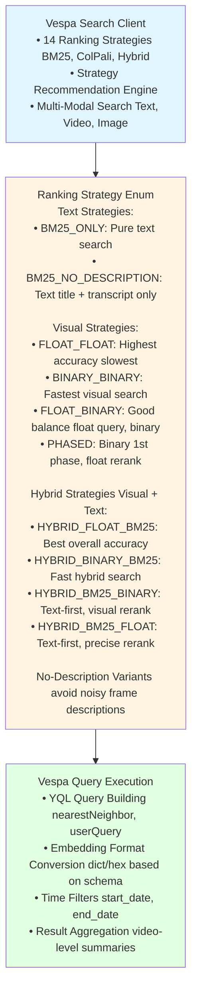
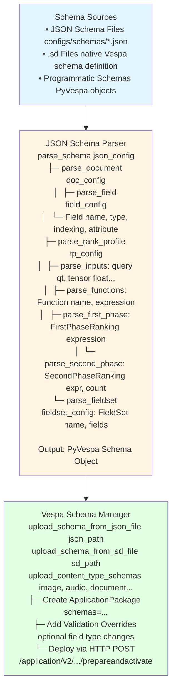

# Backends Module Study Guide (Vespa Integration)

**Last Updated:** 2025-10-07
**Purpose:** Comprehensive guide to Vespa search backend integration, schema management, and embedding format handling
**Module Location:** `src/backends/vespa/`

---

## Table of Contents
1. [Module Overview](#module-overview)
2. [Architecture](#architecture)
3. [Core Components](#core-components)
4. [Data Flow](#data-flow)
5. [Usage Examples](#usage-examples)
6. [Production Considerations](#production-considerations)
7. [Testing](#testing)

---

## Module Overview

### Purpose
The Backends module provides integration with Vespa for vector and hybrid search, handling:
- **Schema Management**: JSON-based schema parsing and deployment
- **Embedding Formats**: Binary vs float conversion for optimal search performance
- **Search Strategies**: 14+ ranking strategies (BM25, ColPali, hybrid)
- **Document Processing**: Strategy-aware format handling
- **Batch Ingestion**: Production-ready document feeding with retry logic

### Key Features
1. **14 Ranking Strategies**: From pure text (BM25) to hybrid visual+text search
2. **Multi-Format Support**: Float (accuracy) and binary (speed) embeddings
3. **Strategy Recommendation**: Automatic strategy selection based on query characteristics
4. **Schema-Driven Processing**: Automatic field mapping based on Vespa schema definitions
5. **Production-Ready Feeding**: Configurable batch sizes, workers, retry logic
6. **Format Conversion**: Numpy → Hex-encoded bfloat16/int8 for Vespa

### Dependencies
- **External**: PyVespa (official Vespa client), NumPy, Torch (for bfloat16 conversion)
- **Internal**: `src/common/document.py`, `src/common/config_utils.py`, `src/common/utils/retry.py`

---

## Architecture

### 1. Vespa Search Client Architecture



### 2. Schema Management Architecture



### 3. Document Processing Architecture

```mermaid
graph TB
    UniversalDoc[Universal Document from ingestion<br/>id: video123_frame_5<br/>embeddings:<br/>  embedding: data: np.ndarray 1024, 128<br/>metadata: frame_id, start_time, end_time]

    UniversalDoc --> StrategyProc[Strategy-Aware Processor<br/>get_required_embeddings schema_name<br/>├─ Extract ranking strategies from schema<br/>├─ needs_float: any strategy uses float embeddings?<br/>└─ needs_binary: any strategy uses binary embeddings?<br/><br/>get_embedding_field_names schema_name<br/>├─ Collect unique embedding field names from strategies<br/>└─ float_field: embedding, binary_field: embedding_binary]

    StrategyProc --> EmbedProc[Vespa Embedding Processor<br/>process_embeddings raw_np_array<br/>├─ _convert_to_float_dict embeddings<br/>│  ├─ Single-vector schemas LVT, _sv_:<br/>│  │  └─ Return raw float list: 0.123, 0.456, ...<br/>│  └─ Patch-based schemas ColPali:<br/>│     └─ Return hex dict: 0: 3F9A..., 1: 4B2C...<br/>│        hex-encoded bfloat16 for efficiency<br/>└─ _convert_to_binary_dict embeddings<br/>   ├─ Binarize: np.where embeddings > 0, 1, 0<br/>   ├─ Pack bits: np.packbits binary, axis=1.astype int8<br/>   ├─ Single-vector: Return hex string: A3F2B1...<br/>   └─ Patch-based: Return hex dict: 0: A3F2...]

    EmbedProc --> VespaClient[Vespa Py Client<br/>process doc: Vespa Document<br/>├─ Map Document fields to schema fields<br/>├─ Add processed embeddings float/binary<br/>├─ Add metadata timestamps, transcripts, descriptions<br/>└─ Create Vespa doc: put: id:video:schema::doc_id, fields<br/><br/>_feed_prepared_batch documents, batch_size=100<br/>├─ Production config: max_queue_size=500, max_workers=4<br/>├─ app.feed_iterable iter, schema, namespace, callback<br/>├─ Retry logic with exponential backoff<br/>└─ Track success/failure per document]

    style UniversalDoc fill:#e1f5ff
    style StrategyProc fill:#fff4e1
    style EmbedProc fill:#ffe1e1
    style VespaClient fill:#e1ffe1
```



---

## Core Components

### 1. VespaVideoSearchClient (`vespa_search_client.py`)

**Purpose**: Main search client with 14 ranking strategies and automatic strategy recommendation.

**Key Attributes**:
```python
vespa_url: str              # Vespa server URL
vespa_port: int             # Vespa server port
vespa_schema: str           # Active schema name (from env VESPA_SCHEMA or config)
query_encoder: QueryEncoder # Automatic encoder initialization based on schema
```

**Key Methods**:

#### `__init__(vespa_url, vespa_port)`
Initialize client and query encoder.
```python
# Automatically detects schema from VESPA_SCHEMA env var or config
# Initializes appropriate query encoder (ColPali, VideoPrism, etc.)
client = VespaVideoSearchClient(
    vespa_url="http://localhost",
    vespa_port=8080
)
```

#### `search(query_params, embeddings, schema)`
Unified search supporting all 14 ranking strategies.
```python
results = client.search(
    query_params={
        "query": "person walking in park",
        "ranking": "hybrid_float_bm25",  # or any RankingStrategy
        "top_k": 10,
        "start_date": "2024-01-01",
        "end_date": "2024-12-31"
    },
    embeddings=query_embeddings,  # Optional, auto-generated if None
    schema="video_colpali_smol500_mv_frame"  # Optional override
)
# Returns: List[Dict] with video_id, frame_id, relevance, timestamps, etc.
```

#### `RankingStrategy.recommend_strategy(has_visual, has_text, speed_priority)`
Automatic strategy selection.
```python
strategy = RankingStrategy.recommend_strategy(
    has_visual_component=True,
    has_text_component=True,
    speed_priority=False  # True → binary, False → float
)
# Returns: RankingStrategy.HYBRID_FLOAT_BM25 (best accuracy)
```

#### `benchmark_strategies(query_params, embeddings, strategies)`
Compare multiple strategies on same query.
```python
results = client.benchmark_strategies(
    query_params={"query": "robotics demo", "top_k": 10},
    embeddings=embeddings,
    strategies=["bm25_only", "hybrid_float_bm25", "hybrid_binary_bm25"]
)
# Returns: Dict[strategy_name, {results, response_time, result_count, strategy_info}]
```

#### `get_video_summary(results)`
Aggregate frame-level results to video-level summaries.
```python
summary = client.get_video_summary(results)
# Returns:
# {
#   "videos": [
#     {
#       "video_id": "abc123",
#       "video_title": "Robotics Demo",
#       "total_relevance": 42.5,
#       "avg_relevance": 8.5,
#       "frame_count": 5,
#       "frames": [
#         {"frame_id": 10, "start_time": 5.0, "relevance": 9.2, ...},
#         ...
#       ]
#     }
#   ],
#   "total_videos": 3,
#   "total_frames": 15
# }
```

**Strategy Comparison Table**:

| Strategy | Speed | Accuracy | Use Case | Requires Embeddings |
|----------|-------|----------|----------|---------------------|
| BM25_ONLY | Fastest | Good (text only) | Pure text queries | No |
| BINARY_BINARY | Fast | Good approximation | Speed-critical visual | Yes (binary) |
| FLOAT_FLOAT | Slowest | Highest visual | Maximum precision | Yes (float) |
| FLOAT_BINARY | Fast | Very good | Balanced speed/accuracy | Yes (float) |
| PHASED | Fast | High | Binary recall + float rerank | Yes (both) |
| HYBRID_FLOAT_BM25 | Slow | Highest overall | Complex visual+text | Yes (float) |
| HYBRID_BINARY_BM25 | Fast | Good hybrid | Fast visual+text | Yes (binary) |

---

### 2. JsonSchemaParser (`json_schema_parser.py`)

**Purpose**: Parse JSON schema definitions and convert to PyVespa objects.

**Key Methods**:

#### `parse_schema(schema_config)`
Parse complete schema from JSON dict.
```python
parser = JsonSchemaParser()

schema_config = {
    "name": "video_frame",
    "document": {
        "fields": [
            {"name": "video_id", "type": "string", "indexing": ["summary", "attribute"]},
            {"name": "embedding", "type": "tensor<float>(patch{}, v[128])", ...},
            ...
        ]
    },
    "rank_profiles": [
        {
            "name": "colpali",
            "inputs": [{"name": "query(qt)", "type": "tensor<float>(querytoken{}, v[128])"}],
            "first_phase": {"expression": "sum(reduce(sum(...), max, patch), querytoken)"}
        }
    ],
    "fieldsets": [
        {"name": "default", "fields": ["video_title", "frame_description", "audio_transcript"]}
    ]
}

schema = parser.parse_schema(schema_config)
# Returns: PyVespa Schema object ready for deployment
```

#### `load_schema_from_json_file(json_file_path)`
Load and parse schema from JSON file.
```python
schema = parser.load_schema_from_json_file(
    "configs/schemas/video_colpali_smol500_mv_frame_schema.json"
)
```

#### `validate_schema_config(schema_config)`
Validate schema configuration.
```python
errors = parser.validate_schema_config(schema_config)
if errors:
    raise ValueError(f"Schema validation errors: {'; '.join(errors)}")
```

---

### 3. VespaSchemaManager (`vespa_schema_manager.py`)

**Purpose**: Deploy schemas to Vespa from JSON or .sd files.

**Key Methods**:

#### `upload_schema_from_json_file(json_file_path, app_name)`
Deploy schema from JSON file.
```python
manager = VespaSchemaManager(
    vespa_endpoint="http://localhost:8080",
    vespa_port=19071  # Deployment port
)

manager.upload_schema_from_json_file(
    json_file_path="configs/schemas/video_frame_schema.json",
    app_name="videosearch"
)
```

#### `upload_content_type_schemas(app_name, schemas)`
Deploy multiple schemas together (avoids schema removal errors).
```python
manager.upload_content_type_schemas(
    app_name="contenttypes",
    schemas=["image_content", "audio_content", "document_visual", "document_text"]
)
```

#### `parse_sd_schema(sd_content)`
Parse native .sd Vespa schema files.
```python
sd_content = manager.read_sd_file("configs/schemas/video_frame.sd")
schema = manager.parse_sd_schema(sd_content)
```

---

### 4. VespaEmbeddingProcessor (`embedding_processor.py`)

**Purpose**: Convert numpy embeddings to Vespa-specific formats (hex-encoded bfloat16/int8).

**Key Methods**:

#### `process_embeddings(raw_embeddings)`
Main entry point for embedding conversion.
```python
processor = VespaEmbeddingProcessor(
    logger=logger,
    model_name="vidore/colsmol-500m",
    schema_name="video_colpali_smol500_mv_frame"
)

raw_embeddings = np.random.randn(1024, 128)  # ColPali patch embeddings

processed = processor.process_embeddings(raw_embeddings)
# Returns:
# {
#   "embedding": {
#     0: "3F9A4B2C...",  # Hex-encoded bfloat16 for patch 0
#     1: "4A1B3C5D...",  # Hex-encoded bfloat16 for patch 1
#     ...
#   },
#   "embedding_binary": {
#     0: "A3F2B1C4...",  # Hex-encoded int8 binary for patch 0
#     1: "B2A1D3E5...",
#     ...
#   }
# }
```

#### `_convert_to_float_dict(embeddings)`
Convert to float format (bfloat16 hex or raw float list).
```python
# Single-vector schema (VideoPrism LVT):
float_embeddings = processor._convert_to_float_dict(np.random.randn(768))
# Returns: [0.123, 0.456, ...]  # Raw float list

# Patch-based schema (ColPali):
float_embeddings = processor._convert_to_float_dict(np.random.randn(1024, 128))
# Returns: {0: "3F9A4B2C...", 1: "4A1B3C5D...", ...}  # Hex bfloat16
```

#### `_convert_to_binary_dict(embeddings)`
Convert to binary format (packed int8 hex).
```python
# Binarize (positive → 1, zero/negative → 0)
# Pack 8 bits per byte
# Hex-encode for Vespa

binary_embeddings = processor._convert_to_binary_dict(np.random.randn(1024, 128))
# Returns: {0: "A3F2B1C4...", 1: "B2A1D3E5...", ...}
```

---

### 5. StrategyAwareProcessor (`strategy_aware_processor.py`)

**Purpose**: Determine embedding requirements based on ranking strategies defined in schema.

**Key Methods**:

#### `get_required_embeddings(schema_name)`
Determine what embeddings are needed.
```python
processor = StrategyAwareProcessor()

requirements = processor.get_required_embeddings("video_colpali_smol500_mv_frame")
# Returns:
# {
#   "needs_float": True,   # Any strategy uses float embeddings?
#   "needs_binary": True   # Any strategy uses binary embeddings?
# }
```

#### `get_embedding_field_names(schema_name)`
Get actual field names from schema.
```python
field_names = processor.get_embedding_field_names("video_colpali_smol500_mv_frame")
# Returns:
# {
#   "float_field": "embedding",
#   "binary_field": "embedding_binary"
# }
```

#### `get_tensor_info(schema_name)`
Extract tensor dimension information.
```python
tensor_info = processor.get_tensor_info("video_colpali_smol500_mv_frame")
# Returns:
# {
#   "qt": {
#     "type": "float",
#     "dimensions": {"querytoken": -1, "v": 128}  # -1 = variable size
#   },
#   "qtb": {
#     "type": "int8",
#     "dimensions": {"querytoken": -1, "v": 16}  # 128 bits packed to 16 bytes
#   }
# }
```

---

### 6. VespaPyClient (`ingestion_client.py`)

**Purpose**: Production-ready Vespa client for batch document feeding with retry logic.

**Key Attributes**:
```python
schema_name: str           # Vespa schema to use (required, no fallbacks)
app: Vespa                 # PyVespa application instance
feed_config: Dict          # Production feeding parameters:
                           # - max_queue_size: 500
                           # - max_workers: 4
                           # - max_connections: 8
                           # - compress: "auto"
```

**Key Methods**:

#### `__init__(config, logger)`
Initialize client from config.
```python
client = VespaPyClient(
    config={
        "schema_name": "video_colpali_smol500_mv_frame",
        "vespa_url": "http://localhost",
        "vespa_port": 8080,
        "feed_max_queue_size": 500,
        "feed_max_workers": 4
    },
    logger=logger
)
```

#### `process(doc)`
Convert universal Document to Vespa format.
```python
from src.common.document import Document

doc = Document(
    id="video123_frame_5",
    embeddings={
        "embedding": {"data": np.random.randn(1024, 128)}
    },
    metadata={
        "frame_id": 5,
        "start_time": 2.5,
        "end_time": 3.0,
        "audio_transcript": "Discussion about AI safety"
    }
)

vespa_doc = client.process(doc)
# Returns:
# {
#   "put": "id:video:video_colpali_smol500_mv_frame::video123_frame_5",
#   "fields": {
#     "embedding": {0: "3F9A...", 1: "4B2C...", ...},
#     "embedding_binary": {0: "A3F2...", 1: "B1C4...", ...},
#     "frame_id": 5,
#     "start_time": 2.5,
#     "end_time": 3.0,
#     "audio_transcript": "Discussion about AI safety",
#     "creation_timestamp": 1609459200000
#   }
# }
```

#### `_feed_prepared_batch(documents, batch_size=100)`
Feed documents with retry logic.
```python
vespa_docs = [client.process(doc) for doc in documents]

success_count, failed_doc_ids = client._feed_prepared_batch(
    documents=vespa_docs,
    batch_size=100
)

print(f"Fed {success_count}/{len(vespa_docs)} documents successfully")
if failed_doc_ids:
    print(f"Failed documents: {failed_doc_ids}")
```

---

## Data Flow

### End-to-End Document Ingestion Flow

```
1. INGESTION PIPELINE
   ↓
   Universal Document {
     id: "video123_frame_5",
     embeddings: {"embedding": {"data": np.ndarray(1024, 128)}},
     metadata: {frame_id, timestamps, transcript, ...}
   }
   ↓
2. VESPA PY CLIENT
   process(doc)
   ├── Strategy-aware requirements check
   │   └── What embeddings does this schema need?
   ├── Embedding processing
   │   ├── Float: np.ndarray → hex-encoded bfloat16 dict
   │   └── Binary: np.ndarray → binarized → packed int8 → hex dict
   ├── Field mapping (schema-driven)
   │   └── Only add fields that exist in schema definition
   └── Create Vespa document structure
   ↓
3. BATCH FEEDING
   _feed_prepared_batch(documents, batch_size=100)
   ├── Production config: 500 queue, 4 workers, 8 connections
   ├── app.feed_iterable(iter, schema, namespace, callback)
   ├── Per-document callback tracking
   └── Retry with exponential backoff
   ↓
4. VESPA STORAGE
   Documents indexed in Vespa with:
   ├── Float embeddings for precise ranking
   ├── Binary embeddings for fast retrieval
   └── Text fields for BM25 search
```

### End-to-End Search Flow

```
1. USER QUERY
   "Show me videos of robotics demonstrations"
   ↓
2. QUERY ENCODING
   ├── Routing agent determines has_visual_component=True
   ├── Query encoder (ColPali/VideoPrism) generates embeddings
   └── embeddings: np.ndarray(1024, 128)
   ↓
3. STRATEGY SELECTION
   recommend_strategy(has_visual=True, has_text=True, speed_priority=False)
   └── Recommended: HYBRID_FLOAT_BM25 (best accuracy)
   ↓
4. VESPA SEARCH CLIENT
   search(query_params={
     "query": "robotics demonstrations",
     "ranking": "hybrid_float_bm25",
     "top_k": 10
   }, embeddings=embeddings)
   ├── Build YQL: nearestNeighbor(embedding, qt)
   ├── Convert embeddings to Vespa format:
   │   └── {0: [0.123, 0.456, ...], 1: [...], ...}
   ├── Add text query for BM25 component
   └── Execute Vespa query
   ↓
5. VESPA RANKING
   Ranking Profile: hybrid_float_bm25
   ├── First Phase: Visual similarity (ColPali max_sim)
   │   └── Retrieve top 1000 candidates
   ├── Second Phase: BM25 text re-ranking
   │   └── Rerank top 100 with text similarity
   └── Return top 10 results
   ↓
6. RESULT PROCESSING
   get_video_summary(results)
   ├── Aggregate frames by video_id
   ├── Calculate total_relevance, avg_relevance
   ├── Sort frames by relevance within each video
   └── Sort videos by total_relevance
   ↓
7. RETURN TO USER
   {
     "videos": [
       {
         "video_id": "robotics_demo_2024",
         "video_title": "Advanced Robotics Demonstration",
         "total_relevance": 45.2,
         "avg_relevance": 9.04,
         "frame_count": 5,
         "frames": [
           {"frame_id": 25, "start_time": 12.5, "relevance": 9.8, ...},
           ...
         ]
       }
     ]
   }
```

---

## Usage Examples

### Example 1: Simple Video Search

```python
from src.backends.vespa.vespa_search_client import VespaVideoSearchClient

# Initialize client
client = VespaVideoSearchClient(
    vespa_url="http://localhost",
    vespa_port=8080
)

# Simple text search
results = client.search({
    "query": "person walking in park",
    "ranking": "bm25_only",  # Text-only search
    "top_k": 10
})

# Print results
for result in results:
    print(f"Video: {result['video_title']}")
    print(f"  Frame {result['frame_id']} @ {result['start_time']}s")
    print(f"  Relevance: {result['relevance']:.3f}")
    print(f"  Description: {result['frame_description']}")
    print()
```

### Example 2: Visual Search with Automatic Embedding Generation

```python
# Client automatically generates embeddings if not provided
results = client.search({
    "query": "robot arm picking up objects",
    "ranking": "float_float",  # Pure visual search with highest accuracy
    "top_k": 10
})

# Get video-level summary
summary = client.get_video_summary(results)

print(f"Found {summary['total_videos']} videos with {summary['total_frames']} matching frames")
for video in summary['videos']:
    print(f"\nVideo: {video['video_title']}")
    print(f"  Relevance: {video['avg_relevance']:.3f} (avg) / {video['total_relevance']:.3f} (total)")
    print(f"  Matching frames: {video['frame_count']}")
    for frame in video['frames'][:3]:  # Top 3 frames
        print(f"    - Frame {frame['frame_id']} @ {frame['start_time']}s (score: {frame['relevance']:.3f})")
```

### Example 3: Hybrid Search with Strategy Recommendation

```python
from src.backends.vespa.vespa_search_client import RankingStrategy

# Automatic strategy recommendation
query_text = "Marie Curie explaining radioactivity"
has_visual = True  # User wants to see videos
has_text = True    # Query has text content

recommended = RankingStrategy.recommend_strategy(
    has_visual_component=has_visual,
    has_text_component=has_text,
    speed_priority=False  # Prefer accuracy over speed
)

print(f"Recommended strategy: {recommended.value}")
# Output: "hybrid_float_bm25"

# Execute search with recommended strategy
results = client.search({
    "query": query_text,
    "ranking": recommended.value,
    "top_k": 10,
    "start_date": "2024-01-01"  # Filter by creation date
})
```

### Example 4: Schema Deployment from JSON

```python
from src.backends.vespa.vespa_schema_manager import VespaSchemaManager

manager = VespaSchemaManager(
    vespa_endpoint="http://localhost:8080",
    vespa_port=19071
)

# Deploy schema from JSON file
manager.upload_schema_from_json_file(
    json_file_path="configs/schemas/video_colpali_smol500_mv_frame_schema.json",
    app_name="videosearch"
)

print("Schema deployed successfully!")

# Alternatively, deploy multiple schemas together
manager.upload_content_type_schemas(
    app_name="contenttypes",
    schemas=["image_content", "audio_content", "document_visual"]
)
```

### Example 5: Document Processing and Batch Feeding

```python
from src.backends.vespa.ingestion_client import VespaPyClient
from src.common.document import Document
import numpy as np

# Initialize client
client = VespaPyClient(
    config={
        "schema_name": "video_colpali_smol500_mv_frame",
        "vespa_url": "http://localhost",
        "vespa_port": 8080,
        "feed_max_queue_size": 500,
        "feed_max_workers": 4
    },
    logger=logger
)

# Connect to Vespa
client.connect()

# Create documents
documents = []
for i in range(100):
    doc = Document(
        id=f"video123_frame_{i}",
        embeddings={
            "embedding": {
                "data": np.random.randn(1024, 128)  # ColPali embeddings
            }
        },
        metadata={
            "frame_id": i,
            "start_time": i * 0.5,
            "end_time": (i + 1) * 0.5,
            "frame_description": f"Frame {i} description",
            "audio_transcript": f"Transcript for frame {i}"
        }
    )
    documents.append(doc)

# Process documents to Vespa format
vespa_docs = [client.process(doc) for doc in documents]

# Feed in batches
success_count, failed_ids = client._feed_prepared_batch(
    documents=vespa_docs,
    batch_size=100
)

print(f"Successfully fed {success_count}/{len(vespa_docs)} documents")
if failed_ids:
    print(f"Failed document IDs: {failed_ids}")
```

### Example 6: Strategy Benchmarking

```python
# Compare multiple strategies on same query
benchmark_results = client.benchmark_strategies(
    query_params={
        "query": "Boston Dynamics robot demonstration",
        "top_k": 10
    },
    embeddings=query_embeddings,
    strategies=["bm25_only", "binary_binary", "float_float", "hybrid_float_bm25"]
)

# Analyze performance
print("Strategy Performance Comparison:")
print("-" * 80)
for strategy, data in benchmark_results.items():
    if "error" in data:
        print(f"{strategy}: ERROR - {data['error']}")
    else:
        print(f"{strategy}:")
        print(f"  Response time: {data['response_time']:.3f}s")
        print(f"  Results: {data['result_count']}")
        print(f"  Speed: {data['strategy_info']['speed']}")
        print(f"  Accuracy: {data['strategy_info']['accuracy']}")
        print()
```

---

## Production Considerations

### 1. Embedding Format Selection

**Float Embeddings (bfloat16 hex)**:
- **Use when**: Accuracy is critical, acceptable latency (~50-200ms)
- **Tradeoff**: Higher precision, slower search, larger storage
- **Strategies**: FLOAT_FLOAT, HYBRID_FLOAT_BM25, HYBRID_BM25_FLOAT
- **Storage**: ~2KB per frame for ColPali (1024 patches × 128 dims × 2 bytes)

**Binary Embeddings (int8 hex)**:
- **Use when**: Speed is critical, high throughput needed
- **Tradeoff**: Lower precision (~90-95% of float accuracy), 10x faster, 16x smaller storage
- **Strategies**: BINARY_BINARY, HYBRID_BINARY_BM25, HYBRID_BM25_BINARY
- **Storage**: ~128 bytes per frame (1024 patches × 128 bits / 8)

**Hybrid (Binary 1st phase + Float 2nd phase)**:
- **Use when**: Best of both worlds - fast retrieval, precise reranking
- **Tradeoff**: Requires storing both formats (2.1KB total)
- **Strategies**: PHASED, FLOAT_BINARY
- **Recommended**: Default choice for production video search

### 2. Batch Feeding Configuration

**Production-Ready Settings**:
```python
feed_config = {
    "max_queue_size": 500,      # Higher = better throughput, more memory
    "max_workers": 4,            # CPU cores / 2 for CPU-bound tasks
    "max_connections": 8,        # 2x max_workers for I/O overlap
    "compress": "auto"           # Enable compression for network efficiency
}
```

**Tuning Guidelines**:
- **High throughput** (>1000 docs/sec): Increase `max_workers` to 8-16, `max_queue_size` to 1000
- **Memory constrained**: Reduce `max_queue_size` to 100-200
- **Network constrained**: Enable `compress: true`, reduce `batch_size` to 50
- **Error-prone network**: Enable retry logic, reduce `max_connections` to 4

### 3. Schema Design Best Practices

**Field Indexing**:
- **attribute + fast-search**: IDs, timestamps for filtering (`video_id`, `frame_id`, `creation_timestamp`)
- **index + enable-bm25**: Text fields for search (`video_title`, `frame_description`, `audio_transcript`)
- **attribute only**: Embeddings (`embedding`, `embedding_binary`)
- **summary**: Fields to return in results (all returned fields)

**Rank Profile Design**:
- **First Phase**: Fast, approximate ranking (binary search, BM25)
- **Second Phase**: Precise re-ranking on top-k (float embeddings, complex expressions)
- **Rerank Count**: 100-1000 for good precision/speed tradeoff

**Tensor Dimensions**:
- **Mapped dimensions** (`patch{}`): Variable-size, sparse tensors (ColPali patches)
- **Indexed dimensions** (`v[128]`): Fixed-size, dense tensors (embedding vectors)
- **Query tensors**: Always use mapped dimensions for flexibility (`querytoken{}`)

### 4. Query Optimization

**YQL Query Building**:
- **nearestNeighbor**: Use for dense vector search with ANN (Approximate Nearest Neighbor)
- **userQuery**: Use for BM25 text search
- **Time filters**: Add as `AND` clauses to WHERE (indexed for fast filtering)
- **targetHits**: Set to 100-1000 for good recall in nearestNeighbor

**Embedding Conversion**:
- **Single-vector schemas**: Send as raw list `[0.123, 0.456, ...]`
- **Patch-based schemas**: Send as dict `{0: [0.123, ...], 1: [0.456, ...], ...}`
- **Binary embeddings**: Always hex-encode int8 arrays
- **Float embeddings**: Raw floats for single-vector, hex bfloat16 for patches

### 5. Error Handling and Monitoring

**Retry Logic**:
```python
@retry_with_backoff(config=RetryConfig(max_attempts=3, initial_delay=1.0))
def connect():
    # Connection with exponential backoff
    # Retries: 1s, 2s, 4s
```

**Feed Monitoring**:
```python
def callback(response, doc_id):
    if response.is_successful():
        success_count += 1
        logger.info(f"✓ {doc_id} fed successfully")
    else:
        error_msg = response.get_json()
        logger.error(f"✗ {doc_id} failed: {error_msg}")
        failed_docs.append(doc_id)
```

**Health Checks**:
```python
# Check Vespa health
if client.health_check():
    logger.info("Vespa is healthy")
else:
    logger.error("Vespa health check failed")
    # Trigger alert, retry, or fallback
```

### 6. Performance Benchmarks

**Search Latency** (ColPali, 10K frames):
- **BM25_ONLY**: 5-10ms (no embeddings)
- **BINARY_BINARY**: 20-30ms (fast visual)
- **FLOAT_FLOAT**: 150-200ms (precise visual)
- **HYBRID_FLOAT_BM25**: 180-250ms (best accuracy)
- **PHASED**: 40-60ms (binary recall + float rerank)

**Ingestion Throughput** (100-doc batches):
- **4 workers, 500 queue**: 500-1000 docs/sec
- **8 workers, 1000 queue**: 1000-2000 docs/sec
- **16 workers, 2000 queue**: 2000-3000 docs/sec (diminishing returns)

**Storage Requirements** (per frame):
- **Float embeddings**: 2KB (1024 patches × 128 dims × 2 bytes bfloat16)
- **Binary embeddings**: 128 bytes (1024 patches × 128 bits / 8)
- **Text fields**: 500 bytes avg (title + description + transcript)
- **Total per frame**: ~2.6KB (float + binary + text)

---

## Testing

### Key Test Files

**Unit Tests**:
- `tests/backends/unit/test_embedding_processor.py` - Embedding format conversion
- `tests/backends/unit/test_json_schema_parser.py` - Schema parsing logic
- `tests/backends/unit/test_strategy_aware_processor.py` - Strategy requirement detection

**Integration Tests**:
- `tests/ingestion/integration/test_backend_ingestion.py` - End-to-end document feeding
- `tests/system/test_real_system_integration.py` - Real Vespa connection and search
- `tests/agents/integration/test_video_search_agent_integration.py` - Search client integration

**Test Scenarios**:

1. **Embedding Format Conversion**:
   ```python
   # Test float conversion
   embeddings = np.random.randn(1024, 128)
   processor = VespaEmbeddingProcessor(schema_name="video_colpali_smol500_mv_frame")
   processed = processor.process_embeddings(embeddings)
   assert "embedding" in processed
   assert isinstance(processed["embedding"], dict)
   assert len(processed["embedding"]) == 1024  # 1024 patches
   ```

2. **Schema Parsing**:
   ```python
   parser = JsonSchemaParser()
   schema = parser.load_schema_from_json_file("configs/schemas/test_schema.json")
   assert schema.name == "test_schema"
   assert len(schema.document.fields) > 0
   assert len(schema.rank_profiles) > 0
   ```

3. **Search Strategies**:
   ```python
   client = VespaVideoSearchClient()

   # Test BM25 text search
   results = client.search({"query": "test", "ranking": "bm25_only", "top_k": 10})
   assert len(results) <= 10

   # Test visual search
   embeddings = np.random.randn(1024, 128)
   results = client.search({"query": "test", "ranking": "float_float", "top_k": 10}, embeddings=embeddings)
   assert len(results) <= 10
   ```

4. **Batch Feeding**:
   ```python
   client = VespaPyClient(config={...})
   client.connect()

   documents = [create_test_document(i) for i in range(100)]
   vespa_docs = [client.process(doc) for doc in documents]

   success_count, failed_ids = client._feed_prepared_batch(vespa_docs, batch_size=100)
   assert success_count == 100
   assert len(failed_ids) == 0
   ```

---

**Key File References**:
- `src/backends/vespa/vespa_search_client.py` (vespa_search_client.py:1-976)
- `src/backends/vespa/json_schema_parser.py` (json_schema_parser.py:1-227)
- `src/backends/vespa/vespa_schema_manager.py` (vespa_schema_manager.py:1-969)
- `src/backends/vespa/embedding_processor.py` (embedding_processor.py:1-159)
- `src/backends/vespa/strategy_aware_processor.py` (strategy_aware_processor.py:1-250)
- `src/backends/vespa/ingestion_client.py` (ingestion_client.py:1-458)

**Related Study Guides**:
- See `01_AGENTS_MODULE.md` for VideoSearchAgent integration
- See `03_COMMON_MODULE.md` for Document and config utilities
- See `07_INGESTION_MODULE.md` for video processing pipeline

---

**Last Updated:** 2025-10-07
**Maintainer:** Development Team
**Status:** Complete
