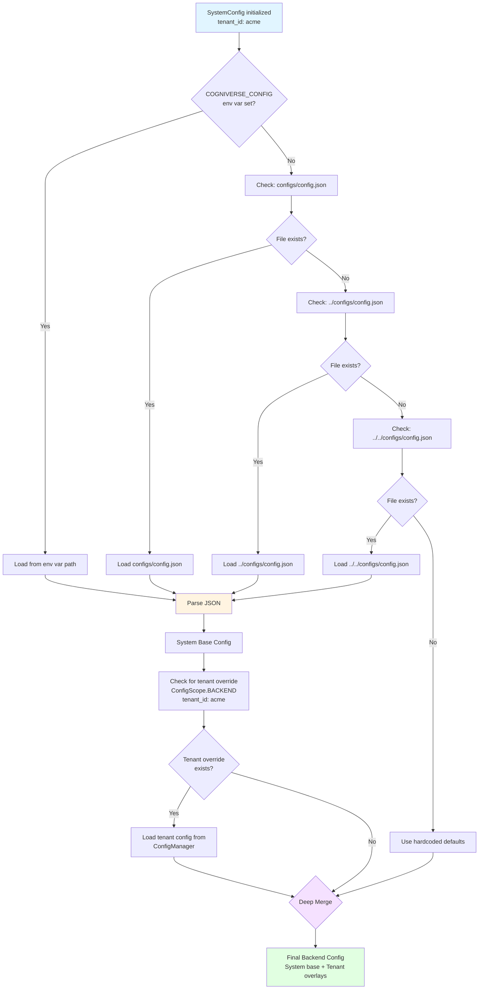
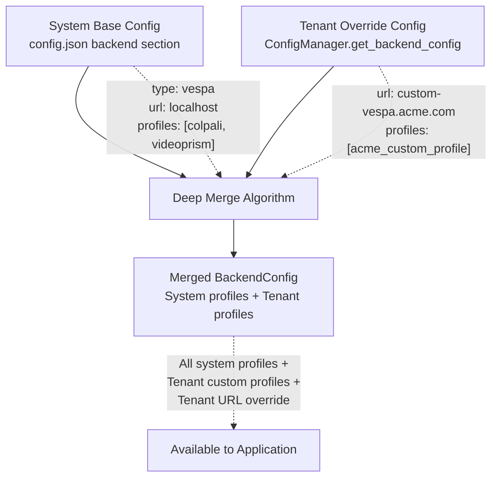
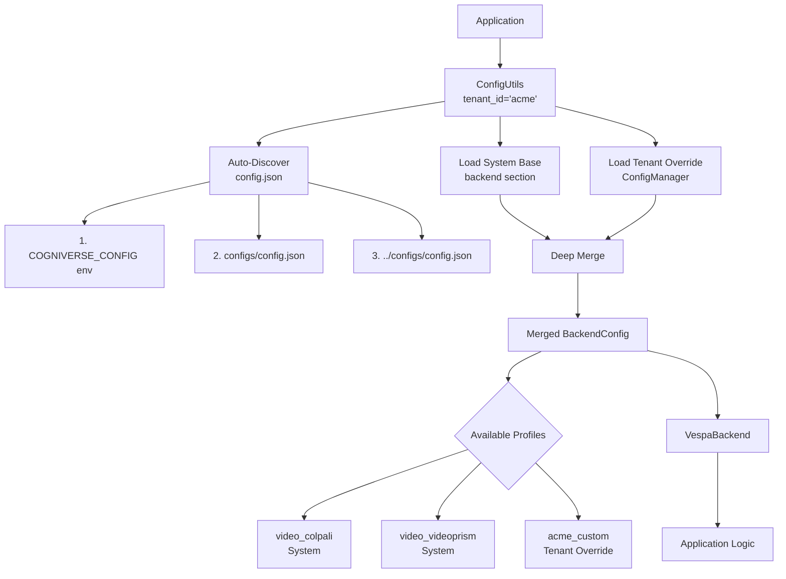
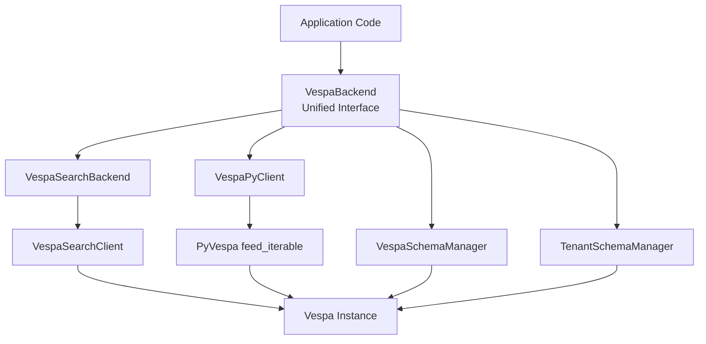
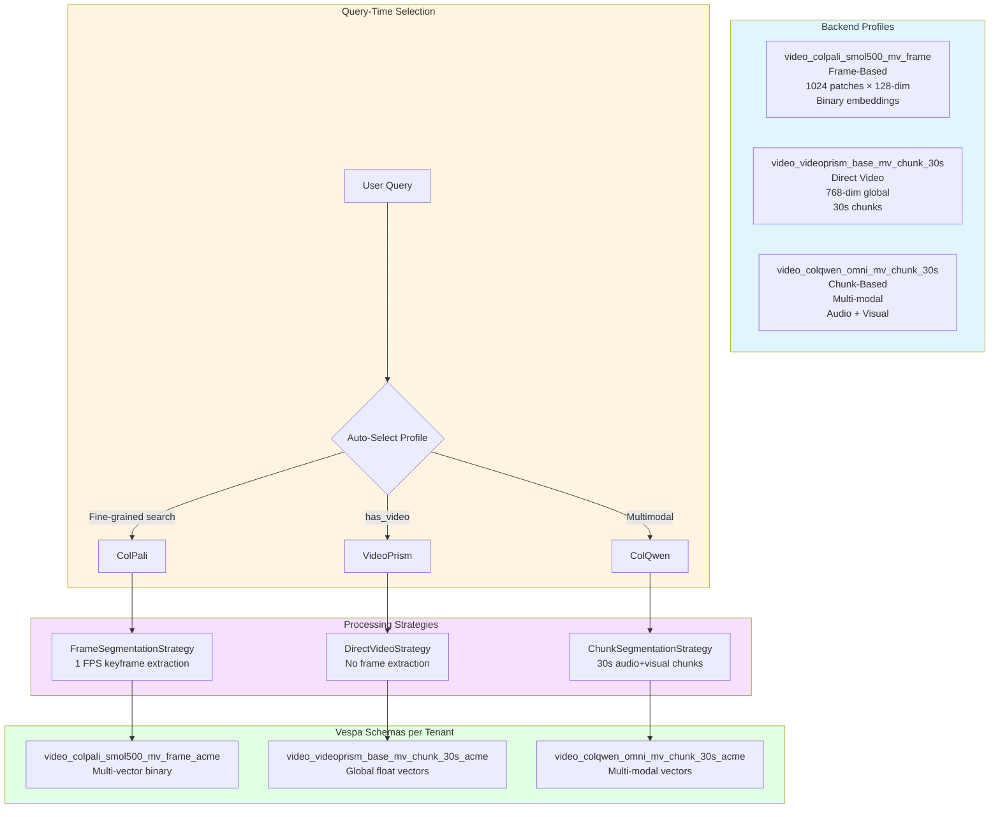
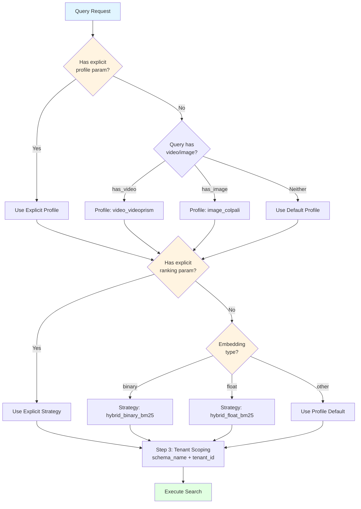
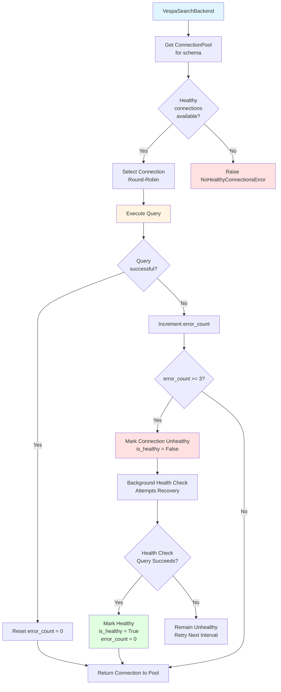
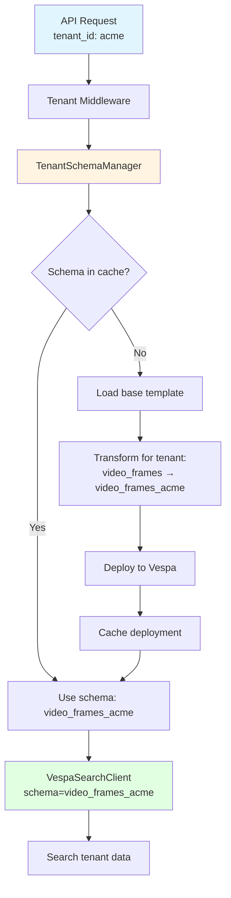

# Backends Module (Vespa Integration)

**Package:** `cogniverse_vespa` (Implementation Layer)
**Location:** `libs/vespa/cogniverse_vespa/`
**Purpose:** Vespa backend integration with multi-tenant schema management
**Last Updated:** 2025-01-18

---

## Table of Contents

1. [Module Overview](#module-overview)
2. [Package Structure](#package-structure)
3. [Multi-Tenant Schema Management](#multi-tenant-schema-management)
4. [Search Client](#search-client)
5. [Ingestion Client](#ingestion-client)
6. [Metadata Schema Management](#metadata-schema-management)
7. [Usage Examples](#usage-examples)
8. [Testing](#testing)

---

## Module Overview

The Vespa package (`cogniverse-vespa`) provides backend integration for vector and hybrid search with multi-tenant support.

### Key Features

1. **Multi-Tenant Schema Management**: Physical isolation via schema-per-tenant
2. **Search Backend**: Video search with ColPali and VideoPrism embeddings
3. **Ingestion**: Batch document feeding with retry logic
4. **Schema Deployment**: JSON-based schema parsing and deployment
5. **Tenant Isolation**: Dedicated schemas for each tenant

### Design Principles

- **Tenant-Aware**: All clients require tenant-specific schema names
- **Schema-Per-Tenant**: Physical data isolation via dedicated Vespa schemas
- **Core Integration**: Depends only on `cogniverse_core` package
- **Production-Ready**: Retry logic, health checks, batch processing

### Package Dependencies

```python
# Vespa package depends on:
from cogniverse_core.config.unified_config import SystemConfig
from cogniverse_core.telemetry.manager import TelemetryManager
```

**External Dependencies**:
- `pyvespa>=0.59.0`: Official Vespa Python client
- `numpy>=1.24.0`: Array operations

---

## Package Structure

```
libs/vespa/cogniverse_vespa/
├── __init__.py
├── tenant_schema_manager.py        # Multi-tenant schema management (702 lines)
├── vespa_schema_manager.py         # Schema deployment
├── vespa_search_client.py          # Search operations (975 lines)
├── ingestion_client.py             # Ingestion client (VespaPyClient class)
├── json_schema_parser.py           # JSON schema parsing (238 lines)
├── backend.py                      # Backend abstraction
├── search_backend.py               # Search backend implementation
├── tenant_aware_search_client.py   # Tenant-aware search wrapper
├── embedding_processor.py          # Embedding processing
├── config.py                       # Configuration management
├── config_store.py                 # Config storage
├── memory_config.py                # Memory configuration
├── memory_store.py                 # Memory storage
├── metadata_schemas.py             # Metadata schema definitions
├── ranking_strategy_extractor.py   # Ranking strategy extraction
└── strategy_aware_processor.py     # Strategy-aware processing
```

**Total Files**: 17 Python files (all at top level, NO subdirectories)

**Key Files**:
- `tenant_schema_manager.py`: 702 lines - Core tenant management
- `vespa_search_client.py`: 975 lines - Search operations
- `json_schema_parser.py`: 238 lines - Schema parsing
- `ingestion_client.py`: PyVespa wrapper for ingestion

**Note**: Schema templates (.sd files) are located in `configs/schemas/` at project root, not in the package

---

## Backend Configuration Architecture

### Overview

Cogniverse uses a **profile-based backend configuration system** with multi-tenant support. Configuration is loaded from `config.json` with auto-discovery and supports deep merging of system base config with tenant-specific overlays.

**Key Features**:
- **Auto-Discovery**: Automatic config.json discovery from standard locations
- **Profile-Based**: Multiple processing profiles per backend (ColPali, VideoPrism, ColQwen-Omni, etc.)
- **Tenant Overlays**: Tenant-specific config merges with system base
- **Deep Merge**: System profiles + Tenant overrides = Merged configuration
- **Type-Safe**: BackendConfig and BackendProfileConfig dataclasses

### Configuration Auto-Discovery

**Search Order** (defined in `cogniverse_core/config/utils.py:_discover_config_file()`):

1. `COGNIVERSE_CONFIG` environment variable (if set)
2. `configs/config.json` (from current directory)
3. `../configs/config.json` (one level up)
4. `../../configs/config.json` (two levels up)

```python
# Automatic discovery - no environment variables needed!
from cogniverse_core.config.utils import ConfigUtils

config_utils = ConfigUtils(tenant_id="acme")
backend_config = config_utils.get("backend")  # Auto-discovered and merged
```

#### Auto-Discovery Flow



### Backend Configuration Structure

#### config.json Structure

```json
{
  "backend": {
    "type": "vespa",
    "url": "http://localhost",
    "port": 8080,
    "profiles": {
      "video_colpali_smol500_mv_frame": {
        "type": "video",
        "description": "Frame-based ColPali for patch-level visual search",
        "schema_name": "video_colpali_smol500_mv_frame",
        "embedding_model": "vidore/colsmol-500m",
        "pipeline_config": {
          "extract_keyframes": true,
          "transcribe_audio": true,
          "keyframe_fps": 1.0
        },
        "strategies": {
          "segmentation": {"class": "FrameSegmentationStrategy", "params": {}},
          "embedding": {"class": "MultiVectorEmbeddingStrategy", "params": {}}
        },
        "embedding_type": "frame_based",
        "schema_config": {
          "num_patches": 1024,
          "embedding_dim": 128,
          "binary_dim": 16
        }
      },
      "video_videoprism_base_mv_chunk_30s": {
        "type": "video",
        "description": "VideoPrism for 30-second chunk embeddings",
        "schema_name": "video_videoprism_base_mv_chunk_30s",
        "embedding_model": "videoprism_public_v1_base_hf",
        "embedding_type": "direct_video_segment",
        "schema_config": {
          "embedding_dim": 768,
          "binary_dim": 96
        }
      }
    }
  }
}
```

#### BackendProfileConfig Dataclass

```python
from cogniverse_core.config.unified_config import BackendProfileConfig

profile = BackendProfileConfig(
    profile_name="video_colpali_smol500_mv_frame",
    type="video",
    description="Frame-based ColPali processing",
    schema_name="video_colpali_smol500_mv_frame",  # Vespa schema name
    embedding_model="vidore/colsmol-500m",
    pipeline_config={
        "extract_keyframes": True,
        "transcribe_audio": True,
        "keyframe_fps": 1.0
    },
    strategies={
        "segmentation": {"class": "FrameSegmentationStrategy"},
        "embedding": {"class": "MultiVectorEmbeddingStrategy"}
    },
    embedding_type="frame_based",
    schema_config={
        "num_patches": 1024,
        "embedding_dim": 128,
        "binary_dim": 16
    }
)
```

**Profile Fields**:
- `profile_name`: Unique identifier for the profile
- `schema_name`: Vespa schema name (without tenant suffix)
- `embedding_model`: HuggingFace model ID or local path
- `pipeline_config`: Video processing pipeline settings
- `strategies`: Processing strategy classes and params
- `embedding_type`: Type of embeddings (frame_based, video_chunks, direct_video_segment)
- `schema_config`: Schema-specific metadata (dimensions, patches, etc.)

#### BackendConfig Dataclass

```python
from cogniverse_core.config.unified_config import BackendConfig, BackendProfileConfig

config = BackendConfig(
    tenant_id="acme",
    backend_type="vespa",
    url="http://localhost",
    port=8080,
    profiles={
        "video_colpali_smol500_mv_frame": profile1,
        "video_videoprism_base_mv_chunk_30s": profile2
    }
)

# Get specific profile
profile = config.get_profile("video_colpali_smol500_mv_frame")

# Add new profile
config.add_profile(new_profile)
```

### Tenant Configuration Overlay

#### Deep Merge Algorithm

System base config + Tenant-specific overrides = Merged configuration



**Merge Rules** (from `config/utils.py:_ensure_backend_config()`):

1. **Profiles**: Dict merge - tenant profiles override system profiles with same name
2. **Backend Type**: Tenant value OR system value (tenant takes precedence)
3. **URL**: Tenant value if not default, otherwise system value
4. **Port**: Tenant value if not default, otherwise system value
5. **Metadata**: Dict merge - tenant metadata extends system metadata

```python
# System config.json
{
  "backend": {
    "url": "http://localhost",
    "port": 8080,
    "profiles": {
      "video_colpali": {...},
      "video_videoprism": {...}
    }
  }
}

# Tenant "acme" override (stored in ConfigManager)
tenant_config = BackendConfig(
    tenant_id="acme",
    url="http://vespa.acme.com",
    port=8080,
    profiles={
        "acme_custom_profile": {...}
    }
)

# Merged result for tenant "acme"
# → url: http://vespa.acme.com (tenant override)
# → profiles: {video_colpali, video_videoprism, acme_custom_profile} (merged)
```

#### Partial Profile Updates

```python
from cogniverse_core.config.unified_config import BackendConfig

# Merge overrides into existing profile
modified_profile = config.merge_profile(
    profile_name="video_colpali_smol500_mv_frame",
    overrides={
        "pipeline_config": {"keyframe_fps": 2.0},  # Only override FPS
        "embedding_model": "vidore/colsmol-500m-v2"  # Update model
    }
)

# Original profile unchanged, returns new profile with merged values
```

### Using Backend Configuration

#### Example 1: Load Merged Config for Tenant

```python
from cogniverse_core.config.utils import ConfigUtils

# Auto-discovers config.json and merges with tenant overrides
config_utils = ConfigUtils(tenant_id="acme")

# Get merged backend config
backend_dict = config_utils.get("backend")

# Access profile
profiles = backend_dict["profiles"]
colpali_profile = profiles["video_colpali_smol500_mv_frame"]
```

#### Example 2: Get BackendConfig Object

```python
from cogniverse_core.config.manager import ConfigManager
from cogniverse_core.config.unified_config import BackendConfig

manager = ConfigManager()

# Get tenant backend config (includes system base + tenant overlay merge)
backend_config: BackendConfig = manager.get_backend_config(tenant_id="acme")

# Get specific profile
profile = backend_config.get_profile("video_colpali_smol500_mv_frame")

print(f"Schema: {profile.schema_name}")
print(f"Model: {profile.embedding_model}")
print(f"Strategies: {profile.strategies.keys()}")
```

#### Example 3: Set Tenant-Specific Backend Config

```python
from cogniverse_core.config.manager import ConfigManager
from cogniverse_core.config.unified_config import BackendConfig, BackendProfileConfig

manager = ConfigManager()

# Create tenant-specific profile
tenant_profile = BackendProfileConfig(
    profile_name="acme_high_fps",
    schema_name="video_colpali_smol500_mv_frame",
    embedding_model="vidore/colsmol-500m",
    pipeline_config={"keyframe_fps": 5.0},  # 5 FPS instead of 1 FPS
    embedding_type="frame_based"
)

# Set tenant backend config
tenant_backend = BackendConfig(
    tenant_id="acme",
    url="http://vespa.acme.com",
    profiles={"acme_high_fps": tenant_profile}
)

manager.set_backend_config(tenant_backend)
```

### Architecture Diagram



---

## Backend Abstraction Layer

### VespaBackend Class

**Location**: `libs/vespa/cogniverse_vespa/backend.py`

**Purpose**: Unified backend interface that wraps VespaSearchBackend and VespaPyClient, providing a single abstraction for both search and ingestion operations.

```python
from cogniverse_vespa.backend import VespaBackend

# Initialize with merged config
backend = VespaBackend()
backend.initialize({
    "tenant_id": "acme",
    "schema_name": "video_colpali_smol500_mv_frame_acme",
    "backend": {
        "url": "http://localhost",
        "port": 8080,
        "profiles": {...}
    }
})

# Search
results = await backend.search(query="cooking video", top_k=10)

# Ingest
await backend.ingest_documents(documents)
```

**Key Features**:
- **Unified Interface**: Single class for search + ingestion
- **Profile-Aware**: Automatically uses profile config from BackendConfig
- **Tenant-Aware**: Handles tenant schema routing internally
- **Lazy Initialization**: Components created on-demand per operation

### Architecture Diagram



**Why VespaBackend?**
- **Eliminates Vespa-specific imports**: Application code doesn't import VespaSearchClient or VespaPyClient directly
- **Simplified API**: One class instead of multiple clients
- **Consistent interface**: Same initialization and method signatures
- **Future-proof**: Can swap Vespa with other backends without changing application code

---

## Profile-Based Architecture

### What is a Profile?

A **profile** is a complete video processing configuration that defines:
1. **Embedding Model**: Which model to use (ColPali, VideoPrism, ColQwen-Omni)
2. **Processing Pipeline**: Keyframe extraction, transcription, description generation
3. **Segmentation Strategy**: Frame-based, chunk-based, or direct video
4. **Vespa Schema**: Which schema structure to use
5. **Ranking Strategies**: How to score and rank results

### Profile Types

#### Multi-Profile Architecture



#### Frame-Based Profiles
**Example**: `video_colpali_smol500_mv_frame`
- Extracts keyframes at fixed FPS (1-5 FPS)
- Generates patch-level embeddings per frame
- Schema: Multi-vector with 1024 patches × 128 dimensions
- Best for: Fine-grained visual search, specific objects/text in frames

#### Chunk-Based Profiles
**Example**: `video_colqwen_omni_mv_chunk_30s`
- Segments video into 30-second chunks
- Processes audio + visual together
- Schema: Multi-vector with multimodal understanding
- Best for: Semantic content search, audio+visual comprehension

#### Direct Video Profiles
**Example**: `video_videoprism_base_mv_chunk_30s`
- Native video understanding without keyframes
- Global 768-dim or 1024-dim embeddings
- Schema: High-dimensional global vectors
- Best for: Video-level semantic similarity, scene understanding

### Profile Selection at Query Time

```python
from cogniverse_core.config.utils import ConfigUtils

config = ConfigUtils(tenant_id="acme")
backend_config = config.get("backend")

# List available profiles
profiles = backend_config["profiles"].keys()
# → ['video_colpali_smol500_mv_frame', 'video_videoprism_base_mv_chunk_30s', ...]

# Select profile dynamically
profile_name = "video_colpali_smol500_mv_frame"
profile = backend_config["profiles"][profile_name]

# Initialize backend with selected profile
from cogniverse_vespa.backend import VespaBackend

backend = VespaBackend()
backend.initialize({
    "tenant_id": "acme",
    "schema_name": profile["schema_name"],
    "profile": profile_name,
    "backend": backend_config
})
```

### Creating Custom Profiles

```python
# Add new profile to tenant config
custom_profile = BackendProfileConfig(
    profile_name="acme_ultra_high_quality",
    schema_name="video_colpali_smol500_mv_frame",  # Reuse existing schema
    embedding_model="vidore/colsmol-500m",
    pipeline_config={
        "extract_keyframes": True,
        "keyframe_fps": 10.0,  # 10 FPS for ultra-high temporal resolution
        "transcribe_audio": True,
        "generate_descriptions": True
    },
    strategies={
        "segmentation": {
            "class": "FrameSegmentationStrategy",
            "params": {"fps": 10.0, "max_frames": 10000}
        },
        "embedding": {"class": "MultiVectorEmbeddingStrategy"}
    },
    embedding_type="frame_based"
)

# Save to tenant config
backend_config.add_profile(custom_profile)
manager.set_backend_config(backend_config)
```

### Advanced Query-Time Resolution

The `VespaSearchBackend` implements sophisticated 3-step query-time resolution for profiles and strategies:

#### Resolution Flow



#### Implementation Details

**1. Profile Resolution** (`_resolve_profile_for_query`):
```python
def _resolve_profile_for_query(
    self,
    query: Dict[str, Any],
    tenant_id: str
) -> str:
    """
    Resolve profile name from query request.

    Priority order:
    1. Explicit 'profile' parameter in query
    2. Auto-selection based on query type (has_video, has_image)
    3. Default profile from backend config
    """
    # Explicit profile
    if "profile" in query:
        return query["profile"]

    # Auto-selection
    if query.get("has_video"):
        return "video_videoprism_base_mv_chunk_30s"
    elif query.get("has_image"):
        return "image_colpali_frame"

    # Default
    return self.backend_config.default_profile
```

**2. Strategy Resolution** (`_resolve_strategy_for_profile`):
```python
def _resolve_strategy_for_profile(
    self,
    profile_name: str,
    query: Dict[str, Any]
) -> str:
    """
    Resolve ranking strategy for profile.

    Priority order:
    1. Explicit 'ranking' parameter in query
    2. Auto-selection based on embedding type
    3. Default strategy from profile config
    """
    # Explicit strategy
    if "ranking" in query:
        return query["ranking"]

    # Get profile
    profile = self.backend_config.profiles[profile_name]

    # Auto-select based on embedding type
    if profile.embedding_type == "binary":
        return "hybrid_binary_bm25_no_description"
    elif profile.embedding_type == "float":
        return "hybrid_float_bm25"

    # Default
    return profile.default_ranking_strategy
```

**3. Tenant Schema Scoping** (`_apply_tenant_scoping`):
```python
def _apply_tenant_scoping(
    self,
    profile: BackendProfileConfig,
    tenant_id: str
) -> str:
    """
    Transform schema name to include tenant suffix.

    Examples:
      video_colpali_smol500_mv_frame + "acme"
        → video_colpali_smol500_mv_frame_acme
    """
    return f"{profile.schema_name}_{tenant_id}"
```

#### Usage Example

**Request with Auto-Resolution**:
```python
# Client request without explicit profile/strategy
query = {
    "query_text": "machine learning tutorial",
    "top_k": 10,
    # No 'profile' or 'ranking' specified
}

# Backend auto-resolves:
# 1. Profile: Uses default "video_colpali_smol500_mv_frame"
# 2. Strategy: Auto-selects "hybrid_binary_bm25_no_description" (binary embedding)
# 3. Schema: Transforms to "video_colpali_smol500_mv_frame_acme"

results = backend.search(query, tenant_id="acme")
```

**Request with Explicit Parameters**:
```python
query = {
    "query_text": "cooking videos",
    "profile": "video_videoprism_base_mv_chunk_30s",  # Explicit
    "ranking": "float_float",  # Explicit
    "top_k": 20
}

# Backend uses explicit values:
# 1. Profile: "video_videoprism_base_mv_chunk_30s" (explicit)
# 2. Strategy: "float_float" (explicit)
# 3. Schema: "video_videoprism_base_mv_chunk_30s_acme" (tenant-scoped)

results = backend.search(query, tenant_id="acme")
```

#### Benefits

1. **Flexibility**: Clients can control or let backend auto-select
2. **Sensible Defaults**: Automatic selection based on query characteristics
3. **Tenant Isolation**: Automatic schema scoping per tenant
4. **Performance**: Strategy selection optimized for embedding type
5. **Simplicity**: Clients don't need to know all configuration details

---

## Connection Pool Management

### Overview

The `VespaSearchBackend` implements connection pooling for efficient Vespa client management with health monitoring and automatic recovery.

**Key Features**:
- **Connection Reuse**: Pool of healthy Vespa clients per schema
- **Health Monitoring**: Background health checks with circuit breaker pattern
- **Automatic Recovery**: Failed connections marked unhealthy and recovered
- **Schema-Specific Pools**: Separate connection pools per tenant schema
- **Metrics Tracking**: Connection health metrics via SearchMetrics

### Architecture



### Connection Pool Implementation

**Location**: `libs/vespa/cogniverse_vespa/search_backend.py` (lines 106-256)

#### ConnectionPool Class

```python
class ConnectionPool:
    """
    Manage pool of Vespa connections with health monitoring.

    Features:
    - Connection reuse for performance
    - Health checks with circuit breaker
    - Automatic connection recovery
    - Thread-safe operations
    """

    def __init__(
        self,
        schema_name: str,
        max_connections: int = 10,
        health_check_interval: float = 30.0
    ):
        self.schema_name = schema_name
        self.max_connections = max_connections
        self.health_check_interval = health_check_interval

        self._connections: List[VespaConnection] = []
        self._lock = threading.Lock()
        self._health_check_thread = None

    def get_connection(self) -> VespaConnection:
        """Get healthy connection from pool (round-robin)"""
        with self._lock:
            healthy = [c for c in self._connections if c.is_healthy]

            if not healthy:
                raise NoHealthyConnectionsError(
                    f"No healthy connections for schema {self.schema_name}"
                )

            # Round-robin selection
            conn = healthy[0]
            self._connections.remove(conn)
            self._connections.append(conn)

            return conn

    def mark_unhealthy(self, connection: VespaConnection):
        """Mark connection as unhealthy for recovery"""
        with self._lock:
            connection.is_healthy = False
            connection.last_error = datetime.now()

    def health_check_loop(self):
        """Background thread for connection health monitoring"""
        while True:
            time.sleep(self.health_check_interval)

            with self._lock:
                for conn in self._connections:
                    if not conn.is_healthy:
                        # Try to recover
                        if conn.check_health():
                            logger.info(f"Connection recovered: {conn}")
```

#### VespaConnection Class

```python
class VespaConnection:
    """
    Wrapper for Vespa client with health tracking.

    Attributes:
        client: Vespa application instance
        schema_name: Target schema name
        is_healthy: Current health status
        last_error: Timestamp of last failure
        error_count: Consecutive error count
    """

    def __init__(self, client: Vespa, schema_name: str):
        self.client = client
        self.schema_name = schema_name
        self.is_healthy = True
        self.last_error: Optional[datetime] = None
        self.error_count = 0

    def check_health(self) -> bool:
        """
        Execute health check query.

        Returns:
            True if connection is healthy
        """
        try:
            # Simple query to test connection
            result = self.client.query(
                yql=f"select * from {self.schema_name} limit 1",
                timeout=5
            )

            self.is_healthy = True
            self.error_count = 0
            return True

        except Exception as e:
            self.error_count += 1
            self.last_error = datetime.now()

            # Circuit breaker: too many failures
            if self.error_count >= 3:
                self.is_healthy = False
                logger.error(f"Connection failed health check: {e}")

            return False

    def execute_query(self, query: Dict[str, Any]) -> Dict[str, Any]:
        """
        Execute query with automatic health tracking.

        Raises:
            ConnectionError: If connection is unhealthy
        """
        if not self.is_healthy:
            raise ConnectionError(
                f"Connection unhealthy for {self.schema_name}"
            )

        try:
            result = self.client.query(**query)
            self.error_count = 0
            return result

        except Exception as e:
            self.error_count += 1
            self.last_error = datetime.now()

            if self.error_count >= 3:
                self.is_healthy = False

            raise
```

### Usage in VespaSearchBackend

```python
class VespaSearchBackend:
    def __init__(self, config: Dict[str, Any]):
        # Connection pools per schema
        self._connection_pools: Dict[str, ConnectionPool] = {}

    def _get_connection_pool(self, schema_name: str) -> ConnectionPool:
        """Get or create connection pool for schema"""
        if schema_name not in self._connection_pools:
            pool = ConnectionPool(
                schema_name=schema_name,
                max_connections=10,
                health_check_interval=30.0
            )
            pool.start_health_checks()

            self._connection_pools[schema_name] = pool

        return self._connection_pools[schema_name]

    def search(
        self,
        query: Dict[str, Any],
        tenant_id: str
    ) -> List[Dict[str, Any]]:
        """Execute search using pooled connection"""

        # Resolve profile and strategy
        profile = self._resolve_profile_for_query(query, tenant_id)
        strategy = self._resolve_strategy_for_profile(profile, query)
        schema_name = f"{profile}__{tenant_id}"

        # Get connection from pool
        pool = self._get_connection_pool(schema_name)

        try:
            conn = pool.get_connection()

            # Execute query
            results = conn.execute_query({
                "yql": self._build_yql(query, strategy),
                "ranking": strategy,
                "hits": query.get("top_k", 10)
            })

            return results

        except Exception as e:
            # Mark connection unhealthy
            pool.mark_unhealthy(conn)

            # Try alternate connection
            conn = pool.get_connection()
            return conn.execute_query(query)
```

### Health Metrics

**SearchMetrics Integration**:
```python
class SearchMetrics:
    """Track search backend metrics including connection health"""

    def record_connection_health(
        self,
        schema_name: str,
        is_healthy: bool,
        error_count: int
    ):
        """Record connection health metrics"""
        self.metrics[schema_name] = {
            "healthy": is_healthy,
            "error_count": error_count,
            "last_check": datetime.now()
        }

    def get_pool_health(self, schema_name: str) -> Dict[str, Any]:
        """Get health metrics for connection pool"""
        pool = self.pools.get(schema_name)

        if not pool:
            return {"status": "no_pool"}

        healthy_count = sum(
            1 for c in pool._connections if c.is_healthy
        )

        return {
            "total_connections": len(pool._connections),
            "healthy_connections": healthy_count,
            "unhealthy_connections": len(pool._connections) - healthy_count,
            "health_check_interval": pool.health_check_interval
        }
```

### Benefits

1. **Performance**: Connection reuse eliminates connection overhead per query
2. **Reliability**: Automatic recovery from transient failures
3. **Observability**: Health metrics for monitoring connection status
4. **Scalability**: Per-schema pools isolate tenant impact
5. **Resilience**: Circuit breaker prevents cascading failures

### Configuration

```python
# Configure connection pool in backend config
backend_config = {
    "vespa": {
        "connection_pool": {
            "max_connections": 10,         # Max connections per schema
            "health_check_interval": 30.0, # Health check frequency (seconds)
            "circuit_breaker_threshold": 3 # Failures before marking unhealthy
        }
    }
}
```

---

## Multi-Tenant Schema Management

### TenantSchemaManager

**Location**: `libs/vespa/cogniverse_vespa/tenant_schema_manager.py`
**Purpose**: Manage tenant-specific Vespa schemas with physical isolation

See [Multi-Tenant Architecture](../architecture/multi-tenant.md) for comprehensive details.

#### Architecture



#### Key Methods

```python
from cogniverse_vespa.tenant_schema_manager import TenantSchemaManager

# Initialize manager (singleton per Vespa endpoint)
schema_manager = TenantSchemaManager(
    vespa_url="http://localhost",
    vespa_port=8080
)

# Get tenant-specific schema name
schema_name = schema_manager.get_tenant_schema_name(
    tenant_id="acme",
    base_schema_name="video_colpali_smol500_mv_frame"
)
# Returns: "video_colpali_smol500_mv_frame_acme"

# Ensure schema exists (idempotent)
schema_manager.ensure_tenant_schema_exists(
    tenant_id="acme",
    base_schema_name="video_colpali_smol500_mv_frame"
)
# Creates schema if not exists

# List tenant schemas
schemas = schema_manager.list_tenant_schemas("acme")
# Returns: ['video_colpali_smol500_mv_frame_acme', 'agent_memories_acme']

# Deploy new schema for tenant
schema_manager.deploy_tenant_schema(
    tenant_id="startup",
    base_schema_name="video_colpali_smol500_mv_frame"
)
```

#### Schema Naming Convention

**Pattern**: `{base_schema}_{tenant_id}`

**Examples**:

| Base Schema | Tenant ID | Tenant Schema |
|------------|-----------|---------------|
| video_colpali_smol500_mv_frame | acme | video_colpali_smol500_mv_frame_acme |
| video_videoprism_base_mv_chunk_30s | startup | video_videoprism_base_mv_chunk_30s_startup |
| agent_memories | acme:production | agent_memories_acme_production |

#### Schema Lifecycle

1. **Load Template**: Base schema from `configs/schemas/{base_schema}_schema.json`
2. **Transform**: Rename schema and document to include tenant suffix
3. **Deploy**: Create Vespa application package and deploy
4. **Cache**: Store deployment in memory for fast lookups

---

## Search Client

### VespaSearchClient

**Location**: `libs/vespa/cogniverse_vespa/backends/vespa_search_client.py`
**Purpose**: Search operations with tenant-specific schema routing

#### Tenant-Aware Initialization

```python
from cogniverse_vespa.vespa_search_client import VespaSearchClient
from cogniverse_vespa.tenant_schema_manager import TenantSchemaManager

# 1. Ensure tenant schema exists
schema_manager = TenantSchemaManager()
schema_manager.ensure_tenant_schema_exists(
    tenant_id="acme",
    base_schema_name="video_colpali_smol500_mv_frame"
)

# 2. Get tenant schema name
tenant_schema = schema_manager.get_tenant_schema_name(
    tenant_id="acme",
    base_schema_name="video_colpali_smol500_mv_frame"
)
# Returns: "video_colpali_smol500_mv_frame_acme"

# 3. Initialize client with tenant schema
client = VespaSearchClient(
    host="localhost",
    port=8080,
    schema=tenant_schema  # Tenant-specific!
)
```

#### Search Operations

```python
# Text search (tenant-scoped)
results = client.search(
    query="cooking videos",
    top_k=10,
    ranking="hybrid_binary_bm25"
)
# Searches ONLY video_colpali_smol500_mv_frame_acme
# Physical isolation - no access to other tenants' data

# Results structure
for result in results:
    print(f"Video: {result['video_title']}")
    print(f"Frame: {result['frame_id']}")
    print(f"Score: {result['relevance']}")
    print(f"Time: {result['start_time']}s")
```

#### Multi-Tenant Search Example

```python
# Two tenants searching independently

# Tenant A: acme
schema_mgr = TenantSchemaManager()
schema_mgr.ensure_tenant_schema_exists("acme", "video_frames")

client_acme = VespaSearchClient(
    host="localhost",
    port=8080,
    schema=schema_mgr.get_tenant_schema_name("acme", "video_frames")
)
results_acme = client_acme.search("cooking videos")
# Only searches video_frames_acme


# Tenant B: startup
schema_mgr.ensure_tenant_schema_exists("startup", "video_frames")

client_startup = VespaSearchClient(
    host="localhost",
    port=8080,
    schema=schema_mgr.get_tenant_schema_name("startup", "video_frames")
)
results_startup = client_startup.search("cooking videos")
# Only searches video_frames_startup

# Complete physical isolation
```

#### Ranking Strategies

The client supports multiple ranking strategies:

| Strategy | Type | Use Case |
|----------|------|----------|
| bm25_only | Text | Pure text search (no embeddings) |
| float_float | Visual | Highest accuracy (slow) |
| binary_binary | Visual | Fast visual search |
| hybrid_float_bm25 | Hybrid | Best accuracy (visual + text) |
| hybrid_binary_bm25 | Hybrid | Fast hybrid search |

```python
# Pure text search (fast)
results = client.search(
    query="machine learning tutorial",
    ranking="bm25_only"
)

# Visual + text hybrid (best accuracy)
results = client.search(
    query="robot arm demonstration",
    ranking="hybrid_float_bm25"
)
```

---

## Ingestion Client

### VespaPyClient

**Location**: `libs/vespa/cogniverse_vespa/ingestion_client.py`
**Purpose**: PyVespa wrapper for document ingestion with automatic format conversion

#### Architecture

```mermaid
graph TB
    Documents[Documents<br/>cogniverse_core.Document] --> Client[VespaPyClient]
    Client --> Process[process(doc)<br/>Convert to Vespa format]

    Process --> Embeddings[VespaEmbeddingProcessor<br/>Float + Binary + Hex]
    Process --> Fields[Map to schema fields]

    Embeddings --> VespaDoc[Vespa Document]
    Fields --> VespaDoc

    VespaDoc --> Feed[app.feed_iterable()<br/>PyVespa batch feed]
    Feed --> Retry[Automatic Retry<br/>pyvespa handles retries]
    Retry --> Success[Track Success/Failure]

    style Documents fill:#e1f5ff
    style Client fill:#fff4e1
    style Success fill:#e1ffe1
```

#### Tenant-Aware Ingestion

```python
from cogniverse_vespa.ingestion_client import VespaPyClient
from cogniverse_vespa.tenant_schema_manager import TenantSchemaManager
from cogniverse_core.common.document import Document

# 1. Ensure tenant schema exists
schema_manager = TenantSchemaManager()
schema_manager.ensure_tenant_schema_exists(
    tenant_id="acme",
    base_schema_name="video_colpali_smol500_mv_frame"
)

# 2. Get tenant schema name
tenant_schema = schema_manager.get_tenant_schema_name(
    tenant_id="acme",
    base_schema_name="video_colpali_smol500_mv_frame"
)

# 3. Initialize client with configuration
config = {
    "schema_name": tenant_schema,  # video_colpali_smol500_mv_frame_acme
    "base_schema_name": "video_colpali_smol500_mv_frame",
    "vespa_url": "http://localhost",
    "vespa_port": 8080,
    "feed_max_queue_size": 500,
    "feed_max_workers": 4,
    "feed_max_connections": 8
}

client = VespaPyClient(config=config)

# 4. Connect to Vespa
client.connect()

# 5. Process documents and feed
processed_docs = [client.process(doc) for doc in documents]
success_count, failed_ids = client._feed_prepared_batch(processed_docs, batch_size=100)
print(f"Ingested {success_count}/{len(documents)} documents to {tenant_schema}")
```

#### Document Processing

```python
from cogniverse_core.common.document import Document
import numpy as np

# Create Document (universal format)
doc = Document(
    id="video123_segment_0",
    content="Chopping vegetables",
    metadata={
        "start_time": 2.5,
        "end_time": 3.0,
        "segment_index": 0,
        "total_segments": 10,
        "audio_transcript": "First, we chop the vegetables",
        "description": "Cooking tutorial scene"
    },
    embeddings={
        "embedding": np.random.randn(1024, 128)  # ColPali embeddings
    }
)

# Process converts to Vespa format automatically:
# 1. Extracts embeddings and converts to hex/binary (VespaEmbeddingProcessor)
# 2. Maps Document fields to schema fields
# 3. Adds creation timestamp
# 4. Creates proper Vespa document structure
vespa_doc = client.process(doc)

# vespa_doc structure:
# {
#     "put": "id:video:video_colpali_smol500_mv_frame_acme::video123_segment_0",
#     "fields": {
#         "creation_timestamp": 1729350000000,
#         "embedding": "0x4142...",  # Hex-encoded float embeddings
#         "embedding_binary": [1, 0, 1, ...],  # Binary embeddings
#         "start_time": 2.5,
#         "end_time": 3.0,
#         "segment_id": 0,
#         "total_segments": 10,
#         "audio_transcript": "First, we chop the vegetables",
#         "segment_description": "Cooking tutorial scene"
#     }
# }
```

#### Batch Feed Configuration

```python
# Production-ready configuration (via config dict or environment variables)
config = {
    "schema_name": tenant_schema,
    "base_schema_name": "video_colpali_smol500_mv_frame",
    "vespa_url": "http://localhost",
    "vespa_port": 8080,

    # Feed configuration (can be overridden by environment variables)
    "feed_max_queue_size": 500,      # VESPA_FEED_MAX_QUEUE_SIZE
    "feed_max_workers": 4,            # VESPA_FEED_MAX_WORKERS
    "feed_max_connections": 8,        # VESPA_FEED_MAX_CONNECTIONS
    "feed_compress": "auto"           # VESPA_FEED_COMPRESS
}

# Or use environment variables:
# export VESPA_FEED_MAX_QUEUE_SIZE=1000
# export VESPA_FEED_MAX_WORKERS=8
# export VESPA_FEED_MAX_CONNECTIONS=16

client = VespaPyClient(config=config)

# Feed uses pyvespa's feed_iterable with these settings automatically
```

---

## Schema Deployment

### JSON Schema Parser

**Location**: `libs/vespa/cogniverse_vespa/json_schema_parser.py`
**Purpose**: Parse JSON schema definitions to PyVespa objects

#### Schema Template Structure

Base schemas are stored in `configs/schemas/`:

```json
{
  "name": "video_colpali_smol500_mv_frame",
  "document": {
    "name": "video_colpali_smol500_mv_frame",
    "fields": [
      {
        "name": "video_id",
        "type": "string",
        "indexing": ["summary", "attribute"],
        "attribute": ["fast-search"]
      },
      {
        "name": "embedding",
        "type": "tensor<float>(patch{}, v[128])",
        "indexing": ["attribute"]
      }
    ]
  },
  "rank_profiles": [
    {
      "name": "colpali",
      "inputs": [
        {"name": "query(qt)", "type": "tensor<float>(querytoken{}, v[128])"}
      ],
      "first_phase": {
        "expression": "sum(reduce(sum(query(qt) * attribute(embedding), v), max, patch), querytoken)"
      }
    }
  ]
}
```

#### Parsing and Deployment

```python
from cogniverse_vespa.json_schema_parser import JsonSchemaParser
from cogniverse_vespa.vespa_schema_manager import VespaSchemaManager

# Parse JSON schema
parser = JsonSchemaParser()
schema = parser.load_schema_from_json_file(
    "configs/schemas/video_colpali_smol500_mv_frame_schema.json"
)

# Deploy schema
schema_manager = VespaSchemaManager(
    vespa_endpoint="http://localhost",
    vespa_port=19071  # Config server port
)

schema_manager.deploy_schema(schema, app_name="videosearch")
```

---

## Metadata Schema Management

Cogniverse uses **JSON-based metadata schemas** for multi-tenant management data stored in Vespa. These schemas are the single source of truth and are loaded dynamically at runtime.

### Overview

Metadata schemas store operational data (not video content):
- **Organization/tenant hierarchy** for multi-tenancy
- **Configuration key-value pairs** for VespaConfigStore
- **Adapter registry** for model management

```
configs/schemas/
├── organization_metadata_schema.json   # Organization-level data
├── tenant_metadata_schema.json         # Tenant-level data
├── config_metadata_schema.json         # Configuration storage (VespaConfigStore)
├── adapter_registry_schema.json        # Trained adapter metadata
├── agent_memories_schema.json          # Agent memory storage
├── workflow_intelligence_schema.json   # Workflow tracking
└── video_*_schema.json                 # Video content schemas (profiles)
```

### Metadata Schema Types

| Schema | Purpose | Key Fields |
|--------|---------|------------|
| `organization_metadata` | Multi-tenant org hierarchy | `org_id`, `org_name`, `status`, `tenant_count` |
| `tenant_metadata` | Tenant information | `tenant_full_id`, `org_id`, `status`, `schemas_deployed` |
| `config_metadata` | VespaConfigStore backend | `config_id`, `tenant_id`, `scope`, `config_key`, `config_value` |
| `adapter_registry` | Trained LoRA adapters | `adapter_id`, `tenant_id`, `base_model`, `status`, `is_active` |

### Loading Schemas from JSON

All metadata schemas are loaded via `metadata_schemas.py`:

```python
from cogniverse_vespa.metadata_schemas import (
    create_organization_metadata_schema,
    create_tenant_metadata_schema,
    create_config_metadata_schema,
    create_adapter_registry_schema,
    add_metadata_schemas_to_package,
)

# Load individual schema
org_schema = create_organization_metadata_schema()

# Or add all metadata schemas to an ApplicationPackage
from vespa.package import ApplicationPackage
app_package = ApplicationPackage(name="cogniverse")
add_metadata_schemas_to_package(app_package)
# Adds: organization_metadata, tenant_metadata, config_metadata, adapter_registry
```

### Schema File Location

Schemas are auto-discovered from `configs/schemas/`:

```python
from cogniverse_vespa.metadata_schemas import get_schemas_dir, set_schemas_dir

# Get current schemas directory
schemas_path = get_schemas_dir()
print(schemas_path)  # /path/to/cogniverse/configs/schemas

# Override for testing
set_schemas_dir(Path("/tmp/test_schemas"))
```

### JSON Schema Format

Metadata schemas follow the same JSON format as video schemas:

```json
{
  "name": "config_metadata",
  "document": {
    "fields": [
      {
        "name": "config_id",
        "type": "string",
        "indexing": ["attribute", "summary"],
        "attribute": ["fast-search"]
      },
      {
        "name": "tenant_id",
        "type": "string",
        "indexing": ["attribute", "summary"],
        "attribute": ["fast-search"]
      },
      {
        "name": "config_value",
        "type": "string",
        "indexing": ["summary"]
      }
    ]
  }
}
```

**Field Attributes:**
- `indexing: ["attribute", "summary"]` - Stored and searchable
- `attribute: ["fast-search"]` - Optimized for exact matching
- `indexing: ["summary"]` - Stored but not indexed (for large values)

### Adding New Metadata Schemas

1. **Create JSON schema file** in `configs/schemas/`:

```json
// configs/schemas/my_metadata_schema.json
{
  "name": "my_metadata",
  "document": {
    "fields": [
      {"name": "id", "type": "string", "indexing": ["attribute", "summary"], "attribute": ["fast-search"]},
      {"name": "tenant_id", "type": "string", "indexing": ["attribute", "summary"], "attribute": ["fast-search"]},
      {"name": "data", "type": "string", "indexing": ["summary"]}
    ]
  }
}
```

2. **Add loader function** in `metadata_schemas.py`:

```python
def create_my_metadata_schema() -> Schema:
    """Create my_metadata schema. Loads from configs/schemas/my_metadata_schema.json."""
    return _load_schema("my_metadata")
```

3. **Include in package deployment** (if needed globally):

```python
def add_metadata_schemas_to_package(app_package) -> None:
    # ... existing schemas ...
    app_package.add_schema(create_my_metadata_schema())
```

### Schema Deployment

Metadata schemas are deployed automatically via `VespaSchemaManager`:

```python
from cogniverse_vespa.vespa_schema_manager import VespaSchemaManager
from cogniverse_vespa.metadata_schemas import add_metadata_schemas_to_package
from vespa.package import ApplicationPackage

# Create application package
app_package = ApplicationPackage(name="cogniverse")

# Add all metadata schemas
add_metadata_schemas_to_package(app_package)

# Deploy to Vespa
schema_manager = VespaSchemaManager(
    vespa_endpoint="http://localhost",
    vespa_port=19071
)
schema_manager.deploy_application(app_package)
```

### Best Practices

1. **Single Source of Truth**: Always define schemas in JSON files, never duplicate in Python code
2. **Tenant Isolation**: Include `tenant_id` field with `fast-search` for multi-tenant queries
3. **Versioning**: Use `version` field for optimistic locking when needed
4. **Timestamps**: Include `created_at` and `updated_at` for auditing
5. **JSON Storage**: Store complex objects as JSON strings in `string` fields

---

## Usage Examples

### Example 1: Tenant Onboarding

```python
from cogniverse_vespa.tenant_schema_manager import TenantSchemaManager

# New tenant "acme" starts using the system
schema_manager = TenantSchemaManager()

# Deploy all required schemas for tenant
schemas_to_deploy = [
    "video_colpali_smol500_mv_frame",
    "video_videoprism_base_mv_chunk_30s",
    "agent_memories"
]

for base_schema in schemas_to_deploy:
    schema_manager.ensure_tenant_schema_exists(
        tenant_id="acme",
        base_schema_name=base_schema
    )
    print(f"✅ Deployed {base_schema} for acme")

# List all schemas for tenant
deployed_schemas = schema_manager.list_tenant_schemas("acme")
print(f"Tenant 'acme' schemas: {deployed_schemas}")
# ['video_colpali_smol500_mv_frame_acme',
#  'video_videoprism_base_mv_chunk_30s_acme',
#  'agent_memories_acme']
```

### Example 2: Tenant-Scoped Search

```python
from cogniverse_vespa.vespa_search_client import VespaSearchClient
from cogniverse_vespa.tenant_schema_manager import TenantSchemaManager

def search_for_tenant(tenant_id: str, query: str) -> list:
    """
    Search videos for specific tenant.

    Args:
        tenant_id: Tenant identifier
        query: Search query

    Returns:
        Search results from tenant-specific schema
    """
    # Get tenant schema
    schema_manager = TenantSchemaManager()
    schema_manager.ensure_tenant_schema_exists(
        tenant_id=tenant_id,
        base_schema_name="video_colpali_smol500_mv_frame"
    )

    tenant_schema = schema_manager.get_tenant_schema_name(
        tenant_id=tenant_id,
        base_schema_name="video_colpali_smol500_mv_frame"
    )

    # Initialize client
    client = VespaSearchClient(
        host="localhost",
        port=8080,
        schema=tenant_schema
    )

    # Search
    results = client.search(
        query=query,
        top_k=10,
        ranking="hybrid_float_bm25"
    )

    return results


# Use for different tenants
acme_results = search_for_tenant("acme", "cooking videos")
startup_results = search_for_tenant("startup", "cooking videos")

# Completely isolated - different data sets
```

### Example 3: Tenant-Scoped Ingestion

```python
from cogniverse_vespa.ingestion_client import VespaPyClient
from cogniverse_vespa.tenant_schema_manager import TenantSchemaManager
import numpy as np

def ingest_videos_for_tenant(
    tenant_id: str,
    video_frames: list
) -> tuple[int, list]:
    """
    Ingest video frames for specific tenant.

    Args:
        tenant_id: Tenant identifier
        video_frames: List of frame documents

    Returns:
        (success_count, failed_ids)
    """
    # Get tenant schema
    schema_manager = TenantSchemaManager()
    schema_manager.ensure_tenant_schema_exists(
        tenant_id=tenant_id,
        base_schema_name="video_colpali_smol500_mv_frame"
    )

    tenant_schema = schema_manager.get_tenant_schema_name(
        tenant_id=tenant_id,
        base_schema_name="video_colpali_smol500_mv_frame"
    )

    # Initialize VespaPyClient
    config = {
        "schema_name": tenant_schema,
        "vespa_url": "http://localhost",
        "vespa_port": 8080
    }
    client = VespaPyClient(config=config)
    client.connect()

    # Process and ingest
    processed_docs = [client.process(doc) for doc in video_frames]
    success_count, failed_ids = client._feed_prepared_batch(processed_docs, batch_size=100)

    print(f"Ingested {success_count}/{len(video_frames)} frames")
    print(f"Schema: {tenant_schema}")

    return success_count, failed_ids


# Ingest for tenant "acme"
frames_acme = [
    {
        "id": f"acme_video1_frame_{i}",
        "fields": {
            "video_id": "video1",
            "frame_id": i,
            "embedding": np.random.randn(1024, 128),
            "video_title": "Cooking Tutorial"
        }
    }
    for i in range(100)
]

success, failed = ingest_videos_for_tenant("acme", frames_acme)
# Ingests to video_colpali_smol500_mv_frame_acme
```

### Example 4: Agent Integration

```python
from cogniverse_agents.video_search_agent import VideoSearchAgent

# Agent automatically handles tenant schema management
agent = VideoSearchAgent(
    tenant_id="acme",  # REQUIRED
    vespa_host="localhost",
    vespa_port=8080,
    profile="video_colpali_smol500_mv_frame"
)

# Agent internally:
# 1. Uses TenantSchemaManager to ensure schema exists
# 2. Gets tenant-specific schema name
# 3. Initializes VespaSearchClient with tenant schema
# 4. All searches automatically scoped to tenant

results = await agent.search_by_text("cooking videos")
# Searches video_colpali_smol500_mv_frame_acme
```

---

## Testing

### Unit Tests

**Location**: `tests/backends/unit/`

```python
# tests/backends/unit/test_tenant_schema_manager.py

import pytest
from cogniverse_vespa.tenant_schema_manager import TenantSchemaManager

class TestTenantSchemaManager:
    def test_schema_name_generation(self):
        """Test tenant schema naming"""
        manager = TenantSchemaManager()

        # Simple format
        schema = manager.get_tenant_schema_name("acme", "video_frames")
        assert schema == "video_frames_acme"

        # Org:tenant format
        schema = manager.get_tenant_schema_name("acme:production", "video_frames")
        assert schema == "video_frames_acme_production"

    def test_schema_exists_check(self):
        """Test schema existence check"""
        manager = TenantSchemaManager()

        # First call deploys schema
        result = manager.ensure_tenant_schema_exists("test_tenant", "video_frames")
        assert result is True

        # Second call returns cached result
        result = manager.ensure_tenant_schema_exists("test_tenant", "video_frames")
        assert result is True

    def test_tenant_isolation(self):
        """Verify tenants have separate schemas"""
        manager = TenantSchemaManager()

        schema_a = manager.get_tenant_schema_name("tenant_a", "video_frames")
        schema_b = manager.get_tenant_schema_name("tenant_b", "video_frames")

        assert schema_a != schema_b
        assert schema_a == "video_frames_tenant_a"
        assert schema_b == "video_frames_tenant_b"
```

### Integration Tests

**Location**: `tests/backends/integration/`

```python
# tests/backends/integration/test_vespa_search_integration.py

import pytest
from cogniverse_vespa.vespa_search_client import VespaSearchClient
from cogniverse_vespa.tenant_schema_manager import TenantSchemaManager

@pytest.mark.integration
class TestVespaSearchIntegration:
    @pytest.fixture
    def tenant_id(self):
        return "test_tenant_integration"

    @pytest.fixture
    def client(self, tenant_id):
        """Create client with real Vespa connection"""
        # Ensure schema exists
        schema_manager = TenantSchemaManager()
        schema_manager.ensure_tenant_schema_exists(
            tenant_id,
            "video_colpali_smol500_mv_frame"
        )

        # Get tenant schema
        tenant_schema = schema_manager.get_tenant_schema_name(
            tenant_id,
            "video_colpali_smol500_mv_frame"
        )

        # Create client
        client = VespaSearchClient(
            host="localhost",
            port=8080,
            schema=tenant_schema
        )
        return client

    def test_search_with_tenant_schema(self, client):
        """Test search uses tenant schema"""
        results = client.search(
            query="test query",
            top_k=5
        )

        assert isinstance(results, list)
        # Results depend on ingested data

    def test_tenant_isolation(self):
        """Verify tenants cannot access each other's data"""
        schema_manager = TenantSchemaManager()

        # Setup tenant A
        schema_manager.ensure_tenant_schema_exists("tenant_a", "video_frames")
        client_a = VespaSearchClient(
            host="localhost",
            port=8080,
            schema=schema_manager.get_tenant_schema_name("tenant_a", "video_frames")
        )

        # Setup tenant B
        schema_manager.ensure_tenant_schema_exists("tenant_b", "video_frames")
        client_b = VespaSearchClient(
            host="localhost",
            port=8080,
            schema=schema_manager.get_tenant_schema_name("tenant_b", "video_frames")
        )

        # Search with both clients
        results_a = client_a.search("test")
        results_b = client_b.search("test")

        # Results are from different schemas (different data)
        # Physical isolation ensures no cross-tenant access
```

### Test Fixtures

```python
# tests/conftest.py

import pytest
from cogniverse_vespa.tenant_schema_manager import TenantSchemaManager

@pytest.fixture
def test_tenant_id():
    """Unique tenant ID for tests"""
    import uuid
    return f"test_tenant_{uuid.uuid4().hex[:8]}"

@pytest.fixture
def schema_manager():
    """TenantSchemaManager instance"""
    return TenantSchemaManager(
        vespa_url="localhost",
        vespa_port=8080
    )

@pytest.fixture
def cleanup_tenant_schemas(test_tenant_id, schema_manager):
    """Cleanup tenant schemas after test"""
    yield

    # Cleanup
    schema_manager.delete_tenant_schemas(test_tenant_id)
```

---

## Best Practices

### 1. Always Use TenantSchemaManager

```python
# ✅ Good: Use TenantSchemaManager
schema_manager = TenantSchemaManager()
schema_manager.ensure_tenant_schema_exists("acme", "video_frames")
tenant_schema = schema_manager.get_tenant_schema_name("acme", "video_frames")

client = VespaSearchClient(schema=tenant_schema)

# ❌ Bad: Hardcode schema names
client = VespaSearchClient(schema="video_frames")  # No tenant isolation!
```

### 2. Ensure Schemas Exist Before Use

```python
# Always ensure schema exists before creating client
schema_manager.ensure_tenant_schema_exists(tenant_id, base_schema)

# Then create client
client = VespaSearchClient(
    schema=schema_manager.get_tenant_schema_name(tenant_id, base_schema)
)
```

### 3. Test Tenant Isolation

```python
# Always verify tenants are isolated
def test_tenant_isolation():
    schema_a = schema_manager.get_tenant_schema_name("tenant_a", "video_frames")
    schema_b = schema_manager.get_tenant_schema_name("tenant_b", "video_frames")

    assert schema_a != schema_b
```

### 4. Use Batch Ingestion

```python
# ✅ Good: Batch ingestion
config = {"schema_name": tenant_schema}
client = VespaPyClient(config=config)
client.connect()
processed = [client.process(doc) for doc in documents]
success, failed = client._feed_prepared_batch(processed, batch_size=100)

# ❌ Bad: Individual document feeding
for doc in documents:
    client.feed_single(doc)  # Slow!
```

---

## Related Documentation

- [SDK Architecture](../architecture/sdk-architecture.md) - Package structure
- [Multi-Tenant Architecture](../architecture/multi-tenant.md) - Tenant isolation details
- [Agents Module](./agents.md) - Agent integration with Vespa backend
- [Common Module](./common.md) - Shared utilities

---

**Summary**: The Vespa package provides tenant-aware backend integration with physical data isolation via schema-per-tenant. All clients are tenant-scoped, and TenantSchemaManager handles schema lifecycle management transparently.
