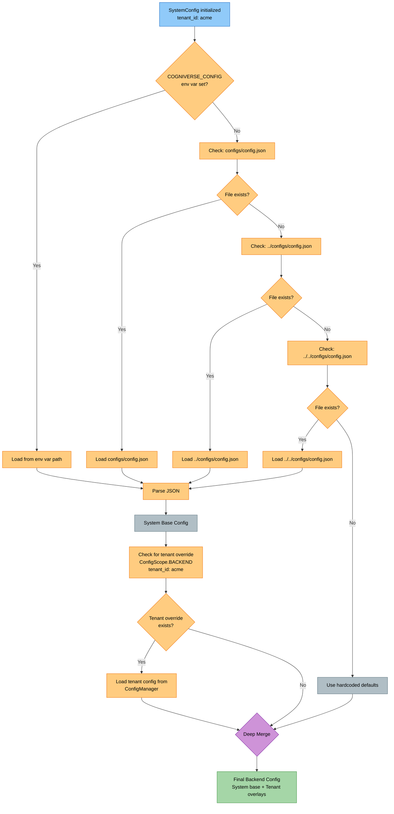
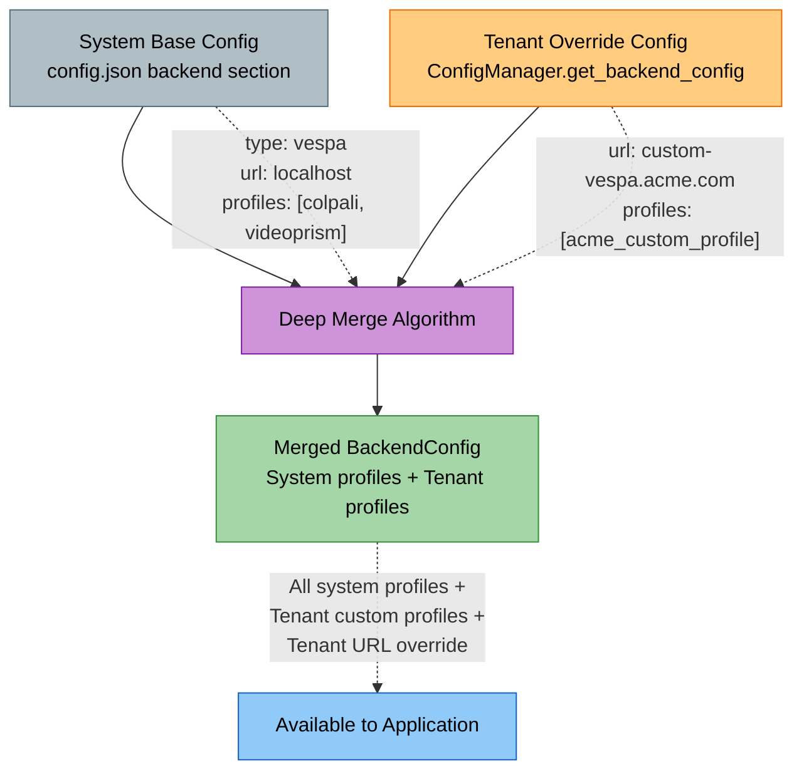
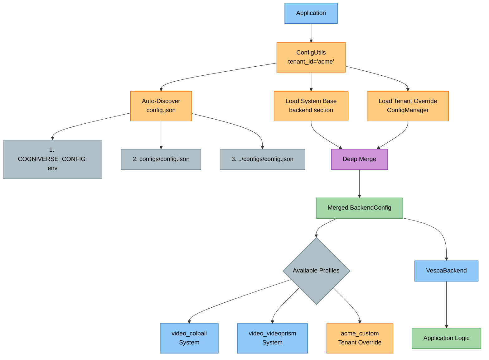
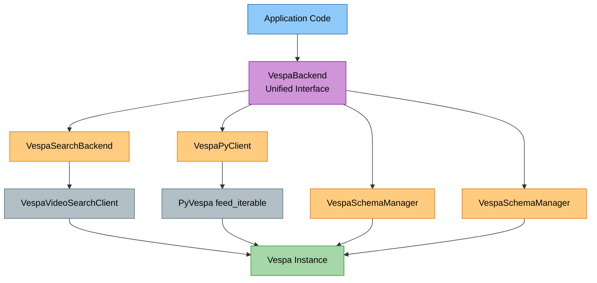
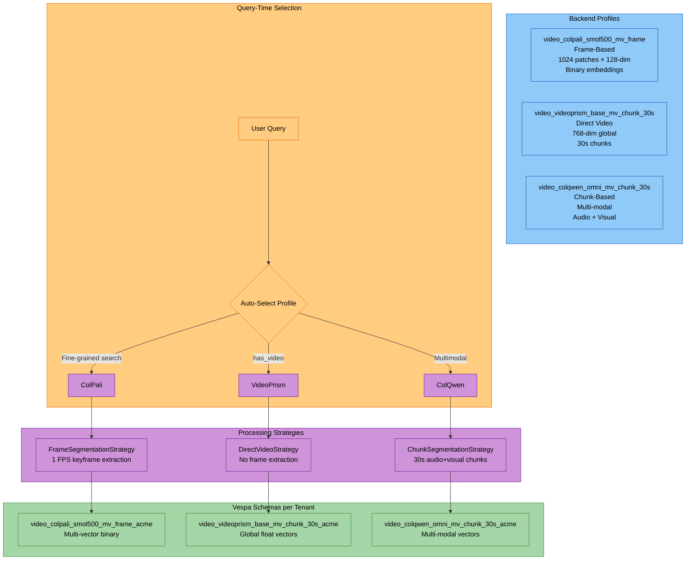
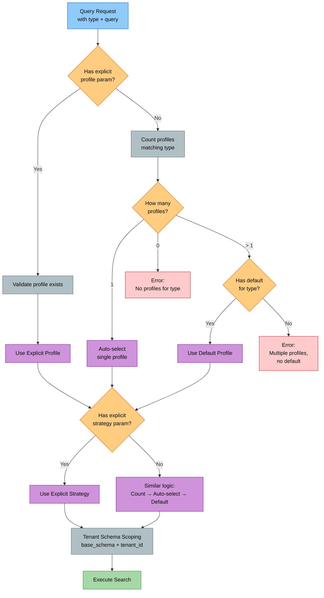
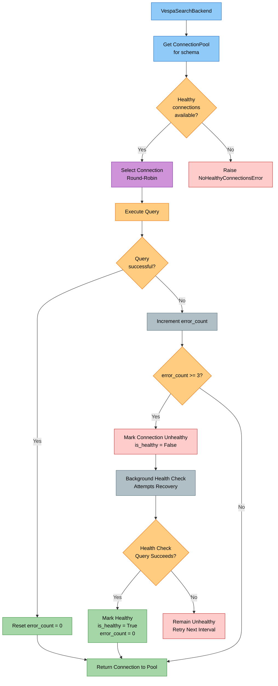
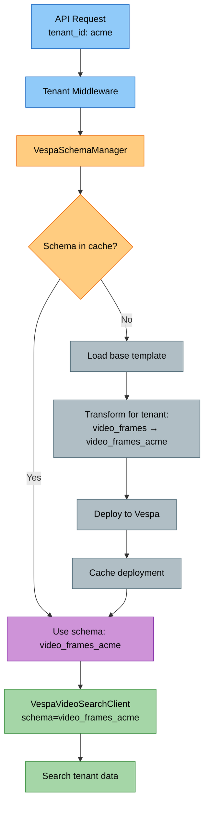
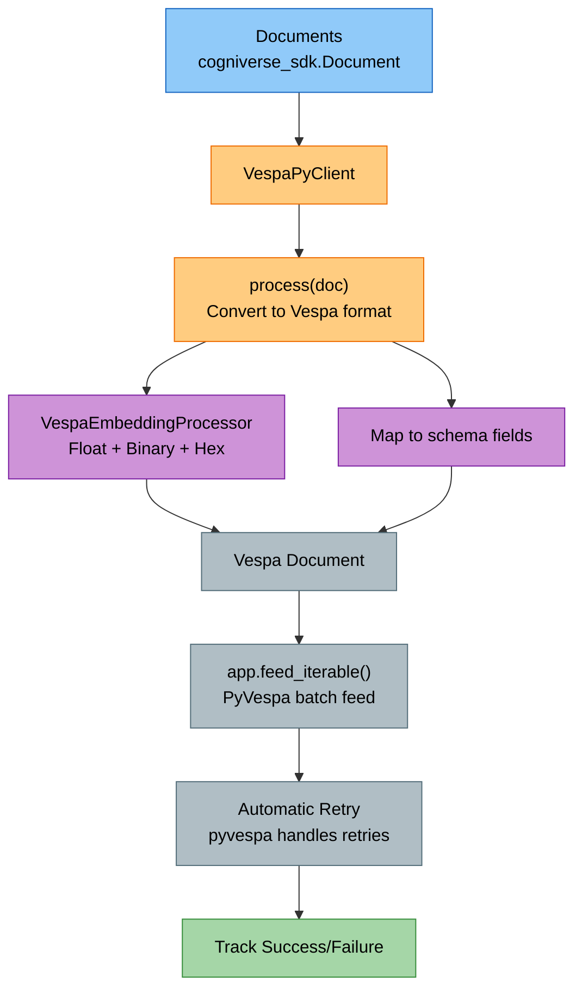

# Backends Module (Vespa Integration)

**Package:** `cogniverse_vespa` (Implementation Layer)
**Location:** `libs/vespa/cogniverse_vespa/`

---

## Table of Contents

1. [Module Overview](#module-overview)
2. [Package Structure](#package-structure)
3. [Multi-Tenant Schema Management](#multi-tenant-schema-management)
4. [Search Client](#search-client)
5. [Ingestion Client](#ingestion-client)
6. [Metadata Schema Management](#metadata-schema-management)
7. [Usage Examples](#usage-examples)
8. [Testing](#testing)

---

## Module Overview

The Vespa package (`cogniverse-vespa`) provides backend integration for vector and hybrid search with multi-tenant support.

### Key Features

1. **Multi-Tenant Schema Management**: Physical isolation via schema-per-tenant
2. **Search Backend**: Video search with ColPali and VideoPrism embeddings
3. **Ingestion**: Batch document feeding with retry logic
4. **Schema Deployment**: JSON-based schema parsing and deployment
5. **Tenant Isolation**: Dedicated schemas for each tenant

### Design Principles

- **Tenant-Aware**: All clients require tenant-specific schema names
- **Schema-Per-Tenant**: Physical data isolation via dedicated Vespa schemas
- **Core Integration**: Depends on `cogniverse_sdk` and `cogniverse_core` packages
- **Production-Ready**: Retry logic, health checks, batch processing

### Package Dependencies

```python
# Vespa package depends on:
from cogniverse_sdk.document import Document
from cogniverse_sdk.interfaces.backend import Backend, SearchBackend
from cogniverse_core.common.utils.retry import RetryConfig, retry_with_backoff
from cogniverse_core.schemas.filesystem_loader import FilesystemSchemaLoader
from cogniverse_foundation.config.utils import get_config  # Lazy import
```

**External Dependencies**:

- `pyvespa>=0.59.0`: Official Vespa Python client
- `numpy>=1.24.0`: Array operations

---

## Package Structure

```text
libs/vespa/cogniverse_vespa/
├── __init__.py
├── backend.py                      # Backend abstraction
├── config/
│   ├── __init__.py
│   └── config_store.py             # Vespa-based config storage
├── config_utils.py                 # Configuration utilities
├── embedding_processor.py          # Embedding processing
├── ingestion_client.py             # Ingestion client (VespaPyClient class)
├── json_schema_parser.py           # JSON schema parsing
├── memory_config.py                # Memory configuration
├── memory_store.py                 # Memory storage (Mem0 backend)
├── metadata_schemas.py             # Metadata schema definitions
├── ranking_strategy_extractor.py   # Ranking strategy extraction
├── registry/
│   ├── __init__.py
│   └── adapter_store.py            # Adapter registry storage
├── search_backend.py               # Search backend implementation
├── strategy_aware_processor.py     # Strategy-aware processing
├── tenant_aware_search_client.py   # Tenant-aware search wrapper
├── vespa_schema_manager.py         # Multi-tenant schema management
├── vespa_search_client.py          # Search operations
└── workflow/
    ├── __init__.py
    └── workflow_store.py           # Workflow intelligence storage
```

**Total Files**: 21 Python files (including 3 subdirectories: config/, workflow/, registry/)

**Key Files**:

- `vespa_schema_manager.py`: 1539 lines - Core tenant management
- `vespa_search_client.py`: 1156 lines - Search operations
- `json_schema_parser.py`: 235 lines - Schema parsing
- `ingestion_client.py`: 521 lines - PyVespa wrapper for ingestion
- `search_backend.py`: 1525 lines - Search backend with connection pooling
- `backend.py`: 1102 lines - Unified backend abstraction

**Note**: Schema templates are JSON files located in `configs/schemas/` at project root

---

## Backend Configuration Architecture

### Overview

Cogniverse uses a **profile-based backend configuration system** with multi-tenant support. Configuration is loaded from `config.json` with auto-discovery and supports deep merging of system base config with tenant-specific overlays.

**Key Features**:

- **Auto-Discovery**: Automatic config.json discovery from standard locations
- **Profile-Based**: Multiple processing profiles per backend (ColPali, VideoPrism, ColQwen-Omni, etc.)
- **Tenant Overlays**: Tenant-specific config merges with system base
- **Deep Merge**: System profiles + Tenant overrides = Merged configuration
- **Type-Safe**: BackendConfig and BackendProfileConfig dataclasses

### Configuration Auto-Discovery

**Search Order** (defined in `cogniverse_foundation/config/utils.py:_discover_config_file()`):

1. `COGNIVERSE_CONFIG` environment variable (if set)
2. `configs/config.json` (from current directory)
3. `../configs/config.json` (one level up)
4. `../../configs/config.json` (two levels up)

```python
# Automatic discovery - no environment variables needed!
from cogniverse_foundation.config.utils import ConfigUtils, create_default_config_manager

config_manager = create_default_config_manager()
config_utils = ConfigUtils(tenant_id="acme", config_manager=config_manager)
backend_config = config_utils.get("backend")  # Auto-discovered and merged
```

#### Auto-Discovery Flow



### Backend Configuration Structure

#### config.json Structure

```json
{
  "backend": {
    "type": "vespa",
    "url": "http://localhost",
    "port": 8080,
    "profiles": {
      "video_colpali_smol500_mv_frame": {
        "type": "video",
        "description": "Frame-based ColPali for patch-level visual search",
        "schema_name": "video_colpali_smol500_mv_frame",
        "embedding_model": "vidore/colsmol-500m",
        "pipeline_config": {
          "extract_keyframes": true,
          "transcribe_audio": true,
          "keyframe_fps": 1.0
        },
        "strategies": {
          "segmentation": {"class": "FrameSegmentationStrategy", "params": {}},
          "embedding": {"class": "MultiVectorEmbeddingStrategy", "params": {}}
        },
        "embedding_type": "frame_based",
        "schema_config": {
          "num_patches": 1024,
          "embedding_dim": 128,
          "binary_dim": 16
        }
      },
      "video_videoprism_base_mv_chunk_30s": {
        "type": "video",
        "description": "VideoPrism for 30-second chunk embeddings",
        "schema_name": "video_videoprism_base_mv_chunk_30s",
        "embedding_model": "videoprism_public_v1_base_hf",
        "embedding_type": "direct_video_segment",
        "schema_config": {
          "embedding_dim": 768,
          "binary_dim": 96
        }
      }
    }
  }
}
```

#### BackendProfileConfig Dataclass

```python
from cogniverse_foundation.config.unified_config import BackendProfileConfig

profile = BackendProfileConfig(
    profile_name="video_colpali_smol500_mv_frame",
    type="video",
    description="Frame-based ColPali processing",
    schema_name="video_colpali_smol500_mv_frame",  # Vespa schema name
    embedding_model="vidore/colsmol-500m",
    pipeline_config={
        "extract_keyframes": True,
        "transcribe_audio": True,
        "keyframe_fps": 1.0
    },
    strategies={
        "segmentation": {"class": "FrameSegmentationStrategy"},
        "embedding": {"class": "MultiVectorEmbeddingStrategy"}
    },
    embedding_type="frame_based",
    schema_config={
        "num_patches": 1024,
        "embedding_dim": 128,
        "binary_dim": 16
    }
)
```

**Profile Fields**:

- `profile_name`: Unique identifier for the profile
- `schema_name`: Vespa schema name (without tenant suffix)
- `embedding_model`: HuggingFace model ID or local path
- `pipeline_config`: Video processing pipeline settings
- `strategies`: Processing strategy classes and params
- `embedding_type`: Type of embeddings (frame_based, video_chunks, direct_video_segment)
- `schema_config`: Schema-specific metadata (dimensions, patches, etc.)

#### BackendConfig Dataclass

```python
from cogniverse_foundation.config.unified_config import BackendConfig, BackendProfileConfig

config = BackendConfig(
    tenant_id="acme",
    backend_type="vespa",
    url="http://localhost",
    port=8080,
    profiles={
        "video_colpali_smol500_mv_frame": profile1,
        "video_videoprism_base_mv_chunk_30s": profile2
    }
)

# Get specific profile
profile = config.get_profile("video_colpali_smol500_mv_frame")

# Add new profile
config.add_profile(new_profile)
```

### Tenant Configuration Overlay

#### Deep Merge Algorithm

System base config + Tenant-specific overrides = Merged configuration



**Merge Rules** (from `config/utils.py:_ensure_backend_config()`):

1. **Profiles**: Dict merge - tenant profiles override system profiles with same name
2. **Backend Type**: Tenant value OR system value (tenant takes precedence)
3. **URL**: Tenant value if not default, otherwise system value
4. **Port**: Tenant value if not default, otherwise system value
5. **Metadata**: Dict merge - tenant metadata extends system metadata

```python
# System config.json
{
  "backend": {
    "url": "http://localhost",
    "port": 8080,
    "profiles": {
      "video_colpali": {...},
      "video_videoprism": {...}
    }
  }
}

# Tenant "acme" override (stored in ConfigManager)
tenant_config = BackendConfig(
    tenant_id="acme",
    url="http://vespa.acme.com",
    port=8080,
    profiles={
        "acme_custom_profile": {...}
    }
)

# Merged result for tenant "acme"
# → url: http://vespa.acme.com (tenant override)
# → profiles: {video_colpali, video_videoprism, acme_custom_profile} (merged)
```

#### Partial Profile Updates

```python
from cogniverse_foundation.config.unified_config import BackendConfig

# Merge overrides into existing profile
modified_profile = config.merge_profile(
    profile_name="video_colpali_smol500_mv_frame",
    overrides={
        "pipeline_config": {"keyframe_fps": 2.0},  # Only override FPS
        "embedding_model": "vidore/colsmol-500m-v2"  # Update model
    }
)

# Original profile unchanged, returns new profile with merged values
```

### Using Backend Configuration

#### Example 1: Load Merged Config for Tenant

```python
from cogniverse_foundation.config.utils import ConfigUtils, create_default_config_manager

# Auto-discovers config.json and merges with tenant overrides
config_manager = create_default_config_manager()
config_utils = ConfigUtils(tenant_id="acme", config_manager=config_manager)

# Get merged backend config
backend_dict = config_utils.get("backend")

# Access profile
profiles = backend_dict["profiles"]
colpali_profile = profiles["video_colpali_smol500_mv_frame"]
```

#### Example 2: Get BackendConfig Object

```python
from cogniverse_foundation.config.utils import create_default_config_manager
from cogniverse_foundation.config.unified_config import BackendConfig

manager = create_default_config_manager()

# Get tenant backend config (includes system base + tenant overlay merge)
backend_config: BackendConfig = manager.get_backend_config(tenant_id="acme")

# Get specific profile
profile = backend_config.get_profile("video_colpali_smol500_mv_frame")

print(f"Schema: {profile.schema_name}")
print(f"Model: {profile.embedding_model}")
print(f"Strategies: {profile.strategies.keys()}")
```

#### Example 3: Set Tenant-Specific Backend Config

```python
from cogniverse_foundation.config.utils import create_default_config_manager
from cogniverse_foundation.config.unified_config import BackendConfig, BackendProfileConfig

manager = create_default_config_manager()

# Create tenant-specific profile
tenant_profile = BackendProfileConfig(
    profile_name="acme_high_fps",
    schema_name="video_colpali_smol500_mv_frame",
    embedding_model="vidore/colsmol-500m",
    pipeline_config={"keyframe_fps": 5.0},  # 5 FPS instead of 1 FPS
    embedding_type="frame_based"
)

# Set tenant backend config
tenant_backend = BackendConfig(
    tenant_id="acme",
    url="http://vespa.acme.com",
    profiles={"acme_high_fps": tenant_profile}
)

manager.set_backend_config(tenant_backend)
```

### Architecture Diagram



---

## Backend Abstraction Layer

### VespaBackend Class

**Location**: `libs/vespa/cogniverse_vespa/backend.py`

**Purpose**: Unified backend interface that wraps VespaSearchBackend and VespaPyClient, providing a single abstraction for both search and ingestion operations.

**Recommended Pattern**: Use the BackendRegistry to obtain backend instances:

```python
from cogniverse_core.registries.backend_registry import BackendRegistry
from cogniverse_foundation.config.utils import create_default_config_manager
from cogniverse_core.schemas.filesystem_loader import FilesystemSchemaLoader
from pathlib import Path

# Create required dependencies
config_manager = create_default_config_manager()
schema_loader = FilesystemSchemaLoader(Path("configs/schemas"))

# Get backend from registry (handles instantiation and caching)
backend = BackendRegistry.get_search_backend(
    name="vespa",
    tenant_id="acme",
    config_manager=config_manager,
    schema_loader=schema_loader
)

# Search
results = backend.search({
    "query": "cooking video",
    "type": "video",
    "top_k": 10
})

# For ingestion, use get_ingestion_backend
ingestion_backend = BackendRegistry.get_ingestion_backend(
    name="vespa",
    tenant_id="acme",
    config_manager=config_manager,
    schema_loader=schema_loader
)
ingestion_backend.ingest_documents(documents)
```

**Key Features**:

- **Unified Interface**: Single class for search + ingestion
- **Profile-Aware**: Automatically uses profile config from BackendConfig
- **Tenant-Aware**: Handles tenant schema routing internally
- **Lazy Initialization**: Components created on-demand per operation

### Architecture Diagram



**Why VespaBackend?**
- **Eliminates Vespa-specific imports**: Application code doesn't import VespaVideoSearchClient or VespaPyClient directly
- **Simplified API**: One class instead of multiple clients
- **Consistent interface**: Same initialization and method signatures
- **Future-proof**: Can swap Vespa with other backends without changing application code

---

## Profile-Based Architecture

### What is a Profile?

A **profile** is a complete video processing configuration that defines:
1. **Embedding Model**: Which model to use (ColPali, VideoPrism, ColQwen-Omni)
2. **Processing Pipeline**: Keyframe extraction, transcription, description generation
3. **Segmentation Strategy**: Frame-based, chunk-based, or direct video
4. **Vespa Schema**: Which schema structure to use
5. **Ranking Strategies**: How to score and rank results

### Profile Types

#### Multi-Profile Architecture



#### Frame-Based Profiles
**Example**: `video_colpali_smol500_mv_frame`
- Extracts keyframes at fixed FPS (1-5 FPS)
- Generates patch-level embeddings per frame
- Schema: Multi-vector with 1024 patches × 128 dimensions
- Best for: Fine-grained visual search, specific objects/text in frames

#### Chunk-Based Profiles
**Example**: `video_colqwen_omni_mv_chunk_30s`
- Segments video into 30-second chunks
- Processes audio + visual together
- Schema: Multi-vector with multimodal understanding
- Best for: Semantic content search, audio+visual comprehension

#### Direct Video Profiles
**Example**: `video_videoprism_base_mv_chunk_30s`
- Native video understanding without keyframes
- Global 768-dim or 1024-dim embeddings
- Schema: High-dimensional global vectors
- Best for: Video-level semantic similarity, scene understanding

### Profile Selection at Query Time

```python
from cogniverse_foundation.config.utils import create_default_config_manager, get_config
from cogniverse_vespa.backend import VespaBackend
from cogniverse_core.schemas.filesystem_loader import FilesystemSchemaLoader
from pathlib import Path

# Get configuration
config_manager = create_default_config_manager()
config = get_config(tenant_id="acme", config_manager=config_manager)

# List available profiles from backend config
backend_config = config_manager.get_backend_config("acme")
profiles = list(backend_config.profiles.keys())
# → ['video_colpali_smol500_mv_frame', 'video_videoprism_base_mv_chunk_30s', ...]

# Select profile dynamically
profile_name = "video_colpali_smol500_mv_frame"

# Get backend from registry with profile configuration
schema_loader = FilesystemSchemaLoader(Path("configs/schemas"))
backend = BackendRegistry.get_search_backend(
    name="vespa",
    tenant_id="acme",
    config={"profile": profile_name},
    config_manager=config_manager,
    schema_loader=schema_loader
)
```

### Creating Custom Profiles

```python
# Add new profile to tenant config
custom_profile = BackendProfileConfig(
    profile_name="acme_ultra_high_quality",
    schema_name="video_colpali_smol500_mv_frame",  # Reuse existing schema
    embedding_model="vidore/colsmol-500m",
    pipeline_config={
        "extract_keyframes": True,
        "keyframe_fps": 10.0,  # 10 FPS for ultra-high temporal resolution
        "transcribe_audio": True,
        "generate_descriptions": True
    },
    strategies={
        "segmentation": {
            "class": "FrameSegmentationStrategy",
            "params": {"fps": 10.0, "max_frames": 10000}
        },
        "embedding": {"class": "MultiVectorEmbeddingStrategy"}
    },
    embedding_type="frame_based"
)

# Save to tenant config
backend_config.add_profile(custom_profile)
manager.set_backend_config(backend_config)
```

### Advanced Query-Time Resolution

The `VespaSearchBackend` implements query-time resolution for profiles and strategies directly in the `search()` method with a 4-step fallback approach:

#### Resolution Flow



#### Implementation Details

**Location:** `libs/vespa/cogniverse_vespa/search_backend.py` - `search()` method (lines 585-864)

**Profile Resolution Logic** (inline in search() method):
```python
# Priority order:
# 1. Explicit 'profile' parameter in query_dict
requested_profile = query_dict.get("profile")
if requested_profile:
    if requested_profile not in self.profiles:
        raise ValueError(f"Requested profile '{requested_profile}' not found")
    profile_name = requested_profile
else:
    # 2. Auto-select if only one profile for content type
    type_profiles = {
        name: config
        for name, config in self.profiles.items()
        if config.get("type") == content_type
    }

    if len(type_profiles) == 1:
        profile_name = list(type_profiles.keys())[0]
    elif len(type_profiles) > 1:
        # 3. Use default profile for type
        default_config = self.default_profiles.get(content_type, {})
        profile_name = default_config.get("profile")
        if not profile_name:
            raise ValueError(
                f"Multiple profiles for '{content_type}' but no default configured"
            )
    else:
        # 4. No profiles for type - error
        raise ValueError(f"No profiles found for type '{content_type}'")
```

**Strategy Resolution Logic** (similar fallback approach):
```python
# Same 4-step fallback:
# 1. Explicit strategy in query_dict
# 2. Auto-select if single strategy for profile
# 3. Use default strategy for profile/type
# 4. Error if no strategies found
requested_strategy = query_dict.get("strategy")
# ... similar logic pattern ...
```

**Tenant Schema Scoping** (inline construction):
```python
# Schema name construction
base_schema_name = profile_config.get("schema_name", profile_name)
schema_name = f"{base_schema_name}_{self.tenant_id}"
# Example: "video_colpali_smol500_mv_frame_acme"
```

#### Usage Example

**Request with Auto-Resolution**:
```python
# Client request without explicit profile/strategy (REQUIRES 'type' key)
query_dict = {
    "query": "machine learning tutorial",
    "type": "video",  # REQUIRED for profile resolution
    "top_k": 10,
    # No 'profile' or 'strategy' specified
}

# Backend auto-resolves:
# 1. Filters profiles by type="video"
# 2. If single profile → auto-select
#    If multiple → uses default_profiles["video"]["profile"]
# 3. Similar logic for strategy
# 4. Schema: base_schema_name + "_" + tenant_id

results = backend.search(query_dict)  # tenant_id already set in backend config
```

**Request with Explicit Parameters**:
```python
query_dict = {
    "query": "cooking videos",
    "type": "video",  # REQUIRED
    "profile": "video_videoprism_base_mv_chunk_30s",  # Explicit
    "strategy": "float_float",  # Explicit
    "top_k": 20
}

# Backend uses explicit values:
# 1. Profile: "video_videoprism_base_mv_chunk_30s" (explicit)
# 2. Strategy: "float_float" (explicit, validated against profile)
# 3. Schema: "video_videoprism_base_mv_chunk_30s_acme" (tenant-scoped)

results = backend.search(query_dict)
```

#### Benefits

1. **Flexibility**: Clients can control or let backend auto-select
2. **Sensible Defaults**: Automatic selection based on query characteristics
3. **Tenant Isolation**: Automatic schema scoping per tenant
4. **Performance**: Strategy selection optimized for embedding type
5. **Simplicity**: Clients don't need to know all configuration details

---

## Connection Pool Management

### Overview

The `VespaSearchBackend` implements connection pooling for efficient Vespa client management with health monitoring and automatic recovery.

**Key Features**:

- **Connection Reuse**: Pool of healthy Vespa clients per schema
- **Health Monitoring**: Background health checks with circuit breaker pattern
- **Automatic Recovery**: Failed connections marked unhealthy and recovered
- **Schema-Specific Pools**: Separate connection pools per tenant schema
- **Metrics Tracking**: Connection health metrics via SearchMetrics

### Architecture



### Connection Pool Implementation

**Location**: `libs/vespa/cogniverse_vespa/search_backend.py` (lines 45-256)

#### ConnectionPoolConfig Class

```python
@dataclass
class ConnectionPoolConfig:
    """Configuration for connection pool."""

    max_connections: int = 10           # Maximum connections in pool
    min_connections: int = 2            # Minimum connections to maintain
    connection_timeout: float = 30.0    # Timeout waiting for connection (seconds)
    idle_timeout: float = 300.0         # Remove idle connections after (seconds)
    health_check_interval: float = 60.0 # Health check frequency (seconds)
```

#### VespaConnection Class

```python
class VespaConnection:
    """
    Managed Vespa connection with health checking.

    Attributes:
        url: Vespa endpoint URL
        connection_id: Unique connection identifier
        vespa: Vespa client instance (created internally)
        created_at: Connection creation timestamp
        last_used: Last query execution timestamp
        is_healthy: Current health status
    """

    def __init__(self, url: str, connection_id: str):
        self.url = url
        self.connection_id = connection_id
        self.vespa = Vespa(url=url)  # Created internally, not passed in
        self.created_at = time.time()
        self.last_used = time.time()
        self.is_healthy = True
        self._lock = threading.Lock()

    def query(self, *args, **kwargs):
        """Execute query and update last used time."""
        with self._lock:
            self.last_used = time.time()
        return self.vespa.query(*args, **kwargs)

    def health_check(self) -> bool:
        """
        Check connection health with simple query.

        Returns:
            True if connection is healthy
        """
        try:
            result = self.vespa.query(yql="select * from sources * where true limit 1")
            self.is_healthy = result is not None
            return self.is_healthy
        except Exception as e:
            logger.warning(f"Health check failed for {self.connection_id}: {e}")
            self.is_healthy = False
            return False

    @property
    def idle_time(self) -> float:
        """Time since last use in seconds."""
        return time.time() - self.last_used
```

#### ConnectionPool Class

```python
class ConnectionPool:
    """
    Thread-safe connection pool with health monitoring.

    Features:
    - Connection reuse for performance
    - Automatic health checks in background thread
    - Dynamic connection creation up to max limit
    - Idle connection cleanup
    - Context manager pattern for safe connection handling
    """

    def __init__(self, url: str, config: ConnectionPoolConfig):
        self.url = url
        self.config = config
        self._connections: List[VespaConnection] = []
        self._available: List[VespaConnection] = []
        self._lock = threading.Lock()
        self._stop_health_check = threading.Event()

        # Initialize minimum connections
        self._initialize_connections()

        # Start background health check thread
        self._health_check_thread = threading.Thread(
            target=self._health_check_loop, daemon=True
        )
        self._health_check_thread.start()

    @contextmanager
    def get_connection(self):
        """
        Get a connection from the pool (context manager).

        Usage:
            with pool.get_connection() as conn:
                result = conn.query(yql="...")

        Yields:
            VespaConnection: A healthy connection

        Raises:
            TimeoutError: If no connection available within timeout
        """
        conn = None
        start_time = time.time()

        try:
            # Try to get available connection or create new one
            with self._lock:
                if self._available:
                    conn = self._available.pop()
                elif len(self._connections) < self.config.max_connections:
                    conn = VespaConnection(self.url, f"conn-{uuid.uuid4().hex[:8]}")
                    self._connections.append(conn)

            # Wait for connection if none available
            while conn is None and (time.time() - start_time) < self.config.connection_timeout:
                time.sleep(0.1)
                with self._lock:
                    if self._available:
                        conn = self._available.pop()

            if conn is None:
                raise TimeoutError("No connections available")

            yield conn

        finally:
            # Return connection to pool
            if conn is not None:
                with self._lock:
                    self._available.append(conn)

    def close(self):
        """Close all connections and stop health checks."""
        self._stop_health_check.set()
        if self._health_check_thread.is_alive():
            self._health_check_thread.join(timeout=5)

        with self._lock:
            self._connections.clear()
            self._available.clear()
```

### Usage in VespaSearchBackend

```python
class VespaSearchBackend:
    def __init__(self, config: Dict[str, Any]):
        self.url = config.get("url", "http://localhost:8080")
        self._pool_config = ConnectionPoolConfig(
            max_connections=config.get("max_connections", 10),
            min_connections=config.get("min_connections", 2),
            health_check_interval=config.get("health_check_interval", 60.0),
        )
        # Single connection pool (connections are URL-based, not schema-based)
        self._pool: Optional[ConnectionPool] = None

    def _get_connection_pool(self) -> ConnectionPool:
        """Get or create connection pool."""
        if self._pool is None:
            # Health checks start automatically in __init__
            self._pool = ConnectionPool(self.url, self._pool_config)
        return self._pool

    def search(
        self,
        query: Dict[str, Any],
        tenant_id: str
    ) -> List[Dict[str, Any]]:
        """Execute search using pooled connection."""
        # Resolve profile and strategy
        profile = self._resolve_profile_for_query(query, tenant_id)
        strategy = self._resolve_strategy_for_profile(profile, query)

        # Get connection from pool (context manager pattern)
        pool = self._get_connection_pool()

        with pool.get_connection() as conn:
            # Execute query via Vespa client
            results = conn.query(
                yql=self._build_yql(query, strategy),
                ranking=strategy,
                hits=query.get("top_k", 10)
            )
            return results

        # Note: Connection health is managed automatically by the pool's
        # background health check thread started in __init__
```

### Health Metrics

**SearchMetrics Integration**:
```python
class SearchMetrics:
    """Track search backend metrics including connection health"""

    def record_connection_health(
        self,
        schema_name: str,
        is_healthy: bool,
        error_count: int
    ):
        """Record connection health metrics"""
        self.metrics[schema_name] = {
            "healthy": is_healthy,
            "error_count": error_count,
            "last_check": datetime.now()
        }

    def get_pool_health(self, schema_name: str) -> Dict[str, Any]:
        """Get health metrics for connection pool"""
        pool = self.pools.get(schema_name)

        if not pool:
            return {"status": "no_pool"}

        healthy_count = sum(
            1 for c in pool._connections if c.is_healthy
        )

        return {
            "total_connections": len(pool._connections),
            "healthy_connections": healthy_count,
            "unhealthy_connections": len(pool._connections) - healthy_count,
            "health_check_interval": pool.health_check_interval
        }
```

### Benefits

1. **Performance**: Connection reuse eliminates connection overhead per query
2. **Reliability**: Automatic recovery from transient failures
3. **Observability**: Health metrics for monitoring connection status
4. **Scalability**: Per-schema pools isolate tenant impact
5. **Resilience**: Circuit breaker prevents cascading failures

### Configuration

```python
# Configure connection pool in backend config
backend_config = {
    "vespa": {
        "connection_pool": {
            "max_connections": 10,         # Max connections per schema
            "health_check_interval": 30.0, # Health check frequency (seconds)
            "circuit_breaker_threshold": 3 # Failures before marking unhealthy
        }
    }
}
```

---

## Multi-Tenant Schema Management

### VespaSchemaManager

**Location**: `libs/vespa/cogniverse_vespa/vespa_schema_manager.py`
**Purpose**: Manage tenant-specific Vespa schemas with physical isolation

See [Multi-Tenant Architecture](../architecture/multi-tenant.md) for comprehensive details.

#### Architecture



#### Constructor

```python
from pathlib import Path
from cogniverse_foundation.config.utils import create_default_config_manager
from cogniverse_vespa.vespa_schema_manager import VespaSchemaManager
from cogniverse_core.schemas.filesystem_loader import FilesystemSchemaLoader
from cogniverse_core.registries.backend_registry import get_backend_registry

# Basic initialization (for read_sd_file, parse_sd_schema, get_tenant_schema_name only)
schema_manager = VespaSchemaManager(
    backend_endpoint="http://localhost",  # REQUIRED
    backend_port=8080                      # REQUIRED
)

# Full initialization (for tenant schema operations like delete_tenant_schemas, tenant_schema_exists)
# Use BackendRegistry — the returned backend already has a fully-configured schema_manager
config_manager = create_default_config_manager()
schema_loader = FilesystemSchemaLoader(Path("configs/schemas"))
registry = get_backend_registry()
backend = registry.get_ingestion_backend(
    "vespa",
    tenant_id="default",
    config_manager=config_manager,
    schema_loader=schema_loader,
)
schema_manager = backend.schema_manager  # Already has schema_registry, schema_loader injected
```

#### Key Methods

```python
# Read and parse a Vespa schema definition file (.sd files)
# Note: .sd files are Vespa's native schema format, typically exported from
# a running Vespa instance or written manually. Schema configurations in
# configs/schemas/ are JSON format used by the ingestion pipeline.
sd_content = schema_manager.read_sd_file("path/to/exported_schema.sd")

# Parse .sd content to pyvespa Schema object
schema = schema_manager.parse_sd_schema(sd_content)
# Returns: pyvespa Schema object for use with ApplicationPackage

# Get tenant-specific schema name (colon in tenant_id converted to underscore)
schema_name = schema_manager.get_tenant_schema_name(
    tenant_id="acme",
    base_schema_name="video_colpali_smol500_mv_frame"
)
# Returns: "video_colpali_smol500_mv_frame_acme"
# Example: "acme:production" -> "video_colpali_smol500_mv_frame_acme_production"

# Check if tenant schema exists
# REQUIRES: schema_registry in constructor, raises ValueError if not provided
exists = schema_manager.tenant_schema_exists(
    tenant_id="acme",
    base_schema_name="video_colpali_smol500_mv_frame"
)
# Returns: True/False

# Delete tenant schemas (cleanup)
# REQUIRES: schema_registry in constructor, raises ValueError if not provided
deleted = schema_manager.delete_tenant_schemas(tenant_id="old_tenant")
# Returns: List of deleted schema names
```

#### Schema Naming Convention

**Pattern**: `{base_schema}_{tenant_id}`

**Examples**:

| Base Schema | Tenant ID | Tenant Schema |
|------------|-----------|---------------|
| video_colpali_smol500_mv_frame | acme | video_colpali_smol500_mv_frame_acme |
| video_videoprism_base_mv_chunk_30s | startup | video_videoprism_base_mv_chunk_30s_startup |
| agent_memories | acme:production | agent_memories_acme_production |

#### Schema Lifecycle

1. **Load Template**: Base schema from `configs/schemas/{base_schema}_schema.json`
2. **Transform**: Rename schema and document to include tenant suffix
3. **Deploy**: Create Vespa application package and deploy
4. **Cache**: Store deployment in memory for fast lookups

---

## Search Client

### VespaVideoSearchClient

**Location**: `libs/vespa/cogniverse_vespa/vespa_search_client.py`
**Purpose**: Search operations with tenant-specific schema routing

#### Tenant-Aware Initialization

```python
from cogniverse_vespa.vespa_search_client import VespaVideoSearchClient
from cogniverse_foundation.config.utils import create_default_config_manager

# 1. Create config manager (required for dependency injection)
config_manager = create_default_config_manager()

# 2. Initialize client with tenant_id and config_manager
# The client uses tenant_id to route to the correct tenant schema automatically
client = VespaVideoSearchClient(
    vespa_url="http://localhost",
    vespa_port=8080,
    tenant_id="acme",
    config_manager=config_manager  # REQUIRED
)
```

#### Search Operations

```python
# Text search (tenant-scoped)
results = client.search({
    "query": "cooking videos",
    "top_k": 10,
    "ranking": "hybrid_binary_bm25"
})
# Searches ONLY video_colpali_smol500_mv_frame_acme
# Physical isolation - no access to other tenants' data

# Results structure
for result in results:
    print(f"Video: {result['video_title']}")
    print(f"Frame: {result['frame_id']}")
    print(f"Score: {result['relevance']}")
    print(f"Time: {result['start_time']}s")
```

#### Multi-Tenant Search Example

```python
# Two tenants searching independently

# Create config manager (required for all clients)
config_manager = create_default_config_manager()

# Tenant A: acme
client_acme = VespaVideoSearchClient(
    vespa_url="http://localhost",
    vespa_port=8080,
    tenant_id="acme",
    config_manager=config_manager  # REQUIRED
)
results_acme = client_acme.search("cooking videos")
# Only searches tenant-specific schema

# Tenant B: startup
client_startup = VespaVideoSearchClient(
    vespa_url="http://localhost",
    vespa_port=8080,
    tenant_id="startup",
    config_manager=config_manager  # REQUIRED
)
results_startup = client_startup.search("cooking videos")
# Only searches tenant-specific schema

# Complete physical isolation via tenant-specific schemas
```

#### Ranking Strategies

The client supports multiple ranking strategies:

| Strategy | Type | Use Case |
|----------|------|----------|
| bm25_only | Text | Pure text search (no embeddings) |
| float_float | Visual | Highest accuracy (slow) |
| binary_binary | Visual | Fast visual search |
| hybrid_float_bm25 | Hybrid | Best accuracy (visual + text) |
| hybrid_binary_bm25 | Hybrid | Fast hybrid search |

```python
# Pure text search (fast)
results = client.search({
    "query": "machine learning tutorial",
    "ranking": "bm25_only"
})

# Visual + text hybrid (best accuracy)
results = client.search({
    "query": "robot arm demonstration",
    "ranking": "hybrid_float_bm25"
})
```

---

## Ingestion Client

### VespaPyClient

**Location**: `libs/vespa/cogniverse_vespa/ingestion_client.py`
**Purpose**: PyVespa wrapper for document ingestion with automatic format conversion

#### Architecture



#### Tenant-Aware Ingestion

```python
from cogniverse_vespa.ingestion_client import VespaPyClient
from cogniverse_vespa.vespa_schema_manager import VespaSchemaManager
from cogniverse_sdk.document import Document
from cogniverse_core.schemas.filesystem_loader import FilesystemSchemaLoader
from pathlib import Path
import numpy as np

# 1. Get tenant-specific schema name using naming convention
tenant_id = "acme"
base_schema_name = "video_colpali_smol500_mv_frame"
tenant_schema = f"{base_schema_name}_{tenant_id}"

# 2. Create schema loader (required for VespaPyClient)
schema_loader = FilesystemSchemaLoader(Path("configs/schemas"))

# 3. VespaSchemaManager for schema parsing (deployment uses pyvespa)
schema_manager = VespaSchemaManager(
    backend_endpoint="http://localhost",
    backend_port=8080
)

# 4. Create sample documents
documents = [
    Document(
        id="video123_segment_0",
        content="Cooking demonstration",
        metadata={"start_time": 0.0, "end_time": 1.0},
        embeddings={"embedding": np.random.randn(1024, 128)}
    )
]

# 5. Initialize client with configuration
config = {
    "schema_name": tenant_schema,  # video_colpali_smol500_mv_frame_acme
    "base_schema_name": "video_colpali_smol500_mv_frame",
    "url": "http://localhost",
    "port": 8080,
    "schema_loader": schema_loader,  # Required: SchemaLoader instance
    "feed_max_queue_size": 500,
    "feed_max_workers": 4,
    "feed_max_connections": 8
}

client = VespaPyClient(config=config)

# 6. Connect to Vespa
client.connect()

# 7. Process documents and feed
processed_docs = [client.process(doc) for doc in documents]
success_count, failed_ids = client._feed_prepared_batch(processed_docs, batch_size=100)
print(f"Ingested {success_count}/{len(documents)} documents to {tenant_schema}")
```

#### Document Processing

```python
from cogniverse_sdk.document import Document
import numpy as np

# Create Document (universal format)
doc = Document(
    id="video123_segment_0",
    content="Chopping vegetables",
    metadata={
        "start_time": 2.5,
        "end_time": 3.0,
        "segment_index": 0,
        "total_segments": 10,
        "audio_transcript": "First, we chop the vegetables",
        "description": "Cooking tutorial scene"
    },
    embeddings={
        "embedding": np.random.randn(1024, 128)  # ColPali embeddings
    }
)

# Process converts to Vespa format automatically:
# 1. Extracts embeddings and converts to hex/binary (VespaEmbeddingProcessor)
# 2. Maps Document fields to schema fields
# 3. Adds creation timestamp
# 4. Creates proper Vespa document structure
vespa_doc = client.process(doc)

# vespa_doc structure:
# {
#     "put": "id:video:video_colpali_smol500_mv_frame_acme::video123_segment_0",
#     "fields": {
#         "creation_timestamp": 1729350000000,
#         "embedding": "0x4142...",  # Hex-encoded float embeddings
#         "embedding_binary": [1, 0, 1, ...],  # Binary embeddings
#         "start_time": 2.5,
#         "end_time": 3.0,
#         "segment_id": 0,
#         "total_segments": 10,
#         "audio_transcript": "First, we chop the vegetables",
#         "segment_description": "Cooking tutorial scene"
#     }
# }
```

#### Batch Feed Configuration

```python
# Production-ready configuration (via config dict or environment variables)
config = {
    "schema_name": tenant_schema,
    "base_schema_name": "video_colpali_smol500_mv_frame",
    "url": "http://localhost",
    "port": 8080,
    "schema_loader": schema_loader,  # Required: SchemaLoader instance

    # Feed configuration (can be overridden by environment variables)
    "feed_max_queue_size": 500,      # VESPA_FEED_MAX_QUEUE_SIZE
    "feed_max_workers": 4,            # VESPA_FEED_MAX_WORKERS
    "feed_max_connections": 8,        # VESPA_FEED_MAX_CONNECTIONS
    "feed_compress": "auto"           # VESPA_FEED_COMPRESS
}

# Or use environment variables:
# export VESPA_FEED_MAX_QUEUE_SIZE=1000
# export VESPA_FEED_MAX_WORKERS=8
# export VESPA_FEED_MAX_CONNECTIONS=16

client = VespaPyClient(config=config)

# Feed uses pyvespa's feed_iterable with these settings automatically
```

---

## Schema Deployment

### JSON Schema Parser

**Location**: `libs/vespa/cogniverse_vespa/json_schema_parser.py`
**Purpose**: Parse JSON schema definitions to PyVespa objects

#### Schema Template Structure

Base schemas are stored in `configs/schemas/`:

```json
{
  "name": "video_colpali_smol500_mv_frame",
  "document": {
    "name": "video_colpali_smol500_mv_frame",
    "fields": [
      {
        "name": "video_id",
        "type": "string",
        "indexing": ["summary", "attribute"],
        "attribute": ["fast-search"]
      },
      {
        "name": "embedding",
        "type": "tensor<float>(patch{}, v[128])",
        "indexing": ["attribute"]
      }
    ]
  },
  "rank_profiles": [
    {
      "name": "colpali",
      "inputs": [
        {"name": "query(qt)", "type": "tensor<float>(querytoken{}, v[128])"}
      ],
      "first_phase": {
        "expression": "sum(reduce(sum(query(qt) * attribute(embedding), v), max, patch), querytoken)"
      }
    }
  ]
}
```

#### Parsing and Deployment

```python
from cogniverse_vespa.json_schema_parser import JsonSchemaParser
from cogniverse_vespa.vespa_schema_manager import VespaSchemaManager

# Parse JSON schema
parser = JsonSchemaParser()
schema = parser.load_schema_from_json_file(
    "configs/schemas/video_colpali_smol500_mv_frame_schema.json"
)

# Deploy schema
schema_manager = VespaSchemaManager(
    backend_endpoint="http://localhost",
    backend_port=19071  # Config server port
)

schema_manager.upload_schema_from_json_file(
    json_file_path="configs/schemas/video_colpali_smol500_mv_frame_schema.json",
    app_name="videosearch"
)
```

---

## Metadata Schema Management

Cogniverse uses **JSON-based metadata schemas** for multi-tenant management data stored in Vespa. These schemas are the single source of truth and are loaded dynamically at runtime.

### Overview

Metadata schemas store operational data (not video content):

- **Organization/tenant hierarchy** for multi-tenancy

- **Configuration key-value pairs** for VespaConfigStore

- **Adapter registry** for model management

```text
configs/schemas/
├── organization_metadata_schema.json   # Organization-level data
├── tenant_metadata_schema.json         # Tenant-level data
├── config_metadata_schema.json         # Configuration storage (VespaConfigStore)
├── adapter_registry_schema.json        # Trained adapter metadata
├── agent_memories_schema.json          # Agent memory storage
├── workflow_intelligence_schema.json   # Workflow tracking
└── video_*_schema.json                 # Video content schemas (profiles)
```

### Metadata Schema Types

| Schema | Purpose | Key Fields |
|--------|---------|------------|
| `organization_metadata` | Multi-tenant org hierarchy | `org_id`, `org_name`, `status`, `tenant_count` |
| `tenant_metadata` | Tenant information | `tenant_full_id`, `org_id`, `status`, `schemas_deployed` |
| `config_metadata` | VespaConfigStore backend | `config_id`, `tenant_id`, `scope`, `config_key`, `config_value` |
| `adapter_registry` | Trained LoRA adapters | `adapter_id`, `tenant_id`, `base_model`, `status`, `is_active` |

### Loading Schemas from JSON

All metadata schemas are loaded via `metadata_schemas.py`:

```python
from cogniverse_vespa.metadata_schemas import (
    create_organization_metadata_schema,
    create_tenant_metadata_schema,
    create_config_metadata_schema,
    create_adapter_registry_schema,
    add_metadata_schemas_to_package,
)

# Load individual schema
org_schema = create_organization_metadata_schema()

# Or add all metadata schemas to an ApplicationPackage
from vespa.package import ApplicationPackage
app_package = ApplicationPackage(name="cogniverse")
add_metadata_schemas_to_package(app_package)
# Adds: organization_metadata, tenant_metadata, config_metadata, adapter_registry
```

### Schema File Location

Schemas are auto-discovered from `configs/schemas/`:

```python
from cogniverse_vespa.metadata_schemas import get_schemas_dir, set_schemas_dir

# Get current schemas directory
schemas_path = get_schemas_dir()
print(schemas_path)  # /path/to/cogniverse/configs/schemas

# Override for testing
set_schemas_dir(Path("/tmp/test_schemas"))
```

### JSON Schema Format

Metadata schemas follow the same JSON format as video schemas:

```json
{
  "name": "config_metadata",
  "document": {
    "fields": [
      {
        "name": "config_id",
        "type": "string",
        "indexing": ["attribute", "summary"],
        "attribute": ["fast-search"]
      },
      {
        "name": "tenant_id",
        "type": "string",
        "indexing": ["attribute", "summary"],
        "attribute": ["fast-search"]
      },
      {
        "name": "config_value",
        "type": "string",
        "indexing": ["summary"]
      }
    ]
  }
}
```

**Field Attributes:**

- `indexing: ["attribute", "summary"]` - Stored and searchable
- `attribute: ["fast-search"]` - Optimized for exact matching
- `indexing: ["summary"]` - Stored but not indexed (for large values)

### Adding New Metadata Schemas

1. **Create JSON schema file** in `configs/schemas/`:

```json
// configs/schemas/my_metadata_schema.json
{
  "name": "my_metadata",
  "document": {
    "fields": [
      {"name": "id", "type": "string", "indexing": ["attribute", "summary"], "attribute": ["fast-search"]},
      {"name": "tenant_id", "type": "string", "indexing": ["attribute", "summary"], "attribute": ["fast-search"]},
      {"name": "data", "type": "string", "indexing": ["summary"]}
    ]
  }
}
```

2. **Add loader function** in `metadata_schemas.py`:

```python
def create_my_metadata_schema() -> Schema:
    """Create my_metadata schema. Loads from configs/schemas/my_metadata_schema.json."""
    return _load_schema("my_metadata")
```

3. **Include in package deployment** (if needed globally):

```python
def add_metadata_schemas_to_package(app_package) -> None:
    # ... existing schemas ...
    app_package.add_schema(create_my_metadata_schema())
```

### Schema Deployment

Metadata schemas are deployed automatically via `VespaSchemaManager`:

```python
from cogniverse_vespa.vespa_schema_manager import VespaSchemaManager
from cogniverse_vespa.metadata_schemas import add_metadata_schemas_to_package
from vespa.package import ApplicationPackage

# Create application package
app_package = ApplicationPackage(name="cogniverse")

# Add all metadata schemas
add_metadata_schemas_to_package(app_package)

# Deploy to Vespa using internal _deploy_package method
schema_manager = VespaSchemaManager(
    backend_endpoint="http://localhost",
    backend_port=19071
)
schema_manager._deploy_package(app_package)
```

### Best Practices

1. **Single Source of Truth**: Always define schemas in JSON files, never duplicate in Python code
2. **Tenant Isolation**: Include `tenant_id` field with `fast-search` for multi-tenant queries
3. **Versioning**: Use `version` field for optimistic locking when needed
4. **Timestamps**: Include `created_at` and `updated_at` for auditing
5. **JSON Storage**: Store complex objects as JSON strings in `string` fields

---

## Usage Examples

### Example 1: Tenant Onboarding

```python
from cogniverse_vespa.vespa_schema_manager import VespaSchemaManager

# New tenant "acme" starts using the system
schema_manager = VespaSchemaManager(
    backend_endpoint="http://localhost",
    backend_port=8080
)

# Deploy all required schemas for tenant
schemas_to_deploy = [
    "video_colpali_smol500_mv_frame",
    "video_videoprism_base_mv_chunk_30s",
    "agent_memories"
]

for base_schema in schemas_to_deploy:
    tenant_schema = schema_manager.get_tenant_schema_name(
        tenant_id="acme",
        base_schema_name=base_schema
    )
    print(f"Tenant schema name: {tenant_schema}")
    # Deploy schema via Vespa CLI: vespa deploy

# Expected tenant schemas follow naming convention:
# ['video_colpali_smol500_mv_frame_acme',
#  'video_videoprism_base_mv_chunk_30s_acme',
#  'agent_memories_acme']
```

### Example 2: Tenant-Scoped Search

```python
from cogniverse_vespa.vespa_search_client import VespaVideoSearchClient
from cogniverse_vespa.vespa_schema_manager import VespaSchemaManager

def search_for_tenant(tenant_id: str, query: str, config_manager) -> list:
    """
    Search videos for specific tenant.

    Args:
        tenant_id: Tenant identifier
        query: Search query
        config_manager: ConfigManager instance (required)

    Returns:
        Search results from tenant-specific schema
    """
    # Initialize client with tenant_id
    client = VespaVideoSearchClient(
        vespa_url="http://localhost",
        vespa_port=8080,
        tenant_id=tenant_id,
        config_manager=config_manager  # REQUIRED
    )

    # Search
    results = client.search({
        "query": query,
        "top_k": 10,
        "ranking": "hybrid_float_bm25"
    })

    return results
# Use for different tenants
config_manager = create_default_config_manager()
acme_results = search_for_tenant("acme", "cooking videos", config_manager)
startup_results = search_for_tenant("startup", "cooking videos", config_manager)

# Completely isolated - different data sets
```

### Example 3: Tenant-Scoped Ingestion

```python
from cogniverse_vespa.ingestion_client import VespaPyClient
from cogniverse_vespa.vespa_schema_manager import VespaSchemaManager
import numpy as np

def ingest_videos_for_tenant(
    tenant_id: str,
    video_frames: list
) -> tuple[int, list]:
    """
    Ingest video frames for specific tenant.

    Args:
        tenant_id: Tenant identifier
        video_frames: List of frame documents

    Returns:
        (success_count, failed_ids)
    """
    # Get tenant schema name
    schema_manager = VespaSchemaManager(
        backend_endpoint="http://localhost",
        backend_port=8080
    )

    tenant_schema = schema_manager.get_tenant_schema_name(
        tenant_id=tenant_id,
        base_schema_name="video_colpali_smol500_mv_frame"
    )

    # Initialize VespaPyClient
    config = {
        "schema_name": tenant_schema,
        "base_schema_name": "video_colpali_smol500_mv_frame",
        "url": "http://localhost",
        "port": 8080,
        "schema_loader": schema_loader,  # Required
    }
    client = VespaPyClient(config=config)
    client.connect()

    # Process and ingest
    processed_docs = [client.process(doc) for doc in video_frames]
    success_count, failed_ids = client._feed_prepared_batch(processed_docs, batch_size=100)

    print(f"Ingested {success_count}/{len(video_frames)} frames")
    print(f"Schema: {tenant_schema}")

    return success_count, failed_ids
# Ingest for tenant "acme"
frames_acme = [
    {
        "id": f"acme_video1_frame_{i}",
        "fields": {
            "video_id": "video1",
            "frame_id": i,
            "embedding": np.random.randn(1024, 128),
            "video_title": "Cooking Tutorial"
        }
    }
    for i in range(100)
]

success, failed = ingest_videos_for_tenant("acme", frames_acme)
# Ingests to video_colpali_smol500_mv_frame_acme
```

### Example 4: Agent Integration

```python
from cogniverse_agents.video_agent_refactored import VideoSearchAgent
from cogniverse_foundation.config.utils import create_default_config_manager

config_manager = create_default_config_manager()

# Agent automatically handles tenant schema management
agent = VideoSearchAgent(
    profile="video_colpali_smol500_mv_frame",
    tenant_id="acme",
    config_manager=config_manager  # REQUIRED
)

# Agent internally:
# 1. Uses ConfigManager to get backend settings
# 2. Gets tenant-specific schema name
# 3. Initializes search with tenant schema
# 4. All searches automatically scoped to tenant

results = agent.search("cooking videos", top_k=10)  # synchronous
# Searches video_colpali_smol500_mv_frame_acme
```

---

## Testing

### Unit Tests

**Location**: `tests/backends/unit/`

```python
# tests/backends/unit/test_schema_registry.py

import pytest
from cogniverse_core.registries.schema_registry import SchemaRegistry

class TestSchemaRegistry:
    def test_schema_name_generation(self):
        """Test tenant schema naming"""
        manager = VespaSchemaManager(
            backend_endpoint="http://localhost",
            backend_port=8080
        )

        # Simple format
        schema = manager.get_tenant_schema_name("acme", "video_frames")
        assert schema == "video_frames_acme"

        # Org:tenant format
        schema = manager.get_tenant_schema_name("acme:production", "video_frames")
        assert schema == "video_frames_acme_production"

    def test_tenant_schema_naming(self):
        """Test tenant schema name generation"""
        manager = VespaSchemaManager(
            backend_endpoint="http://localhost",
            backend_port=8080
        )

        # Get tenant schema name
        schema = manager.get_tenant_schema_name("test_tenant", "video_frames")
        assert schema == "video_frames_test_tenant"

        # Verify consistent naming
        schema_again = manager.get_tenant_schema_name("test_tenant", "video_frames")
        assert schema == schema_again

    def test_tenant_isolation(self):
        """Verify tenants have separate schemas"""
        manager = VespaSchemaManager(
            backend_endpoint="http://localhost",
            backend_port=8080
        )

        schema_a = manager.get_tenant_schema_name("tenant_a", "video_frames")
        schema_b = manager.get_tenant_schema_name("tenant_b", "video_frames")

        assert schema_a != schema_b
        assert schema_a == "video_frames_tenant_a"
        assert schema_b == "video_frames_tenant_b"
```

### Integration Tests

**Location**: `tests/backends/integration/`

```python
# tests/backends/integration/test_tenant_schema_lifecycle.py

import pytest
from cogniverse_vespa.vespa_schema_manager import VespaSchemaManager
from cogniverse_core.registries.schema_registry import SchemaRegistry

@pytest.mark.integration
class TestTenantSchemaLifecycle:
    @pytest.fixture
    def tenant_id(self):
        return "test_tenant_integration"

    @pytest.fixture
    def client(self, tenant_id):
        """Create client with real Vespa connection"""
        schema_manager = VespaSchemaManager(
            backend_endpoint="http://localhost",
            backend_port=8080
        )

        # Get tenant schema name
        tenant_schema = schema_manager.get_tenant_schema_name(
            tenant_id,
            "video_colpali_smol500_mv_frame"
        )

        # Create client with tenant_id
        client = VespaVideoSearchClient(
            vespa_url="http://localhost",
            vespa_port=8080,
            tenant_id=tenant_id,
            config_manager=self.config_manager  # REQUIRED
        )
        return client

    def test_search_with_tenant_schema(self, client):
        """Test search uses tenant schema"""
        results = client.search({
            "query": "test query",
            "top_k": 5
        })

        assert isinstance(results, list)
        # Results depend on ingested data

    def test_tenant_isolation(self):
        """Verify tenants cannot access each other's data"""
        # Create clients for different tenants
        client_a = VespaVideoSearchClient(
            vespa_url="http://localhost",
            vespa_port=8080,
            tenant_id="tenant_a",
            config_manager=self.config_manager  # REQUIRED
        )

        client_b = VespaVideoSearchClient(
            vespa_url="http://localhost",
            vespa_port=8080,
            tenant_id="tenant_b",
            config_manager=self.config_manager  # REQUIRED
        )

        # Search with both clients
        results_a = client_a.search("test")
        results_b = client_b.search("test")

        # Results are from different schemas (different data)
        # Physical isolation ensures no cross-tenant access
```

### Test Fixtures

```python
# tests/conftest.py

import pytest
from cogniverse_vespa.vespa_schema_manager import VespaSchemaManager

@pytest.fixture
def test_tenant_id():
    """Unique tenant ID for tests"""
    import uuid
    return f"test_tenant_{uuid.uuid4().hex[:8]}"

@pytest.fixture
def schema_manager():
    """VespaSchemaManager instance"""
    return VespaSchemaManager(
        backend_endpoint="http://localhost",
        backend_port=8080
    )

@pytest.fixture
def cleanup_tenant_schemas(test_tenant_id, schema_manager):
    """Cleanup tenant schemas after test"""
    yield

    # Cleanup
    schema_manager.delete_tenant_schemas(test_tenant_id)
```

---

## Best Practices

### 1. Always Use VespaSchemaManager

```python
from cogniverse_foundation.config.utils import create_default_config_manager

# ✅ Good: Use tenant_id with config_manager
config_manager = create_default_config_manager()
client = VespaVideoSearchClient(
    vespa_url="http://localhost",
    vespa_port=8080,
    tenant_id="acme",
    config_manager=config_manager  # REQUIRED
)

# ❌ Bad: Missing config_manager (will raise ValueError)
# client = VespaVideoSearchClient(tenant_id="acme")  # ValueError!
```

### 2. Always Pass config_manager

```python
from cogniverse_foundation.config.utils import create_default_config_manager

# Create config manager once
config_manager = create_default_config_manager()

# Create client with tenant_id and config_manager
client = VespaVideoSearchClient(
    vespa_url="http://localhost",
    vespa_port=8080,
    tenant_id=tenant_id,
    config_manager=config_manager  # REQUIRED - raises ValueError if None
)
```

### 3. Test Tenant Isolation

```python
# Always verify tenants are isolated
def test_tenant_isolation():
    schema_a = schema_manager.get_tenant_schema_name("tenant_a", "video_frames")
    schema_b = schema_manager.get_tenant_schema_name("tenant_b", "video_frames")

    assert schema_a != schema_b
```

### 4. Use Batch Ingestion

```python
# ✅ Good: Batch ingestion
config = {"schema_name": tenant_schema}
client = VespaPyClient(config=config)
client.connect()
processed = [client.process(doc) for doc in documents]
success, failed = client._feed_prepared_batch(processed, batch_size=100)

# ❌ Bad: Individual document feeding
for doc in documents:
    client.feed_single(doc)  # Slow!
```

---

## VespaConfigStore API

**Location:** `config/config_store.py`

Vespa-based configuration storage with multi-tenant support, implementing the `ConfigStore` interface.

### Document Structure

```json
{
  "fields": {
    "config_id": "tenant_id:scope:service:config_key",
    "tenant_id": "default",
    "scope": "system",
    "service": "system",
    "config_key": "system_config",
    "config_value": {...},
    "version": 1,
    "created_at": "2024-01-01T00:00:00",
    "updated_at": "2024-01-01T00:00:00"
  }
}
```

### Key Methods

```python
from cogniverse_vespa.config.config_store import VespaConfigStore
from cogniverse_sdk.interfaces.config_store import ConfigScope

store = VespaConfigStore(
    vespa_url="http://localhost",
    vespa_port=8080,
    schema_name="config_metadata"
)

# Store configuration (versioned)
entry = store.set_config(
    tenant_id="acme",
    scope=ConfigScope.TENANT,
    service="routing",
    config_key="model_settings",
    config_value={"model": "gemini-pro", "temperature": 0.7}
)
# Creates new version on each update

# Retrieve latest version
entry = store.get_config(
    tenant_id="acme",
    scope=ConfigScope.TENANT,
    service="routing",
    config_key="model_settings"
)

# List all configs for tenant
entries = store.list_configs(tenant_id="acme")

# Delete config
store.delete_config(
    tenant_id="acme",
    scope=ConfigScope.TENANT,
    service="routing",
    config_key="model_settings"
)
```

---

## VespaEmbeddingProcessor

**Location:** `embedding_processor.py`

Handles Vespa-specific embedding format conversions (numpy → hex/binary).

### Format Conversions

| Schema Type | Float Format | Binary Format |
|-------------|--------------|---------------|
| **Single-vector** (`_sv_`, `lvt`) | Raw float list | Hex-encoded int8 |
| **Patch-based** | Dict of hex-encoded bfloat16 | Dict of hex-encoded int8 |

### Key Methods

```python
from cogniverse_vespa.embedding_processor import VespaEmbeddingProcessor
import numpy as np
import logging

# Create processor (logger is optional first parameter)
processor = VespaEmbeddingProcessor(
    logger=logging.getLogger(__name__),
    model_name="vidore/colsmol-500m",
    schema_name="video_colpali_smol500_mv_frame"
)

# Process raw embeddings
raw = np.random.randn(1024, 128)  # ColPali: 1024 patches × 128 dims
result = processor.process_embeddings(raw)
# Returns: {"embedding": {...}, "embedding_binary": {...}}

# Single-vector processing (VideoPrism LVT)
raw = np.random.randn(768)  # Global embedding
result = processor.process_embeddings(raw)
# Returns: {"embedding": [float, float, ...], "embedding_binary": "hex..."}
```

### Binarization

```python
# Binarization: positive values → 1, negative/zero → 0
binarized = np.packbits(np.where(embeddings > 0, 1, 0), axis=1).astype(np.int8)
# Then hex-encoded for storage
```

---

## VespaVectorStore (Mem0 Backend)

**Location:** `memory_store.py`

Implements Mem0's `VectorStoreBase` interface for agent memory persistence.

### Capabilities

- Multi-tenant isolation (user_id)
- Per-agent namespacing (agent_id)
- Semantic search via embeddings
- Metadata filtering

### Key Methods

```python
from cogniverse_vespa.memory_store import VespaVectorStore

store = VespaVectorStore(
    collection_name="agent_memories",
    host="localhost",
    port=8080
)

# Create collection (schema must be pre-deployed)
store.create_col(
    name="agent_memories",
    vector_size=1536,
    distance="cosine"
)

# Insert memories
ids = store.insert(
    vectors=[[0.1, 0.2, ...]],
    payloads=[{
        "data": "User prefers visual explanations",
        "user_id": "user123",
        "agent_id": "search_agent",
        "metadata": {"topic": "preferences"}
    }],
    ids=["memory-001"]
)

# Search memories
results = store.search(
    query=[0.1, 0.2, ...],  # Query embedding
    limit=5,
    filters={"user_id": "user123", "agent_id": "search_agent"}
)
# Returns: List[VespaSearchResult] with id, score, payload

# Get memory by ID
record = store.get(id="memory-001")
# Returns: VespaRecord with id, vector, payload

# Delete memory
store.delete(id="memory-001")
```

---

## RankingStrategyExtractor

**Location:** `ranking_strategy_extractor.py`

Extracts ranking profile configurations from schema JSON files.

### Strategy Types

| Type | Description | Use Case |
|------|-------------|----------|
| `PURE_VISUAL` | Embedding-only ranking | Image/video similarity |
| `PURE_TEXT` | BM25 text ranking | Text search |
| `HYBRID` | Embedding + BM25 | Multi-modal search |

### RankingStrategyInfo

```python
from cogniverse_vespa.ranking_strategy_extractor import (
    RankingStrategyExtractor,
    RankingStrategyInfo,
    SearchStrategyType
)

extractor = RankingStrategyExtractor()
strategies = extractor.extract_from_schema(
    Path("configs/schemas/video_colpali_smol500_mv_frame_schema.json")
)

# Strategy info fields
strategy = strategies["hybrid_float_bm25"]
print(strategy.name)                    # "hybrid_float_bm25"
print(strategy.strategy_type)           # SearchStrategyType.HYBRID
print(strategy.needs_float_embeddings)  # True
print(strategy.needs_binary_embeddings) # False
print(strategy.needs_text_query)        # True
print(strategy.use_nearestneighbor)     # True (for global schemas)
print(strategy.inputs)                  # {"qt": "tensor<float>(...)"}
print(strategy.query_tensors_needed)    # ["qt"]
```

### Detection Logic

- **needs_text_query**: Profile name contains "bm25" OR first-phase has "bm25(" OR "userInput"
- **needs_float_embeddings**: Input types contain "float"
- **needs_binary_embeddings**: Input types contain "int8"
- **use_nearestneighbor**: Global schemas + visual strategies

---

## TenantAwareVespaSearchClient

**Location:** `tenant_aware_search_client.py`

Wrapper providing automatic tenant schema routing with lazy creation.

### Key Features

- Automatic schema name resolution: `base_schema + tenant_id → tenant_schema`
- Lazy schema creation on first use
- Transparent delegation to VespaVideoSearchClient
- Thread-safe tenant isolation

### Usage

```python
from cogniverse_vespa.tenant_aware_search_client import TenantAwareVespaSearchClient

client = TenantAwareVespaSearchClient(
    tenant_id="acme",                              # REQUIRED
    base_schema_name="video_colpali_smol500_mv_frame",
    config_manager=config_manager,                 # REQUIRED (DI)
    schema_loader=schema_loader,                   # REQUIRED (DI)
    backend_url="http://localhost",
    backend_port=8080,
    auto_create_schema=True  # Deploy if not exists
)

# All methods automatically use tenant schema
results = client.search(
    query_text="robots playing soccer",
    strategy="hybrid_float_bm25",
    top_k=10
)
# Searches: video_colpali_smol500_mv_frame_acme

# Hybrid search with embeddings
results = client.hybrid_search(
    query_text="cooking tutorial",
    query_embedding=embedding_array,
    strategy="hybrid_float_bm25",
    top_k=10
)
```

### Schema Resolution

```python
# Pattern: {base_schema}_{tenant_id}
client.tenant_schema_name  # "video_colpali_smol500_mv_frame_acme"

# For org:tenant format
# Input: tenant_id="acme:production"
# Result: "video_colpali_smol500_mv_frame_acme_production"
```

---

## Related Documentation

- [SDK Architecture](../architecture/sdk-architecture.md) - Package structure
- [Multi-Tenant Architecture](../architecture/multi-tenant.md) - Tenant isolation details
- [Agents Module](./agents.md) - Agent integration with Vespa backend
- [Common Module](./common.md) - Shared utilities

---

**Summary**: The Vespa package provides tenant-aware backend integration with physical data isolation via schema-per-tenant. All clients are tenant-scoped, and VespaSchemaManager handles schema lifecycle management transparently.
