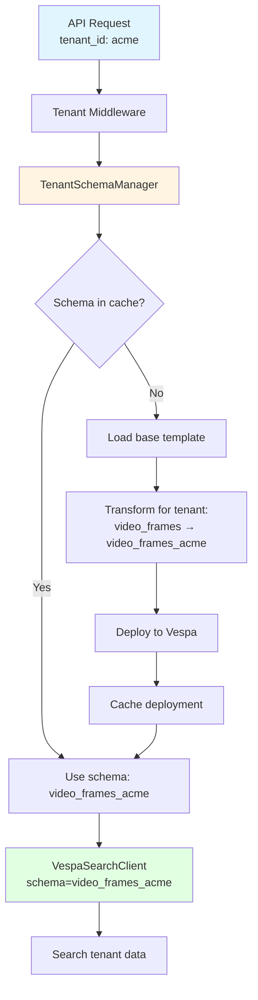
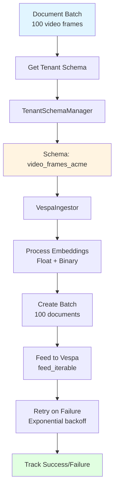

# Backends Module (Vespa Integration)

**Package:** `libs/vespa/cogniverse_vespa/`
**Purpose:** Vespa backend integration with multi-tenant schema management
**Last Updated:** 2025-10-15

---

## Table of Contents

1. [Module Overview](#module-overview)
2. [Package Structure](#package-structure)
3. [Multi-Tenant Schema Management](#multi-tenant-schema-management)
4. [Search Client](#search-client)
5. [Ingestion Client](#ingestion-client)
6. [Usage Examples](#usage-examples)
7. [Testing](#testing)

---

## Module Overview

The Vespa package (`cogniverse-vespa`) provides backend integration for vector and hybrid search with multi-tenant support.

### Key Features

1. **Multi-Tenant Schema Management**: Physical isolation via schema-per-tenant
2. **Search Backend**: Video search with ColPali and VideoPrism embeddings
3. **Ingestion**: Batch document feeding with retry logic
4. **Schema Deployment**: JSON-based schema parsing and deployment
5. **Tenant Isolation**: Dedicated schemas for each tenant

### Design Principles

- **Tenant-Aware**: All clients require tenant-specific schema names
- **Schema-Per-Tenant**: Physical data isolation via dedicated Vespa schemas
- **Core Integration**: Depends only on `cogniverse_core` package
- **Production-Ready**: Retry logic, health checks, batch processing

### Package Dependencies

```python
# Vespa package depends on:
from cogniverse_core.agents.base_agent import BaseAgent
from cogniverse_core.config.unified_config import SystemConfig
```

**External Dependencies**:
- `pyvespa>=0.59.0`: Official Vespa Python client
- `numpy>=1.24.0`: Array operations

---

## Package Structure

```
libs/vespa/cogniverse_vespa/
├── __init__.py
├── tenant_schema_manager.py        # Multi-tenant schema management (576 lines)
├── vespa_schema_manager.py         # Schema deployment
├── json_schema_parser.py           # JSON schema parsing
├── backends/                       # Search and ingestion clients
│   ├── __init__.py
│   ├── vespa_search_client.py     # Search operations
│   └── vespa_admin_client.py      # Admin operations
├── schemas/                        # Schema definitions
│   ├── video_frames.sd            # Video frame schema template
│   └── agent_memories.sd          # Memory schema template
└── ingestion/                      # Data ingestion
    ├── __init__.py
    └── vespa_ingestor.py          # Batch ingestion
```

**Key Files** (67 Python files total):
- `tenant_schema_manager.py`: 576 lines - Core tenant management
- `vespa_search_client.py`: 450 lines - Search operations
- `json_schema_parser.py`: 227 lines - Schema parsing

---

## Multi-Tenant Schema Management

### TenantSchemaManager

**Location**: `libs/vespa/cogniverse_vespa/tenant_schema_manager.py`
**Purpose**: Manage tenant-specific Vespa schemas with physical isolation

See [Multi-Tenant Architecture](../architecture/multi-tenant.md) for comprehensive details.

#### Architecture



#### Key Methods

```python
from cogniverse_vespa.tenant_schema_manager import TenantSchemaManager

# Initialize manager (singleton per Vespa endpoint)
schema_manager = TenantSchemaManager(
    vespa_url="http://localhost",
    vespa_port=8080
)

# Get tenant-specific schema name
schema_name = schema_manager.get_tenant_schema_name(
    tenant_id="acme",
    base_schema_name="video_colpali_smol500_mv_frame"
)
# Returns: "video_colpali_smol500_mv_frame_acme"

# Ensure schema exists (idempotent)
schema_manager.ensure_tenant_schema_exists(
    tenant_id="acme",
    base_schema_name="video_colpali_smol500_mv_frame"
)
# Creates schema if not exists

# List tenant schemas
schemas = schema_manager.list_tenant_schemas("acme")
# Returns: ['video_colpali_smol500_mv_frame_acme', 'agent_memories_acme']

# Deploy new schema for tenant
schema_manager.deploy_tenant_schema(
    tenant_id="startup",
    base_schema_name="video_colpali_smol500_mv_frame"
)
```

#### Schema Naming Convention

**Pattern**: `{base_schema}_{tenant_id}`

**Examples**:

| Base Schema | Tenant ID | Tenant Schema |
|------------|-----------|---------------|
| video_colpali_smol500_mv_frame | acme | video_colpali_smol500_mv_frame_acme |
| video_videoprism_base_mv_chunk_30s | startup | video_videoprism_base_mv_chunk_30s_startup |
| agent_memories | acme:production | agent_memories_acme_production |

#### Schema Lifecycle

1. **Load Template**: Base schema from `configs/schemas/{base_schema}_schema.json`
2. **Transform**: Rename schema and document to include tenant suffix
3. **Deploy**: Create Vespa application package and deploy
4. **Cache**: Store deployment in memory for fast lookups

---

## Search Client

### VespaSearchClient

**Location**: `libs/vespa/cogniverse_vespa/backends/vespa_search_client.py`
**Purpose**: Search operations with tenant-specific schema routing

#### Tenant-Aware Initialization

```python
from cogniverse_vespa.backends.vespa_search_client import VespaSearchClient
from cogniverse_vespa.tenant_schema_manager import TenantSchemaManager

# 1. Ensure tenant schema exists
schema_manager = TenantSchemaManager()
schema_manager.ensure_tenant_schema_exists(
    tenant_id="acme",
    base_schema_name="video_colpali_smol500_mv_frame"
)

# 2. Get tenant schema name
tenant_schema = schema_manager.get_tenant_schema_name(
    tenant_id="acme",
    base_schema_name="video_colpali_smol500_mv_frame"
)
# Returns: "video_colpali_smol500_mv_frame_acme"

# 3. Initialize client with tenant schema
client = VespaSearchClient(
    host="localhost",
    port=8080,
    schema=tenant_schema  # Tenant-specific!
)
```

#### Search Operations

```python
# Text search (tenant-scoped)
results = client.search(
    query="cooking videos",
    top_k=10,
    ranking="hybrid_binary_bm25"
)
# Searches ONLY video_colpali_smol500_mv_frame_acme
# Physical isolation - no access to other tenants' data

# Results structure
for result in results:
    print(f"Video: {result['video_title']}")
    print(f"Frame: {result['frame_id']}")
    print(f"Score: {result['relevance']}")
    print(f"Time: {result['start_time']}s")
```

#### Multi-Tenant Search Example

```python
# Two tenants searching independently

# Tenant A: acme
schema_mgr = TenantSchemaManager()
schema_mgr.ensure_tenant_schema_exists("acme", "video_frames")

client_acme = VespaSearchClient(
    host="localhost",
    port=8080,
    schema=schema_mgr.get_tenant_schema_name("acme", "video_frames")
)
results_acme = client_acme.search("cooking videos")
# Only searches video_frames_acme


# Tenant B: startup
schema_mgr.ensure_tenant_schema_exists("startup", "video_frames")

client_startup = VespaSearchClient(
    host="localhost",
    port=8080,
    schema=schema_mgr.get_tenant_schema_name("startup", "video_frames")
)
results_startup = client_startup.search("cooking videos")
# Only searches video_frames_startup

# Complete physical isolation
```

#### Ranking Strategies

The client supports multiple ranking strategies:

| Strategy | Type | Use Case |
|----------|------|----------|
| bm25_only | Text | Pure text search (no embeddings) |
| float_float | Visual | Highest accuracy (slow) |
| binary_binary | Visual | Fast visual search |
| hybrid_float_bm25 | Hybrid | Best accuracy (visual + text) |
| hybrid_binary_bm25 | Hybrid | Fast hybrid search |

```python
# Pure text search (fast)
results = client.search(
    query="machine learning tutorial",
    ranking="bm25_only"
)

# Visual + text hybrid (best accuracy)
results = client.search(
    query="robot arm demonstration",
    ranking="hybrid_float_bm25"
)
```

---

## Ingestion Client

### VespaIngestor

**Location**: `libs/vespa/cogniverse_vespa/ingestion/vespa_ingestor.py`
**Purpose**: Batch document ingestion with tenant-aware schema routing

#### Architecture



#### Tenant-Aware Ingestion

```python
from cogniverse_vespa.ingestion.vespa_ingestor import VespaIngestor
from cogniverse_vespa.tenant_schema_manager import TenantSchemaManager

# 1. Ensure tenant schema exists
schema_manager = TenantSchemaManager()
schema_manager.ensure_tenant_schema_exists(
    tenant_id="acme",
    base_schema_name="video_colpali_smol500_mv_frame"
)

# 2. Get tenant schema
tenant_schema = schema_manager.get_tenant_schema_name(
    tenant_id="acme",
    base_schema_name="video_colpali_smol500_mv_frame"
)

# 3. Initialize ingestor with tenant schema
ingestor = VespaIngestor(
    host="localhost",
    port=8080,
    schema=tenant_schema,  # video_colpali_smol500_mv_frame_acme
    batch_size=100,
    max_workers=4
)

# 4. Ingest documents (automatically routed to tenant schema)
success_count, failed_ids = ingestor.ingest_batch(documents)
print(f"Ingested {success_count}/{len(documents)} documents to {tenant_schema}")
```

#### Document Processing

```python
# Create document with embeddings
import numpy as np

document = {
    "id": "acme_video123_frame_5",
    "fields": {
        "video_id": "video123",
        "frame_id": 5,
        "start_time": 2.5,
        "end_time": 3.0,
        "embedding": np.random.randn(1024, 128),  # ColPali embeddings
        "video_title": "Cooking Tutorial",
        "frame_description": "Chopping vegetables",
        "audio_transcript": "First, we chop the vegetables"
    }
}

# Ingestor automatically:
# 1. Converts embeddings to Vespa format (float + binary)
# 2. Maps fields to tenant schema
# 3. Creates Vespa document
# 4. Feeds to video_colpali_smol500_mv_frame_acme
```

#### Batch Configuration

```python
# Production-ready configuration
ingestor_config = {
    "batch_size": 100,              # Documents per batch
    "max_workers": 4,                # Parallel workers
    "max_queue_size": 500,           # Feed queue size
    "max_connections": 8,            # HTTP connections
    "compress": "auto",              # Enable compression
    "retry_config": {
        "max_attempts": 3,
        "initial_delay": 1.0,
        "exponential_backoff": True
    }
}
```

---

## Schema Deployment

### JSON Schema Parser

**Location**: `libs/vespa/cogniverse_vespa/json_schema_parser.py`
**Purpose**: Parse JSON schema definitions to PyVespa objects

#### Schema Template Structure

Base schemas are stored in `configs/schemas/`:

```json
{
  "name": "video_colpali_smol500_mv_frame",
  "document": {
    "name": "video_colpali_smol500_mv_frame",
    "fields": [
      {
        "name": "video_id",
        "type": "string",
        "indexing": ["summary", "attribute"],
        "attribute": ["fast-search"]
      },
      {
        "name": "embedding",
        "type": "tensor<float>(patch{}, v[128])",
        "indexing": ["attribute"]
      }
    ]
  },
  "rank_profiles": [
    {
      "name": "colpali",
      "inputs": [
        {"name": "query(qt)", "type": "tensor<float>(querytoken{}, v[128])"}
      ],
      "first_phase": {
        "expression": "sum(reduce(sum(query(qt) * attribute(embedding), v), max, patch), querytoken)"
      }
    }
  ]
}
```

#### Parsing and Deployment

```python
from cogniverse_vespa.json_schema_parser import JsonSchemaParser
from cogniverse_vespa.vespa_schema_manager import VespaSchemaManager

# Parse JSON schema
parser = JsonSchemaParser()
schema = parser.load_schema_from_json_file(
    "configs/schemas/video_colpali_smol500_mv_frame_schema.json"
)

# Deploy schema
schema_manager = VespaSchemaManager(
    vespa_endpoint="http://localhost",
    vespa_port=19071  # Config server port
)

schema_manager.deploy_schema(schema, app_name="videosearch")
```

---

## Usage Examples

### Example 1: Tenant Onboarding

```python
from cogniverse_vespa.tenant_schema_manager import TenantSchemaManager

# New tenant "acme" starts using the system
schema_manager = TenantSchemaManager()

# Deploy all required schemas for tenant
schemas_to_deploy = [
    "video_colpali_smol500_mv_frame",
    "video_videoprism_base_mv_chunk_30s",
    "agent_memories"
]

for base_schema in schemas_to_deploy:
    schema_manager.ensure_tenant_schema_exists(
        tenant_id="acme",
        base_schema_name=base_schema
    )
    print(f"✅ Deployed {base_schema} for acme")

# List all schemas for tenant
deployed_schemas = schema_manager.list_tenant_schemas("acme")
print(f"Tenant 'acme' schemas: {deployed_schemas}")
# ['video_colpali_smol500_mv_frame_acme',
#  'video_videoprism_base_mv_chunk_30s_acme',
#  'agent_memories_acme']
```

### Example 2: Tenant-Scoped Search

```python
from cogniverse_vespa.backends.vespa_search_client import VespaSearchClient
from cogniverse_vespa.tenant_schema_manager import TenantSchemaManager

def search_for_tenant(tenant_id: str, query: str) -> list:
    """
    Search videos for specific tenant.

    Args:
        tenant_id: Tenant identifier
        query: Search query

    Returns:
        Search results from tenant-specific schema
    """
    # Get tenant schema
    schema_manager = TenantSchemaManager()
    schema_manager.ensure_tenant_schema_exists(
        tenant_id=tenant_id,
        base_schema_name="video_colpali_smol500_mv_frame"
    )

    tenant_schema = schema_manager.get_tenant_schema_name(
        tenant_id=tenant_id,
        base_schema_name="video_colpali_smol500_mv_frame"
    )

    # Initialize client
    client = VespaSearchClient(
        host="localhost",
        port=8080,
        schema=tenant_schema
    )

    # Search
    results = client.search(
        query=query,
        top_k=10,
        ranking="hybrid_float_bm25"
    )

    return results


# Use for different tenants
acme_results = search_for_tenant("acme", "cooking videos")
startup_results = search_for_tenant("startup", "cooking videos")

# Completely isolated - different data sets
```

### Example 3: Tenant-Scoped Ingestion

```python
from cogniverse_vespa.ingestion.vespa_ingestor import VespaIngestor
from cogniverse_vespa.tenant_schema_manager import TenantSchemaManager
import numpy as np

def ingest_videos_for_tenant(
    tenant_id: str,
    video_frames: list
) -> tuple[int, list]:
    """
    Ingest video frames for specific tenant.

    Args:
        tenant_id: Tenant identifier
        video_frames: List of frame documents

    Returns:
        (success_count, failed_ids)
    """
    # Get tenant schema
    schema_manager = TenantSchemaManager()
    schema_manager.ensure_tenant_schema_exists(
        tenant_id=tenant_id,
        base_schema_name="video_colpali_smol500_mv_frame"
    )

    tenant_schema = schema_manager.get_tenant_schema_name(
        tenant_id=tenant_id,
        base_schema_name="video_colpali_smol500_mv_frame"
    )

    # Initialize ingestor
    ingestor = VespaIngestor(
        host="localhost",
        port=8080,
        schema=tenant_schema,
        batch_size=100,
        max_workers=4
    )

    # Ingest
    success_count, failed_ids = ingestor.ingest_batch(video_frames)

    print(f"Ingested {success_count}/{len(video_frames)} frames")
    print(f"Schema: {tenant_schema}")

    return success_count, failed_ids


# Ingest for tenant "acme"
frames_acme = [
    {
        "id": f"acme_video1_frame_{i}",
        "fields": {
            "video_id": "video1",
            "frame_id": i,
            "embedding": np.random.randn(1024, 128),
            "video_title": "Cooking Tutorial"
        }
    }
    for i in range(100)
]

success, failed = ingest_videos_for_tenant("acme", frames_acme)
# Ingests to video_colpali_smol500_mv_frame_acme
```

### Example 4: Agent Integration

```python
from cogniverse_agents.search.video_search_agent import VideoSearchAgent

# Agent automatically handles tenant schema management
agent = VideoSearchAgent(
    tenant_id="acme",  # REQUIRED
    vespa_host="localhost",
    vespa_port=8080,
    profile="video_colpali_smol500_mv_frame"
)

# Agent internally:
# 1. Uses TenantSchemaManager to ensure schema exists
# 2. Gets tenant-specific schema name
# 3. Initializes VespaSearchClient with tenant schema
# 4. All searches automatically scoped to tenant

results = await agent.search_by_text("cooking videos")
# Searches video_colpali_smol500_mv_frame_acme
```

---

## Testing

### Unit Tests

**Location**: `tests/backends/unit/`

```python
# tests/backends/unit/test_tenant_schema_manager.py

import pytest
from cogniverse_vespa.tenant_schema_manager import TenantSchemaManager

class TestTenantSchemaManager:
    def test_schema_name_generation(self):
        """Test tenant schema naming"""
        manager = TenantSchemaManager()

        # Simple format
        schema = manager.get_tenant_schema_name("acme", "video_frames")
        assert schema == "video_frames_acme"

        # Org:tenant format
        schema = manager.get_tenant_schema_name("acme:production", "video_frames")
        assert schema == "video_frames_acme_production"

    def test_schema_exists_check(self):
        """Test schema existence check"""
        manager = TenantSchemaManager()

        # First call deploys schema
        result = manager.ensure_tenant_schema_exists("test_tenant", "video_frames")
        assert result is True

        # Second call returns cached result
        result = manager.ensure_tenant_schema_exists("test_tenant", "video_frames")
        assert result is True

    def test_tenant_isolation(self):
        """Verify tenants have separate schemas"""
        manager = TenantSchemaManager()

        schema_a = manager.get_tenant_schema_name("tenant_a", "video_frames")
        schema_b = manager.get_tenant_schema_name("tenant_b", "video_frames")

        assert schema_a != schema_b
        assert schema_a == "video_frames_tenant_a"
        assert schema_b == "video_frames_tenant_b"
```

### Integration Tests

**Location**: `tests/backends/integration/`

```python
# tests/backends/integration/test_vespa_search_integration.py

import pytest
from cogniverse_vespa.backends.vespa_search_client import VespaSearchClient
from cogniverse_vespa.tenant_schema_manager import TenantSchemaManager

@pytest.mark.integration
class TestVespaSearchIntegration:
    @pytest.fixture
    def tenant_id(self):
        return "test_tenant_integration"

    @pytest.fixture
    def client(self, tenant_id):
        """Create client with real Vespa connection"""
        # Ensure schema exists
        schema_manager = TenantSchemaManager()
        schema_manager.ensure_tenant_schema_exists(
            tenant_id,
            "video_colpali_smol500_mv_frame"
        )

        # Get tenant schema
        tenant_schema = schema_manager.get_tenant_schema_name(
            tenant_id,
            "video_colpali_smol500_mv_frame"
        )

        # Create client
        client = VespaSearchClient(
            host="localhost",
            port=8080,
            schema=tenant_schema
        )
        return client

    def test_search_with_tenant_schema(self, client):
        """Test search uses tenant schema"""
        results = client.search(
            query="test query",
            top_k=5
        )

        assert isinstance(results, list)
        # Results depend on ingested data

    def test_tenant_isolation(self):
        """Verify tenants cannot access each other's data"""
        schema_manager = TenantSchemaManager()

        # Setup tenant A
        schema_manager.ensure_tenant_schema_exists("tenant_a", "video_frames")
        client_a = VespaSearchClient(
            host="localhost",
            port=8080,
            schema=schema_manager.get_tenant_schema_name("tenant_a", "video_frames")
        )

        # Setup tenant B
        schema_manager.ensure_tenant_schema_exists("tenant_b", "video_frames")
        client_b = VespaSearchClient(
            host="localhost",
            port=8080,
            schema=schema_manager.get_tenant_schema_name("tenant_b", "video_frames")
        )

        # Search with both clients
        results_a = client_a.search("test")
        results_b = client_b.search("test")

        # Results are from different schemas (different data)
        # Physical isolation ensures no cross-tenant access
```

### Test Fixtures

```python
# tests/conftest.py

import pytest
from cogniverse_vespa.tenant_schema_manager import TenantSchemaManager

@pytest.fixture
def test_tenant_id():
    """Unique tenant ID for tests"""
    import uuid
    return f"test_tenant_{uuid.uuid4().hex[:8]}"

@pytest.fixture
def schema_manager():
    """TenantSchemaManager instance"""
    return TenantSchemaManager(
        vespa_url="localhost",
        vespa_port=8080
    )

@pytest.fixture
def cleanup_tenant_schemas(test_tenant_id, schema_manager):
    """Cleanup tenant schemas after test"""
    yield

    # Cleanup
    schema_manager.delete_tenant_schemas(test_tenant_id)
```

---

## Best Practices

### 1. Always Use TenantSchemaManager

```python
# ✅ Good: Use TenantSchemaManager
schema_manager = TenantSchemaManager()
schema_manager.ensure_tenant_schema_exists("acme", "video_frames")
tenant_schema = schema_manager.get_tenant_schema_name("acme", "video_frames")

client = VespaSearchClient(schema=tenant_schema)

# ❌ Bad: Hardcode schema names
client = VespaSearchClient(schema="video_frames")  # No tenant isolation!
```

### 2. Ensure Schemas Exist Before Use

```python
# Always ensure schema exists before creating client
schema_manager.ensure_tenant_schema_exists(tenant_id, base_schema)

# Then create client
client = VespaSearchClient(
    schema=schema_manager.get_tenant_schema_name(tenant_id, base_schema)
)
```

### 3. Test Tenant Isolation

```python
# Always verify tenants are isolated
def test_tenant_isolation():
    schema_a = schema_manager.get_tenant_schema_name("tenant_a", "video_frames")
    schema_b = schema_manager.get_tenant_schema_name("tenant_b", "video_frames")

    assert schema_a != schema_b
```

### 4. Use Batch Ingestion

```python
# ✅ Good: Batch ingestion
ingestor = VespaIngestor(schema=tenant_schema, batch_size=100)
success, failed = ingestor.ingest_batch(documents)

# ❌ Bad: Individual document feeding
for doc in documents:
    ingestor.ingest_single(doc)  # Slow!
```

---

## Related Documentation

- [SDK Architecture](../architecture/sdk-architecture.md) - Package structure
- [Multi-Tenant Architecture](../architecture/multi-tenant.md) - Tenant isolation details
- [Agents Module](./agents.md) - Agent integration with Vespa backend
- [Common Module](./common.md) - Shared utilities

---

**Summary**: The Vespa package provides tenant-aware backend integration with physical data isolation via schema-per-tenant. All clients are tenant-scoped, and TenantSchemaManager handles schema lifecycle management transparently.
