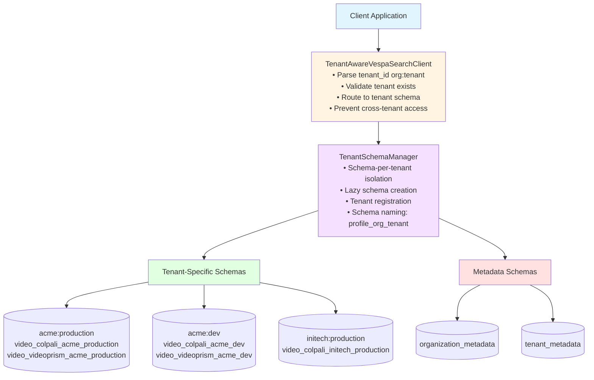

# Backends Module Study Guide (Vespa Integration)

**Last Updated:** 2025-10-09
**Purpose:** Comprehensive guide to multi-tenant Vespa search backend integration, schema management, and embedding format handling
**Module Location:** `src/backends/vespa/`

---

## Table of Contents
1. [Module Overview](#module-overview)
2. [Multi-Tenant Architecture](#multi-tenant-architecture)
3. [Core Components](#core-components)
4. [Data Flow](#data-flow)
5. [Usage Examples](#usage-examples)
6. [Production Considerations](#production-considerations)
7. [Testing](#testing)

---

## Module Overview

### Purpose
The Backends module provides multi-tenant integration with Vespa for vector and hybrid search, handling:
- **Multi-Tenant Schema Management**: Schema-per-tenant isolation with lazy creation
- **Tenant-Aware Search**: Automatic tenant routing for all search operations
- **Embedding Formats**: Binary vs float conversion for optimal search performance
- **Search Strategies**: 14+ ranking strategies (BM25, ColPali, hybrid)
- **Document Processing**: Strategy-aware format handling with tenant isolation
- **Batch Ingestion**: Production-ready document feeding with retry logic

### Key Features
1. **Schema-Per-Tenant Isolation**: Complete physical data separation between tenants
2. **14 Ranking Strategies**: From pure text (BM25) to hybrid visual+text search
3. **Multi-Format Support**: Float (accuracy) and binary (speed) embeddings
4. **Strategy Recommendation**: Automatic strategy selection based on query characteristics
5. **Schema-Driven Processing**: Automatic field mapping based on Vespa schema definitions
6. **Production-Ready Feeding**: Configurable batch sizes, workers, retry logic
7. **Format Conversion**: Numpy → Hex-encoded bfloat16/int8 for Vespa
8. **Tenant ID Validation**: Parse and validate org:tenant format at all entry points

### Dependencies
- **External**: PyVespa (official Vespa client), NumPy, Torch (for bfloat16 conversion)
- **Internal**: `src/common/document.py`, `src/common/config_utils.py`, `src/common/utils/retry.py`, `src/common/tenant_utils.py`

---

## Multi-Tenant Architecture

### Overview

Cogniverse implements **schema-per-tenant** architecture where each tenant receives dedicated Vespa schemas with complete physical data isolation. This prevents any possibility of cross-tenant data access.

### Tenant Hierarchy

**Organization:Tenant Format**:
```
{org}:{tenant}

Examples:
- acme:production
- acme:staging
- initech:production
```

**Validation Rules**:
- `org_id`: Alphanumeric and underscore only (`^[a-zA-Z0-9_]+$`)
- `tenant_name`: Alphanumeric, underscore, and hyphen (`^[a-zA-Z0-9_-]+$`)

### Multi-Tenant Backend Architecture



### Schema Naming Convention

Each tenant receives dedicated schemas with the naming pattern:

```
{profile}_{org}_{tenant}

Examples:
- video_colpali_smol500_mv_frame_acme_production
- video_videoprism_base_mv_chunk_30s_acme_staging
- video_colqwen_omni_mv_chunk_30s_initech_production
```

**Benefits**:
- Complete schema isolation per tenant
- Zero possibility of cross-tenant data leakage
- Independent schema lifecycle management
- Tenant-specific configuration and tuning

---

## Core Components

### 1. TenantSchemaManager (`tenant_schema_manager.py`)

**Purpose**: Manages lifecycle of tenant-specific Vespa schemas with lazy creation and automatic tenant isolation.

**Key Responsibilities**:
- Register new tenants and create dedicated schemas
- Lazy schema creation on first tenant access
- Manage organization and tenant metadata schemas
- Enforce schema-per-tenant isolation

**Key Methods**:

#### `__init__(vespa_url, vespa_port)`
Initialize schema manager.
```python
from src.backends.vespa.tenant_schema_manager import TenantSchemaManager

manager = TenantSchemaManager(
    vespa_url="http://localhost",
    vespa_port=8080
)
```

#### `register_tenant(tenant_id, profile_configs)`
Register new tenant and create schemas lazily.
```python
# Register tenant with automatic schema creation
manager.register_tenant(
    tenant_id="acme:production",
    profile_configs=[
        "video_colpali_smol500_mv_frame",
        "video_videoprism_base_mv_chunk_30s"
    ]
)

# Creates schemas:
# - video_colpali_smol500_mv_frame_acme_production
# - video_videoprism_base_mv_chunk_30s_acme_production
```

#### `get_schema_name(profile, tenant_id)`
Get tenant-specific schema name.
```python
schema_name = manager.get_schema_name(
    profile="video_colpali_smol500_mv_frame",
    tenant_id="acme:production"
)
# Returns: "video_colpali_smol500_mv_frame_acme_production"
```

#### `delete_tenant_schemas(tenant_id)`
Delete all schemas for a tenant.
```python
deleted_count = manager.delete_tenant_schemas("acme:staging")
# Deletes all schemas for acme:staging tenant
```

**Metadata Schemas**:

The TenantSchemaManager maintains two global metadata schemas:

```python
# organization_metadata - stores organization information
{
    "org_id": "acme",
    "description": "ACME Corporation",
    "created_at": "2025-10-09T10:00:00Z",
    "metadata": {...}
}

# tenant_metadata - stores tenant information
{
    "tenant_id": "acme:production",
    "org_id": "acme",
    "tenant_name": "production",
    "description": "Production environment",
    "created_at": "2025-10-09T10:30:00Z",
    "metadata": {...}
}
```

---

### 2. TenantAwareVespaSearchClient (`tenant_aware_vespa_search_client.py`)

**Purpose**: Automatic tenant-aware query routing ensuring all search operations are isolated to the correct tenant schema.

**Key Responsibilities**:
- Parse and validate tenant_id from requests
- Route queries to tenant-specific schemas
- Prevent cross-tenant data access
- Handle tenant-not-found errors

**Key Attributes**:
```python
profile: str                # Profile name (e.g., "video_colpali_smol500_mv_frame")
schema_manager: TenantSchemaManager  # Schema manager for tenant routing
query_encoder: QueryEncoder # Profile-specific encoder
```

**Key Methods**:

#### `__init__(profile, vespa_url, vespa_port)`
Initialize tenant-aware search client.
```python
from src.backends.vespa.tenant_aware_vespa_search_client import TenantAwareVespaSearchClient

client = TenantAwareVespaSearchClient(
    profile="video_colpali_smol500_mv_frame",
    vespa_url="http://localhost",
    vespa_port=8080
)
```

#### `search(query_params, tenant_id, embeddings)`
Execute tenant-isolated search.
```python
results = client.search(
    query_params={
        "query": "person walking in park",
        "ranking": "hybrid_float_bm25",
        "top_k": 10
    },
    tenant_id="acme:production",  # REQUIRED - no defaults
    embeddings=query_embeddings   # Optional, auto-generated if None
)

# Automatically routes to: video_colpali_smol500_mv_frame_acme_production
# Returns: List[Dict] with video_id, frame_id, relevance, timestamps, etc.
```

**Tenant Routing Flow**:
```python
1. Parse tenant_id → validate format → ("acme", "production")
2. Get schema name → "video_colpali_smol500_mv_frame_acme_production"
3. Check schema exists → raise error if tenant not found
4. Execute query on tenant-specific schema
5. Return results (isolated to tenant)
```

**Error Handling**:
```python
# Invalid tenant_id
search(..., tenant_id="invalid")
# Raises: ValueError("tenant_id must be in org:tenant format")

# Tenant not found
search(..., tenant_id="nonexistent:tenant")
# Raises: ValueError("Tenant 'nonexistent:tenant' not found")

# Missing tenant_id
search(..., tenant_id=None)
# Raises: ValueError("tenant_id is required for tenant-aware search")
```

---

### 3. VespaVideoSearchClient (`vespa_search_client.py`)

**Purpose**: Main search client with 14 ranking strategies and automatic strategy recommendation.

**Note**: This is the base search client. For multi-tenant deployments, use `TenantAwareVespaSearchClient` instead.

**Key Attributes**:
```python
vespa_url: str              # Vespa server URL
vespa_port: int             # Vespa server port
vespa_schema: str           # Active schema name
query_encoder: QueryEncoder # Automatic encoder initialization based on schema
```

**Key Methods**:

#### `search(query_params, embeddings, schema)`
Unified search supporting all 14 ranking strategies.
```python
results = client.search(
    query_params={
        "query": "person walking in park",
        "ranking": "hybrid_float_bm25",  # or any RankingStrategy
        "top_k": 10,
        "start_date": "2024-01-01",
        "end_date": "2024-12-31"
    },
    embeddings=query_embeddings,  # Optional, auto-generated if None
    schema="video_colpali_smol500_mv_frame_acme_production"
)
```

#### `RankingStrategy.recommend_strategy(has_visual, has_text, speed_priority)`
Automatic strategy selection.
```python
from src.backends.vespa.vespa_search_client import RankingStrategy

strategy = RankingStrategy.recommend_strategy(
    has_visual_component=True,
    has_text_component=True,
    speed_priority=False  # True → binary, False → float
)
# Returns: RankingStrategy.HYBRID_FLOAT_BM25 (best accuracy)
```

**Ranking Strategies**:

| Strategy | Speed | Accuracy | Use Case | Requires Embeddings |
|----------|-------|----------|----------|---------------------|
| BM25_ONLY | Fastest | Good (text only) | Pure text queries | No |
| BINARY_BINARY | Fast | Good approximation | Speed-critical visual | Yes (binary) |
| FLOAT_FLOAT | Slowest | Highest visual | Maximum precision | Yes (float) |
| FLOAT_BINARY | Fast | Very good | Balanced speed/accuracy | Yes (float) |
| PHASED | Fast | High | Binary recall + float rerank | Yes (both) |
| HYBRID_FLOAT_BM25 | Slow | Highest overall | Complex visual+text | Yes (float) |
| HYBRID_BINARY_BM25 | Fast | Good hybrid | Fast visual+text | Yes (binary) |

---

### 4. VespaEmbeddingProcessor (`embedding_processor.py`)

**Purpose**: Convert numpy embeddings to Vespa-specific formats (hex-encoded bfloat16/int8).

**Key Methods**:

#### `process_embeddings(raw_embeddings)`
Main entry point for embedding conversion.
```python
from src.backends.vespa.embedding_processor import VespaEmbeddingProcessor

processor = VespaEmbeddingProcessor(
    logger=logger,
    model_name="vidore/colsmol-500m",
    schema_name="video_colpali_smol500_mv_frame_acme_production"
)

raw_embeddings = np.random.randn(1024, 128)  # ColPali patch embeddings

processed = processor.process_embeddings(raw_embeddings)
# Returns:
# {
#   "embedding": {
#     0: "3F9A4B2C...",  # Hex-encoded bfloat16 for patch 0
#     1: "4A1B3C5D...",
#     ...
#   },
#   "embedding_binary": {
#     0: "A3F2B1C4...",  # Hex-encoded int8 binary for patch 0
#     1: "B2A1D3E5...",
#     ...
#   }
# }
```

**Format Types**:

1. **Float Embeddings** (bfloat16 hex):
   - Patch-based (ColPali): `{0: "3F9A...", 1: "4B2C...", ...}`
   - Single-vector (VideoPrism): `[0.123, 0.456, ...]`

2. **Binary Embeddings** (int8 hex):
   - Binarize: `np.where(embeddings > 0, 1, 0)`
   - Pack bits: `np.packbits(binary, axis=1).astype(int8)`
   - Hex-encode: Convert to hex string

---

### 5. VespaPyClient (`ingestion_client.py`)

**Purpose**: Production-ready Vespa client for batch document feeding with retry logic.

**Key Attributes**:
```python
schema_name: str           # Vespa schema to use (tenant-specific)
app: Vespa                 # PyVespa application instance
feed_config: Dict          # Production feeding parameters
```

**Key Methods**:

#### `__init__(config, logger)`
Initialize client from config.
```python
from src.backends.vespa.ingestion_client import VespaPyClient

client = VespaPyClient(
    config={
        "schema_name": "video_colpali_smol500_mv_frame_acme_production",
        "vespa_url": "http://localhost",
        "vespa_port": 8080,
        "feed_max_queue_size": 500,
        "feed_max_workers": 4
    },
    logger=logger
)
```

#### `process(doc)`
Convert universal Document to Vespa format.
```python
from src.common.document import Document

doc = Document(
    id="video123_frame_5",
    embeddings={
        "embedding": {"data": np.random.randn(1024, 128)}
    },
    metadata={
        "frame_id": 5,
        "start_time": 2.5,
        "end_time": 3.0,
        "audio_transcript": "Discussion about AI safety"
    }
)

vespa_doc = client.process(doc)
# Returns Vespa document with embeddings processed to tenant schema
```

---

## Data Flow

### End-to-End Multi-Tenant Document Ingestion Flow

```
1. INGESTION PIPELINE (with tenant_id)
   ↓
   Universal Document {
     id: "video123_frame_5",
     embeddings: {"embedding": {"data": np.ndarray(1024, 128)}},
     metadata: {frame_id, timestamps, transcript, ...}
   }
   ↓
2. TENANT SCHEMA MANAGER
   parse_tenant_id("acme:production")
   ├── Validate org_id: "acme"
   ├── Validate tenant_name: "production"
   └── Get schema: "video_colpali_smol500_mv_frame_acme_production"
   ↓
3. VESPA PY CLIENT
   process(doc)
   ├── Strategy-aware requirements check
   │   └── What embeddings does this schema need?
   ├── Embedding processing
   │   ├── Float: np.ndarray → hex-encoded bfloat16 dict
   │   └── Binary: np.ndarray → binarized → packed int8 → hex dict
   ├── Field mapping (schema-driven)
   │   └── Only add fields that exist in schema definition
   └── Create Vespa document structure
   ↓
4. BATCH FEEDING (tenant-isolated)
   _feed_prepared_batch(documents, batch_size=100)
   ├── Production config: 500 queue, 4 workers, 8 connections
   ├── app.feed_iterable(iter, schema, namespace, callback)
   ├── Per-document callback tracking
   └── Retry with exponential backoff
   ↓
5. VESPA STORAGE (tenant-specific schema)
   Documents indexed in tenant schema:
   - video_colpali_smol500_mv_frame_acme_production
   ├── Float embeddings for precise ranking
   ├── Binary embeddings for fast retrieval
   └── Text fields for BM25 search
   (Completely isolated from other tenants)
```

### End-to-End Multi-Tenant Search Flow

```
1. USER QUERY (with tenant_id)
   "Show me videos of robotics demonstrations"
   tenant_id: "acme:production"
   ↓
2. TENANT ID PARSING
   parse_tenant_id("acme:production")
   ├── Extract org_id: "acme"
   ├── Extract tenant_name: "production"
   └── Validate format and components
   ↓
3. SCHEMA ROUTING
   TenantSchemaManager.get_schema_name(
       profile="video_colpali_smol500_mv_frame",
       tenant_id="acme:production"
   )
   └── Returns: "video_colpali_smol500_mv_frame_acme_production"
   ↓
4. QUERY ENCODING
   ├── Query encoder (ColPali) generates embeddings
   └── embeddings: np.ndarray(1024, 128)
   ↓
5. STRATEGY SELECTION
   recommend_strategy(has_visual=True, has_text=True, speed_priority=False)
   └── Recommended: HYBRID_FLOAT_BM25 (best accuracy)
   ↓
6. TENANT-AWARE SEARCH
   TenantAwareVespaSearchClient.search(
     query_params={
       "query": "robotics demonstrations",
       "ranking": "hybrid_float_bm25",
       "top_k": 10
     },
     tenant_id="acme:production",
     embeddings=embeddings
   )
   ├── Build YQL: nearestNeighbor(embedding, qt)
   ├── Convert embeddings to Vespa format
   ├── Add text query for BM25 component
   └── Execute on tenant schema: video_colpali_smol500_mv_frame_acme_production
   ↓
7. VESPA RANKING (tenant-isolated)
   Ranking Profile: hybrid_float_bm25
   ├── First Phase: Visual similarity (ColPali max_sim)
   │   └── Retrieve top 1000 candidates from acme:production only
   ├── Second Phase: BM25 text re-ranking
   │   └── Rerank top 100 with text similarity
   └── Return top 10 results (acme:production data only)
   ↓
8. RETURN TO USER
   Results isolated to acme:production tenant
   (Zero possibility of seeing data from other tenants)
```

---

## Usage Examples

### Example 1: Multi-Tenant Setup and Search

```python
from src.backends.vespa.tenant_schema_manager import TenantSchemaManager
from src.backends.vespa.tenant_aware_vespa_search_client import TenantAwareVespaSearchClient

# Initialize schema manager
schema_manager = TenantSchemaManager(
    vespa_url="http://localhost",
    vespa_port=8080
)

# Register tenant (creates schemas lazily)
schema_manager.register_tenant(
    tenant_id="acme:production",
    profile_configs=["video_colpali_smol500_mv_frame"]
)

# Initialize tenant-aware search client
search_client = TenantAwareVespaSearchClient(
    profile="video_colpali_smol500_mv_frame",
    vespa_url="http://localhost",
    vespa_port=8080
)

# Execute tenant-isolated search
results = search_client.search(
    query_params={
        "query": "person walking in park",
        "ranking": "hybrid_float_bm25",
        "top_k": 10
    },
    tenant_id="acme:production"  # Required
)

# Results only from acme:production schema
for result in results:
    print(f"Video: {result['video_title']}")
    print(f"  Frame {result['frame_id']} @ {result['start_time']}s")
    print(f"  Relevance: {result['relevance']:.3f}")
```

### Example 2: Multi-Tenant Document Ingestion

```python
from src.backends.vespa.tenant_schema_manager import TenantSchemaManager
from src.backends.vespa.ingestion_client import VespaPyClient
from src.common.document import Document
from src.common.tenant_utils import parse_tenant_id
import numpy as np

# Parse tenant ID
tenant_id = "acme:production"
org_id, tenant_name = parse_tenant_id(tenant_id)

# Get tenant-specific schema name
schema_manager = TenantSchemaManager()
schema_name = schema_manager.get_schema_name(
    profile="video_colpali_smol500_mv_frame",
    tenant_id=tenant_id
)
# Returns: "video_colpali_smol500_mv_frame_acme_production"

# Initialize client with tenant schema
client = VespaPyClient(
    config={
        "schema_name": schema_name,  # Tenant-specific schema
        "vespa_url": "http://localhost",
        "vespa_port": 8080,
        "feed_max_queue_size": 500,
        "feed_max_workers": 4
    },
    logger=logger
)

client.connect()

# Create documents
documents = []
for i in range(100):
    doc = Document(
        id=f"video123_frame_{i}",
        embeddings={
            "embedding": {"data": np.random.randn(1024, 128)}
        },
        metadata={
            "frame_id": i,
            "start_time": i * 0.5,
            "end_time": (i + 1) * 0.5,
            "frame_description": f"Frame {i} description",
            "audio_transcript": f"Transcript for frame {i}"
        }
    )
    documents.append(doc)

# Process and feed to tenant schema
vespa_docs = [client.process(doc) for doc in documents]
success_count, failed_ids = client._feed_prepared_batch(
    documents=vespa_docs,
    batch_size=100
)

print(f"Fed {success_count} documents to {tenant_id}")
```

### Example 3: Cross-Tenant Isolation Verification

```python
from src.backends.vespa.tenant_aware_vespa_search_client import TenantAwareVespaSearchClient

client = TenantAwareVespaSearchClient(
    profile="video_colpali_smol500_mv_frame",
    vespa_url="http://localhost",
    vespa_port=8080
)

# Search in acme:production
results_acme_prod = client.search(
    query_params={"query": "test video", "ranking": "bm25_only", "top_k": 10},
    tenant_id="acme:production"
)

# Search in acme:staging (different tenant, completely isolated data)
results_acme_staging = client.search(
    query_params={"query": "test video", "ranking": "bm25_only", "top_k": 10},
    tenant_id="acme:staging"
)

# Results are completely different - no shared data
assert results_acme_prod != results_acme_staging
print(f"Production results: {len(results_acme_prod)}")
print(f"Staging results: {len(results_acme_staging)}")
print("Complete tenant isolation verified!")
```

### Example 4: Tenant Schema Management

```python
from src.backends.vespa.tenant_schema_manager import TenantSchemaManager

manager = TenantSchemaManager(
    vespa_url="http://localhost",
    vespa_port=8080
)

# Register new tenant with multiple profiles
manager.register_tenant(
    tenant_id="acme:dev",
    profile_configs=[
        "video_colpali_smol500_mv_frame",
        "video_videoprism_base_mv_chunk_30s",
        "video_colqwen_omni_mv_chunk_30s"
    ]
)

# Creates schemas:
# - video_colpali_smol500_mv_frame_acme_dev
# - video_videoprism_base_mv_chunk_30s_acme_dev
# - video_colqwen_omni_mv_chunk_30s_acme_dev

# Get schema names
colpali_schema = manager.get_schema_name(
    profile="video_colpali_smol500_mv_frame",
    tenant_id="acme:dev"
)
print(f"ColPali schema: {colpali_schema}")

# Delete tenant schemas
deleted_count = manager.delete_tenant_schemas("acme:dev")
print(f"Deleted {deleted_count} schemas for acme:dev")
```

### Example 5: Strategy Benchmarking (Multi-Tenant)

```python
from src.backends.vespa.tenant_aware_vespa_search_client import TenantAwareVespaSearchClient

client = TenantAwareVespaSearchClient(
    profile="video_colpali_smol500_mv_frame",
    vespa_url="http://localhost",
    vespa_port=8080
)

# Compare strategies on same query within single tenant
strategies = [
    "bm25_only",
    "binary_binary",
    "float_float",
    "hybrid_float_bm25"
]

results_by_strategy = {}
for strategy in strategies:
    results = client.search(
        query_params={
            "query": "Boston Dynamics robot demonstration",
            "ranking": strategy,
            "top_k": 10
        },
        tenant_id="acme:production"
    )
    results_by_strategy[strategy] = results
    print(f"{strategy}: {len(results)} results")

# All strategies search same tenant data (acme:production)
# Results vary by ranking strategy, not by tenant
```

---

## Production Considerations

### 1. Tenant Isolation Guarantees

**Schema-Per-Tenant Architecture**:
- Each tenant has dedicated Vespa schemas
- Zero possibility of cross-tenant data leakage
- Automatic routing enforced at search client level
- Validation at all entry points (parse_tenant_id)

**Tenant Validation**:
```python
from src.common.tenant_utils import parse_tenant_id, validate_org_id, validate_tenant_name

# Always validate before using tenant_id
try:
    org_id, tenant_name = parse_tenant_id("acme:production")
    validate_org_id(org_id)
    validate_tenant_name(tenant_name)
except ValueError as e:
    # Handle invalid tenant_id
    logger.error(f"Invalid tenant_id: {e}")
```

### 2. Embedding Format Selection

**Float Embeddings (bfloat16 hex)**:
- **Use when**: Accuracy is critical, acceptable latency (~50-200ms)
- **Tradeoff**: Higher precision, slower search, larger storage
- **Strategies**: FLOAT_FLOAT, HYBRID_FLOAT_BM25, HYBRID_BM25_FLOAT
- **Storage**: ~2KB per frame for ColPali (1024 patches × 128 dims × 2 bytes)

**Binary Embeddings (int8 hex)**:
- **Use when**: Speed is critical, high throughput needed
- **Tradeoff**: Lower precision (~90-95% of float accuracy), 10x faster, 16x smaller storage
- **Strategies**: BINARY_BINARY, HYBRID_BINARY_BM25, HYBRID_BM25_BINARY
- **Storage**: ~128 bytes per frame (1024 patches × 128 bits / 8)

**Hybrid (Binary 1st phase + Float 2nd phase)**:
- **Use when**: Best of both worlds - fast retrieval, precise reranking
- **Tradeoff**: Requires storing both formats (2.1KB total)
- **Strategies**: PHASED, FLOAT_BINARY
- **Recommended**: Default choice for production video search

### 3. Batch Feeding Configuration

**Production-Ready Settings**:
```python
feed_config = {
    "max_queue_size": 500,      # Higher = better throughput, more memory
    "max_workers": 4,            # CPU cores / 2 for CPU-bound tasks
    "max_connections": 8,        # 2x max_workers for I/O overlap
    "compress": "auto"           # Enable compression for network efficiency
}
```

**Tuning Guidelines**:
- **High throughput** (>1000 docs/sec): Increase `max_workers` to 8-16, `max_queue_size` to 1000
- **Memory constrained**: Reduce `max_queue_size` to 100-200
- **Network constrained**: Enable `compress: true`, reduce `batch_size` to 50
- **Error-prone network**: Enable retry logic, reduce `max_connections` to 4

### 4. Multi-Tenant Schema Design

**Tenant-Specific Schema Naming**:
- Pattern: `{profile}_{org}_{tenant}`
- Example: `video_colpali_smol500_mv_frame_acme_production`
- Enforced by TenantSchemaManager

**Field Indexing** (same for all tenant schemas):
- **attribute + fast-search**: IDs, timestamps for filtering
- **index + enable-bm25**: Text fields for search
- **attribute only**: Embeddings
- **summary**: Fields to return in results

**Metadata Schemas** (global, shared across tenants):
- `organization_metadata`: Organization info
- `tenant_metadata`: Tenant info
- Not isolated - used for tenant management only

### 5. Performance Benchmarks

**Search Latency** (ColPali, 10K frames per tenant):
- **BM25_ONLY**: 5-10ms (no embeddings)
- **BINARY_BINARY**: 20-30ms (fast visual)
- **FLOAT_FLOAT**: 150-200ms (precise visual)
- **HYBRID_FLOAT_BM25**: 180-250ms (best accuracy)
- **PHASED**: 40-60ms (binary recall + float rerank)

**Note**: Latency is per-tenant. Multiple tenants do not significantly impact individual tenant performance due to schema isolation.

**Storage Requirements** (per frame per tenant):
- **Float embeddings**: 2KB
- **Binary embeddings**: 128 bytes
- **Text fields**: 500 bytes avg
- **Total per frame**: ~2.6KB

**Scaling**: 100 tenants × 10K frames × 2.6KB = 2.6GB (manageable)

---

## Testing

### Key Test Files

**Unit Tests**:
- `tests/backends/unit/test_embedding_processor.py` - Embedding format conversion
- `tests/backends/unit/test_strategy_aware_processor.py` - Strategy requirement detection
- `tests/backends/unit/test_tenant_schema_manager.py` - Tenant schema management
- `tests/backends/unit/test_tenant_aware_search.py` - Tenant-aware search routing

**Integration Tests**:
- `tests/ingestion/integration/test_backend_ingestion.py` - End-to-end document feeding
- `tests/system/test_real_system_integration.py` - Real Vespa connection and search
- `tests/agents/integration/test_video_search_agent_integration.py` - Multi-tenant search integration

**Test Scenarios**:

1. **Tenant Isolation**:
   ```python
   # Verify cross-tenant isolation
   client = TenantAwareVespaSearchClient(profile="video_colpali_smol500_mv_frame")

   results_tenant1 = client.search(
       {"query": "test", "ranking": "bm25_only", "top_k": 10},
       tenant_id="acme:production"
   )

   results_tenant2 = client.search(
       {"query": "test", "ranking": "bm25_only", "top_k": 10},
       tenant_id="initech:production"
   )

   # Verify no overlap
   assert set(r['id'] for r in results_tenant1).isdisjoint(
       set(r['id'] for r in results_tenant2)
   )
   ```

2. **Schema Management**:
   ```python
   manager = TenantSchemaManager()

   # Register tenant
   manager.register_tenant("acme:dev", ["video_colpali_smol500_mv_frame"])

   # Verify schema exists
   schema_name = manager.get_schema_name(
       "video_colpali_smol500_mv_frame",
       "acme:dev"
   )
   assert schema_name == "video_colpali_smol500_mv_frame_acme_dev"

   # Delete and verify
   manager.delete_tenant_schemas("acme:dev")
   ```

3. **Tenant ID Validation**:
   ```python
   from src.common.tenant_utils import parse_tenant_id

   # Valid formats
   assert parse_tenant_id("acme:production") == ("acme", "production")
   assert parse_tenant_id("org_123:tenant-456") == ("org_123", "tenant-456")

   # Invalid formats
   with pytest.raises(ValueError):
       parse_tenant_id("invalid")  # Missing colon

   with pytest.raises(ValueError):
       parse_tenant_id("acme-corp:prod")  # Hyphen in org (invalid)
   ```

---

**Key File References**:
- `src/backends/vespa/tenant_schema_manager.py` - Multi-tenant schema management
- `src/backends/vespa/tenant_aware_vespa_search_client.py` - Tenant-aware search routing
- `src/backends/vespa/vespa_search_client.py` - Base search client (14 strategies)
- `src/backends/vespa/embedding_processor.py` - Embedding format conversion
- `src/backends/vespa/ingestion_client.py` - Production document feeding
- `src/common/tenant_utils.py` - Tenant ID parsing and validation

**Related Documentation**:
- [Multi-Tenant Management](../operations/multi-tenant-management.md) - Complete tenant lifecycle guide
- [Agents Module](agents.md) - Tenant-aware agent initialization
- [Deployment Guide](../operations/deployment.md) - Multi-tenant deployment procedures

---

**Last Updated:** 2025-10-09
**Maintainer:** Development Team
**Status:** Phase 7 Multi-Tenant Architecture Complete
