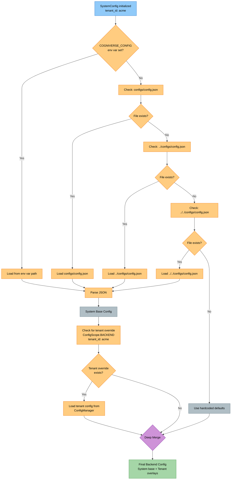
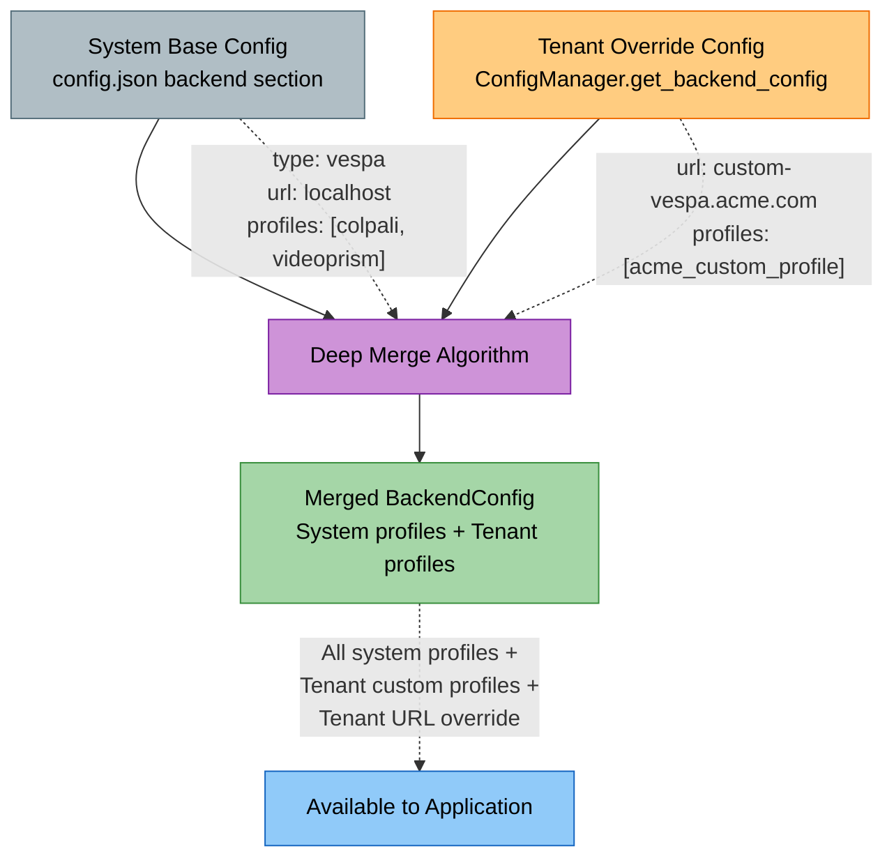
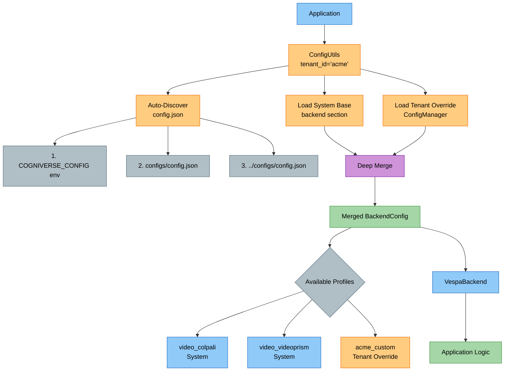
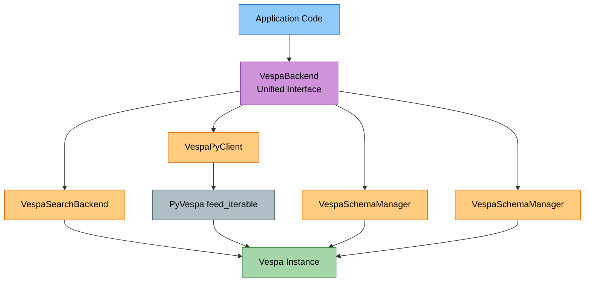
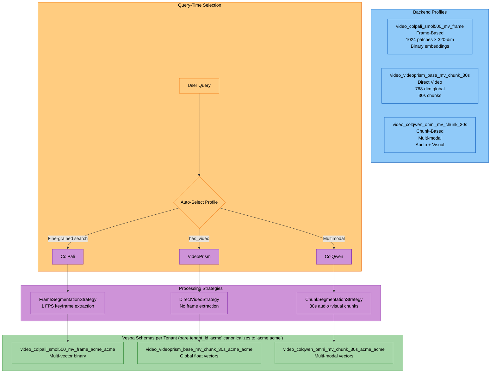
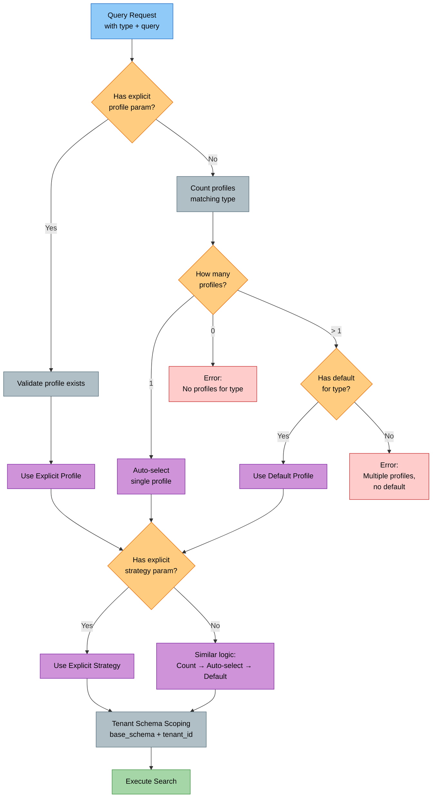
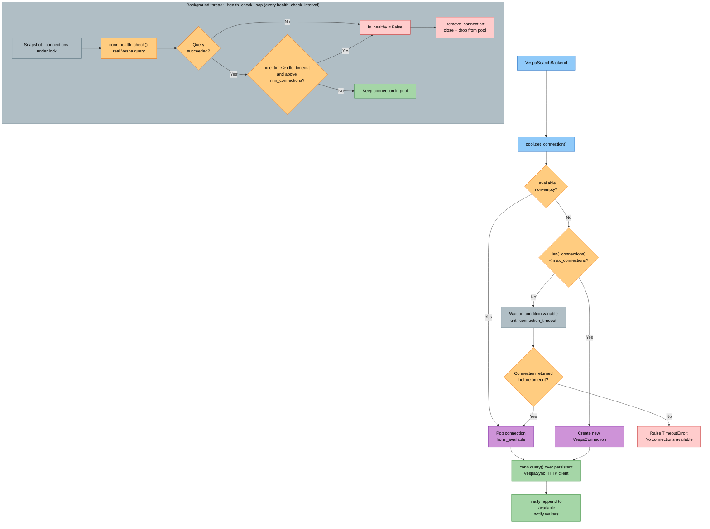
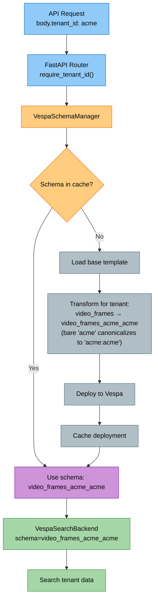
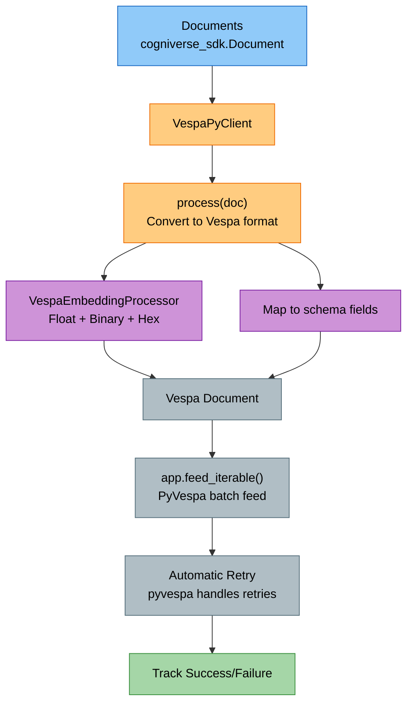

# Backends Module (Vespa Integration)

**Package:** `cogniverse_vespa` (Implementation Layer)
**Location:** `libs/vespa/cogniverse_vespa/`

---

## Table of Contents

1. [Module Overview](#module-overview)
2. [Package Structure](#package-structure)
3. [Backend Configuration Architecture](#backend-configuration-architecture)
4. [Backend Abstraction Layer](#backend-abstraction-layer)
5. [Profile-Based Architecture](#profile-based-architecture)
6. [Connection Pool Management](#connection-pool-management)
7. [Multi-Tenant Schema Management](#multi-tenant-schema-management)
8. [Search Backend](#search-backend)
9. [Ingestion Client](#ingestion-client)
10. [Schema Deployment](#schema-deployment)
11. [Metadata Schema Management](#metadata-schema-management)
12. [Supporting Modules](#supporting-modules)
13. [Usage Examples](#usage-examples)
14. [Testing](#testing)
15. [Best Practices](#best-practices)
16. [VespaConfigStore API](#vespaconfigstore-api)
17. [VespaEmbeddingProcessor](#vespaembeddingprocessor)
18. [BackendVectorStore (Mem0 Backend)](#backendvectorstore-mem0-backend)
19. [RankingStrategyExtractor](#rankingstrategyextractor)
20. [Tenant-Scoped Search via VespaSearchBackend](#tenant-scoped-search-via-vespasearchbackend)

---

## Module Overview

The Vespa package (`cogniverse-vespa`) provides backend integration for vector and hybrid search with multi-tenant support.

### Key Features

1. **Multi-Tenant Schema Management**: Physical isolation via schema-per-tenant
2. **Search Backend**: Video search with ColPali and VideoPrism embeddings
3. **Ingestion**: Batch document feeding with retry logic
4. **Schema Deployment**: JSON-based schema parsing and deployment
5. **Tenant Isolation**: Dedicated schemas for each tenant

### Design Principles

- **Tenant-Aware**: All clients require tenant-specific schema names
- **Schema-Per-Tenant**: Physical data isolation via dedicated Vespa schemas
- **Core Integration**: Depends on `cogniverse_sdk` and `cogniverse_core` packages
- **Production-Ready**: Retry logic, health checks, batch processing

### Package Dependencies

```python
# Vespa package depends on:
from cogniverse_sdk.document import Document
from cogniverse_sdk.interfaces.backend import Backend, SearchBackend
from cogniverse_core.common.utils.retry import RetryConfig, retry_with_backoff
from cogniverse_core.schemas.filesystem_loader import FilesystemSchemaLoader
from cogniverse_foundation.config.utils import get_config  # Lazy import
```

**External Dependencies**:

- `pyvespa>=0.59.0`: Official Vespa Python client
- `numpy>=1.24.0`: Array operations

---

## Package Structure

```text
libs/vespa/cogniverse_vespa/
├── __init__.py
├── _vespa_factory.py               # Internal: Vespa app factory (make_vespa_app, PersistentVespaOps, make_persistent_vespa_ops)
├── _yql.py                         # Internal: YQL escaping utilities (yql_quote)
├── backend.py                      # Backend abstraction
├── config/
│   ├── __init__.py
│   └── config_store.py             # Vespa-based config storage
├── config_utils.py                 # Configuration utilities
├── embedding_processor.py          # Embedding processing
├── ingestion_client.py             # Ingestion client (VespaPyClient class)
├── json_schema_parser.py           # JSON schema parsing
├── memory_config.py                # Memory configuration
├── metadata_schemas.py             # Metadata schema definitions
├── ranking_strategy_extractor.py   # Ranking strategy extraction
├── registry/
│   ├── __init__.py
│   └── adapter_store.py            # Adapter registry storage
├── search_backend.py               # Tenant-scoped search backend (VespaSearchBackend)
├── strategy_aware_processor.py     # Strategy-aware processing
└── vespa_schema_manager.py         # Multi-tenant schema management
```

**Total Files**: 15 Python modules (excluding `__init__.py`), including 2 subdirectories: config/, registry/ (plus 2 private modules: `_vespa_factory.py`, `_yql.py`)

**Key Files**:

- `vespa_schema_manager.py`: 1099 lines - Core tenant management
- `json_schema_parser.py`: 189 lines - Schema parsing
- `ingestion_client.py`: 597 lines - PyVespa wrapper for ingestion
- `search_backend.py`: 1740 lines - Search backend with connection pooling
- `backend.py`: 1598 lines - Unified backend abstraction

**Note**: Schema templates are JSON files located in `configs/schemas/` at project root

---

## Backend Configuration Architecture

### Overview

Cogniverse uses a **profile-based backend configuration system** with multi-tenant support. Configuration is loaded from `config.json` with auto-discovery and supports deep merging of system base config with tenant-specific overlays.

**Key Features**:

- **Auto-Discovery**: Automatic config.json discovery from standard locations
- **Profile-Based**: Multiple processing profiles per backend (ColPali, VideoPrism, ColQwen-Omni, etc.)
- **Tenant Overlays**: Tenant-specific config merges with system base
- **Deep Merge**: System profiles + Tenant overrides = Merged configuration
- **Type-Safe**: BackendConfig and BackendProfileConfig dataclasses

### Configuration Auto-Discovery

**Search Order** (defined in `cogniverse_foundation/config/utils.py:_discover_config_file()`):

1. `COGNIVERSE_CONFIG` environment variable (if set)
2. `configs/config.json` (from current directory)
3. `../configs/config.json` (one level up)
4. `../../configs/config.json` (two levels up)

```python
# Automatic discovery - no environment variables needed!
from cogniverse_foundation.config.utils import ConfigUtils, create_default_config_manager

config_manager = create_default_config_manager()
config_utils = ConfigUtils(tenant_id="acme", config_manager=config_manager)
backend_config = config_utils.get("backend")  # Auto-discovered and merged
```

#### Auto-Discovery Flow


```mermaid
flowchart TD
    Start["<span style='color:#000'>SystemConfig initialized<br/>tenant_id: acme</span>"] --> CheckEnv{"<span style='color:#000'>COGNIVERSE_CONFIG<br/>env var set?</span>"}

    CheckEnv -->|Yes| LoadEnv["<span style='color:#000'>Load from env var path</span>"]
    CheckEnv -->|No| Check1["<span style='color:#000'>Check: configs/config.json</span>"]

    Check1 --> Exists1{"<span style='color:#000'>File exists?</span>"}
    Exists1 -->|Yes| Load1["<span style='color:#000'>Load configs/config.json</span>"]
    Exists1 -->|No| Check2["<span style='color:#000'>Check: ../configs/config.json</span>"]

    Check2 --> Exists2{"<span style='color:#000'>File exists?</span>"}
    Exists2 -->|Yes| Load2["<span style='color:#000'>Load ../configs/config.json</span>"]
    Exists2 -->|No| Check3["<span style='color:#000'>Check: ../../configs/config.json</span>"]

    Check3 --> Exists3{"<span style='color:#000'>File exists?</span>"}
    Exists3 -->|Yes| Load3["<span style='color:#000'>Load ../../configs/config.json</span>"]
    Exists3 -->|No| UseDefaults["<span style='color:#000'>Use hardcoded defaults</span>"]

    LoadEnv --> Parse["<span style='color:#000'>Parse JSON</span>"]
    Load1 --> Parse
    Load2 --> Parse
    Load3 --> Parse
    UseDefaults --> Merge

    Parse --> SystemBase["<span style='color:#000'>System Base Config</span>"]
    SystemBase --> GetTenantOverride["<span style='color:#000'>Check for tenant override<br/>ConfigScope.BACKEND<br/>tenant_id: acme</span>"]

    GetTenantOverride --> HasOverride{"<span style='color:#000'>Tenant override<br/>exists?</span>"}

    HasOverride -->|Yes| LoadOverride["<span style='color:#000'>Load tenant config from<br/>ConfigManager</span>"]
    HasOverride -->|No| Merge{"<span style='color:#000'>Deep Merge</span>"}

    LoadOverride --> Merge

    Merge --> FinalConfig["<span style='color:#000'>Final Backend Config<br/>System base + Tenant overlays</span>"]

    style Start fill:#90caf9,stroke:#1565c0,color:#000
    style CheckEnv fill:#ffcc80,stroke:#ef6c00,color:#000
    style LoadEnv fill:#ffcc80,stroke:#ef6c00,color:#000
    style Check1 fill:#ffcc80,stroke:#ef6c00,color:#000
    style Check2 fill:#ffcc80,stroke:#ef6c00,color:#000
    style Check3 fill:#ffcc80,stroke:#ef6c00,color:#000
    style Exists1 fill:#ffcc80,stroke:#ef6c00,color:#000
    style Exists2 fill:#ffcc80,stroke:#ef6c00,color:#000
    style Exists3 fill:#ffcc80,stroke:#ef6c00,color:#000
    style Load1 fill:#ffcc80,stroke:#ef6c00,color:#000
    style Load2 fill:#ffcc80,stroke:#ef6c00,color:#000
    style Load3 fill:#ffcc80,stroke:#ef6c00,color:#000
    style UseDefaults fill:#b0bec5,stroke:#546e7a,color:#000
    style Parse fill:#ffcc80,stroke:#ef6c00,color:#000
    style SystemBase fill:#b0bec5,stroke:#546e7a,color:#000
    style GetTenantOverride fill:#ffcc80,stroke:#ef6c00,color:#000
    style HasOverride fill:#ffcc80,stroke:#ef6c00,color:#000
    style LoadOverride fill:#ffcc80,stroke:#ef6c00,color:#000
    style Merge fill:#ce93d8,stroke:#7b1fa2,color:#000
    style FinalConfig fill:#a5d6a7,stroke:#388e3c,color:#000
```

### Backend Configuration Structure

#### config.json Structure

```json
{
  "backend": {
    "type": "vespa",
    "url": "http://localhost",
    "port": 8080,
    "profiles": {
      "video_colpali_smol500_mv_frame": {
        "type": "video",
        "description": "Frame-based ColPali for patch-level visual search",
        "schema_name": "video_colpali_smol500_mv_frame",
        "embedding_model": "TomoroAI/tomoro-colqwen3-embed-4b",
        "pipeline_config": {
          "extract_keyframes": true,
          "transcribe_audio": true,
          "keyframe_fps": 1.0
        },
        "strategies": {
          "segmentation": {"class": "FrameSegmentationStrategy", "params": {}},
          "embedding": {"class": "MultiVectorEmbeddingStrategy", "params": {}}
        },
        "embedding_type": "multi_vector",
        "schema_config": {
          "num_patches": 1024,
          "embedding_dim": 320,
          "binary_dim": 40
        }
      },
      "video_videoprism_base_mv_chunk_30s": {
        "type": "video",
        "description": "VideoPrism for 30-second chunk embeddings",
        "schema_name": "video_videoprism_base_mv_chunk_30s",
        "embedding_model": "videoprism_public_v1_base_hf",
        "embedding_type": "multi_vector",
        "schema_config": {
          "embedding_dim": 768,
          "binary_dim": 96
        }
      }
    }
  }
}
```

#### BackendProfileConfig Dataclass

```python
from cogniverse_foundation.config.unified_config import BackendProfileConfig

profile = BackendProfileConfig(
    profile_name="video_colpali_smol500_mv_frame",
    type="video",
    description="Frame-based ColPali processing",
    schema_name="video_colpali_smol500_mv_frame",  # Vespa schema name
    embedding_model="TomoroAI/tomoro-colqwen3-embed-4b",
    model_loader="colpali",
    pipeline_config={
        "extract_keyframes": True,
        "transcribe_audio": True,
        "keyframe_fps": 1.0
    },
    strategies={
        "segmentation": {"class": "FrameSegmentationStrategy"},
        "embedding": {"class": "MultiVectorEmbeddingStrategy"}
    },
    embedding_type="multi_vector",
    schema_config={
        "num_patches": 1024,
        "embedding_dim": 128,
        "binary_dim": 16
    }
)
```

**Profile Fields**:

- `profile_name`: Unique identifier for the profile
- `schema_name`: Vespa schema name (without tenant suffix)
- `embedding_model`: HuggingFace model ID or local path
- `model_loader`: Loader class key (`colpali`, `colqwen`, `videoprism`, `colbert`)
- `pipeline_config`: Video processing pipeline settings
- `strategies`: Processing strategy classes and params
- `embedding_type`: Type of embeddings (`multi_vector` or `single_vector`)
- `schema_config`: Schema-specific metadata (dimensions, patches, etc.)

#### BackendConfig Dataclass

```python
from cogniverse_foundation.config.unified_config import BackendConfig, BackendProfileConfig

config = BackendConfig(
    tenant_id="acme",
    backend_type="vespa",
    url="http://localhost",
    port=8080,
    profiles={
        "video_colpali_smol500_mv_frame": profile1,
        "video_videoprism_base_mv_chunk_30s": profile2
    }
)

# Get specific profile
profile = config.get_profile("video_colpali_smol500_mv_frame")

# Add new profile
config.add_profile(new_profile)
```

### Tenant Configuration Overlay

#### Deep Merge Algorithm

System base config + Tenant-specific overrides = Merged configuration


```mermaid
flowchart TB
    SystemConfig["<span style='color:#000'>System Base Config<br/>config.json backend section</span>"] --> Merge["<span style='color:#000'>Deep Merge Algorithm</span>"]
    TenantConfig["<span style='color:#000'>Tenant Override Config<br/>ConfigManager.get_backend_config</span>"] --> Merge
    Merge --> MergedConfig["<span style='color:#000'>Merged BackendConfig<br/>System profiles + Tenant profiles</span>"]

    SystemConfig -.->|"type: vespa<br/>url: localhost<br/>profiles: [colpali, videoprism]"| Merge
    TenantConfig -.->|"url: custom-vespa.acme.com<br/>profiles: [acme_custom_profile]"| Merge
    MergedConfig -.->|"All system profiles +<br/>Tenant custom profiles +<br/>Tenant URL override"| Result["<span style='color:#000'>Available to Application</span>"]

    style SystemConfig fill:#b0bec5,stroke:#546e7a,color:#000
    style TenantConfig fill:#ffcc80,stroke:#ef6c00,color:#000
    style Merge fill:#ce93d8,stroke:#7b1fa2,color:#000
    style MergedConfig fill:#a5d6a7,stroke:#388e3c,color:#000
    style Result fill:#90caf9,stroke:#1565c0,color:#000
```

**Merge Rules** (from `config/utils.py:_ensure_backend_config()`):

1. **Profiles**: Dict merge - tenant profiles override system profiles with same name
2. **Backend Type**: Tenant value OR system value (tenant takes precedence)
3. **URL**: Tenant value if not default, otherwise system value
4. **Port**: Tenant value if not default, otherwise system value
5. **Metadata**: Dict merge - tenant metadata extends system metadata

```python
# System config.json
{
  "backend": {
    "url": "http://localhost",
    "port": 8080,
    "profiles": {
      "video_colpali": {...},
      "video_videoprism": {...}
    }
  }
}

# Tenant "acme" override (stored in ConfigManager)
tenant_config = BackendConfig(
    tenant_id="acme",
    url="http://vespa.acme.com",
    port=8080,
    profiles={
        "acme_custom_profile": {...}
    }
)

# Merged result for tenant "acme"
# → url: http://vespa.acme.com (tenant override)
# → profiles: {video_colpali, video_videoprism, acme_custom_profile} (merged)
```

#### Partial Profile Updates

```python
from cogniverse_foundation.config.unified_config import BackendConfig

# Merge overrides into existing profile
modified_profile = config.merge_profile(
    profile_name="video_colpali_smol500_mv_frame",
    overrides={
        "pipeline_config": {"keyframe_fps": 2.0},  # Only override FPS
        "embedding_model": "TomoroAI/tomoro-colqwen3-embed-4b"  # Update model
    }
)

# Original profile unchanged, returns new profile with merged values
```

### Using Backend Configuration

#### Example 1: Load Merged Config for Tenant

```python
from cogniverse_foundation.config.utils import ConfigUtils, create_default_config_manager

# Auto-discovers config.json and merges with tenant overrides
config_manager = create_default_config_manager()
config_utils = ConfigUtils(tenant_id="acme", config_manager=config_manager)

# Get merged backend config
backend_dict = config_utils.get("backend")

# Access profile
profiles = backend_dict["profiles"]
colpali_profile = profiles["video_colpali_smol500_mv_frame"]
```

#### Example 2: Get BackendConfig Object

```python
from cogniverse_foundation.config.utils import create_default_config_manager
from cogniverse_foundation.config.unified_config import BackendConfig

manager = create_default_config_manager()

# Get tenant backend config (includes system base + tenant overlay merge)
backend_config: BackendConfig = manager.get_backend_config(tenant_id="acme")

# Get specific profile
profile = backend_config.get_profile("video_colpali_smol500_mv_frame")

print(f"Schema: {profile.schema_name}")
print(f"Model: {profile.embedding_model}")
print(f"Strategies: {profile.strategies.keys()}")
```

#### Example 3: Set Tenant-Specific Backend Config

```python
from cogniverse_foundation.config.utils import create_default_config_manager
from cogniverse_foundation.config.unified_config import BackendConfig, BackendProfileConfig

manager = create_default_config_manager()

# Create tenant-specific profile
tenant_profile = BackendProfileConfig(
    profile_name="acme_high_fps",
    schema_name="video_colpali_smol500_mv_frame",
    embedding_model="TomoroAI/tomoro-colqwen3-embed-4b",
    model_loader="colpali",
    pipeline_config={"keyframe_fps": 5.0},  # 5 FPS instead of 1 FPS
    embedding_type="multi_vector"
)

# Set tenant backend config
tenant_backend = BackendConfig(
    tenant_id="acme",
    url="http://vespa.acme.com",
    profiles={"acme_high_fps": tenant_profile}
)

manager.set_backend_config(tenant_backend)
```

### Architecture Diagram


```mermaid
flowchart TB
    App["<span style='color:#000'>Application</span>"] --> ConfigUtils["<span style='color:#000'>ConfigUtils<br/>tenant_id='acme'</span>"]

    ConfigUtils --> AutoDiscover["<span style='color:#000'>Auto-Discover<br/>config.json</span>"]
    AutoDiscover --> SearchPath1["<span style='color:#000'>1. COGNIVERSE_CONFIG env</span>"]
    AutoDiscover --> SearchPath2["<span style='color:#000'>2. configs/config.json</span>"]
    AutoDiscover --> SearchPath3["<span style='color:#000'>3. ../configs/config.json</span>"]

    ConfigUtils --> LoadSystem["<span style='color:#000'>Load System Base<br/>backend section</span>"]
    ConfigUtils --> LoadTenant["<span style='color:#000'>Load Tenant Override<br/>ConfigManager</span>"]

    LoadSystem --> Merge["<span style='color:#000'>Deep Merge</span>"]
    LoadTenant --> Merge

    Merge --> MergedBackend["<span style='color:#000'>Merged BackendConfig</span>"]
    MergedBackend --> Profiles{"<span style='color:#000'>Available Profiles</span>"}

    Profiles --> ColPali["<span style='color:#000'>video_colpali<br/>System</span>"]
    Profiles --> VideoPrism["<span style='color:#000'>video_videoprism<br/>System</span>"]
    Profiles --> AcmeCustom["<span style='color:#000'>acme_custom<br/>Tenant Override</span>"]

    MergedBackend --> VespaBackend["<span style='color:#000'>VespaBackend</span>"]
    VespaBackend --> Application["<span style='color:#000'>Application Logic</span>"]

    style App fill:#90caf9,stroke:#1565c0,color:#000
    style ConfigUtils fill:#ffcc80,stroke:#ef6c00,color:#000
    style AutoDiscover fill:#ffcc80,stroke:#ef6c00,color:#000
    style SearchPath1 fill:#b0bec5,stroke:#546e7a,color:#000
    style SearchPath2 fill:#b0bec5,stroke:#546e7a,color:#000
    style SearchPath3 fill:#b0bec5,stroke:#546e7a,color:#000
    style LoadSystem fill:#ffcc80,stroke:#ef6c00,color:#000
    style LoadTenant fill:#ffcc80,stroke:#ef6c00,color:#000
    style Merge fill:#ce93d8,stroke:#7b1fa2,color:#000
    style MergedBackend fill:#a5d6a7,stroke:#388e3c,color:#000
    style Profiles fill:#b0bec5,stroke:#546e7a,color:#000
    style ColPali fill:#90caf9,stroke:#1565c0,color:#000
    style VideoPrism fill:#90caf9,stroke:#1565c0,color:#000
    style AcmeCustom fill:#ffcc80,stroke:#ef6c00,color:#000
    style VespaBackend fill:#90caf9,stroke:#1565c0,color:#000
    style Application fill:#a5d6a7,stroke:#388e3c,color:#000
```

---

## Backend Abstraction Layer

### VespaBackend Class

**Location**: `libs/vespa/cogniverse_vespa/backend.py`

**Purpose**: Unified backend interface that wraps VespaSearchBackend and VespaPyClient, providing a single abstraction for both search and ingestion operations.

**Self-registration**: `backend.py` calls its own module-level `register()`
function on import, which registers `VespaBackend` under the name `"vespa"`
via `cogniverse_core.registries.backend_registry.register_backend` — this is
what makes `BackendRegistry.get_search_backend(name="vespa", ...)` and
`get_ingestion_backend(name="vespa", ...)` resolve below.

**Recommended Pattern**: Use the BackendRegistry to obtain backend instances:

```python
from cogniverse_core.registries.backend_registry import BackendRegistry
from cogniverse_foundation.config.utils import create_default_config_manager
from cogniverse_core.schemas.filesystem_loader import FilesystemSchemaLoader
from pathlib import Path

# Create required dependencies
config_manager = create_default_config_manager()
schema_loader = FilesystemSchemaLoader(Path("configs/schemas"))

# Get shared search backend from registry (handles instantiation and caching)
backend = BackendRegistry.get_search_backend(
    name="vespa",
    config_manager=config_manager,
    schema_loader=schema_loader
)

# Search — tenant_id is passed in query_dict for schema name derivation
results = backend.search({
    "query": "cooking video",
    "type": "video",
    "tenant_id": "acme",
    "top_k": 10
})

# For ingestion, use get_ingestion_backend
ingestion_backend = BackendRegistry.get_ingestion_backend(
    name="vespa",
    tenant_id="acme",
    config_manager=config_manager,
    schema_loader=schema_loader
)
ingestion_backend.ingest_documents(documents, schema_name="video_colpali_smol500_mv_frame")
```

**Key Features**:

- **Unified Interface**: Single class for search + ingestion
- **Profile-Aware**: Automatically uses profile config from BackendConfig
- **Shared Search Backend**: One search backend instance serves all tenants; tenant_id passed in query_dict
- **Tenant-Isolated Ingestion**: Ingestion backends are per-tenant for schema isolation
- **Lazy Initialization**: Components created on-demand per operation

### Architecture Diagram


```mermaid
flowchart TB
    App["<span style='color:#000'>Application Code</span>"] --> VespaBackend["<span style='color:#000'>VespaBackend<br/>Unified Interface</span>"]

    VespaBackend --> SearchBackend["<span style='color:#000'>VespaSearchBackend</span>"]
    VespaBackend --> IngestionClient["<span style='color:#000'>VespaPyClient</span>"]

    VespaBackend --> SchemaManager["<span style='color:#000'>VespaSchemaManager</span>"]
    VespaBackend --> TenantManager["<span style='color:#000'>VespaSchemaManager</span>"]

    SearchBackend --> VespaInst["<span style='color:#000'>Vespa Instance</span>"]

    IngestionClient --> PyVespa["<span style='color:#000'>PyVespa feed_iterable</span>"]
    PyVespa --> VespaInst

    SchemaManager --> VespaInst
    TenantManager --> VespaInst

    style App fill:#90caf9,stroke:#1565c0,color:#000
    style VespaBackend fill:#ce93d8,stroke:#7b1fa2,color:#000
    style SearchBackend fill:#ffcc80,stroke:#ef6c00,color:#000
    style IngestionClient fill:#ffcc80,stroke:#ef6c00,color:#000
    style SchemaManager fill:#ffcc80,stroke:#ef6c00,color:#000
    style TenantManager fill:#ffcc80,stroke:#ef6c00,color:#000
    style VespaInst fill:#a5d6a7,stroke:#388e3c,color:#000
    style PyVespa fill:#b0bec5,stroke:#546e7a,color:#000
```

**Why VespaBackend?**
- **Eliminates Vespa-specific imports**: Application code doesn't import VespaSearchBackend or VespaPyClient directly
- **Simplified API**: One class instead of multiple clients
- **Consistent interface**: Same initialization and method signatures
- **Future-proof**: Can swap Vespa with other backends without changing application code

### Key Methods

`VespaBackend` implements both `IngestionBackend` and `SearchBackend` (from
`cogniverse_sdk.interfaces.backend`) plus schema-lifecycle and metadata-document
operations:

| Method | Purpose |
|--------|---------|
| `search(query_dict)` | Tenant-scoped search (delegates to `VespaSearchBackend`) |
| `ingest_documents(documents, schema_name)` | Batch ingest via a per-tenant `VespaPyClient` |
| `feed(document, schema_name)` | Feed a single document |
| `ingest_stream(documents)` | Stream ingestion for large datasets |
| `update_document(document_id, document, schema_name)` | Partial or full document update |
| `delete_document(document_id, schema_name)` | Delete a single document |
| `get_document(document_id, schema_name)` / `batch_get_documents(document_ids)` | Point lookups |
| `deploy_schemas(schema_definitions, allow_schema_removal=False)` | Low-level deploy of one or more schema definitions in a single Vespa application package |
| `delete_schema(schema_name, tenant_id=None)` / `schema_exists(schema_name, tenant_id=None)` | Schema lifecycle |
| `get_tenant_schema_name(tenant_id, base_schema_name)` | Delegates to `self.schema_manager` |
| `create_metadata_document` / `get_metadata_document` / `query_metadata_documents` / `delete_metadata_document` | Organization/tenant/config metadata CRUD |
| `add_profile(profile_name, profile_config)` / `remove_profile(profile_name)` | Runtime profile management |
| `health_check()` / `close()` | Lifecycle management |

---

## Profile-Based Architecture

### What is a Profile?

A **profile** is a complete content processing configuration that defines:
1. **Model Loader**: Which loader class to use (`colpali`, `colqwen`, `videoprism`, `colbert`) — the `model_loader` config key
2. **Embedding Model**: Which model to use (ColPali, VideoPrism, ColQwen, ColBERT)
3. **Embedding Type**: Processing mode (`multi_vector` or `single_vector`)
4. **Processing Pipeline**: Keyframe extraction, transcription, description generation
5. **Segmentation Strategy**: Frame-based, chunk-based, direct video, document segments, or audio segments
6. **Vespa Schema**: Which schema structure to use (`document_text`, `audio_content`, or video schemas)
7. **Ranking Strategies**: How to score and rank results

### Profile Types

#### Multi-Profile Architecture


```mermaid
flowchart TB
    subgraph Profiles["<span style='color:#000'>Backend Profiles</span>"]
        ColPali["<span style='color:#000'>video_colpali_smol500_mv_frame<br/>Frame-Based<br/>1024 patches × 320-dim<br/>Binary embeddings</span>"]
        VideoPrism["<span style='color:#000'>video_videoprism_base_mv_chunk_30s<br/>Direct Video<br/>768-dim global<br/>30s chunks</span>"]
        ColQwen["<span style='color:#000'>video_colqwen_omni_mv_chunk_30s<br/>Chunk-Based<br/>Multi-modal<br/>Audio + Visual</span>"]
    end

    subgraph QueryTime["<span style='color:#000'>Query-Time Selection</span>"]
        Query["<span style='color:#000'>User Query</span>"] --> AutoSelect{"<span style='color:#000'>Auto-Select Profile</span>"}
        AutoSelect -->|has_video| SelectVideoPrism
        AutoSelect -->|Fine-grained search| SelectColPali
        AutoSelect -->|Multimodal| SelectColQwen
    end

    subgraph Strategies["<span style='color:#000'>Processing Strategies</span>"]
        SelectColPali["<span style='color:#000'>ColPali</span>"] --> FrameSeg["<span style='color:#000'>FrameSegmentationStrategy<br/>1 FPS keyframe extraction</span>"]
        SelectVideoPrism["<span style='color:#000'>VideoPrism</span>"] --> DirectVideo["<span style='color:#000'>DirectVideoStrategy<br/>No frame extraction</span>"]
        SelectColQwen["<span style='color:#000'>ColQwen</span>"] --> ChunkSeg["<span style='color:#000'>ChunkSegmentationStrategy<br/>30s audio+visual chunks</span>"]
    end

    subgraph VespaSchemas["<span style='color:#000'>Vespa Schemas per Tenant (bare tenant_id 'acme' canonicalizes to 'acme:acme')</span>"]
        FrameSeg --> ColPaliSchema["<span style='color:#000'>video_colpali_smol500_mv_frame_acme_acme<br/>Multi-vector binary</span>"]
        DirectVideo --> VideoPrismSchema["<span style='color:#000'>video_videoprism_base_mv_chunk_30s_acme_acme<br/>Global float vectors</span>"]
        ChunkSeg --> ColQwenSchema["<span style='color:#000'>video_colqwen_omni_mv_chunk_30s_acme_acme<br/>Multi-modal vectors</span>"]
    end

    style Profiles fill:#90caf9,stroke:#1565c0,color:#000
    style QueryTime fill:#ffcc80,stroke:#ef6c00,color:#000
    style Strategies fill:#ce93d8,stroke:#7b1fa2,color:#000
    style VespaSchemas fill:#a5d6a7,stroke:#388e3c,color:#000
    style ColPali fill:#90caf9,stroke:#1565c0,color:#000
    style VideoPrism fill:#90caf9,stroke:#1565c0,color:#000
    style ColQwen fill:#90caf9,stroke:#1565c0,color:#000
    style Query fill:#ffcc80,stroke:#ef6c00,color:#000
    style AutoSelect fill:#ffcc80,stroke:#ef6c00,color:#000
    style SelectColPali fill:#ce93d8,stroke:#7b1fa2,color:#000
    style SelectVideoPrism fill:#ce93d8,stroke:#7b1fa2,color:#000
    style SelectColQwen fill:#ce93d8,stroke:#7b1fa2,color:#000
    style FrameSeg fill:#ce93d8,stroke:#7b1fa2,color:#000
    style DirectVideo fill:#ce93d8,stroke:#7b1fa2,color:#000
    style ChunkSeg fill:#ce93d8,stroke:#7b1fa2,color:#000
    style ColPaliSchema fill:#a5d6a7,stroke:#388e3c,color:#000
    style VideoPrismSchema fill:#a5d6a7,stroke:#388e3c,color:#000
    style ColQwenSchema fill:#a5d6a7,stroke:#388e3c,color:#000
```

#### Frame-Based Profiles
**Example**: `video_colpali_smol500_mv_frame`
- Extracts keyframes at fixed FPS (1-5 FPS)
- Generates patch-level embeddings per frame
- Schema: Multi-vector with 1024 patches × 320 dimensions
- Best for: Fine-grained visual search, specific objects/text in frames

#### Chunk-Based Profiles
**Example**: `video_colqwen_omni_mv_chunk_30s`
- Segments video into 30-second chunks
- Processes audio + visual together
- Schema: Multi-vector with multimodal understanding
- Best for: Semantic content search, audio+visual comprehension

#### Direct Video Profiles
**Example**: `video_videoprism_base_mv_chunk_30s`
- Native video understanding without keyframes
- Global 768-dim or 1024-dim embeddings
- Schema: High-dimensional global vectors
- Best for: Video-level semantic similarity, scene understanding

### Profile Selection at Query Time

```python
from cogniverse_foundation.config.utils import create_default_config_manager, get_config
from cogniverse_vespa.backend import VespaBackend
from cogniverse_core.schemas.filesystem_loader import FilesystemSchemaLoader
from pathlib import Path

# Get configuration
config_manager = create_default_config_manager()
config = get_config(tenant_id="acme", config_manager=config_manager)

# List available profiles from backend config
backend_config = config_manager.get_backend_config("acme")
profiles = list(backend_config.profiles.keys())
# → ['video_colpali_smol500_mv_frame', 'video_videoprism_base_mv_chunk_30s', ...]

# Select profile dynamically
profile_name = "video_colpali_smol500_mv_frame"

# Get shared search backend from registry with profile configuration
schema_loader = FilesystemSchemaLoader(Path("configs/schemas"))
backend = BackendRegistry.get_search_backend(
    name="vespa",
    config={"profile": profile_name},
    config_manager=config_manager,
    schema_loader=schema_loader
)
```

### Creating Custom Profiles

```python
# Add new profile to tenant config
custom_profile = BackendProfileConfig(
    profile_name="acme_ultra_high_quality",
    schema_name="video_colpali_smol500_mv_frame",  # Reuse existing schema
    embedding_model="TomoroAI/tomoro-colqwen3-embed-4b",
    model_loader="colpali",
    pipeline_config={
        "extract_keyframes": True,
        "keyframe_fps": 10.0,  # 10 FPS for ultra-high temporal resolution
        "transcribe_audio": True,
        "generate_descriptions": True
    },
    strategies={
        "segmentation": {
            "class": "FrameSegmentationStrategy",
            "params": {"fps": 10.0, "max_frames": 10000}
        },
        "embedding": {"class": "MultiVectorEmbeddingStrategy"}
    },
    embedding_type="multi_vector"
)

# Save to tenant config
backend_config.add_profile(custom_profile)
manager.set_backend_config(backend_config)
```

### Advanced Query-Time Resolution

The `VespaSearchBackend` implements query-time resolution for profiles and strategies directly in the `search()` method with a 4-step fallback approach:

#### Resolution Flow


```mermaid
flowchart TD
    Start["<span style='color:#000'>Query Request<br/>with type + query</span>"] --> ProfileCheck{"<span style='color:#000'>Has explicit<br/>profile param?</span>"}

    ProfileCheck -->|Yes| ValidateProfile["<span style='color:#000'>Validate profile exists</span>"]
    ProfileCheck -->|No| CountTypeProfiles["<span style='color:#000'>Count profiles<br/>matching type</span>"]

    ValidateProfile --> UseExplicit["<span style='color:#000'>Use Explicit Profile</span>"]

    CountTypeProfiles --> CheckCount{"<span style='color:#000'>How many<br/>profiles?</span>"}

    CheckCount -->|"1"| AutoSelect["<span style='color:#000'>Auto-select<br/>single profile</span>"]
    CheckCount -->|"> 1"| CheckDefault{"<span style='color:#000'>Has default<br/>for type?</span>"}
    CheckCount -->|"0"| ErrorNoProfile["<span style='color:#000'>Error:<br/>No profiles for type</span>"]

    CheckDefault -->|Yes| UseDefault["<span style='color:#000'>Use Default Profile</span>"]
    CheckDefault -->|No| ErrorMultiple["<span style='color:#000'>Error:<br/>Multiple profiles,<br/>no default</span>"]

    UseExplicit --> StrategyCheck
    AutoSelect --> StrategyCheck
    UseDefault --> StrategyCheck

    StrategyCheck{"<span style='color:#000'>Has explicit<br/>strategy param?</span>"} -->|Yes| UseExplicitStrategy["<span style='color:#000'>Use Explicit Strategy</span>"]
    StrategyCheck -->|No| StrategySimilar["<span style='color:#000'>Similar logic:<br/>Count → Auto-select → Default</span>"]

    UseExplicitStrategy --> TenantScoping
    StrategySimilar --> TenantScoping

    TenantScoping["<span style='color:#000'>Tenant Schema Scoping<br/>base_schema + tenant_id</span>"] --> ExecuteSearch["<span style='color:#000'>Execute Search</span>"]

    style Start fill:#90caf9,stroke:#1565c0,color:#000
    style ExecuteSearch fill:#a5d6a7,stroke:#388e3c,color:#000
    style ErrorNoProfile fill:#ffcccc,stroke:#c62828,color:#000
    style ErrorMultiple fill:#ffcccc,stroke:#c62828,color:#000
    style ProfileCheck fill:#ffcc80,stroke:#ef6c00,color:#000
    style StrategyCheck fill:#ffcc80,stroke:#ef6c00,color:#000
    style CheckCount fill:#ffcc80,stroke:#ef6c00,color:#000
    style CheckDefault fill:#ffcc80,stroke:#ef6c00,color:#000
    style CountTypeProfiles fill:#b0bec5,stroke:#546e7a,color:#000
    style ValidateProfile fill:#b0bec5,stroke:#546e7a,color:#000
    style UseExplicit fill:#ce93d8,stroke:#7b1fa2,color:#000
    style AutoSelect fill:#ce93d8,stroke:#7b1fa2,color:#000
    style UseDefault fill:#ce93d8,stroke:#7b1fa2,color:#000
    style UseExplicitStrategy fill:#ce93d8,stroke:#7b1fa2,color:#000
    style StrategySimilar fill:#ce93d8,stroke:#7b1fa2,color:#000
    style TenantScoping fill:#b0bec5,stroke:#546e7a,color:#000
```

#### Implementation Details

**Location:** `libs/vespa/cogniverse_vespa/search_backend.py` - `search()` method (starting line 592)

**Profile Resolution Logic** (inline in search() method):
```python
# Priority order:
# 1. Explicit 'profile' parameter in query_dict
requested_profile = query_dict.get("profile")
if requested_profile:
    if requested_profile not in self.profiles:
        raise ValueError(f"Requested profile '{requested_profile}' not found")
    profile_name = requested_profile
else:
    # 2. Auto-select if only one profile for content type
    type_profiles = {
        name: config
        for name, config in self.profiles.items()
        if config.get("type") == content_type
    }

    if len(type_profiles) == 1:
        profile_name = list(type_profiles.keys())[0]
    elif len(type_profiles) > 1:
        # 3. Use default profile for type
        default_config = self.default_profiles.get(content_type, {})
        profile_name = default_config.get("profile")
        if not profile_name:
            raise ValueError(
                f"Multiple profiles for '{content_type}' but no default configured"
            )
    else:
        # 4. No profiles for type - error
        raise ValueError(f"No profiles found for type '{content_type}'")
```

**Strategy Resolution Logic** (similar fallback approach):
```python
# Same 4-step fallback:
# 1. Explicit strategy in query_dict
# 2. Auto-select if single strategy for profile
# 3. Use default strategy for profile/type
# 4. Error if no strategies found
requested_strategy = query_dict.get("strategy")
# ... similar logic pattern ...
```

**Tenant Schema Scoping** (inline construction):
```python
# tenant_id is extracted from query_dict (REQUIRED), then canonicalized.
# canonical_tenant_id() maps a BARE tenant_id to "org:tenant" form
# ("acme" -> "acme:acme") before the colon is replaced with "_" — so a
# bare tenant_id's suffix is doubled. Only an already-canonical
# "org:tenant" input (e.g. "acme:prod") produces a single suffix.
tenant_id = query_dict.get("tenant_id")  # raises ValueError if missing
safe_tenant_id = canonical_tenant_id(tenant_id).replace(":", "_")
base_schema_name = profile_config.get("schema_name", profile_name)
schema_name = f"{base_schema_name}_{safe_tenant_id}"
# tenant_id="acme"      -> "video_colpali_smol500_mv_frame_acme_acme"
# tenant_id="acme:prod" -> "video_colpali_smol500_mv_frame_acme_prod"
```

#### Usage Example

**Request with Auto-Resolution**:
```python
# Client request without explicit profile/strategy (REQUIRES 'type' key)
query_dict = {
    "query": "machine learning tutorial",
    "type": "video",  # REQUIRED for profile resolution
    "tenant_id": "acme:prod",  # REQUIRED for every search() call
    "top_k": 10,
    # No 'profile' or 'strategy' specified
}

# Backend auto-resolves:
# 1. Filters profiles by type="video"
# 2. If single profile → auto-select
#    If multiple → uses default_profiles["video"]["profile"]
# 3. Similar logic for strategy
# 4. Schema: base_schema_name + "_" + canonicalized tenant_id
#    ("acme:prod" canonicalizes to itself -> "..._acme_prod")

results = backend.search(query_dict)
```

**Request with Explicit Parameters**:
```python
query_dict = {
    "query": "cooking videos",
    "type": "video",  # REQUIRED
    "tenant_id": "acme:prod",  # REQUIRED
    "profile": "video_videoprism_base_mv_chunk_30s",  # Explicit
    "strategy": "float_float",  # Explicit
    "top_k": 20
}

# Backend uses explicit values:
# 1. Profile: "video_videoprism_base_mv_chunk_30s" (explicit)
# 2. Strategy: "float_float" (explicit, validated against profile)
# 3. Schema: "video_videoprism_base_mv_chunk_30s_acme_prod" (tenant-scoped)

results = backend.search(query_dict)
```

#### Benefits

1. **Flexibility**: Clients can control or let backend auto-select
2. **Sensible Defaults**: Automatic selection based on query characteristics
3. **Tenant Isolation**: Automatic schema scoping per tenant
4. **Performance**: Strategy selection optimized for embedding type
5. **Simplicity**: Clients don't need to know all configuration details

---

## Connection Pool Management

### Overview

The `VespaSearchBackend` implements connection pooling for efficient Vespa client management with health monitoring and automatic recovery.

**Key Features**:

- **Connection Reuse**: A single, URL-scoped pool of persistent Vespa HTTP clients (not per-schema — the same pool serves every tenant schema at that backend URL)
- **Health Monitoring**: A background thread probes every connection on `health_check_interval` with a real Vespa query
- **Automatic Recovery**: Unhealthy or over-idle connections are closed and dropped; a fresh connection is created on the next demand up to `max_connections`
- **Bounded Growth**: Pool grows from `min_connections` up to `max_connections`, blocking (with timeout) once the ceiling is reached
- **Metrics Tracking**: Query-level latency and success/failure counts via `SearchMetrics` (separate from connection health)

### Architecture


```mermaid
flowchart TB
    Backend["<span style='color:#000'>VespaSearchBackend</span>"] --> GetConn["<span style='color:#000'>pool.get_connection()</span>"]

    GetConn --> HasAvailable{"<span style='color:#000'>_available<br/>non-empty?</span>"}
    HasAvailable -->|Yes| PopConn["<span style='color:#000'>Pop connection<br/>from _available</span>"]
    HasAvailable -->|No| UnderMax{"<span style='color:#000'>len(_connections)<br/>&lt; max_connections?</span>"}

    UnderMax -->|Yes| CreateConn["<span style='color:#000'>Create new VespaConnection</span>"]
    UnderMax -->|No| WaitCond["<span style='color:#000'>Wait on condition variable<br/>until connection_timeout</span>"]

    WaitCond --> Returned{"<span style='color:#000'>Connection returned<br/>before timeout?</span>"}
    Returned -->|Yes| PopConn
    Returned -->|No| TimeoutErr["<span style='color:#000'>Raise TimeoutError:<br/>No connections available</span>"]

    PopConn --> ExecuteQuery["<span style='color:#000'>conn.query() over persistent<br/>VespaSync HTTP client</span>"]
    CreateConn --> ExecuteQuery

    ExecuteQuery --> ReturnPool["<span style='color:#000'>finally: append to _available,<br/>notify waiters</span>"]

    subgraph HealthLoop["<span style='color:#000'>Background thread: _health_check_loop (every health_check_interval)</span>"]
        Snapshot["<span style='color:#000'>Snapshot _connections under lock</span>"] --> Probe["<span style='color:#000'>conn.health_check():<br/>real Vespa query</span>"]
        Probe --> Healthy{"<span style='color:#000'>Query<br/>succeeded?</span>"}
        Healthy -->|No| Unhealthy["<span style='color:#000'>is_healthy = False</span>"]
        Healthy -->|Yes| IdleCheck{"<span style='color:#000'>idle_time &gt; idle_timeout<br/>and above min_connections?</span>"}
        IdleCheck -->|Yes| Unhealthy
        IdleCheck -->|No| KeepConn["<span style='color:#000'>Keep connection in pool</span>"]
        Unhealthy --> RemoveConn["<span style='color:#000'>_remove_connection:<br/>close + drop from pool</span>"]
    end

    style Backend fill:#90caf9,stroke:#1565c0,color:#000
    style GetConn fill:#90caf9,stroke:#1565c0,color:#000
    style HasAvailable fill:#ffcc80,stroke:#ef6c00,color:#000
    style UnderMax fill:#ffcc80,stroke:#ef6c00,color:#000
    style Returned fill:#ffcc80,stroke:#ef6c00,color:#000
    style PopConn fill:#ce93d8,stroke:#7b1fa2,color:#000
    style CreateConn fill:#ce93d8,stroke:#7b1fa2,color:#000
    style WaitCond fill:#b0bec5,stroke:#546e7a,color:#000
    style ExecuteQuery fill:#a5d6a7,stroke:#388e3c,color:#000
    style ReturnPool fill:#a5d6a7,stroke:#388e3c,color:#000
    style TimeoutErr fill:#ffcccc,stroke:#c62828,color:#000
    style HealthLoop fill:#b0bec5,stroke:#546e7a,color:#000
    style Snapshot fill:#b0bec5,stroke:#546e7a,color:#000
    style Probe fill:#ffcc80,stroke:#ef6c00,color:#000
    style Healthy fill:#ffcc80,stroke:#ef6c00,color:#000
    style IdleCheck fill:#ffcc80,stroke:#ef6c00,color:#000
    style KeepConn fill:#a5d6a7,stroke:#388e3c,color:#000
    style Unhealthy fill:#ffcccc,stroke:#c62828,color:#000
    style RemoveConn fill:#ffcccc,stroke:#c62828,color:#000
```

### Connection Pool Implementation

**Location**: `libs/vespa/cogniverse_vespa/search_backend.py` (lines 89-340)

#### ConnectionPoolConfig Class

```python
@dataclass
class ConnectionPoolConfig:
    """Configuration for connection pool."""

    max_connections: int = 10           # Maximum connections in pool
    min_connections: int = 2            # Minimum connections to maintain
    connection_timeout: float = 30.0    # Timeout waiting for connection (seconds)
    idle_timeout: float = 300.0         # Remove idle connections after (seconds)
    health_check_interval: float = 60.0 # Health check frequency (seconds)
```

#### VespaConnection Class

```python
class VespaConnection:
    """
    Managed Vespa connection with health checking.

    Queries run over a persistent VespaSync HTTP client (self._sync) so
    TCP connections are reused across searches — plain Vespa.query()
    builds and tears down a fresh client per call. health_check() stays
    on the per-call self.vespa.query() path since it may run from the
    pool's background thread while the connection is checked out.

    Attributes:
        url: Vespa endpoint URL
        connection_id: Unique connection identifier
        vespa: Vespa client instance (created internally)
        created_at: Connection creation timestamp
        last_used: Last query execution timestamp
        is_healthy: Current health status
    """

    def __init__(self, url: str, connection_id: str):
        self.url = url
        self.connection_id = connection_id
        self.vespa = make_vespa_app(url=url)  # Created internally via make_vespa_app, not passed in
        self._sync = self.vespa.syncio(connections=4)
        self._sync._open_http_client()
        self.created_at = time.time()
        self.last_used = time.time()
        self.is_healthy = True
        self._lock = threading.Lock()

    def query(self, *args, **kwargs):
        """Execute query over the persistent client and update last used time."""
        with self._lock:
            self.last_used = time.time()
        return self._sync.query(*args, **kwargs)

    def close(self) -> None:
        """Release the persistent HTTP client."""
        self._sync._close_http_client()

    def health_check(self) -> bool:
        """
        Check connection health with simple query.

        Returns:
            True if connection is healthy
        """
        try:
            result = self.vespa.query(yql="select * from sources * where true limit 1")
            self.is_healthy = result is not None
            return self.is_healthy
        except Exception as e:
            logger.warning(f"Health check failed for {self.connection_id}: {e}")
            self.is_healthy = False
            return False

    @property
    def idle_time(self) -> float:
        """Time since last use in seconds."""
        return time.time() - self.last_used
```

#### ConnectionPool Class

```python
class ConnectionPool:
    """
    Thread-safe connection pool with health monitoring.

    Features:
    - Connection reuse for performance
    - Automatic health checks in background thread
    - Dynamic connection creation up to max limit
    - Idle connection cleanup
    - Context manager pattern for safe connection handling
    """

    def __init__(self, url: str, config: ConnectionPoolConfig):
        self.url = url
        self.config = config
        self._connections: List[VespaConnection] = []
        self._available: List[VespaConnection] = []
        self._lock = threading.Lock()
        # Signalled whenever a connection returns to the pool, so waiters
        # wake immediately instead of polling on a sleep loop.
        self._returned = threading.Condition(self._lock)
        self._stop_health_check = threading.Event()

        # Initialize minimum connections
        self._initialize_connections()

        # Start background health check thread
        self._health_check_thread = threading.Thread(
            target=self._health_check_loop, daemon=True
        )
        self._health_check_thread.start()

    @contextmanager
    def get_connection(self):
        """
        Get a connection from the pool (context manager).

        Usage:
            with pool.get_connection() as conn:
                result = conn.query(yql="...")

        Yields:
            VespaConnection: A healthy connection

        Raises:
            TimeoutError: If no connection available within timeout
        """
        conn = None
        deadline = time.monotonic() + self.config.connection_timeout

        try:
            with self._returned:
                while conn is None:
                    if self._available:
                        conn = self._available.pop()
                    elif len(self._connections) < self.config.max_connections:
                        conn = VespaConnection(self.url, f"conn-{uuid.uuid4().hex[:8]}")
                        self._connections.append(conn)
                    else:
                        # Block until a connection returns, instead of
                        # sleep-polling
                        remaining = deadline - time.monotonic()
                        if remaining <= 0 or not self._returned.wait(remaining):
                            if not self._available:
                                raise TimeoutError("No connections available")

            yield conn

        finally:
            # Return connection to pool
            if conn is not None:
                with self._returned:
                    self._available.append(conn)
                    self._returned.notify()

    def close(self):
        """Close all connections (releasing their persistent HTTP
        clients) and stop health checks."""
        self._stop_health_check.set()
        if self._health_check_thread.is_alive():
            self._health_check_thread.join(timeout=5)

        with self._lock:
            for conn in self._connections:
                conn.close()
            self._connections.clear()
            self._available.clear()
```

### Usage in VespaSearchBackend

Simplified illustration (the real profile/strategy resolution is inline in
`search()` itself — see [Profile Resolution Logic](#implementation-details)
above, not delegated to separate helper methods):

```python
class VespaSearchBackend:
    def __init__(self, config: Dict[str, Any], **kwargs):
        self.backend_url = config.get("url", "http://localhost")
        self.backend_port = config.get("port", 8080)
        full_url = f"{self.backend_url}:{self.backend_port}"
        pool_config = ConnectionPoolConfig()
        # Single connection pool (URL-based, not schema-based)
        self.pool = ConnectionPool(full_url, pool_config)

    def search(
        self,
        query_dict: Dict[str, Any],
    ) -> List[SearchResult]:
        """Execute search using pooled connection.

        tenant_id is REQUIRED in query_dict and is used for schema scoping
        per-call. Profile and strategy are resolved from query_dict at call time.
        """
        # tenant_id is REQUIRED in query_dict; raises ValueError if missing
        tenant_id = query_dict.get("tenant_id")
        # Profile and strategy resolution happens inline (see above)
        profile_name = ...
        strategy = ...

        # Get connection from pool (context manager pattern)
        with self.pool.get_connection() as conn:
            results = conn.query(
                yql=self._build_query(query_dict, strategy),
                ranking=strategy,
                hits=query_dict.get("top_k", 10)
            )
            return results
```

### Health Metrics

**SearchMetrics Integration**:
```python
class SearchMetrics:
    """Track search backend metrics for latency and success rates."""

    def record_search(
        self,
        success: bool,
        latency_ms: float,
        strategy: str,
        error: Optional[Exception] = None,
    ):
        """Record a search operation with latency and success/failure."""
        ...

    @property
    def success_rate(self) -> float:
        """Percentage of successful searches (0.0–100.0)."""
        ...

    @property
    def avg_latency_ms(self) -> float:
        """Average search latency in milliseconds."""
        ...

    @property
    def p95_latency_ms(self) -> float:
        """95th-percentile search latency in milliseconds."""
        ...
```

Connection health is tracked per-connection via `VespaConnection.is_healthy` (set by the background `_health_check_loop` in `ConnectionPool`). The pool itself maintains healthy/unhealthy state; `SearchMetrics` tracks query-level latency and success rates only.

### Benefits

1. **Performance**: Connection reuse eliminates connection overhead per query
2. **Reliability**: Automatic removal and replacement of connections that fail their periodic health check
3. **Observability**: Health metrics for monitoring connection status
4. **Bounded resource use**: One pool per backend URL grows from `min_connections` to `max_connections`, shared across every tenant schema at that URL

### Configuration

`ConnectionPoolConfig` is passed as the `pool_config` constructor argument —
it is not read from the `config` dict used for `url`/`port`/`profiles`:

```python
from cogniverse_vespa.search_backend import ConnectionPoolConfig, VespaSearchBackend

pool_config = ConnectionPoolConfig(
    max_connections=10,          # Maximum connections in pool
    min_connections=2,           # Minimum connections to maintain
    connection_timeout=30.0,     # Seconds to wait for a free connection
    idle_timeout=300.0,          # Close idle connections above min_connections after this
    health_check_interval=60.0,  # Background health-check frequency (seconds)
)

backend = VespaSearchBackend(
    config={"url": "http://localhost", "port": 8080, "profiles": profiles},
    pool_config=pool_config,
    config_manager=config_manager,
    schema_loader=schema_loader,
)
```

---

## Multi-Tenant Schema Management

### VespaSchemaManager

**Location**: `libs/vespa/cogniverse_vespa/vespa_schema_manager.py`
**Purpose**: Manage tenant-specific Vespa schemas with physical isolation

See [Multi-Tenant Architecture](../architecture/multi-tenant.md) for comprehensive details.

#### Architecture


```mermaid
flowchart TB
    API["<span style='color:#000'>API Request<br/>body.tenant_id: acme</span>"] --> Router["<span style='color:#000'>FastAPI Router<br/>require_tenant_id()</span>"]
    Router --> SchemaManager["<span style='color:#000'>VespaSchemaManager</span>"]

    SchemaManager --> CheckCache{"<span style='color:#000'>Schema in cache?</span>"}
    CheckCache -->|Yes| UseSchema["<span style='color:#000'>Use schema: video_frames_acme_acme</span>"]
    CheckCache -->|No| LoadTemplate["<span style='color:#000'>Load base template</span>"]

    LoadTemplate --> Transform["<span style='color:#000'>Transform for tenant:<br/>video_frames → video_frames_acme_acme<br/>(bare 'acme' canonicalizes to 'acme:acme')</span>"]
    Transform --> Deploy["<span style='color:#000'>Deploy to Vespa</span>"]
    Deploy --> Cache["<span style='color:#000'>Cache deployment</span>"]
    Cache --> UseSchema

    UseSchema --> VespaClient["<span style='color:#000'>VespaSearchBackend<br/>schema=video_frames_acme_acme</span>"]
    VespaClient --> Search["<span style='color:#000'>Search tenant data</span>"]

    style API fill:#90caf9,stroke:#1565c0,color:#000
    style Router fill:#90caf9,stroke:#1565c0,color:#000
    style SchemaManager fill:#ffcc80,stroke:#ef6c00,color:#000
    style CheckCache fill:#ffcc80,stroke:#ef6c00,color:#000
    style UseSchema fill:#ce93d8,stroke:#7b1fa2,color:#000
    style LoadTemplate fill:#b0bec5,stroke:#546e7a,color:#000
    style Transform fill:#b0bec5,stroke:#546e7a,color:#000
    style Deploy fill:#b0bec5,stroke:#546e7a,color:#000
    style Cache fill:#b0bec5,stroke:#546e7a,color:#000
    style VespaClient fill:#a5d6a7,stroke:#388e3c,color:#000
    style Search fill:#a5d6a7,stroke:#388e3c,color:#000
```

#### Constructor

```python
from pathlib import Path
from cogniverse_foundation.config.utils import create_default_config_manager
from cogniverse_vespa.vespa_schema_manager import VespaSchemaManager
from cogniverse_core.schemas.filesystem_loader import FilesystemSchemaLoader
from cogniverse_core.registries.backend_registry import get_backend_registry

# Basic initialization (for get_tenant_schema_name and JSON schema uploads only)
schema_manager = VespaSchemaManager(
    backend_endpoint="http://localhost",  # REQUIRED
    backend_port=8080                      # REQUIRED
)

# Full initialization (for tenant schema operations like delete_tenant_schemas, tenant_schema_exists)
# Use BackendRegistry — the returned backend already has a fully-configured schema_manager
config_manager = create_default_config_manager()
schema_loader = FilesystemSchemaLoader(Path("configs/schemas"))
registry = get_backend_registry()
backend = registry.get_ingestion_backend(
    "vespa",
    tenant_id="your_org:production",
    config_manager=config_manager,
    schema_loader=schema_loader,
)
schema_manager = backend.schema_manager  # Already has schema_registry, schema_loader injected
```

#### Key Methods

```python
# Deploy metadata schemas (organization/tenant) for multi-tenant management.
# Schema-aware: preserves existing tenant schemas to avoid Vespa removal errors.
schema_manager.upload_metadata_schemas(app_name="cogniverse")

# Deploy content-type schemas together in one application package
schema_manager.upload_content_type_schemas(
    app_name="contenttypes",
    schemas=["image_content", "audio_content", "document_visual", "document_text"],
)
# Schema definitions live in configs/schemas/ as JSON (single source of truth).

# Get tenant-specific schema name. tenant_id is canonicalized to "org:tenant"
# first (a bare "acme" becomes "acme:acme"), then the colon is converted to
# an underscore, so deploy and search paths always agree on the schema name.
schema_name = schema_manager.get_tenant_schema_name(
    tenant_id="acme",
    base_schema_name="video_colpali_smol500_mv_frame"
)
# Returns: "video_colpali_smol500_mv_frame_acme_acme"
# Example: "acme:production" -> "video_colpali_smol500_mv_frame_acme_production"

# Check if tenant schema exists
# REQUIRES: schema_registry in constructor, raises ValueError if not provided
exists = schema_manager.tenant_schema_exists(
    tenant_id="acme",
    base_schema_name="video_colpali_smol500_mv_frame"
)
# Returns: True/False

# Delete tenant schemas (cleanup) — immediately redeploys to Vespa
# REQUIRES: schema_registry in constructor, raises ValueError if not provided
# Internally: unregisters each schema, then redeploys the application package
# with allow_schema_removal=True (Vespa validation override for content type removal)
deleted = schema_manager.delete_tenant_schemas(tenant_id="old_tenant")
# Returns: List of deleted schema names (schemas removed from Vespa via redeployment)
```

#### Schema Naming Convention

**Pattern**: `{base_schema}_{canonical_tenant_id with ":" replaced by "_"}` — a bare tenant id (no org prefix) is canonicalized to `{tenant_id}:{tenant_id}` before the suffix is built.

**Examples**:

| Base Schema | Tenant ID | Tenant Schema |
|------------|-----------|---------------|
| video_colpali_smol500_mv_frame | acme | video_colpali_smol500_mv_frame_acme_acme |
| video_videoprism_base_mv_chunk_30s | startup | video_videoprism_base_mv_chunk_30s_startup_startup |
| agent_memories | acme:production | agent_memories_acme_production |

#### Schema Lifecycle

1. **Load Template**: Base schema from `configs/schemas/{base_schema}_schema.json`
2. **Transform**: Rename schema and document to include tenant suffix
3. **Deploy**: Create Vespa application package and deploy
4. **Cache**: Store deployment in memory for fast lookups

---

## Search Backend

### VespaSearchBackend

**Location**: `libs/vespa/cogniverse_vespa/search_backend.py`
**Purpose**: Production search backend with tenant-scoped schema routing, connection pooling, retries, and metrics

#### Construction

`VespaSearchBackend` is dependency-injected with a `config` dict, a
`config_manager`, and a `schema_loader`. Profiles come from the same
config the search router uses, so a query's `profile` resolves to the
correct tenant schema and its `strategy` is validated against that
schema's rank profiles.

```python
from cogniverse_vespa.search_backend import VespaSearchBackend

backend = VespaSearchBackend(
    config={
        "url": "http://localhost",
        "port": 8080,
        "profiles": backend_section["profiles"],
        "default_profiles": backend_section["default_profiles"],
    },
    config_manager=config_manager,
    schema_loader=schema_loader,
)
```

A lower-level `create_vespa_search_backend(schema_name, backend_url="http://localhost:8080", **kwargs)`
factory function is also available; it builds a `VespaSearchBackend` from the
non-`config` (single fixed `schema_name`/`profile`) constructor path rather
than the multi-profile `config` dict shown above.

#### search(query_dict)

`search(query_dict: Dict[str, Any]) -> List[SearchResult]`. The
`query_dict` accepts these keys:

| Key | Type | Required | Notes |
|-----|------|----------|-------|
| `query` | str | yes* | Text query (*or `query_embeddings`) |
| `type` | str | yes | Content type, e.g. `"video"` |
| `tenant_id` | str | yes | Tenant scope, e.g. `"acme:prod"` — routes to the tenant schema |
| `profile` | str | no | Profile name, e.g. `"test_colpali"` (auto-selected if only one for the type) |
| `strategy` | str | no | Rank-profile name (auto-selected if only one available) |
| `top_k` | int | no | Result count (defaults to 10) |
| `query_embeddings` | numpy array | no | Pre-computed embeddings for visual/hybrid strategies |
| `filters` | dict | no | Optional metadata filters |

```python
# Text search (tenant-scoped)
results = backend.search({
    "query": "cooking videos",
    "type": "video",
    "profile": "test_colpali",
    "strategy": "hybrid_bm25_binary",
    "top_k": 10,
    "tenant_id": "acme:prod",
})
# Searches ONLY the acme:prod tenant schema
# Physical isolation - no access to other tenants' data

# SearchResult shape (from cogniverse_sdk.document)
for result in results:
    print(f"Score: {result.score}")                          # float
    print(f"Source video: {result.document.metadata['source_id']}")
```

#### Multi-Tenant Search Example

One backend instance serves every tenant; the `tenant_id` in each
`query_dict` selects the tenant schema, so there is no per-tenant
client.

```python
# Tenant A: acme:prod
results_acme = backend.search({
    "query": "cooking videos",
    "type": "video",
    "profile": "test_colpali",
    "tenant_id": "acme:prod",
})

# Tenant B: startup:prod
results_startup = backend.search({
    "query": "cooking videos",
    "type": "video",
    "profile": "test_colpali",
    "tenant_id": "startup:prod",
})

# Complete physical isolation via tenant-specific schemas
```

#### Ranking Strategies

`strategy` is a plain string equal to a rank-profile name defined in the
profile's schema. The backend validates each query's `strategy` against
the schema's available rank profiles (there is no enum). Valid names:

| Strategy | Type | Notes |
|----------|------|-------|
| `bm25_only`, `bm25_no_description` | Text | Pure text search, no embeddings |
| `float_float`, `binary_binary`, `float_binary`, `phased` | Visual | Require `query_embeddings` |
| `hybrid_float_bm25`, `hybrid_binary_bm25`, `hybrid_bm25_binary`, `hybrid_bm25_float` | Hybrid | Visual + text; embeddings required |
| `hybrid_*_no_description` variants | Hybrid | Same as above, ignoring the description field |

> **Where a strategy's phase order lives.** The two-phase ranking
> (`first_phase` / `second_phase`) that defines a strategy's actual behavior is
> authoritative in the schema's `rank_profiles` (the schema JSON). By naming
> convention `hybrid_binary_bm25*` ranks the binary visual phase first and
> `hybrid_bm25_binary*` ranks the text/BM25 phase first.
> `configs/schemas/ranking_strategies.json` is a **generated** artifact holding
> phase-agnostic metadata (which embeddings/tensors each strategy needs) —
> `StrategyAwareProcessor` writes it at ingestion via `extract_all_ranking_strategies`,
> and query time re-extracts from the schema, not from that file. To change ranking
> behavior (e.g. phase order), edit the schema `rank_profiles`; do **not** hand-edit
> `ranking_strategies.json` (it is regenerated). See
> [`docs/architecture/schema_driven_flow.md`](../architecture/schema_driven_flow.md).

```python
# Pure text search (fast, no embeddings)
results = backend.search({
    "query": "machine learning tutorial",
    "type": "video",
    "profile": "test_colpali",
    "strategy": "bm25_only",
    "tenant_id": "acme:prod",
})

# Visual + text hybrid (requires query_embeddings)
results = backend.search({
    "query": "robot arm demonstration",
    "type": "video",
    "profile": "test_colpali",
    "strategy": "hybrid_float_bm25",
    "tenant_id": "acme:prod",
    "query_embeddings": query_embeddings,  # numpy array
})
```

Real-Vespa integration coverage for every ranking strategy lives in
`tests/runtime/integration/test_ranking_strategies_real.py`, which drives
`VespaSearchBackend.search` against real Vespa and real ColPali.

---

## Ingestion Client

### VespaPyClient

**Location**: `libs/vespa/cogniverse_vespa/ingestion_client.py`
**Purpose**: PyVespa wrapper for document ingestion with automatic format conversion

#### Architecture


```mermaid
flowchart TB
    Documents["<span style='color:#000'>Documents<br/>cogniverse_sdk.Document</span>"] --> Client["<span style='color:#000'>VespaPyClient</span>"]
    Client --> Process["<span style='color:#000'>process(doc)<br/>Convert to Vespa format</span>"]

    Process --> Embeddings["<span style='color:#000'>VespaEmbeddingProcessor<br/>Float + Binary + Hex</span>"]
    Process --> Fields["<span style='color:#000'>Map to schema fields</span>"]

    Embeddings --> VespaDoc["<span style='color:#000'>Vespa Document</span>"]
    Fields --> VespaDoc

    VespaDoc --> Feed["<span style='color:#000'>app.feed_iterable()<br/>PyVespa batch feed</span>"]
    Feed --> Retry["<span style='color:#000'>Automatic Retry<br/>pyvespa handles retries</span>"]
    Retry --> Success["<span style='color:#000'>Track Success/Failure</span>"]

    style Documents fill:#90caf9,stroke:#1565c0,color:#000
    style Client fill:#ffcc80,stroke:#ef6c00,color:#000
    style Process fill:#ffcc80,stroke:#ef6c00,color:#000
    style Embeddings fill:#ce93d8,stroke:#7b1fa2,color:#000
    style Fields fill:#ce93d8,stroke:#7b1fa2,color:#000
    style VespaDoc fill:#b0bec5,stroke:#546e7a,color:#000
    style Feed fill:#b0bec5,stroke:#546e7a,color:#000
    style Retry fill:#b0bec5,stroke:#546e7a,color:#000
    style Success fill:#a5d6a7,stroke:#388e3c,color:#000
```

#### Tenant-Aware Ingestion

```python
from cogniverse_vespa.ingestion_client import VespaPyClient
from cogniverse_vespa.vespa_schema_manager import VespaSchemaManager
from cogniverse_sdk.document import Document
from cogniverse_core.schemas.filesystem_loader import FilesystemSchemaLoader
from pathlib import Path
import numpy as np

# 1. Create schema loader (required for VespaPyClient)
schema_loader = FilesystemSchemaLoader(Path("configs/schemas"))

# 2. VespaSchemaManager for schema parsing (deployment uses pyvespa)
schema_manager = VespaSchemaManager(
    backend_endpoint="http://localhost",
    backend_port=8080
)

# 3. Get tenant-specific schema name using the canonical naming convention
# (never string-format the suffix by hand — get_tenant_schema_name()
# canonicalizes tenant_id first, so a bare "acme" doubles to "acme_acme")
base_schema_name = "video_colpali_smol500_mv_frame"
tenant_schema = schema_manager.get_tenant_schema_name(
    tenant_id="acme", base_schema_name=base_schema_name
)
# -> "video_colpali_smol500_mv_frame_acme_acme"

# 4. Create sample documents
documents = [
    Document(
        id="video123_segment_0",
        content="Cooking demonstration",
        metadata={"start_time": 0.0, "end_time": 1.0},
        embeddings={"embedding": np.random.randn(1024, 320)}
    )
]

# 5. Initialize client with configuration
config = {
    "schema_name": tenant_schema,  # video_colpali_smol500_mv_frame_acme_acme
    "base_schema_name": "video_colpali_smol500_mv_frame",
    "url": "http://localhost",
    "port": 8080,
    "schema_loader": schema_loader,  # Required: SchemaLoader instance
    "feed_max_queue_size": 500,
    "feed_max_workers": 4,
    "feed_max_connections": 8
}

client = VespaPyClient(config=config)

# 6. Connect to Vespa
client.connect()

# 7. Process documents and feed
processed_docs = [client.process(doc) for doc in documents]
success_count, failed_ids = client._feed_prepared_batch(processed_docs, batch_size=100)
print(f"Ingested {success_count}/{len(documents)} documents to {tenant_schema}")
```

#### Document Processing

```python
from cogniverse_sdk.document import Document
import numpy as np

# Create Document (universal format)
doc = Document(
    id="video123_segment_0",
    content="Chopping vegetables",
    metadata={
        "start_time": 2.5,
        "end_time": 3.0,
        "segment_index": 0,
        "total_segments": 10,
        "audio_transcript": "First, we chop the vegetables",
        "description": "Cooking tutorial scene"
    },
    embeddings={
        "embedding": np.random.randn(1024, 320)  # ColPali embeddings
    }
)

# Process converts to Vespa format automatically:
# 1. Extracts embeddings and converts to hex/binary (VespaEmbeddingProcessor)
# 2. Maps Document fields to schema fields
# 3. Adds creation timestamp
# 4. Creates proper Vespa document structure
vespa_doc = client.process(doc)

# vespa_doc structure:
# {
#     "put": "id:video:video_colpali_smol500_mv_frame_acme_acme::video123_segment_0",
#     "fields": {
#         "creation_timestamp": 1729350000000,
#         "embedding": "0x4142...",  # Hex-encoded float embeddings
#         "embedding_binary": [1, 0, 1, ...],  # Binary embeddings
#         "start_time": 2.5,
#         "end_time": 3.0,
#         "segment_id": 0,
#         "total_segments": 10,
#         "audio_transcript": "First, we chop the vegetables",
#         "segment_description": "Cooking tutorial scene"
#     }
# }
```

#### Batch Feed Configuration

```python
# Production-ready configuration (via config dict or environment variables)
config = {
    "schema_name": tenant_schema,
    "base_schema_name": "video_colpali_smol500_mv_frame",
    "url": "http://localhost",
    "port": 8080,
    "schema_loader": schema_loader,  # Required: SchemaLoader instance

    # Feed configuration (set via config dict — no env var fallbacks)
    "feed_max_queue_size": 500,
    "feed_max_workers": 4,
    "feed_max_connections": 8,
    "feed_compress": "auto"
}

client = VespaPyClient(config=config)

# Feed uses pyvespa's feed_iterable with these settings automatically
```

---

## Schema Deployment

### JSON Schema Parser

**Location**: `libs/vespa/cogniverse_vespa/json_schema_parser.py`
**Purpose**: Parse JSON schema definitions to PyVespa objects

#### Schema Template Structure

Base schemas are stored in `configs/schemas/`:

```json
{
  "name": "video_colpali_smol500_mv_frame",
  "document": {
    "name": "video_colpali_smol500_mv_frame",
    "fields": [
      {
        "name": "video_id",
        "type": "string",
        "indexing": ["summary", "attribute"],
        "attribute": ["fast-search"]
      },
      {
        "name": "embedding",
        "type": "tensor<float>(patch{}, v[320])",
        "indexing": ["attribute"]
      }
    ]
  },
  "rank_profiles": [
    {
      "name": "colpali",
      "inputs": [
        {"name": "query(qt)", "type": "tensor<float>(querytoken{}, v[320])"}
      ],
      "first_phase": {
        "expression": "sum(reduce(sum(query(qt) * attribute(embedding), v), max, patch), querytoken)"
      }
    }
  ]
}
```

#### Parsing and Deployment

```python
from cogniverse_vespa.json_schema_parser import JsonSchemaParser
from cogniverse_core.registries.schema_registry import SchemaRegistry

# Parse JSON schema (pyvespa Schema object) directly when needed
parser = JsonSchemaParser()
schema = parser.load_schema_from_json_file(
    "configs/schemas/video_colpali_smol500_mv_frame_schema.json"
)

# Deploy a tenant-scoped schema — primary entry point.
# deploy_schema() loads the base JSON definition, transforms it to a
# tenant-specific schema, and deploys it via the backend.
registry = SchemaRegistry(...)  # constructed with backend + schema_loader
tenant_schema_name = registry.deploy_schema(
    tenant_id="acme:production",
    base_schema_name="video_colpali_smol500_mv_frame",
)
# Returns the deployed tenant schema name, e.g.
# "video_colpali_smol500_mv_frame_acme_production"
```

---

## Metadata Schema Management

Cogniverse uses **JSON-based metadata schemas** for multi-tenant management data stored in Vespa. These schemas are the single source of truth and are loaded dynamically at runtime.

### Overview

Metadata schemas store operational data (not video content):

- **Organization/tenant hierarchy** for multi-tenancy

- **Configuration key-value pairs** for VespaConfigStore

- **Adapter registry** for model management

```text
configs/schemas/
├── organization_metadata_schema.json   # Organization-level data
├── tenant_metadata_schema.json         # Tenant-level data
├── config_metadata_schema.json         # Configuration storage (VespaConfigStore)
├── adapter_registry_schema.json        # Trained adapter metadata
├── agent_memories_schema.json          # Agent memory storage
└── video_*_schema.json                 # Video content schemas (profiles)
```

### Metadata Schema Types

| Schema | Purpose | Key Fields |
|--------|---------|------------|
| `organization_metadata` | Multi-tenant org hierarchy | `org_id`, `org_name`, `status`, `tenant_count` |
| `tenant_metadata` | Tenant information | `tenant_full_id`, `org_id`, `status`, `schemas_deployed` |
| `config_metadata` | VespaConfigStore backend | `config_id`, `tenant_id`, `scope`, `config_key`, `config_value` |
| `adapter_registry` | Trained LoRA adapters | `adapter_id`, `tenant_id`, `base_model`, `status`, `is_active` |

### Loading Schemas from JSON

All metadata schemas are loaded via `metadata_schemas.py`:

```python
from cogniverse_vespa.metadata_schemas import (
    create_organization_metadata_schema,
    create_tenant_metadata_schema,
    create_config_metadata_schema,
    create_adapter_registry_schema,
    add_metadata_schemas_to_package,
)

# Load individual schema
org_schema = create_organization_metadata_schema()

# Or add all metadata schemas to an ApplicationPackage
from vespa.package import ApplicationPackage
app_package = ApplicationPackage(name="cogniverse")
add_metadata_schemas_to_package(app_package)
# Adds: organization_metadata, tenant_metadata, config_metadata, adapter_registry
```

### Schema File Location

Schemas are auto-discovered from `configs/schemas/`:

```python
from cogniverse_vespa.metadata_schemas import get_schemas_dir, set_schemas_dir

# Get current schemas directory
schemas_path = get_schemas_dir()
print(schemas_path)  # /path/to/cogniverse/configs/schemas

# Override for testing
set_schemas_dir(Path("/tmp/test_schemas"))
```

### JSON Schema Format

Metadata schemas follow the same JSON format as video schemas:

```json
{
  "name": "config_metadata",
  "document": {
    "fields": [
      {
        "name": "config_id",
        "type": "string",
        "indexing": ["attribute", "summary"],
        "attribute": ["fast-search"]
      },
      {
        "name": "tenant_id",
        "type": "string",
        "indexing": ["attribute", "summary"],
        "attribute": ["fast-search"]
      },
      {
        "name": "config_value",
        "type": "string",
        "indexing": ["summary"]
      }
    ]
  }
}
```

**Field Attributes:**

- `indexing: ["attribute", "summary"]` - Stored and searchable
- `attribute: ["fast-search"]` - Optimized for exact matching
- `indexing: ["summary"]` - Stored but not indexed (for large values)

### Adding New Metadata Schemas

1. **Create JSON schema file** in `configs/schemas/my_metadata_schema.json`:

```json
{
  "name": "my_metadata",
  "document": {
    "fields": [
      {"name": "id", "type": "string", "indexing": ["attribute", "summary"], "attribute": ["fast-search"]},
      {"name": "tenant_id", "type": "string", "indexing": ["attribute", "summary"], "attribute": ["fast-search"]},
      {"name": "data", "type": "string", "indexing": ["summary"]}
    ]
  }
}
```

2. **Add loader function** in `metadata_schemas.py`:

```python
def create_my_metadata_schema() -> Schema:
    """Create my_metadata schema. Loads from configs/schemas/my_metadata_schema.json."""
    return _load_schema("my_metadata")
```

3. **Include in package deployment** (if needed globally):

```python
def add_metadata_schemas_to_package(app_package) -> None:
    # ... existing schemas ...
    app_package.add_schema(create_my_metadata_schema())
```

### Schema Deployment

Metadata schemas are deployed automatically via `VespaSchemaManager`:

```python
from cogniverse_vespa.vespa_schema_manager import VespaSchemaManager
from cogniverse_vespa.metadata_schemas import add_metadata_schemas_to_package
from vespa.package import ApplicationPackage

# Create application package
app_package = ApplicationPackage(name="cogniverse")

# Add all metadata schemas
add_metadata_schemas_to_package(app_package)

# Deploy to Vespa using internal _deploy_package method
schema_manager = VespaSchemaManager(
    backend_endpoint="http://localhost",
    backend_port=19071
)
schema_manager._deploy_package(app_package)
```

### Best Practices

1. **Single Source of Truth**: Always define schemas in JSON files, never duplicate in Python code
2. **Tenant Isolation**: Include `tenant_id` field with `fast-search` for multi-tenant queries
3. **Versioning**: Use `version` field for optimistic locking when needed
4. **Timestamps**: Include `created_at` and `updated_at` for auditing
5. **JSON Storage**: Store complex objects as JSON strings in `string` fields

---

## Supporting Modules

Smaller modules in `libs/vespa/cogniverse_vespa/` that back the classes above.

### Vespa app factory (`_vespa_factory.py`)

Single source of truth for constructing pyvespa `Vespa` clients — every other
module in the package (search backend, config store, adapter store, schema
manager) builds its `Vespa` instance through this module instead of calling
`Vespa(url=...)` directly. It exposes two construction paths that share the
same underlying `Vespa(url=...)` construction:

- **`make_vespa_app(*, url, port=None) -> Vespa`** — a plain pyvespa client.
  Each data-plane call (`query()`, `feed_data_point()`, `get_data()`,
  `delete_data()`) opens its own `VespaSync(self, pool_maxsize=1)` under the
  hood — a fresh connection pool and TCP(+TLS) handshake per call. This is
  fine for callers that are themselves already pooling connections or that
  call rarely: the search backend's per-connection `VespaConnection`
  (`search_backend.py`, see [Connection Pool
  Management](#connection-pool-management)) and the ingestion client
  `VespaPyClient` (`ingestion_client.py`) both still construct their `Vespa`
  instance this way — unchanged.
- **`make_persistent_vespa_ops(*, url, port=None, connections=4) -> PersistentVespaOps`**
  — calls `make_vespa_app` and wraps the result in a `PersistentVespaOps` that
  opens ONE `syncio(connections=connections)` session at construction time
  (`_open_http_client()` called immediately) and routes `query()`,
  `feed_data_point()`, `get_data()`, and `delete_data()` through that single
  session instead of paying a handshake per call. `.url` proxies the wrapped
  app's URL (needed for Document v1 visit-URL construction); any other
  attribute access (`get_application_status`, deploy helpers, …) falls
  through to the wrapped `Vespa` app via `__getattr__`. `close()` releases
  the session.

  Callers that issue many operations over the process lifetime construct
  their `vespa_app` this way whenever one isn't injected:
  - `VespaConfigStore` (`config/config_store.py`) — frequent config
    reads/writes for the life of the store.
  - `VespaAdapterStore` (`registry/adapter_store.py`) — `set_active` alone
    issues several sequential reads/writes.
  - `VespaBackend`'s cached metadata client (`backend.py`,
    `_metadata_vespa_app()`) — metadata CRUD runs on every ingest/deploy.
    The cache key is `(url, port)`; when it changes, the old
    `PersistentVespaOps` is `close()`d before a new one is built.
    `VespaBackend.close()` also releases it.

```python
from cogniverse_vespa._vespa_factory import make_persistent_vespa_ops, make_vespa_app

# Plain client: url + port combined into "host:port" before handing to pyvespa
app = make_vespa_app(url="http://localhost", port=8080)

# url already fully-formed (e.g. a connection-pool entry)
app = make_vespa_app(url="http://localhost:8080")

# Persistent client: same construction, plus one long-lived sync session
# reused across query()/feed_data_point()/get_data()/delete_data()
ops = make_persistent_vespa_ops(url="http://localhost", port=8080, connections=4)
ops.query(yql="select * from sources * where true limit 1")
ops.close()  # releases the session
```

### yql_quote (`_yql.py`)

Escapes a value for safe interpolation into a YQL string literal (`field
contains "value"`). Every module that builds YQL by hand (`config_store.py`,
`vespa_schema_manager.py`) uses this instead of ad hoc `.replace('"', ...)`
calls, since an unescaped `"` or `\` both breaks the query and is a YQL
injection vector.

```python
from cogniverse_vespa._yql import yql_quote

yql = f"select * from config_metadata where tenant_id contains {yql_quote(tenant_id)}"
```

### Port utilities (`config_utils.py`)

```python
from cogniverse_vespa.config_utils import (
    VESPA_DEFAULT_DATA_PORT,      # 8080
    VESPA_DEFAULT_CONFIG_PORT,    # 19071
    calculate_config_port,
)

calculate_config_port(8080)   # -> 19071 (standard)
calculate_config_port(8100)   # -> 19091 (custom data port + 10991 offset)
```

### VespaConfig (`memory_config.py`)

Pydantic model for Mem0's Vespa vector-store config block; raises on any
field not in `{collection_name, embedding_model_dims, host, port}`.

```python
from cogniverse_vespa.memory_config import VespaConfig

config = VespaConfig(collection_name="agent_memories", host="localhost", port=8080)
```

### StrategyAwareProcessor (`strategy_aware_processor.py`)

Determines which embedding formats (float, binary) a schema's ranking
strategies actually read, so ingestion only computes and stores the formats
that will be queried.

```python
from cogniverse_vespa.strategy_aware_processor import StrategyAwareProcessor

processor = StrategyAwareProcessor(schema_loader)  # schema_loader is REQUIRED

needs = processor.get_required_embeddings("video_colpali_smol500_mv_frame")
# {"needs_float": True, "needs_binary": True}

fields = processor.get_embedding_field_names("video_colpali_smol500_mv_frame")
# {"binary_field": "embedding_binary", "float_field": "embedding"}
```

### VespaAdapterStore (`registry/adapter_store.py`)

Vespa-backed storage for trained LoRA adapter metadata, implementing
`cogniverse_sdk.interfaces.adapter_store.AdapterStore`. Stores documents in
the `adapter_registry` schema (see [Metadata Schema Types](#metadata-schema-types)).

```python
from cogniverse_vespa.registry.adapter_store import VespaAdapterStore

store = VespaAdapterStore(
    backend_url="http://localhost",
    backend_port=8080,
    schema_name="adapter_registry",
)
store.initialize()
```

---

## Usage Examples

### Example 1: Tenant Onboarding

```python
from cogniverse_vespa.vespa_schema_manager import VespaSchemaManager

# New tenant "acme" starts using the system
schema_manager = VespaSchemaManager(
    backend_endpoint="http://localhost",
    backend_port=8080
)

# Deploy all required schemas for tenant
schemas_to_deploy = [
    "video_colpali_smol500_mv_frame",
    "video_videoprism_base_mv_chunk_30s",
    "agent_memories"
]

for base_schema in schemas_to_deploy:
    tenant_schema = schema_manager.get_tenant_schema_name(
        tenant_id="acme",
        base_schema_name=base_schema
    )
    print(f"Tenant schema name: {tenant_schema}")
    # Deploy schema via Vespa CLI: vespa deploy

# Expected tenant schemas follow naming convention (a bare tenant_id
# canonicalizes to "acme:acme" before the suffix is built, doubling it):
# ['video_colpali_smol500_mv_frame_acme_acme',
#  'video_videoprism_base_mv_chunk_30s_acme_acme',
#  'agent_memories_acme_acme']
```

### Example 2: Tenant-Scoped Search

```python
from cogniverse_vespa.search_backend import VespaSearchBackend

def search_for_tenant(backend: VespaSearchBackend, tenant_id: str, query: str) -> list:
    """
    Search videos for specific tenant.

    Args:
        backend: Shared VespaSearchBackend instance
        tenant_id: Tenant identifier (e.g. "acme:prod")
        query: Search query

    Returns:
        List[SearchResult] from the tenant-specific schema
    """
    # tenant_id in the query_dict routes to the tenant schema
    return backend.search({
        "query": query,
        "type": "video",
        "profile": "test_colpali",
        "strategy": "hybrid_float_bm25",
        "top_k": 10,
        "tenant_id": tenant_id,
    })

# One backend instance serves every tenant
acme_results = search_for_tenant(backend, "acme:prod", "cooking videos")
startup_results = search_for_tenant(backend, "startup:prod", "cooking videos")

# Completely isolated - different data sets
```

### Example 3: Tenant-Scoped Ingestion

```python
from pathlib import Path

import numpy as np

from cogniverse_core.schemas.filesystem_loader import FilesystemSchemaLoader
from cogniverse_vespa.ingestion_client import VespaPyClient
from cogniverse_vespa.vespa_schema_manager import VespaSchemaManager

def ingest_videos_for_tenant(
    tenant_id: str,
    video_frames: list,
    schema_loader: FilesystemSchemaLoader,
) -> tuple[int, list]:
    """
    Ingest video frames for specific tenant.

    Args:
        tenant_id: Tenant identifier
        video_frames: List of frame documents
        schema_loader: SchemaLoader instance (required by VespaPyClient)

    Returns:
        (success_count, failed_ids)
    """
    # Get tenant schema name
    schema_manager = VespaSchemaManager(
        backend_endpoint="http://localhost",
        backend_port=8080
    )

    tenant_schema = schema_manager.get_tenant_schema_name(
        tenant_id=tenant_id,
        base_schema_name="video_colpali_smol500_mv_frame"
    )

    # Initialize VespaPyClient
    config = {
        "schema_name": tenant_schema,
        "base_schema_name": "video_colpali_smol500_mv_frame",
        "url": "http://localhost",
        "port": 8080,
        "schema_loader": schema_loader,  # Required
    }
    client = VespaPyClient(config=config)
    client.connect()

    # Process and ingest
    processed_docs = [client.process(doc) for doc in video_frames]
    success_count, failed_ids = client._feed_prepared_batch(processed_docs, batch_size=100)

    print(f"Ingested {success_count}/{len(video_frames)} frames")
    print(f"Schema: {tenant_schema}")

    return success_count, failed_ids
# Ingest for tenant "acme"
frames_acme = [
    {
        "id": f"acme_video1_frame_{i}",
        "fields": {
            "video_id": "video1",
            "frame_id": i,
            "embedding": np.random.randn(1024, 320),
            "video_title": "Cooking Tutorial"
        }
    }
    for i in range(100)
]

schema_loader = FilesystemSchemaLoader(Path("configs/schemas"))
success, failed = ingest_videos_for_tenant("acme", frames_acme, schema_loader)
# Ingests to video_colpali_smol500_mv_frame_acme_acme (bare "acme" doubles)
```

### Example 4: Agent Integration

```python
from cogniverse_agents.search_agent import SearchAgent, SearchAgentDeps
from cogniverse_foundation.config.utils import create_default_config_manager
from cogniverse_core.schemas.filesystem_loader import FilesystemSchemaLoader
from pathlib import Path

config_manager = create_default_config_manager()
schema_loader = FilesystemSchemaLoader(Path("configs/schemas"))

# Agent is tenant-agnostic at construction; profile set via deps
agent = SearchAgent(
    deps=SearchAgentDeps(profile="video_colpali_smol500_mv_frame"),
    config_manager=config_manager,
    schema_loader=schema_loader,
)

# Agent internally:
# 1. Uses ConfigManager to get backend settings
# 2. Gets tenant-specific schema name per request
# 3. Initializes search with tenant schema
# 4. All searches automatically scoped to tenant

results = agent.search_by_text(query="cooking videos", tenant_id="acme", top_k=10)  # synchronous
# Searches video_colpali_smol500_mv_frame_acme_acme (bare "acme" doubles)
```

---

## Testing

### Unit Tests

**Location**: `tests/backends/unit/` — real files include `test_schema_registry.py`
(`TestSchemaRegistryValidation`, `TestSchemaRegistryDeployment`,
`TestSchemaRegistryTracking`, `TestSchemaRegistryInitialization`),
`test_backend_config.py`, `test_backend_registry_tenant.py`,
`test_schema_name_matching.py`, `test_embedding_binarization.py`,
`test_ranking_strategy_extractor.py`, and others listed in
[Package Structure](#package-structure). The pattern below illustrates the
naming-convention contract those tests pin (it is not a copy of any single
file):

```python
import pytest
from cogniverse_vespa.vespa_schema_manager import VespaSchemaManager

class TestTenantSchemaNaming:
    @pytest.fixture
    def manager(self):
        return VespaSchemaManager(
            backend_endpoint="http://localhost",
            backend_port=8080
        )

    def test_bare_tenant_id_canonicalizes_and_doubles(self, manager):
        """A bare tenant_id canonicalizes to 'org:tenant' (acme -> acme:acme)
        before the schema suffix is built, so the suffix is doubled."""
        schema = manager.get_tenant_schema_name("acme", "video_frames")
        assert schema == "video_frames_acme_acme"

    def test_org_tenant_format_is_not_doubled(self, manager):
        """An already-canonical 'org:tenant' id is not doubled."""
        schema = manager.get_tenant_schema_name("acme:production", "video_frames")
        assert schema == "video_frames_acme_production"

    def test_tenant_isolation(self, manager):
        """Verify tenants get distinct schema names."""
        schema_a = manager.get_tenant_schema_name("tenant_a", "video_frames")
        schema_b = manager.get_tenant_schema_name("tenant_b", "video_frames")

        assert schema_a != schema_b
        assert schema_a == "video_frames_tenant_a_tenant_a"
        assert schema_b == "video_frames_tenant_b_tenant_b"
```

### Integration Tests

**Location**: `tests/backends/integration/` — real files include
`test_tenant_schema_lifecycle.py` (`TestSchemaRegistryDeployment`,
`TestSchemaRegistryDeletion`, against a real Vespa Docker instance via the
`vespa_instance` fixture), `test_config_store.py`,
`test_dynamic_profile_search_visibility.py`, `test_partial_update_roundtrip.py`,
and `test_vespa_factory.py`. Illustrative pattern (real fixtures wire
`config_manager`/`schema_loader` through `get_backend(tenant_id)` factory
fixtures, not `self.` attributes):

```python
import pytest
from cogniverse_vespa.search_backend import VespaSearchBackend

@pytest.mark.integration
class TestTenantScopedSearch:
    @pytest.fixture
    def backend(self, config_manager, schema_loader):
        """Search backend wired to a real Vespa connection."""
        backend_section = config_manager.get_backend_config(tenant_id="__system__")
        return VespaSearchBackend(
            config={
                "url": "http://localhost",
                "port": 8080,
                "profiles": {n: p.to_dict() for n, p in backend_section.profiles.items()},
            },
            config_manager=config_manager,
            schema_loader=schema_loader,
        )

    def test_search_with_tenant_schema(self, backend):
        """Search routes to the tenant-scoped schema."""
        results = backend.search({
            "query": "test query",
            "type": "video",
            "profile": "test_colpali",
            "top_k": 5,
            "tenant_id": "acme:prod",
        })

        assert isinstance(results, list)
        # Results depend on ingested data

    def test_tenant_isolation(self, backend):
        """tenant_id in each query routes to a different physical schema."""
        results_a = backend.search({
            "query": "test",
            "type": "video",
            "profile": "test_colpali",
            "tenant_id": "acme:prod",
        })
        results_b = backend.search({
            "query": "test",
            "type": "video",
            "profile": "test_colpali",
            "tenant_id": "startup:prod",
        })

        # Results are from different schemas (different data)
        # Physical isolation ensures no cross-tenant access
```

### Test Fixtures

```python
# tests/backends/integration/conftest.py

import uuid

import pytest

from cogniverse_vespa.vespa_schema_manager import VespaSchemaManager

@pytest.fixture
def test_tenant_id():
    """Unique tenant ID for tests"""
    return f"test_tenant_{uuid.uuid4().hex[:8]}"

@pytest.fixture
def schema_manager():
    """VespaSchemaManager instance"""
    return VespaSchemaManager(
        backend_endpoint="http://localhost",
        backend_port=8080
    )

@pytest.fixture
def cleanup_tenant_schemas(test_tenant_id, schema_manager):
    """Cleanup tenant schemas after test"""
    yield

    # Cleanup
    schema_manager.delete_tenant_schemas(test_tenant_id)
```

---

## Best Practices

### 1. Always Pass tenant_id in the Query

```python
from cogniverse_vespa.search_backend import VespaSearchBackend

# ✅ Good: tenant_id is supplied with every query
results = backend.search({
    "query": "cooking videos",
    "type": "video",
    "profile": "test_colpali",
    "tenant_id": "acme:prod",  # REQUIRED
})

# ❌ Bad: Missing tenant_id (will raise ValueError)
# backend.search({"query": "cooking videos", "type": "video"})  # ValueError!
```

### 2. Construct the Backend with Injected Dependencies

```python
from cogniverse_vespa.search_backend import VespaSearchBackend

# config_manager and schema_loader are injected once at construction;
# tenant_id is then provided per query.
backend = VespaSearchBackend(
    config={
        "url": "http://localhost",
        "port": 8080,
        "profiles": backend_section["profiles"],
        "default_profiles": backend_section["default_profiles"],
    },
    config_manager=config_manager,
    schema_loader=schema_loader,
)
```

### 3. Test Tenant Isolation

```python
# Always verify tenants are isolated
def test_tenant_isolation():
    schema_a = schema_manager.get_tenant_schema_name("tenant_a", "video_frames")
    schema_b = schema_manager.get_tenant_schema_name("tenant_b", "video_frames")

    assert schema_a != schema_b
```

### 4. Use Batch Ingestion

```python
# ✅ Good: Batch ingestion
config = {
    "schema_name": tenant_schema,
    "url": "http://localhost",
    "port": 8080,
    "schema_loader": schema_loader,
}
client = VespaPyClient(config=config)
client.connect()
processed = [client.process(doc) for doc in documents]
success, failed = client._feed_prepared_batch(processed, batch_size=100)

# ❌ Bad: One document per feed call defeats pyvespa's connection reuse
for doc in documents:
    client._feed_prepared_batch([client.process(doc)], batch_size=1)  # Slow!
```

---

## VespaConfigStore API

**Location:** `libs/vespa/cogniverse_vespa/config/config_store.py`

Vespa-based configuration storage with multi-tenant support, implementing the `ConfigStore` interface.

### Document Structure

`config_value` is stored as a JSON-serialized string (`json.dumps(config_value)`
on write, `json.loads(...)` on read) since Vespa's `config_metadata` schema
types the field as `string`, not a nested object:

```json
{
  "fields": {
    "config_id": "tenant_id:scope:service:config_key",
    "tenant_id": "default",
    "scope": "system",
    "service": "system",
    "config_key": "system_config",
    "config_value": "{\"model\": \"gemini-pro\", \"temperature\": 0.7}",
    "version": 1,
    "created_at": "2024-01-01T00:00:00",
    "updated_at": "2024-01-01T00:00:00"
  }
}
```

### Key Methods

```python
from cogniverse_vespa.config.config_store import VespaConfigStore
from cogniverse_sdk.interfaces.config_store import ConfigScope

store = VespaConfigStore(
    backend_url="http://localhost",
    backend_port=8080,
    schema_name="config_metadata"
)

# Store configuration (versioned)
entry = store.set_config(
    tenant_id="acme",
    scope=ConfigScope.ROUTING,
    service="routing",
    config_key="model_settings",
    config_value={"model": "gemini-pro", "temperature": 0.7}
)
# Creates new version on each update

# Retrieve latest version
entry = store.get_config(
    tenant_id="acme",
    scope=ConfigScope.ROUTING,
    service="routing",
    config_key="model_settings"
)

# List all configs for tenant
entries = store.list_configs(tenant_id="acme")

# Delete config
store.delete_config(
    tenant_id="acme",
    scope=ConfigScope.ROUTING,
    service="routing",
    config_key="model_settings"
)
```

---

## VespaEmbeddingProcessor

**Location:** `libs/vespa/cogniverse_vespa/embedding_processor.py`

Handles Vespa-specific embedding format conversions (numpy → hex/binary).

### Format Conversions

| Schema Type | Float Format | Binary Format |
|-------------|--------------|---------------|
| **Single-vector** (`_sv_`, `_lvt_` tokens) | Raw float list | Hex-encoded int8 |
| **Patch-based** | Dict of hex-encoded bfloat16 | Dict of hex-encoded int8 |

### Key Methods

```python
from cogniverse_vespa.embedding_processor import VespaEmbeddingProcessor
import numpy as np
import logging

# Create processor (logger is optional first parameter)
processor = VespaEmbeddingProcessor(
    logger=logging.getLogger(__name__),
    model_name="TomoroAI/tomoro-colqwen3-embed-4b",
    schema_name="video_colpali_smol500_mv_frame"
)

# Process raw embeddings
raw = np.random.randn(1024, 320)  # ColPali (Tomoro ColQwen3): 1024 patches × 320 dims
result = processor.process_embeddings(raw)
# Returns: {"embedding": {...}, "embedding_binary": {...}}

# Single-vector processing (VideoPrism LVT)
raw = np.random.randn(768)  # Global embedding
result = processor.process_embeddings(raw)
# Returns: {"embedding": [float, float, ...], "embedding_binary": "hex..."}
```

### Binarization

```python
# Binarization: positive values → 1, negative/zero → 0
binarized = np.packbits(np.where(embeddings > 0, 1, 0), axis=1).astype(np.int8)
# Then hex-encoded for storage
```

---

## BackendVectorStore (Mem0 Backend)

**Location:** `libs/core/cogniverse_core/memory/backend_vector_store.py`

Implements Mem0's `VectorStoreBase` interface for agent memory persistence,
routing every operation through the SDK's `Backend` interface
(`cogniverse_sdk.interfaces.backend.Backend`) instead of talking to Vespa
directly. Registered by the module-level `_register_backend_provider()` (in
`cogniverse_core.memory.manager`, invoked automatically on import) as the
`"backend"` provider, so any Mem0 config with `vector_store.provider:
"backend"` lands here.

### Why through the Backend interface

Routing through `Backend` inherits the SDK's typed `Document`, the per-tenant
schema scoping, the egress policy that the dispatcher's
`make_http_client(agent_type)` enforces, and the telemetry spans backends emit
on every call — all for free.

### Capabilities

- Multi-tenant isolation (user_id → tenant scoping on the backend)
- Per-agent namespacing (agent_id)
- Semantic search via embeddings
- Metadata filtering
- Telemetry spans on every operation (inherited from the Backend impl)

### Key methods

```python
from cogniverse_core.memory.backend_vector_store import BackendVectorStore

# In production this is constructed by Mem0's VectorStoreFactory after
# the module-level _register_backend_provider() registers "backend".
# Direct construction is only used in tests.
store = BackendVectorStore(
    # Tenant-scoped schema name, e.g. from
    # schema_manager.get_tenant_schema_name("acme", "agent_memories")
    # -> "agent_memories_acme_acme" for the bare tenant_id "acme"
    collection_name="agent_memories_acme_acme",
    backend_client=vespa_backend,    # an SDK Backend implementation
    embedding_model_dims=768,
)

# Insert (routes to backend.ingest_documents)
store.insert(
    vectors=[[0.1, 0.2, ...]],
    payloads=[{"data": "...", "user_id": "alice", "agent_id": "search"}],
    ids=["mem_001"],
)

# Search (routes to backend.search)
hits = store.search(query="...", vectors=[0.1, 0.2, ...], limit=5)

# Delete (routes to backend.delete_document)
store.delete(vector_id="mem_001")
```

---

## RankingStrategyExtractor

**Location:** `libs/vespa/cogniverse_vespa/ranking_strategy_extractor.py`

Extracts ranking profile configurations from schema JSON files.

### Strategy Types

| Type | Description | Use Case |
|------|-------------|----------|
| `PURE_VISUAL` | Embedding-only ranking | Image/video similarity |
| `PURE_TEXT` | BM25 text ranking | Text search |
| `HYBRID` | Embedding + BM25 | Multi-modal search |

### RankingStrategyInfo

```python
from cogniverse_vespa.ranking_strategy_extractor import (
    RankingStrategyExtractor,
    RankingStrategyInfo,
    SearchStrategyType
)

extractor = RankingStrategyExtractor()
strategies = extractor.extract_from_schema(
    Path("configs/schemas/video_colpali_smol500_mv_frame_schema.json")
)

# Strategy info fields
strategy = strategies["hybrid_float_bm25"]
print(strategy.name)                    # "hybrid_float_bm25"
print(strategy.strategy_type)           # SearchStrategyType.HYBRID
print(strategy.needs_float_embeddings)  # True
print(strategy.needs_binary_embeddings) # False
print(strategy.needs_text_query)        # True
print(strategy.use_nearestneighbor)     # False (patch-based schema; True for global schemas)
print(strategy.inputs)                  # {"qt": "tensor<float>(...)"}
print(strategy.query_tensors_needed)    # ["qt"]
```

### Detection Logic

- **needs_text_query**: Profile name contains "bm25" or "text" OR first-phase has "bm25(" OR "userInput"
- **needs_float_embeddings**: Input types contain "float"
- **needs_binary_embeddings**: Input types contain "int8"
- **use_nearestneighbor**: Global schemas + visual strategies

---

## Tenant-Scoped Search via VespaSearchBackend

**Location:** `libs/vespa/cogniverse_vespa/search_backend.py`

`VespaSearchBackend` is the tenant-scoped search entry point. Tenant isolation is
enforced per query: `tenant_id` is required in the `query_dict` passed to `search()`,
and the backend resolves the tenant-specific schema name before issuing the Vespa
query.

### Key Features

- Per-query tenant scoping: `tenant_id` is **required** in `query_dict`
- Automatic schema name resolution: `base_schema + canonicalized tenant_id → tenant_schema`
  (the base schema name comes from the resolved profile's `schema_name`, not from a
  `query_dict` key — there is no `"schema"` key in `query_dict`)
- Schema/profile resolved at query time when constructed with `config`
- Thread-safe profile management

### Usage

```python
from cogniverse_vespa.search_backend import VespaSearchBackend

backend = VespaSearchBackend(
    config=backend_config,        # preferred; carries url/port/profiles
    query_encoder=query_encoder,
    config_manager=config_manager,
    schema_loader=schema_loader,
)

# tenant_id is REQUIRED in query_dict; search() raises if it is missing
results = backend.search({
    "query": "robots playing soccer",
    "tenant_id": "acme:prod",                           # REQUIRED
    "profile": "video_colpali_smol500_mv_frame",
    "strategy": "hybrid_float_bm25",
    "top_k": 10,
})
# Searches tenant-scoped schema: video_colpali_smol500_mv_frame_acme_prod
```

### Schema Resolution

```python
# Pattern: {base_schema}_{canonicalized tenant_id} (colon replaced with underscore).
# canonical_tenant_id() maps a bare tenant_id to "org:tenant" form first
# (e.g. "acme" -> "acme:acme"), so a bare tenant_id's suffix is doubled.

# Bare tenant_id
# Input: tenant_id="acme", base schema "video_colpali_smol500_mv_frame"
# Result: "video_colpali_smol500_mv_frame_acme_acme"

# Org:tenant format (already canonical — not doubled)
# Input: tenant_id="acme:production"
# Result: "video_colpali_smol500_mv_frame_acme_production"
```

---

## Related Documentation

- [SDK Architecture](../architecture/sdk-architecture.md) - Package structure
- [Multi-Tenant Architecture](../architecture/multi-tenant.md) - Tenant isolation details
- [Agents Module](./agents.md) - Agent integration with Vespa backend
- [Common Module](./common.md) - Shared utilities

---

**Summary**: The Vespa package provides tenant-aware backend integration with physical data isolation via schema-per-tenant. All clients are tenant-scoped, and VespaSchemaManager handles schema lifecycle management transparently.
