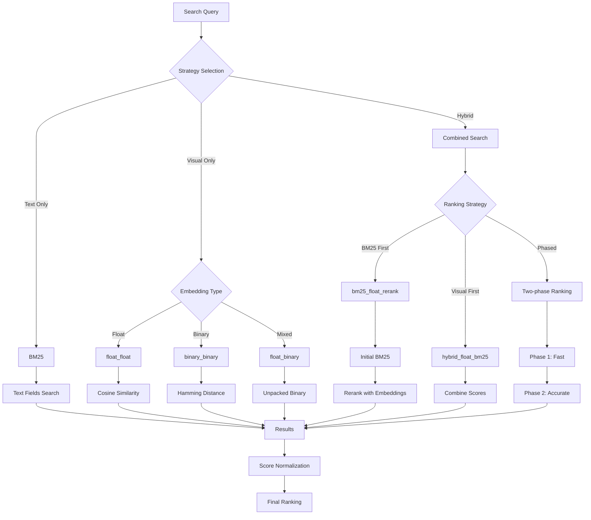

# Vespa Backend

The Vespa backend provides high-performance vector search capabilities for video content analysis, supporting multiple embedding models and search strategies with configurable ranking profiles.

## Quick Start

### Deploy Schema

```python
from src.backends.vespa.vespa_schema_manager import VespaSchemaManager

# Deploy video schema with ranking profiles
manager = VespaSchemaManager()
result = manager.upload_schema_from_json_file('configs/schemas/video_colpali_smol500_mv_frame_schema.json', 'videosearch')
```

### Command Line Deployment

```bash
python -c "
from src.backends.vespa.vespa_schema_manager import VespaSchemaManager
VespaSchemaManager().upload_schema_from_json_file('configs/schemas/video_colpali_smol500_mv_frame_schema.json', 'videosearch')
"
```

## Schema Design

### Document Fields

- `video_id` (string) - Video identifier
- `video_title` (string) - BM25 indexed title
- `creation_timestamp` (long) - Creation time
- `segment_id` (int) - Segment identifier
- `start_time`, `end_time` (double) - Time boundaries
- `segment_description` (string) - VLM-generated description
- `audio_transcript` (string) - Audio transcript
- `embedding` (tensor<float>) - Float embeddings (128/768/1024-dim based on model)
- `embedding_binary` (tensor<int8>) - Binary embeddings (16/96/128-dim based on model)

### Tensor Storage Format

```json
{
  "embedding": {
    "type": "tensor<bfloat16>(patch{}, v[128])",
    "blocks": {
      "0": "hex_encoded_vector",
      "1": "hex_encoded_vector"
    }
  }
}
```

**Note**: Use `.blocks | length` to count patches, not top-level keys.

## Search Strategies (15 Ranking Profiles)

Key profiles include:
1. **`bm25_only`** - Pure text search
2. **`float_float`** - Float embeddings only
3. **`binary_binary`** - Binary embeddings with Hamming distance
4. **`float_binary`** - Float query × unpacked binary
5. **`phased`** - Two-phase ranking
6. **`hybrid_float_bm25`** - Float + BM25
7. **`hybrid_binary_bm25`** - Binary + BM25
8. **`hybrid_bm25_float`** - BM25 + Float reranking
9. **`hybrid_bm25_binary`** - BM25 + Binary reranking
Plus variations with/without descriptions

### Search Strategy Flow



### Model Dimensions

- **ColPali**: 128-dim embeddings, 16-dim binary
- **ColQwen**: 128-dim embeddings, 16-dim binary
- **VideoPrism Base**: 768-dim embeddings, 96-dim binary
- **VideoPrism Large**: 1024-dim embeddings, 128-dim binary

## Feed Configuration

### Environment Variables

```bash
export VESPA_FEED_MAX_QUEUE_SIZE=500    # Documents in queue
export VESPA_FEED_MAX_WORKERS=4         # Worker threads
export VESPA_FEED_MAX_CONNECTIONS=8     # HTTP connections
export VESPA_FEED_COMPRESS=auto         # Compression setting
```

### Performance Tuning

**Small Documents (< 1KB)**:
```bash
export VESPA_FEED_MAX_QUEUE_SIZE=1000
export VESPA_FEED_MAX_WORKERS=8
export VESPA_FEED_COMPRESS=false
```

**Large Documents (> 10KB)**:
```bash
export VESPA_FEED_MAX_QUEUE_SIZE=200
export VESPA_FEED_MAX_WORKERS=2
export VESPA_FEED_COMPRESS=true
```

## Testing & Validation

### Check Status
```bash
curl -s http://localhost:8080/ApplicationStatus | head -10
```

### Test Ranking Profiles
```python
import requests

strategies = ['bm25_only', 'float_float', 'binary_binary', 'phased']
for strategy in strategies:
    params = {'yql': 'select * from sources * where true', 
              'ranking': strategy, 'hits': 0}
    response = requests.get('http://localhost:8080/search/', params=params)
    print(f'{strategy}: {response.status_code}')
```

### Document Count
```bash
curl -s "http://localhost:8080/search/?yql=select%20*%20from%20sources%20*%20where%20true&hits=0" | \
  jq '.root.fields.totalCount'
```

## Troubleshooting

### Connection Reset
- Reduce `max_workers` and `max_connections`
- Increase batch delay
- Check Vespa memory

### Out of Memory
- Reduce `max_queue_size`
- Enable compression
- Reduce batch size

### Clean Restart
```bash
docker stop vespa && docker rm vespa
docker run -d --name vespa -p 8080:8080 vespaengine/vespa
sleep 60
# Redeploy schema
```

## API Reference

### VespaSchemaManager
- `upload_schema_from_json_file(json_path, app_name)` - Deploy schema
- `parse_sd_schema(sd_content)` - Parse .sd files
- `upload_frame_schema()` - Programmatic creation

### JsonSchemaParser
- `load_schema_from_json_file(json_path)` - Load JSON schema
- `parse_schema(schema_config)` - Convert to PyVespa
- `validate_schema_config(schema_config)` - Validate structure

## Usage Examples

```bash
# Ingestion
uv run python scripts/run_ingestion.py \
    --video_dir data/videos \
    --backend vespa

# Testing
JAX_PLATFORM_NAME=cpu uv run python tests/comprehensive_video_query_test_v2.py \
    --profiles frame_based_colpali \
    --test-multiple-strategies
```

## Performance Monitoring

Client logs include:
- Feed configuration on init
- Batch progress (X/Y documents)
- Success/failure counts
- Retry attempts
- HTTP status codes

Example:
```
INFO: Feed configuration: {'max_queue_size': 500, 'max_workers': 4}
INFO: Processing batch 1/5 (100 documents)
INFO: Batch 1: 98/100 documents fed successfully
```