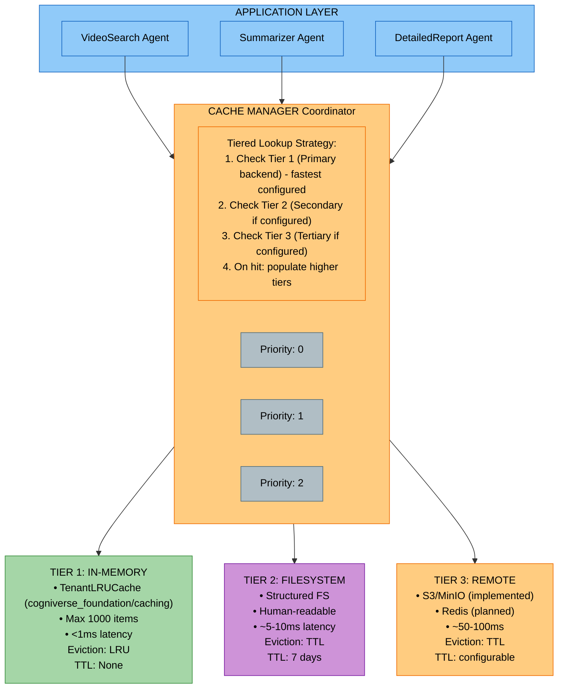
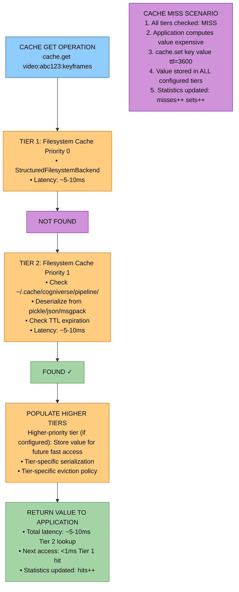
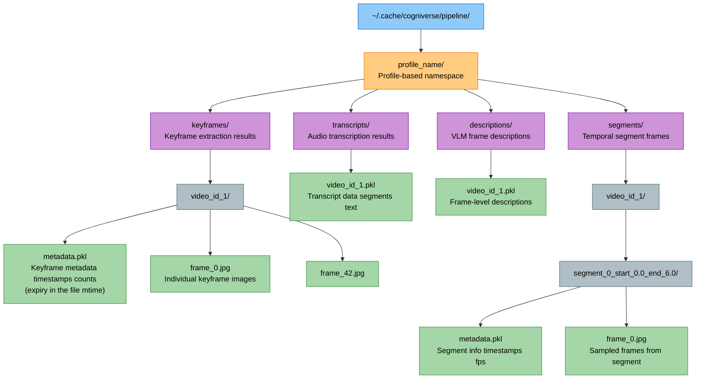
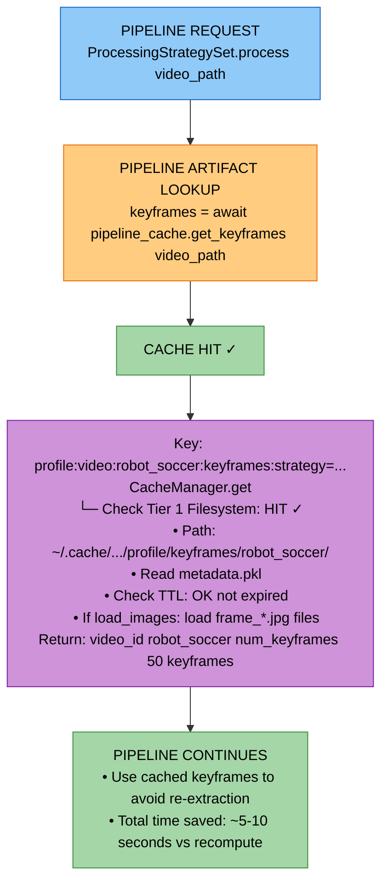
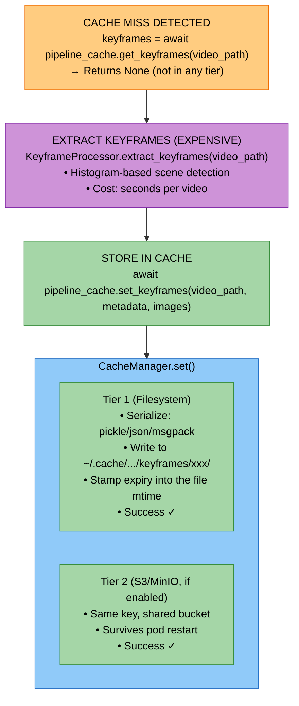

# Cache Module Study Guide

**Package:** `cogniverse_core` (Core Layer)
**Module Location:** `libs/core/cogniverse_core/common/cache/`

---

## Table of Contents
1. [Module Overview](#module-overview)
2. [Architecture Diagrams](#architecture-diagrams)
3. [Core Components](#core-components)
4. [Cache Backends](#cache-backends)
5. [Specialized Caches](#specialized-caches)
6. [Data Flow](#data-flow)
7. [Usage Examples](#usage-examples)
8. [Production Considerations](#production-considerations)
9. [Testing](#testing)

---

## Module Overview

### Purpose and Responsibilities

The Cache Module provides a **comprehensive caching infrastructure** for the Cogniverse system with:

- **Tiered Caching Architecture**: Multi-level cache hierarchy support with automatic tier population
- **Backend Abstraction**: Pluggable backend architecture via registry pattern
- **Current Implementation**: Structured filesystem (L1) and S3/MinIO (L2) backends with TTL support
- **Specialized Caches**: `PipelineArtifactCache` for video processing artifacts (keyframes, transcripts, descriptions, segment frames, segmentation results)
- **Efficient Storage**: Binary format support, smart serialization
- **Cache Invalidation**: Pattern-based clearing, TTL expiration, manual invalidation
- **Performance Tracking**: Hit/miss statistics, size monitoring, eviction tracking

### Key Features

1. **Multi-Tiered Architecture**
   - Primary tier (fast, small): In-memory LRU (when implemented)
   - Secondary tier (medium, larger): Filesystem
   - Tertiary tier (slow, unlimited): Remote storage (when implemented)
   - Automatic tier population on cache hits

2. **Pluggable Backend System**
   - Registry-based backend registration
   - Easy addition of new backends
   - Priority-based tier ordering
   - Currently implemented: `structured_filesystem` (L1 local) and `s3` (L2 shared/durable) backends

3. **Specialized Cache Types**
   - **PipelineArtifactCache**: Handles keyframes, transcripts, descriptions, segments

4. **Efficient Data Formats**
   - Binary embeddings (tobytes/frombuffer)
   - JPEG for keyframe images
   - JSON/Pickle/Msgpack for metadata
   - Compression support

5. **Production-Ready Features**
   - TTL-based expiration
   - Automatic cleanup of expired entries
   - Cache statistics
   - Graceful degradation
   - Pattern-based invalidation

## Package Structure

```text
libs/core/cogniverse_core/common/cache/
├── __init__.py                      # Package exports
├── base.py                          # Abstract base classes (CacheBackend, CacheManager)
├── registry.py                      # Backend plugin registry
├── pipeline_cache.py                # Video processing artifact cache
└── backends/
    ├── __init__.py
    ├── structured_filesystem.py     # Filesystem backend, human-readable paths (L1)
    └── s3.py                         # S3/MinIO shared backend, survives pod restart (L2)
```

### Dependencies

**Internal:**

- None (self-contained infrastructure module)

**External:**

- `numpy`: Embedding array handling

- `cv2`: Image encoding/decoding

- `aiofiles`: Async file I/O

- `msgpack`: Binary serialization (optional)

- `boto3` / `botocore`: S3/MinIO client for the `S3CacheBackend` (imported lazily on first cache use, not at config-load time)

---

## Architecture Diagrams

### 1. Multi-Tiered Cache Architecture


```mermaid
flowchart TB
    subgraph APP["<span style='color:#000'>APPLICATION LAYER</span>"]
        VSA["<span style='color:#000'>VideoSearch Agent</span>"]
        SA["<span style='color:#000'>Summarizer Agent</span>"]
        DRA["<span style='color:#000'>DetailedReport Agent</span>"]
    end

    subgraph CM["<span style='color:#000'>CACHE MANAGER Coordinator</span>"]
        STRAT["<span style='color:#000'>Tiered Lookup Strategy:<br/>1. Check Tier 1 (Primary backend) - fastest configured<br/>2. Check Tier 2 (Secondary if configured)<br/>3. Check Tier 3 (Tertiary if configured)<br/>4. On hit: populate higher tiers</span>"]
        P0["<span style='color:#000'>Priority: 0</span>"]
        P1["<span style='color:#000'>Priority: 1</span>"]
        P2["<span style='color:#000'>Priority: 2</span>"]
    end

    T1["<span style='color:#000'>TIER 1: IN-MEMORY<br/>• TenantLRUCache (cogniverse_foundation/caching)<br/>• Max 1000 items<br/>• <1ms latency<br/>Eviction: LRU<br/>TTL: None</span>"]
    T2["<span style='color:#000'>TIER 2: FILESYSTEM<br/>• Structured FS<br/>• Human-readable<br/>• ~5-10ms latency<br/>Eviction: TTL<br/>TTL: 7 days</span>"]
    T3["<span style='color:#000'>TIER 3: REMOTE<br/>• S3/MinIO (implemented)<br/>• Redis (planned)<br/>• ~50-100ms<br/>Eviction: TTL<br/>TTL: configurable</span>"]

    VSA --> CM
    SA --> CM
    DRA --> CM
    CM --> T1
    CM --> T2
    CM --> T3

    style APP fill:#90caf9,stroke:#1565c0,color:#000
    style CM fill:#ffcc80,stroke:#ef6c00,color:#000
    style T1 fill:#a5d6a7,stroke:#388e3c,color:#000
    style T2 fill:#ce93d8,stroke:#7b1fa2,color:#000
    style T3 fill:#ffcc80,stroke:#ef6c00,color:#000
    style VSA fill:#90caf9,stroke:#1565c0,color:#000
    style SA fill:#90caf9,stroke:#1565c0,color:#000
    style DRA fill:#90caf9,stroke:#1565c0,color:#000
    style STRAT fill:#ffcc80,stroke:#ef6c00,color:#000
    style P0 fill:#b0bec5,stroke:#546e7a,color:#000
    style P1 fill:#b0bec5,stroke:#546e7a,color:#000
    style P2 fill:#b0bec5,stroke:#546e7a,color:#000
```

**Key Points:**

- CacheManager supports multiple backends (architecture ready)

- Two backends currently implemented: `structured_filesystem` (L1 local) and `s3` (L2 shared/durable)

- Backends checked in priority order (lower = higher priority)

- Cache hits can populate higher-priority tiers when multiple backends configured

- Each tier can have different performance/capacity tradeoffs

---

### 2. Cache Population Flow


```mermaid
flowchart TB
    START["<span style='color:#000'>CACHE GET OPERATION<br/>cache.get video:abc123:keyframes</span>"]
    T1["<span style='color:#000'>TIER 1: Filesystem Cache Priority 0<br/>• StructuredFilesystemBackend<br/>• Latency: ~5-10ms</span>"]
    T1_MISS["<span style='color:#000'>NOT FOUND</span>"]
    T2["<span style='color:#000'>TIER 2: Filesystem Cache Priority 1<br/>• Check ~/.cache/cogniverse/pipeline/<br/>• Deserialize from pickle/json/msgpack<br/>• Check TTL expiration<br/>• Latency: ~5-10ms</span>"]
    T2_HIT["<span style='color:#000'>FOUND ✓</span>"]
    POP["<span style='color:#000'>POPULATE HIGHER TIERS<br/>Higher-priority tier (if configured): Store value for future fast access<br/>• Tier-specific serialization<br/>• Tier-specific eviction policy</span>"]
    RETURN["<span style='color:#000'>RETURN VALUE TO APPLICATION<br/>• Total latency: ~5-10ms Tier 2 lookup<br/>• Next access: <1ms Tier 1 hit<br/>• Statistics updated: hits++</span>"]
    MISS["<span style='color:#000'>CACHE MISS SCENARIO<br/>1. All tiers checked: MISS<br/>2. Application computes value expensive<br/>3. cache.set key value ttl=3600<br/>4. Value stored in ALL configured tiers<br/>5. Statistics updated: misses++ sets++</span>"]

    START --> T1
    T1 --> T1_MISS
    T1_MISS --> T2
    T2 --> T2_HIT
    T2_HIT --> POP
    POP --> RETURN

    style START fill:#90caf9,stroke:#1565c0,color:#000
    style T1 fill:#ffcc80,stroke:#ef6c00,color:#000
    style T1_MISS fill:#ce93d8,stroke:#7b1fa2,color:#000
    style T2 fill:#ffcc80,stroke:#ef6c00,color:#000
    style T2_HIT fill:#a5d6a7,stroke:#388e3c,color:#000
    style POP fill:#ffcc80,stroke:#ef6c00,color:#000
    style RETURN fill:#a5d6a7,stroke:#388e3c,color:#000
    style MISS fill:#ce93d8,stroke:#7b1fa2,color:#000
```

**Population Benefits:**

- First access: pays full cost of slowest tier

- Subsequent accesses: served from fastest tier

- Automatic optimization without manual management

---

### 3. Structured Filesystem Layout


```mermaid
flowchart TB
    ROOT["<span style='color:#000'>~/.cache/cogniverse/pipeline/</span>"]
    PROF["<span style='color:#000'>profile_name/<br/>Profile-based namespace</span>"]
    KF["<span style='color:#000'>keyframes/<br/>Keyframe extraction results</span>"]
    VID1["<span style='color:#000'>video_id_1/</span>"]
    META1["<span style='color:#000'>metadata.pkl<br/>Keyframe metadata timestamps counts<br/>(expiry in the file mtime)</span>"]
    F0["<span style='color:#000'>frame_0.jpg<br/>Individual keyframe images</span>"]
    F42["<span style='color:#000'>frame_42.jpg</span>"]

    TR["<span style='color:#000'>transcripts/<br/>Audio transcription results</span>"]
    TRV1["<span style='color:#000'>video_id_1.pkl<br/>Transcript data segments text</span>"]

    DESC["<span style='color:#000'>descriptions/<br/>VLM frame descriptions</span>"]
    DESCV1["<span style='color:#000'>video_id_1.pkl<br/>Frame-level descriptions</span>"]

    SEG["<span style='color:#000'>segments/<br/>Temporal segment frames</span>"]
    SEGV1["<span style='color:#000'>video_id_1/</span>"]
    SEG0["<span style='color:#000'>segment_0_start_0.0_end_6.0/</span>"]
    SEGMETA["<span style='color:#000'>metadata.pkl<br/>Segment info timestamps fps</span>"]
    SEGF0["<span style='color:#000'>frame_0.jpg<br/>Sampled frames from segment</span>"]

    ROOT --> PROF
    PROF --> KF
    PROF --> TR
    PROF --> DESC
    PROF --> SEG

    KF --> VID1
    VID1 --> META1
    VID1 --> F0
    VID1 --> F42

    TR --> TRV1

    DESC --> DESCV1

    SEG --> SEGV1
    SEGV1 --> SEG0
    SEG0 --> SEGMETA
    SEG0 --> SEGF0

    style ROOT fill:#90caf9,stroke:#1565c0,color:#000
    style PROF fill:#ffcc80,stroke:#ef6c00,color:#000
    style KF fill:#ce93d8,stroke:#7b1fa2,color:#000
    style TR fill:#ce93d8,stroke:#7b1fa2,color:#000
    style DESC fill:#ce93d8,stroke:#7b1fa2,color:#000
    style SEG fill:#ce93d8,stroke:#7b1fa2,color:#000
    style VID1 fill:#b0bec5,stroke:#546e7a,color:#000
    style META1 fill:#a5d6a7,stroke:#388e3c,color:#000
    style F0 fill:#a5d6a7,stroke:#388e3c,color:#000
    style F42 fill:#a5d6a7,stroke:#388e3c,color:#000
    style TRV1 fill:#a5d6a7,stroke:#388e3c,color:#000
    style DESCV1 fill:#a5d6a7,stroke:#388e3c,color:#000
    style SEGV1 fill:#b0bec5,stroke:#546e7a,color:#000
    style SEG0 fill:#b0bec5,stroke:#546e7a,color:#000
    style SEGMETA fill:#a5d6a7,stroke:#388e3c,color:#000
    style SEGF0 fill:#a5d6a7,stroke:#388e3c,color:#000
```

**Cache Key Examples** (video ID is a 16-char SHA-256 hex digest of the canonical URI):

- `"profile:video:a3f2e9d8c7b6a5f4:keyframes"` → `profile/keyframes/a3f2e9d8c7b6a5f4/metadata.pkl`

- `"profile:video:a3f2e9d8c7b6a5f4:keyframes:frame_42"` → `profile/keyframes/a3f2e9d8c7b6a5f4/frame_42.jpg`

- `"profile:video:a3f2e9d8c7b6a5f4:transcript:lang=auto:model=base"` → `profile/transcripts/a3f2e9d8c7b6a5f4.pkl`

- `"profile:video:a3f2e9d8c7b6a5f4:segment_frames:...:frame_1"` → `profile/segments/a3f2e9d8c7b6a5f4/.../frame_1.jpg`

**Design Benefits:**

- Human-readable paths for debugging

- Easy manual inspection and cleanup

- Profile-based isolation

- Efficient disk usage (deduplicated by video_id)

---

## Core Components

### 1. CacheBackend (base.py:13-63)

**Purpose:** Abstract base class defining the cache backend interface.

**Key Methods:**

#### `async get(key: str) -> Optional[Any]`
Retrieve value from cache.

**Parameters:**

- `key`: Cache key (unique identifier)

**Returns:** Cached value or None if not found

**Example:**
```python
value = await backend.get("video:abc123:keyframes")
if value:
    print(f"Cache hit: {value}")
else:
    print("Cache miss")
```

---

#### `async set(key: str, value: Any, ttl: Optional[int] = None) -> bool`
Store value in cache with optional TTL.

**Parameters:**

- `key`: Cache key

- `value`: Value to cache (any serializable type)

- `ttl`: Time-to-live in seconds (None = no expiration)

**Returns:** True if stored successfully

**Example:**
```python
success = await backend.set(
    "video:abc123:keyframes",
    keyframes_data,
    ttl=86400  # 24 hours
)
```

---

#### `async delete(key: str) -> bool`
Delete key from cache.

**Parameters:**

- `key`: Cache key to delete

**Returns:** True if key was deleted

**Example:**
```python
await backend.delete("video:abc123:keyframes")
```

---

#### `async exists(key: str) -> bool`
Check if key exists in cache (without retrieving value).

**Parameters:**

- `key`: Cache key to check

**Returns:** True if key exists and is not expired

**Example:**
```python
if await backend.exists("video:abc123:keyframes"):
    print("Keyframes are cached")
```

---

#### `async clear(pattern: Optional[str] = None) -> int`
Clear cache entries matching pattern.

**Parameters:**

- `pattern`: Optional glob pattern (e.g., "video:abc123:*")

- `None`: Clear entire cache

**Returns:** Number of entries cleared

**Example:**
```python
# Clear all keyframes for a video
cleared = await backend.clear("video:abc123:*")

# Clear entire cache
cleared = await backend.clear()
```

---

#### `async get_stats() -> Dict[str, Any]`
Get cache statistics.

**Returns:**
```python
{
    "hits": 1234,
    "misses": 567,
    "sets": 890,
    "deletes": 45,
    "size_bytes": 1024000,
    "total_files": 150
}
```

**Example:**
```python
stats = await backend.get_stats()
hit_rate = stats['hits'] / (stats['hits'] + stats['misses'])
print(f"Hit rate: {hit_rate:.2%}")
```

---

#### `async get_metadata(key: str) -> Optional[Dict[str, Any]]`
Get metadata for a cache entry (optional method).

**Parameters:**

- `key`: Cache key

**Returns:** Metadata dict or None

**Example:**
```python
metadata = await backend.get_metadata("video:abc123:keyframes")
if metadata:
    print(f"Created at: {metadata['created_at']}")
    print(f"Expires at: {metadata['expires_at']}")
    print(f"Size: {metadata['size_bytes']} bytes")
```

---

#### `async list_keys(pattern: Optional[str] = None, include_metadata: bool = False) -> List[Tuple[str, Optional[Dict[str, Any]]]]`
List keys matching pattern (optional method).

**Parameters:**

- `pattern`: Optional glob pattern

- `include_metadata`: Include metadata in results

**Returns:** List of (key, metadata) tuples

**Example:**
```python
# List all keyframe caches
keys = await backend.list_keys("*:keyframes", include_metadata=True)
for key, metadata in keys:
    print(f"{key}: {metadata['size_bytes']} bytes")
```

---

#### `async cleanup_expired() -> int`
Clean up expired entries (optional method).

**Returns:** Number of entries cleaned up

**Example:**
```python
cleaned = await backend.cleanup_expired()
print(f"Cleaned up {cleaned} expired entries")
```

---

### 2. CacheManager (base.py:90-254)

**Purpose:** Manages multiple cache backends with tiered caching logic.

**Key Attributes:**
```python
config: CacheConfig                  # Cache configuration
backends: List[CacheBackend]         # Sorted by priority (lower = higher)
_stats: Dict[str, int]              # Manager-level statistics
```

**Main Methods:**

#### `__init__(config: CacheConfig)`
Initialize cache manager with configuration.

**Parameters:**

- `config`: CacheConfig with backend configurations

**Process:**

1. Initialize backends from config

2. Sort by priority (lower number = higher priority)

3. Set up statistics tracking

Note: although `CacheConfig.backends` is typed `List[BackendConfig]`,
`CacheManager._initialize_backends()` calls `.get(...)` on each entry, so at
runtime `backends` must be a list of plain **dicts** (as in every example in
this doc and in `configs/config.json`), not `BackendConfig` instances.

**Example:**
```python
from cogniverse_core.common.cache.base import CacheConfig

config = CacheConfig(
    backends=[
        {"backend_type": "structured_filesystem", "priority": 0, "enabled": True}
    ],
    default_ttl=3600,
    enable_stats=True
)

cache_manager = CacheManager(config)
```

---

#### `async get(key: str) -> Optional[Any]`
Get from cache, checking tiers in priority order.

**Parameters:**

- `key`: Cache key

**Returns:** Value if found in any tier, None otherwise

**Process:**

1. Iterate through backends in priority order

2. Return on first hit

3. Populate higher-priority tiers with found value

4. Update statistics

**Example:**
```python
# Check all configured backends
value = await cache_manager.get("video:abc123:keyframes")

# If found:
# - Value returned immediately
# - Higher-priority backends populated if multiple tiers configured
```

---

#### `async set(key: str, value: Any, ttl: Optional[int] = None) -> bool`
Set in all configured cache tiers.

**Parameters:**

- `key`: Cache key

- `value`: Value to cache

- `ttl`: Time-to-live in seconds (uses default_ttl if None)

**Returns:** True if at least one backend succeeded

**Process:**

1. Set in all backends concurrently

2. Use default TTL if not specified

3. Return success if any backend succeeded

**Example:**
```python
# Store in all configured backends
success = await cache_manager.set(
    "video:abc123:keyframes",
    keyframes_data,
    ttl=86400
)

# Stored in all configured backends
# Currently: structured_filesystem backend (persistent storage)
```

---

#### `async delete(key: str) -> bool`
Delete from all cache tiers.

**Parameters:**

- `key`: Cache key

**Returns:** True if deleted from at least one tier

**Example:**
```python
# Delete from all tiers
await cache_manager.delete("video:abc123:keyframes")
```

---

#### `async clear(pattern: Optional[str] = None) -> int`
Clear matching entries from all tiers.

**Parameters:**

- `pattern`: Optional glob pattern

**Returns:** Total number of entries cleared

**Example:**
```python
# Clear all keyframes for a video
cleared = await cache_manager.clear("video:abc123:*")

# Clear entire cache
cleared = await cache_manager.clear()
```

---

#### `async get_stats() -> Dict[str, Any]`
Get aggregated statistics from all tiers. Returns `{"enabled": False}` when
`CacheConfig.enable_stats` is `False` (counters are not tracked in that mode).

**Returns** (when `enable_stats` is `True`, the default):
```python
{
    "manager": {
        "hits": 1500,
        "misses": 500,
        "sets": 1000,
        "deletes": 50,
        "hit_rate": 0.75,
        "size_bytes": 2048000,
        "total_files": 200
    },
    "backends": {
        "StructuredFilesystemBackend": {
            "hits": 1500,
            "misses": 500,
            "sets": 1000,
            "deletes": 50,
            "evictions": 12,
            "size_bytes": 2048000,
            "total_files": 200,
            "metadata_files": 200
        }
    }
}
```

**Example:**
```python
stats = await cache_manager.get_stats()
print(f"Overall hit rate: {stats['manager']['hit_rate']:.2%}")

for backend_name, backend_stats in stats['backends'].items():
    print(f"{backend_name}: {backend_stats['hits']} hits")
```

---

#### `async _populate_higher_tiers(key: str, value: Any, backend_index: int)`
Populate higher-priority tiers with found value (internal method).

**Parameters:**

- `key`: Cache key

- `value`: Value to populate

- `backend_index`: Index of tier where value was found

**Process:**

1. Iterate through tiers with index < backend_index

2. Set value in each higher-priority tier

3. Use default TTL for populated entries

**Example (internal behavior):**
```python
# Value found in lower-priority backend, backend_index=1
# Populate higher-priority backend at index=0
await self.backends[0].set(key, value, self.config.default_ttl)
```

---

#### `async list_keys(pattern: Optional[str] = None, include_metadata: bool = False) -> List[Tuple[str, Optional[Dict[str, Any]]]]`
List keys from the primary (first, highest-priority) backend only — does not merge keys across tiers.

**Parameters:**

- `pattern`: Optional glob pattern

- `include_metadata`: Include metadata in results

**Returns:** List of (key, metadata) tuples from `self.backends[0]`, or `[]` if no backends configured

**Example:**
```python
keys = await cache_manager.list_keys(pattern="video_colpali_mv:*", include_metadata=True)
```

---

#### `async cleanup_expired() -> int`
Run `cleanup_expired()` on every configured backend and sum the results.

**Returns:** Total number of expired entries removed across all tiers

**Example:**
```python
cleaned = await cache_manager.cleanup_expired()
print(f"Removed {cleaned} expired entries across all tiers")
```

---

### 3. CacheBackendRegistry (registry.py:11-48)

**Purpose:** Plugin registry for cache backend types.

**Key Methods:**

#### `@classmethod register(name: str, backend_class: Type[CacheBackend])`
Register a new cache backend type.

**Parameters:**

- `name`: Backend type name (e.g., "filesystem", "redis")

- `backend_class`: Backend class implementing CacheBackend

**Example:**
```python
from cogniverse_core.common.cache.base import CacheBackend
from cogniverse_core.common.cache.registry import CacheBackendRegistry

class MyCustomBackend(CacheBackend):
    # ... implement abstract methods ...
    pass

# Register backend
CacheBackendRegistry.register("custom", MyCustomBackend)
```

---

#### `@classmethod create(config: dict) -> CacheBackend`
Create backend instance from configuration.

**Parameters:**

- `config`: Backend configuration dict with "backend_type" key

**Returns:** Initialized backend instance

**Process:**

1. Extract backend_type from config

2. Look up backend class in registry

3. Read the backend class's `CONFIG_CLASS` attribute (each backend advertises
   its own config dataclass); raise `ValueError` if it declares none

4. Filter the config dict to that dataclass's fields — shared/extra keys like
   `default_ttl` or a sibling backend's keys are dropped instead of raising
   `TypeError` — then instantiate the dataclass and the backend

**Example:**
```python
config = {
    "backend_type": "structured_filesystem",
    "base_path": "~/.cache/cogniverse",
    "serialization_format": "pickle",
    "priority": 1
}

backend = CacheBackendRegistry.create(config)
```

---

#### `@classmethod list_backends() -> list[str]`
List all registered backend types.

**Returns:** List of backend type names

**Example:**
```python
backends = CacheBackendRegistry.list_backends()
# ["structured_filesystem", "s3"]  # the two currently-registered backend types
```

---

## Cache Backends

### StructuredFilesystemBackend (backends/structured_filesystem.py:36-555)

**Purpose:** Filesystem cache with human-readable directory structure.

**Configuration:**
```python
@dataclass
class StructuredFilesystemConfig:
    backend_type: str = "structured_filesystem"
    base_path: str = "~/.cache/cogniverse/pipeline"
    serialization_format: str = "pickle"  # or "json", "msgpack"
    enabled: bool = True
    priority: int = 0
    enable_ttl: bool = True
    cleanup_on_startup: bool = True
    metadata_format: str = "json"
```

**Key Features:**

- Human-readable paths (no hash-based obfuscation)

- Profile-based namespacing

- Artifact type separation (keyframes, transcripts, descriptions, segments)

- TTL enforcement via metadata files

- Automatic cleanup of expired entries

**Path Mapping Examples** (the video ID segment is a 16-char SHA-256 hex digest when generated via `PipelineArtifactCache`):

```python
# Keyframe metadata
"profile:video:a3f2e9d8c7b6a5f4:keyframes"
→ ~/.cache/cogniverse/pipeline/profile/keyframes/a3f2e9d8c7b6a5f4/metadata.pkl

# Individual keyframe
"profile:video:a3f2e9d8c7b6a5f4:keyframes:frame_42"
→ ~/.cache/cogniverse/pipeline/profile/keyframes/a3f2e9d8c7b6a5f4/frame_42.jpg

# Transcript (kwargs sorted alphabetically)
"profile:video:a3f2e9d8c7b6a5f4:transcript:lang=auto:model=base"
→ ~/.cache/cogniverse/pipeline/profile/transcripts/a3f2e9d8c7b6a5f4.pkl

# Segment frame
"profile:video:a3f2e9d8c7b6a5f4:segment_frames:...:frame_1"
→ ~/.cache/cogniverse/pipeline/profile/segments/a3f2e9d8c7b6a5f4/.../frame_1.jpg
```

**Expiry (encoded in the file mtime):**

Expiry is stored in each cache file's modification time rather than a per-entry
`.meta` sidecar — `set()` `os.utime()`s the file to `expires_at` (or a
far-future never-expires sentinel when no ttl is given), so a cached entry costs
one filesystem write, not two. `get`/`exists`/cleanup read the mtime.

```python
# Cache file: abc123.pkl  (mtime == expires_at == created_at + ttl)
# No sidecar file is written.
```

Entries written before this change still carry a legacy `abc123.pkl.meta`
sidecar (`{"key", "created_at", "expires_at", "ttl", "size_bytes", "format"}`);
it is still read (and wins over the mtime) so an upgrade does not invalidate a
warm cache. A re-write of such a key clears the stale sidecar so the fresh
ttl governs.

Writes are atomic: `set()` writes a temp file, stamps its mtime, then
`os.replace`s it into place — a concurrent read or cleanup sweep never sees a
half-written entry or a write-time mtime it would misread as expired.

**Caution — copying the cache tree:** because expiry lives in the mtime, any
copy/restore that resets modification times (`cp` without `-p`, `rsync`
without `-t`/`-a`, most object-store round-trips) rewrites every entry's
expiry to the copy time, and the next read treats the whole cache as expired
and recomputes it. Preserve timestamps (`cp -a` / `rsync -a`) when relocating
a cache directory.

**Serialization Formats:**

```python
# Pickle (default): fastest, not human-readable
data = pickle.dumps(value)

# JSON: human-readable, slower, limited types
data = json.dumps(value).encode('utf-8')

# Msgpack: compact binary, faster than JSON
data = msgpack.packb(value)
```

**Key Methods:**

#### `_key_to_path(key: str) -> Path`
Convert cache key to filesystem path.

**Process:**

1. Split key by ":"

2. Extract profile, video_id, artifact_type

3. Build path based on artifact type

4. Sanitize path components (remove special chars)

**Example:**
```python
backend = StructuredFilesystemBackend(config)

# Keyframe metadata
path = backend._key_to_path("profile:video:abc123:keyframes")
# → Path("~/.cache/cogniverse/pipeline/profile/keyframes/abc123/metadata.pkl")

# Individual frame
path = backend._key_to_path("profile:video:abc123:keyframes:frame_42")
# → Path("~/.cache/cogniverse/pipeline/profile/keyframes/abc123/frame_42.jpg")
```

---

#### `async get(key: str) -> Optional[Any]`
Retrieve value with TTL checking.

**Process:**

1. Convert key to path

2. Check if file exists

3. Check metadata for expiration (if TTL enabled)

4. Read file (binary for images, deserialize for data)

5. Update statistics

**Example:**
```python
# Get keyframe metadata
metadata = await backend.get("profile:video:abc123:keyframes")
if metadata:
    print(f"Found {len(metadata['keyframes'])} keyframes")
```

---

#### `async set(key: str, value: Any, ttl: Optional[int] = None) -> bool`
Store value with metadata.

**Process:**

1. Convert key to path

2. Create parent directories

3. Serialize and write data

4. Write metadata file with TTL, size, timestamps

5. Update statistics

**Example:**
```python
# Store keyframe metadata
success = await backend.set(
    "profile:video:abc123:keyframes",
    keyframes_metadata,
    ttl=604800  # 7 days
)
```

---

#### `async _cleanup_expired()`
Clean up expired entries on startup.

**Process:**

1. Walk the cache's data files

2. Read each entry's expiry (its file mtime, or a legacy `.meta` sidecar)

3. Delete expired cache files (plus any legacy sidecar)

4. Update eviction statistics

**Example (automatic on startup):**
```python
# Configured with cleanup_on_startup=True
backend = StructuredFilesystemBackend(config)
# Cleanup runs automatically in background
```

---

### S3CacheBackend (backends/s3.py)

**Purpose:** Shared, durable cache tier backed by an S3-compatible object store
(MinIO or AWS S3). Where `structured_filesystem` is per-pod-ephemeral — cache
hits only happen when the same worker pod re-processes the same video, and a
pod restart wipes it — the S3 backend stores artifacts in a shared bucket, so a
re-ingest of the same video hits cache regardless of which pod handled it.

**Configuration:**
```python
@dataclass
class S3CacheBackendConfig:
    backend_type: str = "s3"
    endpoint: Optional[str] = None      # falls back to MINIO_ENDPOINT
    access_key: Optional[str] = None    # falls back to MINIO_ACCESS_KEY
    secret_key: Optional[str] = None    # falls back to MINIO_SECRET_KEY
    bucket: str = "cogniverse-pipeline-cache"
    key_prefix: str = "pipeline/"
    region: str = "us-east-1"
    serialization_format: str = "pickle"  # or "json", "msgpack"
    enabled: bool = True
    priority: int = 1
    enable_ttl: bool = True
    lifecycle_expiration_days: Optional[int] = None  # bucket ILM backstop
```

When `lifecycle_expiration_days` is set, the backend applies an S3/MinIO bucket
lifecycle (ILM) rule on bucket creation that expires objects under `key_prefix`
after that many days — a server-side growth bound independent of the per-object
TTL (which only expires on read or explicit cleanup).

The config dataclass is pure data: credential fields default to `None` and are
resolved from the `MINIO_*` environment when the boto3 client is built (lazily,
on first cache use), with config values taking precedence. This reuses the same
MinIO deployment as media uploads but a **different bucket / prefix**.

**Key Features:**

- Object key is `{key_prefix}{cache_key}` (the cache key already namespaces by
  profile, so no extra tenant segment is added).

- One JSON envelope in S3 user metadata carries `format` (`raw` for image bytes,
  else the serialization format) and `expires_at`; `get`/`exists` honor TTL
  lazily and delete on expiry.

- boto3 is synchronous; every call is wrapped in `asyncio.to_thread` so the
  backend stays compatible with the async `CacheBackend` contract.

- Raw `bytes` values (keyframe / segment-frame JPEGs) round-trip byte-for-byte;
  dict artifacts are pickle/json/msgpack serialized.

**Layered (L1 + L2) configuration** — `CacheManager` iterates backends by
priority, so the local filesystem stays the hot L1 tier and S3 is the shared L2
that survives pod restarts:

```jsonc
"pipeline_cache": {
  "enabled": true,
  "backends": [
    { "backend_type": "structured_filesystem", "priority": 0, ... },  // L1
    { "backend_type": "s3", "bucket": "cogniverse-pipeline-cache",
      "key_prefix": "pipeline/", "priority": 1, "enabled": false }     // L2
  ]
}
```

The L2 entry ships `enabled: false` in `configs/config.json` — production opts
in by flipping it to `true` (and wiring `MINIO_*` env), with no behavioural
change until then.

---

## Specialized Caches

### 1. PipelineArtifactCache (pipeline_cache.py:19-432)

**Purpose:** Comprehensive caching for video processing pipeline artifacts.

**Supported Artifacts:**

- Keyframes (metadata + images)

- Audio transcripts

- Frame descriptions (VLM outputs)

- Temporal segment frames

- Single-vector segmentation results (boundary math + transcript alignment)

**Live-path integration:** The ingestion pipeline exposes per-artifact wrappers
(`get_cached_keyframes`/`set_cached_keyframes`, `..._transcript`,
`..._descriptions`) that derive their cache-key params from a single source so
the get and set keys always match. `ProcessingStrategySet` calls these inside
each strategy step — on a hit it skips extraction/transcription/VLM. Because
downstream VLM and embedding read frame images from the `path` recorded in the
keyframe metadata, a keyframe cache hit **rehydrates** the cached frame images
to the current pod's disk and repoints `path`, so a different pod (empty local
tier, shared L2) serves the artifact correctly without re-extraction.

**Initialization:**
```python
from cogniverse_core.common.cache.pipeline_cache import PipelineArtifactCache

pipeline_cache = PipelineArtifactCache(
    cache_manager=cache_manager,
    ttl=604800,  # 7 days
    profile="video_colpali_mv"  # Optional profile namespace
)
```

**Key Methods:**

#### `_generate_video_key(video_path: str, video_hash: Optional[str] = None) -> str`
Generate base cache key for a video.

**Process:**

1. Canonicalize the URI: bare paths become `file://<absolute>`, URI strings passed through unchanged

2. SHA-256 hash the canonical URI (first 16 hex chars) to avoid collisions between same-basename videos on different mounts

3. Format: `{profile}:video:{digest}` or `video:{digest}`

**Example:**
```python
key = pipeline_cache._generate_video_key("/path/to/robot_soccer.mp4")
# → "video_colpali_mv:video:a3f2e9d8c7b6a5f4"  (16-char SHA-256 digest)
```

---

#### `_generate_artifact_key(video_key: str, artifact_type: str, **kwargs) -> str`
Generate cache key for specific artifact.

**Process:**

1. Start with video key

2. Add artifact type

3. Add parameters (sorted for determinism)

4. Format: `{video_key}:{artifact_type}:{params}`

**Example:**
```python
artifact_key = pipeline_cache._generate_artifact_key(
    "video:a3f2e9d8c7b6a5f4",  # video_key from _generate_video_key
    "keyframes",
    strategy="similarity",
    threshold=0.999,
    max_frames=3000
)
# → "video:a3f2e9d8c7b6a5f4:keyframes:max_frames=3000:strategy=similarity:threshold=0.999"
```

---

#### `async get_keyframes(video_path: str, strategy: str = "similarity", threshold: Optional[float] = None, fps: Optional[float] = None, max_frames: int = 3000, load_images: bool = False) -> Optional[Dict[str, Any]]`
Get cached keyframes metadata and optionally images.

**Parameters:**

- `video_path`: Path to video file

- `strategy`: Extraction strategy ("similarity" or "fps")

- `threshold`: Similarity threshold (for similarity strategy)

- `fps`: Frames per second (for fps strategy)

- `max_frames`: Maximum frames to extract

- `load_images`: Whether to load actual keyframe images

**Returns:**

- `Dict[str, Any]` with keyframe metadata

- `Tuple[Dict, Dict[str, np.ndarray]]` if load_images=True

**Example:**
```python
# Get metadata only
metadata = await pipeline_cache.get_keyframes(
    "/path/to/robot_soccer.mp4",
    strategy="similarity",
    threshold=0.999,
    max_frames=3000
)

if metadata:
    print(f"Found {len(metadata['keyframes'])} cached keyframes")

# Get metadata + images
metadata, images = await pipeline_cache.get_keyframes(
    "/path/to/robot_soccer.mp4",
    strategy="similarity",
    threshold=0.999,
    load_images=True
)

for frame_info in metadata['keyframes']:
    frame_id = frame_info['frame_id']
    image = images.get(str(frame_id))
    if image is not None:
        print(f"Frame {frame_id}: {image.shape}")
```

---

#### `async set_keyframes(video_path: str, keyframes_metadata: Dict[str, Any], keyframe_images: Optional[Dict[str, np.ndarray]] = None, strategy: str = "similarity", threshold: Optional[float] = None, fps: Optional[float] = None, max_frames: int = 3000) -> bool`
Cache keyframes with metadata and images.

**Parameters:**

- `video_path`: Path to video file

- `keyframes_metadata`: Metadata dict with keyframe info

- `keyframe_images`: Optional dict mapping frame_id → image (numpy array)

- Other parameters: Same as get_keyframes

**Returns:** True if stored successfully

**Process:**

1. Generate artifact key with parameters

2. Store each keyframe image separately (JPEG encoded)

3. Store metadata with references to images

**Example:**
```python
# Prepare metadata
metadata = {
    "video_id": "robot_soccer",
    "num_keyframes": 50,
    "keyframes": [
        {"frame_id": 0, "timestamp": 0.0, "filename": "frame_0.jpg"},
        {"frame_id": 42, "timestamp": 1.4, "filename": "frame_42.jpg"},
        # ... more frames ...
    ]
}

# Prepare images
images = {
    "0": frame_0_image,  # numpy array (H, W, 3)
    "42": frame_42_image,
    # ... more images ...
}

success = await pipeline_cache.set_keyframes(
    "/path/to/robot_soccer.mp4",
    keyframes_metadata=metadata,
    keyframe_images=images,
    strategy="similarity",
    threshold=0.999
)
```

---

#### `async get_transcript(video_path: str, model_size: str = "base", language: Optional[str] = None) -> Optional[Dict[str, Any]]`
Get cached audio transcript.

**Parameters:**

- `video_path`: Path to video file

- `model_size`: Whisper model size ("base", "small", "medium", "large")

- `language`: Language code or "auto"

**Returns:** Transcript data or None

**Example:**
```python
transcript = await pipeline_cache.get_transcript(
    "/path/to/robot_soccer.mp4",
    model_size="base",
    language="en"
)

if transcript:
    print(f"Transcript text: {transcript['text']}")
    for segment in transcript['segments']:
        print(f"{segment['start']:.1f}s: {segment['text']}")
```

---

#### `async set_transcript(video_path: str, transcript_data: Dict[str, Any], model_size: str = "base", language: Optional[str] = None) -> bool`
Cache audio transcript.

**Parameters:**

- `video_path`: Path to video file

- `transcript_data`: Transcript dict with text and segments

- `model_size`: Whisper model size

- `language`: Language code

**Returns:** True if stored successfully

**Example:**
```python
transcript_data = {
    "text": "Full transcript text...",
    "segments": [
        {"start": 0.0, "end": 5.0, "text": "Hello world"},
        {"start": 5.0, "end": 10.0, "text": "This is a test"}
    ],
    "language": "en"
}

success = await pipeline_cache.set_transcript(
    "/path/to/robot_soccer.mp4",
    transcript_data,
    model_size="base",
    language="en"
)
```

---

#### `async get_descriptions(video_path: str, model_name: str, batch_size: int = 500) -> Optional[Dict[str, Any]]`
Get cached frame descriptions (VLM outputs).

**Parameters:**

- `video_path`: Path to video file

- `model_name`: VLM model name (e.g., "Qwen/Qwen2-VL-2B-Instruct")

- `batch_size`: Batch size used for generation

**Returns:** Descriptions data or None

**Example:**
```python
descriptions = await pipeline_cache.get_descriptions(
    "/path/to/robot_soccer.mp4",
    model_name="Qwen/Qwen2-VL-2B-Instruct",
    batch_size=500
)

if descriptions:
    for frame_id, desc in descriptions['frame_descriptions'].items():
        print(f"Frame {frame_id}: {desc}")
```

---

#### `async set_descriptions(video_path: str, descriptions_data: Dict[str, Any], model_name: str, batch_size: int = 500) -> bool`
Cache frame descriptions.

**Parameters:**

- `video_path`: Path to video file

- `descriptions_data`: Descriptions dict

- `model_name`: VLM model name

- `batch_size`: Batch size used

**Returns:** True if stored successfully

**Example:**
```python
descriptions_data = {
    "frame_descriptions": {
        "0": "A robot on a soccer field",
        "42": "The robot kicks the ball",
        "100": "Goal celebration"
    },
    "model": "Qwen/Qwen2-VL-2B-Instruct",
    "batch_size": 500
}

success = await pipeline_cache.set_descriptions(
    "/path/to/robot_soccer.mp4",
    descriptions_data,
    model_name="Qwen/Qwen2-VL-2B-Instruct",
    batch_size=500
)
```

---

#### `async get_segment_frames(video_path: str, segment_id: int, start_time: float, end_time: float, sampling_fps: float = 2.0, max_frames: int = 12, load_images: bool = True) -> Optional[Union[Dict[str, Any], Tuple[Dict, List[np.ndarray]]]]`
Get cached segment frames.

**Parameters:**

- `video_path`: Path to video file

- `segment_id`: Segment identifier

- `start_time`: Segment start time (seconds)

- `end_time`: Segment end time (seconds)

- `sampling_fps`: Frames per second for sampling

- `max_frames`: Maximum frames per segment

- `load_images`: Whether to load actual images

**Returns:**

- Metadata dict if load_images=False

- Tuple (metadata, frames) if load_images=True

**Example:**
```python
# Get segment frames
metadata, frames = await pipeline_cache.get_segment_frames(
    "/path/to/robot_soccer.mp4",
    segment_id=0,
    start_time=0.0,
    end_time=6.0,
    sampling_fps=2.0,
    max_frames=12,
    load_images=True
)

if frames:
    print(f"Loaded {len(frames)} frames from segment 0")
    for i, frame in enumerate(frames):
        print(f"Frame {i}: {frame.shape}")
```

---

#### `async set_segment_frames(video_path: str, segment_id: int, start_time: float, end_time: float, frames: List[np.ndarray], timestamps: List[float], sampling_fps: float = 2.0, max_frames: int = 12) -> bool`
Cache segment frames.

**Parameters:**

- `video_path`: Path to video file

- `segment_id`: Segment identifier

- `start_time`: Segment start time

- `end_time`: Segment end time

- `frames`: List of frame images (numpy arrays)

- `timestamps`: List of frame timestamps

- `sampling_fps`: Sampling rate used

- `max_frames`: Max frames per segment

**Returns:** True if stored successfully

**Example:**
```python
# Prepare frames and timestamps
frames = [frame1, frame2, frame3]  # numpy arrays
timestamps = [0.0, 0.5, 1.0]

success = await pipeline_cache.set_segment_frames(
    "/path/to/robot_soccer.mp4",
    segment_id=0,
    start_time=0.0,
    end_time=6.0,
    frames=frames,
    timestamps=timestamps,
    sampling_fps=2.0,
    max_frames=12
)
```

---

#### `async invalidate_video(video_path: str) -> int`
Invalidate all cached artifacts for a video.

**Parameters:**

- `video_path`: Path to video file

**Returns:** Number of entries cleared

**Example:**
```python
# Clear all cache entries for a video
cleared = await pipeline_cache.invalidate_video("/path/to/robot_soccer.mp4")
print(f"Cleared {cleared} cache entries")
```

---

#### `async get_cache_stats() -> Dict[str, Any]`
Get cache statistics wrapped with a per-artifact-type placeholder breakdown.

**Returns:**
```python
{
    "overall": { ... },  # same shape as CacheManager.get_stats()
    "artifacts": {
        "keyframes": "Not implemented",
        "transcripts": "Not implemented",
        "descriptions": "Not implemented",
    },
}
```

Per-artifact-type stats are not implemented — `get_cache_stats()` currently
just wraps `CacheManager.get_stats()` (the `"overall"` key) alongside a fixed
placeholder dict.

**Example:**
```python
stats = await pipeline_cache.get_cache_stats()
print(stats["overall"]["manager"]["hit_rate"])
```

---

## Data Flow

### Complete Cache Lookup Flow


```mermaid
flowchart TB
    REQ["<span style='color:#000'>PIPELINE REQUEST<br/>ProcessingStrategySet.process video_path</span>"]
    PIPE["<span style='color:#000'>PIPELINE ARTIFACT LOOKUP<br/>keyframes = await pipeline_cache.get_keyframes video_path</span>"]
    PIPE_HIT["<span style='color:#000'>CACHE HIT ✓</span>"]
    CMGET2["<span style='color:#000'>Key: profile:video:robot_soccer:keyframes:strategy=...<br/>CacheManager.get<br/>└─ Check Tier 1 Filesystem: HIT ✓<br/>   • Path: ~/.cache/.../profile/keyframes/robot_soccer/<br/>   • Read metadata.pkl<br/>   • Check TTL: OK not expired<br/>   • If load_images: load frame_*.jpg files<br/>Return: video_id robot_soccer num_keyframes 50 keyframes</span>"]
    CONT["<span style='color:#000'>PIPELINE CONTINUES<br/>• Use cached keyframes to avoid re-extraction<br/>• Total time saved: ~5-10 seconds vs recompute</span>"]

    REQ --> PIPE
    PIPE --> PIPE_HIT
    PIPE_HIT --> CMGET2
    CMGET2 --> CONT

    style REQ fill:#90caf9,stroke:#1565c0,color:#000
    style PIPE fill:#ffcc80,stroke:#ef6c00,color:#000
    style PIPE_HIT fill:#a5d6a7,stroke:#388e3c,color:#000
    style CMGET2 fill:#ce93d8,stroke:#7b1fa2,color:#000
    style CONT fill:#a5d6a7,stroke:#388e3c,color:#000
```

---

### Cache Population Flow (Cache Miss)


```mermaid
flowchart TB
    Miss["<span style='color:#000'>CACHE MISS DETECTED<br/>keyframes = await pipeline_cache.get_keyframes(video_path)<br/>→ Returns None (not in any tier)</span>"]

    Compute["<span style='color:#000'>EXTRACT KEYFRAMES (EXPENSIVE)<br/>KeyframeProcessor.extract_keyframes(video_path)<br/>• Histogram-based scene detection<br/>• Cost: seconds per video</span>"]

    Store["<span style='color:#000'>STORE IN CACHE<br/>await pipeline_cache.set_keyframes(video_path, metadata, images)</span>"]

    subgraph CacheManager["<span style='color:#000'>CacheManager.set()</span>"]
        Tier1["<span style='color:#000'>Tier 1 (Filesystem)<br/>• Serialize: pickle/json/msgpack<br/>• Write to ~/.cache/.../keyframes/xxx/<br/>• Stamp expiry into the file mtime<br/>• Success ✓</span>"]
        Tier2["<span style='color:#000'>Tier 2 (S3/MinIO, if enabled)<br/>• Same key, shared bucket<br/>• Survives pod restart<br/>• Success ✓</span>"]
    end

    Miss --> Compute
    Compute --> Store
    Store --> CacheManager

    style Miss fill:#ffcc80,stroke:#ef6c00,color:#000
    style Compute fill:#ce93d8,stroke:#7b1fa2,color:#000
    style Store fill:#a5d6a7,stroke:#388e3c,color:#000
    style CacheManager fill:#90caf9,stroke:#1565c0,color:#000
    style Tier1 fill:#a5d6a7,stroke:#388e3c,color:#000
    style Tier2 fill:#a5d6a7,stroke:#388e3c,color:#000
```

---

## Usage Examples

### Example 1: Basic Tiered Caching Setup

```python
"""
Initialize cache with filesystem backend.
"""
from cogniverse_core.common.cache.base import CacheManager, CacheConfig

# Configure backends
config = CacheConfig(
    backends=[
        {
            "backend_type": "structured_filesystem",
            "priority": 0,          # Primary backend
            "enabled": True,
            "base_path": "~/.cache/cogniverse/pipeline",
            "serialization_format": "pickle",
            "enable_ttl": True
        }
    ],
    default_ttl=3600,              # 1 hour default TTL
    enable_stats=True,
    enable_compression=False       # Disable compression for speed
)

# Initialize cache manager
cache_manager = CacheManager(config)

# Use cache
async def get_data(key: str):
    """Get data from cache or compute if not cached."""

    # Try to get from cache (checks all tiers)
    data = await cache_manager.get(key)

    if data is not None:
        print(f"Cache hit for {key}")
        return data

    # Cache miss - compute data
    print(f"Cache miss for {key} - computing...")
    data = expensive_computation(key)

    # Store in cache (all tiers)
    await cache_manager.set(key, data, ttl=3600)

    return data

# First call: cache miss, stores in filesystem
result1 = await get_data("test_key")  # ~100ms (compute + store)

# Second call: cache hit from filesystem
result2 = await get_data("test_key")  # ~5-10ms (filesystem hit)

# Get statistics
stats = await cache_manager.get_stats()
print(f"Hit rate: {stats['manager']['hit_rate']:.2%}")
print(f"Total size: {stats['manager']['size_bytes']} bytes")
```

---

### Example 2: Pipeline Artifact Caching

```python
"""
Cache video processing artifacts (keyframes, transcripts, descriptions).
"""
import cv2
import numpy as np
from pathlib import Path
from cogniverse_core.common.cache.pipeline_cache import PipelineArtifactCache
from cogniverse_core.common.cache.base import CacheManager, CacheConfig

# Setup cache
config = CacheConfig(
    backends=[
        {
            "backend_type": "structured_filesystem",
            "priority": 0,
            "base_path": "~/.cache/cogniverse/pipeline",
            "serialization_format": "pickle",
            "enable_ttl": True
        }
    ],
    default_ttl=604800  # 7 days
)
cache_manager = CacheManager(config)

# Initialize pipeline cache
pipeline_cache = PipelineArtifactCache(
    cache_manager=cache_manager,
    ttl=604800,
    profile="video_colpali_mv"
)

# Video path
video_path = "/path/to/robot_soccer.mp4"

# 1. KEYFRAMES
print("Checking keyframe cache...")
keyframes = await pipeline_cache.get_keyframes(
    video_path,
    strategy="similarity",
    threshold=0.999,
    max_frames=3000,
    load_images=False  # Just metadata
)

if keyframes:
    print(f"✓ Found {len(keyframes['keyframes'])} cached keyframes")
else:
    print("✗ Keyframes not cached - extracting...")

    # Simulate keyframe extraction
    metadata = {
        "video_id": "robot_soccer",
        "num_keyframes": 50,
        "extraction_strategy": "similarity",
        "threshold": 0.999,
        "keyframes": [
            {"frame_id": 0, "timestamp": 0.0, "filename": "frame_0.jpg"},
            {"frame_id": 42, "timestamp": 1.4, "filename": "frame_42.jpg"},
            # ... more frames ...
        ]
    }

    # Simulate keyframe images
    images = {
        "0": np.random.randint(0, 255, (720, 1280, 3), dtype=np.uint8),
        "42": np.random.randint(0, 255, (720, 1280, 3), dtype=np.uint8),
    }

    # Store in cache
    success = await pipeline_cache.set_keyframes(
        video_path,
        keyframes_metadata=metadata,
        keyframe_images=images,
        strategy="similarity",
        threshold=0.999
    )
    print(f"{'✓' if success else '✗'} Stored keyframes in cache")

# 2. TRANSCRIPT
print("\nChecking transcript cache...")
transcript = await pipeline_cache.get_transcript(
    video_path,
    model_size="base",
    language="en"
)

if transcript:
    print(f"✓ Found cached transcript ({len(transcript['text'])} chars)")
else:
    print("✗ Transcript not cached - transcribing...")

    # Simulate transcription
    transcript_data = {
        "text": "Full transcript of the video...",
        "segments": [
            {"start": 0.0, "end": 5.0, "text": "The robot approaches the ball"},
            {"start": 5.0, "end": 10.0, "text": "It kicks with precision"}
        ],
        "language": "en",
        "duration": 120.5
    }

    # Store in cache
    success = await pipeline_cache.set_transcript(
        video_path,
        transcript_data,
        model_size="base",
        language="en"
    )
    print(f"{'✓' if success else '✗'} Stored transcript in cache")

# 3. FRAME DESCRIPTIONS
print("\nChecking descriptions cache...")
descriptions = await pipeline_cache.get_descriptions(
    video_path,
    model_name="Qwen/Qwen2-VL-2B-Instruct",
    batch_size=500
)

if descriptions:
    num_frames = len(descriptions['frame_descriptions'])
    print(f"✓ Found {num_frames} cached frame descriptions")
else:
    print("✗ Descriptions not cached - generating...")

    # Simulate VLM descriptions
    descriptions_data = {
        "frame_descriptions": {
            "0": "A robot standing on a soccer field under bright lights",
            "42": "The robot in mid-kick, ball in motion",
            "100": "Crowd celebrating in the background"
        },
        "model": "Qwen/Qwen2-VL-2B-Instruct",
        "batch_size": 500
    }

    # Store in cache
    success = await pipeline_cache.set_descriptions(
        video_path,
        descriptions_data,
        model_name="Qwen/Qwen2-VL-2B-Instruct",
        batch_size=500
    )
    print(f"{'✓' if success else '✗'} Stored descriptions in cache")

# Get all artifacts
print("\nFetching all artifacts...")
pipeline_config = {
    "extract_keyframes": True,
    "keyframe_strategy": "similarity",
    "keyframe_threshold": 0.999,
    "max_frames_per_video": 3000,
    "transcribe_audio": True,
    "whisper_model": "base",
    "generate_descriptions": True,
    "vlm_model": "Qwen/Qwen2-VL-2B-Instruct"
}

keyframes = await pipeline_cache.get_keyframes(
    video_path, strategy="similarity", threshold=0.999, max_frames=3000
)
transcript = await pipeline_cache.get_transcript(video_path, model_size="base")
descriptions = await pipeline_cache.get_descriptions(
    video_path, model_name="Qwen/Qwen2-VL-2B-Instruct"
)

print("\nArtifacts status:")
print(f"  Keyframes: {'✓' if keyframes else '✗'}")
print(f"  Transcript: {'✓' if transcript else '✗'}")
print(f"  Descriptions: {'✓' if descriptions else '✗'}")
```

---

### Example 3: Segment-Based Caching

```python
"""
Cache temporal segment frames for efficient chunk-based processing.
"""
import numpy as np
from cogniverse_core.common.cache.pipeline_cache import PipelineArtifactCache

# Initialize cache (assuming cache_manager already created)
pipeline_cache = PipelineArtifactCache(
    cache_manager=cache_manager,
    ttl=604800,
    profile="video_videoprism_base_mv_chunk_30s"
)

video_path = "/path/to/long_video.mp4"

# Define segments (30-second chunks)
segments = [
    {"id": 0, "start": 0.0, "end": 30.0},
    {"id": 1, "start": 30.0, "end": 60.0},
    {"id": 2, "start": 60.0, "end": 90.0},
]

sampling_fps = 2.0  # Sample 2 frames per second
max_frames = 60     # Max 60 frames per segment

# Process each segment
for segment in segments:
    seg_id = segment["id"]
    start = segment["start"]
    end = segment["end"]

    print(f"\nProcessing segment {seg_id} ({start:.1f}s - {end:.1f}s)")

    # Check cache
    result = await pipeline_cache.get_segment_frames(
        video_path,
        segment_id=seg_id,
        start_time=start,
        end_time=end,
        sampling_fps=sampling_fps,
        max_frames=max_frames,
        load_images=True
    )

    if result:
        metadata, frames = result
        print(f"✓ Loaded {len(frames)} cached frames")

        # Use cached frames
        for i, frame in enumerate(frames):
            timestamp = metadata['timestamps'][i]
            print(f"  Frame {i}: {frame.shape} at {timestamp:.2f}s")

    else:
        print(f"✗ Segment not cached - extracting...")

        # Simulate frame extraction
        num_frames = int((end - start) * sampling_fps)
        frames = [
            np.random.randint(0, 255, (720, 1280, 3), dtype=np.uint8)
            for _ in range(num_frames)
        ]

        timestamps = [
            start + i / sampling_fps
            for i in range(num_frames)
        ]

        # Store in cache
        success = await pipeline_cache.set_segment_frames(
            video_path,
            segment_id=seg_id,
            start_time=start,
            end_time=end,
            frames=frames,
            timestamps=timestamps,
            sampling_fps=sampling_fps,
            max_frames=max_frames
        )

        print(f"{'✓' if success else '✗'} Stored {len(frames)} frames in cache")

# Cache statistics
stats = await pipeline_cache.get_cache_stats()
print(f"\nCache Stats:")
print(f"  Overall size: {stats['overall']['manager']['size_bytes']} bytes")
print(f"  Hit rate: {stats['overall']['manager']['hit_rate']:.2%}")
```

---

### Example 4: Cache Invalidation and Cleanup

```python
"""
Manage cache lifecycle with invalidation and cleanup operations.
"""
from cogniverse_core.common.cache.base import CacheManager, CacheConfig
from cogniverse_core.common.cache.pipeline_cache import PipelineArtifactCache

# Setup cache
config = CacheConfig(
    backends=[
        {
            "backend_type": "structured_filesystem",
            "priority": 0,
            "base_path": "~/.cache/cogniverse/pipeline",
            "enable_ttl": True,
            "cleanup_on_startup": True
        }
    ]
)
cache_manager = CacheManager(config)
pipeline_cache = PipelineArtifactCache(cache_manager)

# 1. INVALIDATE SPECIFIC VIDEO
video_path = "/path/to/old_video.mp4"

print(f"Invalidating all artifacts for {video_path}...")
cleared = await pipeline_cache.invalidate_video(video_path)
print(f"Cleared {cleared} cache entries")

# 2. PATTERN-BASED CLEARING
# Clear all keyframes for a specific profile
pattern = "video_colpali_mv:*:keyframes"
cleared = await cache_manager.clear(pattern)
print(f"Cleared {cleared} keyframe entries for video_colpali_mv profile")

# 3. CLEANUP EXPIRED ENTRIES
# This runs automatically on startup if cleanup_on_startup=True
# Can also be triggered manually
for backend in cache_manager.backends:
    if hasattr(backend, 'cleanup_expired'):
        expired = await backend.cleanup_expired()
        print(f"Cleaned up {expired} expired entries from {backend.__class__.__name__}")

# 4. LIST CACHE CONTENTS
# List all keys matching a pattern
keys = await cache_manager.list_keys(
    pattern="video_colpali_mv:*",
    include_metadata=True
)

print(f"\nFound {len(keys)} cache entries:")
for key, metadata in keys[:10]:  # Show first 10
    if metadata:
        size_kb = metadata.get('size_bytes', 0) / 1024
        expires = metadata.get('expires_at', 0)
        import time
        ttl_hours = (expires - time.time()) / 3600 if expires else float('inf')
        print(f"  {key}")
        print(f"    Size: {size_kb:.1f} KB")
        print(f"    TTL: {ttl_hours:.1f} hours")

# 5. GET DETAILED STATISTICS
stats = await cache_manager.get_stats()

print(f"\nCache Statistics:")
print(f"  Manager:")
print(f"    Hits: {stats['manager']['hits']}")
print(f"    Misses: {stats['manager']['misses']}")
print(f"    Hit Rate: {stats['manager']['hit_rate']:.2%}")
print(f"    Total Size: {stats['manager']['size_bytes'] / (1024**2):.1f} MB")
print(f"    Total Files: {stats['manager']['total_files']}")

print(f"\n  Per Backend:")
for backend_name, backend_stats in stats['backends'].items():
    print(f"    {backend_name}:")
    print(f"      Hits: {backend_stats.get('hits', 0)}")
    print(f"      Misses: {backend_stats.get('misses', 0)}")
    size_mb = backend_stats.get('size_bytes', 0) / (1024**2)
    print(f"      Size: {size_mb:.1f} MB")

# 6. CLEAR ENTIRE CACHE (use with caution!)
# clear_all = await cache_manager.clear()
# print(f"Cleared entire cache: {clear_all} entries")
```

---

## Production Considerations

### 1. Performance Optimization

**Latency Targets:**

- Filesystem cache: <10ms p95

- Cache miss penalty: Varies by operation (50ms-10s)

**Throughput:**

- Filesystem cache: 1,000+ ops/sec

- Embedding serialization: 10,000+ ops/sec

**Optimization Strategies:**

```python
# 1. Use filesystem backend for persistent caching
config = CacheConfig(
    backends=[
        {"backend_type": "structured_filesystem", "priority": 0}
    ]
)

# 2. Adjust TTL based on data volatility
# Stable data (embeddings): 24 hours
# Semi-stable (keyframes): 7 days
# Volatile (search results): 1 hour

# 3. Pre-populate cache for common queries
common_queries = ["machine learning", "robotics", "AI research"]
for query in common_queries:
    key = f"embedding:{model}:{query}"
    if await cache_manager.get(key) is None:
        embedding = encoder.encode(query)
        await cache_manager.set(key, embedding, ttl=86400)
```

---

### 2. Memory Management

**Cache Sizing:**
```python
# Filesystem cache size is limited by available disk space
# Monitor and set cleanup thresholds

import shutil

# Check available disk space
disk_stats = shutil.disk_usage("~/.cache/cogniverse")
available_gb = disk_stats.free / (1024**3)

# Estimate items per MB for sizing guidance
# Embedding: ~0.5 KB → 2000 items/MB
# Keyframe metadata: ~5 KB → 200 items/MB
# Transcript: ~10 KB → 100 items/MB

print(f"Available disk space: {available_gb:.1f} GB")
print(f"Can store approximately:")
print(f"  - {int(available_gb * 1024 * 2000)} embeddings")
print(f"  - {int(available_gb * 1024 * 200)} metadata entries")
```

**Cache Eviction Monitoring:**
```python
# Monitor eviction rate (from TTL expiration)
stats = await cache_manager.get_stats()

for backend_name, backend_stats in stats['backends'].items():
    evictions = backend_stats.get('evictions', 0)
    total = backend_stats.get('sets', 1)
    eviction_rate = evictions / total

    if eviction_rate > 0.1:  # >10% eviction rate
        print(f"WARNING: High eviction rate in {backend_name}: {eviction_rate:.2%}")
        print("Consider increasing TTL or reducing data volume")
```

---

### 3. Disk Space Management

**Filesystem Cache Sizing:**
```python
import shutil

# Check available disk space
disk_stats = shutil.disk_usage(cache_base_path)
available_gb = disk_stats.free / (1024**3)

print(f"Available disk space: {available_gb:.1f} GB")

# Set up monitoring
stats = await cache_manager.get_stats()
cache_size_gb = stats['manager']['size_bytes'] / (1024**3)
cache_files = stats['manager']['total_files']

print(f"Cache size: {cache_size_gb:.2f} GB ({cache_files} files)")

# Alert if cache exceeds threshold
max_cache_size_gb = 50  # Adjust based on requirements
if cache_size_gb > max_cache_size_gb:
    print(f"WARNING: Cache size ({cache_size_gb:.1f} GB) exceeds limit ({max_cache_size_gb} GB)")

    # Cleanup old entries from all backends
    for backend in cache_manager.backends:
        if hasattr(backend, 'cleanup_expired'):
            cleaned = await backend.cleanup_expired()
            print(f"Cleaned up {cleaned} expired entries from {backend.__class__.__name__}")
```

**Automatic Cleanup Strategy:**
```python
# Setup periodic cleanup
import asyncio

async def periodic_cleanup(cache_manager, interval_hours=24):
    """Run cleanup every N hours."""
    while True:
        await asyncio.sleep(interval_hours * 3600)

        print("Running periodic cache cleanup...")

        for backend in cache_manager.backends:
            if hasattr(backend, 'cleanup_expired'):
                cleaned = await backend.cleanup_expired()
                print(f"Cleaned {cleaned} entries from {backend.__class__.__name__}")

        # Get updated stats
        stats = await cache_manager.get_stats()
        size_gb = stats['manager']['size_bytes'] / (1024**3)
        print(f"Cache size after cleanup: {size_gb:.2f} GB")

# Start cleanup task
asyncio.create_task(periodic_cleanup(cache_manager, interval_hours=24))
```

---

### 4. TTL Strategy

**TTL Guidelines:**

```python
# Data volatility → TTL mapping

# Very stable (embeddings, never change)
EMBEDDING_TTL = 7 * 24 * 3600  # 7 days

# Stable (video artifacts, change rarely)
PIPELINE_TTL = 7 * 24 * 3600   # 7 days

# Semi-stable (search results, may change)
SEARCH_TTL = 3600              # 1 hour

# Volatile (real-time data)
REALTIME_TTL = 60              # 1 minute

# Per-artifact TTL configuration
ttls = {
    "keyframes": 7 * 24 * 3600,    # 7 days (stable)
    "transcript": 7 * 24 * 3600,    # 7 days (stable)
    "descriptions": 7 * 24 * 3600,  # 7 days (stable)
    "embeddings": 7 * 24 * 3600,    # 7 days (very stable)
    "search_results": 3600,         # 1 hour (semi-stable)
}

# Use appropriate TTL when caching
await pipeline_cache.set_keyframes(
    video_path,
    keyframes_metadata,
    keyframe_images,
    ttl=ttls["keyframes"]
)
```

---

### 5. Monitoring and Alerting

**Key Metrics:**

```python
# Define monitoring thresholds
THRESHOLDS = {
    "hit_rate_min": 0.7,           # Alert if hit rate < 70%
    "eviction_rate_max": 0.1,      # Alert if eviction rate > 10%
    "size_max_gb": 50,             # Alert if cache > 50 GB
    "cleanup_errors_max": 5,       # Alert if cleanup errors > 5
}

async def monitor_cache(cache_manager):
    """Monitor cache health and alert on issues."""
    stats = await cache_manager.get_stats()

    # Hit rate check
    hit_rate = stats['manager']['hit_rate']
    if hit_rate < THRESHOLDS['hit_rate_min']:
        alert(f"Low cache hit rate: {hit_rate:.2%} (threshold: {THRESHOLDS['hit_rate_min']:.2%})")

    # Size check
    size_gb = stats['manager']['size_bytes'] / (1024**3)
    if size_gb > THRESHOLDS['size_max_gb']:
        alert(f"Cache size exceeded: {size_gb:.1f} GB (limit: {THRESHOLDS['size_max_gb']} GB)")

    # Per-backend checks
    for backend_name, backend_stats in stats['backends'].items():
        # Eviction rate
        evictions = backend_stats.get('evictions', 0)
        sets = backend_stats.get('sets', 1)
        eviction_rate = evictions / sets

        if eviction_rate > THRESHOLDS['eviction_rate_max']:
            alert(f"High eviction rate in {backend_name}: {eviction_rate:.2%}")

    # Log metrics
    print(f"Cache Health Report:")
    print(f"  Hit Rate: {hit_rate:.2%}")
    print(f"  Total Size: {size_gb:.2f} GB")
    print(f"  Total Files: {stats['manager']['total_files']}")

# Run monitoring periodically
import asyncio

async def periodic_monitoring(cache_manager, interval_minutes=5):
    """Run monitoring every N minutes."""
    while True:
        try:
            await monitor_cache(cache_manager)
        except Exception as e:
            print(f"Monitoring error: {e}")

        await asyncio.sleep(interval_minutes * 60)

# Start monitoring
asyncio.create_task(periodic_monitoring(cache_manager, interval_minutes=5))
```

---

### 6. Error Handling

**Graceful Degradation:**

```python
async def get_with_fallback(cache_manager, key: str, compute_fn):
    """Get from cache with fallback to computation on error."""
    try:
        # Try cache first
        value = await cache_manager.get(key)
        if value is not None:
            return value, "cache"
    except Exception as e:
        logger.warning(f"Cache get error for {key}: {e}")

    # Cache miss or error - compute value
    try:
        value = await compute_fn()

        # Try to store in cache (don't fail if cache unavailable)
        try:
            await cache_manager.set(key, value)
        except Exception as e:
            logger.warning(f"Cache set error for {key}: {e}")

        return value, "computed"

    except Exception as e:
        logger.error(f"Computation error for {key}: {e}")
        raise

# Usage
embedding, source = await get_with_fallback(
    cache_manager,
    f"embedding:colpali:{hash}",
    lambda: encoder.encode(query)
)

print(f"Got embedding from {source}")
```

**Retry Logic:**

```python
from tenacity import retry, stop_after_attempt, wait_exponential

@retry(
    stop=stop_after_attempt(3),
    wait=wait_exponential(multiplier=1, min=1, max=10)
)
async def get_with_retry(cache_manager, key: str):
    """Get from cache with retry on transient errors."""
    try:
        return await cache_manager.get(key)
    except IOError as e:
        # Retry on I/O errors (transient)
        logger.warning(f"Transient error getting {key}: {e}")
        raise
    except Exception as e:
        # Don't retry on other errors
        logger.error(f"Permanent error getting {key}: {e}")
        return None

# Usage
value = await get_with_retry(cache_manager, key)
```

---

## Testing

### Key Test Files

**Unit Tests:**

- `tests/core/unit/test_s3_cache_backend.py` - S3 cache backend against an in-memory fake boto3 client (serialization, key-shaping, TTL)

- `tests/ingestion/unit/test_cache_key_collision_fix.py` - `PipelineArtifactCache._generate_video_key` SHA-256 URI hashing (regression for cross-root filename collisions)

**Integration Tests:**

- `tests/core/integration/test_s3_cache_backend_real.py` - Real MinIO container: full `PipelineArtifactCache` → `CacheManager` → `S3CacheBackend` path, including the pod-restart/shared-L2 scenario

- `tests/ingestion/integration/test_pipeline_cache_live_path.py` - Real `ProcessingStrategySet` strategies against a real `PipelineArtifactCache` + filesystem backend, including the fresh-pod keyframe rehydration path

### Test Scenarios

#### 1. Basic Cache Operations

```python
import pytest
from cogniverse_core.common.cache.base import CacheManager, CacheConfig

@pytest.mark.asyncio
async def test_cache_set_and_get():
    """Test basic set and get operations."""
    config = CacheConfig(
        backends=[
            {"backend_type": "structured_filesystem", "priority": 0}
        ]
    )
    cache = CacheManager(config)

    # Set value
    await cache.set("test_key", {"data": "test"}, ttl=3600)

    # Get value
    value = await cache.get("test_key")

    assert value is not None
    assert value["data"] == "test"

@pytest.mark.asyncio
async def test_cache_miss_returns_none():
    """Test cache miss returns None."""
    config = CacheConfig(
        backends=[
            {"backend_type": "structured_filesystem", "priority": 0}
        ]
    )
    cache = CacheManager(config)

    value = await cache.get("nonexistent_key")
    assert value is None
```

#### 2. TTL Expiration

```python
import asyncio
import time

@pytest.mark.asyncio
async def test_ttl_expiration():
    """Test TTL expiration works correctly."""
    config = CacheConfig(
        backends=[
            {
                "backend_type": "structured_filesystem",
                "priority": 0,
                "enable_ttl": True
            }
        ]
    )
    cache = CacheManager(config)

    # Set with 1 second TTL
    await cache.set("test_key", "test_value", ttl=1)

    # Should be available immediately
    value = await cache.get("test_key")
    assert value == "test_value"

    # Wait for expiration
    await asyncio.sleep(1.5)

    # Should be expired
    value = await cache.get("test_key")
    assert value is None
```

#### 3. Tiered Cache Population

```python
@pytest.mark.asyncio
async def test_filesystem_cache():
    """Test filesystem cache operations."""
    config = CacheConfig(
        backends=[
            {"backend_type": "structured_filesystem", "priority": 0}
        ]
    )
    cache = CacheManager(config)

    # Set in filesystem
    await cache.set("test_key", "test_value", ttl=3600)

    # Get from cache manager (should find in filesystem)
    value = await cache.get("test_key")
    assert value == "test_value"

    # Verify value is in filesystem backend
    backend_value = await cache.backends[0].get("test_key")
    assert backend_value == "test_value"
```

#### 4. Pipeline Artifact Caching

```python
from cogniverse_core.common.cache.pipeline_cache import PipelineArtifactCache

@pytest.mark.asyncio
async def test_keyframe_caching():
    """Test keyframe metadata and images cached correctly."""
    cache_manager = CacheManager(config)
    pipeline_cache = PipelineArtifactCache(cache_manager, ttl=3600)

    # Prepare test data
    metadata = {
        "video_id": "test_video",
        "num_keyframes": 2,
        "keyframes": [
            {"frame_id": 0, "timestamp": 0.0},
            {"frame_id": 1, "timestamp": 1.0}
        ]
    }

    images = {
        "0": np.random.randint(0, 255, (100, 100, 3), dtype=np.uint8),
        "1": np.random.randint(0, 255, (100, 100, 3), dtype=np.uint8)
    }

    # Store
    success = await pipeline_cache.set_keyframes(
        "test_video.mp4",
        metadata,
        images,
        strategy="similarity",
        threshold=0.999
    )
    assert success

    # Retrieve metadata only
    cached_metadata = await pipeline_cache.get_keyframes(
        "test_video.mp4",
        strategy="similarity",
        threshold=0.999,
        load_images=False
    )

    assert cached_metadata is not None
    assert cached_metadata["num_keyframes"] == 2

    # Retrieve with images
    cached_metadata, cached_images = await pipeline_cache.get_keyframes(
        "test_video.mp4",
        strategy="similarity",
        threshold=0.999,
        load_images=True
    )

    assert len(cached_images) == 2
    assert "0" in cached_images
    assert "1" in cached_images
```

#### 5. Cache Statistics

```python
@pytest.mark.asyncio
async def test_cache_statistics():
    """Test cache statistics tracked correctly."""
    cache_manager = CacheManager(config)

    # Perform operations
    await cache_manager.set("key1", "value1")
    await cache_manager.set("key2", "value2")

    await cache_manager.get("key1")  # Hit
    await cache_manager.get("key1")  # Hit
    await cache_manager.get("key3")  # Miss

    # Get stats
    stats = await cache_manager.get_stats()

    assert stats['manager']['hits'] == 2
    assert stats['manager']['misses'] == 1
    assert stats['manager']['sets'] == 2
    assert stats['manager']['hit_rate'] == 2/3
```

---

## Summary

The Cache Module provides **production-ready caching infrastructure** for the Cogniverse system with:

**Core Features:**

- Multi-tiered cache architecture (supports multiple backends)

- Pluggable backend architecture via registry pattern

- Currently implemented: structured filesystem backend (L1) and S3/MinIO backend (L2)

- Specialized cache for pipeline artifacts

- Efficient binary serialization for vectors and images

- TTL-based expiration with automatic cleanup

- Comprehensive statistics and monitoring

**Production Strengths:**

- <10ms filesystem cache latency

- 50%+ space savings with binary embeddings

- Human-readable filesystem structure for debugging

- Graceful degradation on cache failures

- Profile-based namespace isolation

- Extensible for future backends (in-memory, Redis)

**Integration Points:**

- Ingestion pipeline processors use `PipelineArtifactCache` for keyframes, transcripts, descriptions, segment frames, and single-vector segmentation results

- `VideoIngestionPipeline` wires a `CacheManager` + `PipelineArtifactCache` directly from `pipeline_cache` config (`libs/runtime/cogniverse_runtime/ingestion/pipeline.py`)

- All caches support async operations for high concurrency

---

**For detailed examples and related modules, see:**

- Routing Module: `docs/modules/routing.md` (uses modality caching)

- Telemetry Module: `docs/modules/telemetry.md` (cache metrics)

- Common Module: `docs/modules/common.md` (configuration)

**Source Files:**

- Base Classes: `libs/core/cogniverse_core/common/cache/base.py`

- Registry: `libs/core/cogniverse_core/common/cache/registry.py`

- Pipeline Cache: `libs/core/cogniverse_core/common/cache/pipeline_cache.py`

- Filesystem Backend: `libs/core/cogniverse_core/common/cache/backends/structured_filesystem.py`

- S3 Backend: `libs/core/cogniverse_core/common/cache/backends/s3.py`
