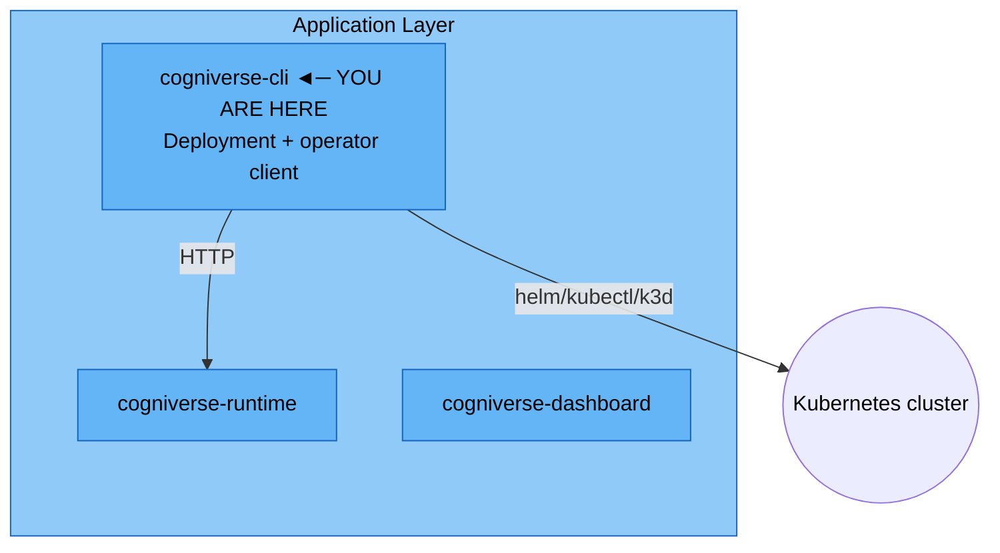

# CLI Module

**Package:** `cogniverse_cli` (Application Layer)
**Location:** `libs/cli/cogniverse_cli/`
**Entry point:** `cogniverse` (installed via `[project.scripts]` in `libs/cli/pyproject.toml`)

---

## Table of Contents

1. [Overview](#overview)
2. [Package Structure](#package-structure)
3. [Commands](#commands)
4. [Configuration](#configuration)
5. [Testing](#testing)
6. [Architecture Position](#architecture-position)

---

## Overview

The CLI package provides `cogniverse`, a Click-based command line tool for deploying and managing the Cogniverse stack on Kubernetes (k3d locally, or an existing cluster). It wraps `helm`, `kubectl`, and `k3d` invocations, resolves the Helm chart and workflow paths whether run from a monorepo checkout or an installed wheel, and adds a handful of client commands (coding agent REPL, codebase indexing, knowledge graph queries) that talk to a running runtime over HTTP.

Key responsibilities:

- **Stack lifecycle** — `up` / `down` / `status` / `logs` for the full Helm release (Vespa, runtime, dashboard, Phoenix, LLM, Argo)
- **Cluster bootstrap** — creates/deletes a local k3d cluster, checks and installs prerequisites (`docker`, `kubectl`, `helm`)
- **Image handling** — detects the host's torch backend (cpu/cuda/rocm), builds workspace images, imports them into k3d, pre-pulls third-party images
- **Secrets sync** — pushes the local HuggingFace token into the cluster as `Secret/hf-token`
- **Client commands** — `code` (interactive coding agent REPL), `index` (index a directory into Vespa for agent context search), `graph` (query the knowledge graph), `admin` (tenant/orphan reconciliation), `sandbox` (OpenShell gateway management)

---

## Package Structure

```mermaid
graph TD
    Root["<span style='color:#000'><b>cogniverse_cli/</b></span>"]

    Root --> Main["<span style='color:#000'><b>main.py</b><br/>Click entry point (up/down/status/logs/...)</span>"]
    Root --> Cluster["<span style='color:#000'>cluster.py<br/>k3d lifecycle, prerequisites</span>"]
    Root --> Config["<span style='color:#000'>config.py<br/>Chart/workflow/config path resolution</span>"]
    Root --> Deploy["<span style='color:#000'>deploy.py<br/>helm install/uninstall</span>"]
    Root --> Images["<span style='color:#000'>images.py<br/>Backend detection, image build/import</span>"]
    Root --> Argo["<span style='color:#000'>argo.py<br/>Argo Workflows controller + templates</span>"]
    Root --> Health["<span style='color:#000'>health.py<br/>Service health polling</span>"]
    Root --> Secrets["<span style='color:#000'>secrets.py<br/>hf-token cluster sync</span>"]
    Root --> Sandbox["<span style='color:#000'>sandbox.py<br/>OpenShell sandbox gateway</span>"]
    Root --> Admin["<span style='color:#000'>admin.py<br/>Orphan schema reconciliation</span>"]
    Root --> Graph["<span style='color:#000'>graph.py<br/>Knowledge graph CLI commands</span>"]
    Root --> Code["<span style='color:#000'>code.py<br/>Interactive coding agent REPL</span>"]
    Root --> Streaming["<span style='color:#000'>streaming.py<br/>SSE streaming for the coding REPL</span>"]
    Root --> Index["<span style='color:#000'>index.py<br/>Directory indexing into Vespa</span>"]
    Root --> Constants["<span style='color:#000'>constants.py<br/>NAMESPACE, RELEASE_NAME</span>"]

    style Root fill:#ce93d8,stroke:#7b1fa2,color:#000
    style Main fill:#ffcc80,stroke:#ef6c00,color:#000
    style Cluster fill:#81d4fa,stroke:#0288d1,color:#000
    style Config fill:#81d4fa,stroke:#0288d1,color:#000
    style Deploy fill:#81d4fa,stroke:#0288d1,color:#000
    style Images fill:#81d4fa,stroke:#0288d1,color:#000
    style Argo fill:#81d4fa,stroke:#0288d1,color:#000
    style Health fill:#81d4fa,stroke:#0288d1,color:#000
    style Secrets fill:#81d4fa,stroke:#0288d1,color:#000
    style Sandbox fill:#81d4fa,stroke:#0288d1,color:#000
    style Admin fill:#81d4fa,stroke:#0288d1,color:#000
    style Graph fill:#81d4fa,stroke:#0288d1,color:#000
    style Code fill:#81d4fa,stroke:#0288d1,color:#000
    style Streaming fill:#81d4fa,stroke:#0288d1,color:#000
    style Index fill:#81d4fa,stroke:#0288d1,color:#000
    style Constants fill:#81d4fa,stroke:#0288d1,color:#000
```



All modules are flat files directly under `cogniverse_cli/` (no subpackages).

---

## Commands

### Stack lifecycle

```bash
# Deploy the full stack (creates a k3d cluster if none exists)
cogniverse up
cogniverse up --llm external --llm-url http://my-llm:8000/v1
cogniverse up --messaging  # also enable the Telegram gateway (needs TELEGRAM_BOT_TOKEN)

# Tear down
cogniverse down
cogniverse down --keep-data  # keep PVCs, only remove workloads

# Health of all services
cogniverse status

# Tail logs for one service
cogniverse logs runtime --follow
```

`up` accepts `--llm {auto,builtin,external}` (default `auto`, which probes `localhost:11434` for a host LLM before falling back to the chart's builtin model) and `--image-source` to override the workspace directory used for image builds. `logs` targets one of `runtime`, `dashboard`, `vespa`, `phoenix`, `llm`, `argo`.

### Coding agent

```bash
# Interactive REPL against the coding agent
cogniverse code --tenant acme --language python --iterations 5 --codebase ./my-repo
```

### Indexing

```bash
# Index a directory of source code into Vespa for agent context search
cogniverse index ./my-repo --type code --tenant acme
```

Only `--type code` is currently implemented; `docs` and `video` are accepted but print a not-yet-implemented notice.

### Knowledge graph

```bash
cogniverse graph stats --tenant acme
cogniverse graph search "authentication flow" --tenant acme --top-k 10
cogniverse graph neighbors <node_id> --tenant acme --depth 1
cogniverse graph path <source_node> <target_node> --tenant acme --max-depth 4
```

Every `graph` subcommand resolves the tenant from `--tenant`, falling back to `$COGNIVERSE_TENANT_ID`; if neither is set the command exits with an error pointing at `POST /admin/tenants`.

### Admin

```bash
# List Vespa schema orphans without dropping them (dry-run)
cogniverse admin reconcile-orphans

# Actually drop them
cogniverse admin reconcile-orphans --confirm --runtime-url http://localhost:28000
```

### Secrets

```bash
cogniverse secrets sync              # warn if hf-token is missing
cogniverse secrets sync --required   # fail if hf-token is missing
```

### Sandbox

```bash
cogniverse sandbox sync     # re-sync OpenShell gateway certs after rotation
cogniverse sandbox status   # show gateway install/running/cluster-sync state
```

---

## Configuration

`resolve_project_root()` (in `config.py`) walks up from the current directory looking for a `pyproject.toml` containing `[tool.uv.workspace]` to find the monorepo root. When the CLI is installed as a wheel (no such root), the same functions fall back to bundled package data under `cogniverse_cli/data/` for the Helm chart and workflow templates.

Environment variables read by `up`:

| Variable | Used by | Purpose |
|---|---|---|
| `TELEGRAM_BOT_TOKEN` | `up --messaging` | Required to enable the messaging gateway |
| `COGNIVERSE_TENANT_ID` | `graph`, `code`, `index` | Default tenant when `--tenant` is omitted |
| `HF_TOKEN` / `HUGGING_FACE_HUB_TOKEN` | `secrets sync` | HuggingFace token pushed to the cluster |

---

## Testing

```bash
uv run pytest tests/cli/unit/ -v --tb=long
```

Covers cluster prerequisite checks, image backend detection, Helm install/uninstall wrapping, config path resolution, the coding REPL, sandbox management, and secrets sync — each against a mocked `subprocess`/`kubectl`/`helm` boundary.

---

## Architecture Position



`cogniverse-cli` does not import from and is not imported by any other `libs/*` package — it drives the deployed stack over `kubectl`/`helm` and the runtime's HTTP API rather than in-process calls.

**Dependencies:** `click`, `rich`, `httpx`, `httpx-sse`, `pyyaml`

**Dependents:** none (standalone entry point)

---

## Related

- [Runtime Module](./runtime.md) - HTTP API the CLI's client commands call
- [Messaging Module](./messaging.md) - Telegram gateway enabled via `cogniverse up --messaging`
