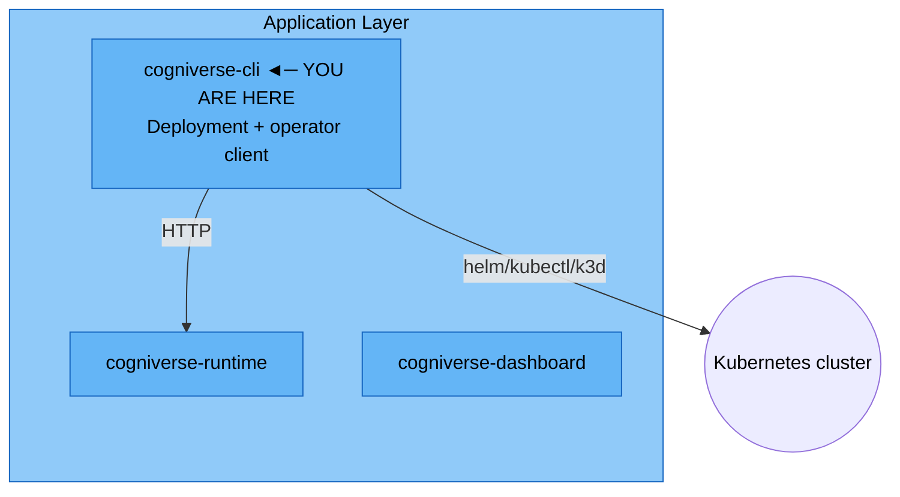

# CLI Module

**Package:** `cogniverse_cli` (Application Layer)
**Location:** `libs/cli/cogniverse_cli/`
**Entry point:** `cogniverse` (installed via `[project.scripts]` in `libs/cli/pyproject.toml`)

---

## Table of Contents

1. [Overview](#overview)
2. [Package Structure](#package-structure)
3. [Commands](#commands)
4. [Configuration](#configuration)
5. [Testing](#testing)
6. [Architecture Position](#architecture-position)

---

## Overview

The CLI package provides `cogniverse`, a Click-based command line tool for deploying and managing the Cogniverse stack on Kubernetes (k3d locally, or an existing cluster). It wraps `helm`, `kubectl`, and `k3d` invocations, resolves the Helm chart and workflow paths whether run from a monorepo checkout or an installed wheel, and adds client commands for the coding agent REPL, codebase indexing, knowledge graph queries, secrets sync, sandbox management, and Modal inference control.

Key responsibilities:

- **Stack lifecycle** — `up` / `down` / `start` / `stop` / `status` / `logs` for the full Helm release (Vespa, runtime, dashboard, Phoenix, LLM, Argo)
- **Cluster bootstrap** — creates/deletes a local k3d cluster, checks and installs prerequisites (`docker`, `kubectl`, `helm`)
- **Image handling** — detects the host's torch backend (cpu/cuda/rocm), builds workspace images, pre-pulls third-party images one at a time, and imports every image into k3d independently with `k3d image import --mode direct` to bound peak memory; any failed pull or import stops the remaining image operations and aborts deployment
- **Secrets sync** — pushes the local HuggingFace token, Telegram token, and inference API key into cluster Secrets
- **Client commands** — `code` (interactive coding agent REPL), `index` (index a directory into Vespa for agent context search), `graph` (query the knowledge graph), `admin` (tenant/orphan reconciliation), `sandbox` (OpenShell gateway management), `inference modal` (Modal service lifecycle)

---

## Package Structure


```mermaid
graph TD
    Root["<span style='color:#000'><b>cogniverse_cli/</b></span>"]

    Root --> Main["<span style='color:#000'><b>main.py</b><br/>Click entry point for stack, client, and inference commands</span>"]
    Root --> Cluster["<span style='color:#000'>cluster.py<br/>k3d lifecycle, prerequisites</span>"]
    Root --> Config["<span style='color:#000'>config.py<br/>Chart/workflow/config path resolution</span>"]
    Root --> Deploy["<span style='color:#000'>deploy.py<br/>helm install/uninstall</span>"]
    Root --> Images["<span style='color:#000'>images.py<br/>Backend detection, image build/import</span>"]
    Root --> Argo["<span style='color:#000'>argo.py<br/>Argo Workflows controller + templates</span>"]
    Root --> Health["<span style='color:#000'>health.py<br/>Service health polling</span>"]
    Root --> Secrets["<span style='color:#000'>secrets.py<br/>HuggingFace + Telegram + inference-key Secret sync</span>"]
    Root --> Sandbox["<span style='color:#000'>sandbox.py<br/>OpenShell sandbox gateway</span>"]
    Root --> Admin["<span style='color:#000'>admin.py<br/>Orphan reconciliation + messaging invites</span>"]
    Root --> Graph["<span style='color:#000'>graph.py<br/>Knowledge graph CLI commands</span>"]
    Root --> Code["<span style='color:#000'>code.py<br/>Interactive coding agent REPL</span>"]
    Root --> Streaming["<span style='color:#000'>streaming.py<br/>SSE streaming for the coding REPL</span>"]
    Root --> Index["<span style='color:#000'>index.py<br/>Directory indexing into Vespa</span>"]
    Root --> Constants["<span style='color:#000'>constants.py<br/>NAMESPACE, RELEASE_NAME, RUNTIME_URL</span>"]

    style Root fill:#ce93d8,stroke:#7b1fa2,color:#000
    style Main fill:#ffcc80,stroke:#ef6c00,color:#000
    style Cluster fill:#81d4fa,stroke:#0288d1,color:#000
    style Config fill:#81d4fa,stroke:#0288d1,color:#000
    style Deploy fill:#81d4fa,stroke:#0288d1,color:#000
    style Images fill:#81d4fa,stroke:#0288d1,color:#000
    style Argo fill:#81d4fa,stroke:#0288d1,color:#000
    style Health fill:#81d4fa,stroke:#0288d1,color:#000
    style Secrets fill:#81d4fa,stroke:#0288d1,color:#000
    style Sandbox fill:#81d4fa,stroke:#0288d1,color:#000
    style Admin fill:#81d4fa,stroke:#0288d1,color:#000
    style Graph fill:#81d4fa,stroke:#0288d1,color:#000
    style Code fill:#81d4fa,stroke:#0288d1,color:#000
    style Streaming fill:#81d4fa,stroke:#0288d1,color:#000
    style Index fill:#81d4fa,stroke:#0288d1,color:#000
    style Constants fill:#81d4fa,stroke:#0288d1,color:#000
```

Top-level command modules live directly under `cogniverse_cli/`. `modal_inference/`
holds the service apps, and `modal_inference_config.py`, `inference_endpoints.py`,
and `modal_inference_lifecycle.py` define the Modal service contracts and lifecycle.

---

## Commands

### Stack lifecycle

```bash
# Deploy the full stack (creates a k3d cluster if none exists, otherwise uses
# the discovered cogniverse* cluster). Builds the images at the git-derived
# dev version, pulls third-party images one at a time, then imports each image
# with `k3d image import --mode direct` in a separate operation to bound peak
# memory use. A failed pull or import stops the remaining image operations and
# aborts deployment. After all imports, `up` helm-upgrades with the chart
# stamped to the same version. In dev mode the pods mount the working tree
# over the images, so day-to-day code changes only need a `kubectl rollout
# restart` of the affected deployment — rerun `cogniverse up` when
# dependencies, Dockerfiles, or the chart change (see "Development Workflow:
# Three Loops" in docs/DEVELOPER_GUIDE.md).
cogniverse up
cogniverse up --llm external --llm-url http://my-llm:8000/v1
cogniverse up --messaging  # also enable the Telegram gateway (needs TELEGRAM_BOT_TOKEN)

# Pause / resume a cluster without losing data. With no `--name`, the command
# resolves the active cogniverse* cluster; the dev cluster restores
# port-forwards, while the e2e cluster does not use them.
cogniverse stop                        # stop the active cluster
cogniverse stop --name cogniverse-e2e  # stop the e2e cluster explicitly
cogniverse start                       # resume the active cluster
cogniverse start --name cogniverse-e2e
# Both `up` (create) and `start` pin the cluster's CoreDNS upstreams to
# 1.1.1.1/8.8.8.8 (idempotent). k3d's default forwards to the host's
# /etc/resolv.conf — on hosts with a dead/localhost resolver every pod's
# external DNS fails and the vLLM pods crashloop with flapping NodePorts.

# Tear down
cogniverse down
cogniverse down --keep-data  # keep PVCs, only remove workloads

# Health of all services (also lists k3d clusters and their run state)
cogniverse status

# Tail logs for one service
cogniverse logs runtime --follow
```

`up` accepts `--llm {auto,builtin,external}` (default `auto`, which probes `localhost:11434` for a host LLM before falling back to the chart's builtin model) and `--image-source` to override the workspace directory used for image builds. `logs` targets one of `runtime`, `dashboard`, `vespa`, `phoenix`, `llm`, `argo`; `logs llm` checks for the `cogniverse-llm` statefulset first and prints a notice instead of erroring when the stack is running in external-LLM mode (no builtin pod).

Services with no NodePort — currently the Argo server (it runs in its own namespace) reachable at `localhost:2746` — are bridged by detached, self-restarting `kubectl port-forward` daemons recorded in `/tmp/cogniverse-port-forwards.pids`. `up` and `start` establish them when the resolved cluster is the canonical dev cluster; each first reaps the daemons a prior run recorded, so repeated runs never orphan an earlier restart-loop still retrying its bind. `down` and `stop` reap them for that same cluster.

### Modal inference

```bash
cogniverse inference modal deploy vllm_colpali denseon
cogniverse inference modal warm vllm_colpali denseon
cogniverse inference modal release vllm_colpali denseon
cogniverse inference modal status vllm_colpali denseon
cogniverse inference modal qualify vllm_colpali --gpu A10 --gpu L4
cogniverse inference modal undeploy vllm_colpali --confirm-service vllm_colpali
```

`cogniverse inference modal` uses `ModalInferenceLifecycle` from `modal_inference_lifecycle.py`. `deploy`, `release`, and `status` operate on one or more canonical Modal services; `warm` fetches authenticated endpoints and live runner counts; `qualify` picks the earliest configured GPU from the supplied candidates; `undeploy` requires an exact `--confirm-service` match.

### Coding agent

```bash
# Interactive REPL against the coding agent
cogniverse code --tenant acme --language python --iterations 5 --codebase ./my-repo
```

### Indexing

```bash
# Index a directory of source code into Vespa for agent context search
cogniverse index ./my-repo --type code --tenant acme

# Override the Vespa profile the runtime ingests with (default: code_lateon_mv for --type code)
cogniverse index ./my-repo --type code --tenant acme --profile code_lateon_mv

# Point text graph extraction at a GLiNER inference service (default: the URL in system configuration)
cogniverse index ./docs --type docs --tenant acme --gliner-url http://localhost:29007
```

`--type code` and `--type docs` are implemented (`docs` maps each extension to its ingestion profile and runs markdown/text graph extraction); `video` is accepted but prints a not-yet-implemented notice. Each file is uploaded to `/ingestion/upload` and polled to a terminal state, then a knowledge-graph extraction pass runs locally (tree-sitter for code, GLiNER for text) and POSTs the resulting nodes/edges to `/graph/upsert`. Per-file graph-extraction failures are counted and listed in the run summary as graph errors rather than silently producing zero nodes.

An ingestion job is counted as indexed only when its terminal result reports a
positive integer `documents_fed`. A terminal `complete` result with zero,
missing, boolean, or otherwise invalid `documents_fed` is a per-file indexing
error, not success; it appears in the error list and does not increment
`files_indexed`. Graph extraction remains a separate best-effort pass, so its
failure is reported under `graph_errors` without rewriting the ingestion
result.

### Knowledge graph

```bash
cogniverse graph stats --tenant acme
cogniverse graph search "authentication flow" --tenant acme --top-k 10
cogniverse graph neighbors <node_id> --tenant acme --depth 1
cogniverse graph path <source_node> <target_node> --tenant acme --max-depth 4
```

Every `graph` subcommand resolves the tenant from `--tenant`, falling back to `$COGNIVERSE_TENANT_ID`; if neither is set the command exits with an error pointing at `POST /admin/tenants`. Failures use the same exit codes as `cogniverse admin`: 2 when the runtime is unreachable, 3 on a non-200 or non-JSON response — so scripts can branch on failure instead of parsing output.

### Admin

```bash
# List Vespa schema orphans without dropping them (dry-run)
cogniverse admin reconcile-orphans

# Actually drop them
cogniverse admin reconcile-orphans --confirm --runtime-url http://localhost:28000

# Mint a messaging invite token for a tenant
cogniverse admin invite acme:alice
cogniverse admin invite acme:alice --expires-in-hours 2 --runtime-url http://localhost:28000
```

`admin invite` calls `POST /admin/messaging/invite` and prints the token plus the
`/start <token>` line the user sends to the bot to link their chat account to
that tenant. Tokens are single-use and expire (24h by default). Exit codes match
the rest of `cogniverse admin`: 2 when the runtime is unreachable, 3 on a
non-200, 4 when the runtime answers without a token.

### Secrets

```bash
cogniverse secrets sync              # warn on anything missing
cogniverse secrets sync --required   # fail on anything missing
```

Syncs the cluster Secrets the chart mounts but does not create:

| Secret | Key | Source |
|---|---|---|
| `hf-token` | `HF_TOKEN` | `HF_TOKEN` / `HUGGING_FACE_HUB_TOKEN`, else `~/.cache/huggingface/token` |
| `cogniverse-messaging-secrets` | `telegram-bot-token` | `TELEGRAM_BOT_TOKEN` |
| `cogniverse-inference-api-key` | `COGNIVERSE_INFERENCE_API_KEY` | `COGNIVERSE_INFERENCE_API_KEY` |

Every secret resolves through the same order, most specific first:

1. the environment variable — CI, or an explicit one-off override
2. `./.env` — project-local, gitignored
3. `~/.env` — shared across checkouts on this machine
4. any tool-specific location (only `~/.cache/huggingface/token`, for `HF_TOKEN`)

Each `.env` may be a **directory** holding one `<VAR>.env` file per secret (the
file may contain `VAR=value` or just the bare value), or a **single file** of
`KEY=value` lines. Both are read, so a project `.env` overrides `~/.env`
per-variable rather than wholesale — you can keep shared credentials in your
home copy and override just one of them per checkout.

The messaging deployment reads `TELEGRAM_BOT_TOKEN` from
`cogniverse-messaging-secrets`; without this sync the gateway pod cannot start
when `messaging.enabled=true`. The runtime and ingestor read
`COGNIVERSE_INFERENCE_API_KEY` from `cogniverse-inference-api-key` (an
optional secretKeyRef, so a fully-local stack starts without it) to
authenticate outbound calls to `https://*.modal.run` inference endpoints.

### Sandbox

```bash
cogniverse sandbox sync     # re-sync OpenShell gateway certs after rotation
cogniverse sandbox status   # show gateway install/running/cluster-sync state
```

---

## Configuration

`resolve_project_root()` (in `config.py`) walks up from the current directory looking for a `pyproject.toml` containing `[tool.uv.workspace]` to find the monorepo root. When the CLI is installed as a wheel (no such root), the same functions fall back to bundled package data under `cogniverse_cli/data/` for the Helm chart and workflow templates.

Environment variables read across CLI commands:

| Variable | Used by | Purpose |
|---|---|---|
| `TELEGRAM_BOT_TOKEN` | `up --messaging`, `secrets sync` | Required to enable the messaging gateway |
| `COGNIVERSE_INFERENCE_API_KEY` | `up`, `secrets sync`, `inference modal` | Bearer key pushed to the cluster as `Secret/cogniverse-inference-api-key`; authenticates Modal-hosted inference endpoints |
| `COGNIVERSE_TENANT_ID` | `graph`, `code`, `index` | Default tenant when `--tenant` is omitted |
| `HF_TOKEN` / `HUGGING_FACE_HUB_TOKEN` | `up`, `secrets sync` | HuggingFace token pushed to the cluster as `Secret/hf-token`; also checked from `~/.cache/huggingface/token` |
| `COGNIVERSE_TORCH_BACKEND` | `up` | Overrides host torch-backend auto-detection (`cpu`/`cuda`/`rocm`) used to pick image tags and device-values overlays |
| `COGNIVERSE_K3D_PORTS` | `up` (cluster create) | Full override of the k3d loadbalancer port list (comma-separated) |
| — | `create_cluster(ports=…)` | Entries may be plain ints (1:1 host:node mapping) or `"host:node"` strings mapping an offset host port onto a chart NodePort — the e2e suite maps 33xxx host ports onto the canonical NodePorts so its cluster never collides with a dev cluster's |
| `COGNIVERSE_K3D_EXTRA_PORTS` | `up` (cluster create) | Ports added on top of the default k3d loadbalancer port list |
| `COGNIVERSE_K3D_EXCLUDE_PORTS` | `up` (cluster create) | Ports subtracted from the k3d loadbalancer port list |
| `OPENSHELL_GATEWAY_HOST_PORT` | `sandbox sync`, `sandbox status` | Host port for the OpenShell gateway (default `28080`) |

---

## Testing

```bash
uv run pytest tests/cli/unit/ -v --tb=long
```

One test module per source module: `test_main.py` (`up`/`down`/`status`/`logs`/`start`/`stop`, host-LLM probing, port-forward start/reap wiring), `test_cluster.py` (prerequisite checks, k3d lifecycle, orphan-free port-forward restart/stop), `test_config.py` (chart/workflow path resolution in dev vs. installed mode), `test_deploy.py` (Helm install/upgrade/uninstall, release-existence classification), `test_images.py` (torch-backend detection, image build/import), `test_argo.py` (WorkflowTemplate/CronWorkflow filtering), `test_health.py` (URL polling and health snapshots), `test_secrets_sync.py` (hf-token + inference-key sync), `test_sandbox_cli.py` (OpenShell gateway install/sync/status), `test_code_cli.py` (A2A request building, SSE event parsing, the REPL session, slash commands, and `index.py`'s `collect_files` filtering), and `test_admin_and_graph_cli.py` (orphan reconciliation, graph stats/search/upsert payloads) — each against a mocked `subprocess`/`kubectl`/`helm`/`httpx` boundary.

`tests/e2e/test_coding_cli_e2e.py` and `tests/e2e/test_graph_cli_e2e.py` exercise the `index`, `code`, and `graph` commands against a real running runtime (upload → ingest → graph upsert round-trip).

---

## Architecture Position


```mermaid
flowchart TB
    subgraph AppLayer["<span style='color:#000'>Application Layer</span>"]
        CLI["<span style='color:#000'>cogniverse-cli ◄─ YOU ARE HERE<br/>Deployment + operator client</span>"]
        Runtime["<span style='color:#000'>cogniverse-runtime</span>"]
        Dashboard["<span style='color:#000'>cogniverse-dashboard</span>"]
    end

    CLI -->|helm/kubectl/k3d| K8s(("<span style='color:#000'>Kubernetes cluster</span>"))
    CLI -->|HTTP| Runtime

    style AppLayer fill:#90caf9,stroke:#1565c0,color:#000
    style CLI fill:#64b5f6,stroke:#1565c0,color:#000
    style Runtime fill:#64b5f6,stroke:#1565c0,color:#000
    style Dashboard fill:#64b5f6,stroke:#1565c0,color:#000
```

`cogniverse-cli` does not import from and is not imported by any other `libs/*` package — it drives the deployed stack over `kubectl`/`helm` and the runtime's HTTP API rather than in-process calls.

**Dependencies:** `click`, `fastapi`, `rich`, `httpx`, `httpx-sse`, `modal`, `pyyaml`, `setuptools-scm`

**Dependents:** none (standalone entry point)

---

## Related

- [Runtime Module](./runtime.md) - HTTP API the CLI's client commands call
- [Messaging Module](./messaging.md) - Telegram gateway enabled via `cogniverse up --messaging`
