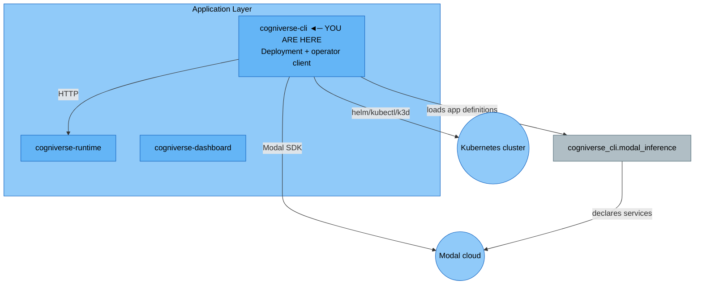

# CLI Module

**Package:** `cogniverse_cli` (Application Layer)
**Location:** `libs/cli/cogniverse_cli/`
**Entry point:** `cogniverse` (installed via `[project.scripts]` in `libs/cli/pyproject.toml`)

---

## Table of Contents

1. [Overview](#overview)
2. [Package Structure](#package-structure)
3. [Public API Reference](#public-api-reference)
4. [Commands](#commands)
5. [Configuration](#configuration)
6. [Testing](#testing)
7. [Architecture Position](#architecture-position)

---

## Overview

The CLI package provides `cogniverse`, a Click-based command line tool for
deploying and managing the Cogniverse stack on Kubernetes (k3d locally, or an
existing cluster). It wraps `helm`, `kubectl`, and `k3d`, resolves chart and
workflow paths from a monorepo checkout, calls the runtime over HTTP, and uses
the Modal SDK for external inference deployment and autoscaler operations.

Key responsibilities:

- **Stack lifecycle** — `up`, `down`, `start`, `stop`, `status`, and `logs` for the Helm release and its k3d cluster
- **Cluster bootstrap** — creates, starts, stops, and deletes a local k3d cluster; checks and installs prerequisites (`docker`, `kubectl`, `helm`)
- **Image handling** — detects the host's torch backend (cpu/cuda/rocm), builds workspace images, imports them into k3d, pre-pulls third-party images
- **Secrets sync** — pushes HuggingFace and Telegram credentials into their declared cluster Secrets
- **External inference** — deploys, warms, releases, inspects, qualifies, and explicitly undeploys pinned Modal services
- **Operator and client commands** — `code`, `index`, `graph`, `admin`, `sandbox`, and `secrets`

---

## Package Structure


```mermaid
graph TD
    Root["<span style='color:#000'><b>cogniverse_cli/</b></span>"]

    Root --> Init["<span style='color:#000'>__init__.py<br/>Package marker</span>"]
    Root --> Main["<span style='color:#000'><b>main.py</b><br/>Click entry point (up/down/status/logs/...)</span>"]
    Root --> Cluster["<span style='color:#000'>cluster.py<br/>k3d lifecycle, prerequisites</span>"]
    Root --> Config["<span style='color:#000'>config.py<br/>Chart/workflow/config path resolution</span>"]
    Root --> Deploy["<span style='color:#000'>deploy.py<br/>helm install/uninstall</span>"]
    Root --> Images["<span style='color:#000'>images.py<br/>Backend detection, image build/import</span>"]
    Root --> Argo["<span style='color:#000'>argo.py<br/>Argo Workflows controller + templates</span>"]
    Root --> Health["<span style='color:#000'>health.py<br/>Service health polling</span>"]
    Root --> Secrets["<span style='color:#000'>secrets.py<br/>HuggingFace + Telegram Secret sync</span>"]
    Root --> Sandbox["<span style='color:#000'>sandbox.py<br/>OpenShell sandbox gateway</span>"]
    Root --> Admin["<span style='color:#000'>admin.py<br/>Orphan reconciliation + messaging invites</span>"]
    Root --> Graph["<span style='color:#000'>graph.py<br/>Knowledge graph CLI commands</span>"]
    Root --> Code["<span style='color:#000'>code.py<br/>Interactive coding agent REPL</span>"]
    Root --> Streaming["<span style='color:#000'>streaming.py<br/>SSE streaming for the coding REPL</span>"]
    Root --> Index["<span style='color:#000'>index.py<br/>Directory indexing into Vespa</span>"]
    Root --> ModalInference["<span style='color:#000'>modal_inference_config.py<br/>Pinned cloud inference contracts</span>"]
    Root --> InferenceEndpoints["<span style='color:#000'>inference_endpoints.py<br/>Authenticated exact-model resolution</span>"]
    Root --> ModalLifecycle["<span style='color:#000'>modal_inference_lifecycle.py<br/>Modal deploy and autoscaler lifecycle</span>"]
    Root --> Constants["<span style='color:#000'>constants.py<br/>NAMESPACE, RELEASE_NAME, RUNTIME_URL</span>"]
    Root --> ModalPackage["<span style='color:#000'><b>modal_inference/</b><br/>Installed Modal app definitions</span>"]
    ModalPackage --> ModalServices["<span style='color:#000'>vllm.py, gemma.py, whisper.py, ...<br/>Model deployment definitions</span>"]
    ModalPackage --> ModalServers["<span style='color:#000'><b>servers/</b><br/>CLAP, face, GLiNER, PyLate, VideoPrism HTTP servers</span>"]

    style Root fill:#ce93d8,stroke:#7b1fa2,color:#000
    style Init fill:#81d4fa,stroke:#0288d1,color:#000
    style Main fill:#ffcc80,stroke:#ef6c00,color:#000
    style Cluster fill:#81d4fa,stroke:#0288d1,color:#000
    style Config fill:#81d4fa,stroke:#0288d1,color:#000
    style Deploy fill:#81d4fa,stroke:#0288d1,color:#000
    style Images fill:#81d4fa,stroke:#0288d1,color:#000
    style Argo fill:#81d4fa,stroke:#0288d1,color:#000
    style Health fill:#81d4fa,stroke:#0288d1,color:#000
    style Secrets fill:#81d4fa,stroke:#0288d1,color:#000
    style Sandbox fill:#81d4fa,stroke:#0288d1,color:#000
    style Admin fill:#81d4fa,stroke:#0288d1,color:#000
    style Graph fill:#81d4fa,stroke:#0288d1,color:#000
    style Code fill:#81d4fa,stroke:#0288d1,color:#000
    style Streaming fill:#81d4fa,stroke:#0288d1,color:#000
    style Index fill:#81d4fa,stroke:#0288d1,color:#000
    style ModalInference fill:#81d4fa,stroke:#0288d1,color:#000
    style InferenceEndpoints fill:#81d4fa,stroke:#0288d1,color:#000
    style ModalLifecycle fill:#81d4fa,stroke:#0288d1,color:#000
    style Constants fill:#81d4fa,stroke:#0288d1,color:#000
    style ModalPackage fill:#81d4fa,stroke:#0288d1,color:#000
    style ModalServices fill:#64b5f6,stroke:#1565c0,color:#000
    style ModalServers fill:#64b5f6,stroke:#1565c0,color:#000
```

Operator commands remain directly under `cogniverse_cli/`. The
`cogniverse_cli/modal_inference/` subpackage contains the installed Modal app
definitions, while `cogniverse_cli/modal_inference/servers/` contains the
standalone CLAP, face, GLiNER, PyLate, and VideoPrism HTTP applications copied
into their service images. The PyLate server runs `pylate.models.ColBERT`
itself: `POST /pooling` accepts `{"input", "model", "is_query"}` and returns
the exact per-token matrix for both encode directions, because generic
token-embedding servers cannot reproduce PyLate's query expansion (their
request schema carries no attention mask).

`modal_inference_config.py` is the model-contract registry for Modal inference
deployments. `INFERENCE_SERVICE_SPECS` is a read-only
`Mapping[str, InferenceServiceSpec]`; `get_inference_service_spec(name)` returns
one entry and raises `KeyError` for an unknown service. `InferenceServiceSpec`
is a frozen, slotted dataclass with the model identity, response dimension,
ordered GPU candidates, endpoint authentication, Modal object name, health and
model-list paths, and scale-to-zero settings. Its `modal_app` property derives
an independent app name as `cogniverse-<service-name>` with underscores
replaced by hyphens.

Every current entry uses bearer authentication, the Modal object `Inference`,
`/health` and `/v1/models`, a 300-second scale-down window, and zero minimum
containers. Model revisions must be non-empty and cannot be the mutable names
`main`, `master`, or `latest`; every service must have at least one GPU
candidate.

`modal_inference_lifecycle.py` consumes these values for deployment and
autoscaler operations. A normal warm raises the service minimum to one, probes
the authenticated health route for up to 1,200 seconds, and then validates the
exact model ID and revision once. Health retries cover HTTP 502, 503, and 504
responses plus transient connection and timeout failures. Release returns the
minimum to zero and preserves the deployed Modal app. Status reads
`Function.get_current_stats().num_total_runners` so separate CLI processes
report the same live container count. The destructive undeploy operation is
separate and requires byte-exact confirmation of the service name.

| Service | Model ID | Pinned revision | Output dimension | GPU candidates |
|---|---|---|---:|---|
| `vllm_colpali` | `TomoroAI/tomoro-colqwen3-embed-4b` | `bf790bd8780b098b86453444632a184bb770be1a` | 320 | L4, A10, L40S |
| `colbert_pylate` | `lightonai/LateOn` | `c01907b70557ee5c7753680d4819a5cce1674b83` | 128 | T4, L4 |
| `code_colbert_pylate` | `lightonai/LateOn-Code-edge` | `07ef20f406c86badca122464808f4cac2f6e4b25` | 48 | T4, L4 |
| `denseon` | `lightonai/DenseOn` | `cb9947ebccb33862d24e3c7ca2edb25e51acd887` | 768 | T4, L4 |
| `gliner` | `urchade/gliner_large-v2.1` | `abd49a1f1ebc12af1be84d06f6848221cf96dcad` | — | T4, L4 |
| `videoprism_jax` | `videoprism_public_v1_base_hf` | model `be719a406d563b66f0ac969e7c94bab8e997c81a`; source `d481d91b9bf8c9d330d1e526e511a359c799bbe1` | 768 | T4, L4 |
| `vllm_llm_student` | `google/gemma-4-e4b-it` | `ee0ef6023621cff504d758262d4e04895a5af4a2` | — | L4, A10, L40S |
| `vllm_asr` | `openai/whisper-large-v3-turbo` | `41f01f3fe87f28c78e2fbf8b568835947dd65ed9` | — | T4, L4 |
| `clap_embed` | `laion/clap-htsat-unfused` | `8fa0f1c6d0433df6e97c127f64b2a1d6c0dcda8a` | 512 | T4, L4 |
| `face_embed` | `buffalo_l` | artifact SHA-256 `80ffe37d8a5940d59a7384c201a2a38d4741f2f3c51eef46ebb28218a7b0ca2f` | 512 | T4, L4 |

`inference_endpoints.py` validates live candidates before returning their URLs
to production clients. Explicit candidates are authoritative. Without an
explicit candidate, the resolver orders the candidates supplied by its caller
as Modal, e2e k3d, development k3d, then isolated local service, continuing
only after an `httpx.ConnectError`. It does not discover candidates or parse
`INFERENCE_SERVICE_URLS`; callers construct `CandidateEndpoint` and
`EndpointCredentials` objects directly. Authentication errors, timeouts,
server responses, malformed model metadata, and identity mismatches stop
resolution with a contextual error.

Modal candidates must report the exact model ID and immutable revision from
their `/v1/models` endpoint. A k3d or local candidate may omit the revision from
that response only when deployment discovery has already verified the exact
pinned revision; the live endpoint must still report exactly the configured
model ID. Candidate addresses are root HTTP(S) URLs without embedded
credentials, query parameters, or fragments. Every candidate supplies exactly
the credential shape its service declares: either one bearer token or both
Modal proxy headers. Secret values are excluded from representations and
errors.

The resolver caches against the complete pinned model and candidate contract.
Concurrent resolution of one contract shares one boundary validation and one
failure result, while distinct candidates validate in parallel. A later call
retries a failed validation rather than caching an outage.

---

## Public API Reference

The Click callbacks in `main.py` are the Python surface behind every command
documented below. Their exact signatures are:

- `cli() -> None`, `inference() -> None`, `inference_modal() -> None`,
  `graph() -> None`, `secrets() -> None`, `admin() -> None`, and
  `sandbox() -> None` define the command groups.
- `up(llm_mode: str, llm_url: str | None, image_source: str | None, messaging: bool, sandbox: str, sandbox_endpoint: str | None) -> None`,
  `down(keep_data: bool) -> None`, `status() -> None`,
  `stop(name: str) -> None`, `start(name: str) -> None`, and
  `logs(service: str, follow: bool) -> None` manage the stack and cluster.
- `inference_modal_deploy(services: tuple[str, ...]) -> None`,
  `inference_modal_warm(services: tuple[str, ...]) -> None`,
  `inference_modal_release(services: tuple[str, ...]) -> None`,
  `inference_modal_status(services: tuple[str, ...]) -> None`,
  `inference_modal_qualify(service: str, gpu_candidates: tuple[str, ...]) -> None`,
  and `inference_modal_undeploy(service: str, confirm_service: str) -> None`
  delegate Modal
  operations to `ModalInferenceLifecycle`.
- `graph_stats(tenant: str | None) -> None`,
  `graph_search(query: str, tenant: str | None, top_k: int) -> None`,
  `graph_neighbors(node: str, tenant: str | None, depth: int) -> None`, and
  `graph_path(source: str, target: str, tenant: str | None, max_depth: int) -> None`
  call the graph client.
- `secrets_sync(required: bool) -> None`,
  `admin_reconcile_orphans(confirm: bool, runtime_url: str) -> None`,
  `admin_invite(tenant_id: str, expires_in_hours: int, runtime_url: str) -> None`,
  `sandbox_sync() -> None`, `sandbox_status() -> None`,
  `code(tenant: str | None, language: str, iterations: int, codebase: str) -> None`,
  and `index(path: str, content_type: str, tenant: str | None, profile: str | None) -> None`
  expose the remaining operator and client commands.

The remaining modules expose the following public classes and functions.
Types use the imported names from their defining modules.

### Admin and graph clients

- `cmd_reconcile_orphans(runtime_url: str, *, confirm: bool) -> int` lists or
  removes Vespa schema orphans and returns a process exit code.
- `run(runtime_url: str, *, confirm: bool) -> None` exits with the reconciliation
  command's nonzero result.
- `cmd_create_invite(runtime_url: str, tenant_id: str, *, expires_in_hours: int) -> int`
  requests a messaging invite and returns a process exit code.
- `run_invite(runtime_url: str, tenant_id: str, *, expires_in_hours: int) -> None`
  exits with the invite command's nonzero result.
- `cmd_stats(tenant_id: str, runtime_url: str = RUNTIME_URL) -> int` prints graph
  counts and top-degree nodes.
- `cmd_search(tenant_id: str, query: str, top_k: int = 10, runtime_url: str = RUNTIME_URL) -> int`
  prints semantic node-search results.
- `cmd_neighbors(tenant_id: str, node: str, depth: int = 1, runtime_url: str = RUNTIME_URL) -> int`
  prints neighbors for one node.
- `cmd_path(tenant_id: str, source: str, target: str, max_depth: int = 4, runtime_url: str = RUNTIME_URL) -> int`
  prints the shortest graph path.

### Argo, cluster, and health

- `install_argo_controller(namespace: str = "argo") -> None` installs the
  pinned Argo Workflows chart.
- `filter_workflow_templates(yaml_file: Path) -> list[dict]` returns only
  `WorkflowTemplate` and `CronWorkflow` documents from a YAML file.
- `deploy_workflow_templates(workflows_dir: Path, namespace: str = "cogniverse") -> None`
  applies filtered workflow documents to the namespace.
- `ClusterStartError` is the operator-safe error raised for a failed cluster
  start.
- `check_prerequisites(*, require_k3d: bool = True) -> list[str]` returns missing
  CLI prerequisites.
- `get_install_commands(missing: list[str]) -> list[tuple[str, str]]` maps missing
  tools to install commands.
- `install_prerequisite(tool: str) -> bool` attempts one supported tool install.
- `install_missing_prerequisites(missing: list[str]) -> list[str]` attempts all
  requested installs and returns the names still missing.
- `has_existing_k8s() -> bool` reports whether `kubectl` reaches a cluster.
- `cluster_exists(name: str = CLUSTER_NAME) -> bool` reports whether a named k3d
  cluster exists.
- `create_cluster(name: str = CLUSTER_NAME, ports: list[int | str] | None = None, *, exclude_ports: list[int] | None = None, workspace_path: str | None = None, share_hf_cache: bool = True, share_host_storage: bool = True) -> None`
  creates the k3d cluster, port mappings, and declared host mounts.
- `pinned_corefile(configmap_yaml: str) -> str | None` replaces CoreDNS's host
  resolver forward with the pinned public resolvers.
- `pin_coredns_upstreams(name: str = CLUSTER_NAME, *, timeout_s: float = 60.0) -> bool`
  applies that CoreDNS change and waits for rollout.
- `stop_cluster(name: str = CLUSTER_NAME) -> None`,
  `start_cluster(name: str = CLUSTER_NAME) -> None`, and
  `delete_cluster(name: str = CLUSTER_NAME) -> None` stop, resume, or delete one
  k3d cluster.
- `list_cluster_states() -> list[dict]` returns every k3d cluster's server
  counts and running state.
- `start_port_forwards() -> None`, `restart_dead_port_forwards() -> None`, and
  `stop_port_forwards() -> None` manage the detached service-forward processes.
- `wait_for_url(url: str, *, timeout: float = 300, interval: float = 5) -> bool`
  polls one health URL until it returns HTTP 200, 401, or 403, treating an
  authentication response as evidence that the service is reachable.
- `check_service_health(services: dict[str, str]) -> dict[str, bool]` checks a
  name-to-URL mapping once.

### Paths, deployment, and images

- `resolve_project_root(start: Path | None = None) -> Path | None` finds the UV
  workspace root.
- `get_chart_path(project_root: Path | None = None) -> Path`,
  `get_workflows_path(project_root: Path | None = None) -> Path`, and
  `get_configs_path(project_root: Path | None = None) -> Path` resolve the chart,
  workflows, and shared configs.
- `get_values_file(project_root: Path | None = None, *, prod: bool = False) -> Path`
  selects `values.k3s.yaml` or `values.prod.yaml`.
- `get_device_values_file(backend: str, project_root: Path | None = None) -> Path | None`
  returns an existing backend overlay.
- `release_exists(name: str = RELEASE_NAME, namespace: str = NAMESPACE) -> bool`
  checks Helm's release list.
- `semver_chart_version(version: str) -> str` converts the workspace's PEP 440
  version to SemVer 2 for Helm.
- `helm_install(chart_path: Path, values_file: Path | list[Path], *, set_values: dict[str, str] | None = None, name: str = RELEASE_NAME, namespace: str = NAMESPACE, timeout: str = "10m", chart_version: str | None = None) -> None`
  packages when requested and installs or upgrades the release.
- `helm_uninstall(name: str = RELEASE_NAME, namespace: str = NAMESPACE) -> None`
  removes an existing release.
- `detect_torch_backend() -> str` resolves the host backend from an override or
  host capabilities.
- `has_workspace_source(project_root: Path) -> bool` checks whether the source
  needed for local image builds exists.
- `read_app_version(project_root: Path) -> str` reads the chart's static
  `appVersion`; `dev_version(project_root: Path) -> str` returns the
  setuptools-scm version used for development image tags.
- `enabled_sidecars(project_root: Path, values_files: list[Path] | None) -> list[str]`
  resolves enabled inference sidecars from composed values.
- `build_images(project_root: Path, torch_backend: str | None = None, values_files: list[Path] | None = None, version: str | None = None) -> list[str]`
  builds and returns first-party image tags.
- `dev_image_set_values(project_root: Path, torch_backend: str | None = None, values_files: list[Path] | None = None, version: str | None = None) -> dict[str, str]`
  returns Helm overrides for those development tags.
- `import_images(cluster_name: str, tags: list[str]) -> None` imports tags into
  k3d.
- `prune_superseded_images(version: str, *, node_container: str | None = None, runner=subprocess.run) -> list[str]`
  removes old Cogniverse image generations while retaining rollback capacity.
- `pull_and_import_third_party(cluster_name: str, values_file: Path, *, skip_llm: bool = False) -> None`
  pre-pulls external images and imports them into k3d.

### Coding, indexing, and streaming

- `CodingSession(tenant_id: str, language: str, max_iterations: int, codebase_path: str, runtime_url: str)`
  owns one REPL's conversation and last result.
- `CodingSession.send(query: str) -> CodingResult | None` streams one coding
  request and records the user and successful assistant turns.
- `CodingSession.apply() -> int` writes the last result's proposed changes and
  returns the exact number of files written or deleted.
- `CodingSession.show_diff() -> None` compares the proposed changes with the
  current local files.
- `CodingSession.show_plan() -> None` renders the last generated plan.
- `CodingSession.clear() -> None` clears both conversation history and the last
  result.
- `run_repl(tenant_id: str, language: str = "python", max_iterations: int = 5, codebase_path: str = "", runtime_url: str = RUNTIME_URL) -> None`
  checks runtime health and runs the interactive coding loop.
- `collect_files(root: Path, content_type: str) -> list[Path]` selects supported
  code or documentation files below a root.
- `index_files(root: Path, content_type: str, tenant_id: str, profile: str | None = None, runtime_url: str = RUNTIME_URL) -> dict`
  uploads, polls, and graph-processes the selected files.
- `CodingResult(plan: str = "", code_changes: list[dict[str, str]] = <factory>, execution_results: list[dict[str, Any]] = <factory>, summary: str = "", iterations_used: int = 0, files_modified: list[str] = <factory>, raw: dict[str, Any] = <factory>)`
  is the parsed final coding-agent response; each mutable field's default is a
  dataclass factory, so instances do not share lists or dictionaries.
- `stream_coding_response(query: str, tenant_id: str, agent_name: str = "coding_agent", context: dict[str, Any] | None = None, conversation_history: list[dict[str, str]] | None = None, runtime_url: str = RUNTIME_URL) -> CodingResult | None`
  sends an A2A SSE request, renders progress, and returns the parsed result.
- `render_coding_result(result: CodingResult) -> None` prints the plan, changes,
  execution results, and summary.

### Inference endpoint contracts

- `EndpointResolutionError` is the base validation/selection error;
  `EndpointAuthenticationError`, `EndpointContractError`,
  `EndpointServerError`, `EndpointTimeoutError`, `EndpointUnavailableError`, and
  `ModelIdentityError` distinguish authentication, response-shape, server,
  deadline, reachability, and exact-identity failures.
- `EndpointIdentityEvidence` has `ENDPOINT` and `DEPLOYMENT` values identifying
  where the immutable revision was verified.
- `EndpointCredentials(bearer_token: str | None = None, modal_key: str | None = None, modal_secret: str | None = None)`
  stores redacted credentials and builds the exact headers for an auth scheme.
- `CandidateEndpoint(provider: EndpointProvider, base_url: str, credentials: EndpointCredentials = <factory>, identity_evidence: EndpointIdentityEvidence = EndpointIdentityEvidence.ENDPOINT, model_revision: str | None = None)`
  validates and normalizes one caller-supplied root URL.
- `ResolvedInferenceEndpoint(service: str, provider: EndpointProvider, base_url: str, headers: Mapping[str, str], model_id: str, model_revision: str)`
  carries the validated URL, credentials, and identity.
- `EndpointResolver(client: httpx.Client | None = None)` coalesces concurrent
  validation and retains the 16 most recently used successful contracts.
- `EndpointResolver.resolve(spec: InferenceServiceSpec, *, explicit: CandidateEndpoint | None = None, candidates: Sequence[CandidateEndpoint] = ()) -> ResolvedInferenceEndpoint`
  validates an explicit candidate or tries supplied candidates in provider
  order.
- `EndpointResolver.close() -> None` waits for active resolutions and closes an
  internally created HTTP client. The resolver is also a context manager;
  injected clients remain owned by their caller, and work after close is
  rejected.
- `validate_endpoint(spec: InferenceServiceSpec, candidate: CandidateEndpoint, *, client: httpx.Client) -> ResolvedInferenceEndpoint`
  performs one authenticated `/v1/models` contract check.
- `resolve_endpoint(spec: InferenceServiceSpec, *, explicit: CandidateEndpoint | None = None, candidates: Sequence[CandidateEndpoint] = (), client: httpx.Client | None = None) -> ResolvedInferenceEndpoint`
  provides one-shot resolution without cross-call caching and closes the
  internally created client before returning.

### Modal configuration and lifecycle

- `EndpointAuth` has `BEARER` and `MODAL_PROXY` values.
- `InferenceServiceSpec(name: str, model_id: str, model_revision: str, output_dimension: int | None, gpu_candidates: tuple[str, ...], source_revision: str | None = None, auth: EndpointAuth = EndpointAuth.BEARER, modal_object: str = "Inference", health_path: str = "/health", models_path: str = "/v1/models", scaledown_window: int = 300, min_containers: int = 0)`
  is the immutable service contract.
- `get_inference_service_spec(name: str) -> InferenceServiceSpec` returns a
  registered service or raises `KeyError`.
- `ModalLifecycleError` is the credential-safe lifecycle error.
- `ServiceStatus(service: str, modal_app: str, modal_object: str, web_url: str, active_containers: int)`
  records the live endpoint and runner count.
- `QualificationResult(service: str, selected_gpu: str, considered_gpus: tuple[str, ...])`
  records deterministic GPU selection.
- `ModalInferenceLifecycle(*, credentials: EndpointCredentials, client: httpx.Client | None = None, function_from_name: Callable[[str, str], object] = _lookup_function, deployment_loader: Callable[[InferenceServiceSpec], object] = _load_deployment, app_stopper: Callable[[str], None] = _stop_app, readiness_timeout: float = 1200, readiness_poll_interval: float = 1)`
  owns the deployment and autoscaler boundary.
- `ModalInferenceLifecycle.deploy(services: Sequence[str]) -> tuple[ServiceStatus, ...]`
- `ModalInferenceLifecycle.warm(services: Sequence[str]) -> tuple[ResolvedInferenceEndpoint, ...]`
- `ModalInferenceLifecycle.release(services: Sequence[str]) -> tuple[ServiceStatus, ...]`
- `ModalInferenceLifecycle.status(services: Sequence[str]) -> tuple[ServiceStatus, ...]`
- `ModalInferenceLifecycle.qualify(service: str, candidates: Sequence[str]) -> QualificationResult`
- `ModalInferenceLifecycle.undeploy(service: str, confirmation: str) -> None`
- `ModalInferenceLifecycle.close() -> None` waits for active operations and
  closes only an internally created HTTP client. CLI commands use the lifecycle
  as a context manager so success and failure paths release the connection
  pool; calls begun after shutdown are rejected.
- `ModalInferenceLifecycle.__enter__() -> ModalInferenceLifecycle` rejects a
  lifecycle already closing or closed;
  `ModalInferenceLifecycle.__exit__(exc_type: type[BaseException] | None, exc_value: BaseException | None, traceback: TracebackType | None) -> None`
  calls `close()`.

### Sandbox and secrets

- `openshell_installed() -> bool` checks for the host CLI;
  `install_openshell() -> bool` installs its pinned version.
- `get_active_gateway_dir() -> Path | None` returns the active host gateway
  configuration; `gateway_running() -> bool` checks its health.
- `start_gateway() -> bool` starts the host-managed gateway;
  `sync_gateway_certs_to_cluster() -> bool` publishes its mTLS material and
  metadata to Kubernetes.
- `ensure_sandbox_ready() -> bool` installs, starts, and synchronizes that
  optional host-managed path.
- `read_secret(*names: str, extra_paths: tuple[Path, ...] = ()) -> str | None`
  applies the environment, project `.env`, home `.env`, and extra-path order.
- `sync_hf_token_to_cluster(required: bool = False) -> bool` writes `hf-token`;
  `sync_telegram_token_to_cluster(required: bool = False) -> bool` writes the
  messaging Secret.

---

## Commands

### Stack lifecycle

```bash
# Deploy the full stack (creates a k3d cluster if none exists). Builds the
# images at the git-derived dev version, imports them into k3d, and
# helm-upgrades with the chart stamped to the same version. In dev mode the
# pods mount the working tree over the images, so day-to-day code changes
# only need a `kubectl rollout restart` of the affected deployment — rerun
# `cogniverse up` when dependencies, Dockerfiles, or the chart change (see
# "Development Workflow: Three Loops" in docs/DEVELOPER_GUIDE.md).
cogniverse up
cogniverse up --llm external --llm-url http://my-llm:8000/v1
cogniverse up --messaging  # also enable the Telegram gateway (needs TELEGRAM_BOT_TOKEN)

# Pause / resume a cluster without losing data. Stopping frees the RAM/GPU
# its pods hold — the supported way to switch between the dev cluster and
# the self-booted e2e cluster on a host that cannot run both.
cogniverse stop                        # stop the dev cluster
cogniverse stop --name cogniverse-e2e  # stop the e2e cluster
cogniverse start                       # resume dev (restores port-forwards)
cogniverse start --name cogniverse-e2e
# Both `up` (create) and `start` pin the cluster's CoreDNS upstreams to
# 1.1.1.1/8.8.8.8 (idempotent). k3d's default forwards to the host's
# /etc/resolv.conf — on hosts with a dead/localhost resolver every pod's
# external DNS fails and the vLLM pods crashloop with flapping NodePorts.

# Tear down
cogniverse down
cogniverse down --keep-data  # keep PVCs, only remove workloads

# Health of all services (also lists k3d clusters and their run state)
cogniverse status

# Tail logs for one service
cogniverse logs runtime --follow
```

`up` accepts `--llm {auto,builtin,external}` and defaults to `auto`, which probes
`localhost:11434` before falling back to the chart's builtin model.
`--llm-url` supplies the external endpoint; it is required for external mode
against a non-k3d cluster. `--image-source` overrides the workspace build root,
and `--messaging` requires `TELEGRAM_BOT_TOKEN`. `--sandbox` accepts
`in-cluster` (the default), `external`, or `off`; external mode requires
`--sandbox-endpoint host:port`. `logs` targets `runtime`, `dashboard`, `vespa`,
`phoenix`, `llm`, or `argo`; `logs llm` prints a notice instead of erroring when
external-LLM mode has no builtin pod.

Services with no NodePort — currently the Argo server (it runs in its own namespace) reachable at `localhost:2746` — are bridged by detached, self-restarting `kubectl port-forward` daemons recorded in `/tmp/cogniverse-port-forwards.pids`. `up` and `start` (dev cluster only) establish them; each first reaps the daemons a prior run recorded, so repeated runs never orphan an earlier restart-loop still retrying its bind. `down` and `stop` (dev cluster only) reap them.

### Modal inference lifecycle

```bash
export COGNIVERSE_INFERENCE_API_KEY='<shared-endpoint-key>'

# Deploy definitions with their canonical cogniverse-<service> app names.
cogniverse inference modal deploy vllm_colpali denseon

# Allocate one container, wait for /health, and verify exact /v1/models identity.
cogniverse inference modal warm vllm_colpali denseon

# Return to scale-to-zero. This never stops or undeploys the Modal app.
cogniverse inference modal release vllm_colpali denseon
cogniverse inference modal status vllm_colpali denseon

# Select the earliest configured candidate, independent of option order.
cogniverse inference modal qualify vllm_colpali --gpu A10 --gpu L4

# Destructive and deliberately separate from normal release.
cogniverse inference modal undeploy vllm_colpali \
  --confirm-service vllm_colpali
```

`warm` validates credentials before requesting a container. Concurrent calls
for the same service in one process share one autoscaler update and readiness
sequence after a successful warm. A failed warm is not cached, so a waiting or
later caller retries the boundary sequence.
Modal-labelled endpoints must be HTTPS roots under `*.modal.run`; validation
happens before credentials or network I/O. If a scale-up update raises after
Modal may have applied it, the lifecycle compensates with an exact
`min_containers=0` update before returning the redacted failure.
Cold readiness retries HTTP 502, 503, and 504 plus transient connection and
timeout failures within a 1,200-second default budget. Exact model identity is
queried once after health succeeds. If any service fails after allocation,
every service touched by that operation is returned to `min_containers=0`;
cleanup continues even when one release fails. Releasing and warming again
performs fresh health and model-identity checks. Sanitized lifecycle errors
suppress their raw boundary causes, so formatted tracebacks and command output
cannot expose configured bearer or Modal proxy secrets.

Generic integration tests always resolve inference in `e2e`, `dev`, then
test-owned order, even when `COGNIVERSE_INFERENCE_API_KEY` is present. A test
must declare `requires_modal_inference("<service>")` to allocate Modal for that
named service. Once selected, Modal is authoritative: authentication,
deployment, warm-up, health, or identity failure ends setup. Teardown releases
only warmed Modal and test-owned resources; discovered k3d workloads remain at
their existing replica counts.

`warm`, `release`, and `status` print the canonical `active_containers` field.
The value comes from Modal's live `num_total_runners` statistic rather than
process-local requested state, so a new CLI process reports the same count.
Use `warm` when a caller needs a live, authenticated, exact-model endpoint
rather than treating `status` as a readiness probe.

### Coding agent

```bash
# Interactive REPL against the coding agent
cogniverse code --tenant acme --language python --iterations 5 --codebase ./my-repo
```

### Indexing

```bash
# Index a directory of source code into Vespa for agent context search
cogniverse index ./my-repo --type code --tenant acme

# Override the Vespa profile the runtime ingests with (default: code_lateon_mv for --type code)
cogniverse index ./my-repo --type code --tenant acme --profile code_lateon_mv
```

`--type code` and `--type docs` are implemented (`docs` maps each extension to its ingestion profile and runs markdown/text graph extraction); `video` is accepted but prints a not-yet-implemented notice. Each file is uploaded to `/ingestion/upload` and polled to a terminal state, then a knowledge-graph extraction pass runs locally (tree-sitter for code, GLiNER for text) and POSTs the resulting nodes/edges to `/graph/upsert`. Per-file graph-extraction failures are counted and listed in the run summary as graph errors rather than silently producing zero nodes.

An ingestion job is counted as indexed only when its terminal result reports a
positive integer `documents_fed`. A terminal `complete` result with zero,
missing, boolean, or otherwise invalid `documents_fed` is a per-file indexing
error, not success; it appears in the error list and does not increment
`files_indexed`. Graph extraction remains a separate best-effort pass, so its
failure is reported under `graph_errors` without rewriting the ingestion
result.

### Knowledge graph

```bash
cogniverse graph stats --tenant acme
cogniverse graph search "authentication flow" --tenant acme --top-k 10
cogniverse graph neighbors NODE_ID --tenant acme --depth 1
cogniverse graph path SOURCE_NODE TARGET_NODE --tenant acme --max-depth 4
```

Every `graph` subcommand resolves the tenant from `--tenant`, falling back to `$COGNIVERSE_TENANT_ID`; if neither is set the command exits with an error pointing at `POST /admin/tenants`. Failures use the same exit codes as `cogniverse admin`: 2 when the runtime is unreachable, 3 on a non-200 or non-JSON response — so scripts can branch on failure instead of parsing output.

### Admin

```bash
# List Vespa schema orphans without dropping them (dry-run)
cogniverse admin reconcile-orphans

# Actually drop them
cogniverse admin reconcile-orphans --confirm --runtime-url http://localhost:28000

# Mint a messaging invite token for a tenant
cogniverse admin invite acme:alice
cogniverse admin invite acme:alice --expires-in-hours 2 --runtime-url http://localhost:28000
```

`admin invite` calls `POST /admin/messaging/invite` and prints the token plus the
`/start <token>` line the user sends to the bot to link their chat account to
that tenant. Tokens are single-use and expire (24h by default). Exit codes match
the rest of `cogniverse admin`: 2 when the runtime is unreachable, 3 on a
non-200, 4 when the runtime answers without a token.

### Secrets

```bash
cogniverse secrets sync              # warn on anything missing
cogniverse secrets sync --required   # fail on anything missing
```

Syncs the cluster Secrets the chart mounts but does not create:

| Secret | Key | Source |
|---|---|---|
| `hf-token` | `HF_TOKEN` | `HF_TOKEN` / `HUGGING_FACE_HUB_TOKEN`, else `~/.cache/huggingface/token` |
| `cogniverse-messaging-secrets` | `telegram-bot-token` | `TELEGRAM_BOT_TOKEN` |

Every secret resolves through the same order, most specific first:

1. the environment variable — CI, or an explicit one-off override
2. `./.env` — project-local, gitignored
3. `~/.env` — shared across checkouts on this machine
4. any tool-specific location (only `~/.cache/huggingface/token`, for `HF_TOKEN`)

Each `.env` may be a **directory** holding one `<VAR>.env` file per secret (the
file may contain `VAR=value` or just the bare value), or a **single file** of
`KEY=value` lines. Both are read, so a project `.env` overrides `~/.env`
per-variable rather than wholesale — you can keep shared credentials in your
home copy and override just one of them per checkout.

The messaging deployment reads `TELEGRAM_BOT_TOKEN` from
`cogniverse-messaging-secrets`; without this sync the gateway pod cannot start
when `messaging.enabled=true`.

### Sandbox

```bash
cogniverse sandbox sync     # re-sync OpenShell gateway certs after rotation
cogniverse sandbox status   # show gateway install/running/cluster-sync state
```

---

## Configuration

`resolve_project_root()` (in `config.py`) walks up from the current directory
looking for a `pyproject.toml` containing `[tool.uv.workspace]`. The current
package tree does not ship `cogniverse_cli/data/`, so chart, workflow, and
shared-config resolution requires a monorepo checkout; the resolver raises
`FileNotFoundError` when neither checkout paths nor installed package data are
present.

Environment variables read by public CLI package surfaces:

| Variable | Used by | Purpose |
|---|---|---|
| `TELEGRAM_BOT_TOKEN` | `up --messaging`, `secrets sync` | Required to enable the messaging gateway and used to populate its cluster Secret |
| `COGNIVERSE_TENANT_ID` | `graph`, `code`, `index` | Default tenant when `--tenant` is omitted |
| `COGNIVERSE_INFERENCE_API_KEY` | `inference modal warm` | Bearer key sent to Modal `/health` and `/v1/models`; required before allocating a warm container |
| `HF_TOKEN` / `HUGGING_FACE_HUB_TOKEN` | `up`, `secrets sync` | HuggingFace token pushed to the cluster as `Secret/hf-token`; also checked from `~/.cache/huggingface/token` |
| `COGNIVERSE_TORCH_BACKEND` | `up` | Overrides host torch-backend auto-detection (`cpu`/`cuda`/`rocm`) used to pick image tags and device-values overlays |
| `COGNIVERSE_K3D_PORTS` | `up` (cluster create) | Full override of the k3d loadbalancer port list (comma-separated) |
| — | `create_cluster(ports=…)` | Entries may be plain ints (1:1 host:node mapping) or `"host:node"` strings mapping an offset host port onto a chart NodePort — the e2e suite maps 33xxx host ports onto the canonical NodePorts so its cluster never collides with a dev cluster's |
| `COGNIVERSE_K3D_EXTRA_PORTS` | `up` (cluster create) | Ports added on top of the default k3d loadbalancer port list |
| `COGNIVERSE_K3D_EXCLUDE_PORTS` | `up` (cluster create) | Ports subtracted from the k3d loadbalancer port list |
| `OPENSHELL_GATEWAY_HOST_PORT` | `start_gateway()` / `ensure_sandbox_ready()` | Host port for the optional host-managed OpenShell gateway (default `28080`); current `cogniverse up` uses the chart-managed in-cluster gateway and does not read it |

---

## Testing

```bash
uv run pytest tests/cli/unit/ -v --tb=long
```

Coverage is organized across all current unit test modules:

- `test_main.py`, `test_cluster.py`, `test_config.py`, `test_deploy.py`,
  `test_images.py`, `test_argo.py`, and `test_health.py` cover Click forwarding,
  stack/cluster lifecycle, path resolution, Helm behavior, image handling,
  workflow filtering, and health checks.
- `test_secrets_sync.py`, `test_sandbox_cli.py`, `test_code_cli.py`,
  `test_index_cli.py`, and `test_admin_and_graph_cli.py` cover both Secrets,
  OpenShell state, A2A streaming/REPL behavior, file selection and ingestion
  summaries, messaging invites, orphan reconciliation, and graph calls.
- `test_modal_inference_config.py`, `test_inference_endpoints.py`, and
  `test_modal_inference_lifecycle.py` cover exact identities/dimensions,
  provider ordering and credentials, retries, live runner statistics,
  concurrency, failure cleanup, redaction, GPU selection, and undeploy
  confirmation. Endpoint and lifecycle tests use live loopback HTTP servers to
  pin paths, bearer headers, retry order, and exact identity.

The CLI integration directory contains
`test_port_forward_reaping_real.py`, `test_release_exists_real.py`, and
`test_secrets_sync_real_cluster.py` for real process, Helm, and Kubernetes
boundaries — the secrets-sync tests run kubectl against a Kubernetes API
server the test session boots itself (`ephemeral_k8s_cluster`, an agentless
k3s container), never a developer's cluster. `tests/e2e/test_coding_cli_e2e.py` and
`tests/e2e/test_graph_cli_e2e.py` exercise `index`, `code`, and `graph` against a
running runtime; `tests/e2e/test_modal_inference_e2e.py` resolves the pinned
Gemma Modal endpoint and checks four exact concurrent production responses.

---

## Architecture Position


```mermaid
flowchart TB
    subgraph AppLayer["<span style='color:#000'>Application Layer</span>"]
        CLI["<span style='color:#000'>cogniverse-cli ◄─ YOU ARE HERE<br/>Deployment + operator client</span>"]
        Runtime["<span style='color:#000'>cogniverse-runtime</span>"]
        Dashboard["<span style='color:#000'>cogniverse-dashboard</span>"]
    end

    CLI -->|helm/kubectl/k3d| K8s(("<span style='color:#000'>Kubernetes cluster</span>"))
    CLI -->|HTTP| Runtime
    CLI -->|loads app definitions| ModalDefs["<span style='color:#000'>cogniverse_cli.modal_inference</span>"]
    CLI -->|Modal SDK| Modal(("<span style='color:#000'>Modal cloud</span>"))
    ModalDefs -->|declares services| Modal

    style AppLayer fill:#90caf9,stroke:#1565c0,color:#000
    style CLI fill:#64b5f6,stroke:#1565c0,color:#000
    style Runtime fill:#64b5f6,stroke:#1565c0,color:#000
    style Dashboard fill:#64b5f6,stroke:#1565c0,color:#000
    style K8s fill:#90caf9,stroke:#1565c0,color:#000
    style ModalDefs fill:#b0bec5,stroke:#546e7a,color:#000
    style Modal fill:#90caf9,stroke:#1565c0,color:#000
```

`cogniverse-cli` does not import from and is not imported by another `libs/*`
package. It drives Kubernetes through `kubectl`, Helm, and k3d; calls the runtime
over HTTP; and loads the installed `cogniverse_cli.modal_inference` app
definitions before managing their deployed functions through the Modal SDK.
The same package owns the standalone CLAP, face, GLiNER, and VideoPrism server
applications copied into their container images.

**Dependencies:** `click`, `rich`, `fastapi`, `httpx`, `httpx-sse`, `modal`,
`pyyaml`, `setuptools-scm`

**Dependents:** none (standalone entry point)

---

## Related

- [Runtime Module](./runtime.md) - HTTP API the CLI's client commands call
- [Messaging Module](./messaging.md) - Telegram gateway enabled via `cogniverse up --messaging`
