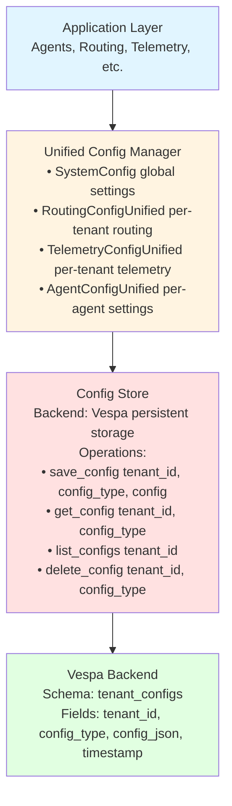
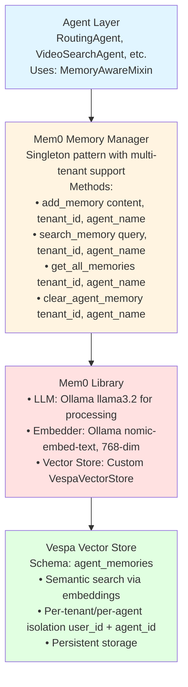
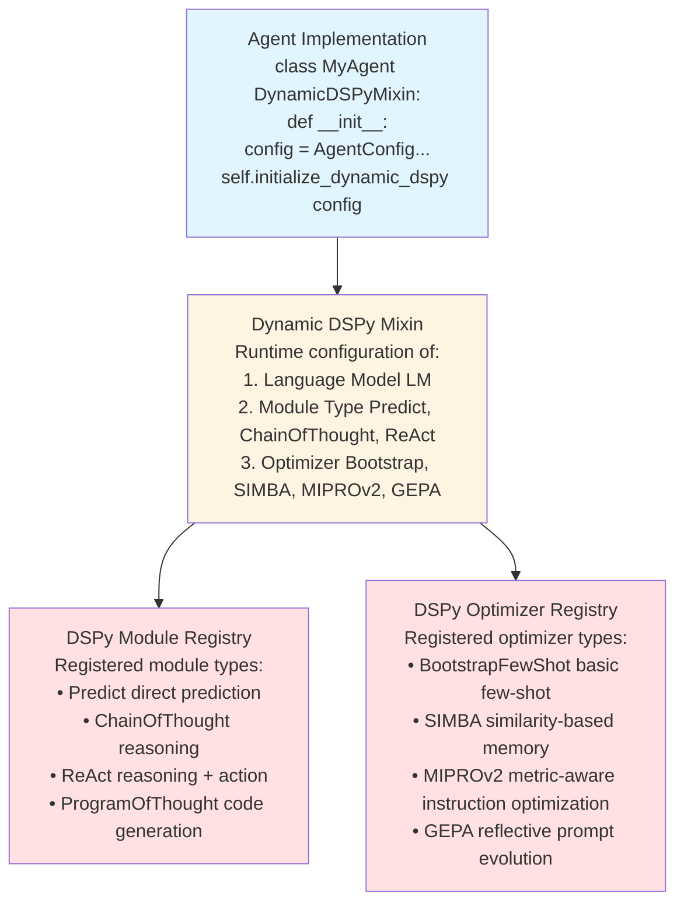

# Common Module Study Guide

**Last Updated:** 2025-10-07
**Purpose:** Comprehensive guide to shared utilities, configuration, and core models

---

## Table of Contents
1. [Module Overview](#module-overview)
2. [Architecture](#architecture)
3. [Core Components](#core-components)
4. [Configuration System](#configuration-system)
5. [Memory Management](#memory-management)
6. [DSPy Integration](#dspy-integration)
7. [Models and Encoders](#models-and-encoders)
8. [Usage Examples](#usage-examples)
9. [Production Considerations](#production-considerations)
10. [Testing](#testing)

---

## Module Overview

### Purpose
The Common Module provides foundational infrastructure shared across all system components, including configuration management, memory systems, DSPy integration, and core models.

### Key Features
- **Unified Configuration**: Multi-tenant config system with Vespa persistence
- **Memory Management**: Mem0-based memory with Vespa backend
- **DSPy Integration**: Dynamic DSPy module/optimizer configuration
- **VideoPrism Encoder**: Text embedding generation for video search
- **Config Store**: Vespa-backed configuration persistence
- **Type Definitions**: Shared data models and enums

### Module Location
`src/common/`

### Key Files
- `unified_config.py` (349 lines) - Multi-tenant configuration system
- `config_store.py` - Vespa-backed config persistence
- `mem0_memory_manager.py` (447 lines) - Mem0 memory integration
- `dynamic_dspy_mixin.py` (247 lines) - DSPy runtime configuration
- `models/videoprism_text_encoder.py` - VideoPrism text embeddings
- `vespa_memory_config.py` - Vespa config for Mem0
- `mem0_vespa_store.py` - Custom Vespa vector store for Mem0

---

## Architecture

### Unified Configuration System



### Memory Management Architecture



### Dynamic DSPy Integration



---

## Core Components

### 1. SystemConfig (unified_config.py:28-115)

**Purpose**: Global system configuration with environment support

**Key Attributes**:
```python
@dataclass
class SystemConfig:
    # Environment
    environment: str = "development"  # development, staging, production

    # Vespa configuration
    vespa_host: str = "localhost"
    vespa_port: int = 8080
    vespa_schema: str = "video_colpali_smol500_mv_frame"

    # Ollama configuration
    ollama_base_url: str = "http://localhost:11434"
    ollama_model: str = "llama3.2"
    ollama_embedding_model: str = "nomic-embed-text"

    # Phoenix configuration
    phoenix_endpoint: str = "http://localhost:6006"
    phoenix_project_prefix: str = "cogniverse"

    # Feature flags
    enable_telemetry: bool = True
    enable_memory: bool = True
    enable_optimization: bool = True

    # Multi-tenancy
    default_tenant_id: str = "default"
    max_tenants: int = 100
```

**Key Methods**:
```python
@classmethod
def from_env(cls) -> "SystemConfig":
    """Load configuration from environment variables"""
    return cls(
        environment=os.getenv("ENVIRONMENT", "development"),
        vespa_host=os.getenv("VESPA_HOST", "localhost"),
        vespa_port=int(os.getenv("VESPA_PORT", "8080")),
        # ... other env vars
    )

def to_dict(self) -> Dict[str, Any]:
    """Convert to dictionary for serialization"""
    return asdict(self)

@classmethod
def from_dict(cls, data: Dict[str, Any]) -> "SystemConfig":
    """Create from dictionary"""
    return cls(**data)
```

**Usage**:
```python
# Load from environment
config = SystemConfig.from_env()

# Override specific settings
config.vespa_host = "prod-vespa.example.com"
config.environment = "production"

# Save to file
config_dict = config.to_dict()
with open("config.json", "w") as f:
    json.dump(config_dict, f)
```

---

### 2. RoutingConfigUnified (unified_config.py:117-236)

**Purpose**: Per-tenant routing configuration with strategy selection

**Key Attributes**:
```python
@dataclass
class RoutingConfigUnified:
    tenant_id: str

    # Routing strategy
    routing_mode: str = "tiered"  # tiered, ensemble, hybrid

    # Tier configuration
    enable_fast_path: bool = True
    fast_path_confidence_threshold: float = 0.7
    slow_path_confidence_threshold: float = 0.6

    # GLiNER configuration
    gliner_model: str = "urchade/gliner_large-v2.1"
    gliner_threshold: float = 0.3
    gliner_labels: List[str] = field(default_factory=list)

    # LLM configuration
    llm_provider: str = "local"
    llm_model: str = "gemma3:4b"
    llm_endpoint: str = "http://localhost:11434"
    llm_use_chain_of_thought: bool = True

    # Optimization
    enable_grpo_optimization: bool = True
    optimization_interval_seconds: int = 3600
    min_samples_for_optimization: int = 50

    # Caching
    enable_caching: bool = True
    cache_ttl_seconds: int = 300
    max_cache_size: int = 1000

    # Custom parameters
    custom_params: Dict[str, Any] = field(default_factory=dict)
```

**Usage**:
```python
# Create tenant-specific routing config
config = RoutingConfigUnified(
    tenant_id="acme-corp",
    routing_mode="ensemble",
    fast_path_confidence_threshold=0.8,  # Higher confidence required
    enable_grpo_optimization=True,
    cache_ttl_seconds=7200  # Longer cache
)

# Save to config store
store = ConfigStore()
store.save_config("acme-corp", "routing", config)

# Load later
loaded = store.get_config("acme-corp", "routing")
```

---

### 3. Mem0MemoryManager (mem0_memory_manager.py:53-447)

**Purpose**: Singleton memory manager using Mem0 with Vespa backend

**Architecture**:
- **Singleton Pattern**: Single instance across application
- **Multi-tenant**: Isolated memories per tenant_id + agent_name
- **Mem0 Integration**: Uses Mem0 for LLM-processed memories
- **Vespa Backend**: Persistent vector storage

**Key Methods**:

```python
def initialize(
    self,
    vespa_host: str = "localhost",
    vespa_port: int = 8080,
    collection_name: str = "agent_memories",
    llm_model: str = "llama3.2",
    embedding_model: str = "nomic-embed-text",
    ollama_base_url: str = "http://localhost:11434/v1"
) -> None:
    """
    Initialize Mem0 with Vespa backend using Ollama

    Configuration:
        • LLM: Ollama llama3.2 for memory processing
        • Embedder: Ollama nomic-embed-text (768-dim)
        • Vector Store: Vespa with custom VespaVectorStore

    Example:
        manager = Mem0MemoryManager()
        manager.initialize(
            vespa_host="localhost",
            vespa_port=8080,
            llm_model="llama3.2",
            embedding_model="nomic-embed-text"
        )
    """

def add_memory(
    self,
    content: str,
    tenant_id: str,
    agent_name: str,
    metadata: Optional[Dict[str, Any]] = None
) -> str:
    """
    Add content to agent's memory

    Process:
        1. Mem0 processes content with LLM
        2. Generates embedding (nomic-embed-text)
        3. Stores in Vespa with tenant/agent isolation

    Args:
        content: Memory content (natural language)
        tenant_id: Tenant identifier
        agent_name: Agent name (e.g., "routing_agent")
        metadata: Optional metadata dict

    Returns:
        Memory ID (string)

    Example:
        memory_id = manager.add_memory(
            content="User prefers detailed technical explanations",
            tenant_id="acme-corp",
            agent_name="routing_agent",
            metadata={"source": "user_feedback"}
        )
    """

def search_memory(
    self,
    query: str,
    tenant_id: str,
    agent_name: str,
    top_k: int = 5
) -> List[Dict[str, Any]]:
    """
    Search agent's memory for relevant content

    Process:
        1. Encode query to embedding
        2. Semantic search in Vespa
        3. Return top_k most similar memories

    Args:
        query: Search query (natural language)
        tenant_id: Tenant identifier
        agent_name: Agent name
        top_k: Number of results

    Returns:
        List of memories with scores:
        [
            {
                "id": "mem_123",
                "memory": "User prefers detailed explanations",
                "score": 0.92,
                "metadata": {...}
            },
            ...
        ]

    Example:
        memories = manager.search_memory(
            query="What are user's preferences?",
            tenant_id="acme-corp",
            agent_name="routing_agent",
            top_k=5
        )

        for mem in memories:
            print(f"{mem['memory']} (score: {mem['score']:.2f})")
    """

def get_all_memories(
    self,
    tenant_id: str,
    agent_name: str
) -> List[Dict[str, Any]]:
    """
    Get all memories for an agent

    Returns:
        List of all memories (no filtering)
    """

def clear_agent_memory(
    self,
    tenant_id: str,
    agent_name: str
) -> bool:
    """
    Clear all memory for an agent

    Use case: Reset agent memory for testing or tenant offboarding
    """

def get_memory_stats(
    self,
    tenant_id: str,
    agent_name: str
) -> Dict[str, Any]:
    """
    Get memory statistics for an agent

    Returns:
        {
            "total_memories": 42,
            "enabled": True,
            "tenant_id": "acme-corp",
            "agent_name": "routing_agent"
        }
    """
```

**Memory Storage Format** (in Vespa):
```json
{
  "id": "mem_abc123",
  "user_id": "acme-corp",
  "agent_id": "routing_agent",
  "memory": "User prefers detailed technical explanations with code examples",
  "embedding": [0.23, -0.15, 0.87, ...],  // 768-dim vector
  "metadata": {
    "source": "user_feedback",
    "timestamp": "2025-10-07T10:30:00Z"
  },
  "hash": "abc123def456"
}
```

---

### 4. DynamicDSPyMixin (dynamic_dspy_mixin.py:16-247)

**Purpose**: Mixin for runtime DSPy module and optimizer configuration

**Key Features**:
- Dynamic module creation (Predict, ChainOfThought, ReAct, etc.)
- Dynamic optimizer creation (Bootstrap, SIMBA, MIPROv2, GEPA)
- Runtime configuration updates
- Module/optimizer caching

**Key Methods**:

```python
def initialize_dynamic_dspy(self, config: AgentConfig):
    """
    Initialize DSPy with dynamic configuration

    Sets up:
        • DSPy LM (language model)
        • Signature registry (for module creation)
        • Module cache
        • Optimizer instance

    Example:
        class MyAgent(DynamicDSPyMixin):
            def __init__(self):
                config = AgentConfig(
                    agent_name="my_agent",
                    llm_model="ollama/llama3.2",
                    module_config=ModuleConfig(
                        module_type=ModuleType.CHAIN_OF_THOUGHT
                    ),
                    optimizer_config=OptimizerConfig(
                        optimizer_type=OptimizerType.MIPROV2
                    )
                )
                self.initialize_dynamic_dspy(config)
    """

def register_signature(self, name: str, signature: Type[dspy.Signature]):
    """
    Register a DSPy signature for module creation

    Example:
        class MySignature(dspy.Signature):
            query = dspy.InputField(desc="User query")
            answer = dspy.OutputField(desc="Answer")

        self.register_signature("my_query", MySignature)
    """

def create_module(
    self,
    signature_name: str,
    module_config: Optional[ModuleConfig] = None
) -> dspy.Module:
    """
    Create DSPy module dynamically

    Module types:
        • Predict: Direct prediction
        • ChainOfThought: Reasoning before answer
        • ReAct: Reasoning + Action + Observation loop
        • ProgramOfThought: Code generation

    Example:
        # Register signature
        self.register_signature("analyze_query", QueryAnalysisSignature)

        # Create ChainOfThought module
        module = self.create_module("analyze_query")

        # Use module
        result = module(query="What is machine learning?")
        print(result.answer)
    """

def create_optimizer(
    self,
    optimizer_config: Optional[OptimizerConfig] = None
) -> Any:
    """
    Create DSPy optimizer dynamically

    Optimizer types:
        • BootstrapFewShot: Basic few-shot learning
        • SIMBA: Similarity-based memory augmentation
        • MIPROv2: Metric-aware instruction optimization
        • GEPA: Reflective prompt evolution

    Example:
        optimizer = self.create_optimizer()

        # Compile module with optimizer
        optimized_module = optimizer.compile(
            module,
            trainset=training_examples,
            max_bootstrapped_demos=4
        )
    """

def update_module_config(self, module_config: ModuleConfig):
    """
    Update module configuration at runtime

    Clears cached modules to force recreation with new config

    Example:
        # Switch from Predict to ChainOfThought
        self.update_module_config(
            ModuleConfig(module_type=ModuleType.CHAIN_OF_THOUGHT)
        )
    """

def get_module_info(self) -> Dict[str, Any]:
    """
    Get current module configuration

    Returns:
        {
            "module_type": "chain_of_thought",
            "registered_signatures": ["analyze_query", "route_query"],
            "cached_modules": ["analyze_query"],
            "llm_model": "ollama/llama3.2",
            "temperature": 0.1
        }
    """
```

**Complete Usage Example**:
```python
from src.common.dynamic_dspy_mixin import DynamicDSPyMixin
from src.common.agent_config import AgentConfig, ModuleConfig, OptimizerConfig
from src.common.agent_config import ModuleType, OptimizerType
import dspy

class SmartAgent(DynamicDSPyMixin):
    def __init__(self):
        # Configure agent
        config = AgentConfig(
            agent_name="smart_agent",
            llm_model="ollama/llama3.2",
            llm_base_url="http://localhost:11434",
            module_config=ModuleConfig(
                module_type=ModuleType.CHAIN_OF_THOUGHT,
                max_retries=3
            ),
            optimizer_config=OptimizerConfig(
                optimizer_type=OptimizerType.MIPROV2,
                max_bootstrapped_demos=4,
                max_labeled_demos=8
            )
        )

        # Initialize dynamic DSPy
        self.initialize_dynamic_dspy(config)

        # Register signatures
        class QueryAnalysisSignature(dspy.Signature):
            query = dspy.InputField(desc="User query to analyze")
            intent = dspy.OutputField(desc="Detected intent")
            confidence = dspy.OutputField(desc="Confidence score")

        self.register_signature("analyze", QueryAnalysisSignature)

    def analyze_query(self, query: str):
        # Get or create module
        module = self.get_or_create_module("analyze")

        # Run inference
        result = module(query=query)
        return result

# Usage
agent = SmartAgent()
result = agent.analyze_query("Find videos about machine learning")
print(f"Intent: {result.intent}, Confidence: {result.confidence}")
```

---

### 5. VideoPrismTextEncoder (models/videoprism_text_encoder.py)

**Purpose**: Text encoder for video search using VideoPrism model

**Key Features**:
- VideoPrism text encoding (768-dim or 1024-dim)
- LRU caching for repeated queries
- Circuit breaker for fault tolerance
- Performance metrics tracking
- Model pooling for concurrent requests

**Key Methods**:

```python
class VideoPrismTextEncoder:
    def __init__(
        self,
        model_name: str = "videoprism_public_v1_base_hf",
        embedding_dim: int = 768,
        cache_size: int = 1000,
        pool_size: int = 1
    ):
        """
        Initialize VideoPrism text encoder

        Args:
            model_name: VideoPrism model variant
            embedding_dim: Output embedding dimension
            cache_size: LRU cache size for queries
            pool_size: Model pool size for concurrency
        """

    def encode(self, text: str) -> np.ndarray:
        """
        Encode text to embedding vector

        Process:
            1. Check cache
            2. Format text with template: "a video of {text}."
            3. Tokenize text
            4. Run through VideoPrism text encoder
            5. Project to target dimension if needed
            6. Cache result

        Args:
            text: Text query to encode

        Returns:
            Embedding vector (numpy array, shape: (embedding_dim,))

        Example:
            encoder = VideoPrismTextEncoder()
            embedding = encoder.encode("person walking in park")
            print(embedding.shape)  # (768,)
        """

    def encode_batch(self, texts: List[str]) -> np.ndarray:
        """
        Encode multiple texts in batch

        More efficient than encoding one-by-one

        Args:
            texts: List of text queries

        Returns:
            Embeddings (numpy array, shape: (len(texts), embedding_dim))

        Example:
            encoder = VideoPrismTextEncoder()
            queries = ["robot playing soccer", "cat sleeping", "car driving"]
            embeddings = encoder.encode_batch(queries)
            print(embeddings.shape)  # (3, 768)
        """

    def health_check(self) -> Dict[str, Any]:
        """
        Check encoder health and get metrics

        Returns:
            {
                "status": "healthy",
                "model": "videoprism_public_v1_base_hf",
                "embedding_dim": 768,
                "metrics": {
                    "total_requests": 1523,
                    "cache_hit_rate": 0.42,
                    "avg_latency_ms": 15.3,
                    "success_rate": 0.998
                }
            }
        """
```

**Performance Characteristics**:
```python
# Latency (without cache)
- Base model (768-dim): ~15-25ms per query
- Large model (1024-dim): ~25-35ms per query
- Batch encoding (10 queries): ~50-80ms total

# Cache performance
- Cache hit latency: <1ms
- Typical hit rate: 35-50% (depends on query diversity)

# Throughput
- Without cache: ~40-60 queries/sec
- With cache (50% hit rate): ~100-150 queries/sec
```

---

### 6. ConfigStore (config_store.py)

**Purpose**: Persistent configuration storage using Vespa backend

**Key Methods**:

```python
class ConfigStore:
    def __init__(
        self,
        vespa_url: str = "http://localhost",
        vespa_port: int = 8080,
        schema_name: str = "tenant_configs"
    ):
        """Initialize config store with Vespa backend"""

    def save_config(
        self,
        tenant_id: str,
        config_type: str,
        config: Union[Dict, BaseConfig]
    ) -> bool:
        """
        Save configuration to Vespa

        Args:
            tenant_id: Tenant identifier
            config_type: Config type (routing, telemetry, agent)
            config: Configuration object or dict

        Returns:
            Success status

        Example:
            store = ConfigStore()

            routing_config = RoutingConfigUnified(
                tenant_id="acme-corp",
                routing_mode="ensemble"
            )

            store.save_config(
                tenant_id="acme-corp",
                config_type="routing",
                config=routing_config
            )
        """

    def get_config(
        self,
        tenant_id: str,
        config_type: str
    ) -> Optional[Dict[str, Any]]:
        """
        Get configuration from Vespa

        Args:
            tenant_id: Tenant identifier
            config_type: Config type

        Returns:
            Configuration dict or None

        Example:
            config = store.get_config("acme-corp", "routing")
            if config:
                routing_config = RoutingConfigUnified.from_dict(config)
        """

    def list_configs(self, tenant_id: str) -> List[str]:
        """
        List all config types for a tenant

        Returns:
            List of config types: ["routing", "telemetry", "agent"]
        """

    def delete_config(
        self,
        tenant_id: str,
        config_type: str
    ) -> bool:
        """Delete configuration"""
```

---

## Configuration System

### Multi-Tenant Configuration Flow

```python
# 1. Load system config (global)
system_config = SystemConfig.from_env()

# 2. Initialize config store
store = ConfigStore(
    vespa_url=system_config.vespa_host,
    vespa_port=system_config.vespa_port
)

# 3. Create tenant-specific configs
routing_config = RoutingConfigUnified(
    tenant_id="acme-corp",
    routing_mode="ensemble",
    enable_grpo_optimization=True,
    fast_path_confidence_threshold=0.8
)

telemetry_config = TelemetryConfigUnified(
    tenant_id="acme-corp",
    phoenix_project_name="cogniverse-acme-corp",
    enable_detailed_tracing=True
)

agent_config = AgentConfigUnified(
    tenant_id="acme-corp",
    agent_name="routing_agent",
    llm_model="llama3.2",
    enable_memory=True
)

# 4. Save to config store
store.save_config("acme-corp", "routing", routing_config)
store.save_config("acme-corp", "telemetry", telemetry_config)
store.save_config("acme-corp", "agent", agent_config)

# 5. Load later (in agent initialization)
loaded_routing = store.get_config("acme-corp", "routing")
routing_config = RoutingConfigUnified.from_dict(loaded_routing)
```

### Environment Variable Overrides

```bash
# System-level
export ENVIRONMENT=production
export VESPA_HOST=prod-vespa.example.com
export VESPA_PORT=8080
export OLLAMA_BASE_URL=http://ollama.internal:11434
export PHOENIX_ENDPOINT=http://phoenix.internal:6006

# Feature flags
export ENABLE_TELEMETRY=true
export ENABLE_MEMORY=true
export ENABLE_OPTIMIZATION=true

# Multi-tenancy
export DEFAULT_TENANT_ID=default
export MAX_TENANTS=100
```

```python
# Load with environment overrides
config = SystemConfig.from_env()
print(config.vespa_host)  # "prod-vespa.example.com"
print(config.environment)  # "production"
```

---

## Memory Management

### Mem0 Integration Details

**Configuration**:
```python
mem0_config = {
    "llm": {
        "provider": "ollama",
        "config": {
            "model": "llama3.2",
            "temperature": 0.1,
            "ollama_base_url": "http://localhost:11434"
        }
    },
    "embedder": {
        "provider": "ollama",
        "config": {
            "model": "nomic-embed-text",
            "ollama_base_url": "http://localhost:11434"
        }
    },
    "vector_store": {
        "provider": "vespa",
        "config": {
            "collection_name": "agent_memories",
            "host": "localhost",
            "port": 8080,
            "embedding_model_dims": 768
        }
    }
}
```

**Memory Processing Flow**:
```
1. add_memory(content="User prefers detailed explanations")
   │
   ▼
2. Mem0 processes with LLM (llama3.2)
   • Extracts key information
   • Removes redundancy
   • Structures memory
   │
   ▼
3. Generate embedding (nomic-embed-text)
   • 768-dimensional vector
   │
   ▼
4. Store in Vespa
   • user_id: tenant_id
   • agent_id: agent_name
   • memory: processed text
   • embedding: vector
   │
   ▼
5. Return memory_id
```

**Search Flow**:
```
1. search_memory(query="What does user prefer?")
   │
   ▼
2. Generate query embedding (nomic-embed-text)
   │
   ▼
3. Vector search in Vespa
   • Cosine similarity
   • Filter by user_id + agent_id
   │
   ▼
4. Return top_k memories with scores
   [
     {"memory": "User prefers detailed explanations", "score": 0.92},
     {"memory": "User interested in technical topics", "score": 0.85}
   ]
```

---

## Usage Examples

### Example 1: Multi-Tenant Configuration

```python
from src.common.unified_config import SystemConfig, RoutingConfigUnified
from src.common.config_store import ConfigStore

# Initialize system
system_config = SystemConfig.from_env()
store = ConfigStore()

# Create configs for multiple tenants
tenants = ["acme-corp", "startup-inc", "enterprise-ltd"]

for tenant_id in tenants:
    # Tenant-specific routing config
    routing_config = RoutingConfigUnified(
        tenant_id=tenant_id,
        routing_mode="tiered",
        fast_path_confidence_threshold=0.75,
        enable_grpo_optimization=True,
        cache_ttl_seconds=3600 if tenant_id == "enterprise-ltd" else 300
    )

    # Save to store
    store.save_config(tenant_id, "routing", routing_config)
    print(f"Saved routing config for {tenant_id}")

# Load tenant config in agent
tenant_id = "acme-corp"
config_dict = store.get_config(tenant_id, "routing")
routing_config = RoutingConfigUnified.from_dict(config_dict)

print(f"Loaded config for {tenant_id}:")
print(f"  Routing mode: {routing_config.routing_mode}")
print(f"  Cache TTL: {routing_config.cache_ttl_seconds}s")
```

### Example 2: Memory-Aware Agent

```python
from src.common.mem0_memory_manager import Mem0MemoryManager

# Initialize memory manager (singleton)
memory = Mem0MemoryManager()
memory.initialize(
    vespa_host="localhost",
    vespa_port=8080,
    llm_model="llama3.2",
    embedding_model="nomic-embed-text"
)

tenant_id = "acme-corp"
agent_name = "routing_agent"

# Add memories from user interactions
memory.add_memory(
    content="User prefers video results over text documents",
    tenant_id=tenant_id,
    agent_name=agent_name,
    metadata={"source": "user_feedback"}
)

memory.add_memory(
    content="User is interested in machine learning tutorials",
    tenant_id=tenant_id,
    agent_name=agent_name,
    metadata={"source": "query_history"}
)

memory.add_memory(
    content="User's technical level: advanced",
    tenant_id=tenant_id,
    agent_name=agent_name,
    metadata={"source": "user_profile"}
)

# Search relevant memories for new query
query = "Find content about neural networks"
relevant_memories = memory.search_memory(
    query=query,
    tenant_id=tenant_id,
    agent_name=agent_name,
    top_k=3
)

print(f"Relevant memories for: '{query}'")
for mem in relevant_memories:
    print(f"  • {mem['memory']} (score: {mem['score']:.2f})")

# Output:
# Relevant memories for: 'Find content about neural networks'
#   • User is interested in machine learning tutorials (score: 0.89)
#   • User's technical level: advanced (score: 0.72)
#   • User prefers video results over text documents (score: 0.65)

# Use memories to enhance routing
preferences = " ".join([m['memory'] for m in relevant_memories])
enhanced_query = f"{query}. Context: {preferences}"
```

### Example 3: Dynamic DSPy Agent

```python
from src.common.dynamic_dspy_mixin import DynamicDSPyMixin
from src.common.agent_config import AgentConfig, ModuleConfig, OptimizerConfig
from src.common.agent_config import ModuleType, OptimizerType
import dspy

class AdaptiveAgent(DynamicDSPyMixin):
    def __init__(self, config: AgentConfig):
        self.initialize_dynamic_dspy(config)

        # Register signatures
        class QueryRoutingSignature(dspy.Signature):
            query = dspy.InputField(desc="User query")
            context = dspy.InputField(desc="Additional context")
            agent = dspy.OutputField(desc="Recommended agent")
            confidence = dspy.OutputField(desc="Confidence score")
            reasoning = dspy.OutputField(desc="Reasoning for decision")

        self.register_signature("route", QueryRoutingSignature)

    def route_query(self, query: str, context: str = ""):
        module = self.get_or_create_module("route")
        result = module(query=query, context=context)
        return result

    def train(self, training_examples):
        # Create optimizer
        optimizer = self.create_optimizer()

        # Get module
        module = self.get_or_create_module("route")

        # Compile with training data
        optimized = optimizer.compile(
            module,
            trainset=training_examples,
            max_bootstrapped_demos=4,
            max_labeled_demos=8
        )

        # Update cached module
        self._dynamic_modules["route"] = optimized
        return optimized

# Usage
config = AgentConfig(
    agent_name="adaptive_router",
    llm_model="ollama/llama3.2",
    module_config=ModuleConfig(
        module_type=ModuleType.CHAIN_OF_THOUGHT
    ),
    optimizer_config=OptimizerConfig(
        optimizer_type=OptimizerType.MIPROV2,
        max_bootstrapped_demos=4
    )
)

agent = AdaptiveAgent(config)

# Initial routing
result = agent.route_query(
    query="Find videos about robotics",
    context="User prefers technical content"
)
print(f"Agent: {result.agent}")
print(f"Confidence: {result.confidence}")
print(f"Reasoning: {result.reasoning}")

# Train with examples
training_data = [
    dspy.Example(
        query="Show me videos about AI",
        context="",
        agent="video_search_agent",
        confidence="0.9"
    ).with_inputs("query", "context"),
    # ... more examples
]

agent.train(training_data)

# Route with optimized module
result = agent.route_query(
    query="Explain machine learning algorithms",
    context=""
)
print(f"Optimized routing: {result.agent}")
```

### Example 4: VideoPrism Text Encoding

```python
from src.common.models.videoprism_text_encoder import VideoPrismTextEncoder, create_text_encoder

# Create encoder
encoder = create_text_encoder(
    model_name="videoprism_public_v1_base_hf",
    embedding_dim=768,
    cache_size=1000
)

# Single query encoding
query = "person walking in park"
embedding = encoder.encode(query)
print(f"Embedding shape: {embedding.shape}")  # (768,)
print(f"Embedding norm: {np.linalg.norm(embedding):.2f}")

# Batch encoding
queries = [
    "robot playing soccer",
    "cat sleeping on couch",
    "car driving on highway",
    "person cooking in kitchen"
]

embeddings = encoder.encode_batch(queries)
print(f"Batch embeddings shape: {embeddings.shape}")  # (4, 768)

# Calculate similarity between queries
from sklearn.metrics.pairwise import cosine_similarity

similarities = cosine_similarity(embeddings)
print("\nQuery similarities:")
for i, q1 in enumerate(queries):
    for j, q2 in enumerate(queries):
        if i < j:
            sim = similarities[i, j]
            print(f"  '{q1}' <-> '{q2}': {sim:.3f}")

# Check encoder health
health = encoder.health_check()
print(f"\nEncoder health:")
print(f"  Status: {health['status']}")
print(f"  Total requests: {health['metrics']['total_requests']}")
print(f"  Cache hit rate: {health['metrics']['cache_hit_rate']:.2%}")
print(f"  Avg latency: {health['metrics']['avg_latency_ms']:.1f}ms")
```

---

## Production Considerations

### Configuration Management

**Best Practices**:
```python
# 1. Use environment-specific configs
environments = {
    "development": {
        "vespa_host": "localhost",
        "ollama_base_url": "http://localhost:11434",
        "enable_telemetry": False
    },
    "staging": {
        "vespa_host": "staging-vespa.internal",
        "ollama_base_url": "http://ollama-staging.internal:11434",
        "enable_telemetry": True
    },
    "production": {
        "vespa_host": "prod-vespa.example.com",
        "ollama_base_url": "http://ollama-prod.internal:11434",
        "enable_telemetry": True
    }
}

env = os.getenv("ENVIRONMENT", "development")
config = SystemConfig(**environments[env])

# 2. Validate configs before use
def validate_config(config: SystemConfig):
    assert config.vespa_host, "Vespa host required"
    assert config.vespa_port > 0, "Valid Vespa port required"
    assert config.ollama_base_url, "Ollama URL required"

    # Test connectivity
    try:
        response = requests.get(f"{config.ollama_base_url}/api/version")
        assert response.status_code == 200
    except:
        raise RuntimeError("Cannot connect to Ollama")

validate_config(config)

# 3. Use config versioning
@dataclass
class VersionedConfig:
    version: str = "v1.0"
    config: SystemConfig

    def is_compatible(self, min_version: str) -> bool:
        return version.parse(self.version) >= version.parse(min_version)
```

### Memory Management Best Practices

```python
# 1. Initialize memory manager once at startup
@lru_cache(maxsize=1)
def get_memory_manager():
    manager = Mem0MemoryManager()
    manager.initialize(
        vespa_host=config.vespa_host,
        vespa_port=config.vespa_port
    )
    return manager

# 2. Use memory sparingly (avoid spam)
class MemoryPolicy:
    def should_store(self, content: str) -> bool:
        # Don't store short or generic content
        if len(content) < 20:
            return False

        # Don't store common phrases
        generic_phrases = ["hello", "thanks", "ok", "yes", "no"]
        if content.lower() in generic_phrases:
            return False

        return True

policy = MemoryPolicy()
if policy.should_store(content):
    memory.add_memory(content, tenant_id, agent_name)

# 3. Periodic memory cleanup
async def cleanup_old_memories():
    """Remove memories older than 90 days"""
    cutoff_date = datetime.now() - timedelta(days=90)

    for tenant_id in get_active_tenants():
        for agent_name in get_agents():
            memories = memory.get_all_memories(tenant_id, agent_name)

            for mem in memories:
                if mem.get("timestamp", datetime.now()) < cutoff_date:
                    memory.delete_memory(mem["id"], tenant_id, agent_name)
```

### Performance Optimization

```python
# 1. Cache VideoPrism encoders
@lru_cache(maxsize=3)
def get_encoder(model_name: str, embedding_dim: int):
    return VideoPrismTextEncoder(model_name, embedding_dim)

# 2. Batch encoding when possible
queries = ["query1", "query2", "query3"]
encoder = get_encoder("videoprism_public_v1_base_hf", 768)

# Bad: One-by-one
embeddings = [encoder.encode(q) for q in queries]  # ~60ms total

# Good: Batch
embeddings = encoder.encode_batch(queries)  # ~25ms total

# 3. Monitor memory usage
stats = memory.get_memory_stats(tenant_id, agent_name)
if stats["total_memories"] > 10000:
    logger.warning(f"High memory count for {tenant_id}/{agent_name}: {stats['total_memories']}")
```

---

## Testing

### Unit Tests
`tests/common/unit/`

### Integration Tests
`tests/common/integration/`

### Example Test
```python
@pytest.mark.integration
async def test_mem0_memory_integration():
    """Test Mem0 memory manager integration"""
    manager = Mem0MemoryManager()
    manager.initialize()

    tenant_id = "test-tenant"
    agent_name = "test-agent"

    # Add memory
    memory_id = manager.add_memory(
        content="User prefers technical explanations",
        tenant_id=tenant_id,
        agent_name=agent_name
    )

    assert memory_id

    # Search memory
    results = manager.search_memory(
        query="What does user prefer?",
        tenant_id=tenant_id,
        agent_name=agent_name
    )

    assert len(results) > 0
    assert "technical" in results[0]["memory"].lower()

    # Cleanup
    manager.clear_agent_memory(tenant_id, agent_name)
```

---

## Next Steps

For related modules:
- **Agents Module** (`01_AGENTS_MODULE.md`) - Uses Common module for config and memory
- **Routing Module** (`02_ROUTING_MODULE.md`) - Uses unified configuration
- **Backends Module** (`04_BACKENDS_MODULE.md`) - Vespa integration details
- **Telemetry Module** (`05_TELEMETRY_MODULE.md`) - Multi-tenant telemetry

---

**Key Takeaways**:
- Common module provides foundational infrastructure for entire system
- Multi-tenant configuration enables per-tenant customization
- Mem0 integration provides persistent, searchable agent memory
- Dynamic DSPy mixin enables runtime module/optimizer configuration
- VideoPrism encoder provides high-quality text embeddings for video search
- Config store enables persistent configuration with Vespa backend
