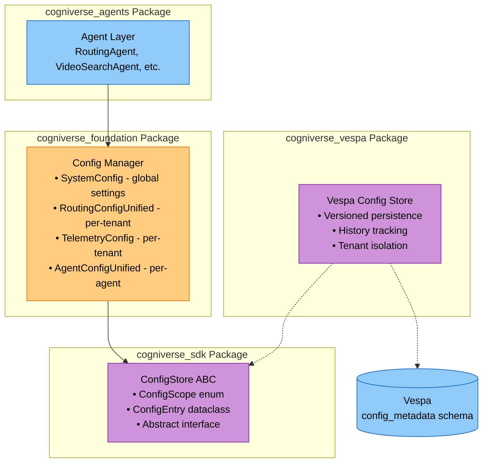
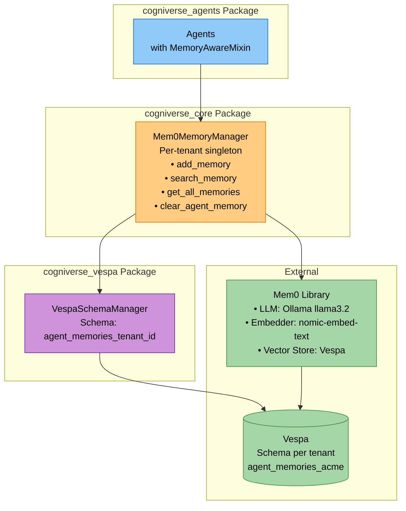
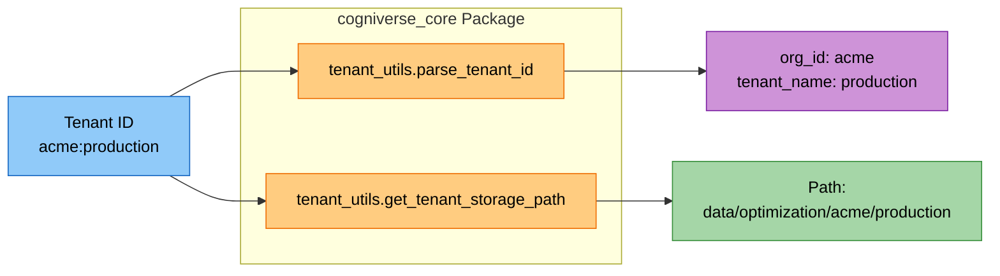
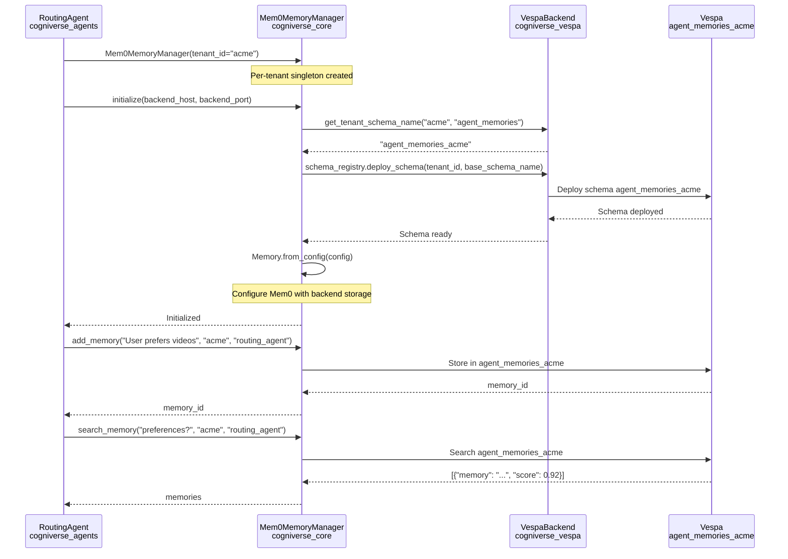

# Common Module Study Guide

**Package:** `cogniverse_core` (Core Layer)
**Location:** `libs/core/cogniverse_core/common/`

> **Note**: Configuration classes (`SystemConfig`, `RoutingConfigUnified`, etc.) are in the Foundation
> layer at `libs/foundation/cogniverse_foundation/config/unified_config.py`, not in Core.

---

## Table of Contents
1. [Module Overview](#module-overview)
2. [Package Architecture](#package-architecture)
3. [Configuration System](#configuration-system)
4. [Memory Management](#memory-management)
5. [Tenant Utilities](#tenant-utilities)
6. [Dynamic DSPy Integration](#dynamic-dspy-integration)
7. [Usage Examples](#usage-examples)
8. [Production Considerations](#production-considerations)
9. [Testing](#testing)

---

## Module Overview

### Purpose
The Common module provides foundational infrastructure shared across all system components in the SDK architecture. It includes multi-tenant configuration management, persistent memory systems, DSPy integration, and tenant isolation utilities.

### Key Features
- **Multi-Tenant Configuration**: Backend-based versioned config with per-tenant isolation (e.g., Vespa)
- **Memory Management**: Mem0-based memory with schema-per-tenant isolation via backend
- **Tenant Utilities**: Org:tenant ID parsing and storage path management
- **DSPy Integration**: Runtime DSPy module/optimizer configuration
- **Config Store**: Versioned configuration persistence with history tracking via `ConfigStore` interface
- **Type Definitions**: Shared data models and configuration schemas

### Package Structure
```text
libs/core/cogniverse_core/
├── common/                           # Shared utilities
│   ├── tenant_utils.py              # Tenant ID parsing and storage paths
│   ├── dynamic_dspy_mixin.py        # DSPy runtime configuration
│   ├── dspy_module_registry.py      # DSPy module/optimizer registry
│   ├── a2a_mixin.py                 # Agent-to-agent communication
│   ├── a2a_utils.py                 # A2A utilities
│   ├── health_mixin.py              # Health check mixin
│   ├── vlm_interface.py             # Vision-language model interface
│   ├── agent_models.py              # Agent data models
│   ├── document.py                  # Document models
│   ├── cache/                       # Caching infrastructure
│   ├── models/                      # Model loaders (VideoPrism, etc.)
│   └── utils/                       # Utility functions
├── memory/                           # Memory management
│   ├── manager.py                   # Mem0MemoryManager
│   ├── backend_config.py            # Backend config for Mem0
│   └── backend_vector_store.py      # Backend vector store adapter
└── config/                           # Backward compatibility shim
    └── __init__.py                  # Re-exports from foundation

# Configuration is provided by:
libs/foundation/cogniverse_foundation/config/
    ├── unified_config.py            # SystemConfig, RoutingConfigUnified
    ├── agent_config.py              # AgentConfig, ModuleConfig, OptimizerConfig
    ├── api_mixin.py                 # Config API mixin
    ├── utils.py                     # create_default_config_manager()
    ├── schema.py                    # Config schemas
    └── manager.py                   # ConfigManager (central API)

# Configuration storage is provided by:
libs/sdk/cogniverse_sdk/interfaces/
    └── config_store.py              # ConfigStore ABC, ConfigScope, ConfigEntry

libs/vespa/cogniverse_vespa/config/
    └── config_store.py              # VespaConfigStore implementation
```

---

## Package Architecture

### Configuration System Architecture



### Memory Management Architecture



### Tenant Utilities Flow



---

## Configuration System

### SystemConfig

**Location:** `libs/foundation/cogniverse_foundation/config/unified_config.py:29-`

**Purpose:** System-level configuration for global settings

**Import:**
```python
from cogniverse_foundation.config.unified_config import SystemConfig
```

**Key Attributes:**
```python
@dataclass
class SystemConfig:
    tenant_id: str = "default"

    # Agent service URLs
    routing_agent_url: str = "http://localhost:8001"
    video_agent_url: str = "http://localhost:8002"
    text_agent_url: str = "http://localhost:8003"
    summarizer_agent_url: str = "http://localhost:8004"
    text_analysis_agent_url: str = "http://localhost:8005"

    # API service URLs
    ingestion_api_url: str = "http://localhost:8000"

    # Search backend
    search_backend: str = "vespa"
    backend_url: str = "http://localhost"
    backend_port: int = 8080
    application_name: str = "cogniverse"
    elasticsearch_url: Optional[str] = None

    # LLM configuration
    llm_model: str = "ollama/gemma3:4b"
    base_url: str = "http://localhost:11434"
    llm_api_key: Optional[str] = None

    # Phoenix/Telemetry
    telemetry_url: str = "http://localhost:6006"
    telemetry_collector_endpoint: str = "localhost:4317"

    # Video processing
    video_processing_profiles: List[str] = field(default_factory=list)

    # Agent Registry
    agents: Dict[str, Dict[str, Any]] = field(default_factory=dict)
    agent_registry_url: str = "http://localhost:8000"

    # Metadata
    environment: str = "development"
    metadata: Dict[str, Any] = field(default_factory=dict)
```

**Methods:**

- `to_dict() -> Dict[str, Any]` - Convert to dictionary
- `from_dict(data: Dict) -> SystemConfig` - Create from dictionary

**Usage:**
```python
from cogniverse_foundation.config.unified_config import SystemConfig

# Create system config
config = SystemConfig(
    tenant_id="acme",
    backend_url="http://prod-vespa.example.com",
    backend_port=8080,
    environment="production"
)

# Serialize
config_dict = config.to_dict()

# Deserialize
loaded_config = SystemConfig.from_dict(config_dict)
```

---

### RoutingConfigUnified

**Location:** `libs/foundation/cogniverse_foundation/config/unified_config.py:136-`

**Purpose:** Per-tenant routing configuration

**Import:**
```python
from cogniverse_foundation.config.unified_config import RoutingConfigUnified
```

**Key Attributes:**
```python
@dataclass
class RoutingConfigUnified:
    tenant_id: str = "default"

    # Routing strategy
    routing_mode: str = "tiered"  # tiered, ensemble, hybrid

    # Tier thresholds
    enable_fast_path: bool = True
    enable_slow_path: bool = True
    enable_fallback: bool = True
    fast_path_confidence_threshold: float = 0.7
    slow_path_confidence_threshold: float = 0.6
    max_routing_time_ms: int = 1000

    # GLiNER configuration (Fast Path)
    gliner_model: str = "urchade/gliner_large-v2.1"
    gliner_threshold: float = 0.3
    gliner_device: str = "cpu"
    gliner_labels: List[str] = field(default_factory=list)

    # LLM configuration (Slow Path)
    llm_provider: str = "local"
    llm_routing_model: str = "ollama/gemma3:4b"
    llm_endpoint: str = "http://localhost:11434"
    llm_temperature: float = 0.1
    llm_max_tokens: int = 150
    use_chain_of_thought: bool = True

    # Optimization
    enable_auto_optimization: bool = True
    optimization_interval_seconds: int = 3600
    min_samples_for_optimization: int = 100
    dspy_enabled: bool = True
    dspy_max_bootstrapped_demos: int = 10
    dspy_max_labeled_demos: int = 50

    # Caching
    enable_caching: bool = True
    cache_ttl_seconds: int = 300
    max_cache_size: int = 1000

    # Metadata
    metadata: Dict[str, Any] = field(default_factory=dict)
```

**Usage:**
```python
from cogniverse_foundation.config.unified_config import RoutingConfigUnified

# Create tenant-specific routing config
config = RoutingConfigUnified(
    tenant_id="acme",
    routing_mode="ensemble",
    fast_path_confidence_threshold=0.8,
    enable_auto_optimization=True,
    cache_ttl_seconds=7200
)
```

---

### TelemetryConfig

**Location:** `libs/foundation/cogniverse_foundation/telemetry/config.py:46-`

**Purpose:** Generic telemetry configuration with persistence support

**Import:**
```python
from cogniverse_foundation.telemetry.config import TelemetryConfig, TelemetryLevel
```

**Key Attributes:**
```python
@dataclass
class TelemetryConfig:
    # Core settings
    enabled: bool = True
    level: TelemetryLevel = TelemetryLevel.DETAILED
    environment: str = "development"

    # OpenTelemetry span export (generic OTLP) - backend-agnostic
    otlp_enabled: bool = True
    otlp_endpoint: str = "localhost:4317"
    otlp_use_tls: bool = False

    # Provider selection (for querying spans/annotations/datasets)
    provider: Optional[str] = None  # "phoenix" | "langsmith" | None (auto-detect)
    provider_config: Dict[str, Any] = field(default_factory=dict)

    # Multi-tenant settings
    tenant_project_template: str = "cogniverse-{tenant_id}"
    tenant_service_template: str = "cogniverse-{tenant_id}-{service}"
    default_tenant_id: str = "default"
    max_cached_tenants: int = 100
    tenant_cache_ttl_seconds: int = 3600

    # Batch export settings
    batch_config: BatchExportConfig = field(default_factory=BatchExportConfig)

    # Service identification
    service_name: str = "video-search"
    service_version: str = "1.0.0"

    # Resource attributes
    extra_resource_attributes: Dict[str, str] = field(default_factory=dict)
```

**Usage:**
```python
from cogniverse_foundation.telemetry.config import TelemetryConfig, TelemetryLevel

# Create telemetry config with OTLP export
config = TelemetryConfig(
    level=TelemetryLevel.DETAILED,
    otlp_enabled=True,
    otlp_endpoint="prod-collector.internal:4317",
    tenant_project_template="cogniverse-{tenant_id}"
)

# Persistence via ConfigManager
config_manager.set_telemetry_config(config, tenant_id="acme")
loaded = config_manager.get_telemetry_config("acme")
```

---

## Memory Management

### Mem0MemoryManager

**Location:** `libs/core/cogniverse_core/memory/manager.py`

**Purpose:** Per-tenant memory management using Mem0 with Vespa backend

**Import:**
```python
from cogniverse_core.memory.manager import Mem0MemoryManager
```

- **Per-Tenant Singleton**: One instance per tenant_id
- **Schema Isolation**: Each tenant gets dedicated Vespa schema: `agent_memories_{tenant_id}`
- **Agent Namespacing**: Within tenant, memories are namespaced by agent_name
- **Mem0 Integration**: Uses Mem0 for LLM-processed memories with semantic search

**Key Methods:**

#### initialize()
```python
def initialize(
    self,
    backend_host: str,
    backend_port: int,
    llm_model: str,
    embedding_model: str,
    llm_base_url: str,
    config_manager,
    schema_loader,
    backend_config_port: Optional[int] = None,
    base_schema_name: str = "agent_memories",
    auto_create_schema: bool = True,
) -> None:
    """
    Initialize Mem0 with backend using tenant-specific schema.

    Configuration:
    - LLM: Configured via llm_model param (e.g. "ollama/llama3.2")
    - Embedder: Configured via embedding_model param (e.g. "nomic-embed-text", 768-dim)
    - Vector Store: Vespa with schema-per-tenant

    All params are required - no defaults for LLM/embedding configuration.

    Example:
        manager = Mem0MemoryManager(tenant_id="acme")
        manager.initialize(
            backend_host="http://localhost",
            backend_port=8080,
            llm_model=config["memory"]["llm_model"],
            embedding_model=config["memory"]["embedding_model"],
            llm_base_url=config["memory"]["llm_base_url"],
            config_manager=config_manager,
            schema_loader=schema_loader,
        )
    """
```

#### add_memory()
```python
def add_memory(
    self,
    content: str,
    tenant_id: str,
    agent_name: str,
    metadata: Optional[Dict[str, Any]] = None,
) -> str:
    """
    Add content to agent's memory.

    Process:
    1. Mem0 processes content with configured LLM
    2. Generates embedding with configured embedding model (768-dim for nomic-embed-text)
    3. Stores in tenant-specific Vespa schema

    Args:
        content: Memory content (natural language)
        tenant_id: Tenant identifier
        agent_name: Agent name (e.g., "routing_agent")
        metadata: Optional metadata dict

    Returns:
        Memory ID (string)

    Example:
        memory_id = manager.add_memory(
            content="User prefers detailed technical explanations",
            tenant_id="acme",
            agent_name="routing_agent",
            metadata={"source": "user_feedback"}
        )
    """
```

#### search_memory()
```python
def search_memory(
    self,
    query: str,
    tenant_id: str,
    agent_name: str,
    top_k: int = 5,
) -> List[Dict[str, Any]]:
    """
    Search agent's memory for relevant content.

    Process:
    1. Encode query to embedding (nomic-embed-text)
    2. Semantic search in tenant's Vespa schema
    3. Return top_k most similar memories

    Args:
        query: Search query (natural language)
        tenant_id: Tenant identifier
        agent_name: Agent name
        top_k: Number of results

    Returns:
        List of memories with scores:
        [
            {
                "id": "mem_123",
                "memory": "User prefers detailed explanations",
                "score": 0.92,
                "metadata": {...}
            },
            ...
        ]

    Example:
        memories = manager.search_memory(
            query="What are user's preferences?",
            tenant_id="acme",
            agent_name="routing_agent",
            top_k=5
        )

        for mem in memories:
            print(f"{mem['memory']} (score: {mem['score']:.2f})")
    """
```

#### get_all_memories()
```python
def get_all_memories(
    self,
    tenant_id: str,
    agent_name: str,
) -> List[Dict[str, Any]]:
    """
    Get all memories for an agent.

    Returns:
        List of all memories (no filtering)
    """
```

#### clear_agent_memory()
```python
def clear_agent_memory(
    self,
    tenant_id: str,
    agent_name: str,
) -> bool:
    """
    Clear all memory for an agent.

    Use case: Reset agent memory for testing or tenant offboarding
    """
```

**Memory Storage Format** (in Vespa):
```json
{
  "id": "mem_abc123",
  "user_id": "acme",
  "agent_id": "routing_agent",
  "memory": "User prefers detailed technical explanations with code examples",
  "embedding": [0.23, -0.15, 0.87, ...],  // 768-dim vector
  "metadata": {
    "source": "user_feedback",
    "timestamp": "2025-10-15T10:30:00Z"
  },
  "hash": "abc123def456"
}
```

**Multi-Tenant Flow:**



---

## Tenant Utilities

### parse_tenant_id()

**Location:** `libs/core/cogniverse_core/common/tenant_utils.py:12-53`

**Purpose:** Parse tenant_id into org_id and tenant_name

**Import:**
```python
from cogniverse_core.common.tenant_utils import parse_tenant_id
```

**Function:**
```python
def parse_tenant_id(tenant_id: str) -> tuple[str, str]:
    """
    Parse tenant_id into org_id and tenant_name.

    Supports two formats:
    - Simple: "acme" → ("acme", "acme")
    - Org:tenant: "acme:production" → ("acme", "production")

    Args:
        tenant_id: Tenant identifier

    Returns:
        Tuple of (org_id, tenant_name)

    Raises:
        ValueError: If tenant_id is empty or has invalid format

    Examples:
        >>> parse_tenant_id("acme")
        ('acme', 'acme')
        >>> parse_tenant_id("acme:production")
        ('acme', 'production')
    """
```

**Usage:**
```python
from cogniverse_core.common.tenant_utils import parse_tenant_id

# Simple format
org_id, tenant_name = parse_tenant_id("acme")
print(f"Org: {org_id}, Tenant: {tenant_name}")
# Output: Org: acme, Tenant: acme

# Org:tenant format
org_id, tenant_name = parse_tenant_id("acme:production")
print(f"Org: {org_id}, Tenant: {tenant_name}")
# Output: Org: acme, Tenant: production
```

---

### get_tenant_storage_path()

**Location:** `libs/core/cogniverse_core/common/tenant_utils.py:55-85`

**Purpose:** Get tenant-specific storage path with org/tenant structure

**Import:**
```python
from cogniverse_core.common.tenant_utils import get_tenant_storage_path
```

**Function:**
```python
def get_tenant_storage_path(base_dir: Path | str, tenant_id: str) -> Path:
    """
    Get tenant-specific storage path with proper org/tenant structure.

    Supports two formats:
    - Simple: "acme" → base_dir/acme/
    - Org:tenant: "acme:production" → base_dir/acme/production/

    Args:
        base_dir: Base storage directory
        tenant_id: Tenant identifier

    Returns:
        Path to tenant-specific storage directory

    Examples:
        >>> get_tenant_storage_path("data/optimization", "acme")
        Path('data/optimization/acme')
        >>> get_tenant_storage_path("data/optimization", "acme:production")
        Path('data/optimization/acme/production')
    """
```

**Usage:**
```python
from pathlib import Path
from cogniverse_core.common.tenant_utils import get_tenant_storage_path

# Simple format
path = get_tenant_storage_path("data/optimization", "acme")
print(path)
# Output: data/optimization/acme

# Org:tenant format
path = get_tenant_storage_path("data/optimization", "acme:production")
print(path)
# Output: data/optimization/acme/production

# Create tenant-specific directory
path.mkdir(parents=True, exist_ok=True)
```

---

### validate_tenant_id()

**Location:** `libs/core/cogniverse_core/common/tenant_utils.py:87-118`

**Purpose:** Validate tenant ID format

**Import:**
```python
from cogniverse_core.common.tenant_utils import validate_tenant_id
```

**Function:**
```python
def validate_tenant_id(tenant_id: str) -> None:
    """
    Validate tenant ID format.

    Raises:
        ValueError: If tenant_id is invalid
    """
```

**Usage:**
```python
from cogniverse_core.common.tenant_utils import validate_tenant_id

# Valid IDs
validate_tenant_id("acme")                  # OK
validate_tenant_id("acme-corp")             # OK
validate_tenant_id("acme_corp")             # OK
validate_tenant_id("acme:production")       # OK
validate_tenant_id("acme-corp:prod-env")    # OK

# Invalid IDs
try:
    validate_tenant_id("")                  # ValueError: empty
except ValueError as e:
    print(f"Error: {e}")

try:
    validate_tenant_id("acme:prod:env")     # ValueError: multiple colons
except ValueError as e:
    print(f"Error: {e}")

try:
    validate_tenant_id("acme@corp")         # ValueError: invalid chars
except ValueError as e:
    print(f"Error: {e}")
```

---

## Dynamic DSPy Integration

### DynamicDSPyMixin

**Location:** `libs/core/cogniverse_core/common/dynamic_dspy_mixin.py:23-255`

**Purpose:** Mixin for runtime DSPy module and optimizer configuration

**Import:**
```python
from cogniverse_core.common.dynamic_dspy_mixin import DynamicDSPyMixin
from cogniverse_foundation.config.agent_config import AgentConfig, ModuleConfig, OptimizerConfig
```

**Key Methods:**

#### initialize_dynamic_dspy()
```python
def initialize_dynamic_dspy(self, config: AgentConfig):
    """
    Initialize DSPy with dynamic configuration.

    Sets up:
    - DSPy LM (language model)
    - Signature registry (for module creation)
    - Module cache
    - Optimizer instance

    Example:
        class MyAgent(DynamicDSPyMixin):
            def __init__(self):
                config = AgentConfig(
                    agent_name="my_agent",
                    agent_version="1.0.0",
                    agent_description="Example agent with dynamic DSPy",
                    agent_url="http://localhost:8000",
                    capabilities=["text_processing"],
                    skills=[],
                    llm_model="ollama/llama3.2",
                    module_config=ModuleConfig(
                        module_type=DSPyModuleType.CHAIN_OF_THOUGHT,
                        signature="default"
                    ),
                    optimizer_config=OptimizerConfig(
                        optimizer_type=OptimizerType.MIPRO_V2
                    )
                )
                self.initialize_dynamic_dspy(config)
    """
```

#### register_signature()
```python
def register_signature(self, name: str, signature: Type[dspy.Signature]):
    """
    Register a DSPy signature for module creation.

    Example:
        class MySignature(dspy.Signature):
            query = dspy.InputField(desc="User query")
            answer = dspy.OutputField(desc="Answer")

        self.register_signature("my_query", MySignature)
    """
```

#### create_module()
```python
def create_module(
    self,
    signature_name: str,
    module_config: Optional[ModuleConfig] = None
) -> dspy.Module:
    """
    Create DSPy module dynamically.

    Module types:
    - Predict: Direct prediction
    - ChainOfThought: Reasoning before answer
    - ReAct: Reasoning + Action + Observation loop
    - MultiChainComparison: Multiple reasoning chains with comparison
    - ProgramOfThought: Code generation

    Example:
        # Register signature
        self.register_signature("analyze_query", QueryAnalysisSignature)

        # Create ChainOfThought module
        module = self.create_module("analyze_query")

        # Use module
        result = module(query="What is machine learning?")
        print(result.answer)
    """
```

#### create_optimizer()
```python
def create_optimizer(
    self,
    optimizer_config: Optional[OptimizerConfig] = None
) -> Any:
    """
    Create DSPy optimizer dynamically.

    Optimizer types:
    - BootstrapFewShot: Basic few-shot learning
    - SIMBA: Similarity-based memory augmentation
    - MIPROv2: Metric-aware instruction optimization
    - GEPA: Reflective prompt evolution

    Example:
        optimizer = self.create_optimizer()

        # Compile module with optimizer
        optimized_module = optimizer.compile(
            module,
            trainset=training_examples,
            max_bootstrapped_demos=4
        )
    """
```

**Complete Usage Example:**
```python
from cogniverse_core.common.dynamic_dspy_mixin import DynamicDSPyMixin
from cogniverse_foundation.config.agent_config import AgentConfig, ModuleConfig, OptimizerConfig
from cogniverse_foundation.config.agent_config import DSPyModuleType, OptimizerType
import dspy

class SmartAgent(DynamicDSPyMixin):
    def __init__(self):
        # Configure agent
        config = AgentConfig(
            agent_name="smart_agent",
            agent_version="1.0.0",
            agent_description="Smart agent with query analysis",
            agent_url="http://localhost:8000",
            capabilities=["query_analysis"],
            skills=[],
            llm_model="ollama/llama3.2",
            llm_base_url="http://localhost:11434",
            module_config=ModuleConfig(
                module_type=DSPyModuleType.CHAIN_OF_THOUGHT,
                signature="analyze",
                max_retries=3
            ),
            optimizer_config=OptimizerConfig(
                optimizer_type=OptimizerType.MIPRO_V2,
                max_bootstrapped_demos=4,
                max_labeled_demos=8
            )
        )

        # Initialize dynamic DSPy
        self.initialize_dynamic_dspy(config)

        # Register signatures
        class QueryAnalysisSignature(dspy.Signature):
            query = dspy.InputField(desc="User query to analyze")
            intent = dspy.OutputField(desc="Detected intent")
            confidence = dspy.OutputField(desc="Confidence score")

        self.register_signature("analyze", QueryAnalysisSignature)

    def analyze_query(self, query: str):
        # Get or create module
        module = self.get_or_create_module("analyze")

        # Run inference
        result = module(query=query)
        return result

# Usage
agent = SmartAgent()
result = agent.analyze_query("Find videos about machine learning")
print(f"Intent: {result.intent}, Confidence: {result.confidence}")
```

---

## Usage Examples

### Example 1: Multi-Tenant Configuration

```python
from cogniverse_foundation.config.utils import create_default_config_manager
from cogniverse_foundation.config.unified_config import SystemConfig

# Initialize config manager
config_manager = create_default_config_manager()

# Create configs for multiple tenants
tenants = ["acme", "acme:production", "acme:staging"]

for tenant_id in tenants:
    # Create tenant-specific system config
    system_config = SystemConfig(
        tenant_id=tenant_id,
        backend_url="http://localhost",
        backend_port=8080,
        environment="production" if "production" in tenant_id else "staging"
    )
    print(f"Created config for {tenant_id}")

# Get tenant config
tenant_id = "acme:production"
system_config = config_manager.get_system_config(tenant_id=tenant_id)
print(f"Loaded config for {tenant_id}:")
print(f"  Backend URL: {system_config.backend_url}")
print(f"  Environment: {system_config.environment}")
```

---

### Example 2: Memory-Aware Agent

```python
from cogniverse_core.memory.manager import Mem0MemoryManager

# Initialize memory manager (per-tenant singleton)
tenant_id = "acme"
memory = Mem0MemoryManager(tenant_id=tenant_id)
memory.initialize(
    backend_host="http://localhost",
    backend_port=8080,
    llm_model=config["memory"]["llm_model"],
    embedding_model=config["memory"]["embedding_model"],
    llm_base_url=config["memory"]["llm_base_url"],
    config_manager=config_manager,
    schema_loader=schema_loader,
)

agent_name = "routing_agent"

# Add memories from user interactions
memory.add_memory(
    content="User prefers video results over text documents",
    tenant_id=tenant_id,
    agent_name=agent_name,
    metadata={"source": "user_feedback"}
)

memory.add_memory(
    content="User is interested in machine learning tutorials",
    tenant_id=tenant_id,
    agent_name=agent_name,
    metadata={"source": "query_history"}
)

memory.add_memory(
    content="User's technical level: advanced",
    tenant_id=tenant_id,
    agent_name=agent_name,
    metadata={"source": "user_profile"}
)

# Search relevant memories for new query
query = "Find content about neural networks"
relevant_memories = memory.search_memory(
    query=query,
    tenant_id=tenant_id,
    agent_name=agent_name,
    top_k=3
)

print(f"Relevant memories for: '{query}'")
for mem in relevant_memories:
    print(f"  • {mem['memory']} (score: {mem['score']:.2f})")

# Output:
# Relevant memories for: 'Find content about neural networks'
#   • User is interested in machine learning tutorials (score: 0.89)
#   • User's technical level: advanced (score: 0.72)
#   • User prefers video results over text documents (score: 0.65)

# Use memories to enhance routing
preferences = " ".join([m['memory'] for m in relevant_memories])
enhanced_query = f"{query}. Context: {preferences}"
```

---

### Example 3: Tenant Storage Paths

```python
from pathlib import Path
from cogniverse_core.common.tenant_utils import (
    parse_tenant_id,
    get_tenant_storage_path,
    validate_tenant_id
)

# Parse tenant IDs
simple_tenant = "acme"
org_tenant = "acme:production"

org_id, tenant_name = parse_tenant_id(simple_tenant)
print(f"Simple: org={org_id}, tenant={tenant_name}")
# Output: Simple: org=acme, tenant=acme

org_id, tenant_name = parse_tenant_id(org_tenant)
print(f"Org:tenant: org={org_id}, tenant={tenant_name}")
# Output: Org:tenant: org=acme, tenant=production

# Get storage paths
base_dir = "data/optimization"

path1 = get_tenant_storage_path(base_dir, simple_tenant)
print(f"Simple path: {path1}")
# Output: Simple path: data/optimization/acme

path2 = get_tenant_storage_path(base_dir, org_tenant)
print(f"Org:tenant path: {path2}")
# Output: Org:tenant path: data/optimization/acme/production

# Create directories
path1.mkdir(parents=True, exist_ok=True)
path2.mkdir(parents=True, exist_ok=True)

# Validate tenant IDs
try:
    validate_tenant_id("acme")                  # Valid
    validate_tenant_id("acme:production")       # Valid
    validate_tenant_id("acme:prod:env")         # Invalid - multiple colons
except ValueError as e:
    print(f"Validation error: {e}")
```

---

## Production Considerations

### Configuration Management Best Practices

**1. Environment-Specific Configs:**
```python
from cogniverse_foundation.config.unified_config import SystemConfig

environments = {
    "development": SystemConfig(
        tenant_id="dev",
        backend_url="http://localhost",
        backend_port=8080,
        environment="development"
    ),
    "staging": SystemConfig(
        tenant_id="staging",
        backend_url="http://staging-vespa.internal",
        backend_port=8080,
        environment="staging"
    ),
    "production": SystemConfig(
        tenant_id="prod",
        backend_url="http://prod-vespa.example.com",
        backend_port=8080,
        environment="production"
    )
}

import os
env = os.getenv("ENVIRONMENT", "development")
config = environments[env]
```

**2. Validate Configs Before Use:**
```python
from cogniverse_foundation.config.unified_config import SystemConfig

def validate_config(config: SystemConfig):
    assert config.backend_url, "Backend URL required"
    assert config.backend_port > 0, "Valid backend port required"
    assert config.llm_model, "LLM model required"

    # Test connectivity
    import requests
    try:
        response = requests.get(f"{config.backend_url}:{config.backend_port}/ApplicationStatus")
        assert response.status_code == 200
    except:
        raise RuntimeError("Cannot connect to Vespa")

config = SystemConfig.from_dict(config_dict)
validate_config(config)
```

### Memory Management Best Practices

**1. Initialize Once at Startup:**
```python
from functools import lru_cache
from cogniverse_core.memory.manager import Mem0MemoryManager

@lru_cache(maxsize=100)  # Cache per tenant
def get_memory_manager(tenant_id: str) -> Mem0MemoryManager:
    manager = Mem0MemoryManager(tenant_id=tenant_id)
    manager.initialize(
        backend_host=config.backend_url,
        backend_port=config.backend_port
    )
    return manager

# Use in agents
memory = get_memory_manager("acme")
```

**2. Memory Storage Policy:**
```python
from cogniverse_core.memory.manager import Mem0MemoryManager

class MemoryPolicy:
    def should_store(self, content: str) -> bool:
        # Don't store short or generic content
        if len(content) < 20:
            return False

        # Don't store common phrases
        generic_phrases = ["hello", "thanks", "ok", "yes", "no"]
        if content.lower() in generic_phrases:
            return False

        return True

memory = Mem0MemoryManager(tenant_id="acme")
memory.initialize()

policy = MemoryPolicy()
content = "User prefers technical content"

if policy.should_store(content):
    memory.add_memory(
        content=content,
        tenant_id="acme",
        agent_name="routing_agent"
    )
```

**3. Periodic Memory Cleanup:**
```python
from datetime import datetime, timedelta
from cogniverse_core.memory.manager import Mem0MemoryManager

async def cleanup_old_memories(tenant_id: str, agent_name: str, days: int = 90):
    """Remove memories older than specified days"""
    memory = Mem0MemoryManager(tenant_id=tenant_id)
    memory.initialize()

    cutoff_date = datetime.now() - timedelta(days=days)

    memories = memory.get_all_memories(tenant_id, agent_name)

    for mem in memories:
        if isinstance(mem, dict):
            timestamp = mem.get("metadata", {}).get("timestamp")
            if timestamp:
                mem_date = datetime.fromisoformat(timestamp)
                if mem_date < cutoff_date:
                    memory.delete_memory(mem["id"], tenant_id, agent_name)
                    print(f"Deleted old memory: {mem['id']}")

# Run cleanup for all tenants
for tenant_id in get_active_tenants():
    await cleanup_old_memories(tenant_id, "routing_agent", days=90)
```

### Tenant Isolation Verification

**1. Verify Schema Isolation:**
```python
from cogniverse_vespa.vespa_schema_manager import VespaSchemaManager
from cogniverse_core.memory.manager import Mem0MemoryManager

schema_manager = VespaSchemaManager(
    backend_endpoint="http://localhost",
    backend_port=8080
)

# Each tenant should have dedicated schema
tenant1 = "acme"
tenant2 = "globex"

schema1 = schema_manager.get_tenant_schema_name(tenant1, "agent_memories")
schema2 = schema_manager.get_tenant_schema_name(tenant2, "agent_memories")

assert schema1 != schema2, "Schemas must be different for different tenants"
assert schema1 == "agent_memories_acme"
assert schema2 == "agent_memories_globex"

print(f"✓ Schema isolation verified: {schema1} vs {schema2}")
```

**2. Verify Memory Isolation:**
```python
from cogniverse_core.memory.manager import Mem0MemoryManager

# Add memory for tenant 1
memory1 = Mem0MemoryManager(tenant_id="acme")
memory1.initialize()
memory1.add_memory(
    content="Secret information for ACME",
    tenant_id="acme",
    agent_name="routing_agent"
)

# Try to search from tenant 2
memory2 = Mem0MemoryManager(tenant_id="globex")
memory2.initialize()
results = memory2.search_memory(
    query="secret information",
    tenant_id="globex",
    agent_name="routing_agent"
)

# Should NOT find tenant 1's memory
assert len(results) == 0, "Cross-tenant memory leak detected!"
print("✓ Memory isolation verified")
```

---

## Testing

### Unit Tests

**Key Test Files:**

- `tests/common/unit/test_vespa_config_store.py` - Configuration storage tests
- `tests/memory/unit/test_mem0_memory_manager.py` - Memory manager tests
- `tests/common/unit/test_tenant_utils.py` - Tenant utilities tests
- `tests/common/unit/test_dynamic_dspy_mixin.py` - DSPy mixin tests
- `tests/common/unit/test_agent_config.py` - Agent configuration tests
- `tests/common/unit/test_config_api_mixin.py` - Config API mixin tests

### Integration Tests

**Key Test Files:**

- `tests/common/integration/test_config_persistence.py` - Config persistence with backend
- `tests/common/integration/test_dynamic_config_integration.py` - Dynamic config integration
- `tests/memory/integration/test_mem0_vespa_integration.py` - Memory manager with Vespa backend
- `tests/memory/integration/test_mem0_complete_e2e.py` - Complete memory system end-to-end tests
- `tests/backends/integration/test_tenant_schema_lifecycle.py` - Multi-tenant schema isolation verification

### Example Test

```python
import pytest
from cogniverse_core.memory.manager import Mem0MemoryManager
from cogniverse_core.common.tenant_utils import parse_tenant_id, get_tenant_storage_path

@pytest.mark.integration
async def test_mem0_memory_integration():
    """Test Mem0 memory manager integration"""
    tenant_id = "test-tenant"
    agent_name = "test-agent"

    manager = Mem0MemoryManager(tenant_id=tenant_id)
    manager.initialize()

    # Add memory
    memory_id = manager.add_memory(
        content="User prefers technical explanations",
        tenant_id=tenant_id,
        agent_name=agent_name
    )

    assert memory_id

    # Search memory
    results = manager.search_memory(
        query="What does user prefer?",
        tenant_id=tenant_id,
        agent_name=agent_name
    )

    assert len(results) > 0
    assert "technical" in results[0]["memory"].lower()

    # Cleanup
    manager.clear_agent_memory(tenant_id, agent_name)

@pytest.mark.unit
def test_tenant_id_parsing():
    """Test tenant ID parsing"""
    # Simple format
    org_id, tenant_name = parse_tenant_id("acme")
    assert org_id == "acme"
    assert tenant_name == "acme"

    # Org:tenant format
    org_id, tenant_name = parse_tenant_id("acme:production")
    assert org_id == "acme"
    assert tenant_name == "production"

    # Invalid format
    with pytest.raises(ValueError):
        parse_tenant_id("")

    with pytest.raises(ValueError):
        parse_tenant_id("acme:prod:env")

@pytest.mark.unit
def test_tenant_storage_path():
    """Test tenant storage path generation"""
    from pathlib import Path

    # Simple format
    path = get_tenant_storage_path("data/optimization", "acme")
    assert path == Path("data/optimization/acme")

    # Org:tenant format
    path = get_tenant_storage_path("data/optimization", "acme:production")
    assert path == Path("data/optimization/acme/production")
```

---

## Next Steps

For related modules:

- **Agents Module** (`agents.md`) - Uses Common module for config and memory (libs/agents/cogniverse_agents/)

- **Backends Module** (`backends.md`) - Vespa integration details (libs/vespa/cogniverse_vespa/)

- **Telemetry Module** (`telemetry.md`) - Multi-tenant telemetry (libs/foundation/cogniverse_foundation/telemetry/)

- **SDK Architecture** (`../architecture/sdk-architecture.md`) - UV workspace and package structure

- **Multi-Tenant Architecture** (`../architecture/multi-tenant.md`) - Tenant isolation patterns

---

## Key Takeaways

1. **SDK Package Structure**
   - Common utilities in `libs/core/cogniverse_core/common/`
   - Configuration in `libs/core/cogniverse_core/config/`
   - Import from `cogniverse_core` package

2. **Multi-Tenant Configuration**
   - Backend-based versioned configuration storage (e.g., Vespa)
   - Per-tenant configuration with history tracking
   - ConfigScope for service/agent/system level configs

3. **Memory Management**
   - Per-tenant singleton pattern: `Mem0MemoryManager(tenant_id="acme")`
   - Schema-per-tenant isolation: `agent_memories_{tenant_id}`
   - Mem0 integration with Vespa backend

4. **Tenant Utilities**
   - Two formats: simple ("acme") and org:tenant ("acme:production")
   - Storage path management with org/tenant structure
   - Validation utilities for tenant IDs

5. **DSPy Integration**
   - Runtime module/optimizer configuration
   - DynamicDSPyMixin for agent integration
   - Module types: Predict, ChainOfThought, ReAct, ProgramOfThought

6. **Production Readiness**
   - Configuration versioning with rollback support
   - Memory cleanup policies
   - Tenant isolation verification
   - Health checks and monitoring
