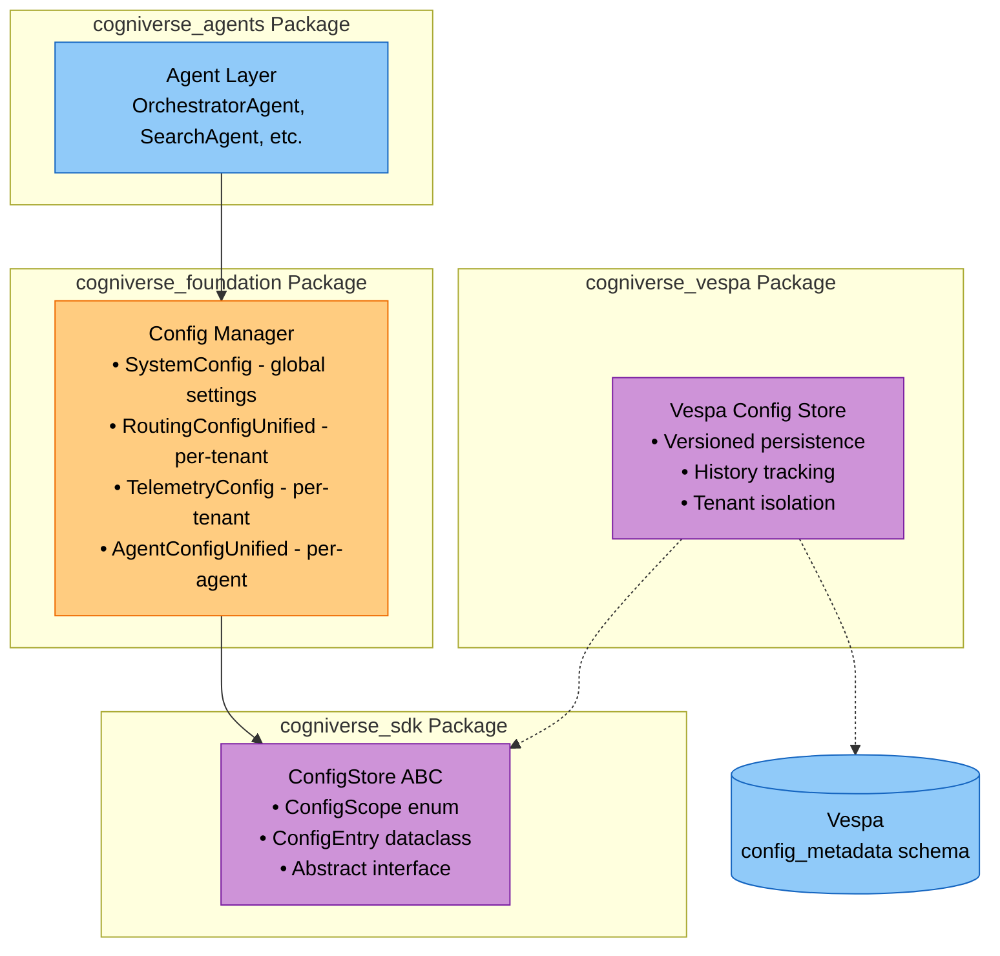
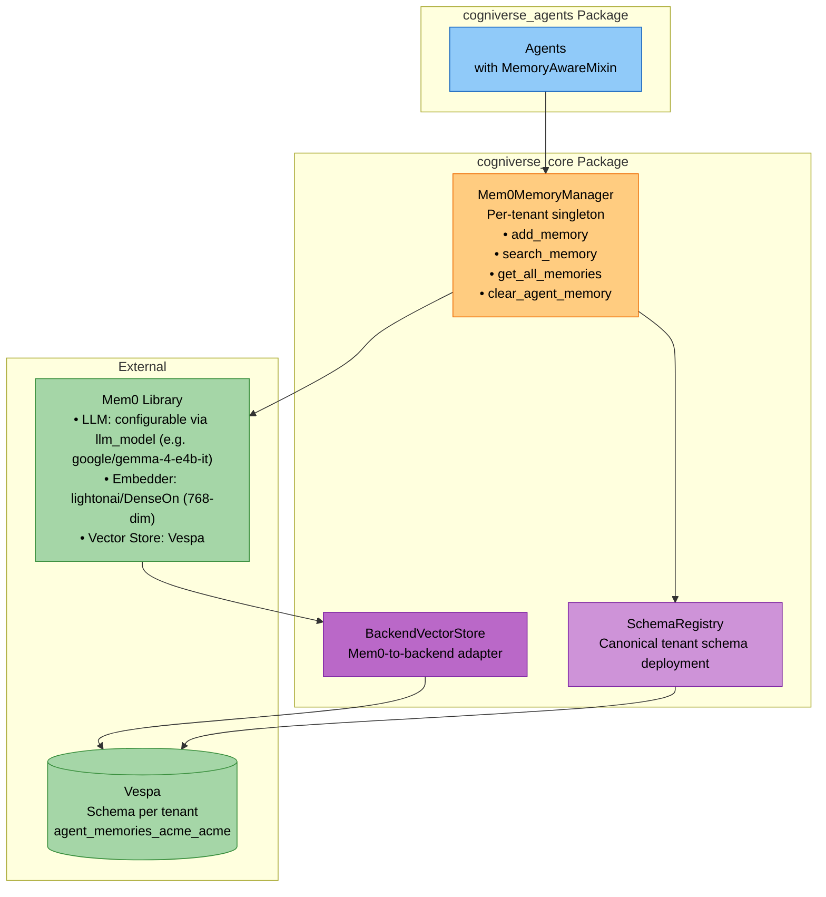
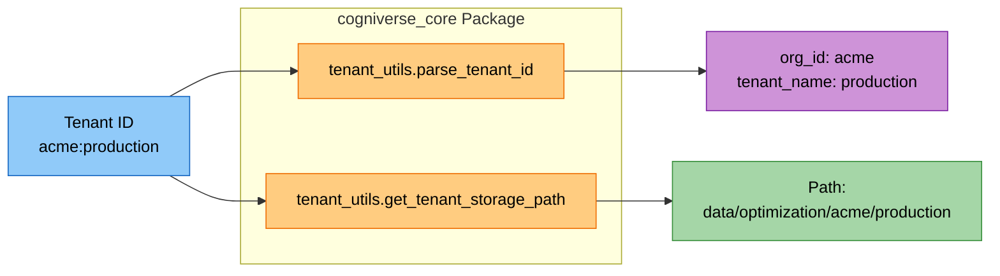
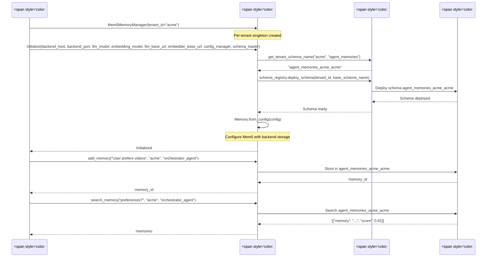

# Common Module Study Guide

**Package:** `cogniverse_core` (Core Layer)
**Location:** `libs/core/cogniverse_core/common/`

> **Note**: Configuration classes (`SystemConfig`, `RoutingConfigUnified`, etc.) are in the Foundation
> layer at `libs/foundation/cogniverse_foundation/config/unified_config.py`, not in Core.

---

## Table of Contents
1. [Module Overview](#module-overview)
2. [Package Architecture](#package-architecture)
3. [Configuration System](#configuration-system)
4. [Memory Management](#memory-management)
5. [Tenant Utilities](#tenant-utilities)
6. [Media Access](#media-access)
7. [Dynamic DSPy Integration](#dynamic-dspy-integration)
8. [Usage Examples](#usage-examples)
9. [Production Considerations](#production-considerations)
10. [Shared Inference Test Services](#shared-inference-test-services)
11. [Testing](#testing)

---

## Module Overview

### Purpose
The Common module provides foundational infrastructure shared across all system components in the SDK architecture. It includes multi-tenant configuration management, persistent memory systems, DSPy integration, and tenant isolation utilities.

### Key Features
- **Multi-Tenant Configuration**: Backend-based versioned config with per-tenant isolation (e.g., Vespa)
- **Memory Management**: Mem0-based memory with schema-per-tenant isolation via backend
- **Tenant Utilities**: Org:tenant ID parsing and storage path management
- **DSPy Integration**: Runtime DSPy module/optimizer configuration
- **Config Store**: Versioned configuration persistence with history tracking via `ConfigStore` interface
- **Type Definitions**: Shared data models and configuration schemas

### Package Structure
```text
libs/core/cogniverse_core/
├── common/                           # Shared utilities
│   ├── tenant_utils.py              # Foundation tenant-helper re-exports and registry checks
│   ├── dynamic_dspy_mixin.py        # DSPy runtime configuration
│   ├── dspy_module_registry.py      # Foundation DSPy registry re-exports
│   ├── health_mixin.py              # Health check mixin
│   ├── vlm_interface.py             # Vision-language model interface
│   ├── agent_models.py              # Agent data models
│   ├── cache/                       # Caching infrastructure
│   ├── media/                       # Media URI dispatch (file://, pvc://, s3://, http://)
│   ├── models/                      # Model loaders (X-CLIP, etc.)
│   └── utils/                       # Utility functions
└── memory/                           # Memory management
    ├── manager.py                   # Mem0MemoryManager
    ├── backend_config.py            # Backend config for Mem0
    ├── backend_vector_store.py      # Backend vector store adapter
    ├── _timestamps.py               # Epoch/ISO timestamp normalization helpers
    ├── mem0_embedder.py             # DenseOnMem0Embedder (registers DenseOn as a Mem0 embedder provider)
    ├── schema.py                    # KnowledgeSchema, KnowledgeRegistry, Retention, Sensitivity, Pinnable
    ├── provenance.py                # Provenance, CitationRef, CitationGraph, ProvenanceWalker
    ├── provenance_store.py          # ProvenanceStore (persisted provenance records)
    ├── trust.py                     # TrustRecord, compute_initial_trust, rank_with_trust
    ├── contradiction.py             # ContradictionDetector, ConflictSet, reconcile()
    ├── federation.py                # FederationService (org-trunk + tenant overlays, cross-tenant ACLs)
    ├── pinning.py                   # PinService, PinQuotas, PinRecord
    └── lifecycle_scheduler.py       # LifecycleScheduler (schema-driven periodic cleanup)

# Configuration lives in cogniverse-foundation:
libs/foundation/cogniverse_foundation/config/
    ├── unified_config.py            # SystemConfig, RoutingConfigUnified
    ├── agent_config.py              # AgentConfig, ModuleConfig, OptimizerConfig
    ├── api_mixin.py                 # Config API mixin
    ├── utils.py                     # create_default_config_manager()
    └── manager.py                   # ConfigManager (central API)

# Configuration storage is provided by:
libs/sdk/cogniverse_sdk/interfaces/
    └── config_store.py              # ConfigStore ABC, ConfigScope, ConfigEntry

libs/vespa/cogniverse_vespa/config/
    └── config_store.py              # VespaConfigStore implementation
```

### Public API Reference

The tables below cover every public class, function, and runtime constant in
`cogniverse_core.common`. Detailed examples for tenant, media, and DSPy APIs
follow later in this guide; the cache and model tables provide the complete
surface without repeating their implementation guides.

| Module | Public API | Purpose |
| --- | --- | --- |
| `agent_models` | `DEFAULT_AGENT_CALL_TIMEOUT_SECONDS`, `AgentEndpoint` | Agent endpoint timeout and health-aware endpoint configuration. |
| `dynamic_dspy_mixin` | `DynamicDSPyMixin` | Runtime DSPy LM, signature, module, and optimizer configuration. |
| `dspy_module_registry` | `DSPyModuleRegistry`, `DSPyOptimizerRegistry` | Re-exports of the Foundation registries used by the mixin. |
| `health_mixin` | `HealthCheckMixin` | Standard component health-check behavior. |
| `tenant_utils` | `SYSTEM_TENANT_ID`, `TEST_TENANT_ID`, `parse_tenant_id`, `canonical_tenant_id`, `get_tenant_storage_path`, `validate_tenant_id`, `require_tenant_id`, `sanitize_k8s_label_value`, `invalidate_tenant_exists`, `assert_tenant_exists` | Pure tenant helpers re-exported from Foundation plus Core's tenant-registry existence cache. |
| `vlm_interface` | `VisualAnalysisSignature`, `VLMInterface` | DSPy signature and interface for vision-language analysis. |

| Cache module | Public API | Purpose |
| --- | --- | --- |
| `cache.base` | `CacheBackend`, `BackendConfig`, `CacheConfig`, `CacheManager` | Backend contract, shared configuration, and tiered cache coordination. |
| `cache.pipeline_cache` | `PipelineArtifactCache` | Cache facade for video-processing artifacts. |
| `cache.registry` | `CacheBackendRegistry` | Cache-backend plugin registration and lookup. |
| `cache.backends.s3` | `S3CacheBackendConfig`, `S3CacheBackend` | S3-compatible object-store cache. |
| `cache.backends.structured_filesystem` | `StructuredFilesystemConfig`, `StructuredFilesystemBackend` | Readable filesystem namespaces with reversible key leaves. |

| Media module | Public API | Purpose |
| --- | --- | --- |
| `media.cache` | `MediaCache` | Tenant-scoped content-addressed local cache. |
| `media.config` | `S3BackendConfig`, `HttpBackendConfig`, `MediaCacheConfig`, `MediaConfig` | S3, HTTP, cache, and aggregate media configuration. |
| `media.keyframes` | `keyframe_object_key`, `keyframe_uri` | Canonical keyframe object keys and S3 URIs. |
| `media.locator` | `LOCAL_SCHEMES`, `PVC_SCHEME`, `NETWORK_SCHEMES`, `S3_CONNECT_TIMEOUT_S`, `S3_READ_TIMEOUT_S`, `S3_MAX_ATTEMPTS`, `NETWORK_FETCH_DEADLINE_S`, `DEFAULT_VIDEO_EXTENSIONS`, `MediaStat`, `MediaLocator` | Supported schemes, bounded network settings, media metadata, and URI localization. |

| Model module | Public API | Purpose |
| --- | --- | --- |
| `models.model_loaders` | `ModelLoader`, `ColPaliModelLoader`, `ColQwenModelLoader`, `ColBERTModelLoader`, `ModelLoaderFactory`, `get_or_load_model`, `is_remote_only_model` | Local loader contracts, concrete loaders, loader selection, and cache lookup. |
| `models.model_loaders` | `RemoteInferenceClient`, `RemoteColPaliLoader`, `RemoteXClipLoader`, `RemoteColBERTLoader`, `RemoteWhisperLoader`, `RemoteGlinerClient`, `get_or_load_gliner` | Authenticated remote inference clients and cached GLiNER resolution. |
| `models.semantic_embedder` | `SemanticEmbedder`, `LocalSentenceTransformerEmbedder`, `RemoteOpenAIEmbedder`, `get_semantic_embedder`, `reset_semantic_embedder_cache` | Local or OpenAI-compatible semantic embedding and cache control. |

| Utility module | Public API | Purpose |
| --- | --- | --- |
| `utils.async_bridge` | `run_coro_blocking` | Run a coroutine from synchronous code, including callers already on an event-loop thread. |
| `utils.async_polling` | `wait_for_retry_backoff` | Async exponential or linear retry delay. |
| `utils.circuit_breaker` | `CircuitState`, `CircuitOpenError`, `BreakerConfig`, `CircuitBreaker`, `circuit_breaker` | Per-dependency circuit-breaker state and decorator. |
| `utils.output_manager` | `OutputManager`, `get_output_manager` | Output-directory management and singleton lookup. |
| `utils.retry` | `RetryConfig`, `retry_with_backoff`, `RetryableOperation`, `create_retry_decorator` | Retry configuration, decorator, context manager, and configured decorator factory. |

---

## Package Architecture

### Configuration System Architecture


```mermaid
flowchart TB
    subgraph "cogniverse_agents Package"
        AgentLayer["<span style='color:#000'>Agent Layer<br/>OrchestratorAgent, SearchAgent, etc.</span>"]
    end

    subgraph "cogniverse_foundation Package"
        ConfigManager["<span style='color:#000'>Config Manager<br/>• SystemConfig - global settings<br/>• RoutingConfigUnified - per-tenant<br/>• TelemetryConfig - per-tenant<br/>• AgentConfigUnified - per-agent</span>"]
    end

    subgraph "cogniverse_sdk Package"
        ConfigStoreABC["<span style='color:#000'>ConfigStore ABC<br/>• ConfigScope enum<br/>• ConfigEntry dataclass<br/>• Abstract interface</span>"]
    end

    subgraph "cogniverse_vespa Package"
        VespaConfigStore["<span style='color:#000'>Vespa Config Store<br/>• Versioned persistence<br/>• History tracking<br/>• Tenant isolation</span>"]
    end

    AgentLayer --> ConfigManager
    ConfigManager --> ConfigStoreABC
    VespaConfigStore -.-> ConfigStoreABC
    VespaConfigStore -.-> Vespa[("<span style='color:#000'>Vespa<br/>config_metadata schema</span>")]

    style AgentLayer fill:#90caf9,stroke:#1565c0,color:#000
    style ConfigManager fill:#ffcc80,stroke:#ef6c00,color:#000
    style ConfigStoreABC fill:#ce93d8,stroke:#7b1fa2,color:#000
    style VespaConfigStore fill:#ce93d8,stroke:#7b1fa2,color:#000
    style Vespa fill:#90caf9,stroke:#1565c0,color:#000
```

### Memory Management Architecture


```mermaid
flowchart TB
    subgraph "cogniverse_agents Package"
        AgentLayer["<span style='color:#000'>Agents<br/>with MemoryAwareMixin</span>"]
    end

    subgraph "cogniverse_core Package"
        MemoryManager["<span style='color:#000'>Mem0MemoryManager<br/>Per-tenant singleton<br/>• add_memory<br/>• search_memory<br/>• get_all_memories<br/>• clear_agent_memory</span>"]
        SchemaRegistry["<span style='color:#000'>SchemaRegistry<br/>Canonical tenant schema deployment</span>"]
        BackendStore["<span style='color:#000'>BackendVectorStore<br/>Mem0-to-backend adapter</span>"]
    end

    subgraph External
        Mem0Lib["<span style='color:#000'>Mem0 Library<br/>• LLM: configurable via llm_model (e.g. google/gemma-4-e4b-it)<br/>• Embedder: lightonai/DenseOn (768-dim)<br/>• Vector Store: Vespa</span>"]
        VespaDB[("<span style='color:#000'>Vespa<br/>Schema per tenant<br/>agent_memories_acme_acme</span>")]
    end

    AgentLayer --> MemoryManager
    MemoryManager --> SchemaRegistry
    MemoryManager --> Mem0Lib
    SchemaRegistry --> VespaDB
    Mem0Lib --> BackendStore
    BackendStore --> VespaDB

    style AgentLayer fill:#90caf9,stroke:#1565c0,color:#000
    style MemoryManager fill:#ffcc80,stroke:#ef6c00,color:#000
    style SchemaRegistry fill:#ce93d8,stroke:#7b1fa2,color:#000
    style BackendStore fill:#ba68c8,stroke:#7b1fa2,color:#000
    style Mem0Lib fill:#a5d6a7,stroke:#388e3c,color:#000
    style VespaDB fill:#a5d6a7,stroke:#388e3c,color:#000
```

### Tenant Utilities Flow


```mermaid
flowchart LR
    TenantID["<span style='color:#000'>Tenant ID<br/>acme:production</span>"]

    subgraph "cogniverse_core Package"
        Parse["<span style='color:#000'>tenant_utils.parse_tenant_id</span>"]
        StoragePath["<span style='color:#000'>tenant_utils.get_tenant_storage_path</span>"]
    end

    OrgTenant["<span style='color:#000'>org_id: acme<br/>tenant_name: production</span>"]
    Path["<span style='color:#000'>Path:<br/>data/optimization/acme/production</span>"]

    TenantID --> Parse --> OrgTenant
    TenantID --> StoragePath --> Path

    style TenantID fill:#90caf9,stroke:#1565c0,color:#000
    style Parse fill:#ffcc80,stroke:#ef6c00,color:#000
    style StoragePath fill:#ffcc80,stroke:#ef6c00,color:#000
    style OrgTenant fill:#ce93d8,stroke:#7b1fa2,color:#000
    style Path fill:#a5d6a7,stroke:#388e3c,color:#000
```

---

## Configuration System

### SystemConfig

**Location:** `libs/foundation/cogniverse_foundation/config/unified_config.py`

**Purpose:** System-level configuration for global settings

**Import:**
```python
from cogniverse_foundation.config.unified_config import SystemConfig
```

**Key Attributes:**
```text
@dataclass
class SystemConfig:
    # Agent service URLs
    video_agent_url: str = "http://localhost:8002"
    summarizer_agent_url: str = "http://localhost:8004"

    # API service URLs
    ingestion_api_url: str = "http://localhost:8000"

    # Search backend
    search_backend: str = "vespa"
    backend_url: str = "http://localhost"
    backend_port: int = 8080
    application_name: str = "cogniverse"

    # LLM configuration
    llm_model: str = "google/gemma-4-e4b-it"
    llm_engine: str = "vllm"
    base_url: str = "http://localhost:8101/v1"
    llm_api_key: Optional[str] = None

    # Opt-in routing of LLM calls through an OpenAI-compatible semantic
    # router. Disabled by default.
    semantic_router: SemanticRouterConfig = field(default_factory=SemanticRouterConfig)

    # Phoenix/Telemetry
    telemetry_url: str = "http://localhost:6006"
    telemetry_collector_endpoint: str = "localhost:4317"

    # Video processing
    video_processing_profiles: List[str] = field(default_factory=list)

    # Agent Registry - structured config for all agents
    agents: Dict[str, Dict[str, Any]] = field(default_factory=dict)
    agent_registry_url: str = "http://localhost:8000"

    # Inference-service routing (per-model endpoint resolution)
    colpali_inference_url: str = ""
    inference_service_urls: Dict[str, str] = field(default_factory=dict)

    # Orchestrator iterative-retrieval-loop tuning. Deployed runtimes can
    # override via ITER_RETRIEVAL_MAX_ITER / ITER_RETRIEVAL_TOKEN_BUDGET /
    # ITER_RETRIEVAL_WALL_CLOCK_MS env vars (read once at runtime startup);
    # the chart sets ITER_RETRIEVAL_WALL_CLOCK_MS from
    # runtime.iterRetrieval.wallClockMs (default 120000 — the 30s library
    # default assumes a faster LM than the in-cluster one).
    iter_retrieval_max_iter: int = 3
    iter_retrieval_token_budget: int = 8000
    iter_retrieval_wall_clock_ms: int = 30000

    # Cross-pod routing and durability (empty = in-pod InboundQueueRegistry)
    redis_url: str = ""

    # Finetuning adapter resolver local cache directory
    adapter_cache_dir: str = ""

    # MinIO object-store endpoint for the ingestion upload path
    minio_endpoint: str = ""

    # Metadata
    environment: str = "development"
    metadata: Dict[str, Any] = field(default_factory=dict)
```

**Methods:**

- `to_dict() -> Dict[str, Any]` - Convert to dictionary
- `from_dict(data: Dict) -> SystemConfig` - Create from dictionary

**Usage:**
```python
from cogniverse_foundation.config.unified_config import SystemConfig

# Create global system config (no tenant_id field — SystemConfig is deployment-wide)
config = SystemConfig(
    backend_url="http://prod-vespa.example.com",
    backend_port=8080,
    environment="production"
)

# Serialize
config_dict = config.to_dict()

# Deserialize
loaded_config = SystemConfig.from_dict(config_dict)
```

---

### RoutingConfigUnified

**Location:** `libs/foundation/cogniverse_foundation/config/unified_config.py`

**Purpose:** Per-tenant routing configuration

**Import:**
```python
from cogniverse_foundation.config.unified_config import RoutingConfigUnified
```

**Key Attributes:**
```text
@dataclass
class RoutingConfigUnified:
    tenant_id: Optional[str] = None  # required — __post_init__ raises ValueError if None

    # Only "tiered" changes dispatch behavior. Other values are accepted by
    # the schema but do not select another implemented routing strategy.
    routing_mode: str = "tiered"

    # Fast-path routing
    enable_fast_path: bool = True
    fast_path_confidence_threshold: float = 0.4

    # GLiNER configuration (Fast Path)
    gliner_model: str = "urchade/gliner_large-v2.1"
    gliner_threshold: float = 0.3
    gliner_device: str = "cpu"

    # Optimization
    enable_auto_optimization: bool = True
    optimization_interval_seconds: int = 3600
    min_samples_for_optimization: int = 100
    min_unique_queries: int = 3

    # Optional per-optimizer overrides. Missing keys fall back to the global
    # 100/3 defaults; query_enhancement keeps the global floor.
    optimizer_floors: Dict[str, Dict[str, int]] = field(default_factory=dict)

    # Metadata
    metadata: Dict[str, Any] = field(default_factory=dict)
```

**Usage:**
```python
from cogniverse_foundation.config.unified_config import RoutingConfigUnified

# Create tenant-specific routing config
config = RoutingConfigUnified(
    tenant_id="acme",
    routing_mode="tiered",
    fast_path_confidence_threshold=0.8,
    enable_auto_optimization=True,
)
```

---

### TelemetryConfig

**Location:** `libs/foundation/cogniverse_foundation/telemetry/config.py:46-`

**Purpose:** Generic telemetry configuration with persistence support

**Import:**
```python
from cogniverse_foundation.telemetry.config import TelemetryConfig, TelemetryLevel
```

**Key Attributes:**
```text
@dataclass
class TelemetryConfig:
    # Core settings
    enabled: bool = True
    level: TelemetryLevel = TelemetryLevel.DETAILED
    environment: str = "development"

    # OpenTelemetry span export (generic OTLP) - backend-agnostic
    otlp_enabled: bool = True
    otlp_endpoint: str = "localhost:4317"
    otlp_use_tls: bool = False

    # Provider selection (for querying spans/annotations/datasets)
    provider: Optional[str] = None  # "phoenix" | "langsmith" | None (auto-detect)
    provider_config: Dict[str, Any] = field(default_factory=dict)

    # Multi-tenant settings
    tenant_project_template: str = "cogniverse-{tenant_id}"
    tenant_service_template: str = "cogniverse-{tenant_id}-{service}"
    max_cached_tenants: int = 100
    tenant_cache_ttl_seconds: int = 3600

    # Batch export settings
    batch_config: BatchExportConfig = field(default_factory=BatchExportConfig)

    # Service identification
    service_name: str = "video-search"
    service_version: str = "1.0.0"

    # Resource attributes
    extra_resource_attributes: Dict[str, str] = field(default_factory=dict)
```

**Persistence pattern:**
```text
from cogniverse_foundation.telemetry.config import TelemetryConfig, TelemetryLevel

config = TelemetryConfig(
    level=TelemetryLevel.DETAILED,
    otlp_enabled=True,
    otlp_endpoint="prod-collector.internal:4317",
    tenant_project_template="cogniverse-{tenant_id}"
)

# config_manager is the application's configured ConfigManager, backed by its
# production ConfigStore.
config_manager.set_telemetry_config(config, tenant_id="acme")
loaded = config_manager.get_telemetry_config("acme")
```

---

## Memory Management

### Mem0MemoryManager

**Location:** `libs/core/cogniverse_core/memory/manager.py`

**Purpose:** Per-tenant memory management using Mem0 with Vespa backend

**Import:**
```python
from cogniverse_core.memory.manager import Mem0MemoryManager
```

- **Per-Tenant Singleton**: One instance per tenant_id
- **Schema Isolation**: Each tenant gets a schema derived from its canonical ID;
  simple `acme` becomes `agent_memories_acme_acme`, while `acme:production`
  becomes `agent_memories_acme_production`.
- **Agent Namespacing**: Within tenant, memories are namespaced by agent_name
- **Mem0 Integration**: Uses Mem0 for LLM-processed memories with semantic search

> The `memory/` package also implements a knowledge-governance layer on top of
> `Mem0MemoryManager` — schema-driven retention/sensitivity (`schema.py`),
> provenance chains (`provenance.py`, `provenance_store.py`), trust scoring
> (`trust.py`), contradiction reconciliation (`contradiction.py`), cross-tenant
> federation (`federation.py`), pinning (`pinning.py`), and a periodic cleanup
> scheduler (`lifecycle_scheduler.py`). This guide covers the base
> `Mem0MemoryManager` API; see `core.md` for the full governance-layer
> walkthrough.

**Key Methods:**

#### initialize()
```text
def initialize(
    self,
    backend_host: str,
    backend_port: int,
    llm_model: str,
    embedding_model: str,
    llm_base_url: str,
    embedder_base_url: str,
    config_manager,
    schema_loader,
    llm_api_key: Optional[str] = None,
    backend_config_port: Optional[int] = None,
    base_schema_name: str = "agent_memories",
    auto_create_schema: bool = True,
    embedding_dims: int = 768,
    knowledge_registry: Optional[object] = None,
) -> None:
    """
    Initialize Mem0 with backend using tenant-specific schema.

    Configuration:
    - LLM: Configured via llm_model param (e.g. "openai/google/gemma-4-e4b-it")
    - Embedder: Configured via embedding_model + embedder_base_url (DenseOn served via sidecar)
    - Vector Store: Vespa with schema-per-tenant

    The first eight parameters after self are required. The runtime supplies
    its configured ConfigManager and SchemaLoader dependencies.
    """
```

#### add_memory()
```text
def add_memory(
    self,
    content: str,
    tenant_id: str,
    agent_name: str,
    metadata: Optional[Dict[str, Any]] = None,
    infer: bool = True,
) -> Optional[str]:
    """
    Add content to agent's memory.

    Process:
    1. Mem0 processes content with configured LLM (skipped when infer=False)
    2. Generates embedding with configured embedding model (768-dim for DenseOn)
    3. Stores in tenant-specific Vespa schema

    Args:
        content: Memory content (natural language)
        tenant_id: Tenant identifier
        agent_name: Agent name (e.g., "orchestrator_agent")
        metadata: Optional metadata dict
        infer: If True (default), Mem0 runs an LLM extraction pass before
            storing. If False, content is stored verbatim — use this for
            user-provided memories where the text is already curated.

    Returns:
        Memory ID (string), or None when Mem0 deliberately stored nothing
        (no extractable facts, or deduplicated against an existing memory).

    Raises:
        RuntimeError: If the backend is not initialized.

    """
```

#### search_memory()
```text
def search_memory(
    self,
    query: str,
    tenant_id: str,
    agent_name: str,
    top_k: int = 5,
    filters: Optional[Dict[str, Any]] = None,
    include_archived: bool = False,
) -> List[Dict[str, Any]]:
    """
    Search agent's memory for relevant content.

    Process:
    1. Encode query to embedding (DenseOn)
    2. Semantic search in tenant's Vespa schema
    3. Return top_k most similar memories

    Args:
        query: Search query (natural language)
        tenant_id: Tenant identifier
        agent_name: Agent name
        top_k: Number of results
        filters: Optional Mem0 metadata filters (e.g. {"agent": "search_agent"}),
            passed directly to memory.search()
        include_archived: When False (default), soft-deleted memories
            (metadata.archived=true) are filtered out post-fetch

    Raises:
        On a backend outage — an outage is never flattened to [] (which
        would read as "no relevant memories"), matching get_all_memories.
        Callers that treat memory as best-effort catch at their own layer.

    Returns:
        List of memories with scores:
        [
            {
                "id": "mem_123",
                "memory": "User prefers detailed explanations",
                "score": 0.92,
                "metadata": {...}
            },
            ...
        ]

    """
```

#### get_all_memories()
```text
def get_all_memories(
    self,
    tenant_id: str,
    agent_name: str,
    include_archived: bool = False,
    filters: Optional[Dict[str, Any]] = None,
    limit: Optional[int] = 100,
) -> List[Dict[str, Any]]:
    """
    Get all memories for an agent, newest first.

    Args:
        tenant_id: Tenant identifier
        agent_name: Agent name
        include_archived: When False (default), soft-deleted memories are excluded
        filters: Optional server-side filters (e.g. {"subject_key": ...})
        limit: Maximum rows to return, newest first. Defaults to 100 (the
            store's page size). Pass None to walk every page and return the
            whole partition — required by callers that enumerate and filter
            in Python, so a partition past 100 rows cannot silently truncate.

    Returns:
        List of all memories
    """
```

Prefer a server-side `filters` narrow (e.g. `{"session_id": ...}`) for a
targeted lookup; pass `limit=None` only when the caller genuinely needs
every row (an admin listing or a category clear). A backend outage raises
rather than returning `[]`, so callers can't mistake an outage for an
empty store.

#### delete_memory()
```text
def delete_memory(
    self,
    memory_id: str,
    tenant_id: str,
    agent_name: str,
) -> bool:
    """
    Delete a specific memory.

    Args:
        memory_id: Memory ID to delete
        tenant_id: Tenant identifier (accepted for API symmetry; not used
            to scope the delete — Mem0 deletes by memory_id alone)
        agent_name: Agent name (accepted for API symmetry; not used)

    Returns:
        Success status
    """
```

#### clear_agent_memory()
```text
def clear_agent_memory(
    self,
    tenant_id: str,
    agent_name: str,
) -> bool:
    """
    Clear all memory for an agent.

    Use case: Reset agent memory for testing or tenant offboarding
    """
```

**Memory Storage Format** (representative Vespa document; the production
embedding contains 768 floats and `metadata_` contains serialized caller
metadata):
```json
{
  "id": "mem_abc123",
  "user_id": "acme",
  "agent_id": "orchestrator_agent",
  "text": "User prefers detailed technical explanations with code examples",
  "embedding": [0.23, -0.15, 0.87],
  "metadata_": "{\"source\":\"user_feedback\"}",
  "created_at": 1760524200
}
```

**Multi-Tenant Flow:**


```mermaid
sequenceDiagram
    participant Agent as <span style='color:#000'>OrchestratorAgent<br/>cogniverse_agents</span>
    participant MemMgr as <span style='color:#000'>Mem0MemoryManager<br/>cogniverse_core</span>
    participant Backend as <span style='color:#000'>VespaBackend<br/>cogniverse_vespa</span>
    participant Vespa as <span style='color:#000'>Vespa<br/>agent_memories_acme_acme</span>

    Agent->>MemMgr: Mem0MemoryManager(tenant_id="acme")
    Note over MemMgr: Per-tenant singleton created

    Agent->>MemMgr: initialize(backend_host, backend_port, llm_model, embedding_model, llm_base_url, embedder_base_url, config_manager, schema_loader)
    MemMgr->>Backend: get_tenant_schema_name("acme", "agent_memories")
    Backend-->>MemMgr: "agent_memories_acme_acme"
    MemMgr->>Backend: schema_registry.deploy_schema(tenant_id, base_schema_name)
    Backend->>Vespa: Deploy schema agent_memories_acme_acme
    Vespa-->>Backend: Schema deployed
    Backend-->>MemMgr: Schema ready
    MemMgr->>MemMgr: Memory.from_config(config)
    Note over MemMgr: Configure Mem0 with backend storage
    MemMgr-->>Agent: Initialized

    Agent->>MemMgr: add_memory("User prefers videos", "acme", "orchestrator_agent")
    MemMgr->>Vespa: Store in agent_memories_acme_acme
    Vespa-->>MemMgr: memory_id
    MemMgr-->>Agent: memory_id

    Agent->>MemMgr: search_memory("preferences?", "acme", "orchestrator_agent")
    MemMgr->>Vespa: Search agent_memories_acme_acme
    Vespa-->>MemMgr: [{"memory": "...", "score": 0.92}]
    MemMgr-->>Agent: memories
```

---

## Tenant Utilities

### parse_tenant_id()

**Location:** `libs/core/cogniverse_core/common/tenant_utils.py`

**Purpose:** Parse tenant_id into org_id and tenant_name

**Import:**
```python
from cogniverse_core.common.tenant_utils import parse_tenant_id
```

**Function:**
```text
def parse_tenant_id(tenant_id: str) -> tuple[str, str]:
    """
    Parse tenant_id into org_id and tenant_name.

    Supports two formats:
    - Simple: "acme" → ("acme", "acme")
    - Org:tenant: "acme:production" → ("acme", "production")

    Args:
        tenant_id: Tenant identifier

    Returns:
        Tuple of (org_id, tenant_name)

    Raises:
        ValueError: If tenant_id is empty or has invalid format

    Examples:
        >>> parse_tenant_id("acme")
        ('acme', 'acme')
        >>> parse_tenant_id("acme:production")
        ('acme', 'production')
    """
```

**Usage:**
```python
from cogniverse_core.common.tenant_utils import parse_tenant_id

# Simple format
org_id, tenant_name = parse_tenant_id("acme")
print(f"Org: {org_id}, Tenant: {tenant_name}")
# Output: Org: acme, Tenant: acme

# Org:tenant format
org_id, tenant_name = parse_tenant_id("acme:production")
print(f"Org: {org_id}, Tenant: {tenant_name}")
# Output: Org: acme, Tenant: production
```

---

### canonical_tenant_id()

**Location:** `libs/core/cogniverse_core/common/tenant_utils.py`

**Purpose:** Return the canonical `org:tenant` storage form for a tenant id.

POST `/admin/tenants` accepts both simple form (`acme`) and colon form (`acme:production`) and stores the tenant_metadata document under the colon form (`acme:acme` for simple input). Read paths (`GET /admin/tenants/{tid}`, `assert_tenant_exists`, `DELETE /admin/tenants/{tid}`) MUST canonicalize incoming tenant_ids through this helper before hitting the document store, otherwise a simple-form input maps to a doc_id that was never written.

**Function:**
```text
def canonical_tenant_id(tenant_id: str) -> str:
    """Return the canonical ``org:tenant`` storage form."""
```

**Usage:**
```python
from cogniverse_core.common.tenant_utils import canonical_tenant_id

canonical_tenant_id("acme")              # → "acme:acme"
canonical_tenant_id("acme:production")   # → "acme:production"
canonical_tenant_id("__system__")        # → "__system__" (bypassed)
```

`assert_tenant_exists` and `tenant_manager.get_tenant_internal` /
`delete_tenant_internal` already invoke this internally — callers passing
either form to those APIs get the same result.

---

### get_tenant_storage_path()

**Location:** `libs/core/cogniverse_core/common/tenant_utils.py`

**Purpose:** Get tenant-specific storage path with org/tenant structure

**Import:**
```python
from cogniverse_core.common.tenant_utils import get_tenant_storage_path
```

**Function:**
```text
def get_tenant_storage_path(base_dir: Path | str, tenant_id: str) -> Path:
    """
    Get tenant-specific storage path with proper org/tenant structure.

    Supports two formats:
    - Simple: "acme" → base_dir/acme/
    - Org:tenant: "acme:production" → base_dir/acme/production/

    Args:
        base_dir: Base storage directory
        tenant_id: Tenant identifier

    Returns:
        Path to tenant-specific storage directory

    Examples:
        >>> get_tenant_storage_path("data/optimization", "acme")
        Path('data/optimization/acme')
        >>> get_tenant_storage_path("data/optimization", "acme:production")
        Path('data/optimization/acme/production')
    """
```

**Usage:**
```python
from pathlib import Path
from cogniverse_core.common.tenant_utils import get_tenant_storage_path

# Simple format
path = get_tenant_storage_path("data/optimization", "acme")
print(path)
# Output: data/optimization/acme

# Org:tenant format
path = get_tenant_storage_path("data/optimization", "acme:production")
print(path)
# Output: data/optimization/acme/production

# Create tenant-specific directory
path.mkdir(parents=True, exist_ok=True)
```

---

### validate_tenant_id()

**Location:** `libs/core/cogniverse_core/common/tenant_utils.py`

**Purpose:** Validate tenant ID format

**Import:**
```python
from cogniverse_core.common.tenant_utils import validate_tenant_id
```

**Function:**
```text
def validate_tenant_id(tenant_id: str) -> None:
    """
    Validate tenant ID format.

    Raises:
        ValueError: If tenant_id is invalid
    """
```

**Usage:**
```python
from cogniverse_core.common.tenant_utils import validate_tenant_id

# Valid IDs
validate_tenant_id("acme")                  # OK
validate_tenant_id("acme_corp")             # OK
validate_tenant_id("acme:production")       # OK
validate_tenant_id("acme_corp:prod_env")    # OK

# Invalid IDs
try:
    validate_tenant_id("")                  # ValueError: empty
except ValueError as e:
    print(f"Error: {e}")

try:
    validate_tenant_id("acme:prod:env")     # ValueError: multiple colons
except ValueError as e:
    print(f"Error: {e}")

try:
    # No hyphens: the tenant_id becomes part of the Vespa schema name
    # ([a-zA-Z0-9_] only), so hyphens are rejected rather than silently
    # sanitized (which would collide "acme-corp" and "acme_corp").
    validate_tenant_id("acme-corp")         # ValueError: invalid chars
except ValueError as e:
    print(f"Error: {e}")

try:
    validate_tenant_id("acme@corp")         # ValueError: invalid chars
except ValueError as e:
    print(f"Error: {e}")
```

---

### Other tenant_utils exports

**Location:** `libs/core/cogniverse_core/common/tenant_utils.py`

Beyond the four functions above, `tenant_utils` exports:

| Name | Kind | Purpose |
| --- | --- | --- |
| `SYSTEM_TENANT_ID` | constant (`"__system__"`) | Reserved cluster identity for state that isn't tenant-specific (SystemConfig lookups, startup telemetry probes). `validate_tenant_id` rejects any user tenant_id starting with `"__"` so it can't be spoofed. |
| `TEST_TENANT_ID` | constant (`"test:unit"`) | Sentinel tenant_id used by test fixtures; registered once per session via `POST /admin/tenants`. |
| `require_tenant_id(tenant_id, *, source)` | function | Raises `ValueError` if `tenant_id` is `None`/empty/non-string, then returns it canonicalized via `canonical_tenant_id`. `source` names the caller (e.g. `"RoutingConfigUnified"`) for the error message. Used by `RoutingConfigUnified.__post_init__` and `ConfigManager` to enforce a required tenant_id. |
| `sanitize_k8s_label_value(value)` | function | Makes a value legal as a Kubernetes label value (`([A-Za-z0-9][-A-Za-z0-9_.]*)?[A-Za-z0-9]`, ≤63 chars): unsupported chars (e.g. the `:` in a canonical tenant_id) become `-`, edges are trimmed, empty results fall back to `"unknown"` (`"acme:acme"` → `"acme-acme"`). Shared by the tenant router's Argo CronWorkflow labels and `quality_monitor`'s optimization-workflow labels; the raw tenant_id still travels via CLI args / workflow parameters wherever the exact value matters. |
| `invalidate_tenant_exists(tenant_id)` | function | Drops a tenant from the positive-only existence cache after deletion, so a deleted tenant doesn't keep passing `assert_tenant_exists` for the remainder of the TTL. |
| `assert_tenant_exists(tenant_id)` | async function | Raises `HTTPException(404)` if `tenant_id` was never registered (looked up via `TenantManager.get_tenant_internal`). `SYSTEM_TENANT_ID` bypasses the check. Positive results are cached for 30 seconds since this runs on every search/ingestion/graph request. |

```python
from dataclasses import dataclass

from cogniverse_core.common.tenant_utils import (
    SYSTEM_TENANT_ID,
    require_tenant_id,
    assert_tenant_exists,
    invalidate_tenant_exists,
)

@dataclass
class SearchRequest:
    tenant_id: str

async def check_request(request: SearchRequest) -> str:
    tenant_id = require_tenant_id(request.tenant_id, source="SearchRequest")
    await assert_tenant_exists(tenant_id)
    return tenant_id

# Call this after a successful tenant deletion.
invalidate_tenant_exists("acme:production")
```

---

## Media Access

**Location:** `libs/core/cogniverse_core/common/media/`

`MediaLocator` is the single abstraction for video file access used by both the
ingestion pipeline (write side, populating Vespa `source_url`) and the
evaluation read path (visual judge fetching frames). It dispatches by URI
scheme and returns a real local `Path` — cv2, ffmpeg, and whisper all need a
filesystem path, not a file-like object, so the locator handles fetch-to-disk
when the source is remote.

### Supported URI schemes

| Scheme | Behavior | Use case |
| --- | --- | --- |
| `file://<path>` (or bare path) | Identity — returns the path; no copy, no cache. | Local development. |
| `pvc://<volume>/<rest>` | Translates to `<config.pvc_mount_root>/<volume>/<rest>`; no copy. | Kubernetes deployments with a PersistentVolume mounted at `/mnt`. |
| `s3://<bucket>/<key>` | Fetched via fsspec + s3fs; cached in the tenant-scoped local cache. | AWS S3 and S3-compatible object stores (MinIO, R2, B2). |
| `http://...`, `https://...` | Fetched via fsspec + aiohttp; cached. | Test fixtures, public mirrors. |

Network fetches are time-bounded and carry a uniform fault contract: the s3
path sets botocore connect/read timeouts (standard retry mode, bounded
attempts), every network `localize()` is capped by a hard wall-clock deadline
(`NETWORK_FETCH_DEADLINE_S`, 60s) over the stacked s3fs/botocore retry layers,
and connection-level failures (endpoint down, connect/read timeout) are
raised as `OSError` — matching s3fs's own translation of HTTP-status failures
(404 → `FileNotFoundError`, 403 → `PermissionError`) so consumers that degrade
on `OSError` (answer-time keyframe resolution) treat an unreachable store like
any other IO failure instead of crashing.

### Configuration

The locator reads its config from the `media` section of the application
config (or accepts a `MediaConfig` directly):

```jsonc
{
  "media": {
    "default_uri_scheme": "file",        // file | s3 | pvc
    "uri_prefix": "",                    // e.g., "s3://corpus/" or "pvc://media/"
    "pvc_mount_root": "/mnt",
    "cache": {
      "base_dir": null,                  // null → tenant-scoped tempdir
      "max_bytes_gb": 50,
      "ttl_days": 7
    },
    "backends": {
      "s3": {
        "endpoint_url": null,            // set to a MinIO endpoint for self-hosted
        "region": "us-east-1",
        "anon": false
      },
      "http": { "timeout_s": 60 }
    }
  }
}
```

`MediaLocator.to_canonical_uri(raw)` produces the URI string written into the
Vespa `source_url` field at ingest time:

- If `raw` already contains `://`, it is returned unchanged.
- If `uri_prefix` is set, the prefix is joined with `raw` (absolute paths are
  reduced to their basename).
- Otherwise: `file://<absolute>` when `default_uri_scheme` is `"file"`, or
  `<default_uri_scheme>://<basename>` for any other scheme.

### Keyframe object-key contract

`keyframe_object_key(tenant_id, video_id, segment_id)` and
`keyframe_uri(bucket, ...)` are the single source of truth for where a video's
keyframe lives in object storage:

```python
from cogniverse_core.common.media import keyframe_object_key, keyframe_uri

keyframe_object_key("acme:acme", "vid123", 7)          # "acme:acme/keyframes/vid123/0007.jpg"
keyframe_uri("media", "acme:acme", "vid123", 7)        # "s3://media/acme:acme/keyframes/vid123/0007.jpg"
```

`segment_id` is the keyframe's ordinal — the same value Vespa returns on a
search hit and the `NNNN` in the extractor's
`{video_id}_keyframe_{NNNN:04d}.jpg` filename. Both the ingestion write side
and the answer-time agent read side derive the key through these functions, so
they cannot diverge (a divergent key would silently make every keyframe
unfetchable). The answer-time reader is
`cogniverse_agents.multimodal.KeyframeImageResolver`, which localizes each key
via `MediaLocator` and returns `list[dspy.Image]`.

### Cache layout

The cache is content-addressed by `sha256(uri || etag)`, tenant-scoped via
`get_tenant_storage_path`, and laid out as
`<base>/<tenant>/media/<key[:2]>/<key>/<basename>`. The original basename is
preserved so cv2 / ffmpeg can sniff codec by extension. Writes go through
`<base>/.staging/<uuid>` and are promoted via `os.replace` for atomicity.
Staging files orphaned by a hard kill (invisible to eviction and the byte
budget) are reaped once older than an hour — on cache construction and
during each eviction pass — so they cannot accumulate across restarts.
Entries older than `ttl_days` (by `atime`) are dropped first, then LRU by
`atime` while total bytes exceed `max_bytes_gb`. A running byte total keeps
under-budget puts walk-free; the tree is walked only on the first put, when
over budget, or when a TTL sweep is due (at most once per TTL period, so an
expired entry lingers at most one extra period).

### Local development

The default `MediaConfig()` produces `file://`-only behavior — no caching, no
network access, identical to the pre-locator workflow. Existing
`data/testset/...` setups are unchanged.

### MinIO / S3-compatible setup

To point the locator at a self-hosted MinIO instance, configure the client as
shown below; `localize()` performs network I/O only when the application asks
for an object:

```python
from cogniverse_core.common.media import (
    MediaConfig,
    MediaCacheConfig,
    S3BackendConfig,
    MediaLocator,
)

config = MediaConfig(
    default_uri_scheme="s3",
    uri_prefix="s3://corpus/",
    s3=S3BackendConfig(endpoint_url="http://minio:9000", anon=False),
    cache=MediaCacheConfig(max_bytes_gb=20),
)
locator = MediaLocator(tenant_id="acme:prod", config=config)
# local_path = locator.localize("s3://corpus/v_abc.mp4")
```

S3 credentials are picked up from the standard AWS environment variables
(`AWS_ACCESS_KEY_ID`, `AWS_SECRET_ACCESS_KEY`) or IRSA when the pod is on EKS.

When all you need is to point the `s3://` scheme at an endpoint (the common
answer-time keyframe-resolution case), `MediaConfig.for_object_store(endpoint)`
is the shortcut — it returns a config whose `s3` backend targets `endpoint`
(region `us-east-1`), or the default `file://`-only config when the endpoint is
empty. The in-cluster runtime resolves the endpoint from
`SystemConfig.minio_endpoint` and relies on the `AWS_*` env above (mirrored from
the `MINIO_*` secret at the process entrypoint):

```python
from cogniverse_core.common.media import MediaConfig

config = MediaConfig.for_object_store("http://cogniverse-minio:9000")
```

### Adding a new backend

fsspec supports `gs://` (via `gcsfs`) and `az://` (via `adlfs`) out of the
box — adding them is a matter of installing the optional dependency and
configuring credentials, no code change in the locator.

### Populated at ingest time

`source_url` is a `Document` metadata field (`doc.add_metadata("source_url", ...)`,
set via `Document` in `cogniverse_sdk.document`), not a validated/required
dataclass field. `VideoIngestionPipeline._extract_base_video_data` always
populates it from `MediaLocator.to_canonical_uri` (or falls back to `""` if no
video path is available), so every document emitted by the live ingestion
path carries the canonical URI of its source video. Visual evaluators rely on
this field to localize bytes regardless of where the consumer runs (pod, CI,
local dev). Corpora ingested before this field existed can be
backfilled with `scripts/backfill_source_url.py`.

### Tests

| File | Coverage |
| --- | --- |
| `tests/core/unit/test_media_cache.py` | Content-addressed keys, atomic put, walk-free puts under budget, LRU and amortized-TTL-sweep eviction, atime bumping. |
| `tests/core/unit/test_media_locator.py` | URI canonicalization, file:// / pvc:// dispatch, list enumeration, tenant isolation. |
| `tests/core/unit/test_media_http.py` | http:// fetch + cache hit on second access (real `http.server` fixture). |
| `tests/core/integration/test_media_minio.py` | Real MinIO container: fetch + cache, etag-aware refetch, list, stat. Requires Docker. |
| `tests/ingestion/integration/test_source_url_round_trip.py` | End-to-end source_url round-trip through a real Vespa instance. Requires Vespa. |
| `tests/agents/unit/test_audio_agent_locator.py` | AudioAnalysisAgent._get_audio_path delegates to MediaLocator. |
| `tests/evaluation/unit/test_media_helpers.py` | resolve_video_from_result / resolve_frame_from_result / extract_frames. |

---

## Dynamic DSPy Integration

### DynamicDSPyMixin

**Location:** `libs/core/cogniverse_core/common/dynamic_dspy_mixin.py`

**Purpose:** Mixin for runtime DSPy module and optimizer configuration

**Import:**
```python
from cogniverse_core.common.dynamic_dspy_mixin import DynamicDSPyMixin
from cogniverse_foundation.config.agent_config import AgentConfig, ModuleConfig, OptimizerConfig
```

**Key Methods:**

#### initialize_dynamic_dspy()
```text
def initialize_dynamic_dspy(self, config: AgentConfig):
    """
    Initialize DSPy with dynamic configuration.

    Sets up:
    - DSPy LM (language model)
    - Signature registry (for module creation)
    - Module cache
    - Optimizer instance

    Example:
        class MyAgent(DynamicDSPyMixin):
            def __init__(self):
                config = AgentConfig(
                    agent_name="my_agent",
                    agent_version="1.0.0",
                    agent_description="Example agent with dynamic DSPy",
                    agent_url="http://localhost:8000",
                    capabilities=["text_processing"],
                    skills=[],
                    llm_model="ollama/llama3.2",
                    module_config=ModuleConfig(
                        module_type=DSPyModuleType.CHAIN_OF_THOUGHT,
                        signature="default"
                    ),
                    optimizer_config=OptimizerConfig(
                        optimizer_type=OptimizerType.MIPRO_V2
                    )
                )
                self.initialize_dynamic_dspy(config)
    """
```

#### register_signature()
```text
def register_signature(self, name: str, signature: Type[dspy.Signature]):
    """
    Register a DSPy signature for module creation.

    Example:
        class MySignature(dspy.Signature):
            query = dspy.InputField(desc="User query")
            answer = dspy.OutputField(desc="Answer")

        self.register_signature("my_query", MySignature)
    """
```

#### create_module()
```text
def create_module(
    self,
    signature_name: str,
    module_config: Optional[ModuleConfig] = None
) -> dspy.Module:
    """
    Create DSPy module dynamically.

    Module types:
    - Predict: Direct prediction
    - ChainOfThought: Reasoning before answer
    - ReAct: Reasoning + Action + Observation loop

    Example:
        # Register signature
        self.register_signature("analyze_query", QueryAnalysisSignature)

        # Create ChainOfThought module
        module = self.create_module("analyze_query")

        # Use module
        result = module(query="What is machine learning?")
        print(result.answer)
    """
```

#### get_or_create_module()
```text
def get_or_create_module(self, signature_name: str) -> dspy.Module:
    """
    Get cached module or create new one via create_module().

    Args:
        signature_name: Name of registered signature

    Returns:
        DSPy module instance
    """
```

#### create_optimizer()
```text
def create_optimizer(
    self,
    optimizer_config: Optional[OptimizerConfig] = None
) -> Any:
    """
    Create DSPy optimizer dynamically.

    Optimizer types registered in DSPyOptimizerRegistry:
    - BootstrapFewShot: Basic few-shot learning
    - LabeledFewShot: Few-shot from labeled examples only
    - BootstrapFewShotWithRandomSearch: Bootstrap + random search over demos
    - COPRO: Coordinate-ascent prompt optimization
    - MIPROv2: Metric-aware instruction optimization

    Note: OptimizerType also defines SIMBA and GEPA, but neither is wired
    into DSPyOptimizerRegistry — requesting either raises ValueError.

    Example:
        optimizer = self.create_optimizer()

        # Compile module with optimizer
        optimized_module = optimizer.compile(
            module,
            trainset=training_examples,
            max_bootstrapped_demos=4
        )
    """
```

**Complete usage pattern:** The configured Ollama endpoint must be reachable
when `analyze_query()` performs inference.
```text
from cogniverse_core.common.dynamic_dspy_mixin import DynamicDSPyMixin
from cogniverse_foundation.config.agent_config import AgentConfig, ModuleConfig, OptimizerConfig
from cogniverse_foundation.config.agent_config import DSPyModuleType, OptimizerType
import dspy

class SmartAgent(DynamicDSPyMixin):
    def __init__(self):
        # Configure agent
        config = AgentConfig(
            agent_name="smart_agent",
            agent_version="1.0.0",
            agent_description="Smart agent with query analysis",
            agent_url="http://localhost:8000",
            capabilities=["query_analysis"],
            skills=[],
            llm_model="ollama/llama3.2",
            llm_base_url="http://localhost:11434",
            module_config=ModuleConfig(
                module_type=DSPyModuleType.CHAIN_OF_THOUGHT,
                signature="analyze",
                max_retries=3
            ),
            optimizer_config=OptimizerConfig(
                optimizer_type=OptimizerType.MIPRO_V2,
                max_bootstrapped_demos=4,
                max_labeled_demos=8
            )
        )

        # Initialize dynamic DSPy
        self.initialize_dynamic_dspy(config)

        # Register signatures
        class QueryAnalysisSignature(dspy.Signature):
            query = dspy.InputField(desc="User query to analyze")
            intent = dspy.OutputField(desc="Detected intent")
            confidence = dspy.OutputField(desc="Confidence score")

        self.register_signature("analyze", QueryAnalysisSignature)

    def analyze_query(self, query: str):
        # Get or create module
        module = self.get_or_create_module("analyze")

        # Run inference
        result = module(query=query)
        return result

# Usage
agent = SmartAgent()
result = agent.analyze_query("Find videos about machine learning")
print(f"Intent: {result.intent}, Confidence: {result.confidence}")
```

---

## Usage Examples

### Example 1: Multi-Tenant Configuration

```text
from cogniverse_foundation.config.utils import create_default_config_manager, get_config
from cogniverse_foundation.config.unified_config import RoutingConfigUnified

# Requires the deployment's configured, reachable ConfigStore.
config_manager = create_default_config_manager()

# Create per-tenant routing configs
tenants = ["acme", "acme:production", "acme:staging"]

for tenant_id in tenants:
    # Create tenant-specific routing config
    routing_config = RoutingConfigUnified(
        tenant_id=tenant_id,
        routing_mode="tiered",
    )
    config_manager.set_routing_config(routing_config, tenant_id=tenant_id)
    print(f"Created routing config for {tenant_id}")

# Get per-tenant config via get_config()
# (SystemConfig is global — use get_system_config() with no args for deployment-wide settings)
tenant_id = "acme:production"
tenant_cfg = get_config(tenant_id=tenant_id, config_manager=config_manager)
print(f"Loaded config for {tenant_id}:")
print(f"  Routing mode: {tenant_cfg.get('routing_mode', 'tiered')}")
```

---

### Example 2: Memory-Aware Agent

```text
from cogniverse_core.memory.manager import Mem0MemoryManager

# config_manager and schema_loader are runtime dependencies supplied by the
# application. The endpoint values come from its validated deployment config.
memory_settings = {
    "llm_model": "google/gemma-4-e4b-it",
    "embedding_model": "lightonai/DenseOn",
    "llm_base_url": "http://llm.internal:8000",
    "embedder_base_url": "http://denseon.internal:8000",
}
tenant_id = "acme"
memory = Mem0MemoryManager(tenant_id=tenant_id)
memory.initialize(
    backend_host="http://localhost",
    backend_port=8080,
    llm_model=memory_settings["llm_model"],
    embedding_model=memory_settings["embedding_model"],
    llm_base_url=memory_settings["llm_base_url"],
    embedder_base_url=memory_settings["embedder_base_url"],
    config_manager=config_manager,
    schema_loader=schema_loader,
)

agent_name = "orchestrator_agent"

# Add memories from user interactions
memory.add_memory(
    content="User prefers video results over text documents",
    tenant_id=tenant_id,
    agent_name=agent_name,
    metadata={"source": "user_feedback"}
)

memory.add_memory(
    content="User is interested in machine learning tutorials",
    tenant_id=tenant_id,
    agent_name=agent_name,
    metadata={"source": "query_history"}
)

memory.add_memory(
    content="User's technical level: advanced",
    tenant_id=tenant_id,
    agent_name=agent_name,
    metadata={"source": "user_profile"}
)

# Search relevant memories for new query
query = "Find content about neural networks"
relevant_memories = memory.search_memory(
    query=query,
    tenant_id=tenant_id,
    agent_name=agent_name,
    top_k=3
)

print(f"Relevant memories for: '{query}'")
for mem in relevant_memories:
    print(f"  • {mem['memory']} (score: {mem['score']:.2f})")

# Output:
# Relevant memories for: 'Find content about neural networks'
#   • User is interested in machine learning tutorials (score: 0.89)
#   • User's technical level: advanced (score: 0.72)
#   • User prefers video results over text documents (score: 0.65)

# Use memories to enhance routing
preferences = " ".join([m['memory'] for m in relevant_memories])
enhanced_query = f"{query}. Context: {preferences}"
```

---

### Example 3: Tenant Storage Paths

```python
from pathlib import Path
from cogniverse_core.common.tenant_utils import (
    parse_tenant_id,
    get_tenant_storage_path,
    validate_tenant_id
)

# Parse tenant IDs
simple_tenant = "acme"
org_tenant = "acme:production"

org_id, tenant_name = parse_tenant_id(simple_tenant)
print(f"Simple: org={org_id}, tenant={tenant_name}")
# Output: Simple: org=acme, tenant=acme

org_id, tenant_name = parse_tenant_id(org_tenant)
print(f"Org:tenant: org={org_id}, tenant={tenant_name}")
# Output: Org:tenant: org=acme, tenant=production

# Get storage paths
base_dir = "data/optimization"

path1 = get_tenant_storage_path(base_dir, simple_tenant)
print(f"Simple path: {path1}")
# Output: Simple path: data/optimization/acme

path2 = get_tenant_storage_path(base_dir, org_tenant)
print(f"Org:tenant path: {path2}")
# Output: Org:tenant path: data/optimization/acme/production

assert path1 == Path("data/optimization/acme")
assert path2 == Path("data/optimization/acme/production")

# Validate tenant IDs
try:
    validate_tenant_id("acme")                  # Valid
    validate_tenant_id("acme:production")       # Valid
    validate_tenant_id("acme:prod:env")         # Invalid - multiple colons
except ValueError as e:
    print(f"Validation error: {e}")
```

---

## Production Considerations

### Configuration Management Best Practices

**1. Environment-Specific Configs:**
```python
from cogniverse_foundation.config.unified_config import SystemConfig

environments = {
    "development": SystemConfig(
        backend_url="http://localhost",
        backend_port=8080,
        environment="development"
    ),
    "staging": SystemConfig(
        backend_url="http://staging-vespa.internal",
        backend_port=8080,
        environment="staging"
    ),
    "production": SystemConfig(
        backend_url="http://prod-vespa.example.com",
        backend_port=8080,
        environment="production"
    )
}

import os
env = os.getenv("ENVIRONMENT", "development")
config = environments[env]
```

**2. Validate Configs Before Use:**
```text
from cogniverse_foundation.config.unified_config import SystemConfig

def validate_config(config: SystemConfig):
    assert config.backend_url, "Backend URL required"
    assert config.backend_port > 0, "Valid backend port required"
    assert config.llm_model, "LLM model required"

    # Test connectivity
    import requests
    response = requests.get(
        f"{config.backend_url}:{config.backend_port}/ApplicationStatus",
        timeout=10,
    )
    response.raise_for_status()

# Supply the validated deployment dictionary loaded by the application.
config = SystemConfig.from_dict(deployment_config)
validate_config(config)
```

### Memory Management Best Practices

**1. Reuse the per-tenant manager:**
```python
from cogniverse_core.memory.manager import Mem0MemoryManager

def get_memory_manager(
    tenant_id: str,
    *,
    backend_url: str,
    backend_port: int,
    llm_model: str,
    embedding_model: str,
    llm_base_url: str,
    embedder_base_url: str,
    config_manager,
    schema_loader,
) -> Mem0MemoryManager:
    """Return the per-tenant singleton after idempotent initialization."""
    manager = Mem0MemoryManager(tenant_id=tenant_id)
    manager.initialize(
        backend_host=backend_url,
        backend_port=backend_port,
        llm_model=llm_model,
        embedding_model=embedding_model,
        llm_base_url=llm_base_url,
        embedder_base_url=embedder_base_url,
        config_manager=config_manager,
        schema_loader=schema_loader,
    )
    return manager
```

**2. Memory Storage Policy:**
```python
from cogniverse_core.memory.manager import Mem0MemoryManager

class MemoryPolicy:
    def should_store(self, content: str) -> bool:
        # Don't store short or generic content
        if len(content) < 20:
            return False

        # Don't store common phrases
        generic_phrases = ["hello", "thanks", "ok", "yes", "no"]
        if content.lower() in generic_phrases:
            return False

        return True

def store_if_allowed(
    memory: Mem0MemoryManager,
    policy: MemoryPolicy,
    *,
    content: str,
    tenant_id: str,
    agent_name: str,
) -> str | None:
    if not policy.should_store(content):
        return None
    return memory.add_memory(
        content=content,
        tenant_id=tenant_id,
        agent_name=agent_name,
    )
```

**3. Periodic Memory Cleanup:**
```python
from datetime import datetime, timedelta, timezone
from cogniverse_core.memory.manager import Mem0MemoryManager

def cleanup_old_memories(
    memory: Mem0MemoryManager,
    tenant_id: str,
    agent_name: str,
    days: int = 90,
) -> list[str]:
    """Delete old memories and return their IDs."""
    cutoff_date = datetime.now(timezone.utc) - timedelta(days=days)
    memories = memory.get_all_memories(tenant_id, agent_name)
    deleted = []
    for mem in memories:
        timestamp = mem.get("metadata", {}).get("timestamp")
        if not timestamp:
            continue
        mem_date = datetime.fromisoformat(timestamp.replace("Z", "+00:00"))
        if mem_date < cutoff_date and memory.delete_memory(
            mem["id"], tenant_id, agent_name
        ):
            deleted.append(mem["id"])
    return deleted
```

### Tenant Isolation Verification

**1. Verify Schema Isolation:**
```python
from cogniverse_vespa.vespa_schema_manager import VespaSchemaManager

schema_manager = VespaSchemaManager(
    backend_endpoint="http://localhost",
    backend_port=8080
)

# Each tenant should have dedicated schema
tenant1 = "acme"
tenant2 = "globex"

schema1 = schema_manager.get_tenant_schema_name(tenant1, "agent_memories")
schema2 = schema_manager.get_tenant_schema_name(tenant2, "agent_memories")

assert schema1 != schema2, "Schemas must be different for different tenants"
assert schema1 == "agent_memories_acme_acme"
assert schema2 == "agent_memories_globex_globex"

print(f"✓ Schema isolation verified: {schema1} vs {schema2}")
```

**2. Verify Memory Isolation:**
Exercise isolation through
`tests/memory/integration/test_mem0_vespa_integration.py`, which initializes two
tenant managers against the same real Vespa service, writes a tenant-specific
memory, and verifies that the other tenant cannot retrieve that exact record.

---

## Shared Inference Test Services

Integration tests name each production inference dependency with
`@pytest.mark.requires_inference("<service>")`. Collection resolves the named
services plus their declared dependencies: `vllm_colpali` and
`video_embed` each expand to include `vllm_asr`. The registered automatic
provider order is:

1. the `cogniverse-e2e` k3d workload;
2. the `cogniverse` development k3d workload;
3. Modal, only for a service explicitly marked with
   `@pytest.mark.requires_modal_inference("<service>")`;
4. a test-owned exact local service.

Generic `requires_inference` tests use e2e, then dev, then local. They never
enter the Modal lifecycle merely because `COGNIVERSE_INFERENCE_API_KEY` is
present. A `requires_modal_inference` service uses Modal as a hard requirement
and does not fall through to either k3d cluster or a local process. E2E tests
carrying that marker are selected only by `RUN_MODAL_INFERENCE_E2E=1` or an
explicit `-m requires_modal_inference` test run.

The cluster discovery path reads `--revision` from rendered workload args. A
discovered workload with a pinned revision is tagged
`identity_evidence=DEPLOYMENT`; a workload without a pinned revision stays
`ENDPOINT` and must report the exact revision from `/v1/models`.

`INFERENCE_SERVICE_URLS` is an explicit override. It must be a JSON object of
canonical service names to root HTTP(S) URLs. A malformed object, unknown
service, unreachable explicit URL, authentication error, or model mismatch
fails setup at that endpoint; explicit configuration never falls through to a
different provider. An explicitly configured `*.modal.run` URL requires HTTPS
and `COGNIVERSE_INFERENCE_API_KEY`.

The session fixture `resolved_inference_endpoints` returns an immutable mapping
of service names to `ResolvedInferenceEndpoint`. Each record contains the exact
URL, provider, pinned model and revision, plus immutable bearer headers that
must be passed to the production Cogniverse client:

```python
import pytest
from cogniverse_core.common.models.semantic_embedder import get_semantic_embedder

@pytest.mark.requires_inference("denseon")
def test_remote_embedding(resolved_inference_endpoints):
    endpoint = resolved_inference_endpoints["denseon"]
    embedder = get_semantic_embedder(
        model_name=endpoint.model_id,
        remote_url=endpoint.base_url,
        headers=None if endpoint.provider == "modal" else endpoint.headers,
    )
    vector = embedder.encode("Marie Curie discovered radium", is_query=True)
    assert vector.shape == (768,)
```

Modal production clients read `COGNIVERSE_INFERENCE_API_KEY` directly and
reject caller-supplied headers. Fixture headers are passed only to non-Modal
custom endpoints that explicitly require them.

Selection and model validation happen once per service even under concurrent
fixture requests. Teardown releases replicas warmed by the explicitly selected
Modal lifecycle and removes only session-owned local services. Discovered e2e
and development k3d endpoints are borrowed: teardown never scales, restarts,
or otherwise mutates their workloads. Setup failures run the same cleanup path;
missing exact services fail instead of skipping.

The shared Vespa fixture mounts
`/opt/vespa/var/db/vespa/search` as an 8 GiB tmpfs. This keeps Vespa's internal
disk-usage admission check independent of a nearly full Docker host while all
metadata and document operations still pass through the real Vespa process.

---

## Testing

### Unit Tests

**Key Test Files:**

- `tests/backends/unit/test_config_store_yql_escape.py` - Configuration storage YQL escaping tests
- `tests/fixtures/test_inference.py` - Shared inference selection, lifecycle, authentication, and real Vespa tmpfs tests
- `tests/memory/unit/test_mem0_memory_manager.py` - Memory manager tests
- `tests/common/unit/test_tenant_utils.py` - Tenant utilities tests
- `tests/common/unit/test_dynamic_dspy_mixin.py` - DSPy mixin tests
- `tests/common/unit/test_agent_config.py` - Agent configuration tests
- `tests/common/unit/test_config_api_mixin.py` - Config API mixin tests

### Integration Tests

**Key Test Files:**

- `tests/common/integration/test_config_persistence.py` - Config persistence with backend
- `tests/common/integration/test_dynamic_config_integration.py` - Dynamic config integration
- `tests/memory/integration/test_mem0_vespa_integration.py` - Memory manager with Vespa backend
- `tests/memory/integration/test_mem0_complete_e2e.py` - Complete memory system end-to-end tests
- `tests/backends/integration/test_tenant_schema_lifecycle.py` - Multi-tenant schema isolation verification

### Example Test

```python
import pytest
from cogniverse_core.common.tenant_utils import parse_tenant_id, get_tenant_storage_path

@pytest.mark.unit
def test_tenant_id_parsing():
    """Test tenant ID parsing"""
    # Simple format
    org_id, tenant_name = parse_tenant_id("acme")
    assert org_id == "acme"
    assert tenant_name == "acme"

    # Org:tenant format
    org_id, tenant_name = parse_tenant_id("acme:production")
    assert org_id == "acme"
    assert tenant_name == "production"

    # Invalid format
    with pytest.raises(ValueError):
        parse_tenant_id("")

    with pytest.raises(ValueError):
        parse_tenant_id("acme:prod:env")

@pytest.mark.unit
def test_tenant_storage_path():
    """Test tenant storage path generation"""
    from pathlib import Path

    # Simple format
    path = get_tenant_storage_path("data/optimization", "acme")
    assert path == Path("data/optimization/acme")

    # Org:tenant format
    path = get_tenant_storage_path("data/optimization", "acme:production")
    assert path == Path("data/optimization/acme/production")
```

---

## Next Steps

For related modules:

- **Agents Module** (`agents.md`) - Uses Common module for config and memory (libs/agents/cogniverse_agents/)

- **Backends Module** (`backends.md`) - Vespa integration details (libs/vespa/cogniverse_vespa/)

- **Telemetry Module** (`telemetry.md`) - Multi-tenant telemetry (libs/foundation/cogniverse_foundation/telemetry/)

- **Core Module** (`core.md`) - Deep dive on `common/health_mixin.py`, `agent_models.py`, `dspy_module_registry.py`, `vlm_interface.py`, `common/models/`, and the full memory knowledge-governance layer (schema, provenance, trust, contradiction, federation, pinning, lifecycle)

- **Cache Module** (`cache.md`) - `common/cache/` — `PipelineArtifactCache`, `CacheBackendRegistry`, filesystem/S3 backends

- **Utils Module** (`utils.md`) - `common/utils/` — retry, async polling, output manager

- **SDK Architecture** (`../architecture/sdk-architecture.md`) - UV workspace and package structure

- **Multi-Tenant Architecture** (`../architecture/multi-tenant.md`) - Tenant isolation patterns

---

## Key Takeaways

1. **SDK Package Structure**
   - Common utilities in `libs/core/cogniverse_core/common/`
   - Configuration in `libs/foundation/cogniverse_foundation/config/`
   - Import from `cogniverse_core` package

2. **Multi-Tenant Configuration**
   - Backend-based versioned configuration storage (e.g., Vespa)
   - Per-tenant configuration with history tracking
   - ConfigScope for service/agent/system level configs

3. **Memory Management**
   - Per-tenant singleton pattern: `Mem0MemoryManager(tenant_id="acme")`
   - Schema-per-tenant isolation from canonical IDs (`acme` → `agent_memories_acme_acme`)
   - Mem0 integration with Vespa backend

4. **Tenant Utilities**
   - Two formats: simple ("acme") and org:tenant ("acme:production")
   - Storage path management with org/tenant structure
   - Validation utilities for tenant IDs

5. **DSPy Integration**
   - Runtime module/optimizer configuration
   - DynamicDSPyMixin for agent integration
   - Module types: Predict, ChainOfThought, ReAct

6. **Production Readiness**
   - Configuration versioning with rollback support
   - Memory cleanup policies
   - Tenant isolation verification
   - Health checks and monitoring
