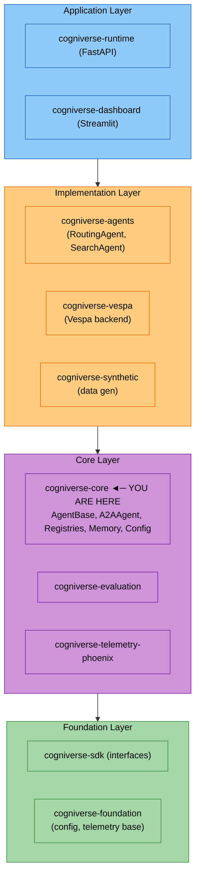

# Core Module

**Package:** `cogniverse_core`
**Location:** `libs/core/cogniverse_core/`

---

## Table of Contents

1. [Overview](#overview)
2. [Package Structure](#package-structure)
3. [Type-Safe Agent System](#type-safe-agent-system)
   - [AgentBase](#agentbase)
   - [AgentInput / AgentOutput / AgentDeps](#agentinput-agentoutput-agentdeps)
   - [A2AAgent](#a2aagent)
4. [Agent Mixins](#agent-mixins)
5. [Registries](#registries)
6. [Memory Management](#memory-management)
7. [Configuration](#configuration)
8. [Usage Examples](#usage-examples)
9. [Architecture Position](#architecture-position)
10. [Testing](#testing)

---

## Overview

The Core package is in the **Core Layer** for all agent implementations in Cogniverse. It provides:

- **Type-Safe Agents**: Generic base classes with compile-time type checking and runtime Pydantic validation
- **A2A Protocol Support**: Google's Agent-to-Agent protocol for inter-agent communication
- **DSPy Integration**: Native DSPy module support for AI-powered agents
- **Multi-Tenancy**: Built-in tenant isolation for enterprise deployments
- **Component Registries**: Dynamic registration and discovery of agents, backends, and schemas
- **Memory System**: Mem0-based persistent agent memory

All concrete agent implementations (RoutingAgent, SearchAgent, etc.) inherit from these base classes.

---

## Package Structure

```text
cogniverse_core/
├── agents/                      # Agent base classes and mixins
│   ├── base.py                  # AgentBase[InputT, OutputT, DepsT]
│   ├── a2a_agent.py             # A2AAgent with A2A protocol + DSPy
│   ├── memory_aware_mixin.py    # Memory integration mixin
│   ├── tenant_aware_mixin.py    # Multi-tenancy mixin
│   ├── health_mixin.py          # Health check mixin
│   ├── a2a_mixin.py             # A2A communication mixin (also in common/)
│   ├── dspy_integration_mixin.py # DSPy module support
│   ├── dynamic_dspy_mixin.py    # Dynamic DSPy loading
│   └── rlm_options.py           # Remote LM configuration options
├── registries/                  # Component registries
│   ├── agent_registry.py        # Agent class registration
│   ├── backend_registry.py      # Backend provider registration
│   ├── dspy_registry.py         # DSPy module registration
│   ├── schema_registry.py       # Schema template registration
│   ├── adapter_store_registry.py # Adapter store registration
│   ├── workflow_store_registry.py # Workflow store registration
│   ├── exceptions.py            # Registry exceptions
│   └── registry.py              # Base registry class
├── memory/                      # Memory system
│   ├── manager.py               # Mem0MemoryManager
│   ├── backend_config.py        # Memory backend configuration
│   └── backend_vector_store.py  # Vector store integration
├── common/                      # Shared utilities
│   ├── cache/                   # Caching subsystem (see Cache Subsystem section)
│   ├── models/                  # Model loaders (see Model Loaders section)
│   ├── utils/                   # Utility functions (see Utility Modules section)
│   ├── tenant_utils.py          # Tenant utilities
│   ├── dspy_module_registry.py  # DSPy module management
│   ├── a2a_utils.py             # A2A protocol utilities
│   ├── a2a_mixin.py             # A2A communication mixin (also in agents/)
│   ├── dynamic_dspy_mixin.py    # Dynamic DSPy mixin (also in agents/)
│   ├── health_mixin.py          # Health check mixin (also in agents/)
│   ├── agent_models.py          # AgentEndpoint and shared agent models
│   ├── document.py              # Document models
│   └── vlm_interface.py         # Vision Language Model interface
├── events/                      # Real-time event notification system
│   ├── types.py                 # Event type definitions (StatusEvent, ProgressEvent, etc.)
│   ├── queue.py                 # EventQueue and QueueManager protocols
│   └── backends/                # Backend implementations
│       └── memory.py            # In-memory EventQueue backend
├── factories/                   # Factory classes
│   └── backend_factory.py       # Backend factory for creating backend instances
├── interfaces/                  # Protocol interfaces
├── validation/                  # Validation utilities
│   └── profile_validator.py     # Profile configuration validation
├── telemetry/                   # Telemetry integration
├── config/                      # Configuration management
├── schemas/                     # Data schemas
│   └── filesystem_loader.py     # Schema loading from files
└── backends/                    # Backend abstractions
```

---

## Type-Safe Agent System

The type-safe agent system uses Python generics to provide **compile-time type checking** and **runtime validation**. This is the foundation of all agents in Cogniverse.

### AgentBase

`AgentBase[InputT, OutputT, DepsT]` is the abstract base class for all agents.

**Type Parameters:**

- `InputT`: Agent input type (must extend `AgentInput`)
- `OutputT`: Agent output type (must extend `AgentOutput`)
- `DepsT`: Agent dependencies type (must extend `AgentDeps`)

**Key Features:**

- Generic type parameters extracted at class definition time
- Automatic Pydantic validation for inputs and outputs
- Runtime type checking
- Statistics tracking (process count, error count)

**Example** (illustrative pattern showing the type-safe structure - actual agents use concrete implementations):

```python
from cogniverse_core.agents.base import AgentBase, AgentInput, AgentOutput, AgentDeps
from typing import Any, Dict, List

# Note: This example uses generic types for illustration.
# Real implementations use concrete classes from cogniverse_vespa or other backend packages.

class MySearchInput(AgentInput):
    query: str
    top_k: int = 10

class MySearchOutput(AgentOutput):
    results: List[Dict[str, Any]]
    total_count: int

class MySearchDeps(AgentDeps):
    search_client: Any  # In practice: VespaVideoSearchClient from cogniverse_vespa
    embedding_model: str = "colpali"

class MySearchAgent(AgentBase[MySearchInput, MySearchOutput, MySearchDeps]):
    async def _process_impl(self, input: MySearchInput) -> MySearchOutput:
        # IDE autocomplete works here - input.query, input.top_k
        results = await self.deps.search_client.search(
            query=input.query,
            limit=input.top_k
        )
        return MySearchOutput(results=results, total_count=len(results))
```

**API:**

| Method | Description |
|--------|-------------|
| `__init__(deps: DepsT)` | Initialize agent with typed dependencies |
| `async _process_impl(input: InputT) -> OutputT` | **Abstract** - Implement agent logic (subclasses override) |
| `async process(input: InputT, stream: bool = False)` | Public API - validates input and calls _process_impl |
| `async run(raw_input: Dict, stream: bool = False)` | Run with raw dict, validates input/output |
| `validate_input(raw: Dict) -> InputT` | Validate and convert to typed input |
| `validate_output(raw: Dict) -> OutputT` | Validate and convert to typed output |
| `get_input_schema() -> Dict` | Get JSON schema for input type |
| `get_output_schema() -> Dict` | Get JSON schema for output type |
| `get_stats() -> Dict` | Get processing statistics |

### AgentInput / AgentOutput / AgentDeps

These are Pydantic BaseModel subclasses that define agent interfaces:

```python
from cogniverse_core.agents.base import AgentInput, AgentOutput, AgentDeps

class AgentInput(BaseModel):
    """Base class for all agent inputs. Flexible - extra fields ignored."""
    model_config = ConfigDict(extra="ignore")

class AgentOutput(BaseModel):
    """Base class for all agent outputs. Strict - no extra fields allowed."""
    model_config = ConfigDict(extra="forbid")

class AgentDeps(BaseModel):
    """Base class for agent dependencies. tenant_id is required."""
    tenant_id: str
    model_config = ConfigDict(extra="allow")  # Dependencies can have extra fields
```

**Important:** `tenant_id` is **required** in all AgentDeps - this enforces multi-tenancy.

### A2AAgent

`A2AAgent[InputT, OutputT, DepsT]` extends `AgentBase` with:

- **A2A Protocol Endpoints**: Standard endpoints per Google A2A spec
- **DSPy Integration**: Optional DSPy module for AI processing
- **FastAPI Server**: Built-in HTTP server with A2A endpoints
- **Inter-Agent Communication**: Call other A2A agents

```python
from cogniverse_core.agents.a2a_agent import A2AAgent, A2AAgentConfig

class RoutingAgent(A2AAgent[RoutingInput, RoutingOutput, RoutingDeps]):
    async def _process_impl(self, input: RoutingInput) -> RoutingOutput:
        # Use DSPy module if available
        if self.dspy_module:
            result = self.dspy_module(query=input.query)
            return RoutingOutput(
                recommended_agent=result.agent,
                confidence=result.confidence
            )
        return RoutingOutput(recommended_agent="search", confidence=0.5)

# Create and run agent
deps = RoutingDeps(model_name="smollm3:3b")  # No tenant_id at construction
config = A2AAgentConfig(
    agent_name="routing_agent",
    agent_description="Routes queries to appropriate agents",
    capabilities=["query_routing", "agent_selection"],
    port=8001
)
agent = RoutingAgent(deps=deps, config=config)
agent.start()  # Starts FastAPI server
```

**A2A Endpoints:**

| Endpoint | Method | Description |
|----------|--------|-------------|
| `/.well-known/agent-card.json` | GET | Agent card per A2A spec |
| `/agent.json` | GET | Legacy agent card |
| `/tasks/send` | POST | Process A2A task |
| `/health` | GET | Health check with metrics |
| `/metrics` | GET | Detailed performance metrics |
| `/schema` | GET | Input/output JSON schemas |

---

## Agent Mixins

Mixins provide composable functionality that can be added to any agent:

### MemoryAwareMixin

Adds Mem0-based persistent memory to agents:

**Method Signature:**

```python
def initialize_memory(
    self,
    agent_name: str,
    tenant_id: str,
    backend_host: str,               # Required - e.g. "http://localhost"
    backend_port: int,               # Required - e.g. 8080
    llm_model: str,                  # Required - e.g. "ollama/llama3.2"
    embedding_model: str,            # Required - e.g. "nomic-embed-text"
    llm_base_url: str,               # Required - e.g. "http://localhost:11434/v1"
    config_manager,                  # Required for schema deployment
    schema_loader,                   # Required for schema templates
    backend_config_port: Optional[int] = None,
    auto_create_schema: bool = True,
) -> bool:
```

**Usage Example:**

```python
from cogniverse_core.agents.memory_aware_mixin import MemoryAwareMixin

class MyAgent(AgentBase[...], MemoryAwareMixin):
    def __init__(self, deps, config_manager, schema_loader):
        super().__init__(deps)
        self._config_manager = config_manager
        self._schema_loader = schema_loader
        # Memory is initialized per-request with tenant_id (not at construction)

    async def _process_impl(self, input: MyInput) -> MyOutput:
        # Initialize memory for this tenant (idempotent — only initializes once per tenant)
        memory_config = self.search_config.get("memory", {})
        self.initialize_memory(
            agent_name="my_agent",
            tenant_id=input.tenant_id,  # Per-request, not from deps
            backend_host=system_config.get("backend_url"),
            backend_port=system_config.get("backend_port"),
            llm_model=memory_config.get("llm_model"),
            embedding_model=memory_config.get("embedding_model"),
            llm_base_url=memory_config.get("llm_base_url"),
            config_manager=self._config_manager,
            schema_loader=self._schema_loader,
            backend_config_port=system_config.get("backend_config_port"),
        )

        # Search memories using mixin methods
        context = self.get_relevant_context(query=input.query, top_k=5)

        # Store new memory
        self.update_memory(content=input.query, metadata={"type": "query"})

        # Other available methods:
        # self.is_memory_enabled() -> bool
        # self.remember_success(query, result, metadata)
        # self.remember_failure(query, error, metadata)
        # self.clear_memory() -> bool
        # self.get_memory_summary() -> Dict
```

### TenantAwareMixin

Provides tenant context and isolation:

```python
from cogniverse_core.agents.tenant_aware_mixin import TenantAwareAgentMixin

class MyAgent(AgentBase[...], TenantAwareAgentMixin):
    def __init__(self, deps, ...):
        super().__init__(deps)
        # tenant_id is NOT set at construction — it arrives per-request

    async def _process_impl(self, input: MyInput) -> MyOutput:
        # tenant_id comes from the A2A task payload
        tenant_id = input.tenant_id
        TenantAwareAgentMixin.__init__(self, tenant_id=tenant_id)
        tenant_context = self.get_tenant_context()
```

### HealthCheckMixin

Adds health check capabilities:

```python
from cogniverse_core.agents.health_mixin import HealthCheckMixin

class MyAgent(AgentBase[...], HealthCheckMixin):
    def get_health_status(self) -> Dict[str, Any]:
        """Override to provide custom health check logic (sync method)."""
        return {
            "status": "healthy",
            "agent": self.__class__.__name__,
            "custom_metric": self.get_custom_metric()
        }

# The mixin also provides setup_health_endpoint() for FastAPI integration:
# self.setup_health_endpoint(app)  # Adds GET /health endpoint
```

### DSPyIntegrationMixin

Integrates DSPy modules for AI processing:

```python
from cogniverse_core.agents.dspy_integration_mixin import DSPyIntegrationMixin
import dspy

class MyAgent(AgentBase[...], DSPyIntegrationMixin):
    def setup_dspy(self):
        class MySignature(dspy.Signature):
            query = dspy.InputField()
            answer = dspy.OutputField()

        self.dspy_module = dspy.ChainOfThought(MySignature)
```

---

## Registries

Registries provide dynamic component registration and discovery:

### AgentRegistry

The AgentRegistry uses dependency injection - ConfigManager must be passed explicitly:

```python
from cogniverse_core.registries.agent_registry import AgentRegistry
from cogniverse_foundation.config.utils import create_default_config_manager

# Create with required dependency injection
config_manager = create_default_config_manager()
registry = AgentRegistry(
    tenant_id="acme",
    config_manager=config_manager  # Required - raises ValueError if None
)

# Register agent endpoint
from cogniverse_core.common.agent_models import AgentEndpoint
agent = AgentEndpoint(
    name="search_agent",
    url="http://localhost:8002",
    capabilities=["video_search", "text_search"],
    health_endpoint="/health",
    process_endpoint="/process"
)
registry.register_agent(agent)

# Find agents by capability
search_agents = registry.find_agents_by_capability("video_search")

# Get healthy agents
healthy = registry.get_healthy_agents()

# List all registered agents
agents = registry.list_agents()  # ["search_agent", ...]

# Get agent by name
agent = registry.get_agent("search_agent")  # Returns AgentEndpoint or None
```

### BackendRegistry

```python
from cogniverse_core.registries import BackendRegistry

# Register custom backend (implements Backend interface)
BackendRegistry.register_backend("my_backend", MyBackendClass)

# Get backend instance (requires tenant_id, config_manager, schema_loader)
backend = BackendRegistry.get_search_backend(
    name="my_backend",
    tenant_id="acme",
    config_manager=config_manager,
    schema_loader=schema_loader
)
```

### DSPyModuleRegistry

```python
from cogniverse_core.registries.dspy_registry import DSPyModuleRegistry
from cogniverse_foundation.config.agent_config import DSPyModuleType
import dspy

# Register custom DSPy module type
DSPyModuleRegistry.register_module(DSPyModuleType.CHAIN_OF_THOUGHT, dspy.ChainOfThought)

# Create module instance
class QASignature(dspy.Signature):
    question = dspy.InputField()
    answer = dspy.OutputField()

module = DSPyModuleRegistry.create_module(
    module_type=DSPyModuleType.CHAIN_OF_THOUGHT,
    signature=QASignature
)
```

### SchemaRegistry

```python
from cogniverse_core.registries import SchemaRegistry

# Create registry instance (requires dependencies)
registry = SchemaRegistry(
    config_manager=config_manager,
    backend=backend,
    schema_loader=schema_loader
)

# Register deployed schema
registry.register_schema(
    tenant_id="acme",
    base_schema_name="video_content",
    full_schema_name="video_content_acme",
    schema_definition=schema_definition_str,
    config={"profile": "video_content"}
)

# Check if schema exists
exists = registry.schema_exists("acme", "video_content")

# Get all schemas for tenant
schemas = registry.get_tenant_schemas("acme")
```

---

## Memory Management

The memory system uses Mem0 for persistent, tenant-isolated agent memory:

```python
from cogniverse_core.memory.manager import Mem0MemoryManager

# Get memory manager (singleton per tenant via __new__)
memory = Mem0MemoryManager(tenant_id="acme")

# Initialize with required parameters
memory.initialize(
    backend_host="localhost",
    backend_port=8080,
    backend_config_port=19071,  # Optional, defaults to 19071
    base_schema_name="agent_memories",
    auto_create_schema=True,
    config_manager=config_manager,  # Required
    schema_loader=schema_loader,  # Required
)

# Add memories
memory.add_memory(
    content="RAG is Retrieval-Augmented Generation...",
    tenant_id="acme",
    agent_name="search_agent",
    metadata={"topic": "ml_concepts"}
)

# Search memories
results = memory.search_memory(
    query="retrieval augmented generation",
    tenant_id="acme",
    agent_name="search_agent",
    top_k=5
)

# Get all memories for agent
all_memories = memory.get_all_memories(
    tenant_id="acme",
    agent_name="search_agent"
)

# Delete memory
memory.delete_memory(
    memory_id="mem_xyz",
    tenant_id="acme",
    agent_name="search_agent"
)
```

---

## Configuration

Configuration management for agents and system settings:

```python
from cogniverse_foundation.config.utils import create_default_config_manager
from cogniverse_core.common.tenant_utils import parse_tenant_id, get_tenant_storage_path

# Create config manager (reads from configs/config.json and environment)
config_manager = create_default_config_manager()

# Get system configuration for tenant
system_config = config_manager.get_system_config(tenant_id="acme")

# Tenant utility functions
org_id, tenant_name = parse_tenant_id("acme:production")  # Returns (org_id, tenant_name)
storage_path = get_tenant_storage_path(base_dir="data", tenant_id="acme")

# Apply overrides
tenant_config.update({
    "max_concurrent_requests": 100,
    "embedding_model": "colpali-v2"
})
```

---

## Usage Examples

### Creating a Complete Agent

```python
from cogniverse_core.agents.base import AgentBase, AgentInput, AgentOutput, AgentDeps
from cogniverse_core.agents.a2a_agent import A2AAgent, A2AAgentConfig
from typing import List, Optional

# 1. Define types
class SummarizerInput(AgentInput):
    text: str
    max_length: int = 100
    style: str = "concise"

class SummarizerOutput(AgentOutput):
    summary: str
    word_count: int
    key_points: List[str]

class SummarizerDeps(AgentDeps):
    model_name: str = "gpt-4"
    temperature: float = 0.7

# 2. Implement agent
class SummarizerAgent(A2AAgent[SummarizerInput, SummarizerOutput, SummarizerDeps]):
    async def _process_impl(self, input: SummarizerInput) -> SummarizerOutput:
        # Use DSPy module if available
        if self.dspy_module:
            result = self.dspy_module(
                text=input.text,
                max_length=input.max_length,
                style=input.style
            )
            return SummarizerOutput(
                summary=result.summary,
                word_count=len(result.summary.split()),
                key_points=result.key_points
            )

        # Fallback logic
        summary = input.text[:input.max_length] + "..."
        return SummarizerOutput(
            summary=summary,
            word_count=len(summary.split()),
            key_points=[]
        )

# 3. Run agent
if __name__ == "__main__":
    deps = SummarizerDeps()  # No tenant_id — it's per-request
    config = A2AAgentConfig(
        agent_name="summarizer_agent",
        agent_description="Summarizes text content",
        capabilities=["text_summarization"],
        port=8002
    )
    agent = SummarizerAgent(deps=deps, config=config)
    agent.start()
```

### Calling Between Agents

```python
class OrchestratorAgent(A2AAgent[OrchestratorInput, OrchestratorOutput, OrchestratorDeps]):
    async def _process_impl(self, input: OrchestratorInput) -> OrchestratorOutput:
        # Call search agent
        search_result = await self.call_agent(
            agent_url="http://localhost:8001",
            query=input.query,
            top_k=10
        )

        # Call summarizer agent
        summary_result = await self.call_agent(
            agent_url="http://localhost:8002",
            text=str(search_result["results"]),
            max_length=200
        )

        return OrchestratorOutput(
            search_results=search_result["results"],
            summary=summary_result["summary"]
        )
```

---

## Architecture Position



---

## Testing

```bash
# Run all core tests (agents and common utilities)
JAX_PLATFORM_NAME=cpu uv run pytest tests/agents/ tests/common/ -v

# Run specific test categories
uv run pytest tests/agents/unit/ -v
uv run pytest tests/common/unit/ -v
uv run pytest tests/agents/integration/ -v

# Run with coverage
uv run pytest tests/agents/ tests/common/ --cov=cogniverse_core --cov-report=html
```

**Test Categories:**

- `tests/agents/unit/` - Unit tests for base classes, mixins, registries
- `tests/agents/integration/` - Integration tests with multiple components
- `tests/common/` - Tests for shared utilities

---

## Cache Subsystem

**Location:** `common/cache/`

The cache subsystem provides tiered caching for embeddings and pipeline artifacts.

### CacheBackend (base.py)

Abstract base class for cache backends:

```python
class CacheBackend(ABC):
    async def get(self, key: str) -> Optional[Any]: ...
    async def set(self, key: str, value: Any, ttl: Optional[int] = None) -> bool: ...
    async def delete(self, key: str) -> bool: ...
    async def exists(self, key: str) -> bool: ...
    async def clear(self, pattern: Optional[str] = None) -> int: ...
    async def get_stats(self) -> Dict[str, Any]: ...
```

### CacheManager (base.py)

Manages multiple cache backends with tiered caching:

```python
from cogniverse_core.common.cache import CacheManager, CacheConfig, BackendConfig

config = CacheConfig(
    backends=[
        BackendConfig(backend_type="structured_filesystem", priority=0),
    ],
    default_ttl=3600,
    enable_compression=True,
    serialization_format="pickle"  # or "json", "msgpack"
)

manager = CacheManager(config)
await manager.set("key", value, ttl=3600)
result = await manager.get("key")
```

### EmbeddingCache (embedding_cache.py)

Specialized cache for embeddings with efficient storage:

```python
from cogniverse_core.common.cache import EmbeddingCache

cache = EmbeddingCache(cache_manager, ttl=86400)  # 24 hours

# Get/set individual embeddings
embedding = await cache.get_embedding("query text", model="vidore/colsmol-500m")
await cache.set_embedding("query text", "vidore/colsmol-500m", embedding_array)

# Batch operations
results = await cache.get_batch_embeddings(["text1", "text2"], model="...")

# Statistics
stats = cache.stats.to_dict()  # {"hits": 100, "misses": 20, "hit_rate": 0.833}
```

### PipelineArtifactCache (pipeline_cache.py)

Caches video processing pipeline artifacts:

```python
from cogniverse_core.common.cache import PipelineArtifactCache, VideoArtifacts

cache = PipelineArtifactCache(
    cache_manager,
    ttl=604800,  # 7 days
    profile="video_colpali_mv_frame"
)

# Cache keyframes
await cache.set_keyframes(
    video_path="video.mp4",
    keyframes_metadata={"keyframes": [...]},
    keyframe_images={"0": image_array},
    strategy="similarity",
    threshold=0.999
)

# Retrieve with optional image loading
metadata = await cache.get_keyframes(
    video_path="video.mp4",
    strategy="similarity",
    load_images=True
)

# Check completeness
artifacts = VideoArtifacts(video_id="vid123", keyframes=..., audio_transcript=...)
is_complete = artifacts.is_complete(pipeline_config)
```

### CacheBackendRegistry (registry.py)

Plugin registry for cache backends:

```python
from cogniverse_core.common.cache import CacheBackendRegistry

# Register custom backend
CacheBackendRegistry.register("redis", RedisCacheBackend)

# Create from config
backend = CacheBackendRegistry.create({"backend_type": "structured_filesystem", ...})

# List registered backends
backends = CacheBackendRegistry.list_backends()  # ["structured_filesystem", ...]
```

---

## Utility Modules

**Location:** `common/utils/`

### retry.py - Retry with Exponential Backoff

```python
from cogniverse_core.common.utils.retry import retry_with_backoff, RetryConfig

config = RetryConfig(
    max_attempts=3,
    initial_delay=1.0,
    max_delay=60.0,
    exponential_base=2.0,
    jitter=True,  # Prevents thundering herd
    exceptions=(ConnectionError, TimeoutError)
)

@retry_with_backoff(config=config)
def fetch_data():
    return requests.get(url)

# With callbacks
@retry_with_backoff(
    on_retry=lambda e, attempt: logger.warning(f"Retry {attempt}: {e}"),
    on_failure=lambda e: logger.error(f"Failed: {e}")
)
def process_item(item):
    return api.process(item)
```

### async_polling.py - Semantic Wait Functions

```python
from cogniverse_core.common.utils.async_polling import (
    wait_for_service_ready,
    wait_for_retry_backoff
)

# Wait for service readiness
ready = wait_for_service_ready(
    check_fn=lambda: service.is_healthy(),
    timeout=30.0,
    poll_interval=1.0,
    description="Vespa"
)

# Wait with backoff for retries
wait_for_retry_backoff(
    attempt=2,
    base_delay=1.0,
    max_delay=60.0,
    exponential=True
)
```

### prompt_manager.py - Optimization Artifact Management

```python
from cogniverse_core.common.utils.prompt_manager import PromptManager

manager = PromptManager(
    config_manager=config_manager,
    tenant_id="acme",
    artifacts_path="/artifacts/unified_router_prompt_artifact.json"
)

# Get routing prompt with context
prompt = manager.get_routing_prompt(
    user_query="Find videos about manufacturing",
    conversation_history=""
)

# Get model configuration
model_config = manager.get_model_config()

# Reload artifacts
success = manager.reload_artifacts(artifacts_path="/new/path/artifact.json")

# Artifact loading priority:
# 1. Provided artifacts_path
# 2. Path from config
# 3. Modal volume mount (/artifacts/...)
# 4. Local optimization results
# 5. Default prompts from config
```

### Other Utilities

| Module | Purpose |
|--------|---------|
| `output_manager.py` | Manage output directories and artifacts |
| `logging_config.py` | Standardized logging configuration |
| `profile_utils.py` | Profile configuration utilities |
| `vespa_query_utils.py` | Vespa YQL query building utilities |
| `comprehensive_query_utils.py` | Query enhancement and analysis |

---

## VLM Interface

**Location:** `common/vlm_interface.py`

Vision Language Model interface using DSPy for visual content analysis.

```python
from cogniverse_core.common.vlm_interface import VLMInterface

vlm = VLMInterface(
    config_manager=config_manager,
    tenant_id="acme"
)

# Basic visual analysis
result = await vlm.analyze_visual_content(
    image_paths=["frame1.jpg", "frame2.jpg"],
    query="Find manufacturing defects"
)
# Returns: {descriptions, themes, key_objects, insights, relevance_score}

# Detailed analysis for reporting
result = await vlm.analyze_visual_content_detailed(
    image_paths=["frame1.jpg"],
    query="Technical analysis",
    context="Quality inspection report"
)
# Returns: {detailed_descriptions, technical_analysis, visual_patterns, quality_assessment (dict), annotations}
```

**DSPy Signatures:**

| Signature | Purpose |
|-----------|---------|
| `VisualAnalysisSignature` | Basic analysis (descriptions, themes, objects, insights, relevance_score) |
| `DetailedVisualAnalysisSignature` | Detailed analysis with technical findings and quality_assessment dict |

---

## Model Loaders

**Location:** `common/models/`

### ModelLoader (model_loaders.py)

Abstract base class for model loaders:

```python
from cogniverse_core.common.models import ModelLoader

class CustomLoader(ModelLoader):
    def load_model(self) -> Tuple[Any, Any]:
        # Load and return (model, processor)
        pass

# Auto device detection
device = loader.get_device()  # "cuda", "mps", or "cpu"
dtype = loader.get_dtype()    # bfloat16 for CUDA, float32 otherwise
```

### RemoteInferenceClient (model_loaders.py)

Client for remote model inference providers:

```python
from cogniverse_core.common.models.model_loaders import RemoteInferenceClient

client = RemoteInferenceClient(
    endpoint_url="http://localhost:8080",
    api_key="..."
)

# Process images with retry logic
result = client.process_images(
    images=["image1.jpg", pil_image]
)
```

**Supported providers:**

- Infinity (ColPali and similar models)
- Modal (custom deployed models)
- Custom REST APIs

### VideoPrismLoader (videoprism_loader.py)

Handles VideoPrism model loading and inference:

```python
from cogniverse_core.common.models import VideoPrismLoader

loader = VideoPrismLoader(
    model_name="videoprism_public_v1_base_hf",
    config={"videoprism_repo_path": "/path/to/videoprism"}
)

# Load model (with retry logic)
loader.load_model()

# Extract embeddings from frames
embeddings = loader.extract_embeddings(frames)
# Returns: {embeddings, embedding_dim, num_patches, model_name}

# Preprocess frames for model input
video_input = loader.preprocess_frames(frames)  # (1, num_frames, 288, 288, 3)
```

**Model Variants:**

| Variant | Output Embedding Dim | Internal Spatial Tokens | Input Shape |
|---------|---------------------|------------------------|-------------|
| base | 768 | 16x16x16 = 4096 | (1, N, 288, 288, 3) |
| large | 1024 | 8x16x16 = 2048 | (1, N, 288, 288, 3) |

Note: Output Embedding Dim is the final embedding vector dimension. Spatial Tokens is the internal representation before pooling.

### SimpleVideoPrismModel (videoprism_models.py)

Minimal VideoPrism model wrapper for JAX:

```python
from cogniverse_core.common.models.videoprism_models import get_videoprism_model

model = get_videoprism_model("videoprism_public_v1_base")
model.load_model()

# Preprocess and extract
video_input = model.preprocess_video(frames)
result = model.extract_embeddings(video_input)
```

**Configuration:**

- `videoprism_repo_path` in config.json or `VIDEOPRISM_REPO_PATH` env var
- JAX forced to CPU backend to avoid Metal issues on macOS

---

## Related Documentation

- [Agents Module](./agents.md) - Concrete agent implementations (RoutingAgent, SearchAgent, etc.)
- [Multi-Agent Interactions](../architecture/multi-agent-interactions.md) - A2A protocol flows
- [SDK Architecture](../architecture/sdk-architecture.md) - Package structure
- [Creating Agents Tutorial](../tutorials/creating-agents.md) - Step-by-step agent creation

---

**Summary:** The Core module provides the type-safe foundation for all agents in Cogniverse. `AgentBase[InputT, OutputT, DepsT]` ensures compile-time type checking and runtime validation, while `A2AAgent` adds A2A protocol support, DSPy integration, and FastAPI endpoints. Mixins provide composable functionality for memory, multi-tenancy, and health checks.
