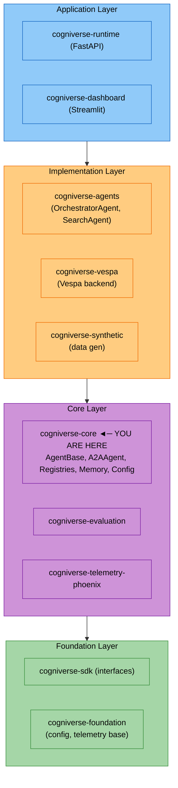

# Core Module

**Package:** `cogniverse_core`
**Location:** `libs/core/cogniverse_core/`

---

## Table of Contents

1. [Overview](#overview)
2. [Package Structure](#package-structure)
3. [Type-Safe Agent System](#type-safe-agent-system)
   - [AgentBase](#agentbase)
   - [AgentInput / AgentOutput / AgentDeps](#agentinput-agentoutput-agentdeps)
   - [A2AAgent](#a2aagent)
4. [Content Rails](#content-rails)
5. [RLM Options](#rlm-options)
6. [Agent Mixins](#agent-mixins)
7. [Registries](#registries)
8. [Memory Management](#memory-management)
9. [Query Encoding](#query-encoding)
10. [Event System](#event-system)
11. [Approval Interfaces](#approval-interfaces)
12. [Media Access](#media-access)
13. [Configuration](#configuration)
14. [Usage Examples](#usage-examples)
15. [Architecture Position](#architecture-position)
16. [Testing](#testing)
17. [Cache Subsystem](#cache-subsystem)
18. [Utility Modules](#utility-modules)
19. [VLM Interface](#vlm-interface)
20. [Model Loaders](#model-loaders)
21. [Backend Factory & Profile Validation](#backend-factory--profile-validation)

---

## Overview

The Core package is in the **Core Layer** for all agent implementations in Cogniverse. It provides:

- **Type-Safe Agents**: Generic base classes with compile-time type checking and runtime Pydantic validation
- **A2A Protocol Support**: Google's Agent-to-Agent protocol for inter-agent communication
- **DSPy Integration**: Native DSPy module support for AI-powered agents
- **Multi-Tenancy**: Built-in tenant isolation for enterprise deployments
- **Component Registries**: Dynamic registration and discovery of agents, backends, and schemas
- **Memory System**: Mem0-based persistent agent memory

All concrete agent implementations (OrchestratorAgent, SearchAgent, etc.) inherit from these base classes.

---

## Package Structure

```text
cogniverse_core/
├── agents/                      # Agent base classes and mixins
│   ├── base.py                  # AgentBase[InputT, OutputT, DepsT]
│   ├── a2a_agent.py             # A2AAgent with A2A protocol + DSPy
│   ├── tenant_aware_mixin.py    # Multi-tenancy mixin
│   ├── a2a_mixin.py             # A2AEndpointsMixin (standalone-agent agent-card endpoint)
│   ├── rails.py                 # Content rails (topic/safety/format) for agent I/O
│   └── rlm_options.py           # RLMOptions — per-query Recursive Language Model config
├── approval/                    # Human-in-the-loop approval interfaces
│   └── interfaces.py            # ApprovalStatus, ReviewItem, ReviewDecision, ApprovalBatch,
│                                 # ConfidenceExtractor, FeedbackHandler, ApprovalStorage
├── registries/                  # Component registries
│   ├── agent_registry.py        # Agent class registration
│   ├── backend_registry.py      # Backend provider registration
│   ├── schema_registry.py       # Schema template registration
│   ├── adapter_store_registry.py # AdapterStoreRegistry (entry-point auto-discovery)
│   ├── workflow_store_registry.py # WorkflowStoreRegistry (entry-point auto-discovery)
│   ├── exceptions.py            # Registry exceptions
│   └── registry.py              # Base registry class
├── memory/                      # Memory system
│   ├── manager.py               # Mem0MemoryManager (add_memory, search_memory, drop_session, lifecycle tick)
│   ├── schema.py                # KnowledgeSchema, KnowledgeRegistry, Retention, Sensitivity, Pinnable, ContradictionPolicy
│   ├── provenance.py            # Provenance, CitationRef, DerivationKind, ProvenanceWalker, make_provenance
│   ├── provenance_store.py      # Vespa-backed provenance persistence
│   ├── contradiction.py         # ContradictionDetector, ConflictSet, reconcile()
│   ├── trust.py                 # TrustRecord, compute_initial_trust, rank_with_trust, apply_endorsement
│   ├── federation.py            # FederationService (org-trunk + tenant overlays, cross-tenant ACLs)
│   ├── pinning.py               # PinService, PinQuotas, PinRecord
│   ├── lifecycle_scheduler.py   # LifecycleScheduler (schema-driven periodic cleanup)
│   ├── mem0_embedder.py         # DenseOnMem0Embedder (DenseOn prompt + L2-norm adapter for Mem0)
│   ├── backend_config.py        # Memory backend configuration
│   ├── backend_vector_store.py  # Vector store integration
│   └── _timestamps.py           # Internal timestamp normalization helpers
├── common/                      # Shared utilities
│   ├── cache/                   # Caching subsystem (see Cache Subsystem section)
│   ├── models/                  # Model loaders (see Model Loaders section)
│   ├── media/                   # Media access abstraction (see Media Access section)
│   ├── utils/                   # Utility functions (see Utility Modules section)
│   ├── tenant_utils.py          # Re-exports foundation tenant helpers; hosts assert_tenant_exists
│   ├── dspy_module_registry.py  # Re-exports foundation DSPyModuleRegistry / DSPyOptimizerRegistry
│   ├── dynamic_dspy_mixin.py    # Dynamic DSPy mixin
│   ├── health_mixin.py          # Health check mixin
│   ├── agent_models.py          # AgentEndpoint and shared agent models
│   └── vlm_interface.py         # Vision Language Model interface
├── events/                      # Real-time event notification system (see Event System section)
│   ├── types.py                 # Event type definitions (StatusEvent, ProgressEvent, etc.)
│   ├── queue.py                 # EventQueue and QueueManager protocols
│   └── backends/                # Backend implementations
│       └── memory.py            # In-memory EventQueue backend
├── query/                       # Query encoding utilities (see Query Encoding section)
│   └── encoders.py              # QueryEncoder implementations + QueryEncoderFactory
├── factories/                   # Factory classes
│   └── backend_factory.py       # BackendFactory for creating backend instances
├── interfaces/                  # Protocol interfaces (re-exports, no local classes)
├── validation/                  # Validation utilities
│   └── profile_validator.py     # ProfileValidator — backend profile config validation
├── schemas/                     # Data schemas
│   └── filesystem_loader.py     # FilesystemSchemaLoader — schema loading from files
└── backends/                    # Backend abstractions (re-exports, no local classes)
```

`config/` and `telemetry/` backward-compatibility shims (which re-exported
`cogniverse_foundation.config` / telemetry symbols under the `cogniverse_core`
namespace) have been removed; import directly from `cogniverse_foundation`.

---

## Type-Safe Agent System

The type-safe agent system uses Python generics to provide **compile-time type checking** and **runtime validation**. This is the foundation of all agents in Cogniverse.

### AgentBase

`AgentBase[InputT, OutputT, DepsT]` is the abstract base class for all agents.

**Type Parameters:**

- `InputT`: Agent input type (must extend `AgentInput`)
- `OutputT`: Agent output type (must extend `AgentOutput`)
- `DepsT`: Agent dependencies type (must extend `AgentDeps`)

**Key Features:**

- Generic type parameters extracted at class definition time
- Automatic Pydantic validation for inputs and outputs
- Runtime type checking
- Statistics tracking (process count, error count)

**Example** (illustrative pattern showing the type-safe structure - actual agents use concrete implementations):

```python
from cogniverse_core.agents.base import AgentBase, AgentInput, AgentOutput, AgentDeps
from typing import Any, Dict, List

# Note: This example uses generic types for illustration.
# Real implementations use concrete classes from cogniverse_vespa or other backend packages.

class MySearchInput(AgentInput):
    query: str
    top_k: int = 10

class MySearchOutput(AgentOutput):
    results: List[Dict[str, Any]]
    total_count: int

class MySearchDeps(AgentDeps):
    search_client: Any  # In practice: VespaSearchBackend from cogniverse_vespa
    embedding_model: str = "colpali"

class MySearchAgent(AgentBase[MySearchInput, MySearchOutput, MySearchDeps]):
    async def _process_impl(self, input: MySearchInput) -> MySearchOutput:
        # IDE autocomplete works here - input.query, input.top_k
        results = await self.deps.search_client.search(
            query=input.query,
            limit=input.top_k
        )
        return MySearchOutput(results=results, total_count=len(results))
```

**API:**

| Method | Description |
|--------|-------------|
| `__init__(deps: DepsT)` | Initialize agent with typed dependencies |
| `async _process_impl(input: InputT) -> OutputT` | **Abstract** - Implement agent logic (subclasses override) |
| `async process(input: InputT, stream: bool = False)` | Public API - validates input and calls _process_impl |
| `async run(raw_input: Dict, stream: bool = False)` | Run with raw dict, validates input/output |
| `validate_input(raw: Dict) -> InputT` | Validate and convert to typed input |
| `validate_output(raw: Dict) -> OutputT` | Validate and convert to typed output |
| `get_input_schema() -> Dict` | Get JSON schema for input type |
| `get_output_schema() -> Dict` | Get JSON schema for output type |
| `get_stats() -> Dict` | Get processing statistics |

### AgentInput / AgentOutput / AgentDeps

These are Pydantic BaseModel subclasses that define agent interfaces:

```python
from cogniverse_core.agents.base import AgentInput, AgentOutput, AgentDeps

class AgentInput(BaseModel):
    """Base class for all agent inputs. Flexible - extra fields ignored."""
    model_config = ConfigDict(extra="ignore")

class AgentOutput(BaseModel):
    """Base class for all agent outputs. Strict - no extra fields allowed."""
    model_config = ConfigDict(extra="forbid")

class AgentDeps(BaseModel):
    """Base class for agent dependencies. Agents are tenant-agnostic at startup — tenant_id arrives per-request."""
    model_config = ConfigDict(extra="allow")  # Dependencies can have additional fields
```

**Important:** `tenant_id` is **not** a constructor parameter — it arrives per-request via the A2A task payload, not at agent startup. This is how multi-tenancy is enforced without coupling the agent to a specific tenant at construction time.

### A2AAgent

`A2AAgent[InputT, OutputT, DepsT]` extends `AgentBase` with:

- **A2A Protocol Support**: Standard A2A spec integration via the runtime's `A2AStarletteApplication`
- **DSPy Integration**: Optional DSPy module for AI processing
- **HTTP Endpoint**: Agents expose a `/process` endpoint (dict input, not Task objects); A2A routing handled by the runtime
- **Inter-Agent Communication**: Agents call each other via `httpx.AsyncClient` through the runtime's `AgentDispatcher`

```python
from cogniverse_core.agents.a2a_agent import A2AAgent, A2AAgentConfig
from cogniverse_core.agents.base import AgentDeps, AgentInput, AgentOutput

class MyAgent(A2AAgent[AgentInput, AgentOutput, AgentDeps]):
    async def _process_impl(self, input: AgentInput) -> AgentOutput:
        # Use DSPy module if available
        if self.dspy_module:
            result = self.dspy_module(query=input.query)
            return AgentOutput(result=result.answer)
        return AgentOutput(result="default")

# Create agent (deps are tenant-agnostic; tenant_id arrives per-request)
deps = AgentDeps()
config = A2AAgentConfig(
    agent_name="orchestrator_agent",
    agent_description="Routes queries to appropriate agents",
    capabilities=["intelligent_routing", "query_analysis", "agent_orchestration"],
    port=8001
)
agent = MyAgent(deps=deps, config=config)
# The A2A HTTP server is managed by the runtime's A2AStarletteApplication,
# not embedded in the agent. Agents expose a /process endpoint via the runtime.
```

**A2A Endpoints** (served by the runtime's `A2AStarletteApplication`, an
`a2a-sdk` JSON-RPC 2.0 app, mounted at `/a2a`):

| Endpoint | Method | Description |
|----------|--------|-------------|
| `/a2a/` | POST | JSON-RPC 2.0 endpoint — methods `message/send`, `message/stream` (SSE), `tasks/get`, `tasks/cancel`, `tasks/pushNotificationConfig/*` |
| `/a2a/.well-known/agent-card.json` | GET | Agent card per A2A spec |
| `/a2a/.well-known/agent.json` | GET | Deprecated agent-card alias, kept for backward compatibility |

A2A requests are executed by `CogniverseAgentExecutor`, which dispatches through
the runtime's `AgentDispatcher`. Separately, each agent is also reachable
in-process via the agents router:

| Endpoint | Method | Description |
|----------|--------|-------------|
| `/agents/{agent_name}/process` | POST | Process a task (dict payload, not an A2A `Task` object) |
| `/agents/{agent_name}/message` | POST | Enqueue an inbound steering message (`stop`/`constraint`/`interrupt`) for a running agent session |

Standalone agent apps built outside the unified runtime can mix in
`A2AEndpointsMixin` (`agents/a2a_mixin.py`) for a single
`GET /.well-known/agent-card.json` endpoint plus a `register_with_registry()`
helper that POSTs the agent's card to a central registry.

---

## Content Rails

`agents/rails.py` provides lightweight input/output guardrails. `AgentBase.process()`
runs the configured chains around `_process_impl()`, and the runtime enforces them
at the **gateway front door** (the dispatcher's `_execute_gateway_task` runs input
rails on the incoming query and output rails on the final response), so internal
agent-to-agent calls aren't gated.

Three concrete rails (raise `RailBlockedError` on violation):

- **`TopicBoundaryRail(allowed_topics, advisory=True)`** — flags queries that contain
  none of the allowed-topic keywords. Defaults to **advisory** (logs a warning, does
  not block) because coarse keyword matching would otherwise reject legitimate
  natural-language queries; set `advisory=False` to hard-block (only with a
  deliberately broad `allowed_topics`).
- **`ContentSafetyRail(blocked_patterns)`** — blocks input/output matching any regex
  (e.g. prompt-injection phrases, `<script>`).
- **`OutputFormatRail(required_fields)`** — enforces required output fields + types.

Rails are configured under the `rails` block in `config.json`
(`enabled`, `input_rails`, `output_rails`); `RailsConfig.build_input_chain()` /
`build_output_chain()` compile the definitions into `RailChain`s.

```json
"rails": {
  "enabled": true,
  "input_rails": [
    {"type": "topic_boundary", "params": {"advisory": true, "allowed_topics": ["video", "search"]}},
    {"type": "content_safety", "params": {"blocked_patterns": ["ignore previous instructions", "<script>"]}}
  ],
  "output_rails": []
}
```

---

## RLM Options

`agents/rlm_options.py` defines `RLMOptions`, a per-query Pydantic config for
enabling **RLM (Recursive Language Model)** inference — a DSPy 3.1+ paradigm
that lets an LLM examine, decompose, and recursively call itself over
near-infinite context instead of stuffing everything into one prompt window.
It is attached to an agent's input type (e.g. `SearchInput(query=..., rlm=...)`)
so callers can A/B test RLM against standard inference per request.

```python
from cogniverse_core.agents.rlm_options import RLMOptions

# Explicit enable (A/B test group B)
rlm = RLMOptions(enabled=True, max_iterations=3)

# Auto-enable once context exceeds a character threshold
rlm = RLMOptions(auto_detect=True, context_threshold=50_000)

rlm.should_use_rlm(context_size=80_000)  # -> True
```

| Field | Default | Purpose |
|---|---|---|
| `enabled` | `False` | Explicitly force RLM for this query |
| `auto_detect` | `False` | Enable RLM when context exceeds `context_threshold` |
| `context_threshold` | `50_000` | Character threshold for `auto_detect` |
| `max_iterations` | `3` (1-10) | Max REPL iterations |
| `max_llm_calls` | `30` (1-100) | Max LLM sub-calls |
| `timeout_seconds` | `300` (10-1800) | RLM processing timeout |
| `backend` | `"openai"` | litellm backend id (openai, anthropic, litellm) |
| `model` / `api_base` / `api_key` | `None` | Overrides; `None` falls back to the agent's model / provider defaults |
| `include_trajectory` | `False` | Attach a bounded REPL trajectory to the result for auditing |
| `trajectory_max_entries` | `32` (1-200) | Caps trajectory size when `include_trajectory=True` |

---

## Agent Mixins

Mixins provide composable functionality that can be added to any agent:

### MemoryAwareMixin

Adds Mem0-based persistent memory to agents:

**Method Signature:**

```python
def initialize_memory(
    self,
    agent_name: str,
    tenant_id: str,
    embedder_base_url: str,          # Required — DenseOn /v1/embeddings endpoint
    *,
    llm_model: str,                  # Required — no fallback default
    backend_host: str = "localhost",
    backend_port: int = 8080,
    embedding_model: str = "lightonai/DenseOn",
    llm_base_url: str = "http://localhost:11434",
    llm_api_key: str = "not-required",
    config_manager=None,             # Required for schema deployment
    schema_loader=None,              # Required for schema templates
    backend_config_port: Optional[int] = None,
    auto_create_schema: bool = True,
) -> bool:
```

**Usage Example:**

```python
from cogniverse_agents.memory_aware_mixin import MemoryAwareMixin

class MyAgent(AgentBase[...], MemoryAwareMixin):
    def __init__(self, deps, config_manager, schema_loader):
        super().__init__(deps)
        self._config_manager = config_manager
        self._schema_loader = schema_loader
        # Memory is initialized per-request with tenant_id (not at construction)

    async def _process_impl(self, input: MyInput) -> MyOutput:
        # Initialize memory for this tenant (idempotent — only initializes once per tenant)
        memory_config = self.search_config.get("memory", {})
        self.initialize_memory(
            agent_name="my_agent",
            tenant_id=input.tenant_id,  # Per-request, not from deps
            embedder_base_url=memory_config.get("embedder_base_url"),
            llm_model=memory_config.get("llm_model"),
            backend_host=system_config.get("backend_url"),
            backend_port=system_config.get("backend_port"),
            embedding_model=memory_config.get("embedding_model"),
            llm_base_url=memory_config.get("llm_base_url"),
            config_manager=self._config_manager,
            schema_loader=self._schema_loader,
            backend_config_port=system_config.get("backend_config_port"),
        )

        # Search memories using mixin methods
        context = self.get_relevant_context(query=input.query, top_k=5)

        # Store new memory
        self.update_memory(content=input.query, metadata={"type": "query"})

        # Other available methods:
        # self.is_memory_enabled() -> bool
        # self.remember_success(query, result, metadata)
        # self.remember_failure(query, error, metadata)
        # self.clear_memory() -> bool
        # self.get_memory_summary() -> Dict
```

### TenantAwareMixin

Provides tenant context and isolation:

```python
from cogniverse_core.agents.tenant_aware_mixin import TenantAwareAgentMixin

class MyAgent(AgentBase[...], TenantAwareAgentMixin):
    def __init__(self, deps, ...):
        super().__init__(deps)
        # tenant_id is NOT set at construction — it arrives per-request

    async def _process_impl(self, input: MyInput) -> MyOutput:
        # tenant_id comes from the A2A task payload
        tenant_id = input.tenant_id
        TenantAwareAgentMixin.__init__(self, tenant_id=tenant_id)
        tenant_context = self.get_tenant_context()
```

### HealthCheckMixin

Adds health check capabilities:

```python
from cogniverse_core.common.health_mixin import HealthCheckMixin

class MyAgent(AgentBase[...], HealthCheckMixin):
    def get_health_status(self) -> Dict[str, Any]:
        """Override to provide custom health check logic (sync method)."""
        return {
            "status": "healthy",
            "agent": self.__class__.__name__,
            "custom_metric": self.get_custom_metric()
        }

# The mixin also provides setup_health_endpoint() for FastAPI integration:
# self.setup_health_endpoint(app)  # Adds GET /health endpoint
```

### DynamicDSPyMixin

Provides dynamic DSPy module creation and configuration at runtime:

```python
from cogniverse_core.common.dynamic_dspy_mixin import DynamicDSPyMixin
import dspy

class MyAgent(AgentBase[...], DynamicDSPyMixin):
    def __init__(self, ...):
        super().__init__(...)
        # Register signatures for dynamic module creation
        self.register_signature("my_task", MySignature)

    def process(self, input_data):
        # Get or create module based on current agent_config
        module = self.get_or_create_module("my_task")
        return module(query=input_data.query)
```

---

## Registries

Registries provide dynamic component registration and discovery:

### AgentRegistry

The AgentRegistry uses dependency injection - ConfigManager must be passed explicitly:

```python
from cogniverse_core.registries.agent_registry import AgentRegistry
from cogniverse_foundation.config.utils import create_default_config_manager

# Create with required dependency injection
config_manager = create_default_config_manager()
registry = AgentRegistry(
    tenant_id="acme",
    config_manager=config_manager  # Required - raises ValueError if None
)

# Register agent endpoint
from cogniverse_core.common.agent_models import AgentEndpoint
agent = AgentEndpoint(
    name="search_agent",
    url="http://localhost:8002",
    capabilities=["video_search", "text_search"],
    health_endpoint="/health",
    process_endpoint="/process"
)
registry.register_agent(agent)

# Find agents by capability
search_agents = registry.find_agents_by_capability("video_search")

# Get healthy agents
healthy = registry.get_healthy_agents()

# List all registered agents
agents = registry.list_agents()  # ["search_agent", ...]

# Get agent by name
agent = registry.get_agent("search_agent")  # Returns AgentEndpoint or None
```

### BackendRegistry

```python
from cogniverse_core.registries import BackendRegistry

# Register custom backend (implements Backend interface)
BackendRegistry.register_backend("my_backend", MyBackendClass)

# Get shared backend instance (tenant_id passed in query_dict at search time)
backend = BackendRegistry.get_search_backend(
    name="my_backend",
    config_manager=config_manager,
    schema_loader=schema_loader
)
```

### DSPyModuleRegistry

```python
from cogniverse_core.common.dspy_module_registry import DSPyModuleRegistry
from cogniverse_foundation.config.agent_config import DSPyModuleType
import dspy

# Create module instance from a built-in module type
class QASignature(dspy.Signature):
    question = dspy.InputField()
    answer = dspy.OutputField()

module = DSPyModuleRegistry.create_module(
    module_type=DSPyModuleType.CHAIN_OF_THOUGHT,
    signature=QASignature
)
```

### SchemaRegistry

```python
from cogniverse_core.registries import SchemaRegistry

# Create registry instance (requires dependencies)
registry = SchemaRegistry(
    config_manager=config_manager,
    backend=backend,
    schema_loader=schema_loader
)

# Register deployed schema
registry.register_schema(
    tenant_id="acme",
    base_schema_name="video_content",
    full_schema_name="video_content_acme",
    schema_definition=schema_definition_str,
    config={"profile": "video_content"}
)

# Check if schema exists
exists = registry.schema_exists("acme", "video_content")

# Get all schemas for tenant
schemas = registry.get_tenant_schemas("acme")
```

### AdapterStoreRegistry / WorkflowStoreRegistry

Thin subclasses of `cogniverse_foundation.registry.EntryPointRegistry` that
auto-discover implementations registered via Python entry points, so
`cogniverse_core` never imports a concrete backend package directly.

```python
from cogniverse_core.registries import AdapterStoreRegistry, WorkflowStoreRegistry

# Implementations register under these entry-point groups in pyproject.toml:
#   [project.entry-points."cogniverse.adapter.stores"]
#   vespa = "cogniverse_vespa.registry.adapter_store:VespaAdapterStore"
#
#   [project.entry-points."cogniverse.workflow.stores"]
#   telemetry = "cogniverse_agents.workflow.telemetry_workflow_store:TelemetryWorkflowStore"

adapter_store = AdapterStoreRegistry.get(
    name="vespa", config={"backend_url": "http://localhost", "backend_port": 8080}
)
workflow_store = WorkflowStoreRegistry.get(
    name="telemetry", config={"telemetry_provider": telemetry_provider}
)
```

---

## Query Encoding

`query/encoders.py` provides the `QueryEncoder` abstraction search agents use
to turn a text query into the embedding shape a Vespa profile expects, plus a
caching factory that picks the right encoder from `configs/config.json`.

```python
from cogniverse_core.query.encoders import QueryEncoderFactory

# Cached by (model_name, inference_service, embedding_dim) — a repeat
# call for the same profile reuses the already-loaded encoder.
encoder = QueryEncoderFactory.create_encoder(
    profile="frame_based_colpali",
    config=system_config,  # SystemConfig instance, required
)
embedding = encoder.encode("find manufacturing defects")
dim = encoder.get_embedding_dim()

QueryEncoderFactory.get_supported_profiles(config=system_config)
```

| Class | Model family | Notes |
|---|---|---|
| `ColBERTQueryEncoder` | ColBERT / LateOn | Per-token multi-vector; `embedding_dim` is required (read from `schema_config.embedding_dim`); supports joint query+CoT-trace encoding |
| `ColPaliFamilyQueryEncoder` | ColPali, ColQwen, ColSmol | 128-d patch multi-vector (`get_embedding_dim()` returns the class-level `embedding_dim = 320`); local or remote (`inference_service_url`) |
| `ColPaliQueryEncoder(...)` / `ColQwenQueryEncoder(...)` | — | Thin factory functions over `ColPaliFamilyQueryEncoder` with `model_loader="colpali"`/`"colqwen"` |
| `VideoPrismQueryEncoder` | VideoPrism | Single-vector (global, `_lvt_`/`global` in name) or patch-based (768/1024-d) |

`QueryEncoderFactory._create_encoder_instance` resolves the encoder in this
order: `profile_config["model_loader"]` (authoritative) → model-name substring
→ profile-name substring, raising `ValueError` if none match.

---

## Event System

`events/` defines the Pydantic event vocabulary and queue protocols the
runtime uses to stream agent progress over SSE (see `AgentBase.emit_progress`
/ `process(stream=True)`).

```python
from cogniverse_core.events.types import TaskState, create_status_event
from cogniverse_core.events.backends.memory import get_queue_manager

manager = get_queue_manager()
queue = await manager.get_or_create_queue(task_id="task-123", tenant_id="acme")
await queue.enqueue(
    create_status_event(
        task_id="task-123", tenant_id="acme", state=TaskState.WORKING, message="starting"
    )
)
async for event in queue.subscribe():
    ...  # stream to the client (SSE)
```

| Component | Purpose |
|---|---|
| `EventType`, `TaskState` | Enums for event kind and A2A task lifecycle state |
| `StatusEvent`, `ProgressEvent`, `ArtifactEvent`, `ErrorEvent`, `CompleteEvent` | `BaseEvent` subclasses emitted during processing |
| `EventQueue` / `QueueManager` (Protocols) | Per-task event queue and queue-lifecycle contracts |
| `BaseEventQueue` / `BaseQueueManager` | ABCs implementing the shared queue bookkeeping |
| `InMemoryEventQueue` / `InMemoryQueueManager` (`events/backends/memory.py`) | Default in-process implementation; `get_queue_manager()` / `reset_queue_manager()` manage the process-wide singleton |
| `CancellationToken` (`events/queue.py`) | Cooperative cancellation signal threaded through a running task |

---

## Approval Interfaces

`approval/interfaces.py` defines domain-agnostic human-in-the-loop review
contracts. They live in `cogniverse_core` (rather than in one implementation
package) specifically so both `cogniverse_agents` and `cogniverse_synthetic`
can depend on the same interfaces without depending on each other.

```python
from cogniverse_core.approval import (
    ApprovalBatch,
    ApprovalStatus,
    ApprovalStorage,
    ConfidenceExtractor,
    FeedbackHandler,
    ReviewDecision,
    ReviewItem,
)

item = ReviewItem(item_id="q1", data={"query": "..."}, confidence=0.42)
batch = ApprovalBatch(batch_id="b1", items=[item])
batch.pending_review   # items awaiting human review
batch.approval_rate     # (auto_approved + approved) / total
```

| Type | Role |
|---|---|
| `ApprovalStatus` | `auto_approved` / `pending_review` / `approved` / `rejected` / `regenerated` |
| `ReviewItem` / `ReviewDecision` / `ApprovalBatch` | Dataclasses carrying domain-specific `data` + review outcome |
| `ConfidenceExtractor` (ABC) | `extract(data) -> float` — domain-specific confidence scoring |
| `FeedbackHandler` (ABC) | `process_rejection(item, decision) -> Optional[ReviewItem]` — regenerate on rejection |
| `ApprovalStorage` (ABC) | `save_batch` / `get_batch` / `update_item` / `get_pending_batches` — persistence backend |

---

## Media Access

`common/media/` is the URI → local-`Path` resolver used by both ingestion
(writing `source_url`) and evaluation (reading frames for the visual judge).
It is tenant-scoped and fsspec-backed for network schemes.

```python
from cogniverse_core.common.media import MediaConfig, MediaLocator

config = MediaConfig.from_dict({
    "default_uri_scheme": "file",
    "cache": {"max_bytes_gb": 50, "ttl_days": 7},
    "backends": {"s3": {"endpoint_url": "http://minio:9000"}},
})
locator = MediaLocator(tenant_id="acme", config=config)

path = locator.localize("s3://bucket/videos/clip.mp4")  # downloads + caches, returns local Path
locator.exists("pvc://videos/clip.mp4")
stat = locator.stat("https://example.com/clip.mp4")     # MediaStat(size, etag, ...)
```

| Scheme | Behavior |
|---|---|
| `file://` / bare path | Short-circuits to the local path, no copy |
| `pvc://<volume>/<rest>` | Resolves to `<config.pvc_mount_root>/<volume>/<rest>` |
| `s3://`, `http(s)://`, `gs://`, `az://` | Fetched via fsspec and cached locally through `MediaCache` |

`MediaCache` (`common/media/cache.py`) is a content-addressed, tenant-scoped
local cache with atomic staged writes (`os.replace`) and LRU eviction by
`atime` once `max_bytes` is exceeded. A running byte total keeps under-budget
puts walk-free; the tree is walked only on the first put, when over budget,
or when a TTL sweep is due (at most once per TTL period, so an expired entry
lingers at most one extra period).

---

## Memory Management

The memory system uses Mem0 for persistent, tenant-isolated agent memory:

```python
from cogniverse_core.memory.manager import Mem0MemoryManager

# Get memory manager (singleton per tenant via __new__)
memory = Mem0MemoryManager(tenant_id="acme")

# Initialize with required parameters
from cogniverse_core.memory.schema import build_default_registry

memory.initialize(
    backend_host="localhost",
    backend_port=8080,
    llm_model="openai/google/gemma-4-e4b-it",
    embedding_model="lightonai/DenseOn",
    llm_base_url="http://localhost:11434",
    embedder_base_url="http://localhost:8000",  # Required: DenseOn /v1 endpoint
    config_manager=config_manager,
    schema_loader=schema_loader,
    backend_config_port=19071,                  # Optional, defaults to 19071
    base_schema_name="agent_memories",          # Optional
    auto_create_schema=True,                    # Optional
    # Optional but load-bearing: when set, add_memory enforces schema
    # provenance + auto-attaches initial trust; get_relevant_context
    # applies trust ranking and per-schema contradiction reconciliation.
    knowledge_registry=build_default_registry(),
)

# Add memories
memory.add_memory(
    content="RAG is Retrieval-Augmented Generation...",
    tenant_id="acme",
    agent_name="search_agent",
    metadata={"topic": "ml_concepts"}
)

# Search memories
results = memory.search_memory(
    query="retrieval augmented generation",
    tenant_id="acme",
    agent_name="search_agent",
    top_k=5
)

# Get all memories for agent
all_memories = memory.get_all_memories(
    tenant_id="acme",
    agent_name="search_agent"
)

# Delete memory
memory.delete_memory(
    memory_id="mem_xyz",
    tenant_id="acme",
    agent_name="search_agent"
)
```

#### DenseOn embedder adapter

The manager configures Mem0's embedder with the `cogniverse_denseon`
provider (`memory/mem0_embedder.py`), not Mem0's stock `openai` provider.
`DenseOnMem0Embedder` wraps `RemoteOpenAIEmbedder` so the DenseOn
sentence-transformers prompt prefix (`query: ` / `document: `) and
`normalize_embeddings=True` that the model ships with are restored
client-side over `/v1/embeddings`. Mem0's `memory_action` selects the
prompt: `search` embeds a query, `add`/`update` (and any unspecified
action) embed a document. Without this adapter, stored memory vectors
would silently change value and drift Mem0's `closeness` ranking against
existing `agent_memories` rows.

### Federation: org trunk + tenant overlays

`FederationService` lets multiple tenants under the same org share a
trunk of knowledge while overlaying tenant-specific facts.

```python
from cogniverse_core.memory.federation import FederationService
from cogniverse_core.memory.schema import Pinnable, build_default_registry

svc = FederationService(
    memory_manager_factory=Mem0MemoryManager,  # per-tenant singleton
    registry=build_default_registry(),
)

# Read: tenant rows + org-trunk rows, deduped by metadata.subject_key
# (tenant overlay wins on collision); each row tagged with
# _federation_origin = "tenant" | "org_trunk".
rows = svc.federated_get_all(tenant_id="acme:production", agent_name="search_agent")

# Promote: copy a tenant memory into the org trunk so siblings see it.
result = svc.promote_to_org_trunk(
    source_tenant_id="acme:production",
    source_memory=memory,
    actor_role=Pinnable.TENANT_ADMIN,
    actor_id="admin_alpha",
)
```

Storage: the org trunk lives under a dedicated tenant_id
`{org}:_org_trunk` (Mem0+Vespa already isolate per-tenant_id, so no new
backend wiring required). Promotion stamps `promoted_from_tenant`,
`promoted_by`, and `promoted_by_role` into the new record's metadata for
audit.

| Schema sensitivity | Promotion outcome |
|---|---|
| `tenant_private` | Refused (`FederationDeniedError`) — even org admins cannot escalate. |
| `org_shared` | Promotable when actor's role is at-or-above `pinnable_by` floor. |
| `global_shared` | Reserved for a future cross-org channel. |

ACLs are enforced at query time: `federated_get_all` only ever reads
from the caller's tenant + that tenant's org trunk, so cross-org leakage
is structurally prevented.

### Contradiction detection + reconciliation

Two memories about the same subject can disagree. The
`ContradictionDetector` groups candidate memories by `metadata.subject_key`
(set by the writing agent) and emits a `ConflictSet` per subject_key
that has more than one distinct content signature.

```python
from cogniverse_core.memory.contradiction import (
    ContradictionDetector,
    reconcile,
)
from cogniverse_core.memory.schema import ContradictionPolicy

detector = ContradictionDetector()
conflicts = detector.detect(memories)
# Each ConflictSet carries subject_key + conflicting_memory_ids.

# Reconcile at retrieval time per the schema's contradiction_policy:
visible = reconcile(memories, ContradictionPolicy.TRUST_RANKED)
```

| Policy | Effect on conflicting members |
|---|---|
| `latest_wins` | Keep the highest `created_at` member only |
| `trust_ranked` | Keep the highest `trust_score × confidence` member |
| `preserve_both` | Keep all members and tag each with `metadata['disputed'] = True` |

Memories without a `subject_key` pass through unchanged — the detector
has no way to know what they are claims *about*. Conflict sets persist
under sentinel `agent_name="_conflict_store"` (matching the pinning
service's sentinel-agent pattern) so they don't pollute normal-agent search
results; a future
`ContradictionReconciliationAgent` will consume them.

### Trust / source ranking

Each memory carries a `TrustRecord` derived at write time from the
schema's `default_trust` and the provenance's `derivation_kind`. Trust
ages slowly (≈0.5 pt/day above the initial baseline), is bumped by
explicit user/admin endorsements, and is composed with relevance and
confidence at retrieval time.

```python
from cogniverse_core.memory.trust import (
    TrustRecord,
    apply_endorsement,
    attach_trust_to_metadata,
    compute_initial_trust,
    rank_with_trust,
)

trust = compute_initial_trust(schema, provenance=prov)
metadata = attach_trust_to_metadata(metadata, trust)

# After a tenant admin endorses the memory:
new_trust = apply_endorsement(trust, "tenant_admin")  # +0.10
# Persist by re-writing the memory with attach_trust_to_metadata(meta, new_trust).

# Retrieval ranking: relevance × trust × confidence
ranked = rank_with_trust(search_results)
```

| Derivation kind | Trust weight |
|---|---|
| `direct_ingest` | × 1.20 |
| `user_assert` | × 1.10 |
| `extraction` | × 1.00 |
| `summarization` | × 0.90 |
| `synthesis` | × 0.85 |
| `agent_inference` | × 0.70 |

| Endorser | Δ trust |
|---|---|
| `user` | +0.05 |
| `tenant_admin` | +0.10 |
| `org_admin` | +0.20 |

Decay floor is `initial_score` — a memory never loses more trust than it
had originally gained above the schema baseline. Endorsements raise the
effective ceiling without changing the floor; federation and contradiction
reconciliation both plug into this scoring loop.

### Provenance + citation graph

Every memory write carries a `Provenance` record describing where the
content came from. The schema's `provenance_required` flag gates
writes that omit it.

```python
from cogniverse_core.memory.provenance import (
    CitationRef,
    DerivationKind,
    ProvenanceWalker,
    attach_to_metadata,
    make_provenance,
)

prov = make_provenance(
    written_by="agent:search_agent",
    derivation_kind=DerivationKind.SYNTHESIS,
    confidence=0.85,
    derived_from=[
        CitationRef.external("https://wiki/source-a"),
        CitationRef.memory("m_prior_answer"),
    ],
    trace_id=current_trace_id,  # optional Phoenix trace id
)

memory_manager.add_memory(
    content="Synthesised claim citing two sources",
    tenant_id="acme",
    agent_name="search_agent",
    metadata=attach_to_metadata({"kind": "synthesis_fact"}, prov),
    infer=False,
)

# Read path: walk the citation chain back to primary sources.
graph = ProvenanceWalker(memory_manager).walk(memory_id, tenant_id="acme")
for node in graph.nodes:
    print(node.depth, node.memory_id, node.content_excerpt)
for src in graph.primary_sources:
    print("source:", src.ref_kind, src.ref_id)
```

**Storage**: provenance lives inside `metadata["provenance"]` on the same
memory record (no separate Vespa schema in V1). Walker traversal is O(N)
in chain length; cycle and depth limits (`max_depth`, `max_nodes`) protect
against runaway chains.

Contradiction detection and trust ranking both read this provenance graph
to score conflicting claims.

### Pinning service

`PinService` lets users, tenant admins, and org admins pin memories so they
survive lifecycle cleanup, trust decay, and any future curator pass.

```python
from cogniverse_core.memory.pinning import PinQuotas, PinService
from cogniverse_core.memory.schema import Pinnable, build_default_registry

registry = build_default_registry()
quotas = PinQuotas.from_tenant_config(tenant_config)  # honours admin overrides
service = PinService(memory_manager, registry, quotas=quotas)

# Pin a tenant_instruction memory as tenant admin.
service.pin(
    target_memory_id=memory_id,
    target_kind="tenant_instruction",
    pinned_by=Pinnable.TENANT_ADMIN,
    actor_id="admin_alpha",
    tenant_id="acme",
)

# Inspect.
service.is_pinned(memory_id, "acme")        # bool
service.list_pins("acme")                   # all PinRecord across roles
service.quota_used(Pinnable.USER, "acme")   # int

# Unpin (authority rules: user can only unpin their own; tenant admin can
# unpin user/tenant pins; org admin can unpin anything).
service.unpin(
    target_memory_id=memory_id,
    requester=Pinnable.TENANT_ADMIN,
    actor_id="admin_alpha",
    tenant_id="acme",
)
```

**Quota defaults** — user 50, tenant_admin 500, org_admin unlimited. Override
per-tenant via `TenantConfig.metadata["pin_quota"] = {"user": N, ...}`. An
org admin can also override an existing pin from a lower role (the previous
pin record is dropped before the new one persists).

Pin records live under a sentinel `agent_name="_pinning"` so they never
pollute normal-agent search results. The schema registry's
`validate_pin_authority(role)` enforces the per-kind floor before any
write hits Vespa.

> **Note on the `actor_id` kwarg.** The public API takes `actor_id`, but the
> persisted metadata key is `pin_actor_id`. Mem0 treats `actor_id` as a
> promoted-payload key (it's lifted out of `metadata` and into the top-level
> payload on insert), which would erase the pin's audit trail on round-trip.
> Other writers storing per-actor identifiers in memory metadata should
> avoid the bare key `actor_id` for the same reason — pick a namespaced key
> (`pin_actor_id`, `endorsement_actor_id`, etc.).

### Knowledge schema registry

Each kind of memory carries a `KnowledgeSchema` describing its retention,
sensitivity, pin authority, provenance requirement, contradiction policy,
and default trust. The registry is the single source of truth the pinning
service, the lifecycle scheduler, and provenance handling all read from.

```python
from cogniverse_core.memory.schema import (
    KnowledgeRegistry,
    KnowledgeSchema,
    Pinnable,
    Retention,
    SchemaViolationError,
    build_default_registry,
)

registry = build_default_registry()  # seeded with conversation_turn,
                                     # learned_strategy, tenant_instruction,
                                     # external_doc, entity_fact, kg_node, kg_edge

schema = registry.get("entity_fact")
# Defaults are conservative when the kind is unregistered:
# permanent + tenant_private + provenance_required.

# Validation gates the write before any Vespa I/O:
schema.validate_write(provenance=my_provenance, pinned_by=Pinnable.USER)
# Raises SchemaViolationError when:
#   * provenance is required but missing or has empty derived_from
#   * pin requester's role is below the schema's pinnable_by floor
```

Register custom kinds at boot — replace=True is required to overwrite an
existing kind so accidental redefinition fails loudly.

### Strategy decay

`StrategyLearner` tracks `confirmation_count` + `last_confirmed_at` on
each strategy. When the dedup search finds a near-duplicate (Jaccard
overlap above 0.9):

1. The existing record is deleted and a fresh copy is added with
   `confirmation_count` bumped by one and `created_at`/`last_confirmed_at`
   reset to now.
2. The bumped record carries an accumulated `trace_count` so retrieval
   reflects the total weight of evidence behind the strategy.

At retrieval, `StrategyLearner.rank_strategies_with_decay` downweights
strategies with `confirmation_count < 3` AND age > 14 days by a factor of
0.5 — they sink in the result list instead of competing equally with
high-confirmation strategies.

The schema cleanup hook (`_retire_unconfirmed_strategy`, registered for
`learned_strategy` in `build_default_registry`) deletes records that stay
under 3 confirmations for more than 30 days. Pinned strategies are
filtered out by `LifecycleScheduler.pin_lookup` before the hook runs, so
admin-promoted strategies are immune to retirement.

### Schema-driven lifecycle

The runtime ticks the lifecycle in schema-driven mode only — every
memory's ``metadata["kind"]`` is looked up in the ``KnowledgeRegistry``
and that schema's retention policy decides whether to delete it. There
is no bulk-age fallback; a memory without a registered kind falls back
to the registry's safe default (`permanent`) and is never auto-deleted.

| `Retention` | Behaviour |
|---|---|
| `PERMANENT` | Never auto-deleted. |
| `EPHEMERAL_SESSION` | Event-driven: cleared by `Mem0MemoryManager.drop_session(session_id, registry)`. Two HTTP endpoints reach it: `DELETE /admin/tenants/{tenant_id}/sessions/{session_id}` (single tenant) and `POST /admin/sessions/{session_id}/close` (fan-out across every warm tenant — the gateway's logout / disconnect hook). Writes MUST carry `metadata["session_id"]` (promoted to a fast-search Vespa field at insert time, so `drop_session` filters the store server-side instead of scanning the tenant's memories) or the schema rejects them, AND the kind's `pinnable_by` must be `Pinnable.NOBODY` (the schema constructor refuses any other value, since pinning a session memory and then losing it on session close would be a foot-gun). The default registry ships `kind="session_scratch"` for this. |
| `EPHEMERAL_DAYS(N)` | Soft-deleted (`metadata.archived=true`) when `created_at` is older than `N` days; hard-deleted at `2N` days. Restoreable via the admin restore endpoint inside the soft-delete window. |
| `SCHEMA_DRIVEN` | Defers to the schema's `cleanup_hook` callable. |

Pinned memory ids (from `PinService.list_pins`) are filtered out before any
deletion attempt by the periodic scheduler — pins always win there.
`drop_session` is the user's explicit "end my session" signal and is not
pin-gated; the `EPHEMERAL_SESSION + Pinnable.NOBODY` schema invariant
makes the question moot — there can never be a pinned session memory.

The dispatcher auto-stamps `metadata["session_id"]` on every memory-aware
agent's writes for the duration of one request via
`AgentDispatcher._scoped_session(agent, session_id)`, which calls
`MemoryAwareMixin.set_session_id(...)` on entry and clears it on exit.
Agent code never has to thread `session_id` through manually; a
caller-supplied `session_id` in metadata always wins over the dispatcher
stamp.

The tick summary returned by `LifecycleScheduler.tick_once()` reports
`{"tenants": {tenant_id: {kind: deleted_count}}, "total_deleted": int}`.
Soft-delete events appear under the `{kind}:archived` key; hard-deletes
appear under `{kind}` directly.

### Scheduled lifecycle cleanup

Memories accumulate; the runtime ships a `LifecycleScheduler` that runs
schema-driven cleanup on each warm tenant on a periodic tick. It is
started in the FastAPI `lifespan` and stopped on shutdown.

| Env var | Default | Effect |
|---|---|---|
| `COGNIVERSE_MEMORY_LIFECYCLE_DISABLED` | unset | When `1`/`true`/`yes`, the scheduler does not start. |
| `COGNIVERSE_MEMORY_LIFECYCLE_INTERVAL` | `3600` | Seconds between ticks. |

Per-tenant errors during a tick are recorded in the run summary but do not
abort the run; offending tenants are visible via the scheduler's
`last_run_summary` for operator inspection.

---

## Configuration

Configuration management for agents and system settings:

```python
from cogniverse_foundation.config.utils import create_default_config_manager
from cogniverse_core.common.tenant_utils import parse_tenant_id, get_tenant_storage_path

# Create config manager (reads from configs/config.json and environment)
config_manager = create_default_config_manager()

# Get global system configuration (no tenant_id argument)
system_config = config_manager.get_system_config()

# Tenant utility functions
org_id, tenant_name = parse_tenant_id("acme:production")  # Returns (org_id, tenant_name)
storage_path = get_tenant_storage_path(base_dir="data", tenant_id="acme")

# Apply overrides
tenant_config.update({
    "max_concurrent_requests": 100,
    "embedding_model": "colpali-v2"
})
```

---

## Usage Examples

### Creating a Complete Agent

```python
from cogniverse_core.agents.base import AgentBase, AgentInput, AgentOutput, AgentDeps
from cogniverse_core.agents.a2a_agent import A2AAgent, A2AAgentConfig
from typing import List, Optional

# 1. Define types
class SummarizerInput(AgentInput):
    text: str
    max_length: int = 100
    style: str = "concise"

class SummarizerOutput(AgentOutput):
    summary: str
    word_count: int
    key_points: List[str]

class SummarizerDeps(AgentDeps):
    model_name: str = "gpt-4"
    temperature: float = 0.7

# 2. Implement agent
class SummarizerAgent(A2AAgent[SummarizerInput, SummarizerOutput, SummarizerDeps]):
    async def _process_impl(self, input: SummarizerInput) -> SummarizerOutput:
        # Use DSPy module if available
        if self.dspy_module:
            result = self.dspy_module(
                text=input.text,
                max_length=input.max_length,
                style=input.style
            )
            return SummarizerOutput(
                summary=result.summary,
                word_count=len(result.summary.split()),
                key_points=result.key_points
            )

        # Fallback logic
        summary = input.text[:input.max_length] + "..."
        return SummarizerOutput(
            summary=summary,
            word_count=len(summary.split()),
            key_points=[]
        )

# 3. Run agent
if __name__ == "__main__":
    deps = SummarizerDeps()  # No tenant_id — it's per-request
    config = A2AAgentConfig(
        agent_name="summarizer_agent",
        agent_description="Summarizes text content",
        capabilities=["text_summarization"],
        port=8002
    )
    agent = SummarizerAgent(deps=deps, config=config)
    # The A2A HTTP server is managed by the runtime's A2AStarletteApplication.
    # Register agents with the runtime and use the /a2a endpoint.
```

### Calling Between Agents

Inter-agent calls are made via `httpx.AsyncClient` (not via `self.call_agent()`). The
orchestrator dispatches to agents through `AgentDispatcher` and `CogniverseAgentExecutor`
wired in the runtime:

```python
import httpx

class OrchestratorAgent(A2AAgent[OrchestratorInput, OrchestratorOutput, OrchestratorDeps]):
    async def _process_impl(self, input: OrchestratorInput) -> OrchestratorOutput:
        async with httpx.AsyncClient() as client:
            # Call search agent /process endpoint
            search_resp = await client.post(
                "http://localhost:8001/process",
                json={"query": input.query, "top_k": 10}
            )
            search_result = search_resp.json()

            # Call summarizer agent /process endpoint
            summary_resp = await client.post(
                "http://localhost:8002/process",
                json={"text": str(search_result["results"]), "max_length": 200}
            )
            summary_result = summary_resp.json()

        return OrchestratorOutput(
            search_results=search_result["results"],
            summary=summary_result["summary"]
        )
```

---

## Architecture Position


```mermaid
flowchart TB
    subgraph AppLayer["<span style='color:#000'>Application Layer</span>"]
        Runtime["<span style='color:#000'>cogniverse-runtime (FastAPI)</span>"]
        Dashboard["<span style='color:#000'>cogniverse-dashboard (Streamlit)</span>"]
    end

    subgraph ImplLayer["<span style='color:#000'>Implementation Layer</span>"]
        Agents["<span style='color:#000'>cogniverse-agents<br/>(OrchestratorAgent, SearchAgent)</span>"]
        Vespa["<span style='color:#000'>cogniverse-vespa<br/>(Vespa backend)</span>"]
        Synthetic["<span style='color:#000'>cogniverse-synthetic<br/>(data gen)</span>"]
    end

    subgraph CoreLayer["<span style='color:#000'>Core Layer</span>"]
        Core["<span style='color:#000'>cogniverse-core ◄─ YOU ARE HERE<br/>AgentBase, A2AAgent, Registries, Memory, Config</span>"]
        Evaluation["<span style='color:#000'>cogniverse-evaluation</span>"]
        Telemetry["<span style='color:#000'>cogniverse-telemetry-phoenix</span>"]
    end

    subgraph FoundationLayer["<span style='color:#000'>Foundation Layer</span>"]
        SDK["<span style='color:#000'>cogniverse-sdk (interfaces)</span>"]
        Foundation["<span style='color:#000'>cogniverse-foundation<br/>(config, telemetry base)</span>"]
    end

    AppLayer --> ImplLayer
    ImplLayer --> CoreLayer
    CoreLayer --> FoundationLayer

    style AppLayer fill:#90caf9,stroke:#1565c0,color:#000
    style Runtime fill:#90caf9,stroke:#1565c0,color:#000
    style Dashboard fill:#90caf9,stroke:#1565c0,color:#000
    style ImplLayer fill:#ffcc80,stroke:#ef6c00,color:#000
    style Agents fill:#ffcc80,stroke:#ef6c00,color:#000
    style Vespa fill:#ffcc80,stroke:#ef6c00,color:#000
    style Synthetic fill:#ffcc80,stroke:#ef6c00,color:#000
    style CoreLayer fill:#ce93d8,stroke:#7b1fa2,color:#000
    style Core fill:#ce93d8,stroke:#7b1fa2,color:#000
    style Evaluation fill:#ce93d8,stroke:#7b1fa2,color:#000
    style Telemetry fill:#ce93d8,stroke:#7b1fa2,color:#000
    style FoundationLayer fill:#a5d6a7,stroke:#388e3c,color:#000
    style SDK fill:#a5d6a7,stroke:#388e3c,color:#000
    style Foundation fill:#a5d6a7,stroke:#388e3c,color:#000
```

---

## Testing

```bash
# Run all core tests (agents and common utilities)
JAX_PLATFORM_NAME=cpu uv run pytest tests/agents/ tests/common/ -v

# Run specific test categories
uv run pytest tests/agents/unit/ -v
uv run pytest tests/common/unit/ -v
uv run pytest tests/agents/integration/ -v

# Run with coverage
uv run pytest tests/agents/ tests/common/ --cov=cogniverse_core --cov-report=html
```

**Test Categories:**

- `tests/agents/unit/` - Unit tests for base classes, mixins, registries
- `tests/agents/integration/` - Integration tests with multiple components
- `tests/common/` - Tests for shared utilities

---

## Cache Subsystem

**Location:** `common/cache/`

The cache subsystem provides tiered caching for embeddings and pipeline artifacts.

### CacheBackend (base.py)

Abstract base class for cache backends:

```python
class CacheBackend(ABC):
    async def get(self, key: str) -> Optional[Any]: ...
    async def set(self, key: str, value: Any, ttl: Optional[int] = None) -> bool: ...
    async def delete(self, key: str) -> bool: ...
    async def exists(self, key: str) -> bool: ...
    async def clear(self, pattern: Optional[str] = None) -> int: ...
    async def get_stats(self) -> Dict[str, Any]: ...
```

### CacheManager (base.py)

Manages multiple cache backends with tiered caching:

```python
from cogniverse_core.common.cache import CacheManager, CacheConfig

config = CacheConfig(
    backends=[
        {"backend_type": "structured_filesystem", "priority": 0},
    ],
    default_ttl=3600,
    enable_compression=True,
    serialization_format="pickle"  # or "json", "msgpack"
)

manager = CacheManager(config)
await manager.set("key", value, ttl=3600)
result = await manager.get("key")
```

### PipelineArtifactCache (pipeline_cache.py)

Caches video processing pipeline artifacts:

```python
from cogniverse_core.common.cache import PipelineArtifactCache, VideoArtifacts

cache = PipelineArtifactCache(
    cache_manager,
    ttl=604800,  # 7 days
    profile="video_colpali_mv_frame"
)

# Cache keyframes
await cache.set_keyframes(
    video_path="video.mp4",
    keyframes_metadata={"keyframes": [...]},
    keyframe_images={"0": image_array},
    strategy="similarity",
    threshold=0.999
)

# Retrieve with optional image loading
metadata = await cache.get_keyframes(
    video_path="video.mp4",
    strategy="similarity",
    load_images=True
)

# Check completeness
artifacts = VideoArtifacts(video_id="vid123", keyframes=..., audio_transcript=...)
is_complete = artifacts.is_complete(pipeline_config)
```

### CacheBackendRegistry (registry.py)

Plugin registry for cache backends:

```python
from cogniverse_core.common.cache import CacheBackendRegistry

# Register custom backend
CacheBackendRegistry.register("redis", RedisCacheBackend)

# Create from config
backend = CacheBackendRegistry.create({"backend_type": "structured_filesystem", ...})

# List registered backends
backends = CacheBackendRegistry.list_backends()  # ["structured_filesystem", ...]
```

**Built-in `CacheBackend` implementations** (`common/cache/backends/`):

| Backend | Registered name | Storage |
|---|---|---|
| `StructuredFilesystemBackend` | `structured_filesystem` | Local filesystem, keyed directory layout |
| `S3CacheBackend` | `s3` | S3-compatible object storage (works with MinIO) |

---

## Utility Modules

**Location:** `common/utils/`

### retry.py - Retry with Exponential Backoff

```python
from cogniverse_core.common.utils.retry import retry_with_backoff, RetryConfig

config = RetryConfig(
    max_attempts=3,
    initial_delay=1.0,
    max_delay=60.0,
    exponential_base=2.0,
    jitter=True,  # Prevents thundering herd
    exceptions=(ConnectionError, TimeoutError)
)

@retry_with_backoff(config=config)
def fetch_data():
    return requests.get(url)

# With callbacks
@retry_with_backoff(
    on_retry=lambda e, attempt: logger.warning(f"Retry {attempt}: {e}"),
    on_failure=lambda e: logger.error(f"Failed: {e}")
)
def process_item(item):
    return api.process(item)
```

### async_polling.py - Semantic Wait Functions

```python
from cogniverse_core.common.utils.async_polling import wait_for_retry_backoff

# Wait with backoff for retries
wait_for_retry_backoff(
    attempt=2,
    base_delay=1.0,
    max_delay=60.0,
    exponential=True
)
```

### Other Utilities

| Module | Purpose |
|--------|---------|
| `output_manager.py` | Manage output directories and artifacts |
| `async_bridge.py` | Run a coroutine to completion from sync code |
| `async_polling.py` | Async polling with backoff for polled waits |

---

## VLM Interface

**Location:** `common/vlm_interface.py`

Vision Language Model interface using DSPy for visual content analysis.

```python
from cogniverse_core.common.vlm_interface import VLMInterface

vlm = VLMInterface(
    config_manager=config_manager,
    tenant_id="acme"
)

# Visual analysis
result = await vlm.analyze_visual_content(
    image_paths=["frame1.jpg", "frame2.jpg"],
    query="Find manufacturing defects"
)
# Returns: {descriptions, themes, key_objects, insights, relevance_score}
```

**DSPy Signatures:**

| Signature | Purpose |
|-----------|---------|
| `VisualAnalysisSignature` | Basic analysis (descriptions, themes, objects, insights, relevance_score) |

---

## Model Loaders

**Location:** `common/models/`

### ModelLoader (model_loaders.py)

Abstract base class for model loaders:

```python
from cogniverse_core.common.models import ModelLoader

class CustomLoader(ModelLoader):
    def load_model(self) -> Tuple[Any, Any]:
        # Load and return (model, processor)
        pass

# Auto device detection
device = loader.get_device()  # "cuda", "mps", or "cpu"
dtype = loader.get_dtype()    # bfloat16 for CUDA, float32 otherwise
```

### ModelLoaderFactory (model_loaders.py)

Factory for creating model loaders based on the `model_loader` config key:

```python
from cogniverse_core.common.models import ModelLoaderFactory

# Config must contain "model_loader" key — raises ValueError if missing.
# A "remote_inference_url" selects the remote loader; ColQwen3/Tomoro
# (model_type qwen3_vl) is remote-only and must always carry one.
loader = ModelLoaderFactory.create_loader(
    model_name="TomoroAI/tomoro-colqwen3-embed-4b",
    config={
        "model_loader": "colpali",
        "embedding_type": "multi_vector",
        "remote_inference_url": "http://localhost:8000",
    },
    logger=logger,
)
model, processor = loader.load_model()
```

**Loader Registry:**

| `model_loader` key | Local Loader | Remote Loader |
|---------------------|--------------|---------------|
| `colpali` | `ColPaliModelLoader` | `RemoteColPaliLoader` |
| `colqwen` | `ColQwenModelLoader` | `RemoteColPaliLoader` |
| `videoprism` | `VideoPrismModelLoader` | `RemoteVideoPrismLoader` |
| `colbert` | `ColBERTModelLoader` | `RemoteColBERTLoader` |

Remote loaders are selected when `remote_inference_url` is set in config.

**ColQwen3/Tomoro is remote-only.** `TomoroAI/tomoro-colqwen3-embed-4b`
(architecture `qwen3_vl`) has no in-process loader: the pinned
`transformers` (4.56.2, capped by pylate) lacks `qwen3_vl` support and
`colpali_engine` mis-maps it to `idefics3`. Constructing the local
`ColPaliModelLoader`/`ColQwenModelLoader` (or the corresponding query
encoder) for such a model without `remote_inference_url` raises a clear
`RuntimeError` directing the operator to serve via vLLM and set
`inference_service_url` (profile `inference_services.embedding`).

### ColBERTModelLoader (model_loaders.py)

Loads ColBERT late-interaction models via PyLate for document and audio semantic embeddings:

```python
from cogniverse_core.common.models import ColBERTModelLoader

loader = ColBERTModelLoader(
    model_name="lightonai/LateOn",
    config={"model_loader": "colbert"},
    logger=logger,
)
model, _ = loader.load_model()
# model is a pylate.models.ColBERT instance
# Returns 128-dim per-token multi-vector embeddings
```

### RemoteColBERTLoader (model_loaders.py)

Serves the same ColBERT contract from a vLLM `/pooling` endpoint instead of an
in-process pylate model. `load_model()` returns a `ColBERTRemoteWrapper` whose
`.encode(texts, is_query=...)` mirrors `pylate.models.ColBERT.encode()`:

- The `[Q] `/`[D] ` marker is prepended client-side as literal text. Each marker
  is a single token in the LateOn vocabulary, so this reproduces pylate's marker
  insertion exactly (no extra subword tokens).
- For documents (`is_query=False`) the wrapper drops the punctuation tokens
  pylate removes via `ColBERT.skiplist_mask`. `/pooling` returns one embedding
  per token in tokenizer order, so the wrapper re-tokenizes the prefixed text and
  drops the rows whose token id is in the punctuation skiplist. Queries keep all
  tokens.

```python
from cogniverse_core.common.models.model_loaders import RemoteColBERTLoader

loader = RemoteColBERTLoader(
    model_name="lightonai/LateOn",
    config={"remote_inference_url": "http://localhost:8000"},
    logger=logger,
)
model, _ = loader.load_model()
doc_tokens = model.encode(["Vespa stores token embeddings."], is_query=False)[0]
```

### RemoteInferenceClient (model_loaders.py)

Client for remote model inference providers:

```python
from cogniverse_core.common.models.model_loaders import RemoteInferenceClient

client = RemoteInferenceClient(
    endpoint_url="http://localhost:8080",
    api_key="..."
)

# Process images with retry logic
result = client.process_images(
    images=["image1.jpg", pil_image]
)
```

**Supported providers:**

- Infinity (ColPali and similar models)
- Modal (custom deployed models)
- Custom REST APIs

### VideoPrismLoader (videoprism_loader.py)

Handles VideoPrism model loading and inference:

```python
from cogniverse_core.common.models import VideoPrismLoader

loader = VideoPrismLoader(
    model_name="videoprism_public_v1_base_hf",
    config={"videoprism_repo_path": "/path/to/videoprism"}
)

# Load model (with retry logic)
loader.load_model()

# Extract embeddings from frames
embeddings = loader.extract_embeddings(frames)
# Returns: {embeddings, embedding_dim, num_patches, model_name}

# Preprocess frames for model input
video_input = loader.preprocess_frames(frames)  # (1, num_frames, 288, 288, 3)
```

**Model Variants:**

| Variant | Output Embedding Dim | Internal Spatial Tokens | Input Shape |
|---------|---------------------|------------------------|-------------|
| base | 768 | 16x16x16 = 4096 | (1, N, 288, 288, 3) |
| large | 1024 | 8x16x16 = 2048 | (1, N, 288, 288, 3) |

Note: Output Embedding Dim is the final embedding vector dimension. Spatial Tokens is the internal representation before pooling.

### VideoPrismModel (videoprism_models.py)

Minimal VideoPrism model wrapper for JAX:

```python
from cogniverse_core.common.models.videoprism_models import get_videoprism_model

model = get_videoprism_model("videoprism_public_v1_base")
model.load_model()

# Preprocess and extract
video_input = model.preprocess_video(frames)
result = model.extract_embeddings(video_input)
```

**Configuration:**

- `videoprism_repo_path` in config.json or `VIDEOPRISM_REPO_PATH` env var
- JAX forced to CPU backend to avoid Metal issues on macOS

### VideoPrismTextEncoder (videoprism_text_encoder.py)

Production-hardened VideoPrism LVT text encoder with an LRU model cache,
circuit breaker, and performance metrics — distinct from the lighter-weight
`VideoPrismQueryEncoder` in `query/encoders.py`.

```python
from cogniverse_core.common.models.videoprism_text_encoder import create_text_encoder

encoder = create_text_encoder(
    model_name="videoprism_public_v1_base_hf",
    embedding_dim=768,
    enable_circuit_breaker=True,
    enable_metrics=True,
)
```

| Component | Purpose |
|---|---|
| `VideoPrismTextEncoder` | Main encoder; class-level `_model_cache` shares loaded models across instances |
| `CircuitBreaker` / `CircuitState` | Trips after repeated encode failures to avoid hammering a broken model |
| `ModelPool` | Pools loaded model handles for reuse under concurrent requests |
| `PerformanceMetrics` | Tracks latency/error counters for the encoder |

### SemanticEmbedder (semantic_embedder.py)

Pluggable text embedder used by memory/dedup code paths that need a plain
sentence embedding (not the multi-vector ColBERT/ColPali contract). Prefers a
remote OpenAI-compatible `/v1/embeddings` endpoint, falls back to an in-process
SentenceTransformer.

```python
from cogniverse_core.common.models.semantic_embedder import get_semantic_embedder

# Resolution order: explicit remote_url/model_name arg ->
# COGNIVERSE_SEMANTIC_EMBED_URL / _MODEL env vars -> local SentenceTransformer.
embedder = get_semantic_embedder()
vectors = embedder.encode(["find manufacturing defects"], is_query=True)  # (1, D)
```

| Class | Backend |
|---|---|
| `LocalSentenceTransformerEmbedder` | In-process `sentence-transformers` model |
| `RemoteOpenAIEmbedder` | HTTP client for any OpenAI-compatible `/v1/embeddings` server (vLLM, Infinity, TEI); restores DenseOn's `query: `/`document: ` prompt prefixes and L2-normalization client-side |

Instances are cached module-level by `(backend, model)` so concurrent agents
share one embedder; `reset_semantic_embedder_cache()` clears it for tests.

---

## Backend Factory & Profile Validation

### BackendFactory (factories/backend_factory.py)

Centralizes backend construction so the Backend ↔ SchemaRegistry circular
dependency is resolved in one place instead of scattered ad hoc wiring:

```python
from cogniverse_core.factories.backend_factory import BackendFactory

backend = BackendFactory.create_backend_with_dependencies(
    backend_class=MyBackendClass,
    backend_config=backend_config,
    config_manager=config_manager,
    schema_loader=schema_loader,
    backend_init_config={"profile": "video_colpali_mv_frame"},
)
```

Sequence: construct the backend (without a registry) -> build or reuse a
`SchemaRegistry` -> inject it into the backend -> call `backend.initialize()`
-> inject the registry into the backend's internal schema manager if present.

### ProfileValidator (validation/profile_validator.py)

Validates a `BackendProfileConfig` before it is created or updated — schema
template existence, importable strategy classes, and consistent profile
settings — so a broken profile fails at admin-API time, not at first search.

```python
from cogniverse_core.validation.profile_validator import ProfileValidator

validator = ProfileValidator(config_manager, schema_templates_dir=Path("configs/schemas"))
errors = validator.validate_profile(profile, tenant_id="acme", is_update=False)
```

`VALID_EMBEDDING_TYPES = ["multi_vector", "single_vector"]` and
`VALID_PROFILE_TYPES = ["video", "image", "audio", "document", "code"]` are
the only values accepted for the corresponding profile fields.

### FilesystemSchemaLoader (schemas/filesystem_loader.py)

Loads Vespa schema template files (`.sd` content + JSON metadata) from disk
for `SchemaRegistry` and `BackendFactory` to deploy; implements the
`SchemaLoader` interface from `cogniverse_sdk`.

---

## Related Documentation

- [Agents Module](./agents.md) - Concrete agent implementations (OrchestratorAgent, SearchAgent, etc.)
- [Multi-Agent Interactions](../architecture/multi-agent-interactions.md) - A2A protocol flows
- [SDK Architecture](../architecture/sdk-architecture.md) - Package structure
- [Creating Agents Tutorial](../tutorials/creating-agents.md) - Step-by-step agent creation

---

**Summary:** The Core module provides the type-safe foundation for all agents in Cogniverse. `AgentBase[InputT, OutputT, DepsT]` ensures compile-time type checking and runtime validation, while `A2AAgent` adds A2A protocol support and DSPy integration (HTTP server endpoints are managed by the runtime's `A2AStarletteApplication`). Mixins provide composable functionality for memory, multi-tenancy, and health checks.
