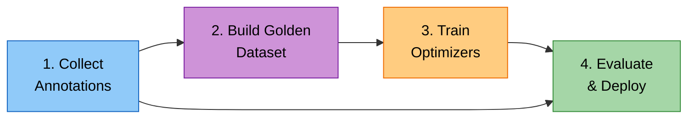
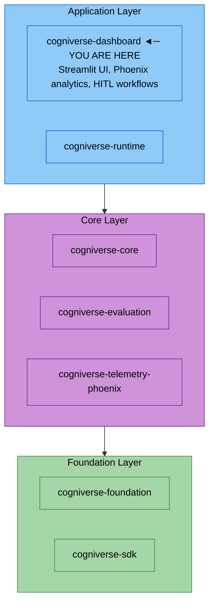

# Dashboard Module

**Package:** `cogniverse_dashboard`
**Location:** `libs/dashboard/cogniverse_dashboard/`

---

## Table of Contents

1. [Overview](#overview)
2. [Package Structure](#package-structure)
3. [Main Application](#main-application)
4. [Dashboard Tabs](#dashboard-tabs)
   - [Analytics Tab](#analytics-tab)
   - [Evaluation Tab](#evaluation-tab)
   - [Embedding Atlas Tab](#embedding-atlas-tab)
   - [Routing Evaluation Tab](#routing-evaluation-tab)
   - [Interactive Search Tab](#interactive-search-tab)
   - [Orchestration Annotation Tab](#orchestration-annotation-tab)
   - [Approval Queue Tab](#approval-queue-tab)
   - [Configuration Management Tab](#configuration-management-tab)
   - [Memory Management Tab](#memory-management-tab)
   - [Backend Profile Tab](#backend-profile-tab)
   - [Ingestion Testing Tab](#ingestion-testing-tab)
   - [Multi-Modal Chat Tab](#multi-modal-chat-tab)
   - [Enhanced Optimization Tab](#enhanced-optimization-tab)
5. [Phoenix Data Manager](#phoenix-data-manager)
6. [Configuration](#configuration)
7. [Deployment](#deployment)
8. [Testing](#testing)

---

## Overview

The Dashboard module provides a **Streamlit-based UI** for:

- **Phoenix Analytics**: Visualize OpenTelemetry traces, spans, and experiments
- **Evaluation Management**: Track experiments, compare results, view metrics
- **Embedding Visualization**: Atlas visualization of embeddings and clusters
- **Interactive Search**: Live search testing with per-result annotation
- **HITL Workflows**: Human approval queues and orchestration annotation
- **System Monitoring**: Configuration, memory, and ingestion management

The dashboard integrates with agents via the **A2A protocol** for real-time interaction.

**Main Entry Point:** The primary dashboard application is `scripts/phoenix_dashboard_standalone.py`, which aggregates all dashboard tabs and provides the complete UI. The `libs/dashboard/cogniverse_dashboard/` package contains utility modules (PhoenixDataManager, PhoenixLauncher) that support dashboard operations.

---

## Package Structure

**Dashboard Package** (`libs/dashboard/cogniverse_dashboard/`):
```text
cogniverse_dashboard/
  __init__.py
  app.py (legacy dashboard, use phoenix_dashboard_standalone.py instead)
  tabs/ (empty directory)
  utils/
    __init__.py
    phoenix_launcher.py
    phoenix_data_manager.py
```

**Dashboard Application and Tabs** (`scripts/`):
```text
scripts/
  phoenix_dashboard_standalone.py (main entry point)
  phoenix_dashboard_evaluation_tab_tabbed.py
  embedding_atlas_tab.py
  routing_evaluation_tab.py
  interactive_search_tab.py
  orchestration_annotation_tab.py
  approval_queue_tab.py
  config_management_tab.py
  memory_management_tab.py
  backend_profile_tab.py
  ingestion_testing_tab.py
  multi_modal_chat_tab.py
  enhanced_optimization_tab.py
```

**Key Notes:**
- Dashboard utilities (PhoenixDataManager, PhoenixLauncher) are in the `cogniverse_dashboard` package
- All dashboard tabs are standalone scripts in the `scripts/` directory
- The main application is `scripts/phoenix_dashboard_standalone.py`

---

## Main Application

The main application (`phoenix_dashboard_standalone.py`) orchestrates all dashboard tabs:

```python
# Start the dashboard
uv run streamlit run scripts/phoenix_dashboard_standalone.py

# With custom port
uv run streamlit run scripts/phoenix_dashboard_standalone.py --server.port 8501
```

**Key Components:**

1. **Analytics Session State**: Maintains Phoenix analytics instance across interactions
2. **Tab Loading**: Dynamically imports tab modules with graceful fallback
3. **A2A Client**: Communicates with agents for real-time operations
4. **Async Wrapper**: Handles async operations in Streamlit's sync context

```python
# Async helper for Streamlit
def run_async_in_streamlit(coro):
    """Run async operations in Streamlit."""
    try:
        loop = asyncio.get_event_loop()
        if loop.is_running():
            with concurrent.futures.ThreadPoolExecutor() as executor:
                future = executor.submit(asyncio.run, coro)
                return future.result()
        else:
            return asyncio.run(coro)
    except RuntimeError:
        return asyncio.run(coro)
```

**Session State Management:**

```python
import streamlit as st

# Initialize analytics session
if 'analytics' not in st.session_state:
    st.session_state.analytics = PhoenixAnalytics()

# Track refresh timing
if 'last_refresh' not in st.session_state:
    st.session_state.last_refresh = datetime.now()

# Auto-refresh toggle
if 'auto_refresh' not in st.session_state:
    st.session_state.auto_refresh = False
```

---

## Dashboard Tabs

### Analytics Tab

**Purpose:** Phoenix trace visualization and performance analysis

**Features:**

- View all traces for tenant/project

- Filter by time range, status, operation

- Drill down into individual spans

- View span attributes and events

- Export traces to CSV/JSON

```python
# Dashboard is a Streamlit app - analytics are rendered via phoenix_dashboard_standalone.py
# Run with: uv run streamlit run scripts/phoenix_dashboard_standalone.py

# For programmatic access to Phoenix traces, import from the telemetry-phoenix package:
from cogniverse_telemetry_phoenix.evaluation.analytics import PhoenixAnalytics

analytics = PhoenixAnalytics(phoenix_url="http://localhost:6006")
traces = analytics.get_traces(
    start_time=None,
    end_time=None,
    operation_filter=None,
    limit=10000
)
```

### Evaluation Tab

**File:** `scripts/phoenix_dashboard_evaluation_tab_tabbed.py`

**Purpose:** Experiment tracking and comparison

**Features:**

- List all experiments with filters

- Compare experiment results side-by-side

- View optimizer settings and hyperparameters

- Visualize metric trends over time

- Export experiment data

```python
# Tab files are standalone scripts in scripts/ directory
# Import directly when scripts/ is in sys.path
from phoenix_dashboard_evaluation_tab_tabbed import render_evaluation_tab

# Render in dashboard
render_evaluation_tab()
```

### Embedding Atlas Tab

**File:** `scripts/embedding_atlas_tab.py`

**Purpose:** Embedding space visualization

**Features:**

- UMAP/t-SNE dimensionality reduction

- Interactive embedding plots

- Cluster visualization

- Similarity search from embeddings

- Per-profile embedding analysis

```python
# Import from scripts/ directory (ensure scripts/ is in sys.path)
from embedding_atlas_tab import render_embedding_atlas_tab

# Render embedding visualization
render_embedding_atlas_tab()
```

### Routing Evaluation Tab

**File:** `scripts/routing_evaluation_tab.py`

**Purpose:** Modality routing performance analysis

**Features:**

- Routing accuracy by modality

- Confidence distribution analysis

- Misrouting pattern identification

- Per-tier performance breakdown

- Routing latency metrics

```python
from routing_evaluation_tab import render_routing_evaluation_tab

# Render routing metrics
render_routing_evaluation_tab()
```

### Interactive Search Tab

**File:** `scripts/interactive_search_tab.py`

**Purpose:** Live search testing with relevance annotation

**Features:**

- Execute search queries in real-time

- View results with thumbnails

- Annotate relevance per result

- Session-aware search tracking

- Export search sessions for evaluation

```python
from interactive_search_tab import render_interactive_search_tab

# Render with agent status for availability checking
render_interactive_search_tab(agent_status=agent_status)
```

### Orchestration Annotation Tab

**File:** `scripts/orchestration_annotation_tab.py`

**Purpose:** Workflow quality scoring and annotation

**Features:**

- View multi-agent orchestration traces

- Score workflow quality

- Annotate agent decisions

- Identify workflow patterns

- Feed annotations to optimizer

```python
from orchestration_annotation_tab import render_orchestration_annotation_tab

render_orchestration_annotation_tab()
```

### Approval Queue Tab

**File:** `scripts/approval_queue_tab.py`

**Purpose:** Human-in-the-loop approval workflows

**Features:**

- View pending approval requests

- Approve/reject with comments

- Bulk approval operations

- Confidence-based filtering

- Approval history

```python
from approval_queue_tab import render_approval_queue_tab

# Render approval queue
render_approval_queue_tab()
```

### Configuration Management Tab

**File:** `scripts/config_management_tab.py`

**Purpose:** System configuration editor

**Features:**

- View all configuration types

- Edit configuration values

- Profile management

- Configuration history

- Export/import configs

```python
from config_management_tab import render_config_management_tab

render_config_management_tab()
```

### Memory Management Tab

**File:** `scripts/memory_management_tab.py`

**Purpose:** Memory system inspection

**Features:**

- View semantic memories

- Memory search

- Memory statistics

- Clear/reset memory

- Memory export

```python
from memory_management_tab import render_memory_management_tab

render_memory_management_tab()
```

### Backend Profile Tab

**File:** `scripts/backend_profile_tab.py`

**Purpose:** CRUD interface for backend profiles via ConfigManager

**Features:**

- Create, edit, delete backend profiles

- Schema deployment to Vespa via admin API

- Profile schema status checking

- Tenant-aware profile management

- JSON configuration editing

```python
from backend_profile_tab import render_backend_profile_tab

# Render profile management UI
render_backend_profile_tab()
```

**Admin API Integration:**

| Endpoint | Method | Purpose |
|----------|--------|---------|
| `/admin/profiles/{name}/deploy` | POST | Deploy schema for profile |
| `/admin/profiles/{name}` | GET | Check schema deployment status |
| `/admin/profiles/{name}` | DELETE | Delete profile and optionally schema |

### Ingestion Testing Tab

**File:** `scripts/ingestion_testing_tab.py`

**Purpose:** Interactive testing of video ingestion pipelines

**Features:**

- Video upload (MP4, MOV, AVI)

- Multi-profile processing selection

- Pipeline configuration (max frames, chunk duration, keyframe method)

- Audio transcription toggle

- Frame description generation toggle

- Real-time processing progress

- Processing metrics display

```python
from ingestion_testing_tab import render_ingestion_testing_tab

# Render with agent status for availability checking
render_ingestion_testing_tab(agent_status=agent_status)
```

**Configuration Options:**

| Option | Range | Description |
|--------|-------|-------------|
| Max Frames | 1-50 | Maximum frames extracted per video |
| Chunk Duration | 5-60s | Duration per processing chunk |
| Keyframe Method | fps, scene_detection, uniform | Extraction strategy |
| Embedding Precision | float32, binary | Vespa storage format |

### Multi-Modal Chat Tab

**File:** `scripts/multi_modal_chat_tab.py`

**Purpose:** Conversational interface with multi-modal input support

**Features:**

- Text, video, image, PDF input support

- Tenant selection and validation (org:tenant format)

- Memory integration via Mem0

- Routing agent integration for intelligent agent selection

- Chat message history with bubbles

- File upload and preprocessing

- Async operation handling

```python
from multi_modal_chat_tab import render_multi_modal_chat_tab

# Render chat interface with agent configuration
render_multi_modal_chat_tab(agent_config={
    "routing_agent": "http://localhost:8000/agents/routing_agent",
    "video_search": "http://localhost:8000/agents/video_search"
})
```

**Memory Integration:**

The chat tab integrates with the RoutingAgent's `MemoryAwareMixin`:
- Context retention across conversations
- Semantic memory search for relevant context
- Automatic interaction storage
- Memory capability checking via `/agents/routing_agent` endpoint

### Enhanced Optimization Tab

**File:** `scripts/enhanced_optimization_tab.py`

**Purpose:** Comprehensive optimization framework with 8 sub-tabs

**Features:**

- Search result annotation (thumbs up/down, star ratings)

- Golden dataset builder from Phoenix annotations

- Synthetic data generation for all optimizers

- Routing optimization (GRPO/GEPA)

- DSPy module optimization (teacher-student distillation)

- Reranking optimization from user feedback

- Profile selection optimization

- Unified metrics dashboard

```python
from enhanced_optimization_tab import render_enhanced_optimization_tab

# Render full optimization framework
render_enhanced_optimization_tab()
```

**Sub-Tab Structure:**

| Sub-Tab | Purpose |
|---------|---------|
| Overview | Quick stats and workflow diagram |
| Search Annotations | Collect human feedback on search results |
| Golden Dataset | Build ground truth dataset from annotations |
| Synthetic Data | Generate training data for optimizers |
| Module Optimization | DSPy module training and distillation |
| Reranking Optimization | Train reranker from user feedback |
| Profile Selection | Optimize profile selection strategy |
| Metrics Dashboard | Unified view of optimization metrics |

**Optimization Workflow:**



---

## Phoenix Data Manager

The `PhoenixDataManager` class provides utilities for managing Phoenix persistent data:

```python
from cogniverse_dashboard.utils.phoenix_data_manager import PhoenixDataManager

manager = PhoenixDataManager(data_dir="./data/phoenix")

# Create backup
backup_path = manager.backup(name="before_experiment")

# Restore from backup
manager.restore("before_experiment", force=True)

# List available backups
backups = manager.list_backups()
for backup in backups:
    print(f"{backup['name']}: {backup['size_mb']:.2f} MB")

# Clean old data
manager.clean(older_than_days=30, dry_run=True)

# Analyze data directory
analysis = manager.analyze()
print(f"Total size: {analysis['total_size_mb']:.2f} MB")
print(f"Traces: {analysis['traces']['count']} files")

# Export/import datasets
manager.export_datasets("./exports/datasets")
manager.import_datasets("./imports/datasets")
```

**CLI Usage:**

```bash
# Backup
uv run python libs/dashboard/cogniverse_dashboard/utils/phoenix_data_manager.py backup --name my_backup

# Restore
uv run python libs/dashboard/cogniverse_dashboard/utils/phoenix_data_manager.py restore my_backup --force

# List backups
uv run python libs/dashboard/cogniverse_dashboard/utils/phoenix_data_manager.py list

# Clean old data
uv run python libs/dashboard/cogniverse_dashboard/utils/phoenix_data_manager.py clean --older-than 30

# Analyze
uv run python libs/dashboard/cogniverse_dashboard/utils/phoenix_data_manager.py analyze
```

---

## Configuration

### Environment Variables

```bash
# Required
export TENANT_ID="acme"
export PHOENIX_ENDPOINT="http://localhost:6006"

# Optional
export VESPA_URL="http://localhost:8080"
export STREAMLIT_SERVER_PORT="8501"
export STREAMLIT_SERVER_ADDRESS="0.0.0.0"
```

### Streamlit Config

Create `.streamlit/config.toml`:

```toml
[server]
port = 8501
address = "0.0.0.0"
enableCORS = false
enableXsrfProtection = true
runOnSave = true

[browser]
gatherUsageStats = false

[theme]
primaryColor = "#FF6B9D"
backgroundColor = "#0E1117"
secondaryBackgroundColor = "#262730"
textColor = "#FAFAFA"
font = "sans serif"
```

### Caching for Performance

```python
import streamlit as st
from cogniverse_telemetry_phoenix.evaluation.analytics import PhoenixAnalytics

@st.cache_data(ttl=60)  # Cache for 60 seconds
def load_traces(start_time=None, end_time=None):
    """Load traces with caching."""
    analytics = PhoenixAnalytics()
    return analytics.get_traces(
        start_time=start_time,
        end_time=end_time,
        limit=10000
    )

# Use cached function
traces = load_traces()
```

---

## Architecture Position



**Dependencies:**

- `cogniverse-core`: Memory, orchestration

- `cogniverse-evaluation`: Experiment tracking, metrics

- `cogniverse-runtime`: FastAPI runtime with agent endpoints

- `cogniverse-sdk`: Core interfaces (Document, SearchResult)

**External Dependencies:**

- `streamlit>=1.29.0`: Web UI framework

- `plotly>=6.0.0`: Interactive charts

---

## Deployment

### Development

```bash
# Install dependencies
uv sync

# Run with auto-reload
uv run streamlit run scripts/phoenix_dashboard_standalone.py --server.runOnSave true

# Access dashboard
open http://localhost:8501
```

### Production

```bash
# Run in production mode
uv run streamlit run scripts/phoenix_dashboard_standalone.py \
    --server.port 8501 \
    --server.address 0.0.0.0 \
    --server.headless true
```

### Docker

```dockerfile
FROM python:3.11-slim

RUN pip install uv
COPY . /app
WORKDIR /app
RUN uv sync

EXPOSE 8501
CMD ["uv", "run", "streamlit", "run", \
     "scripts/phoenix_dashboard_standalone.py", \
     "--server.port", "8501", \
     "--server.address", "0.0.0.0"]
```

### Docker Compose

```yaml
version: '3.8'

services:
  dashboard:
    build: .
    ports:
      - "8501:8501"
    environment:
      - TENANT_ID=acme
      - PHOENIX_ENDPOINT=http://phoenix:6006
      - VESPA_URL=http://vespa:8080
    depends_on:
      - phoenix
      - vespa

  phoenix:
    image: arizephoenix/phoenix:latest
    ports:
      - "6006:6006"
      - "4317:4317"

  vespa:
    image: vespaengine/vespa
    ports:
      - "8080:8080"
```

---

## Testing

```bash
# Run dashboard tests
uv run pytest tests/dashboard/ -v

# Run profile UI integration tests
uv run pytest tests/dashboard/test_profile_ui_integration.py -v

# Test with coverage
uv run pytest tests/dashboard/ --cov=cogniverse_dashboard --cov-report=html
```

---

## Related Documentation

- [Core Module](./core.md) - Memory and orchestration
- [Foundation Module](./foundation.md) - Configuration and telemetry
- [Evaluation Module](./evaluation.md) - Experiment tracking
- [Telemetry Module](./telemetry.md) - Phoenix provider
- [Runtime Module](./runtime.md) - FastAPI companion application

---

**Summary:** The Dashboard module provides a comprehensive Streamlit UI for Cogniverse. It includes tabs for Phoenix analytics, evaluation management, embedding visualization, interactive search, and HITL workflows. The `PhoenixDataManager` provides utilities for data backup/restore. All tabs integrate with the A2A protocol for real-time agent communication.
