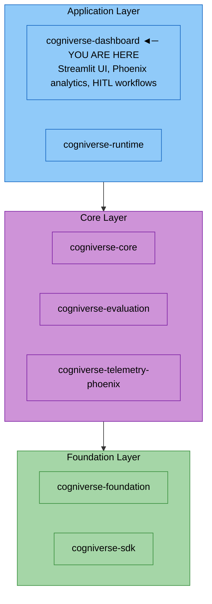

# Dashboard Module

**Package:** `cogniverse_dashboard`
**Location:** `libs/dashboard/cogniverse_dashboard/`

---

## Table of Contents

1. [Overview](#overview)
2. [Package Structure](#package-structure)
3. [Main Application](#main-application)
4. [Dashboard Tabs](#dashboard-tabs)
   - [Analytics Tab](#analytics-tab)
   - [Evaluation Tab](#evaluation-tab)
   - [Embedding Atlas Tab](#embedding-atlas-tab)
   - [Routing Evaluation Tab](#routing-evaluation-tab)
   - [Orchestration Annotation Tab](#orchestration-annotation-tab)
   - [Profile Routing Metrics Tab](#profile-routing-metrics-tab)
   - [Optimization Tab](#optimization-tab)
   - [Enhanced Optimization Tab](#enhanced-optimization-tab)
   - [Approval Queue Tab](#approval-queue-tab)
   - [Ingestion Testing Tab](#ingestion-testing-tab)
   - [Interactive Search Tab](#interactive-search-tab)
   - [Chat Tab](#chat-tab)
   - [Configuration Management Tab](#configuration-management-tab)
   - [Tenant Management Tab](#tenant-management-tab)
   - [Memory Management Tab](#memory-management-tab)
   - [RLM A/B Compare Tab](#rlm-ab-compare-tab)
   - [Backend Profile Tab](#backend-profile-tab)
5. [Phoenix Data Manager](#phoenix-data-manager)
6. [Configuration](#configuration)
7. [Deployment](#deployment)
8. [Testing](#testing)

---

## Overview

The Dashboard module provides a **Streamlit-based UI** for:

- **Phoenix Analytics**: Visualize OpenTelemetry traces, spans, and experiments
- **Evaluation Management**: Track experiments, compare results, view metrics
- **HITL Workflows**: Human approval queues and orchestration annotation
- **System Monitoring**: Configuration, memory, and backend profile management

The dashboard communicates with the **unified Runtime** (`http://localhost:8000`) via REST API. Search queries go through `POST /search/`, agent status is checked via `GET /agents/`, and configuration is managed through `/admin/` endpoints. The Runtime handles routing, agent dispatch, and telemetry internally. The dashboard never instantiates agents directly.

**Main Entry Point:** `libs/dashboard/cogniverse_dashboard/app.py` — the primary Streamlit application. All tabs are in the `cogniverse_dashboard.tabs` package.

---

## Package Structure

```text
libs/dashboard/cogniverse_dashboard/
  __init__.py
  app.py                        # Main Streamlit entry point
  search_summary.py             # Streaming summarization control for search results
  tabs/
    __init__.py
    approval_queue.py
    backend_profile.py
    config_management.py
    embedding_atlas.py
    evaluation.py
    memory_management.py
    optimization.py
    orchestration_annotation.py
    profile_metrics.py
    rlm_ab_compare.py
    routing_evaluation.py
    tenant_management.py
  utils/
    __init__.py
    async_utils.py
```

---

## Main Application

The main application (`libs/dashboard/cogniverse_dashboard/app.py`) orchestrates all dashboard tabs:

```python
# Start the dashboard
uv run streamlit run libs/dashboard/cogniverse_dashboard/app.py

# With custom port
uv run streamlit run libs/dashboard/cogniverse_dashboard/app.py --server.port 8501
```

**Key Components:**

1. **Analytics Session State**: Maintains Phoenix analytics instance across interactions
2. **Tab Loading**: Dynamically imports tab modules with graceful fallback
3. **Runtime Client**: Communicates with unified Runtime for search, agent status, and admin operations
4. **Async Wrapper**: Handles async operations in Streamlit's sync context

```python
# Async helper for Streamlit — defined in cogniverse_dashboard.utils.async_utils
def run_async_in_streamlit(coro: Any) -> Any:
    """Run an async coroutine from Streamlit's sync context."""
    try:
        loop = asyncio.get_event_loop()
        if loop.is_running():
            with concurrent.futures.ThreadPoolExecutor() as executor:
                future = executor.submit(asyncio.run, coro)
                return future.result()
        return asyncio.run(coro)
    except RuntimeError:
        return asyncio.run(coro)
```

**Session State Management:**

```python
import streamlit as st
from cogniverse_telemetry_phoenix.evaluation.analytics import PhoenixAnalytics as Analytics

# Initialize analytics session with telemetry URL from system config
if 'analytics' not in st.session_state:
    st.session_state.analytics = Analytics(telemetry_url=_system_config.telemetry_url)

# Track refresh timing
if 'last_refresh' not in st.session_state:
    st.session_state.last_refresh = datetime.now()

# Auto-refresh toggle
if 'auto_refresh' not in st.session_state:
    st.session_state.auto_refresh = False
```

---

## Dashboard Tabs

The app renders 16 tabs in order. The table below shows the tab label, the tab index in `main_tabs`, and the rendering function or module:

| # | Label | Rendering |
|---|-------|-----------|
| 0 | 📊 Analytics | Inline in `app.py` |
| 1 | 🧪 Evaluation | `tabs/evaluation.py` → `render_evaluation_tab()` |
| 2 | 🗺️ Embedding Atlas | `tabs/embedding_atlas.py` → `render_embedding_atlas_tab()` |
| 3 | 🎯 Routing Evaluation | `tabs/routing_evaluation.py` → `render_routing_evaluation_tab()` |
| 4 | 🔄 Orchestration Annotation | `tabs/orchestration_annotation.py` → `render_orchestration_annotation_tab()` |
| 5 | 📈 Profile Routing Metrics | `tabs/profile_metrics.py` → `render_profile_metrics_tab()` |
| 6 | 🔧 Optimization | Inline in `app.py` (system optimization / training-example upload) |
| 7 | 🔬 Synthetic Data & Optimization | `tabs/optimization.py` → `render_enhanced_optimization_tab()` |
| 8 | ✅ Approval Queue | `tabs/approval_queue.py` → `render_approval_queue_tab()` |
| 9 | 📥 Ingestion Testing | Inline in `app.py` |
| 10 | 🔍 Interactive Search | Inline in `app.py` |
| 11 | 💬 Chat | Inline in `app.py` |
| 12 | ⚙️ Configuration | `tabs/config_management.py` → `render_config_management_tab()` |
| 13 | 👥 Tenant Management | `tabs/tenant_management.py` → `render_tenant_management_tab()` |
| 14 | 🧠 Memory | `tabs/memory_management.py` → `render_memory_management_tab()` |
| 15 | 🅰️🅱️ RLM A/B Compare | `tabs/rlm_ab_compare.py` → `render_rlm_ab_compare_tab()` |

### Analytics Tab

**Purpose:** Phoenix trace visualization and performance analysis — rendered inline in `app.py`

**Features:**

- View all traces for tenant/project

- Filter by time range, status, operation

- Sub-tabs: Overview, Time Series, Distributions, Heatmaps, Outliers, Trace Explorer, Root Cause Analysis

- Export traces via raw data table toggle

```python
# For programmatic access to Phoenix traces, import from the telemetry-phoenix package:
from cogniverse_telemetry_phoenix.evaluation.analytics import PhoenixAnalytics

analytics = PhoenixAnalytics(telemetry_url="http://localhost:6006")
traces = analytics.get_traces(
    start_time=None,
    end_time=None,
    operation_filter=None,
    limit=10000
)
```

### Evaluation Tab

**File:** `libs/dashboard/cogniverse_dashboard/tabs/evaluation.py`

**Purpose:** Experiment tracking and comparison

**Features:**

- List all experiments with filters

- Compare experiment results side-by-side

- View optimizer settings and hyperparameters

- Visualize metric trends over time

- Export experiment data

```python
from cogniverse_dashboard.tabs.evaluation import render_evaluation_tab

render_evaluation_tab()
```

### Embedding Atlas Tab

**File:** `libs/dashboard/cogniverse_dashboard/tabs/embedding_atlas.py`

**Purpose:** Visual exploration of embedding spaces

```python
from cogniverse_dashboard.tabs.embedding_atlas import render_embedding_atlas_tab

render_embedding_atlas_tab()
```

### Routing Evaluation Tab

**File:** `libs/dashboard/cogniverse_dashboard/tabs/routing_evaluation.py`

**Purpose:** Modality routing performance analysis

**Features:**

- Routing accuracy by modality

- Confidence distribution analysis

- Misrouting pattern identification

- Per-tier performance breakdown

- Routing latency metrics

```python
from cogniverse_dashboard.tabs.routing_evaluation import render_routing_evaluation_tab

render_routing_evaluation_tab()
```

### Orchestration Annotation Tab

**File:** `libs/dashboard/cogniverse_dashboard/tabs/orchestration_annotation.py`

**Purpose:** Workflow quality scoring and annotation

**Features:**

- View multi-agent orchestration traces

- Score workflow quality

- Annotate agent decisions

- Identify workflow patterns

- Feed annotations to optimizer

```python
from cogniverse_dashboard.tabs.orchestration_annotation import render_orchestration_annotation_tab

render_orchestration_annotation_tab()
```

### Profile Routing Metrics Tab

**File:** `libs/dashboard/cogniverse_dashboard/tabs/profile_metrics.py`

**Purpose:** Per-profile routing performance metrics

```python
from cogniverse_dashboard.tabs.profile_metrics import render_profile_metrics_tab

render_profile_metrics_tab()
```

### Optimization Tab

**Purpose:** System optimization controls — rendered inline in `app.py`

**Features:**

- Upload training examples (JSON) for routing, search relevance, and agent response optimization

- Trigger DSPy optimization runs via the Runtime CLI

### Enhanced Optimization Tab

**File:** `libs/dashboard/cogniverse_dashboard/tabs/optimization.py`

**Purpose:** Comprehensive optimization framework with multiple sub-tabs

**Features:**

- Search result annotation (thumbs up/down, star ratings)

- Golden dataset builder from Phoenix annotations

- Synthetic data generation for all optimizers

- Routing optimization

- DSPy module optimization (teacher-student distillation)

- Reranking optimization from user feedback

- Profile selection optimization

- Unified metrics dashboard

```python
from cogniverse_dashboard.tabs.optimization import render_enhanced_optimization_tab

render_enhanced_optimization_tab()
```

### Approval Queue Tab

**File:** `libs/dashboard/cogniverse_dashboard/tabs/approval_queue.py`

**Purpose:** Human-in-the-loop approval workflows

**Features:**

- View pending approval requests

- Approve/reject with comments

- Bulk approval operations

- Confidence-based filtering

- Approval history

```python
from cogniverse_dashboard.tabs.approval_queue import render_approval_queue_tab

render_approval_queue_tab()
```

### Ingestion Testing Tab

**Purpose:** Interactive video ingestion pipeline testing — rendered inline in `app.py`

**Features:**

- Video upload and processing with profile selection

- Ingestion job status monitoring via Runtime API

### Interactive Search Tab

**Purpose:** Search query testing against the Runtime — rendered inline in `app.py`

**Features:**

- Submit search queries with profile selection

- View ranked results with scores

- Multi-turn conversation history

- Session annotation for evaluation

### Chat Tab

**Purpose:** Multi-modal chat with agents via the routing layer — rendered inline in `app.py`

**Features:**

- Send messages routed through `gateway_agent`

- Multi-turn conversation history

- Streaming response display

### Configuration Management Tab

**File:** `libs/dashboard/cogniverse_dashboard/tabs/config_management.py`

**Purpose:** System configuration editor

**Features:**

- View all configuration types

- Edit configuration values

- Profile management

- Configuration history

- Export/import configs

```python
from cogniverse_dashboard.tabs.config_management import render_config_management_tab

render_config_management_tab()
```

### Tenant Management Tab

**File:** `libs/dashboard/cogniverse_dashboard/tabs/tenant_management.py`

**Purpose:** Tenant registration and management

```python
from cogniverse_dashboard.tabs.tenant_management import render_tenant_management_tab

render_tenant_management_tab()
```

### Memory Management Tab

**File:** `libs/dashboard/cogniverse_dashboard/tabs/memory_management.py`

**Purpose:** Memory system inspection

**Features:**

- View semantic memories

- Memory search

- Memory statistics

- Clear/reset memory

- Memory export

```python
from cogniverse_dashboard.tabs.memory_management import render_memory_management_tab

render_memory_management_tab()
```

### RLM A/B Compare Tab

**File:** `libs/dashboard/cogniverse_dashboard/tabs/rlm_ab_compare.py`

**Purpose:** Compare two language model configurations side-by-side using spans emitted by `cogniverse-optim --mode ab-compare`

**Features:**

- Per-row latency, token, and judge score deltas

- Aggregate comparison metrics

```python
from cogniverse_dashboard.tabs.rlm_ab_compare import render_rlm_ab_compare_tab

render_rlm_ab_compare_tab()
```

### Backend Profile Tab (standalone module)

**File:** `libs/dashboard/cogniverse_dashboard/tabs/backend_profile.py`

**Purpose:** CRUD interface for backend profiles via ConfigManager — provides helper functions used by other parts of the dashboard

**Functions:**

- `render_backend_profile_tab()` — main entry point
- `render_create_profile_form(manager, tenant_id)` — create profile form
- `render_profile_manager(manager, tenant_id, profile_name)` — profile CRUD
- `render_deploy_schema_section(...)` — Vespa schema deployment

**Admin API Integration:**

| Endpoint | Method | Purpose |
|----------|--------|---------|
| `/admin/profiles/{name}/deploy` | POST | Deploy schema for profile |
| `/admin/profiles/{name}` | GET | Check schema deployment status |
| `/admin/profiles/{name}` | DELETE | Delete profile and optionally schema |

---

## Phoenix Data Management

Phoenix persistent data (backup/restore/clean/analyze) is managed by the
`scripts/manage_phoenix_data.py` CLI:

```bash
# Backup
uv run python scripts/manage_phoenix_data.py backup --name my_backup

# Restore
uv run python scripts/manage_phoenix_data.py restore my_backup --force

# List backups
uv run python scripts/manage_phoenix_data.py list

# Clean old data
uv run python scripts/manage_phoenix_data.py clean --older-than 30

# Analyze
uv run python scripts/manage_phoenix_data.py analyze
```

---

## Configuration

### Environment Variables

```bash
# Required
export TENANT_ID="acme"
export PHOENIX_ENDPOINT="http://localhost:6006"

# Optional
export VESPA_URL="http://localhost:8080"
export STREAMLIT_SERVER_PORT="8501"
export STREAMLIT_SERVER_ADDRESS="0.0.0.0"
```

### Streamlit Config

Create `.streamlit/config.toml`:

```toml
[server]
port = 8501
address = "0.0.0.0"
enableCORS = false
enableXsrfProtection = true
runOnSave = true

[browser]
gatherUsageStats = false

[theme]
primaryColor = "#FF6B9D"
backgroundColor = "#0E1117"
secondaryBackgroundColor = "#262730"
textColor = "#FAFAFA"
font = "sans serif"
```

### Caching for Performance

```python
import streamlit as st
from cogniverse_telemetry_phoenix.evaluation.analytics import PhoenixAnalytics

@st.cache_data(ttl=60)  # Cache for 60 seconds
def load_traces(start_time=None, end_time=None):
    """Load traces with caching."""
    analytics = PhoenixAnalytics()
    return analytics.get_traces(
        start_time=start_time,
        end_time=end_time,
        limit=10000
    )

# Use cached function
traces = load_traces()
```

---

## Architecture Position


```mermaid
flowchart TB
    subgraph AppLayer["<span style='color:#000'>Application Layer</span>"]
        Dashboard["<span style='color:#000'>cogniverse-dashboard ◄─ YOU ARE HERE<br/>Streamlit UI, Phoenix analytics, HITL workflows</span>"]
        Runtime["<span style='color:#000'>cogniverse-runtime</span>"]
    end

    subgraph CoreLayer["<span style='color:#000'>Core Layer</span>"]
        Core["<span style='color:#000'>cogniverse-core</span>"]
        Evaluation["<span style='color:#000'>cogniverse-evaluation</span>"]
        Telemetry["<span style='color:#000'>cogniverse-telemetry-phoenix</span>"]
    end

    subgraph FoundationLayer["<span style='color:#000'>Foundation Layer</span>"]
        Foundation["<span style='color:#000'>cogniverse-foundation</span>"]
        SDK["<span style='color:#000'>cogniverse-sdk</span>"]
    end

    AppLayer --> CoreLayer
    CoreLayer --> FoundationLayer

    style AppLayer fill:#90caf9,stroke:#1565c0,color:#000
    style Dashboard fill:#90caf9,stroke:#1565c0,color:#000
    style Runtime fill:#90caf9,stroke:#1565c0,color:#000
    style CoreLayer fill:#ce93d8,stroke:#7b1fa2,color:#000
    style Core fill:#ce93d8,stroke:#7b1fa2,color:#000
    style Evaluation fill:#ce93d8,stroke:#7b1fa2,color:#000
    style Telemetry fill:#ce93d8,stroke:#7b1fa2,color:#000
    style FoundationLayer fill:#a5d6a7,stroke:#388e3c,color:#000
    style Foundation fill:#a5d6a7,stroke:#388e3c,color:#000
    style SDK fill:#a5d6a7,stroke:#388e3c,color:#000
```

**Dependencies:**

- `cogniverse-core`: Memory, orchestration

- `cogniverse-evaluation`: Experiment tracking, metrics

- `cogniverse-runtime`: FastAPI runtime with agent endpoints

- `cogniverse-sdk`: Core interfaces (Document, SearchResult)

**External Dependencies:**

- `streamlit>=1.29.0`: Web UI framework

- `plotly>=6.0.0`: Interactive charts

---

## Deployment

### Development

```bash
# Install dependencies
uv sync

# Run with auto-reload
uv run streamlit run libs/dashboard/cogniverse_dashboard/app.py --server.runOnSave true

# Access dashboard
open http://localhost:8501
```

### Production

```bash
# Run in production mode
uv run streamlit run libs/dashboard/cogniverse_dashboard/app.py \
    --server.port 8501 \
    --server.address 0.0.0.0 \
    --server.headless true
```

### Docker

```dockerfile
FROM python:3.11-slim

RUN pip install uv
COPY . /app
WORKDIR /app
RUN uv sync

EXPOSE 8501
CMD ["uv", "run", "streamlit", "run", \
     "libs/dashboard/cogniverse_dashboard/app.py", \
     "--server.port", "8501", \
     "--server.address", "0.0.0.0"]
```

### Docker Compose

```yaml
version: '3.8'

services:
  dashboard:
    build: .
    ports:
      - "8501:8501"
    environment:
      - TENANT_ID=acme
      - PHOENIX_ENDPOINT=http://phoenix:6006
      - VESPA_URL=http://vespa:8080
    depends_on:
      - phoenix
      - vespa

  phoenix:
    image: arizephoenix/phoenix:latest
    ports:
      - "6006:6006"
      - "4317:4317"

  vespa:
    image: vespaengine/vespa
    ports:
      - "8080:8080"
```

---

## Testing

```bash
# Run dashboard tests
uv run pytest tests/dashboard/ -v

# Run profile UI integration tests
uv run pytest tests/dashboard/test_profile_ui_integration.py -v

# Test with coverage
uv run pytest tests/dashboard/ --cov=cogniverse_dashboard --cov-report=html
```

---

## Related Documentation

- [Core Module](./core.md) - Memory and orchestration
- [Foundation Module](./foundation.md) - Configuration and telemetry
- [Evaluation Module](./evaluation.md) - Experiment tracking
- [Telemetry Module](./telemetry.md) - Phoenix provider
- [Runtime Module](./runtime.md) - FastAPI companion application

---

**Summary:** The Dashboard module provides a comprehensive Streamlit UI for Cogniverse. It includes tabs for Phoenix analytics, evaluation management, optimization, HITL workflows, configuration, memory, and backend profile management. Phoenix data backup/restore is handled by the `scripts/manage_phoenix_data.py` CLI. All tabs communicate with the unified Runtime via REST API for search, agent status, and configuration operations.
