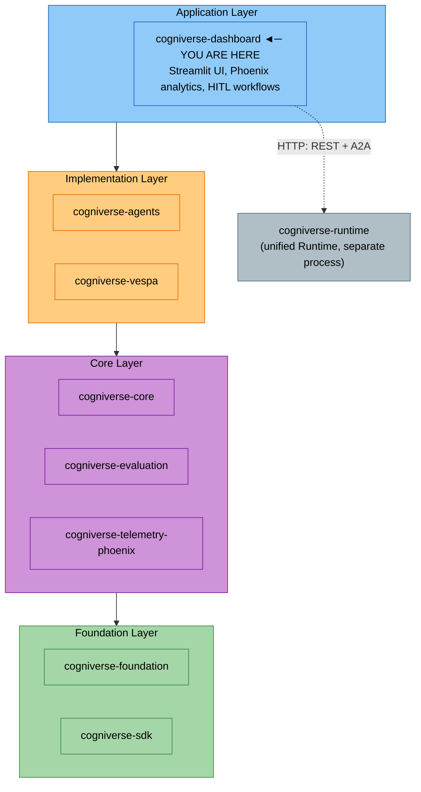

# Dashboard Module

**Package:** `cogniverse_dashboard`
**Location:** `libs/dashboard/cogniverse_dashboard/`

---

## Table of Contents

1. [Overview](#overview)
2. [Package Structure](#package-structure)
3. [Main Application](#main-application)
4. [Dashboard Tabs](#dashboard-tabs)
   - [Analytics Tab](#analytics-tab)
   - [Evaluation Tab](#evaluation-tab)
   - [Embedding Atlas Tab](#embedding-atlas-tab)
   - [Routing Evaluation Tab](#routing-evaluation-tab)
   - [Orchestration Annotation Tab](#orchestration-annotation-tab)
   - [Profile Routing Metrics Tab](#profile-routing-metrics-tab)
   - [Optimization Tab](#optimization-tab)
   - [Enhanced Optimization Tab](#enhanced-optimization-tab)
   - [Approval Queue Tab](#approval-queue-tab)
   - [Ingestion Testing Tab](#ingestion-testing-tab)
   - [Interactive Search Tab](#interactive-search-tab)
   - [Chat Tab](#chat-tab)
   - [Configuration Management Tab](#configuration-management-tab)
   - [Tenant Management Tab](#tenant-management-tab)
   - [Memory Management Tab](#memory-management-tab)
   - [RLM A/B Compare Tab](#rlm-ab-compare-tab)
   - [Backend Profile Tab](#backend-profile-tab)
5. [Phoenix Data Management](#phoenix-data-management)
6. [Configuration](#configuration)
7. [Deployment](#deployment)
8. [Testing](#testing)

---

## Overview

The Dashboard module provides a **Streamlit-based UI** for:

- **Phoenix Analytics**: Visualize OpenTelemetry traces, spans, and experiments
- **Evaluation Management**: Track experiments, compare results, view metrics
- **HITL Workflows**: Human approval queues and orchestration annotation
- **System Monitoring**: Configuration, memory, and backend profile management

The dashboard communicates with the **unified Runtime** (`http://localhost:8000`, from `SystemConfig.agent_registry_url`) over two channels — it never instantiates agents directly:

- **A2A streaming** (`POST /a2a/`, JSON-RPC `message/stream` over SSE) — used by the Interactive Search tab and the "Summarize Results" control (`search_summary.py`) to show progressive status/token events as an agent runs.
- **Plain REST** — the Chat tab calls `POST /agents/{agent_name}/process` (e.g. `gateway_agent`) directly for a blocking response; video ingestion goes through `POST /ingestion/start`; agent connectivity is checked via `GET /agents/{agent_name}/health`; tenant/profile administration goes through `/admin/` endpoints (`/admin/tenants`, `/admin/profiles/{name}`).

The Runtime handles routing, agent dispatch, and telemetry internally.

**Main Entry Point:** `libs/dashboard/cogniverse_dashboard/app.py` — the primary Streamlit application. All tabs are in the `cogniverse_dashboard.tabs` package.

---

## Package Structure

```text
libs/dashboard/cogniverse_dashboard/
  __init__.py
  app.py                        # Main Streamlit entry point
  search_summary.py             # Streaming summarization control for search results
  tabs/
    __init__.py
    approval_queue.py
    backend_profile.py
    config_management.py
    embedding_atlas.py
    evaluation.py
    memory_management.py
    optimization.py
    orchestration_annotation.py
    profile_metrics.py
    rlm_ab_compare.py
    routing_evaluation.py
    tenant_management.py
  utils/
    __init__.py
    async_utils.py
```

---

## Main Application

The main application (`libs/dashboard/cogniverse_dashboard/app.py`) orchestrates all dashboard tabs:

```python
# Start the dashboard
uv run streamlit run libs/dashboard/cogniverse_dashboard/app.py

# With custom port
uv run streamlit run libs/dashboard/cogniverse_dashboard/app.py --server.port 8501
```

**Key Components:**

1. **Analytics Session State**: Maintains Phoenix analytics instance across interactions
2. **Tab Loading**: Dynamically imports tab modules with graceful fallback
3. **Runtime Client**: Communicates with unified Runtime for search, agent status, and admin operations
4. **Async Wrapper**: Handles async operations in Streamlit's sync context

```python
# Async helper for Streamlit — defined in cogniverse_dashboard.utils.async_utils
def run_async_in_streamlit(coro: Any) -> Any:
    """Run an async coroutine from Streamlit's sync context."""
    try:
        loop = asyncio.get_event_loop()
        if loop.is_running():
            with concurrent.futures.ThreadPoolExecutor() as executor:
                future = executor.submit(asyncio.run, coro)
                return future.result()
        return asyncio.run(coro)
    except RuntimeError:
        return asyncio.run(coro)
```

**Session State Management:**

```python
import streamlit as st
from cogniverse_telemetry_phoenix.evaluation.analytics import PhoenixAnalytics as Analytics

# Initialize analytics session with telemetry URL from system config
if 'analytics' not in st.session_state:
    st.session_state.analytics = Analytics(telemetry_url=_system_config.telemetry_url)

# Track refresh timing
if 'last_refresh' not in st.session_state:
    st.session_state.last_refresh = datetime.now()

# Auto-refresh toggle
if 'auto_refresh' not in st.session_state:
    st.session_state.auto_refresh = False
```

---

## Dashboard Tabs

The app renders 16 tabs in order. The table below shows the tab label, the tab index in `main_tabs`, and the rendering function or module:

| # | Label | Rendering |
|---|-------|-----------|
| 0 | 📊 Analytics | Inline in `app.py` |
| 1 | 🧪 Evaluation | `tabs/evaluation.py` → `render_evaluation_tab()` |
| 2 | 🗺️ Embedding Atlas | `tabs/embedding_atlas.py` → `render_embedding_atlas_tab()` |
| 3 | 🎯 Routing Evaluation | `tabs/routing_evaluation.py` → `render_routing_evaluation_tab()` |
| 4 | 🔄 Orchestration Annotation | `tabs/orchestration_annotation.py` → `render_orchestration_annotation_tab()` |
| 5 | 📈 Profile Routing Metrics | `tabs/profile_metrics.py` → `render_profile_metrics_tab()` |
| 6 | 🔧 Optimization | Inline in `app.py` (system optimization / training-example upload) |
| 7 | 🔬 Synthetic Data & Optimization | `tabs/optimization.py` → `render_enhanced_optimization_tab()` |
| 8 | ✅ Approval Queue | `tabs/approval_queue.py` → `render_approval_queue_tab()` |
| 9 | 📥 Ingestion Testing | Inline in `app.py` |
| 10 | 🔍 Interactive Search | Inline in `app.py` |
| 11 | 💬 Chat | Inline in `app.py` |
| 12 | ⚙️ Configuration | `tabs/config_management.py` → `render_config_management_tab()` |
| 13 | 👥 Tenant Management | `tabs/tenant_management.py` → `render_tenant_management_tab()` |
| 14 | 🧠 Memory | `tabs/memory_management.py` → `render_memory_management_tab()` |
| 15 | 🅰️🅱️ RLM A/B Compare | `tabs/rlm_ab_compare.py` → `render_rlm_ab_compare_tab()` |

### Analytics Tab

**Purpose:** Phoenix trace visualization and performance analysis — rendered inline in `app.py`

**Features:**

- View all traces for tenant/project

- Filter by time range, status, operation

- Sub-tabs: Overview, Time Series, Distributions, Heatmaps, Outliers, Trace Explorer, Root Cause Analysis

- Export traces via raw data table toggle

```python
# For programmatic access to Phoenix traces, import from the telemetry-phoenix package:
from cogniverse_telemetry_phoenix.evaluation.analytics import PhoenixAnalytics

analytics = PhoenixAnalytics(telemetry_url="http://localhost:6006")
traces = analytics.get_traces(
    start_time=None,
    end_time=None,
    operation_filter=None,
    limit=10000
)
```

### Evaluation Tab

**File:** `libs/dashboard/cogniverse_dashboard/tabs/evaluation.py`

**Purpose:** Experiment tracking and comparison

**Features:**

- Select a Phoenix dataset; view example count and creation date

- Per-profile, per-ranking-strategy nested tabs showing MRR, Recall@1, Recall@5, and query count for each experiment run

- Per-query results table (query, expected, retrieved results)

- Deep links to the Phoenix dataset view and Phoenix's own experiment comparison UI

```python
from cogniverse_dashboard.tabs.evaluation import render_evaluation_tab

render_evaluation_tab()
```

### Embedding Atlas Tab

**File:** `libs/dashboard/cogniverse_dashboard/tabs/embedding_atlas.py`

**Purpose:** Visual exploration of embedding spaces using UMAP and Apple's
`embedding-atlas` component

**Features:**

- Reads parquet embeddings from `outputs/embeddings/` (written by `scripts/export_backend_embeddings.py`), with a file-upload fallback when none exist locally

- Lazily imports `umap` and `embedding_atlas.streamlit` so the base dashboard image doesn't pay their startup cost; shows an install hint (`uv pip install umap-learn embedding-atlas`) when they're missing

```python
from cogniverse_dashboard.tabs.embedding_atlas import render_embedding_atlas_tab

render_embedding_atlas_tab()
```

### Routing Evaluation Tab

**File:** `libs/dashboard/cogniverse_dashboard/tabs/routing_evaluation.py`

**Purpose:** Modality routing performance analysis

**Features:**

- Summary routing metrics from `RoutingEvaluator.calculate_metrics()`

- Per-agent precision/recall/F1 table and bar chart

- Confidence distribution analysis

- Temporal (time-windowed) analysis of routing decisions

- Human annotation of routing decisions via `AnnotationAgent` and an LLM auto-annotator (`LLMAutoAnnotator`), persisted through `RoutingAnnotationStorage`

```python
from cogniverse_dashboard.tabs.routing_evaluation import render_routing_evaluation_tab

render_routing_evaluation_tab()
```

### Orchestration Annotation Tab

**File:** `libs/dashboard/cogniverse_dashboard/tabs/orchestration_annotation.py`

**Purpose:** Workflow quality scoring and annotation

**Features:**

- View multi-agent orchestration traces

- Score workflow quality

- Annotate agent decisions

- Identify workflow patterns

- Persist annotations (workflow quality label, corrections) as Phoenix span annotations via `OrchestrationAnnotationStorage.store_annotation()`

```python
from cogniverse_dashboard.tabs.orchestration_annotation import render_orchestration_annotation_tab

render_orchestration_annotation_tab()
```

### Profile Routing Metrics Tab

**File:** `libs/dashboard/cogniverse_dashboard/tabs/profile_metrics.py`

**Purpose:** Per-modality runtime observability, aggregated from
`cogniverse.profile_selection` Phoenix spans emitted by the ProfileSelectionAgent

**Features:**

- Groups spans by the `profile_selection.modality` span attribute

- Per-modality count, p50/p95/p99 latency, and success rate

```python
from cogniverse_dashboard.tabs.profile_metrics import render_profile_metrics_tab

render_profile_metrics_tab()
```

### Optimization Tab

**Purpose:** System optimization controls — rendered inline in `app.py`

**Features:**

- Upload training examples (JSON) for routing, search relevance, and agent response optimization

- Trigger DSPy optimization runs (`gateway-thresholds`, `profile`, `entity-extraction`, etc.) via `POST /admin/tenant/{tenant}/optimize` on the Runtime

### Enhanced Optimization Tab

**File:** `libs/dashboard/cogniverse_dashboard/tabs/optimization.py`

**Purpose:** Comprehensive optimization framework with multiple sub-tabs

**Features (sub-tabs):**

- Overview — quick stats across optimization workflows

- Search Annotations — annotate search results (thumbs up/down, star rating, relevance score) for optimizer training

- Golden Dataset — golden dataset builder from Phoenix annotations

- Synthetic Data — synthetic data generation for optimizers

- Module Optimization — optimize routing/workflow/unified DSPy modules via Argo Workflows, with automatic optimizer selection (GEPA/Bootstrap/SIMBA/MIPRO) based on training data size

- Reranking Optimization — learn BM25-vs-semantic reranking weights from annotation feedback

- Profile Selection — learn which processing profile performs best per query type from telemetry

- Metrics Dashboard — unified metrics across optimization runs

```python
from cogniverse_dashboard.tabs.optimization import render_enhanced_optimization_tab

render_enhanced_optimization_tab()
```

### Approval Queue Tab

**File:** `libs/dashboard/cogniverse_dashboard/tabs/approval_queue.py`

**Purpose:** Human-in-the-loop approval workflows

**Features:**

- View pending approval requests (items below the auto-approval confidence threshold), grouped in "Pending Review", "Approved Items", "Rejected Items", and "Statistics" sub-tabs

- Approve, or reject with free-text feedback and optional entity corrections

- Decisions persisted via `ApprovalStorage.record_decision()` as `approval_decision` telemetry spans

- Per-status confidence-score statistics (mean confidence by status)

```python
from cogniverse_dashboard.tabs.approval_queue import render_approval_queue_tab

render_approval_queue_tab()
```

### Ingestion Testing Tab

**Purpose:** Interactive video ingestion pipeline testing — rendered inline in `app.py`

**Features:**

- Upload a test video and select one or more processing profiles plus pipeline options (max frames, chunk duration, transcription, descriptions, keyframe method, embedding precision)

- Synchronous per-profile processing with a progress bar, calling `POST /ingestion/start` (`action: process_video`) via `call_agent_async`; results and per-profile analysis are shown after each call completes

### Interactive Search Tab

**Purpose:** Search query testing against the Runtime — rendered inline in `app.py`

**Features:**

- Submit search queries with profile and ranking-strategy selection, streamed via the A2A endpoint (`display_streaming_result` / `stream_agent_call`) with progressive status/token events

- View per-strategy ranked results with scores, plus results/latency/profile summary metrics

- Per-session conversation history log, used both for display and for the session-level evaluation below

- Session annotation for evaluation — logs a manual session score/outcome via `EvaluationProvider.log_session_evaluation()`

### Chat Tab

**Purpose:** Multi-modal chat with agents via the routing layer — rendered inline in `app.py`

**Features:**

- Send messages via `POST /agents/gateway_agent/process` (blocking request/response, not streamed)

- Persistent chat history in `st.session_state.chat_messages`, with a "Clear History" control

### Configuration Management Tab

**File:** `libs/dashboard/cogniverse_dashboard/tabs/config_management.py`

**Purpose:** System configuration editor

**Features (sub-tabs):**

- System Config, Agent Configs, Routing Config, Telemetry Config — view and edit each configuration type

- Backend Profiles — embeds the [Backend Profile Tab](#backend-profile-tab)

- History — configuration change history

- Import/Export — export/import configs

```python
from cogniverse_dashboard.tabs.config_management import render_config_management_tab

render_config_management_tab()
```

### Tenant Management Tab

**File:** `libs/dashboard/cogniverse_dashboard/tabs/tenant_management.py`

**Purpose:** Tenant registration and management

**Features (sub-tabs):**

- Organizations — list registered organizations

- Create Organization — register a new organization

- Tenants — list tenants within an organization

- Create Tenant — register a new tenant, scoped to an organization and a set of profiles

```python
from cogniverse_dashboard.tabs.tenant_management import render_tenant_management_tab

render_tenant_management_tab()
```

### Memory Management Tab

**File:** `libs/dashboard/cogniverse_dashboard/tabs/memory_management.py`

**Purpose:** Memory system inspection

**Features (sub-tabs):**

- Search Memories — semantic memory search

- Add Memory — insert a new memory record

- View All — list all memories for the tenant

- Delete Memory — delete a specific memory by ID

- Clear All — wipe all memories for the tenant

```python
from cogniverse_dashboard.tabs.memory_management import render_memory_management_tab

render_memory_management_tab()
```

### RLM A/B Compare Tab

**File:** `libs/dashboard/cogniverse_dashboard/tabs/rlm_ab_compare.py`

**Purpose:** Compare two language model configurations side-by-side using spans emitted by `cogniverse-optim --mode ab-compare`

**Features:**

- Per-row latency, token, and judge score deltas

- Aggregate comparison metrics

```python
from cogniverse_dashboard.tabs.rlm_ab_compare import render_rlm_ab_compare_tab

render_rlm_ab_compare_tab()
```

### Backend Profile Tab

**File:** `libs/dashboard/cogniverse_dashboard/tabs/backend_profile.py`

**Purpose:** CRUD interface for backend profiles via ConfigManager. Not one of
the 16 top-level tabs — it's a standalone module embedded inside the
Configuration Management tab's "Backend Profiles" sub-tab.

**Functions:**

- `render_backend_profile_tab()` — main entry point
- `render_create_profile_form(manager, tenant_id)` — create profile form
- `render_profile_manager(manager, tenant_id, profile_name)` — profile CRUD
- `render_deploy_schema_section(...)` — Vespa schema deployment

**Admin API Integration:**

| Endpoint | Method | Purpose |
|----------|--------|---------|
| `/admin/profiles/{name}/deploy` | POST | Deploy schema for profile |
| `/admin/profiles/{name}` | GET | Check schema deployment status |
| `/admin/profiles/{name}` | DELETE | Delete profile and optionally schema |

---

## Phoenix Data Management

Phoenix persistent data (backup/restore/clean/analyze) is managed by the
`scripts/manage_phoenix_data.py` CLI:

```bash
# Backup
uv run python scripts/manage_phoenix_data.py backup --name my_backup

# Restore
uv run python scripts/manage_phoenix_data.py restore my_backup --force

# List backups
uv run python scripts/manage_phoenix_data.py list

# Clean old data
uv run python scripts/manage_phoenix_data.py clean --older-than 30

# Analyze
uv run python scripts/manage_phoenix_data.py analyze

# Export/import Phoenix datasets (experiment golden sets)
uv run python scripts/manage_phoenix_data.py export-datasets ./exported_datasets
uv run python scripts/manage_phoenix_data.py import-datasets ./exported_datasets
```

---

## Configuration

### Environment Variables

The dashboard does not read a `TENANT_ID`, `PHOENIX_ENDPOINT`, or `VESPA_URL`
environment variable — tenant is chosen interactively via the sidebar's
"Active Tenant" text input (format `org:tenant`), and the Phoenix/backend URLs
come from `SystemConfig` (`telemetry_url`, `backend_url`, `backend_port`,
`agent_registry_url`), which is loaded from the config backend via
`create_default_config_manager()`. The environment variables that actually
affect dashboard startup are:

```bash
# Required — backend (Vespa) connection used to bootstrap ConfigManager
export BACKEND_URL="http://localhost"

# Optional
export BACKEND_PORT="8080"               # default: 8080
export COGNIVERSE_CONFIG="configs/config.json"  # override config.json location

# Streamlit's own server settings (read by Streamlit, not by app.py)
export STREAMLIT_SERVER_PORT="8501"
export STREAMLIT_SERVER_ADDRESS="0.0.0.0"
```

### Streamlit Config

Create `.streamlit/config.toml`:

```toml
[server]
port = 8501
address = "0.0.0.0"
enableCORS = false
enableXsrfProtection = true
runOnSave = true

[browser]
gatherUsageStats = false

[theme]
primaryColor = "#FF6B9D"
backgroundColor = "#0E1117"
secondaryBackgroundColor = "#262730"
textColor = "#FAFAFA"
font = "sans serif"
```

### Caching for Performance

```python
import streamlit as st
from cogniverse_telemetry_phoenix.evaluation.analytics import PhoenixAnalytics

@st.cache_data(ttl=60)  # Cache for 60 seconds
def load_traces(start_time=None, end_time=None):
    """Load traces with caching."""
    analytics = PhoenixAnalytics()
    return analytics.get_traces(
        start_time=start_time,
        end_time=end_time,
        limit=10000
    )

# Use cached function
traces = load_traces()
```

---

## Architecture Position


```mermaid
flowchart TB
    subgraph AppLayer["<span style='color:#000'>Application Layer</span>"]
        Dashboard["<span style='color:#000'>cogniverse-dashboard ◄─ YOU ARE HERE<br/>Streamlit UI, Phoenix analytics, HITL workflows</span>"]
    end

    subgraph ImplLayer["<span style='color:#000'>Implementation Layer</span>"]
        Agents["<span style='color:#000'>cogniverse-agents</span>"]
        Vespa["<span style='color:#000'>cogniverse-vespa</span>"]
    end

    subgraph CoreLayer["<span style='color:#000'>Core Layer</span>"]
        Core["<span style='color:#000'>cogniverse-core</span>"]
        Evaluation["<span style='color:#000'>cogniverse-evaluation</span>"]
        Telemetry["<span style='color:#000'>cogniverse-telemetry-phoenix</span>"]
    end

    subgraph FoundationLayer["<span style='color:#000'>Foundation Layer</span>"]
        Foundation["<span style='color:#000'>cogniverse-foundation</span>"]
        SDK["<span style='color:#000'>cogniverse-sdk</span>"]
    end

    Runtime["<span style='color:#000'>cogniverse-runtime<br/>(unified Runtime, separate process)</span>"]

    AppLayer --> ImplLayer
    ImplLayer --> CoreLayer
    CoreLayer --> FoundationLayer
    Dashboard -.->|HTTP: REST + A2A| Runtime

    style AppLayer fill:#90caf9,stroke:#1565c0,color:#000
    style Dashboard fill:#90caf9,stroke:#1565c0,color:#000
    style ImplLayer fill:#ffcc80,stroke:#ef6c00,color:#000
    style Agents fill:#ffcc80,stroke:#ef6c00,color:#000
    style Vespa fill:#ffcc80,stroke:#ef6c00,color:#000
    style CoreLayer fill:#ce93d8,stroke:#7b1fa2,color:#000
    style Core fill:#ce93d8,stroke:#7b1fa2,color:#000
    style Evaluation fill:#ce93d8,stroke:#7b1fa2,color:#000
    style Telemetry fill:#ce93d8,stroke:#7b1fa2,color:#000
    style FoundationLayer fill:#a5d6a7,stroke:#388e3c,color:#000
    style Foundation fill:#a5d6a7,stroke:#388e3c,color:#000
    style SDK fill:#a5d6a7,stroke:#388e3c,color:#000
    style Runtime fill:#b0bec5,stroke:#546e7a,color:#000
```

**Dependencies** (from `libs/dashboard/pyproject.toml`):

- `cogniverse-core`: Memory, orchestration

- `cogniverse-agents`: Approval queue, routing annotation storage, and LLM auto-annotator used by the HITL/routing tabs

- `cogniverse-evaluation`: Experiment tracking, metrics

- `cogniverse-vespa`: Backend config store used by `ConfigManager` bootstrap

- `cogniverse-telemetry-phoenix`: `PhoenixAnalytics` — trace/span queries for the Analytics tab

- `cogniverse-sdk`: Core interfaces (Document, SearchResult)

**Not a package dependency:** `cogniverse-runtime` — the dashboard never
imports it. It talks to the unified Runtime purely over HTTP (see Overview).

**External Dependencies:**

- `streamlit==1.56.0`: Web UI framework

- `plotly==6.7.0`: Interactive charts

---

## Deployment

### Development

```bash
# Install dependencies
uv sync

# Run with auto-reload
uv run streamlit run libs/dashboard/cogniverse_dashboard/app.py --server.runOnSave true

# Access dashboard
open http://localhost:8501
```

### Production

```bash
# Run in production mode
uv run streamlit run libs/dashboard/cogniverse_dashboard/app.py \
    --server.port 8501 \
    --server.address 0.0.0.0 \
    --server.headless true
```

### Docker

The real build is `libs/dashboard/Dockerfile` — a multi-stage build shared
with the other workspace-package images. It requires a `TORCH_BACKEND`
build-arg (`cpu`, `cuda`, or `rocm`) and fails the build if it is omitted:

```bash
docker build \
  --build-arg TORCH_BACKEND=cpu \
  -f libs/dashboard/Dockerfile \
  -t cogniverse/dashboard-cpu:dev \
  .

docker run -p 8501:8501 \
  -e BACKEND_URL=http://vespa \
  -e BACKEND_PORT=8080 \
  cogniverse/dashboard-cpu:dev
```

Key points from the actual Dockerfile:

- Builder stage: `python:3.12-slim`, copies `libs/sdk`, `libs/foundation`,
  `libs/evaluation`, `libs/core`, `libs/synthetic`, `libs/vespa`,
  `libs/agents`, `libs/telemetry-phoenix`, and `libs/dashboard`, then runs
  `uv sync --package cogniverse-dashboard --no-dev --frozen`.
- The `TORCH_BACKEND` build-arg swaps in the matching torch wheel (cpu/rocm)
  or keeps the default cu128 wheel (cuda), and strips the unused
  `nvidia`/`triton` packages when not building for CUDA.
- Runtime stage: `python:3.12-slim`, runs as a non-root `cogniverse` user,
  bakes `/home/cogniverse/.streamlit/config.toml`, exposes `8501`, and has a
  `HEALTHCHECK` against `/_stcore/health`.
- `CMD` is `streamlit run libs/dashboard/cogniverse_dashboard/app.py
  --server.port=8501 --server.address=0.0.0.0`.

### Kubernetes (Helm)

Production deployment is via the `charts/cogniverse` Helm chart, not
docker-compose. The `dashboard.*` values block (`charts/cogniverse/values.yaml`)
selects one of `cogniverse/dashboard-cpu`, `cogniverse/dashboard-cuda`, or
`cogniverse/dashboard-rocm` per `dashboard.backend`, sets
`STREAMLIT_SERVER_PORT`/`STREAMLIT_SERVER_ADDRESS`/CORS/XSRF env vars, and
wires `livenessProbe`/`readinessProbe` to `/_stcore/health` on port `8501`.
`BACKEND_URL`/`BACKEND_PORT` for the dashboard's `ConfigManager` bootstrap are
injected by the chart's shared backend-connection block alongside the other
workload deployments (ingestor, runtime, optimization workflows):

```bash
helm upgrade --install cogniverse ./charts/cogniverse \
  --set dashboard.backend=cpu \
  --set dashboard.image.tag=dev
```

---

## Testing

Dashboard unit tests live in `tests/dashboard/unit/` (one file per tab plus
smoke and search-summary tests); a full sidebar-to-tab flow is covered by
`tests/e2e/test_dashboard_e2e.py`, and RLM A/B tile wiring has an integration
test at `tests/runtime/integration/test_rlm_ab_compare_dashboard_tile.py`.

```bash
# Run dashboard unit tests
uv run pytest tests/dashboard/unit/ -v

# Run backend-profile form tests
uv run pytest tests/dashboard/unit/test_backend_profile_forms.py -v

# Run the dashboard end-to-end test
uv run pytest tests/e2e/test_dashboard_e2e.py -v

# Test with coverage
uv run pytest tests/dashboard/unit/ --cov=cogniverse_dashboard --cov-report=html
```

---

## Related Documentation

- [Core Module](./core.md) - Memory and orchestration
- [Foundation Module](./foundation.md) - Configuration and telemetry
- [Evaluation Module](./evaluation.md) - Experiment tracking
- [Telemetry Module](./telemetry.md) - Phoenix provider
- [Runtime Module](./runtime.md) - FastAPI companion application

---

**Summary:** The Dashboard module provides a comprehensive Streamlit UI for Cogniverse. It includes tabs for Phoenix analytics, evaluation management, optimization, HITL workflows, configuration, memory, and backend profile management. Phoenix data backup/restore is handled by the `scripts/manage_phoenix_data.py` CLI. Tabs communicate with the unified Runtime over A2A streaming (search, summarization) and plain REST (chat, ingestion, agent status, admin operations); the dashboard never instantiates agents directly.
