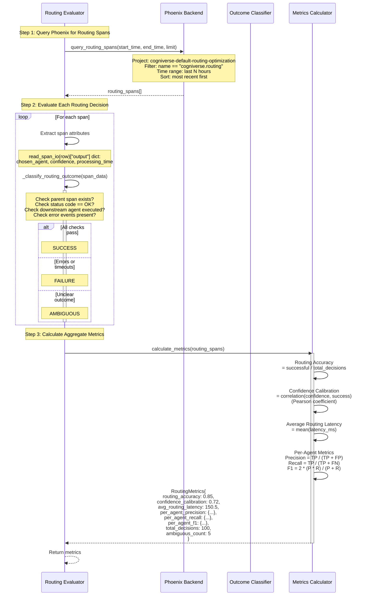
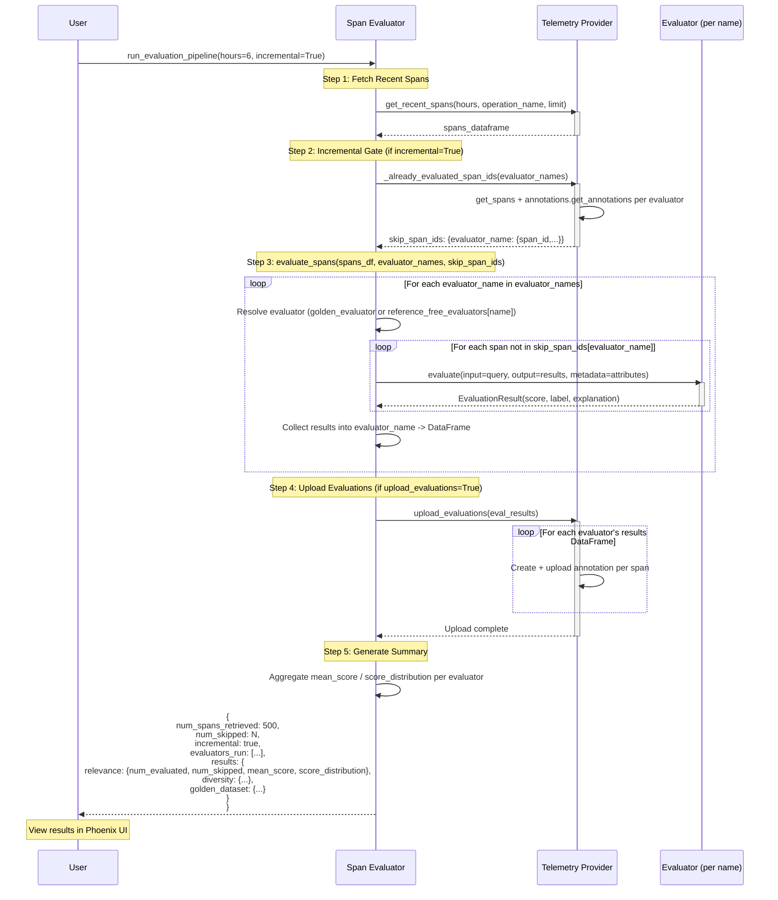

# Evaluation Module Study Guide

**Package:** `cogniverse_evaluation` (Core Layer)
**Module Location:** `libs/evaluation/cogniverse_evaluation/`

---

## Package Structure

```text
libs/evaluation/cogniverse_evaluation/
├── __init__.py                          # Package initialization
├── cli.py                               # CLI for evaluation tasks
├── online_evaluator.py                  # Online evaluation pipeline
├── quality_monitor.py                   # Quality monitoring
├── span_evaluator.py                    # SpanEvaluator for retrospective evaluation
├── core/                                # Core evaluation framework
│   ├── __init__.py
│   ├── experiment_tracker.py            # ExperimentTracker main class
│   ├── solvers.py                       # Inspect AI solvers
│   ├── task.py                          # Evaluation task definitions
│   ├── ground_truth.py                  # Ground truth extraction
│   ├── schema_analyzer.py               # Schema analysis framework
│   ├── inspect_scorers.py               # Inspect AI scorer helpers
│   ├── reranking.py                     # Reranking logic
│   └── solver_output.py                 # Solver output formatting
├── evaluators/                          # Evaluator implementations
│   ├── agent_evaluators.py              # Per-agent-type evaluator registry (judge prompts + structural evals)
│   ├── routing_evaluator.py             # Routing decision evaluator
│   ├── reference_free.py                # Reference-free evaluators
│   ├── golden_dataset.py                # Golden dataset evaluator
│   ├── llm_judge.py                     # LLM-based evaluators
│   ├── sync_reference_free.py           # Synchronous reference-free evaluators
│   ├── configurable_visual_judge.py     # Visual judge (provider/model from config)
│   ├── _media_helpers.py                # source_url resolution + frame extraction
│   └── base.py                          # Base evaluator classes
├── metrics/                             # Metric definitions
│   └── custom.py                        # Custom metrics
├── data/                                # Data loaders and datasets
│   ├── datasets.py                      # Dataset management
│   ├── storage.py                       # Storage utilities
│   └── traces.py                        # Trace data handling
├── providers/                           # Evaluation provider system
│   ├── base.py                          # Provider interfaces
│   └── registry.py                      # Provider registry
├── plugins/                             # Plugin system
│   ├── video_analyzer.py                # Video schema analyzer
│   ├── document_analyzer.py             # Document schema analyzer
│   └── visual_evaluator.py              # Visual evaluator plugin
└── analysis/                            # Analysis utilities
    └── root_cause_analysis.py           # Root cause analysis
```

---

## Table of Contents
1. [Module Overview](#module-overview)
2. [Architecture Diagrams](#architecture-diagrams)
3. [Core Components](#core-components)
4. [Usage Examples](#usage-examples)
5. [Production Considerations](#production-considerations)
6. [Inspect AI Integration](#inspect-ai-integration)
7. [Plugin System](#plugin-system)
8. [Testing](#testing)

---

## Module Overview

### Purpose and Responsibilities

The Evaluation Module provides **comprehensive experiment tracking and performance evaluation** with:

- **Experiment Management**: Phoenix-based experiment tracking with visualization
- **Routing Evaluation**: Separate evaluation of routing decisions vs search quality
- **Span Analysis**: Retrospective evaluation of Phoenix traces
- **Performance Analytics**: Statistical analysis and visualization of traces
- **Golden Datasets**: Reference datasets for quality benchmarking
- **Multi-Evaluator Support**: Quality metrics, LLM judges, visual evaluators

### Key Features

1. **ExperimentTracker**
   - Inspect AI-based evaluation framework
   - Compatible with run_experiments_with_visualization.py
   - Phoenix integration for trace visualization
   - Quality and LLM evaluator plugins
   - Dataset management and golden datasets

2. **RoutingEvaluator**
   - Routing-specific metrics (separate from search quality)
   - Accuracy, confidence calibration, per-agent precision/recall
   - Phoenix span analysis for routing decisions
   - Outcome classification (success, failure, ambiguous)

3. **PhoenixAnalytics**
   - Statistical analysis of traces (latency, throughput, errors)
   - Outlier detection using IQR and z-score methods
   - Interactive visualizations (time series, distributions, heatmaps)
   - Comparison analysis across profiles/strategies

4. **SpanEvaluator**
   - Retrospective evaluation of existing Phoenix spans
   - Reference-free and golden dataset evaluators
   - Automatic upload of evaluation results to Phoenix
   - Batch processing of historical traces

5. **Multi-Turn Evaluation**
   - LLM judges support conversation history context
   - Session-level evaluation with outcome (success/partial/failure)
   - Session quality scoring (0-1)
   - Trajectory-level evaluation for fine-tuning data collection

6. **Session-Based Evaluation**
   - Unified evaluation UI for single and multi-turn conversations
   - Per-result relevance annotation for individual results
   - Session-level outcome classification (Success/Partial/Failure)
   - Integration with Phoenix session tracking

7. **Per-Agent Evaluator Registry** (`evaluators/agent_evaluators.py`)
   - One `AgentEvaluator` entry per agent type: search, summary, report, gateway, routing, query_enhancement, entity_extraction, profile_selection
   - Each entry carries the agent's LLM-judge prompt builder, its judge-payload extraction (search-result list vs summary/report string vs domain dict), and named no-LLM structural evaluators (e.g. `routing_outcome`, `confidence_calibration`, `enhancement_effect`, `extraction_yield`, `profile_confidence_calibration`)
   - `QualityMonitor` and `OnlineEvaluator` both dispatch through the registry — adding an agent type to the optimization loop is one registry entry plus an `AgentType` member
   - Structural evaluators read the canonical `output.value` span JSON (`read_span_io`), with legacy attribute fallbacks

8. **OnlineEvaluator**
   - Real-time scoring of spans as they are produced, via the per-agent registry (`agent_type` selects the entry; defaults to routing)
   - Configurable sampling rate to bound evaluation overhead
   - Dispatches the configured structural evaluators (routing: `routing_outcome` and `confidence_calibration`)
   - Persists scores as `online_eval.<evaluator>` telemetry annotations for drift detection

9. **QualityMonitor**
   - Continuous, scheduled quality monitoring across all agent types (search, summary, report, gateway, routing, query_enhancement, entity_extraction, profile_selection)
   - Dual strategy: golden-set evaluation (MRR/nDCG/P@5) + live-traffic LLM-judge sampling; the judge prompt per agent type comes from the evaluator registry
   - The answer agents are scored on their `<ClassName>.process` spans; routing/query_enhancement/entity_extraction/profile_selection on their `cogniverse.*` domain spans
   - Threshold-based verdicts (`SKIP` / `OPTIMIZE` / `FULL`) that trigger Argo optimization workflows
   - Composes `SpanEvaluator`, `GoldenDatasetEvaluator`, `LLMJudgeCore`, and `PhoenixDatasetStore` rather than reimplementing them

10. **Evaluation Provider System**
    - Provider-agnostic abstraction (`EvaluationProvider`, `AnalyticsProvider`, `MonitoringProvider`) for experiment tracking, dataset management, and analytics
    - Entry-point based discovery (`cogniverse.evaluation.providers`) with tenant-scoped caching, mirroring the telemetry provider registry
    - Phoenix is the only concrete implementation shipped today (`PhoenixEvaluationProvider`)

11. **CLI**
    - `cogniverse-eval` unified command group (`evaluate`, `create-dataset`, `list-traces`, `test`) for running evaluations and managing datasets from the shell

### Dependencies

**Internal (from pyproject.toml):**

- `cogniverse-foundation`: Core configuration and telemetry interfaces

- `cogniverse-sdk`: SDK utilities

**External:**

- `inspect-ai==0.3.205`: Evaluation framework

- `pandas==2.3.3`: Data analysis

- `numpy==2.4.4`: Numerical computations

- `scikit-learn==1.8.0`: Statistical methods

- `pillow==12.2.0`: Image processing

**Note:** Phoenix, Plotly, and Tabulate are optional dependencies provided by other packages in the workspace (e.g. `cogniverse-telemetry-phoenix` supplies the `PhoenixEvaluationProvider` and `PhoenixAnalytics`).

---

## Architecture Diagrams

### 1. Experiment Tracking Architecture


```mermaid
flowchart TB
    Start["<span style='color:#000'>Start Experiment</span>"] --> Config["<span style='color:#000'>Configuration Phase</span>"]

    Config --> GetConfigs["<span style='color:#000'>Get Experiment Configurations</span>"]
    GetConfigs --> Profiles["<span style='color:#000'>Profiles: frame_based, chunk_based</span>"]
    GetConfigs --> Strategies["<span style='color:#000'>Strategies: binary, float, hybrid</span>"]
    GetConfigs --> Registry["<span style='color:#000'>Strategy Registry Integration</span>"]

    Profiles --> CreateDataset["<span style='color:#000'>Create/Get Dataset</span>"]
    Strategies --> CreateDataset
    Registry --> CreateDataset

    CreateDataset --> DataSource{"<span style='color:#000'>Dataset Source</span>"}
    DataSource -->|CSV| LoadCSV["<span style='color:#000'>Load from CSV</span>"]
    DataSource -->|Existing| LoadExisting["<span style='color:#000'>Load from Phoenix</span>"]
    DataSource -->|Golden| LoadGolden["<span style='color:#000'>Load Golden Dataset</span>"]

    LoadCSV --> Execution["<span style='color:#000'>Execution Phase</span>"]
    LoadExisting --> Execution
    LoadGolden --> Execution

    Execution --> RunExperiments["<span style='color:#000'>Run Experiments</span>"]
    RunExperiments --> CreateTask["<span style='color:#000'>Create Inspect AI Task</span>"]
    CreateTask --> TaskConfig["<span style='color:#000'>Configure Task</span>"]
    TaskConfig --> Samples["<span style='color:#000'>Dataset Samples</span>"]
    TaskConfig --> Solver["<span style='color:#000'>Solver Configuration</span>"]
    TaskConfig --> Evaluators["<span style='color:#000'>Evaluator Plugins</span>"]

    Samples --> Execute["<span style='color:#000'>Execute with Inspect AI</span>"]
    Solver --> Execute
    Evaluators --> Execute

    Execute --> RunSolver["<span style='color:#000'>Run Solver on Each Sample</span>"]
    RunSolver --> Collect["<span style='color:#000'>Collect Results</span>"]
    Collect --> RunEvals["<span style='color:#000'>Run Evaluators</span>"]

    RunEvals --> ExtractMetrics["<span style='color:#000'>Extract Metrics</span>"]
    ExtractMetrics --> MRR["<span style='color:#000'>MRR, Recall@10</span>"]
    ExtractMetrics --> Relevance["<span style='color:#000'>Relevance, Diversity</span>"]
    ExtractMetrics --> LLMScores["<span style='color:#000'>LLM Judge Scores</span>"]

    MRR --> LogPhoenix["<span style='color:#000'>Log to Phoenix</span>"]
    Relevance --> LogPhoenix
    LLMScores --> LogPhoenix

    LogPhoenix --> Visualization["<span style='color:#000'>Visualization Phase</span>"]

    Visualization --> CreateViz["<span style='color:#000'>Create Visualization Tables</span>"]
    CreateViz --> ProfileSummary["<span style='color:#000'>Profile Summary</span>"]
    CreateViz --> StrategyComp["<span style='color:#000'>Strategy Comparison</span>"]
    CreateViz --> DetailedResults["<span style='color:#000'>Detailed Results with Metrics</span>"]

    ProfileSummary --> Print["<span style='color:#000'>Print Visualization</span>"]
    StrategyComp --> Print
    DetailedResults --> Print

    Print --> SaveResults["<span style='color:#000'>Save Results</span>"]
    SaveResults --> CSV["<span style='color:#000'>CSV Summary</span>"]
    SaveResults --> JSON["<span style='color:#000'>JSON Detailed Results</span>"]
    SaveResults --> HTML["<span style='color:#000'>HTML Report Optional</span>"]

    CSV --> Phoenix["<span style='color:#000'>Phoenix Backend</span>"]
    JSON --> Phoenix
    HTML --> Phoenix

    Phoenix --> UI["<span style='color:#000'>Phoenix UI</span>"]
    UI --> ExpUI["<span style='color:#000'>Experiments UI</span>"]
    UI --> TraceViewer["<span style='color:#000'>Trace Viewer</span>"]
    UI --> MetricsCharts["<span style='color:#000'>Metrics Charts</span>"]

    style Start fill:#90caf9,stroke:#1565c0,color:#000
    style Config fill:#ffcc80,stroke:#ef6c00,color:#000
    style GetConfigs fill:#b0bec5,stroke:#546e7a,color:#000
    style Profiles fill:#b0bec5,stroke:#546e7a,color:#000
    style Strategies fill:#b0bec5,stroke:#546e7a,color:#000
    style Registry fill:#b0bec5,stroke:#546e7a,color:#000
    style CreateDataset fill:#ffcc80,stroke:#ef6c00,color:#000
    style DataSource fill:#b0bec5,stroke:#546e7a,color:#000
    style LoadCSV fill:#a5d6a7,stroke:#388e3c,color:#000
    style LoadExisting fill:#a5d6a7,stroke:#388e3c,color:#000
    style LoadGolden fill:#a5d6a7,stroke:#388e3c,color:#000
    style Execution fill:#ffcc80,stroke:#ef6c00,color:#000
    style RunExperiments fill:#ffcc80,stroke:#ef6c00,color:#000
    style CreateTask fill:#ffcc80,stroke:#ef6c00,color:#000
    style TaskConfig fill:#b0bec5,stroke:#546e7a,color:#000
    style Samples fill:#b0bec5,stroke:#546e7a,color:#000
    style Solver fill:#b0bec5,stroke:#546e7a,color:#000
    style Evaluators fill:#b0bec5,stroke:#546e7a,color:#000
    style Execute fill:#ffcc80,stroke:#ef6c00,color:#000
    style RunSolver fill:#ffcc80,stroke:#ef6c00,color:#000
    style Collect fill:#ffcc80,stroke:#ef6c00,color:#000
    style RunEvals fill:#ffcc80,stroke:#ef6c00,color:#000
    style ExtractMetrics fill:#ffcc80,stroke:#ef6c00,color:#000
    style MRR fill:#a5d6a7,stroke:#388e3c,color:#000
    style Relevance fill:#a5d6a7,stroke:#388e3c,color:#000
    style LLMScores fill:#a5d6a7,stroke:#388e3c,color:#000
    style LogPhoenix fill:#ce93d8,stroke:#7b1fa2,color:#000
    style Visualization fill:#ffcc80,stroke:#ef6c00,color:#000
    style CreateViz fill:#ffcc80,stroke:#ef6c00,color:#000
    style ProfileSummary fill:#b0bec5,stroke:#546e7a,color:#000
    style StrategyComp fill:#b0bec5,stroke:#546e7a,color:#000
    style DetailedResults fill:#b0bec5,stroke:#546e7a,color:#000
    style Print fill:#ffcc80,stroke:#ef6c00,color:#000
    style SaveResults fill:#ffcc80,stroke:#ef6c00,color:#000
    style CSV fill:#a5d6a7,stroke:#388e3c,color:#000
    style JSON fill:#a5d6a7,stroke:#388e3c,color:#000
    style HTML fill:#a5d6a7,stroke:#388e3c,color:#000
    style Phoenix fill:#ce93d8,stroke:#7b1fa2,color:#000
    style UI fill:#a5d6a7,stroke:#388e3c,color:#000
    style ExpUI fill:#a5d6a7,stroke:#388e3c,color:#000
    style TraceViewer fill:#a5d6a7,stroke:#388e3c,color:#000
    style MetricsCharts fill:#a5d6a7,stroke:#388e3c,color:#000
```

**Key Points:**

- Inspect AI framework for evaluation execution

- Plugin system for extensible evaluators

- Phoenix integration for visualization

- Compatible with run_experiments_with_visualization.py output format

---

### 2. Routing Evaluator Architecture


```mermaid
sequenceDiagram
    participant Evaluator as Routing Evaluator
    participant Phoenix as Phoenix Backend
    participant Classifier as Outcome Classifier
    participant Calculator as Metrics Calculator

    Note over Evaluator: Step 1: Query Phoenix for Routing Spans
    Evaluator->>Phoenix: query_routing_spans(start_time, end_time, limit)
    Note over Phoenix: Project: cogniverse-default-routing-optimization<br/>Filter: name == "cogniverse.routing"<br/>Time range: last N hours<br/>Sort: most recent first
    Phoenix-->>Evaluator: routing_spans[]

    Note over Evaluator: Step 2: Evaluate Each Routing Decision
    loop For each span
        Evaluator->>Evaluator: Extract span attributes
        Note over Evaluator: read_span_io(row)["output"] dict:<br/>chosen_agent, confidence, processing_time

        Evaluator->>Evaluator: _classify_routing_outcome(span_data)
        activate Evaluator
        Note over Evaluator: Check parent span exists?<br/>Check status code == OK?<br/>Check downstream agent executed?<br/>Check error events present?

        alt All checks pass
            Note over Evaluator: SUCCESS
        else Errors or timeouts
            Note over Evaluator: FAILURE
        else Unclear outcome
            Note over Evaluator: AMBIGUOUS
        end
        deactivate Evaluator
    end

    Note over Evaluator: Step 3: Calculate Aggregate Metrics
    Evaluator->>Calculator: calculate_metrics(routing_spans)
    activate Calculator

    Calculator->>Calculator: Routing Accuracy<br/>= successful / total_decisions
    Calculator->>Calculator: Confidence Calibration<br/>= correlation(confidence, success)<br/>(Pearson coefficient)
    Calculator->>Calculator: Average Routing Latency<br/>= mean(latency_ms)
    Calculator->>Calculator: Per-Agent Metrics<br/>Precision = TP / (TP + FP)<br/>Recall = TP / (TP + FN)<br/>F1 = 2 * (P * R) / (P + R)

    Calculator-->>Evaluator: RoutingMetrics{<br/>routing_accuracy: 0.85,<br/>confidence_calibration: 0.72,<br/>avg_routing_latency: 150.5,<br/>per_agent_precision: {...},<br/>per_agent_recall: {...},<br/>per_agent_f1: {...},<br/>total_decisions: 100,<br/>ambiguous_count: 5<br/>}
    deactivate Calculator

    Evaluator-->>Evaluator: Return metrics
```

**Routing vs Search Quality:**

- Routing evaluation focuses on **decision quality** (right agent chosen?)

- Search evaluation focuses on **result quality** (relevant results returned?)

- Separate metrics enable independent optimization

---

### 3. Phoenix Analytics Flow


```mermaid
flowchart TB
    Start["<span style='color:#000'>Analytics Request</span>"] --> FetchTraces["<span style='color:#000'>Step 1: Fetch Traces</span>"]

    FetchTraces --> PhoenixQuery["<span style='color:#000'>Phoenix Client Query</span>"]
    PhoenixQuery --> GetSpans["<span style='color:#000'>get_spans_dataframe</span>"]
    GetSpans --> TimeFilter["<span style='color:#000'>Filter by time range</span>"]
    TimeFilter --> OpFilter["<span style='color:#000'>Filter by operation regex</span>"]
    OpFilter --> ExtractRoot["<span style='color:#000'>Extract root spans traces</span>"]

    ExtractRoot --> ExtractMetrics["<span style='color:#000'>Extract TraceMetrics</span>"]
    ExtractMetrics --> TraceID["<span style='color:#000'>trace_id</span>"]
    ExtractMetrics --> Timestamp["<span style='color:#000'>timestamp</span>"]
    ExtractMetrics --> Duration["<span style='color:#000'>duration_ms</span>"]
    ExtractMetrics --> Operation["<span style='color:#000'>operation</span>"]
    ExtractMetrics --> Status["<span style='color:#000'>status success/error</span>"]
    ExtractMetrics --> Profile["<span style='color:#000'>profile, strategy</span>"]
    ExtractMetrics --> Metadata["<span style='color:#000'>metadata</span>"]

    TraceID --> CalcStats["<span style='color:#000'>Step 2: Calculate Statistics</span>"]
    Timestamp --> CalcStats
    Duration --> CalcStats
    Operation --> CalcStats
    Status --> CalcStats
    Profile --> CalcStats
    Metadata --> CalcStats

    CalcStats --> OverallStats["<span style='color:#000'>Overall Stats</span>"]
    OverallStats --> TotalReq["<span style='color:#000'>Total requests</span>"]
    OverallStats --> TimeRange["<span style='color:#000'>Time range</span>"]
    OverallStats --> ResponseTime["<span style='color:#000'>Response time<br/>mean, median, P50/P75/P90/P95/P99</span>"]
    OverallStats --> SuccessRate["<span style='color:#000'>Success/error rates</span>"]
    OverallStats --> OutlierDetect["<span style='color:#000'>Outlier detection IQR method</span>"]

    CalcStats --> GroupedStats{"<span style='color:#000'>Group By?</span>"}
    GroupedStats -->|Yes| PerProfile["<span style='color:#000'>Per profile/strategy/operation</span>"]
    GroupedStats -->|No| Temporal["<span style='color:#000'>Temporal Patterns</span>"]

    PerProfile --> Count["<span style='color:#000'>Count</span>"]
    PerProfile --> MeanMedian["<span style='color:#000'>Mean/median/P95 duration</span>"]
    PerProfile --> ErrorRate["<span style='color:#000'>Error rate</span>"]

    TotalReq --> Temporal
    TimeRange --> Temporal
    ResponseTime --> Temporal
    SuccessRate --> Temporal
    OutlierDetect --> Temporal
    Count --> Temporal
    MeanMedian --> Temporal
    ErrorRate --> Temporal

    Temporal --> ReqByHour["<span style='color:#000'>Requests by hour</span>"]
    Temporal --> DurationByHour["<span style='color:#000'>Avg duration by hour</span>"]

    ReqByHour --> CreateViz["<span style='color:#000'>Step 3: Create Visualizations</span>"]
    DurationByHour --> CreateViz

    CreateViz --> TimeSeries["<span style='color:#000'>1. Time Series Plot</span>"]
    TimeSeries --> TSMean["<span style='color:#000'>Mean/median/max over time</span>"]
    TimeSeries --> TSBands["<span style='color:#000'>P50/P95 bands</span>"]
    TimeSeries --> TSCount["<span style='color:#000'>Request count</span>"]

    CreateViz --> Distribution["<span style='color:#000'>2. Distribution Plot 4 subplots</span>"]
    Distribution --> Histogram["<span style='color:#000'>Histogram</span>"]
    Distribution --> BoxPlot["<span style='color:#000'>Box plot quartiles, outliers</span>"]
    Distribution --> ViolinPlot["<span style='color:#000'>Violin plot distribution shape</span>"]
    Distribution --> ECDF["<span style='color:#000'>ECDF with percentile lines</span>"]

    CreateViz --> Heatmap["<span style='color:#000'>3. Heatmap</span>"]
    Heatmap --> HourDay["<span style='color:#000'>Hour x Day of week</span>"]
    Heatmap --> ProfileStrategy["<span style='color:#000'>Profile x Strategy</span>"]
    Heatmap --> Aggregation["<span style='color:#000'>Aggregation: count, mean, max</span>"]

    CreateViz --> OutlierPlot["<span style='color:#000'>4. Outlier Plot</span>"]
    OutlierPlot --> ScatterPlot["<span style='color:#000'>Scatter: normal vs outlier points</span>"]
    OutlierPlot --> IQRLine["<span style='color:#000'>IQR threshold line</span>"]
    OutlierPlot --> RefLines["<span style='color:#000'>P50/P95/P99 reference lines</span>"]

    CreateViz --> ComparisonPlot["<span style='color:#000'>5. Comparison Plot 4 subplots</span>"]
    ComparisonPlot --> MeanByGroup["<span style='color:#000'>Mean by group</span>"]
    ComparisonPlot --> MedianByGroup["<span style='color:#000'>Median by group</span>"]
    ComparisonPlot --> P95ByGroup["<span style='color:#000'>P95 by group</span>"]
    ComparisonPlot --> CountByGroup["<span style='color:#000'>Request count by group</span>"]

    TSMean --> GenerateReport["<span style='color:#000'>Step 4: Generate Report</span>"]
    TSBands --> GenerateReport
    TSCount --> GenerateReport
    Histogram --> GenerateReport
    BoxPlot --> GenerateReport
    ViolinPlot --> GenerateReport
    ECDF --> GenerateReport
    HourDay --> GenerateReport
    ProfileStrategy --> GenerateReport
    Aggregation --> GenerateReport
    ScatterPlot --> GenerateReport
    IQRLine --> GenerateReport
    RefLines --> GenerateReport
    MeanByGroup --> GenerateReport
    MedianByGroup --> GenerateReport
    P95ByGroup --> GenerateReport
    CountByGroup --> GenerateReport

    GenerateReport --> ReportJSON["<span style='color:#000'>Comprehensive Report JSON</span>"]
    ReportJSON --> Summary["<span style='color:#000'>summary</span>"]
    ReportJSON --> Statistics["<span style='color:#000'>statistics</span>"]
    ReportJSON --> StatsByProfile["<span style='color:#000'>statistics_by_profile</span>"]
    ReportJSON --> StatsByOp["<span style='color:#000'>statistics_by_operation</span>"]
    ReportJSON --> Visualizations["<span style='color:#000'>visualizations plotly_json</span>"]

    Summary --> SaveFile["<span style='color:#000'>Save to JSON file optional</span>"]
    Statistics --> SaveFile
    StatsByProfile --> SaveFile
    StatsByOp --> SaveFile
    Visualizations --> SaveFile

    style Start fill:#90caf9,stroke:#1565c0,color:#000
    style FetchTraces fill:#ffcc80,stroke:#ef6c00,color:#000
    style PhoenixQuery fill:#ce93d8,stroke:#7b1fa2,color:#000
    style GetSpans fill:#ce93d8,stroke:#7b1fa2,color:#000
    style TimeFilter fill:#b0bec5,stroke:#546e7a,color:#000
    style OpFilter fill:#b0bec5,stroke:#546e7a,color:#000
    style ExtractRoot fill:#b0bec5,stroke:#546e7a,color:#000
    style ExtractMetrics fill:#ffcc80,stroke:#ef6c00,color:#000
    style TraceID fill:#b0bec5,stroke:#546e7a,color:#000
    style Timestamp fill:#b0bec5,stroke:#546e7a,color:#000
    style Duration fill:#b0bec5,stroke:#546e7a,color:#000
    style Operation fill:#b0bec5,stroke:#546e7a,color:#000
    style Status fill:#b0bec5,stroke:#546e7a,color:#000
    style Profile fill:#b0bec5,stroke:#546e7a,color:#000
    style Metadata fill:#b0bec5,stroke:#546e7a,color:#000
    style CalcStats fill:#ffcc80,stroke:#ef6c00,color:#000
    style OverallStats fill:#ffcc80,stroke:#ef6c00,color:#000
    style TotalReq fill:#b0bec5,stroke:#546e7a,color:#000
    style TimeRange fill:#b0bec5,stroke:#546e7a,color:#000
    style ResponseTime fill:#b0bec5,stroke:#546e7a,color:#000
    style SuccessRate fill:#b0bec5,stroke:#546e7a,color:#000
    style OutlierDetect fill:#b0bec5,stroke:#546e7a,color:#000
    style GroupedStats fill:#b0bec5,stroke:#546e7a,color:#000
    style PerProfile fill:#b0bec5,stroke:#546e7a,color:#000
    style Temporal fill:#b0bec5,stroke:#546e7a,color:#000
    style Count fill:#b0bec5,stroke:#546e7a,color:#000
    style MeanMedian fill:#b0bec5,stroke:#546e7a,color:#000
    style ErrorRate fill:#b0bec5,stroke:#546e7a,color:#000
    style ReqByHour fill:#b0bec5,stroke:#546e7a,color:#000
    style DurationByHour fill:#b0bec5,stroke:#546e7a,color:#000
    style CreateViz fill:#ffcc80,stroke:#ef6c00,color:#000
    style TimeSeries fill:#a5d6a7,stroke:#388e3c,color:#000
    style TSMean fill:#b0bec5,stroke:#546e7a,color:#000
    style TSBands fill:#b0bec5,stroke:#546e7a,color:#000
    style TSCount fill:#b0bec5,stroke:#546e7a,color:#000
    style Distribution fill:#a5d6a7,stroke:#388e3c,color:#000
    style Histogram fill:#b0bec5,stroke:#546e7a,color:#000
    style BoxPlot fill:#b0bec5,stroke:#546e7a,color:#000
    style ViolinPlot fill:#b0bec5,stroke:#546e7a,color:#000
    style ECDF fill:#b0bec5,stroke:#546e7a,color:#000
    style Heatmap fill:#a5d6a7,stroke:#388e3c,color:#000
    style HourDay fill:#b0bec5,stroke:#546e7a,color:#000
    style ProfileStrategy fill:#b0bec5,stroke:#546e7a,color:#000
    style Aggregation fill:#b0bec5,stroke:#546e7a,color:#000
    style OutlierPlot fill:#a5d6a7,stroke:#388e3c,color:#000
    style ScatterPlot fill:#b0bec5,stroke:#546e7a,color:#000
    style IQRLine fill:#b0bec5,stroke:#546e7a,color:#000
    style RefLines fill:#b0bec5,stroke:#546e7a,color:#000
    style ComparisonPlot fill:#a5d6a7,stroke:#388e3c,color:#000
    style MeanByGroup fill:#b0bec5,stroke:#546e7a,color:#000
    style MedianByGroup fill:#b0bec5,stroke:#546e7a,color:#000
    style P95ByGroup fill:#b0bec5,stroke:#546e7a,color:#000
    style CountByGroup fill:#b0bec5,stroke:#546e7a,color:#000
    style GenerateReport fill:#ffcc80,stroke:#ef6c00,color:#000
    style ReportJSON fill:#a5d6a7,stroke:#388e3c,color:#000
    style Summary fill:#b0bec5,stroke:#546e7a,color:#000
    style Statistics fill:#b0bec5,stroke:#546e7a,color:#000
    style StatsByProfile fill:#b0bec5,stroke:#546e7a,color:#000
    style StatsByOp fill:#b0bec5,stroke:#546e7a,color:#000
    style Visualizations fill:#b0bec5,stroke:#546e7a,color:#000
    style SaveFile fill:#a5d6a7,stroke:#388e3c,color:#000
```

**Analytics Capabilities:**

- Statistical analysis with percentiles

- Outlier detection (IQR, z-score)

- Interactive Plotly visualizations

- Group-by analysis (profile, strategy, operation)

- Export to JSON for further analysis

---

### 4. Span Evaluator Pipeline


```mermaid
sequenceDiagram
    participant User
    participant SpanEval as Span Evaluator
    participant Phoenix as Telemetry Provider
    participant Eval as Evaluator (per name)

    User->>SpanEval: run_evaluation_pipeline(hours=6, incremental=True)

    Note over SpanEval: Step 1: Fetch Recent Spans
    SpanEval->>Phoenix: get_recent_spans(hours, operation_name, limit)
    activate Phoenix
    Phoenix-->>SpanEval: spans_dataframe
    deactivate Phoenix

    Note over SpanEval: Step 2: Incremental Gate (if incremental=True)
    SpanEval->>Phoenix: _already_evaluated_span_ids(evaluator_names)
    activate Phoenix
    Phoenix->>Phoenix: get_spans + annotations.get_annotations per evaluator
    Phoenix-->>SpanEval: skip_span_ids: {evaluator_name: {span_id,...}}
    deactivate Phoenix

    Note over SpanEval: Step 3: evaluate_spans(spans_df, evaluator_names, skip_span_ids)
    loop For each evaluator_name in evaluator_names
        SpanEval->>SpanEval: Resolve evaluator (golden_evaluator or reference_free_evaluators[name])
        loop For each span not in skip_span_ids[evaluator_name]
            SpanEval->>Eval: evaluate(input=query, output=results, metadata=attributes)
            activate Eval
            Eval-->>SpanEval: EvaluationResult(score, label, explanation)
            deactivate Eval
        end
        SpanEval->>SpanEval: Collect results into evaluator_name -> DataFrame
    end

    Note over SpanEval: Step 4: Upload Evaluations (if upload_evaluations=True)
    SpanEval->>Phoenix: upload_evaluations(eval_results)
    activate Phoenix
    loop For each evaluator's results DataFrame
        Phoenix->>Phoenix: Create + upload annotation per span
    end
    Phoenix-->>SpanEval: Upload complete
    deactivate Phoenix

    Note over SpanEval: Step 5: Generate Summary
    SpanEval->>SpanEval: Aggregate mean_score / score_distribution per evaluator

    SpanEval-->>User: {<br/>num_spans_retrieved: 500,<br/>num_skipped: N,<br/>incremental: true,<br/>evaluators_run: [...],<br/>results: {<br/>  relevance: {num_evaluated, num_skipped, mean_score, score_distribution},<br/>  diversity: {...},<br/>  golden_dataset: {...}<br/>}<br/>}

    Note over User: View results in Phoenix UI
```

**Span Evaluator Features:**

- Retrospective evaluation of existing spans

- Multiple evaluator support (reference-free, golden dataset) — evaluated sequentially per evaluator name, not in parallel

- Incremental mode skips (span, evaluator) pairs that already carry that evaluator's annotation

- Automatic upload to Phoenix for visualization

- Batch processing of historical traces

- Summary statistics and distribution analysis

---

## Core Components

### 1. ExperimentTracker

**File:** `libs/evaluation/cogniverse_evaluation/core/experiment_tracker.py`

**Purpose:** Track and visualize experiments using Inspect AI evaluation framework with Phoenix integration.

**Key Attributes:**
```python
experiment_project_name: str          # Project name for experiments
output_dir: Path                       # Results directory
enable_quality_evaluators: bool        # Adds the visual quality scorer to the Inspect scorer set (get_configured_scorers via get_visual_scorers)
enable_llm_evaluators: bool           # Adds the visual_judge scorer to the Inspect scorer set
evaluator_name: str                    # Evaluator to use
llm_model: str | None                  # LLM model for evaluators (required when enable_llm_evaluators=True)
llm_base_url: str | None              # Base URL for LLM API
provider: EvaluationProvider           # Evaluation provider
tenant_id: str                         # Tenant identifier
experiments: list[dict]                # Experiment results
configurations: list[dict]             # Experiment configurations
dataset_url: str | None                # Dataset URL
```

**Main Methods:**

#### `get_experiment_configurations(profiles: list[str] | None = None, strategies: list[str] | None = None, all_strategies: bool = False) -> list[dict]`
Get experiment configurations from strategy registry.

**Parameters:**

- `profiles`: List of profiles to test (None = all)

- `strategies`: List of strategies to test (None = common strategies)

- `all_strategies`: Test all available strategies

**Returns:** List of configuration dicts with `{profile, strategies: [(name, description)]}`

**Example:**
```python
tracker = ExperimentTracker(tenant_id="your_org:production")

# Get configurations for specific profiles
configs = tracker.get_experiment_configurations(
    profiles=["frame_based_colpali", "chunk_based_videoprism"],
    strategies=["binary_binary", "hybrid_float_bm25"]
)

# configs = [
#     {
#         "profile": "frame_based_colpali",
#         "strategies": [
#             ("binary_binary", "Binary"),
#             ("hybrid_float_bm25", "Hybrid Float + Text")
#         ]
#     },
#     ...
# ]
```

---

#### `run_experiment(profile: str, strategy: str, dataset_name: str, description: str) -> dict`
Run a single experiment using the Inspect AI framework (synchronous).

**Parameters:**

- `profile`: Vespa profile name

- `strategy`: Ranking strategy

- `dataset_name`: Dataset to evaluate against

- `description`: Human-readable experiment description

**Returns:** Experiment result dict with status, metrics, timestamp

**Workflow:**

1. Log experiment start to Phoenix

2. Create Inspect AI evaluation task

3. Execute evaluation synchronously (Inspect AI manages its own event loop)

4. Extract metrics from result

5. Log completion to Phoenix

6. Return result dictionary

**Example:**
```python
tracker = ExperimentTracker(tenant_id="your_org:production")

# Synchronous — do NOT use await or asyncio.run()
result = tracker.run_experiment(
    profile="frame_based_colpali",
    strategy="binary_binary",
    dataset_name="golden_eval_v1",
    description="Frame Based ColPali - Binary"
)

# result = {
#     "status": "success",
#     "profile": "frame_based_colpali",
#     "strategy": "binary_binary",
#     "description": "Frame Based ColPali - Binary",
#     "experiment_name": "frame_based_colpali_binary_binary_20251007_143022",
#     "metrics": {
#         "mrr": 0.85,
#         "recall": 0.92,
#         "relevance": 0.88
#     },
#     "timestamp": "2025-10-07T14:30:22"
# }
```

---

#### `create_or_get_dataset(dataset_name: str | None = None, csv_path: str | None = None, force_new: bool = False) -> str`
Create or retrieve a dataset for experiments.

**Parameters:**

- `dataset_name`: Name of existing dataset

- `csv_path`: Path to CSV file for new dataset

- `force_new`: Force creation of new dataset

**Returns:** Dataset name

**Example:**
```python
tracker = ExperimentTracker(tenant_id="your_org:production")

# Create from CSV
dataset_name = tracker.create_or_get_dataset(
    dataset_name="my_eval_dataset",
    csv_path="data/testset/evaluation/video_search_queries.csv"
)

# Use existing
dataset_name = tracker.create_or_get_dataset(
    dataset_name="golden_eval_v1"
)
```

---

#### `run_all_experiments(dataset_name: str) -> list[dict]`
Run all configured experiments.

**Parameters:**

- `dataset_name`: Dataset to evaluate against

**Returns:** List of experiment result dicts

**Output:** Prints progress table with success/failure status and metrics

**Example:**
```python
tracker = ExperimentTracker(tenant_id="your_org:production")

# Configure experiments
tracker.get_experiment_configurations(profiles=["frame_based_colpali"])

# Create dataset
dataset_name = tracker.create_or_get_dataset(csv_path="data/queries.csv")

# Run all experiments
results = tracker.run_all_experiments(dataset_name)

# Output:
# ================================================================
# PHOENIX EXPERIMENTS WITH VISUALIZATION
# ================================================================
# Timestamp: 2025-10-07 14:30:00
# ...
# [1/5] Frame Based ColPali - Binary
#   Strategy: binary_binary
#   ✅ Success
#      mrr: 0.850
#      relevance: 0.880
```

---

#### `create_visualization_tables(experiments: list[dict] | None = None, include_quality_metrics: bool = True) -> dict[str, pd.DataFrame]`
Create visualization tables from experiment results.

**Returns:**
```python
{
    "profile_summary": DataFrame,      # Summary by profile
    "detailed_results": DataFrame,     # All experiments with metrics
    "strategy_comparison": DataFrame   # Strategy comparison
}
```

**Example:**
```python
tables = tracker.create_visualization_tables()

print(tables["profile_summary"])
# | Profile              | Total | Success | Failed | Success Rate |
# |----------------------|-------|---------|--------|--------------|
# | frame_based_colpali  |   5   |    5    |   0    |   100.0%     |
```

---

### 2. RoutingEvaluator

**File:** `libs/evaluation/cogniverse_evaluation/evaluators/routing_evaluator.py`

**Purpose:** Evaluate routing decisions separately from search quality.

**Key Attributes:**
```python
provider: TelemetryProvider        # Telemetry provider for querying spans
project_name: str                  # Project name for routing optimization
```

**RoutingOutcome Enum:**
```python
SUCCESS = "success"       # Agent completed task successfully
FAILURE = "failure"       # Agent failed, timed out, or returned empty
AMBIGUOUS = "ambiguous"   # Needs human annotation
```

**RoutingMetrics Dataclass:**
```python
routing_accuracy: float                    # % successful decisions
confidence_calibration: float              # Correlation(confidence, success)
avg_routing_latency: float                # Mean routing time (ms)
per_agent_precision: Dict[str, float]     # Precision per agent
per_agent_recall: Dict[str, float]        # Recall per agent
per_agent_f1: Dict[str, float]            # F1 per agent
total_decisions: int                       # Total evaluated
ambiguous_count: int                       # Unclear outcomes
```

**Main Methods:**

#### `evaluate_routing_decision(span_data: Dict[str, Any]) -> Tuple[RoutingOutcome, Dict[str, Any]]`
Extract and evaluate a single routing decision.

**Parameters:**

- `span_data`: Span dict from Phoenix with routing attributes

**Returns:** `(outcome, metrics)` tuple

**Extracted Metrics:**
```python
{
    "chosen_agent": str,        # Agent selected by routing
    "confidence": float,        # Routing confidence score
    "latency_ms": float,        # Routing processing time
    "success": bool,            # Whether routing succeeded
    "downstream_status": str    # Status description
}
```

**Example:**
```python
from cogniverse_foundation.telemetry.registry import TelemetryRegistry

# Get telemetry provider
provider = TelemetryRegistry.get(name="phoenix", tenant_id="your_org:production")

evaluator = RoutingEvaluator(provider=provider)

span_data = {
    "name": "cogniverse.routing",
    # RoutingEvaluator reads the decision from output.value via read_span_io:
    # read_span_io(span_data)["output"] -> {"chosen_agent": ..., "confidence": ...}
    "attributes.output.value": json.dumps({
        "chosen_agent": "video_search_agent",
        "confidence": 0.92
    }),
    "status_code": "OK"
}

outcome, metrics = evaluator.evaluate_routing_decision(span_data)
# outcome = RoutingOutcome.SUCCESS
# metrics = {
#     "chosen_agent": "video_search_agent",
#     "confidence": 0.92,
#     "latency_ms": 150.5,
#     "success": True,
#     "downstream_status": "completed_successfully"
# }
```

---

#### `calculate_metrics(routing_spans: List[Dict[str, Any]]) -> RoutingMetrics`
Calculate comprehensive routing metrics from spans.

**Parameters:**

- `routing_spans`: List of routing span dicts

**Returns:** RoutingMetrics with all calculated metrics

**Example:**
```python
import asyncio
from cogniverse_foundation.telemetry.registry import TelemetryRegistry

async def calculate_routing_metrics():
    # Get telemetry provider
    provider = TelemetryRegistry.get(name="phoenix", tenant_id="your_org:production")

    evaluator = RoutingEvaluator(provider=provider)

    # Get routing spans from Phoenix
    spans = await evaluator.query_routing_spans(limit=100)

    # Calculate metrics
    metrics = evaluator.calculate_metrics(spans)

    print(f"Routing Accuracy: {metrics.routing_accuracy:.2%}")
    print(f"Confidence Calibration: {metrics.confidence_calibration:.3f}")
    print(f"Avg Latency: {metrics.avg_routing_latency:.0f}ms")
    print(f"Video Agent Precision: {metrics.per_agent_precision['video_search_agent']:.2%}")

asyncio.run(calculate_routing_metrics())
```

---

#### `async query_routing_spans(start_time: Optional[datetime] = None, end_time: Optional[datetime] = None, limit: int = 100) -> List[Dict[str, Any]]`
Query Phoenix for routing spans.

**Parameters:**

- `start_time`: Start of time range

- `end_time`: End of time range

- `limit`: Max spans to return

**Returns:** List of routing span dicts

**Example:**
```python
import asyncio
from datetime import datetime, timedelta
from cogniverse_foundation.telemetry.registry import TelemetryRegistry

async def get_routing_spans():
    # Get telemetry provider
    provider = TelemetryRegistry.get(name="phoenix", tenant_id="your_org:production")

    evaluator = RoutingEvaluator(provider=provider)

    # Get last 6 hours of routing decisions
    end_time = datetime.now()
    start_time = end_time - timedelta(hours=6)

    spans = await evaluator.query_routing_spans(
        start_time=start_time,
        end_time=end_time,
        limit=500
    )

    print(f"Retrieved {len(spans)} routing decisions")
    return spans

asyncio.run(get_routing_spans())
```

---

### 3. PhoenixAnalytics

**File:** `libs/telemetry-phoenix/cogniverse_telemetry_phoenix/evaluation/analytics.py`

**Purpose:** Analytics and visualization for Phoenix traces.

**Key Attributes:**
```python
telemetry_url: str                  # Phoenix endpoint
client: _PhoenixSyncClient          # Phoenix sync client
```

**TraceMetrics Dataclass:**
```python
trace_id: str
timestamp: datetime
duration_ms: float
operation: str
status: str
profile: str | None
strategy: str | None
error: str | None
metadata: dict[str, Any]
```

**Main Methods:**

#### `get_traces(start_time: datetime | None = None, end_time: datetime | None = None, operation_filter: str | None = None, limit: int = 10000, project_name: str | None = None) -> list[TraceMetrics]`
Fetch traces from Phoenix with filters.

**Parameters:**

- `start_time`: Start of time range

- `end_time`: End of time range

- `operation_filter`: Regex filter for operation name

- `limit`: Max traces to fetch

- `project_name`: Phoenix project name (e.g. `cogniverse-<tenant_id>`)

**Returns:** List of TraceMetrics objects

**Example:**
```python
analytics = PhoenixAnalytics()

# Get search operations from last hour
traces = analytics.get_traces(
    start_time=datetime.now() - timedelta(hours=1),
    operation_filter="search_service\\..*"
)

print(f"Fetched {len(traces)} search traces")
```

---

#### `calculate_statistics(traces: list[TraceMetrics], group_by: str | None = None) -> dict[str, Any]`
Calculate comprehensive statistics from traces.

**Parameters:**

- `traces`: List of trace metrics

- `group_by`: Optional field to group by ("operation", "profile", "strategy")

**Returns:** Statistics dictionary with:

- `total_requests`: Total count

- `time_range`: Start/end timestamps

- `response_time`: mean, median, min, max, std, P50/P75/P90/P95/P99

- `status`: counts, success_rate, error_rate

- `by_{group_by}`: Grouped statistics (if group_by specified)

- `temporal`: requests/duration by hour

- `outliers`: count, percentage, values

**Example:**
```python
analytics = PhoenixAnalytics()
traces = analytics.get_traces()

# Overall stats
stats = analytics.calculate_statistics(traces)
print(f"P95 Latency: {stats['response_time']['p95']:.0f}ms")
print(f"Success Rate: {stats['status']['success_rate']:.2%}")

# Grouped by profile
stats_by_profile = analytics.calculate_statistics(traces, group_by="profile")
for profile, profile_stats in stats_by_profile["by_profile"].items():
    print(f"{profile}: {profile_stats['p95_duration']:.0f}ms P95")
```

---

#### `create_time_series_plot(...) -> go.Figure`
#### `create_distribution_plot(...) -> go.Figure`
#### `create_heatmap(...) -> go.Figure`
#### `create_outlier_plot(...) -> go.Figure`
#### `create_comparison_plot(...) -> go.Figure`

Create interactive Plotly visualizations.

**Example:**
```python
analytics = PhoenixAnalytics()
traces = analytics.get_traces()

# Time series with P50/P95 bands
fig_time = analytics.create_time_series_plot(
    traces,
    metric="duration_ms",
    aggregation="mean",
    time_window="5min"
)
fig_time.show()

# Distribution analysis (4 subplots)
fig_dist = analytics.create_distribution_plot(
    traces,
    metric="duration_ms",
    group_by="profile"
)
fig_dist.show()

# Hour x Day heatmap
fig_heat = analytics.create_heatmap(
    traces,
    x_field="hour",
    y_field="day",
    metric="duration_ms",
    aggregation="mean"
)
fig_heat.show()
```

---

#### `generate_report(start_time: datetime | None = None, end_time: datetime | None = None, output_file: str | None = None) -> dict[str, Any]`
Generate comprehensive analytics report.

**Returns:** Report dictionary with summary, statistics, and visualizations (as JSON)

**Example:**
```python
analytics = PhoenixAnalytics()

# Generate last 24h report
report = analytics.generate_report(
    start_time=datetime.now() - timedelta(days=1),
    output_file="outputs/analytics_report.json"
)

print(f"Analyzed {report['summary']['total_requests']} requests")
print(f"P95 Latency: {report['summary']['p95_response_time']:.0f}ms")
print(f"Outliers: {report['summary']['outlier_percentage']:.1f}%")
```

---

### 4. SpanEvaluator

**File:** `libs/evaluation/cogniverse_evaluation/span_evaluator.py`

**Purpose:** Evaluate existing spans in Phoenix using various evaluators.

**Key Attributes:**
```python
provider: EvaluationProvider                   # Evaluation provider
tenant_id: str                                 # Tenant identifier
project_name: str                              # Project name for telemetry
reference_free_evaluators: dict                # Reference-free evaluators
golden_evaluator: GoldenDatasetEvaluator       # Golden dataset evaluator
```

**Main Methods:**

#### `async get_recent_spans(hours: int = 6, operation_name: str | None = "search_service.search", limit: int = 1000) -> pd.DataFrame`
Retrieve recent spans from Phoenix.

**Parameters:**

- `hours`: Hours to look back

- `operation_name`: Filter by operation name

- `limit`: Max spans

**Returns:** DataFrame with span information

**Example:**
```python
evaluator = SpanEvaluator(tenant_id="your_org:production")

# Get last 6 hours of search spans
spans_df = await evaluator.get_recent_spans(
    hours=6,
    operation_name="search_service.search"
)

print(f"Retrieved {len(spans_df)} search spans")
```

---

#### `async evaluate_spans(spans_df: pd.DataFrame, evaluator_names: list[str] | None = None, skip_span_ids: dict[str, set[str]] | None = None) -> dict[str, pd.DataFrame]`
Evaluate spans using specified evaluators.

**Parameters:**

- `spans_df`: DataFrame of spans to evaluate

- `evaluator_names`: List of evaluator names (None = all — reference-free evaluators plus `golden_dataset`)

- `skip_span_ids`: Optional `{evaluator_name: {span_id, ...}}` of (span, evaluator) pairs to skip (used by `run_evaluation_pipeline`'s incremental mode)

**Returns:** Dict mapping evaluator name to results DataFrame

**Available Evaluators** (from `create_reference_free_evaluators()` plus `golden_dataset`):

- `relevance`: `QueryResultRelevanceEvaluator` — heuristic relevance from result scores

- `diversity`: `ResultDiversityEvaluator` — unique-video ratio

- `temporal_coverage`: `TemporalCoverageEvaluator` — unique time-segment coverage for video results

- `composite`: `CompositeEvaluator` — weighted combination of relevance + diversity + temporal_coverage

- `golden_dataset`: `GoldenDatasetEvaluator` — comparison against a golden dataset

**Example:**
```python
evaluator = SpanEvaluator(tenant_id="your_org:production")

# Get spans
spans_df = await evaluator.get_recent_spans(hours=24)

# Evaluate
eval_results = await evaluator.evaluate_spans(
    spans_df,
    evaluator_names=["relevance", "diversity", "golden_dataset"]
)

# Check results
for eval_name, results_df in eval_results.items():
    mean_score = results_df["score"].mean()
    print(f"{eval_name}: {mean_score:.3f} avg score")
```

---

#### `async upload_evaluations(evaluations: dict[str, pd.DataFrame])`
Upload evaluation results as annotations.

**Example:**
```python
evaluator = SpanEvaluator(tenant_id="your_org:production")

# Evaluate spans
spans_df = await evaluator.get_recent_spans()
eval_results = await evaluator.evaluate_spans(spans_df)

# Upload to Phoenix
await evaluator.upload_evaluations(eval_results)
# Results now visible in Phoenix UI
```

---

#### `async run_evaluation_pipeline(hours: int = 6, operation_name: str | None = "search_service.search", evaluator_names: list[str] | None = None, upload_evaluations: bool = True, incremental: bool = True) -> dict[str, Any]`
Run complete evaluation pipeline on recent spans.

When `incremental=True` (default), (span, evaluator) pairs that already
carry that evaluator's annotation are skipped — so re-running over the
same window only evaluates new spans / new evaluators instead of
re-annotating everything. The skip set comes from querying the span
annotations already in the telemetry backend (see
`SpanEvaluator._already_evaluated_span_ids`). Pass `incremental=False` to
re-evaluate every retrieved span.

**Returns:** Summary with `num_spans_retrieved`, `num_skipped`,
`incremental`, `evaluators_run`, and per-evaluator `results` (each with
`num_evaluated`, `num_skipped`, `mean_score`, `score_distribution`).

**Example:**
```python
evaluator = SpanEvaluator(tenant_id="acme", project_name="cogniverse-acme")

# Run full pipeline (incremental by default)
summary = await evaluator.run_evaluation_pipeline(
    hours=24,
    evaluator_names=["relevance", "diversity", "golden_dataset"],
    upload_evaluations=True,
)

print(f"Retrieved {summary['num_spans_retrieved']} spans")
print(f"Skipped {summary['num_skipped']} already-evaluated (span, evaluator) pairs")
for eval_name, stats in summary["results"].items():
    print(f"{eval_name}: evaluated={stats['num_evaluated']} skipped={stats['num_skipped']}")
```

---

### 5. Multi-Turn Session Evaluation

**Purpose:** Evaluate multi-turn conversations at the session level, considering conversation history context.

#### Session-Level Evaluation Components

**PhoenixEvaluationProvider** (in `libs/telemetry-phoenix/cogniverse_telemetry_phoenix/evaluation/evaluation_provider.py`)

Provides session-level evaluation logging:

```python
def log_session_evaluation(
    self,
    session_id: str,
    evaluation_name: str,
    session_score: float,
    session_outcome: str,
    turn_scores: Optional[List[float]] = None,
    explanation: Optional[str] = None,
    metadata: Optional[Dict[str, Any]] = None
) -> None
```

**Parameters:**

- `session_id`: Unique session identifier

- `evaluation_name`: Name of evaluation (e.g., "conversation_quality")

- `session_score`: Overall session score (0.0-1.0)

- `session_outcome`: Session outcome ("success", "partial", "failure")

- `turn_scores`: Optional per-turn scores

- `explanation`: Optional explanation

- `metadata`: Optional additional metadata

**Example:**
```python
from cogniverse_evaluation.providers import get_evaluation_provider

provider = get_evaluation_provider(tenant_id="your_org:production")

provider.log_session_evaluation(
    session_id="sess_abc123",
    evaluation_name="conversation_quality",
    session_score=0.9,
    session_outcome="success",
    turn_scores=[0.85, 0.90, 0.95],
    explanation="User successfully found relevant videos",
    metadata={"turns": 3, "topic": "cooking"}
)
```

---

#### LLM-as-Judge Evaluators

The evaluation module provides LLM-based evaluators for video retrieval quality:

**1. LLMJudgeCore**

Scores query-result relevance via an OAI-compatible LLM endpoint. Used by the
quality monitor for live-traffic relevance scoring; `_extract_score_from_response`
parses an `X/10` or `0.x` rating (or `None` for an unscored/failed reply).

```python
from cogniverse_evaluation.evaluators.llm_judge import LLMJudgeCore

judge = LLMJudgeCore(
    model_name="google/gemma-4-e4b-it",
    base_url="http://localhost:11434",
)
score, explanation = judge._extract_score_from_response("Score: 8/10. Relevant.")
# score == 0.8
```

**2. QueryResultRelevanceEvaluator**

Evaluates relevance without an LLM, using a heuristic over each result's
`relevance_score`/`score` field (no embeddings are computed). `evaluate` is
`async` and takes `input`/`output`, matching the shared `Evaluator` interface.

```python
import asyncio
from cogniverse_evaluation.evaluators.reference_free import QueryResultRelevanceEvaluator

evaluator = QueryResultRelevanceEvaluator(min_score_threshold=0.5)

async def score():
    return await evaluator.evaluate(
        input="machine learning tutorial",
        output=[
            {"video_id": "vid_001", "title": "ML Basics", "score": 0.95},
            {"video_id": "vid_002", "title": "Deep Learning", "score": 0.85},
        ],
    )

result = asyncio.run(score())
# result.score == 0.90, result.label == "highly_relevant"
```

**Sibling reference-free evaluators** (`cogniverse_evaluation.evaluators.reference_free`),
all returned together by `create_reference_free_evaluators()` under the keys
`relevance` / `diversity` / `temporal_coverage` / `composite`:

- `ResultDiversityEvaluator` — unique-video ratio (`high_diversity` ≥0.8, `moderate_diversity` ≥0.5, else `low_diversity`); needs ≥2 results.
- `TemporalCoverageEvaluator` — counts unique `(start_time, end_time)` segments across results, normalized to 10 segments (`good_coverage` ≥0.7, `moderate_coverage` ≥0.3).
- `CompositeEvaluator(evaluators, weights=None)` — runs its component evaluators concurrently via `asyncio.gather`, combines scores with (normalized) weights, and reports per-component scores/labels in `metadata`.
- `RetrievalContext` — a `@dataclass(query, results, metadata=None)` context object shared across these evaluators.

---

#### Session Tracking Integration

Session evaluation works with the telemetry module's session tracking:

```python
from cogniverse_foundation.telemetry import get_telemetry_manager
from cogniverse_evaluation.providers import get_evaluation_provider

tm = get_telemetry_manager()
provider = get_evaluation_provider(tenant_id="tenant1")

# Start a session
session_id = "user_session_12345"

# Track multiple turns within the session
with tm.session_span("turn_1", tenant_id="tenant1", session_id=session_id):
    # First query-response
    pass

with tm.session_span("turn_2", tenant_id="tenant1", session_id=session_id):
    # Second query-response
    pass

# Evaluate the entire session
provider.log_session_evaluation(
    session_id=session_id,
    evaluation_name="conversation_quality",
    session_score=0.85,
    session_outcome="success",
    turn_scores=[0.80, 0.90],
    explanation="User successfully completed task"
)
```

---

#### Dashboard Integration

The Interactive Search tab in the dashboard provides unified session evaluation:

**Features:**

- Conversation history tracking across turns

- Session ID display and "New Session" button

- Per-result relevance annotation (thumbs up/down)

- Session-level outcome selection (Success/Partial/Failure)

- Session quality scoring (0.0-1.0 slider)

**Workflow:**

1. User performs searches (single or multiple turns)

2. Each search adds to `st.session_state.conversation_history`

3. Individual results can be annotated for relevance

4. After any search, session-level evaluation is available:
   - Select outcome: Success, Partial, or Failure
   - Set quality score: 0.0 to 1.0
   - Click "Log Session Evaluation" to record

**Note:** Session evaluation works for both single-turn and multi-turn conversations, providing a unified annotation mechanism.

---

### 6. Evaluation Provider System

**Files:** `libs/evaluation/cogniverse_evaluation/providers/base.py`, `libs/evaluation/cogniverse_evaluation/providers/registry.py`

**Purpose:** Provider-agnostic abstraction for experiment tracking, dataset management, analytics, and monitoring — mirrors the telemetry provider pattern so a non-Phoenix backend (e.g. Langsmith) can be added without touching evaluator code.

**Abstract Interfaces (`providers/base.py`):**

```python
class EvaluatorFramework(ABC):
    def get_evaluator_base_class(self) -> type: ...
    def get_evaluation_result_type(self) -> type: ...
    def create_evaluation_result(self, score, label, explanation, metadata=None) -> Any: ...

class EvaluationProvider(ABC):
    def initialize(self, config: dict) -> None: ...
    def create_experiment(self, name, description=None, metadata=None) -> Any: ...
    def create_dataset(self, name, data, description=None, metadata=None) -> Any: ...
    def log_evaluation(self, experiment_id, evaluation_name, score, label=None, explanation=None, metadata=None) -> None: ...
    def create_evaluation_result(self, score, label=None, explanation=None, metadata=None) -> Any: ...
    def get_experiment_url(self, experiment_id: str) -> str: ...
    def get_dataset_url(self, dataset_id: str) -> str: ...

class AnalyticsProvider(ABC):
    async def get_traces(self, start_time=None, end_time=None, operation_filter=None, limit=10000) -> list[TraceMetrics]: ...
    def calculate_statistics(self, traces: list[TraceMetrics]) -> dict[str, Any]: ...
    def create_time_series_plot(self, traces, metric="duration") -> Any: ...
    def create_distribution_plot(self, traces, metric="duration") -> Any: ...
    def generate_report(self, traces, format="markdown") -> str: ...

class MonitoringProvider(ABC):
    def start(self) -> None: ...
    def stop(self) -> None: ...
    def log_retrieval_event(self, event: dict) -> None: ...
    def get_active_alerts(self) -> list[dict]: ...
    def get_metrics_summary(self) -> dict: ...
```

`EvaluationProvider` is the only interface with a concrete implementation
today (`PhoenixEvaluationProvider` in `cogniverse_telemetry_phoenix`).
`AnalyticsProvider` and `MonitoringProvider` document the contract that
`PhoenixAnalytics` and future monitoring providers follow, but are not
literally subclassed by them.

**Registry (`providers/registry.py`):**

`EvaluationRegistry` subclasses `cogniverse_foundation.registry.EntryPointRegistry`,
adding a tenant-scoped default-provider singleton on top of entry-point
discovery. Implementations register via the `cogniverse.evaluation.providers`
entry-point group:

```toml
[project.entry-points."cogniverse.evaluation.providers"]
phoenix = "cogniverse_telemetry_phoenix.evaluation:PhoenixEvaluationProvider"
```

**Module-level helpers:**

```python
from cogniverse_evaluation.providers import (
    get_evaluation_provider,      # get_evaluation_provider(tenant_id=None, name=None, config=None)
    set_evaluation_provider,      # pin a pre-initialized default provider
    register_evaluation_provider, # register_evaluation_provider(name, provider_class) — for testing
    reset_evaluation_provider,    # clear cache + pinned default
)

# tenant_id defaults to SYSTEM_TENANT_ID when omitted
provider = get_evaluation_provider(tenant_id="your_org:production")
```

---

### 7. OnlineEvaluator

**File:** `libs/evaluation/cogniverse_evaluation/online_evaluator.py`

**Purpose:** Score individual `cogniverse.routing` spans in real time (as opposed to `SpanEvaluator`'s retrospective batch evaluation) and persist the scores as telemetry annotations for drift detection.

**Constructor:**

```python
OnlineEvaluator(
    provider: TelemetryProvider,
    project_name: str,
    config: OnlineEvaluationConfig | None = None,  # from cogniverse_agents.routing.config
)
```

When `config` is omitted, defaults are: `enabled=True`, `sampling_rate=1.0`,
`evaluator_names=["routing_outcome", "confidence_calibration"]`,
`persist_scores=True`, `annotation_name="online_eval"`.

**`OnlineEvalResult` dataclass:**

```python
span_id: str
evaluator_name: str
score: float
label: str
explanation: str
timestamp: datetime
```

**Main Methods:**

- `async evaluate_span(span_data: dict) -> list[OnlineEvalResult]` — dispatches to `_eval_routing_outcome` and/or `_eval_confidence_calibration` per configured evaluator name, respecting `sampling_rate`; empty list if disabled or not sampled.
- `get_statistics() -> dict` — returns `total_evaluated`, `total_skipped`, `sampling_rate`, `effective_rate`, `evaluators`.

**Example:**

```python
import asyncio
from cogniverse_evaluation.online_evaluator import OnlineEvaluator
from cogniverse_foundation.telemetry.registry import TelemetryRegistry

async def score_live_span(span_data: dict):
    provider = TelemetryRegistry.get(name="phoenix", tenant_id="your_org:production")
    online_eval = OnlineEvaluator(
        provider=provider,
        project_name="cogniverse-default-routing-optimization",
    )
    results = await online_eval.evaluate_span(span_data)
    for r in results:
        print(f"{r.evaluator_name}: {r.score:.2f} ({r.label})")

asyncio.run(score_live_span({"context.span_id": "abc123", "status_code": "OK"}))
```

`routing_outcome` scores `1.0`/`0.0`/`0.5` for SUCCESS/FAILURE/AMBIGUOUS
(reusing `RoutingEvaluator._classify_routing_outcome`); `confidence_calibration`
scores how well the routing span's stated confidence predicted its actual
success (`well_calibrated` / `moderately_calibrated` / `poorly_calibrated`).

---

### 8. QualityMonitor

**File:** `libs/evaluation/cogniverse_evaluation/quality_monitor.py`

**Purpose:** Continuous, scheduled quality monitor across all agents. Runs two evaluation strategies and decides whether to trigger an Argo optimization workflow — it composes `SpanEvaluator`, `GoldenDatasetEvaluator`, `LLMJudgeCore`, and `PhoenixDatasetStore` rather than reimplementing them.

**`AgentType` enum:** `SEARCH`, `SUMMARY`, `REPORT`, `GATEWAY` — mapped to span names via `SPAN_NAME_BY_AGENT` (e.g. `"SearchAgent.process"`), matching the `f"{ClassName}.process"` convention emitted by `AgentBase._process_span()`.

**`Verdict` enum:** `SKIP = 0`, `OPTIMIZE = 1`, `FULL = 2`.

**Constructor:**

```python
QualityMonitor(
    tenant_id: str,
    runtime_url: str,
    phoenix_http_endpoint: str,
    llm_base_url: str,
    llm_model: str,
    golden_dataset_path: str,
    argo_api_url: str | None = None,
    argo_namespace: str = "cogniverse",
    golden_eval_interval_seconds: int = 7200,
    live_eval_interval_seconds: int = 14400,
    live_sample_count: int = 20,
    thresholds: QualityThresholds | None = None,
    telemetry_provider=None,
    search_profile: str = "video_colpali_smol500_mv_frame",
)
```

**`QualityThresholds` dataclass (defaults):**

```python
golden_mrr_drop_pct: float = 0.10
golden_ndcg_drop_pct: float = 0.10
live_score_floor: float = 0.5
error_rate_ceiling: float = 0.05
latency_p95_ceiling_ms: float = 1000.0
min_samples_for_verdict: int = 10
```

**Result dataclasses:** `AgentEvalResult` (per-agent score/baseline/degradation),
`GoldenEvalResult` (mean_mrr, mean_ndcg, mean_precision_at_5, per-query scores,
`baseline_mrr` captured before the new result is stored), `LiveEvalResult`
(per-`AgentType` `AgentEvalResult` map), `OptimizationTrigger` (payload
submitted to the Argo optimization workflow).

**Key methods:** `check_thresholds(...)` decides the `Verdict` from golden/live
results against `QualityThresholds`; `_build_trigger(...)` assembles an
`OptimizationTrigger` when optimization is warranted.

**Example:**

```python
from cogniverse_evaluation.quality_monitor import QualityMonitor, QualityThresholds

monitor = QualityMonitor(
    tenant_id="your_org:production",
    runtime_url="http://localhost:8000",
    phoenix_http_endpoint="http://localhost:6006",
    llm_base_url="http://localhost:11434",
    llm_model="google/gemma-4-e4b-it",
    golden_dataset_path="data/testset/evaluation/video_search_queries.csv",
    thresholds=QualityThresholds(live_score_floor=0.6),
)
```

---

### 9. Data Layer

**Files:** `libs/evaluation/cogniverse_evaluation/data/{datasets,storage,traces}.py`

**`DatasetManager`** (`data/datasets.py`) — Phoenix dataset CRUD used by the CLI's `create-dataset` command:

```python
DatasetManager(storage: TelemetryStorage | None = None)

manager.create_from_csv(csv_path: str, dataset_name: str, description: str | None = None) -> str
manager.create_from_queries(queries: list[dict], dataset_name: str, description: str | None = None) -> str
manager.create_from_json(...) -> str
manager.get_dataset(dataset_name: str) -> dict
manager.list_datasets() -> list[str]
manager.update_dataset(...)
manager.delete_dataset(dataset_name: str) -> bool
manager.export_dataset(dataset_name: str, output_path: str) -> bool
manager.create_test_dataset() -> str
```

**`TelemetryStorage`** (`data/storage.py`) — connection/health-check management for the telemetry backend, plus `MonitoredSpanExporter` (an OTel `SpanExporter` wrapping export success/failure metrics via `ExportMetrics`):

```python
TelemetryStorage(config: ConnectionConfig | None = None)

storage.log_experiment_results(...)
storage.get_traces_for_evaluation(...)
storage.get_metrics() -> dict
storage.shutdown()
# Context-manager: `with TelemetryStorage() as storage: ...`
```

`ConnectionConfig` (defaults: `http_endpoint="http://localhost:6006"`,
`otlp_endpoint="localhost:4317"`, `max_retries=3`, `max_batch_size=512`,
`export_timeout_millis=30000`) tracks connection health via the
`ConnectionState` enum (`DISCONNECTED` / `CONNECTING` / `CONNECTED` / `FAILED`).

**`TraceManager`** (`data/traces.py`) — used by the CLI's `list-traces` command:

```python
TraceManager(storage: TelemetryStorage | None = None)

manager.get_recent_traces(hours_back: int = 1, limit: int = 100) -> pd.DataFrame
manager.get_traces_by_ids(trace_ids: list[str]) -> pd.DataFrame
manager.extract_trace_data(trace_df: pd.DataFrame) -> list[dict]
manager.get_traces_by_experiment(...) -> pd.DataFrame
manager.get_trace_statistics(hours_back: int = 24) -> dict
manager.export_traces(output_path: str, hours_back: int = 24) -> bool
```

---

### 10. Ground Truth Strategies

**Files:** `libs/evaluation/cogniverse_evaluation/core/ground_truth.py`, `core/schema_analyzer.py`

**Purpose:** Extract ground-truth item lists for a query without hardcoding domain assumptions — used by `core/solvers.py`'s batch/live solvers when scoring traces that lack an explicit `target`.

```python
from cogniverse_evaluation.core.ground_truth import get_ground_truth_strategy

strategy = get_ground_truth_strategy({"ground_truth_strategy": "schema_aware"})
result = await strategy.extract_ground_truth(trace_data, backend=None)
# result = {"expected_items": [...], "confidence": 0.0-1.0, "source": str, "metadata": {...}}
```

`get_ground_truth_strategy(config)` maps `config["ground_truth_strategy"]` to
one of four `GroundTruthStrategy` (ABC) implementations, all with the same
`async extract_ground_truth(trace_data, backend=None) -> dict` contract:

| `ground_truth_strategy` value | Class |
|---|---|
| `"schema_aware"` (default) | `SchemaAwareGroundTruthStrategy` |
| `"dataset"` | `DatasetGroundTruthStrategy` |
| `"backend"` | `BackendGroundTruthStrategy` |
| `"hybrid"` | `HybridGroundTruthStrategy` |

`SchemaAwareGroundTruthStrategy` delegates schema-specific parsing to a
`SchemaAnalyzer` (`core/schema_analyzer.py`) resolved via
`get_schema_analyzer(schema_name, schema_fields)`; `DefaultSchemaAnalyzer` is
the generic fallback, and `SchemaAnalyzerRegistry` / `register_analyzer(...)`
is how the video/document/image plugins (see Plugin System below) plug in
their own analyzers. Exceptions raised during extraction subclass
`GroundTruthError` (`SchemaDiscoveryError`, `BackendError`).

---

### 11. Metrics Suite

**File:** `libs/evaluation/cogniverse_evaluation/metrics/custom.py`

Pure functions operating on ranked ID lists — used by scorers and `QualityMonitor`'s golden-set evaluation:

```python
from cogniverse_evaluation.metrics.custom import (
    calculate_mrr,             # calculate_mrr(results: list[str], expected: list[str]) -> float
    calculate_ndcg,            # calculate_ndcg(results, expected, k: int = 10) -> float
    calculate_precision_at_k,  # calculate_precision_at_k(results, expected, k: int = 5) -> float
    calculate_recall_at_k,     # calculate_recall_at_k(results, expected, k: int = 5) -> float
    calculate_f1_at_k,         # calculate_f1_at_k(results, expected, k: int = 5) -> float
    calculate_map,             # calculate_map(results_list: list[list[str]], expected_list: list[list[str]]) -> float
    calculate_metrics_suite,   # calculate_metrics_suite(results, expected, k_values: list[int] | None = None) -> dict[str, float]
)

metrics = calculate_metrics_suite(
    results=["vid_003", "vid_001", "vid_007"],
    expected=["vid_001", "vid_002"],
    k_values=[1, 5, 10],
)
# metrics = {"mrr": 0.5, "ndcg": ..., "precision@1": 0.0, "recall@1": 0.0, "f1@1": 0.0, ...}
```

`calculate_metrics_suite` defaults `k_values` to `[1, 5, 10]` and always
includes `mrr` and `ndcg` (unparameterized) plus `precision@k`/`recall@k`/`f1@k`
for each `k`.

---

### 12. Evaluator Base Classes

**File:** `libs/evaluation/cogniverse_evaluation/evaluators/base.py`

**Purpose:** Provider-delegating base class so evaluator subclasses (e.g. `GoldenDatasetEvaluator`, `QueryResultRelevanceEvaluator`, `ConfigurableVisualJudge`) work against whichever `EvaluationProvider` is active, without importing a concrete provider type.

```python
class Evaluator:
    """Subclasses implement `evaluate(...)`. `__init_subclass__` injects the
    active provider's evaluator base class into the MRO at subclass-definition
    time (degrades to a debug log, not a hard failure, if the provider isn't
    available yet)."""

class EvaluationResult:
    """`EvaluationResult(score, label, explanation, metadata=None)` — a thin
    `__new__` shim that delegates to `create_evaluation_result`, so callers
    get the provider-specific result type without importing it directly."""
```

Module-level helpers: `get_evaluator_base_class()`, `get_evaluation_result_type()`,
and `create_evaluation_result(score, label, explanation, metadata=None)` —
all resolve the current provider via `get_evaluation_provider()` and delegate
to `provider.framework`.

**`SyncQueryResultRelevanceEvaluator` / `SyncResultDiversityEvaluator`**
(`evaluators/sync_reference_free.py`) provide synchronous (non-`async`)
equivalents of `QueryResultRelevanceEvaluator`/`ResultDiversityEvaluator` for
call sites that can't `await` (e.g. Inspect AI scorers); `create_sync_evaluators()`
returns both as a list.

---

### 13. CLI

**File:** `libs/evaluation/cogniverse_evaluation/cli.py`

**Purpose:** `click`-based command group (`cogniverse-eval`) wrapping `evaluation_task` (experiment/batch/live modes), dataset creation, and trace listing.

```bash
# Run an experiment-mode evaluation
cogniverse-eval evaluate --mode experiment --dataset test_dataset \
    -p frame_based_colpali -s binary_binary

# Evaluate existing traces (batch mode)
cogniverse-eval evaluate --mode batch --dataset test_dataset \
    -t trace_id_1 -t trace_id_2

# Live evaluation
cogniverse-eval evaluate --mode live --dataset test_dataset

# Create a dataset from CSV
cogniverse-eval create-dataset --name my_dataset --csv queries.csv

# List recent traces
cogniverse-eval list-traces --hours 2 --limit 50

# Quick smoke test
cogniverse-eval test
```

`evaluate --mode experiment` requires both `--profiles`/`-p` and
`--strategies`/`-s`; `create-dataset` requires either `--csv` or
`--queries-json`. All commands accept `-v`/`--verbose` for debug logging.

---

### 14. RootCauseAnalyzer

**File:** `libs/evaluation/cogniverse_evaluation/analysis/root_cause_analysis.py`

**Purpose:** Automated root-cause analysis over a batch of trace objects — separates failed/successful/performance-degraded traces, mines failure patterns, and generates ranked hypotheses with suggested actions.

```python
RootCauseAnalyzer()  # no constructor args; loads a built-in known-issues table
    # (timeout, memory, connection, rate_limit, model_error, data_format —
    # each a regex pattern + category + suggested_action)

analyzer.analyze_failures(
    traces: list[Any],
    include_performance: bool = True,
    performance_threshold_percentile: int = 95,
) -> dict[str, Any]

analyzer.generate_rca_report(analysis: dict, format: str = "markdown") -> str
```

`analyze_failures` expects each trace object to expose `.status`, `.error`,
and `.duration_ms` attributes; it partitions traces into failed / successful /
performance-degraded (successful but above the given duration percentile),
then mines `FailurePattern`s and produces `RootCauseHypothesis` objects:

```python
@dataclass
class FailurePattern:
    pattern_type: str        # 'operation' | 'profile' | 'strategy' | 'time' | 'parameter'
    pattern_value: Any
    failure_rate: float
    occurrence_count: int
    confidence: float
    examples: list[str]
    correlation_strength: float = 0.0

@dataclass
class RootCauseHypothesis:
    hypothesis: str
    confidence: float
    evidence: list[str]
    affected_traces: list[str]
    suggested_action: str
    category: str            # 'configuration' | 'resource' | 'timeout' | 'data' | 'model'
    patterns: list[FailurePattern]
```

`generate_rca_report(analysis, format="markdown")` renders the
`analyze_failures` output as a Markdown or HTML report (any other `format`
value falls back to `str(analysis)`).

---

## Usage Examples

### Example 1: Run Experiment Suite with Visualization

```python
"""
Complete experiment workflow with Phoenix visualization.
"""
from cogniverse_evaluation.core.experiment_tracker import ExperimentTracker

# Initialize tracker
tracker = ExperimentTracker(
    tenant_id="your_org:production",
    experiment_project_name="my_experiments",
    enable_quality_evaluators=True,
    enable_llm_evaluators=False
)

# Get experiment configurations
configs = tracker.get_experiment_configurations(
    profiles=["frame_based_colpali", "chunk_based_videoprism"],
    strategies=["binary_binary", "hybrid_float_bm25"]
)

print(f"Configured {len(configs)} profiles with {sum(len(c['strategies']) for c in configs)} experiments")

# Create dataset
dataset_name = tracker.create_or_get_dataset(
    dataset_name="golden_eval_v1",
    csv_path="data/testset/evaluation/video_search_queries.csv"
)

# Run all experiments
results = tracker.run_all_experiments(dataset_name)

# Create visualization tables
tables = tracker.create_visualization_tables()

# Print results
tracker.print_visualization(tables)

# Save results
csv_path, json_path = tracker.save_results()
print(f"\nResults saved:")
print(f"  CSV: {csv_path}")
print(f"  JSON: {json_path}")

# Phoenix UI links printed automatically
```

**Output:**
```text
================================================================
PHOENIX EXPERIMENTS WITH VISUALIZATION
================================================================
Timestamp: 2025-10-07 14:30:00
Experiment Project: my_experiments
Dataset: golden_eval_v1

Quality Evaluators: ✅ ENABLED
LLM Evaluators: ❌ DISABLED

============================================================
Profile: frame_based_colpali
============================================================

[1/4] Frame Based ColPali - Binary
  Strategy: binary_binary
  ✅ Success
     mrr: 0.850
     relevance: 0.880
...

🔗 Dataset: http://localhost:6006/datasets/golden_eval_v1
🔗 Experiments Project: http://localhost:6006/projects/my_experiments
```

---

### Example 2: Evaluate Routing Decisions

```python
"""
Analyze routing decision quality from Phoenix spans.
"""
import asyncio
from cogniverse_evaluation.evaluators.routing_evaluator import RoutingEvaluator
from cogniverse_foundation.telemetry.registry import TelemetryRegistry
from datetime import datetime, timedelta

async def evaluate_routing_decisions():
    """Evaluate routing decision quality."""
    # Get telemetry provider
    provider = TelemetryRegistry.get(name="phoenix", tenant_id="your_org:production")

    # Initialize evaluator for routing project
    evaluator = RoutingEvaluator(
        provider=provider,
        project_name="cogniverse-default-routing-optimization"
    )

    # Get routing spans from last 24 hours
    end_time = datetime.now()
    start_time = end_time - timedelta(hours=24)

    routing_spans = await evaluator.query_routing_spans(
        start_time=start_time,
        end_time=end_time,
        limit=500
    )

    print(f"Retrieved {len(routing_spans)} routing decisions from Phoenix")

    # Calculate metrics
    metrics = evaluator.calculate_metrics(routing_spans)

    # Print overall metrics
    print(f"\n{'='*60}")
    print("ROUTING EVALUATION RESULTS")
    print(f"{'='*60}")
    print(f"\nOverall Metrics:")
    print(f"  Total Decisions: {metrics.total_decisions}")
    print(f"  Routing Accuracy: {metrics.routing_accuracy:.2%}")
    print(f"  Confidence Calibration: {metrics.confidence_calibration:.3f}")
    print(f"  Avg Routing Latency: {metrics.avg_routing_latency:.0f}ms")
    print(f"  Ambiguous Decisions: {metrics.ambiguous_count} ({metrics.ambiguous_count/metrics.total_decisions:.1%})")

    # Print per-agent metrics
    print(f"\nPer-Agent Metrics:")
    for agent in metrics.per_agent_precision.keys():
        precision = metrics.per_agent_precision[agent]
        recall = metrics.per_agent_recall[agent]
        f1 = metrics.per_agent_f1[agent]
        print(f"\n  {agent}:")
        print(f"    Precision: {precision:.2%}")
        print(f"    Recall: {recall:.2%}")
        print(f"    F1 Score: {f1:.3f}")

# Run async evaluation
asyncio.run(evaluate_routing_decisions())
```

**Output:**
```text
Retrieved 478 routing decisions from Phoenix

============================================================
ROUTING EVALUATION RESULTS
============================================================

Overall Metrics:
  Total Decisions: 478
  Routing Accuracy: 87.45%
  Confidence Calibration: 0.723
  Avg Routing Latency: 152ms
  Ambiguous Decisions: 12 (2.5%)

Per-Agent Metrics:

  video_search_agent:
    Precision: 92.00%
    Recall: 88.50%
    F1 Score: 0.902

  text_agent:
    Precision: 85.00%
    Recall: 79.20%
    F1 Score: 0.820
```

---

### Example 3: Phoenix Analytics and Visualization

```python
"""
Generate analytics reports with visualizations.
"""
from cogniverse_telemetry_phoenix.evaluation.analytics import PhoenixAnalytics
from datetime import datetime, timedelta

analytics = PhoenixAnalytics(telemetry_url="http://localhost:6006")

# Define analysis period
end_time = datetime.now()
start_time = end_time - timedelta(days=7)

# Fetch traces
traces = analytics.get_traces(
    start_time=start_time,
    end_time=end_time,
    operation_filter="search_service\\..*",
    limit=10000
)

print(f"Analyzing {len(traces)} search traces from last 7 days")

# Calculate overall statistics
stats = analytics.calculate_statistics(traces)

print(f"\nOverall Statistics:")
print(f"  Total Requests: {stats['total_requests']}")
print(f"  Mean Latency: {stats['response_time']['mean']:.0f}ms")
print(f"  P95 Latency: {stats['response_time']['p95']:.0f}ms")
print(f"  P99 Latency: {stats['response_time']['p99']:.0f}ms")
print(f"  Success Rate: {stats['status']['success_rate']:.2%}")
print(f"  Outliers: {stats['outliers']['percentage']:.1f}%")

# Calculate grouped statistics
stats_by_profile = analytics.calculate_statistics(traces, group_by="profile")

print(f"\nPer-Profile Statistics:")
for profile, profile_stats in stats_by_profile["by_profile"].items():
    print(f"\n  {profile}:")
    print(f"    Count: {profile_stats['count']}")
    print(f"    Mean: {profile_stats['mean_duration']:.0f}ms")
    print(f"    P95: {profile_stats['p95_duration']:.0f}ms")
    print(f"    Error Rate: {profile_stats['error_rate']:.2%}")

# Create visualizations
print("\nGenerating visualizations...")

# Time series with percentile bands
fig_time = analytics.create_time_series_plot(
    traces,
    metric="duration_ms",
    aggregation="mean",
    time_window="1h"
)
fig_time.write_html("outputs/time_series.html")

# Distribution analysis (4 subplots)
fig_dist = analytics.create_distribution_plot(
    traces,
    metric="duration_ms",
    group_by="profile"
)
fig_dist.write_html("outputs/distribution.html")

# Heatmap
fig_heat = analytics.create_heatmap(
    traces,
    x_field="hour",
    y_field="day",
    metric="duration_ms"
)
fig_heat.write_html("outputs/heatmap.html")

# Outlier detection
fig_outlier = analytics.create_outlier_plot(traces)
fig_outlier.write_html("outputs/outliers.html")

# Comparison across profiles
fig_compare = analytics.create_comparison_plot(
    traces,
    compare_field="profile",
    metric="duration_ms"
)
fig_compare.write_html("outputs/comparison.html")

print("✅ Visualizations saved to outputs/")

# Generate comprehensive report
report = analytics.generate_report(
    start_time=start_time,
    end_time=end_time,
    output_file="outputs/analytics_report.json"
)

print(f"\n✅ Full report saved to outputs/analytics_report.json")
```

---

### Example 4: Retrospective Span Evaluation

```python
"""
Evaluate existing Phoenix spans and upload results.
"""
import asyncio
from cogniverse_evaluation.span_evaluator import SpanEvaluator

async def evaluate_historical_spans():
    """Evaluate spans from the past week."""
    evaluator = SpanEvaluator(tenant_id="your_org:production")

    # Get spans from last week
    spans_df = await evaluator.get_recent_spans(
        hours=24 * 7,  # 7 days
        operation_name="search_service.search",
        limit=5000
    )

    print(f"Retrieved {len(spans_df)} search spans from last week")

    # Run evaluations
    print("\nRunning evaluations...")
    eval_results = await evaluator.evaluate_spans(
        spans_df,
        evaluator_names=["relevance", "diversity", "golden_dataset"]
    )

    # Print results
    print(f"\nEvaluation Results:")
    for eval_name, results_df in eval_results.items():
        mean_score = results_df["score"].mean()
        distribution = results_df["label"].value_counts()

        print(f"\n  {eval_name}:")
        print(f"    Evaluated: {len(results_df)} spans")
        print(f"    Mean Score: {mean_score:.3f}")
        print(f"    Distribution:")
        for label, count in distribution.items():
            print(f"      {label}: {count} ({count/len(results_df):.1%})")

    # Upload to Phoenix
    print("\nUploading evaluations...")
    await evaluator.upload_evaluations(eval_results)

    print("✅ Evaluations uploaded to Phoenix UI")
    print("   View at: http://localhost:6006/projects/default")

# Run async evaluation
asyncio.run(evaluate_historical_spans())
```

**Output:**
```text
Retrieved 3,245 search spans from last week

Running evaluations...

Evaluation Results:

  relevance:
    Evaluated: 3245 spans
    Mean Score: 0.782
    Distribution:
      relevant: 2534 (78.1%)
      not_relevant: 711 (21.9%)

  diversity:
    Evaluated: 3245 spans
    Mean Score: 0.845
    Distribution:
      high_diversity: 2107 (64.9%)
      medium_diversity: 892 (27.5%)
      low_diversity: 246 (7.6%)

  golden_dataset:
    Evaluated: 127 spans
    Mean Score: 0.912
    Distribution:
      exact_match: 89 (70.1%)
      partial_match: 32 (25.2%)
      no_match: 6 (4.7%)

Uploading evaluations...
✅ Evaluations uploaded to Phoenix UI
   View at: http://localhost:6006/projects/default
```

---

### Example 5: Production Monitoring Pipeline

```python
"""
Production monitoring with routing + analytics + span evaluation.
"""
import asyncio
from datetime import datetime, timedelta
from cogniverse_evaluation.evaluators.routing_evaluator import RoutingEvaluator
from cogniverse_telemetry_phoenix.evaluation.analytics import PhoenixAnalytics
from cogniverse_evaluation.span_evaluator import SpanEvaluator

async def production_monitoring_pipeline():
    """Complete monitoring pipeline for production system."""

    # Time range: last 6 hours
    end_time = datetime.now()
    start_time = end_time - timedelta(hours=6)

    print("="*70)
    print("PRODUCTION MONITORING PIPELINE")
    print("="*70)
    print(f"Time Range: {start_time.strftime('%Y-%m-%d %H:%M')} → {end_time.strftime('%Y-%m-%d %H:%M')}")

    # 1. Routing evaluation
    print("\n[1/3] Evaluating Routing Decisions...")

    # Get telemetry provider
    from cogniverse_foundation.telemetry.registry import TelemetryRegistry
    provider = TelemetryRegistry.get(name="phoenix", tenant_id="your_org:production")

    routing_eval = RoutingEvaluator(provider=provider)
    routing_spans = await routing_eval.query_routing_spans(
        start_time=start_time,
        end_time=end_time,
        limit=1000
    )
    routing_metrics = routing_eval.calculate_metrics(routing_spans)

    print(f"   Routing Accuracy: {routing_metrics.routing_accuracy:.2%}")
    print(f"   Avg Latency: {routing_metrics.avg_routing_latency:.0f}ms")
    print(f"   Confidence Calibration: {routing_metrics.confidence_calibration:.3f}")

    # Alert if routing accuracy drops
    if routing_metrics.routing_accuracy < 0.80:
        print("   ⚠️  WARNING: Routing accuracy below 80%!")

    # 2. Analytics and outlier detection
    print("\n[2/3] Analyzing Search Performance...")
    analytics = PhoenixAnalytics()
    traces = analytics.get_traces(
        start_time=start_time,
        end_time=end_time,
        operation_filter="search_service\\..*"
    )
    stats = analytics.calculate_statistics(traces)

    print(f"   Total Requests: {stats['total_requests']}")
    print(f"   P95 Latency: {stats['response_time']['p95']:.0f}ms")
    print(f"   Success Rate: {stats['status']['success_rate']:.2%}")
    print(f"   Outliers: {stats['outliers']['percentage']:.1f}%")

    # Alert if P95 latency is high
    if stats['response_time']['p95'] > 1000:
        print("   ⚠️  WARNING: P95 latency above 1000ms!")

    # Alert if outlier percentage is high
    if stats['outliers']['percentage'] > 5:
        print(f"   ⚠️  WARNING: High outlier percentage ({stats['outliers']['percentage']:.1f}%)!")

    # 3. Span quality evaluation
    print("\n[3/3] Evaluating Search Quality...")
    span_eval = SpanEvaluator(tenant_id="your_org:production")
    spans_df = await span_eval.get_recent_spans(hours=6, limit=500)
    eval_results = await span_eval.evaluate_spans(
        spans_df,
        evaluator_names=["relevance", "diversity"]
    )

    for eval_name, results_df in eval_results.items():
        mean_score = results_df["score"].mean()
        print(f"   {eval_name.capitalize()}: {mean_score:.3f}")

        # Alert if quality drops
        if mean_score < 0.70:
            print(f"   ⚠️  WARNING: {eval_name} score below 0.70!")

    # Upload evaluations
    await span_eval.upload_evaluations(eval_results)

    print("\n" + "="*70)
    print("MONITORING COMPLETE")
    print("="*70)
    print(f"View detailed metrics: http://localhost:6006/projects/default")

# Run monitoring pipeline
asyncio.run(production_monitoring_pipeline())
```

**Output:**
```text
======================================================================
PRODUCTION MONITORING PIPELINE
======================================================================
Time Range: 2025-10-07 08:30 → 2025-10-07 14:30

[1/3] Evaluating Routing Decisions...
   Routing Accuracy: 88.50%
   Avg Latency: 145ms
   Confidence Calibration: 0.745

[2/3] Analyzing Search Performance...
   Total Requests: 1,247
   P95 Latency: 782ms
   Success Rate: 96.80%
   Outliers: 3.2%

[3/3] Evaluating Search Quality...
   Relevance: 0.812
   Diversity: 0.867

======================================================================
MONITORING COMPLETE
======================================================================
View detailed metrics: http://localhost:6006/projects/default
```

---

## Production Considerations

### 1. Experiment Management

**Dataset Versioning:**
```python
# Use versioned dataset names
dataset_name = tracker.create_or_get_dataset(
    dataset_name=f"golden_eval_v{version}",
    csv_path="data/golden_dataset.csv"
)

# Track dataset metadata
metadata = {
    "version": "v3",
    "created": datetime.now().isoformat(),
    "num_queries": 500,
    "source": "production_logs"
}
```

**Experiment Reproducibility:**

- Save experiment configurations to JSON

- Version control evaluation code

- Record model versions, strategy parameters

- Store Phoenix project URLs for trace lookup

**Cost Management:**

- Limit LLM evaluator usage (expensive)

- Use quality evaluators first (cheap, fast)

- Sample large datasets for quick validation

- Cache evaluation results

---

### 2. Routing Evaluation Best Practices

**Confidence Calibration Monitoring:**
```python
# Good calibration: high correlation (>0.7)
# Poor calibration: low correlation (<0.3)

if routing_metrics.confidence_calibration < 0.5:
    logger.warning(
        "Poor confidence calibration - routing confidence scores "
        "don't predict success well. Consider retraining routing model."
    )
```

**Per-Agent Precision Tracking:**
```python
# Identify underperforming agents
for agent, precision in routing_metrics.per_agent_precision.items():
    if precision < 0.75:
        logger.warning(
            f"Agent {agent} has low precision ({precision:.2%}). "
            f"Review agent capabilities or routing logic."
        )
```

**Ambiguous Decision Handling:**
```python
# High ambiguous count indicates need for better outcome detection
ambiguous_rate = routing_metrics.ambiguous_count / routing_metrics.total_decisions

if ambiguous_rate > 0.10:
    logger.warning(
        f"High ambiguous decision rate ({ambiguous_rate:.1%}). "
        f"Improve outcome classification or add ground truth labels."
    )
```

---

### 3. Analytics and Alerting

**Automated Alerting:**
```python
def check_performance_alerts(stats: dict):
    """Check for performance degradation."""
    alerts = []

    # P95 latency alert
    if stats['response_time']['p95'] > 1000:
        alerts.append({
            "level": "warning",
            "metric": "p95_latency",
            "value": stats['response_time']['p95'],
            "threshold": 1000,
            "message": "P95 latency exceeds 1000ms"
        })

    # Error rate alert
    if stats['status']['error_rate'] > 0.05:
        alerts.append({
            "level": "critical",
            "metric": "error_rate",
            "value": stats['status']['error_rate'],
            "threshold": 0.05,
            "message": "Error rate exceeds 5%"
        })

    # Outlier percentage alert
    if stats['outliers']['percentage'] > 10:
        alerts.append({
            "level": "warning",
            "metric": "outlier_percentage",
            "value": stats['outliers']['percentage'],
            "threshold": 10,
            "message": "Outlier percentage exceeds 10%"
        })

    return alerts
```

**Trend Analysis:**
```python
# Compare current vs historical performance
def detect_performance_regression(current_stats, historical_baseline):
    """Detect if performance has degraded."""

    # P95 latency regression
    current_p95 = current_stats['response_time']['p95']
    baseline_p95 = historical_baseline['response_time']['p95']

    if current_p95 > baseline_p95 * 1.2:  # 20% degradation
        return {
            "regression_detected": True,
            "metric": "p95_latency",
            "current": current_p95,
            "baseline": baseline_p95,
            "degradation_pct": (current_p95 - baseline_p95) / baseline_p95
        }

    return {"regression_detected": False}
```

---

### 4. Span Evaluation at Scale

**Batch Processing:**
```python
async def evaluate_spans_in_batches(span_ids: list[str], batch_size: int = 100):
    """Evaluate large number of spans in batches."""
    results = []

    for i in range(0, len(span_ids), batch_size):
        batch = span_ids[i:i+batch_size]
        batch_results = await evaluator.evaluate_spans(batch)
        results.extend(batch_results)

        # Rate limiting
        if i + batch_size < len(span_ids):
            await asyncio.sleep(1)

    return results
```

**Sampling for Large Datasets:**
```python
# Sample spans for quick evaluation
sampled_spans = spans_df.sample(n=min(1000, len(spans_df)))
eval_results = await evaluator.evaluate_spans(sampled_spans)
```

**Caching Evaluation Results:**
```python
# Cache evaluations to avoid re-evaluation
evaluation_cache = {}

def get_or_evaluate_span(span_id, evaluator):
    if span_id in evaluation_cache:
        return evaluation_cache[span_id]

    result = evaluator.evaluate(span_id)
    evaluation_cache[span_id] = result
    return result
```

---

## Inspect AI Integration

The evaluation module integrates with [Inspect AI](https://github.com/UKGovernmentBEIS/inspect_ai) for structured evaluation tasks.

### Scorers (core/inspect_scorers.py)

Scorers that unpack the structured solver output and score the search
results. Precision/recall score against the sample's ground-truth target.

**Available Scorers:**

| Scorer | Description |
|--------|-------------|
| `relevance_scorer()` | Keyword-based relevance (schema-agnostic) |
| `diversity_scorer()` | Result diversity using video_id deduplication |
| `result_count_scorer()` | Normalized count of returned results |
| `precision_scorer()` | Precision@k vs the sample's ground-truth target |
| `recall_scorer()` | Recall@k vs the sample's ground-truth target |

**Configuration:**

```python
from cogniverse_evaluation.core.inspect_scorers import get_configured_scorers

scorers = get_configured_scorers({
    "use_relevance": True,
    "use_diversity": True,
    "use_result_count": True,
    "use_precision_recall": True,  # precision@k / recall@k vs target
})
```

### Solvers (core/solvers.py)

Solvers execute searches and collect results for scorer evaluation.

**Available Solvers:**

```python
from cogniverse_evaluation.core.solvers import (
    create_retrieval_solver,
    create_batch_solver,
    create_live_solver
)

# New search solver - runs actual searches
retrieval_solver = create_retrieval_solver(
    profiles=["video_colpali_smol500_mv_frame"],
    strategies=["hybrid_float_bm25", "binary_binary"],
    config={"top_k": 10}
)

# Batch solver - loads existing Phoenix traces with ground truth extraction.
# ground_truth_strategy must be one of "schema_aware" (default), "dataset",
# "backend", or "hybrid" — any other value silently falls back to schema_aware
# (see core/ground_truth.py::get_ground_truth_strategy).
batch_solver = create_batch_solver(
    trace_ids=None,  # None for recent traces
    config={
        "project_name": "cogniverse-default",
        "hours_back": 24,
        "limit": 100,
        "ground_truth_strategy": "hybrid"
    }
)

# Live solver - monitors and evaluates live traces
live_solver = create_live_solver(
    config={
        "project_name": "cogniverse-default",
        "poll_interval": 10,
        "max_iterations": 10
    }
)
```

**Solver output serialization (`core/solver_output.py`):** solvers pass rich
result data through Inspect AI's string-only solver→scorer interface via a
`pack_solver_output(query, search_results, phoenix_trace_id=None, metadata=None) -> str`
/ `unpack_solver_output(output_str: str) -> EvaluationOutput` pair.
`EvaluationOutput` is a `@dataclass(query, search_configs, phoenix_trace_id=None, metadata=None)`
with `to_json()`/`from_json()`; `from_json` degrades to an empty
`EvaluationOutput(query="", search_configs={})` on a parse failure rather than
raising, so scorers always receive a valid (possibly empty) object.

## Plugin System

Schema analyzers provide domain-specific evaluation capabilities.

### VideoSchemaAnalyzer (plugins/video_analyzer.py)

Analyzes video-specific schemas and queries.

**Detection Logic:**

```python
def can_handle(self, schema_name: str, schema_fields: dict) -> bool:
    # Checks for "video", "frame", "clip" in schema name
    # Or video-specific fields: video_id, frame_id, audio_transcript, etc.
```

**Query Analysis:**

```python
analyzer = VideoSchemaAnalyzer()
constraints = analyzer.analyze_query(
    query="first 30 seconds with cars driving",
    schema_fields={"temporal_fields": ["start_time", "end_time"]}
)
# Returns:
# {
#     "query_type": "video_temporal",
#     "temporal_constraints": {"first_n_seconds": ("30",)},
#     "visual_descriptors": {"motions": ["driving"]},
#     "audio_constraints": {},
#     "frame_constraints": {}
# }
```

**Supported Patterns:**

| Pattern | Constraint Type |
|---------|-----------------|
| `first N seconds` | first_n_seconds |
| `at MM:SS` | at_timestamp |
| `between MM:SS and MM:SS` | time_range |
| `frame N` | frame_number |
| Colors (red, blue, etc.) | visual_descriptors.colors |
| Motion words (running, driving) | visual_descriptors.motions |
| Scene types (indoor, outdoor) | visual_descriptors.scenes |
| `"quoted speech"` | audio_constraints.exact_speech |

**VideoTemporalAnalyzer (plugins/video_analyzer.py):** a more specialized
`SchemaAnalyzer` that only claims schemas which are both video-like *and*
carry `start_time`/`end_time` in their `temporal_fields` (`VideoSchemaAnalyzer`
handles the video-but-no-temporal-fields case). `analyze_query` delegates to
`VideoSchemaAnalyzer` first, then layers on advanced patterns: `N seconds
before/after <event>`, `during <event>`, and `throughout the video`.

### DocumentSchemaAnalyzer (plugins/document_analyzer.py)

Analyzes document/text search schemas.

**Detection Logic:**

```python
def can_handle(self, schema_name: str, schema_fields: dict) -> bool:
    # Checks for "document", "text", "article", "page" in schema name
    # Or document-specific fields: document_id, title, author, content, etc.
```

**Query Analysis:**

```python
analyzer = DocumentSchemaAnalyzer()
constraints = analyzer.analyze_query(
    query='author:"smith" title:"machine learning" after:2024-01-01',
    schema_fields={}
)
# Returns:
# {
#     "query_type": "document_author",
#     "author_constraints": {"author": "smith"},
#     "field_constraints": {"title": "machine learning"},
#     "date_constraints": {"after_date": "2024-01-01"}
# }
```

### ImageSchemaAnalyzer (plugins/document_analyzer.py)

Analyzes image search schemas with color, size, and composition detection.

**Supported Patterns:**

| Pattern | Constraint Type |
|---------|-----------------|
| Colors (red, blue) | color_constraints |
| `portrait`, `landscape`, `square` | composition.orientation |
| `close-up`, `wide`, `aerial` | composition.shot_type |
| `indoor`, `outdoor` | scene.type |

### VisualEvaluator Plugin (plugins/visual_evaluator.py)

`VisualEvaluatorPlugin` provides static factory methods that build Inspect AI
scorer functions; `get_visual_scorers(config)` assembles the list based on
config flags (not a model name):

```python
from cogniverse_evaluation.plugins.visual_evaluator import get_visual_scorers

scorers = get_visual_scorers({
    "enable_llm_evaluators": True,
    "enable_quality_evaluators": True,
    "evaluator_name": "visual_judge",
})
# Returns: [VisualEvaluatorPlugin.create_visual_judge_scorer("visual_judge"),
#           VisualEvaluatorPlugin.create_quality_scorer()]
```

`create_visual_judge_scorer(evaluator_name="visual_judge")` scores each
sample through `ConfigurableVisualJudge`; `create_quality_scorer()` scores
each sample through the synchronous evaluators from
`evaluators.sync_reference_free.create_sync_evaluators()`.

**ConfigurableVisualJudge:**

Resolves each result's ``source_url`` through :class:`MediaLocator`, extracts
frames via cv2, and asks the configured LLM (provider, model, endpoint all
sourced from the evaluator config — never constructor defaults) whether they
match the query.

```python
from cogniverse_core.common.media import MediaConfig, MediaLocator
from cogniverse_core.common.tenant_utils import SYSTEM_TENANT_ID
from cogniverse_evaluation.evaluators.configurable_visual_judge import (
    ConfigurableVisualJudge,
)

locator = MediaLocator(tenant_id=SYSTEM_TENANT_ID, config=MediaConfig())
evaluator = ConfigurableVisualJudge(locator=locator, evaluator_name="visual_judge")
result = evaluator.evaluate(
    input={"query": "robots playing soccer"},
    output={"results": [{"video_id": "v1", "source_url": "s3://corpus/v1.mp4"}]},
)
# Returns: score (0-1), label (excellent_match/good_match/partial_match/poor_match), explanation
```

---

## Testing

### Key Test Files

**Unit Tests (`tests/evaluation/unit/`):**

- `test_experiment_tracker.py` — experiment configuration, dataset management, result formatting
- `test_routing_evaluator.py` — routing outcome classification, metric calculation
- `test_span_evaluator.py` — span evaluation dispatch, evaluator resolution
- `test_quality_monitor.py` — threshold checks, verdict decisions
- `test_online_evaluator_confidence.py` — confidence calibration scoring
- `test_data_managers.py` — `DatasetManager` / `TraceManager`
- `test_storage.py` — `TelemetryStorage` connection/health-check handling
- `test_ground_truth.py` — ground truth strategy dispatch
- `test_metrics.py` — MRR/nDCG/precision/recall/F1/MAP
- `test_evaluators.py` — `Evaluator` base class, reference-free evaluators
- `test_inspect_scorers.py`, `test_solvers.py`, `test_task.py`, `test_reranking.py` — Inspect AI integration
- `test_plugin_analyzers.py`, `test_visual_plugin.py` — schema analyzer / visual plugin registration
- `test_media_helpers.py` — `_media_helpers` source/frame resolution
- `test_multi_turn_llm_judge.py` — session-level LLM judging
- `test_cli.py`, `test_cli_simple.py` — CLI command behavior
- `test_root_cause_analysis.py` — `analysis/root_cause_analysis.py`
- `test_query_window_tz.py`, `test_traces_filter_escape.py` — timezone/query-window and YQL-escaping edge cases

**Integration Tests (`tests/evaluation/integration/`):**

- `test_end_to_end.py` — full evaluation pipeline against a real backend
- `test_incremental_span_eval.py` — `SpanEvaluator` incremental skip-set behavior
- `test_golden_baseline_capture.py` — golden-set baseline MRR capture for `QualityMonitor`
- `test_xgboost_quality_monitor.py` — quality-monitor training-decision modeling
- `test_provider_resolution.py` — `EvaluationRegistry` provider discovery/resolution
- `test_schema_driven_pipeline.py` — schema-aware ground truth extraction
- `test_storage_integration.py` — `TelemetryStorage` against a real telemetry backend
- `test_task_real.py` — `evaluation_task` against a real Phoenix dataset
- `test_visual_judge_e2e.py` — `ConfigurableVisualJudge` end-to-end

**Test Scenarios:**

1. **Experiment Tracking:**
```python
def test_experiment_configurations():
    """Verify experiment configuration retrieval."""
    tracker = ExperimentTracker(tenant_id="test_org:test")
    configs = tracker.get_experiment_configurations(
        profiles=["test_profile"]
    )
    assert len(configs) > 0
    assert all("strategies" in c for c in configs)
```

2. **Routing Evaluation:**
```python
def test_routing_metrics_calculation():
    """Verify routing metrics calculation."""
    from cogniverse_foundation.telemetry.registry import TelemetryRegistry

    # Get telemetry provider
    provider = TelemetryRegistry.get(name="phoenix", tenant_id="your_org:production")

    evaluator = RoutingEvaluator(provider=provider)

    # Mock spans with known outcomes
    spans = create_mock_routing_spans(
        success_count=80,
        failure_count=20
    )

    metrics = evaluator.calculate_metrics(spans)

    assert metrics.routing_accuracy == 0.80
    assert metrics.total_decisions == 100
```

3. **Analytics:**
```python
def test_outlier_detection():
    """Verify outlier detection logic."""
    analytics = PhoenixAnalytics()

    # Create data with known outliers
    data = np.array([100, 110, 105, 95, 1000, 102])  # 1000 is outlier
    outliers = analytics._detect_outliers(data, method="iqr")

    assert 1000 in outliers
    assert len(outliers) == 1
```

---

**Test Coverage:**

- Experiment configuration: ✅

- Dataset management: ✅

- Routing evaluation: ✅

- Analytics calculations: ✅

- Visualization generation: ✅

- Phoenix integration: ✅

---

## Summary

The Evaluation Module provides **comprehensive experiment tracking and performance analysis** with:

**Core Features:**

- ✅ Inspect AI-based experiment framework

- ✅ Routing-specific evaluation (separate from search)

- ✅ Phoenix analytics with visualizations

- ✅ Retrospective span evaluation (`SpanEvaluator`, batch/incremental)

- ✅ Real-time span evaluation (`OnlineEvaluator`, sampled)

- ✅ Continuous cross-agent quality monitoring with optimization triggers (`QualityMonitor`)

- ✅ Provider-agnostic evaluation backend abstraction (`EvaluationProvider`/`AnalyticsProvider`/`MonitoringProvider`)

- ✅ Multi-evaluator support (quality, LLM, golden, reference-free)

- ✅ CLI for experiment/batch/live evaluation and dataset management

**Production Strengths:**

- Experiment reproducibility with versioned datasets

- Routing confidence calibration monitoring

- Automated performance alerting

- Statistical analysis with outlier detection

- Interactive Plotly visualizations

- Incremental span evaluation avoids re-annotating already-scored spans

**Integration Points:**

- Phoenix for trace storage and visualization (via `PhoenixEvaluationProvider`)

- Inspect AI for evaluation execution

- Quality evaluators for automated assessment

- Dataset management for golden datasets

- Argo workflows for triggered re-optimization (`QualityMonitor`)

---

**For detailed examples and production configurations, see:**

- Architecture Overview: `docs/architecture/overview.md`

- Routing Module: `docs/modules/routing.md`

- Telemetry Module: `docs/modules/telemetry.md`

**Source Files:**

- ExperimentTracker: `libs/evaluation/cogniverse_evaluation/core/experiment_tracker.py`

- RoutingEvaluator: `libs/evaluation/cogniverse_evaluation/evaluators/routing_evaluator.py`

- PhoenixAnalytics: `libs/telemetry-phoenix/cogniverse_telemetry_phoenix/evaluation/analytics.py`

- SpanEvaluator: `libs/evaluation/cogniverse_evaluation/span_evaluator.py`

- OnlineEvaluator: `libs/evaluation/cogniverse_evaluation/online_evaluator.py`

- QualityMonitor: `libs/evaluation/cogniverse_evaluation/quality_monitor.py`

- Evaluation Provider System: `libs/evaluation/cogniverse_evaluation/providers/base.py`, `providers/registry.py`

- Data Layer: `libs/evaluation/cogniverse_evaluation/data/{datasets,storage,traces}.py`

- Ground Truth: `libs/evaluation/cogniverse_evaluation/core/ground_truth.py`, `core/schema_analyzer.py`

- Metrics: `libs/evaluation/cogniverse_evaluation/metrics/custom.py`

- Evaluator Base: `libs/evaluation/cogniverse_evaluation/evaluators/base.py`, `evaluators/sync_reference_free.py`

- CLI: `libs/evaluation/cogniverse_evaluation/cli.py`

- RootCauseAnalyzer: `libs/evaluation/cogniverse_evaluation/analysis/root_cause_analysis.py`
