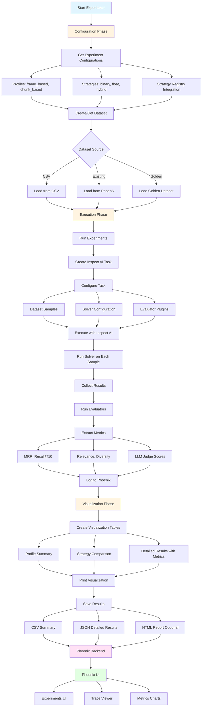
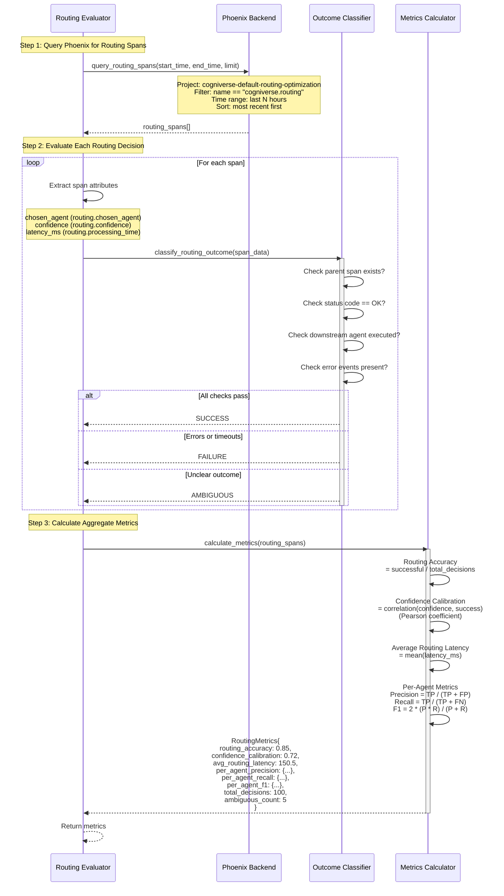
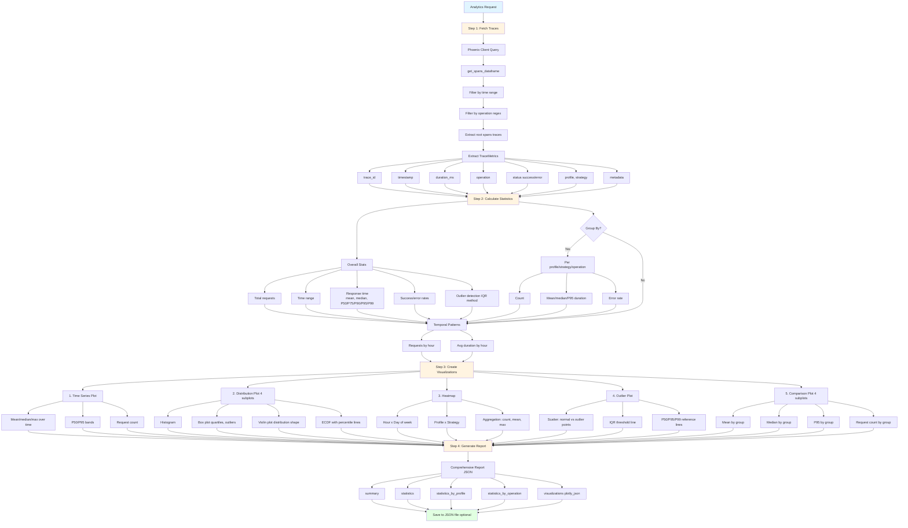

# Evaluation Module Study Guide

**Last Updated:** 2025-10-07
**Package:** `cogniverse_core`
**Module Location:** `libs/core/cogniverse_core/evaluation/`
**Purpose:** Experiment tracking, routing evaluation, and Phoenix analytics for performance measurement and optimization feedback

---

## Package Structure

```
libs/core/cogniverse_core/evaluation/
├── __init__.py                          # Package initialization
├── core/
│   ├── experiment_tracker.py            # ExperimentTracker main class
│   └── dataset_manager.py               # Dataset management
├── evaluators/
│   ├── routing_evaluator.py             # RoutingEvaluator
│   ├── quality_evaluators.py            # Quality metrics
│   └── llm_evaluators.py                # LLM-based evaluators
├── phoenix/
│   ├── analytics.py                     # PhoenixAnalytics
│   └── client.py                        # Phoenix client utilities
├── span_evaluator.py                    # SpanEvaluator
└── data/
    ├── golden_datasets.py               # Golden dataset management
    └── loaders.py                       # Data loaders
```

---

## Table of Contents
1. [Module Overview](#module-overview)
2. [Architecture Diagrams](#architecture-diagrams)
3. [Core Components](#core-components)
4. [Usage Examples](#usage-examples)
5. [Production Considerations](#production-considerations)
6. [Testing](#testing)

---

## Module Overview

### Purpose and Responsibilities

The Evaluation Module provides **comprehensive experiment tracking and performance evaluation** with:

- **Experiment Management**: Phoenix-based experiment tracking with visualization
- **Routing Evaluation**: Separate evaluation of routing decisions vs search quality
- **Span Analysis**: Retrospective evaluation of Phoenix traces
- **Performance Analytics**: Statistical analysis and visualization of traces
- **Golden Datasets**: Reference datasets for quality benchmarking
- **Multi-Evaluator Support**: Quality metrics, LLM judges, visual evaluators

### Key Features

1. **ExperimentTracker**
   - Inspect AI-based evaluation framework
   - Compatible with legacy run_experiments_with_visualization.py
   - Phoenix integration for trace visualization
   - Quality and LLM evaluator plugins
   - Dataset management and golden datasets

2. **RoutingEvaluator**
   - Routing-specific metrics (separate from search quality)
   - Accuracy, confidence calibration, per-agent precision/recall
   - Phoenix span analysis for routing decisions
   - Outcome classification (success, failure, ambiguous)

3. **PhoenixAnalytics**
   - Statistical analysis of traces (latency, throughput, errors)
   - Outlier detection using IQR and z-score methods
   - Interactive visualizations (time series, distributions, heatmaps)
   - Comparison analysis across profiles/strategies

4. **SpanEvaluator**
   - Retrospective evaluation of existing Phoenix spans
   - Reference-free and golden dataset evaluators
   - Automatic upload of evaluation results to Phoenix
   - Batch processing of historical traces

### Dependencies

**Internal:**
- `cogniverse_core.telemetry`: Phoenix client for querying spans
- `cogniverse_core.common.registry`: Strategy and profile registry
- `cogniverse_core.evaluation.data`: Dataset management

**External:**
- `phoenix`: Phoenix observability platform
- `inspect_ai`: Evaluation framework
- `pandas`: Data analysis
- `plotly`: Interactive visualizations
- `tabulate`: Table formatting

---

## Architecture Diagrams

### 1. Experiment Tracking Architecture



**Key Points:**
- Inspect AI framework for evaluation execution
- Plugin system for extensible evaluators
- Phoenix integration for visualization
- Compatible with legacy experiment system

---

### 2. Routing Evaluator Architecture



**Routing vs Search Quality:**
- Routing evaluation focuses on **decision quality** (right agent chosen?)
- Search evaluation focuses on **result quality** (relevant results returned?)
- Separate metrics enable independent optimization

---

### 3. Phoenix Analytics Flow



**Analytics Capabilities:**
- Statistical analysis with percentiles
- Outlier detection (IQR, z-score)
- Interactive Plotly visualizations
- Group-by analysis (profile, strategy, operation)
- Export to JSON for further analysis

---

### 4. Span Evaluator Pipeline


**Span Evaluator Features:**
- Retrospective evaluation of existing spans
- Multiple evaluator support (reference-free, golden dataset)
- Automatic upload to Phoenix for visualization
- Batch processing of historical traces
- Summary statistics and distribution analysis

---

## Core Components

### 1. ExperimentTracker

**File:** `libs/core/cogniverse_core/evaluation/core/experiment_tracker.py`

**Purpose:** Track and visualize experiments using Inspect AI evaluation framework with Phoenix integration.

**Key Attributes:**
```python
experiment_project_name: str          # Phoenix project name
output_dir: Path                       # Results directory
enable_quality_evaluators: bool        # Enable quality metrics
enable_llm_evaluators: bool           # Enable LLM-based evaluators
evaluator_name: str                    # Evaluator to use
llm_model: str                         # LLM model for evaluators
dataset_manager: DatasetManager        # Dataset management
phoenix_monitor: RetrievalMonitor      # Phoenix monitoring
experiments: list[dict]                # Experiment results
configurations: list[dict]             # Experiment configurations
```

**Main Methods:**

#### `get_experiment_configurations(profiles: list[str] | None = None, strategies: list[str] | None = None, all_strategies: bool = False) -> list[dict]`
Get experiment configurations from strategy registry.

**Parameters:**
- `profiles`: List of profiles to test (None = all)
- `strategies`: List of strategies to test (None = common strategies)
- `all_strategies`: Test all available strategies

**Returns:** List of configuration dicts with `{profile, strategies: [(name, description)]}`

**Example:**
```python
tracker = ExperimentTracker()

# Get configurations for specific profiles
configs = tracker.get_experiment_configurations(
    profiles=["frame_based_colpali", "chunk_based_videoprism"],
    strategies=["binary_binary", "hybrid_float_bm25"]
)

# configs = [
#     {
#         "profile": "frame_based_colpali",
#         "strategies": [
#             ("binary_binary", "Binary"),
#             ("hybrid_float_bm25", "Hybrid Float + Text")
#         ]
#     },
#     ...
# ]
```

---

#### `async run_experiment_async(profile: str, strategy: str, dataset_name: str, description: str) -> dict`
Run a single experiment using Inspect AI framework.

**Parameters:**
- `profile`: Vespa profile name
- `strategy`: Ranking strategy
- `dataset_name`: Dataset to evaluate against
- `description`: Human-readable experiment description

**Returns:** Experiment result dict with status, metrics, timestamp

**Workflow:**
1. Log experiment start to Phoenix
2. Create Inspect AI evaluation task
3. Execute evaluation with inspect_eval()
4. Extract metrics from result
5. Log completion to Phoenix
6. Return result dictionary

**Example:**
```python
tracker = ExperimentTracker()

result = await tracker.run_experiment_async(
    profile="frame_based_colpali",
    strategy="binary_binary",
    dataset_name="golden_eval_v1",
    description="Frame Based ColPali - Binary"
)

# result = {
#     "status": "success",
#     "profile": "frame_based_colpali",
#     "strategy": "binary_binary",
#     "description": "Frame Based ColPali - Binary",
#     "experiment_name": "frame_based_colpali_binary_binary_20251007_143022",
#     "metrics": {
#         "mrr": 0.85,
#         "recall": 0.92,
#         "relevance": 0.88
#     },
#     "timestamp": "2025-10-07T14:30:22"
# }
```

---

#### `create_or_get_dataset(dataset_name: str | None = None, csv_path: str | None = None, force_new: bool = False) -> str`
Create or retrieve a dataset for experiments.

**Parameters:**
- `dataset_name`: Name of existing dataset
- `csv_path`: Path to CSV file for new dataset
- `force_new`: Force creation of new dataset

**Returns:** Dataset name

**Example:**
```python
tracker = ExperimentTracker()

# Create from CSV
dataset_name = tracker.create_or_get_dataset(
    dataset_name="my_eval_dataset",
    csv_path="data/testset/evaluation/video_search_queries.csv"
)

# Use existing
dataset_name = tracker.create_or_get_dataset(
    dataset_name="golden_eval_v1"
)
```

---

#### `run_all_experiments(dataset_name: str) -> list[dict]`
Run all configured experiments.

**Parameters:**
- `dataset_name`: Dataset to evaluate against

**Returns:** List of experiment result dicts

**Output:** Prints progress table with success/failure status and metrics

**Example:**
```python
tracker = ExperimentTracker()

# Configure experiments
tracker.get_experiment_configurations(profiles=["frame_based_colpali"])

# Create dataset
dataset_name = tracker.create_or_get_dataset(csv_path="data/queries.csv")

# Run all experiments
results = tracker.run_all_experiments(dataset_name)

# Output:
# ================================================================
# PHOENIX EXPERIMENTS WITH VISUALIZATION
# ================================================================
# Timestamp: 2025-10-07 14:30:00
# ...
# [1/5] Frame Based ColPali - Binary
#   Strategy: binary_binary
#   ✅ Success
#      mrr: 0.850
#      relevance: 0.880
```

---

#### `create_visualization_tables(experiments: list[dict] | None = None, include_quality_metrics: bool = True) -> dict[str, pd.DataFrame]`
Create visualization tables from experiment results.

**Returns:**
```python
{
    "profile_summary": DataFrame,      # Summary by profile
    "detailed_results": DataFrame,     # All experiments with metrics
    "strategy_comparison": DataFrame   # Strategy comparison
}
```

**Example:**
```python
tables = tracker.create_visualization_tables()

print(tables["profile_summary"])
# | Profile              | Total | Success | Failed | Success Rate |
# |----------------------|-------|---------|--------|--------------|
# | frame_based_colpali  |   5   |    5    |   0    |   100.0%     |
```

---

### 2. RoutingEvaluator

**File:** `libs/core/cogniverse_core/evaluation/evaluators/routing_evaluator.py`

**Purpose:** Evaluate routing decisions separately from search quality.

**Key Attributes:**
```python
client: px.Client                  # Phoenix client
project_name: str                  # Phoenix project name
```

**RoutingOutcome Enum:**
```python
SUCCESS = "success"       # Agent completed task successfully
FAILURE = "failure"       # Agent failed, timed out, or returned empty
AMBIGUOUS = "ambiguous"   # Needs human annotation
```

**RoutingMetrics Dataclass:**
```python
routing_accuracy: float                    # % successful decisions
confidence_calibration: float              # Correlation(confidence, success)
avg_routing_latency: float                # Mean routing time (ms)
per_agent_precision: Dict[str, float]     # Precision per agent
per_agent_recall: Dict[str, float]        # Recall per agent
per_agent_f1: Dict[str, float]            # F1 per agent
total_decisions: int                       # Total evaluated
ambiguous_count: int                       # Unclear outcomes
```

**Main Methods:**

#### `evaluate_routing_decision(span_data: Dict[str, Any]) -> Tuple[RoutingOutcome, Dict[str, Any]]`
Extract and evaluate a single routing decision.

**Parameters:**
- `span_data`: Span dict from Phoenix with routing attributes

**Returns:** `(outcome, metrics)` tuple

**Extracted Metrics:**
```python
{
    "chosen_agent": str,        # Agent selected by routing
    "confidence": float,        # Routing confidence score
    "latency_ms": float,        # Routing processing time
    "success": bool,            # Whether routing succeeded
    "downstream_status": str    # Status description
}
```

**Example:**
```python
evaluator = RoutingEvaluator()

span_data = {
    "name": "cogniverse.routing",
    "attributes.routing": {
        "chosen_agent": "video_search_agent",
        "confidence": 0.92
    },
    "status_code": "OK"
}

outcome, metrics = evaluator.evaluate_routing_decision(span_data)
# outcome = RoutingOutcome.SUCCESS
# metrics = {
#     "chosen_agent": "video_search_agent",
#     "confidence": 0.92,
#     "latency_ms": 150.5,
#     "success": True,
#     "downstream_status": "completed_successfully"
# }
```

---

#### `calculate_metrics(routing_spans: List[Dict[str, Any]]) -> RoutingMetrics`
Calculate comprehensive routing metrics from spans.

**Parameters:**
- `routing_spans`: List of routing span dicts

**Returns:** RoutingMetrics with all calculated metrics

**Example:**
```python
evaluator = RoutingEvaluator()

# Get routing spans from Phoenix
spans = evaluator.query_routing_spans(hours=24, limit=100)

# Calculate metrics
metrics = evaluator.calculate_metrics(spans)

print(f"Routing Accuracy: {metrics.routing_accuracy:.2%}")
print(f"Confidence Calibration: {metrics.confidence_calibration:.3f}")
print(f"Avg Latency: {metrics.avg_routing_latency:.0f}ms")
print(f"Video Agent Precision: {metrics.per_agent_precision['video_search_agent']:.2%}")
```

---

#### `query_routing_spans(start_time: Optional[datetime] = None, end_time: Optional[datetime] = None, limit: int = 100) -> List[Dict[str, Any]]`
Query Phoenix for routing spans.

**Parameters:**
- `start_time`: Start of time range
- `end_time`: End of time range
- `limit`: Max spans to return

**Returns:** List of routing span dicts

**Example:**
```python
from datetime import datetime, timedelta

evaluator = RoutingEvaluator()

# Get last 6 hours of routing decisions
end_time = datetime.now()
start_time = end_time - timedelta(hours=6)

spans = evaluator.query_routing_spans(
    start_time=start_time,
    end_time=end_time,
    limit=500
)

print(f"Retrieved {len(spans)} routing decisions")
```

---

### 3. PhoenixAnalytics

**File:** `libs/core/cogniverse_core/evaluation/phoenix/analytics.py`

**Purpose:** Analytics and visualization for Phoenix traces.

**Key Attributes:**
```python
phoenix_url: str           # Phoenix endpoint
client: px.Client          # Phoenix client
_cache: dict               # Internal cache
```

**TraceMetrics Dataclass:**
```python
trace_id: str
timestamp: datetime
duration_ms: float
operation: str
status: str
profile: str | None
strategy: str | None
error: str | None
metadata: dict[str, Any]
```

**Main Methods:**

#### `get_traces(start_time: datetime | None = None, end_time: datetime | None = None, operation_filter: str | None = None, limit: int = 10000) -> list[TraceMetrics]`
Fetch traces from Phoenix with filters.

**Parameters:**
- `start_time`: Start of time range
- `end_time`: End of time range
- `operation_filter`: Regex filter for operation name
- `limit`: Max traces to fetch

**Returns:** List of TraceMetrics objects

**Example:**
```python
analytics = PhoenixAnalytics()

# Get search operations from last hour
traces = analytics.get_traces(
    start_time=datetime.now() - timedelta(hours=1),
    operation_filter="search_service\\..*"
)

print(f"Fetched {len(traces)} search traces")
```

---

#### `calculate_statistics(traces: list[TraceMetrics], group_by: str | None = None) -> dict[str, Any]`
Calculate comprehensive statistics from traces.

**Parameters:**
- `traces`: List of trace metrics
- `group_by`: Optional field to group by ("operation", "profile", "strategy")

**Returns:** Statistics dictionary with:
- `total_requests`: Total count
- `time_range`: Start/end timestamps
- `response_time`: mean, median, min, max, std, P50/P75/P90/P95/P99
- `status`: counts, success_rate, error_rate
- `by_{group_by}`: Grouped statistics (if group_by specified)
- `temporal`: requests/duration by hour
- `outliers`: count, percentage, values

**Example:**
```python
analytics = PhoenixAnalytics()
traces = analytics.get_traces()

# Overall stats
stats = analytics.calculate_statistics(traces)
print(f"P95 Latency: {stats['response_time']['p95']:.0f}ms")
print(f"Success Rate: {stats['status']['success_rate']:.2%}")

# Grouped by profile
stats_by_profile = analytics.calculate_statistics(traces, group_by="profile")
for profile, profile_stats in stats_by_profile["by_profile"].items():
    print(f"{profile}: {profile_stats['p95_duration']:.0f}ms P95")
```

---

#### `create_time_series_plot(...) -> go.Figure`
#### `create_distribution_plot(...) -> go.Figure`
#### `create_heatmap(...) -> go.Figure`
#### `create_outlier_plot(...) -> go.Figure`
#### `create_comparison_plot(...) -> go.Figure`

Create interactive Plotly visualizations.

**Example:**
```python
analytics = PhoenixAnalytics()
traces = analytics.get_traces()

# Time series with P50/P95 bands
fig_time = analytics.create_time_series_plot(
    traces,
    metric="duration_ms",
    aggregation="mean",
    time_window="5min"
)
fig_time.show()

# Distribution analysis (4 subplots)
fig_dist = analytics.create_distribution_plot(
    traces,
    metric="duration_ms",
    group_by="profile"
)
fig_dist.show()

# Hour x Day heatmap
fig_heat = analytics.create_heatmap(
    traces,
    x_field="hour",
    y_field="day",
    metric="duration_ms",
    aggregation="mean"
)
fig_heat.show()
```

---

#### `generate_report(start_time: datetime | None = None, end_time: datetime | None = None, output_file: str | None = None) -> dict[str, Any]`
Generate comprehensive analytics report.

**Returns:** Report dictionary with summary, statistics, and visualizations (as JSON)

**Example:**
```python
analytics = PhoenixAnalytics()

# Generate last 24h report
report = analytics.generate_report(
    start_time=datetime.now() - timedelta(days=1),
    output_file="outputs/analytics_report.json"
)

print(f"Analyzed {report['summary']['total_requests']} requests")
print(f"P95 Latency: {report['summary']['p95_response_time']:.0f}ms")
print(f"Outliers: {report['summary']['outlier_percentage']:.1f}%")
```

---

### 4. SpanEvaluator

**File:** `libs/core/cogniverse_core/evaluation/span_evaluator.py`

**Purpose:** Evaluate existing spans in Phoenix using various evaluators.

**Key Attributes:**
```python
client: px.Client                              # Phoenix client
http_client: HTTPClient                        # HTTP client
reference_free_evaluators: dict                # Reference-free evaluators
golden_evaluator: GoldenDatasetEvaluator       # Golden dataset evaluator
```

**Main Methods:**

#### `get_recent_spans(hours: int = 6, operation_name: str | None = "search_service.search", limit: int = 1000) -> pd.DataFrame`
Retrieve recent spans from Phoenix.

**Parameters:**
- `hours`: Hours to look back
- `operation_name`: Filter by operation name
- `limit`: Max spans

**Returns:** DataFrame with span information

**Example:**
```python
evaluator = SpanEvaluator()

# Get last 6 hours of search spans
spans_df = evaluator.get_recent_spans(
    hours=6,
    operation_name="search_service.search"
)

print(f"Retrieved {len(spans_df)} search spans")
```

---

#### `async evaluate_spans(spans_df: pd.DataFrame, evaluator_names: list[str] | None = None) -> dict[str, pd.DataFrame]`
Evaluate spans using specified evaluators.

**Parameters:**
- `spans_df`: DataFrame of spans to evaluate
- `evaluator_names`: List of evaluator names (None = all)

**Returns:** Dict mapping evaluator name to results DataFrame

**Available Evaluators:**
- `relevance`: Relevance quality metric
- `diversity`: Result diversity metric
- `golden_dataset`: Golden dataset comparison

**Example:**
```python
evaluator = SpanEvaluator()

# Get spans
spans_df = evaluator.get_recent_spans(hours=24)

# Evaluate
eval_results = await evaluator.evaluate_spans(
    spans_df,
    evaluator_names=["relevance", "diversity", "golden_dataset"]
)

# Check results
for eval_name, results_df in eval_results.items():
    mean_score = results_df["score"].mean()
    print(f"{eval_name}: {mean_score:.3f} avg score")
```

---

#### `upload_evaluations_to_phoenix(evaluations: dict[str, pd.DataFrame])`
Upload evaluation results to Phoenix as SpanEvaluations.

**Example:**
```python
evaluator = SpanEvaluator()

# Evaluate spans
spans_df = evaluator.get_recent_spans()
eval_results = await evaluator.evaluate_spans(spans_df)

# Upload to Phoenix
evaluator.upload_evaluations_to_phoenix(eval_results)
# Results now visible in Phoenix UI
```

---

#### `async run_evaluation_pipeline(hours: int = 6, operation_name: str | None = "search_service.search", evaluator_names: list[str] | None = None, upload_to_phoenix: bool = True) -> dict[str, Any]`
Run complete evaluation pipeline on recent spans.

**Returns:** Summary with num_spans_evaluated, evaluators_run, results

**Example:**
```python
evaluator = SpanEvaluator()

# Run full pipeline
summary = await evaluator.run_evaluation_pipeline(
    hours=24,
    evaluator_names=["relevance", "diversity", "golden_dataset"],
    upload_to_phoenix=True
)

print(f"Evaluated {summary['num_spans_evaluated']} spans")
print(f"Evaluators: {summary['evaluators_run']}")
for eval_name, stats in summary["results"].items():
    print(f"{eval_name}: {stats['mean_score']:.3f}")
```

---

## Usage Examples

### Example 1: Run Experiment Suite with Visualization

```python
"""
Complete experiment workflow with Phoenix visualization.
"""
from cogniverse_core.evaluation.core.experiment_tracker import ExperimentTracker

# Initialize tracker
tracker = ExperimentTracker(
    experiment_project_name="my_experiments",
    enable_quality_evaluators=True,
    enable_llm_evaluators=False
)

# Get experiment configurations
configs = tracker.get_experiment_configurations(
    profiles=["frame_based_colpali", "chunk_based_videoprism"],
    strategies=["binary_binary", "hybrid_float_bm25"]
)

print(f"Configured {len(configs)} profiles with {sum(len(c['strategies']) for c in configs)} experiments")

# Create dataset
dataset_name = tracker.create_or_get_dataset(
    dataset_name="golden_eval_v1",
    csv_path="data/testset/evaluation/video_search_queries.csv"
)

# Run all experiments
results = tracker.run_all_experiments(dataset_name)

# Create visualization tables
tables = tracker.create_visualization_tables()

# Print results
tracker.print_visualization(tables)

# Save results
csv_path, json_path = tracker.save_results()
print(f"\nResults saved:")
print(f"  CSV: {csv_path}")
print(f"  JSON: {json_path}")

# Phoenix UI links printed automatically
```

**Output:**
```
================================================================
PHOENIX EXPERIMENTS WITH VISUALIZATION
================================================================
Timestamp: 2025-10-07 14:30:00
Experiment Project: my_experiments
Dataset: golden_eval_v1

Quality Evaluators: ✅ ENABLED
LLM Evaluators: ❌ DISABLED

============================================================
Profile: frame_based_colpali
============================================================

[1/4] Frame Based ColPali - Binary
  Strategy: binary_binary
  ✅ Success
     mrr: 0.850
     relevance: 0.880
...

🔗 Dataset: http://localhost:6006/datasets/golden_eval_v1
🔗 Experiments Project: http://localhost:6006/projects/my_experiments
```

---

### Example 2: Evaluate Routing Decisions

```python
"""
Analyze routing decision quality from Phoenix spans.
"""
from cogniverse_core.evaluation.evaluators.routing_evaluator import RoutingEvaluator
from datetime import datetime, timedelta

# Initialize evaluator for routing project
evaluator = RoutingEvaluator(
    project_name="cogniverse-default-routing-optimization"
)

# Get routing spans from last 24 hours
end_time = datetime.now()
start_time = end_time - timedelta(hours=24)

routing_spans = evaluator.query_routing_spans(
    start_time=start_time,
    end_time=end_time,
    limit=500
)

print(f"Retrieved {len(routing_spans)} routing decisions from Phoenix")

# Calculate metrics
metrics = evaluator.calculate_metrics(routing_spans)

# Print overall metrics
print(f"\n{'='*60}")
print("ROUTING EVALUATION RESULTS")
print(f"{'='*60}")
print(f"\nOverall Metrics:")
print(f"  Total Decisions: {metrics.total_decisions}")
print(f"  Routing Accuracy: {metrics.routing_accuracy:.2%}")
print(f"  Confidence Calibration: {metrics.confidence_calibration:.3f}")
print(f"  Avg Routing Latency: {metrics.avg_routing_latency:.0f}ms")
print(f"  Ambiguous Decisions: {metrics.ambiguous_count} ({metrics.ambiguous_count/metrics.total_decisions:.1%})")

# Print per-agent metrics
print(f"\nPer-Agent Metrics:")
for agent in metrics.per_agent_precision.keys():
    precision = metrics.per_agent_precision[agent]
    recall = metrics.per_agent_recall[agent]
    f1 = metrics.per_agent_f1[agent]
    print(f"\n  {agent}:")
    print(f"    Precision: {precision:.2%}")
    print(f"    Recall: {recall:.2%}")
    print(f"    F1 Score: {f1:.3f}")
```

**Output:**
```
Retrieved 478 routing decisions from Phoenix

============================================================
ROUTING EVALUATION RESULTS
============================================================

Overall Metrics:
  Total Decisions: 478
  Routing Accuracy: 87.45%
  Confidence Calibration: 0.723
  Avg Routing Latency: 152ms
  Ambiguous Decisions: 12 (2.5%)

Per-Agent Metrics:

  video_search_agent:
    Precision: 92.00%
    Recall: 88.50%
    F1 Score: 0.902

  text_agent:
    Precision: 85.00%
    Recall: 79.20%
    F1 Score: 0.820
```

---

### Example 3: Phoenix Analytics and Visualization

```python
"""
Generate analytics reports with visualizations.
"""
from cogniverse_core.evaluation.phoenix.analytics import PhoenixAnalytics
from datetime import datetime, timedelta

analytics = PhoenixAnalytics(phoenix_url="http://localhost:6006")

# Define analysis period
end_time = datetime.now()
start_time = end_time - timedelta(days=7)

# Fetch traces
traces = analytics.get_traces(
    start_time=start_time,
    end_time=end_time,
    operation_filter="search_service\\..*",
    limit=10000
)

print(f"Analyzing {len(traces)} search traces from last 7 days")

# Calculate overall statistics
stats = analytics.calculate_statistics(traces)

print(f"\nOverall Statistics:")
print(f"  Total Requests: {stats['total_requests']}")
print(f"  Mean Latency: {stats['response_time']['mean']:.0f}ms")
print(f"  P95 Latency: {stats['response_time']['p95']:.0f}ms")
print(f"  P99 Latency: {stats['response_time']['p99']:.0f}ms")
print(f"  Success Rate: {stats['status']['success_rate']:.2%}")
print(f"  Outliers: {stats['outliers']['percentage']:.1f}%")

# Calculate grouped statistics
stats_by_profile = analytics.calculate_statistics(traces, group_by="profile")

print(f"\nPer-Profile Statistics:")
for profile, profile_stats in stats_by_profile["by_profile"].items():
    print(f"\n  {profile}:")
    print(f"    Count: {profile_stats['count']}")
    print(f"    Mean: {profile_stats['mean_duration']:.0f}ms")
    print(f"    P95: {profile_stats['p95_duration']:.0f}ms")
    print(f"    Error Rate: {profile_stats['error_rate']:.2%}")

# Create visualizations
print("\nGenerating visualizations...")

# Time series with percentile bands
fig_time = analytics.create_time_series_plot(
    traces,
    metric="duration_ms",
    aggregation="mean",
    time_window="1h"
)
fig_time.write_html("outputs/time_series.html")

# Distribution analysis (4 subplots)
fig_dist = analytics.create_distribution_plot(
    traces,
    metric="duration_ms",
    group_by="profile"
)
fig_dist.write_html("outputs/distribution.html")

# Heatmap
fig_heat = analytics.create_heatmap(
    traces,
    x_field="hour",
    y_field="day",
    metric="duration_ms"
)
fig_heat.write_html("outputs/heatmap.html")

# Outlier detection
fig_outlier = analytics.create_outlier_plot(traces)
fig_outlier.write_html("outputs/outliers.html")

# Comparison across profiles
fig_compare = analytics.create_comparison_plot(
    traces,
    compare_field="profile",
    metric="duration_ms"
)
fig_compare.write_html("outputs/comparison.html")

print("✅ Visualizations saved to outputs/")

# Generate comprehensive report
report = analytics.generate_report(
    start_time=start_time,
    end_time=end_time,
    output_file="outputs/analytics_report.json"
)

print(f"\n✅ Full report saved to outputs/analytics_report.json")
```

---

### Example 4: Retrospective Span Evaluation

```python
"""
Evaluate existing Phoenix spans and upload results.
"""
import asyncio
from cogniverse_core.evaluation.span_evaluator import SpanEvaluator

async def evaluate_historical_spans():
    """Evaluate spans from the past week."""
    evaluator = SpanEvaluator()

    # Get spans from last week
    spans_df = evaluator.get_recent_spans(
        hours=24 * 7,  # 7 days
        operation_name="search_service.search",
        limit=5000
    )

    print(f"Retrieved {len(spans_df)} search spans from last week")

    # Run evaluations
    print("\nRunning evaluations...")
    eval_results = await evaluator.evaluate_spans(
        spans_df,
        evaluator_names=["relevance", "diversity", "golden_dataset"]
    )

    # Print results
    print(f"\nEvaluation Results:")
    for eval_name, results_df in eval_results.items():
        mean_score = results_df["score"].mean()
        distribution = results_df["label"].value_counts()

        print(f"\n  {eval_name}:")
        print(f"    Evaluated: {len(results_df)} spans")
        print(f"    Mean Score: {mean_score:.3f}")
        print(f"    Distribution:")
        for label, count in distribution.items():
            print(f"      {label}: {count} ({count/len(results_df):.1%})")

    # Upload to Phoenix
    print("\nUploading evaluations to Phoenix...")
    evaluator.upload_evaluations_to_phoenix(eval_results)

    print("✅ Evaluations uploaded to Phoenix UI")
    print("   View at: http://localhost:6006/projects/default")

# Run async evaluation
asyncio.run(evaluate_historical_spans())
```

**Output:**
```
Retrieved 3,245 search spans from last week

Running evaluations...

Evaluation Results:

  relevance:
    Evaluated: 3245 spans
    Mean Score: 0.782
    Distribution:
      relevant: 2534 (78.1%)
      not_relevant: 711 (21.9%)

  diversity:
    Evaluated: 3245 spans
    Mean Score: 0.845
    Distribution:
      high_diversity: 2107 (64.9%)
      medium_diversity: 892 (27.5%)
      low_diversity: 246 (7.6%)

  golden_dataset:
    Evaluated: 127 spans
    Mean Score: 0.912
    Distribution:
      exact_match: 89 (70.1%)
      partial_match: 32 (25.2%)
      no_match: 6 (4.7%)

Uploading evaluations to Phoenix...
✅ Evaluations uploaded to Phoenix UI
   View at: http://localhost:6006/projects/default
```

---

### Example 5: Production Monitoring Pipeline

```python
"""
Production monitoring with routing + analytics + span evaluation.
"""
import asyncio
from datetime import datetime, timedelta
from cogniverse_core.evaluation.evaluators.routing_evaluator import RoutingEvaluator
from cogniverse_core.evaluation.phoenix.analytics import PhoenixAnalytics
from cogniverse_core.evaluation.span_evaluator import SpanEvaluator

async def production_monitoring_pipeline():
    """Complete monitoring pipeline for production system."""

    # Time range: last 6 hours
    end_time = datetime.now()
    start_time = end_time - timedelta(hours=6)

    print("="*70)
    print("PRODUCTION MONITORING PIPELINE")
    print("="*70)
    print(f"Time Range: {start_time.strftime('%Y-%m-%d %H:%M')} → {end_time.strftime('%Y-%m-%d %H:%M')}")

    # 1. Routing evaluation
    print("\n[1/3] Evaluating Routing Decisions...")
    routing_eval = RoutingEvaluator()
    routing_spans = routing_eval.query_routing_spans(
        start_time=start_time,
        end_time=end_time,
        limit=1000
    )
    routing_metrics = routing_eval.calculate_metrics(routing_spans)

    print(f"   Routing Accuracy: {routing_metrics.routing_accuracy:.2%}")
    print(f"   Avg Latency: {routing_metrics.avg_routing_latency:.0f}ms")
    print(f"   Confidence Calibration: {routing_metrics.confidence_calibration:.3f}")

    # Alert if routing accuracy drops
    if routing_metrics.routing_accuracy < 0.80:
        print("   ⚠️  WARNING: Routing accuracy below 80%!")

    # 2. Analytics and outlier detection
    print("\n[2/3] Analyzing Search Performance...")
    analytics = PhoenixAnalytics()
    traces = analytics.get_traces(
        start_time=start_time,
        end_time=end_time,
        operation_filter="search_service\\..*"
    )
    stats = analytics.calculate_statistics(traces)

    print(f"   Total Requests: {stats['total_requests']}")
    print(f"   P95 Latency: {stats['response_time']['p95']:.0f}ms")
    print(f"   Success Rate: {stats['status']['success_rate']:.2%}")
    print(f"   Outliers: {stats['outliers']['percentage']:.1f}%")

    # Alert if P95 latency is high
    if stats['response_time']['p95'] > 1000:
        print("   ⚠️  WARNING: P95 latency above 1000ms!")

    # Alert if outlier percentage is high
    if stats['outliers']['percentage'] > 5:
        print(f"   ⚠️  WARNING: High outlier percentage ({stats['outliers']['percentage']:.1f}%)!")

    # 3. Span quality evaluation
    print("\n[3/3] Evaluating Search Quality...")
    span_eval = SpanEvaluator()
    spans_df = span_eval.get_recent_spans(hours=6, limit=500)
    eval_results = await span_eval.evaluate_spans(
        spans_df,
        evaluator_names=["relevance", "diversity"]
    )

    for eval_name, results_df in eval_results.items():
        mean_score = results_df["score"].mean()
        print(f"   {eval_name.capitalize()}: {mean_score:.3f}")

        # Alert if quality drops
        if mean_score < 0.70:
            print(f"   ⚠️  WARNING: {eval_name} score below 0.70!")

    # Upload evaluations to Phoenix
    span_eval.upload_evaluations_to_phoenix(eval_results)

    print("\n" + "="*70)
    print("MONITORING COMPLETE")
    print("="*70)
    print(f"View detailed metrics: http://localhost:6006/projects/default")

# Run monitoring pipeline
asyncio.run(production_monitoring_pipeline())
```

**Output:**
```
======================================================================
PRODUCTION MONITORING PIPELINE
======================================================================
Time Range: 2025-10-07 08:30 → 2025-10-07 14:30

[1/3] Evaluating Routing Decisions...
   Routing Accuracy: 88.50%
   Avg Latency: 145ms
   Confidence Calibration: 0.745

[2/3] Analyzing Search Performance...
   Total Requests: 1,247
   P95 Latency: 782ms
   Success Rate: 96.80%
   Outliers: 3.2%

[3/3] Evaluating Search Quality...
   Relevance: 0.812
   Diversity: 0.867

======================================================================
MONITORING COMPLETE
======================================================================
View detailed metrics: http://localhost:6006/projects/default
```

---

## Production Considerations

### 1. Experiment Management

**Dataset Versioning:**
```python
# Use versioned dataset names
dataset_name = tracker.create_or_get_dataset(
    dataset_name=f"golden_eval_v{version}",
    csv_path="data/golden_dataset.csv"
)

# Track dataset metadata
metadata = {
    "version": "v3",
    "created": datetime.now().isoformat(),
    "num_queries": 500,
    "source": "production_logs"
}
```

**Experiment Reproducibility:**
- Save experiment configurations to JSON
- Version control evaluation code
- Record model versions, strategy parameters
- Store Phoenix project URLs for trace lookup

**Cost Management:**
- Limit LLM evaluator usage (expensive)
- Use quality evaluators first (cheap, fast)
- Sample large datasets for quick validation
- Cache evaluation results

---

### 2. Routing Evaluation Best Practices

**Confidence Calibration Monitoring:**
```python
# Good calibration: high correlation (>0.7)
# Poor calibration: low correlation (<0.3)

if routing_metrics.confidence_calibration < 0.5:
    logger.warning(
        "Poor confidence calibration - routing confidence scores "
        "don't predict success well. Consider retraining routing model."
    )
```

**Per-Agent Precision Tracking:**
```python
# Identify underperforming agents
for agent, precision in routing_metrics.per_agent_precision.items():
    if precision < 0.75:
        logger.warning(
            f"Agent {agent} has low precision ({precision:.2%}). "
            f"Review agent capabilities or routing logic."
        )
```

**Ambiguous Decision Handling:**
```python
# High ambiguous count indicates need for better outcome detection
ambiguous_rate = routing_metrics.ambiguous_count / routing_metrics.total_decisions

if ambiguous_rate > 0.10:
    logger.warning(
        f"High ambiguous decision rate ({ambiguous_rate:.1%}). "
        f"Improve outcome classification or add ground truth labels."
    )
```

---

### 3. Analytics and Alerting

**Automated Alerting:**
```python
def check_performance_alerts(stats: dict):
    """Check for performance degradation."""
    alerts = []

    # P95 latency alert
    if stats['response_time']['p95'] > 1000:
        alerts.append({
            "level": "warning",
            "metric": "p95_latency",
            "value": stats['response_time']['p95'],
            "threshold": 1000,
            "message": "P95 latency exceeds 1000ms"
        })

    # Error rate alert
    if stats['status']['error_rate'] > 0.05:
        alerts.append({
            "level": "critical",
            "metric": "error_rate",
            "value": stats['status']['error_rate'],
            "threshold": 0.05,
            "message": "Error rate exceeds 5%"
        })

    # Outlier percentage alert
    if stats['outliers']['percentage'] > 10:
        alerts.append({
            "level": "warning",
            "metric": "outlier_percentage",
            "value": stats['outliers']['percentage'],
            "threshold": 10,
            "message": "Outlier percentage exceeds 10%"
        })

    return alerts
```

**Trend Analysis:**
```python
# Compare current vs historical performance
def detect_performance_regression(current_stats, historical_baseline):
    """Detect if performance has degraded."""

    # P95 latency regression
    current_p95 = current_stats['response_time']['p95']
    baseline_p95 = historical_baseline['response_time']['p95']

    if current_p95 > baseline_p95 * 1.2:  # 20% degradation
        return {
            "regression_detected": True,
            "metric": "p95_latency",
            "current": current_p95,
            "baseline": baseline_p95,
            "degradation_pct": (current_p95 - baseline_p95) / baseline_p95
        }

    return {"regression_detected": False}
```

---

### 4. Span Evaluation at Scale

**Batch Processing:**
```python
async def evaluate_spans_in_batches(span_ids: list[str], batch_size: int = 100):
    """Evaluate large number of spans in batches."""
    results = []

    for i in range(0, len(span_ids), batch_size):
        batch = span_ids[i:i+batch_size]
        batch_results = await evaluator.evaluate_spans(batch)
        results.extend(batch_results)

        # Rate limiting
        if i + batch_size < len(span_ids):
            await asyncio.sleep(1)

    return results
```

**Sampling for Large Datasets:**
```python
# Sample spans for quick evaluation
sampled_spans = spans_df.sample(n=min(1000, len(spans_df)))
eval_results = await evaluator.evaluate_spans(sampled_spans)
```

**Caching Evaluation Results:**
```python
# Cache evaluations to avoid re-evaluation
evaluation_cache = {}

def get_or_evaluate_span(span_id, evaluator):
    if span_id in evaluation_cache:
        return evaluation_cache[span_id]

    result = evaluator.evaluate(span_id)
    evaluation_cache[span_id] = result
    return result
```

---

## Testing

### Key Test Files

**Unit Tests:**
- `tests/evaluation/unit/test_experiment_tracker.py`
  - Experiment configuration
  - Dataset management
  - Result formatting

**Integration Tests:**
- `tests/evaluation/integration/test_routing_evaluator_integration.py`
  - Phoenix span querying
  - Routing metric calculation
  - Confidence calibration

- `tests/routing/integration/test_phoenix_span_evaluator_integration.py`
  - Span evaluation pipeline
  - Evaluator integration
  - Phoenix upload

**Test Scenarios:**

1. **Experiment Tracking:**
```python
def test_experiment_configurations():
    """Verify experiment configuration retrieval."""
    tracker = ExperimentTracker()
    configs = tracker.get_experiment_configurations(
        profiles=["test_profile"]
    )
    assert len(configs) > 0
    assert all("strategies" in c for c in configs)
```

2. **Routing Evaluation:**
```python
def test_routing_metrics_calculation():
    """Verify routing metrics calculation."""
    evaluator = RoutingEvaluator()

    # Mock spans with known outcomes
    spans = create_mock_routing_spans(
        success_count=80,
        failure_count=20
    )

    metrics = evaluator.calculate_metrics(spans)

    assert metrics.routing_accuracy == 0.80
    assert metrics.total_decisions == 100
```

3. **Analytics:**
```python
def test_outlier_detection():
    """Verify outlier detection logic."""
    analytics = PhoenixAnalytics()

    # Create data with known outliers
    data = np.array([100, 110, 105, 95, 1000, 102])  # 1000 is outlier
    outliers = analytics._detect_outliers(data, method="iqr")

    assert 1000 in outliers
    assert len(outliers) == 1
```

---

**Test Coverage:**
- Experiment configuration: ✅
- Dataset management: ✅
- Routing evaluation: ✅
- Analytics calculations: ✅
- Visualization generation: ✅
- Phoenix integration: ✅

---

## Summary

The Evaluation Module provides **comprehensive experiment tracking and performance analysis** with:

**Core Features:**
- ✅ Inspect AI-based experiment framework
- ✅ Routing-specific evaluation (separate from search)
- ✅ Phoenix analytics with visualizations
- ✅ Retrospective span evaluation
- ✅ Multi-evaluator support (quality, LLM, golden)

**Production Strengths:**
- Experiment reproducibility with versioned datasets
- Routing confidence calibration monitoring
- Automated performance alerting
- Statistical analysis with outlier detection
- Interactive Plotly visualizations

**Integration Points:**
- Phoenix for trace storage and visualization
- Inspect AI for evaluation execution
- Quality evaluators for automated assessment
- Dataset management for golden datasets

---

**For detailed examples and production configurations, see:**
- Architecture Overview: `docs/study_guides/00_ARCHITECTURE_OVERVIEW.md`
- Routing Module: `docs/modules/routing.md`
- Telemetry Module: `docs/modules/telemetry.md`

**Source Files:**
- ExperimentTracker: `libs/core/cogniverse_core/evaluation/core/experiment_tracker.py`
- RoutingEvaluator: `libs/core/cogniverse_core/evaluation/evaluators/routing_evaluator.py`
- PhoenixAnalytics: `libs/core/cogniverse_core/evaluation/phoenix/analytics.py`
- SpanEvaluator: `libs/core/cogniverse_core/evaluation/span_evaluator.py`
