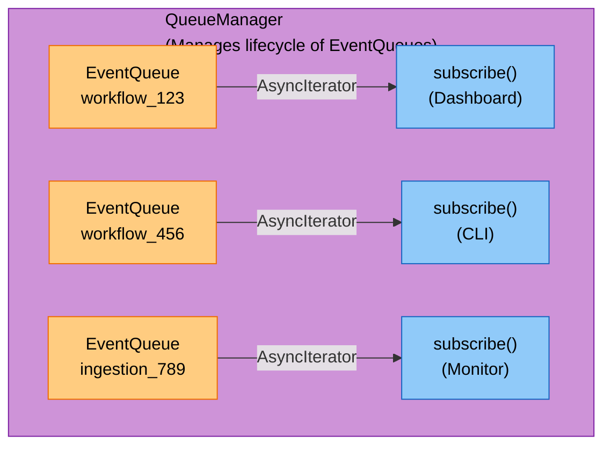
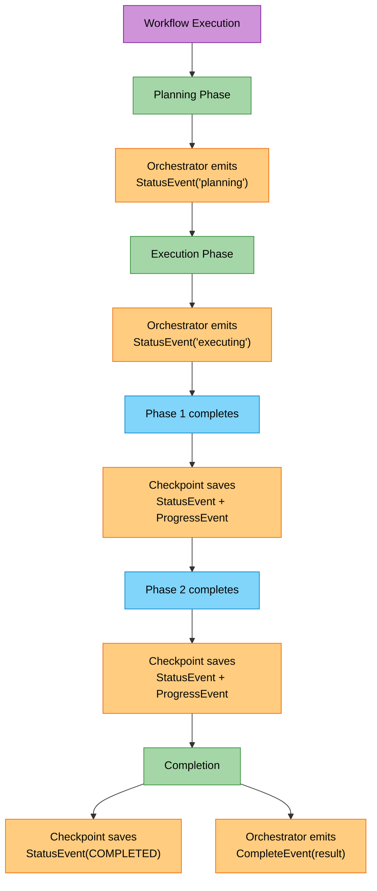

# A2A EventQueue System

Real-time event notifications for orchestrator workflows and ingestion pipelines.

## Overview

The EventQueue system provides A2A-compatible real-time progress notifications. It enables:

- **Multiple subscribers**: Dashboard + CLI can watch the same workflow simultaneously
- **Replay on reconnect**: Clients can resume from a specific offset after disconnection
- **Graceful cancellation**: Tasks abort at phase/video boundaries
- **Multi-tenant isolation**: Events are scoped by tenant_id

## Architecture



## Event Types

### StatusEvent
Task state transitions (A2A-compatible):
```python
StatusEvent(
    task_id="workflow_123",
    tenant_id="tenant1",
    state=TaskState.WORKING,  # pending, working, input-required, completed, failed, cancelled
    phase="planning",
    message="Planning workflow execution",
)
```

### ProgressEvent
Incremental progress updates:
```python
ProgressEvent(
    task_id="ingestion_456",
    tenant_id="tenant1",
    current=5,
    total=10,
    percentage=50.0,
    step="processing_video_5",
    details={"video": "sample.mp4"},
)
```

### ArtifactEvent
Intermediate results (A2A TaskArtifactUpdateEvent):
```python
ArtifactEvent(
    task_id="workflow_123",
    tenant_id="tenant1",
    artifact_type="search_result",
    data={"results": [...]},
    is_partial=True,
)
```

### ErrorEvent
Error notifications:
```python
ErrorEvent(
    task_id="workflow_123",
    tenant_id="tenant1",
    error_type="ValidationError",
    error_message="Invalid input",
    recoverable=True,
)
```

### CompleteEvent
Task completion:
```python
CompleteEvent(
    task_id="workflow_123",
    tenant_id="tenant1",
    result={"answer": "..."},
    summary="Workflow completed successfully",
    execution_time_seconds=10.5,
)
```

## Usage

### Basic Usage

```python
from cogniverse_core.events import (
    get_queue_manager,
    create_status_event,
    create_progress_event,
    TaskState,
)

# Get the global queue manager
manager = get_queue_manager()

# Create a queue for a workflow
queue = await manager.create_queue(
    task_id="workflow_123",
    tenant_id="tenant1",
    ttl_minutes=30,
)

# Emit events
await queue.enqueue(create_status_event(
    task_id="workflow_123",
    tenant_id="tenant1",
    state=TaskState.WORKING,
    phase="planning",
))

# Subscribe to events (in another coroutine)
async for event in queue.subscribe():
    print(f"Received: {event.event_type}")
    if event.event_type == "complete":
        break
```

### With Orchestrator

```python
from cogniverse_agents.orchestrator.multi_agent_orchestrator import MultiAgentOrchestrator
from cogniverse_core.events import get_queue_manager

# Create event queue for this workflow
manager = get_queue_manager()
workflow_id = "workflow_123"
queue = await manager.create_queue(
    task_id=workflow_id,
    tenant_id="tenant1",
)

# Create orchestrator with event queue
orchestrator = MultiAgentOrchestrator(
    tenant_id="tenant1",
    event_queue=queue,  # Events emitted automatically
)

# Process query - events emitted during execution
result = await orchestrator.process_complex_query("Find videos about cats")
```

### With Ingestion Pipeline

```python
from cogniverse_runtime.ingestion.pipeline import VideoIngestionPipeline
from cogniverse_core.events import get_queue_manager
from cogniverse_foundation.config.utils import create_default_config_manager

# Create event queue for ingestion job
manager = get_queue_manager()
job_id = "ingestion_456"
queue = await manager.create_queue(
    task_id=job_id,
    tenant_id="tenant1",
)

# Create pipeline with event queue
config_manager = create_default_config_manager()
pipeline = VideoIngestionPipeline(
    tenant_id="tenant1",
    config_manager=config_manager,
    event_queue=queue,  # Events emitted automatically during processing
)

# Process videos - pipeline.job_id is set during execution
result = await pipeline.process_videos_concurrent(video_files)
# Subscribe to events using the job_id from queue or pipeline.job_id
```

### SSE Streaming (HTTP Clients)

```bash
# Subscribe to workflow events
curl -N "http://localhost:8000/events/workflows/workflow_123"

# Subscribe to ingestion events
curl -N "http://localhost:8000/events/ingestion/ingestion_456"

# Cancel a workflow
curl -X POST "http://localhost:8000/events/workflows/workflow_123/cancel" \
  -H "Content-Type: application/json" \
  -d '{"reason": "User requested"}'
```

### Reconnection with Replay

```python
# First connection - get offset
last_offset = 0
async for event in queue.subscribe():
    last_offset = await queue.get_latest_offset()
    # ... process event ...
    if connection_lost:
        break

# Reconnect from last offset
async for event in queue.subscribe(from_offset=last_offset):
    # ... resume processing ...
```

## API Endpoints

| Endpoint | Method | Description |
|----------|--------|-------------|
| `/events/workflows/{workflow_id}` | GET | SSE stream of workflow events |
| `/events/ingestion/{job_id}` | GET | SSE stream of ingestion events |
| `/events/workflows/{workflow_id}/cancel` | POST | Cancel running workflow |
| `/events/ingestion/{job_id}/cancel` | POST | Cancel running ingestion |
| `/events/queues` | GET | List active queues (admin) |
| `/events/queues/{task_id}` | GET | Get queue info |
| `/events/queues/{task_id}/offset` | GET | Get current event offset |

## Configuration

### Queue Manager

```python
manager = InMemoryQueueManager(
    default_ttl_minutes=30,    # Event TTL (default 30 min)
    max_buffer_size=1000,      # Max events per queue
)

# Start cleanup loop (optional)
await manager.start_cleanup_loop(interval_seconds=60)
```

### Queue Options

```python
queue = await manager.create_queue(
    task_id="workflow_123",
    tenant_id="tenant1",
    ttl_minutes=60,  # Override default TTL
)
```

## Cancellation

```python
# Via queue manager
await manager.cancel_task("workflow_123", reason="User requested")

# Via queue directly
queue.cancel("Timeout exceeded")

# Check in producer
if queue.cancellation_token.is_cancelled:
    # Clean up and stop
    pass
```

## Backend Options

### In-Memory (Default)
- Single-pod deployments
- Development/testing
- No persistence (events lost on restart)

### Redis Pub/Sub (Future)
- Multi-pod production
- No long-term persistence needed
- Fast real-time notification

## Checkpoint-Event Integration

Checkpoint saves automatically emit A2A events when an EventQueue is provided. This unifies state persistence with real-time notifications:

```python
from cogniverse_agents.orchestrator.checkpoint_storage import WorkflowCheckpointStorage
from cogniverse_core.events import get_queue_manager

manager = get_queue_manager()
queue = await manager.create_queue("workflow_123", "tenant1")

# Create checkpoint storage with event queue
checkpoint_storage = WorkflowCheckpointStorage(
    grpc_endpoint="localhost:4317",
    http_endpoint="http://localhost:6006",
    tenant_id="tenant1",
    event_queue=queue,  # Events emitted automatically on checkpoint save
)

# When a checkpoint is saved, these events are automatically emitted:
# 1. StatusEvent - state change notification
# 2. ProgressEvent - task completion progress (if tasks exist)
```

### How It Works

1. **Checkpoint saves** emit A2A-compatible status/progress events
2. **Orchestrator** emits events at non-checkpoint boundaries (planning, task artifacts, final results)
3. **No duplicate code paths** - state changes trigger notifications automatically

### Event Flow



## Relationship with Checkpoints

| Concern | Solution |
|---------|----------|
| Pod crashes mid-workflow | Checkpoints → resume from last state |
| Client wants progress updates | EventQueue → push notifications |
| Client disconnects/reconnects | EventQueue replay (short-term) |
| Dashboard shows live status | EventQueue subscription |

**Key Design Principle**: Checkpoints handle crash recovery (durable), EventQueue handles notifications (ephemeral). When both are configured together, checkpoint saves automatically emit events - single source of truth for state changes.

## Testing

```bash
# Run all event tests
uv run pytest tests/events/ -v

# Unit tests only
uv run pytest tests/events/unit/ -v

# Integration tests only
uv run pytest tests/events/integration/ -v
```

## Files

| File | Description |
|------|-------------|
| `libs/core/cogniverse_core/events/types.py` | Event type definitions |
| `libs/core/cogniverse_core/events/queue.py` | EventQueue/QueueManager protocols |
| `libs/core/cogniverse_core/events/backends/memory.py` | In-memory backend |
| `libs/runtime/cogniverse_runtime/routers/events.py` | SSE streaming endpoints |
| `libs/agents/cogniverse_agents/orchestrator/checkpoint_storage.py` | Checkpoint storage with event emission |
