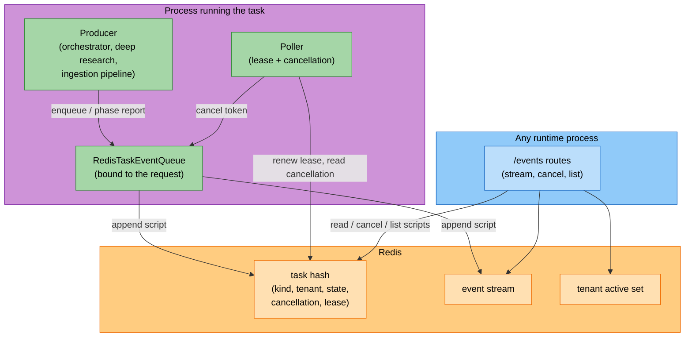

# A2A EventQueue System

Real-time progress notifications for workflows (orchestrator and deep-research
runs) and ingestion jobs, served by every runtime process.

## Overview

A workflow run or an ingestion job is a **task**. Its producer reports progress
as task events on an `EventQueue`; any runtime process can:

- **Stream** a task's events (SSE), with replay from an offset on reconnect
- **Cancel** a task: the cancellation reaches the process running it, which stops at its next phase boundary (workflows) or before its next video (ingestion)
- **List** a tenant's active tasks, with their event and subscriber counts

Tasks, events, cancellations and the active-task index live in the runtime's
Redis (`cogniverse_runtime.task_events.TaskEventStore`), so a request reaches a
task whichever worker process or replica serves it. A Redis error raises
`TaskEventsUnavailable`, answered with a typed 503; nothing falls back to
process memory.

## Architecture


```mermaid
flowchart TB
    subgraph Runner["<span style='color:#000'>Process running the task</span>"]
        Producer["<span style='color:#000'>Producer<br/>(orchestrator, deep research,<br/>ingestion pipeline)</span>"]
        Queue["<span style='color:#000'>RedisTaskEventQueue<br/>(bound to the request)</span>"]
        Poller["<span style='color:#000'>Poller<br/>(lease + cancellation)</span>"]
    end
    subgraph Redis["<span style='color:#000'>Redis</span>"]
        Task["<span style='color:#000'>task hash<br/>(kind, tenant, state,<br/>cancellation, lease)</span>"]
        Stream["<span style='color:#000'>event stream</span>"]
        Active["<span style='color:#000'>tenant active set</span>"]
    end
    subgraph Any["<span style='color:#000'>Any runtime process</span>"]
        Routes["<span style='color:#000'>/events routes<br/>(stream, cancel, list)</span>"]
    end

    Producer -- "enqueue / phase report" --> Queue
    Queue -- "append script" --> Stream
    Queue -- "append script" --> Task
    Poller -- "renew lease, read cancellation" --> Task
    Poller -- "cancel token" --> Queue
    Routes -- "read / cancel / list scripts" --> Task
    Routes --> Stream
    Routes --> Active

    style Runner fill:#ce93d8,stroke:#7b1fa2,color:#000
    style Redis fill:#ffcc80,stroke:#ef6c00,color:#000
    style Any fill:#90caf9,stroke:#1565c0,color:#000
    style Producer fill:#a5d6a7,stroke:#388e3c,color:#000
    style Queue fill:#a5d6a7,stroke:#388e3c,color:#000
    style Poller fill:#a5d6a7,stroke:#388e3c,color:#000
    style Task fill:#ffe0b2,stroke:#ef6c00,color:#000
    style Stream fill:#ffe0b2,stroke:#ef6c00,color:#000
    style Active fill:#ffe0b2,stroke:#ef6c00,color:#000
    style Routes fill:#bbdefb,stroke:#1565c0,color:#000
```

## Event Types

### StatusEvent
Task state transitions (A2A-compatible):
```python
StatusEvent(
    task_id="workflow_123",
    tenant_id="acme:acme",
    state=TaskState.WORKING,  # pending, working, input-required, completed, failed, cancelled
    phase="planning",
    message="Creating execution plan...",
)
```

### ProgressEvent
Incremental progress updates:
```python
ProgressEvent(
    task_id="ingestion_456",
    tenant_id="acme:acme",
    current=5,
    total=10,
    percentage=50.0,
    step="processing_video_5",
    details={"video": "sample.mp4"},
)
```

### ArtifactEvent
Intermediate results (A2A TaskArtifactUpdateEvent):
```python
ArtifactEvent(
    task_id="workflow_123",
    tenant_id="acme:acme",
    artifact_type="search_result",
    data={"results": [...]},
    is_partial=True,
)
```

### ErrorEvent
Error notifications:
```python
ErrorEvent(
    task_id="workflow_123",
    tenant_id="acme:acme",
    error_type="ValidationError",
    error_message="Invalid input",
    recoverable=True,
)
```

### CompleteEvent
Task completion:
```python
CompleteEvent(
    task_id="workflow_123",
    tenant_id="acme:acme",
    result={"status": "success"},
    summary="Orchestrated 'find cats' via A2A pipeline",
    execution_time_seconds=10.5,
)
```

## Task Event Store

`TaskEventStore` (`libs/runtime/cogniverse_runtime/task_events.py`) runs on the
process's shared-state Redis client (`shared_state.connect_shared_state_redis`).
Every change is one Lua script that reads Redis' own clock.

| Key | Holds |
|-----|-------|
| `cogniverse:task-events:task:<id>` | Hash: `kind` (`workflow`/`ingestion`), `tenant_id`, `created_ms`, `closed`, `outcome`, `cancelled`, `cancel_reason`, `lease_until` |
| `cogniverse:task-events:task:<id>:events` | A workflow's events (Redis stream, newest `WORKFLOW_EVENTS_MAXLEN` = 1000) |
| `ingest:status:<id>` | An ingestion job's events: the status stream queue-driven ingestion writes (`STATUS_STREAM_MAXLEN`) |
| `cogniverse:task-events:task:<id>:subscribers` | Stream readers, each leased `SUBSCRIBER_LEASE_S` (30s) past its last read |
| `cogniverse:task-events:active:<tenant>` | The tenant's tasks that have not ended |

| Store method | What it does |
|--------------|--------------|
| `open_task(kind, task_id, tenant_id)` | Creates a task this process runs and returns its `RedisTaskEventQueue`; `TaskAlreadyExists` when the id exists (ids are never reused) |
| `register_queued(task_id, tenant_id)` | Records a submitted queue-driven ingestion job, leased `QUEUED_INGESTION_LEASE_S` (6h) while it waits for a worker |
| `attach(kind, task_id, tenant_id)` | Takes over the lease of a registered task this process now runs (recording it if absent); `None` once it ended |
| `cancel(kind, task_id, reason)` | Records a cancellation: returns `cancelled`, `missing`, `finished` or `stopped` |
| `read(task_id, kind=, after_offset=, subscriber=)` | The task's state and the events after an offset, registering a subscriber |
| `list_active(tenant_id)` | The tenant's running or queued tasks; prunes ended and silent ones |
| `start()` / `close()` | Runs / stops the process's poller |

**Offsets.** An event's offset is its position among every event the task ever
appended (Redis' `entries-added` count), so a reader resumes where it left off.
A reader behind the retained window resumes at the oldest retained event.

**Leases and cancellation.** The process running a task holds a lease of
`PRODUCER_LEASE_S` (30s). Its poller runs every `POLL_INTERVAL_S` (0.5s): it
renews the leases of its tasks at half their length and sets the cancellation
token of each task a cancellation was recorded for. Every append also returns
the task's cancellation, so a producer sees one at its next event at the latest.
A task whose lease lapses before it ends **stopped reporting**: its stream ends
with an error event, the listing drops it, and a cancel answers `stopped`.

**Ending.** A workflow ends when its producer appends the terminal event with
`finish(event)`. An ingestion job ends with its terminal status
(`finish_ingestion(state, ...)`, or the queue worker's `complete` / `failed` /
`cancelled` status). An ended task keeps its events for its retention
(`WORKFLOW_EVENT_RETENTION_S`, 30 minutes, for a workflow; the status stream's
`STATUS_STREAM_TTL_SECONDS` for an ingestion job) after its last event.

## Producers

### Workflows

`AgentDispatcher.workflow_run(agent_name, context, tenant_id)` reports one
orchestration or deep-research run as a `workflow` task. It runs around
`_execute_orchestration_task`, `_execute_deep_research_task` and the streamed
orchestrator (`a2a_executor.stream_agent_events`). The task id is the caller's
`context["workflow_id"]`, or a new `workflow_<hex>`; the run's result names it
(`orchestration_result.workflow_id`, or `workflow_id` on a deep-research
result).

```bash
# Start a run under a known id, then stream or cancel it from any worker
curl -X POST "http://localhost:8000/agents/orchestrator_agent/process" \
  -H "Content-Type: application/json" \
  -d '{"agent_name": "orchestrator_agent", "query": "find cats",
       "context": {"tenant_id": "acme:acme", "workflow_id": "wf-cats-1"}}'
```

The run's queue is bound to the request (`cogniverse_core.events.bind_event_queue`),
never held on the agent: a dispatcher serves many requests from one cached
agent. The agent reports each phase boundary with `AgentBase.report_phase`,
which streams the phase to a streaming caller, publishes a `StatusEvent` on the
bound queue and raises `TaskCancelled` when the task was cancelled.

| Producer | Phases reported |
|----------|-----------------|
| Dispatcher | `started` when the run begins; the terminal event when it ends |
| `OrchestratorAgent` | `memory_context`, `planning`, `execution`, `retrieval_iteration` (each iteration of the retrieval loop), `executing` (each step), `aggregating`, `complete`; `deep_synthesis` for a deep-synthesis run |
| `DeepResearchAgent` | `decompose`, `search` and `evaluate` (each iteration), `synthesize`, `rlm_synthesis` |
| `InstrumentedRLM` | `rlm_start`, a `ProgressEvent` per REPL iteration, `rlm_complete`, on the run's own task |

A cancellation is checked at each of these boundaries except `executing` and
`complete`, and before each group of plan steps. The terminal event is:

| The run | Terminal event | Dispatch result |
|---------|----------------|-----------------|
| returns | `CompleteEvent(result={"status": ...}, summary=message)` | the agent's result |
| stops at a cancellation | `StatusEvent(state=cancelled, message=reason)` | `{"status": "cancelled", "agent", "workflow_id", "message": "Workflow <id> was cancelled: <reason>"}` |
| raises | `ErrorEvent(error_type, error_message="<agent> failed with <type>", recoverable=False)` | the exception propagates |
| loses its request first | `StatusEvent(state=cancelled, message="the request running the workflow ended before it finished")` | — |

`POST /agents/{name}/process` answers a taken `workflow_id` with 409 and a store
that does not answer with 503 `task_events_unavailable`; `/v1/chat/completions`
answers that store's outage with 503 `service_unavailable` naming it (an SSE
error frame when streaming). Without a configured
store (a dispatcher built outside the runtime) a run is not reported unless the
caller named a `workflow_id`, which then raises `TaskEventsUnavailable`.

An `InstrumentedRLM` runs on a worker thread; it publishes through the event
loop its queue was created on and waits for the append, so a refused event
fails the RLM call.

### Ingestion

An ingestion job's events are its status stream `ingest:status:<id>`, the one
`/ingestion/{id}/events` serves.

- **`/ingestion/start`** opens the job's `ingestion` task before it answers and
  hands its queue to `VideoIngestionPipeline(event_queue=...)`, whose job id is
  the task id. The pipeline's events are stored as status entries
  `{"state": "running", "ingest_id", "event": <task event>}`; its own
  end-of-job event is held until the job's outcome is recorded, then stored with
  the terminal status `complete`, `failed` or `cancelled` (with `result`, and
  `error`/`error_type` or `reason`). A cancellation stops the pipeline before
  its next video.
- **Queue-driven ingestion** (`/ingestion/upload`) registers the job's task at
  submit. The worker that claims the job attaches to it for the run: a job
  cancelled while queued settles as `cancelled` without running (its inflight
  marker cleared, its tenant slot released, its entry acked); a job is one video,
  so a cancellation that arrives once it runs lets it finish.

`/events/ingestion/{job_id}` reports each status entry as a task event: an entry
carrying the pipeline's event reports that event; otherwise `queued` maps to a
`pending` `StatusEvent`, `running` and `retrying` to `working` ones (phase =
state, message = `error`), `complete` to a `CompleteEvent` with the entry's
`result`, `failed` to an `ErrorEvent` (`recoverable=False`) and `cancelled` to a
`cancelled` `StatusEvent` with the `reason`. Each event's id and timestamp come
from its stream entry, so a replay reports the same events.

## API Endpoints

| Endpoint | Method | Description |
|----------|--------|-------------|
| `/events/workflows/{workflow_id}` | GET | SSE stream of a workflow's events |
| `/events/ingestion/{job_id}` | GET | SSE stream of an ingestion job's events |
| `/events/workflows/{workflow_id}/cancel` | POST | Cancel a running workflow |
| `/events/ingestion/{job_id}/cancel` | POST | Cancel a running or queued ingestion job |
| `/events/queues?tenant_id=` | GET | A tenant's active tasks |
| `/events/queues/{task_id}` | GET | A task's state, while its events are retained |
| `/events/queues/{task_id}/offset` | GET | The offset the task's next event takes |

**Streams** open with `{"type": "connected", "task_id", "offset", "timestamp"}`,
deliver every event from `from_offset` on, send a `: heartbeat` comment after
15s without one, and end once the task has ended and every event was delivered.
A task with no queue of that kind gets one `{"type": "error", "message": "No
active queue for task <id>"}` event; one that stops reporting ends with
`{"type": "error", "message": "Task <id> stopped reporting before it
finished"}`; a store lost mid-stream ends it with `{"type": "stream_error",
"message", "failure"}`. A reader counts as a subscriber until its stream ends.

**Cancel** answers 200 `{"task_id", "cancelled": true, "message": "<Workflow|Ingestion
job> <id> cancellation requested"}`, 404 for no task of that kind, and 409 for a
task that already finished or stopped reporting.

**Queue info** is `{"task_id", "kind", "tenant_id", "event_count",
"subscriber_count", "is_closed", "is_cancelled", "created_at"}`.

Every route answers a store that does not answer with 503
`{"error": "task_events_unavailable", "message": "The task event store did not
answer; retry.", "failure": "TaskEventsUnavailable"}` (plus `task_id`), before
any stream starts.

```bash
curl -N "http://localhost:8000/events/workflows/wf-cats-1"
curl -N "http://localhost:8000/events/ingestion/<job_id>?from_offset=3"
curl -X POST "http://localhost:8000/events/workflows/wf-cats-1/cancel" \
  -H "Content-Type: application/json" \
  -d '{"reason": "User requested"}'
curl "http://localhost:8000/events/queues?tenant_id=acme:acme"
```

## In-Process Queues

`cogniverse_core.events` also ships `InMemoryEventQueue` and
`InMemoryQueueManager` (`get_queue_manager()` / `reset_queue_manager()`), one
process's queues for a library caller outside the runtime; the runtime does not
use them.

```python
from cogniverse_core.events import (
    InMemoryEventQueue,
    TaskState,
    bind_event_queue,
    create_status_event,
    publish_phase,
)

queue = InMemoryEventQueue(task_id="workflow_123", tenant_id="acme:acme")
with bind_event_queue(queue):
    await publish_phase("planning", "Creating execution plan...")

await queue.close()
async for event in queue.subscribe():
    print(event.event_type, event.phase)
```

## Testing

```bash
# Store, producers, routes and the cross-process cases, against real Redis
uv run pytest tests/runtime/integration/test_task_events_redis.py \
  tests/runtime/unit/test_events_sse_stream.py \
  tests/runtime/unit/test_events_cancel_happy_path.py -v

# Two uvicorn workers: a workflow streamed and cancelled from the other worker
uv run pytest "tests/runtime/integration/test_runtime_worker_processes.py::TestWorkflowAcrossWorkers" -v

# Event types and the in-process queues
uv run pytest tests/events/ -v
```

## Files

| File | Description |
|------|-------------|
| `libs/core/cogniverse_core/events/types.py` | Event type definitions |
| `libs/core/cogniverse_core/events/queue.py` | `EventQueue`/`QueueManager` protocols, `TaskCancelled`, the per-request binding (`bind_event_queue`, `current_event_queue`, `publish_phase`, `raise_if_cancelled`) |
| `libs/core/cogniverse_core/events/backends/memory.py` | In-process queues |
| `libs/runtime/cogniverse_runtime/task_events.py` | `TaskEventStore`, `RedisTaskEventQueue`, the ingestion status mapping |
| `libs/runtime/cogniverse_runtime/routers/events.py` | SSE, cancel and queue endpoints |
| `libs/runtime/cogniverse_runtime/agent_dispatcher.py` | `AgentDispatcher.workflow_run` — reports orchestration and deep-research runs |
| `libs/core/cogniverse_core/agents/base.py` | `AgentBase.report_phase` |
| `libs/agents/cogniverse_agents/orchestrator_agent.py` | `OrchestratorAgent` — reports its phases on the bound queue |
| `libs/agents/cogniverse_agents/deep_research_agent.py` | `DeepResearchAgent` — reports its phases on the bound queue |
| `libs/agents/cogniverse_agents/inference/instrumented_rlm.py` | `InstrumentedRLM` — Status/Progress events per REPL iteration |
| `libs/runtime/cogniverse_runtime/routers/ingestion.py` | `/ingestion/start` jobs' tasks |
| `libs/runtime/cogniverse_runtime/ingestion/pipeline.py` | `VideoIngestionPipeline` — emits events during ingestion |
| `libs/runtime/cogniverse_runtime/ingestion_worker/` | Queue-driven jobs: registered at submit, attached and cancelled by the worker |
| `tests/runtime/integration/test_task_events_redis.py` | Store, workflow runs, process route, threaded RLM, concurrency and outages |
| `tests/runtime/unit/test_events_sse_stream.py` | SSE routes |
| `tests/runtime/unit/test_events_cancel_happy_path.py` | Cancel and queue routes |
| `tests/events/unit/test_event_queue.py` | Event types and the in-process queues |
