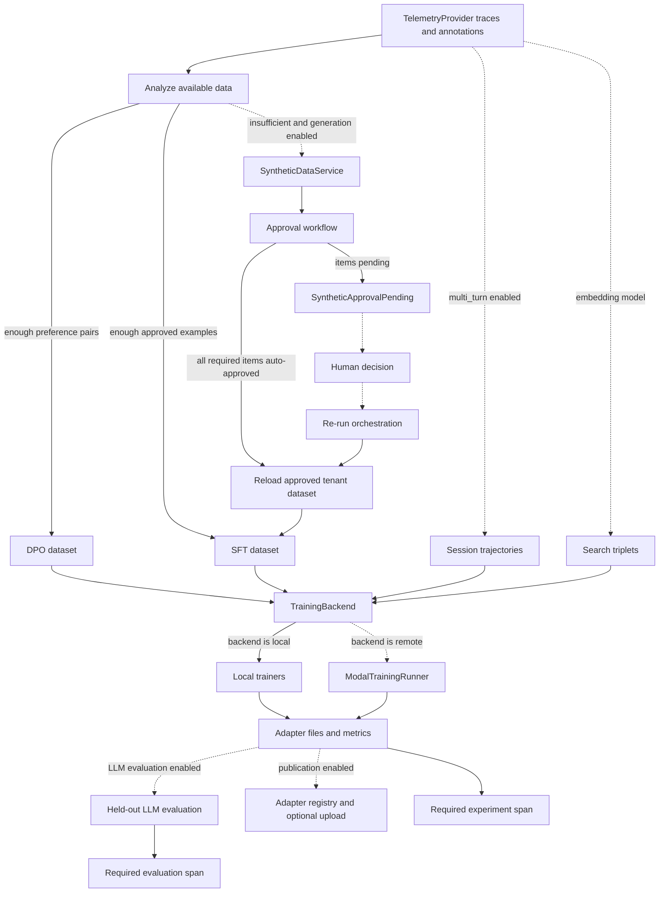
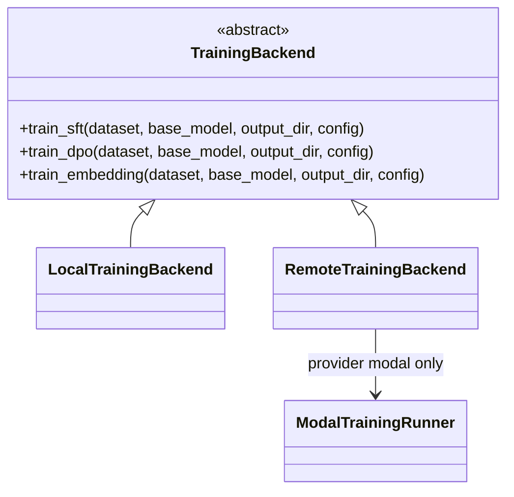

# Fine-Tuning Module

The `cogniverse-finetuning` package turns telemetry and approved synthetic
examples into supervised, preference, multi-turn, or embedding datasets; trains
locally or on Modal; publishes adapters; and records experiments through the
configured telemetry provider.

## Table of Contents

- [Overview](#overview)
- [Architecture](#architecture)
- [Package Structure](#package-structure)
- [Orchestration](#orchestration)
- [Dataset Extraction](#dataset-extraction)
- [Approved Synthetic Data](#approved-synthetic-data)
- [Training Backends](#training-backends)
- [Training Methods](#training-methods)
- [Adapter Registry and Storage](#adapter-registry-and-storage)
- [Usage](#usage)
- [Configuration](#configuration)
- [Phoenix Experiment Tracking](#phoenix-experiment-tracking)
- [Automatic Adapter Evaluation](#automatic-adapter-evaluation)
- [Validation Split and Early Stopping](#validation-split-and-early-stopping)
- [Error Messages and Troubleshooting](#error-messages-and-troubleshooting)
- [Integration with Other Modules](#integration-with-other-modules)
- [Dependencies](#dependencies)
- [Public Surface by Module](#public-surface-by-module)
- [References](#references)

## Overview

The package supports four training paths:

- single-turn supervised fine-tuning (SFT) from approved trace annotations and
  approved synthetic examples;
- Direct Preference Optimization (DPO) from canonical chosen/rejected annotation
  pairs;
- multi-turn SFT from session-grouped telemetry trajectories;
- embedding fine-tuning from search-result triplets.

For LLM training, `TrainingMethodSelector` recommends DPO when enough preference
pairs exist, otherwise SFT when enough approved examples exist. If neither
threshold is met, synthetic generation is optional, but every generated item
must pass through the approval workflow. High-confidence items may be
auto-approved by that workflow; lower-confidence items wait for a human decision.

Local SFT and DPO attempt LoRA first. If PEFT cannot attach to the selected model,
those trainers log the failure and continue with full-model fine-tuning. The
embedding trainer similarly attempts LoRA and continues with the unwrapped
sentence-transformers model when attachment fails. Callers must therefore size
compute and storage for the full-model fallback.

## Architecture



Solid edges are unconditional within a selected path. Dashed edges are selected
only by configuration or by the amount of available data. Remote training has
one implemented provider: Modal. Embedding training does not run
`AdapterEvaluator`; held-out evaluation is implemented for the three LLM paths.

## Package Structure

```text
libs/finetuning/
├── pyproject.toml
└── cogniverse_finetuning/
    ├── __init__.py
    ├── orchestrator.py
    ├── dataset/
    │   ├── __init__.py
    │   ├── embedding_extractor.py
    │   ├── formatters.py
    │   ├── method_selector.py
    │   ├── output_projection.py
    │   ├── preference_extractor.py
    │   ├── synthetic_reader.py
    │   ├── trace_converter.py
    │   └── utils.py
    ├── evaluation/
    │   ├── __init__.py
    │   └── adapter_evaluator.py
    ├── registry/
    │   ├── __init__.py
    │   ├── adapter_registry.py
    │   ├── inference.py
    │   ├── models.py
    │   └── storage.py
    └── training/
        ├── __init__.py
        ├── backend.py
        ├── dpo_trainer.py
        ├── embedding_finetuner.py
        ├── modal_app.py
        ├── modal_runner.py
        └── sft_trainer.py
```

## Orchestration

### High-level API

`finetune` exposes the common path. Its implementation signature is:

```text
async finetune(
    telemetry_provider: TelemetryProvider,
    telemetry_manager: TelemetryManager,
    tenant_id: str,
    project: str,
    model_type: Literal["llm", "embedding"],
    agent_type: Optional[str] = None,
    modality: Optional[str] = None,
    base_model: str = "HuggingFaceTB/SmolLM-135M",
    backend: Literal["local", "remote"] = "local",
    backend_provider: str = "modal",
    epochs: int = 3,
    batch_size: int = 4,
    learning_rate: float = 0.0002,
    gpu: str = "A10G",
    gpu_count: int = 1,
    cpu: int = 4,
    memory: int = 16384,
    timeout: int = 3600,
    multi_turn: bool = False,
    min_turns_per_session: int = 2,
    system_prompt: str = "You are a helpful assistant.",
    synthetic_service: Optional[any] = None,
    approval_agent: Optional[any] = None,
    evaluate_after_training: bool = True,
    test_set_size: int = 50,
    output_dir: str = "outputs/adapters",
) -> OrchestrationResult
```

The exact source default for `gpu` is `A10G`. Current Modal GPU identifiers use
`A10`, not `A10G`; remote callers must override the value as described under
[Remote Modal configuration](#remote-modal-configuration).

`FinetuningOrchestrator` provides the complete configuration surface:

```text
FinetuningOrchestrator(
    telemetry_provider: TelemetryProvider,
    telemetry_manager: TelemetryManager,
    synthetic_service: Optional[any] = None,
    approval_agent: Optional[any] = None,
    registry: Optional[any] = None,
)

async FinetuningOrchestrator.run(
    config: OrchestrationConfig,
) -> OrchestrationResult
```

The orchestrator:

1. loads and validates the tenant's approved synthetic dataset;
2. selects an LLM method, or selects the configured multi-turn/embedding path;
3. extracts and validates exact training records;
4. runs the local or Modal backend;
5. evaluates SFT, DPO, or multi-turn SFT when enabled;
6. exports evaluation and experiment spans to the `experiments` project;
7. optionally uploads and registers the adapter.

Evaluation export, experiment export, upload, and registry publication are
required finalization operations when configured. They are executed off the
event loop with a 300-second operation timeout and raise contextual errors rather
than returning a partially published success.

### Result and pending state

`OrchestrationResult` contains:

```text
model_type: Literal["llm", "embedding"]
training_method: Literal["sft", "dpo", "embedding", "sft_multi_turn"]
adapter_path: str
metrics: Dict
base_model: str
lora_config: Dict
used_synthetic: bool
synthetic_approval_count: Optional[int] = None
evaluation_result: Optional[Any] = None
adapter_id: Optional[str] = None
adapter_uri: Optional[str] = None
```

`SyntheticApprovalPending` carries `batch_id`, `approved_count`,
`pending_count`, and `agent_type`. Catch it only to present a recoverable
"approve and re-run" state; it is not a completed training result.

### Readiness and experiment helpers

```text
async analyze_dataset_status(
    telemetry_provider: TelemetryProvider,
    project: str,
    tenant_id: str,
    agent_type: Optional[str] = None,
    modality: Optional[str] = None,
    min_sft_examples: int = 50,
    min_dpo_pairs: int = 20,
) -> Dict[str, Any]

async list_experiments(
    telemetry_provider: TelemetryProvider,
    project: str,
    agent_type: Optional[str] = None,
    method: Optional[Literal["sft", "dpo", "embedding", "sft_multi_turn"]] = None,
    limit: int = 50,
) -> pandas.DataFrame

async get_experiment_details(
    telemetry_provider: TelemetryProvider,
    project: str,
    run_id: str,
) -> Dict[str, Any]

async compare_experiments(
    telemetry_provider: TelemetryProvider,
    project: str,
    run_ids: List[str],
) -> pandas.DataFrame
```

Use `project="experiments"` with the three experiment helpers. The `project`
argument to `finetune` and `analyze_dataset_status` remains the source telemetry
project, such as `cogniverse-tenant1`.

### Orchestrator module surface

The public definitions in `orchestrator.py` are
`validate_sft_dataset`, `validate_dpo_dataset`, `validate_embedding_dataset`,
`OrchestrationConfig`, `OrchestrationResult`, `SyntheticApprovalPending`,
`FinetuningOrchestrator`, `finetune`, `analyze_dataset_status`,
`list_experiments`, `get_experiment_details`, and `compare_experiments`.

## Dataset Extraction

### Method selection

`DataAnalysis` has the fields `total_spans`, `approved_count`, `rejected_count`,
`preference_pairs`, `needs_synthetic`, `recommended_method`, and `confidence`.
The public selector surface is:

```text
TrainingMethodSelector(
    synthetic_service: Optional[any] = None,
    approval_agent: Optional[HumanApprovalAgent] = None,
)

async TrainingMethodSelector.analyze_data(
    provider: TelemetryProvider,
    project: str,
    agent_type: Literal["routing", "profile_selection", "entity_extraction"],
    min_sft_examples: int = 50,
    min_dpo_pairs: int = 20,
    approved_synthetic: Optional[List[Dict[str, Any]]] = None,
) -> DataAnalysis

async TrainingMethodSelector.analyze_and_prepare(
    provider: TelemetryProvider,
    project: str,
    agent_type: Literal["routing", "profile_selection", "entity_extraction"],
    tenant_id: str,
    min_sft_examples: int = 50,
    min_dpo_pairs: int = 20,
    generate_synthetic: bool = True,
    approved_synthetic: Optional[List[Dict[str, Any]]] = None,
) -> tuple[DataAnalysis, Optional[any]]
```

The recommendation is DPO at `min_dpo_pairs`, otherwise SFT at
`min_sft_examples`, otherwise `insufficient`. Approved synthetic examples count
toward the SFT threshold, and duplicate canonical synthetic queries are rejected.

### Single-turn instructions

```text
InstructionExample(
    instruction: str,
    input: str,
    output: str,
    metadata: Dict[str, Any],
)

InstructionDataset(
    examples: List[InstructionExample],
    metadata: Dict[str, Any],
)

TraceToInstructionConverter(provider: TelemetryProvider)

async TraceToInstructionConverter.convert(
    project: str,
    agent_type: Literal["routing", "profile_selection", "entity_extraction"],
    min_annotations: int = 20,
    start_time: Optional[datetime] = None,
    end_time: Optional[datetime] = None,
    annotation_filter: Optional[str] = None,
) -> InstructionDataset
```

The converter selects matching agent spans, joins annotations through the
provider's public trace and annotation stores, keeps approved classifications,
and projects `output.value` into exact model-facing JSON. `InstructionDataset`
provides `to_dataframe()` and `save(path, format="jsonl" | "parquet")`.

```python
from cogniverse_finetuning.dataset.trace_converter import (
    TraceToInstructionConverter,
)
from cogniverse_foundation.telemetry.providers.base import TelemetryProvider


async def export_routing_instructions(
    provider: TelemetryProvider,
    project: str,
) -> None:
    converter = TraceToInstructionConverter(provider)
    dataset = await converter.convert(
        project=project,
        agent_type="routing",
        min_annotations=20,
    )
    dataset.save("routing-instructions.jsonl", format="jsonl")
```

### Preference pairs

```text
classify_preference_annotation(annotation_row: pandas.Series) -> Optional[str]

PreferencePair(
    prompt: str,
    chosen: str,
    rejected: str,
    metadata: Dict[str, Any],
)

PreferenceDataset(
    pairs: List[PreferencePair],
    metadata: Dict[str, Any],
)

PreferencePairExtractor(provider: TelemetryProvider)

async PreferencePairExtractor.extract(
    project: str,
    agent_type: Literal["routing", "profile_selection", "entity_extraction"],
    min_pairs: int = 10,
    start_time: Optional[datetime] = None,
    end_time: Optional[datetime] = None,
) -> PreferenceDataset
```

Labels and numeric scores must agree when both exist. A usable span needs at
least one approved and one rejected annotation with canonical, different
responses; a pair whose chosen and rejected projections are identical is
discarded. `PreferenceDataset` also provides `to_dataframe()` and
`save(path, format="jsonl" | "parquet")`.

### Embedding triplets

```text
Triplet(
    anchor: str,
    positive: str,
    negative: str,
    modality: Literal["video", "image", "text"],
    metadata: Dict,
)

TripletExtractor(provider: TelemetryProvider)

async TripletExtractor.extract(
    project: str,
    modality: Literal["video", "image", "text"],
    strategy: Literal["top_k", "above_threshold", "random_sampling"] = "top_k",
    min_triplets: int = 100,
) -> List[Triplet]

TripletDataset(triplets: List[Triplet], modality: str)
```

`TripletExtractor.extract` returns a list of `Triplet`, not a `TripletDataset`.
It reads search spans, click/relevance annotations, validates result identities,
and mines negatives. It may return fewer than `min_triplets`; the orchestrator
enforces the configured minimum before training. `TripletDataset` is a separate
wrapper with `to_dict_list()` and `to_input_examples()`.

### Multi-turn trajectories

```text
ConversationTurn(
    turn_id: int,
    query: str,
    response: str,
    timestamp: datetime,
    span_id: str,
    metadata: Dict[str, Any] = {},
)

ConversationTrajectory(
    session_id: str,
    turns: List[ConversationTurn],
    session_outcome: Optional[str] = None,
    session_score: Optional[float] = None,
    metadata: Dict[str, Any] = {},
)

TrajectoryDataset(
    trajectories: List[ConversationTrajectory],
    metadata: Dict[str, Any] = {},
)

TraceToTrajectoryConverter(provider: TelemetryProvider)

async TraceToTrajectoryConverter.convert(
    project: str,
    agent_type: Literal["routing", "profile_selection", "entity_extraction"],
    min_turns_per_session: int = 2,
    require_session_annotation: bool = False,
    start_time: Optional[datetime] = None,
    end_time: Optional[datetime] = None,
) -> TrajectoryDataset
```

When `require_session_annotation=False`, sessions are included without querying
`session_evaluation` annotations and outcome/score remain `None`. When it is
`True`, unannotated sessions are skipped and the first session annotation
supplies outcome and score. Turns are sorted by start time and numbered from 1.
`ConversationTrajectory.to_dict()` and saved JSONL use this shape:

```json
{
  "session_id": "session-42",
  "num_turns": 2,
  "conversation": [
    {
      "turn": 1,
      "query": "Find the launch scene",
      "response": "The launch begins at 00:03:12",
      "timestamp": "2026-08-05T10:00:00+00:00",
      "span_id": "8f4c"
    },
    {
      "turn": 2,
      "query": "Show the preceding context",
      "response": "The countdown begins 20 seconds earlier",
      "timestamp": "2026-08-05T10:00:05+00:00",
      "span_id": "8f4d"
    }
  ],
  "session_outcome": null,
  "session_score": null,
  "project": "cogniverse-tenant1",
  "agent_type": "routing"
}
```

`TrajectoryDataset` provides `to_dataframe()` and
`save(path, format="jsonl" | "parquet")`.

### Canonical output projection

The public functions in `dataset/output_projection.py` are:

```text
canonical_output(agent_type, values, *, context) -> dict[str, Any]
canonical_output_json(agent_type, values, *, context) -> str
project_training_output(agent_type, source_values, *, context) -> str
parse_canonical_output(agent_type, output, *, context) -> dict[str, Any]
training_example_identity(agent_type, prompt, output) -> str
```

The exact model-facing objects are:

- routing: `{"recommended_agent": "..."}`;
- profile selection: `{"selected_profile": "..."}`;
- entity extraction: exactly `entities` and `relationships`, with exact nested
  entity and relationship keys.

Serialization is deterministic and compact. `training_example_identity` hashes
the agent type, prompt, and parsed canonical output so evaluation can exclude
training examples.

### Formatters and utilities

`InstructionFormatter` exposes `format_alpaca`, `format_alpaca_text`,
`format_sharegpt`, `format_chatml`, `format_dpo`, and
`format_trajectory_chatml`. Module helpers mirror the common paths:

```text
format_for_sft(examples, format="alpaca_text")
format_for_dpo(pairs)
format_trajectories_for_sft(
    trajectories,
    system_prompt="You are a helpful assistant.",
)
instruction_template(agent_type)
```

The orchestrator trains SFT with the combined `text` representation, DPO with
`prompt`/`chosen`/`rejected`, trajectories with ChatML text, and embeddings with
`anchor`/`positive`/`negative`.

`DatasetUtils` exposes `split_dataset`, `upload_to_hf_hub`, and `upload_to_s3`.
The module-level helpers are:

```text
prepare_dataset_splits(
    data,
    train_ratio=0.8,
    val_ratio=0.1,
    test_ratio=0.1,
    shuffle=True,
    seed=42,
) -> Dict[str, List[Dict]]

upload_splits_to_hf_hub(splits, repo_id, token=None)
```

`split_dataset` copies the input before optional seeded shuffling and accepts a
small floating-point tolerance around a total ratio of 1.0. Dataset S3 upload is
implemented directly with boto3; that is separate from adapter storage, whose
S3 backend is not implemented.

## Approved Synthetic Data

### Lifecycle

Synthetic generation is available only when a `SyntheticDataService` and
`HumanApprovalAgent` were supplied and `generate_synthetic=True`. The selector
requests exactly the missing count, requires unique canonical queries, creates a
stable item identity, and submits one `ApprovalBatch` through
`HumanApprovalAgent.submit_for_review`.

The workflow is mandatory; manual review is conditional:

- confidence at or above the approval agent's configured threshold becomes
  `AUTO_APPROVED`;
- lower confidence becomes `PENDING_REVIEW`;
- if pending items remain, the orchestrator raises `SyntheticApprovalPending`;
- after human decisions are persisted, re-running loads approved rows from
  `approved_synthetic_data-<tenant_id>`;
- only validated, approved rows are folded into SFT.

The current selector generates synthetic data for `routing`,
`profile_selection`, and `entity_extraction`. The canonical approval schema also
supports `query_enhancement`, but that agent type is not accepted by the current
fine-tuning orchestrator configuration.

```python
from cogniverse_agents.approval import HumanApprovalAgent
from cogniverse_core.approval import ApprovalBatch, ReviewItem


async def submit_routing_example(
    approval_agent: HumanApprovalAgent,
) -> ApprovalBatch:
    item = ReviewItem(
        item_id="synthetic_routing_example-1",
        data={
            "query": "Find the launch sequence",
            "chosen_agent": "video_search",
        },
        confidence=0.91,
        metadata={
            "agent_type": "routing",
            "optimizer": "routing",
            "synthetic": True,
            "purpose": "fine_tuning_data",
        },
    )
    batch = ApprovalBatch(
        batch_id="synthetic_routing_batch-1",
        items=[item],
        context={
            "purpose": "fine_tuning_data_generation",
            "tenant_id": "acme",
            "agent_type": "routing",
            "optimizer": "routing",
            "requested_count": 1,
        },
    )
    return await approval_agent.submit_for_review(batch)
```

### Approved record integrity

Every non-empty row is fully checked before filtering for the requested agent
type. The record must have `status="approved"`, a supported
`metadata.agent_type`, canonical timezone-aware review timestamps, and matching
signed content:

- `metadata.approval_record_json` is canonical, non-recursive JSON;
- `metadata.approval_record_sha256` matches that JSON;
- `metadata.approval_decision_sha256` matches the decision content and the value
  inside the canonical record;
- `metadata.approval_decision_timestamp`, `reviewed_at`, and the decision's own
  timestamp agree;
- the provider-visible record has no missing, unexpected, or mismatched values
  relative to the signed canonical record.

Malformed records raise with tenant, dataset, row, and item context. They are not
silently skipped, including malformed records belonging to another agent type.

### Training value schemas

All strings named below must be trimmed and non-empty unless explicitly allowed
to be empty.

| Agent type | Required values and invariants |
|---|---|
| `routing` | `query`; `chosen_agent`. |
| `profile_selection` | `query`; comma-separated `available_profiles` containing distinct non-empty names with no surrounding whitespace; `selected_profile` present in that list; `reasoning`; `query_intent`; `modality` in `audio`, `code`, `document`, `image`, `text`, `video`, or `wiki`; `complexity` in `simple`, `medium`, or `complex`. |
| `query_enhancement` | `query`; a different `enhanced_query`; `expansion_terms` and `synonyms` as native lists of trimmed non-empty strings; `context` as a trimmed string that may be empty; non-empty `reasoning`. |
| `entity_extraction` | `query`; a non-empty `entities` list; each entity has exactly trimmed non-empty `text` and `type`; entity texts are unique; `entity_types` exactly equals the comma-joined first-seen entity types; `relationships` is a list; each relationship has exactly trimmed non-empty `source`, `target`, and `type`; both endpoints exist in `entities`; relationship triplets are unique. |

The synthetic reader surface is:

```text
load_approved_synthetic_examples(dataset_df, agent_type) -> List[Dict[str, Any]]
synthetic_examples_to_instruction(examples, agent_type) -> List[InstructionExample]
format_synthetic_sft(examples, agent_type) -> List[Dict[str, Any]]
```

Synthetic examples are converted through the same instruction template and
canonical output projection as trace-derived examples.

## Training Backends



### Backend contract

All three abstract methods and both implementations have the same shape:

```text
async train_sft(
    dataset: List[Dict],
    base_model: str,
    output_dir: str,
    config: Dict,
) -> TrainingJobResult

async train_dpo(
    dataset: List[Dict],
    base_model: str,
    output_dir: str,
    config: Dict,
) -> TrainingJobResult

async train_embedding(
    dataset: List[Dict],
    base_model: str,
    output_dir: str,
    config: Dict,
) -> TrainingJobResult
```

`TrainingJobConfig` fields are `gpu="A10G"`, `gpu_count=1`, `cpu=4`,
`memory=16384`, and `timeout=3600`. `TrainingJobResult` fields are `job_id`,
`adapter_path`, `metrics`, and optional `logs_url`.

```text
LocalTrainingBackend(config: TrainingJobConfig)
RemoteTrainingBackend(
    config: TrainingJobConfig,
    provider: Literal["modal"] = "modal",
)
```

The remote backend rejects every provider other than `modal`.

### Modal surface

`ModalJobConfig` has the same five fields and source defaults as
`TrainingJobConfig`. `ModalJobResult` has the same four result fields.

```text
ModalTrainingRunner(config: ModalJobConfig)

async ModalTrainingRunner.run_sft(
    dataset, base_model, output_dir, sft_config,
) -> ModalJobResult

async ModalTrainingRunner.run_dpo(
    dataset, base_model, output_dir, dpo_config,
) -> ModalJobResult

async ModalTrainingRunner.run_embedding(
    dataset, base_model, output_dir, embedding_config,
) -> ModalJobResult

train_sft_remote(dataset: list[dict], base_model: str, config: dict) -> dict
train_dpo_remote(dataset: list[dict], base_model: str, config: dict) -> dict
train_embedding_remote(dataset: list[dict], base_model: str, config: dict) -> dict
```

The runner invokes deployed Modal functions directly, receives a gzipped tar
archive as bytes, and extracts its `adapter/` directory under the requested local
output directory. Each Modal call writes to a unique temporary workspace.

Deploy the app with:

```bash
uv run modal deploy libs/finetuning/cogniverse_finetuning/training/modal_app.py
```

### Remote Modal configuration

As of 2026-08-05, Modal accepts `T4`, `L4`, `A10`, `L40S`, `A100`,
`A100-40GB`, `A100-80GB`, `RTX-PRO-6000`, `H100`, `H100!`, `H200`,
`B200`, `B200+`, and `B300`. Its multi-GPU syntax is `TYPE:N`. See
[Modal GPU acceleration](https://modal.com/docs/guide/gpu).

The package currently declares `A10G` in `OrchestrationConfig`,
`TrainingJobConfig`, `ModalJobConfig`, and the deployed function decorators.
`A10G` is not in Modal's current accepted list. Until those source defaults are
changed, every remote call must explicitly set a current identifier such as
`gpu="A10"`; the deployed Modal app must also use a current identifier before it
is deployed.

Current GPU-only rates from [Modal pricing](https://modal.com/pricing) are:

| GPU | Per second | Approximate per hour |
|---|---:|---:|
| T4 | $0.000164 | $0.59 |
| A10 | $0.000306 | $1.10 |
| A100 40 GB | $0.000583 | $2.10 |
| A100 80 GB | $0.000694 | $2.50 |
| H100 | $0.001097 | $3.95 |

CPU, memory, storage, region multipliers, and non-preemptible execution are
additional. Check the linked pricing page before budgeting because service rates
change independently of this package.

## Training Methods

### SFT

`SFTFinetuner(base_model: str, output_dir: str)` exposes
`async train(dataset: List[Dict], config: Dict) -> Dict`.
`SFTConfig` fields are:

```text
base_model: str
use_lora: bool = True
lora_r: int = 8
lora_alpha: int = 16
lora_dropout: float = 0.1
target_modules: List[str] = None
epochs: int = 3
batch_size: int = 4
gradient_accumulation_steps: int = 4
learning_rate: float = 0.0002
warmup_steps: int = 100
max_seq_length: int = 512
fp16: bool = True
dataset_text_field: str = "text"
format: str = "alpaca_text"
output_dir: str = "outputs/sft_adapters"
save_steps: int = 500
eval_steps: int = 500
logging_steps: int = 100
```

`SFTResult` contains `adapter_path`, `metrics`, `base_model`, and `lora_config`.
The active trainer API accepts a configuration dictionary and returns a
dictionary; the config/result dataclasses document the complete typed surface.

### DPO

`DPOFinetuner(base_model: str, output_dir: str)` exposes
`async train(dataset: List[Dict], config: Dict) -> Dict`.
`DPOConfig` fields are:

```text
base_model: str
use_lora: bool = True
lora_r: int = 8
lora_alpha: int = 16
lora_dropout: float = 0.1
target_modules: List[str] = None
beta: float = 0.1
epochs: int = 3
batch_size: int = 4
gradient_accumulation_steps: int = 4
learning_rate: float = 0.00005
warmup_steps: int = 100
max_seq_length: int = 512
max_prompt_length: int = 256
fp16: bool = True
output_dir: str = "outputs/dpo_adapters"
save_steps: int = 500
eval_steps: int = 500
logging_steps: int = 100
```

`DPOResult` contains `adapter_path`, `metrics`, `base_model`, and `lora_config`.
DPO loads a trainable model and a frozen reference model. LoRA, when successful,
is applied only to the trainable model.

### Embedding training

`EmbeddingFinetuner(base_model: str, output_dir: str)` exposes
`async train(dataset: List[Dict], config: Dict) -> Dict`.
`EmbeddingTrainingConfig` fields are:

```text
base_model: str
use_lora: bool = True
lora_r: int = 8
lora_alpha: int = 16
lora_dropout: float = 0.1
target_modules: List[str] = None
epochs: int = 3
batch_size: int = 16
learning_rate: float = 0.00002
warmup_steps: int = 100
evaluation_steps: int = 500
save_steps: int = 1000
triplet_margin: float = 0.5
distance_metric: Literal["cosine", "euclidean", "manhattan"] = "cosine"
output_dir: str = "outputs/embedding_adapters"
```

`EmbeddingTrainingResult` contains `adapter_path`, `metrics`, `base_model`, and
`lora_config`. Training uses sentence-transformers triplet loss. The current
local implementation passes epochs and warmup steps into `SentenceTransformer.fit`;
the typed `learning_rate`, `evaluation_steps`, and `save_steps` values are not
forwarded by that implementation.

### Dataset validation

Before dispatch, the orchestrator requires a non-empty list and required keys:

- SFT: `text`;
- DPO: `prompt`, `chosen`, and `rejected`;
- embedding: `anchor`, `positive`, and `negative`.

These validators check presence, not value semantics. Canonical extraction and
approval validation provide the stronger content checks before formatting.

## Adapter Registry and Storage

### Registry model

`AdapterMetadata` fields are:

```text
adapter_id: str
tenant_id: str
name: str
version: str
base_model: str
model_type: Literal["llm", "embedding"]
agent_type: Optional[str]
training_method: Literal["sft", "dpo", "embedding", "sft_multi_turn"]
adapter_path: str
adapter_uri: Optional[str] = None
status: Literal["active", "inactive", "deprecated"] = "inactive"
is_active: bool = False
metrics: Dict[str, Any] = {}
training_config: Dict[str, Any] = {}
experiment_run_id: Optional[str] = None
created_at: datetime = current UTC time
updated_at: datetime = current UTC time
```

It exposes `to_vespa_doc()`, `from_vespa_doc(doc)`, and `get_effective_uri()`.
`generate_adapter_id()` creates registry identifiers.

`AdapterRegistry(store: Optional[Any] = None)` exposes:

```text
register_adapter(tenant_id, name, version, base_model, model_type,
                 training_method, adapter_path, agent_type=None,
                 adapter_uri=None, metrics=None, training_config=None,
                 experiment_run_id=None) -> str
get_adapter(adapter_id) -> Optional[AdapterMetadata]
list_adapters(tenant_id, agent_type=None, status=None, model_type=None)
get_active_adapter(tenant_id, agent_type)
activate_adapter(adapter_id)
deactivate_adapter(adapter_id)
deprecate_adapter(adapter_id)
delete_adapter(adapter_id)
get_latest_version(tenant_id, name, agent_type=None)
get_stats()
health_check()
```

```python
from cogniverse_finetuning.registry import AdapterRegistry


def register_routing_adapter(
    registry: AdapterRegistry,
    adapter_path: str,
) -> str:
    return registry.register_adapter(
        tenant_id="acme",
        name="sft_routing",
        version="1.0.0",
        base_model="HuggingFaceTB/SmolLM-135M",
        model_type="llm",
        training_method="sft",
        adapter_path=adapter_path,
        agent_type="routing",
        metrics={"train_loss": 0.42},
    )
```

### Storage

`AdapterStorage` defines `upload(local_path, destination_uri)`,
`download(source_uri, local_path)`, and `exists(uri)`. Implementations are
`LocalStorage`, `HuggingFaceStorage(token=None)`, `S3Storage` (configured via
an explicit `S3StorageConfig`), and `ModalVolumeStorage`.

```text
get_storage_backend(uri: str, **kwargs) -> AdapterStorage
upload_adapter(local_path: str, destination_uri: str,
               token: Optional[str] = None) -> str
download_adapter(source_uri: str, local_path: str) -> str
adapter_exists(uri: str) -> bool
```

The adapter storage factory implements plain paths/`file://`, `hf://`,
`s3://`, and `modal://`; other schemes raise `ValueError`. The S3 bucket comes
from each `s3://bucket/...` URI, and only `get_storage_backend()` plus the
convenience helpers resolve environment variables for connection settings.

When PEFT LoRA is active, `save_pretrained` uses safe serialization by default:

```text
adapter-directory/
├── adapter_config.json
├── adapter_model.safetensors
├── tokenizer.json
├── tokenizer_config.json
└── special_tokens_map.json
```

Tokenizer contents vary by model. A full-model fallback may instead write model
weights such as `model.safetensors`; it is not a LoRA adapter artifact.

### Inference helpers

`AdapterInfo` contains `adapter_id`, `name`, `version`, `base_model`,
`adapter_uri`, and `adapter_path`.

```text
get_active_adapter_for_inference(tenant_id, agent_type)
    -> Optional[AdapterInfo]
list_available_adapters(tenant_id, agent_type=None, model_type=None)
    -> list[AdapterInfo]
resolve_adapter_path(adapter_uri, cache_dir) -> str
```

Only genuine absence returns `None` or an empty list; registry failures
propagate. `resolve_adapter_path` returns plain paths and `file://` paths
directly and downloads `hf://`, `s3://`, and `modal://` URIs under the
required `cache_dir`; other schemes raise `ValueError`.

vLLM is an external runtime dependency, not a dependency of this package. Its
LoRA call shape is illustrated here rather than presented as an in-package
executable example:

```text
from vllm import LLM
from vllm.lora.request import LoRARequest

llm = LLM(model=adapter.base_model, enable_lora=True)
outputs = llm.generate(
    prompts,
    lora_request=LoRARequest("routing-adapter", 1, local_adapter_path),
)
```

## Usage

### Local routing fine-tuning

```python
from cogniverse_finetuning import OrchestrationResult, finetune
from cogniverse_foundation.telemetry.manager import TelemetryManager
from cogniverse_foundation.telemetry.providers.base import TelemetryProvider


async def train_routing_adapter(
    provider: TelemetryProvider,
    manager: TelemetryManager,
) -> OrchestrationResult:
    return await finetune(
        telemetry_provider=provider,
        telemetry_manager=manager,
        tenant_id="acme",
        project="cogniverse-acme",
        model_type="llm",
        agent_type="routing",
        backend="local",
        base_model="HuggingFaceTB/SmolLM-135M",
        epochs=3,
        batch_size=4,
        learning_rate=0.0002,
    )
```

The provider and manager must already be configured for the tenant. The example
executes training and therefore requires sufficient annotated data or configured
synthetic and approval services.

### Remote routing fine-tuning

```python
from cogniverse_finetuning import OrchestrationResult, finetune
from cogniverse_foundation.telemetry.manager import TelemetryManager
from cogniverse_foundation.telemetry.providers.base import TelemetryProvider


async def train_routing_on_modal(
    provider: TelemetryProvider,
    manager: TelemetryManager,
) -> OrchestrationResult:
    return await finetune(
        telemetry_provider=provider,
        telemetry_manager=manager,
        tenant_id="acme",
        project="cogniverse-acme",
        model_type="llm",
        agent_type="routing",
        backend="remote",
        backend_provider="modal",
        gpu="A10",
        timeout=7200,
    )
```

### Direct orchestrator configuration

```python
from cogniverse_finetuning import (
    FinetuningOrchestrator,
    OrchestrationConfig,
    OrchestrationResult,
)
from cogniverse_foundation.telemetry.manager import TelemetryManager
from cogniverse_foundation.telemetry.providers.base import TelemetryProvider


async def train_embeddings(
    provider: TelemetryProvider,
    manager: TelemetryManager,
) -> OrchestrationResult:
    orchestrator = FinetuningOrchestrator(
        telemetry_provider=provider,
        telemetry_manager=manager,
    )
    config = OrchestrationConfig(
        tenant_id="acme",
        project="cogniverse-acme",
        model_type="embedding",
        modality="video",
        base_model="jinaai/jina-embeddings-v3",
        min_triplets=100,
        evaluate_after_training=False,
    )
    return await orchestrator.run(config)
```

Embedding evaluation must be handled by the retrieval evaluation stack; setting
`evaluate_after_training=True` does not invoke `AdapterEvaluator` on the
embedding path.

## Configuration

### OrchestrationConfig

| Group | Field | Type | Default |
|---|---|---|---|
| Identity | `tenant_id` | `str` | required |
| Identity | `project` | `str` | required |
| Model | `model_type` | `"llm" \| "embedding"` | required |
| Model | `agent_type` | routing/profile selection/entity extraction or `None` | `None` |
| Model | `modality` | video/image/text or `None` | `None` |
| Model | `base_model` | `str` | `HuggingFaceTB/SmolLM-135M` |
| Threshold | `min_sft_examples` | `int` | `50` |
| Threshold | `min_dpo_pairs` | `int` | `20` |
| Threshold | `min_triplets` | `int` | `100` |
| Multi-turn | `multi_turn` | `bool` | `False` |
| Multi-turn | `min_turns_per_session` | `int` | `2` |
| Multi-turn | `system_prompt` | `str` | `You are a helpful assistant.` |
| Training | `epochs` | `int` | `3` |
| Training | `batch_size` | `int` | `4` |
| Training | `learning_rate` | `float` | `0.0002` |
| Training | `use_lora` | `bool` | `True` |
| Backend | `backend` | `"local" \| "remote"` | `local` |
| Backend | `backend_provider` | `str` | `modal` |
| Remote | `gpu` | `str` | `A10G` in source; override with current Modal value |
| Remote | `gpu_count` | `int` | `1` |
| Remote | `cpu` | `int` | `4` |
| Remote | `memory` | `int` | `16384` MB |
| Remote | `timeout` | `int` | `3600` seconds |
| Synthetic | `generate_synthetic` | `bool` | `True` |
| Evaluation | `evaluate_after_training` | `bool` | `True` |
| Evaluation | `test_set_size` | `int` | `50` requested maximum |
| Registry | `enable_registry` | `bool` | `True` |
| Registry | `adapter_version` | `str` | `1.0.0` |
| Storage | `adapter_storage_uri` | `Optional[str]` | `None` |
| Storage | `hf_token` | `Optional[str]` | `None` |
| Output | `output_dir` | `str` | `outputs/adapters` |

For `model_type="llm"`, `agent_type` is required. For
`model_type="embedding"`, `modality` is required. `multi_turn=True` bypasses
method selection and always uses the SFT backend.

### Practical starting values

| Path | Model example | Batch | Learning rate | Notes |
|---|---|---:|---:|---|
| Routing/profile/entity SFT | `HuggingFaceTB/SmolLM-135M` | 4 | 2e-4 | Default smoke-test scale. |
| Larger LLM SFT | `Qwen/Qwen2.5-3B` | 2-4 | 1e-4 to 2e-4 | Adjust accumulation for memory. |
| DPO | causal LM | 4 | 5e-5 | Uses a reference model and `beta=0.1` by trainer default. |
| Embedding | `jinaai/jina-embeddings-v3` | 16 | 2e-5 | Current local trainer does not forward its learning-rate field. |

These are starting points, not guarantees. Validate on held-out behavior and
inspect actual GPU memory usage.

## Phoenix Experiment Tracking

The package uses the configured `TelemetryManager`; it does not instantiate a
Phoenix client directly. Every completed training path exports an `EXPERIMENT`
span to the `experiments` project. LLM evaluation additionally exports an
`EVALUATION` span to that same project. A shared `experiment.run_id` joins the
experiment, evaluation, and registered adapter.

Experiment attributes include:

- agent type or modality, base model, method, backend, and provider;
- epochs, batch size, learning rate, LoRA enabled, rank, and alpha;
- available span/annotation/pair counts and formatted dataset size;
- synthetic usage and approved count;
- training and validation metrics exposed by the selected trainer;
- adapter output path.

```python
from typing import Any

from cogniverse_finetuning.orchestrator import (
    compare_experiments,
    get_experiment_details,
    list_experiments,
)
from cogniverse_foundation.telemetry.providers.base import TelemetryProvider


async def read_experiment_records(
    provider: TelemetryProvider,
    run_id: str,
) -> dict[str, Any]:
    runs = await list_experiments(
        telemetry_provider=provider,
        project="experiments",
        agent_type="routing",
        method="sft",
        limit=20,
    )
    details = await get_experiment_details(
        telemetry_provider=provider,
        project="experiments",
        run_id=run_id,
    )
    comparison = await compare_experiments(
        telemetry_provider=provider,
        project="experiments",
        run_ids=[run_id],
    )
    return {"runs": runs, "details": details, "comparison": comparison}
```

The dashboard has no fine-tuning-specific experiment tab requirement; use the
helpers or the provider's trace store to query `experiments`.

## Automatic Adapter Evaluation

`AdapterEvaluator` compares a base causal LM and its PEFT adapter on canonical
held-out examples. It is invoked only for SFT, DPO, and multi-turn SFT when
`evaluate_after_training=True`.

```text
AdapterEvaluator(
    telemetry_provider: TelemetryProvider,
    agent_type: Literal["routing", "profile_selection", "entity_extraction"],
)

async AdapterEvaluator.evaluate(
    base_model: str,
    adapter_path: str,
    project: str,
    test_size: int = 50,
    exclude_identities: Optional[Set[str]] = None,
) -> ComparisonResult
```

`EvaluationMetrics` contains:

```text
accuracy: float
top_k_accuracy: float
avg_confidence: float
confidence_calibration: float
error_rate: float
hallucination_rate: float
avg_latency_ms: float
sample_count: int = 0
correctness: tuple[bool, ...] = ()
```

`ComparisonResult` contains base and adapter metrics plus
`accuracy_improvement`, `confidence_improvement`, `error_reduction`,
`latency_overhead`, `improvement_significant`, and `p_value`.

### Held-out set and scoring

The evaluator converts approved telemetry from the previous seven days,
excludes every `training_example_identity` supplied by the orchestrator, and
randomly selects up to `test_size` survivors. Consequently:

- `test_size` and exported `evaluation.test_size` are the requested maximum;
- `EvaluationMetrics.sample_count` is the actual number evaluated;
- zero held-out survivors raises instead of reporting training-set metrics.

The model generates three deterministic beam candidates. Accuracy checks the
first candidate; top-k accuracy checks all three. Invalid canonical JSON in the
first candidate counts as a hallucination. Confidence is derived from normalized
transition scores, and calibration is one minus mean absolute confidence error.

Routing requires the exact `recommended_agent`; profile selection requires the
exact `selected_profile`. Entity extraction computes a set-based entity and
relationship F1 internally, but the exported metric uses only the exact-set
correctness boolean; the F1 value is not included in `EvaluationMetrics`.

The paired base/adapter correctness tuples feed an exact two-sided McNemar test.
`improvement_significant` is `p_value < 0.05`. Any model load, generation,
projection, or evaluation failure propagates and prevents successful
finalization.

```python
from cogniverse_finetuning.evaluation import AdapterEvaluator, ComparisonResult
from cogniverse_foundation.telemetry.providers.base import TelemetryProvider


async def evaluate_routing_adapter(
    provider: TelemetryProvider,
    adapter_path: str,
) -> ComparisonResult:
    evaluator = AdapterEvaluator(provider, agent_type="routing")
    return await evaluator.evaluate(
        base_model="HuggingFaceTB/SmolLM-135M",
        adapter_path=adapter_path,
        project="cogniverse-acme",
        test_size=50,
        exclude_identities=set(),
    )
```

In production, pass the actual training identities; an empty set is suitable
only when the adapter's training set is known to be disjoint from the source
project.

## Validation Split and Early Stopping

Local SFT and DPO use no validation split for 100 or fewer records. For more
than 100, they preserve input order and split at `int(len(dataset) * 0.9)`:
the first 90% trains and the remainder validates.

With validation enabled, both trainers configure step evaluation, load the best
checkpoint by `eval_loss`, and add `EarlyStoppingCallback` with patience 3 and
threshold 0.0. `eval_steps` defaults to 500 and must remain compatible with the
save cadence required by Transformers when loading the best model.

SFT metrics add `eval_loss`, `eval_samples`, `val_examples`, and
`used_validation_split=True`. DPO additionally exposes `val_pairs`,
`eval_reward_accuracy`, and `eval_reward_margin`. With no split, metrics contain
`used_validation_split=False`.

This automatic split is separate from `DatasetUtils.split_dataset`, which is a
general explicit train/validation/test utility. Modal SFT and DPO functions do
not implement the local 90/10 split or early-stopping callback.

## Error Messages and Troubleshooting

### Insufficient approved annotations or pairs

```text
Insufficient approved annotations: <actual> < <required>
Insufficient preference pairs: <actual> < <required>
```

Collect enough canonical annotations, lower the configured threshold only when
the data contract permits it, or configure the synthetic service and approval
agent. Do not treat `SyntheticApprovalPending` as a failure: resolve pending
items and re-run.

### Malformed approved synthetic dataset

```text
Malformed approved synthetic dataset for tenant=<tenant> agent_type=<agent> ...
```

Inspect the nested `input` record, signed canonical JSON/hashes, timestamps,
status, agent schema, and duplicate queries. The loader validates every row
before selecting the requested agent.

### Empty or malformed formatted dataset

```text
Cannot train with empty dataset. ...
Invalid SFT dataset at index ...
Invalid DPO dataset at index ...
Invalid embedding dataset at index ...
```

Trace the extractor and formatter that produced the list. Required-key checks
occur immediately before backend dispatch.

### Remote provider or GPU rejected

```text
Unsupported remote provider: <provider>
```

Only Modal is implemented. For a Modal GPU error, verify the deployed app and
runtime override use a current identifier such as `A10`, not the package's
current `A10G` source default.

### Adapter publication or telemetry export failed

Publication and required span exports fail loudly with tenant and run context.
Check the provider, adapter registry, destination URI, credentials, and the
300-second finalization timeout. A returned training artifact is not considered
fully finalized until these configured operations succeed.

### No held-out data

If every recent canonical example matches a training identity, evaluation
raises. Supply genuinely separate telemetry or disable automatic evaluation for
that run and evaluate through a purpose-built held-out dataset outside this
helper.

## Integration with Other Modules

- `cogniverse-foundation` supplies `TelemetryProvider`, `TelemetryManager`, trace,
  annotation, and dataset abstractions.
- `cogniverse-core` supplies tenant handling, approval interfaces, approved
  dataset naming, and exact synthetic training schemas.
- `cogniverse-agents` supplies `HumanApprovalAgent`, approval persistence, and
  signed approved-dataset validation.
- `cogniverse-synthetic` supplies `SyntheticDataService` and
  `SyntheticDataRequest`.
- The adapter registry persists metadata through its configured store and joins
  adapters to telemetry by `experiment_run_id`.

Related module guides:

- [Agents](agents.md)
- [Core](core.md)
- [Foundation](foundation.md)
- [Synthetic Data](synthetic.md)
- [Telemetry](telemetry.md)

## Dependencies

All entries below are direct package dependencies in `libs/finetuning/pyproject.toml`;
`sentence-transformers` and `modal` are not optional extras.

| Purpose | Dependencies |
|---|---|
| Cogniverse workspace | `cogniverse-sdk`, `cogniverse-core`, `cogniverse-agents`, `cogniverse-synthetic`, `cogniverse-foundation` |
| Model training | `peft==0.17.1`, `transformers==4.56.2`, `datasets==4.8.4`, `accelerate==1.13.0`, `trl==1.1.0`, `torch==2.8.0`, `scipy==1.17.1` |
| Embeddings | `sentence-transformers==5.1.1` |
| Experiment dependency | `mlflow==3.11.1` |
| Remote and storage | `modal==1.4.1`, `boto3==1.40.61`, `huggingface-hub>=0.28.0` |
| Data processing | `pandas==2.3.3`, `pyarrow==23.0.1` |

The package's operational experiment records use the telemetry provider and the
`experiments` project. MLflow remains a declared dependency but is not the
orchestrator's experiment-recording path.

vLLM is not a package dependency. Install and manage it in the inference
environment if the registry helpers feed a vLLM server.

## Public Surface by Module

This inventory names every public top-level definition in the package source.

| Module | Public definitions |
|---|---|
| `orchestrator` | `validate_sft_dataset`, `validate_dpo_dataset`, `validate_embedding_dataset`, `OrchestrationConfig`, `OrchestrationResult`, `SyntheticApprovalPending`, `FinetuningOrchestrator`, `finetune`, `analyze_dataset_status`, `list_experiments`, `get_experiment_details`, `compare_experiments` |
| `dataset.embedding_extractor` | `Triplet`, `TripletExtractor`, `TripletDataset` |
| `dataset.formatters` | `InstructionFormatter`, `format_for_sft`, `format_for_dpo`, `format_trajectories_for_sft` |
| `dataset.method_selector` | `DataAnalysis`, `TrainingMethodSelector` |
| `dataset.output_projection` | `canonical_output`, `canonical_output_json`, `project_training_output`, `parse_canonical_output`, `training_example_identity` |
| `dataset.preference_extractor` | `classify_preference_annotation`, `PreferencePair`, `PreferenceDataset`, `PreferencePairExtractor` |
| `dataset.synthetic_reader` | `load_approved_synthetic_examples`, `synthetic_examples_to_instruction`, `format_synthetic_sft` |
| `dataset.trace_converter` | `instruction_template`, `InstructionExample`, `InstructionDataset`, `ConversationTurn`, `ConversationTrajectory`, `TrajectoryDataset`, `TraceToInstructionConverter`, `TraceToTrajectoryConverter` |
| `dataset.utils` | `DatasetUtils`, `prepare_dataset_splits`, `upload_splits_to_hf_hub` |
| `evaluation.adapter_evaluator` | `EvaluationMetrics`, `ComparisonResult`, `AdapterEvaluator` |
| `registry.adapter_registry` | `AdapterRegistry`, `generate_adapter_id` |
| `registry.inference` | `AdapterInfo`, `get_active_adapter_for_inference`, `list_available_adapters`, `resolve_adapter_path` |
| `registry.models` | `AdapterMetadata` |
| `registry.storage` | `AdapterStorage`, `HuggingFaceStorage`, `LocalStorage`, `get_storage_backend`, `upload_adapter`, `download_adapter`, `adapter_exists` |
| `training.backend` | `TrainingJobConfig`, `TrainingJobResult`, `TrainingBackend`, `LocalTrainingBackend`, `RemoteTrainingBackend` |
| `training.dpo_trainer` | `DPOConfig`, `DPOResult`, `DPOFinetuner` |
| `training.embedding_finetuner` | `EmbeddingTrainingConfig`, `EmbeddingTrainingResult`, `EmbeddingFinetuner` |
| `training.modal_app` | `train_sft_remote`, `train_dpo_remote`, `train_embedding_remote` |
| `training.modal_runner` | `ModalJobConfig`, `ModalJobResult`, `ModalTrainingRunner` |
| `training.sft_trainer` | `SFTConfig`, `SFTResult`, `SFTFinetuner` |

## References

### Papers

- [LoRA: Low-Rank Adaptation of Large Language Models](https://arxiv.org/abs/2106.09685)
- [Direct Preference Optimization](https://arxiv.org/abs/2305.18290)

### Libraries and services

- [PEFT](https://huggingface.co/docs/peft/)
- [Transformers](https://huggingface.co/docs/transformers/)
- [TRL](https://huggingface.co/docs/trl/)
- [Sentence Transformers](https://www.sbert.net/)
- [Modal GPU documentation](https://modal.com/docs/guide/gpu)
- [Modal pricing](https://modal.com/pricing)

### Source entry points

- `libs/finetuning/cogniverse_finetuning/orchestrator.py`
- `libs/finetuning/cogniverse_finetuning/dataset/`
- `libs/finetuning/cogniverse_finetuning/training/`
- `libs/finetuning/cogniverse_finetuning/evaluation/`
- `libs/finetuning/cogniverse_finetuning/registry/`
