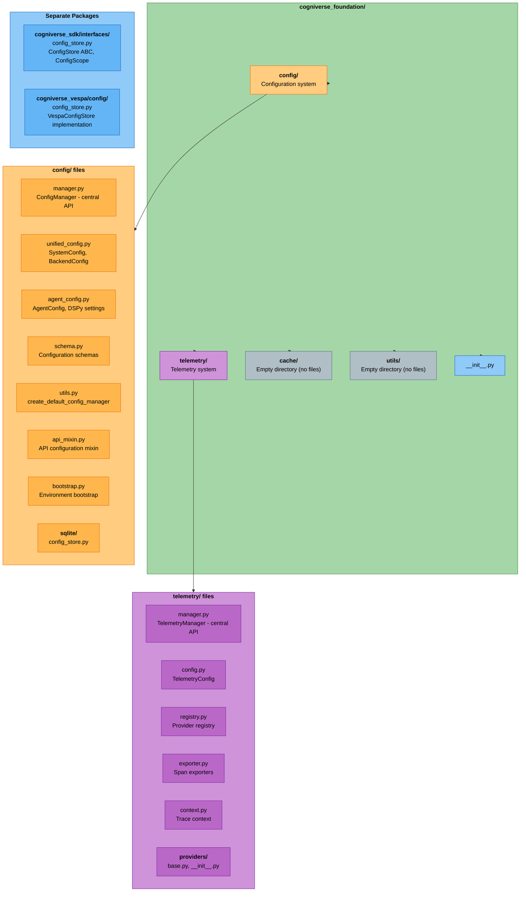
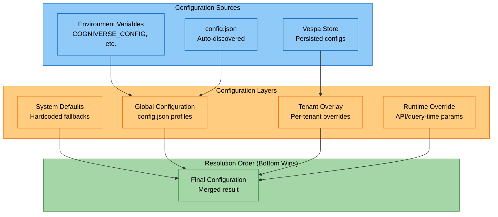
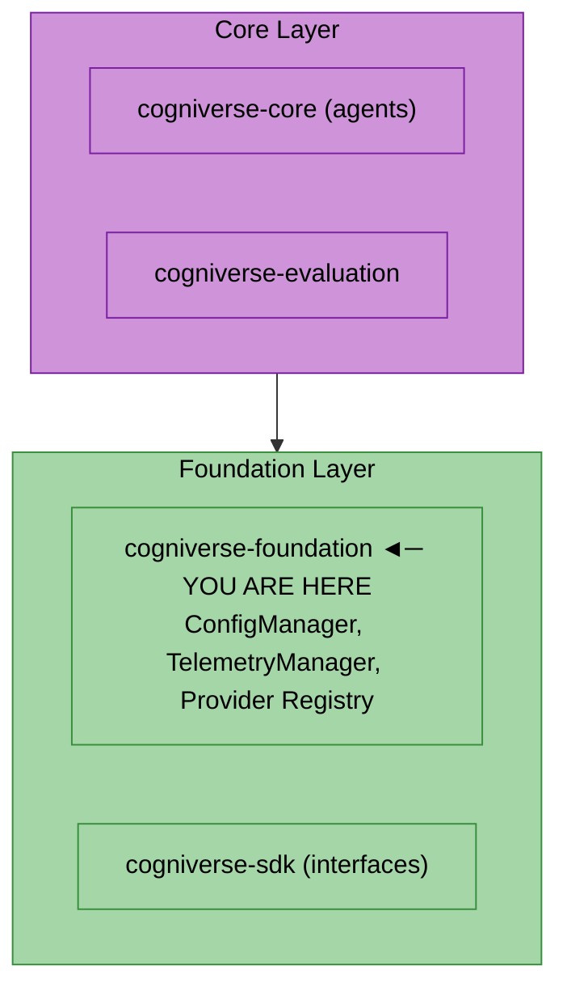

# Foundation Module

**Package:** `cogniverse_foundation`
**Location:** `libs/foundation/cogniverse_foundation/`

---

## Table of Contents

1. [Overview](#overview)
2. [Package Structure](#package-structure)
3. [Configuration System](#configuration-system)
   - [ConfigManager](#configmanager)
   - [Configuration Types](#configuration-types)
   - [Configuration Scopes](#configuration-scopes)
4. [Telemetry System](#telemetry-system)
   - [TelemetryManager](#telemetrymanager)
   - [Span Context](#span-context)
   - [Session Tracking](#session-tracking)
5. [Usage Examples](#usage-examples)
6. [Architecture Position](#architecture-position)
7. [Testing](#testing)

---

## Overview

The Foundation module provides **infrastructure services** that all other modules depend on:

- **Configuration Management**: Multi-tenant, versioned configuration with pluggable backend persistence (Vespa, SQLite)
- **Telemetry Infrastructure**: OpenTelemetry-based tracing with tenant isolation
- **Provider Abstraction**: Pluggable backends for telemetry (Phoenix, etc.)

All configuration and telemetry operations are **tenant-aware** - `tenant_id` is required for all operations.

---

## Package Structure



---

## Configuration System

### ConfigManager

`ConfigManager` is the central configuration API. All configuration operations go through this class.

**Key Features:**

- Multi-tenant configuration with tenant isolation
- Version history tracking for all configurations
- LRU caching for performance
- Pluggable backend persistence via `ConfigStore` interface (VespaConfigStore, SQLiteConfigStore)

```python
from cogniverse_foundation.config.utils import create_default_config_manager

# Initialize config manager
config_manager = create_default_config_manager(cache_size=100)

# Get system configuration for tenant
system_config = config_manager.get_system_config(tenant_id="acme")

# Set agent configuration
config_manager.set_agent_config(
    tenant_id="acme",
    agent_name="routing_agent",
    agent_config=agent_config
)
```

**API Reference:**

| Method | Description |
|--------|-------------|
| `get_system_config(tenant_id="default")` | Get system configuration |
| `set_system_config(system_config, tenant_id=None)` | Set system configuration |
| `get_agent_config(tenant_id, agent_name)` | Get agent configuration |
| `set_agent_config(tenant_id, agent_name, agent_config)` | Set agent configuration |
| `get_agent_config_history(tenant_id, agent_name, limit=10)` | Get config version history |
| `get_routing_config(tenant_id="default", service="routing_agent")` | Get routing configuration |
| `set_routing_config(routing_config, tenant_id=None, service="routing_agent")` | Set routing configuration |
| `get_telemetry_config(tenant_id="default", service="telemetry")` | Get telemetry configuration |
| `set_telemetry_config(telemetry_config, tenant_id=None, service="telemetry")` | Set telemetry configuration |
| `get_backend_config(tenant_id="default", service="backend")` | Get backend configuration |
| `set_backend_config(backend_config, tenant_id=None, service="backend")` | Set backend configuration |
| `get_backend_profile(profile_name, tenant_id="default", service="backend")` | Get specific backend profile |
| `add_backend_profile(profile, tenant_id="default", service="backend")` | Add/update backend profile |
| `update_backend_profile(profile_name, overrides, base_tenant_id="default", target_tenant_id=None, service="backend")` | Partial profile update |
| `list_backend_profiles(tenant_id="default", service="backend")` | List all backend profiles |
| `delete_backend_profile(profile_name, tenant_id="default", service="backend")` | Delete backend profile |
| `export_configs(tenant_id, output_path)` | Export all configs to JSON |
| `get_stats()` | Get configuration statistics |

### Configuration Types

**SystemConfig** - Infrastructure settings:
```python
from cogniverse_foundation.config.unified_config import SystemConfig

system_config = SystemConfig(
    tenant_id="acme",
    search_backend="vespa",
    routing_agent_url="http://localhost:8001",
    video_agent_url="http://localhost:8002",
    backend_url="http://localhost",
    backend_port=8080
)
```

**AgentConfig** - Agent-specific settings:
```python
from cogniverse_foundation.config.agent_config import (
    AgentConfig, ModuleConfig, OptimizerConfig,
    DSPyModuleType, OptimizerType
)

agent_config = AgentConfig(
    agent_name="routing_agent",
    agent_version="1.0.0",
    agent_description="Routes queries to appropriate agents",
    agent_url="http://localhost:8001",
    capabilities=["routing", "query_analysis"],
    skills=[{"name": "route_query", "description": "Route to best agent"}],
    module_config=ModuleConfig(
        module_type=DSPyModuleType.CHAIN_OF_THOUGHT,
        signature="query -> routing_decision"
    ),
    optimizer_config=OptimizerConfig(
        optimizer_type=OptimizerType.MIPRO_V2,
        num_trials=50
    ),
    llm_model="gpt-4",
    llm_temperature=0.7,
    llm_max_tokens=2000
)
```

**BackendConfig** - Backend and profile settings:
```python
from cogniverse_foundation.config.unified_config import BackendConfig, BackendProfileConfig

backend_config = BackendConfig(
    tenant_id="acme",
    backend_type="vespa",
    url="http://localhost",
    port=8080,
    profiles={
        "video_colpali_mv_frame": BackendProfileConfig(
            profile_name="video_colpali_mv_frame",
            type="video",
            embedding_model="colpali",
            schema_name="video_colpali_smol500_mv_frame",
            pipeline_config={"chunk_strategy": "frame"},
            strategies={"default_top_k": 10}
        )
    }
)
```

**RoutingConfigUnified** - Routing agent settings:
```python
from cogniverse_foundation.config.unified_config import RoutingConfigUnified

routing_config = RoutingConfigUnified(
    tenant_id="acme",
    routing_mode="tiered",  # "tiered", "ensemble", "hybrid"
    enable_fast_path=True,
    enable_slow_path=True,
    fast_path_confidence_threshold=0.7,
    slow_path_confidence_threshold=0.6
)
```

**TelemetryConfig** - Telemetry settings:
```python
from cogniverse_foundation.telemetry.config import TelemetryConfig, TelemetryLevel

telemetry_config = TelemetryConfig(
    enabled=True,
    level=TelemetryLevel.DETAILED,
    otlp_enabled=True,
    otlp_endpoint="localhost:4317"
)
```

### Configuration Scopes

Configurations are organized by scope for isolation:

| Scope | Description | Example Keys |
|-------|-------------|--------------|
| `SYSTEM` | Infrastructure settings | routing_agent_url, backend_url, backend_port |
| `AGENT` | Per-agent settings | module_config, llm_model, llm_temperature |
| `ROUTING` | Routing agent settings | routing_mode, enable_fast_path, gliner_threshold |
| `TELEMETRY` | Telemetry settings | otlp_endpoint, otlp_enabled, level |
| `BACKEND` | Backend profiles | embedding_model, schema_name, pipeline_config |

```python
from cogniverse_sdk.interfaces.config_store import ConfigScope

# Get arbitrary config value by scope
value = config_manager.get_config_value(
    tenant_id="acme",
    scope=ConfigScope.AGENT,
    service="routing_agent",
    config_key="optimizer_config"
)
```

### Configuration Inheritance

The configuration system uses a layered inheritance model where tenant-specific settings override system defaults:



**Configuration Resolution Example:**

```python
# System default (hardcoded)
max_frames = 50

# Global config (config.json) - overrides default
"profiles": {
    "video_colpali_mv_frame": {
        "max_frames": 100
    }
}

# Tenant overlay (Vespa) - overrides global
config_manager.set_backend_config(
    tenant_id="premium_tenant",
    config=BackendConfig(profiles={
        "video_colpali_mv_frame": {"max_frames": 200}
    })
)

# Runtime override (query param) - overrides all
result = await search(query, max_frames=300)

# Final: premium_tenant gets max_frames=300 for this query
```

**Resolution Priority (highest to lowest):**

| Priority | Source | Scope | Example |
|----------|--------|-------|---------|
| 1 (highest) | Runtime Override | Per-request | Query params, API args |
| 2 | Tenant Overlay | Per-tenant | `ConfigManager.set_*_config()` (persisted to Vespa) |
| 3 | Global Config | All tenants | `config.json` profiles |
| 4 (lowest) | System Defaults | Fallback | Hardcoded in classes |

---

## Telemetry System

### TelemetryManager

`TelemetryManager` is a **singleton** that manages OpenTelemetry tracing with multi-tenant isolation.

**Key Features:**

- Tenant-isolated tracer providers
- LRU caching of tracers
- Graceful degradation when telemetry unavailable
- Session tracking for multi-turn conversations
- Phoenix integration for trace visualization

```python
from cogniverse_foundation.telemetry.manager import TelemetryManager, get_telemetry_manager

# Get global singleton
telemetry = get_telemetry_manager()

# Create span with tenant isolation
with telemetry.span("search.execute", tenant_id="acme") as span:
    span.set_attribute("query", "find videos about cats")
    # ... search logic ...
```

**API Reference:**

| Method | Description |
|--------|-------------|
| `span(name, tenant_id, project_name, attributes)` | Create tenant-isolated span |
| `session(tenant_id, session_id, project_name)` | Session context for multi-turn |
| `session_span(name, tenant_id, session_id, ...)` | Span within session context |
| `get_tracer(tenant_id, project_name)` | Get tracer (legacy) |
| `get_provider(tenant_id, project_name)` | Get telemetry provider for queries |
| `register_project(tenant_id, project_name, **kwargs)` | Register project with config |
| `unregister_project(tenant_id, project_name)` | Unregister and shutdown project |
| `force_flush(timeout_millis)` | Flush all pending spans |
| `shutdown()` | Graceful shutdown |
| `get_stats()` | Get telemetry statistics |

### Span Context

Creating spans with tenant isolation:

```python
from cogniverse_foundation.telemetry.manager import get_telemetry_manager

telemetry = get_telemetry_manager()

# Basic span
with telemetry.span("agent.process", tenant_id="acme") as span:
    span.set_attribute("agent.name", "routing_agent")
    span.set_attribute("query.length", len(query))
    result = await process_query(query)

# Span with project isolation (for management operations)
with telemetry.span(
    "experiment.run",
    tenant_id="acme",
    project_name="experiments",  # Separate Phoenix project
    attributes={"experiment.name": "optimizer_v2"}
) as span:
    await run_experiment()
```

### Session Tracking

Track multi-turn conversations across requests:

```python
# At API entry point - establish session context
with telemetry.session_span(
    "api.search.request",
    tenant_id="acme",
    session_id="user-session-abc123",
    attributes={"query": query, "turn": 3}
) as span:
    # All child spans inherit session_id
    result = await search_service.search(query)

# Alternative: wrap multiple operations in session
with telemetry.session(tenant_id="acme", session_id="session-xyz"):
    with telemetry.span("operation1", tenant_id="acme") as span1:
        pass
    with telemetry.span("operation2", tenant_id="acme") as span2:
        pass
    # Both spans share session_id
```

### Project Registration

Register projects with custom endpoints (useful for tests):

```python
# Register with default config
telemetry.register_project(
    tenant_id="acme",
    project_name="search"
)

# Register with custom endpoints (for tests)
telemetry.register_project(
    tenant_id="test-tenant",
    project_name="synthetic_data",
    otlp_endpoint="http://localhost:24317",
    http_endpoint="http://localhost:26006",
    use_sync_export=True  # Sync export for tests
)
```

---

## Usage Examples

### Complete Configuration Setup

```python
from cogniverse_foundation.config.utils import create_default_config_manager
from cogniverse_foundation.config.unified_config import (
    SystemConfig,
    BackendConfig,
    BackendProfileConfig,
)
from cogniverse_foundation.config.agent_config import AgentConfig

# Initialize config manager
config_manager = create_default_config_manager()

# Set system config for tenant
system_config = SystemConfig(
    tenant_id="acme",
    search_backend="vespa",
    routing_agent_url="http://localhost:8001",
    video_agent_url="http://localhost:8002",
    backend_url="http://localhost",
    backend_port=8080
)
config_manager.set_system_config(system_config)

# Add backend profile for tenant
profile = BackendProfileConfig(
    profile_name="custom_colpali",
    type="video",
    embedding_model="colpali-v2",
    schema_name="video_colpali_custom",
    pipeline_config={"chunk_strategy": "frame", "top_k": 20}
)
config_manager.add_backend_profile(profile, tenant_id="acme")

# Set agent config (requires all fields)
from cogniverse_foundation.config.agent_config import (
    AgentConfig, ModuleConfig, DSPyModuleType
)
agent_config = AgentConfig(
    agent_name="routing_agent",
    agent_version="1.0.0",
    agent_description="Routes queries",
    agent_url="http://localhost:8001",
    capabilities=["routing"],
    skills=[],
    module_config=ModuleConfig(
        module_type=DSPyModuleType.CHAIN_OF_THOUGHT,
        signature="query -> decision"
    ),
    llm_model="gpt-4",
    llm_temperature=0.7
)
config_manager.set_agent_config(
    tenant_id="acme",
    agent_name="routing_agent",
    agent_config=agent_config
)
```

### Tenant-Specific Profile Overrides

```python
# Start with system profile, customize for tenant
config_manager.update_backend_profile(
    profile_name="video_colpali_mv_frame",
    overrides={
        "embedding_model": "colpali-custom",
        "top_k": 25
    },
    base_tenant_id="default",  # Get from system
    target_tenant_id="acme"    # Save to tenant
)
```

### Telemetry with Phoenix

```python
from cogniverse_foundation.telemetry.manager import get_telemetry_manager
from cogniverse_foundation.telemetry.config import TelemetryConfig

# Initialize with config
config = TelemetryConfig(
    enabled=True,
    otlp_endpoint="http://localhost:4317",
    service_name="cogniverse",
    environment="production"
)
telemetry = TelemetryManager(config=config)

# Use in agent processing
async def process_query(query: str, tenant_id: str):
    with telemetry.span(
        "agent.routing",
        tenant_id=tenant_id,
        attributes={"query": query}
    ) as span:
        # Route query
        route = await route_query(query)
        span.set_attribute("route.agent", route.agent_name)
        span.set_attribute("route.confidence", route.confidence)

        # Execute with nested span
        with telemetry.span(
            f"agent.{route.agent_name}",
            tenant_id=tenant_id
        ) as child_span:
            result = await execute_agent(route.agent_name, query)
            child_span.set_attribute("result.count", len(result.items))

        return result
```

### Querying Telemetry Data

```python
# Get provider for querying spans
provider = telemetry.get_provider(tenant_id="acme")

# Query spans from Phoenix
spans_df = await provider.traces.get_spans(
    project="cogniverse-acme",
    start_time=datetime(2025, 1, 1),
    limit=1000
)

# Add annotation
await provider.annotations.add_annotation(
    span_id="abc123",
    name="human_review",
    label="approved",
    score=1.0,
    metadata={"reviewer": "alice"}
)
```

---

## Architecture Position



**Dependencies:**

- `cogniverse-sdk`: Pure interfaces (ConfigStore, Backend, etc.)
- `cogniverse-vespa`: VespaConfigStore implementation for config persistence
- `opentelemetry-api/sdk`: Telemetry infrastructure
- `pydantic`: Configuration validation

**Dependents:**

- `cogniverse-core`: Uses ConfigManager, TelemetryManager
- `cogniverse-agents`: Uses configuration and telemetry
- `cogniverse-telemetry-phoenix`: Implements telemetry provider

---

## Testing

```bash
# Run foundation tests (telemetry and common utilities)
JAX_PLATFORM_NAME=cpu uv run pytest tests/telemetry/ tests/common/unit/ tests/common/integration/ -v

# Test configuration
uv run pytest tests/common/unit/ -v -k "config"

# Test telemetry
uv run pytest tests/telemetry/ -v

# Test with coverage
uv run pytest tests/telemetry/ tests/common/unit/ tests/common/integration/ --cov=cogniverse_foundation --cov-report=html
```

**Test Categories:**

- `tests/telemetry/` - Telemetry manager and provider tests
- `tests/common/unit/` - Unit tests for configuration and utilities
- `tests/common/integration/` - Integration tests with backend (e.g., Vespa)

---

## Related Documentation

- [Core Module](./core.md) - Agent base classes that use configuration and telemetry
- [Configuration System Guide](../CONFIGURATION_SYSTEM.md) - Detailed configuration guide
- [Telemetry Module](./telemetry.md) - Phoenix provider implementation
- [Multi-Tenant Architecture](../architecture/multi-tenant.md) - Tenant isolation patterns

---

**Summary:** The Foundation module provides the infrastructure layer for Cogniverse. `ConfigManager` handles multi-tenant, versioned configuration with pluggable backend persistence (VespaConfigStore, SQLiteConfigStore). `TelemetryManager` provides OpenTelemetry tracing with tenant isolation and Phoenix integration. All operations require `tenant_id` to ensure proper multi-tenant isolation.
