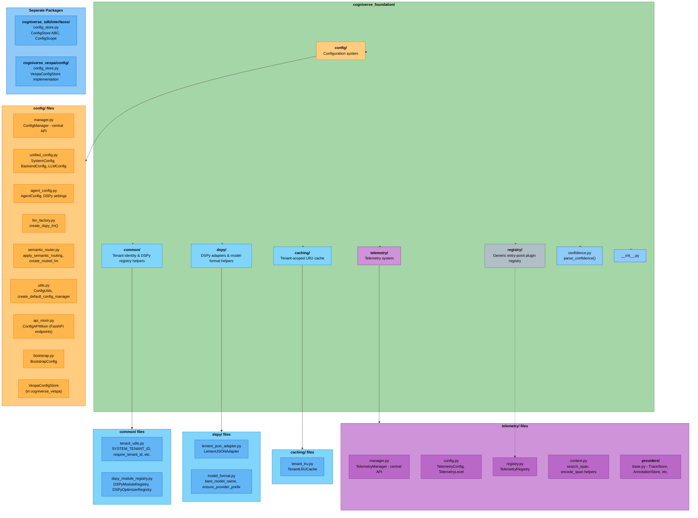
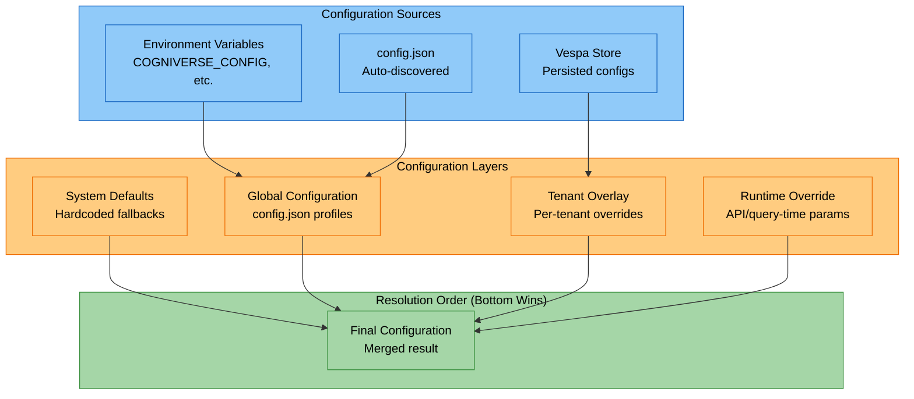
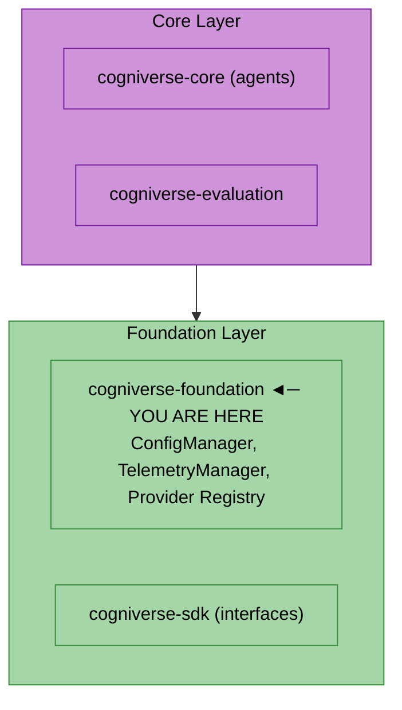

# Foundation Module

**Package:** `cogniverse_foundation`
**Location:** `libs/foundation/cogniverse_foundation/`

---

## Table of Contents

1. [Overview](#overview)
2. [Package Structure](#package-structure)
3. [Configuration System](#configuration-system)
   - [ConfigManager](#configmanager)
   - [Configuration Types](#configuration-types)
   - [Configuration Scopes](#configuration-scopes)
   - [Configuration Inheritance](#configuration-inheritance)
   - [ConfigAPIMixin](#configapimixin)
4. [Telemetry System](#telemetry-system)
   - [TelemetryManager](#telemetrymanager)
   - [Span Context](#span-context)
   - [Session Tracking](#session-tracking)
   - [Project Registration](#project-registration)
   - [Span Context Helpers](#span-context-helpers)
5. [Registry System](#registry-system)
6. [Tenant-Scoped Caching](#tenant-scoped-caching)
7. [DSPy Extensions](#dspy-extensions)
8. [Confidence Parsing](#confidence-parsing)
9. [Usage Examples](#usage-examples)
10. [Architecture Position](#architecture-position)
11. [Testing](#testing)

---

## Overview

The Foundation module provides **infrastructure services** that all other modules depend on:

- **Configuration Management**: Multi-tenant, versioned configuration with pluggable `ConfigStore` persistence (default: Vespa)
- **LLM Wiring**: `create_dspy_lm` factory, opt-in semantic-router request routing, and DSPy adapter/model-name helpers
- **Telemetry Infrastructure**: OpenTelemetry-based tracing with tenant isolation
- **Provider Abstraction**: Pluggable backends for telemetry (Phoenix, etc.) via a generic entry-point plugin registry
- **Shared Utilities**: Tenant-scoped LRU caching and robust LM-output confidence parsing used across core, agents, evaluation, and finetuning

All configuration and telemetry operations are **tenant-aware** - `tenant_id` is required for all operations.

---

## Package Structure


```mermaid
flowchart TB
    subgraph Foundation["<span style='color:#000'><b>cogniverse_foundation/</b></span>"]
        ConfigDir["<span style='color:#000'><b>config/</b><br/>Configuration system</span>"]
        TelemetryDir["<span style='color:#000'><b>telemetry/</b><br/>Telemetry system</span>"]
        RegistryDir["<span style='color:#000'><b>registry/</b><br/>Generic entry-point plugin registry</span>"]
        CachingDir["<span style='color:#000'><b>caching/</b><br/>Tenant-scoped LRU cache</span>"]
        DspyDir["<span style='color:#000'><b>dspy/</b><br/>DSPy adapters &amp; model-format helpers</span>"]
        CommonDir["<span style='color:#000'><b>common/</b><br/>Tenant identity &amp; DSPy registry helpers</span>"]
        ConfidencePy["<span style='color:#000'>confidence.py<br/>parse_confidence()</span>"]
        InitPy["<span style='color:#000'>__init__.py</span>"]
    end

    subgraph ConfigFiles["<span style='color:#000'><b>config/ files</b></span>"]
        Manager["<span style='color:#000'>manager.py<br/>ConfigManager - central API</span>"]
        UnifiedConfigFile["<span style='color:#000'>unified_config.py<br/>SystemConfig, BackendConfig, LLMConfig</span>"]
        AgentConfigFile["<span style='color:#000'>agent_config.py<br/>AgentConfig, DSPy settings</span>"]
        LlmFactory["<span style='color:#000'>llm_factory.py<br/>create_dspy_lm()</span>"]
        SemanticRouterFile["<span style='color:#000'>semantic_router.py<br/>apply_semantic_routing, create_routed_lm</span>"]
        Utils["<span style='color:#000'>utils.py<br/>ConfigUtils, create_default_config_manager</span>"]
        ApiMixin["<span style='color:#000'>api_mixin.py<br/>ConfigAPIMixin (FastAPI endpoints)</span>"]
        Bootstrap["<span style='color:#000'>bootstrap.py<br/>BootstrapConfig</span>"]
        VespaStore["<span style='color:#000'>VespaConfigStore<br/>(in cogniverse_vespa)</span>"]
    end

    subgraph TelemetryFiles["<span style='color:#000'><b>telemetry/ files</b></span>"]
        TelManager["<span style='color:#000'>manager.py<br/>TelemetryManager - central API</span>"]
        TelConfig["<span style='color:#000'>config.py<br/>TelemetryConfig, TelemetryLevel</span>"]
        Registry["<span style='color:#000'>registry.py<br/>TelemetryRegistry</span>"]
        Context["<span style='color:#000'>context.py<br/>search_span, encode_span helpers</span>"]
        ProvidersDir["<span style='color:#000'><b>providers/</b><br/>base.py - TraceStore, AnnotationStore, etc.</span>"]
    end

    subgraph CachingFiles["<span style='color:#000'><b>caching/ files</b></span>"]
        TenantLru["<span style='color:#000'>tenant_lru.py<br/>TenantLRUCache</span>"]
    end

    subgraph DspyFiles["<span style='color:#000'><b>dspy/ files</b></span>"]
        LenientAdapter["<span style='color:#000'>lenient_json_adapter.py<br/>LenientJSONAdapter</span>"]
        ModelFormat["<span style='color:#000'>model_format.py<br/>bare_model_name, ensure_provider_prefix</span>"]
    end

    subgraph CommonFiles["<span style='color:#000'><b>common/ files</b></span>"]
        TenantUtilsFile["<span style='color:#000'>tenant_utils.py<br/>SYSTEM_TENANT_ID, require_tenant_id, etc.</span>"]
        DspyModuleRegistryFile["<span style='color:#000'>dspy_module_registry.py<br/>DSPyModuleRegistry, DSPyOptimizerRegistry</span>"]
    end

    subgraph SeparatePackages["<span style='color:#000'><b>Separate Packages</b></span>"]
        SDKInterface["<span style='color:#000'><b>cogniverse_sdk/interfaces/</b><br/>config_store.py<br/>ConfigStore ABC, ConfigScope</span>"]
        VespaImpl["<span style='color:#000'><b>cogniverse_vespa/config/</b><br/>config_store.py<br/>VespaConfigStore implementation</span>"]
    end

    Foundation --> ConfigDir
    Foundation --> TelemetryDir
    Foundation --> RegistryDir
    Foundation --> CachingDir
    Foundation --> DspyDir
    Foundation --> CommonDir
    Foundation --> ConfidencePy
    Foundation --> InitPy

    ConfigDir --> ConfigFiles
    TelemetryDir --> TelemetryFiles
    CachingDir --> CachingFiles
    DspyDir --> DspyFiles
    CommonDir --> CommonFiles
    RegistryDir -.-> Registry

    style Foundation fill:#a5d6a7,stroke:#388e3c,color:#000
    style ConfigDir fill:#ffcc80,stroke:#ef6c00,color:#000
    style TelemetryDir fill:#ce93d8,stroke:#7b1fa2,color:#000
    style RegistryDir fill:#b0bec5,stroke:#546e7a,color:#000
    style CachingDir fill:#81d4fa,stroke:#0288d1,color:#000
    style DspyDir fill:#81d4fa,stroke:#0288d1,color:#000
    style CommonDir fill:#81d4fa,stroke:#0288d1,color:#000
    style ConfidencePy fill:#90caf9,stroke:#1565c0,color:#000
    style InitPy fill:#90caf9,stroke:#1565c0,color:#000
    style ConfigFiles fill:#ffcc80,stroke:#ef6c00,color:#000
    style TelemetryFiles fill:#ce93d8,stroke:#7b1fa2,color:#000
    style CachingFiles fill:#81d4fa,stroke:#0288d1,color:#000
    style DspyFiles fill:#81d4fa,stroke:#0288d1,color:#000
    style CommonFiles fill:#81d4fa,stroke:#0288d1,color:#000
    style SeparatePackages fill:#90caf9,stroke:#1565c0,color:#000
    style Manager fill:#ffb74d,stroke:#ef6c00,color:#000
    style UnifiedConfigFile fill:#ffb74d,stroke:#ef6c00,color:#000
    style AgentConfigFile fill:#ffb74d,stroke:#ef6c00,color:#000
    style LlmFactory fill:#ffb74d,stroke:#ef6c00,color:#000
    style SemanticRouterFile fill:#ffb74d,stroke:#ef6c00,color:#000
    style Utils fill:#ffb74d,stroke:#ef6c00,color:#000
    style ApiMixin fill:#ffb74d,stroke:#ef6c00,color:#000
    style Bootstrap fill:#ffb74d,stroke:#ef6c00,color:#000
    style VespaStore fill:#ffb74d,stroke:#ef6c00,color:#000
    style TelManager fill:#ba68c8,stroke:#7b1fa2,color:#000
    style TelConfig fill:#ba68c8,stroke:#7b1fa2,color:#000
    style Registry fill:#ba68c8,stroke:#7b1fa2,color:#000
    style Context fill:#ba68c8,stroke:#7b1fa2,color:#000
    style ProvidersDir fill:#ba68c8,stroke:#7b1fa2,color:#000
    style TenantLru fill:#64b5f6,stroke:#1565c0,color:#000
    style LenientAdapter fill:#64b5f6,stroke:#1565c0,color:#000
    style ModelFormat fill:#64b5f6,stroke:#1565c0,color:#000
    style TenantUtilsFile fill:#64b5f6,stroke:#1565c0,color:#000
    style DspyModuleRegistryFile fill:#64b5f6,stroke:#1565c0,color:#000
    style SDKInterface fill:#64b5f6,stroke:#1565c0,color:#000
    style VespaImpl fill:#64b5f6,stroke:#1565c0,color:#000
```

---

## Configuration System

### ConfigManager

`ConfigManager` is the central configuration API. All configuration operations go through this class.

**Key Features:**

- Multi-tenant configuration with tenant isolation
- Version history tracking for all configurations
- In-process caching: the system config is cached until `set_system_config`
  writes; per-tenant scoped configs (routing/telemetry/backend) are served
  from a short-TTL cache (`scoped_config_cache_ttl_s`, default 5s). Setters
  on the same manager invalidate immediately — the TTL only bounds staleness
  for writes made by another process.
- Pluggable backend persistence via `ConfigStore` interface (VespaConfigStore)

```python
from cogniverse_foundation.config.utils import create_default_config_manager

# Initialize config manager
config_manager = create_default_config_manager()

# Get global system configuration (no tenant_id argument — SystemConfig is deployment-wide)
system_config = config_manager.get_system_config()

# Set agent configuration (agent_config built as shown under Configuration Types → AgentConfig)
config_manager.set_agent_config(
    tenant_id="acme",
    agent_name="orchestrator_agent",
    agent_config=agent_config
)
```

**API Reference:**

| Method | Description |
|--------|-------------|
| `get_system_config()` | Get global system configuration (deployment-wide, not per-tenant) |
| `set_system_config(system_config)` | Set global system configuration |
| `get_agent_config(tenant_id, agent_name)` | Get agent configuration |
| `set_agent_config(tenant_id, agent_name, agent_config)` | Set agent configuration |
| `get_agent_config_history(tenant_id, agent_name, limit=10)` | Get config version history |
| `get_routing_config(tenant_id="your_org:production", service="gateway_agent")` | Get routing configuration |
| `set_routing_config(routing_config, tenant_id=None, service="gateway_agent")` | Set routing configuration |
| `get_durable_execution_config(tenant_id, service="optimization")` | Get durable-execution enablement (default off) |
| `set_durable_execution_config(durable_config, tenant_id=None, service="optimization")` | Set durable-execution enablement |
| `get_telemetry_config(tenant_id="your_org:production", service="telemetry")` | Get telemetry configuration |
| `set_telemetry_config(telemetry_config, tenant_id=None, service="telemetry")` | Set telemetry configuration |
| `get_backend_config(tenant_id="your_org:production", service="backend")` | Get backend configuration |
| `set_backend_config(backend_config, tenant_id=None, service="backend")` | Set backend configuration |
| `get_backend_profile(profile_name, tenant_id="your_org:production", service="backend")` | Get specific backend profile |
| `add_backend_profile(profile, tenant_id="your_org:production", service="backend")` | Add/update backend profile |
| `update_backend_profile(profile_name, overrides, base_tenant_id=SYSTEM_TENANT_ID, target_tenant_id=None, service="backend")` | Partial profile update; inherits from `base_tenant_id`, saves to `target_tenant_id` (defaults to `base_tenant_id`) |
| `list_backend_profiles(tenant_id="your_org:production", service="backend")` | List all backend profiles |
| `delete_backend_profile(profile_name, tenant_id="your_org:production", service="backend")` | Delete backend profile |
| `get_config_value(tenant_id, scope, service, config_key, default=None)` | Get arbitrary config value by scope |
| `set_config_value(tenant_id, scope, service, config_key, config_value)` | Set arbitrary config value by scope |
| `get_all_configs(tenant_id, scope=None)` | Get all configs for a tenant, optionally filtered by scope |
| `export_configs(tenant_id, output_path)` | Export all configs to JSON |
| `get_stats()` | Get configuration statistics |

### Configuration Types

**SystemConfig** - Infrastructure settings:
```python
from cogniverse_foundation.config.unified_config import SystemConfig

system_config = SystemConfig(
    search_backend="vespa",
    video_agent_url="http://localhost:8002",
    backend_url="http://localhost",
    backend_port=8080
)
```

**AgentConfig** - Agent-specific settings:
```python
from cogniverse_foundation.config.agent_config import (
    AgentConfig, ModuleConfig, OptimizerConfig,
    DSPyModuleType, OptimizerType
)

agent_config = AgentConfig(
    agent_name="orchestrator_agent",
    agent_version="1.0.0",
    agent_description="Routes queries to appropriate agents",
    agent_url="http://localhost:8001",
    capabilities=["routing", "query_analysis", "entity_extraction", "conversation_memory"],
    skills=[{"name": "route_query", "description": "Route to best agent"}],
    module_config=ModuleConfig(
        module_type=DSPyModuleType.CHAIN_OF_THOUGHT,
        signature="query -> routing_decision"
    ),
    optimizer_config=OptimizerConfig(
        optimizer_type=OptimizerType.MIPRO_V2,
        num_trials=50
    ),
    llm_model="gpt-4",
    llm_temperature=0.7,
    llm_max_tokens=2000
)
```

**BackendConfig** - Backend and profile settings:
```python
from cogniverse_foundation.config.unified_config import BackendConfig, BackendProfileConfig

backend_config = BackendConfig(
    tenant_id="acme",
    backend_type="vespa",
    url="http://localhost",
    port=8080,
    profiles={
        "video_colpali_mv_frame": BackendProfileConfig(
            profile_name="video_colpali_mv_frame",
            type="video",
            embedding_model="colpali",
            schema_name="video_colpali_smol500_mv_frame",
            pipeline_config={"chunk_strategy": "frame"},
            strategies={"default_top_k": 10}
        )
    }
)
```

**RoutingConfigUnified** - Routing agent settings:
```python
from cogniverse_foundation.config.unified_config import RoutingConfigUnified

routing_config = RoutingConfigUnified(
    tenant_id="acme",
    routing_mode="tiered",  # "tiered", "ensemble", "hybrid"
    enable_fast_path=True,
    fast_path_confidence_threshold=0.4,
)
```

**DurableExecutionConfig** - Durable-execution enablement for long-running optimization/eval workflows:
```python
from cogniverse_foundation.config.unified_config import DurableExecutionConfig

durable_config = DurableExecutionConfig(
    tenant_id="acme",
    enabled=True,  # checkpoint + resume the triggered-optimization job (default False)
)
```

**TelemetryConfig** - Telemetry settings:
```python
from cogniverse_foundation.telemetry.config import TelemetryConfig, TelemetryLevel

telemetry_config = TelemetryConfig(
    enabled=True,
    level=TelemetryLevel.DETAILED,
    otlp_enabled=True,
    otlp_endpoint="localhost:4317"
)
```

**LLMEndpointConfig** - Single LLM endpoint wiring:
```python
from cogniverse_foundation.config.unified_config import LLMEndpointConfig

endpoint = LLMEndpointConfig(
    model="openai/gpt-4o",          # always provider-prefixed (DSPy/LiteLLM convention)
    api_base="http://localhost:8101/v1",
    api_key=None,                    # None for local OAI-compat servers
    temperature=0.1,
    max_tokens=1000,
    request_timeout=120.0,           # seconds before giving up on a slow endpoint
    num_retries=1,
    seed=42                          # optional; enables bit-stable output on vLLM
)
```

| Field | Default | Description |
|-------|---------|-------------|
| `model` | required | Provider-prefixed model string, e.g. `"openai/gpt-4o"` |
| `api_base` | `None` | Override endpoint URL |
| `api_key` | `None` | `None` for keyless local servers |
| `temperature` | `0.1` | Sampling temperature |
| `max_tokens` | `1000` | Max output tokens |
| `request_timeout` | `120.0` | Per-request timeout in seconds |
| `num_retries` | `1` | Retry count on transient errors |
| `seed` | `None` | vLLM sampling seed for reproducibility |
| `adapter_path` | `None` | LoRA/fine-tuned artifact path (bookkeeping only; not read by `create_dspy_lm`) |
| `extra_body` | `None` | Provider-specific request params |
| `extra_headers` | `None` | Static HTTP headers sent with every request (e.g. semantic-router tenant/tier headers) |

**LLMConfig** - Multi-role LLM configuration:
```python
from cogniverse_foundation.config.unified_config import LLMConfig, LLMEndpointConfig

llm_config = LLMConfig(
    primary=LLMEndpointConfig(model="openai/gpt-4o", api_base="http://localhost:8101/v1"),
    teacher=LLMEndpointConfig(model="openai/gpt-4o-mini", api_base="http://localhost:8101/v1"),
    overrides={
        # Per-component partial overrides merged onto primary at resolve time
        "summarizer_agent": {"max_tokens": 2000},
    }
)

# Resolve the effective config for a component
resolved = llm_config.resolve("summarizer_agent")
```

`primary` is the global default for all DSPy modules and also the student model during optimization. `teacher` is the bootstrap-teacher endpoint for DSPy optimization: `resolve_teacher()` returns an isolated copy that the optimizers hand to `BootstrapFewShot(teacher_settings={"lm": ...})`, so demo generation runs on the teacher model instead of the student teaching itself. `overrides` holds per-component partial dicts — only differing fields need to be specified; `resolve(component)` merges them field-by-field onto a copy of `primary` (never through `to_dict()`, which masks `api_key` — the resolved endpoint keeps the real key).

`create_dspy_lm(config: LLMEndpointConfig) -> dspy.LM` (`cogniverse_foundation.config.llm_factory`) is the single chokepoint every `dspy.LM()` construction in the codebase goes through. It wires `api_base`/`api_key`/`temperature`/`max_tokens`/`timeout`/`num_retries` onto the LM, merges `seed` into `extra_body`, forwards `extra_headers`, and substitutes a placeholder `api_key` when `api_base` is set but no key is configured (self-hosted OAI-compat servers ignore it). Raises `ValueError` if `config.model` is empty.

```python
from cogniverse_foundation.config.llm_factory import create_dspy_lm
from cogniverse_foundation.config.unified_config import LLMEndpointConfig

lm = create_dspy_lm(LLMEndpointConfig(model="openai/gpt-4o", api_base="http://localhost:8101/v1"))
```

**SemanticRouterConfig** - Opt-in routing of LLM calls through a vLLM Semantic Router:
```python
from cogniverse_foundation.config.unified_config import SemanticRouterConfig

router_config = SemanticRouterConfig(
    enabled=True,
    semantic_router_url="http://semantic-router:8801/v1",
    tenant_tiers={"acme": "gold"},
    default_tier="default",
    routed_model="openai/auto"
)
```

When `enabled`, `cogniverse_foundation.config.semantic_router` rewrites an `LLMEndpointConfig` to target `semantic_router_url` instead of the model backend, sets `model` to `routed_model` (the router resolves models by its own catalog, not raw provider ids), and attaches two authz headers per request: tenant identity (`user_id_header`, default `x-authz-user-id`) and tenant tier (`tier_header`, default `x-authz-user-groups`, resolved from `tenant_tiers` with `default_tier` as fallback). When disabled, the endpoint passes through unchanged.

| Function | Description |
|----------|-------------|
| `resolve_semantic_router_headers(config, tenant_id)` | Resolve the two authz headers, or `None` when disabled |
| `apply_semantic_routing(endpoint, config, tenant_id)` | Return a routed copy of `endpoint`, or the original when disabled |
| `create_routed_lm(endpoint, config, tenant_id)` | `apply_semantic_routing` + `create_dspy_lm` in one call |
| `routed_lm_context_for(config_manager, tenant_id, agent_name, endpoint=None)` | Return a `dspy.context` binding the routed (or direct) LM for a request — the entry point agents use |
| `resolve_semantic_router_config(config_accessor)` | Read `SemanticRouterConfig` off an object exposing `get_semantic_router()` |

### Configuration Scopes

Configurations are organized by scope for isolation:

| Scope | Description | Example Keys |
|-------|-------------|--------------|
| `SYSTEM` | Infrastructure settings | backend_url, backend_port, video_agent_url |
| `AGENT` | Per-agent settings | module_config, llm_model, llm_temperature |
| `ROUTING` | Routing agent settings | routing_mode, enable_fast_path, gliner_threshold |
| `TELEMETRY` | Telemetry settings | otlp_endpoint, otlp_enabled, level |
| `SCHEMA` | Deployed Vespa schema tracking (used by `cogniverse_core.registries.schema_registry`) | schema_name, deployment status |
| `BACKEND` | Backend profiles | embedding_model, schema_name, pipeline_config |

```python
from cogniverse_sdk.interfaces.config_store import ConfigScope

# Get arbitrary config value by scope
value = config_manager.get_config_value(
    tenant_id="acme",
    scope=ConfigScope.AGENT,
    service="orchestrator_agent",
    config_key="optimizer_config"
)
```

### Configuration Inheritance

The configuration system uses a layered inheritance model where tenant-specific settings override system defaults:


```mermaid
flowchart TB
    subgraph Sources["<span style='color:#000'>Configuration Sources</span>"]
        EnvVars["<span style='color:#000'>Environment Variables<br/>COGNIVERSE_CONFIG, etc.</span>"]
        ConfigFile["<span style='color:#000'>config.json<br/>Auto-discovered</span>"]
        VespaStore["<span style='color:#000'>Vespa Store<br/>Persisted configs</span>"]
    end

    subgraph Layers["<span style='color:#000'>Configuration Layers</span>"]
        direction TB
        SystemDefaults["<span style='color:#000'>System Defaults<br/>Hardcoded fallbacks</span>"]
        GlobalConfig["<span style='color:#000'>Global Configuration<br/>config.json profiles</span>"]
        TenantOverlay["<span style='color:#000'>Tenant Overlay<br/>Per-tenant overrides</span>"]
        RuntimeOverride["<span style='color:#000'>Runtime Override<br/>API/query-time params</span>"]
    end

    subgraph Resolution["<span style='color:#000'>Resolution Order (Bottom Wins)</span>"]
        Final["<span style='color:#000'>Final Configuration<br/>Merged result</span>"]
    end

    EnvVars --> GlobalConfig
    ConfigFile --> GlobalConfig
    VespaStore --> TenantOverlay

    SystemDefaults --> Final
    GlobalConfig --> Final
    TenantOverlay --> Final
    RuntimeOverride --> Final

    style Sources fill:#90caf9,stroke:#1565c0,color:#000
    style Layers fill:#ffcc80,stroke:#ef6c00,color:#000
    style Resolution fill:#a5d6a7,stroke:#388e3c,color:#000
    style EnvVars fill:#90caf9,stroke:#1565c0,color:#000
    style ConfigFile fill:#90caf9,stroke:#1565c0,color:#000
    style VespaStore fill:#90caf9,stroke:#1565c0,color:#000
    style SystemDefaults fill:#ffcc80,stroke:#ef6c00,color:#000
    style GlobalConfig fill:#ffcc80,stroke:#ef6c00,color:#000
    style TenantOverlay fill:#ffcc80,stroke:#ef6c00,color:#000
    style RuntimeOverride fill:#ffcc80,stroke:#ef6c00,color:#000
    style Final fill:#a5d6a7,stroke:#388e3c,color:#000
```

**Configuration Resolution Example:**

```python
from cogniverse_foundation.config.unified_config import BackendConfig, BackendProfileConfig

# System default (hardcoded)
max_frames = 50

# Global config (config.json) - overrides default
config_json = {
    "profiles": {
        "video_colpali_mv_frame": {
            "max_frames": 100
        }
    }
}

# Tenant overlay (Vespa) - overrides global
config_manager.add_backend_profile(
    tenant_id="premium_tenant",
    profile=BackendProfileConfig(
        profile_name="video_colpali_mv_frame",
        type="video",
        pipeline_config={"max_frames": 200},
    ),
)

async def search(query: str, max_frames: int):
    ...  # Runtime override (query param) - overrides all

async def main():
    result = await search(query="cats", max_frames=300)
    # Final: premium_tenant gets max_frames=300 for this query
    return result
```

**Resolution Priority (highest to lowest):**

| Priority | Source | Scope | Example |
|----------|--------|-------|---------|
| 1 (highest) | Runtime Override | Per-request | Query params, API args |
| 2 | Tenant Overlay | Per-tenant | `ConfigManager.set_*_config()` (persisted to Vespa) |
| 3 | Global Config | All tenants | `config.json` profiles |
| 4 (lowest) | System Defaults | Fallback | Hardcoded in classes |

### ConfigAPIMixin

`cogniverse_foundation.config.api_mixin.ConfigAPIMixin` adds runtime, persisted
configuration REST endpoints to an agent's FastAPI app. It expects the host
class to expose `self.agent_config` (an `AgentConfig`) plus
`update_module_config()` / `update_optimizer_config()` methods (provided by
`DynamicDSPyMixin` in `cogniverse_core`).

```python
class MyAgent(DynamicDSPyMixin, ConfigAPIMixin):
    def __init__(self, tenant_id, config_manager):
        self.initialize_dynamic_dspy(agent_config)
        app = FastAPI()
        self.setup_config_endpoints(app, config_manager, tenant_id=tenant_id)
```

`setup_config_endpoints(app, config_manager, tenant_id=None)` registers:

| Route | Description |
|-------|-------------|
| `GET /config` | Current `AgentConfig` as a dict |
| `GET /config/module` | Current DSPy module info |
| `POST /config/module` | Update module config (`ModuleConfigUpdate`); persists via `ConfigManager.set_agent_config` |
| `GET /config/optimizer` | Current optimizer info |
| `POST /config/optimizer` | Update optimizer config (`OptimizerConfigUpdate`); persists |
| `POST /config/llm` | Update LLM fields (`LLMConfigUpdate`) and reconfigure the DSPy LM; persists |
| `GET /config/modules/available` | List registered DSPy module types |
| `GET /config/optimizers/available` | List registered DSPy optimizer types |

Every mutating endpoint persists through the injected `ConfigManager`, so changes survive a restart and are versioned like any other config write.

---

## Telemetry System

### TelemetryManager

`TelemetryManager` is a **singleton** that manages OpenTelemetry tracing with multi-tenant isolation.

**Key Features:**

- Tenant-isolated tracer providers
- LRU caching of tracers
- Graceful degradation when telemetry unavailable
- Session tracking for multi-turn conversations
- Phoenix integration for trace visualization

```python
from cogniverse_foundation.telemetry.manager import TelemetryManager, get_telemetry_manager

# Get global singleton
telemetry = get_telemetry_manager()

# Create span with tenant isolation
with telemetry.span("search.execute", tenant_id="acme") as span:
    span.set_attribute("query", "find videos about cats")
    # ... search logic ...
```

**API Reference:**

| Method | Description |
|--------|-------------|
| `span(name, tenant_id, project_name=None, attributes=None, component="agents")` | Create tenant-isolated span. `component` gates emission against `TelemetryConfig.level` (one of `search_service`/`agents`/`backend`/`pipeline`/`encoder`) |
| `session_span(name, tenant_id, session_id, project_name=None, attributes=None, component="search_service")` | Span within a session context; all nested `span()` calls inherit `session_id` |
| `get_tracer(tenant_id, project_name=None)` | Get tracer (prefer `span()`) |
| `get_provider(tenant_id, project_name=None)` | Get telemetry provider for queries (spans/annotations/datasets) |
| `register_project(tenant_id, project_name, **kwargs)` | Register project with config |
| `force_flush(timeout_millis=10000)` | Flush all pending spans |
| `shutdown()` | Graceful shutdown |
| `get_stats()` | Get telemetry statistics |

There is no standalone `session()` context manager — session tracking is done
by calling `session_span()` with the same `session_id` for each operation
that should share a session, or by nesting `span()` calls inside one
`session_span()`.

### Span Context

Creating spans with tenant isolation:

```python
from cogniverse_foundation.telemetry.manager import get_telemetry_manager

telemetry = get_telemetry_manager()

async def process(query: str):
    # Basic span
    with telemetry.span("agent.process", tenant_id="acme") as span:
        span.set_attribute("agent.name", "orchestrator_agent")
        span.set_attribute("query.length", len(query))
        result = await process_query(query)

    # Span with project isolation (for management operations)
    with telemetry.span(
        "experiment.run",
        tenant_id="acme",
        project_name="experiments",  # Separate Phoenix project
        attributes={"experiment.name": "optimizer_v2"}
    ) as span:
        await run_experiment()

    return result
```

### Session Tracking

Track multi-turn conversations across requests:

```python
async def handle_request(query: str, session_id: str):
    # At API entry point - establish session context
    with telemetry.session_span(
        "api.search.request",
        tenant_id="acme",
        session_id=session_id,
        attributes={"query": query, "turn": 3}
    ) as span:
        # All child spans inherit session_id
        result = await search_service.search(query)
    return result

# Alternative: nest plain spans inside one session_span - all inherit session_id
with telemetry.session_span("session.start", tenant_id="acme", session_id="session-xyz"):
    with telemetry.span("operation1", tenant_id="acme") as span1:
        pass
    with telemetry.span("operation2", tenant_id="acme") as span2:
        pass
    # Both spans share session_id
```

### Project Registration

Register projects with custom endpoints (useful for tests):

```python
# Register with default config
telemetry.register_project(
    tenant_id="acme",
    project_name="search"
)

# Register with custom endpoints (for tests)
telemetry.register_project(
    tenant_id="test-tenant",
    project_name="synthetic_data",
    otlp_endpoint="http://localhost:24317",
    http_endpoint="http://localhost:26006",
    use_sync_export=True  # Sync export for tests
)
```

### Span Context Helpers

`cogniverse_foundation.telemetry.context` provides pre-shaped span helpers
that standardize the attribute set for the three most common span kinds,
plus two helpers for enriching an existing span:

| Function | Description |
|----------|-------------|
| `search_span(tenant_id, query, top_k=10, ranking_strategy="default", profile="unknown", backend="vespa")` | Context manager for a `search_service.search` span (`component="search_service"`) |
| `encode_span(tenant_id, encoder_type, query_length=0, query="")` | Context manager for an `encoder.<type>.encode` span (`component="encoder"`) |
| `backend_search_span(tenant_id, backend_type="vespa", schema_name="unknown", ranking_strategy="default", top_k=10, has_embeddings=False, query_text="")` | Context manager for a `search.execute` span (`component="backend"`) |
| `add_search_results_to_span(span, results)` | Set `num_results`/`top_score` attributes and a `search_results` event from a list of results |
| `add_embedding_details_to_span(span, embeddings)` | Set `embedding_shape`/`embedding_dtype`/norm-mean/norm-std attributes from an embeddings array |

Each context manager wraps `TelemetryManager.span()`, so it still goes through
the tenant-required check and the `component`-based `TelemetryConfig.level`
gating.

---

## Registry System

The `cogniverse_foundation/registry/` subpackage provides
`EntryPointRegistry[T]` — a generic plugin registry over
`importlib.metadata` entry points. Subclasses declare an
entry-point group and a label; the base handles discovery, manual
registration, conflict detection, tenant-scoped or config-keyed
caching, and lifecycle-style initialization. Four registries in the
codebase are thin subclasses of this base:

| Registry | Subpackage | Entry-point group | Tenant-scoped |
|----------|-----------|-------------------|---------------|
| `TelemetryRegistry` | `cogniverse_foundation.telemetry.registry` | `cogniverse.telemetry.providers` | yes |
| `EvaluationRegistry` | `cogniverse_evaluation.providers.registry` | `cogniverse.evaluation.providers` | yes |
| `WorkflowStoreRegistry` | `cogniverse_core.registries.workflow_store_registry` | `cogniverse.workflow.stores` | no |
| `AdapterStoreRegistry` | `cogniverse_core.registries.adapter_store_registry` | `cogniverse.adapter.stores` | no |

### Defining a new registry

```python
from cogniverse_foundation.registry import EntryPointRegistry
from my_pkg.interfaces import MyStore


class MyStoreRegistry(EntryPointRegistry[MyStore]):
    _entry_point_group = "myapp.stores"
    _label = "my store"
    # _tenant_scoped = False (default): klass(**config), cached by backend_url/port
    # _tenant_scoped = True: klass() + .initialize(config|{tenant_id}), cached by tenant
```

Implementations register via their `pyproject.toml`:

```toml
[project.entry-points."myapp.stores"]
default = "my_pkg.stores.default_impl:DefaultStore"
```

Callers fetch instances with `MyStoreRegistry.get(name="default",
config={...})`. Conflict detection is always on — if two installed
packages both register `name="default"` under the same group,
`discover()` raises `ValueError` rather than silently picking one.

---

## Tenant-Scoped Caching

`cogniverse_foundation.caching.TenantLRUCache` is a thread-safe, bounded LRU
cache keyed by `tenant_id`. Long-running processes keep per-tenant state
(Mem0 memory managers, telemetry providers, backend clients, compiled DSPy
modules) in memory; without a bound, a multi-tenant server accumulates one
instance per tenant indefinitely. `EntryPointRegistry` itself uses a
`TenantLRUCache` for its per-instance plugin cache.

```python
from cogniverse_foundation.caching import TenantLRUCache

def close_client(tenant_id: str, client) -> None:
    client.close()

cache = TenantLRUCache[MyClient](capacity=16, on_evict=close_client)

# Atomically get-or-build under a lock (the primary entry point)
client = cache.get_or_set("acme", lambda: MyClient(tenant_id="acme"))
```

| Method | Description |
|--------|-------------|
| `__init__(capacity, on_evict=None)` | `capacity` must be `>= 1`; `on_evict(key, value)` is called (best-effort) on eviction or `clear()` |
| `get(key)` | Return cached value or `None`, marking it most-recently-used |
| `set(key, value)` | Insert/replace, evicting the least-recently-used entry if over capacity; a replaced value (different object, same key) also gets `on_evict` so held resources are released |
| `get_or_set(key, factory)` | Return cached value, or build + cache one atomically (lock held through the factory) |
| `set_if_absent(key, value)` | Insert unless the key is cached; return the winner. For expensive instances built outside the lock: concurrent builders converge on one shared instance, and the loser stays the caller's to release (no `on_evict`) |
| `pop(key, default=None)` | Remove and return a value without triggering `on_evict` |
| `clear()` | Evict every entry (triggers `on_evict` for each) |
| `keys()` / `values()` | Snapshot of current keys / values (LRU order) |
| `copy()` | Shallow copy preserving capacity, `on_evict`, and LRU order |
| `len(cache)` / `key in cache` | Current size / membership check |

`COGNIVERSE_TENANT_CACHE_CAPACITY` (env var, default `16`) sizes the
per-registry instance cache inside `EntryPointRegistry`.

---

## DSPy Extensions

`cogniverse_foundation.dspy` hosts DSPy adapter and model-name helpers shared
across agents, evaluation, and finetuning.

**`LenientJSONAdapter`** (`cogniverse_foundation.dspy.lenient_json_adapter`) —
a `dspy.adapters.json_adapter.JSONAdapter` subclass that renames common LM
field-name variants (e.g. `reason`/`rationale`/`thought` → `reasoning`,
`answer`/`response`/`output` → `summary`, `sub_question` → `sub_questions`)
before the parent's strict field-key equality check, and fills any field the
LM still omits with a type-appropriate empty default (`[]`, `{}`, `0`,
`False`, or `""`) instead of raising `AdapterParseError`.

```python
from cogniverse_foundation.dspy.lenient_json_adapter import LenientJSONAdapter
import dspy

dspy.configure(adapter=LenientJSONAdapter())
```

**`bare_model_name(model)`** / **`ensure_provider_prefix(model, default_provider="openai")`**
(`cogniverse_foundation.dspy.model_format`) — strip or add a litellm provider
prefix (`ollama`, `ollama_chat`, `hosted_vllm`, `openai`) on a model id, for
sites that talk to an OpenAI-compatible HTTP API directly and need a bare
model name (Mem0's embedder/LLM wiring, the dashboard's memory tab) versus
sites that need litellm's required `provider/model` form.

```python
from cogniverse_foundation.dspy.model_format import bare_model_name, ensure_provider_prefix

bare_model_name("hosted_vllm/Qwen/Qwen2.5-7B-Instruct")  # "Qwen/Qwen2.5-7B-Instruct"
ensure_provider_prefix("gemma3:4b")                       # "openai/gemma3:4b"
```

---

## Confidence Parsing

`cogniverse_foundation.confidence.parse_confidence(raw, default=0.0) -> float`
maps a DSPy module's LM-produced confidence/relevance output — a float, a
percent string (`"85%"`), a label (`"high"`/`"medium"`/`"low"`), or an empty
string — to a clamped `[0.0, 1.0]` float, falling back to `default` on any
input it cannot interpret. Lives in foundation so core, agents, evaluation,
and finetuning share one implementation instead of each doing a raw
`float(result.confidence)` that crashes on a non-numeric shape.

```python
from cogniverse_foundation.confidence import parse_confidence

parse_confidence("85%")     # 0.85
parse_confidence("high")    # 0.9
parse_confidence(1.5)       # 1.0 (clamped)
parse_confidence("")        # 0.0 (default)
```

---

## Usage Examples

### Complete Configuration Setup

```python
from cogniverse_foundation.config.utils import create_default_config_manager
from cogniverse_foundation.config.unified_config import (
    SystemConfig,
    BackendConfig,
    BackendProfileConfig,
)
from cogniverse_foundation.config.agent_config import AgentConfig

# Initialize config manager
config_manager = create_default_config_manager()

# Set global system config (not per-tenant)
system_config = SystemConfig(
    search_backend="vespa",
    video_agent_url="http://localhost:8002",
    backend_url="http://localhost",
    backend_port=8080
)
config_manager.set_system_config(system_config)

# Add backend profile for tenant
profile = BackendProfileConfig(
    profile_name="custom_colpali",
    type="video",
    embedding_model="colpali-v2",
    schema_name="video_colpali_custom",
    pipeline_config={"chunk_strategy": "frame", "top_k": 20}
)
config_manager.add_backend_profile(profile, tenant_id="acme")

# Set agent config (requires all fields)
from cogniverse_foundation.config.agent_config import (
    AgentConfig, ModuleConfig, DSPyModuleType
)
agent_config = AgentConfig(
    agent_name="orchestrator_agent",
    agent_version="1.0.0",
    agent_description="Routes queries",
    agent_url="http://localhost:8001",
    capabilities=["routing"],
    skills=[],
    module_config=ModuleConfig(
        module_type=DSPyModuleType.CHAIN_OF_THOUGHT,
        signature="query -> decision"
    ),
    llm_model="gpt-4",
    llm_temperature=0.7
)
config_manager.set_agent_config(
    tenant_id="acme",
    agent_name="orchestrator_agent",
    agent_config=agent_config
)
```

### Tenant-Specific Profile Overrides

```python
from cogniverse_foundation.common.tenant_utils import SYSTEM_TENANT_ID

# Start with system profile, customize for tenant
config_manager.update_backend_profile(
    profile_name="video_colpali_mv_frame",
    overrides={
        "embedding_model": "colpali-custom",
        "top_k": 25
    },
    base_tenant_id=SYSTEM_TENANT_ID,  # Inherit from the cluster-wide system profile (the default)
    target_tenant_id="acme"           # Save to tenant
)
```

### Telemetry with Phoenix

```python
from cogniverse_foundation.telemetry.manager import get_telemetry_manager
from cogniverse_foundation.telemetry.config import TelemetryConfig

# Initialize with config
config = TelemetryConfig(
    enabled=True,
    otlp_endpoint="http://localhost:4317",
    service_name="cogniverse",
    environment="production"
)
telemetry = TelemetryManager(config=config)

# Use in agent processing
async def process_query(query: str, tenant_id: str):
    with telemetry.span(
        "agent.routing",
        tenant_id=tenant_id,
        attributes={"query": query}
    ) as span:
        # Route query
        route = await route_query(query)
        span.set_attribute("route.agent", route.agent_name)
        span.set_attribute("route.confidence", route.confidence)

        # Execute with nested span
        with telemetry.span(
            f"agent.{route.agent_name}",
            tenant_id=tenant_id
        ) as child_span:
            result = await execute_agent(route.agent_name, query)
            child_span.set_attribute("result.count", len(result.items))

        return result
```

### Querying Telemetry Data

```python
from datetime import datetime, timezone

async def query_and_annotate():
    # Get provider for querying spans
    provider = telemetry.get_provider(tenant_id="acme")

    # Query spans from Phoenix
    spans_df = await provider.traces.get_spans(
        project="cogniverse-acme",
        start_time=datetime(2025, 1, 1, tzinfo=timezone.utc),
        limit=1000
    )

    # Add annotation (project is required)
    await provider.annotations.add_annotation(
        span_id="abc123",
        name="human_review",
        label="approved",
        score=1.0,
        metadata={"reviewer": "alice"},
        project="cogniverse-acme"
    )
```

---

## Architecture Position


```mermaid
flowchart TB
    subgraph CoreLayer["<span style='color:#000'>Core Layer</span>"]
        Core["<span style='color:#000'>cogniverse-core (agents)</span>"]
        Evaluation["<span style='color:#000'>cogniverse-evaluation</span>"]
    end

    subgraph FoundationLayer["<span style='color:#000'>Foundation Layer</span>"]
        Foundation["<span style='color:#000'>cogniverse-foundation ◄─ YOU ARE HERE<br/>ConfigManager, TelemetryManager, Provider Registry</span>"]
        SDK["<span style='color:#000'>cogniverse-sdk (interfaces)</span>"]
    end

    CoreLayer --> FoundationLayer

    style CoreLayer fill:#ce93d8,stroke:#7b1fa2,color:#000
    style Core fill:#ce93d8,stroke:#7b1fa2,color:#000
    style Evaluation fill:#ce93d8,stroke:#7b1fa2,color:#000
    style FoundationLayer fill:#a5d6a7,stroke:#388e3c,color:#000
    style Foundation fill:#a5d6a7,stroke:#388e3c,color:#000
    style SDK fill:#a5d6a7,stroke:#388e3c,color:#000
```

**Dependencies (declared in `pyproject.toml`):**

- `cogniverse-sdk`: Pure interfaces (ConfigStore, Backend, etc.)
- `dspy-ai`: `LenientJSONAdapter` subclasses `dspy.adapters.json_adapter.JSONAdapter`; `create_dspy_lm` builds `dspy.LM`
- `opentelemetry-api/sdk`: Telemetry infrastructure
- `pydantic`: Configuration validation
- `pandas`: DataFrame return type for the `TraceStore`/`AnnotationStore`/`DatasetStore` interfaces

**Not a declared dependency, but imported at runtime:**

- `cogniverse-vespa`: `VespaConfigStore` is imported lazily inside `create_default_config_manager()` — only required when `backend.type == "vespa"`

**Package Structure — `cogniverse_foundation/common/`:**

The shared, dependency-free helpers that the whole stack uses live here so foundation code (`config/manager.py`, `config/utils.py`, `config/unified_config.py`, `config/api_mixin.py`, `registry/entry_point_registry.py`) can use them without importing upward into `cogniverse-core`:

- `common/tenant_utils.py` — tenant identity helpers (`SYSTEM_TENANT_ID`, `require_tenant_id`, `canonical_tenant_id`, `parse_tenant_id`, `validate_tenant_id`, `get_tenant_storage_path`). `cogniverse_core.common.tenant_utils` re-exports these, so existing `from cogniverse_core.common.tenant_utils import ...` call sites keep working; the runtime-coupled `assert_tenant_exists` stays in core.
- `common/dspy_module_registry.py` — `DSPyModuleRegistry` / `DSPyOptimizerRegistry`, re-exported from `cogniverse_core.common.dspy_module_registry`.

This keeps the Core → Foundation dependency direction one-way: `cogniverse-foundation` no longer imports `cogniverse-core` and is usable standalone.

**Dependents:**

- `cogniverse-core`: Uses ConfigManager, TelemetryManager
- `cogniverse-agents`: Uses configuration and telemetry
- `cogniverse-telemetry-phoenix`: Implements telemetry provider

---

## Testing

```bash
# Run foundation tests (confidence, caching, dspy adapters, semantic router, telemetry, config)
JAX_PLATFORM_NAME=cpu uv run pytest tests/foundation/ tests/telemetry/ tests/common/unit/ tests/common/integration/ -v

# Test confidence parsing, TenantLRUCache, dspy model-format, semantic router, entry-point registry
uv run pytest tests/foundation/unit/ -v

# Semantic router end-to-end (spins up a stub upstream)
uv run pytest tests/foundation/integration/test_semantic_router_e2e.py -v

# Test configuration
uv run pytest tests/common/unit/ -v -k "config"

# Test telemetry
uv run pytest tests/telemetry/ -v

# Test with coverage
uv run pytest tests/foundation/ tests/telemetry/ tests/common/unit/ tests/common/integration/ --cov=cogniverse_foundation --cov-report=html
```

**Test Categories:**

- `tests/foundation/unit/` - `parse_confidence`, `TenantLRUCache`, DSPy model-format helpers, `create_dspy_lm`, semantic router unit tests, `EntryPointRegistry`
- `tests/foundation/integration/` - Semantic router end-to-end against a stub upstream (`_sr_stack/stub_upstream.py`)
- `tests/telemetry/` - Telemetry manager and provider tests
- `tests/common/unit/` - Unit tests for `AgentConfig`, `ConfigAPIMixin`, and related agent-facing configuration
- `tests/common/integration/` - Integration tests with backend (e.g., Vespa) config persistence

---

## Related Documentation

- [Core Module](./core.md) - Agent base classes that use configuration and telemetry
- [Configuration System Guide](../CONFIGURATION_SYSTEM.md) - Detailed configuration guide
- [Telemetry Module](./telemetry.md) - Phoenix provider implementation
- [Multi-Tenant Architecture](../architecture/multi-tenant.md) - Tenant isolation patterns

---

**Summary:** The Foundation module provides the infrastructure layer for Cogniverse. `ConfigManager` handles multi-tenant, versioned configuration with pluggable backend persistence (VespaConfigStore). `TelemetryManager` provides OpenTelemetry tracing with tenant isolation and Phoenix integration. All operations require `tenant_id` to ensure proper multi-tenant isolation.
