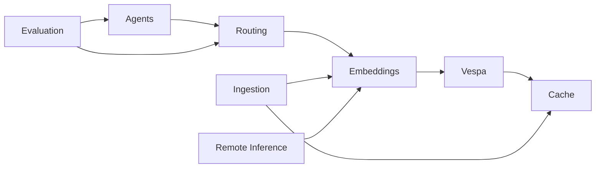

# Module Documentation

Detailed technical documentation for each Cogniverse module and component.

## Core Modules

### 🤖 [Agents](agents/README.md)
Complete documentation of the multi-agent system including:
- Agent base classes and protocols
- A2A (Agent-to-Agent) communication
- Specialized agent implementations
- Memory and routing mixins
- DSPy optimization integration

### 📥 [Ingestion Pipeline](ingestion/README.md)
Video and content processing pipeline:
- Multi-modal content ingestion
- Frame extraction and keyframe detection
- Audio transcription with timestamps
- Batch processing capabilities

### 🧠 [Routing System](routing/README.md)
Intelligent query routing with optimization:
- Multi-tier routing (FAST, BALANCED, COMPREHENSIVE)
- GEPA experience-guided optimization
- DSPy optimizer integration
- Routing performance metrics

### 🎯 [Embedding Generator](ingestion/embeddings/README.md)
Multi-modal embedding generation:
- ColPali frame-level embeddings
- VideoPrism global video embeddings
- ColQwen multi-modal embeddings
- Batch processing and caching

### 🌐 [Remote Inference](ingestion/embeddings/remote-inference.md)
Distributed inference capabilities:
- Modal deployment for GPU acceleration
- API-based inference endpoints
- Load balancing and scaling

## Backend Systems

### 🔍 [Vespa Backend](backends/vespa.md)
Vector database and search backend:
- 9 ranking strategies
- Multi-tenant schema management
- Binary and float embedding support
- Hybrid search capabilities

### 💾 [Cache System](cache/README.md)
Multi-tier caching architecture:
- Hot (Redis), Warm (Local), Cold (S3/GCS) tiers
- Cache invalidation strategies
- Performance optimization

### 📐 [Cache Design](cache/design.md)
Detailed cache architecture and design decisions:
- Tiered storage strategy
- Cache key structure
- Eviction policies
- Multi-tenant considerations

## Quality & Testing

### 🧪 [Evaluation Framework](evaluation/README.md)
Comprehensive evaluation system:
- Phoenix experiment integration
- Reference-free quality metrics
- Visual LLM judges
- A/B testing framework

## Module Integration

## Development Guidelines

When working with modules:

1. **Follow the established patterns** - Each module has consistent structure
2. **Update module README** - Keep documentation in sync with code
3. **Test integrations** - Modules interact, test the connections
4. **Use type hints** - All modules use Python type hints
5. **Add telemetry** - Phoenix spans for observability

## Quick Links

- [Agent Development Guide](agents/README.md#development-guide)
- [Adding New Embeddings](ingestion/embeddings/README.md#adding-new-models)
- [Vespa Schema Management](backends/vespa.md#schema-management)
- [Cache Configuration](cache/README.md#configuration)
- [Evaluation Metrics](evaluation/README.md#metrics)