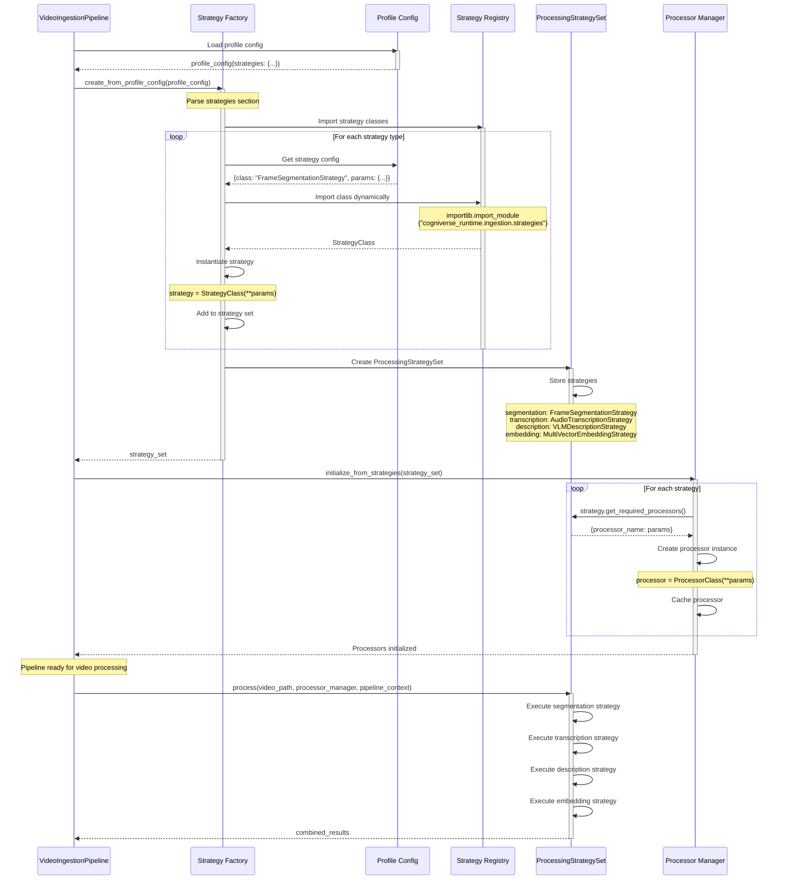
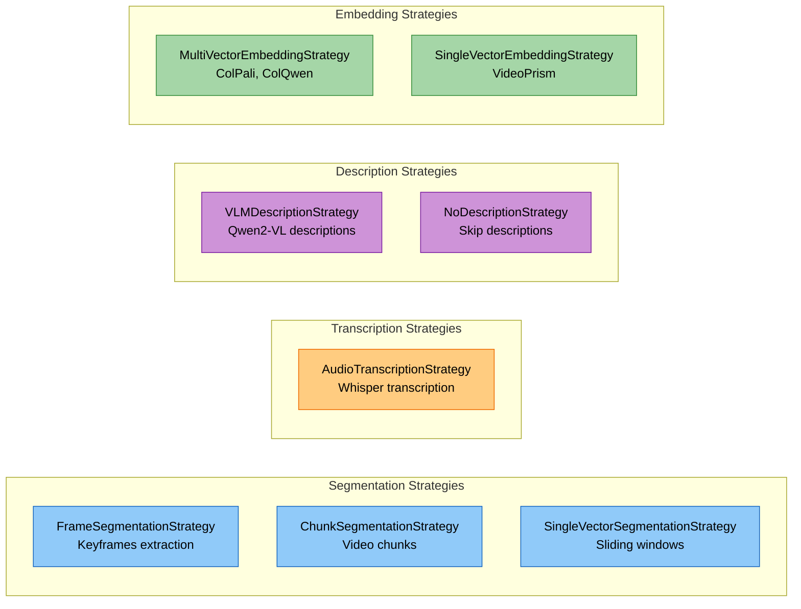
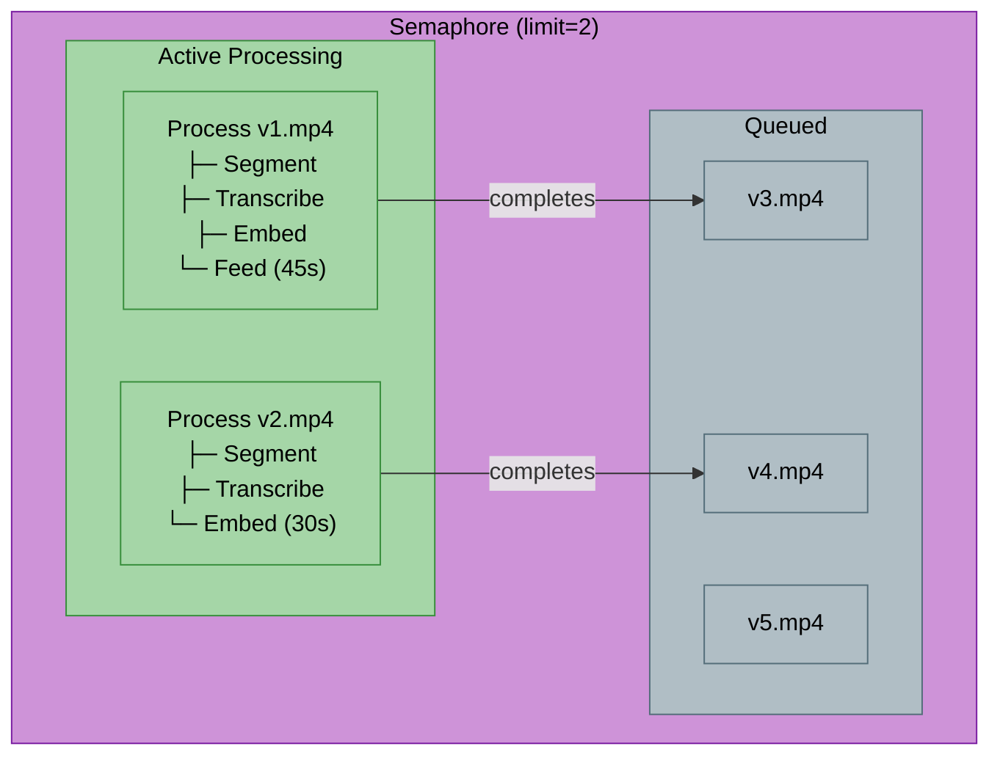

# Cogniverse Ingestion Module Study Guide

**Package:** `cogniverse_runtime` (Application Layer)
**Module Location:** `libs/runtime/cogniverse_runtime/ingestion/`
**Purpose**: Configurable video processing pipeline for multi-modal content extraction and indexing

---

## Package Structure

```text
libs/runtime/cogniverse_runtime/ingestion/
├── __init__.py                    # Package initialization
├── pipeline.py                    # Main VideoIngestionPipeline orchestrator
├── pipeline_builder.py            # Pipeline construction utilities
├── strategy_factory.py            # Creates strategy sets from config
├── strategy.py                    # Strategy base classes and interfaces
├── strategies.py                  # Strategy implementations (Frame, Chunk, SingleVector, etc.)
├── processing_strategy_set.py     # Strategy container with execution flow
├── processor_manager.py           # Manages processor instances
├── processor_base.py              # Base classes for processors and strategies
├── exceptions.py                  # Pipeline-specific exceptions
└── processors/
    ├── keyframe_processor.py      # Histogram-based keyframe extraction
    ├── keyframe_extractor.py      # Keyframe extraction algorithms
    ├── keyframe_extractor_fps.py  # FPS-based keyframe extraction
    ├── chunk_processor.py         # FFmpeg-based chunk extraction
    ├── video_chunk_extractor.py   # Video chunk extraction utilities
    ├── audio_processor.py         # Whisper transcription
    ├── audio_transcriber.py       # Audio transcription core logic
    ├── audio_embedding_generator.py # Audio embedding generation
    ├── vlm_processor.py           # VLM description generation
    ├── vlm_descriptor.py          # VLM description core logic
    ├── single_vector_processor.py # Sliding window segment processing
    ├── embedding_processor.py     # Generic embedding processor
    └── embedding_generator/
        ├── embedding_generator.py      # Base classes and interfaces
        ├── embedding_generator_impl.py # Backend-agnostic embedding implementation
        ├── embedding_generator_factory.py # Factory for creating generators
        ├── embedding_processors.py     # Model inference (ColPali, VideoPrism, ColQwen)
        ├── document_builders.py        # Vespa document construction
        └── backend_factory.py          # Backend client creation
```

---

## Table of Contents
1. [Module Overview](#module-overview)
2. [Architecture](#architecture)
3. [Core Components](#core-components)
4. [Processing Strategies](#processing-strategies)
5. [Processors](#processors)
6. [Data Flow](#data-flow)
7. [Usage Examples](#usage-examples)
8. [Production Considerations](#production-considerations)
9. [Testing](#testing)

---

## Module Overview

### Purpose and Responsibilities

The Ingestion Module transforms raw video files into searchable, multi-modal representations through a **strategy-based** processing pipeline. It orchestrates:

1. **Video Segmentation** - Extract frames, chunks, or sliding windows
2. **Audio Transcription** - Whisper-based speech-to-text
3. **Visual Description** - VLM-based frame descriptions
4. **Embedding Generation** - ColPali, VideoPrism, ColQwen embeddings
5. **Backend Ingestion** - Feed documents to Vespa search

### Key Features

- **Strategy Pattern**: Pluggable processors configured via YAML profiles
- **Async Processing**: Concurrent video processing with configurable parallelism
- **Multi-Modal Support**: Text, video, image embeddings
- **Caching**: Per-profile artifact caching for keyframes, transcripts, descriptions
- **Profile-Based**: Different strategies for different embedding models
- **Format Conversion**: Binary (int8) vs Float (bfloat16) embeddings

---

## Architecture

### 1. Ingestion Pipeline Architecture

```mermaid
flowchart TB
    Start["<span style='color:#000'>Video Input</span>"] --> Entry["<span style='color:#000'>VideoIngestionPipeline</span>"]

    Entry --> ConfigRes["<span style='color:#000'>Configuration Resolution</span>"]
    ConfigRes --> LoadProfile["<span style='color:#000'>Load Profile Config</span>"]
    LoadProfile --> CreateStrategySet["<span style='color:#000'>Strategy Factory Creates ProcessingStrategySet</span>"]
    CreateStrategySet --> InitProc["<span style='color:#000'>Processor Manager Initializes Required Processors</span>"]

    InitProc --> AsyncProc["<span style='color:#000'>Async Video Processing</span>"]
    AsyncProc --> ConcurrentCache["<span style='color:#000'>Concurrent Cache Checks</span>"]

    ConcurrentCache --> CheckKeyframes{"<span style='color:#000'>Check Keyframes Cache</span>"}
    ConcurrentCache --> CheckTranscript{"<span style='color:#000'>Check Transcript Cache</span>"}
    ConcurrentCache --> CheckDesc{"<span style='color:#000'>Check Descriptions Cache</span>"}

    CheckKeyframes -->|Cache Hit| LoadCachedKF["<span style='color:#000'>Load Cached Keyframes</span>"]
    CheckKeyframes -->|Cache Miss| ProcessKF["<span style='color:#000'>Process Keyframes</span>"]

    CheckTranscript -->|Cache Hit| LoadCachedTrans["<span style='color:#000'>Load Cached Transcript</span>"]
    CheckTranscript -->|Cache Miss| ProcessTrans["<span style='color:#000'>Process Transcript</span>"]

    CheckDesc -->|Cache Hit| LoadCachedDesc["<span style='color:#000'>Load Cached Descriptions</span>"]
    CheckDesc -->|Cache Miss| ProcessDesc["<span style='color:#000'>Process Descriptions</span>"]

    LoadCachedKF --> StrategyExec["<span style='color:#000'>Strategy Orchestration</span>"]
    ProcessKF --> StrategyExec
    LoadCachedTrans --> StrategyExec
    ProcessTrans --> StrategyExec
    LoadCachedDesc --> StrategyExec
    ProcessDesc --> StrategyExec

    StrategyExec --> Sequential["<span style='color:#000'>Sequential Strategy Execution</span>"]

    Sequential --> Segment["<span style='color:#000'>1. Segmentation Strategy</span>"]
    Segment --> SegmentType{"<span style='color:#000'>Segmentation Type</span>"}
    SegmentType -->|Frame-Based| ExtractFrames["<span style='color:#000'>Extract Keyframes</span>"]
    SegmentType -->|Chunk-Based| ExtractChunks["<span style='color:#000'>Extract Video Chunks</span>"]
    SegmentType -->|Single-Vector| ExtractSegments["<span style='color:#000'>Extract Sliding Window Segments</span>"]

    ExtractFrames --> Transcribe["<span style='color:#000'>2. Transcription Strategy</span>"]
    ExtractChunks --> Transcribe
    ExtractSegments --> Transcribe

    Transcribe --> TranscribeAudio["<span style='color:#000'>Whisper Audio Transcription</span>"]
    TranscribeAudio --> Describe["<span style='color:#000'>3. Description Strategy</span>"]

    Describe --> DescType{"<span style='color:#000'>Description Type</span>"}
    DescType -->|VLM Description| GenerateDesc["<span style='color:#000'>Generate VLM Descriptions</span>"]
    DescType -->|No Description| SkipDesc["<span style='color:#000'>Skip Descriptions</span>"]

    GenerateDesc --> Embed["<span style='color:#000'>4. Embedding Strategy</span>"]
    SkipDesc --> Embed

    Embed --> EmbedGen["<span style='color:#000'>Embedding Generation & Backend Ingestion</span>"]

    EmbedGen --> ModelInference["<span style='color:#000'>Model Inference</span>"]
    ModelInference --> ModelType{"<span style='color:#000'>Embedding Model</span>"}
    ModelType -->|ColPali| ColPaliInfer["<span style='color:#000'>ColPali Multi-Vector</span>"]
    ModelType -->|VideoPrism| VideoPrismInfer["<span style='color:#000'>VideoPrism Single-Vector</span>"]
    ModelType -->|ColQwen| ColQwenInfer["<span style='color:#000'>ColQwen Multi-Vector</span>"]

    ColPaliInfer --> DocBuild["<span style='color:#000'>Document Building</span>"]
    VideoPrismInfer --> DocBuild
    ColQwenInfer --> DocBuild

    DocBuild --> StrategyAware["<span style='color:#000'>Strategy-Aware Document Construction</span>"]
    StrategyAware --> FormatConvert["<span style='color:#000'>Format Conversion Binary/Float</span>"]

    FormatConvert --> BackendFeed["<span style='color:#000'>Backend Feeding</span>"]
    BackendFeed --> FeedType{"<span style='color:#000'>Feed Type</span>"}
    FeedType -->|Per-Document| SingleFeed["<span style='color:#000'>Single Document Upload</span>"]
    FeedType -->|Batch| BatchFeed["<span style='color:#000'>Batch Upload feed_iterable</span>"]

    SingleFeed --> Results["<span style='color:#000'>Pipeline Results</span>"]
    BatchFeed --> Results

    Results --> Metadata["<span style='color:#000'>Video Metadata ID, duration, path</span>"]
    Results --> ProcessingRes["<span style='color:#000'>Processing Results keyframes, chunks, segments, transcript</span>"]
    Results --> EmbedStats["<span style='color:#000'>Embedding Stats documents processed, fed</span>"]
    Results --> Timing["<span style='color:#000'>Timing Metrics per-stage timing</span>"]

    style Start fill:#90caf9,stroke:#1565c0,color:#000
    style Entry fill:#ffcc80,stroke:#ef6c00,color:#000
    style ConfigRes fill:#ffcc80,stroke:#ef6c00,color:#000
    style LoadProfile fill:#b0bec5,stroke:#546e7a,color:#000
    style CreateStrategySet fill:#ffcc80,stroke:#ef6c00,color:#000
    style InitProc fill:#ffcc80,stroke:#ef6c00,color:#000
    style AsyncProc fill:#ffcc80,stroke:#ef6c00,color:#000
    style ConcurrentCache fill:#b0bec5,stroke:#546e7a,color:#000
    style CheckKeyframes fill:#b0bec5,stroke:#546e7a,color:#000
    style CheckTranscript fill:#b0bec5,stroke:#546e7a,color:#000
    style CheckDesc fill:#b0bec5,stroke:#546e7a,color:#000
    style LoadCachedKF fill:#a5d6a7,stroke:#388e3c,color:#000
    style ProcessKF fill:#ffcc80,stroke:#ef6c00,color:#000
    style LoadCachedTrans fill:#a5d6a7,stroke:#388e3c,color:#000
    style ProcessTrans fill:#ffcc80,stroke:#ef6c00,color:#000
    style LoadCachedDesc fill:#a5d6a7,stroke:#388e3c,color:#000
    style ProcessDesc fill:#ffcc80,stroke:#ef6c00,color:#000
    style StrategyExec fill:#ffcc80,stroke:#ef6c00,color:#000
    style Sequential fill:#ffcc80,stroke:#ef6c00,color:#000
    style Segment fill:#ce93d8,stroke:#7b1fa2,color:#000
    style SegmentType fill:#b0bec5,stroke:#546e7a,color:#000
    style ExtractFrames fill:#ce93d8,stroke:#7b1fa2,color:#000
    style ExtractChunks fill:#ce93d8,stroke:#7b1fa2,color:#000
    style ExtractSegments fill:#ce93d8,stroke:#7b1fa2,color:#000
    style Transcribe fill:#ce93d8,stroke:#7b1fa2,color:#000
    style TranscribeAudio fill:#ce93d8,stroke:#7b1fa2,color:#000
    style Describe fill:#ce93d8,stroke:#7b1fa2,color:#000
    style DescType fill:#b0bec5,stroke:#546e7a,color:#000
    style GenerateDesc fill:#ce93d8,stroke:#7b1fa2,color:#000
    style SkipDesc fill:#b0bec5,stroke:#546e7a,color:#000
    style Embed fill:#ce93d8,stroke:#7b1fa2,color:#000
    style EmbedGen fill:#ffcc80,stroke:#ef6c00,color:#000
    style ModelInference fill:#ffcc80,stroke:#ef6c00,color:#000
    style ModelType fill:#b0bec5,stroke:#546e7a,color:#000
    style ColPaliInfer fill:#ce93d8,stroke:#7b1fa2,color:#000
    style VideoPrismInfer fill:#ce93d8,stroke:#7b1fa2,color:#000
    style ColQwenInfer fill:#ce93d8,stroke:#7b1fa2,color:#000
    style DocBuild fill:#ffcc80,stroke:#ef6c00,color:#000
    style StrategyAware fill:#ffcc80,stroke:#ef6c00,color:#000
    style FormatConvert fill:#ffcc80,stroke:#ef6c00,color:#000
    style BackendFeed fill:#ffcc80,stroke:#ef6c00,color:#000
    style FeedType fill:#b0bec5,stroke:#546e7a,color:#000
    style SingleFeed fill:#a5d6a7,stroke:#388e3c,color:#000
    style BatchFeed fill:#a5d6a7,stroke:#388e3c,color:#000
    style Results fill:#a5d6a7,stroke:#388e3c,color:#000
    style Metadata fill:#b0bec5,stroke:#546e7a,color:#000
    style ProcessingRes fill:#b0bec5,stroke:#546e7a,color:#000
    style EmbedStats fill:#b0bec5,stroke:#546e7a,color:#000
    style Timing fill:#b0bec5,stroke:#546e7a,color:#000
```



### 2. Strategy Resolution Flow



**Strategy Types Available:**



### 3. Embedding Generation Flow

```mermaid
sequenceDiagram
    participant Strategy as Embedding Strategy
    participant Generator as EmbeddingGenerator
    participant Processor as Embedding Processor
    participant Model as Embedding Model
    participant Builder as Document Builder
    participant Backend as Vespa Backend

    Strategy->>Generator: generate_embeddings(video_data, output_dir)
    activate Generator

    Generator->>Generator: Determine processing type
    Note over Generator: processing_type = video_data["processing_type"]<br/>"frame_based" | "video_chunks" | "direct_video" | "single_vector"

    alt Frame-Based Processing (ColPali)
        Generator->>Processor: _generate_frame_based_embeddings()
        activate Processor

        Processor->>Processor: Load keyframe images
        Note over Processor: images = [PIL.Image.open(kf["path"]) for kf in keyframes]

        Processor->>Model: Encode images in batches
        activate Model
        loop For each batch
            Model->>Model: process_images(batch)
            Model->>Model: Generate embeddings
            Note over Model: embeddings.shape = [batch_size, 128, 128]
        end
        Model-->>Processor: frame_embeddings[]
        deactivate Model

        Processor->>Builder: build_frame_documents()
        activate Builder
        loop For each frame
            Builder->>Builder: Create document
            Note over Builder: doc = {<br/>  video_id: str,<br/>  frame_number: int,<br/>  timestamp: float,<br/>  embeddings: hex_encoded<br/>}
        end
        Builder-->>Processor: documents[]
        deactivate Builder

        Processor-->>Generator: {documents: [], metadata: {}}
        deactivate Processor

    else Video Chunks Processing (ColQwen)
        Generator->>Processor: _generate_video_chunks_embeddings()
        activate Processor

        Processor->>Processor: Load chunk videos
        Note over Processor: chunks = video_data["video_chunks"]["chunks"]

        Processor->>Model: Encode video chunks
        activate Model
        loop For each chunk
            Model->>Model: process_video(chunk_path)
            Model->>Model: Generate embeddings
            Note over Model: embeddings.shape = [num_patches, embed_dim]
        end
        Model-->>Processor: chunk_embeddings[]
        deactivate Model

        Processor->>Builder: build_chunk_documents()
        activate Builder
        loop For each chunk
            Builder->>Builder: Create document
            Note over Builder: doc = {<br/>  video_id: str,<br/>  chunk_number: int,<br/>  start_time: float,<br/>  end_time: float,<br/>  embeddings: hex_encoded<br/>}
        end
        Builder-->>Processor: documents[]
        deactivate Builder

        Processor-->>Generator: {documents: [], metadata: {}}
        deactivate Processor

    else Direct Video Processing (VideoPrism)
        Generator->>Processor: _generate_direct_video_embeddings()
        activate Processor

        Processor->>Processor: Load full video
        Note over Processor: video_path = video_data["video_path"]

        Processor->>Model: Encode full video
        activate Model
        Model->>Model: process_full_video(video_path)
        Model->>Model: Generate global embedding
        Note over Model: embedding.shape = [768] (base)<br/>or [1024] (large)
        Model-->>Processor: video_embedding
        deactivate Model

        Processor->>Builder: build_video_document()
        activate Builder
        Builder->>Builder: Create single document
        Note over Builder: doc = {<br/>  video_id: str,<br/>  duration: float,<br/>  embedding: float_array<br/>}
        Builder-->>Processor: document
        deactivate Builder

        Processor-->>Generator: {documents: [doc], metadata: {}}
        deactivate Processor

    else Single-Vector Segments (VideoPrism LVT)
        Generator->>Processor: _generate_single_vector_embeddings()
        activate Processor

        Processor->>Processor: Load segment data
        Note over Processor: segments = video_data["single_vector_processing"]["segments"]

        Processor->>Model: Encode segments
        activate Model
        loop For each segment
            Model->>Model: Extract frames from segment
            Model->>Model: process_segment_frames(frames)
            Model->>Model: Generate segment embedding
            Note over Model: embedding.shape = [768] (base) or [1024] (large)
        end
        Model-->>Processor: segment_embeddings[]
        deactivate Model

        Processor->>Builder: build_segment_documents()
        activate Builder
        loop For each segment
            Builder->>Builder: Create document
            Note over Builder: doc = {<br/>  video_id: str,<br/>  segment_id: int,<br/>  start_time: float,<br/>  end_time: float,<br/>  text: str,<br/>  embedding: float_array<br/>}
        end
        Builder-->>Processor: documents[]
        deactivate Builder

        Processor-->>Generator: {documents: [], metadata: {}}
        deactivate Processor
    end

    Generator->>Backend: Feed documents to Vespa
    activate Backend

    alt Batch Upload
        Backend->>Backend: feed_iterable(documents, batch_size=50)
        loop For each batch
            Backend->>Backend: POST batch to Vespa
            Backend->>Backend: Track success/failure
        end
    else Single Document Upload
        loop For each document
            Backend->>Backend: POST document to Vespa
            Backend->>Backend: Track success/failure
        end
    end

    Backend-->>Generator: Feed results
    deactivate Backend

    Generator->>Generator: Compile EmbeddingResult
    Note over Generator: result = {<br/>  video_id: str,<br/>  total_documents: int,<br/>  documents_processed: int,<br/>  documents_fed: int,<br/>  processing_time: float,<br/>  errors: [],<br/>  metadata: {}<br/>}

    Generator-->>Strategy: EmbeddingResult
    deactivate Generator
```



**Embedding Processing Types:**

- **Frame-Based**: ColPali multi-vector per frame (128×128 patches)
- **Video Chunks**: ColQwen multi-vector per chunk
- **Direct Video**: VideoPrism single global embedding
- **Single-Vector Segments**: VideoPrism LVT per segment

---

### 4. Vespa Upload Pipeline

```mermaid
flowchart TB
    Start["<span style='color:#000'>Documents Ready for Upload</span>"] --> Builder["<span style='color:#000'>Document Builder</span>"]

    Builder --> DocType{"<span style='color:#000'>Document Type</span>"}

    DocType -->|Frame Documents| FrameDoc["<span style='color:#000'>Build Frame Documents</span>"]
    DocType -->|Chunk Documents| ChunkDoc["<span style='color:#000'>Build Chunk Documents</span>"]
    DocType -->|Video Documents| VideoDoc["<span style='color:#000'>Build Video Documents</span>"]
    DocType -->|Segment Documents| SegmentDoc["<span style='color:#000'>Build Segment Documents</span>"]

    FrameDoc --> FrameFields["<span style='color:#000'>Frame Document Fields</span>"]
    FrameFields --> FVideoID["<span style='color:#000'>video_id: str</span>"]
    FrameFields --> FFrameNum["<span style='color:#000'>frame_number: int</span>"]
    FrameFields --> FTimestamp["<span style='color:#000'>timestamp: float</span>"]
    FrameFields --> FPath["<span style='color:#000'>frame_path: str</span>"]
    FrameFields --> FEmbed["<span style='color:#000'>embeddings: binary/float</span>"]

    ChunkDoc --> ChunkFields["<span style='color:#000'>Chunk Document Fields</span>"]
    ChunkFields --> CVideoID["<span style='color:#000'>video_id: str</span>"]
    ChunkFields --> CChunkNum["<span style='color:#000'>chunk_number: int</span>"]
    ChunkFields --> CStart["<span style='color:#000'>start_time: float</span>"]
    ChunkFields --> CEnd["<span style='color:#000'>end_time: float</span>"]
    ChunkFields --> CPath["<span style='color:#000'>chunk_path: str</span>"]
    ChunkFields --> CEmbed["<span style='color:#000'>embeddings: binary/float</span>"]

    VideoDoc --> VideoFields["<span style='color:#000'>Video Document Fields</span>"]
    VideoFields --> VVideoID["<span style='color:#000'>video_id: str</span>"]
    VideoFields --> VDuration["<span style='color:#000'>duration: float</span>"]
    VideoFields --> VPath["<span style='color:#000'>video_path: str</span>"]
    VideoFields --> VEmbed["<span style='color:#000'>embedding: float array</span>"]

    SegmentDoc --> SegmentFields["<span style='color:#000'>Segment Document Fields</span>"]
    SegmentFields --> SVideoID["<span style='color:#000'>video_id: str</span>"]
    SegmentFields --> SSegmentID["<span style='color:#000'>segment_id: int</span>"]
    SegmentFields --> SStart["<span style='color:#000'>start_time: float</span>"]
    SegmentFields --> SEnd["<span style='color:#000'>end_time: float</span>"]
    SegmentFields --> SText["<span style='color:#000'>text: str transcript</span>"]
    SegmentFields --> SEmbed["<span style='color:#000'>embedding: float array</span>"]

    FVideoID --> FormatConv["<span style='color:#000'>Format Conversion</span>"]
    FFrameNum --> FormatConv
    FTimestamp --> FormatConv
    FPath --> FormatConv
    FEmbed --> FormatConv

    CVideoID --> FormatConv
    CChunkNum --> FormatConv
    CStart --> FormatConv
    CEnd --> FormatConv
    CPath --> FormatConv
    CEmbed --> FormatConv

    VVideoID --> FormatConv
    VDuration --> FormatConv
    VPath --> FormatConv
    VEmbed --> FormatConv

    SVideoID --> FormatConv
    SSegmentID --> FormatConv
    SStart --> FormatConv
    SEnd --> FormatConv
    SText --> FormatConv
    SEmbed --> FormatConv

    FormatConv --> ConvType{"<span style='color:#000'>Embedding Format</span>"}
    ConvType -->|Binary| BinaryConv["<span style='color:#000'>Binary Conversion int8</span>"]
    ConvType -->|Float| FloatConv["<span style='color:#000'>Float Conversion bfloat16</span>"]

    BinaryConv --> HexEncode["<span style='color:#000'>Hex Encoding for Binary</span>"]
    FloatConv --> FloatArray["<span style='color:#000'>Float Array for Float</span>"]

    HexEncode --> Validate["<span style='color:#000'>Validate Documents</span>"]
    FloatArray --> Validate

    Validate --> CheckSchema["<span style='color:#000'>Check Vespa Schema Match</span>"]
    CheckSchema --> CheckDims{"<span style='color:#000'>Embedding Dimensions Match?</span>"}

    CheckDims -->|Yes| BatchPrep["<span style='color:#000'>Batch Preparation</span>"]
    CheckDims -->|No| Error["<span style='color:#000'>Throw Dimension Mismatch Error</span>"]

    BatchPrep --> BatchSize["<span style='color:#000'>Determine Batch Size</span>"]
    BatchSize --> CreateBatches["<span style='color:#000'>Create Document Batches batch_size=50</span>"]

    CreateBatches --> Upload["<span style='color:#000'>Bulk Upload to Vespa</span>"]

    Upload --> VespaClient["<span style='color:#000'>Vespa PyClient</span>"]
    VespaClient --> FeedIterable["<span style='color:#000'>feed_iterable documents, batch_size</span>"]

    FeedIterable --> UploadLoop["<span style='color:#000'>Upload Loop</span>"]

    UploadLoop --> Batch1{"<span style='color:#000'>Batch 1</span>"}
    Batch1 -->|POST| VespaAPI1["<span style='color:#000'>Vespa HTTP API</span>"]
    VespaAPI1 --> Result1{"<span style='color:#000'>Success?</span>"}
    Result1 -->|Yes| TrackSuccess1["<span style='color:#000'>Track Success Count</span>"]
    Result1 -->|No| TrackError1["<span style='color:#000'>Track Error Details</span>"]

    TrackSuccess1 --> Batch2{"<span style='color:#000'>Batch 2</span>"}
    TrackError1 --> Batch2

    Batch2 -->|POST| VespaAPI2["<span style='color:#000'>Vespa HTTP API</span>"]
    VespaAPI2 --> Result2{"<span style='color:#000'>Success?</span>"}
    Result2 -->|Yes| TrackSuccess2["<span style='color:#000'>Track Success Count</span>"]
    Result2 -->|No| TrackError2["<span style='color:#000'>Track Error Details</span>"]

    TrackSuccess2 --> MoreBatches{"<span style='color:#000'>More Batches?</span>"}
    TrackError2 --> MoreBatches

    MoreBatches -->|Yes| UploadLoop
    MoreBatches -->|No| Verify["<span style='color:#000'>Verify Upload</span>"]

    Verify --> CheckCounts["<span style='color:#000'>Check Document Counts</span>"]
    CheckCounts --> CountMatch{"<span style='color:#000'>documents_fed == total_documents?</span>"}

    CountMatch -->|Yes| Success["<span style='color:#000'>Upload Success</span>"]
    CountMatch -->|No| PartialSuccess["<span style='color:#000'>Partial Upload - Log Errors</span>"]

    Success --> Complete["<span style='color:#000'>Upload Complete</span>"]
    PartialSuccess --> Complete

    style Start fill:#90caf9,stroke:#1565c0,color:#000
    style Builder fill:#ffcc80,stroke:#ef6c00,color:#000
    style DocType fill:#b0bec5,stroke:#546e7a,color:#000
    style FrameDoc fill:#ce93d8,stroke:#7b1fa2,color:#000
    style ChunkDoc fill:#ce93d8,stroke:#7b1fa2,color:#000
    style VideoDoc fill:#ce93d8,stroke:#7b1fa2,color:#000
    style SegmentDoc fill:#ce93d8,stroke:#7b1fa2,color:#000
    style FrameFields fill:#b0bec5,stroke:#546e7a,color:#000
    style ChunkFields fill:#b0bec5,stroke:#546e7a,color:#000
    style VideoFields fill:#b0bec5,stroke:#546e7a,color:#000
    style SegmentFields fill:#b0bec5,stroke:#546e7a,color:#000
    style FVideoID fill:#b0bec5,stroke:#546e7a,color:#000
    style FFrameNum fill:#b0bec5,stroke:#546e7a,color:#000
    style FTimestamp fill:#b0bec5,stroke:#546e7a,color:#000
    style FPath fill:#b0bec5,stroke:#546e7a,color:#000
    style FEmbed fill:#b0bec5,stroke:#546e7a,color:#000
    style CVideoID fill:#b0bec5,stroke:#546e7a,color:#000
    style CChunkNum fill:#b0bec5,stroke:#546e7a,color:#000
    style CStart fill:#b0bec5,stroke:#546e7a,color:#000
    style CEnd fill:#b0bec5,stroke:#546e7a,color:#000
    style CPath fill:#b0bec5,stroke:#546e7a,color:#000
    style CEmbed fill:#b0bec5,stroke:#546e7a,color:#000
    style VVideoID fill:#b0bec5,stroke:#546e7a,color:#000
    style VDuration fill:#b0bec5,stroke:#546e7a,color:#000
    style VPath fill:#b0bec5,stroke:#546e7a,color:#000
    style VEmbed fill:#b0bec5,stroke:#546e7a,color:#000
    style SVideoID fill:#b0bec5,stroke:#546e7a,color:#000
    style SSegmentID fill:#b0bec5,stroke:#546e7a,color:#000
    style SStart fill:#b0bec5,stroke:#546e7a,color:#000
    style SEnd fill:#b0bec5,stroke:#546e7a,color:#000
    style SText fill:#b0bec5,stroke:#546e7a,color:#000
    style SEmbed fill:#b0bec5,stroke:#546e7a,color:#000
    style FormatConv fill:#ffcc80,stroke:#ef6c00,color:#000
    style ConvType fill:#b0bec5,stroke:#546e7a,color:#000
    style BinaryConv fill:#ffcc80,stroke:#ef6c00,color:#000
    style FloatConv fill:#ffcc80,stroke:#ef6c00,color:#000
    style HexEncode fill:#ffcc80,stroke:#ef6c00,color:#000
    style FloatArray fill:#ffcc80,stroke:#ef6c00,color:#000
    style Validate fill:#ffcc80,stroke:#ef6c00,color:#000
    style CheckSchema fill:#ffcc80,stroke:#ef6c00,color:#000
    style CheckDims fill:#b0bec5,stroke:#546e7a,color:#000
    style BatchPrep fill:#ffcc80,stroke:#ef6c00,color:#000
    style BatchSize fill:#b0bec5,stroke:#546e7a,color:#000
    style CreateBatches fill:#ffcc80,stroke:#ef6c00,color:#000
    style Upload fill:#ce93d8,stroke:#7b1fa2,color:#000
    style VespaClient fill:#ce93d8,stroke:#7b1fa2,color:#000
    style FeedIterable fill:#ce93d8,stroke:#7b1fa2,color:#000
    style UploadLoop fill:#ffcc80,stroke:#ef6c00,color:#000
    style Batch1 fill:#b0bec5,stroke:#546e7a,color:#000
    style VespaAPI1 fill:#ce93d8,stroke:#7b1fa2,color:#000
    style Result1 fill:#b0bec5,stroke:#546e7a,color:#000
    style TrackSuccess1 fill:#a5d6a7,stroke:#388e3c,color:#000
    style TrackError1 fill:#e53935,stroke:#c62828,color:#fff
    style Batch2 fill:#b0bec5,stroke:#546e7a,color:#000
    style VespaAPI2 fill:#ce93d8,stroke:#7b1fa2,color:#000
    style Result2 fill:#b0bec5,stroke:#546e7a,color:#000
    style TrackSuccess2 fill:#a5d6a7,stroke:#388e3c,color:#000
    style TrackError2 fill:#e53935,stroke:#c62828,color:#fff
    style MoreBatches fill:#b0bec5,stroke:#546e7a,color:#000
    style Verify fill:#ffcc80,stroke:#ef6c00,color:#000
    style CheckCounts fill:#ffcc80,stroke:#ef6c00,color:#000
    style CountMatch fill:#b0bec5,stroke:#546e7a,color:#000
    style Success fill:#a5d6a7,stroke:#388e3c,color:#000
    style PartialSuccess fill:#ffcc80,stroke:#ef6c00,color:#000
    style Complete fill:#a5d6a7,stroke:#388e3c,color:#000
    style Error fill:#e53935,stroke:#c62828,color:#fff
```



**Vespa Upload Key Features:**

- **Batch Upload**: feed_iterable for efficient bulk ingestion
- **Format Conversion**: Binary (hex-encoded int8) vs Float (bfloat16)
- **Schema Validation**: Dimension checking before upload
- **Error Tracking**: Per-batch success/failure monitoring
- **Verification**: Document count validation post-upload

---

## Core Components

### 1. VideoIngestionPipeline

**Purpose**: Main orchestrator for video processing with async optimizations

**Constructor**:
```python
def __init__(
    self,
    tenant_id: str,  # REQUIRED - no default
    config: PipelineConfig | None = None,
    app_config: dict[str, Any] | None = None,
    config_manager=None,
    schema_loader=None,
    schema_name: str | None = None,
    debug_mode: bool = False,
    event_queue: Optional[EventQueue] = None,
)
```

**Parameters**:

- `tenant_id`: Tenant identifier (**REQUIRED** - raises ValueError if not provided)
- `config`: Pipeline configuration (steps, thresholds, paths)
- `app_config`: Global application config
- `config_manager`: ConfigManager instance (required if app_config not provided)
- `schema_loader`: SchemaLoader instance (optional, for backend operations)
- `schema_name`: Profile name (e.g., "video_colpali_smol500_mv_frame")
- `debug_mode`: Enable detailed logging
- `event_queue`: Optional EventQueue for real-time progress notifications

**Key Methods**:

#### `async process_video_async(video_path: Path) -> dict[str, Any]`

Process a single video through the entire pipeline.

```python
result = await pipeline.process_video_async(Path("video.mp4"))
# Returns:
# {
#   "video_id": "video",
#   "video_path": "/path/to/video.mp4",
#   "duration": 120.5,
#   "status": "completed",
#   "results": {
#     "keyframes": {...},     # or "chunks" or "single_vector_processing"
#     "transcript": {...},
#     "descriptions": {...},
#     "embeddings": {...}
#   },
#   "total_processing_time": 45.2
# }
```

#### `async process_videos_concurrent(video_files: list[Path], max_concurrent: int = 3) -> dict[str, Any]`

Process multiple videos concurrently with resource control.

```python
video_files = [Path("v1.mp4"), Path("v2.mp4"), Path("v3.mp4")]
results = await pipeline.process_videos_concurrent(video_files, max_concurrent=2)
# Process 2 videos at once, queue remaining
# Returns: {"job_id": str, "results": [list of per-video results]}
```

**Features**:

- AsyncIO-based concurrent processing
- Semaphore-controlled resource limits
- Progress tracking per video
- Graceful error handling per video

#### `def process_directory(video_dir: Path | None = None, max_concurrent: int = 3) -> dict[str, Any]`

Synchronous entry point for batch processing.

```python
results = pipeline.process_directory(
    video_dir=Path("videos/"),
    max_concurrent=3
)
# {
#   "total_videos": 10,
#   "processed_videos": [...],  # Successful
#   "failed_videos": [...],     # Failed
#   "total_processing_time": 300.5
# }
```

### 2. StrategyFactory

**Purpose**: Create strategy sets from explicit YAML configuration

**Key Method**:

#### `@classmethod create_from_profile_config(profile_config: dict[str, Any]) -> ProcessingStrategySet`

```python
profile_config = {
    "strategies": {
        "segmentation": {
            "class": "FrameSegmentationStrategy",
            "params": {"fps": 1.0, "threshold": 0.999}
        },
        "transcription": {
            "class": "AudioTranscriptionStrategy",
            "params": {"model": "whisper-large-v3"}
        },
        "description": {
            "class": "VLMDescriptionStrategy",
            "params": {"model_name": "Qwen/Qwen2-VL-2B-Instruct"}
        },
        "embedding": {
            "class": "MultiVectorEmbeddingStrategy",
            "params": {"model_name": "vidore/colsmol-500m"}
        }
    }
}

strategy_set = StrategyFactory.create_from_profile_config(profile_config)
```

**Design**:

- Uses dynamic imports (`importlib`) to instantiate strategy classes
- No hardcoded if/elif logic - fully config-driven
- All strategy classes must be in `cogniverse_runtime.ingestion.strategies`

### 3. ProcessingStrategySet

**Purpose**: Container for processing strategies with execution orchestration

**Constructor**:
```python
def __init__(self, **strategies)
```

Accepts any number of named strategies:
```python
strategy_set = ProcessingStrategySet(
    segmentation=FrameSegmentationStrategy(fps=1.0),
    transcription=AudioTranscriptionStrategy(),
    embedding=MultiVectorEmbeddingStrategy()
)
```

**Key Method**:

#### `async process(video_path: Path, processor_manager, pipeline_context) -> dict[str, Any]`

Execute all strategies in defined order.

```python
results = await strategy_set.process(
    video_path=Path("video.mp4"),
    processor_manager=proc_manager,
    pipeline_context=pipeline
)
# Returns combined results from all strategies
```

**Execution Order**:
1. **Segmentation** → Extract keyframes/chunks/segments
2. **Transcription** → Audio-to-text (if enabled)
3. **Description** → VLM descriptions (if enabled)
4. **Embedding** → Generate and feed embeddings (if enabled)

### 4. ProcessorManager (processor_manager.py)

**Purpose**: Manages processor lifecycle and provides instances to strategies

**Key Methods**:

#### `def initialize_from_strategies(strategy_set: ProcessingStrategySet)`

Scan strategy requirements and create processors.

```python
manager = ProcessorManager(logger)
manager.initialize_from_strategies(strategy_set)
# Internally calls strategy.get_required_processors() for each strategy
```

#### `def get_processor(processor_name: str) -> BaseProcessor`

Retrieve processor instance by name.

```python
keyframe_proc = manager.get_processor("keyframe")
audio_proc = manager.get_processor("audio")
```

**Supported Processors**:

- `keyframe`: KeyframeProcessor
- `chunk`: ChunkProcessor
- `audio`: AudioProcessor
- `vlm`: VLMProcessor
- `single_vector`: SingleVectorVideoProcessor

### 5. EmbeddingGenerator

**Purpose**: Backend-agnostic embedding generation and document feeding

**Constructor**:
```python
def __init__(
    self,
    config: dict[str, Any],
    logger: logging.Logger | None = None,
    profile_config: dict[str, Any] = None,
    backend_client: Any = None,
)
```

**Key Method**:

#### `def generate_embeddings(video_data: dict[str, Any], output_dir: Path) -> EmbeddingResult`

Generate embeddings based on processing type.

```python
generator = EmbeddingGenerator(
    config=app_config,
    profile_config=profile_config,
    backend_client=vespa_client
)

result = generator.generate_embeddings(
    video_data={
        "video_id": "video",
        "video_path": "/path/to/video.mp4",
        "processing_type": "frame_based",
        "keyframes": [...]  # Keyframe data
    },
    output_dir=Path("outputs/processing/")
)

# Returns EmbeddingResult:
# - video_id: str
# - total_documents: int
# - documents_processed: int
# - documents_fed: int
# - processing_time: float
# - errors: list[str]
# - metadata: dict
```

**Processing Methods Registry**:

- `_generate_frame_based_embeddings()` - For ColPali frame-by-frame
- `_generate_video_chunks_embeddings()` - For ColQwen chunks
- `_generate_direct_video_embeddings()` - For VideoPrism direct encoding
- `_generate_single_vector_embeddings()` - For pre-segmented data

---

## Processing Strategies

### 1. FrameSegmentationStrategy

**Purpose**: Extract individual frames from video

**Parameters**:

- `fps`: Frames per second (default 1.0)
- `threshold`: Histogram similarity threshold (default 0.999)
- `max_frames`: Maximum frames to extract (default 3000)

**Usage**:
```python
strategy = FrameSegmentationStrategy(fps=1.0, threshold=0.999, max_frames=3000)
requirements = strategy.get_required_processors()
# Returns: {"keyframe": {"fps": 1.0, "threshold": 0.999, "max_frames": 3000}}
```

**Best For**: ColPali multi-vector frame embeddings

### 2. ChunkSegmentationStrategy

**Purpose**: Extract video chunks for processing

**Parameters**:

- `chunk_duration`: Duration of each chunk in seconds (default 30.0)
- `chunk_overlap`: Overlap between chunks in seconds (default 0.0)
- `cache_chunks`: Cache extracted chunks (default True)

**Usage**:
```python
strategy = ChunkSegmentationStrategy(chunk_duration=30.0, chunk_overlap=0.0)
requirements = strategy.get_required_processors()
# Returns: {"chunk": {"chunk_duration": 30.0, "chunk_overlap": 0.0, "cache_chunks": True}}
```

**Best For**: ColQwen chunk-based video processing

### 3. SingleVectorSegmentationStrategy

**Purpose**: Process video with sliding windows for single-vector embeddings

**Parameters**:

- `strategy`: Segmentation strategy ("sliding_window", "uniform")
- `segment_duration`: Segment duration in seconds (default 6.0)
- `segment_overlap`: Overlap between segments in seconds (default 1.0)
- `sampling_fps`: FPS for frame sampling within segments (default 2.0)
- `max_frames_per_segment`: Max frames per segment (default 12)
- `store_as_single_doc`: Store all segments in one document (default False)

**Usage**:
```python
strategy = SingleVectorSegmentationStrategy(
    strategy="sliding_window",
    segment_duration=6.0,
    segment_overlap=1.0,
    sampling_fps=2.0,
    max_frames_per_segment=12
)
```

**Best For**: VideoPrism LVT single-vector embeddings

**Custom Method**:

#### `async segment(video_path: Path, pipeline_context: Any, transcript_data: dict | None) -> dict[str, Any]`

Directly processes video and returns segmented data:
```python
result = await strategy.segment(
    video_path=Path("video.mp4"),
    pipeline_context=pipeline,
    transcript_data=transcript
)
# Returns: {"single_vector_processing": {"segments": [...], "metadata": {...}}}
```

### 4. AudioTranscriptionStrategy

**Purpose**: Transcribe audio using Whisper

**Parameters**:

- `model`: Whisper model ("whisper-large-v3", "whisper-medium", etc.)
- `language`: Language code or "auto" for detection

**Usage**:
```python
strategy = AudioTranscriptionStrategy(model="whisper-large-v3", language="auto")
```

### 5. VLMDescriptionStrategy

**Purpose**: Generate descriptions using Vision-Language Models

**Parameters**:

- `model_name`: VLM model name (e.g., "Qwen/Qwen2-VL-2B-Instruct")
- `batch_size`: Batch size for description generation (default 10)

**Usage**:
```python
strategy = VLMDescriptionStrategy(
    model_name="Qwen/Qwen2-VL-2B-Instruct",
    batch_size=10
)
```

### 6. MultiVectorEmbeddingStrategy

**Purpose**: Generate multi-vector embeddings (frame-by-frame)

**Parameters**:

- `model_name`: Embedding model (e.g., "vidore/colsmol-500m")

**Usage**:
```python
strategy = MultiVectorEmbeddingStrategy(model_name="vidore/colsmol-500m")
```

**Custom Method**:

#### `async generate_embeddings_with_processor(results: dict, pipeline_context, processor_manager) -> dict`

Generate embeddings using pipeline context:
```python
embeddings = await strategy.generate_embeddings_with_processor(
    results={"keyframes": [...]},
    pipeline_context=pipeline,
    processor_manager=manager
)
```

### 7. SingleVectorEmbeddingStrategy

**Purpose**: Generate single-vector embeddings (one per segment)

**Parameters**:

- `model_name`: Embedding model (e.g., "google/videoprism-base")

**Usage**:
```python
strategy = SingleVectorEmbeddingStrategy(model_name="google/videoprism-lvt-base")
```

---

## Processors

### 1. KeyframeProcessor

**Purpose**: Extract representative keyframes using histogram comparison

**Methods**:

#### `def extract_keyframes(video_path: Path, output_dir: Path = None) -> dict[str, Any]`

Extract keyframes using histogram or FPS method.

```python
processor = KeyframeProcessor(logger, threshold=0.999, max_frames=3000, fps=1.0)
result = processor.extract_keyframes(
    video_path=Path("video.mp4"),
    output_dir=Path("outputs/")
)
# Returns:
# {
#   "keyframes": [
#     {"frame_number": 0, "timestamp": 0.0, "filename": "...", "path": "..."},
#     {"frame_number": 30, "timestamp": 1.0, "filename": "...", "path": "..."}
#   ],
#   "metadata": {...},
#   "keyframes_dir": "/path/to/keyframes/",
#   "video_id": "video"
# }
```

**Extraction Modes**:

- **FPS Mode**: Extract at regular intervals (e.g., 1 frame per second)
- **Histogram Mode**: Extract when scene changes (correlation < threshold)

**Output**:

- Saved keyframes: `{output_dir}/keyframes/{video_id}/{video_id}_keyframe_0000.jpg`
- Metadata JSON: `{output_dir}/metadata/{video_id}_keyframes.json`

### 2. ChunkProcessor

**Purpose**: Extract video chunks using FFmpeg

**Methods**:

#### `def extract_chunks(video_path: Path, output_dir: Path = None) -> dict[str, Any]`

Extract video chunks with optional overlap.

```python
processor = ChunkProcessor(logger, chunk_duration=30.0, chunk_overlap=0.0)
result = processor.extract_chunks(
    video_path=Path("video.mp4"),
    output_dir=Path("outputs/")
)
# Returns:
# {
#   "chunks": [
#     {"chunk_number": 0, "start_time": 0.0, "end_time": 30.0, "filename": "...", "path": "..."},
#     {"chunk_number": 1, "start_time": 30.0, "end_time": 60.0, "filename": "...", "path": "..."}
#   ],
#   "metadata": {...},
#   "chunks_dir": "/path/to/chunks/",
#   "video_id": "video"
# }
```

**FFmpeg Command**:
```bash
ffmpeg -y -i video.mp4 -ss 0.0 -t 30.0 -c copy -avoid_negative_ts make_zero chunk_0000.mp4
```

**Output**:

- Saved chunks: `{output_dir}/chunks/{video_id}/{video_id}_chunk_0000.mp4`
- Metadata JSON: `{output_dir}/metadata/{video_id}_chunks.json`

### 3. AudioProcessor

**Purpose**: Transcribe audio using Whisper

**Methods**:

#### `def transcribe_audio(video_path: Path, output_dir: Path = None, cache=None) -> dict[str, Any]`

Transcribe audio with caching support.

```python
processor = AudioProcessor(logger, model="whisper-large-v3", language="auto")
result = processor.transcribe_audio(
    video_path=Path("video.mp4"),
    output_dir=Path("outputs/"),
    cache=cache
)
# Returns:
# {
#   "video_id": "video",
#   "model": "whisper-large-v3",
#   "language": "en",
#   "duration": 120.5,
#   "transcription_time": 15.2,
#   "full_text": "This is the full transcript...",
#   "segments": [
#     {"start": 0.0, "end": 5.2, "text": "Hello world"},
#     {"start": 5.2, "end": 10.1, "text": "This is a test"}
#   ]
# }
```

**Model Mapping**:

- `whisper-large-v3` → `large-v3`
- `whisper-medium` → `medium`
- `whisper-base` → `base`

**Output**:

- Transcript JSON: `{output_dir}/transcripts/{video_id}_transcript.json`

### 4. SingleVectorVideoProcessor (single_vector_processor.py)

**Purpose**: Process videos with sliding window segmentation for single-vector embeddings

**Methods**:

#### `def process_video(video_path: Path, transcript_data: dict | None) -> dict[str, Any]`

Process video into segments with transcript alignment.

```python
processor = SingleVectorVideoProcessor(
    logger,
    strategy="sliding_window",
    segment_duration=6.0,
    segment_overlap=1.0,
    sampling_fps=2.0
)
result = processor.process_video(
    video_path=Path("video.mp4"),
    transcript_data=transcript
)
# Returns:
# {
#   "segments": [VideoSegment(...), VideoSegment(...), ...],
#   "metadata": {...},
#   "full_transcript": "...",
#   "document_structure": {"type": "multi_document"}
# }
```

**VideoSegment Structure**:
```python
@dataclass
class VideoSegment:
    segment_id: int
    start_time: float
    end_time: float
    frames: list[np.ndarray]         # Actual frame data
    frame_timestamps: list[float]    # Timestamps for each frame
    transcript_segments: list[dict[str, Any]]  # Transcript segments
    transcript_text: str = ""        # Combined transcript text
    metadata: dict[str, Any] = None  # Additional metadata
```

---

## Data Flow

### End-to-End Ingestion Flow

```text
1. VIDEO INPUT (video.mp4)
   ↓
2. PIPELINE INITIALIZATION
   • Load profile config: video_colpali_smol500_mv_frame
   • Resolve strategy: FrameSegmentationStrategy
   • Create strategy set: {segmentation, transcription, embedding}
   • Initialize processors: KeyframeProcessor, AudioProcessor
   • Initialize embedding generator with ColPali model
   ↓
3. CACHE CHECK (Concurrent)
   • Check keyframes cache
   • Check transcript cache
   • Check descriptions cache
   ↓
4. SEGMENTATION (FrameSegmentationStrategy)
   • KeyframeProcessor.extract_keyframes()
   • Histogram-based scene detection
   • Extract 150 keyframes → Save to disk
   • Return: {"keyframes": [{frame_number, timestamp, filename, path}, ...]}
   ↓
5. TRANSCRIPTION (AudioTranscriptionStrategy)
   • AudioProcessor.transcribe_audio()
   • Whisper inference
   • Return: {"full_text": "...", "segments": [{start, end, text}, ...]}
   ↓
6. EMBEDDING GENERATION (MultiVectorEmbeddingStrategy)
   • EmbeddingGenerator.generate_embeddings()
   • Model: ColPali (vidore/colsmol-500m)
   • Processing:
     - Load keyframe images (150 images)
     - Batch inference (batch_size=8)
     - Generate embeddings per frame: [150 x 128 x 128]
   • Document Building:
     - Per-frame documents: 150 documents
     - Fields: video_id, frame_number, timestamp, embeddings (hex-encoded)
   • Backend Feeding:
     - Feed to Vespa via VespaPyClient
     - feed_iterable() with batch_size=50
     - 150 documents fed successfully
   ↓
7. PIPELINE RESULT
   {
     "video_id": "video",
     "status": "completed",
     "total_processing_time": 85.3,
     "results": {
       "keyframes": {...},
       "transcript": {...},
       "embeddings": {
         "total_documents": 150,
         "documents_fed": 150,
         "processing_time": 45.2
       }
     }
   }
```

### Concurrent Multi-Video Processing

```text
Videos: [v1.mp4, v2.mp4, v3.mp4, v4.mp4, v5.mp4]
max_concurrent: 2
```



When v1 or v2 completes → v3 starts immediately

---

## Usage Examples

### Example 1: Basic Single Video Ingestion (ColPali)

```python
import asyncio
from pathlib import Path
from cogniverse_runtime.ingestion.pipeline import VideoIngestionPipeline, PipelineConfig

async def ingest_video():
    # Create pipeline for ColPali frame-based processing
    pipeline = VideoIngestionPipeline(
        tenant_id="default",  # Required parameter
        schema_name="video_colpali_smol500_mv_frame",
        debug_mode=True
    )

    # Process single video
    result = await pipeline.process_video_async(Path("data/videos/demo.mp4"))

    print(f"Status: {result['status']}")
    print(f"Documents fed: {result['results']['embeddings']['documents_fed']}")
    print(f"Processing time: {result['total_processing_time']:.1f}s")

    # Output:
    # Status: completed
    # Documents fed: 150
    # Processing time: 85.3s

# Run the async function
asyncio.run(ingest_video())
```

**Profile Configuration** (`configs/config.yaml`):
```yaml
video_processing_profiles:
  video_colpali_smol500_mv_frame:
    strategies:
      segmentation:
        class: "FrameSegmentationStrategy"
        params:
          fps: 1.0
          threshold: 0.999
          max_frames: 3000
      transcription:
        class: "AudioTranscriptionStrategy"
        params:
          model: "whisper-large-v3"
      description:
        class: "NoDescriptionStrategy"
        params: {}
      embedding:
        class: "MultiVectorEmbeddingStrategy"
        params:
          model_name: "vidore/colsmol-500m"
```

### Example 2: Batch Processing with Concurrency

```python
from pathlib import Path
from cogniverse_runtime.ingestion.pipeline import VideoIngestionPipeline

# Create pipeline
pipeline = VideoIngestionPipeline(
    tenant_id="default",
    schema_name="video_colpali_smol500_mv_frame"
)

# Process directory with concurrent processing (3 videos at once)
results = pipeline.process_directory(
    video_dir=Path("data/videos/"),
    max_concurrent=3
)

print(f"Total videos: {results['total_videos']}")
print(f"Processed: {len(results['processed_videos'])}")
print(f"Failed: {len(results['failed_videos'])}")
print(f"Total time: {results['total_processing_time'] / 60:.1f} minutes")
print(f"Throughput: {results['total_videos'] / (results['total_processing_time'] / 60):.1f} videos/min")

# Output:
# Total videos: 50
# Processed: 48
# Failed: 2
# Total time: 25.3 minutes
# Throughput: 2.0 videos/min
```

### Example 3: VideoPrism Single-Vector Processing

```python
import asyncio
from pathlib import Path
from cogniverse_runtime.ingestion.pipeline import VideoIngestionPipeline

async def ingest_with_videoprism():
    # Create pipeline for VideoPrism single-vector embeddings
    pipeline = VideoIngestionPipeline(
        tenant_id="default",
        schema_name="video_videoprism_lvt_base_sv_chunk_6s"
    )

    # Process video
    result = await pipeline.process_video_async(Path("data/videos/lecture.mp4"))

    # Access single-vector processing results
    sv_data = result['results']['single_vector_processing']
    print(f"Segments: {len(sv_data['segments'])}")
    print(f"Document structure: {sv_data['document_structure']['type']}")
    print(f"Documents fed: {result['results']['embeddings']['documents_fed']}")

    # Output:
    # Segments: 20
    # Document structure: multi_document
    # Documents fed: 20

asyncio.run(ingest_with_videoprism())
```

**Profile Configuration**:
```yaml
video_videoprism_lvt_base_sv_chunk_6s:
  strategies:
    segmentation:
      class: "SingleVectorSegmentationStrategy"
      params:
        strategy: "sliding_window"
        segment_duration: 6.0
        segment_overlap: 1.0
        sampling_fps: 2.0
        max_frames_per_segment: 12
        store_as_single_doc: false
    transcription:
      class: "AudioTranscriptionStrategy"
      params:
        model: "whisper-large-v3"
    description:
      class: "NoDescriptionStrategy"
      params: {}
    embedding:
      class: "SingleVectorEmbeddingStrategy"
      params:
        model_name: "google/videoprism-lvt-base"
```

### Example 4: ColQwen Chunk-Based Processing

```python
import asyncio
from pathlib import Path
from cogniverse_runtime.ingestion.pipeline import VideoIngestionPipeline

async def ingest_with_colqwen():
    # Create pipeline for ColQwen chunk processing
    pipeline = VideoIngestionPipeline(
        tenant_id="default",
        schema_name="video_colqwen_omni_mv_chunk_30s"
    )

    # Process video
    result = await pipeline.process_video_async(Path("data/videos/tutorial.mp4"))

    # Access chunk processing results
    chunks = result['results']['video_chunks']['chunks']
    print(f"Chunks extracted: {len(chunks)}")
    for chunk in chunks[:3]:
        print(f"  Chunk {chunk['chunk_number']}: {chunk['start_time']:.1f}s - {chunk['end_time']:.1f}s")

    print(f"Documents fed: {result['results']['embeddings']['documents_fed']}")

    # Output:
    # Chunks extracted: 12
    #   Chunk 0: 0.0s - 30.0s
    #   Chunk 1: 30.0s - 60.0s
    #   Chunk 2: 60.0s - 90.0s
    # Documents fed: 12

asyncio.run(ingest_with_colqwen())
```

**Profile Configuration**:
```yaml
video_colqwen_omni_mv_chunk_30s:
  strategies:
    segmentation:
      class: "ChunkSegmentationStrategy"
      params:
        chunk_duration: 30.0
        chunk_overlap: 0.0
        cache_chunks: true
    transcription:
      class: "AudioTranscriptionStrategy"
      params:
        model: "whisper-large-v3"
    description:
      class: "NoDescriptionStrategy"
      params: {}
    embedding:
      class: "MultiVectorEmbeddingStrategy"
      params:
        model_name: "bytelatent/colqwen2-v1.0-medium"
```

### Example 5: Custom Strategy Configuration

```python
import asyncio
from pathlib import Path
from cogniverse_runtime.ingestion.strategy_factory import StrategyFactory
from cogniverse_runtime.ingestion.pipeline import VideoIngestionPipeline

async def ingest_with_custom_strategy():
    # Define custom profile config
    custom_profile = {
        "strategies": {
            "segmentation": {
                "class": "FrameSegmentationStrategy",
                "params": {"fps": 0.5, "max_frames": 500}  # Fewer frames, lower FPS
            },
            "transcription": {
                "class": "AudioTranscriptionStrategy",
                "params": {"model": "whisper-medium"}  # Faster model
            },
            "description": {
                "class": "VLMDescriptionStrategy",
                "params": {
                    "model_name": "Qwen/Qwen2-VL-2B-Instruct",
                    "batch_size": 20  # Larger batches
                }
            },
            "embedding": {
                "class": "MultiVectorEmbeddingStrategy",
                "params": {"model_name": "vidore/colsmol-500m"}
            }
        }
    }

    # Create strategy set
    strategy_set = StrategyFactory.create_from_profile_config(custom_profile)

    # Use in pipeline (manual initialization)
    pipeline = VideoIngestionPipeline(tenant_id="default", app_config=app_config)
    pipeline.strategy_set = strategy_set
    pipeline.processor_manager.initialize_from_strategies(strategy_set)

    # Process video
    result = await pipeline.process_video_async(Path("video.mp4"))
    return result

asyncio.run(ingest_with_custom_strategy())
```

### Example 6: Production Batch Processing Script

```python
#!/usr/bin/env python3
"""
Production ingestion script with monitoring and error handling.
"""

import asyncio
from pathlib import Path
from cogniverse_runtime.ingestion.pipeline import VideoIngestionPipeline

async def main():
    profiles = [
        "video_colpali_smol500_mv_frame",
        "video_videoprism_base_mv_chunk_30s",
        "video_colqwen_omni_mv_chunk_30s"
    ]

    video_dir = Path("data/production/videos/")

    for profile in profiles:
        print(f"\n{'='*60}")
        print(f"Processing with profile: {profile}")
        print(f"{'='*60}\n")

        pipeline = VideoIngestionPipeline(tenant_id="default", schema_name=profile)

        results = pipeline.process_directory(
            video_dir=video_dir,
            max_concurrent=2  # Conservative for production
        )

        # Save summary
        summary_path = Path(f"outputs/ingestion_summary_{profile}.json")
        import json
        with open(summary_path, 'w') as f:
            json.dump(results, f, indent=2)

        print(f"\n✅ Profile {profile} completed:")
        print(f"   Processed: {len(results['processed_videos'])}")
        print(f"   Failed: {len(results['failed_videos'])}")
        print(f"   Summary: {summary_path}")

        # Log failures
        if results['failed_videos']:
            print(f"\n⚠️  Failed videos:")
            for failed in results['failed_videos']:
                print(f"   - {failed['video_path']}: {failed.get('error', 'Unknown error')}")

if __name__ == "__main__":
    asyncio.run(main())
```

---

## Production Considerations

### 1. Performance Optimization

**Concurrent Processing**:

- Use `max_concurrent=2-3` for production to balance throughput and resource usage
- Monitor memory usage (each video loads models + images into RAM)
- Consider GPU availability when setting concurrency limits

**Caching Strategy**:
```yaml
pipeline_cache:
  enabled: true
  backends:
    - type: "disk"
      path: "outputs/cache/"
  default_ttl: 0  # Infinite TTL for production
  enable_compression: true
```

**Model Loading**:

- Load models lazily to reduce startup time
- Consider model quantization for faster inference (e.g., int8 embeddings)
- Use GPU when available (`export CUDA_VISIBLE_DEVICES=0`)

### 2. Error Handling

**Pipeline Exceptions**:
```python
from cogniverse_runtime.ingestion.exceptions import PipelineException

try:
    result = await pipeline.process_video_async(video_path)
except PipelineException as e:
    logger.error(f"Pipeline failed: {e}")
    logger.error(f"Error context: {e.context}")
    # Continue with next video
```

**Per-Video Error Isolation**:

- Concurrent processing isolates errors per video
- Failed videos don't affect successful ones
- All results include error details for debugging

### 3. Monitoring

**Metrics to Track**:
```python
# Per-video metrics
- Processing time (segmentation, transcription, embedding)
- Document counts (total, processed, fed)
- Error rates and types

# Batch metrics
- Throughput (videos/minute)
- Success rate
- Cache hit rates
- Average processing time per profile
```

**Logging**:
```python
# Profile-specific logs
outputs/logs/video_processing_{profile}_{timestamp}.log

# Example log entries
2025-10-07 10:30:15 - VideoIngestionPipeline_colpali - INFO - Starting async video processing: video_001
2025-10-07 10:30:45 - VideoIngestionPipeline_colpali - INFO -   ✅ Extracted 150 keyframes using histogram method in 3.2s
2025-10-07 10:31:20 - VideoIngestionPipeline_colpali - INFO -   ✅ Audio transcribed in 15.2s (45 segments)
2025-10-07 10:32:50 - VideoIngestionPipeline_colpali - INFO -   ✅ Embeddings generated: 150 documents fed to backend
2025-10-07 10:32:50 - VideoIngestionPipeline_colpali - INFO - Async video processing completed in 155.3s
```

### 4. Storage Management

**Output Directory Structure**:
```text
outputs/processing/
├── profile_video_colpali_smol500_mv_frame/
│   ├── keyframes/
│   │   ├── video_001/
│   │   │   ├── video_001_keyframe_0000.jpg
│   │   │   ├── video_001_keyframe_0001.jpg
│   │   │   └── ...
│   ├── metadata/
│   │   ├── video_001_keyframes.json
│   │   ├── video_001_chunks.json
│   │   └── ...
│   ├── transcripts/
│   │   └── video_001_transcript.json
│   └── pipeline_summary.json
└── profile_video_videoprism_base_mv_chunk_30s/
    └── ...
```

**Disk Space Management**:

- Keyframes: ~50KB per frame × 150 frames = ~7.5MB per video
- Chunks: ~1MB per 30s chunk × 12 chunks = ~12MB per video
- Cache: Enable compression to reduce storage (50% reduction typical)
- Clean up old profiles: `rm -rf outputs/processing/profile_old_*/`

### 5. Scalability

**Horizontal Scaling**:
```python
# Distribute videos across multiple machines
import socket

machine_id = socket.gethostname()
video_files = get_video_files(video_dir)

# Assign videos by hash
assigned_videos = [
    v for i, v in enumerate(video_files)
    if hash(str(v)) % num_machines == machine_id
]

pipeline.process_videos_concurrent(assigned_videos, max_concurrent=3)
```

**Profile-Based Scaling**:
```python
# Process different profiles on different GPUs
profiles_gpu0 = ["video_colpali_smol500_mv_frame"]
profiles_gpu1 = ["video_videoprism_base_mv_chunk_30s"]

# GPU 0
os.environ["CUDA_VISIBLE_DEVICES"] = "0"
for profile in profiles_gpu0:
    process_profile(profile)

# GPU 1
os.environ["CUDA_VISIBLE_DEVICES"] = "1"
for profile in profiles_gpu1:
    process_profile(profile)
```

### 6. Testing Strategy

**Unit Tests**:

- Test individual processors in isolation
- Mock video files with fixtures
- Verify output formats and metadata

**Integration Tests**:

- Test full pipeline with real videos (small samples)
- Verify Vespa document feeding
- Test cache functionality

**End-to-End Tests**:

- Test complete workflow: ingestion → search → retrieval
- Verify embedding quality through search results
- Test multiple profiles

---

## Testing

### Key Test Files

#### Unit Tests:

- `tests/ingestion/unit/test_keyframe_processor.py` - Keyframe extraction

- `tests/ingestion/unit/test_chunk_processor.py` - Chunk extraction

- `tests/ingestion/unit/test_audio_processor.py` - Audio transcription

- `tests/ingestion/unit/test_embedding_generator_impl.py` - Embedding generation

- `tests/ingestion/unit/test_processor_base.py` - Base processor/strategy

- `tests/ingestion/unit/test_processor_manager.py` - Processor manager

#### Integration Tests:

- `tests/ingestion/integration/test_real_ingestion_pipeline.py` - Real pipeline integration

- `tests/ingestion/integration/test_backend_ingestion.py` - Vespa integration

- `tests/ingestion/integration/test_pipeline_orchestration.py` - Strategy orchestration

- `tests/ingestion/integration/test_end_to_end_processing.py` - End-to-end processing tests

### Example Test Scenarios

```python
# Test frame extraction
def test_keyframe_extraction_histogram():
    processor = KeyframeProcessor(logger, threshold=0.999, max_frames=100)
    result = processor.extract_keyframes(test_video_path)

    assert result["keyframes"]
    assert len(result["keyframes"]) > 0
    assert all(Path(kf["path"]).exists() for kf in result["keyframes"])

# Test concurrent processing
@pytest.mark.asyncio
async def test_concurrent_video_processing():
    pipeline = VideoIngestionPipeline(tenant_id="test", schema_name="test_profile")
    video_files = [Path(f"test_video_{i}.mp4") for i in range(5)]

    results = await pipeline.process_videos_concurrent(video_files, max_concurrent=2)

    assert len(results) == 5
    assert all(r["status"] == "completed" for r in results)

# Test embedding generation
def test_colpali_embedding_generation():
    generator = EmbeddingGenerator(
        config=test_config,
        profile_config={"embedding_model": "vidore/colsmol-500m"},
        backend_client=mock_vespa_client
    )

    result = generator.generate_embeddings(video_data, output_dir)

    assert result.documents_fed == result.total_documents
    assert result.processing_time > 0
    assert len(result.errors) == 0
```

---

## Real-Time Progress Notifications

### Overview

The `VideoIngestionPipeline` integrates with the A2A EventQueue for real-time progress notifications. This enables:

- **Live Progress**: Monitor processing status as videos are ingested
- **Multiple Subscribers**: Dashboard and CLI can watch the same job
- **Graceful Cancellation**: Stop long-running ingestion jobs cleanly
- **Job Tracking**: Each ingestion run returns a `job_id` for subscription

### Enabling EventQueue

```python
from cogniverse_runtime.ingestion.pipeline import VideoIngestionPipeline, PipelineConfig
from cogniverse_core.events import get_queue_manager

# Create event queue
manager = get_queue_manager()
queue = await manager.create_queue("ingestion_job_123", "tenant1")

# Create pipeline with event queue
pipeline = VideoIngestionPipeline(
    tenant_id="tenant1",
    config=PipelineConfig(video_dir=video_path, output_dir=output_path),
    event_queue=queue,  # Real-time notifications
)

# Process videos - returns job_id
result = await pipeline.process_videos_concurrent(video_files)
job_id = result["job_id"]  # Use for subscription
```

### Event Flow

When ingestion runs with EventQueue configured:

1. **Job starts** → StatusEvent("working", phase="starting")
2. **Each video** → ProgressEvent(current=N, total=total_videos)
3. **Processing steps** → StatusEvent per step (keyframes, transcription, embeddings)
4. **Job completes** → CompleteEvent with results summary

### Subscribing to Progress

```python
# In another process (dashboard/CLI)
async for event in queue.subscribe():
    if event.event_type == "progress":
        print(f"Processing video {event.current}/{event.total}")
    elif event.event_type == "complete":
        print(f"Ingestion complete: {event.summary}")
        break
```

### Cancellation

```python
# Cancel running ingestion
await manager.cancel_task("ingestion_job_123", reason="User cancelled")

# Pipeline checks cancellation between videos and aborts gracefully
```

See [Events Module](./events.md) for complete EventQueue documentation.

---

## Related Modules

- **Backends Module** (`backends.md`): Vespa search integration, document feeding
- **Common Module** (`common.md`): Model loading, configuration, output management
- **Events Module** (`events.md`): A2A EventQueue for real-time notifications
- **System Integration** (`test_real_system_integration.py`): End-to-end ingestion → search testing

---

**Study Tip**: Run the ingestion pipeline with `debug_mode=True` and follow the logs to understand each processing stage. Experiment with different profiles to see how strategies affect the output.

**Production Checklist**:

- ✅ Configure profiles for your video types
- ✅ Test with sample videos before production batch
- ✅ Enable caching to avoid reprocessing
- ✅ Monitor disk space and memory usage
- ✅ Set appropriate `max_concurrent` based on resources
- ✅ Implement error handling and retry logic
- ✅ Save summaries for audit trails
- ✅ Enable EventQueue for live progress monitoring

---

**File References**:

- Pipeline: `libs/runtime/cogniverse_runtime/ingestion/pipeline.py`
- StrategyFactory: `libs/runtime/cogniverse_runtime/ingestion/strategy_factory.py`
- Strategies: `libs/runtime/cogniverse_runtime/ingestion/strategies.py`
- EmbeddingGenerator: `libs/runtime/cogniverse_runtime/ingestion/processors/embedding_generator/embedding_generator.py`
- KeyframeProcessor: `libs/runtime/cogniverse_runtime/ingestion/processors/keyframe_processor.py`
- ChunkProcessor: `libs/runtime/cogniverse_runtime/ingestion/processors/chunk_processor.py`
- AudioProcessor: `libs/runtime/cogniverse_runtime/ingestion/processors/audio_processor.py`
