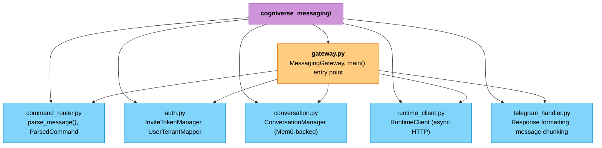
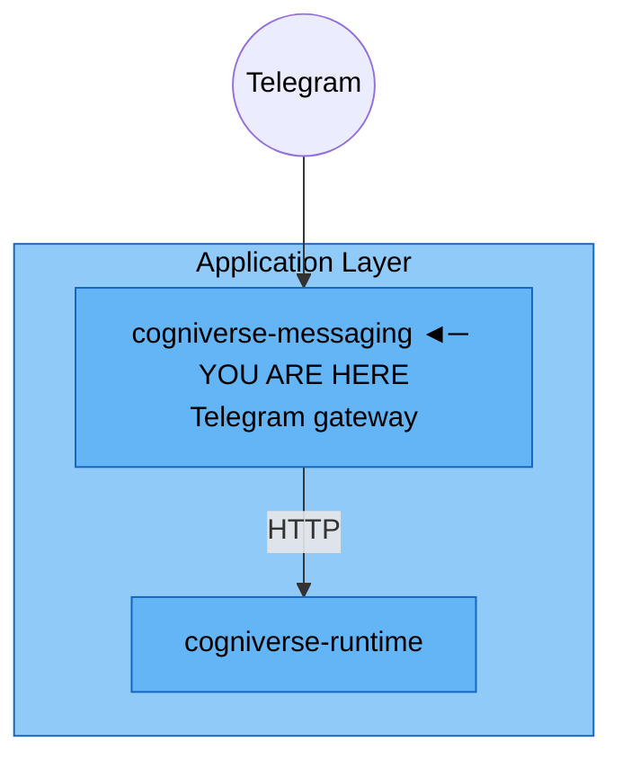

# Messaging Module

**Package:** `cogniverse_messaging` (Application Layer)
**Location:** `libs/messaging/cogniverse_messaging/`
**Entry point:** `python -m cogniverse_messaging.gateway`

---

## Table of Contents

1. [Overview](#overview)
2. [Package Structure](#package-structure)
3. [MessagingGateway](#messaginggateway)
4. [Command Routing](#command-routing)
5. [Authentication](#authentication)
6. [Conversation History](#conversation-history)
7. [RuntimeClient](#runtimeclient)
8. [Configuration](#configuration)
9. [Testing](#testing)
10. [Architecture Position](#architecture-position)

---

## Overview

The Messaging module runs a standalone gateway service that bridges Telegram to the Cogniverse runtime. It translates Telegram updates into runtime agent-dispatch calls, formats agent responses back into Telegram messages, and manages user registration (invite tokens) and per-chat conversation history via Mem0. Agent dispatch, wiki, and admin operations go exclusively through the runtime's HTTP API — the only in-process imports of another workspace package are `cogniverse_core.common.tenant_utils.SYSTEM_TENANT_ID` and `cogniverse_sdk.interfaces.config_store.ConfigScope`, both used by `auth.py` for invite-token storage.

Key responsibilities:

- **Telegram integration** — polling (dev) or webhook (production) mode via `python-telegram-bot`
- **Command routing** — maps `/search`, `/summarize`, `/report`, `/research`, `/code`, `/wiki`, `/instructions`, `/memories`, `/jobs` to runtime agent names and endpoints
- **User registration** — invite-token based onboarding, mapping a Telegram user ID to a tenant ID
- **Conversation history** — stores and retrieves per-chat turns via Mem0 so agents get context across messages
- **Runtime protocol adapter** — a thin async HTTP client (`RuntimeClient`) wrapping the runtime's `/agents/*/process`, `/wiki/*`, and `/admin/tenant/*` endpoints

---

## Package Structure



All modules are flat files directly under `cogniverse_messaging/` (no subpackages).

---

## MessagingGateway

**Location:** `libs/messaging/cogniverse_messaging/gateway.py`

```python
MessagingGateway(
    bot_token: str,
    runtime_url: str,
    mode: str = "polling",       # "polling" (dev) or "webhook" (production)
    webhook_url: str = "",
    memory_manager=None,          # Mem0MemoryManager; enables auth + conversation history
    config_manager=None,          # enables invite-token registration
)
```

Registration and conversation history are both optional: without `config_manager`, `/start <token>` replies that registration is unavailable; without `memory_manager`, the gateway skips history lookup/storage and every user is treated as unregistered (`_handle_message` short-circuits to "please register").

**Usage:**
```python
from cogniverse_messaging.gateway import MessagingGateway

gateway = MessagingGateway(
    bot_token="123456:ABC-token",
    runtime_url="http://localhost:28000",
    mode="polling",
)
await gateway.run()  # dispatches to run_polling() or run_webhook() based on mode
```

Running the module directly (`python -m cogniverse_messaging.gateway`) reads `TELEGRAM_BOT_TOKEN` (required), `RUNTIME_URL` (default `http://localhost:28000`), `GATEWAY_MODE` (default `polling`), and `TELEGRAM_WEBHOOK_URL` (required when `GATEWAY_MODE=webhook`) from the environment.

---

## Command Routing

**Location:** `libs/messaging/cogniverse_messaging/command_router.py`

`parse_message(text=None, has_photo=False, has_video=False, photo_file_id=None, video_file_id=None) -> ParsedCommand` classifies an incoming Telegram message. Agent slash commands map directly to runtime agent names:

| Command | Agent |
|---|---|
| `/search <query>` | `search_agent` |
| `/summarize <query>` | `summarizer_agent` |
| `/report <query>` | `detailed_report_agent` |
| `/research <query>` | `deep_research_agent` |
| `/code <query>` | `coding_agent` |

`/wiki`, `/instructions`, `/memories`, and `/jobs` are parsed into their own `ParsedCommand` fields (`is_wiki`/`wiki_subcommand`, etc.) and dispatched by `MessagingGateway._handle_*_command` to the matching `RuntimeClient` method. A message with no recognized command and no media falls through to `gateway_agent`. Photo/video messages (no text command) route to `search_agent` with `has_media=True`.

---

## Authentication

**Location:** `libs/messaging/cogniverse_messaging/auth.py`

- **`InviteTokenManager(config_manager)`** — generates, validates, and marks-used invite tokens, stored in the `_system` tenant's config store (`ConfigScope.SYSTEM`, service `"messaging_gateway"`). `generate_token(tenant_id, expires_in_hours=24)` returns a UUID hex token; `validate_token(token)` returns the tenant_id or `None` if missing, expired, or already used.
- **`UserTenantMapper(memory_manager)`** — maps a Telegram user ID to a tenant ID via Mem0, storing the mapping under the system tenant partition (`SYSTEM_TENANT_ID`) with `agent_name="_messaging_gateway"` and `infer=False` so the raw mapping text isn't rewritten by LLM extraction.

---

## Conversation History

**Location:** `libs/messaging/cogniverse_messaging/conversation.py`

```python
ConversationManager(memory_manager, tenant_id: str)
```

- `get_history(chat_id, max_turns=10) -> List[Dict[str, str]]` — searches Mem0 for turns tagged `[chat:{chat_id}]` and returns `{"role": "user"|"assistant", "content": ...}` entries.
- `store_turn(chat_id, role, content)` — stores a turn as a Mem0 memory with `metadata={"type": "conversation", "chat_id": ..., "role": ...}`.

Both methods no-op when `memory_manager` is `None` or `memory_manager.memory` is uninitialized.

---

## RuntimeClient

**Location:** `libs/messaging/cogniverse_messaging/runtime_client.py`

Thin async `httpx` wrapper around the runtime's HTTP API — the gateway never imports agent or core code directly.

```python
RuntimeClient(runtime_url: str, timeout: float = 300.0)
```

**Key methods:**

| Method | Endpoint |
|---|---|
| `health()` | `GET /health` (returns `True`/`False`, never raises) |
| `dispatch_agent(agent_name, query, tenant_id, context_id=None, conversation_history=None, top_k=10, context=None)` | `POST /agents/{agent_name}/process` |
| `stream_events(task_id)` | `GET /events/workflows/{task_id}` (SSE) |
| `create_invite_token(tenant_id, expires_in_hours=24)` | `POST /admin/messaging/invite` |
| `save_wiki_session(tenant_id, query, response, agent_name="gateway_agent", entities=None)` | `POST /wiki/save` |
| `search_wiki(tenant_id, query, top_k=5)` | `POST /wiki/search` |
| `get_wiki_topic(tenant_id, slug)` | `GET /wiki/topic/{slug}` |
| `get_wiki_index(tenant_id)` | `GET /wiki/index` |
| `lint_wiki(tenant_id)` | `GET /wiki/lint` |
| `delete_wiki_topic(tenant_id, slug)` | `DELETE /wiki/topic/{slug}` |
| `set_instructions(tenant_id, text)` | `PUT /admin/tenant/{tenant}/instructions` |
| `get_instructions(tenant_id)` | `GET /admin/tenant/{tenant}/instructions` |
| `list_memories(tenant_id, agent_name=None)` | `GET /admin/tenant/{tenant}/memories` |
| `clear_memories(tenant_id, agent_name=None)` | `DELETE /admin/tenant/{tenant}/memories` |
| `list_jobs(tenant_id)` | `GET /admin/tenant/{tenant}/jobs` |
| `create_job(tenant_id, name, schedule, query, post_actions=None)` | `POST /admin/tenant/{tenant}/jobs` |
| `delete_job(tenant_id, job_id)` | `DELETE /admin/tenant/{tenant}/jobs/{job_id}` |
| `close()` | closes the underlying `httpx.AsyncClient` |

`save_wiki_session` is defined but not currently called by the gateway — `/wiki save` replies that sessions auto-save in the background instead of invoking it (see [Command Routing](#command-routing)). Non-2xx responses from the CRUD methods are normalized to `{"status": "error", "status_code": ..., "message": ...}` by `_json_or_error`, so callers never need to branch on `httpx` exceptions; `dispatch_agent` and `create_invite_token` normalize errors inline instead.

---

## Configuration

Deployed via the `messaging` section of the Helm chart (`charts/cogniverse/values.yaml`), disabled by default:

```yaml
messaging:
  enabled: false
  mode: polling   # polling for dev, webhook for production
  replicaCount: 1
```

Enable it at deploy time with `cogniverse up --messaging` (requires `TELEGRAM_BOT_TOKEN` in the environment).

| Environment Variable | Purpose |
|---|---|
| `TELEGRAM_BOT_TOKEN` | Required. Telegram bot token. |
| `RUNTIME_URL` | Runtime base URL (default `http://localhost:28000`). |
| `GATEWAY_MODE` | `polling` or `webhook` (default `polling`). |
| `TELEGRAM_WEBHOOK_URL` | Required when `GATEWAY_MODE=webhook`. |

---

## Testing

```bash
uv run pytest tests/messaging/unit/ -v --tb=long
```

Covers command parsing, invite-token auth, gateway command dispatch, and the `RuntimeClient` CRUD wrappers. Round-trip coverage against a real runtime lives in `tests/runtime/integration/test_inbound_messaging_primitive.py` and `tests/runtime/integration/test_inbound_messaging_redis.py`; end-to-end coverage lives in `tests/e2e/test_messaging_e2e.py` and `tests/e2e/test_messaging_gateway_e2e.py`.

---

## Architecture Position



`cogniverse-messaging` is not imported by any other `libs/*` package, and is not declared as a workspace dependency of any package — it talks to the runtime over HTTP and only reaches into `cogniverse_core`/`cogniverse_sdk` directly for invite-token storage in `auth.py`.

**Dependencies:** `python-telegram-bot`, `httpx` (declared); `cogniverse_core`, `cogniverse_sdk` (imported directly, not declared in `pyproject.toml`)

**Dependents:** none (standalone service)

---

## Related

- [Runtime Module](./runtime.md) - HTTP API the gateway dispatches to
- [CLI Module](./cli.md) - `cogniverse up --messaging` deploys this gateway
