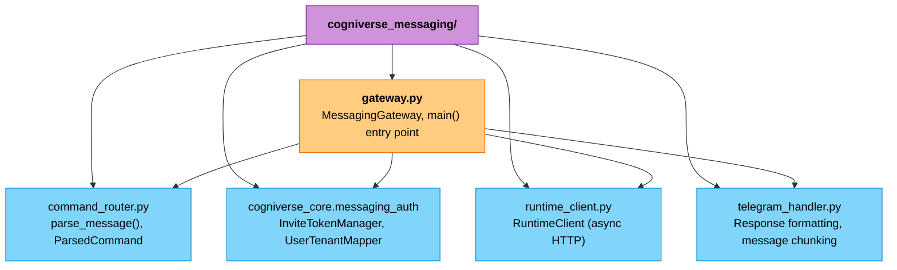
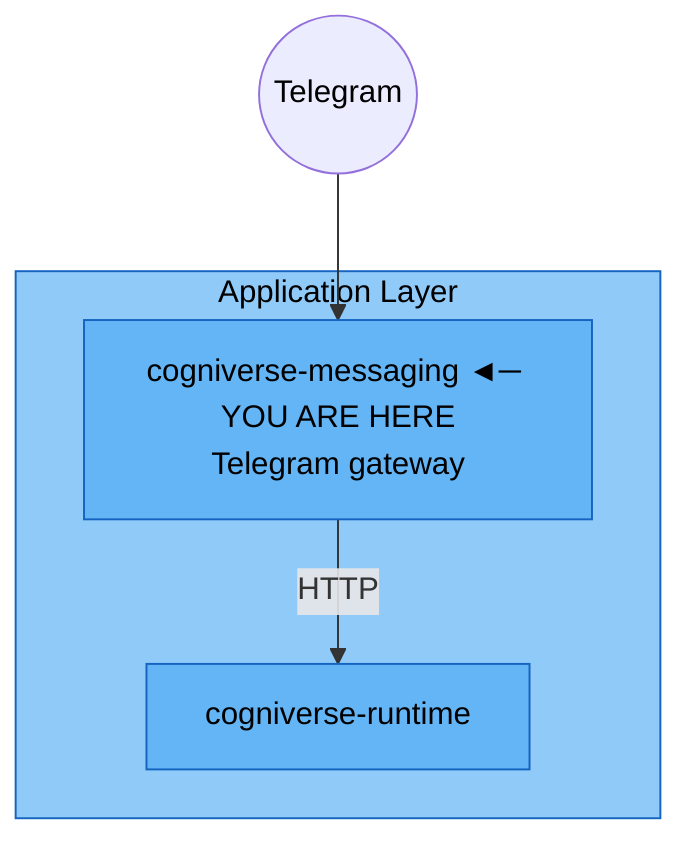

# Messaging Module

**Package:** `cogniverse_messaging` (Application Layer)
**Location:** `libs/messaging/cogniverse_messaging/`
**Entry point:** `python -m cogniverse_messaging.gateway`

---

## Table of Contents

1. [Overview](#overview)
2. [Package Structure](#package-structure)
3. [MessagingGateway](#messaginggateway)
4. [Command Routing](#command-routing)
5. [Authentication](#authentication)
6. [Conversation History](#conversation-history)
7. [RuntimeClient](#runtimeclient)
8. [Configuration](#configuration)
9. [Testing](#testing)
10. [Architecture Position](#architecture-position)

---

## Overview

The Messaging module runs a standalone gateway service that bridges Telegram to the Cogniverse runtime. It translates Telegram updates into runtime agent-dispatch calls, formats agent responses back into Telegram messages, and manages user registration (invite tokens). Agent dispatch, registration, tenant resolution, and per-chat conversation history all go through the runtime's HTTP API — the auth primitives (`InviteTokenManager`, `UserTenantMapper`) live in `cogniverse_core.messaging_auth`, and the runtime loads/saves conversation history itself around each agent call, so the gateway holds no backend connection.

Key responsibilities:

- **Telegram integration** — polling (dev) or webhook (production) mode via `python-telegram-bot`
- **Command routing** — maps `/search`, `/summarize`, `/report`, `/research`, `/code`, `/wiki`, `/instructions`, `/memories`, `/jobs` to runtime agent names and endpoints
- **User registration** — invite-token based onboarding, mapping a Telegram user ID to a tenant ID
- **Conversation history** — stores and retrieves per-chat turns via Mem0 so agents get context across messages
- **Runtime protocol adapter** — a thin async HTTP client (`RuntimeClient`) wrapping the runtime's `/agents/*/process`, `/wiki/*`, and `/admin/tenant/*` endpoints

---

## Package Structure


```mermaid
graph TD
    Root["<span style='color:#000'><b>cogniverse_messaging/</b></span>"]

    Root --> Gateway["<span style='color:#000'><b>gateway.py</b><br/>MessagingGateway, main() entry point</span>"]
    Root --> CommandRouter["<span style='color:#000'>command_router.py<br/>parse_message(), ParsedCommand</span>"]
    Root --> Auth["<span style='color:#000'>cogniverse_core.messaging_auth<br/>InviteTokenManager, UserTenantMapper</span>"]
    Root --> RuntimeClient["<span style='color:#000'>runtime_client.py<br/>RuntimeClient (async HTTP)</span>"]
    Root --> TelegramHandler["<span style='color:#000'>telegram_handler.py<br/>Response formatting, message chunking</span>"]

    Gateway --> CommandRouter
    Gateway --> Auth
    Gateway --> RuntimeClient
    Gateway --> TelegramHandler

    style Root fill:#ce93d8,stroke:#7b1fa2,color:#000
    style Gateway fill:#ffcc80,stroke:#ef6c00,color:#000
    style CommandRouter fill:#81d4fa,stroke:#0288d1,color:#000
    style Auth fill:#81d4fa,stroke:#0288d1,color:#000
    style RuntimeClient fill:#81d4fa,stroke:#0288d1,color:#000
    style TelegramHandler fill:#81d4fa,stroke:#0288d1,color:#000
```

All modules are flat files directly under `cogniverse_messaging/` (no subpackages).

---

## MessagingGateway

**Location:** `libs/messaging/cogniverse_messaging/gateway.py`

```python
MessagingGateway(
    bot_token: str,
    runtime_url: str,
    mode: str = "polling",       # "polling" (dev) or "webhook" (production)
    webhook_url: str = "",
    webhook_listen: str = "0.0.0.0",  # webhook mode: HTTP server bind address
    webhook_port: int = 8443,         # webhook mode: HTTP server bind port
    webhook_path: str = "",           # webhook mode: URL path Telegram POSTs updates to
    outbound_poll_seconds: float = 5.0,
)
```

Registration and tenant resolution go through the runtime's HTTP API: `/start <token>` calls `POST /admin/messaging/register` and each message resolves the sender via `GET /admin/messaging/resolve` (cached positively per user for 60s). The gateway therefore registers users out of the box in the deployed chart — it needs only `RUNTIME_URL`. A runtime/backend outage during either call replies "temporarily unavailable" (the token is never consumed by a failed attempt); `tenant_id: null` from resolve is the only thing that reads as "please register". Conversation history remains optional: without `memory_manager` the gateway skips history lookup/storage.

`build_app()` registers a `CommandHandler` for every slash command (`start`, `help`, and all nine command families) — the plain-text `MessageHandler` filters with `~filters.COMMAND`, so a command without its own handler would be silently dropped by Telegram dispatch. Updates process concurrently (up to 32 in parallel) so one slow agent dispatch cannot stall other chats, and a registered error handler replies "Something went wrong handling that — please try again." when a handler raises (runtime unreachable, malformed response) instead of leaving the user in silence.

**Usage:**
```python
from cogniverse_messaging.gateway import MessagingGateway

gateway = MessagingGateway(
    bot_token="123456:ABC-token",
    runtime_url="http://localhost:28000",
    mode="polling",
)
await gateway.run()  # dispatches to run_polling() or run_webhook() based on mode
```

Running the module directly (`python -m cogniverse_messaging.gateway`) reads `TELEGRAM_BOT_TOKEN` (required), `RUNTIME_URL` (default `http://localhost:28000`), `GATEWAY_MODE` (default `polling`), `TELEGRAM_WEBHOOK_URL` (required when `GATEWAY_MODE=webhook`), `GATEWAY_WEBHOOK_LISTEN` (default `0.0.0.0`), `GATEWAY_WEBHOOK_PORT` (default `8443`), `GATEWAY_WEBHOOK_PATH` (default `""`), and `GATEWAY_OUTBOUND_POLL_SECONDS` (default `5`) from the environment.

### Outbound delivery

Alongside inbound handling, the gateway runs a background `_outbound_drain_loop` — started in both `run_polling` and `run_webhook`, cancelled in their shutdown `finally`. Every `GATEWAY_OUTBOUND_POLL_SECONDS` (default 5) it calls `RuntimeClient.drain_outbound()` (`GET /admin/messaging/outbound/drain`) and sends each returned `{chat_id, text}` via the bot. A drain failure (runtime blip) is logged and retried next tick; a per-message send failure is logged and skipped so one bad chat never stops the others. This is the delivery side of the runtime's `POST /messaging/send` — the path job-completion notifications reach a tenant's linked chats.

---

## Command Routing

**Location:** `libs/messaging/cogniverse_messaging/command_router.py`

`parse_message(text=None, has_photo=False, has_video=False, photo_file_id=None, video_file_id=None) -> ParsedCommand` classifies an incoming Telegram message. Agent slash commands map directly to runtime agent names:

| Command | Agent |
|---|---|
| `/search <query>` | `search_agent` |
| `/summarize <query>` | `summarizer_agent` |
| `/report <query>` | `detailed_report_agent` |
| `/research <query>` | `deep_research_agent` |
| `/code <query>` | `coding_agent` |

`/wiki`, `/instructions`, `/memories`, and `/jobs` are parsed into their own `ParsedCommand` fields (`is_wiki`/`wiki_subcommand`, etc.) and dispatched by `MessagingGateway._handle_*_command` to the matching `RuntimeClient` method. A message with no recognized command and no media falls through to `gateway_agent`. Photo/video messages (no text command) route to `search_agent` with `has_media=True`.

---

## Authentication

**Location:** `libs/core/cogniverse_core/messaging_auth.py` (shared with the runtime, which serves registration routes over HTTP)

- **`InviteTokenManager(config_manager)`** — generates, validates, and marks-used invite tokens, stored in the `_system` tenant's config store (`ConfigScope.SYSTEM`, service `"messaging_gateway"`). `generate_token(tenant_id, expires_in_hours=24)` returns a UUID hex token; `validate_token(token)` returns the tenant_id, returns `None` if unknown/expired/already used, and raises on a store outage (the gateway replies "temporarily unavailable" instead of "invalid token"); `mark_token_used(token, tenant_id)` returns `False` on a failed consume write (logged; the token stays live until expiry). The runtime's `POST /admin/messaging/register` route drives validate → register → consume in that order (serialized per process), so a failed registration never burns the token and a concurrent duplicate register loses at validation; the gateway only speaks HTTP.
- **`UserTenantMapper(memory_manager)`** — maps a Telegram user ID to a tenant ID via Mem0, storing the mapping under the system tenant partition (`SYSTEM_TENANT_ID`) with `agent_name="_messaging_gateway"` and `infer=False` so the raw mapping text isn't rewritten by LLM extraction.

---

## Conversation History

Conversation history is **server-side**: the gateway sends only `context_id` (the Telegram chat id) with each dispatch, and the runtime's agent dispatcher loads that context's recent turns before the agent runs and appends the two new turns after (`cogniverse_core.conversation.ConversationStore`, keyed by `(tenant_id, context_id)`). The gateway therefore holds no Mem0 connection and multi-turn memory works in the deployed chart. History is enrichment: a Mem0 outage degrades to no-history (the agent still answers) rather than failing the reply. See [Core → ConversationStore](core.md) and the dispatcher.

---

## RuntimeClient

**Location:** `libs/messaging/cogniverse_messaging/runtime_client.py`

Thin async `httpx` wrapper around the runtime's HTTP API — the gateway never imports agent or core code directly.

```python
RuntimeClient(runtime_url: str, timeout: float = 300.0)
```

The constructor `timeout` bounds only agent dispatch (`dispatch_agent`) and SSE event-stream reads; every other call (CRUD, drain, health) uses the shared client's 30s read default, and all connects fail within 5s so an unreachable runtime surfaces in seconds rather than hanging out the read budget.

**Key methods:**

| Method | Endpoint |
|---|---|
| `health()` | `GET /health` (returns `True`/`False`, never raises) |
| `dispatch_agent(agent_name, query, tenant_id, context_id=None, conversation_history=None, top_k=10, context=None)` | `POST /agents/{agent_name}/process` |
| `stream_events(task_id)` | `GET /events/workflows/{task_id}` (SSE) |
| `create_invite_token(tenant_id, expires_in_hours=24)` | `POST /admin/messaging/invite` |
| `register_user(platform, external_user_id, token)` | `POST /admin/messaging/register` — returns `{"status": "registered"\|"invalid_token"\|"unavailable", ...}`, never raises |
| `resolve_tenant(platform, external_user_id)` | `GET /admin/messaging/resolve` — `{"status": "ok", "tenant_id": str\|None}` or `{"status": "unavailable"}` |
| `save_wiki_session(tenant_id, query, response, agent_name="gateway_agent", entities=None)` | `POST /wiki/save` |
| `search_wiki(tenant_id, query, top_k=5)` | `POST /wiki/search` |
| `get_wiki_topic(tenant_id, slug)` | `GET /wiki/topic/{slug}` |
| `get_wiki_index(tenant_id)` | `GET /wiki/index` |
| `lint_wiki(tenant_id)` | `GET /wiki/lint` |
| `delete_wiki_topic(tenant_id, slug)` | `DELETE /wiki/topic/{slug}` |
| `set_instructions(tenant_id, text)` | `PUT /admin/tenant/{tenant}/instructions` |
| `get_instructions(tenant_id)` | `GET /admin/tenant/{tenant}/instructions` |
| `list_memories(tenant_id, agent_name=None)` | `GET /admin/tenant/{tenant}/memories` |
| `clear_memories(tenant_id, agent_name=None)` | `DELETE /admin/tenant/{tenant}/memories` |
| `list_jobs(tenant_id)` | `GET /admin/tenant/{tenant}/jobs` |
| `create_job(tenant_id, name, schedule, query, post_actions=None)` | `POST /admin/tenant/{tenant}/jobs` |
| `delete_job(tenant_id, job_id)` | `DELETE /admin/tenant/{tenant}/jobs/{job_id}` |
| `close()` | closes the underlying `httpx.AsyncClient` |

`save_wiki_session` is defined but not currently called by the gateway — `/wiki save` replies that sessions auto-save in the background instead of invoking it (see [Command Routing](#command-routing)). Non-2xx responses from the CRUD methods are normalized to `{"status": "error", "status_code": ..., "message": ...}` by `_json_or_error`, so callers never need to branch on `httpx` exceptions; `dispatch_agent` and `create_invite_token` normalize errors inline instead.

---

## Configuration

Deployed via the `messaging` section of the Helm chart (`charts/cogniverse/values.yaml`), disabled by default:

```yaml
messaging:
  enabled: false
  mode: polling   # polling for dev, webhook for production
  replicaCount: 1
```

Enable it at deploy time with `cogniverse up --messaging` (requires `TELEGRAM_BOT_TOKEN` in the environment).

| Environment Variable | Purpose |
|---|---|
| `TELEGRAM_BOT_TOKEN` | Required. Telegram bot token. |
| `RUNTIME_URL` | Runtime base URL (default `http://localhost:28000`). |
| `GATEWAY_MODE` | `polling` or `webhook` (default `polling`). |
| `TELEGRAM_WEBHOOK_URL` | Required when `GATEWAY_MODE=webhook`. |
| `GATEWAY_WEBHOOK_LISTEN` | Webhook server bind address (default `0.0.0.0`). |
| `GATEWAY_WEBHOOK_PORT` | Webhook server bind port (default `8443`). |
| `GATEWAY_WEBHOOK_PATH` | URL path Telegram POSTs updates to (default `""`). |
| `GATEWAY_OUTBOUND_POLL_SECONDS` | Seconds between outbound-queue drains for delivery (default `5`). |

---

## Testing

```bash
uv run pytest tests/messaging/unit/ -v --tb=long
```

Covers command parsing, invite-token auth, gateway command dispatch, and the `RuntimeClient` CRUD wrappers. `tests/messaging/integration/test_gateway_webhook_serves.py` verifies `run_webhook()` actually binds and serves an HTTP server that Telegram can POST updates to, not just registers the webhook URL. Round-trip coverage against a real runtime lives in `tests/runtime/integration/test_inbound_messaging_primitive.py` and `tests/runtime/integration/test_inbound_messaging_redis.py`; end-to-end coverage lives in `tests/e2e/test_messaging_e2e.py` and `tests/e2e/test_messaging_gateway_e2e.py`.

---

## Architecture Position


```mermaid
flowchart TB
    subgraph AppLayer["<span style='color:#000'>Application Layer</span>"]
        Messaging["<span style='color:#000'>cogniverse-messaging ◄─ YOU ARE HERE<br/>Telegram gateway</span>"]
        Runtime["<span style='color:#000'>cogniverse-runtime</span>"]
    end

    Telegram(("<span style='color:#000'>Telegram</span>")) --> Messaging
    Messaging -->|HTTP| Runtime

    style AppLayer fill:#90caf9,stroke:#1565c0,color:#000
    style Messaging fill:#64b5f6,stroke:#1565c0,color:#000
    style Runtime fill:#64b5f6,stroke:#1565c0,color:#000
```

`cogniverse-messaging` is not imported by any other `libs/*` package, and is not declared as a workspace dependency of any package — it talks to the runtime over HTTP and only reaches into `cogniverse_core`/`cogniverse_sdk` directly for invite-token storage in `auth.py`.

**Dependencies:** `python-telegram-bot[webhooks]`, `httpx` (declared); `cogniverse_core`, `cogniverse_sdk` (imported directly, not declared in `pyproject.toml`)

**Dependents:** none (standalone service)

---

## Related

- [Runtime Module](./runtime.md) - HTTP API the gateway dispatches to
- [CLI Module](./cli.md) - `cogniverse up --messaging` deploys this gateway
