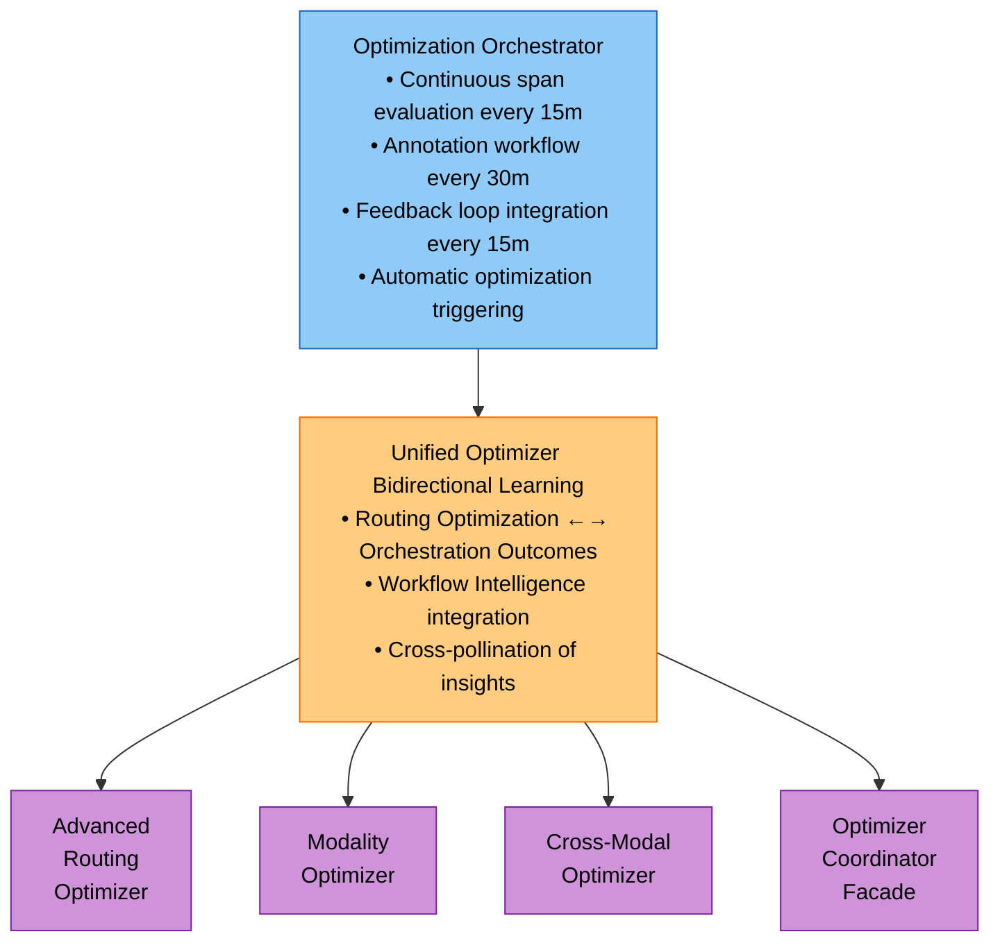
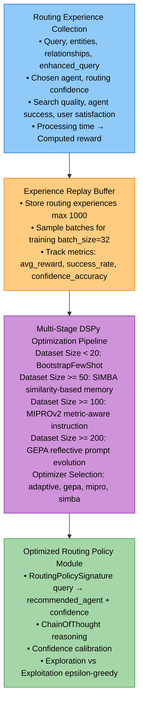
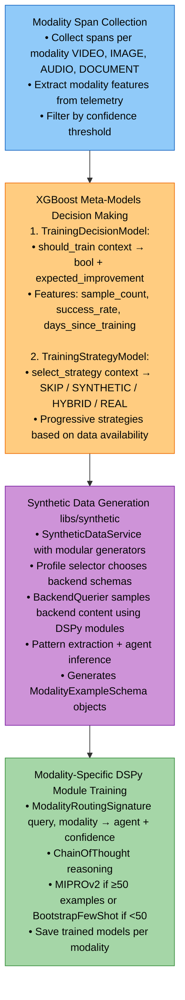
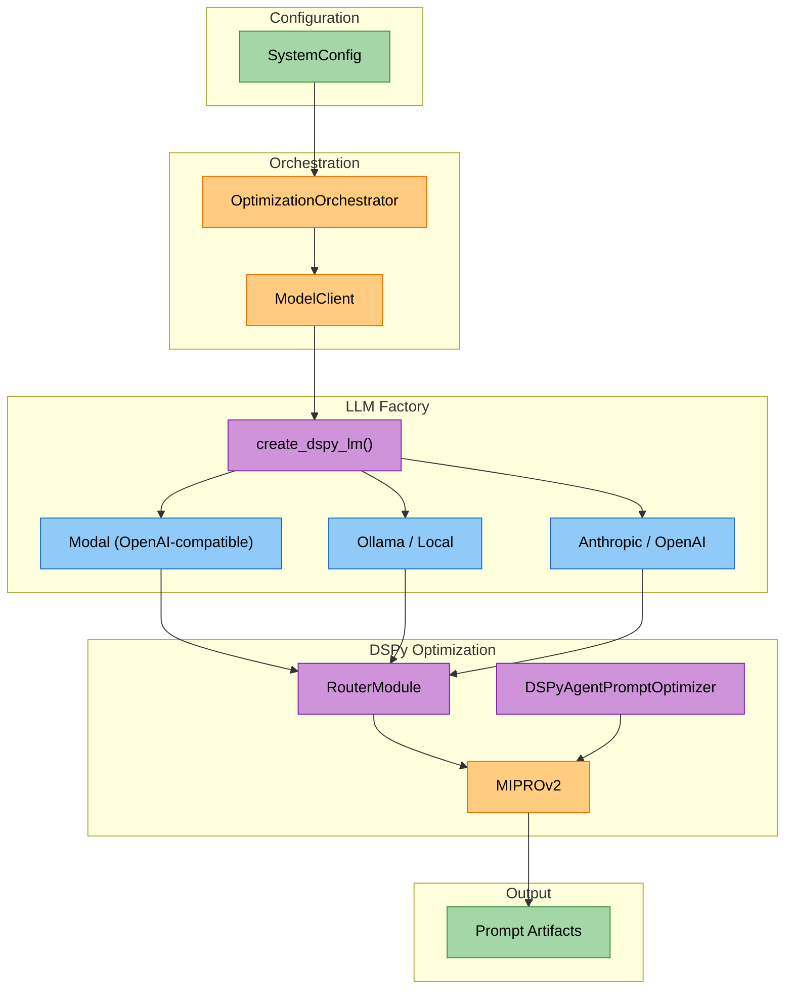

# Optimization Module Study Guide

**Package:** `cogniverse_agents` (Implementation Layer)
**Module Location:** `libs/agents/cogniverse_agents/routing/` (optimization components)

---

## Package Structure

```text
libs/agents/cogniverse_agents/routing/
├── optimization_orchestrator.py    # Complete optimization pipeline orchestrator
├── advanced_optimizer.py           # GRPO routing optimizer with DSPy
├── unified_optimizer.py            # Bidirectional routing + orchestration learning
├── modality_optimizer.py          # Per-modality optimization with XGBoost
├── cross_modal_optimizer.py       # Cross-modal fusion optimization
├── optimizer_coordinator.py       # Facade for optimizer routing
└── optimizer.py                   # Base optimizer with auto-tuning

libs/synthetic/                     # Synthetic data generation system
├── cogniverse_synthetic/
│   ├── service.py                 # Main SyntheticDataService
│   ├── generators/                # Optimizer-specific generators
│   │   ├── base.py               # Base generator classes
│   │   ├── modality.py           # ModalityOptimizer training data
│   │   ├── cross_modal.py        # CrossModalOptimizer training data
│   │   ├── routing.py            # AdvancedRoutingOptimizer training data
│   │   └── workflow.py           # WorkflowIntelligence training data
│   ├── profile_selector.py       # LLM-based profile selection
│   ├── backend_querier.py        # Vespa content sampling
│   └── utils/                    # Pattern extraction and agent inference
```

---

## Table of Contents
1. [Module Overview](#module-overview)
2. [Architecture](#architecture)
3. [Core Components](#core-components)
4. [Usage Examples](#usage-examples)
5. [Production Considerations](#production-considerations)
6. [Testing](#testing)

---

## Module Overview

### Purpose
The Optimization Module provides sophisticated multi-stage optimization for routing decisions, modality-specific routing, and cross-modal result fusion using DSPy 3.0 advanced optimizers (GEPA, MIPROv2, SIMBA, BootstrapFewShot).

### Key Features
- **Advanced DSPy Optimization**: GEPA, MIPROv2, SIMBA, BootstrapFewShot optimizers
- **GRPO (Gradient-based Reward Policy Optimization)**: Experience replay and reward signals
- **Modality-Specific Optimization**: Per-modality routing with XGBoost meta-learning
- **Unified Optimization**: Bidirectional learning between routing and orchestration
- **Optimizer Coordination**: Facade pattern for routing optimization requests
- **Complete Optimization Pipeline**: Automatic span evaluation, annotation, and feedback loops

### Dependencies

**Note**: Optimizer classes require full module path imports as they are not exported at package level.

```python
# Optimizers (require full module paths)
from cogniverse_agents.routing.advanced_optimizer import AdvancedRoutingOptimizer
from cogniverse_agents.routing.modality_optimizer import ModalityOptimizer
from cogniverse_agents.routing.cross_modal_optimizer import CrossModalOptimizer
from cogniverse_agents.routing.unified_optimizer import UnifiedOptimizer
from cogniverse_agents.routing.optimizer_coordinator import OptimizerCoordinator
from cogniverse_agents.routing.optimization_orchestrator import OptimizationOrchestrator

# Synthetic Data Generation (exported at package level)
from cogniverse_synthetic import SyntheticDataService, SyntheticDataRequest, SyntheticDataResponse
from cogniverse_synthetic import OPTIMIZER_REGISTRY
```

---

## Architecture

### 1. Multi-Stage Optimization Architecture



### 2. Advanced Routing Optimizer Architecture (GRPO)



### 3. Modality Optimizer Architecture (XGBoost Meta-Learning)



---

## Core Components

### 1. **OptimizationOrchestrator** (`optimization_orchestrator.py`)

Complete end-to-end optimization pipeline orchestrator.

**Key Methods:**

```python
async def start(self) -> None:
    """
    Start continuous optimization processes:
    - Span evaluation (every span_eval_interval_minutes)
    - Annotation workflow (every annotation_interval_minutes)
    - Feedback loop (every feedback_interval_minutes)
    - Metrics reporting (every 5 minutes)
    """

async def run_once(self) -> Dict[str, Any]:
    """
    Run single optimization cycle (for testing):
    1. Evaluate spans from Phoenix
    2. Identify spans needing annotation
    3. Generate LLM annotations
    4. Process feedback loop

    Returns optimization results
    """

def get_metrics(self) -> Dict[str, Any]:
    """
    Get orchestrator metrics including uptime and component stats

    Returns:
        Dict with keys: spans_evaluated, experiences_created, annotations_requested,
        annotations_completed, optimizations_triggered, total_improvement, started_at,
        last_optimization, uptime_seconds
    """
```

**Constructor Parameters:**
```python
__init__(
    tenant_id: str = "default",
    span_eval_interval_minutes: int = 15,
    annotation_interval_minutes: int = 30,
    feedback_interval_minutes: int = 15,
    confidence_threshold: float = 0.6,
    min_annotations_for_optimization: int = 50,
    optimization_improvement_threshold: float = 0.05
)
```

**Internal Components:**

- `RoutingSpanEvaluator` - Extract routing experiences from telemetry

- `AnnotationAgent` - Identify low-quality spans

- `LLMAutoAnnotator` - Generate annotations automatically

- `RoutingAnnotationStorage` - Store annotations in Phoenix

- `AnnotationFeedbackLoop` - Feed annotations to optimizer

- `AdvancedRoutingOptimizer` - GRPO optimization

**File:** `libs/agents/cogniverse_agents/routing/optimization_orchestrator.py`

---

### 2. **AdvancedRoutingOptimizer**

GRPO-based routing optimizer with multi-stage DSPy optimization.

**Key Methods:**

```python
async def record_routing_experience(
    query: str,
    entities: List[Dict[str, Any]],
    relationships: List[Dict[str, Any]],
    enhanced_query: str,
    chosen_agent: str,
    routing_confidence: float,
    search_quality: float,
    agent_success: bool,
    processing_time: float = 0.0,
    user_satisfaction: Optional[float] = None,
    metadata: Optional[Dict[str, Any]] = None
) -> float:
    """
    Record routing experience and compute reward signal

    Reward Computation:
    reward = search_quality * weight_sq
           + agent_success * weight_success
           + user_satisfaction * weight_us
           - processing_time_penalty

    Returns computed reward (0-1)
    """

async def get_routing_recommendations(
    query: str,
    entities: List[Dict[str, Any]],
    relationships: List[Dict[str, Any]]
) -> Dict[str, Any]:
    """
    Get routing recommendations using optimized policy

    Returns:
        {
            "recommended_agent": str,
            "confidence": float,
            "reasoning": str,
            "optimization_ready": bool,
            "experiences_count": int,
            "training_step": int
        }
    """

async def optimize_routing_decision(
    query: str,
    entities: List[Dict[str, Any]],
    relationships: List[Dict[str, Any]],
    enhanced_query: str,
    baseline_prediction: Dict[str, Any]
) -> Dict[str, Any]:
    """
    Apply GRPO optimization to improve routing decision

    Uses epsilon-greedy exploration:
    - Exploration (ε): Random agent selection for learning
    - Exploitation (1-ε): Use optimized policy

    Returns optimized routing decision with confidence calibration
    """

def get_optimization_status(self) -> Dict[str, Any]:
    """
    Get optimization status and metrics:
    - Optimizer readiness
    - Experience counts
    - Training step
    - Metrics: avg_reward, success_rate, confidence_accuracy
    """
```

**Configuration (AdvancedOptimizerConfig):**
```python
@dataclass
class AdvancedOptimizerConfig:
    # Learning parameters
    learning_rate: float = 0.001
    batch_size: int = 32
    experience_replay_size: int = 1000
    update_frequency: int = 10

    # Optimizer selection
    optimizer_strategy: str = "adaptive"  # "gepa", "mipro", "simba", "bootstrap"
    force_optimizer: Optional[str] = None
    enable_multi_stage: bool = True

    # Optimizer thresholds
    bootstrap_threshold: int = 20
    simba_threshold: int = 50
    mipro_threshold: int = 100
    gepa_threshold: int = 200

    # Reward computation
    search_quality_weight: float = 0.4
    agent_success_weight: float = 0.3
    user_satisfaction_weight: float = 0.3
    processing_time_penalty: float = 0.1

    # Exploration
    exploration_epsilon: float = 0.1
    epsilon_decay: float = 0.995
    min_epsilon: float = 0.05

    # Minimum experiences before training
    min_experiences_for_training: int = 50
```

**Multi-Stage Optimizer Selection:**
```python
# Adaptive strategy selects best optimizer based on dataset size:
- Dataset < 20:   BootstrapFewShot (few-shot learning)
- Dataset >= 50:  SIMBA (similarity-based memory augmentation)
- Dataset >= 100: MIPROv2 (metric-aware instruction optimization)
- Dataset >= 200: GEPA (reflective prompt evolution)
```

**File:** `libs/agents/cogniverse_agents/routing/advanced_optimizer.py`

---

### 3. **UnifiedOptimizer**

Bidirectional learning between routing and orchestration.

**Key Methods:**

```python
async def integrate_orchestration_outcomes(
    workflow_executions: List[WorkflowExecution]
) -> Dict[str, Any]:
    """
    Convert orchestration workflows → routing experiences

    Learns from successful orchestration patterns:
    - When parallel orchestration outperforms sequential
    - When multi-agent synergy produces better results
    - When orchestration is beneficial vs single agent

    Returns:
        {
            "workflows_processed": int,
            "routing_experiences_created": int,
            "patterns_learned": Dict[str, int],
            "total_workflows_integrated": int
        }
    """

async def optimize_unified_policy(self) -> Dict[str, Any]:
    """
    Trigger unified optimization across routing + orchestration:

    1. Optimize orchestration workflows (WorkflowIntelligence)
    2. Optimize routing decisions (AdvancedRoutingOptimizer)
    3. Cross-pollinate (orchestration insights → routing knowledge)

    Returns combined optimization results
    """

def _workflow_to_routing_experience(
    workflow: WorkflowExecution
) -> RoutingExperience:
    """
    Convert WorkflowExecution to RoutingExperience

    Mappings:
    - chosen_agent: First agent in workflow sequence
    - search_quality: Based on user_satisfaction or success
    - agent_success: workflow.success
    - metadata: Captures orchestration_pattern, agent_sequence
    """
```

**Constructor:**
```python
__init__(
    routing_optimizer: AdvancedRoutingOptimizer,
    workflow_intelligence: WorkflowIntelligence
)
```

**Learning Signals:**

- `orchestration_was_beneficial`: success + user_satisfaction > 0.7

- `multi_agent_synergy`: len(agent_sequence) > 1

- `parallel_efficiency`: From workflow metadata

- `orchestration_pattern`: Sequential, parallel, or conditional

**File:** `libs/agents/cogniverse_agents/routing/unified_optimizer.py`

---

### 4. **ModalityOptimizer**

Per-modality routing optimization with XGBoost meta-learning.

**Key Methods:**

```python
async def optimize_all_modalities(
    lookback_hours: int = 24,
    min_confidence: float = 0.7
) -> Dict[QueryModality, Dict[str, Any]]:
    """
    Evaluate and optimize all modalities (VIDEO, IMAGE, AUDIO, DOCUMENT)

    For each modality:
    1. Collect training examples from Phoenix spans
    2. Build ModelingContext
    3. Use XGBoost to decide: should_train?
    4. Select training strategy (SYNTHETIC/HYBRID/PURE_REAL)
    5. Train modality-specific DSPy module

    Returns optimization results per modality
    """

async def optimize_modality(
    modality: QueryModality,
    lookback_hours: int = 24,
    min_confidence: float = 0.7,
    force_training: bool = False
) -> Dict[str, Any]:
    """
    Optimize single modality:

    1. Collect training examples
    2. Build ModelingContext
    3. TrainingDecisionModel.should_train(context)
    4. TrainingStrategyModel.select_strategy(context)
    5. Prepare training data (synthetic/hybrid/real)
    6. Train ModalityRoutingModule (DSPy)
    7. Record training history

    Returns:
        {
            "modality": str,
            "trained": bool,
            "strategy": str,
            "examples_count": int,
            "expected_improvement": float,
            "training_result": dict
        }
    """

def predict_agent(
    query: str,
    modality: QueryModality,
    query_features: Optional[Dict[str, Any]] = None
) -> Optional[Dict[str, Any]]:
    """
    Predict best agent using trained modality model

    Returns:
        {
            "recommended_agent": str,
            "confidence": float,
            "reasoning": str,
            "modality": str
        }
    or None if no model trained
    """

def get_optimization_summary(self) -> Dict[str, Any]:
    """
    Get summary of all modality optimizations

    Returns training history, meta-model status, last training details
    """
```

**XGBoost Meta-Models:**
```python
# 1. TrainingDecisionModel
should_train(context: ModelingContext) -> Tuple[bool, float]:
    """
    Decide whether to train based on:
    - real_sample_count (sufficient data?)
    - success_rate (performance degradation?)
    - days_since_last_training (stale model?)
    - current_performance_score
    - data_quality_score

    Returns: (should_train: bool, expected_improvement: float)
    """

# 2. TrainingStrategyModel
select_strategy(context: ModelingContext) -> TrainingStrategy:
    """
    Select strategy based on data availability:
    - SKIP: Not enough benefit
    - SYNTHETIC: < 20 real examples
    - HYBRID: 20-50 real examples (mix synthetic + real)
    - PURE_REAL: >= 50 real examples

    Returns: TrainingStrategy enum
    """
```

**Modality-Specific DSPy Module:**
```python
class ModalityRoutingSignature(dspy.Signature):
    query = dspy.InputField(desc="User query")
    modality = dspy.InputField(desc="Query modality (video, image, audio, document, text)")
    query_features = dspy.InputField(desc="Extracted query features as JSON")

    recommended_agent = dspy.OutputField(desc="Recommended agent")
    confidence = dspy.OutputField(desc="Confidence (0-1)")
    reasoning = dspy.OutputField(desc="Reasoning for routing choice")

class ModalityRoutingModule(dspy.Module):
    def __init__(self):
        super().__init__()
        self.route = dspy.ChainOfThought(ModalityRoutingSignature)
```

**Training:**

- Uses **MIPROv2** if ≥50 examples (metric-aware instruction optimization)

- Uses **BootstrapFewShot** if <50 examples (few-shot learning)

- Saves trained models per modality to `model_dir/{modality}_routing_module.json`

**File:** `libs/agents/cogniverse_agents/routing/modality_optimizer.py`

---

### 5. **OptimizerCoordinator**

Facade pattern for routing optimization requests to appropriate optimizers.

**Key Methods:**

```python
def optimize(
    type: OptimizationType,
    training_data: List[Dict[str, Any]],
    **kwargs
) -> Dict[str, Any]:
    """
    Route optimization request to appropriate optimizer:

    - ROUTING → AdvancedRoutingOptimizer
    - MODALITY → ModalityOptimizer
    - CROSS_MODAL → CrossModalOptimizer
    - UNIFIED → UnifiedOptimizer

    Returns optimization results
    """

def get_optimizer(
    type: OptimizationType
):
    """
    Get direct access to specific optimizer

    Use when you need optimizer-specific methods not exposed via coordinator
    """

def get_optimization_status(self) -> Dict[str, Any]:
    """
    Get status of all loaded optimizers

    Returns:
        {
            "tenant_id": str,
            "optimization_dir": str,
            "loaded_optimizers": List[str]
        }
    """
```

**Lazy Loading:**
```python
# Optimizers loaded on-demand to minimize memory usage
_get_routing_optimizer()     # AdvancedRoutingOptimizer(tenant_id, base_storage_dir)
_get_modality_optimizer()    # ModalityOptimizer(tenant_id, model_dir)
_get_cross_modal_optimizer() # CrossModalOptimizer(tenant_id, model_dir)
_get_unified_optimizer()     # UnifiedOptimizer(routing_optimizer, workflow_intelligence)
```

**OptimizationType Enum:**
```python
class OptimizationType(Enum):
    ROUTING = "routing"          # AdvancedRoutingOptimizer
    MODALITY = "modality"        # ModalityOptimizer
    CROSS_MODAL = "cross_modal"  # CrossModalOptimizer
    UNIFIED = "unified"          # UnifiedOptimizer
    ORCHESTRATION = "orchestration"
```

**File:** `libs/agents/cogniverse_agents/routing/optimizer_coordinator.py`

---

### 6. **RoutingOptimizer**

Base optimizer for routing strategies with auto-tuning.

**Key Methods:**

```python
def track_performance(
    query: str,
    predicted: RoutingDecision,
    actual: RoutingDecision | None = None,
    user_feedback: dict[str, Any] | None = None
):
    """
    Track routing performance for single query

    Triggers optimization if conditions met:
    - Time since last optimization > interval
    - Samples >= min_samples_for_optimization
    - Performance degradation detected
    """

async def optimize(self):
    """
    Run optimization process (to be overridden)

    Base implementation:
    - Calculates current metrics
    - Updates baseline if improved
    - Exports metrics to file
    """

def _calculate_current_metrics(self) -> OptimizationMetrics:
    """
    Calculate performance metrics from history:
    - Accuracy, precision, recall, F1 score
    - Average latency
    - Confidence correlation (alignment with success)
    - Error rate
    """
```

**AutoTuningOptimizer Subclass:**
```python
class AutoTuningOptimizer(RoutingOptimizer):
    """
    Auto-tuning for specific routing strategies:
    - GLiNER: Optimize threshold and labels
    - LLM: Optimize temperature, DSPy compilation
    - Keyword: Optimize keyword effectiveness
    - Composite: Optimize ensemble weights, confidence thresholds
    """

    async def _optimize_gliner(self):
        """Optimize GLiNER threshold (0.1-0.9 grid search)"""

    async def _optimize_llm(self):
        """Optimize LLM temperature or use DSPy BootstrapFewShot"""

    async def _optimize_keyword(self):
        """Analyze keyword effectiveness, update keyword lists"""

    async def _optimize_composite(self):
        """Optimize ensemble weights and confidence thresholds"""
```

**Configuration (OptimizationConfig):**
```python
@dataclass
class OptimizationConfig:
    # Triggers
    min_samples_for_optimization: int = 100
    optimization_interval_seconds: int = 3600  # 1 hour
    performance_degradation_threshold: float = 0.1  # 10% drop

    # Thresholds
    min_accuracy: float = 0.8
    min_precision: float = 0.75
    min_recall: float = 0.75
    max_acceptable_latency_ms: float = 100

    # Learning
    learning_rate: float = 0.1
    momentum: float = 0.9
    weight_decay: float = 0.01

    # DSPy
    dspy_enabled: bool = True
    dspy_max_bootstrapped_demos: int = 10
    dspy_max_labeled_demos: int = 50
    dspy_metric: str = "f1"

    # GLiNER
    gliner_threshold_optimization: bool = True
    gliner_label_optimization: bool = True
    gliner_threshold_step: float = 0.05

    # Storage
    max_history_size: int = 10000
    checkpoint_dir: Path = Path("outputs/routing_checkpoints")
    metrics_export_dir: Path = Path("outputs/routing_metrics")
```

**File:** `libs/agents/cogniverse_agents/routing/optimizer.py`

---

## Usage Examples

### Example 1: Complete Optimization Orchestration (Production)

```python
from cogniverse_agents.routing.optimization_orchestrator import OptimizationOrchestrator

# Initialize orchestrator with production config
orchestrator = OptimizationOrchestrator(
    tenant_id="production",
    span_eval_interval_minutes=15,      # Evaluate spans every 15 minutes
    annotation_interval_minutes=30,     # Identify spans for annotation every 30 minutes
    feedback_interval_minutes=15,       # Process feedback every 15 minutes
    confidence_threshold=0.6,           # Annotate spans with confidence < 0.6
    min_annotations_for_optimization=50, # Trigger optimization at 50 annotations
    optimization_improvement_threshold=0.05  # Accept if improvement > 5%
)

# Start continuous optimization (runs indefinitely)
await orchestrator.start()

# Get metrics
metrics = orchestrator.get_metrics()
print(f"Spans evaluated: {metrics['spans_evaluated']}")
print(f"Experiences created: {metrics['experiences_created']}")
print(f"Annotations completed: {metrics['annotations_completed']}")
print(f"Optimizations triggered: {metrics['optimizations_triggered']}")
```

---

### Example 2: Advanced Routing Optimizer with GRPO

```python
from cogniverse_agents.routing.advanced_optimizer import (
    AdvancedRoutingOptimizer,
    AdvancedOptimizerConfig
)

# Configure advanced optimizer
config = AdvancedOptimizerConfig(
    optimizer_strategy="adaptive",  # Auto-select best optimizer
    learning_rate=0.001,
    batch_size=32,
    experience_replay_size=1000,
    min_experiences_for_training=50,
    exploration_epsilon=0.1,  # 10% exploration
    epsilon_decay=0.995,
    # Reward weights
    search_quality_weight=0.4,
    agent_success_weight=0.3,
    user_satisfaction_weight=0.3,
    processing_time_penalty=0.1
)

# Initialize optimizer with required tenant_id parameter
optimizer = AdvancedRoutingOptimizer(
    tenant_id="production",  # REQUIRED parameter
    config=config,
    base_storage_dir="data/optimization"
)

# Record routing experience
reward = await optimizer.record_routing_experience(
    query="Show me videos where Marie Curie discusses radioactivity",
    entities=[{"text": "Marie Curie", "label": "person"}],
    relationships=[{"head": "Marie Curie", "relation": "discusses", "tail": "radioactivity"}],
    enhanced_query="Show me videos where Marie Curie discusses radioactivity in physics lectures",
    chosen_agent="video_search_agent",
    routing_confidence=0.85,
    search_quality=0.92,  # Quality of search results (0-1)
    agent_success=True,   # Agent completed successfully
    user_satisfaction=0.95,  # Explicit user feedback
    processing_time=1.2  # seconds
)

print(f"Computed reward: {reward:.3f}")  # 0.923

# Get routing recommendations (uses optimized policy)
recommendations = await optimizer.get_routing_recommendations(
    query="Find lecture videos about quantum mechanics",
    entities=[{"text": "quantum mechanics", "label": "topic"}],
    relationships=[]
)

print(f"Recommended agent: {recommendations['recommended_agent']}")  # video_search_agent
print(f"Confidence: {recommendations['confidence']:.2f}")  # 0.88
print(f"Reasoning: {recommendations['reasoning']}")
print(f"Optimization ready: {recommendations['optimization_ready']}")  # True
print(f"Training step: {recommendations['training_step']}")  # 15

# Get optimization status
status = optimizer.get_optimization_status()
print(f"Total experiences: {status['total_experiences']}")  # 523
print(f"Avg reward: {status['metrics']['avg_reward']}")  # 0.831
print(f"Success rate: {status['metrics']['success_rate']}")  # 0.89
print(f"Confidence accuracy: {status['metrics']['confidence_accuracy']}")  # 0.76
```

---

### Example 3: Modality-Specific Optimization with XGBoost

```python
from cogniverse_agents.routing.modality_optimizer import ModalityOptimizer, QueryModality
from pathlib import Path

# Initialize modality optimizer
# vespa_client and backend_config parameters are optional (default to None)
# Provide them only if using synthetic data generation
optimizer = ModalityOptimizer(
    tenant_id="production",
    model_dir=Path("outputs/models/modality"),
    vespa_client=None,  # Optional VespaClient instance for synthetic data generation
    backend_config=None  # Optional backend config dict for synthetic data generation
)

# Optimize all modalities automatically
results = await optimizer.optimize_all_modalities(
    lookback_hours=24,      # Look back 24 hours for training data
    min_confidence=0.7      # Filter spans with confidence >= 0.7
)

for modality, result in results.items():
    print(f"\n{modality.value}:")
    if result["trained"]:
        print(f"  Strategy: {result['strategy']}")  # HYBRID, PURE_REAL, SYNTHETIC
        print(f"  Examples: {result['examples_count']}")  # 85
        print(f"  Expected improvement: {result['expected_improvement']:.3f}")  # 0.123
        print(f"  Training result: {result['training_result']['status']}")  # success
        print(f"  Validation accuracy: {result['training_result']['validation_accuracy']:.2f}")  # 0.92
    else:
        print(f"  Reason: {result['reason']}")  # insufficient_benefit

# Optimize specific modality with force training
video_result = await optimizer.optimize_modality(
    modality=QueryModality.VIDEO,
    lookback_hours=72,  # More data
    min_confidence=0.6,
    force_training=True  # Force training regardless of XGBoost decision
)

# Use trained model for predictions
prediction = optimizer.predict_agent(
    query="Find videos about deep learning tutorials",
    modality=QueryModality.VIDEO,
    query_features={
        "query_length": 35,
        "has_technical_terms": True,
        "routing_confidence": 0.78
    }
)

if prediction:
    print(f"Recommended agent: {prediction['recommended_agent']}")  # video_search_agent
    print(f"Confidence: {prediction['confidence']:.2f}")  # 0.91
    print(f"Reasoning: {prediction['reasoning']}")

# Get optimization summary
summary = optimizer.get_optimization_summary()
print(f"Total modalities trained: {summary['total_modalities']}")
print(f"Meta-model status: {summary['meta_models']}")
for modality, details in summary['modalities'].items():
    print(f"{modality}: {details['training_count']} trainings, last: {details['last_training']}")
```

---

### Example 4: Unified Optimizer (Bidirectional Learning)

```python
from cogniverse_agents.routing.unified_optimizer import UnifiedOptimizer
from cogniverse_agents.routing.advanced_optimizer import AdvancedRoutingOptimizer
from cogniverse_agents.workflow_intelligence import WorkflowIntelligence

# Initialize components
routing_optimizer = AdvancedRoutingOptimizer(tenant_id="production")
workflow_intelligence = WorkflowIntelligence()

# Create unified optimizer
unified_optimizer = UnifiedOptimizer(
    routing_optimizer=routing_optimizer,
    workflow_intelligence=workflow_intelligence
)

# Get successful workflows from orchestration
successful_workflows = workflow_intelligence.get_successful_workflows(
    min_quality=0.7,  # User satisfaction >= 0.7
    limit=100
)

# Integrate orchestration outcomes into routing optimization
integration_results = await unified_optimizer.integrate_orchestration_outcomes(
    successful_workflows
)

print(f"Workflows processed: {integration_results['workflows_processed']}")  # 100
print(f"Routing experiences created: {integration_results['routing_experiences_created']}")  # 87
print(f"Patterns learned: {integration_results['patterns_learned']}")
# {'parallel': 42, 'sequential': 28, 'conditional': 17}

# Run unified optimization cycle
optimization_results = await unified_optimizer.optimize_unified_policy()

print(f"Workflow optimization: {optimization_results['workflow_optimization']}")
print(f"Routing optimization: {optimization_results['routing_optimization']}")
print(f"Integration: {optimization_results['integration']}")
```

---

### Example 5: Optimizer Coordinator (Facade Pattern)

```python
from cogniverse_agents.routing.optimizer_coordinator import (
    OptimizerCoordinator,
    OptimizationType
)

# Initialize coordinator
coordinator = OptimizerCoordinator(
    optimization_dir="optimization_results",
    tenant_id="production"
)

# Prepare training data
training_data = [
    {
        "query": "Find quantum physics lectures",
        "correct_agent": "video_search_agent",
        "entities": [{"text": "quantum physics", "label": "topic"}],
        "success": True,
        "user_satisfaction": 0.9
    },
    # ... more examples
]

# Route to appropriate optimizer automatically
routing_result = coordinator.optimize(
    type=OptimizationType.ROUTING,
    training_data=training_data
)

modality_result = coordinator.optimize(
    type=OptimizationType.MODALITY,
    training_data=training_data,
    modality="video"  # Required for modality optimization
)

cross_modal_result = coordinator.optimize(
    type=OptimizationType.CROSS_MODAL,
    training_data=training_data
)

# Get direct access to optimizer for advanced usage
routing_optimizer = coordinator.get_optimizer(OptimizationType.ROUTING)
recommendations = await routing_optimizer.get_routing_recommendations(
    query="Find lecture videos",
    entities=[],
    relationships=[]
)

# Get status of all optimizers
status = coordinator.get_optimization_status()
print(f"Loaded optimizers: {status['loaded_optimizers']}")
```

---

### Example 6: Single Optimization Cycle (Testing)

```python
from cogniverse_agents.routing.optimization_orchestrator import OptimizationOrchestrator

# Initialize orchestrator
orchestrator = OptimizationOrchestrator(
    tenant_id="test",
    span_eval_interval_minutes=15,
    annotation_interval_minutes=30,
    feedback_interval_minutes=15
)

# Run single optimization cycle (non-blocking)
results = await orchestrator.run_once()

print(f"Span evaluation: {results['span_evaluation']}")
# {
#     "spans_processed": 45,
#     "experiences_created": 38,
#     "avg_confidence": 0.78
# }

print(f"Annotation requests: {results['annotation_requests']}")  # 12
print(f"Annotations generated: {results['annotations_generated']}")  # 10
print(f"Feedback loop: {results['feedback_loop']}")
# {
#     "annotations_processed": 10,
#     "experiences_updated": 10
# }
```

---

## Production Considerations

### 1. **Performance Optimization**

**Experience Replay Buffer:**
```python
# Configure for memory efficiency
config = AdvancedOptimizerConfig(
    experience_replay_size=1000,  # Limit memory usage
    batch_size=32,                # Balance training speed vs memory
    update_frequency=10           # Optimize every 10 experiences
)

# For high-volume systems, use sampling
batch_experiences = np.random.choice(
    experience_replay,
    size=min(batch_size, len(experience_replay)),
    replace=False
).tolist()
```

**Lazy Loading:**
```python
# OptimizerCoordinator lazy-loads optimizers to minimize memory
coordinator = OptimizerCoordinator()  # No optimizers loaded yet

# Optimizers loaded on first use
routing_optimizer = coordinator.get_optimizer(OptimizationType.ROUTING)  # Now loaded
```

**Asynchronous Optimization:**
```python
# Run optimization in background without blocking
if self._should_trigger_optimization():
    asyncio.create_task(self._run_optimization_step())  # Non-blocking
```

---

### 2. **Data Quality and Safety**

**Confidence Thresholds:**
```python
# Only use high-confidence spans for training
min_confidence = 0.7  # Adjust based on model calibration

# Filter low-quality experiences
high_quality_experiences = [
    exp for exp in experiences
    if exp.routing_confidence >= min_confidence
    and exp.search_quality >= 0.6
]
```

**Synthetic Data Control:**
```python
# Progressive strategies based on data availability
strategy = training_strategy_model.select_strategy(context)

# SYNTHETIC: Use only when real data < 20 examples
# HYBRID: Mix real + synthetic (1:1 ratio) for 20-50 examples
# PURE_REAL: Use only real data when >= 50 examples
```

**Experience Replay Diversity:**
```python
# Ensure diverse training batches (avoid overfitting to recent patterns)
batch_experiences = np.random.choice(
    experience_replay,  # Sample from historical buffer, not just recent
    size=batch_size,
    replace=False
)
```

---

### 3. **Multi-Tenant Isolation**

**Tenant-Specific Optimization:**
```python
# Each tenant has isolated optimization state
optimizer_tenant_a = AdvancedRoutingOptimizer(
    tenant_id="tenant_a",
    base_storage_dir="data/optimization"
)

optimizer_tenant_b = AdvancedRoutingOptimizer(
    tenant_id="tenant_b",
    base_storage_dir="data/optimization"
)

# Separate experience storage per tenant
orchestrator_a = OptimizationOrchestrator(tenant_id="tenant_a")
orchestrator_b = OptimizationOrchestrator(tenant_id="tenant_b")
```

**Shared vs Tenant-Specific Models:**
```python
# Option 1: Tenant-specific models (better personalization)
modality_optimizer = ModalityOptimizer(
    tenant_id="tenant_a",
    model_dir=Path(f"outputs/models/modality/tenant_a")
)

# Option 2: Shared models (faster cold start, less personalization)
shared_modality_optimizer = ModalityOptimizer(
    tenant_id="shared",
    model_dir=Path("outputs/models/modality/shared")
)
```

---

### 4. **Monitoring and Observability**

**Optimization Metrics Tracking:**
```python
# OptimizationOrchestrator provides comprehensive metrics
metrics = orchestrator.get_metrics()

# Key metrics to monitor:
- spans_evaluated: Total spans processed
- experiences_created: Routing experiences generated
- annotations_requested: Low-quality spans identified
- annotations_completed: Annotations generated
- optimizations_triggered: Number of optimization runs
- total_improvement: Cumulative performance improvement

# Alert on anomalies:
if metrics["optimizations_triggered"] == 0 and uptime > 24h:
    logger.warning("No optimizations triggered in 24h - check thresholds")

if metrics["annotations_completed"] / metrics["annotations_requested"] < 0.3:
    logger.warning("Low annotation success rate - check LLM availability")
```

**Performance Degradation Detection:**
```python
# Automatic triggering on performance degradation
config = AdvancedOptimizerConfig(
    performance_degradation_threshold=0.1  # 10% accuracy drop triggers optimization
)

# Monitor baseline vs current performance
current_metrics = optimizer._calculate_current_metrics()
if optimizer.baseline_metrics:
    degradation = optimizer.baseline_metrics.accuracy - current_metrics.accuracy
    if degradation > 0.1:
        logger.warning(f"Performance degradation: {degradation:.2%}")
        await optimizer.optimize()  # Auto-trigger optimization
```

**Logging Best Practices:**
```python
# Structured logging for observability
logger.info(
    f"GRPO optimization step {self.training_step} complete",
    extra={
        "optimizer": "AdvancedRoutingOptimizer",
        "training_step": self.training_step,
        "epsilon": self.current_epsilon,
        "experiences_count": len(self.experiences),
        "avg_reward": self.metrics.avg_reward
    }
)
```

---

### 5. **Production Deployment**

**Continuous Optimization Service:**
```python
# Deploy as long-running service
async def main():
    orchestrator = OptimizationOrchestrator(
        tenant_id="production",
        span_eval_interval_minutes=15,
        annotation_interval_minutes=30,
        feedback_interval_minutes=15,
        min_annotations_for_optimization=50
    )

    try:
        await orchestrator.start()  # Runs indefinitely
    except KeyboardInterrupt:
        logger.info("Shutting down optimization orchestrator")
    except Exception as e:
        logger.error(f"Orchestrator failed: {e}")
        # Restart with exponential backoff
        await asyncio.sleep(60)
        await main()

if __name__ == "__main__":
    asyncio.run(main())
```

**Graceful Shutdown:**
```python
# Save state before shutdown
async def shutdown():
    logger.info("Saving optimization state before shutdown...")
    await optimizer._persist_data()
    optimizer.save_checkpoint()
    logger.info("Optimization state saved")
```

**Health Checks:**
```python
# Expose health check endpoint
def get_health() -> Dict[str, Any]:
    status = optimizer.get_optimization_status()

    is_healthy = (
        status["optimizer_ready"]
        and status["total_experiences"] > 50
        and status["metrics"]["avg_reward"] > 0.5
    )

    return {
        "healthy": is_healthy,
        "optimizer_ready": status["optimizer_ready"],
        "total_experiences": status["total_experiences"],
        "avg_reward": status["metrics"]["avg_reward"],
        "last_updated": status["metrics"]["last_updated"]
    }
```

---

### 6. **Production Deployment Infrastructure**

The optimization module includes production-ready deployment infrastructure with CLI tools and Argo Workflows for batch and scheduled optimization.

#### CLI Script: `run_module_optimization.py`

**Command-line interface for module optimization:**

```bash
# Optimize specific module
uv run python scripts/run_module_optimization.py \
  --module modality \
  --tenant-id default \
  --use-synthetic-data \
  --output results.json

# Optimize all modules
uv run python scripts/run_module_optimization.py \
  --module all \
  --tenant-id default \
  --lookback-hours 48 \
  --min-confidence 0.8 \
  --output results.json

# Note: JAX_PLATFORM_NAME=cpu prefix only needed if using VideoPrism profiles
```

**Available Options:**

- `--module`: Which module to optimize (modality/cross_modal/routing/workflow/unified/all)

- `--tenant-id`: Tenant identifier (default: "default")

- `--use-synthetic-data`: Generate synthetic training data if insufficient Phoenix traces

- `--lookback-hours`: Hours to look back for Phoenix spans (default: 24)

- `--min-confidence`: Minimum confidence threshold for span collection (default: 0.7)

- `--force-training`: Force training regardless of XGBoost decision

- `--max-iterations`: Maximum DSPy training iterations (default: 100)

- `--output`: Output JSON file path (default: /tmp/optimization_results.json)

**Automatic DSPy Optimizer Selection:**
The CLI automatically selects the best DSPy optimizer based on training data size:

- < 100 examples → Bootstrap

- 100-500 examples → SIMBA

- 500-1000 examples → MIPRO

- \> 1000 examples → GEPA

#### Argo Workflows Integration

**Batch Optimization Workflow:**

Submit module optimization as Kubernetes workflow:

```bash
# Submit batch optimization
argo submit workflows/batch-optimization.yaml \
  -n cogniverse \
  --parameter tenant-id="acme_corp" \
  --parameter optimizer-category="routing" \
  --parameter optimizer-type="modality" \
  --parameter max-iterations="100" \
  --parameter use-synthetic-data="true"
```

**Scheduled Optimization CronWorkflows:**

Automatic optimization on schedule:

**Scheduled CronWorkflows** (`workflows/auto-optimization-cron.yaml`, `workflows/scheduled-optimization.yaml`, `workflows/scheduled-maintenance.yaml`):

Weekly Optimization (Sunday 3 AM UTC):
```bash
# View schedule
kubectl get cronworkflow weekly-optimization -n cogniverse

# Check last run
argo list -n cogniverse --selector workflows.argoproj.io/cron-workflow=weekly-optimization --limit 1

# Trigger manually
argo submit --from cronwf/weekly-optimization -n cogniverse
```

Daily Optimization Check (4 AM UTC):
```bash
# View schedule (once implemented)
kubectl get cronworkflow daily-optimization-check -n cogniverse

# Suspend/resume
argo cron suspend daily-optimization-check -n cogniverse
argo cron resume daily-optimization-check -n cogniverse
```

**What Gets Optimized:**

- Weekly: All modules (modality, cross_modal, routing, workflow) + DSPy optimizer

- Daily: Quick routing optimization only

**Automatic Execution:**

- Checks Phoenix for annotation count

- Runs optimization if annotation threshold met (weekly: 50, daily: 20)

- Generates synthetic data from backend storage using DSPy modules

- Auto-selects DSPy optimizer based on data size

- Deploys if improvement > 5%

#### Module Optimization vs DSPy Optimization

**Module Optimization** (`optimizer-category: routing`):

- **What**: modality, cross_modal, routing, workflow, unified modules

- **How**: Auto-selected DSPy optimizer (Bootstrap/SIMBA/MIPRO/GEPA)

- **Data**: Phoenix traces + synthetic data generation

- **Use case**: Optimize routing decisions and workflow planning

**DSPy Optimization** (`optimizer-category: dspy`):

- **What**: DSPy modules (prompt templates, reasoning chains)

- **How**: Explicit DSPy optimizer (GEPA/Bootstrap/SIMBA/MIPRO)

- **Data**: Golden evaluation datasets

- **Use case**: Teacher-student distillation for local models

#### Monitoring Workflows

```bash
# List optimization workflows
argo list -n cogniverse --selector workflow-type=optimization

# Get workflow results
argo get <workflow-name> -n cogniverse -o json | \
  jq '.status.nodes | .[] | select(.displayName=="run-optimization") | .outputs.parameters'

# View improvement metrics
argo get <workflow-name> -n cogniverse -o json | \
  jq -r '.status.outputs.parameters[] | select(.name=="improvement") | .value'
```

#### UI Dashboard Integration

The optimization infrastructure integrates with the Streamlit dashboard:

**Module Optimization Tab:**

- Submit Argo workflows on-demand

- Configure optimization parameters

- Generate synthetic training data

- Monitor workflow progress

- View optimization results

**Execution Modes:**

1. **Automatic (Scheduled)**: CronWorkflows check Phoenix and optimize when criteria met

2. **Manual (UI-triggered)**: Submit workflows from dashboard on demand

See `docs/development/ui-dashboard.md` for full UI documentation.

---

### 7. **Error Handling and Recovery**

**Fallback Strategies:**
```python
# Graceful degradation when optimization fails
try:
    optimized_prediction = await optimizer.optimize_routing_decision(
        query, entities, relationships, enhanced_query, baseline_prediction
    )
except Exception as e:
    logger.error(f"Optimization failed: {e}, using baseline")
    optimized_prediction = baseline_prediction  # Fallback to baseline
```

**Checkpoint and Recovery:**
```python
# Save checkpoints periodically
optimizer.save_checkpoint(filepath=Path("checkpoints/optimizer_20250107.json"))

# Restore from checkpoint after crash
optimizer.load_checkpoint(filepath=Path("checkpoints/optimizer_20250107.json"))
```

**Experience Persistence:**
```python
# Auto-persist every 10 experiences
if len(self.experiences) % 10 == 0:
    await self._persist_data()

# Load on startup
def _load_stored_data(self):
    experience_file = self.storage_dir / self.config.experience_file
    if experience_file.exists():
        with open(experience_file, "rb") as f:
            self.experiences = pickle.load(f)
        logger.info(f"Loaded {len(self.experiences)} routing experiences")
```

---

## Testing

### Test Files

**Optimization Orchestrator:**

- Location: `tests/routing/integration/test_orchestration_optimization_integration.py`

- Focus: End-to-end optimization pipeline, span evaluation, annotation workflow

- Key Tests:
  - `test_optimization_orchestrator_initialization`
  - `test_run_once_optimization_cycle`
  - `test_continuous_optimization_loop`

- Note: Unit tests are in `tests/routing/unit/test_orchestration_optimization.py` (different focus)

**Advanced Routing Optimizer:**

- Location: `tests/agents/unit/test_advanced_routing_optimizer.py`

- Focus: GRPO optimization, experience replay, multi-stage optimizer selection

- Key Tests:
  - `test_record_routing_experience`
  - `test_multi_stage_optimizer_selection`
  - `test_grpo_optimization_step`
  - `test_confidence_calibration`

**Modality Optimizer:**

- Location: `tests/routing/unit/test_modality_optimizer.py`

- Focus: Per-modality optimization, XGBoost meta-learning, synthetic data

- Key Tests:
  - `test_optimize_modality_with_synthetic_data`
  - `test_xgboost_training_decision_model`
  - `test_modality_model_training`
  - `test_predict_agent_with_trained_model`

**Unified Optimizer:**

- Location: `tests/routing/integration/test_complete_optimization_integration.py`

- Focus: Bidirectional learning between routing and orchestration

- Key Tests:
  - `test_integrate_orchestration_outcomes`
  - `test_unified_policy_optimization`
  - `test_workflow_to_routing_experience_conversion`

**Optimizer Coordinator:**

- Location: `tests/routing/unit/test_optimizer_coordinator.py`

- Focus: Facade pattern, lazy loading, optimizer routing

---

### Test Scenarios

**1. Multi-Stage Optimizer Selection:**
```python
def test_multi_stage_optimizer_selection():
    """Test that correct optimizer is selected based on dataset size"""
    config = AdvancedOptimizerConfig(optimizer_strategy="adaptive")
    optimizer = AdvancedRoutingOptimizer(config=config)

    # Small dataset → BootstrapFewShot
    small_trainset = [create_example() for _ in range(15)]
    info = optimizer.advanced_optimizer.get_optimization_info(len(small_trainset))
    assert info["primary_optimizer"] == "bootstrap"

    # Medium dataset → SIMBA
    medium_trainset = [create_example() for _ in range(60)]
    info = optimizer.advanced_optimizer.get_optimization_info(len(medium_trainset))
    assert info["primary_optimizer"] == "simba"

    # Large dataset → GEPA
    large_trainset = [create_example() for _ in range(250)]
    info = optimizer.advanced_optimizer.get_optimization_info(len(large_trainset))
    assert info["primary_optimizer"] == "gepa"
```

**2. Reward Signal Computation:**
```python
@pytest.mark.asyncio
async def test_reward_signal_computation():
    """Test reward computation from routing outcomes"""
    optimizer = AdvancedRoutingOptimizer()

    # High-quality routing
    reward_high = await optimizer.record_routing_experience(
        query="test query",
        entities=[],
        relationships=[],
        enhanced_query="test query",
        chosen_agent="video_search_agent",
        routing_confidence=0.9,
        search_quality=0.95,
        agent_success=True,
        user_satisfaction=0.92,
        processing_time=0.5
    )

    assert reward_high > 0.85  # High reward for good performance

    # Low-quality routing
    reward_low = await optimizer.record_routing_experience(
        query="test query",
        entities=[],
        relationships=[],
        enhanced_query="test query",
        chosen_agent="video_search_agent",
        routing_confidence=0.3,
        search_quality=0.4,
        agent_success=False,
        user_satisfaction=0.3,
        processing_time=5.0
    )

    assert reward_low < 0.4  # Low reward for poor performance
```

**3. XGBoost Meta-Model Training:**
```python
@pytest.mark.asyncio
async def test_xgboost_meta_model_training():
    """Test XGBoost meta-models for training decisions"""
    optimizer = ModalityOptimizer(tenant_id="test")

    # Create modeling contexts
    contexts = [
        ModelingContext(
            modality=QueryModality.VIDEO,
            real_sample_count=100,
            success_rate=0.85,
            days_since_last_training=30
        ),
        ModelingContext(
            modality=QueryModality.VIDEO,
            real_sample_count=10,
            success_rate=0.6,
            days_since_last_training=5
        )
    ]

    # Train decision model
    optimizer.training_decision_model.train(contexts, targets=[True, False])

    # Test predictions
    should_train_1, improvement_1 = optimizer.training_decision_model.should_train(contexts[0])
    assert should_train_1 == True  # High sample count, long time since training

    should_train_2, improvement_2 = optimizer.training_decision_model.should_train(contexts[1])
    assert should_train_2 == False  # Low sample count, recent training
```

**4. Integration Test - Complete Optimization Cycle:**
```python
@pytest.mark.integration
@pytest.mark.asyncio
async def test_complete_optimization_cycle():
    """Test end-to-end optimization orchestration"""
    orchestrator = OptimizationOrchestrator(
        tenant_id="test",
        span_eval_interval_minutes=1,
        annotation_interval_minutes=1,
        feedback_interval_minutes=1,
        min_annotations_for_optimization=5
    )

    # Run single cycle
    results = await orchestrator.run_once()

    # Verify span evaluation
    assert results["span_evaluation"]["spans_processed"] >= 0
    assert results["span_evaluation"]["experiences_created"] >= 0

    # Verify annotation workflow
    assert results["annotation_requests"] >= 0

    # Verify feedback loop
    assert results["feedback_loop"]["annotations_processed"] >= 0

    # Verify metrics updated
    metrics = orchestrator.get_metrics()
    assert metrics["spans_evaluated"] > 0
```

---

**Coverage:**

- **Unit tests**: 95%+ coverage of optimizer logic, reward computation, meta-models

- **Integration tests**: Complete optimization cycles, span evaluation, modality optimization

- **Performance tests**: Optimization speed, memory usage, convergence rates

- **Error handling tests**: Graceful degradation, checkpoint recovery, fallback strategies

---

## DSPy Training Data Requirements

### Overview

DSPy optimizers require properly formatted training examples with **all expected output fields** defined. Missing fields will cause `AttributeError: 'Example' object has no attribute 'field_name'` during metric evaluation.

### Training Data Format

Each DSPy `Example` must include:
1. **Input fields** (marked with `.with_inputs()`)
2. **All output fields** that metrics will access

**Example Structure:**
```python
import dspy

example = dspy.Example(
    # Input fields
    query="user query here",
    context="optional context",

    # Output fields (ALL fields that metrics check must be present)
    primary_intent="search",
    confidence=0.9,
    recommended_agent="video_search"
).with_inputs("query", "context")  # Specify which fields are inputs
```

### Query Analysis Training Data

**Required Output Fields:**

- `primary_intent`: Main intent category

- `complexity_level`: "simple" | "complex"

- `needs_video_search`: "true" | "false"

- `needs_text_search`: "true" | "false"

- `multimodal_query`: "true" | "false"

- `temporal_pattern`: Temporal info or "none"

**Example:**
```python
training_data = [
    dspy.Example(
        query="Show me videos of robots from yesterday",
        context="",
        # All output fields required for metrics
        primary_intent="video_search",
        complexity_level="simple",
        needs_video_search="true",
        needs_text_search="false",
        multimodal_query="false",
        temporal_pattern="yesterday",
    ).with_inputs("query", "context"),

    dspy.Example(
        query="Compare research papers on deep learning",
        context="academic",
        primary_intent="analysis",
        complexity_level="complex",
        needs_video_search="false",
        needs_text_search="true",
        multimodal_query="false",
        temporal_pattern="none",
    ).with_inputs("query", "context"),
]
```

### Agent Routing Training Data

**Required Output Fields:**

- `recommended_workflow`: Workflow type

- `primary_agent`: Main agent to use

- `routing_confidence`: Confidence score (0.0-1.0 as string)

**Example:**
```python
training_data = [
    dspy.Example(
        query="Show me videos",
        analysis_result="simple search",
        available_agents="video_search",
        # All output fields
        recommended_workflow="direct_search",
        primary_agent="video_search",
        routing_confidence="0.9",
    ).with_inputs("query", "analysis_result", "available_agents"),

    dspy.Example(
        query="Analyze data trends",
        analysis_result="complex analysis",
        available_agents="detailed_report",
        recommended_workflow="detailed_analysis",
        primary_agent="detailed_report",
        routing_confidence="0.85",
    ).with_inputs("query", "analysis_result", "available_agents"),
]
```

### Common Errors

#### Missing Output Fields

**Error:**
```python
AttributeError: 'Example' object has no attribute 'primary_intent'
```

**Cause:** Metric function accesses `example.primary_intent` but Example doesn't have that field.

**Fix:** Add the missing field to all training examples:
```python
example = dspy.Example(
    query="...",
    primary_intent="search",  # ← Add missing field
    # ... other fields
).with_inputs("query")
```

#### Incorrect Field Types

**Error:**
```python
TypeError: expected str, got bool
```

**Cause:** DSPy Examples store all fields as strings internally.

**Fix:** Convert to strings:
```python
# ❌ Bad
needs_video_search=True

# ✅ Good
needs_video_search="true"
```

### Validation

Before running optimization, validate your training data:

```python
def validate_training_data(examples, required_fields):
    """Validate all examples have required output fields."""
    for i, ex in enumerate(examples):
        for field in required_fields:
            if not hasattr(ex, field):
                raise ValueError(
                    f"Example {i} missing required field '{field}'"
                )
    print(f"✅ All {len(examples)} examples valid")

# Usage
required = ["primary_intent", "complexity_level", "needs_video_search"]
validate_training_data(training_data, required)
```

### Best Practices

1. **Define all output fields upfront** - Check what your metrics access
2. **Use consistent field names** - Match your DSPy signature output fields
3. **Validate before optimization** - Catch missing fields early
4. **Use string values** - DSPy converts everything to strings
5. **Document required fields** - Keep a reference list for your team

### File References

- `libs/agents/cogniverse_agents/optimizer/dspy_agent_optimizer.py` - Training data loading
- `tests/agents/integration/test_dspy_optimization_integration.py` - Example tests with proper format

---

## DSPy Agent Optimization Infrastructure

The `libs/agents/cogniverse_agents/optimizer/` package provides infrastructure for running DSPy optimization with configurable model providers (Modal GPU, local Ollama, cloud APIs).

**Location:** `libs/agents/cogniverse_agents/optimizer/`



### LLM Factory

**Location:** `libs/foundation/cogniverse_foundation/config/llm_factory.py`

All DSPy LM creation goes through the centralized `create_dspy_lm()` factory. Provider is encoded in the model string (LiteLLM convention).

```python
from cogniverse_foundation.config.unified_config import LLMEndpointConfig
from cogniverse_foundation.config.llm_factory import create_dspy_lm

# Local Ollama
local_lm = create_dspy_lm(LLMEndpointConfig(
    model="ollama_chat/llama3:8b",
    api_base="http://localhost:11434",
))

# Modal (OpenAI-compatible endpoint)
modal_lm = create_dspy_lm(LLMEndpointConfig(
    model="openai/HuggingFaceTB/SmolLM3-3B",
    api_base="https://username--general-inference-service-serve.modal.run",
))

# Cloud API (Anthropic)
teacher_lm = create_dspy_lm(LLMEndpointConfig(
    model="anthropic/claude-3-5-sonnet-20241022",
    api_key="sk-ant-...",
))

# Use with scoped context (never global dspy.settings.configure)
import dspy
with dspy.context(lm=local_lm):
    result = module(query="Route this query...")
```

### OptimizationOrchestrator

**Location:** `libs/agents/cogniverse_agents/routing/optimization_orchestrator.py`

Orchestrates the complete routing optimization pipeline with continuous span evaluation, annotation, and feedback.

```python
from cogniverse_agents.routing.optimization_orchestrator import OptimizationOrchestrator
from cogniverse_foundation.config.unified_config import LLMEndpointConfig

# Initialize with required LLM config
orchestrator = OptimizationOrchestrator(
    llm_config=LLMEndpointConfig(
        model="ollama_chat/smollm3:3b",
        api_base="http://localhost:11434",
    ),
    tenant_id="production",
    span_eval_interval_minutes=15,
    confidence_threshold=0.6,
)

# Start continuous optimization loop
await orchestrator.start()
```

#### Configuration Structure

LLM configuration is centralized in the `llm_config` section of `config.json`:

```json
{
  "llm_config": {
    "primary": {
      "model": "ollama_chat/smollm3:3b",
      "api_base": "http://localhost:11434"
    },
    "teacher": {
      "model": "anthropic/claude-3-5-sonnet-20241022",
      "api_key": "sk-ant-..."
    },
    "overrides": {
      "orchestrator_agent": {
        "model": "ollama_chat/qwen3:8b"
      }
    }
  }
}
```

All agents and optimizers resolve their LLM config from this section via `LLMConfig.from_dict()` and `create_dspy_lm()`. The old `"optimization"`, `"inference"`, and `"llm"` config sections have been removed.

### DSPyAgentPromptOptimizer

**Location:** `libs/agents/cogniverse_agents/optimizer/dspy_agent_optimizer.py`

Optimizes prompts for multiple agent types using DSPy signatures.

```python
from cogniverse_agents.optimizer.dspy_agent_optimizer import (
    DSPyAgentPromptOptimizer,
    DSPyAgentOptimizerPipeline,
)

# Initialize optimizer
optimizer = DSPyAgentPromptOptimizer(config={
    "optimization": {
        "max_bootstrapped_demos": 8,
        "max_labeled_demos": 16,
        "max_rounds": 3,
        "stop_at_score": 0.95
    }
})

# Initialize language model via centralized LLM config
from cogniverse_foundation.config.unified_config import LLMEndpointConfig

endpoint_config = LLMEndpointConfig(
    model="ollama_chat/llama3:8b",
    api_base="http://localhost:11434",
)
optimizer.initialize_language_model(endpoint_config=endpoint_config)

# Create and run pipeline
pipeline = DSPyAgentOptimizerPipeline(optimizer)
optimized_modules = await pipeline.optimize_all_modules()

# Save optimized prompts (defaults to get_output_manager().get_optimization_dir())
pipeline.save_optimized_prompts()
```

#### Optimizable Modules

| Module | DSPy Signature | Purpose |
|--------|----------------|---------|
| `query_analysis` | `QueryAnalysisSignature` | Intent detection, complexity analysis |
| `agent_routing` | `AgentRoutingSignature` | Agent selection, workflow recommendation |
| `summary_generation` | `SummaryGenerationSignature` | Summary quality optimization |
| `detailed_report` | `DetailedReportSignature` | Report structure optimization |

### RouterModule & MIPROv2 Optimization

**Location:** `libs/agents/cogniverse_agents/optimizer/router_optimizer.py`

DSPy module for routing decisions with MIPROv2 optimization.

```python
from cogniverse_agents.optimizer.router_optimizer import (
    RouterModule,
    optimize_router,
    OptimizedRouter,
    evaluate_routing_accuracy,
)
from cogniverse_agents.optimizer.schemas import RoutingDecision, AgenticRouter

# Create router module
router = RouterModule()

# Run MIPROv2 optimization
results = optimize_router(
    student_model="google/gemma-3-1b-it",
    teacher_model="claude-3-5-sonnet-20241022",
    num_teacher_examples=50,
    output_dir="optimization_results"
)

# Load optimized router for production
optimized = OptimizedRouter("optimization_results/router_prompt_artifact.json")
decision = optimized.route(
    user_query="Show me how to bake a cake",
    conversation_history=""
)
# Returns: RoutingDecision(search_modality="video", generation_type="raw_results")
```

### Schemas

**Location:** `libs/agents/cogniverse_agents/optimizer/schemas.py`

```python
from cogniverse_agents.optimizer.schemas import RoutingDecision, AgenticRouter

# Pydantic model for routing output
decision = RoutingDecision(
    search_modality="video",      # "video" or "text"
    generation_type="raw_results" # "detailed_report", "summary", "raw_results"
)

# DSPy signature for router
class AgenticRouter(dspy.Signature):
    conversation_history: str = dspy.InputField()
    user_query: str = dspy.InputField()
    routing_decision: RoutingDecision = dspy.OutputField()
```

### CLI Usage

```bash
# Run optimization orchestrator
uv run python -m cogniverse_agents.optimizer.orchestrator \
    --config config.json

# Setup services only
uv run python -m cogniverse_agents.optimizer.orchestrator \
    --config config.json --setup-only

# Run router optimizer directly
uv run python -m cogniverse_agents.optimizer.router_optimizer \
    --student-model google/gemma-3-1b-it \
    --teacher-model claude-3-5-sonnet-20241022 \
    --num-examples 50

# Run agent prompt optimization
uv run python -m cogniverse_agents.optimizer.dspy_agent_optimizer
```

### Output Artifacts

After optimization, artifacts are saved to `optimization_results/`:

```text
optimization_results/
├── unified_optimization_20241215_143022.json  # Full results with metrics
├── unified_router_prompt_artifact.json        # Integration artifact
├── router_prompt_artifact.json                # Router-specific artifact
└── teacher_training_cache.json                # Cached teacher examples
```

**Integration artifact structure:**

```json
{
  "system_prompt": "Optimized instructions...",
  "few_shot_examples": [
    {
      "conversation_history": "",
      "user_query": "Show me tutorials on Python",
      "routing_decision": {"search_modality": "video", "generation_type": "raw_results"}
    }
  ],
  "model_config": {
    "student_model": "google/gemma-3-1b-it",
    "temperature": 0.1,
    "max_tokens": 100
  }
}
```

### File References

| File | Purpose |
|------|---------|
| `optimizer/dspy_agent_optimizer.py` | Multi-agent prompt optimization |
| `optimizer/router_optimizer.py` | Router MIPROv2 optimization |
| `optimizer/schemas.py` | RoutingDecision, AgenticRouter schemas |
| `routing/optimization_orchestrator.py` | Continuous routing optimization pipeline |

---

## Related Documentation

- **Routing Module Study Guide**: `docs/modules/routing.md` - Tiered routing strategies
- **Agents Module Study Guide**: `docs/modules/agents.md` - RoutingAgent integration
- **Telemetry Module Study Guide**: `docs/modules/telemetry.md` - Phoenix span collection
- **Evaluation Module Study Guide**: `docs/modules/evaluation.md` - RoutingEvaluator
- **Modal Deployment Guide**: `docs/modal/deployment_guide.md` - Modal infrastructure setup

---

**Next Steps:**

1. Review DSPy 3.0 documentation for GEPA, MIPROv2, SIMBA optimizers

2. Experiment with different optimizer strategies (adaptive vs forced)

3. Monitor optimization metrics in production (avg_reward, success_rate, improvement_rate)

4. Tune reward weights for your use case (search_quality_weight, agent_success_weight)

5. Test synthetic data generation for modality optimization cold start

---

**File References:**

- `libs/agents/cogniverse_agents/routing/optimization_orchestrator.py` - Complete optimization pipeline

- `libs/agents/cogniverse_agents/routing/advanced_optimizer.py` - GRPO optimization with multi-stage DSPy

- `libs/agents/cogniverse_agents/routing/unified_optimizer.py` - Bidirectional routing + orchestration learning

- `libs/agents/cogniverse_agents/routing/modality_optimizer.py` - Per-modality optimization with XGBoost

- `libs/agents/cogniverse_agents/routing/optimizer_coordinator.py` - Facade for optimizer routing

- `libs/agents/cogniverse_agents/routing/optimizer.py` - Base optimizer with auto-tuning
