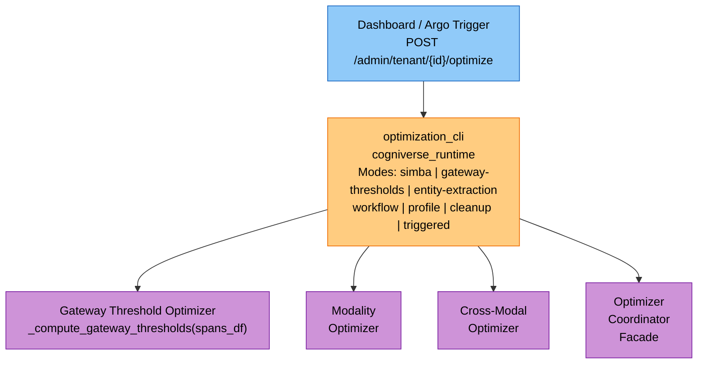
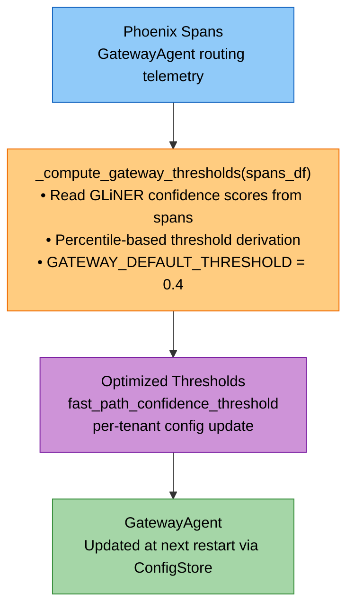
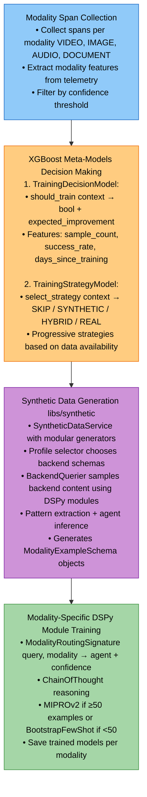
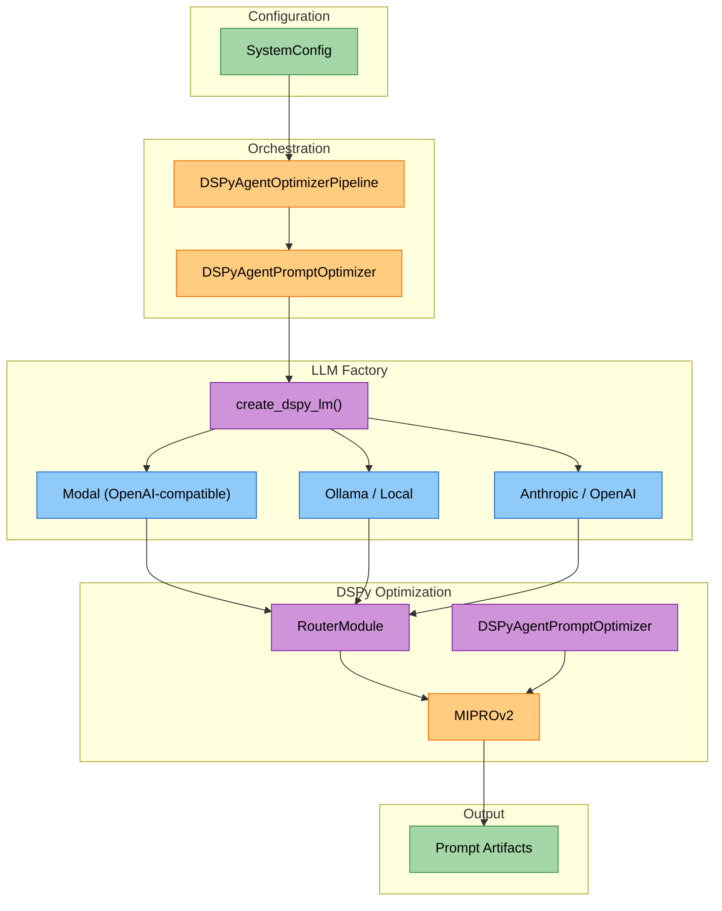

# Optimization Module Study Guide

**Package:** `cogniverse_agents` (Implementation Layer)
**Module Location:** `libs/agents/cogniverse_agents/routing/` (optimization components)

---

## Package Structure

```text
libs/agents/cogniverse_agents/routing/
├── modality_optimizer.py          # Per-modality optimization with XGBoost
├── cross_modal_optimizer.py       # Cross-modal fusion optimization
├── optimizer_coordinator.py       # Facade for optimizer routing
└── optimizer.py                   # Base optimizer with auto-tuning

libs/runtime/cogniverse_runtime/
├── optimization_cli.py            # CLI for per-agent optimization modes
│                                  # Modes: simba|gateway-thresholds|entity-extraction|
│                                  #        workflow|profile|cleanup|triggered|synthetic
└── routers/tenant.py              # POST /admin/tenant/{id}/optimize (on-demand submit)

libs/synthetic/                     # Synthetic data generation system
├── cogniverse_synthetic/
│   ├── service.py                 # Main SyntheticDataService
│   ├── generators/                # Optimizer-specific generators
│   │   ├── base.py               # Base generator classes
│   │   ├── modality.py           # ModalityOptimizer training data
│   │   ├── cross_modal.py        # CrossModalOptimizer training data
│   │   └── workflow.py           # WorkflowIntelligence training data
│   ├── profile_selector.py       # LLM-based profile selection
│   ├── backend_querier.py        # Vespa content sampling
│   └── utils/                    # Pattern extraction and agent inference
```

---

## Table of Contents
1. [Module Overview](#module-overview)
2. [Architecture](#architecture)
3. [Core Components](#core-components)
4. [Usage Examples](#usage-examples)
5. [Production Considerations](#production-considerations)
6. [Testing](#testing)

---

## Module Overview

### Purpose
The Optimization Module provides sophisticated multi-stage optimization for routing decisions, modality-specific routing, and cross-modal result fusion using DSPy 3.0 advanced optimizers (GEPA, MIPROv2, SIMBA, BootstrapFewShot).

### Key Features
- **Advanced DSPy Optimization**: GEPA, MIPROv2, SIMBA, BootstrapFewShot optimizers
- **Gateway Threshold Tuning**: `_compute_gateway_thresholds()` derives GLiNER thresholds from Phoenix spans
- **Modality-Specific Optimization**: Per-modality routing with XGBoost meta-learning
- **Optimizer Coordination**: Facade pattern for optimizer requests
- **On-Demand Workflows**: Dashboard triggers POST `/admin/tenant/{id}/optimize`, which submits an Argo Workflow

### Dependencies

**Note**: Optimizer classes require full module path imports as they are not exported at package level.

```python
# Optimizers (require full module paths)
from cogniverse_agents.routing.modality_optimizer import ModalityOptimizer
from cogniverse_agents.routing.cross_modal_optimizer import CrossModalOptimizer

# CLI optimization (gateway-thresholds mode)
from cogniverse_runtime.optimization_cli import _compute_gateway_thresholds, GATEWAY_DEFAULT_THRESHOLD

# Synthetic Data Generation (exported at package level)
from cogniverse_synthetic import SyntheticDataService, SyntheticDataRequest, SyntheticDataResponse
from cogniverse_synthetic import OPTIMIZER_REGISTRY
```

---

## Architecture

### 1. Optimization Architecture


```mermaid
flowchart TB
    Dashboard["<span style='color:#000'>Dashboard / Argo Trigger<br/>POST /admin/tenant/{id}/optimize</span>"]

    Dashboard --> OptCLI["<span style='color:#000'>optimization_cli<br/>cogniverse_runtime<br/>Modes: simba | gateway-thresholds | entity-extraction<br/>workflow | profile | cleanup | triggered</span>"]

    OptCLI --> GatewayOpt["<span style='color:#000'>Gateway Threshold Optimizer<br/>_compute_gateway_thresholds(spans_df)</span>"]
    OptCLI --> Modality["<span style='color:#000'>Modality<br/>Optimizer</span>"]
    OptCLI --> CrossModal["<span style='color:#000'>Cross-Modal<br/>Optimizer</span>"]
    OptCLI --> Coordinator["<span style='color:#000'>Optimizer<br/>Coordinator<br/>Facade</span>"]

    style Dashboard fill:#90caf9,stroke:#1565c0,color:#000
    style OptCLI fill:#ffcc80,stroke:#ef6c00,color:#000
    style GatewayOpt fill:#ce93d8,stroke:#7b1fa2,color:#000
    style Modality fill:#ce93d8,stroke:#7b1fa2,color:#000
    style CrossModal fill:#ce93d8,stroke:#7b1fa2,color:#000
    style Coordinator fill:#ce93d8,stroke:#7b1fa2,color:#000
```

### 2. Gateway Threshold Optimization Architecture


```mermaid
flowchart TB
    Phoenix["<span style='color:#000'>Phoenix Spans<br/>GatewayAgent routing telemetry</span>"]

    Phoenix --> Compute["<span style='color:#000'>_compute_gateway_thresholds(spans_df)<br/>• Read GLiNER confidence scores from spans<br/>• Percentile-based threshold derivation<br/>• GATEWAY_DEFAULT_THRESHOLD = 0.4</span>"]

    Compute --> Thresholds["<span style='color:#000'>Optimized Thresholds<br/>fast_path_confidence_threshold<br/>per-tenant config update</span>"]

    Thresholds --> Gateway["<span style='color:#000'>GatewayAgent<br/>Updated at next restart via ConfigStore</span>"]

    style Phoenix fill:#90caf9,stroke:#1565c0,color:#000
    style Compute fill:#ffcc80,stroke:#ef6c00,color:#000
    style Thresholds fill:#ce93d8,stroke:#7b1fa2,color:#000
    style Gateway fill:#a5d6a7,stroke:#388e3c,color:#000
```

### 3. Modality Optimizer Architecture (XGBoost Meta-Learning)


```mermaid
flowchart TB
    SpanCollection["<span style='color:#000'>Modality Span Collection<br/>• Collect spans per modality VIDEO, IMAGE, AUDIO, DOCUMENT<br/>• Extract modality features from telemetry<br/>• Filter by confidence threshold</span>"]

    SpanCollection --> XGBoost["<span style='color:#000'>XGBoost Meta-Models Decision Making<br/>1. TrainingDecisionModel:<br/>• should_train context → bool + expected_improvement<br/>• Features: sample_count, success_rate, days_since_training<br/><br/>2. TrainingStrategyModel:<br/>• select_strategy context → SKIP / SYNTHETIC / HYBRID / REAL<br/>• Progressive strategies based on data availability</span>"]

    XGBoost --> SyntheticService["<span style='color:#000'>Synthetic Data Generation libs/synthetic<br/>• SyntheticDataService with modular generators<br/>• Profile selector chooses backend schemas<br/>• BackendQuerier samples backend content using DSPy modules<br/>• Pattern extraction + agent inference<br/>• Generates ModalityExampleSchema objects</span>"]

    SyntheticService --> Training["<span style='color:#000'>Modality-Specific DSPy Module Training<br/>• ModalityRoutingSignature query, modality → agent + confidence<br/>• ChainOfThought reasoning<br/>• MIPROv2 if ≥50 examples or BootstrapFewShot if <50<br/>• Save trained models per modality</span>"]

    style SpanCollection fill:#90caf9,stroke:#1565c0,color:#000
    style XGBoost fill:#ffcc80,stroke:#ef6c00,color:#000
    style SyntheticService fill:#ce93d8,stroke:#7b1fa2,color:#000
    style Training fill:#a5d6a7,stroke:#388e3c,color:#000
```

---

## Core Components

### 1. **Gateway Threshold Optimizer** (`optimization_cli.py`)

On-demand gateway confidence threshold tuning using Phoenix span data.

**Key Functions:**

```python
GATEWAY_DEFAULT_THRESHOLD = 0.4

def _compute_gateway_thresholds(spans_df) -> dict:
    """
    Derive optimized GLiNER confidence thresholds from Phoenix spans.

    Reads gateway routing spans and uses percentile analysis to
    find the threshold that minimises misrouting while maintaining
    fast-path hit rate.

    Returns:
        {"fast_path_confidence_threshold": float, ...}
    """
```

**On-Demand Submission:**
```python
# Dashboard or Argo submits via runtime API:
# POST /admin/tenant/{tenant_id}/optimize
# Body: {"mode": "gateway-thresholds"}
# Returns: {workflow_name, namespace, mode, status_url}

# Check run status:
# GET /admin/tenant/{tenant_id}/optimize/runs/{workflow_name}
# Returns: {phase, started_at, finished_at, message}
```

**File:** `libs/runtime/cogniverse_runtime/optimization_cli.py`

---

### 2. **ModalityOptimizer**

Per-modality routing optimization with XGBoost meta-learning.

**Key Methods:**

```python
async def optimize_all_modalities(
    lookback_hours: int = 24,
    min_confidence: float = 0.7
) -> Dict[QueryModality, Dict[str, Any]]:
    """
    Evaluate and optimize all modalities (VIDEO, IMAGE, AUDIO, DOCUMENT)

    For each modality:
    1. Collect training examples from Phoenix spans
    2. Build ModelingContext
    3. Use XGBoost to decide: should_train?
    4. Select training strategy (SYNTHETIC/HYBRID/PURE_REAL)
    5. Train modality-specific DSPy module

    Returns optimization results per modality
    """

async def optimize_modality(
    modality: QueryModality,
    lookback_hours: int = 24,
    min_confidence: float = 0.7,
    force_training: bool = False
) -> Dict[str, Any]:
    """
    Optimize single modality:

    1. Collect training examples
    2. Build ModelingContext
    3. TrainingDecisionModel.should_train(context)
    4. TrainingStrategyModel.select_strategy(context)
    5. Prepare training data (synthetic/hybrid/real)
    6. Train ModalityRoutingModule (DSPy)
    7. Record training history

    Returns:
        {
            "modality": str,
            "trained": bool,
            "strategy": str,
            "examples_count": int,
            "expected_improvement": float,
            "training_result": dict
        }
    """

def predict_agent(
    query: str,
    modality: QueryModality,
    query_features: Optional[Dict[str, Any]] = None
) -> Optional[Dict[str, Any]]:
    """
    Predict best agent using trained modality model

    Returns:
        {
            "recommended_agent": str,
            "confidence": float,
            "reasoning": str,
            "modality": str
        }
    or None if no model trained
    """

def get_optimization_summary(self) -> Dict[str, Any]:
    """
    Get summary of all modality optimizations

    Returns training history, meta-model status, last training details
    """
```

**XGBoost Meta-Models:**
```python
# 1. TrainingDecisionModel
should_train(context: ModelingContext) -> Tuple[bool, float]:
    """
    Decide whether to train based on:
    - real_sample_count (sufficient data?)
    - success_rate (performance degradation?)
    - days_since_last_training (stale model?)
    - current_performance_score
    - data_quality_score

    Returns: (should_train: bool, expected_improvement: float)
    """

# 2. TrainingStrategyModel
select_strategy(context: ModelingContext) -> TrainingStrategy:
    """
    Select strategy based on data availability:
    - SKIP: Not enough benefit
    - SYNTHETIC: < 20 real examples
    - HYBRID: 20-50 real examples (mix synthetic + real)
    - PURE_REAL: >= 50 real examples

    Returns: TrainingStrategy enum
    """
```

**Modality-Specific DSPy Module:**
```python
class ModalityRoutingSignature(dspy.Signature):
    query = dspy.InputField(desc="User query")
    modality = dspy.InputField(desc="Query modality (video, image, audio, document, text)")
    query_features = dspy.InputField(desc="Extracted query features as JSON")

    recommended_agent = dspy.OutputField(desc="Recommended agent")
    confidence = dspy.OutputField(desc="Confidence (0-1)")
    reasoning = dspy.OutputField(desc="Reasoning for routing choice")

class ModalityRoutingModule(dspy.Module):
    def __init__(self):
        super().__init__()
        self.route = dspy.ChainOfThought(ModalityRoutingSignature)
```

**Training:**

- Uses **MIPROv2** if ≥50 examples (metric-aware instruction optimization)

- Uses **BootstrapFewShot** if <50 examples (few-shot learning)

- Saves trained models per modality to telemetry via `ArtifactManager.save_blob()`

**File:** `libs/agents/cogniverse_agents/routing/modality_optimizer.py`

---

### 3. **OptimizerCoordinator**

Facade pattern for routing optimization requests to appropriate optimizers.

**Key Methods:**

```python
def optimize(
    type: OptimizationType,
    training_data: List[Dict[str, Any]],
    **kwargs
) -> Dict[str, Any]:
    """
    Route optimization request to appropriate optimizer:

    - MODALITY → ModalityOptimizer
    - CROSS_MODAL → CrossModalOptimizer

    Returns optimization results
    """

def get_optimizer(
    type: OptimizationType
):
    """
    Get direct access to specific optimizer

    Use when you need optimizer-specific methods not exposed via coordinator
    """

def get_optimization_status(self) -> Dict[str, Any]:
    """
    Get status of all loaded optimizers

    Returns:
        {
            "tenant_id": str,
            "loaded_optimizers": List[str]
        }
    """
```

**Lazy Loading:**
```python
# Optimizers loaded on-demand to minimize memory usage
_get_modality_optimizer()    # ModalityOptimizer(llm_config, telemetry_provider, tenant_id)
_get_cross_modal_optimizer() # CrossModalOptimizer(telemetry_provider, tenant_id)
```

**OptimizationType Enum:**
```python
class OptimizationType(Enum):
    MODALITY = "modality"        # ModalityOptimizer
    CROSS_MODAL = "cross_modal"  # CrossModalOptimizer
    ORCHESTRATION = "orchestration"
```

**File:** `libs/agents/cogniverse_agents/routing/optimizer_coordinator.py`

---

### 4. **RoutingOptimizer**

Base optimizer for routing strategies with auto-tuning.

**Key Methods:**

```python
def track_performance(
    query: str,
    predicted: RoutingDecision,
    actual: RoutingDecision | None = None,
    user_feedback: dict[str, Any] | None = None
):
    """
    Track routing performance for single query

    Triggers optimization if conditions met:
    - Time since last optimization > interval
    - Samples >= min_samples_for_optimization
    - Performance degradation detected
    """

async def optimize(self):
    """
    Run optimization process (to be overridden)

    Base implementation:
    - Calculates current metrics
    - Updates baseline if improved
    - Exports metrics to file
    """

def _calculate_current_metrics(self) -> OptimizationMetrics:
    """
    Calculate performance metrics from history:
    - Accuracy, precision, recall, F1 score
    - Average latency
    - Confidence correlation (alignment with success)
    - Error rate
    """
```

**Configuration (OptimizationConfig):**
```python
@dataclass
class OptimizationConfig:
    # Triggers
    min_samples_for_optimization: int = 100
    optimization_interval_seconds: int = 3600  # 1 hour
    performance_degradation_threshold: float = 0.1  # 10% drop

    # Thresholds
    min_accuracy: float = 0.8
    min_precision: float = 0.75
    min_recall: float = 0.75
    max_acceptable_latency_ms: float = 100

    # Learning
    learning_rate: float = 0.1
    momentum: float = 0.9
    weight_decay: float = 0.01

    # DSPy
    dspy_enabled: bool = True
    dspy_max_bootstrapped_demos: int = 10
    dspy_max_labeled_demos: int = 50
    dspy_metric: str = "f1"

    # GLiNER
    gliner_threshold_optimization: bool = True
    gliner_label_optimization: bool = True
    gliner_threshold_step: float = 0.05

    # Storage
    max_history_size: int = 10000
```

**File:** `libs/agents/cogniverse_agents/routing/optimizer.py`

---

## Usage Examples

### Example 1: On-Demand Gateway Threshold Optimization

```bash
# Submit gateway-threshold optimization via the runtime API (dashboard or CLI):
curl -X POST http://localhost:8000/admin/tenant/acme:production/optimize \
  -H "Content-Type: application/json" \
  -d '{"mode": "gateway-thresholds"}'
# Returns: {"workflow_name": "opt-gateway-acme-...", "namespace": "cogniverse",
#           "mode": "gateway-thresholds", "status_url": "/admin/tenant/acme:production/optimize/runs/opt-gateway-acme-..."}

# Check status:
curl http://localhost:8000/admin/tenant/acme:production/optimize/runs/opt-gateway-acme-...
# Returns: {"phase": "Succeeded", "started_at": "...", "finished_at": "...", "message": ""}

# Terminate a running Workflow:
curl -X POST http://localhost:8000/admin/tenant/acme:production/optimize/runs/opt-gateway-acme-.../cancel
# Returns: {"phase": "Failed", "message": "Terminated by user", ...}

# Retry a failed Workflow (restarts only the failed nodes, reuses successful ones):
curl -X POST http://localhost:8000/admin/tenant/acme:production/optimize/runs/opt-gateway-acme-.../retry
# Returns: {"phase": "Running", ...}
```

The runtime does not inline the container spec into each submitted
Workflow. Instead it references a chart-installed ``WorkflowTemplate``
(``cogniverse-optimization-runner``) via ``spec.workflowTemplateRef``:
the scheduled CronWorkflows (``agent-optimization`` weekly,
``daily-gateway`` daily) use the same template, so the image/env/
resource/mutex spec lives in one place
(``charts/cogniverse/templates/optimization-workflow-template.yaml``).

The WorkflowTemplate declares a **per-tenant mutex** so multiple submits
for the same tenant serialise (prevents the dashboard Run button from
stacking pods); different tenants optimize independently.

```python
# The Argo Workflow runs optimization_cli internally:
# uv run python -m cogniverse_runtime.optimization_cli --mode gateway-thresholds --tenant-id acme:production

# To call the threshold computation directly in tests:
from cogniverse_runtime.optimization_cli import _compute_gateway_thresholds, GATEWAY_DEFAULT_THRESHOLD

thresholds = _compute_gateway_thresholds(spans_df)
# Returns: {"fast_path_confidence_threshold": 0.62, ...}
print(f"Default threshold: {GATEWAY_DEFAULT_THRESHOLD}")  # 0.4
print(f"Computed threshold: {thresholds['fast_path_confidence_threshold']:.2f}")  # 0.62
```

---

### Example 2: Modality-Specific Optimization with XGBoost

```python
from cogniverse_agents.routing.modality_optimizer import ModalityOptimizer, QueryModality
from cogniverse_foundation.config.unified_config import LLMEndpointConfig

# Initialize modality optimizer
# vespa_client and backend_config parameters are optional (default to None)
# Provide them only if using synthetic data generation
optimizer = ModalityOptimizer(
    llm_config=LLMEndpointConfig(       # REQUIRED: LLM config for DSPy training
        model="ollama_chat/qwen3:4b",
        api_base="http://localhost:11434",
    ),
    telemetry_provider=telemetry_provider,
    tenant_id="production",
    vespa_client=None,  # Optional VespaClient instance for synthetic data generation
    backend_config=None  # Optional backend config dict for synthetic data generation
)

# Optimize all modalities automatically
results = await optimizer.optimize_all_modalities(
    lookback_hours=24,      # Look back 24 hours for training data
    min_confidence=0.7      # Filter spans with confidence >= 0.7
)

for modality, result in results.items():
    print(f"\n{modality.value}:")
    if result["trained"]:
        print(f"  Strategy: {result['strategy']}")  # HYBRID, PURE_REAL, SYNTHETIC
        print(f"  Examples: {result['examples_count']}")  # 85
        print(f"  Expected improvement: {result['expected_improvement']:.3f}")  # 0.123
        print(f"  Training result: {result['training_result']['status']}")  # success
        print(f"  Validation accuracy: {result['training_result']['validation_accuracy']:.2f}")  # 0.92
    else:
        print(f"  Reason: {result['reason']}")  # insufficient_benefit

# Optimize specific modality with force training
video_result = await optimizer.optimize_modality(
    modality=QueryModality.VIDEO,
    lookback_hours=72,  # More data
    min_confidence=0.6,
    force_training=True  # Force training regardless of XGBoost decision
)

# Use trained model for predictions
prediction = optimizer.predict_agent(
    query="Find videos about deep learning tutorials",
    modality=QueryModality.VIDEO,
    query_features={
        "query_length": 35,
        "has_technical_terms": True,
        "routing_confidence": 0.78
    }
)

if prediction:
    print(f"Recommended agent: {prediction['recommended_agent']}")  # video_search_agent
    print(f"Confidence: {prediction['confidence']:.2f}")  # 0.91
    print(f"Reasoning: {prediction['reasoning']}")

# Get optimization summary
summary = optimizer.get_optimization_summary()
print(f"Total modalities trained: {summary['total_modalities']}")
print(f"Meta-model status: {summary['meta_models']}")
for modality, details in summary['modalities'].items():
    print(f"{modality}: {details['training_count']} trainings, last: {details['last_training']}")
```

### Example 3: OptimizerCoordinator (Facade Pattern)

```python
from cogniverse_agents.routing.optimizer_coordinator import OptimizerCoordinator, OptimizationType
from cogniverse_foundation.config.unified_config import LLMEndpointConfig

# Initialize coordinator with lazy-loaded optimizers
coordinator = OptimizerCoordinator(
    llm_config=LLMEndpointConfig(
        model="ollama_chat/qwen3:4b",
        api_base="http://localhost:11434",
    ),
    telemetry_provider=telemetry_provider,
    tenant_id="production",
)

# Prepare training data
training_data = [
    {
        "query": "Find quantum physics lectures",
        "correct_agent": "video_search_agent",
        "entities": [{"text": "quantum physics", "label": "topic"}],
        "success": True,
        "user_satisfaction": 0.9
    },
    # ... more examples
]

modality_result = coordinator.optimize(
    type=OptimizationType.MODALITY,
    training_data=training_data,
    modality="video"  # Required for modality optimization
)

cross_modal_result = coordinator.optimize(
    type=OptimizationType.CROSS_MODAL,
    training_data=training_data
)

# Get status of all optimizers
status = coordinator.get_optimization_status()
print(f"Loaded optimizers: {status['loaded_optimizers']}")
```

---

## Production Considerations

### 1. **Performance Optimization**

**Lazy Loading:**
```python
# OptimizerCoordinator lazy-loads optimizers to minimize memory
coordinator = OptimizerCoordinator(
    llm_config=llm_config,
    telemetry_provider=telemetry_provider,
    tenant_id="production",
)  # No optimizers loaded yet

# Optimizers loaded on first use
modality_optimizer = coordinator.get_optimizer(OptimizationType.MODALITY)  # Now loaded
```

**Asynchronous Optimization:**
```python
# Argo Workflow runs CLI modes in background without blocking runtime
# POST /admin/tenant/{tenant_id}/optimize → submits Argo Workflow → returns immediately
```

---

### 2. **Data Quality and Safety**

**Confidence Thresholds:**
```python
# Only use high-confidence spans for training
min_confidence = 0.7  # Adjust based on model calibration
```

**Synthetic Data Control:**
```python
# Progressive strategies based on data availability
strategy = training_strategy_model.select_strategy(context)

# SYNTHETIC: Use only when real data < 20 examples
# HYBRID: Mix real + synthetic (1:1 ratio) for 20-50 examples
# PURE_REAL: Use only real data when >= 50 examples
```

---

### 3. **Multi-Tenant Isolation**

**Tenant-Specific Optimization:**
```python
# Each tenant has isolated optimization state via telemetry
# Optimization is submitted per-tenant via the runtime API:
# POST /admin/tenant/tenant_a/optimize  {"mode": "gateway-thresholds"}
# POST /admin/tenant/tenant_b/optimize  {"mode": "simba"}

# ModalityOptimizer uses tenant-scoped telemetry provider for artifact isolation
provider_a = telemetry_manager.get_provider(tenant_id="tenant_a")
modality_optimizer_a = ModalityOptimizer(
    llm_config=llm_config,
    telemetry_provider=provider_a,
    tenant_id="tenant_a",
)
```

**Shared vs Tenant-Specific Models:**
```python
# Option 1: Tenant-specific models (better personalization)
modality_optimizer = ModalityOptimizer(
    llm_config=llm_config,
    telemetry_provider=provider_a,
    tenant_id="tenant_a",
)

# Option 2: Shared models (faster cold start, less personalization)
shared_modality_optimizer = ModalityOptimizer(
    llm_config=llm_config,
    telemetry_provider=shared_provider,
    tenant_id="shared",
)
```

---

### 4. **Monitoring and Observability**

**Workflow Status Monitoring:**
```bash
# Check status of a submitted optimization workflow
curl http://localhost:8000/admin/tenant/acme:production/optimize/runs/<workflow_name>
# {"phase": "Running", "started_at": "2026-04-24T03:00:00Z", "finished_at": null, "message": ""}

# List all optimization workflows
argo list -n cogniverse --selector workflow-type=optimization
```

**Performance Degradation Detection via QualityMonitor:**
```python
# QualityMonitor (cogniverse_evaluation) checks agent scores and submits
# optimization workflows automatically via quality_monitor_cli
# uv run python -m cogniverse_runtime.quality_monitor_cli --tenant-id default --runtime-url http://localhost:8000
```

---

### 5. **Production Deployment**

**Optimization is on-demand, not a long-running service.**

```bash
# Trigger via dashboard UI button or direct API call:
curl -X POST http://localhost:8000/admin/tenant/acme:production/optimize \
  -d '{"mode": "gateway-thresholds"}'

# Or run directly via CLI (e.g., from Argo Workflow template):
uv run python -m cogniverse_runtime.optimization_cli \
  --mode gateway-thresholds --tenant-id acme:production
```

---

### 6. **Production Deployment Infrastructure**

The optimization module includes production-ready deployment infrastructure with CLI tools and Argo Workflows for batch and scheduled optimization.

#### CLI: `cogniverse_runtime.optimization_cli`

**Command-line interface for per-agent optimization:**

```bash
# Optimize modality routing (SIMBA)
uv run python -m cogniverse_runtime.optimization_cli \
  --mode simba \
  --tenant-id default

# Optimize gateway thresholds
uv run python -m cogniverse_runtime.optimization_cli \
  --mode gateway-thresholds \
  --tenant-id default

# Optimize entity extraction
uv run python -m cogniverse_runtime.optimization_cli \
  --mode entity-extraction \
  --tenant-id default

# Optimize workflow orchestration
uv run python -m cogniverse_runtime.optimization_cli \
  --mode workflow \
  --tenant-id default

# Optimize search profile selection
uv run python -m cogniverse_runtime.optimization_cli \
  --mode profile \
  --tenant-id default

# Clean up old optimization logs
uv run python -m cogniverse_runtime.optimization_cli \
  --mode cleanup \
  --log-retention-days 7
```

**Available Options:**

- `--mode`: Which agent to optimize (simba/gateway-thresholds/entity-extraction/workflow/profile/cleanup/triggered/synthetic)

- `--tenant-id`: Tenant identifier (default: "default")

- `--log-retention-days`: Days to retain logs (cleanup mode, default: 7)

**Automatic DSPy Optimizer Selection:**
The CLI automatically selects the best DSPy optimizer based on training data size:

- < 100 examples → Bootstrap

- 100-500 examples → SIMBA

- 500-1000 examples → MIPRO

- \> 1000 examples → GEPA

#### Argo Workflows Integration

**Batch Optimization Workflow:**

Submit module optimization as Kubernetes workflow:

```bash
# Submit batch optimization
argo submit workflows/batch-optimization.yaml \
  -n cogniverse \
  --parameter tenant-id="acme_corp" \
  --parameter optimizer-category="routing" \
  --parameter optimizer-type="modality" \
  --parameter max-iterations="100" \
  --parameter use-synthetic-data="true"
```

**Scheduled Optimization CronWorkflows:**

Automatic optimization on schedule:

**Scheduled CronWorkflows** (`workflows/auto-optimization-cron.yaml`, `workflows/scheduled-optimization.yaml`, `workflows/scheduled-maintenance.yaml`):

Weekly Optimization (Sunday 3 AM UTC):
```bash
# View schedule
kubectl get cronworkflow weekly-optimization -n cogniverse

# Check last run
argo list -n cogniverse --selector workflows.argoproj.io/cron-workflow=weekly-optimization --limit 1

# Trigger manually
argo submit --from cronwf/weekly-optimization -n cogniverse
```

Daily Optimization Check (4 AM UTC):
```bash
# View schedule (once implemented)
kubectl get cronworkflow daily-optimization-check -n cogniverse

# Suspend/resume
argo cron suspend daily-optimization-check -n cogniverse
argo cron resume daily-optimization-check -n cogniverse
```

**What Gets Optimized:**

- Weekly: All modules (modality, cross_modal, workflow, gateway-thresholds) + DSPy optimizer

- Daily: gateway-thresholds optimization

**Automatic Execution:**

- Checks Phoenix for annotation count

- Runs optimization if annotation threshold met (weekly: 50, daily: 20)

- Generates synthetic data from backend storage using DSPy modules

- Auto-selects DSPy optimizer based on data size

- Deploys if improvement > 5%

#### Module Optimization vs DSPy Optimization

**Module Optimization** (`optimizer-category: modality`):

- **What**: modality, cross_modal, workflow modules

- **How**: Auto-selected DSPy optimizer (Bootstrap/SIMBA/MIPRO/GEPA)

- **Data**: Phoenix traces + synthetic data generation

- **Use case**: Optimize routing decisions and workflow planning

**DSPy Optimization** (`optimizer-category: dspy`):

- **What**: DSPy modules (prompt templates, reasoning chains)

- **How**: Explicit DSPy optimizer (GEPA/Bootstrap/SIMBA/MIPRO)

- **Data**: Golden evaluation datasets

- **Use case**: Teacher-student distillation for local models

#### Monitoring Workflows

```bash
# List optimization workflows
argo list -n cogniverse --selector workflow-type=optimization

# Get workflow results
argo get <workflow-name> -n cogniverse -o json | \
  jq '.status.nodes | .[] | select(.displayName=="run-optimization") | .outputs.parameters'

# View improvement metrics
argo get <workflow-name> -n cogniverse -o json | \
  jq -r '.status.outputs.parameters[] | select(.name=="improvement") | .value'
```

#### UI Dashboard Integration

The optimization infrastructure integrates with the Streamlit dashboard:

**Module Optimization Tab:**

- Submit Argo workflows on-demand

- Configure optimization parameters

- Generate synthetic training data

- Monitor workflow progress

- View optimization results

**Execution Modes:**

1. **Automatic (Scheduled)**: CronWorkflows run optimization_cli on schedule

2. **Manual (Dashboard-triggered)**: Dashboard button calls POST `/admin/tenant/{id}/optimize` → submits Argo Workflow on demand

See `docs/development/ui-dashboard.md` for full UI documentation.

---

### 7. **Error Handling and Recovery**

**Workflow Failure Handling:**
```bash
# Check failed workflow details
argo get <workflow-name> -n cogniverse -o json | jq '.status.message'

# Retry a failed optimization
argo resubmit <workflow-name> -n cogniverse
```

**Artifact Persistence:**

Optimization artifacts are persisted to the telemetry store via `ArtifactManager` using Phoenix `DatasetStore`. The ModalityOptimizer and DSPyAgentPromptOptimizer save compiled modules that agents reload at startup.

---

## Testing

### Test Files

**Modality Optimizer:**

- Location: `tests/routing/unit/test_modality_optimizer.py`

- Focus: Per-modality optimization, XGBoost meta-learning, synthetic data

- Key Tests:
  - `test_optimize_modality_with_synthetic_data`
  - `test_xgboost_training_decision_model`
  - `test_modality_model_training`
  - `test_predict_agent_with_trained_model`

**Optimizer Coordinator:**

- Location: `tests/routing/unit/test_optimizer_coordinator.py`

- Focus: Facade pattern, lazy loading, optimizer routing

**Gateway Threshold Computation:**

- Location: `tests/runtime/unit/test_optimization_cli.py`

- Key Tests:
  - `test_compute_gateway_thresholds`
  - `test_gateway_default_threshold`

---

### Test Scenarios

**1. XGBoost Meta-Model Training:**
```python
@pytest.mark.asyncio
async def test_xgboost_meta_model_training():
    """Test XGBoost meta-models for training decisions"""
    optimizer = ModalityOptimizer(
        llm_config=LLMEndpointConfig(model="ollama_chat/qwen3:4b", api_base="http://localhost:11434"),
        telemetry_provider=telemetry_provider,
        tenant_id="test",
    )

    contexts = [
        ModelingContext(
            modality=QueryModality.VIDEO,
            real_sample_count=100,
            success_rate=0.85,
            days_since_last_training=30
        ),
        ModelingContext(
            modality=QueryModality.VIDEO,
            real_sample_count=10,
            success_rate=0.6,
            days_since_last_training=5
        )
    ]

    optimizer.training_decision_model.train(contexts, targets=[True, False])

    should_train_1, _ = optimizer.training_decision_model.should_train(contexts[0])
    assert should_train_1 == True

    should_train_2, _ = optimizer.training_decision_model.should_train(contexts[1])
    assert should_train_2 == False
```

**2. Gateway Threshold Computation:**
```python
def test_compute_gateway_thresholds():
    """Test threshold derivation from Phoenix spans"""
    from cogniverse_runtime.optimization_cli import _compute_gateway_thresholds, GATEWAY_DEFAULT_THRESHOLD
    import pandas as pd

    spans_df = pd.DataFrame({
        "gliner_confidence": [0.3, 0.5, 0.6, 0.7, 0.8, 0.9],
        "routing_correct": [False, True, True, True, True, True],
    })

    result = _compute_gateway_thresholds(spans_df)
    assert "fast_path_confidence_threshold" in result
    assert GATEWAY_DEFAULT_THRESHOLD == 0.4
```

---

**Coverage:**

- **Unit tests**: ModalityOptimizer logic, XGBoost meta-models, gateway threshold computation

- **Integration tests**: Modality optimization with synthetic data, optimizer coordinator routing

- **Error handling tests**: Graceful degradation, artifact persistence

---

## DSPy Training Data Requirements

### Overview

DSPy optimizers require properly formatted training examples with **all expected output fields** defined. Missing fields will cause `AttributeError: 'Example' object has no attribute 'field_name'` during metric evaluation.

### Training Data Format

Each DSPy `Example` must include:
1. **Input fields** (marked with `.with_inputs()`)
2. **All output fields** that metrics will access

**Example Structure:**
```python
import dspy

example = dspy.Example(
    # Input fields
    query="user query here",
    context="optional context",

    # Output fields (ALL fields that metrics check must be present)
    primary_intent="search",
    confidence=0.9,
    recommended_agent="video_search"
).with_inputs("query", "context")  # Specify which fields are inputs
```

### Query Analysis Training Data

**Required Output Fields:**

- `primary_intent`: Main intent category

- `complexity_level`: "simple" | "complex"

- `needs_video_search`: "true" | "false"

- `needs_text_search`: "true" | "false"

- `multimodal_query`: "true" | "false"

- `temporal_pattern`: Temporal info or "none"

**Example:**
```python
training_data = [
    dspy.Example(
        query="Show me videos of robots from yesterday",
        context="",
        # All output fields required for metrics
        primary_intent="video_search",
        complexity_level="simple",
        needs_video_search="true",
        needs_text_search="false",
        multimodal_query="false",
        temporal_pattern="yesterday",
    ).with_inputs("query", "context"),

    dspy.Example(
        query="Compare research papers on deep learning",
        context="academic",
        primary_intent="analysis",
        complexity_level="complex",
        needs_video_search="false",
        needs_text_search="true",
        multimodal_query="false",
        temporal_pattern="none",
    ).with_inputs("query", "context"),
]
```

### Agent Routing Training Data

**Required Output Fields:**

- `recommended_workflow`: Workflow type

- `primary_agent`: Main agent to use

- `routing_confidence`: Confidence score (0.0-1.0 as string)

**Example:**
```python
training_data = [
    dspy.Example(
        query="Show me videos",
        analysis_result="simple search",
        available_agents="video_search",
        # All output fields
        recommended_workflow="direct_search",
        primary_agent="video_search",
        routing_confidence="0.9",
    ).with_inputs("query", "analysis_result", "available_agents"),

    dspy.Example(
        query="Analyze data trends",
        analysis_result="complex analysis",
        available_agents="detailed_report",
        recommended_workflow="detailed_analysis",
        primary_agent="detailed_report",
        routing_confidence="0.85",
    ).with_inputs("query", "analysis_result", "available_agents"),
]
```

### Common Errors

#### Missing Output Fields

**Error:**
```python
AttributeError: 'Example' object has no attribute 'primary_intent'
```

**Cause:** Metric function accesses `example.primary_intent` but Example doesn't have that field.

**Fix:** Add the missing field to all training examples:
```python
example = dspy.Example(
    query="...",
    primary_intent="search",  # ← Add missing field
    # ... other fields
).with_inputs("query")
```

#### Incorrect Field Types

**Error:**
```python
TypeError: expected str, got bool
```

**Cause:** DSPy Examples store all fields as strings internally.

**Fix:** Convert to strings:
```python
# ❌ Bad
needs_video_search=True

# ✅ Good
needs_video_search="true"
```

### Validation

Before running optimization, validate your training data:

```python
def validate_training_data(examples, required_fields):
    """Validate all examples have required output fields."""
    for i, ex in enumerate(examples):
        for field in required_fields:
            if not hasattr(ex, field):
                raise ValueError(
                    f"Example {i} missing required field '{field}'"
                )
    print(f"✅ All {len(examples)} examples valid")

# Usage
required = ["primary_intent", "complexity_level", "needs_video_search"]
validate_training_data(training_data, required)
```

### Best Practices

1. **Define all output fields upfront** - Check what your metrics access
2. **Use consistent field names** - Match your DSPy signature output fields
3. **Validate before optimization** - Catch missing fields early
4. **Use string values** - DSPy converts everything to strings
5. **Document required fields** - Keep a reference list for your team

### File References

- `libs/agents/cogniverse_agents/optimizer/dspy_agent_optimizer.py` - Training data loading
- `tests/agents/integration/test_dspy_optimization_integration.py` - Example tests with proper format

---

## DSPy Agent Optimization Infrastructure

The `libs/agents/cogniverse_agents/optimizer/` package provides infrastructure for running DSPy optimization with configurable model providers (Modal GPU, local Ollama, cloud APIs).

**Location:** `libs/agents/cogniverse_agents/optimizer/`


```mermaid
flowchart TB
    subgraph "Configuration"
        Config["<span style='color:#000'>SystemConfig</span>"]
    end

    subgraph "Orchestration"
        Orch["<span style='color:#000'>DSPyAgentOptimizerPipeline</span>"]
        Client["<span style='color:#000'>DSPyAgentPromptOptimizer</span>"]
    end

    subgraph "LLM Factory"
        Factory["<span style='color:#000'>create_dspy_lm()</span>"]
        Modal["<span style='color:#000'>Modal (OpenAI-compatible)</span>"]
        Local["<span style='color:#000'>Ollama / Local</span>"]
        API["<span style='color:#000'>Anthropic / OpenAI</span>"]
    end

    subgraph "DSPy Optimization"
        Router["<span style='color:#000'>RouterModule</span>"]
        AgentOpt["<span style='color:#000'>DSPyAgentPromptOptimizer</span>"]
        MIPRO["<span style='color:#000'>MIPROv2</span>"]
    end

    subgraph "Output"
        Artifacts["<span style='color:#000'>Prompt Artifacts</span>"]
    end

    Config --> Orch
    Orch --> Client
    Client --> Factory

    Factory --> Modal
    Factory --> Local
    Factory --> API

    Modal --> Router
    Local --> Router
    API --> Router

    Router --> MIPRO
    AgentOpt --> MIPRO
    MIPRO --> Artifacts

    style Config fill:#a5d6a7,stroke:#388e3c,color:#000
    style Orch fill:#ffcc80,stroke:#ef6c00,color:#000
    style Client fill:#ffcc80,stroke:#ef6c00,color:#000
    style Factory fill:#ce93d8,stroke:#7b1fa2,color:#000
    style Modal fill:#90caf9,stroke:#1565c0,color:#000
    style Local fill:#90caf9,stroke:#1565c0,color:#000
    style API fill:#90caf9,stroke:#1565c0,color:#000
    style Router fill:#ce93d8,stroke:#7b1fa2,color:#000
    style AgentOpt fill:#ce93d8,stroke:#7b1fa2,color:#000
    style MIPRO fill:#ffcc80,stroke:#ef6c00,color:#000
    style Artifacts fill:#a5d6a7,stroke:#388e3c,color:#000
```

### LLM Factory

**Location:** `libs/foundation/cogniverse_foundation/config/llm_factory.py`

All DSPy LM creation goes through the centralized `create_dspy_lm()` factory. Provider is encoded in the model string (LiteLLM convention).

```python
from cogniverse_foundation.config.unified_config import LLMEndpointConfig
from cogniverse_foundation.config.llm_factory import create_dspy_lm

# Local Ollama
local_lm = create_dspy_lm(LLMEndpointConfig(
    model="ollama_chat/llama3:8b",
    api_base="http://localhost:11434",
))

# Modal (OpenAI-compatible endpoint)
modal_lm = create_dspy_lm(LLMEndpointConfig(
    model="openai/HuggingFaceTB/SmolLM3-3B",
    api_base="https://username--general-inference-service-serve.modal.run",
))

# Cloud API (Anthropic)
teacher_lm = create_dspy_lm(LLMEndpointConfig(
    model="anthropic/claude-3-5-sonnet-20241022",
    api_key="sk-ant-...",
))

# Use with scoped context (never global dspy.settings.configure)
import dspy
with dspy.context(lm=local_lm):
    result = module(query="Route this query...")
```

### LLM Configuration Structure

LLM configuration is centralized in the `llm_config` section of `config.json`:

```json
{
  "llm_config": {
    "primary": {
      "model": "ollama_chat/qwen3:4b",
      "api_base": "http://localhost:11434"
    },
    "teacher": {
      "model": "anthropic/claude-3-5-sonnet-20241022",
      "api_key": "sk-ant-..."
    },
    "overrides": {
      "orchestrator_agent": {
        "model": "ollama_chat/qwen3:8b"
      }
    }
  }
}
```

All agents and optimizers resolve their LLM config from this section via `LLMConfig.from_dict()` and `create_dspy_lm()`. The old `"optimization"`, `"inference"`, and `"llm"` config sections have been removed.

### DSPyAgentPromptOptimizer

**Location:** `libs/agents/cogniverse_agents/optimizer/dspy_agent_optimizer.py`

Optimizes prompts for multiple agent types using DSPy signatures.

```python
from cogniverse_agents.optimizer.dspy_agent_optimizer import (
    DSPyAgentPromptOptimizer,
    DSPyAgentOptimizerPipeline,
)

# Initialize optimizer
optimizer = DSPyAgentPromptOptimizer(config={
    "optimization": {
        "max_bootstrapped_demos": 8,
        "max_labeled_demos": 16,
        "max_rounds": 3,
        "stop_at_score": 0.95
    }
})

# Initialize language model via centralized LLM config
from cogniverse_foundation.config.unified_config import LLMEndpointConfig

endpoint_config = LLMEndpointConfig(
    model="ollama_chat/llama3:8b",
    api_base="http://localhost:11434",
)
optimizer.initialize_language_model(endpoint_config=endpoint_config)

# Create and run pipeline
pipeline = DSPyAgentOptimizerPipeline(optimizer)
optimized_modules = await pipeline.optimize_all_modules()

# Save optimized prompts via ArtifactManager → telemetry DatasetStore
await pipeline.save_optimized_prompts(
    tenant_id="production",
    telemetry_provider=telemetry_provider,
)
```

#### Optimizable Modules

| Module | DSPy Signature | Purpose |
|--------|----------------|---------|
| `query_analysis` | `QueryAnalysisSignature` | Intent detection, complexity analysis |
| `agent_routing` | `AgentRoutingSignature` | Agent selection, workflow recommendation |
| `summary_generation` | `SummaryGenerationSignature` | Summary quality optimization |
| `detailed_report` | `DetailedReportSignature` | Report structure optimization |

### RouterModule & MIPROv2 Optimization

**Location:** `libs/agents/cogniverse_agents/optimizer/router_optimizer.py`

DSPy module for routing decisions with MIPROv2 optimization.

```python
from cogniverse_agents.optimizer.router_optimizer import (
    RouterModule,
    optimize_router,
    OptimizedRouter,
    evaluate_routing_accuracy,
)
from cogniverse_agents.optimizer.schemas import RoutingDecision, AgenticRouter

# Create router module
router = RouterModule()

# Run MIPROv2 optimization (artifacts saved to telemetry via ArtifactManager)
results = optimize_router(
    student_config=LLMEndpointConfig(
        model="openai/google/gemma-3-1b-it",
        api_base="https://your-inference-endpoint",
    ),
    tenant_id="production",
    telemetry_provider=telemetry_provider,
    teacher_config=LLMEndpointConfig(
        model="anthropic/claude-3-5-sonnet-20241022",
        api_key="sk-ant-...",
    ),
    num_teacher_examples=50,
)

# Load optimized router for production (artifacts loaded from telemetry)
optimized = OptimizedRouter(
    tenant_id="production",
    telemetry_provider=telemetry_provider,
    lm_config=LLMEndpointConfig(
        model="openai/google/gemma-3-1b-it",
        api_base="https://your-inference-endpoint",
    ),
)
decision = optimized.route(
    user_query="Show me how to bake a cake",
    conversation_history=""
)
# Returns: RoutingDecision(search_modality="video", generation_type="raw_results")
```

### Schemas

**Location:** `libs/agents/cogniverse_agents/optimizer/schemas.py`

```python
from cogniverse_agents.optimizer.schemas import RoutingDecision, AgenticRouter

# Pydantic model for routing output
decision = RoutingDecision(
    search_modality="video",      # "video" or "text"
    generation_type="raw_results" # "detailed_report", "summary", "raw_results"
)

# DSPy signature for router
class AgenticRouter(dspy.Signature):
    conversation_history: str = dspy.InputField()
    user_query: str = dspy.InputField()
    routing_decision: RoutingDecision = dspy.OutputField()
```

### CLI Usage

```bash
# Run router optimizer directly
uv run python -m cogniverse_agents.optimizer.router_optimizer \
    --student-model google/gemma-3-1b-it \
    --teacher-model claude-3-5-sonnet-20241022 \
    --num-examples 50

# Run agent prompt optimization
uv run python -m cogniverse_agents.optimizer.dspy_agent_optimizer
```

### Output Artifacts

After optimization, artifacts are persisted to the telemetry store via `ArtifactManager` using Phoenix `DatasetStore`:

- `dspy-prompts-{tenant_id}-router` — Optimized system prompts for the router module
- `dspy-demos-{tenant_id}-router` — Few-shot demonstration examples
- `dspy-optimization-{tenant_id}` — Optimization run metrics (via ExperimentStore)

**Stored prompt artifact structure (retrieved from DatasetStore):**

```json
{
  "system_prompt": "Optimized instructions...",
  "few_shot_examples": [
    {
      "conversation_history": "",
      "user_query": "Show me tutorials on Python",
      "routing_decision": {"search_modality": "video", "generation_type": "raw_results"}
    }
  ],
  "model_config": {
    "student_model": "google/gemma-3-1b-it",
    "temperature": 0.1,
    "max_tokens": 100
  }
}
```

### File References

| File | Purpose |
|------|---------|
| `optimizer/dspy_agent_optimizer.py` | Multi-agent prompt optimization |
| `optimizer/router_optimizer.py` | Router MIPROv2 optimization |
| `optimizer/schemas.py` | RoutingDecision, AgenticRouter schemas |
| `optimizer/artifact_manager.py` | Artifact persistence via Phoenix DatasetStore |

---

## Related Documentation

- **Routing Module Study Guide**: `docs/modules/routing.md` - Tiered routing strategies
- **Agents Module Study Guide**: `docs/modules/agents.md` - OrchestratorAgent integration
- **Telemetry Module Study Guide**: `docs/modules/telemetry.md` - Phoenix span collection
- **Evaluation Module Study Guide**: `docs/modules/evaluation.md` - RoutingEvaluator
- **Modal Deployment Guide**: `docs/modal/deployment_guide.md` - Modal infrastructure setup

---

**Next Steps:**

1. Review DSPy 3.0 documentation for GEPA, MIPROv2, SIMBA optimizers

2. Experiment with different optimizer strategies (adaptive vs forced)

3. Monitor optimization metrics in production (avg_reward, success_rate, improvement_rate)

4. Tune reward weights for your use case (search_quality_weight, agent_success_weight)

5. Test synthetic data generation for modality optimization cold start

---

**File References:**

- `libs/agents/cogniverse_agents/routing/modality_optimizer.py` - Per-modality optimization with XGBoost

- `libs/agents/cogniverse_agents/routing/optimizer_coordinator.py` - Facade for optimizer routing

- `libs/agents/cogniverse_agents/routing/optimizer.py` - Base optimizer with auto-tuning

- `libs/agents/cogniverse_agents/optimizer/dspy_agent_optimizer.py` - Multi-agent DSPy prompt optimization

- `libs/agents/cogniverse_agents/optimizer/router_optimizer.py` - Router MIPROv2 optimization

- `libs/runtime/cogniverse_runtime/optimization_cli.py` - On-demand CLI modes (gateway-thresholds, simba, workflow, etc.)

- `libs/runtime/cogniverse_runtime/routers/tenant.py` - Dashboard-triggered optimization API endpoints
