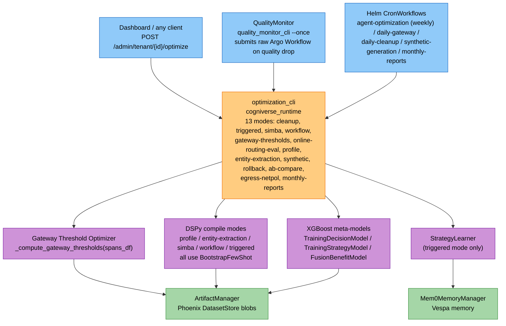
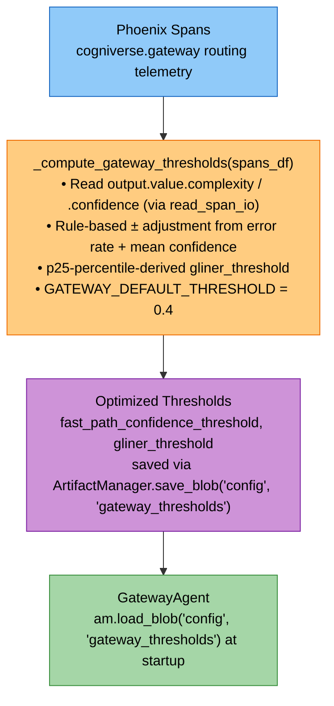
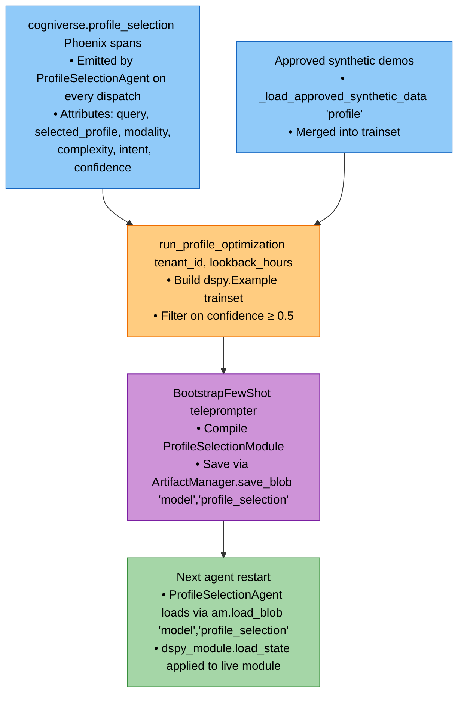
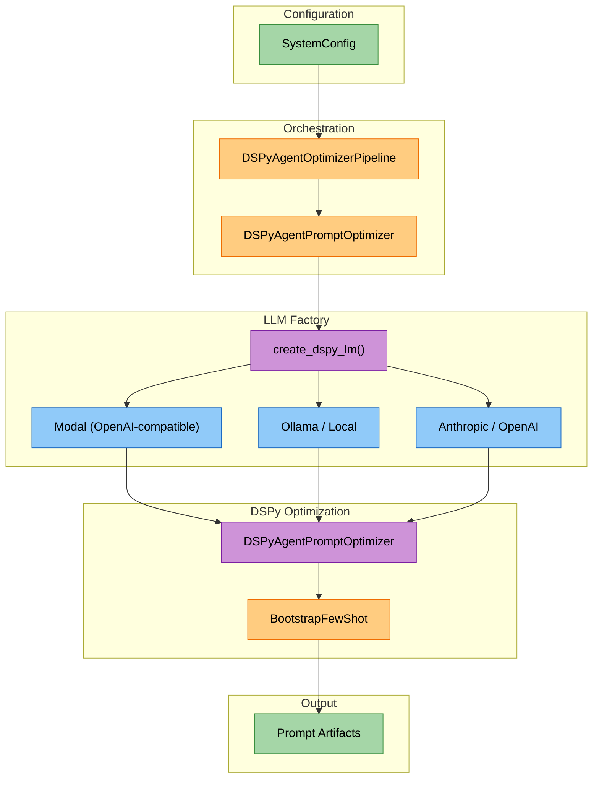

# Optimization Module Study Guide

**Package:** `cogniverse_agents` (Implementation Layer), `cogniverse_runtime` (Application Layer), `cogniverse_synthetic` (Implementation Layer)
**Module Location:** `libs/agents/cogniverse_agents/optimizer/`, `libs/agents/cogniverse_agents/routing/` (training-decision models), `libs/runtime/cogniverse_runtime/optimization_cli.py`, `libs/synthetic/`

---

## Package Structure

```text
libs/agents/cogniverse_agents/optimizer/
├── artifact_manager.py             # ArtifactManager: ExperimentMetrics, promote_if_better,
│                                    #   promote_to_canary, promote_canary_to_active, retire_canary,
│                                    #   rollback_to_version, snapshot_active, save/load prompts+demos+blobs
├── dspy_agent_optimizer.py         # DSPyAgentPromptOptimizer + DSPyAgentOptimizerPipeline
│                                    #   (BootstrapFewShot prompt compilation for 4 agent signatures)
├── signature_variants.py           # SignatureVariantRegistry: per-tenant DSPy signature variants
└── strategy_learner.py             # StrategyLearner: pattern + LLM distillation from traces into Mem0

libs/agents/cogniverse_agents/routing/
├── xgboost_meta_models.py          # TrainingDecisionModel, TrainingStrategyModel, FusionBenefitModel
├── profile_performance_optimizer.py  # ProfilePerformanceOptimizer (see docs/modules/routing.md)
└── config.py                       # OnlineEvaluationConfig, AutomationRulesConfig
                                     # (remaining routing/ files — annotation, dspy_relationship_router,
                                     #  orchestration_evaluator, etc. — are documented in routing.md)

libs/runtime/cogniverse_runtime/
├── optimization_cli.py             # CLI for all optimization/maintenance modes:
│                                    # cleanup | triggered | simba | workflow | gateway-thresholds |
│                                    # online-routing-eval | profile | entity-extraction | synthetic |
│                                    # rollback | ab-compare | egress-netpol | monthly-reports
├── quality_monitor_cli.py          # QualityMonitor driver — submits `--mode triggered` Argo Workflows
│                                    #   on quality drops; `--once` forces a distillation pass
└── routers/tenant.py               # POST /admin/tenant/{id}/optimize (on-demand submit) + status/cancel/retry

libs/synthetic/cogniverse_synthetic/
├── service.py                      # SyntheticDataService — orchestrates a generator end-to-end
├── api.py                          # FastAPI router (prefix /synthetic): generate, batch/generate,
│                                    #   optimizers, optimizers/{name}, health
├── registry.py                     # OPTIMIZER_REGISTRY, OptimizerConfig, list_optimizers()
├── schemas.py                      # SyntheticDataRequest/Response, ProfileSelectionExampleSchema,
│                                    #   RoutingExperienceSchema, WorkflowExecutionSchema
├── dspy_modules.py / dspy_signatures.py  # DSPy modules used by generators (e.g. query generation)
├── generators/                     # Optimizer-specific generators
│   ├── base.py                     # Base generator classes
│   ├── profile.py                  # ProfileGenerator: ProfileSelectionAgent training data
│   ├── routing.py                  # RoutingGenerator: routing training data
│   └── workflow.py                 # WorkflowGenerator: workflow-orchestration training data
├── profile_selector.py             # LLM-based profile selection
├── backend_querier.py              # Vespa content sampling
├── approval/                       # Human-in-the-loop approval workflow for synthetic demos
│   ├── confidence_extractor.py     # Extracts confidence signal from generated examples
│   └── feedback_handler.py         # Approve/reject feedback processing
└── utils/                          # Pattern extraction and agent inference
```

---

## Table of Contents
1. [Module Overview](#module-overview)
2. [Architecture](#architecture)
3. [Core Components](#core-components)
4. [Usage Examples](#usage-examples)
5. [Production Considerations](#production-considerations)
6. [Testing](#testing)

---

## Module Overview

### Purpose
The Optimization Module provides on-demand, per-agent DSPy prompt/module compilation, gateway threshold
calibration, workflow-template learning, XGBoost-based training-decision models, and Mem0-backed strategy
distillation. It reads Phoenix telemetry spans as training signal and persists compiled artefacts (prompts,
demos, and DSPy module state) via `ArtifactManager`, which agents reload at startup.

### Key Features
- **DSPy Prompt/Module Compilation**: every optimization mode compiles with `dspy.teleprompt.BootstrapFewShot`
  (scaled to 8/16/2-round settings once ≥50 training examples are available, 4/8/1-round below that). No mode
  in this codebase currently invokes MIPROv2, SIMBA, or GEPA — `ExperimentMetrics.optimizer` is a free-text
  field intended to record whichever optimizer produced a run, but every call site passes `"BootstrapFewShot"`.
  The `--mode simba` name is historical (it optimizes `QueryEnhancementAgent`'s DSPy module); it does not run
  the SIMBA algorithm.
- **Gateway Threshold Tuning**: `_compute_gateway_thresholds()` derives GLiNER/fast-path thresholds from
  Phoenix `cogniverse.gateway` spans using a rule-based adjustment (± based on per-branch error rate and mean
  confidence) plus a p25-percentile-derived `gliner_threshold`.
- **Online Routing Evaluation**: `run_online_routing_evaluation` scores `cogniverse.routing` spans (routing
  outcome + confidence calibration) via `OnlineEvaluator` and persists the scores as telemetry annotations;
  driven by `automation_rules.online_evaluation` (`OnlineEvaluationConfig` in `routing/config.py`).
- **Profile Selection / Entity Extraction / SIMBA (query enhancement) Optimization**: each reads its own
  Phoenix span kind, builds a `dspy.Example` trainset, compiles the agent's DSPy module, and saves it as a
  `("model", <key>)` blob via `ArtifactManager`.
- **Workflow Orchestration Optimization**: extracts `WorkflowExecution` records from `cogniverse.orchestration`
  spans via `OrchestrationEvaluator`, drops demos whose `agent_sequence` references an agent no longer live in
  `configs/config.json`, and persists execution demos + agent performance profiles via `WorkflowStoreRegistry`.
- **Training-Decision Meta-Models**: `TrainingDecisionModel` (train/skip gate; wired into `QualityMonitor`),
  `TrainingStrategyModel` (PURE_REAL / HYBRID / SYNTHETIC / SKIP selection), and `FusionBenefitModel` — all
  XGBoost classifiers in `routing/xgboost_meta_models.py`, persisted via the same `ArtifactManager`.
- **Strategy Distillation**: `StrategyLearner` distills execution traces into reusable `Strategy` objects
  (pattern extraction, no LLM; or LLM-based contrastive distillation) and stores them in Vespa memory via
  `Mem0MemoryManager` for later retrieval by `MemoryAwareMixin`.
- **Regression-Reject Promotion Gate**: `ArtifactManager.promote_if_better` only promotes a candidate when its
  score beats the active baseline (within `tolerance`); every attempt — win or reject — lands as a typed
  `ExperimentMetrics` row.
- **Canary Rollout + Rollback**: `ArtifactManager`'s three-slot (`active`/`canary`/`retired`) state machine and
  the `--mode rollback` CLI restore previously-snapshotted prompt/demo versions.
- **On-Demand Workflows**: the dashboard (or any client) triggers `POST /admin/tenant/{id}/optimize`, which
  submits an Argo Workflow referencing the `cogniverse-optimization-runner` `WorkflowTemplate`.
- **Scheduled Workflows**: helm-chart `CronWorkflow`s run `gateway-thresholds`/`entity-extraction`/`simba`/
  `profile`/`workflow` weekly, `gateway-thresholds` daily, `cleanup` daily, `synthetic` weekly, a forced
  distillation pass daily via `quality_monitor_cli --once`, and `monthly-reports` monthly.

### Dependencies

**Note**: Optimizer classes require full module path imports as they are not exported at package level.

```python
# CLI optimization
from cogniverse_runtime.optimization_cli import _compute_gateway_thresholds, GATEWAY_DEFAULT_THRESHOLD

# Synthetic Data Generation (exported at package level)
from cogniverse_synthetic import SyntheticDataService, SyntheticDataRequest, SyntheticDataResponse
from cogniverse_synthetic import OPTIMIZER_REGISTRY
```

---

## Architecture

### 1. Optimization Architecture


```mermaid
flowchart TB
    Dashboard["<span style='color:#000'>Dashboard / any client<br/>POST /admin/tenant/{id}/optimize</span>"]
    QM["<span style='color:#000'>QualityMonitor<br/>quality_monitor_cli --once<br/>submits raw Argo Workflow on quality drop</span>"]
    Cron["<span style='color:#000'>Helm CronWorkflows<br/>agent-optimization (weekly) / daily-gateway /<br/>daily-cleanup / synthetic-generation / monthly-reports</span>"]

    Dashboard --> OptCLI
    QM --> OptCLI
    Cron --> OptCLI

    OptCLI["<span style='color:#000'>optimization_cli<br/>cogniverse_runtime<br/>13 modes: cleanup, triggered, simba, workflow,<br/>gateway-thresholds, online-routing-eval, profile,<br/>entity-extraction, synthetic, rollback, ab-compare,<br/>egress-netpol, monthly-reports</span>"]

    OptCLI --> GatewayOpt["<span style='color:#000'>Gateway Threshold Optimizer<br/>_compute_gateway_thresholds(spans_df)</span>"]
    OptCLI --> DSPyModes["<span style='color:#000'>DSPy compile modes<br/>profile / entity-extraction / simba / workflow / triggered<br/>all use BootstrapFewShot</span>"]
    OptCLI --> Meta["<span style='color:#000'>XGBoost meta-models<br/>TrainingDecisionModel / TrainingStrategyModel / FusionBenefitModel</span>"]
    OptCLI --> Strategy["<span style='color:#000'>StrategyLearner<br/>(triggered mode only)</span>"]

    GatewayOpt --> AM["<span style='color:#000'>ArtifactManager<br/>Phoenix DatasetStore blobs</span>"]
    DSPyModes --> AM
    Meta --> AM
    Strategy --> Mem0["<span style='color:#000'>Mem0MemoryManager<br/>Vespa memory</span>"]

    style Dashboard fill:#90caf9,stroke:#1565c0,color:#000
    style QM fill:#90caf9,stroke:#1565c0,color:#000
    style Cron fill:#90caf9,stroke:#1565c0,color:#000
    style OptCLI fill:#ffcc80,stroke:#ef6c00,color:#000
    style GatewayOpt fill:#ce93d8,stroke:#7b1fa2,color:#000
    style DSPyModes fill:#ce93d8,stroke:#7b1fa2,color:#000
    style Meta fill:#ce93d8,stroke:#7b1fa2,color:#000
    style Strategy fill:#ce93d8,stroke:#7b1fa2,color:#000
    style AM fill:#a5d6a7,stroke:#388e3c,color:#000
    style Mem0 fill:#a5d6a7,stroke:#388e3c,color:#000
```

### 2. Gateway Threshold Optimization Architecture


```mermaid
flowchart TB
    Phoenix["<span style='color:#000'>Phoenix Spans<br/>cogniverse.gateway routing telemetry</span>"]

    Phoenix --> Compute["<span style='color:#000'>_compute_gateway_thresholds(spans_df)<br/>• Read output.value.complexity / .confidence (via read_span_io)<br/>• Rule-based ± adjustment from error rate + mean confidence<br/>• p25-percentile-derived gliner_threshold<br/>• GATEWAY_DEFAULT_THRESHOLD = 0.4</span>"]

    Compute --> Thresholds["<span style='color:#000'>Optimized Thresholds<br/>fast_path_confidence_threshold, gliner_threshold<br/>saved via ArtifactManager.save_blob('config', 'gateway_thresholds')</span>"]

    Thresholds --> Gateway["<span style='color:#000'>GatewayAgent<br/>am.load_blob('config', 'gateway_thresholds') at startup</span>"]

    style Phoenix fill:#90caf9,stroke:#1565c0,color:#000
    style Compute fill:#ffcc80,stroke:#ef6c00,color:#000
    style Thresholds fill:#ce93d8,stroke:#7b1fa2,color:#000
    style Gateway fill:#a5d6a7,stroke:#388e3c,color:#000
```

### 3. Profile Selection Optimization Architecture


```mermaid
flowchart TB
    Spans["<span style='color:#000'>cogniverse.profile_selection Phoenix spans<br/>• Emitted by ProfileSelectionAgent on every dispatch<br/>• Attributes: query, selected_profile, modality,<br/>  complexity, intent, confidence</span>"]

    Spans --> RunOpt["<span style='color:#000'>run_profile_optimization tenant_id, lookback_hours<br/>• Build dspy.Example trainset<br/>• Filter on confidence ≥ 0.5</span>"]

    Synthetic["<span style='color:#000'>Approved synthetic demos<br/>• _load_approved_synthetic_data 'profile'<br/>• Merged into trainset</span>"] --> RunOpt

    RunOpt --> Compile["<span style='color:#000'>BootstrapFewShot teleprompter<br/>• Compile ProfileSelectionModule<br/>• Save via ArtifactManager.save_blob 'model','profile_selection'</span>"]

    Compile --> Reload["<span style='color:#000'>Next agent restart<br/>• ProfileSelectionAgent loads via am.load_blob 'model','profile_selection'<br/>• dspy_module.load_state applied to live module</span>"]

    style Spans fill:#90caf9,stroke:#1565c0,color:#000
    style Synthetic fill:#90caf9,stroke:#1565c0,color:#000
    style RunOpt fill:#ffcc80,stroke:#ef6c00,color:#000
    style Compile fill:#ce93d8,stroke:#7b1fa2,color:#000
    style Reload fill:#a5d6a7,stroke:#388e3c,color:#000
```

---

## Core Components

### 1. **Gateway Threshold Optimizer** (`optimization_cli.py`)

On-demand gateway confidence threshold tuning using Phoenix span data.

**Key Functions:**

```python
GATEWAY_DEFAULT_THRESHOLD = 0.4

def _compute_gateway_thresholds(spans_df) -> dict:
    """
    Pure function: calibrate gateway thresholds from a spans DataFrame.

    Branches:
      1. simple_error_rate > 0.2         -> threshold = min(current + 0.1, 0.95)
      2. complex_error_rate < 0.05 and mean_confidence > 0.8
                                          -> threshold = max(current - 0.05, 0.5)
      3. otherwise                        -> threshold unchanged

    gliner_threshold = round(max(0.15, min(p25_confidence * 0.8, 0.5)), 3)

    Returns {"status": "no_data", ...} or
            {"status": "ready", "thresholds": {...}, "spans_found": N}
    """
```

**On-Demand Submission:**
```python
# Dashboard or any client submits via runtime API:
# POST /admin/tenant/{tenant_id}/optimize
# Body: {"mode": "gateway-thresholds"}
# Returns: {workflow_name, namespace, mode, status_url}

# Check run status:
# GET /admin/tenant/{tenant_id}/optimize/runs/{workflow_name}
# Returns: {phase, started_at, finished_at, message}
```

**File:** `libs/runtime/cogniverse_runtime/optimization_cli.py`

---

### 2. **ProfileSelectionAgent Optimization**

DSPy module optimization for `ProfileSelectionAgent` — the per-query classifier that picks the
backend profile and emits modality/complexity/intent in a `cogniverse.profile_selection` span.

**CLI mode:** `--mode profile`

**Key function:**

```python
async def run_profile_optimization(
    tenant_id: str,
    lookback_hours: float = 24.0,
) -> dict:
    """
    Optimize ProfileSelectionAgent's DSPy module:

    1. Collect (query, available_profiles) -> selected_profile examples from
       cogniverse.profile_selection Phoenix spans; keep only confidence >= 0.5.
    2. Merge in approved synthetic demos for optimizer type "profile".
    3. Compile ProfileSelectionModule via BootstrapFewShot (scaled: 8/16/2-round
       once >= 50 examples, else 4/8/1-round).
    4. Save compiled module as artifact ("model", "profile_selection").

    The agent loads the artifact at startup via am.load_blob("model", "profile_selection").

    Returns: {"status": "success"|"no_data"|"failed", "spans_found": int,
              "training_examples": int, "artifact_id": str}
    """
```

**Training:** Always **BootstrapFewShot**; the 50-example threshold only changes its
`max_bootstrapped_demos`/`max_labeled_demos`/`max_rounds` settings, it does not switch optimizers.

**File:** `libs/runtime/cogniverse_runtime/optimization_cli.py`

---

### 3. **DSPyAgentPromptOptimizer**

DSPy prompt optimizer for the 4 core agent-orchestration signatures — query analysis, agent routing,
summary generation, detailed report — always compiled with `BootstrapFewShot`.

**File:** `libs/agents/cogniverse_agents/optimizer/dspy_agent_optimizer.py`

---

### 4. **SIMBA (Query Enhancement) Optimization**

Despite the mode name, this compiles `QueryEnhancementAgent`'s DSPy module with **BootstrapFewShot**,
not the SIMBA algorithm.

**CLI mode:** `--mode simba`

**Key function:** `run_simba_optimization(tenant_id, lookback_hours=24.0)` — reads
`cogniverse.query_enhancement` spans, builds `(original_query -> enhanced_query)` examples (skipping
identity pairs where `enhanced == original`), merges approved synthetic demos for `"simba"`, compiles via
`_create_teleprompter(len(trainset))`, and saves the artifact as `("model", "simba_query_enhancement")`.
`QueryEnhancementAgent` reloads it via `am.load_blob("model", "simba_query_enhancement")`.

**File:** `libs/runtime/cogniverse_runtime/optimization_cli.py`

---

### 5. **Entity Extraction Optimization**

**CLI mode:** `--mode entity-extraction`

`run_entity_extraction_optimization(tenant_id, lookback_hours=24.0)` reads `cogniverse.entity_extraction`
spans, builds `(query -> entities_json)` examples from spans with `entity_count > 0`, merges approved
synthetic demos for `"entity_extraction"`, compiles `EntityExtractionModule` via
`_create_teleprompter(len(trainset))`, and saves the artifact as `("model", "entity_extraction")`.
`EntityExtractionAgent` reloads it via `am.load_blob("model", "entity_extraction")`.

**File:** `libs/runtime/cogniverse_runtime/optimization_cli.py`

---

### 6. **Workflow Orchestration Optimization**

**CLI mode:** `--mode workflow`

`run_workflow_optimization(tenant_id, lookback_hours=24.0)` reads `cogniverse.orchestration` spans,
feeds them through `OrchestrationEvaluator.evaluate_orchestration_spans` (backed by
`WorkflowIntelligence`) to extract `WorkflowExecution` records, then:

1. Reads the live `agents` block from `configs/config.json` (not `AgentRegistry`, which starts empty
   in the optimization CLI's own pod) to build a set of currently-enabled agent names.
2. Drops any execution whose `agent_sequence` references an agent not in that live set (stale demos
   from renamed/removed agents can't be replayed).
3. Persists the surviving executions, agent performance profiles, and query-type patterns via
   `WorkflowStoreRegistry.get(name="telemetry")` — the same store `WorkflowIntelligence` reads at
   orchestrator startup.

Raises `RuntimeError` if the live-agents set is empty (refuses to guess whether every demo is stale or
none are). Returns
`{"status": "success"|"no_data", "spans_found", "workflows_extracted", "execution_demos_saved", "agent_profiles_saved"}`.

**File:** `libs/runtime/cogniverse_runtime/optimization_cli.py`

---

### 7. **Online Routing Evaluation**

**CLI mode:** `--mode online-routing-eval`

`run_online_routing_evaluation(tenant_id, lookback_hours=24.0)` reads `AutomationRulesConfig.online_evaluation`
(`OnlineEvaluationConfig` — `enabled`, `sampling_rate`, `evaluators`, `persist_scores`,
`score_annotation_name`) from config; if disabled, returns `{"status": "disabled"}` immediately.
Otherwise reads `cogniverse.routing` spans and scores each with `OnlineEvaluator` (routing outcome +
confidence calibration), persisting scores as telemetry annotations for drift detection. Returns
`{"status": "success"|"no_data", "spans_found", "scores_persisted", "statistics"}`.

**File:** `libs/runtime/cogniverse_runtime/optimization_cli.py`

---

### 8. **Triggered Optimization (quality-monitor driven)**

**CLI mode:** `--mode triggered`

Invoked by `QualityMonitor` (not the dashboard — `triggered` is excluded from `_MANUAL_OPTIMIZE_MODES`)
when golden/live evaluation detects degradation. `QualityMonitor` builds and submits its own raw Argo
`Workflow` manifest (not the shared `cogniverse-optimization-runner` `WorkflowTemplate`) running:

```bash
uv run python -m cogniverse_runtime.optimization_cli \
  --mode triggered --tenant-id <tid> \
  --agents <comma-separated agent names> \
  --trigger-dataset <phoenix dataset name>
```

`run_triggered_optimization` loads the named Phoenix dataset (flattening `input`/`output` dict columns),
splits each agent's rows into `low_scoring`/`high_scoring` by `category`, and for each agent in `--agents`:

1. Builds a `dspy.Example` trainset from the high-scoring rows (agent-specific field mapping for
   `search` / `summary` / `report`).
2. Compiles a `dspy.ChainOfThought` over the matching signature with `BootstrapFewShot`, scoped inside
   `dspy.context(lm=...)` (because `initialize_language_model` only sets `optimizer.lm`, it does not call
   the global `dspy.configure`).
3. Saves the compiled module as `("model", f"dspy_compiled_{agent_name}")`.

After the per-agent loop, it **also** runs strategy distillation: builds (or reuses) a
`Mem0MemoryManager` for the tenant (requires `SystemConfig.backend_url`/`backend_port`, an `api_base` on
the resolved LLM endpoint, and a configured `denseon` inference-service URL — raises `ValueError` if any
are missing) and calls `StrategyLearner(memory_manager, tenant_id, llm_config).learn_from_trigger_dataset(trigger_df)`.
Distillation failure is caught and logged as non-fatal (`results["strategies_distilled"] = 0`).

**File:** `libs/runtime/cogniverse_runtime/optimization_cli.py`

---

### 9. **XGBoost Training-Decision Meta-Models**

Three independent XGBoost classifiers, each backed by `ArtifactManager` for persistence, all requiring a
non-empty `tenant_id`.

**File:** `libs/agents/cogniverse_agents/routing/xgboost_meta_models.py`

| Class | Purpose | Wired into |
|---|---|---|
| `TrainingDecisionModel` | Binary train/skip gate + expected-improvement estimate from `ModelingContext` features (real/synthetic sample counts, success rate, confidence, days since last training, etc.) | `cogniverse_evaluation.quality_monitor.QualityMonitor._apply_training_decision_model` — confirms or overrides the monitor's own train/skip verdict |
| `TrainingStrategyModel` | Multi-class selection among `TrainingStrategy.{PURE_REAL, HYBRID, SYNTHETIC, SKIP}` | Not called by any production pipeline today; exercised directly in `tests/routing/unit/test_xgboost_meta_models.py` |
| `FusionBenefitModel` | Regression estimate of whether multi-signal fusion helps for a given context | Not called by any production pipeline today; exercised directly in tests |

Both models fall back to a hand-tuned heuristic when `is_trained` is `False` (before enough historical
data exists to fit XGBoost). `TrainingStrategyModel._fallback_strategy`'s actual thresholds:

```python
# Fallback heuristic (untrained model only — select_strategy() uses the
# fitted XGBoost classifier once train() has run on >= 20 samples):
if context.real_sample_count < 10:
    return SYNTHETIC if context.synthetic_sample_count >= 50 else SKIP
if context.real_sample_count >= 100:
    return PURE_REAL
if context.real_sample_count >= 30:
    return HYBRID if context.synthetic_sample_count >= 50 else PURE_REAL
return SKIP  # 10 <= real_sample_count < 30
```

`TrainingDecisionModel.train()` requires ≥10 historical `(ModelingContext, outcome)` pairs;
`TrainingStrategyModel.train()` requires ≥20. Both persist via `save_to_telemetry()` /
`load_from_telemetry()` on the injected `ArtifactManager`.

---

### 10. **StrategyLearner**

Distills execution traces into reusable `Strategy` records, stored in Vespa memory via
`Mem0MemoryManager` (`type="strategy"` metadata) for retrieval by `MemoryAwareMixin`.

**File:** `libs/agents/cogniverse_agents/optimizer/strategy_learner.py`

Two distillation paths:
1. **Pattern extraction** (`_extract_patterns`) — statistical analysis of which profiles/strategies/
   parameters scored best for different query types; requires ≥`MIN_TRACES_FOR_PATTERN` (5) traces; no
   LLM call.
2. **LLM distillation** (`_distill_with_llm`) — contrastive analysis of high- vs low-scoring trace pairs
   via DSPy to surface workflow-level insights.

`learn_from_trigger_dataset(trigger_df)` is the entry point, called from `run_triggered_optimization`
(mode `triggered`) after per-agent DSPy compilation. `get_strategies_for_agent` / `rank_strategies_with_decay`
support retrieval-side confidence decay; `format_strategies_for_context` renders retrieved strategies as
prompt context (used by `MemoryAwareMixin`). `_store_strategy` deduplicates near-identical strategies
(`DEDUP_SIMILARITY_THRESHOLD = 0.9`) by bumping `confirmation_count` on the existing record instead of
inserting a duplicate.

---

### 11. **Signature Variants**

Per-tenant named-variant registry for DSPy signatures. Each agent has at least a `"default"` variant; tenants opt into variants like `"with_jurisdiction"` via `TenantConfig.metadata['signature_variants'][agent_type]`. The artefact manager keys prompts / demos / experiments on `(tenant_id, agent_type, variant_id)` so each variant has its own compiled artefacts.

**File:** `libs/agents/cogniverse_agents/optimizer/signature_variants.py`

**Key methods:**

```python
from cogniverse_agents.optimizer.signature_variants import (
    SignatureVariantRegistry,
    variant_qualified_agent_key,
    DEFAULT_VARIANT_ID,  # "default"
)

reg = SignatureVariantRegistry()

# Register a variant. Idempotent for identical (agent_type, variant_id, description);
# raises ValueError when replace=False and the variant exists with a different definition.
reg.register("legal_qa", "with_jurisdiction", description="adds jurisdiction input")

# Tenant lookup. Falls back to "default" when:
#   * TenantConfig is None / has no metadata dict
#   * signature_variants key is missing or not a dict
#   * the requested variant id is not registered (logged at WARNING — operators want typo signal)
variant_id = reg.selected_for_tenant(tenant_config, "legal_qa")

# Artefact dataset key. Default variant returns the bare agent_type so pre-variant
# artefacts keep working; non-default variants get a ``::variant=<safe_id>`` suffix.
key = variant_qualified_agent_key("legal_qa", variant_id)
# -> "legal_qa"                              when variant_id == "default"
# -> "legal_qa::variant=with_jurisdiction"   otherwise
```

The registry is intentionally schemaless — variants only track which ids are valid for an agent; the agent owns the actual DSPy signature class lookup table.

---

### 12. **Canary FSM**

`ArtifactManager` maintains a three-slot state — `active`, `canary`, `retired` — per `(tenant_id, agent_type)` and persists it via Phoenix `DatasetStore` under the `config` blob key. Routing decisions are stable per request (sha1 of `request_seed`, bucket `% 100`).

**File:** `libs/agents/cogniverse_agents/optimizer/artifact_manager.py`

```python
from cogniverse_agents.optimizer.artifact_manager import ArtifactManager

am = ArtifactManager(telemetry_provider=phoenix_provider, tenant_id="acme:production")

# Promote a versioned artefact to canary at a traffic percentage.
# Raises ValueError if traffic_pct not in [1, 100]. Replaces any existing canary
# (the prior canary moves to retired with reason="superseded_by_new_canary").
state = await am.promote_to_canary("search_agent", version=7, traffic_pct=10)

# Promote canary to active. Prior active goes to retired with
# reason="superseded_by_canary_promotion". Restores prompts + demos at the
# un-versioned dataset name agents read at __init__. Raises ValueError if no canary set.
state = await am.promote_canary_to_active("search_agent")

# Drop the current canary back to retired without promoting. No-op when no canary set.
# Common reason values: "metric_regression", "admin_retire", "superseded_by_new_canary".
state = await am.retire_canary("search_agent", reason="metric_regression")
```

State shape:

```python
{
  "active":  {"version": 6, "promoted_at": "..."},
  "canary":  {"version": 7, "promoted_at": "...", "traffic_pct": 10},
  "retired": [{"version": 5, "retired_at": "...", "reason": "..."}, ...],
}
```

---

### 13. **Regression-Reject Promotion Gate (`promote_if_better`)**

`ArtifactManager.promote_if_better` is the guarded alternative to unconditionally overwriting active
prompts/demos: it compares a candidate against the currently-active baseline on a held-out score and only
promotes when the candidate wins.

**File:** `libs/agents/cogniverse_agents/optimizer/artifact_manager.py`

```python
metrics = await am.promote_if_better(
    agent_type="search_agent",
    candidate_prompts=new_prompts,
    candidate_demos=new_demos,          # or None
    baseline_score=0.72,
    candidate_score=0.75,
    tolerance=0.0,                      # allowed regression band (0 = strict win)
    optimizer="BootstrapFewShot",
    train_examples=64,
)
```

- Promoted when `candidate_score >= baseline_score - tolerance`: prompts/demos are saved and become
  active (current active is snapshotted first via `snapshot_active` when `snapshot_before_promote=True`,
  the default).
- Rejected otherwise: prompts/demos are **not** saved; the run is recorded with `promoted=False` and a
  `rejection_reason`.

Either outcome lands as a typed `ExperimentMetrics` row via `save_experiment` in the per-agent experiments
dataset, so the promotion ledger is observable end-to-end — rejected runs stay visible with their scores
instead of being silently discarded.

---

### 14. **Rollback CLI**

Restore active artefacts to a previously snapshotted version. Wraps `ArtifactManager.rollback_to_version` and snapshots the current active first so the rollback is itself reversible.

**File:** `libs/runtime/cogniverse_runtime/optimization_cli.py::run_rollback`

```bash
# Roll back search_agent's active prompts to v2
uv run python -m cogniverse_runtime.optimization_cli \
  --mode rollback \
  --tenant-id acme:production \
  --agent search_agent \
  --prompts-version 2

# Demos rollback is independent; supply either or both
uv run python -m cogniverse_runtime.optimization_cli \
  --mode rollback \
  --tenant-id acme:production \
  --agent search_agent \
  --prompts-version 2 \
  --demos-version 3
```

Required: `--tenant-id`, `--agent`, plus at least one of `--prompts-version` / `--demos-version`. The Phoenix provider is built directly from `PHOENIX_HTTP_ENDPOINT` / `PHOENIX_GRPC_ENDPOINT` env vars so a CLI invocation can target a specific Phoenix without going through the global telemetry config.

Returns `{summary: ..., backup_versions: {prompts: int?, demos: int?}}` — pass those versions to a follow-up `--mode rollback` to undo.

---

### 15. **A/B Comparison (`--mode ab-compare`)**

Runs `RLMABRunner` (`cogniverse_agents.inference.ab_harness`) over a Phoenix dataset of `(query, context)`
rows, comparing a with-RLM and without-RLM arm per row, and emits a `rlm.ab_compare` Phoenix span per row
with the harness's `to_telemetry_dict()` as attributes for a dashboard tile to aggregate.

```bash
uv run python -m cogniverse_runtime.optimization_cli \
  --mode ab-compare \
  --tenant-id acme:production \
  --queries-dataset golden_eval_v1 \
  --judge-substring "Paris"
```

`--judge-substring` (optional) enables a deterministic substring-match judge (`1.0` if the substring
appears in the answer, else `0.0`) — described in code as "the minimum viable judge for getting a
`judge_delta` populated in CI"; a real eval-time judge should be wired by the caller for production use.
`--rlm-max-iterations` (default 10) and `--rlm-max-llm-calls` (default 30) cap the RLM arm's cost per row.

Returns `{status, rows_compared, avg_latency_delta_ms, avg_tokens_delta, avg_judge_delta,
rlm_fallback_rate, ab_ids}`.

**File:** `libs/runtime/cogniverse_runtime/optimization_cli.py::run_ab_compare`

---

### 16. **Egress NetworkPolicy Generation (`--mode egress-netpol`)**

Not a training/compilation mode — a code-generation utility that reads agent egress policy YAMLs from
`configs/agent_policies/` and emits Kubernetes `NetworkPolicy` manifests so the cluster's CNI plugin
(Cilium/Calico/etc.) enforces per-agent egress at the kernel level, independent of in-process HTTP
enforcement.

```bash
uv run python -m cogniverse_runtime.optimization_cli \
  --mode egress-netpol \
  --policy-dir configs/agent_policies/ \
  --output-dir charts/cogniverse/templates/networkpolicies/ \
  --service-map vespa=cogniverse/vespa-service:8080 \
  --service-map llm=cogniverse/llm-service:11434
```

Two emit modes:
- **Per-agent** (default): one `NetworkPolicy` per agent, selecting on `app=<pod_app_label>,
  cogniverse-agent=<agent>` — for topologies where each agent runs in its own Deployment.
- **Unified-runtime** (`--unified-pod-selector app.kubernetes.io/component=runtime`): a single
  `runtime-egress-netpol.yaml` whose egress rules are the de-duplicated union of every agent's allowed
  destinations — needed for this project's default shared-runtime-pod topology, where per-agent L4
  enforcement is impossible.

`--helm-conditional` wraps each emitted YAML in `{{- if <expr> }} ... {{- end }}` so a chart values flag
can toggle it.

**File:** `libs/runtime/cogniverse_runtime/optimization_cli.py::run_egress_netpol`

---

### 17. **`--mode cleanup` (memory + logs + temp + config vacuum)**

Daily-cleanup workflow body (per-tenant when `--tenant-id` is set, global sweep when omitted).

**File:** `libs/runtime/cogniverse_runtime/optimization_cli.py::run_cleanup`

| Section | Source | Knob |
|---|---|---|
| `memory_cleanup` | `Mem0MemoryManager.cleanup_with_schema(build_default_registry())` per tenant | per-kind TTLs in `KnowledgeRegistry` |
| `log_cleanup` | `_prune_aged_files(LOG_DIR, older_than_days=log_retention_days)` | `LOG_DIR` env (default `/logs`), `--log-retention-days` (default 7) |
| `temp_cleanup` | `_prune_aged_files(TEMP_DIR, older_than_days=TEMP_RETENTION_DAYS)` | `TEMP_DIR` env (default `/tmp`), `TEMP_RETENTION_DAYS` env (default 1) |
| `config_vacuum` | `VespaConfigStore.prune_all_configs(keep=CONFIG_KEEP_VERSIONS)` | `CONFIG_KEEP_VERSIONS` env (default 10) |

`_prune_aged_files` is a silent no-op when the path is not a directory (the cron pod may not mount `/logs` in every topology); it returns `{"skipped": "<reason>"}` so the workflow log records the skip. `_vacuum_config_metadata` is similarly safe when the backing store is not `VespaConfigStore`. Each section reports exact counts (`scanned`, `deleted`, `dropped`) so the workflow log proves the work landed.

```bash
# Global sweep (every org / every tenant)
uv run python -m cogniverse_runtime.optimization_cli --mode cleanup --log-retention-days 7

# Per-tenant sweep
uv run python -m cogniverse_runtime.optimization_cli \
  --mode cleanup --tenant-id acme:production --log-retention-days 7
```

Result dict shape: `{log_retention_days, memory_retention_days, memory_cleanup: {tid: "completed: {...}"} | per_tenant_dict, tenants_processed?, log_cleanup, temp_cleanup, config_vacuum}`.

---

### 18. **`--mode synthetic` (Synthetic Data Generation)**

`run_synthetic_generation(tenant_id, optimizer_types=None, count=50)` generates training data for one or
more optimizer types (default `["simba", "profile", "workflow"]`) via `SyntheticDataService`, saving each
type's output as demonstrations (`ArtifactManager.save_demonstrations(f"synthetic_{opt_type}", demos)`)
tagged `metadata.approval_status: "pending"` for the approval workflow.

```bash
uv run python -m cogniverse_runtime.optimization_cli \
  --mode synthetic --tenant-id acme:production --agents profile,routing
# NOTE: --agents is reused as the optimizer-types list for this mode
```

`SyntheticDataService` is also reachable directly as a REST API (mounted at `/synthetic`, not
`/admin/tenant`):

| Method + path | Purpose |
|---|---|
| `POST /synthetic/generate` | Generate synthetic data for one optimizer type |
| `POST /synthetic/batch/generate` | Generate for multiple optimizer types in one call |
| `GET /synthetic/optimizers` | List registered optimizer types (`OPTIMIZER_REGISTRY`) |
| `GET /synthetic/optimizers/{optimizer_name}` | Schema + config for one optimizer type |
| `GET /synthetic/health` | Service health check |

**File:** `libs/runtime/cogniverse_runtime/optimization_cli.py::run_synthetic_generation`,
`libs/synthetic/cogniverse_synthetic/api.py`

---

### 19. **`--mode monthly-reports`**

Generates usage + performance JSON for the prior period (default 30 days).

**File:** `libs/runtime/cogniverse_runtime/optimization_cli.py::run_monthly_reports`

Writes two files into `--reports-output-dir` (default `./reports`):

- `usage-YYYYMM.json` — per-org tenant counts (`organization_metadata` + `tenant_metadata`), each tenant's `schemas_deployed` list and `schema_count`; top-level summary `{org_count, tenant_count, schema_count}`.
- `performance-YYYYMM.json` — per-tenant Phoenix span count, latency `mean / p50 / p95`, and `error_rate` (`status_code != OK`) over the lookback window. Empty-data tenants record `{span_count: 0, latency_*: null, error_rate: 0.0}`; Phoenix query failures record `{"error": "phoenix query failed: ..."}` and continue.

```bash
uv run python -m cogniverse_runtime.optimization_cli \
  --mode monthly-reports \
  --reports-output-dir /reports \
  --lookback-hours 720
```

`--tenant-id` is not required (the workflow sweeps every tenant the metadata schemas know about). CronWorkflow `{fullname}-monthly-reports` (chart, schedule `0 5 1 * *`, 1st of month 5 AM UTC) runs this followed by a `minio/mc:latest` step that uploads to the configured MinIO bucket under `reports/` (`argo.optimization.monthlyReports.uploadPrefix`).

Returns `{period, generated_at, output_dir, files_written: [usage_path, perf_path], summary: {org_count, tenant_count, perf_tenants_with_data}}`.

---

## Usage Examples

### Example 1: On-Demand Gateway Threshold Optimization

```bash
# Submit gateway-threshold optimization via the runtime API (dashboard or CLI):
curl -X POST http://localhost:8000/admin/tenant/acme:production/optimize \
  -H "Content-Type: application/json" \
  -d '{"mode": "gateway-thresholds"}'
# Returns: {"workflow_name": "opt-gateway-acme-...", "namespace": "cogniverse",
#           "mode": "gateway-thresholds", "status_url": "/admin/tenant/acme:production/optimize/runs/opt-gateway-acme-..."}

# Check status:
curl http://localhost:8000/admin/tenant/acme:production/optimize/runs/opt-gateway-acme-...
# Returns: {"phase": "Succeeded", "started_at": "...", "finished_at": "...", "message": ""}

# Terminate a running Workflow:
curl -X POST http://localhost:8000/admin/tenant/acme:production/optimize/runs/opt-gateway-acme-.../cancel
# Returns: {"phase": "Failed", "message": "Terminated by user", ...}

# Retry a failed Workflow (restarts only the failed nodes, reuses successful ones):
curl -X POST http://localhost:8000/admin/tenant/acme:production/optimize/runs/opt-gateway-acme-.../retry
# Returns: {"phase": "Running", ...}
```

The runtime does not inline the container spec into each submitted
Workflow. Instead it references a chart-installed ``WorkflowTemplate``
(``cogniverse-optimization-runner``) via ``spec.workflowTemplateRef``:
the scheduled CronWorkflows (``agent-optimization`` weekly, ``daily-gateway``
daily) use the same template, so the image/env/resource/mutex spec lives in
one place (``charts/cogniverse/templates/optimization-workflow-template.yaml``).

The WorkflowTemplate declares a **per-tenant mutex** so multiple submits
for the same tenant serialise (prevents the dashboard Run button from
stacking pods); different tenants optimize independently.

The dashboard only exposes the modes in `_MANUAL_OPTIMIZE_MODES`
(`libs/runtime/cogniverse_runtime/routers/tenant.py`): `gateway-thresholds`,
`simba`, `workflow`, `profile`, `entity-extraction`. `triggered` and `cleanup`
aren't meant for interactive use, and `synthetic` has its own scheduled
CronWorkflow — all three are CLI/cron-only.

```python
# The Argo Workflow runs optimization_cli internally:
# uv run python -m cogniverse_runtime.optimization_cli --mode gateway-thresholds --tenant-id acme:production

# To call the threshold computation directly in tests:
from cogniverse_runtime.optimization_cli import _compute_gateway_thresholds, GATEWAY_DEFAULT_THRESHOLD

thresholds = _compute_gateway_thresholds(spans_df)
# Returns: {"status": "ready", "spans_found": N, "thresholds": {"fast_path_confidence_threshold": 0.5, "gliner_threshold": 0.4, "analysis": {...}}}
print(f"Default threshold: {GATEWAY_DEFAULT_THRESHOLD}")  # 0.4
```

---

### Example 2: Profile Selection Optimization

```python
# Trigger via the runtime CLI (or Argo Workflow --mode profile):
# uv run python -m cogniverse_runtime.optimization_cli --mode profile --tenant-id acme:production

# Or trigger on-demand via the admin API:
import requests

response = requests.post(
    "http://localhost:8000/admin/tenant/acme:production/optimize",
    json={"mode": "profile"}
)
result = response.json()
print(f"Workflow: {result['workflow_name']}")
print(f"Status URL: {result['status_url']}")
```

---

## Production Considerations

### 1. **Performance Optimization**

**Optimization on Demand:**
```python
# optimization_cli runs modes in isolation; no long-running optimizer process
# Triggered via Argo Workflow or direct API call
```

**Asynchronous Optimization:**
```python
# Argo Workflow runs CLI modes in background without blocking runtime
# POST /admin/tenant/{tenant_id}/optimize → submits Argo Workflow → returns immediately
```

---

### 2. **Data Quality and Safety**

**Confidence Thresholds:**
```python
# Profile optimization only trains on spans with confidence >= 0.5
# (run_profile_optimization filters `if confidence < 0.5: continue`)
```

**Synthetic Data Control (`TrainingStrategyModel`, `routing/xgboost_meta_models.py`):**
```python
# select_strategy() uses the trained XGBoost classifier once fit(); before
# that (or on any untrained instance) it falls back to a fixed heuristic:
strategy = training_strategy_model.select_strategy(context)

# Fallback heuristic thresholds (see xgboost_meta_models.py _fallback_strategy):
#   real_sample_count < 10   -> SYNTHETIC if synthetic_sample_count >= 50 else SKIP
#   real_sample_count >= 100 -> PURE_REAL
#   30 <= real < 100         -> HYBRID if synthetic_sample_count >= 50 else PURE_REAL
#   10 <= real < 30          -> SKIP
```

---

### 3. **Multi-Tenant Isolation**

**Tenant-Specific Optimization:**
```python
# Each tenant has isolated optimization state via telemetry
# Optimization is submitted per-tenant via the runtime API:
# POST /admin/tenant/tenant_a/optimize  {"mode": "gateway-thresholds"}
# POST /admin/tenant/tenant_b/optimize  {"mode": "profile"}

# Optimization CLI uses tenant-scoped telemetry provider for artifact isolation
# Artifacts saved as ("model", "profile_selection") scoped to tenant_id
```

---

### 4. **Monitoring and Observability**

**Workflow Status Monitoring:**
```bash
# Check status of a submitted optimization workflow
curl http://localhost:8000/admin/tenant/acme:production/optimize/runs/<workflow_name>
# {"phase": "Running", "started_at": "2026-04-24T03:00:00Z", "finished_at": null, "message": ""}

# List all optimization workflows
argo list -n cogniverse --selector workflow-type=optimization
```

**Performance Degradation Detection via QualityMonitor:**
```python
# QualityMonitor (cogniverse_evaluation) checks agent scores and submits its own
# Argo Workflow (--mode triggered) automatically via quality_monitor_cli.
# --llm-model is required (must match evaluators.llm_judge.model in config);
# --runtime-url defaults to http://localhost:28000, --phoenix-url to
# http://localhost:6006.
uv run python -m cogniverse_runtime.quality_monitor_cli \
  --tenant-id default \
  --runtime-url http://localhost:28000 \
  --llm-model google/gemma-4-e4b-it

# --once forces a single distillation-only pass (bypasses the quality-drop
# threshold check) — this is what the daily scheduled-distillation
# CronWorkflow uses.
```

---

### 5. **Production Deployment**

**Optimization is on-demand, not a long-running service.**

```bash
# Trigger via dashboard UI button or direct API call:
curl -X POST http://localhost:8000/admin/tenant/acme:production/optimize \
  -d '{"mode": "gateway-thresholds"}'

# Or run directly via CLI (e.g., from Argo Workflow template):
uv run python -m cogniverse_runtime.optimization_cli \
  --mode gateway-thresholds --tenant-id acme:production
```

---

### 6. **Production Deployment Infrastructure**

The optimization module includes production-ready deployment infrastructure with CLI tools and Argo Workflows for batch and scheduled optimization.

#### CLI: `cogniverse_runtime.optimization_cli`

**Command-line interface for per-agent optimization** (13 modes total):

```bash
# Optimize query enhancement (mode named "simba"; runs BootstrapFewShot)
uv run python -m cogniverse_runtime.optimization_cli \
  --mode simba \
  --tenant-id default

# Optimize gateway thresholds
uv run python -m cogniverse_runtime.optimization_cli \
  --mode gateway-thresholds \
  --tenant-id default

# Optimize entity extraction
uv run python -m cogniverse_runtime.optimization_cli \
  --mode entity-extraction \
  --tenant-id default

# Optimize workflow orchestration
uv run python -m cogniverse_runtime.optimization_cli \
  --mode workflow \
  --tenant-id default

# Optimize search profile selection
uv run python -m cogniverse_runtime.optimization_cli \
  --mode profile \
  --tenant-id default

# Clean up old optimization logs
uv run python -m cogniverse_runtime.optimization_cli \
  --mode cleanup \
  --log-retention-days 7
```

**Available Options (subset — see `build_parser()` for the full set):**

- `--mode`: `cleanup | triggered | simba | workflow | gateway-thresholds | online-routing-eval | profile | entity-extraction | synthetic | rollback | ab-compare | egress-netpol | monthly-reports`

- `--tenant-id`: required for every mode except `cleanup`, `egress-netpol`, and `monthly-reports`

- `--lookback-hours`: hours of span history to analyze (default 24.0, accepts fractions)

- `--log-retention-days` / `--memory-retention-days`: cleanup mode (defaults 7 / 30)

**DSPy Optimizer Selection (actual behavior):**
The `simba`, `profile`, and `entity-extraction` modes use
`_create_teleprompter(trainset_size, teacher_settings=None)`, which always returns
`dspy.teleprompt.BootstrapFewShot` — scaled by a single threshold, not a multi-tier optimizer
selection:

- < 50 examples → `BootstrapFewShot(max_bootstrapped_demos=4, max_labeled_demos=8, max_rounds=1, max_errors=5)`
- ≥ 50 examples → `BootstrapFewShot(max_bootstrapped_demos=8, max_labeled_demos=16, max_rounds=2, max_errors=10)`

All three pass `teacher_settings={"lm": create_dspy_lm(llm_config.resolve_teacher())}`, so the
bootstrap teacher runs on the centralized `llm_config.teacher` endpoint. `triggered` (the
`search`/`summary`/`report` agents) does not go through `_create_teleprompter` —
`_optimize_agent` builds `BootstrapFewShot` directly from
`DSPyAgentPromptOptimizer.optimization_settings` (a fixed configuration —
`max_bootstrapped_demos=8`, `max_labeled_demos=16`, `max_rounds=3`, `max_errors=10` — not
scaled by trainset size), with the teacher threaded through
`_optimize_agent(teacher_endpoint=llm_config.resolve_teacher())` →
`initialize_language_model(teacher_endpoint_config=...)`.

No mode in this CLI selects MIPROv2, SIMBA, or GEPA based on data size.

#### Argo Workflows Integration

**On-demand submission** (dashboard or any client):

```bash
curl -X POST http://localhost:8000/admin/tenant/acme:production/optimize \
  -d '{"mode": "profile"}'
```

submits a Workflow via `spec.workflowTemplateRef` against the chart-installed
`cogniverse-optimization-runner` `WorkflowTemplate`
(`charts/cogniverse/templates/optimization-workflow-template.yaml`).

**Scheduled CronWorkflows** (`charts/cogniverse/templates/optimization-workflows.yaml`,
enabled/scheduled via `values.yaml`'s `argo.optimization.*`):

| CronWorkflow name | Schedule (default) | What it runs |
|---|---|---|
| `{fullname}-agent-optimization` | `0 3 * * 0` (Sunday 3 AM UTC) | Step 1 (parallel): `gateway-thresholds`, `entity-extraction`, `simba` (168h lookback), `profile` (48h lookback). Step 2: `workflow`. Step 3: rolling-restart the runtime Deployment to pick up new artifacts. |
| `{fullname}-daily-gateway` | `0 4 * * *` (daily 4 AM UTC) | `gateway-thresholds` only (lightweight, tight feedback loop) |
| `{fullname}-daily-cleanup` | `0 4 * * *` (daily 4 AM UTC) | `cleanup` |
| `{fullname}-synthetic-generation` | `0 1 * * 6` (Saturday 1 AM UTC) | `synthetic` |
| `{fullname}-scheduled-distillation` | daily | `quality_monitor_cli --once` (forces a distillation pass even when quality is stable, so learning doesn't stall during long healthy periods) |
| `{fullname}-monthly-reports` | `0 5 1 * *` (1st of month 5 AM UTC) | `monthly-reports`, then uploads output to MinIO via `minio/mc:latest` |

```bash
# View a schedule
kubectl get cronworkflow cogniverse-agent-optimization -n cogniverse

# Check last run
argo list -n cogniverse --selector workflows.argoproj.io/cron-workflow=cogniverse-agent-optimization --limit 1

# Trigger manually
argo submit --from cronwf/cogniverse-agent-optimization -n cogniverse

# Suspend/resume
argo cron suspend cogniverse-daily-gateway -n cogniverse
argo cron resume cogniverse-daily-gateway -n cogniverse
```

**Quality-triggered optimization**: `QualityMonitor` submits its own ad-hoc `Workflow` (not the shared
`WorkflowTemplate`) running `--mode triggered` whenever golden/live evaluation detects a quality drop for
one or more agents — see [Triggered Optimization](#8-triggered-optimization-quality-monitor-driven) above.

#### UI Dashboard Integration

The optimization infrastructure integrates with the Streamlit dashboard:

**Module Optimization Tab:**

- Submit on-demand runs for the 5 dashboard-exposed modes (`gateway-thresholds`, `simba`, `workflow`, `profile`, `entity-extraction`)

- Monitor workflow progress (phase, started/finished timestamps)

- Cancel or retry a run

**Execution Modes:**

1. **Automatic (Scheduled)**: CronWorkflows run `optimization_cli` per the schedule table above

2. **Automatic (Quality-triggered)**: `QualityMonitor` submits `--mode triggered` on detected degradation

3. **Manual (Dashboard-triggered)**: dashboard button calls `POST /admin/tenant/{id}/optimize` → submits an Argo Workflow on demand

See `docs/development/ui-dashboard.md` for full UI documentation.

---

### 7. **Error Handling and Recovery**

**Workflow Failure Handling:**
```bash
# Check failed workflow details
argo get <workflow-name> -n cogniverse -o json | jq '.status.message'

# Retry a failed optimization (only the failed nodes re-run)
curl -X POST http://localhost:8000/admin/tenant/acme:production/optimize/runs/<workflow-name>/retry
```

**Artifact Persistence:**

Optimization artifacts are persisted to the telemetry store via `ArtifactManager` using Phoenix `DatasetStore`. Every compile mode (`profile`, `entity-extraction`, `simba`, `triggered`) and `DSPyAgentPromptOptimizer` save compiled modules that agents reload at startup via `am.load_blob(...)`.

---

## Testing

### Test Files

| Area | Location |
|---|---|
| CLI argument parser, batch-mode branches (gateway-thresholds/workflow/entity-extraction/simba no-data paths, synthetic-data merge, `_create_teleprompter` tiering) | `tests/runtime/unit/test_optimization_cli_batch_modes.py` |
| `_compute_gateway_thresholds` — tight per-field assertions across all 3 calibration branches | `tests/runtime/unit/test_optimization_cli_batch_modes.py::TestComputeGatewayThresholdsAlgorithm` |
| `run_rollback` / `ArtifactManager.rollback_to_version` round-trip | `tests/runtime/integration/test_optimization_cli_rollback.py` |
| `run_cleanup` (memory/log/temp/config vacuum) | `tests/runtime/integration/test_optimization_cli_cleanup.py` |
| `run_monthly_reports` | `tests/runtime/integration/test_optimization_cli_monthly_reports.py` |
| `run_triggered_optimization` + strategy distillation wiring | `tests/runtime/integration/test_optimization_cli_triggered.py` |
| `run_ab_compare` / `RLMABRunner` | `tests/runtime/integration/test_optimization_cli_ab_compare.py` |
| `ArtifactManager` — canary FSM, `promote_if_better` | `tests/agents/integration/test_artifact_manager_experiments.py`, `tests/agents/integration/test_artifact_manager_variants.py` |
| `SignatureVariantRegistry` | `tests/agents/unit/test_signature_variants.py`, `tests/runtime/integration/test_signature_variant_admin_consumption.py`, `tests/e2e/test_signature_variants_e2e.py` |
| `StrategyLearner` | `tests/agents/unit/test_strategy_learner.py`, `tests/memory/integration/test_strategy_learner_integration.py` |
| XGBoost meta-models (`TrainingDecisionModel`, `TrainingStrategyModel`, `FusionBenefitModel`) | `tests/routing/unit/test_xgboost_meta_models.py`, `tests/evaluation/integration/test_xgboost_quality_monitor.py` |
| `DSPyAgentPromptOptimizer` / `DSPyAgentOptimizerPipeline` | `tests/agents/unit/test_dspy_optimization_integration.py` |
| Profile selection artifact save/load round-trip | `tests/agents/unit/test_profile_selection_agent.py`, `tests/e2e/test_optimizer_persistence_e2e.py` |
| End-to-end batch optimization | `tests/e2e/test_batch_optimization_e2e.py` |
| Synthetic data service/generators | `tests/synthetic/unit/test_profile_generator.py`, `tests/synthetic/integration/test_profile_synthetic_service.py` |

### Test Scenarios

**1. Gateway Threshold Computation:**
```python
def test_compute_gateway_thresholds():
    """Test threshold derivation from Phoenix spans"""
    from cogniverse_runtime.optimization_cli import _compute_gateway_thresholds, GATEWAY_DEFAULT_THRESHOLD
    import json
    import pandas as pd

    spans_df = pd.DataFrame({
        "attributes.output.value": [
            json.dumps({"complexity": "simple", "confidence": c})
            for c in [0.3, 0.5, 0.6, 0.7, 0.8, 0.9]
        ],
    })

    result = _compute_gateway_thresholds(spans_df)
    assert result["status"] == "ready"
    assert "fast_path_confidence_threshold" in result["thresholds"]
    assert GATEWAY_DEFAULT_THRESHOLD == 0.4
```

---

**Coverage:**

- **Unit tests**: XGBoost meta-models, gateway threshold computation, CLI argument parsing, teleprompter tiering

- **Integration tests**: rollback round-trip, cleanup vacuum, monthly reports, triggered optimization + distillation, A/B comparison, artifact manager canary FSM

- **End-to-end tests**: batch optimization, optimizer artifact persistence, signature variants, dashboard optimization tab

---

## DSPy Training Data Requirements

### Overview

DSPy optimizers require properly formatted training examples with **all expected output fields** defined. Missing fields will cause `AttributeError: 'Example' object has no attribute 'field_name'` during metric evaluation.

### Training Data Format

Each DSPy `Example` must include:
1. **Input fields** (marked with `.with_inputs()`)
2. **All output fields** that metrics will access

**Example Structure:**
```python
import dspy

example = dspy.Example(
    # Input fields
    query="user query here",
    context="optional context",

    # Output fields (ALL fields that metrics check must be present)
    primary_intent="search",
    confidence=0.9,
    recommended_agent="video_search"
).with_inputs("query", "context")  # Specify which fields are inputs
```

### Query Analysis Training Data

**Required Output Fields:**

- `primary_intent`: Main intent category

- `complexity_level`: "simple" | "complex"

- `needs_video_search`: "true" | "false"

- `needs_text_search`: "true" | "false"

- `multimodal_query`: "true" | "false"

- `temporal_pattern`: Temporal info or "none"

**Example:**
```python
training_data = [
    dspy.Example(
        query="Show me videos of robots from yesterday",
        context="",
        # All output fields required for metrics
        primary_intent="video_search",
        complexity_level="simple",
        needs_video_search="true",
        needs_text_search="false",
        multimodal_query="false",
        temporal_pattern="yesterday",
    ).with_inputs("query", "context"),

    dspy.Example(
        query="Compare research papers on deep learning",
        context="academic",
        primary_intent="analysis",
        complexity_level="complex",
        needs_video_search="false",
        needs_text_search="true",
        multimodal_query="false",
        temporal_pattern="none",
    ).with_inputs("query", "context"),
]
```

### Agent Routing Training Data

**Required Output Fields:**

- `recommended_workflow`: Workflow type

- `primary_agent`: Main agent to use

- `routing_confidence`: Confidence score (0.0-1.0 as string)

**Example:**
```python
training_data = [
    dspy.Example(
        query="Show me videos",
        analysis_result="simple search",
        available_agents="video_search",
        # All output fields
        recommended_workflow="direct_search",
        primary_agent="video_search",
        routing_confidence="0.9",
    ).with_inputs("query", "analysis_result", "available_agents"),

    dspy.Example(
        query="Analyze data trends",
        analysis_result="complex analysis",
        available_agents="detailed_report",
        recommended_workflow="detailed_analysis",
        primary_agent="detailed_report",
        routing_confidence="0.85",
    ).with_inputs("query", "analysis_result", "available_agents"),
]
```

### Common Errors

#### Missing Output Fields

**Error:**
```python
AttributeError: 'Example' object has no attribute 'primary_intent'
```

**Cause:** Metric function accesses `example.primary_intent` but Example doesn't have that field.

**Fix:** Add the missing field to all training examples:
```python
example = dspy.Example(
    query="...",
    primary_intent="search",  # ← Add missing field
    # ... other fields
).with_inputs("query")
```

#### Incorrect Field Types

**Error:**
```python
TypeError: expected str, got bool
```

**Cause:** DSPy Examples store all fields as strings internally.

**Fix:** Convert to strings:
```python
# ❌ Bad
needs_video_search=True

# ✅ Good
needs_video_search="true"
```

### Validation

Before running optimization, validate your training data:

```python
def validate_training_data(examples, required_fields):
    """Validate all examples have required output fields."""
    for i, ex in enumerate(examples):
        for field in required_fields:
            if not hasattr(ex, field):
                raise ValueError(
                    f"Example {i} missing required field '{field}'"
                )
    print(f"✅ All {len(examples)} examples valid")

# Usage
required = ["primary_intent", "complexity_level", "needs_video_search"]
validate_training_data(training_data, required)
```

### Best Practices

1. **Define all output fields upfront** - Check what your metrics access
2. **Use consistent field names** - Match your DSPy signature output fields
3. **Validate before optimization** - Catch missing fields early
4. **Use string values** - DSPy converts everything to strings
5. **Document required fields** - Keep a reference list for your team

### File References

- `libs/agents/cogniverse_agents/optimizer/dspy_agent_optimizer.py` - Training data loading
- `tests/agents/unit/test_dspy_optimization_integration.py` - Example tests with proper format

---

## DSPy Agent Optimization Infrastructure

The `libs/agents/cogniverse_agents/optimizer/` package provides infrastructure for running DSPy optimization with configurable model providers (Modal GPU, local Ollama, cloud APIs).

**Location:** `libs/agents/cogniverse_agents/optimizer/`


```mermaid
flowchart TB
    subgraph "Configuration"
        Config["<span style='color:#000'>SystemConfig</span>"]
    end

    subgraph "Orchestration"
        Orch["<span style='color:#000'>DSPyAgentOptimizerPipeline</span>"]
        Client["<span style='color:#000'>DSPyAgentPromptOptimizer</span>"]
    end

    subgraph "LLM Factory"
        Factory["<span style='color:#000'>create_dspy_lm()</span>"]
        Modal["<span style='color:#000'>Modal (OpenAI-compatible)</span>"]
        Local["<span style='color:#000'>Ollama / Local</span>"]
        API["<span style='color:#000'>Anthropic / OpenAI</span>"]
    end

    subgraph "DSPy Optimization"
        AgentOpt["<span style='color:#000'>DSPyAgentPromptOptimizer</span>"]
        Boot["<span style='color:#000'>BootstrapFewShot</span>"]
    end

    subgraph "Output"
        Artifacts["<span style='color:#000'>Prompt Artifacts</span>"]
    end

    Config --> Orch
    Orch --> Client
    Client --> Factory

    Factory --> Modal
    Factory --> Local
    Factory --> API

    Modal --> AgentOpt
    Local --> AgentOpt
    API --> AgentOpt

    AgentOpt --> Boot
    Boot --> Artifacts

    style Config fill:#a5d6a7,stroke:#388e3c,color:#000
    style Orch fill:#ffcc80,stroke:#ef6c00,color:#000
    style Client fill:#ffcc80,stroke:#ef6c00,color:#000
    style Factory fill:#ce93d8,stroke:#7b1fa2,color:#000
    style Modal fill:#90caf9,stroke:#1565c0,color:#000
    style Local fill:#90caf9,stroke:#1565c0,color:#000
    style API fill:#90caf9,stroke:#1565c0,color:#000
    style AgentOpt fill:#ce93d8,stroke:#7b1fa2,color:#000
    style Boot fill:#ffcc80,stroke:#ef6c00,color:#000
    style Artifacts fill:#a5d6a7,stroke:#388e3c,color:#000
```

### LLM Factory

**Location:** `libs/foundation/cogniverse_foundation/config/llm_factory.py`

All DSPy LM creation goes through the centralized `create_dspy_lm()` factory. Provider is encoded in the model string (LiteLLM convention). The Cogniverse chart always emits `openai/<bare-model>` for every in-cluster backend (vLLM or Ollama); the actual destination is selected by `api_base`. External SaaS providers use their own litellm prefix (`anthropic/`, `together/`, etc.).

```python
from cogniverse_foundation.config.unified_config import LLMEndpointConfig
from cogniverse_foundation.config.llm_factory import create_dspy_lm

# Local Ollama (modern Ollama exposes /v1/chat/completions; use openai/ prefix)
local_lm = create_dspy_lm(LLMEndpointConfig(
    model="openai/llama3:8b",
    api_base="http://localhost:11434/v1",
))

# Modal (OpenAI-compatible endpoint)
modal_lm = create_dspy_lm(LLMEndpointConfig(
    model="openai/HuggingFaceTB/SmolLM3-3B",
    api_base="https://username--general-inference-service-serve.modal.run",
))

# Cloud API (Anthropic)
teacher_lm = create_dspy_lm(LLMEndpointConfig(
    model="anthropic/claude-3-5-sonnet-20241022",
    api_key="sk-ant-...",
))

# Use with scoped context (never global dspy.settings.configure)
import dspy
with dspy.context(lm=local_lm):
    result = module(query="Route this query...")
```

### LLM Configuration Structure

LLM configuration is centralized in the `llm_config` section of `config.json`:

```json
{
  "llm_config": {
    "primary": {
      "model": "openai/google/gemma-4-e4b-it",
      "api_base": "http://localhost:11434/v1",
      "api_key": "placeholder-no-auth-needed"
    },
    "teacher": {
      "model": "anthropic/claude-3-5-sonnet-20241022",
      "api_key": "sk-ant-..."
    },
    "overrides": {
      "orchestrator_agent": {
        "model": "openai/qwen3:8b",
        "api_base": "http://localhost:11434/v1",
        "api_key": "placeholder-no-auth-needed"
      }
    }
  }
}
```

All agents and optimizers resolve their LLM config from this section via `LLMConfig.from_dict()` and `create_dspy_lm()`.

### DSPyAgentPromptOptimizer

**Location:** `libs/agents/cogniverse_agents/optimizer/dspy_agent_optimizer.py`

Optimizes prompts for multiple agent types using DSPy signatures.

```python
from cogniverse_agents.optimizer.dspy_agent_optimizer import (
    DSPyAgentPromptOptimizer,
    DSPyAgentOptimizerPipeline,
)

# Initialize optimizer
optimizer = DSPyAgentPromptOptimizer(config={
    "optimization": {
        "max_bootstrapped_demos": 8,
        "max_labeled_demos": 16,
        "max_rounds": 3,
        "stop_at_score": 0.95
    }
})

# Initialize language model via centralized LLM config
from cogniverse_foundation.config.unified_config import LLMEndpointConfig

endpoint_config = LLMEndpointConfig(
    model="openai/llama3:8b",
    api_base="http://localhost:11434/v1",
)
optimizer.initialize_language_model(endpoint_config=endpoint_config)

# Create and run pipeline
pipeline = DSPyAgentOptimizerPipeline(optimizer)
pipeline.initialize_modules()
pipeline.load_training_data()
compiled = pipeline.optimize_module("query_analysis", pipeline.training_data["query_analysis"])
```

`initialize_language_model` also accepts an optional `teacher_endpoint_config` (typically
`llm_config.resolve_teacher()`). When given, it builds a separate `self.teacher_lm` and sets
`optimization_settings["teacher_settings"] = {"lm": self.teacher_lm}`, so the bootstrap teacher
runs on that LM instead of the student teaching itself.

#### Optimizable Modules

| Module | DSPy Signature | Purpose |
|--------|----------------|---------|
| `query_analysis` | `QueryAnalysisSignature` | Intent detection, complexity analysis |
| `agent_routing` | `AgentRoutingSignature` | Agent selection, workflow recommendation |
| `summary_generation` | `SummaryGenerationSignature` | Summary quality optimization |
| `detailed_report` | `DetailedReportSignature` | Report structure optimization |

All four are compiled with `dspy.teleprompt.BootstrapFewShot` — `DSPyAgentOptimizerPipeline.optimize_module`
builds the `BootstrapFewShot` config from `optimizer.optimization_settings` (including
`teacher_settings`, populated when `initialize_language_model` was given a
`teacher_endpoint_config`) and runs the compile scoped inside `dspy.context(lm=optimizer.lm)`
when a real (non-mock) LM is configured.

### Live Routing Optimization

The A2A entry point is the GLiNER-based `GatewayAgent`, whose routing
thresholds are tuned by the `gateway-thresholds` optimization mode in
`optimization_cli.py` (persists the `gateway_thresholds` artifact via
`run_gateway_thresholds_optimization`, loaded back with
`ArtifactManager.load_blob("config", "gateway_thresholds")`). Agent prompts
(query_analysis / summary / detailed_report) are optimized separately by
`DSPyAgentPromptOptimizer`.

### CLI Usage

```bash
# Optimize gateway routing thresholds
uv run python -m cogniverse_runtime.optimization_cli --mode gateway-thresholds --tenant-id default
```

### Output Artifacts

After optimization, artifacts are persisted to the telemetry store via `ArtifactManager` using Phoenix `DatasetStore`:

- `dspy-prompts-{tenant_id}-{agent_type}` — Optimized system prompts for an agent
- `dspy-demos-{tenant_id}-{agent_type}` — Few-shot demonstration examples
- `dspy-experiments-{tenant_id}-{agent_type}` — Optimization run metrics as typed `ExperimentMetrics` rows (one per run via `save_experiment`; read the latest with `load_latest_experiment`)
- `("model", <key>)` blobs — compiled DSPy module state for `profile_selection`, `entity_extraction`, `simba_query_enhancement`, `dspy_compiled_{agent_name}` (triggered mode)
- `("config", "gateway_thresholds")` blob — calibrated gateway thresholds

**Stored prompt artifact structure (retrieved from DatasetStore):**

```json
{
  "system_prompt": "Optimized instructions...",
  "few_shot_examples": [
    {
      "conversation_history": "",
      "user_query": "Show me tutorials on Python",
      "routing_decision": {"search_modality": "video", "generation_type": "raw_results"}
    }
  ],
  "model_config": {
    "student_model": "google/gemma-3-1b-it",
    "temperature": 0.1,
    "max_tokens": 100
  }
}
```

### File References

| File | Purpose |
|------|---------|
| `optimizer/dspy_agent_optimizer.py` | Multi-agent prompt optimization |
| `optimizer/artifact_manager.py` | Artifact persistence, canary FSM, regression-reject promotion, via Phoenix DatasetStore |
| `optimizer/signature_variants.py` | Per-tenant DSPy signature variant registry |
| `optimizer/strategy_learner.py` | Trace-to-strategy distillation into Mem0 |
| `routing/xgboost_meta_models.py` | Training-decision / strategy-selection / fusion-benefit meta-models |

---

## Related Documentation

- **Routing Module Study Guide**: `docs/modules/routing.md` - Tiered routing strategies, `ProfilePerformanceOptimizer`
- **Agents Module Study Guide**: `docs/modules/agents.md` - OrchestratorAgent integration, full agent roster
- **Telemetry Module Study Guide**: `docs/modules/telemetry.md` - Phoenix span collection
- **Evaluation Module Study Guide**: `docs/modules/evaluation.md` - `QualityMonitor`, `RoutingEvaluator`
- **Modal Deployment Guide**: `docs/modal/deployment_guide.md` - Modal infrastructure setup

---

**Next Steps:**

1. Review the DSPy `BootstrapFewShot` teleprompter docs; MIPROv2/SIMBA/GEPA are not wired into any mode today

2. Extend `_create_teleprompter` if a data-size-tiered optimizer switch (e.g. MIPROv2 above a higher example count) becomes worth the added compile cost

3. Monitor optimization metrics in production via `ExperimentMetrics` rows (`load_latest_experiment`)

4. Wire `TrainingStrategyModel` / `FusionBenefitModel` into a production caller (currently exercised only in tests)

5. Test synthetic data generation for profile selection cold start via `POST /synthetic/generate`

---

**File References:**

- `libs/agents/cogniverse_agents/routing/xgboost_meta_models.py` - XGBoost meta-models for training decisions

- `libs/agents/cogniverse_agents/optimizer/dspy_agent_optimizer.py` - Multi-agent DSPy prompt optimization

- `libs/agents/cogniverse_agents/optimizer/artifact_manager.py` - Artifact persistence, canary FSM, promotion gate

- `libs/agents/cogniverse_agents/optimizer/strategy_learner.py` - Trace distillation into reusable strategies

- `libs/runtime/cogniverse_runtime/optimization_cli.py` - CLI entry point for all 13 optimization/maintenance modes

- `libs/runtime/cogniverse_runtime/quality_monitor_cli.py` - Quality-triggered optimization driver

- `libs/runtime/cogniverse_runtime/routers/tenant.py` - Dashboard-triggered optimization API endpoints

- `libs/synthetic/cogniverse_synthetic/` - Synthetic training data generation service + REST API
