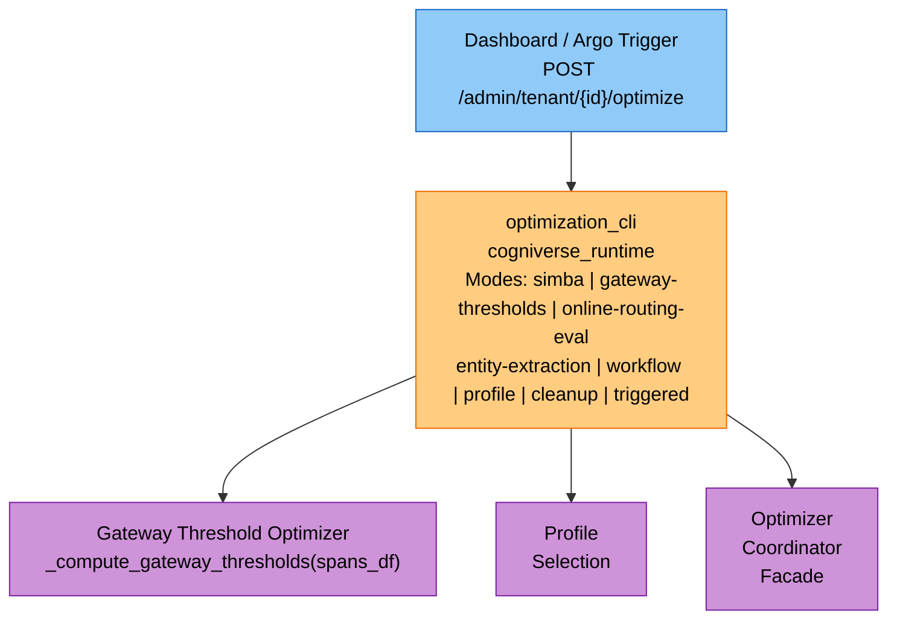
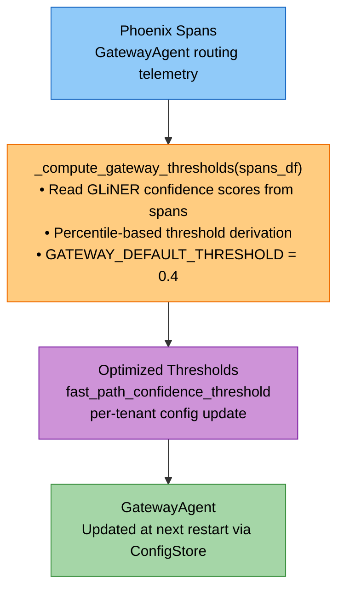
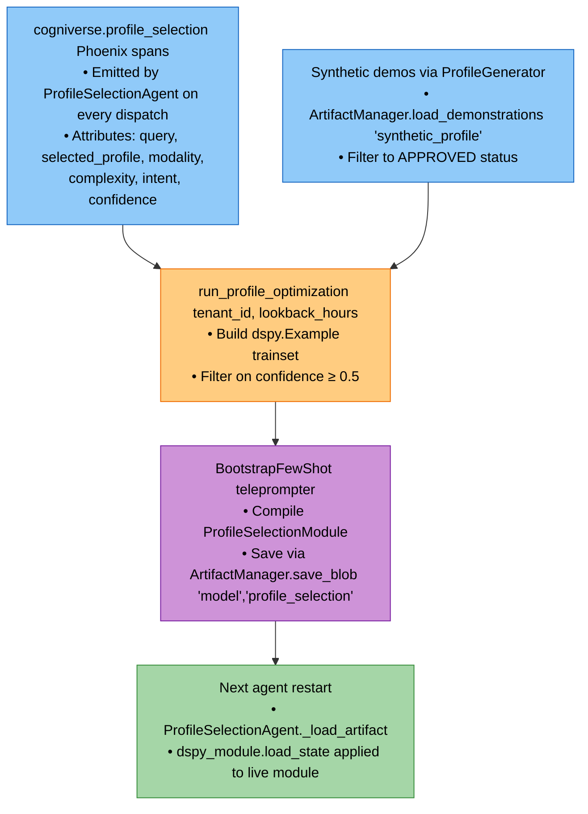
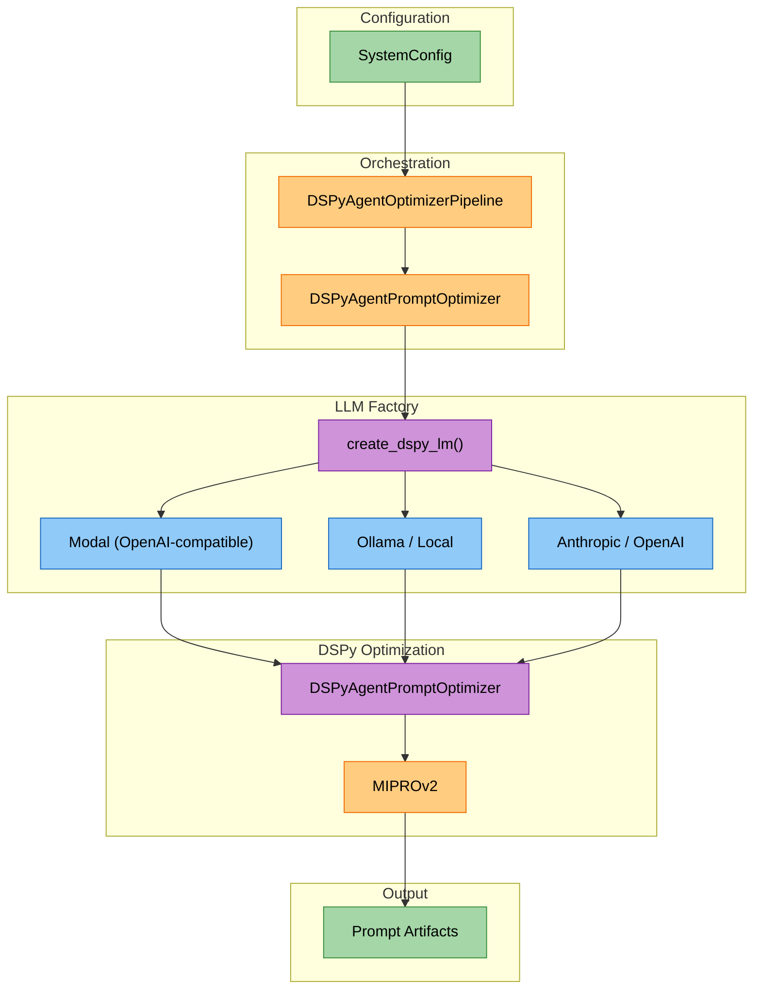

# Optimization Module Study Guide

**Package:** `cogniverse_agents` (Implementation Layer)
**Module Location:** `libs/agents/cogniverse_agents/routing/` (optimization components)

---

## Package Structure

```text
libs/agents/cogniverse_agents/routing/
├── xgboost_meta_models.py         # XGBoost meta-learning for training decisions
└── config.py                      # Routing configuration

libs/agents/cogniverse_agents/optimizer/
├── dspy_agent_optimizer.py        # DSPy prompt optimization (SIMBA/MIPROv2/GEPA)
├── artifact_manager.py            # ArtifactManager: ExperimentMetrics, promote_if_better,
│                                  #   promote_to_canary, rollback_to_version, snapshot_active
├── signature_variants.py          # SignatureVariantRegistry: per-tenant DSPy signature variants
└── strategy_learner.py            # StrategyLearner: pattern + LLM distillation from traces

libs/runtime/cogniverse_runtime/
├── optimization_cli.py            # CLI for per-agent optimization modes
│                                  # Modes: simba|gateway-thresholds|online-routing-eval|
│                                  #        entity-extraction|workflow|profile|cleanup|
│                                  #        triggered|synthetic|rollback
└── routers/tenant.py              # POST /admin/tenant/{id}/optimize (on-demand submit)

libs/synthetic/                     # Synthetic data generation system
├── cogniverse_synthetic/
│   ├── service.py                 # Main SyntheticDataService
│   ├── generators/                # Optimizer-specific generators
│   │   ├── base.py               # Base generator classes
│   │   ├── profile.py            # ProfileSelectionAgent training data
│   │   ├── routing.py            # RoutingGenerator: routing training data
│   │   └── workflow.py           # WorkflowIntelligence training data
│   ├── profile_selector.py       # LLM-based profile selection
│   ├── backend_querier.py        # Vespa content sampling
│   └── utils/                    # Pattern extraction and agent inference
```

---

## Table of Contents
1. [Module Overview](#module-overview)
2. [Architecture](#architecture)
3. [Core Components](#core-components)
4. [Usage Examples](#usage-examples)
5. [Production Considerations](#production-considerations)
6. [Testing](#testing)

---

## Module Overview

### Purpose
The Optimization Module provides sophisticated multi-stage optimization for routing decisions, profile selection, query enhancement, and entity extraction using DSPy 3.0 advanced optimizers (GEPA, MIPROv2, SIMBA, BootstrapFewShot).

### Key Features
- **Advanced DSPy Optimization**: GEPA, MIPROv2, SIMBA, BootstrapFewShot optimizers
- **Gateway Threshold Tuning**: `_compute_gateway_thresholds()` derives GLiNER thresholds from Phoenix spans
- **Online Routing Evaluation**: `run_online_routing_evaluation` scores `cogniverse.routing` spans (routing outcome + confidence calibration) via `OnlineEvaluator` and persists the scores as telemetry annotations; driven by `automation_rules.online_evaluation`
- **Profile Selection Optimization**: `run_profile_optimization` compiles the ProfileSelectionAgent DSPy module
- **On-Demand Workflows**: Dashboard triggers POST `/admin/tenant/{id}/optimize`, which submits an Argo Workflow

### Dependencies

**Note**: Optimizer classes require full module path imports as they are not exported at package level.

```python
# CLI optimization
from cogniverse_runtime.optimization_cli import _compute_gateway_thresholds, GATEWAY_DEFAULT_THRESHOLD

# Synthetic Data Generation (exported at package level)
from cogniverse_synthetic import SyntheticDataService, SyntheticDataRequest, SyntheticDataResponse
from cogniverse_synthetic import OPTIMIZER_REGISTRY
```

---

## Architecture

### 1. Optimization Architecture


```mermaid
flowchart TB
    Dashboard["<span style='color:#000'>Dashboard / Argo Trigger<br/>POST /admin/tenant/{id}/optimize</span>"]

    Dashboard --> OptCLI["<span style='color:#000'>optimization_cli<br/>cogniverse_runtime<br/>Modes: simba | gateway-thresholds | online-routing-eval<br/>entity-extraction | workflow | profile | cleanup | triggered</span>"]

    OptCLI --> GatewayOpt["<span style='color:#000'>Gateway Threshold Optimizer<br/>_compute_gateway_thresholds(spans_df)</span>"]
    OptCLI --> Profile["<span style='color:#000'>Profile<br/>Selection</span>"]
    OptCLI --> Coordinator["<span style='color:#000'>Optimizer<br/>Coordinator<br/>Facade</span>"]

    style Dashboard fill:#90caf9,stroke:#1565c0,color:#000
    style OptCLI fill:#ffcc80,stroke:#ef6c00,color:#000
    style GatewayOpt fill:#ce93d8,stroke:#7b1fa2,color:#000
    style Profile fill:#ce93d8,stroke:#7b1fa2,color:#000
    style Coordinator fill:#ce93d8,stroke:#7b1fa2,color:#000
```

### 2. Gateway Threshold Optimization Architecture


```mermaid
flowchart TB
    Phoenix["<span style='color:#000'>Phoenix Spans<br/>GatewayAgent routing telemetry</span>"]

    Phoenix --> Compute["<span style='color:#000'>_compute_gateway_thresholds(spans_df)<br/>• Read GLiNER confidence scores from spans<br/>• Percentile-based threshold derivation<br/>• GATEWAY_DEFAULT_THRESHOLD = 0.4</span>"]

    Compute --> Thresholds["<span style='color:#000'>Optimized Thresholds<br/>fast_path_confidence_threshold<br/>per-tenant config update</span>"]

    Thresholds --> Gateway["<span style='color:#000'>GatewayAgent<br/>Updated at next restart via ConfigStore</span>"]

    style Phoenix fill:#90caf9,stroke:#1565c0,color:#000
    style Compute fill:#ffcc80,stroke:#ef6c00,color:#000
    style Thresholds fill:#ce93d8,stroke:#7b1fa2,color:#000
    style Gateway fill:#a5d6a7,stroke:#388e3c,color:#000
```

### 3. Profile Selection Optimization Architecture


```mermaid
flowchart TB
    Spans["<span style='color:#000'>cogniverse.profile_selection Phoenix spans<br/>• Emitted by ProfileSelectionAgent on every dispatch<br/>• Attributes: query, selected_profile, modality,<br/>  complexity, intent, confidence</span>"]

    Spans --> RunOpt["<span style='color:#000'>run_profile_optimization tenant_id, lookback_hours<br/>• Build dspy.Example trainset<br/>• Filter on confidence ≥ 0.5</span>"]

    Synthetic["<span style='color:#000'>Synthetic demos via ProfileGenerator<br/>• ArtifactManager.load_demonstrations 'synthetic_profile'<br/>• Filter to APPROVED status</span>"] --> RunOpt

    RunOpt --> Compile["<span style='color:#000'>BootstrapFewShot teleprompter<br/>• Compile ProfileSelectionModule<br/>• Save via ArtifactManager.save_blob 'model','profile_selection'</span>"]

    Compile --> Reload["<span style='color:#000'>Next agent restart<br/>• ProfileSelectionAgent._load_artifact<br/>• dspy_module.load_state applied to live module</span>"]

    style Spans fill:#90caf9,stroke:#1565c0,color:#000
    style Synthetic fill:#90caf9,stroke:#1565c0,color:#000
    style RunOpt fill:#ffcc80,stroke:#ef6c00,color:#000
    style Compile fill:#ce93d8,stroke:#7b1fa2,color:#000
    style Reload fill:#a5d6a7,stroke:#388e3c,color:#000
```

---

## Core Components

### 1. **Gateway Threshold Optimizer** (`optimization_cli.py`)

On-demand gateway confidence threshold tuning using Phoenix span data.

**Key Functions:**

```python
GATEWAY_DEFAULT_THRESHOLD = 0.4

def _compute_gateway_thresholds(spans_df) -> dict:
    """
    Derive optimized GLiNER confidence thresholds from Phoenix spans.

    Reads gateway routing spans and uses percentile analysis to
    find the threshold that minimises misrouting while maintaining
    fast-path hit rate.

    Returns:
        {"fast_path_confidence_threshold": float, ...}
    """
```

**On-Demand Submission:**
```python
# Dashboard or Argo submits via runtime API:
# POST /admin/tenant/{tenant_id}/optimize
# Body: {"mode": "gateway-thresholds"}
# Returns: {workflow_name, namespace, mode, status_url}

# Check run status:
# GET /admin/tenant/{tenant_id}/optimize/runs/{workflow_name}
# Returns: {phase, started_at, finished_at, message}
```

**File:** `libs/runtime/cogniverse_runtime/optimization_cli.py`

---

### 2. **ProfileSelectionAgent Optimization**

DSPy module optimization for `ProfileSelectionAgent` — the per-query classifier that picks the
backend profile and emits modality/complexity/intent in a `cogniverse.profile_selection` span.

**CLI mode:** `--mode profile`

**Key function:**

```python
async def run_profile_optimization(
    tenant_id: str,
    lookback_hours: float = 24.0,
) -> dict:
    """
    Optimize ProfileSelectionAgent's DSPy module:

    For each optimization run:
    1. Collect ProfileSelectionExampleSchema examples from Phoenix spans
    2. Augment with synthetic data from ProfileGenerator if needed
    3. Compile ProfileSelectionModule via MIPROv2 (≥50 examples) or BootstrapFewShot (<50)
    4. Save compiled module as artifact ("model", "profile_selection")

    The agent loads the artifact at startup via _load_artifact().

    Returns: {"trained": bool, "examples_count": int, "strategy": str}
    """
```

**Training:**

- Uses **MIPROv2** if ≥50 examples (metric-aware instruction optimization)

- Uses **BootstrapFewShot** if <50 examples (few-shot learning)

- Saves compiled module as artifact (`("model", "profile_selection")`) via `ArtifactManager`

**File:** `libs/runtime/cogniverse_runtime/optimization_cli.py`

---

### 3. **DSPyAgentPromptOptimizer**

DSPy prompt optimizer for agent modules (SIMBA, MIPROv2, GEPA, BootstrapFewShot).

**CLI mode:** `--mode simba`

**File:** `libs/agents/cogniverse_agents/optimizer/dspy_agent_optimizer.py`

---

### 4. **Signature Variants**

Per-tenant named-variant registry for DSPy signatures. Each agent has at least a `"default"` variant; tenants opt into variants like `"with_jurisdiction"` via `TenantConfig.metadata['signature_variants'][agent_type]`. The artefact manager keys prompts / demos / experiments on `(tenant_id, agent_type, variant_id)` so each variant has its own compiled artefacts.

**File:** `libs/agents/cogniverse_agents/optimizer/signature_variants.py`

**Key methods:**

```python
from cogniverse_agents.optimizer.signature_variants import (
    SignatureVariantRegistry,
    variant_qualified_agent_key,
    DEFAULT_VARIANT_ID,  # "default"
)

reg = SignatureVariantRegistry()

# Register a variant. Idempotent for identical (agent_type, variant_id, description);
# raises ValueError when replace=False and the variant exists with a different definition.
reg.register("legal_qa", "with_jurisdiction", description="adds jurisdiction input")

# Tenant lookup. Falls back to "default" when:
#   * TenantConfig is None / has no metadata dict
#   * signature_variants key is missing or not a dict
#   * the requested variant id is not registered (logged at WARNING — operators want typo signal)
variant_id = reg.selected_for_tenant(tenant_config, "legal_qa")

# Artefact dataset key. Default variant returns the bare agent_type so pre-variant
# artefacts keep working; non-default variants get a ``::variant=<safe_id>`` suffix.
key = variant_qualified_agent_key("legal_qa", variant_id)
# -> "legal_qa"                              when variant_id == "default"
# -> "legal_qa::variant=with_jurisdiction"   otherwise
```

The registry is intentionally schemaless — variants only track which ids are valid for an agent; the agent owns the actual DSPy signature class lookup table.

---

### 6. **Canary FSM**

`ArtifactManager` maintains a three-slot state — `active`, `canary`, `retired` — per `(tenant_id, agent_type)` and persists it via Phoenix `DatasetStore` under the `config` blob key. Routing decisions are stable per request (sha1 of `request_seed`, bucket `% 100`).

**File:** `libs/agents/cogniverse_agents/optimizer/artifact_manager.py`

```python
from cogniverse_agents.optimizer.artifact_manager import ArtifactManager

am = ArtifactManager(telemetry_provider=phoenix_provider, tenant_id="acme:production")

# Promote a versioned artefact to canary at a traffic percentage.
# Raises ValueError if traffic_pct not in [1, 100]. Replaces any existing canary
# (the prior canary moves to retired with reason="superseded_by_new_canary").
state = await am.promote_to_canary("search_agent", version=7, traffic_pct=10)

# Promote canary to active. Prior active goes to retired with
# reason="superseded_by_canary_promotion". Restores prompts + demos at the
# un-versioned dataset name agents read at __init__. Raises ValueError if no canary set.
state = await am.promote_canary_to_active("search_agent")

# Drop the current canary back to retired without promoting. No-op when no canary set.
# Common reason values: "metric_regression", "admin_retire", "superseded_by_new_canary".
state = await am.retire_canary("search_agent", reason="metric_regression")
```

State shape:

```python
{
  "active":  {"version": 6, "promoted_at": "..."},
  "canary":  {"version": 7, "promoted_at": "...", "traffic_pct": 10},
  "retired": [{"version": 5, "retired_at": "...", "reason": "..."}, ...],
}
```

---

### 7. **Rollback CLI**

Restore active artefacts to a previously snapshotted version. Wraps `ArtifactManager.rollback_to_version` and snapshots the current active first so the rollback is itself reversible.

**File:** `libs/runtime/cogniverse_runtime/optimization_cli.py::run_rollback`

```bash
# Roll back search_agent's active prompts to v2
uv run python -m cogniverse_runtime.optimization_cli \
  --mode rollback \
  --tenant-id acme:production \
  --agent search_agent \
  --prompts-version 2

# Demos rollback is independent; supply either or both
uv run python -m cogniverse_runtime.optimization_cli \
  --mode rollback \
  --tenant-id acme:production \
  --agent search_agent \
  --prompts-version 2 \
  --demos-version 3
```

Required: `--tenant-id`, `--agent`, plus at least one of `--prompts-version` / `--demos-version`. The Phoenix provider is built directly from `PHOENIX_HTTP_ENDPOINT` / `PHOENIX_GRPC_ENDPOINT` env vars so a CLI invocation can target a specific Phoenix without going through the global telemetry config.

Returns `{summary: ..., backup_versions: {prompts: int?, demos: int?}}` — pass those versions to a follow-up `--mode rollback` to undo.

---

### 8. **`--mode cleanup` (memory + logs + temp + config vacuum)**

Daily-cleanup workflow body (per-tenant when `--tenant-id` is set, global sweep when omitted).

**File:** `libs/runtime/cogniverse_runtime/optimization_cli.py::run_cleanup`

| Section | Source | Knob |
|---|---|---|
| `memory_cleanup` | `Mem0MemoryManager.cleanup_with_schema(build_default_registry())` per tenant | per-kind TTLs in `KnowledgeRegistry` |
| `log_cleanup` | `_prune_aged_files(LOG_DIR, older_than_days=log_retention_days)` | `LOG_DIR` env (default `/logs`), `--log-retention-days` (default 7) |
| `temp_cleanup` | `_prune_aged_files(TEMP_DIR, older_than_days=TEMP_RETENTION_DAYS)` | `TEMP_DIR` env (default `/tmp`), `TEMP_RETENTION_DAYS` env (default 1) |
| `config_vacuum` | `VespaConfigStore.prune_all_configs(keep=CONFIG_KEEP_VERSIONS)` | `CONFIG_KEEP_VERSIONS` env (default 10) |

`_prune_aged_files` is a silent no-op when the path is not a directory (the cron pod may not mount `/logs` in every topology); it returns `{"skipped": "<reason>"}` so the workflow log records the skip. `_vacuum_config_metadata` is similarly safe when the backing store is not `VespaConfigStore`. Each section reports exact counts (`scanned`, `deleted`, `dropped`) so the workflow log proves the work landed.

```bash
# Global sweep (every org / every tenant)
uv run python -m cogniverse_runtime.optimization_cli --mode cleanup --log-retention-days 7

# Per-tenant sweep
uv run python -m cogniverse_runtime.optimization_cli \
  --mode cleanup --tenant-id acme:production --log-retention-days 7
```

Result dict shape: `{log_retention_days, memory_retention_days, memory_cleanup: {tid: "completed: {...}"} | per_tenant_dict, tenants_processed?, log_cleanup, temp_cleanup, config_vacuum}`.

---

### 9. **`--mode monthly-reports`**

Generates usage + performance JSON for the prior period (default 30 days).

**File:** `libs/runtime/cogniverse_runtime/optimization_cli.py::run_monthly_reports`

Writes two files into `--reports-output-dir` (default `./reports`):

- `usage-YYYYMM.json` — per-org tenant counts (`organization_metadata` + `tenant_metadata`), each tenant's `schemas_deployed` list and `schema_count`; top-level summary `{org_count, tenant_count, schema_count}`.
- `performance-YYYYMM.json` — per-tenant Phoenix span count, latency `mean / p50 / p95`, and `error_rate` (`status_code != OK`) over the lookback window. Empty-data tenants record `{span_count: 0, latency_*: null, error_rate: 0.0}`; Phoenix query failures record `{"error": "phoenix query failed: ..."}` and continue.

```bash
uv run python -m cogniverse_runtime.optimization_cli \
  --mode monthly-reports \
  --reports-output-dir /reports \
  --lookback-hours 720
```

`--tenant-id` is not required (the workflow sweeps every tenant the metadata schemas know about). Cron `cogniverse-monthly-reports` (chart, schedule `0 5 1 * *`, 1st of month 5 AM UTC) runs this followed by a `minio/mc:latest` step that uploads to `cogniverse-backups/reports/` (`hostStorage.backup.bucket` + `argo.optimization.monthlyReports.uploadPrefix`).

Returns `{period, generated_at, output_dir, files_written: [usage_path, perf_path], summary: {org_count, tenant_count, perf_tenants_with_data}}`.

---

## Usage Examples

### Example 1: On-Demand Gateway Threshold Optimization

```bash
# Submit gateway-threshold optimization via the runtime API (dashboard or CLI):
curl -X POST http://localhost:8000/admin/tenant/acme:production/optimize \
  -H "Content-Type: application/json" \
  -d '{"mode": "gateway-thresholds"}'
# Returns: {"workflow_name": "opt-gateway-acme-...", "namespace": "cogniverse",
#           "mode": "gateway-thresholds", "status_url": "/admin/tenant/acme:production/optimize/runs/opt-gateway-acme-..."}

# Check status:
curl http://localhost:8000/admin/tenant/acme:production/optimize/runs/opt-gateway-acme-...
# Returns: {"phase": "Succeeded", "started_at": "...", "finished_at": "...", "message": ""}

# Terminate a running Workflow:
curl -X POST http://localhost:8000/admin/tenant/acme:production/optimize/runs/opt-gateway-acme-.../cancel
# Returns: {"phase": "Failed", "message": "Terminated by user", ...}

# Retry a failed Workflow (restarts only the failed nodes, reuses successful ones):
curl -X POST http://localhost:8000/admin/tenant/acme:production/optimize/runs/opt-gateway-acme-.../retry
# Returns: {"phase": "Running", ...}
```

The runtime does not inline the container spec into each submitted
Workflow. Instead it references a chart-installed ``WorkflowTemplate``
(``cogniverse-optimization-runner``) via ``spec.workflowTemplateRef``:
the scheduled CronWorkflows (``agent-optimization`` weekly,
``daily-gateway`` daily) use the same template, so the image/env/
resource/mutex spec lives in one place
(``charts/cogniverse/templates/optimization-workflow-template.yaml``).

The WorkflowTemplate declares a **per-tenant mutex** so multiple submits
for the same tenant serialise (prevents the dashboard Run button from
stacking pods); different tenants optimize independently.

```python
# The Argo Workflow runs optimization_cli internally:
# uv run python -m cogniverse_runtime.optimization_cli --mode gateway-thresholds --tenant-id acme:production

# To call the threshold computation directly in tests:
from cogniverse_runtime.optimization_cli import _compute_gateway_thresholds, GATEWAY_DEFAULT_THRESHOLD

thresholds = _compute_gateway_thresholds(spans_df)
# Returns: {"fast_path_confidence_threshold": 0.62, ...}
print(f"Default threshold: {GATEWAY_DEFAULT_THRESHOLD}")  # 0.4
print(f"Computed threshold: {thresholds['fast_path_confidence_threshold']:.2f}")  # 0.62
```

---

### Example 2: Profile Selection Optimization

```python
# Trigger via the runtime CLI (or Argo Workflow --mode profile):
# uv run python -m cogniverse_runtime.optimization_cli --mode profile --tenant-id acme:production

# Or trigger on-demand via the admin API:
import requests

response = requests.post(
    "http://localhost:8000/admin/tenant/acme:production/optimize",
    json={"mode": "profile"}
)
result = response.json()
print(f"Workflow: {result['workflow_name']}")
print(f"Status URL: {result['status_url']}")
```

---

## Production Considerations

### 1. **Performance Optimization**

**Optimization on Demand:**
```python
# optimization_cli runs modes in isolation; no long-running optimizer process
# Triggered via Argo Workflow or direct API call
```

**Asynchronous Optimization:**
```python
# Argo Workflow runs CLI modes in background without blocking runtime
# POST /admin/tenant/{tenant_id}/optimize → submits Argo Workflow → returns immediately
```

---

### 2. **Data Quality and Safety**

**Confidence Thresholds:**
```python
# Only use high-confidence spans for training
min_confidence = 0.7  # Adjust based on model calibration
```

**Synthetic Data Control:**
```python
# Progressive strategies based on data availability
strategy = training_strategy_model.select_strategy(context)

# SYNTHETIC: Use only when real data < 20 examples
# HYBRID: Mix real + synthetic (1:1 ratio) for 20-50 examples
# PURE_REAL: Use only real data when >= 50 examples
```

---

### 3. **Multi-Tenant Isolation**

**Tenant-Specific Optimization:**
```python
# Each tenant has isolated optimization state via telemetry
# Optimization is submitted per-tenant via the runtime API:
# POST /admin/tenant/tenant_a/optimize  {"mode": "gateway-thresholds"}
# POST /admin/tenant/tenant_b/optimize  {"mode": "profile"}

# Optimization CLI uses tenant-scoped telemetry provider for artifact isolation
# Artifacts saved as ("model", "profile_selection") scoped to tenant_id
```

---

### 4. **Monitoring and Observability**

**Workflow Status Monitoring:**
```bash
# Check status of a submitted optimization workflow
curl http://localhost:8000/admin/tenant/acme:production/optimize/runs/<workflow_name>
# {"phase": "Running", "started_at": "2026-04-24T03:00:00Z", "finished_at": null, "message": ""}

# List all optimization workflows
argo list -n cogniverse --selector workflow-type=optimization
```

**Performance Degradation Detection via QualityMonitor:**
```python
# QualityMonitor (cogniverse_evaluation) checks agent scores and submits
# optimization workflows automatically via quality_monitor_cli
# uv run python -m cogniverse_runtime.quality_monitor_cli --tenant-id default --runtime-url http://localhost:8000
```

---

### 5. **Production Deployment**

**Optimization is on-demand, not a long-running service.**

```bash
# Trigger via dashboard UI button or direct API call:
curl -X POST http://localhost:8000/admin/tenant/acme:production/optimize \
  -d '{"mode": "gateway-thresholds"}'

# Or run directly via CLI (e.g., from Argo Workflow template):
uv run python -m cogniverse_runtime.optimization_cli \
  --mode gateway-thresholds --tenant-id acme:production
```

---

### 6. **Production Deployment Infrastructure**

The optimization module includes production-ready deployment infrastructure with CLI tools and Argo Workflows for batch and scheduled optimization.

#### CLI: `cogniverse_runtime.optimization_cli`

**Command-line interface for per-agent optimization:**

```bash
# Optimize query enhancement (SIMBA)
uv run python -m cogniverse_runtime.optimization_cli \
  --mode simba \
  --tenant-id default

# Optimize gateway thresholds
uv run python -m cogniverse_runtime.optimization_cli \
  --mode gateway-thresholds \
  --tenant-id default

# Optimize entity extraction
uv run python -m cogniverse_runtime.optimization_cli \
  --mode entity-extraction \
  --tenant-id default

# Optimize workflow orchestration
uv run python -m cogniverse_runtime.optimization_cli \
  --mode workflow \
  --tenant-id default

# Optimize search profile selection
uv run python -m cogniverse_runtime.optimization_cli \
  --mode profile \
  --tenant-id default

# Clean up old optimization logs
uv run python -m cogniverse_runtime.optimization_cli \
  --mode cleanup \
  --log-retention-days 7
```

**Available Options:**

- `--mode`: Which agent to optimize (simba/gateway-thresholds/entity-extraction/workflow/profile/cleanup/triggered/synthetic)

- `--tenant-id`: Tenant identifier (default: "default")

- `--log-retention-days`: Days to retain logs (cleanup mode, default: 7)

**Automatic DSPy Optimizer Selection:**
The CLI automatically selects the best DSPy optimizer based on training data size:

- < 100 examples → Bootstrap

- 100-500 examples → SIMBA

- 500-1000 examples → MIPRO

- \> 1000 examples → GEPA

#### Argo Workflows Integration

**Batch Optimization Workflow:**

Submit module optimization as Kubernetes workflow:

```bash
# Submit batch optimization
argo submit workflows/batch-optimization.yaml \
  -n cogniverse \
  --parameter tenant-id="acme_corp" \
  --parameter optimizer-category="routing" \
  --parameter optimizer-type="profile" \
  --parameter max-iterations="100" \
  --parameter use-synthetic-data="true"
```

**Scheduled Optimization CronWorkflows:**

Automatic optimization on schedule:

**Scheduled CronWorkflows** (`workflows/auto-optimization-cron.yaml`, `workflows/scheduled-optimization.yaml`, `workflows/scheduled-maintenance.yaml`):

Weekly Optimization (Sunday 3 AM UTC):
```bash
# View schedule
kubectl get cronworkflow weekly-optimization -n cogniverse

# Check last run
argo list -n cogniverse --selector workflows.argoproj.io/cron-workflow=weekly-optimization --limit 1

# Trigger manually
argo submit --from cronwf/weekly-optimization -n cogniverse
```

Daily Optimization Check (4 AM UTC):
```bash
# View schedule (once implemented)
kubectl get cronworkflow daily-optimization-check -n cogniverse

# Suspend/resume
argo cron suspend daily-optimization-check -n cogniverse
argo cron resume daily-optimization-check -n cogniverse
```

**What Gets Optimized:**

- Weekly: All modules (profile, routing, workflow, gateway-thresholds) + DSPy optimizer

- Daily: gateway-thresholds optimization

**Automatic Execution:**

- Checks Phoenix for annotation count

- Runs optimization if annotation threshold met (weekly: 50, daily: 20)

- Generates synthetic data from backend storage using DSPy modules

- Auto-selects DSPy optimizer based on data size

- Deploys if improvement > 5%

#### Module Optimization vs DSPy Optimization

**Module Optimization** (`optimizer-category: routing`):

- **What**: profile, routing, workflow modules

- **How**: Auto-selected DSPy optimizer (Bootstrap/SIMBA/MIPRO/GEPA)

- **Data**: Phoenix traces + synthetic data generation

- **Use case**: Optimize routing decisions and workflow planning

**DSPy Optimization** (`optimizer-category: dspy`):

- **What**: DSPy modules (prompt templates, reasoning chains)

- **How**: Explicit DSPy optimizer (GEPA/Bootstrap/SIMBA/MIPRO)

- **Data**: Golden evaluation datasets

- **Use case**: Teacher-student distillation for local models

#### Monitoring Workflows

```bash
# List optimization workflows
argo list -n cogniverse --selector workflow-type=optimization

# Get workflow results
argo get <workflow-name> -n cogniverse -o json | \
  jq '.status.nodes | .[] | select(.displayName=="run-optimization") | .outputs.parameters'

# View improvement metrics
argo get <workflow-name> -n cogniverse -o json | \
  jq -r '.status.outputs.parameters[] | select(.name=="improvement") | .value'
```

#### UI Dashboard Integration

The optimization infrastructure integrates with the Streamlit dashboard:

**Module Optimization Tab:**

- Submit Argo workflows on-demand

- Configure optimization parameters

- Generate synthetic training data

- Monitor workflow progress

- View optimization results

**Execution Modes:**

1. **Automatic (Scheduled)**: CronWorkflows run optimization_cli on schedule

2. **Manual (Dashboard-triggered)**: Dashboard button calls POST `/admin/tenant/{id}/optimize` → submits Argo Workflow on demand

See `docs/development/ui-dashboard.md` for full UI documentation.

---

### 7. **Error Handling and Recovery**

**Workflow Failure Handling:**
```bash
# Check failed workflow details
argo get <workflow-name> -n cogniverse -o json | jq '.status.message'

# Retry a failed optimization
argo resubmit <workflow-name> -n cogniverse
```

**Artifact Persistence:**

Optimization artifacts are persisted to the telemetry store via `ArtifactManager` using Phoenix `DatasetStore`. `run_profile_optimization` and `DSPyAgentPromptOptimizer` save compiled modules that agents reload at startup via `_load_artifact`.

---

## Testing

### Test Files

**Profile Selection Optimization:**

- Location: `tests/routing/unit/` and `tests/runtime/`

- Focus: ProfileSelectionAgent artifact save/load round-trip

**Gateway Threshold Computation:**

- Location: `tests/runtime/unit/test_optimization_cli.py`

- Key Tests:
  - `test_compute_gateway_thresholds`
  - `test_gateway_default_threshold`

---

### Test Scenarios

**1. Gateway Threshold Computation:**
```python
def test_compute_gateway_thresholds():
    """Test threshold derivation from Phoenix spans"""
    from cogniverse_runtime.optimization_cli import _compute_gateway_thresholds, GATEWAY_DEFAULT_THRESHOLD
    import pandas as pd

    spans_df = pd.DataFrame({
        "gliner_confidence": [0.3, 0.5, 0.6, 0.7, 0.8, 0.9],
        "routing_correct": [False, True, True, True, True, True],
    })

    result = _compute_gateway_thresholds(spans_df)
    assert "fast_path_confidence_threshold" in result
    assert GATEWAY_DEFAULT_THRESHOLD == 0.4
```

---

**Coverage:**

- **Unit tests**: XGBoost meta-models, gateway threshold computation, ProfileGenerator

- **Integration tests**: Profile selection optimization with synthetic data, artifact round-trip

- **Error handling tests**: Graceful degradation, artifact persistence

---

## DSPy Training Data Requirements

### Overview

DSPy optimizers require properly formatted training examples with **all expected output fields** defined. Missing fields will cause `AttributeError: 'Example' object has no attribute 'field_name'` during metric evaluation.

### Training Data Format

Each DSPy `Example` must include:
1. **Input fields** (marked with `.with_inputs()`)
2. **All output fields** that metrics will access

**Example Structure:**
```python
import dspy

example = dspy.Example(
    # Input fields
    query="user query here",
    context="optional context",

    # Output fields (ALL fields that metrics check must be present)
    primary_intent="search",
    confidence=0.9,
    recommended_agent="video_search"
).with_inputs("query", "context")  # Specify which fields are inputs
```

### Query Analysis Training Data

**Required Output Fields:**

- `primary_intent`: Main intent category

- `complexity_level`: "simple" | "complex"

- `needs_video_search`: "true" | "false"

- `needs_text_search`: "true" | "false"

- `multimodal_query`: "true" | "false"

- `temporal_pattern`: Temporal info or "none"

**Example:**
```python
training_data = [
    dspy.Example(
        query="Show me videos of robots from yesterday",
        context="",
        # All output fields required for metrics
        primary_intent="video_search",
        complexity_level="simple",
        needs_video_search="true",
        needs_text_search="false",
        multimodal_query="false",
        temporal_pattern="yesterday",
    ).with_inputs("query", "context"),

    dspy.Example(
        query="Compare research papers on deep learning",
        context="academic",
        primary_intent="analysis",
        complexity_level="complex",
        needs_video_search="false",
        needs_text_search="true",
        multimodal_query="false",
        temporal_pattern="none",
    ).with_inputs("query", "context"),
]
```

### Agent Routing Training Data

**Required Output Fields:**

- `recommended_workflow`: Workflow type

- `primary_agent`: Main agent to use

- `routing_confidence`: Confidence score (0.0-1.0 as string)

**Example:**
```python
training_data = [
    dspy.Example(
        query="Show me videos",
        analysis_result="simple search",
        available_agents="video_search",
        # All output fields
        recommended_workflow="direct_search",
        primary_agent="video_search",
        routing_confidence="0.9",
    ).with_inputs("query", "analysis_result", "available_agents"),

    dspy.Example(
        query="Analyze data trends",
        analysis_result="complex analysis",
        available_agents="detailed_report",
        recommended_workflow="detailed_analysis",
        primary_agent="detailed_report",
        routing_confidence="0.85",
    ).with_inputs("query", "analysis_result", "available_agents"),
]
```

### Common Errors

#### Missing Output Fields

**Error:**
```python
AttributeError: 'Example' object has no attribute 'primary_intent'
```

**Cause:** Metric function accesses `example.primary_intent` but Example doesn't have that field.

**Fix:** Add the missing field to all training examples:
```python
example = dspy.Example(
    query="...",
    primary_intent="search",  # ← Add missing field
    # ... other fields
).with_inputs("query")
```

#### Incorrect Field Types

**Error:**
```python
TypeError: expected str, got bool
```

**Cause:** DSPy Examples store all fields as strings internally.

**Fix:** Convert to strings:
```python
# ❌ Bad
needs_video_search=True

# ✅ Good
needs_video_search="true"
```

### Validation

Before running optimization, validate your training data:

```python
def validate_training_data(examples, required_fields):
    """Validate all examples have required output fields."""
    for i, ex in enumerate(examples):
        for field in required_fields:
            if not hasattr(ex, field):
                raise ValueError(
                    f"Example {i} missing required field '{field}'"
                )
    print(f"✅ All {len(examples)} examples valid")

# Usage
required = ["primary_intent", "complexity_level", "needs_video_search"]
validate_training_data(training_data, required)
```

### Best Practices

1. **Define all output fields upfront** - Check what your metrics access
2. **Use consistent field names** - Match your DSPy signature output fields
3. **Validate before optimization** - Catch missing fields early
4. **Use string values** - DSPy converts everything to strings
5. **Document required fields** - Keep a reference list for your team

### File References

- `libs/agents/cogniverse_agents/optimizer/dspy_agent_optimizer.py` - Training data loading
- `tests/agents/integration/test_dspy_optimization_integration.py` - Example tests with proper format

---

## DSPy Agent Optimization Infrastructure

The `libs/agents/cogniverse_agents/optimizer/` package provides infrastructure for running DSPy optimization with configurable model providers (Modal GPU, local Ollama, cloud APIs).

**Location:** `libs/agents/cogniverse_agents/optimizer/`


```mermaid
flowchart TB
    subgraph "Configuration"
        Config["<span style='color:#000'>SystemConfig</span>"]
    end

    subgraph "Orchestration"
        Orch["<span style='color:#000'>DSPyAgentOptimizerPipeline</span>"]
        Client["<span style='color:#000'>DSPyAgentPromptOptimizer</span>"]
    end

    subgraph "LLM Factory"
        Factory["<span style='color:#000'>create_dspy_lm()</span>"]
        Modal["<span style='color:#000'>Modal (OpenAI-compatible)</span>"]
        Local["<span style='color:#000'>Ollama / Local</span>"]
        API["<span style='color:#000'>Anthropic / OpenAI</span>"]
    end

    subgraph "DSPy Optimization"
        AgentOpt["<span style='color:#000'>DSPyAgentPromptOptimizer</span>"]
        MIPRO["<span style='color:#000'>MIPROv2</span>"]
    end

    subgraph "Output"
        Artifacts["<span style='color:#000'>Prompt Artifacts</span>"]
    end

    Config --> Orch
    Orch --> Client
    Client --> Factory

    Factory --> Modal
    Factory --> Local
    Factory --> API

    Modal --> AgentOpt
    Local --> AgentOpt
    API --> AgentOpt

    AgentOpt --> MIPRO
    MIPRO --> Artifacts

    style Config fill:#a5d6a7,stroke:#388e3c,color:#000
    style Orch fill:#ffcc80,stroke:#ef6c00,color:#000
    style Client fill:#ffcc80,stroke:#ef6c00,color:#000
    style Factory fill:#ce93d8,stroke:#7b1fa2,color:#000
    style Modal fill:#90caf9,stroke:#1565c0,color:#000
    style Local fill:#90caf9,stroke:#1565c0,color:#000
    style API fill:#90caf9,stroke:#1565c0,color:#000
    style AgentOpt fill:#ce93d8,stroke:#7b1fa2,color:#000
    style MIPRO fill:#ffcc80,stroke:#ef6c00,color:#000
    style Artifacts fill:#a5d6a7,stroke:#388e3c,color:#000
```

### LLM Factory

**Location:** `libs/foundation/cogniverse_foundation/config/llm_factory.py`

All DSPy LM creation goes through the centralized `create_dspy_lm()` factory. Provider is encoded in the model string (LiteLLM convention). The Cogniverse chart always emits `openai/<bare-model>` for every in-cluster backend (vLLM or Ollama); the actual destination is selected by `api_base`. External SaaS providers use their own litellm prefix (`anthropic/`, `together/`, etc.).

```python
from cogniverse_foundation.config.unified_config import LLMEndpointConfig
from cogniverse_foundation.config.llm_factory import create_dspy_lm

# Local Ollama (modern Ollama exposes /v1/chat/completions; use openai/ prefix)
local_lm = create_dspy_lm(LLMEndpointConfig(
    model="openai/llama3:8b",
    api_base="http://localhost:11434/v1",
))

# Modal (OpenAI-compatible endpoint)
modal_lm = create_dspy_lm(LLMEndpointConfig(
    model="openai/HuggingFaceTB/SmolLM3-3B",
    api_base="https://username--general-inference-service-serve.modal.run",
))

# Cloud API (Anthropic)
teacher_lm = create_dspy_lm(LLMEndpointConfig(
    model="anthropic/claude-3-5-sonnet-20241022",
    api_key="sk-ant-...",
))

# Use with scoped context (never global dspy.settings.configure)
import dspy
with dspy.context(lm=local_lm):
    result = module(query="Route this query...")
```

### LLM Configuration Structure

LLM configuration is centralized in the `llm_config` section of `config.json`:

```json
{
  "llm_config": {
    "primary": {
      "model": "openai/google/gemma-4-e4b-it",
      "api_base": "http://localhost:11434/v1",
      "api_key": "placeholder-no-auth-needed"
    },
    "teacher": {
      "model": "anthropic/claude-3-5-sonnet-20241022",
      "api_key": "sk-ant-..."
    },
    "overrides": {
      "orchestrator_agent": {
        "model": "openai/qwen3:8b",
        "api_base": "http://localhost:11434/v1",
        "api_key": "placeholder-no-auth-needed"
      }
    }
  }
}
```

All agents and optimizers resolve their LLM config from this section via `LLMConfig.from_dict()` and `create_dspy_lm()`.

### DSPyAgentPromptOptimizer

**Location:** `libs/agents/cogniverse_agents/optimizer/dspy_agent_optimizer.py`

Optimizes prompts for multiple agent types using DSPy signatures.

```python
from cogniverse_agents.optimizer.dspy_agent_optimizer import (
    DSPyAgentPromptOptimizer,
    DSPyAgentOptimizerPipeline,
)

# Initialize optimizer
optimizer = DSPyAgentPromptOptimizer(config={
    "optimization": {
        "max_bootstrapped_demos": 8,
        "max_labeled_demos": 16,
        "max_rounds": 3,
        "stop_at_score": 0.95
    }
})

# Initialize language model via centralized LLM config
from cogniverse_foundation.config.unified_config import LLMEndpointConfig

endpoint_config = LLMEndpointConfig(
    model="openai/llama3:8b",
    api_base="http://localhost:11434/v1",
)
optimizer.initialize_language_model(endpoint_config=endpoint_config)

# Create and run pipeline
pipeline = DSPyAgentOptimizerPipeline(optimizer)
optimized_modules = await pipeline.optimize_all_modules()

# Save optimized prompts via ArtifactManager → telemetry DatasetStore
await pipeline.save_optimized_prompts(
    tenant_id="production",
    telemetry_provider=telemetry_provider,
)
```

#### Optimizable Modules

| Module | DSPy Signature | Purpose |
|--------|----------------|---------|
| `query_analysis` | `QueryAnalysisSignature` | Intent detection, complexity analysis |
| `agent_routing` | `AgentRoutingSignature` | Agent selection, workflow recommendation |
| `summary_generation` | `SummaryGenerationSignature` | Summary quality optimization |
| `detailed_report` | `DetailedReportSignature` | Report structure optimization |

### Live Routing Optimization

The A2A entry point is the GLiNER-based `GatewayAgent`, whose routing
thresholds are tuned by the `gateway-thresholds` optimization mode in
`optimization_cli.py` (persists the `gateway_thresholds` artifact via
`run_gateway_thresholds_optimization`). Agent prompts
(query_analysis / summary / detailed_report) are optimized separately by
`DSPyAgentPromptOptimizer`.

### CLI Usage

```bash
# Optimize gateway routing thresholds
uv run python -m cogniverse_runtime.optimization_cli --mode gateway-thresholds

# Run agent prompt optimization
uv run python -m cogniverse_agents.optimizer.dspy_agent_optimizer
```

### Output Artifacts

After optimization, artifacts are persisted to the telemetry store via `ArtifactManager` using Phoenix `DatasetStore`:

- `dspy-prompts-{tenant_id}-router` — Optimized system prompts for the router module
- `dspy-demos-{tenant_id}-router` — Few-shot demonstration examples
- `dspy-experiments-{tenant_id}-{agent_type}` — Optimization run metrics as typed `ExperimentMetrics` rows (one per run via `save_experiment`; read the latest with `load_latest_experiment`)

**Stored prompt artifact structure (retrieved from DatasetStore):**

```json
{
  "system_prompt": "Optimized instructions...",
  "few_shot_examples": [
    {
      "conversation_history": "",
      "user_query": "Show me tutorials on Python",
      "routing_decision": {"search_modality": "video", "generation_type": "raw_results"}
    }
  ],
  "model_config": {
    "student_model": "google/gemma-3-1b-it",
    "temperature": 0.1,
    "max_tokens": 100
  }
}
```

### File References

| File | Purpose |
|------|---------|
| `optimizer/dspy_agent_optimizer.py` | Multi-agent prompt optimization |
| `optimizer/artifact_manager.py` | Artifact persistence via Phoenix DatasetStore |

---

## Related Documentation

- **Routing Module Study Guide**: `docs/modules/routing.md` - Tiered routing strategies
- **Agents Module Study Guide**: `docs/modules/agents.md` - OrchestratorAgent integration
- **Telemetry Module Study Guide**: `docs/modules/telemetry.md` - Phoenix span collection
- **Evaluation Module Study Guide**: `docs/modules/evaluation.md` - RoutingEvaluator
- **Modal Deployment Guide**: `docs/modal/deployment_guide.md` - Modal infrastructure setup

---

**Next Steps:**

1. Review DSPy 3.0 documentation for GEPA, MIPROv2, SIMBA optimizers

2. Experiment with different optimizer strategies (adaptive vs forced)

3. Monitor optimization metrics in production (avg_reward, success_rate, improvement_rate)

4. Tune reward weights for your use case (search_quality_weight, agent_success_weight)

5. Test synthetic data generation for profile selection cold start

---

**File References:**

- `libs/agents/cogniverse_agents/routing/xgboost_meta_models.py` - XGBoost meta-models for training decisions

- `libs/agents/cogniverse_agents/optimizer/dspy_agent_optimizer.py` - Multi-agent DSPy prompt optimization

- `libs/runtime/cogniverse_runtime/optimization_cli.py` - CLI entry point for all optimization modes

- `libs/runtime/cogniverse_runtime/optimization_cli.py` - On-demand CLI modes (gateway-thresholds, simba, workflow, etc.)

- `libs/runtime/cogniverse_runtime/routers/tenant.py` - Dashboard-triggered optimization API endpoints
