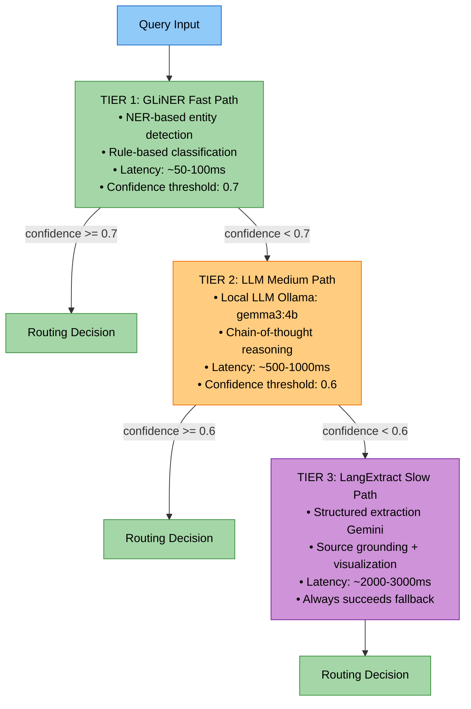
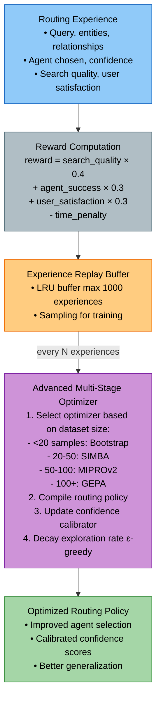
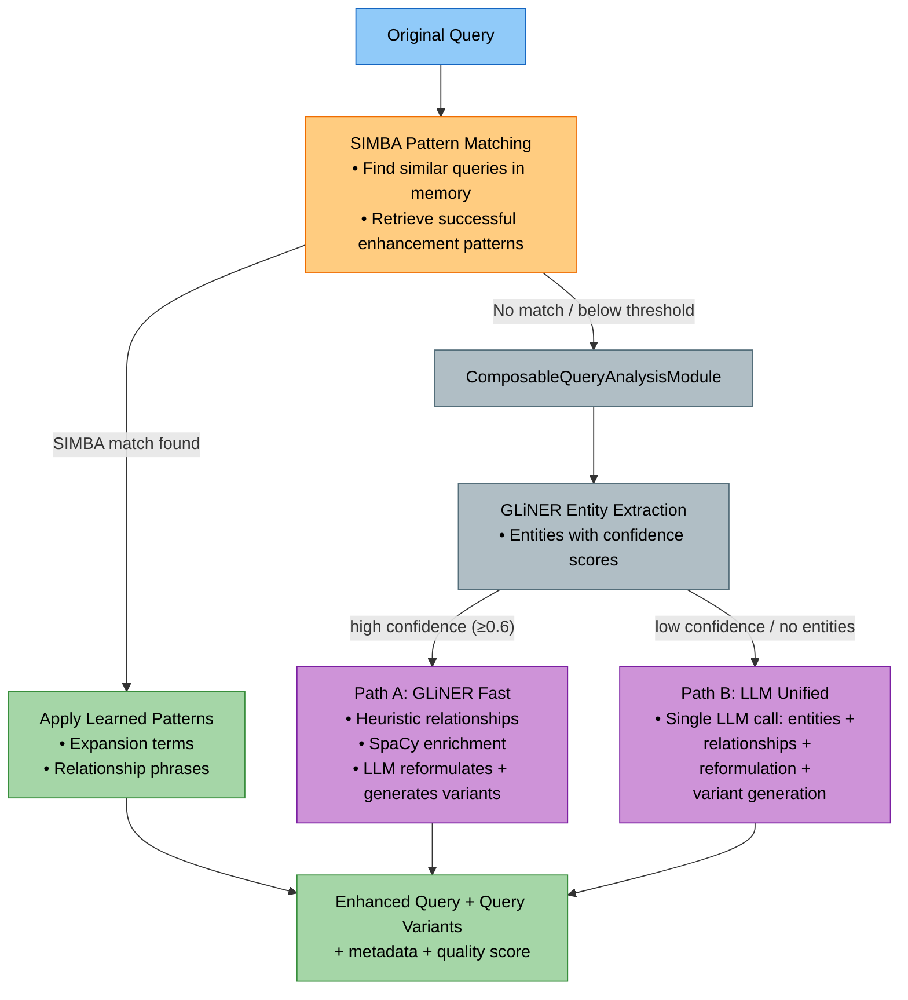

# Routing Module Study Guide

**Package:** `cogniverse_agents` (Implementation Layer)
**Location:** `libs/agents/cogniverse_agents/routing/`

---

## Table of Contents
1. [Module Overview](#module-overview)
2. [Architecture](#architecture)
3. [Core Components](#core-components)
4. [Routing Strategies](#routing-strategies)
5. [Optimization Systems](#optimization-systems)
6. [Data Flow](#data-flow)
7. [Usage Examples](#usage-examples)
8. [Production Considerations](#production-considerations)
9. [Testing](#testing)

---

## Module Overview

### Purpose
The Routing Module provides intelligent query routing capabilities with multiple strategies, advanced optimization (GRPO), and production-ready features including caching, cross-modal fusion, and query enhancement.

### Key Features
- **Tiered Routing**: Fast (GLiNER) → Medium (LLM) → Slow (LangExtract) with confidence thresholds
- **Multiple Strategies**: GLiNER NER, LLM-based, Keyword, Hybrid, Ensemble, LangExtract
- **Advanced Optimization**: GRPO (DSPy 3.0) with GEPA, MIPROv2, SIMBA optimizers
- **Query Enhancement**: SIMBA-based learning with relationship extraction
- **Cross-Modal Optimization**: Multi-modal fusion benefit prediction
- **Production Features**: Per-modality caching (LRU), parallel execution, metrics

### Package Structure
```text
libs/agents/cogniverse_agents/routing/
├── router.py                           # Comprehensive router (1145 lines)
├── strategies.py                       # Core routing strategies (1291 lines)
├── advanced_optimizer.py               # GRPO optimization (1358 lines)
├── config.py                           # Configuration system (390 lines)
├── query_enhancement_engine.py         # Query enhancement with SIMBA (345 lines)
├── cross_modal_optimizer.py            # Multi-modal fusion (685 lines)
├── modality_cache.py                   # Per-modality caching (300 lines)
├── modality_optimizer.py               # Per-modality optimization (783 lines)
├── modality_evaluator.py               # Modality evaluation (521 lines)
├── modality_metrics.py                 # Performance metrics (361 lines)
├── xgboost_meta_models.py              # XGBoost meta-learning (619 lines)
├── contextual_analyzer.py              # Cross-modal context (441 lines)
├── llm_auto_annotator.py               # LLM annotations (294 lines)
├── profile_performance_optimizer.py    # Profile optimization (390 lines)
├── lazy_executor.py                    # Lazy evaluation (309 lines)
├── routing_span_evaluator.py           # Routing span evaluation
├── parallel_executor.py                # Parallel agent execution
├── base.py                             # Base routing classes
└── ... (20+ additional files for DSPy, optimization, and utilities)
```

---

## Architecture

### Tiered Routing Decision Tree



### GRPO Optimization Loop



### Query Enhancement Pipeline



---

## Core Components

### 1. RoutingConfig (config.py:20-390)

**Purpose**: Complete configuration system for routing with environment variable overrides

**Key Attributes**:
```python
@dataclass
class RoutingConfig:
    # Routing mode
    routing_mode: str = "tiered"  # "tiered", "ensemble", "hybrid", "single"

    # Tier configuration
    tier_config: dict = {
        "enable_fast_path": True,
        "fast_path_confidence_threshold": 0.7,
        "slow_path_confidence_threshold": 0.6,
        "max_routing_time_ms": 1000,
    }

    # GLiNER configuration (Tier 1)
    gliner_config: dict = {
        "model": "urchade/gliner_large-v2.1",
        "threshold": 0.3,
        "labels": [...],  # 16 entity types
        "device": "cpu",
    }

    # LLM configuration (Tier 2)
    llm_config: dict = {
        "provider": "local",
        "model": "gemma3:4b",
        "endpoint": "http://localhost:11434",
        "use_chain_of_thought": True,
        "use_think_mode": True,
    }

    # Optimization config
    optimization_config: dict = {
        "enable_auto_optimization": True,
        "optimization_interval_seconds": 3600,
        "dspy_enabled": True,
        "dspy_max_bootstrapped_demos": 10,
    }

    # Performance monitoring
    monitoring_config: dict = {
        "enable_metrics": True,
        "metrics_batch_size": 100,
        "enable_tracing": True,
    }

    # Caching
    cache_config: dict = {
        "enable_caching": True,
        "cache_ttl_seconds": 300,
        "max_cache_size": 1000,
    }

    # Query fusion (ComposableQueryAnalysisModule always generates variants)
    query_fusion_config: dict = {
        "include_original": True,  # Include unmodified query as a variant
        "rrf_k": 60,             # RRF constant for fusing variant results
    }

    # Composable module path selection thresholds
    entity_confidence_threshold: float = 0.6  # GLiNER confidence for Path A vs Path B
    min_entities_for_fast_path: int = 1       # Minimum entities required for Path A
```

**Key Methods**:
```python
@classmethod
def from_file(cls, filepath: Path) -> "RoutingConfig":
    """Load configuration from JSON/YAML file"""

@classmethod
def from_dict(cls, data: dict) -> "RoutingConfig":
    """Create config from a dictionary"""

def to_dict(self) -> dict:
    """Serialize config to dictionary"""

def save(self, filepath: Path):
    """Save configuration to file"""
```

**Usage**:
```python
# Load from file
config = RoutingConfig.from_file("configs/routing_config.yaml")

# Or use defaults
config = RoutingConfig()

# Save example config
config.save("configs/my_routing.json")
```

---

### 2. GLiNERRoutingStrategy (strategies.py:24-381)

**Purpose**: Fast NER-based routing using GLiNER for entity detection (Tier 1)

**Key Features**:

- Entity detection with 17 label types
- Rule-based classification from entities
- Circuit breaker for fault tolerance
- Performance metrics tracking

**Key Methods**:
```python
async def route(
    self,
    query: str,
    context: dict[str, Any] | None = None
) -> RoutingDecision:
    """
    Route query using GLiNER entity detection

    Process:
    1. Extract entities with GLiNER
    2. Classify modality from entity labels
    3. Determine generation type from patterns
    4. Calculate confidence from entity scores

    Returns:
        RoutingDecision with agent, modality, generation_type
    """
```

**Entity Classification Logic**:
```python
# Video indicators
video_entities = ["video_content", "visual_content", "media_content"]

# Text indicators
text_entities = ["document_content", "text_information", "written_content"]

# Summary indicators
summary_entities = ["summary_request"]

# Report indicators
report_entities = ["detailed_analysis", "report_request"]
```

**Performance**:

- Latency: 50-100ms
- Confidence threshold: 0.7
- Success rate: ~85% on clear queries

---

### 3. LLMRoutingStrategy (strategies.py:383-670)

**Purpose**: LLM-based routing with chain-of-thought reasoning (Tier 2)

**Key Features**:

- Uses local Ollama LLMs (gemma3:4b)
- Chain-of-thought prompting
- JSON structured output
- Retry logic with exponential backoff

**Key Methods**:
```python
async def route(
    self,
    query: str,
    context: dict[str, Any] | None = None
) -> RoutingDecision:
    """
    Route using LLM with chain-of-thought

    Process:
    1. Format prompt with system instructions
    2. Call LLM with chain-of-thought mode
    3. Parse JSON response
    4. Extract reasoning and confidence
    5. Create RoutingDecision
    """
```

**Prompt Template**:
```python
system_prompt = """You are a precise routing agent for a multi-modal search system.
Analyze the user query and determine:
1. search_modality: "video", "text", or "both"
2. generation_type: "raw_results", "summary", or "detailed_report"
3. Provide reasoning for your decision

Use exact JSON format in your response."""
```

**Performance**:

- Latency: 500-1000ms
- Confidence threshold: 0.6
- Success rate: ~92% on medium complexity queries

---

### 4. AdvancedRoutingOptimizer (advanced_optimizer.py:137-1358)

**Purpose**: GRPO optimization with DSPy 3.0 advanced optimizers

**Key Features**:

- Multi-stage optimization (Bootstrap → SIMBA → MIPROv2 → GEPA)
- Experience replay buffer
- Reward-based learning
- Confidence calibration
- Exploration vs exploitation (ε-greedy)

**Architecture**:
```python
class AdvancedRoutingOptimizer:
    def __init__(
        self,
        tenant_id: str,                          # REQUIRED - no default
        llm_config: LLMEndpointConfig,           # REQUIRED
        telemetry_provider: TelemetryProvider,   # REQUIRED
        config: Optional[AdvancedOptimizerConfig] = None,
    ):
        # Experience storage
        self.experiences: List[RoutingExperience] = []
        self.experience_replay: List[RoutingExperience] = []  # LRU buffer

        # Metrics
        self.metrics: OptimizationMetrics = ...

        # GRPO components
        self.advanced_optimizer = None  # Multi-stage optimizer
        self.routing_policy = None      # DSPy module
        self.confidence_calibrator = None

        # Exploration
        self.current_epsilon = 0.1  # ε-greedy
```

**Key Methods**:

```python
async def record_routing_experience(
    self,
    query: str,
    entities: List[Dict[str, Any]],
    relationships: List[Dict[str, Any]],
    enhanced_query: str,
    chosen_agent: str,
    routing_confidence: float,
    search_quality: float,
    agent_success: bool,
    processing_time: float = 0.0,
    user_satisfaction: Optional[float] = None,
    metadata: Optional[Dict[str, Any]] = None,
) -> float:
    """
    Record routing experience and compute reward

    Reward computation:
    reward = (search_quality × 0.4)
           + (agent_success × 0.3)
           + (user_satisfaction × 0.3)
           - (time_penalty)

    Triggers optimization every N experiences or on performance decline
    """

async def optimize_routing_decision(
    self,
    query: str,
    entities: List[Dict[str, Any]],
    relationships: List[Dict[str, Any]],
    enhanced_query: str,
    baseline_prediction: Dict[str, Any],
) -> Dict[str, Any]:
    """
    Apply GRPO optimization to routing decision

    Process:
    1. Check if optimization ready (min experiences)
    2. Apply exploration vs exploitation (ε-greedy)
    3. Use optimized policy for prediction
    4. Calibrate confidence score
    5. Return optimized decision
    """

def _create_advanced_optimizer(self):
    """
    Create multi-stage optimizer based on dataset size

    Stages:
    - Bootstrap (0-20): Few-shot learning
    - SIMBA (20-50): Similarity-based memory
    - MIPROv2 (50-100): Metric-aware instruction optimization
    - GEPA (100+): Reflective prompt evolution
    """
```

**Optimization Stages**:
```python
# Adaptive optimizer selection
if dataset_size < 20:
    optimizer = BootstrapFewShot(metric=routing_accuracy_metric)
elif dataset_size < 50:
    optimizer = SIMBA(metric=routing_accuracy_metric)
elif dataset_size < 100:
    optimizer = MIPROv2(metric=routing_accuracy_metric)
else:
    optimizer = GEPA(
        metric=routing_accuracy_metric,
        auto="light",
        reflection_lm=current_lm
    )
```

---

### 5. QueryEnhancementPipeline (query_enhancement_engine.py:21-345)

**Purpose**: Complete query enhancement using ComposableQueryAnalysisModule with SIMBA learning

**Key Features**:

- ComposableQueryAnalysisModule integration (Path A: GLiNER fast, Path B: LLM unified)
- SIMBA pattern-based enhancement (fast shortcut for known patterns)
- LLM-generated query variant generation for multi-query fusion
- Outcome recording for SIMBA learning

**Key Methods**:

```python
async def enhance_query_with_relationships(
    self,
    query: str,
    entities: Optional[List[Dict[str, Any]]] = None,
    relationships: Optional[List[Dict[str, Any]]] = None,
    search_context: str = "general",
    entity_labels: Optional[List[str]] = None,
) -> Dict[str, Any]:
    """
    Complete end-to-end query enhancement

    Process:
    1. Try SIMBA enhancement (pattern matching from successful past queries)
    2. Fall back to ComposableQueryAnalysisModule (Path A or Path B)
    3. Apply include_original flag and build result metadata

    Returns:
        {
            "original_query": str,
            "extracted_entities": List[Dict],
            "extracted_relationships": List[Dict],
            "enhanced_query": str,
            "enhancement_strategy": str,  # "simba" or "composable_A" or "composable_B"
            "quality_score": float,
            "query_variants": List[Dict[str, str]],  # [{"name": str, "query": str}]
            "simba_applied": bool,
            "simba_patterns_used": int,
            "processing_metadata": {"enhancement_method": str, "analysis_path": str, ...},
            ...
        }
    """

async def record_enhancement_outcome(
    self,
    original_query: str,
    enhanced_query: str,
    entities: List[Dict[str, Any]],
    relationships: List[Dict[str, Any]],
    enhancement_strategy: str,
    search_quality_improvement: float,
    routing_confidence_improvement: float,
    user_satisfaction: Optional[float] = None,
) -> None:
    """
    Record enhancement outcome for SIMBA learning

    SIMBA learns successful patterns and applies them to similar queries
    """
```

**Composable Query Analysis** (`ComposableQueryAnalysisModule`):

The composable module replaces the former rule-based `QueryRewriter` with a two-path DSPy module
that generates query variants via LLM:

- **Path A (GLiNER fast path):** GLiNER extracts high-confidence entities → heuristic relationship
  inference → LLM reformulates query and generates variants
- **Path B (LLM unified path):** Single LLM call does entity extraction, relationship extraction,
  query reformulation, and variant generation together

Path selection is automatic based on GLiNER entity confidence (threshold: `entity_confidence_threshold`,
default 0.6). Both paths produce identical output: `entities`, `relationships`, `enhanced_query`,
`query_variants`, `confidence`, and `path_used`.

**Multi-Query Variant Generation:**

The composable module always generates query variants. Each variant is searched in parallel and
results are fused with RRF (see [Ensemble Composition](../architecture/ensemble-composition.md#multi-query-fusion)).

```python
# ComposableQueryAnalysisModule.forward() returns:
# prediction.query_variants = [
#   {"name": "entity_focused", "query": "humanoid robots autonomous soccer match"},
#   {"name": "relationship_expanded", "query": "robots playing competitive soccer game"},
#   {"name": "semantic_broadened", "query": "robotic athletes in football competition"},
# ]
```

The `include_original` flag in `query_fusion_config` controls whether the original query is
prepended as a variant. `rrf_k` is passed through to the fusion algorithm.

---

### 6. CrossModalOptimizer (cross_modal_optimizer.py:21-685)

**Purpose**: Optimize multi-modal fusion for queries spanning multiple modalities

**Key Features**:

- Fusion benefit prediction (XGBoost model)
- Modality agreement calculation
- Query ambiguity scoring
- Historical success tracking
- Pattern discovery from Phoenix spans

**Key Methods**:

```python
def predict_fusion_benefit(
    self,
    primary_modality: QueryModality,
    primary_confidence: float,
    secondary_modality: Optional[QueryModality] = None,
    secondary_confidence: float = 0.0,
    query_text: Optional[str] = None,
) -> float:
    """
    Predict benefit of multi-modal fusion

    Features:
    - primary_modality_confidence
    - secondary_modality_confidence
    - modality_agreement (how well modalities align)
    - query_ambiguity_score (low confidence = high ambiguity)
    - historical_fusion_success_rate

    Returns:
        Expected benefit (0-1)
    """

def record_fusion_result(
    self,
    primary_modality: QueryModality,
    secondary_modality: QueryModality,
    fusion_context: Dict[str, float],
    success: bool,
    improvement: float = 0.0,
):
    """
    Record fusion result for learning

    Updates:
    - Fusion history
    - Success rates per modality pair
    - Used for training fusion benefit model
    """

def get_fusion_recommendations(
    self,
    query_text: str,
    detected_modalities: List[Tuple[QueryModality, float]],
    fusion_threshold: float = 0.5,
) -> Dict[str, Any]:
    """
    Get fusion recommendations for a query

    Returns:
        {
            "should_fuse": bool,
            "fusion_benefit": float,
            "primary_modality": str,
            "secondary_modality": str,
            "reason": str
        }
    """
```

**Fusion Benefit Calculation**:
```python
# Modality agreement (high = consistent, low = conflicting)
modality_agreement = 1.0 - (confidence_diff * 0.5)

# Query ambiguity (high = benefits more from fusion)
query_ambiguity = (1.0 - primary_confidence)  # Low confidence = ambiguous

# Historical success (learned from past fusions)
historical_success = fusion_success_rates.get((primary, secondary), 0.7)

# XGBoost model predicts benefit from features
benefit = fusion_model.predict({
    "primary_modality_confidence": primary_conf,
    "secondary_modality_confidence": secondary_conf,
    "modality_agreement": modality_agreement,
    "query_ambiguity_score": query_ambiguity,
    "historical_fusion_success_rate": historical_success
})
```

---

### 7. ModalityCacheManager (modality_cache.py:67-300)

**Purpose**: Per-modality LRU caching with TTL-based expiration

**Key Features**:

- Separate LRU cache per modality (VIDEO, DOCUMENT, IMAGE)
- TTL-based invalidation (default 3600s)
- Hit/miss tracking per modality
- Cache statistics

**Key Methods**:

```python
def get_cached_result(
    self,
    query: str,
    modality: QueryModality,
    ttl_seconds: int = 3600,
) -> Optional[Any]:
    """
    Get cached result if available and fresh

    Process:
    1. Generate cache key (hash of query + modality)
    2. Check if key exists in modality cache
    3. Check TTL (time.time() - timestamp < ttl)
    4. Update hit/miss stats
    5. Return result or None
    """

def cache_result(
    self,
    query: str,
    modality: QueryModality,
    result: Any,
):
    """
    Store result in modality-specific cache

    Features:
    - LRU eviction (oldest first)
    - Timestamp recording
    - Eviction tracking
    """

def get_cache_stats(
    self,
    modality: Optional[QueryModality] = None
) -> Dict[str, Any]:
    """
    Get cache statistics

    Returns:
        {
            "hits": int,
            "misses": int,
            "evictions": int,
            "hit_rate": float,
            "cache_size": int,
            "cache_capacity": int
        }
    """
```

**Performance**:

- Cache hit latency: <1ms
- Cache miss latency: fallthrough to backend
- Typical hit rate: 40-60% for repeated queries

---

### 8. ModalityOptimizer (modality_optimizer.py:73-783)

**Purpose**: Per-modality routing optimization with XGBoost meta-learning for automatic decisions

**Key Features**:

- Separate optimization per modality (VIDEO, DOCUMENT, IMAGE, AUDIO)
- XGBoost meta-models for training decisions
- Synthetic data generation for cold start
- Progressive training strategies (synthetic → hybrid → pure real)
- DSPy integration with MIPROv2/BootstrapFewShot

**Key Methods**:

```python
async def optimize_all_modalities(
    self,
    lookback_hours: int = 24,
    min_confidence: float = 0.7,
) -> Dict[QueryModality, Dict[str, Any]]:
    """
    Evaluate and optimize all modalities

    Process:
    1. Get span statistics to find modalities with data
    2. Optimize each modality that has data
    3. Return results per modality

    Returns:
        Dictionary mapping each modality to optimization results
    """

async def optimize_modality(
    self,
    modality: QueryModality,
    lookback_hours: int = 24,
    min_confidence: float = 0.7,
    force_training: bool = False,
) -> Dict[str, Any]:
    """
    Evaluate and train a specific modality

    Process:
    1. Collect training examples from spans
    2. Build modeling context
    3. Decide whether to train (XGBoost decision model)
    4. Select training strategy (pure_real, hybrid, synthetic)
    5. Train modality-specific DSPy model
    6. Record training history
    """

def predict_agent(
    self,
    query: str,
    modality: QueryModality,
    query_features: Optional[Dict[str, Any]] = None,
) -> Optional[Dict[str, Any]]:
    """
    Predict best agent using trained modality model

    Returns:
        {"recommended_agent", "confidence", "reasoning", "modality"}
    """
```

---

### 9. ModalityEvaluator (modality_evaluator.py:19-521)

**Purpose**: Converts routing spans into modality-specific training examples with specialized features

**Key Features**:

- Converts Phoenix spans to ModalityExample objects
- Extracts modality-specific features from span attributes
- Supports synthetic data augmentation
- Filters examples based on quality thresholds

**Modality-Specific Features**:

| Modality | Feature Categories |
|----------|-------------------|
| VIDEO | temporal constraints, tutorial indicators, visual content needs |
| DOCUMENT | citation requirements, technical depth, document type |
| IMAGE | diagram type, visual complexity, annotation needs |
| AUDIO | audio type, duration preference, transcript requirements |

**Key Methods**:

```python
async def create_training_examples(
    self,
    lookback_hours: int = 24,
    min_confidence: float = 0.7,
    augment_with_synthetic: bool = False,
    synthetic_ratio: float = 0.3,
) -> Dict[QueryModality, List[ModalityExample]]:
    """
    Create modality-specific training examples from spans

    Returns:
        {
            QueryModality.VIDEO: [example1, example2, ...],
            QueryModality.DOCUMENT: [example3, example4, ...],
            ...
        }
    """
```

---

### 10. ModalityMetricsTracker (modality_metrics.py:20-361)

**Purpose**: Track per-modality performance metrics including latency percentiles, success rates, and error patterns

**Metrics Tracked**:

- Latency (P50, P95, P99)
- Success rate
- Error count by type
- Request volume
- Throughput (QPS)

**Key Methods**:

```python
def record_modality_execution(
    self,
    modality: QueryModality,
    latency_ms: float,
    success: bool,
    error: Optional[str] = None,
):
    """
    Record execution metrics for a modality

    Maintains rolling window of latencies (default: 1000 samples)
    """

def get_modality_stats(self, modality: QueryModality) -> Dict[str, Any]:
    """
    Get aggregated stats for modality

    Returns:
        {
            "modality": str,
            "total_requests": int,
            "success_count": int,
            "error_count": int,
            "success_rate": float,
            "p50_latency": float,
            "p95_latency": float,
            "p99_latency": float,
            "avg_latency": float,
            "error_breakdown": {error_type: count},
            "throughput_qps": float,
        }
    """
```

---

### 11. XGBoost Meta-Models (xgboost_meta_models.py:62-619)

**Purpose**: XGBoost-based meta-models for automatic training decisions without hardcoded thresholds

**Classes**:

**TrainingDecisionModel**: Predicts if training will be beneficial

```python
def should_train(self, context: ModelingContext) -> Tuple[bool, float]:
    """
    Predict if training will be beneficial

    Input Features:
    - real_sample_count
    - synthetic_sample_count
    - success_rate, avg_confidence
    - days_since_last_training
    - current_performance_score
    - data_quality_score, feature_diversity

    Returns:
        (should_train: bool, expected_improvement: float)
    """
```

**TrainingStrategyModel**: Selects optimal training strategy

```python
class TrainingStrategy(Enum):
    PURE_REAL = "pure_real"    # Train on real data only
    HYBRID = "hybrid"          # Mix real + synthetic
    SYNTHETIC = "synthetic"    # Synthetic only (cold start)
    SKIP = "skip"              # Skip training

def select_strategy(self, context: ModelingContext) -> TrainingStrategy:
    """Select optimal training strategy based on context"""
```

**FusionBenefitModel**: Predicts benefit of multi-modal fusion

```python
def predict_benefit(self, fusion_context: Dict[str, float]) -> float:
    """
    Predict fusion benefit from context

    Features:
    - primary_modality_confidence
    - secondary_modality_confidence
    - modality_agreement
    - query_ambiguity_score
    - historical_fusion_success_rate

    Returns:
        Expected benefit (0-1)
    """
```

---

### 12. ContextualAnalyzer (contextual_analyzer.py:34-441)

**Purpose**: Maintains cross-modal context across queries to improve routing and search quality

**Key Features**:

- Conversation history tracking
- Modality preference learning
- Topic evolution tracking
- Temporal pattern recognition
- Context-aware routing hints

**Key Methods**:

```python
def update_context(
    self,
    query: str,
    detected_modalities: List[str],
    result: Optional[Any] = None,
    result_count: int = 0,
):
    """
    Track user query and update context

    Updates:
    - Conversation history (deque with max size)
    - Modality preferences (count per modality)
    - Topic tracking (keyword extraction)
    - Temporal patterns (hourly distribution)
    """

def get_contextual_hints(self, current_query: str) -> Dict[str, Any]:
    """
    Get context-aware routing hints

    Returns:
        {
            "preferred_modality": str,
            "recent_topics": List[str],
            "session_stats": {...},
            "temporal_context": {...}
        }
    """
```

---

### 13. LLMAutoAnnotator (llm_auto_annotator.py:46-294)

**Purpose**: Uses LLM to analyze routing spans and provide initial annotations for training data

**Annotation Labels**:

| Label | Description |
|-------|-------------|
| CORRECT_ROUTING | Right agent chosen |
| WRONG_ROUTING | Wrong agent chosen |
| AMBIGUOUS | Multiple agents could work |
| INSUFFICIENT_INFO | Cannot determine |

**Key Methods**:

```python
def annotate(self, annotation_request: AnnotationRequest) -> AutoAnnotation:
    """
    Generate automatic annotation for a routing decision

    Analyzes:
    - Original query and context
    - Routing decision (chosen agent + confidence)
    - Downstream execution results
    - Error messages or failure indicators

    Returns:
        AutoAnnotation {
            span_id: str,
            label: AnnotationLabel,
            confidence: float,
            reasoning: str,
            suggested_correct_agent: Optional[str],
            requires_human_review: bool
        }
    """
```

**Model Configuration**:

```python
# Default model: claude-3-5-sonnet-20241022
# Override via environment:
#   ANNOTATION_MODEL=gemini-pro
#   ANNOTATION_API_BASE=http://localhost:11434
```

---

### 14. ProfilePerformanceOptimizer (profile_performance_optimizer.py:51-390)

**Purpose**: Learns which backend profile works best for different query types using XGBoost

**Query Features**:

- query_length, word_count
- has_temporal_keywords (when, before, after, timeline, etc.)
- has_spatial_keywords (where, location, near, scene, etc.)
- has_object_keywords (object, person, what, who, etc.)
- avg_word_length

**Key Methods**:

```python
def predict_best_profile(
    self,
    query_text: str,
) -> Tuple[str, float]:
    """
    Predict best profile for query

    Uses Phoenix evaluation data to learn:
    (query_features, profile, ndcg) → best_profile

    Returns:
        (best_profile: str, confidence: float)
    """

async def extract_training_data_from_phoenix(
    self,
    tenant_id: str,
    project_name: str,
    start_time=None,
    end_time=None,
    min_samples: int = 10,
) -> Tuple[np.ndarray, np.ndarray, List[str]]:
    """
    Extract training data from telemetry provider evaluation spans

    Args:
        tenant_id: Tenant identifier
        project_name: Project name for span query
        start_time: Start time for span query
        end_time: End time for span query
        min_samples: Minimum samples required

    Returns:
        Tuple of (features_array, labels_array, profile_names)
    """
```

---

### 15. LazyModalityExecutor (lazy_executor.py:16-309)

**Purpose**: Execute expensive modalities only when needed based on cost/benefit analysis

**Cost Ranking** (fast → slow):

| Modality | Cost | Description |
|----------|------|-------------|
| TEXT | 1 | Fastest |
| DOCUMENT | 2 | Fast |
| IMAGE | 5 | Medium |
| VIDEO | 8 | Slow |
| AUDIO | 10 | Slower |
| MIXED | 15 | Multiple modalities |

**Key Methods**:

```python
async def execute_with_lazy_evaluation(
    self,
    query: str,
    modalities: List[QueryModality],
    context: Dict[str, Any],
    modality_executor: Callable,
) -> Dict[str, Any]:
    """
    Execute modalities with lazy evaluation

    Strategy:
    1. Sort modalities by cost (cheap first)
    2. Execute in order, checking quality threshold
    3. Stop early when sufficient results achieved

    Returns:
        {
            "results": {modality: result},
            "executed_modalities": [modality1, modality2],
            "skipped_modalities": [modality3],
            "early_stopped": bool,
            "total_cost": int,
        }
    """
```

**Execution Stats**:

```python
# Track execution patterns
executor.execution_stats = {
    "total_executions": int,
    "early_stops": int,       # Stopped before all modalities
    "full_executions": int,   # Executed all modalities
    "modalities_skipped": int # Total skipped due to early stop
}
```

---

## Routing Strategies

### Strategy Comparison

| Strategy | Tier | Latency | Accuracy | Use Case |
|----------|------|---------|----------|----------|
| **GLiNER** | 1 | 50-100ms | ~85% | Clear queries with obvious entities |
| **LLM** | 2 | 500-1000ms | ~92% | Medium complexity, ambiguous queries |
| **Keyword** | 3 | <10ms | ~70% | Simple pattern matching |
| **LangExtract** | 3 | 2-3s | ~95% | Complex queries, structured extraction |
| **Hybrid** | - | Varies | ~88% | Combine multiple strategies |
| **Ensemble** | - | Parallel | ~90% | Voting across strategies |

### Strategy Selection Logic

```python
# Tiered mode (default)
if routing_mode == "tiered":
    # Try Tier 1 (GLiNER)
    result = await gliner_strategy.route(query)
    if result.confidence_score >= 0.7:
        return result

    # Fallback to Tier 2 (LLM)
    result = await llm_strategy.route(query)
    if result.confidence_score >= 0.6:
        return result

    # Fallback to Tier 3 (LangExtract)
    result = await langextract_strategy.route(query)
    return result  # Always succeeds

# Ensemble mode
elif routing_mode == "ensemble":
    # Run multiple strategies in parallel
    results = await asyncio.gather(
        gliner_strategy.route(query),
        llm_strategy.route(query),
        keyword_strategy.route(query)
    )

    # Weighted voting
    final_decision = ensemble_vote(results, weights={
        "gliner": 1.5,
        "llm": 2.0,
        "keyword": 0.5
    })

    return final_decision
```

---

## Optimization Systems

### GRPO Optimization Lifecycle

```text
1. EXPERIENCE COLLECTION
   ├─ Query + entities + relationships
   ├─ Agent selection + confidence
   ├─ Search quality + processing time
   └─ User satisfaction (optional)

2. REWARD COMPUTATION
   reward = Σ(weighted_outcomes) - time_penalty

3. EXPERIENCE REPLAY
   ├─ Store in LRU buffer (max 1000)
   └─ Sample batch for training

4. OPTIMIZATION TRIGGER
   ├─ Every N experiences (default: 10)
   └─ Or on performance degradation

5. OPTIMIZER SELECTION
   ├─ Bootstrap:  <20 samples
   ├─ SIMBA:      20-50 samples
   ├─ MIPROv2:    50-100 samples
   └─ GEPA:       100+ samples

6. POLICY COMPILATION
   ├─ Train routing policy (DSPy module)
   ├─ Update confidence calibrator
   └─ Decay exploration rate

7. INFERENCE WITH OPTIMIZATION
   ├─ Exploration (ε-greedy): try random agent
   └─ Exploitation: use optimized policy
```

### Confidence Calibration

```python
# Raw confidence from routing model
raw_confidence = 0.75

# Query complexity factors
query_complexity = (
    len(query.split()) / 20.0 +          # Word count
    len(entities) / 10.0 +                 # Entity count
    len(relationships) / 5.0               # Relationship count
) / 3.0

# Historical accuracy for similar queries
historical_accuracy = get_historical_accuracy(query)

# Calibrate using DSPy module
calibrated_confidence = confidence_calibrator(
    raw_confidence=raw_confidence,
    query_complexity=query_complexity,
    historical_accuracy=historical_accuracy
)

# Result: 0.68 (more realistic)
```

### SIMBA Query Enhancement

```python
# Pattern discovery from successful enhancements
successful_patterns = [
    {
        "original": "robot playing soccer",
        "enhanced": "robot playing soccer (robotics OR autonomous system OR sports technology)",
        "improvement": 0.35  # 35% better search quality
    },
    {
        "original": "AI algorithm",
        "enhanced": "AI algorithm (machine learning OR neural network OR computational method)",
        "improvement": 0.28
    }
]

# Pattern application to new query
new_query = "robot learning to play games"

# Find similar patterns (cosine similarity > threshold)
similar = find_similar_patterns(new_query, successful_patterns)

# Apply learned enhancement
if similar and avg_improvement(similar) > 0.2:
    enhanced_query = apply_pattern(new_query, similar[0])
else:
    enhanced_query = composable_module.forward(new_query).enhanced_query
```

---

## Data Flow

### Complete Routing Flow with Optimization

```mermaid
flowchart TB
    UserQuery["<span style='color:#000'>USER QUERY</span>"]

    Enhancement["<span style='color:#000'>QUERY ENHANCEMENT PIPELINE<br/><br/>1. SIMBA pattern matching (fast shortcut)<br/>2. ComposableQueryAnalysisModule<br/>   Path A: GLiNER → LLM reformulation<br/>   Path B: LLM unified extraction<br/><br/>Output: enhanced_query, query_variants</span>"]

    Cache["<span style='color:#000'>MODALITY CACHE CHECK<br/><br/>• Generate cache key<br/>• Check LRU cache<br/>• Verify TTL (3600s)</span>"]

    Tiered["<span style='color:#000'>TIERED ROUTING DECISION<br/><br/>Tier 1: GLiNER (50-100ms, conf > 0.7)<br/>Tier 2: LLM (500-1000ms, conf > 0.6)<br/>Tier 3: LangExtract (2-3s, always succeeds)</span>"]

    GRPO["<span style='color:#000'>GRPO OPTIMIZATION<br/><br/>• Check optimization ready<br/>• ε-greedy exploration<br/>• Apply optimized policy<br/>• Calibrate confidence</span>"]

    Fusion["<span style='color:#000'>CROSS-MODAL FUSION CHECK<br/><br/>• Detect multiple modalities<br/>• Predict fusion benefit (XGBoost)<br/>• Decide: fusion or single</span>"]

    Decision["<span style='color:#000'>ROUTING DECISION<br/><br/>recommended_agent<br/>search_modality<br/>confidence<br/>enhanced_query</span>"]

    Execution["<span style='color:#000'>AGENT EXECUTION<br/><br/>• Route to selected agent<br/>• Execute with enhanced query<br/>• Collect results + metrics</span>"]

    Recording["<span style='color:#000'>EXPERIENCE RECORDING<br/><br/>• Record routing experience<br/>• Compute reward<br/>• Trigger optimization<br/>• Record SIMBA outcome</span>"]

    UserQuery --> Enhancement
    Enhancement --> Cache
    Cache -->|cache miss| Tiered
    Cache -->|cache hit| Decision
    Tiered --> GRPO
    GRPO --> Fusion
    Fusion --> Decision
    Decision --> Execution
    Execution --> Recording

    style UserQuery fill:#90caf9,stroke:#1565c0,color:#000
    style Enhancement fill:#ffcc80,stroke:#ef6c00,color:#000
    style Cache fill:#ce93d8,stroke:#7b1fa2,color:#000
    style Tiered fill:#ffcc80,stroke:#ef6c00,color:#000
    style GRPO fill:#ffcc80,stroke:#ef6c00,color:#000
    style Fusion fill:#ffcc80,stroke:#ef6c00,color:#000
    style Decision fill:#b0bec5,stroke:#546e7a,color:#000
    style Execution fill:#ffcc80,stroke:#ef6c00,color:#000
    style Recording fill:#ce93d8,stroke:#7b1fa2,color:#000
```



---

## Usage Examples

### Example 1: Basic Tiered Routing

```python
from cogniverse_agents.routing.strategies import GLiNERRoutingStrategy, LLMRoutingStrategy

# Initialize strategies with optional dict config (or None for defaults)
gliner = GLiNERRoutingStrategy()
llm = LLMRoutingStrategy()

# Route a query
query = "Show me videos of robots playing soccer"

# Try Tier 1 (GLiNER)
result = await gliner.route(query)
if result.confidence_score >= 0.7:
    print(f"Tier 1 success: {result.primary_agent} (conf: {result.confidence_score})")
else:
    # Fallback to Tier 2 (LLM)
    result = await llm.route(query)
    print(f"Tier 2 success: {result.primary_agent} (conf: {result.confidence_score})")

# Output:
# Tier 1 success: video_search_agent (conf: 0.87)
```

### Example 2: Query Enhancement with SIMBA

```python
from cogniverse_agents.routing.query_enhancement_engine import QueryEnhancementPipeline
from cogniverse_foundation.telemetry.providers.base import TelemetryProvider

# telemetry_provider obtained from TelemetryManager.get_tenant_provider(tenant_id)

# Initialize pipeline with SIMBA enabled (telemetry_provider required when enable_simba=True)
pipeline = QueryEnhancementPipeline(
    enable_simba=True,
    telemetry_provider=telemetry_provider,
    tenant_id="production",
)

# Enhance query
query = "AI robot learning to play games"

result = await pipeline.enhance_query_with_relationships(
    query=query,
    search_context="general"
)

print(f"Original: {result['original_query']}")
print(f"Enhanced: {result['enhanced_query']}")
print(f"Strategy: {result['enhancement_strategy']}")
print(f"Quality: {result['quality_score']}")
print(f"SIMBA applied: {result['simba_applied']}")
print(f"Patterns used: {result['simba_patterns_used']}")

# Output:
# Original: AI robot learning to play games
# Enhanced: AI robot learning to play games (machine learning OR reinforcement learning OR game AI) (robotics OR autonomous agent OR intelligent system)
# Strategy: simba
# Quality: 0.82
# SIMBA applied: True
# Patterns used: 3

# Record outcome for learning
await pipeline.record_enhancement_outcome(
    original_query=query,
    enhanced_query=result['enhanced_query'],
    entities=result['extracted_entities'],
    relationships=result['extracted_relationships'],
    enhancement_strategy=result['enhancement_strategy'],
    search_quality_improvement=0.35,  # 35% improvement
    routing_confidence_improvement=0.12,
    user_satisfaction=0.9
)
```

### Example 3: GRPO Optimization

```python
from cogniverse_agents.routing.advanced_optimizer import (
    AdvancedRoutingOptimizer,
    AdvancedOptimizerConfig,
)
from cogniverse_foundation.config.unified_config import LLMEndpointConfig
from cogniverse_foundation.telemetry.providers.base import TelemetryProvider

# Initialize optimizer
config = AdvancedOptimizerConfig(
    optimizer_strategy="adaptive",  # Selects optimizer based on data size
    min_experiences_for_training=50,
    learning_rate=0.001,
    batch_size=32
)

optimizer = AdvancedRoutingOptimizer(
    tenant_id="default",
    llm_config=LLMEndpointConfig(model="ollama_chat/smollm3:3b", api_base="http://localhost:11434"),
    telemetry_provider=telemetry_provider,
    config=config,
)

# Record routing experience
reward = await optimizer.record_routing_experience(
    query="Show videos of Boston Dynamics robots",
    entities=[{"text": "Boston Dynamics", "label": "ORGANIZATION"}, ...],
    relationships=[("Boston Dynamics", "creates", "robots"), ...],
    enhanced_query="Boston Dynamics robots (robotics OR quadruped OR Atlas robot)",
    chosen_agent="video_search_agent",
    routing_confidence=0.85,
    search_quality=0.92,  # High quality results
    agent_success=True,
    processing_time=0.5,
    user_satisfaction=0.95
)

print(f"Reward: {reward:.3f}")

# Get optimization status
status = optimizer.get_optimization_status()
print(f"Total experiences: {status['total_experiences']}")
print(f"Training step: {status['training_step']}")
print(f"Success rate: {status['metrics']['success_rate']}")
print(f"Avg reward: {status['metrics']['avg_reward']}")

# Get routing recommendations (uses optimized policy)
recommendations = await optimizer.get_routing_recommendations(
    query="Robots in manufacturing",
    entities=[...],
    relationships=[...]
)

print(f"Recommended agent: {recommendations['recommended_agent']}")
print(f"Confidence: {recommendations['confidence']}")
print(f"Reasoning: {recommendations['reasoning']}")
print(f"Optimization ready: {recommendations['optimization_ready']}")
```

### Example 4: Cross-Modal Fusion

```python
from cogniverse_agents.routing.cross_modal_optimizer import CrossModalOptimizer
from cogniverse_agents.search.multi_modal_reranker import QueryModality
from cogniverse_foundation.telemetry.providers.base import TelemetryProvider

# telemetry_provider obtained from TelemetryManager.get_tenant_provider(tenant_id)

# Initialize optimizer (both telemetry_provider and tenant_id are required)
optimizer = CrossModalOptimizer(
    telemetry_provider=telemetry_provider,
    tenant_id="default",
)

# Predict fusion benefit
benefit = optimizer.predict_fusion_benefit(
    primary_modality=QueryModality.VIDEO,
    primary_confidence=0.65,  # Moderate confidence
    secondary_modality=QueryModality.DOCUMENT,
    secondary_confidence=0.58,  # Similar confidence (ambiguous)
    query_text="machine learning tutorial"
)

print(f"Fusion benefit: {benefit:.3f}")

if benefit > 0.5:
    print("Recommendation: Use multi-modal fusion")
else:
    print("Recommendation: Use single modality")

# Get fusion recommendations
recommendations = optimizer.get_fusion_recommendations(
    query_text="machine learning tutorial",
    detected_modalities=[
        (QueryModality.VIDEO, 0.65),
        (QueryModality.DOCUMENT, 0.58)
    ],
    fusion_threshold=0.5
)

print(f"Should fuse: {recommendations['should_fuse']}")
print(f"Fusion benefit: {recommendations['fusion_benefit']:.3f}")
print(f"Primary: {recommendations['primary_modality']}")
print(f"Secondary: {recommendations['secondary_modality']}")

# Record fusion outcome
optimizer.record_fusion_result(
    primary_modality=QueryModality.VIDEO,
    secondary_modality=QueryModality.DOCUMENT,
    fusion_context={...},
    success=True,
    improvement=0.25  # 25% improvement from fusion
)
```

### Example 5: Per-Modality Caching

```python
from cogniverse_agents.routing.modality_cache import ModalityCacheManager
from cogniverse_agents.search.multi_modal_reranker import QueryModality

# Initialize cache manager
cache = ModalityCacheManager(cache_size_per_modality=1000)

query = "machine learning tutorials"
modality = QueryModality.VIDEO

# Check cache
cached_result = cache.get_cached_result(
    query=query,
    modality=modality,
    ttl_seconds=3600  # 1 hour TTL
)

if cached_result:
    print("Cache HIT!")
    results = cached_result
else:
    print("Cache MISS - fetching from backend...")
    results = await backend.search(query, modality)

    # Store in cache
    cache.cache_result(
        query=query,
        modality=modality,
        result=results
    )

# Get cache statistics
stats = cache.get_cache_stats(modality=QueryModality.VIDEO)
print(f"Video cache stats:")
print(f"  Hits: {stats['hits']}")
print(f"  Misses: {stats['misses']}")
print(f"  Hit rate: {stats['hit_rate']:.2%}")
print(f"  Cache size: {stats['cache_size']}/{stats['cache_capacity']}")

# Get stats for all modalities
all_stats = cache.get_cache_stats()
for mod, mod_stats in all_stats.items():
    print(f"{mod}: hit_rate={mod_stats['hit_rate']:.2%}")
```

---

## Production Considerations

### Performance Optimization

**Latency Targets**:

- Tier 1 (GLiNER): <100ms p95
- Tier 2 (LLM): <1000ms p95
- Tier 3 (LangExtract): <3000ms p95
- Cache hit: <1ms
- Overall routing: <150ms p95 (with cache)

**Throughput**:

- GLiNER: ~100 queries/sec (single GPU)
- LLM: ~10 queries/sec (local Ollama)
- Cache: ~10,000 queries/sec

**Optimization Strategies**:
```python
# 1. Enable caching
config.cache_config["enable_caching"] = True
config.cache_config["cache_ttl_seconds"] = 3600

# 2. Use tiered routing (fast path first)
config.routing_mode = "tiered"
config.tier_config["enable_fast_path"] = True

# 3. Tune confidence thresholds
config.tier_config["fast_path_confidence_threshold"] = 0.75  # Higher = more fallbacks
config.tier_config["slow_path_confidence_threshold"] = 0.60

# 4. Enable GRPO optimization (improves over time)
config.optimization_config["enable_auto_optimization"] = True

# 5. Parallel execution for ensemble
config.routing_mode = "ensemble"  # Run strategies in parallel
```

### Scalability

**Horizontal Scaling**:
```python
# Deploy multiple routing instances
# Each instance:
# - Independent GLiNER model
# - Shared LLM endpoint (Ollama cluster)
# - Shared cache (Redis)
# - Shared GRPO storage (S3)

# Load balancing:
# - Round-robin for stateless routing
# - Consistent hashing for cache locality
```

**Vertical Scaling**:
```python
# GLiNER optimization
gliner_config["device"] = "cuda"  # Use GPU
gliner_config["batch_size"] = 64  # Batch requests

# LLM optimization
llm_config["model"] = "gemma3:4b"  # Smaller model for speed
llm_config["max_tokens"] = 100  # Limit output length
```

### Monitoring

**Key Metrics**:
```python
# Routing metrics
- routing_latency_p50, p95, p99
- routing_confidence_distribution
- tier_usage_distribution (Tier 1/2/3 usage %)
- fallback_rate (% queries falling back to Tier 2/3)

# Cache metrics
- cache_hit_rate (per modality)
- cache_eviction_rate
- cache_size_utilization

# Optimization metrics
- grpo_reward_trend (moving average)
- optimization_improvement_rate
- confidence_accuracy (calibration quality)
- simba_pattern_usage

# Performance metrics
- throughput_qps (queries per second)
- error_rate
- circuit_breaker_open_rate
```

**Example Monitoring Setup**:
```python
import time
from cogniverse_foundation.telemetry.manager import TelemetryManager
from cogniverse_foundation.telemetry.config import TelemetryConfig
from cogniverse_agents.routing.modality_metrics import ModalityMetricsTracker

telemetry_config = TelemetryConfig()
telemetry = TelemetryManager(config=telemetry_config)
metrics_tracker = ModalityMetricsTracker()

with telemetry.span(
    name="routing_decision",
    tenant_id="prod",
    attributes={
        "query": query,
        "routing_mode": "tiered",
        "tier": "gliner"
    }
) as span:
    start_time = time.time()
    result = await gliner.route(query)
    latency_ms = (time.time() - start_time) * 1000

    span.set_attribute("primary_agent", result.primary_agent)
    span.set_attribute("confidence_score", result.confidence_score)
    span.set_attribute("search_modality", result.search_modality.value)
    span.set_attribute("routing_method", result.routing_method)

    # Record modality metrics using separate tracker
    metrics_tracker.record_modality_execution(
        modality=result.search_modality,
        latency_ms=latency_ms,
        success=True
    )
```

### Error Handling

**Circuit Breaker Pattern**:
```python
# GLiNER strategy includes circuit breaker
class GLiNERRoutingStrategy:
    def __init__(self, config):
        self.circuit_breaker = CircuitBreaker(
            failure_threshold=5,    # Open after 5 failures
            recovery_timeout=30.0   # Try recovery after 30s
        )

    async def route(self, query):
        try:
            return self.circuit_breaker.call(self._route_with_gliner, query)
        except CircuitBreakerOpen:
            # Fallback to next tier
            return await self.fallback_strategy.route(query)
```

**Graceful Degradation**:
```python
# Tiered routing provides automatic fallback
try:
    # Try Tier 1 (GLiNER - fast)
    result = await gliner.route(query)
    if result.confidence_score >= 0.7:
        return result
except Exception as e:
    logger.warning(f"Tier 1 failed: {e}")

try:
    # Fallback to Tier 2 (LLM - medium)
    result = await llm.route(query)
    if result.confidence_score >= 0.6:
        return result
except Exception as e:
    logger.warning(f"Tier 2 failed: {e}")

# Fallback to Tier 3 (LangExtract - slow but reliable)
result = await langextract.route(query)
return result  # Always succeeds
```

### Configuration Management

**Environment-based Configuration**:
```bash
# Override routing config via env vars
export ROUTING_MODE=tiered
export ROUTING_LLM_MODEL=gemma3:4b
export ROUTING_GLINER_DEVICE=cuda
export ROUTING_CACHE_ENABLE_CACHING=true
export ROUTING_CACHE_TTL_SECONDS=3600
export ROUTING_OPTIMIZATION_ENABLE_AUTO_OPTIMIZATION=true
```

```python
# Load config from file
config = RoutingConfig.from_file("configs/routing_config.yaml")
```

**Multi-tenant Configuration**:
```python
# Separate config per tenant
tenant_configs = {
    "acme": RoutingConfig(
        routing_mode="tiered",
        gliner_config={"threshold": 0.4},  # Lower threshold
        cache_config={"cache_ttl_seconds": 7200}  # Longer TTL
    ),
    "startup": RoutingConfig(
        routing_mode="ensemble",  # More accurate but slower
        gliner_config={"threshold": 0.3},
    )
}

config = tenant_configs[tenant_id]
```

---

## Testing

### Unit Tests
Located in: `tests/routing/unit/`

**Key Test Files**:

- `test_modality_cache.py` - Cache management
- `test_modality_evaluator.py` - Modality evaluator tests
- `test_modality_optimizer.py` - Per-modality optimization
- `test_modality_metrics.py` - Modality metrics tracking
- `test_cross_modal_optimizer.py` - Cross-modal fusion tests
- `test_lazy_executor.py` - Lazy execution tests
- `test_contextual_analyzer.py` - Contextual analysis tests
- `test_routing_strategies.py` - Routing strategy tests
- `test_xgboost_meta_models.py` - XGBoost meta-model tests

**Example Test**:
```python
# tests/routing/unit/test_modality_cache.py

import pytest
from cogniverse_agents.routing.modality_cache import ModalityCacheManager
from cogniverse_agents.search.multi_modal_reranker import QueryModality

@pytest.mark.asyncio
async def test_cache_hit_and_miss():
    """Test cache hit and miss behavior"""
    cache = ModalityCacheManager(cache_size_per_modality=10)

    query = "machine learning tutorials"
    modality = QueryModality.VIDEO

    # First access should be a miss
    result = cache.get_cached_result(query, modality)
    assert result is None

    # Cache a result
    cache.cache_result(query, modality, {"results": ["video1", "video2"]})

    # Second access should be a hit
    result = cache.get_cached_result(query, modality)
    assert result is not None
    assert "results" in result
```

### Integration Tests
Located in: `tests/routing/integration/`

**Key Test Files**:

- `test_tiered_routing.py` - End-to-end tiered routing
- `test_routing_agent_with_advanced_features.py` - Full routing agent
- `test_orchestration_end_to_end.py` - Multi-agent orchestration with routing
- `test_e2e_cache_lazy_metrics.py` - Caching with metrics
- `test_modality_routing_integration.py` - Per-modality routing integration
- `test_complete_optimization_integration.py` - Complete optimization flow
- `test_modality_optimization_integration.py` - Modality optimization integration
- `test_routing_span_evaluator_integration.py` - Routing span evaluator tests
- `test_production_routing_integration.py` - Production-level integration tests

**Example Test**:
```python
# tests/routing/integration/test_e2e_cache_lazy_metrics.py

@pytest.mark.integration
async def test_cache_integration_with_metrics():
    """Test cache integration with metrics tracking"""
    cache = ModalityCacheManager(cache_size_per_modality=100)
    metrics = ModalityMetricsTracker()

    query = "Find videos about machine learning"
    modality = QueryModality.VIDEO

    # First request (cache miss)
    result1 = cache.get_cached_result(query, modality)
    assert result1 is None
    metrics.record_modality_execution(modality, latency_ms=150, success=True)

    # Cache result
    cache.cache_result(query, modality, {"videos": ["v1", "v2"]})

    # Second request (cache hit)
    result2 = cache.get_cached_result(query, modality)
    assert result2 is not None
    metrics.record_modality_execution(modality, latency_ms=1, success=True)

    # Verify cache stats
    stats = cache.get_cache_stats(modality)
    assert stats["hit_rate"] > 0
```

### E2E Tests
Located in: `tests/routing/integration/`

**Example E2E Test**:
```python
@pytest.mark.integration
async def test_complete_routing_with_cache_and_metrics():
    """Test complete routing flow with caching and metrics"""
    # Initialize components
    cache = ModalityCacheManager(cache_size_per_modality=100)
    metrics = ModalityMetricsTracker()

    query = "Show videos of Boston Dynamics Atlas robot"
    modality = QueryModality.VIDEO

    # 1. First request (cache miss)
    start_time = time.time()
    cached_result = cache.get_cached_result(query, modality)
    assert cached_result is None

    # 2. Simulate search execution
    search_results = {"videos": ["atlas_v1.mp4", "atlas_v2.mp4"]}
    latency_ms = (time.time() - start_time) * 1000

    # 3. Cache results
    cache.cache_result(query, modality, search_results)
    metrics.record_modality_execution(modality, latency_ms, success=True)

    # 4. Second request (cache hit)
    cached_result = cache.get_cached_result(query, modality)
    assert cached_result is not None
    assert cached_result["videos"] == search_results["videos"]

    # 5. Verify metrics
    stats = metrics.get_modality_stats(modality)
    assert stats["success_rate"] == 1.0
    assert stats["total_requests"] == 1
```

---

## Next Steps

For detailed information on related modules:

- **Agents Module** (`agents.md`) - Multi-agent orchestration and specialized agents (libs/agents/cogniverse_agents/)

- **Common Module** (`common.md`) - Shared configuration and utilities (libs/core/cogniverse_core/common/)

- **Telemetry Module** (`telemetry.md`) - Multi-tenant observability (libs/foundation/cogniverse_foundation/telemetry/)

- **Evaluation Module** (`evaluation.md`) - Experiment tracking and metrics (libs/core/cogniverse_core/evaluation/)

---

**Study Tips**:
1. Start with understanding tiered routing before advanced optimization
2. Experiment with different routing modes (tiered, ensemble, hybrid)
3. Review GRPO optimization metrics to understand learning progress
4. Test query enhancement with real queries to see patterns
5. Monitor cache hit rates to optimize TTL settings
6. Use integration tests to understand end-to-end routing flow

**Key Takeaways**:

- Tiered routing provides the best balance of speed and accuracy
- GRPO optimization improves routing decisions over time (requires 50+ experiences)
- Query enhancement with SIMBA learns from successful patterns
- Cross-modal fusion benefits ambiguous queries with multiple modalities
- Per-modality caching significantly improves latency for repeated queries
- Confidence calibration improves reliability of routing decisions
